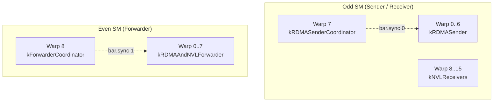
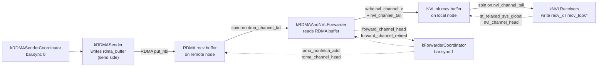
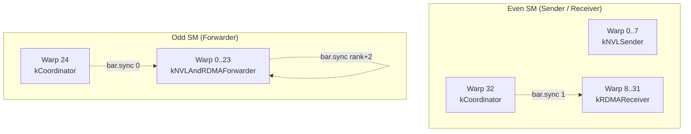

# Warp-Role Specialization in DeepEP

## 1. What Problem It Solves

In large-scale mixture-of-experts (MoE) training, a single token may be routed to multiple GPUs across both NVLink domains (intra-node) and RDMA domains (inter-node).  A naïve implementation would launch a sequence of separate kernels:

1. Copy tokens into an RDMA staging buffer.
2. Issue `put_nbi` to remote RDMA ranks.
3. Wait for arrival, copy into an NVLink staging buffer.
4. Issue NVLink transfers to local peers.
5. Wait again and write into the final output tensor.

Each kernel launch incurs device-level queueing overhead (tens of microseconds), and intermediate global-memory round-trips waste bandwidth and cache capacity.  DeepEP fuses all of these stages into **one kernel launch per communication direction** by partitioning the warps inside a block into distinct *roles*.  Each role is responsible for one pipeline stage, and they communicate through fast on-chip shared memory, warp-specialized barriers, and atomic RDMA operations rather than through slow device memory or separate launches.

The key benefits are:

* **Latency hiding**: while RDMA sender warps are waiting for network credits, forwarder warps can already be draining the RDMA buffer into NVLink buffers, and receiver warps can be copying finished tokens into the output tensor.
* **Reduced launch overhead**: a single grid launch replaces what would otherwise be 3–5 kernel launches.
* **Tight producer-consumer coupling**: shared-memory head/tail indices and warp-level barriers allow sub-microsecond hand-off between stages.

The cost of this design is significant implementation complexity: warps within the same block may execute divergent control flow for thousands of cycles, deadlock is possible if head/tail updates are reordered, and register pressure is high because the compiler must keep the live state of every role in the same block context.

---

## 2. Role Taxonomy

This section enumerates every warp role that exists in DeepEP.  The taxonomy is organized by file and kernel.

### 2.1 Internode Dispatch (`csrc/kernels/internode.cu`)

The dispatch kernel is launched with `num_channels * 2` blocks.  Within each channel, two SMs are paired: an **even-indexed SM acts as a forwarder** and an **odd-indexed SM acts as a sender/receiver**.  Inside each block the warps are statically partitioned by `warp_id`.

```cpp
// csrc/kernels/internode.cu:482
enum class WarpRole {
    kRDMASender,
    kRDMASenderCoordinator,
    kRDMAAndNVLForwarder,
    kForwarderCoordinator,
    kNVLReceivers
};
```

#### `kRDMASender` (warps `0 … kNumDispatchRDMASenderWarps-1` on odd SMs)

* **What it reads**: source token data (`x`, `x_scales`, `topk_idx`, `topk_weights`), the `is_token_in_rank` bit matrix, and the remote RDMA head index `rdma_channel_head` to know when buffer slots are free.
* **What it writes**: tokens into the **symmetric RDMA send buffer** (`rdma_channel_data.send_buffer(dst_rdma_rank)`) or, for the local RDMA rank, directly into the recv buffer.
* **Memory touched**:
  * Global read-only: `x`, `x_scales`, `topk_idx`, `topk_weights`, `is_token_in_rank`, `rdma_channel_head`
  * Global write: symmetric RDMA buffer (`rdma_buffer_ptr`)
  * Global write (metadata): `send_rdma_head` for later combine usage
* **Synchronization**:
  * Uses `sync_rdma_sender_smem()` (`barrier.sync 0`) to synchronize with the coordinator before starting the token loop and after finishing metadata setup.
  * Uses a per-RDMA-rank **spin-lock** (`acquire_lock` / `release_lock` on `rdma_send_channel_lock`) and a 32-bit **sliding window** (`rdma_send_channel_window`) to track which tokens have been fully copied into the buffer and are safe for the coordinator to issue over the network.

#### `kRDMASenderCoordinator` (exactly one warp on odd SMs)

* **What it reads**: `rdma_channel_prefix_matrix` to determine how many tokens each RDMA rank owns in this channel, and `rdma_send_channel_tail` / `rdma_send_channel_window` to know when sender warps have finished copying the next chunk.
* **What it writes**: issues `nvshmemi_ibgda_put_nbi_warp` RDMA operations for chunks of `num_max_rdma_chunked_send_tokens`, then advances the remote tail via `nvshmemi_ibgda_amo_nonfetch_add` on `rdma_channel_tail`.
* **Memory touched**:
  * Global read-only: `rdma_channel_prefix_matrix`
  * Shared read: `rdma_send_channel_lock`, `rdma_send_channel_tail`, `rdma_send_channel_window`
  * Global atomic write: `rdma_channel_tail` (remote side)
* **Synchronization**:
  * Synchronizes with senders via `barrier.sync 0`.
  * Polls `ld_acquire_cta(rdma_send_channel_tail)` to detect when at least `num_max_rdma_chunked_send_tokens` have been prepared by the sender warps.

#### `kRDMAAndNVLForwarder` (warps `0 … NUM_MAX_NVL_PEERS-1` on even SMs)

* **What it reads**: RDMA metadata (`rdma_channel_meta`) to learn how many tokens arrived from each RDMA rank for a specific destination NVL rank, then the actual token data from the **RDMA recv buffer** (`rdma_channel_data.recv_buffer(src_rdma_rank)`).
* **What it writes**: tokens into the **NVLink send buffer** (`nvl_channel_x.buffer()`) destined for `target_rank` (a specific NVL peer).  It also writes `nvl_channel_prefix_start` / `nvl_channel_prefix_end` so that the NVL receiver knows the token range.
* **Memory touched**:
  * Global read: `rdma_channel_meta.recv_buffer(lane_id)`, `rdma_channel_tail.buffer(src_rdma_rank)`, `rdma_channel_data.recv_buffer(...)`
  * Global write: `nvl_channel_prefix_start`, `nvl_channel_prefix_end`, `nvl_channel_tail`
  * Shared read/write: `forward_channel_head`, `forward_channel_retired` (used to communicate with the forwarder coordinator)
* **Synchronization**:
  * Synchronizes with the forwarder coordinator via `sync_forwarder_smem()` (`barrier.sync 1`).
  * Spins on `rdma_channel_tail` to detect newly arrived RDMA tokens.
  * Spins on `nvl_channel_head` to ensure the NVLink buffer has enough empty slots before writing.
  * Sets `forward_channel_retired[target_rank] = true` when done so the coordinator can stop polling.

#### `kForwarderCoordinator` (one warp on even SMs; extra warps exit immediately)

* **What it reads**: `forward_channel_head[dst_nvl_rank][target_rdma_rank]` (populated by forwarder warps) to find the minimum consumed RDMA slot across all NVL ranks.
* **What it writes**: issues `nvshmemi_ibgda_amo_nonfetch_add` on `rdma_channel_head` to release consumed RDMA buffer slots back to the sender side.
* **Memory touched**:
  * Shared read: `forward_channel_head`, `forward_channel_retired`
  * Global atomic write: `rdma_channel_head.buffer(rdma_rank)` (remote side)
* **Synchronization**:
  * Synchronizes with forwarders via `barrier.sync 1`.
  * Polls shared memory until all forwarders for a given RDMA rank have retired, then computes the minimum head and advances the remote head in chunks of `num_max_rdma_chunked_send_tokens`.

#### `kNVLReceivers` (warps `kNumDispatchRDMASenderWarps+1 …` on odd SMs)

* **What it reads**: `nvl_channel_prefix_start` / `nvl_channel_prefix_end` (written by forwarders) and token data from the **NVLink recv buffer** (`nvl_channel_x.buffer()`).
* **What it writes**: final output tensors `recv_x`, `recv_x_scales`, `recv_src_meta`, `recv_topk_idx`, `recv_topk_weights`.
* **Memory touched**:
  * Global read: `nvl_channel_prefix_start`, `nvl_channel_prefix_end`, `nvl_channel_tail`
  * Global write: `recv_x`, `recv_x_scales`, `recv_src_meta`, `recv_topk_idx`, `recv_topk_weights`
* **Synchronization**:
  * Spins on `nvl_channel_tail` to detect newly forwarded tokens.
  * After copying a batch, writes `nvl_channel_head` to release NVLink buffer slots.

---

### 2.2 Internode Combine (`csrc/kernels/internode.cu`)

The combine kernel is also launched with `num_channels * 2` blocks, but the SM parity is reversed: **odd-indexed SMs are forwarders** and **even-indexed SMs are senders/receivers**.

```cpp
// csrc/kernels/internode.cu:1741
enum class WarpRole { kNVLSender, kNVLAndRDMAForwarder, kRDMAReceiver, kCoordinator };
```

#### `kNVLSender` (warps `0 … NUM_MAX_NVL_PEERS-1` on even SMs)

* **What it reads**: `gbl_channel_prefix_matrix` to determine token ranges, `x`, `topk_weights`, `src_meta`.
* **What it writes**: token data into the **NVLink send buffer** (`nvl_channel_x.buffer()`) destined for `dst_nvl_rank`.
* **Memory touched**:
  * Global read-only: `x`, `topk_weights`, `src_meta`, `gbl_channel_prefix_matrix`
  * Global write: `nvl_channel_x`, `nvl_channel_tail`
* **Synchronization**:
  * Spins on `nvl_channel_head` to wait for buffer emptiness before each chunk.
  * Issues `st_release_sys_global(nvl_channel_tail.buffer() + lane_id, …)` after each chunk.

#### `kNVLAndRDMAForwarder` (warps `0 … kNumForwarders-1` on odd SMs)

* **What it reads**: NVLink recv buffer (`nvl_channel_x.buffer(src_nvl_rank)`) and `combined_nvl_head` to know which slots are valid.
* **What it writes**: reduced token data into the **RDMA send buffer** (`rdma_channel_data.send_buffer(dst_rdma_rank)`); for the local RDMA rank it writes directly into the recv buffer.
* **Memory touched**:
  * Global read: `nvl_channel_x`, `nvl_channel_tail`, `combined_nvl_head`
  * Global write: `rdma_channel_data`, `rdma_channel_tail` (via atomic AMO)
  * Shared read/write: `forwarder_nvl_head`, `forwarder_retired`
* **Synchronization**:
  * Synchronizes with the coordinator via `sync_forwarder_smem()` (`barrier.sync 0`).
  * If multiple warps cooperate on the same RDMA rank they use an additional per-rank `bar.sync` (`bar.sync dst_rdma_rank+2`).
  * After writing a chunk, issues RDMA `put_nbi` and advances `rdma_channel_tail` with `nvshmemi_ibgda_amo_nonfetch_add`.

#### `kRDMAReceiver` (warps `NUM_MAX_NVL_PEERS … kNumForwarders-1` on even SMs)

* **What it reads**: `combined_rdma_head` and the **RDMA recv buffer** (`rdma_channel_data.recv_buffer(src_rdma_rank)`).
* **What it writes**: the final reduced output `combined_x` and `combined_topk_weights`.
* **Memory touched**:
  * Global read: `combined_rdma_head`, `rdma_channel_tail`, `rdma_channel_data.recv_buffer(...)`
  * Global write: `combined_x`, `combined_topk_weights`
  * Shared read/write: `rdma_receiver_rdma_head`, `rdma_receiver_retired`
* **Synchronization**:
  * Synchronizes with the coordinator via `sync_rdma_receiver_smem()` (`barrier.sync 1`).
  * Spins on `rdma_channel_tail` until the expected head is available, then copies and reduces.

#### `kCoordinator` (one warp on every SM)

* **On even SMs**: reads `rdma_receiver_rdma_head` to find the minimum consumed slot across all receiver warps, then issues `nvshmemi_ibgda_amo_nonfetch_add` on `rdma_channel_head` to release RDMA buffer space.
* **On odd SMs**: reads `forwarder_nvl_head` to find the minimum consumed slot across all forwarder warps, then writes `nvl_channel_head` to release NVLink buffer space.
* **Memory touched**:
  * Shared read: `rdma_receiver_rdma_head` / `forwarder_nvl_head`, plus corresponding `retired` flags
  * Global atomic write: `rdma_channel_head` (even SM) or `nvl_channel_head` (odd SM)
* **Synchronization**:
  * Joins the appropriate `barrier.sync` (0 for forwarders, 1 for receivers).
  * Polls shared memory in a loop with `__nanosleep` until all warps have retired.

---

### 2.3 Intranode Dispatch & Combine (`csrc/kernels/intranode.cu`)

Intranode kernels do not use an explicit `WarpRole` enum; instead they use **SM-level even/odd specialization** combined with **thread-level rank partitioning**.

#### Dispatch: Even SM = Sender, Odd SM = Receiver

* **Even blocks (`is_sender = true`)**:
  * Threads are divided into `kNumRanks` groups (`num_threads_per_rank = kNumThreads / kNumRanks`).
  * Each group (and therefore each warp within the group) sends tokens to one destination rank.
  * Writes `channel_start_offset`, `channel_end_offset`, and `channel_tail_idx` into the **receiver-side buffer** (`buffer_ptrs[responsible_rank]`).
  * Copies token data into `channel_x_buffers`, `channel_src_idx_buffers`, `channel_topk_idx_buffers`, etc.
  * Synchronization: `bar.sync responsible_rank, num_threads_per_rank` after each chunk so that all warps serving the same rank agree on the new tail before `st_release_sys_global` is issued.

* **Odd blocks (`is_sender = false`)**:
  * Threads are similarly partitioned by rank.
  * One warp (the head updater, `thread_id < 32`) polls `channel_tail_idx` from all ranks and writes the minimum back to `channel_head_idx`.
  * The remaining warps read from `channel_x_buffers` and write into `recv_x`, `recv_x_scales`, `recv_topk_idx`, etc.
  * Synchronization:
    * `bar.sync responsible_rank, num_threads_per_rank` after each copy batch.
    * `warp_retired` and `warp_channel_head_idx` arrays in shared memory allow the head-updater warp to track progress of the worker warps.

#### Combine: Even SM = Sender, Odd SM = Receiver

The structure mirrors dispatch but in the reverse direction.

* **Even blocks (`is_sender = true`)**:
  * Warps are shuffled by rank (`send_rank_id = (responsible_channel + send_warp_id) % kNumRanks`).
  * Reads `x`, `topk_weights`, `src_idx`, copies into `channel_x_buffers`, `channel_src_idx_buffers`, `channel_topk_weights_buffers` on the receiver side, then releases via `channel_tail_idx`.
  * Synchronization: `bar.sync send_rank_id, num_threads_per_rank`.

* **Odd blocks (`is_sender = false`)**:
  * One warp (`thread_id < 32`) acts as the **queue-head updater**, reading `channel_tail_idx` and writing `channel_head_idx`.
  * The remaining warps reduce data from `channel_x_buffers` across all source ranks, add optional biases, and write to `recv_x` and `recv_topk_weights`.
  * Synchronization:
    * `bar.sync 0, kNumThreads` at startup.
    * `bar.sync responsible_rank, num_threads_per_rank` after each reduction batch.
    * `warp_channel_head_idx` and `warp_retired` shared-memory arrays coordinate between reduction warps and the head updater.

---

### 2.4 Internode Low-Latency Dispatch & Combine (`csrc/kernels/internode_ll.cu`)

Low-latency kernels use **warp groups** rather than per-warp roles.  A warp group is `num_warps_per_group` consecutive warps.  The grid is sized so that each SM owns one or more destination experts.

#### Low-Latency Dispatch (`dispatch` kernel, lines 129–463)

* **`warp_id < num_warps - 1` (sender/FP8-cast warps)**:
  * Reads `x` and `topk_idx`.
  * Optionally casts to FP8 (computes amax, scale, scale_inv).
  * Writes into `rdma_x` (a staging buffer), then issues IBGDA `put_nbi` directly to the remote `rdma_recv_x` buffer.
  * Synchronization: `bar.sync 1, num_threads` after the FP8 cast so that all sender warps in the block have finished writing `rdma_x` before any warp starts network sends.

* **`warp_id == num_warps - 1` (count/coordinator warp)**:
  * On `sm_id == 0`: cleans `next_clean` buffer and pre-notifies `atomic_finish_counter_per_expert`.
  * On every SM: reads `topk_idx` to compute per-expert token counts, writes into `shared_num_tokens_sent_per_expert`, then publishes the result with `atomic_add_release_global`.
  * After the block-level sync, the first sub-warp of each warp group (`sub_warp_id == 0 && lane_id == 0`) waits on `atomic_finish_counter_per_expert` and then sends the expert count to the remote rank via `nvshmemi_ibgda_amo_nonfetch_add` on `rdma_recv_count`.

* **Receiving phase (`LOW_LATENCY_DISPATCH_RECV`)**:
  * Warp groups are reassigned to receiving.
  * `sub_warp_id == 1 && lane_id == 0` polls `rdma_recv_count` until it becomes non-zero (the remote sender has published the count).
  * After a `bar.sync` inside the warp group, all warps copy from `rdma_recv_x` into `packed_recv_x`, `packed_recv_x_scales`, and `packed_recv_src_info`.

#### Low-Latency Combine (`combine` kernel, lines 715–1139)

* **Sending phase (`LOW_LATENCY_SEND_PHASE`)**:
  * Warp groups are mapped to destination experts (`responsible_expert_idx = sm_id * num_warp_groups + warp_group_id`).
  * Reads `x`, `topk_idx`, `topk_weights`, `layout_range`, `src_info`.
  * Uses **TMA pipelines** (3 stages, 1 prefetch) with m-barriers to stream data into `rdma_send_x` and then issue IBGDA `put_nbi`.
  * Optionally applies **LogFMT** compression on-the-fly.
  * `sub_warp_id == 1 && lane_id == 0` waits on `atomic_clean_flag` and then writes the finish flag to `rdma_recv_flag` via an atomic AMO.

* **Receiving phase (`LOW_LATENCY_COMBINE_RECV`)**:
  * A grid sync (`cg::this_grid().sync()`) ensures all sends are visible.
  * Warps are regrouped into **decode groups** (`num_groups`, `num_decode_warps`).
  * One warp per group acts as the **TMA load warp** (`decode_warp_idx == num_decode_warps`), loading from `rdma_recv_x` into shared memory and signaling `full_barriers`.
  * The remaining warps wait on `full_barriers`, decode (and de-quantize if LogFMT was used), multiply by `topk_weights`, accumulate, and finally write to `combined_x` via TMA stores.
  * Empty barriers (`empty_barriers`) are used to signal the TMA load warp that the previous stage buffer can be overwritten.

---

## 3. Synchronization Primitives

DeepEP relies on a layered synchronization stack that mixes PTX barriers, volatile shared-memory flags, m-barriers (for TMA), and RDMA atomic operations.

### 3.1 PTX `bar.sync` / `barrier.sync`

PTX barriers are used for **intra-block, cross-warp** synchronization because they are faster than `__syncthreads()` when only a subset of warps needs to rendezvous.

* **Internode dispatch**:
  * `barrier.sync 0, (kNumDispatchRDMASenderWarps + 1) * 32` — synchronizes RDMA sender warps with their coordinator (`csrc/kernels/internode.cu:563`).
  * `barrier.sync 1, (NUM_MAX_NVL_PEERS + 1) * 32` — synchronizes RDMA/NVL forwarders with the forwarder coordinator (`csrc/kernels/internode.cu:580`).

* **Internode combine**:
  * `barrier.sync 0, (kNumForwarders + 1) * 32` — forwarders + coordinator (`csrc/kernels/internode.cu:1952`).
  * `barrier.sync 1, (kNumRDMAReceivers + 1) * 32` — RDMA receivers + coordinator (`csrc/kernels/internode.cu:1953`).
  * `bar.sync dst_rdma_rank + 2, kNumWarpsPerForwarder * 32` — multiple warps cooperating on the same RDMA rank (`csrc/kernels/internode.cu:1966`).

* **Intranode**:
  * `bar.sync responsible_rank, num_threads_per_rank` — all warps serving the same destination rank rendezvous before releasing the tail or head (`csrc/kernels/intranode.cu:395`, `456`, `512`, `821`).

* **Low-latency**:
  * `bar.sync 1, num_threads` — FP8-cast warps wait for each other before sending (`csrc/kernels/internode_ll.cu:252`).
  * `bar.sync warp_group_id + 2, num_warps_per_group * 32` — warp-group internal sync during receive (`csrc/kernels/internode_ll.cu:420`).
  * `bar.sync warp_group_id + 1, num_warps_per_group * 32` — warp-group internal sync before sending the finish flag (`csrc/kernels/internode_ll.cu:918`).
  * `bar.sync group_idx + 1, (num_decode_warps + 1) * 32` — decode group sync during combine receive (`csrc/kernels/internode_ll.cu:1030`).

### 3.2 M-Barriers (`mbarrier`) for TMA

On SM90+ DeepEP uses Tensor Memory Accelerator (TMA) to move large hidden vectors between global memory and shared memory with very high throughput.  M-barriers are 64-bit shared-memory objects that act as arrival/expectation counters.

* **Initialization** (`csrc/kernels/utils.cuh`):
  ```cpp
  mbarrier_init(tma_mbarrier, 1);   // expect 1 arrival
  fence_barrier_init();
  ```
* **Arrival** (`mbarrier_arrive_and_expect_tx`) is issued by the elect-one thread after initiating `tma_load_1d`.
* **Wait** (`mbarrier_wait`) is called by all threads in the warp (or block) before consuming the loaded data.
* **Invalidation** (`mbarrier_inval`) is used at the end of the combine send phase to reclaim shared memory (`csrc/kernels/internode_ll.cu:937`).

### 3.3 Volatile Shared-Memory Flags

Because warps in different roles may diverge for thousands of cycles, DeepEP uses volatile shared-memory variables as **lightweight condition variables**.

| Flag | File | Purpose |
|------|------|---------|
| `rdma_send_channel_lock[kNumRDMARanks]` | `internode.cu:560` | Spin-lock protecting `tail` and `window` updates among RDMA sender warps. |
| `rdma_send_channel_tail[kNumRDMARanks]` | `internode.cu:561` | Latest released tail index (how many tokens are ready for the coordinator to send). |
| `rdma_send_channel_window[kNumRDMARanks]` | `internode.cu:562` | 32-bit bitmap indicating which of the next 32 tokens have been copied. |
| `forward_channel_head[NUM_MAX_NVL_PEERS][kNumRDMARanks]` | `internode.cu:578` | Minimum head index per RDMA rank reported by each forwarder warp. |
| `forward_channel_retired[NUM_MAX_NVL_PEERS]` | `internode.cu:579` | Boolean flag indicating that a forwarder warp has finished all work. |
| `forwarder_nvl_head[kNumForwarders][NUM_MAX_NVL_PEERS]` | `internode.cu:1948` | Same as above, but for combine forwarders. |
| `forwarder_retired[kNumForwarders]` | `internode.cu:1949` | Combine forwarder retirement flags. |
| `rdma_receiver_rdma_head[kNumRDMAReceivers][kNumRDMARanks]` | `internode.cu:1950` | Minimum consumed RDMA head per receiver warp. |
| `rdma_receiver_retired[kNumRDMAReceivers]` | `internode.cu:1951` | Combine RDMA receiver retirement flags. |
| `warp_channel_head_idx[num_recv_warps][kNumRanks]` | `intranode.cu:834` | Progress tracking for intranode reduction warps. |
| `warp_retired[num_recv_warps]` | `intranode.cu:836` | Intranode receiver warp retirement flags. |
| `shared_channel_tail_idx[kNumRanks]` | `intranode.cu:430` | Intranode dispatch shared tail for rendezvous. |

### 3.4 Atomic AMO Operations

Atomic operations are used for **inter-SM and inter-node** signaling because they provide release/acquire semantics across the NVLink/InfiniBand fabric.

* `nvshmemi_ibgda_amo_nonfetch_add(dst_ptr, delta, dst_rank, qp_idx, is_local)` — the workhorse for advancing remote head/tail indices without a round-trip read-modify-write.
  * Used in dispatch to advance `rdma_channel_tail` (`internode.cu:835`).
  * Used in combine to advance `rdma_channel_tail` (`internode.cu:2132`) and `rdma_channel_head` (`internode.cu:1045`, `2250`).
* `atomicAdd(sync_buffer_ptr + rank, -1)` / `st_release_sys_global` / `ld_acquire_sys_global` — used by the low-latency `barrier` function to implement a pairwise all-to-all counter barrier (`internode_ll.cu:36–68`).
* `atomicAdd(atomic_counter_per_expert + dst_expert_idx, 1)` — low-latency dispatch slot allocation (`internode_ll.cu:256`).
* `atomic_add_release_global(atomic_finish_counter_per_expert + i, ...)` — low-latency dispatch finish signaling (`internode_ll.cu:296`, `318`).
* `atomicExch(mask_buffer_ptr + dst_rank, 1)` — fault isolation when a timeout is detected (`internode_ll.cu:65`, `405`, `969`).

---

## 4. Mermaid Diagrams

### 4.1 Warp Roles Inside a Single Internode Dispatch Block



### 4.2 Data Flow and Synchronization Edges (Internode Dispatch)



### 4.3 Warp Roles Inside a Single Internode Combine Block



---

## 5. Design Evaluation

### 5.1 Advantages

1. **Zero-intermediate-launch latency**: because all stages live in the same grid, there is no device-global synchronization point between copying to the RDMA buffer and issuing the network operation, nor between receiving over RDMA and forwarding over NVLink.
2. **Fine-grained overlap**: sender warps can be packing the *next* token while coordinator warps are issuing the *previous* chunk over IB, and forwarder warps can be draining the RDMA buffer into NVLink buffers in parallel.
3. **Back-pressure without global memory round-trips**: head/tail indices live in shared memory (for intra-block roles) or are updated via 8-byte atomic AMOs (for inter-node roles), so producers stall exactly when the consumer buffer is full rather than polling a device-level semaphore.
4. **TMA-friendly**: by dedicating warps to either TMA load, TMA store, or reduction, the compiler can keep the TMA descriptor state in registers and pipeline across multiple stages.

### 5.2 Trade-offs

1. **Extreme control-flow divergence**: within a single block, some warps execute tight `while(true)` spin loops on network arrival while others perform heavy vector copies.  The compiler must preserve the live-state of *all* roles, which can increase register pressure and reduce occupancy.
2. **Shared-memory scarcity**: every role allocates disjoint shared-memory regions (TMA buffers, m-barriers, head/tail arrays, retirement flags).  On Hopper this is manageable (up to 228 KB), but it limits how many blocks can be co-resident and can prevent running at maximum theoretical occupancy.
3. **Deadlock risk**: because warps rendezvous on PTX barriers (`bar.sync`) with *exact* participant counts, any early-exit bug (e.g. a warp hitting a `return` before the barrier) hangs the entire SM.  The code guards against this with `EP_DEVICE_ASSERT` on warp counts, but the invariant is hard to verify statically.
4. **Debugging difficulty**: when a timeout fires, the printf identifies the channel, rank, and expected head/tail, but the actual failure could be anywhere in the producer chain (sender forgot to release a lock, coordinator missed a window bit, forwarder wrote the wrong tail, etc.).
5. **Sensitivity to chunk sizes**: `num_max_rdma_chunked_send_tokens`, `num_max_nvl_chunked_send_tokens`, and the buffer capacities must satisfy several inequality constraints (e.g. `num_max_nvl_chunked_recv_tokens_per_rdma - num_warps_per_forwarder >= num_max_nvl_chunked_send_tokens`).  Violating any of them silently breaks the back-pressure logic.

---

## 6. Code References

All line numbers refer to the state of the repository at the time of writing.

### 6.1 Internode Dispatch (`csrc/kernels/internode.cu`)

* `WarpRole` enum definition: **lines 482**.
* Role-dispatch lambda (`role_meta`): **lines 494–508**.
* `kRDMASender` body: **lines 582–752**.
* `kRDMASenderCoordinator` body: **lines 753–843**.
* `kRDMAAndNVLForwarder` body: **lines 844–1013**.
* `kForwarderCoordinator` body: **lines 1014–1055**.
* `kNVLReceivers` body: **lines 1056–1191**.
* RDMA sender shared-memory sync (`barrier.sync 0`): **line 563**.
* Forwarder shared-memory sync (`barrier.sync 1`): **line 580**.
* Shared-memory declarations (`rdma_send_channel_lock`, `rdma_send_channel_tail`, `rdma_send_channel_window`, `forward_channel_head`, `forward_channel_retired`): **lines 560–562, 578–579**.
* Launch configuration for dispatch: **lines 1248–1307** (host wrapper) and **line 1305** (`SETUP_LAUNCH_CONFIG`).

### 6.2 Internode Combine (`csrc/kernels/internode.cu`)

* `WarpRole` enum definition: **line 1741**.
* Role-dispatch lambda (`role_meta`): **lines 1757–1777**.
* `kNVLSender` body: **lines 1784–1922**.
* `kNVLAndRDMAForwarder` body: **lines 1955–2144**.
* `kRDMAReceiver` body: **lines 2145–2222**.
* `kCoordinator` body: **lines 2223–2274**.
* Forwarder shared-memory sync (`barrier.sync 0`): **line 1952**.
* Receiver shared-memory sync (`barrier.sync 1`): **line 1953**.
* Per-rank large-warp barrier (`bar.sync dst_rdma_rank+2`): **line 1966**.
* Shared-memory declarations (`forwarder_nvl_head`, `forwarder_retired`, `rdma_receiver_rdma_head`, `rdma_receiver_retired`): **lines 1948–1951**.
* Launch configuration for combine: **lines 2307–2372**.

### 6.3 Intranode Dispatch & Combine (`csrc/kernels/intranode.cu`)

* Dispatch kernel signature: **lines 197–532**.
* Even-SM sender logic (`is_sender = true`): **lines 295–398**.
* Odd-SM receiver logic (`is_sender = false`): **lines 399–519**.
* Receiver shared-memory structures (`warp_channel_head_idx`, `warp_retired`, `shared_channel_tail_idx`): **lines 430, 834–836**.
* Combine kernel signature: **lines 691–1032**.
* Even-SM combine sender logic: **lines 732–824**.
* Odd-SM combine receiver logic (head updater + reduction warps): **lines 825–1031**.
* Launch configurations: dispatch **lines 561–609**, combine **lines 1034–1099**.

### 6.4 Internode Low-Latency (`csrc/kernels/internode_ll.cu`)

* Low-latency dispatch kernel: **lines 129–463**.
  * FP8-cast / sender warps (`warp_id < num_warps - 1`): **lines 196–280**.
  * Count/coordinator warp (`warp_id == num_warps - 1`): **lines 281–321**.
  * Post-cast barrier (`bar.sync 1`): **line 252**.
  * Receiving phase (`LOW_LATENCY_DISPATCH_RECV`): **lines 354–462**.
  * Warp-group internal barrier during receive: **line 420**.
* Low-latency combine kernel: **lines 715–1139**.
  * Send-phase TMA pipeline and IBGDA issue: **lines 789–941**.
  * Pre-send grid sync (`cg::this_grid().sync()`): **line 360** (dispatch) and implied by phase design in combine.
  * Receive-phase decode-group re-assignment and TMA barrier sync: **lines 976–1138**.
  * Decode-group barrier (`bar.sync group_idx+1`): **line 1030**.
* Low-latency `barrier` function (pairwise counter barrier with masking): **lines 22–70**.
* `clean_low_latency_buffer` kernel: **lines 72–127**.
