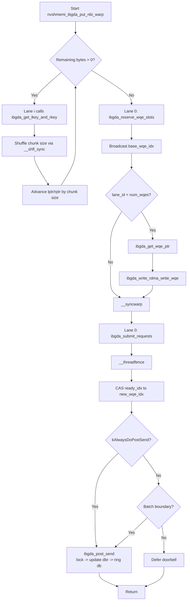
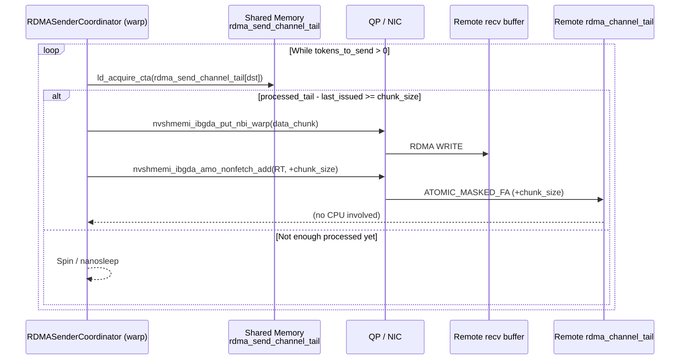

# GPU-Initiated RDMA (IBGDA) in DeepEP

DeepEP bypasses the CPU for all inter-node communication by programming Mellanox ConnectX NICs directly from CUDA kernels. This document explains how the GPU constructs Work Queue Entries (WQEs), rings doorbells, polls completions, and manages Queue Pair (QP) state without any host-side involvement. All references are to the current DeepEP source tree.

---

## 1. IBGDA Architecture Overview

IBGDA (InfiniBand GPU Direct Async) is the NVSHMEM transport path that exposes RDMA verbs to device code. In DeepEP the following abstractions are used:

| Abstraction | Role in DeepEP | Key Source Location |
|-------------|----------------|----------------------|
| **QP** (Queue Pair) | One or more RC QPs per peer + channel. The kernel selects a QP via `ibgda_get_rc(pe, qp_id)`. | `ibgda_device.cuh:93-96` |
| **WQE** (Work Queue Entry) | A 16-byte-aligned MLX5 control segment + address/data segments. Built inline in the kernel. | `ibgda_device.cuh:66, 180-213, 291-330` |
| **TX WQ** | Circular buffer of WQEs in device memory (`qp->tx_wq.wqe`). Indexed by a power-of-two mask. | `ibgda_device.cuh:266-270` |
| **CQ** (Completion Queue) | Hardware writes completion entries (`mlx5_cqe64`) here. The kernel spins on `wqe_counter` to implement `quiet`. | `ibgda_device.cuh:475-496` |
| **Doorbell Record (`dbrec`)** | A 32-bit host-endian word written by the GPU to tell the NIC the new producer index. | `ibgda_device.cuh:113-128` |
| **BlueFlame Doorbell (`bf`)** | The actual doorbell register mapped into the GPU's physical address space. Ringing it submits the WQEs. | `ibgda_device.cuh:130-136` |

### NVSHMEM Internals Mapping

When `Buffer::sync()` initializes the library, it calls `internode::init()` (`runtime.cu:49-73`), which in turn invokes `nvshmemx_init_attr(NVSHMEMX_INIT_WITH_UNIQUEID, &attr)`. NVSHMEM then:

1. Allocates a symmetric heap across all peers.
2. Registers the heap with the NIC (obtaining `lkey`/`rkey`).
3. Creates RC QPs and CQs, then exposes their doorbell addresses, WQE buffer addresses, and memory-key tables to the GPU via the `nvshmemi_ibgda_device_state_d` global symbol.

DeepEP accesses this state through `ibgda_get_state()` (`ibgda_device.cuh:74-76`). The state contains:

- **`globalmem.rcs`** – array of `nvshmemi_ibgda_device_qp_t` structs, one per remote PE and QP index.
- **`constmem.lkeys` / `constmem.rkeys`** – fast lookup tables for memory registration keys, indexed by `(offset >> log2_cumem_granularity)`.
- **`peer_heap_base_remote[pe]`** – the remote virtual address base used to resolve absolute RDMA target addresses.

In low-latency mode, `runtime.cu:56-69` additionally splits `NVSHMEM_TEAM_WORLD` into a strided sub-team (`cpu_rdma_team`) so that only one GPU per node participates in certain global barriers.

---

## 2. Core Primitives Deep Dive

### 2.1 `nvshmemi_ibgda_put_nbi_warp` — Warp-Level RDMA Write

**Signature** (`ibgda_device.cuh:345-391`):
```cuda
template <bool kAlwaysDoPostSend = false>
__device__ static __forceinline__ void nvshmemi_ibgda_put_nbi_warp(
    uint64_t req_rptr, uint64_t req_lptr, size_t bytes,
    int dst_pe, int qp_id, int lane_id, int message_idx);
```

**Behavior:**
1. **Key lookup & chunking.** Because the NVSHMEM heap may be registered in multiple physically contiguous chunks, a single transfer can cross a boundary. Each active lane calls `ibgda_get_lkey_and_rkey` (`ibgda_device.cuh:215-243`) to resolve the local key, remote key, and the maximum contiguous chunk size starting at the current offset. The chunk size is broadcast with `__shfl_sync` (`line 367`).
2. **Loop until drained.** The `while (remaining_bytes > 0)` loop (lines 360-372) consumes the transfer piece by piece. The implementation asserts `num_wqes <= 32` (line 373), which is safe because a warp has 32 lanes and each lane will emit at most one WQE.
3. **Reserve WQE slots.** Lane 0 atomically reserves `num_wqes` contiguous slots via `ibgda_reserve_wqe_slots` (`lines 261-264`) and broadcasts the base index.
4. **Per-lane WQE construction.** Every lane with `lane_id < num_wqes` fetches its own WQE pointer (`ibgda_get_wqe_ptr`, lines 266-270) and calls `ibgda_write_rdma_write_wqe` (`lines 291-330`) to fill the control, RDMA-address, and data segments.
5. **Submission.** Lane 0 calls `ibgda_submit_requests<kAlwaysDoPostSend>` (`lines 153-178`). This issues a `__threadfence()`, CAS-waits on the QP's `ready_idx` to ensure in-order WQE filling, and—if the template flag demands it—triggers `ibgda_post_send`.

> **Batching nuance:** Inside `ibgda_submit_requests` there is a `kNumRequestInBatch = 4` heuristic, but `kAlwaysDoPostSend == true` (used by almost all DeepEP call sites) forces an immediate doorbell, avoiding latency accumulation.

**Call sites:**
- `internode.cu:612-619` – dispatch kernel sends per-channel metadata to remote RDMA ranks.
- `internode.cu:818-824` – RDMA Sender Coordinator issues chunked token data.
- `internode_ll.cu:267` – low-latency dispatch sends FP8/BF16 token messages directly to the remote expert buffer.
- `internode_ll.cu:912` – low-latency combine sends LogFMT/BF16 data back to the source rank.

---

### 2.2 `nvshmemi_ibgda_amo_nonfetch_add` — Masked Atomic Add for Credits

**Signature** (`ibgda_device.cuh:438-456`):
```cuda
__device__ __forceinline__ void nvshmemi_ibgda_amo_nonfetch_add(
    void* rptr, const int& value, int pe, int qp_id,
    bool is_local_copy = false);
```

**Behavior:**
- If `is_local_copy == true` (i.e. the target rank is the local rank), the function degenerates to a plain `atomicAdd` on local memory and skips RDMA entirely.
- Otherwise it builds an **Atomic Masked Fetch-and-Add** WQE (`MLX5_OPCODE_ATOMIC_MASKED_FA` with op-mod `0x08000000`, lines 416, 421). The mask is set to zero (`field_boundary = 0`), making it a pure non-fetching add.
- The WQE is constructed by `ibgda_write_amo_add_wqe` (`lines 393-436`), which contains:
  - A control segment (`qpn_ds = 4` segments).
  - An RDMA-address segment pointing to the remote `rptr`.
  - An `ibgda_atomic_32_masked_fa_seg_t` with `add_data = value`.
  - A data segment describing the local inline bounce buffer (`qp->ibuf`).

**Usage in DeepEP:**
- **Dispatch:** `internode.cu:835-839` – the RDMA Sender Coordinator increments the remote `rdma_channel_tail` after each chunked `put_nbi_warp` so the remote forwarder knows new data is available.
- **Combine:** `internode.cu:1045-1049` – the ForwarderCoordinator increments the remote `rdma_channel_head` after a batch of tokens has been consumed, releasing send-buffer slots.
- **Low-latency dispatch:** `internode_ll.cu:337` – after all token sends for an expert are finished, the sender atomically writes `-num_tokens_sent - 1` to the remote `rdma_recv_count` buffer to signal completion.
- **Low-latency combine:** `internode_ll.cu:926` – a finishing flag (`+1`) is atomically added to `rdma_recv_flag` so the receiver can start reduction.

---

### 2.3 `nvshmemi_ibgda_quiet` — CQ Polling Synchronization

**Signature** (`ibgda_device.cuh:498-504`):
```cuda
__device__ static __forceinline__ void nvshmemi_ibgda_quiet(int dst_pe, int qp_id);
```

**Behavior:**
1. Reads the QP's current producer index (`prod_idx` for async-postsend mode, otherwise `ready_head`).
2. Calls `ibgda_poll_cq(qp->tx_wq.cq, prod_idx)` (`lines 475-496`).
3. `ibgda_poll_cq` spins on the hardware completion entry (`mlx5_cqe64*`) loaded with `ld_na_relaxed`. It extracts the big-endian `wqe_counter` and compares it against the target index, accounting for 16-bit wrap-around with the expression:
   ```cpp
   while ((uint16_t)(idx - wqe_counter - 2) < ncqes);
   ```
4. Once the condition is satisfied, it stores `idx` into `*cq->cons_idx` and issues `memory_fence_cta()`.

**Usage:**
- `internode.cu:135-139` – `notify_dispatch` quietens *all* QPs before rewriting the RDMA buffer, preventing in-flight writes from corrupting cleared memory.
- `internode_ll.cu:27-33` – the low-latency barrier quietens every QP before exchanging barrier counters.
- Any host code that needs a full fence across all in-flight RDMA operations can launch a kernel that calls this primitive per QP.

---

### 2.4 `nvshmemi_get_p2p_ptr` — NVLink Zero-Copy Short-Circuit

**Signature** (`ibgda_device.cuh:458-470`):
```cuda
__device__ __forceinline__ uint64_t nvshmemi_get_p2p_ptr(
    const uint64_t& ptr, const int& rank, const int& dst_rank);
```

**Behavior:**
- If `rank == dst_rank`, returns `ptr` immediately.
- Loads `nvshmemi_device_state_d.peer_heap_base_p2p[dst_rank]` via `__ldg`.
- If the peer base is `0`, P2P is not available (different nodes) and the caller must fall back to RDMA.
- Otherwise it returns `peer_base + (ptr - heap_base)`, which is the NVLink-mapped virtual address of the same physical allocation on the remote GPU.

**Usage:**
- `internode_ll.cu:264` – before issuing an IBGDA `put_nbi_warp`, dispatch checks whether the destination rank is on the same node; if `dst_p2p_ptr != 0`, it performs a direct warp-level `UNROLLED_WARP_COPY` via NVLink instead.
- `internode_ll.cu:847` – combine uses the same short-circuit to avoid RDMA round-trips when the source and destination share an NVLink domain.

---

## 3. WQE Construction Flow

A single RDMA write request traverses the following pipeline entirely on the GPU:

### Step 1 — Reserve Slots
```cuda
uint64_t base_wqe_idx = ibgda_reserve_wqe_slots(qp, num_wqes);
```
(`ibgda_device.cuh:261-264`)
- Performs `atomicAdd` on `qp->mvars.tx_wq.resv_head`.
- Returns the monotonically increasing base index for this warp's WQEs.

### Step 2 — Resolve WQE Virtual Address
```cuda
void* wqe_ptr = ibgda_get_wqe_ptr(qp, base_wqe_idx + lane_id);
```
(`ibgda_device.cuh:266-270`)
- Masks the index with `qp->tx_wq.nwqes - 1` (power-of-two ring buffer).
- Computes `wqe_base + (idx << MLX5_SEND_WQE_SHIFT)`.

### Step 3 — Write Payload Segments

For **normal** RDMA writes (`bytes > 4` or non-inline):
```cuda
ibgda_write_rdma_write_wqe(qp, my_laddr, my_lkey, my_raddr, my_rkey,
                           my_chunk_size, wqe_idx, &wqe_ptr);
```
(`ibgda_device.cuh:291-330`)

The function fills three contiguous 16-byte segments:
1. **Control segment** (`mlx5_wqe_ctrl_seg`)
   - `opmod_idx_opcode = (wqe_idx << 8) | MLX5_OPCODE_RDMA_WRITE`
   - `qpn_ds = (qp->qpn << 8) | 3` (3 segments total)
   - `fm_ce_se = MLX5_WQE_CTRL_CQ_UPDATE`
2. **RDMA address segment** (`mlx5_wqe_raddr_seg`)
   - `raddr = HtoBE64(remote_addr)`
   - `rkey = rkey`
3. **Data segment** (`mlx5_wqe_data_seg`)
   - `byte_count = HtoBE32(bytes)`
   - `lkey = lkey`
   - `addr = HtoBE64(local_addr)`

All stores use `st_na_relaxed` on `int4` vectors to bypass the L2 cache and avoid coalescing delays.

For **small inline** writes (e.g. 4-byte metadata or immediate values):
```cuda
ibgda_write_rdma_write_inl_wqe(qp, &value, raddr, rkey, wqe_idx,
                               &wqe_ptr, imm);
```
(`ibgda_device.cuh:180-213`)

This variant replaces the data segment with an inline-data segment (`mlx5_wqe_inl_data_seg`) and embeds the payload directly inside the WQE. It is used by `nvshmemi_ibgda_rma_p` (`lines 272-289`) for single-word remote stores.

### Step 4 — Ensure Ordering
```cuda
ibgda_submit_requests<true>(qp, base_wqe_idx, num_wqes, message_idx);
```
(`ibgda_device.cuh:153-178`)

- `__threadfence()` guarantees that the WQE writes are globally visible before the doorbell.
- A `while (atomicCAS(ready_idx, base_wqe_idx, new_wqe_idx) != base_wqe_idx)` spin ensures that earlier warps have already filled their slots, preserving WQE ordering in the ring buffer.

### Step 5 — Post Send (Doorbell)
```cuda
ibgda_post_send(qp, new_prod_idx);
```
(`ibgda_device.cuh:138-151`)

1. Acquires a per-QP spinlock (`post_send_lock`).
2. Atomically updates `prod_idx` with `atomicMax`.
3. If the index advanced, calls `ibgda_update_dbr` (`lines 113-128`) to write the low 16 bits of the new head to `dbrec` with release semantics.
4. Calls `ibgda_ring_db` (`lines 130-136`) to write the 64-bit doorbell to `bf`:
   ```cuda
   uint64_t ctrl = HtoBE32(prod_idx << 8) | (HtoBE32(qp->qpn << 8) << 32);
   st_na_release(bf_ptr, ctrl);
   ```
5. Releases the spinlock.

At this point the NIC DMAs the WQE from GPU memory, parses it, and initiates the RDMA transaction to the remote host.

---

## 4. Mermaid Diagrams

### 4.1 Flowchart of a Single `put_nbi_warp` Call



### 4.2 Sequence Diagram: RDMA Sender Coordinator (AMO + Put)

This diagram shows the interaction inside the `dispatch` kernel (`internode.cu:753-843`) where the **RDMASenderCoordinator** warp pushes a chunk of tokens and then advances the remote tail via an atomic add.



The remote **ForwarderCoordinator** (`internode.cu:844-1055`) eventually observes the updated `rdma_channel_tail` and begins forwarding data over NVLink to the local consumers.

---

## 5. Design Evaluation

### 5.1 Latency Advantages
- **Zero CPU crossings.** Every control message (token counts, tail updates, barrier counters) is emitted by a CUDA thread. There is no kernel→user→kernel transition.
- **Immediate doorbells.** `kAlwaysDoPostSend = true` guarantees that the NIC sees the WQE as soon as the warp finishes writing it, rather than waiting for a batch threshold.
- **P2P short-circuit.** `nvshmemi_get_p2p_ptr` bypasses the NIC entirely for intra-node peers, cutting latency to NVLink speeds.

### 5.2 Throughput Limits
- **WQE construction overhead.** Each RDMA write requires multiple PTX instructions (`prmt.b32`, `st.na.relaxed`) and register pressure for address/key resolution. At very small message sizes the GPU instruction throughput can become the bottleneck.
- **Chunking granularity.** `ibgda_get_lkey_and_rkey` may split a large transfer into several WQEs if it crosses a memory-registration boundary. While the warp can issue up to 32 WQEs in one call, excessive splitting reduces effective bandwidth.
- **QP-level lock contention.** `ibgda_post_send` uses a per-QP spinlock. When many warps share the same QP (e.g. all sender warps on the same channel), the lock serializes doorbell updates. DeepEP mitigates this by mapping different channels to different QPs (`channel_id` is passed as `qp_id`).

### 5.3 Complexity of Device-Side Networking
- **Direct MLX5 ABI dependency.** The code hard-codes segment sizes (`sizeof(ibgda_ctrl_seg_t) == 16`), opcode values (`MLX5_OPCODE_RDMA_WRITE`, `MLX5_OPCODE_ATOMIC_MASKED_FA`), and doorbell formats. Any NIC driver or firmware change that alters the ABI requires a rebuild.
- **Memory-key table management.** `lkey`/`rkey` lookups are performed on the GPU by indexing into `constmem`/`globalmem` tables derived from the NVSHMEM heap layout. The kernel assumes a fixed `log2_cumem_granularity` and a maximum of `NVSHMEMI_IBGDA_MAX_CONST_RKEYS` constant keys.
- **Completion polling is cooperative.** `ibgda_poll_cq` is not thread-safe against concurrent use of the same QP, so DeepEP carefully partitions QPs by warp/channel to avoid races.

### 5.4 Security / Robustness Trade-offs
- **Trusted device environment.** Because the GPU has raw access to doorbells and remote keys, a malicious or buggy kernel can corrupt arbitrary remote memory. There is no host-side access-control gate.
- **Best-effort failure detection.** Timeouts (`NUM_TIMEOUT_CYCLES`) and `trap()` abort the kernel if a remote peer stalls, but they do not provide automatic recovery. The low-latency path additionally maintains a `mask_buffer_ptr` (`internode_ll.cu:10-20`) to mark dead ranks and skip further communication.
- **GIL release for Python bindings.** `Buffer::internode_dispatch` (`deep_ep.cpp:952`) releases the Python GIL before launching the dispatch kernel because the CPU may busy-wait on `moe_recv_counter` for an unbounded amount of time. While this prevents blocking other Python threads, it also means that Python-level exception handling cannot intercept a GPU timeout until the host-side spin loop finishes or aborts.

---

## 6. Code References

### `csrc/kernels/ibgda_device.cuh`

| Function / Type | Lines | Signature |
|-----------------|-------|-----------|
| `HtoBE64` | 20-36 | `__device__ static __forceinline__ uint64_t HtoBE64(uint64_t x)` |
| `HtoBE32` | 38-47 | `__device__ static __forceinline__ uint32_t HtoBE32(uint32_t x)` |
| `HtoBE16` | 49-64 | `__device__ static __forceinline__ uint16_t HtoBE16(uint16_t x)` |
| `ibgda_ctrl_seg_t` | 66 | `typedef struct mlx5_wqe_ctrl_seg ... ibgda_ctrl_seg_t` |
| `ibgda_atomic_32_masked_fa_seg_t` | 68-72 | `typedef struct { uint32_t add_data; uint32_t field_boundary; uint64_t reserved; } ...` |
| `ibgda_get_state` | 74-76 | `__device__ static __forceinline__ nvshmemi_ibgda_device_state_t* ibgda_get_state()` |
| `ibgda_get_rc` | 93-96 | `__device__ static __forceinline__ nvshmemi_ibgda_device_qp_t* ibgda_get_rc(int pe, int id)` |
| `ibgda_lock_acquire` | 98-104 | `__device__ static __forceinline__ void ibgda_lock_acquire(int* lock)` |
| `ibgda_lock_release` | 106-111 | `__device__ static __forceinline__ void ibgda_lock_release(int* lock)` |
| `ibgda_update_dbr` | 113-128 | `__device__ static __forceinline__ void ibgda_update_dbr(..., uint32_t dbrec_head)` |
| `ibgda_ring_db` | 130-136 | `__device__ static __forceinline__ void ibgda_ring_db(..., uint16_t prod_idx)` |
| `ibgda_post_send` | 138-151 | `__device__ static __forceinline__ void ibgda_post_send(..., uint64_t new_prod_idx)` |
| `ibgda_submit_requests` | 153-178 | `template <bool kAlwaysDoPostSend> __device__ static __forceinline__ void ibgda_submit_requests(...)` |
| `ibgda_write_rdma_write_inl_wqe` | 180-213 | `__device__ static __forceinline__ void ibgda_write_rdma_write_inl_wqe(...)` |
| `ibgda_get_lkey_and_rkey` | 215-243 | `__device__ static __forceinline__ uint64_t ibgda_get_lkey_and_rkey(...)` |
| `ibgda_get_rkey` | 245-259 | `__device__ static __forceinline__ void ibgda_get_rkey(...)` |
| `ibgda_reserve_wqe_slots` | 261-264 | `__device__ static __forceinline__ uint64_t ibgda_reserve_wqe_slots(..., uint32_t num_wqes)` |
| `ibgda_get_wqe_ptr` | 266-270 | `__device__ static __forceinline__ void* ibgda_get_wqe_ptr(..., uint16_t wqe_idx)` |
| `nvshmemi_ibgda_rma_p` | 272-289 | `__device__ static __forceinline__ void nvshmemi_ibgda_rma_p(...)` |
| `ibgda_write_rdma_write_wqe` | 291-330 | `__device__ static __forceinline__ void ibgda_write_rdma_write_wqe(...)` |
| `ibgda_write_empty_recv_wqe` | 332-343 | `__device__ static __forceinline__ void ibgda_write_empty_recv_wqe(...)` |
| `nvshmemi_ibgda_put_nbi_warp` | 345-391 | `template <bool kAlwaysDoPostSend = false> __device__ static __forceinline__ void nvshmemi_ibgda_put_nbi_warp(...)` |
| `ibgda_write_amo_add_wqe` | 393-436 | `__device__ static __forceinline__ void ibgda_write_amo_add_wqe(...)` |
| `nvshmemi_ibgda_amo_nonfetch_add` | 438-456 | `__device__ __forceinline__ void nvshmemi_ibgda_amo_nonfetch_add(...)` |
| `nvshmemi_get_p2p_ptr` | 458-470 | `__device__ __forceinline__ uint64_t nvshmemi_get_p2p_ptr(...)` |
| `ibgda_poll_cq` | 475-496 | `__device__ static __forceinline__ void ibgda_poll_cq(...)` |
| `nvshmemi_ibgda_quiet` | 498-504 | `__device__ static __forceinline__ void nvshmemi_ibgda_quiet(int dst_pe, int qp_id)` |

### `csrc/kernels/runtime.cu`

| Symbol | Lines | Signature / Declaration |
|--------|-------|-------------------------|
| `cpu_rdma_team` | 38 | `nvshmem_team_t cpu_rdma_team = NVSHMEM_TEAM_INVALID;` |
| `get_unique_id` | 41-47 | `std::vector<uint8_t> get_unique_id()` |
| `init` | 49-73 | `int init(const std::vector<uint8_t>& root_unique_id_val, int rank, int num_ranks, bool low_latency_mode)` |
| `alloc` | 75-77 | `void* alloc(size_t size, size_t alignment)` |
| `free` | 79-81 | `void free(void* ptr)` |
| `barrier` | 83-85 | `void barrier()` |
| `finalize` | 87-93 | `void finalize()` |

### `csrc/kernels/internode.cu`

| Function | Lines | Signature |
|----------|-------|-----------|
| `notify_dispatch` (kernel) | 92-344 | `template <bool kLowLatencyMode, int kNumRDMARanks> __global__ void notify_dispatch(...)` |
| `notify_dispatch` (host) | 346-434 | `void notify_dispatch(...)` |
| `dispatch` (kernel) | 441-1208 | `template <bool kLowLatencyMode, int kNumRDMARanks, bool kCachedMode, ...> __global__ void __launch_bounds__(...) dispatch(...)` |
| `dispatch` (host) | 1210-1308 | `void dispatch(...)` |
| `cached_notify` (kernel) | 1310-1468 | `template <bool kLowLatencyMode, int kNumTMABytesPerWarp> __global__ void cached_notify(...)` |
| `cached_notify` (host) | 1470-1539 | `void cached_notify(...)` |
| `combine_token` | 1541-1704 | `template <int kNumRanks, bool kMaybeWithBias, ...> __device__ int combine_token(...)` |
| `combine` (kernel) | 1706-2276 | `template <bool kLowLatencyMode, int kNumRDMARanks, ...> __global__ void __launch_bounds__(...) combine(...)` |
| `combine` (host) | 2278-2373 | `void combine(...)` |

### `csrc/kernels/internode_ll.cu`

| Function | Lines | Signature |
|----------|-------|-----------|
| `is_rank_masked` | 10-20 | `template <bool use_warp_sync = false> __forceinline__ __device__ bool is_rank_masked(...)` |
| `barrier` | 22-70 | `template <int kNumThreads> __forceinline__ __device__ void barrier(...)` |
| `clean_low_latency_buffer` (kernel) | 72-102 | `template <int kNumThreads> __launch_bounds__(kNumThreads, 1) __global__ void clean_low_latency_buffer(...)` |
| `clean_low_latency_buffer` (host) | 104-127 | `void clean_low_latency_buffer(...)` |
| `dispatch` (kernel) | 129-463 | `template <bool kUseFP8, bool kUseUE8M0, int kHidden> __global__ __launch_bounds__(1024, 1) void dispatch(...)` |
| `dispatch` (host) | 465-555 | `void dispatch(...)` |
| `logfmt_encode` | 557-639 | `template <int kNumSendUnrolls> __forceinline__ __device__ int logfmt_encode(...)` |
| `logfmt_check_amaxmin` | 641-671 | `template <int kNumLanes, int kNumSendUnrolls, int kNumRecvUnrolls> __forceinline__ __device__ void logfmt_check_amaxmin(...)` |
| `decode_and_accumulate` | 673-713 | `template <int kNumRecvUnrolls> __forceinline__ __device__ void decode_and_accumulate(...)` |
| `combine` (kernel) | 715-1139 | `template <bool kUseLogFMT, int kHidden, ...> __global__ __launch_bounds__(1024, 1) void combine(...)` |
| `combine` (host) | 1141-1239 | `void combine(...)` |
| `query_mask_buffer` (kernel) | 1241-1250 | `template <int kNumThreads> __launch_bounds__(kNumThreads, 1) __global__ void query_mask_buffer(...)` |
| `query_mask_buffer` (host) | 1252-1257 | `void query_mask_buffer(...)` |
| `update_mask_buffer` (kernel) | 1259-1266 | `template <int kNumThreads> __launch_bounds__(kNumThreads, 1) __global__ void update_mask_buffer(...)` |
| `update_mask_buffer` (host) | 1268-1273 | `void update_mask_buffer(...)` |
| `clean_mask_buffer` (kernel) | 1275-1281 | `template <int kNumThreads> __launch_bounds__(kNumThreads, 1) __global__ void clean_mask_buffer(...)` |
| `clean_mask_buffer` (host) | 1283-1288 | `void clean_mask_buffer(...)` |

### `csrc/deep_ep.cpp`

| Function | Lines | Notes |
|----------|-------|-------|
| `Buffer::sync` | 326-391 | NVSHMEM initialization and symmetric heap allocation. |
| `Buffer::internode_dispatch` | 913-1308 | Host wrapper; **GIL released at line 952** before launching the dispatch kernel. |
| `Buffer::internode_combine` | 1310-1496 | Host wrapper for the high-throughput combine path. |
| `Buffer::low_latency_dispatch` | 1527-1672 | Low-latency dispatch host wrapper; launches `internode_ll::dispatch`. |
| `Buffer::low_latency_combine` | 1674-1796 | Low-latency combine host wrapper; launches `internode_ll::combine`. |

---

*End of document.*
