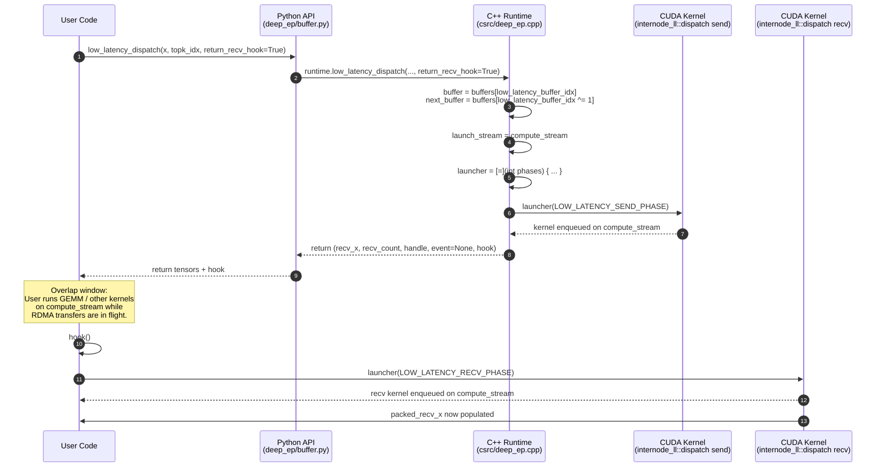

# Hook Mechanism in DeepEP Low-Latency Mode

## 1. Motivation

In large-scale Mixture-of-Experts (MoE) inference, the **dispatch** and **combine** steps of expert parallelism (EP) are pure communication operations. In the standard (high-throughput) path, a single kernel launch performs both the *send* (posting RDMA requests) and the *recv* (waiting for remote data and writing it into output tensors) back-to-back on the same stream. This creates two problems:

1. **Lost overlap opportunity**: While the network is in flight, the GPU compute stream is idle inside the recv-phase polling loop. Valuable FLOPs—such as the next GEMM or attention layer—could have been executed during this window.
2. **CUDA Graph incompatibility**: Any operation that requires the CPU to wait for a GPU signal (e.g., reading a byte from host-pinned memory to decide how many tokens arrived) breaks graph capture. The low-latency path must be fully **stream-ordered** to be captured inside a `torch.cuda.graph`.

DeepEP solves both issues by **splitting the low-latency kernels into two phases**:

* **Send phase** (`LOW_LATENCY_SEND_PHASE`) – issues all IBGDA `put` operations and finishes immediately.
* **Deferred recv phase** (`LOW_LATENCY_RECV_PHASE`) – polls remote completion counters and copies arrived data into `torch.Tensor` outputs.

When the user enables hook mode (`return_recv_hook=True`), the C++ layer launches *only* the send phase, returns a callable hook, and lets the user schedule arbitrary compute between the send and the later hook call. The hook, when invoked, launches the recv phase on the **same compute stream**, preserving CUDA Graph semantics because no CPU-GPU synchronization is ever required.

---

## 2. API Contract

### 2.1 Entry Points

The public Python surface lives in `deep_ep/buffer.py`:

* `Buffer.low_latency_dispatch(..., return_recv_hook: bool = False)` (line 548)
* `Buffer.low_latency_combine(..., return_recv_hook: bool = False)` (line 617)

Both forward the flag into the C++ runtime (`self.runtime.low_latency_dispatch` / `self.runtime.low_latency_combine`).

### 2.2 Return Values

| API | `return_recv_hook=False` | `return_recv_hook=True` |
|-----|--------------------------|-------------------------|
| `low_latency_dispatch` | 6-tuple `(recv_x, recv_count, handle, event, None)` (hook slot is `None`) | 7-tuple `(recv_x, recv_count, handle, event, hook)` |
| `low_latency_combine` | 2-tuple `(combined_x, event)` | 3-tuple `(combined_x, event, hook)` |

In C++, the exact signatures are:

```cpp
// csrc/deep_ep.cpp:1527-1544
std::tuple<torch::Tensor,
           std::optional<torch::Tensor>,
           torch::Tensor,
           torch::Tensor,
           torch::Tensor,
           std::optional<EventHandle>,
           std::optional<std::function<void()>>>
Buffer::low_latency_dispatch(..., bool async, bool return_recv_hook);

// csrc/deep_ep.cpp:1674-1687
std::tuple<torch::Tensor,
           std::optional<EventHandle>,
           std::optional<std::function<void()>>>
Buffer::low_latency_combine(..., bool async, bool return_recv_hook, ...);
```

The hook itself is a zero-argument lambda:

```cpp
// csrc/deep_ep.cpp:1664 (dispatch) / 1788 (combine)
std::optional<std::function<void()>> recv_hook = std::nullopt;
if (return_recv_hook)
    recv_hook = [=]() { launcher(LOW_LATENCY_RECV_PHASE); };
```

Exposed to Python, it behaves as `Callable[[], None]`.

### 2.3 Stream Semantics

* **`compute_stream`** – the currently active CUDA stream at the time of the Python call (`at::cuda::getCurrentCUDAStream()`).
* **`comm_stream`** – an internal background stream owned by the C++ `Buffer` object.

When `return_recv_hook=True`:

1. `launch_stream = compute_stream` (line 1582 / 1727).
2. The send kernel is enqueued on `compute_stream`.
3. **No** `stream_wait(comm_stream, compute_stream)` is issued.
4. The user can immediately enqueue independent kernels on `compute_stream`.
5. Calling `hook()` later enqueues the recv kernel on the **same** `compute_stream`.

When `return_recv_hook=False`:

1. `launch_stream = comm_stream`.
2. `stream_wait(launch_stream, compute_stream)` is called (line 1585 / 1730) to ensure all prior compute finishes before communication begins.
3. A single kernel with `phases = LOW_LATENCY_SEND_PHASE | LOW_LATENCY_RECV_PHASE` runs on `comm_stream`.
4. If `async=False`, `stream_wait(compute_stream, launch_stream)` blocks the compute stream until the full send+recv finishes.

**Mutual exclusion**: `async` and `return_recv_hook` cannot both be `True`. The code asserts:

```cpp
EP_HOST_ASSERT(not(async and return_recv_hook));  // line 1583 / 1728
```

This prevents ambiguous ownership of the returned `EventHandle` versus the deferred hook.

---

## 3. C++ Implementation Trace

This section walks through `Buffer::low_latency_dispatch` (`csrc/deep_ep.cpp:1527-1672`). The combine path (`csrc/deep_ep.cpp:1674-1796`) is structurally identical and referenced in parentheses.

### 3.1 Buffer Selection (Double Buffering)

```cpp
// csrc/deep_ep.cpp:1574-1577
LowLatencyLayout layout(rdma_buffer_ptr,
                        num_max_dispatch_tokens_per_rank,
                        hidden, num_ranks, num_experts);
EP_HOST_ASSERT(layout.total_bytes <= num_rdma_bytes);
auto buffer = layout.buffers[low_latency_buffer_idx];
auto next_buffer = layout.buffers[low_latency_buffer_idx ^= 1];
```

`LowLatencyLayout` (defined in `csrc/config.hpp:127-188`) carves the raw `rdma_buffer_ptr` into two symmetric `LowLatencyBuffer` slots: `buffers[0]` and `buffers[1]`. The member variable `low_latency_buffer_idx` (a persistent integer on the `Buffer` instance) is **toggled with XOR** (`^= 1`) every call. Consequently:

* `buffer`     – the slot used for *this* operation.
* `next_buffer` – the slot that will be used for the *next* operation.

This ping-pong scheme is what enforces the "at most 2 in-flight results" constraint documented in the Python docstrings.

### 3.2 Stream Selection

```cpp
// csrc/deep_ep.cpp:1581-1583
auto compute_stream = at::cuda::getCurrentCUDAStream();
auto launch_stream = return_recv_hook ? compute_stream : comm_stream;
EP_HOST_ASSERT(not(async and return_recv_hook));
```

The hook mode intentionally **hijacks the compute stream** so that the recv phase can be injected later without any cross-stream event overhead.

### 3.3 Output Tensor Allocation

```cpp
// csrc/deep_ep.cpp:1588-1593
auto packed_recv_x = torch::empty({num_local_experts,
                                   num_ranks * num_max_dispatch_tokens_per_rank,
                                   hidden}, ...);
auto packed_recv_src_info = torch::empty({...}, torch::kInt32);
auto packed_recv_layout_range = torch::empty({...}, torch::kInt64);
auto packed_recv_count = torch::empty({num_local_experts}, torch::kInt32);
```

These tensors are allocated on the **current stream** (the compute stream). Because the recv phase will run on the same stream when `return_recv_hook=True`, the write-after-allocate ordering is naturally preserved.

### 3.4 The `launcher` Lambda

```cpp
// csrc/deep_ep.cpp:1616-1648
auto next_clean_meta = next_buffer.clean_meta();
auto launcher = [=](int phases) {
    internode_ll::dispatch(
        packed_recv_x.data_ptr(),
        packed_recv_x_scales_ptr,
        packed_recv_src_info.data_ptr<int>(),
        packed_recv_layout_range.data_ptr<int64_t>(),
        packed_recv_count.data_ptr<int>(),
        mask_buffer_ptr,
        ...,
        buffer.dispatch_rdma_recv_data_buffer,
        buffer.dispatch_rdma_recv_count_buffer,
        buffer.dispatch_rdma_send_buffer,
        x.data_ptr(),
        topk_idx.data_ptr<topk_idx_t>(),
        next_clean_meta.first,    // int* next_clean
        next_clean_meta.second,   // int num_next_clean_int
        ...,
        launch_stream,
        phases);
};
```

Key observations:

* The lambda captures **everything by value** (`[=]`). This is safe because all captured objects are either `torch::Tensor` handles (reference-counted) or raw pointers extracted from them. The lambda outlives the function frame when it is stored inside `recv_hook`.
* `next_clean_meta` points to the *next* buffer’s signaling region. The kernel uses it to zero-initialize state that the *next* invocation will rely on.
* The `phases` argument is passed straight through to the device kernel.

### 3.5 Immediate Send Launch

```cpp
// csrc/deep_ep.cpp:1649
launcher(return_recv_hook ? LOW_LATENCY_SEND_PHASE
                          : (LOW_LATENCY_SEND_PHASE | LOW_LATENCY_RECV_PHASE));
```

* **Hook mode**: only `LOW_LATENCY_SEND_PHASE` (value `1`) is passed.
* **Synchronous mode**: both bits are OR’d (`1 | 2 = 3`), so a single kernel performs send and recv back-to-back.

### 3.6 Stream Synchronization & Event

```cpp
// csrc/deep_ep.cpp:1652-1659
std::optional<EventHandle> event;
if (async) {
    event = EventHandle(launch_stream);
} else if (not return_recv_hook) {
    stream_wait(compute_stream, launch_stream);
}
```

* In hook mode, `return_recv_hook` is `true`, so the `else if` branch is skipped. The compute stream is **not** blocked.
* In non-hook synchronous mode, the compute stream waits for `comm_stream` to finish the full send+recv.
* In async non-hook mode, an `EventHandle` is returned so the caller can decide when to wait.

### 3.7 Returning the Hook

```cpp
// csrc/deep_ep.cpp:1662-1664
std::optional<std::function<void()>> recv_hook = std::nullopt;
if (return_recv_hook)
    recv_hook = [=]() { launcher(LOW_LATENCY_RECV_PHASE); };
```

The hook is a closure that re-invokes the same `launcher` with `phases = LOW_LATENCY_RECV_PHASE` (value `2`). Because `launcher` captured `launch_stream` (the compute stream), the recv kernel is enqueued on exactly the stream the user expects.

### 3.8 Combine Path Equivalents

| Dispatch line | Combine line | Code snippet |
|---------------|--------------|--------------|
| 1576-1577 | 1721-1722 | `auto buffer = layout.buffers[low_latency_buffer_idx]; auto next_buffer = layout.buffers[low_latency_buffer_idx ^= 1];` |
| 1581-1582 | 1726-1727 | `auto compute_stream = at::cuda::getCurrentCUDAStream(); auto launch_stream = return_recv_hook ? compute_stream : comm_stream;` |
| 1617-1648 | 1745-1772 | `auto launcher = [=](int phases) { internode_ll::dispatch/combine(..., phases); };` |
| 1649 | 1773 | `launcher(return_recv_hook ? LOW_LATENCY_SEND_PHASE : (LOW_LATENCY_SEND_PHASE | LOW_LATENCY_RECV_PHASE));` |
| 1664 | 1788 | `recv_hook = [=]() { launcher(LOW_LATENCY_RECV_PHASE); };` |

---

## 4. Kernel-Side Phase Execution

The phase bitmask is defined in `csrc/kernels/configs.cuh`:

```cpp
// csrc/kernels/configs.cuh:20-21
#define LOW_LATENCY_SEND_PHASE 1
#define LOW_LATENCY_RECV_PHASE 2
```

### 4.1 `internode_ll::dispatch` Kernel

The device-side entry point begins at `csrc/kernels/internode_ll.cu:156` and the host launcher is at `csrc/kernels/internode_ll.cu:465`.

#### Send Phase (`LOW_LATENCY_SEND_PHASE`)

```cpp
// csrc/kernels/internode_ll.cu:190-191
if ((phases & LOW_LATENCY_SEND_PHASE) == 0)
    goto LOW_LATENCY_DISPATCH_RECV;
```

If the bit is clear, the entire send body is skipped.

Inside the send body:

1. **Token packaging** (warps `0` to `num_warps-2`): read `x` and `topk_idx`, optionally cast to FP8, and write the payload into the local RDMA send buffer `rdma_x`.
2. **IBGDA issue** (line 254-279): each warp calls `nvshmemi_ibgda_put_nbi_warp` (or a P2P `st_na_global` copy) to push the packaged message into the remote rank’s `rdma_recv_x`.
3. **Expert counting** (warp `num_warps-1`, line 281-321): counts how many tokens target each expert, stores the sum in shared memory, and updates atomic finish counters.
4. **Count signaling** (line 324-350): after all local sends for an expert are done, the responsible warp issues a negative-ack-style atomic add (`-num_tokens_sent - 1`) into the remote `rdma_recv_count` buffer so the receiver knows how many messages to expect.
5. **Cleanup** (line 343-349): reset the local atomic counters and zero out `packed_recv_count` for the upcoming recv phase.

#### Recv Phase (`LOW_LATENCY_RECV_PHASE`)

```cpp
// csrc/kernels/internode_ll.cu:354-356
LOW_LATENCY_DISPATCH_RECV:
if ((phases & LOW_LATENCY_RECV_PHASE) == 0)
    return;
```

If the bit is clear, the kernel exits immediately after the send phase.

**Grid-wide synchronization**:

```cpp
// csrc/kernels/internode_ll.cu:358-360
if (phases & LOW_LATENCY_SEND_PHASE)
    cg::this_grid().sync();
```

This `cg::this_grid().sync()` is **only executed when both phases run in the same kernel launch** (i.e., `phases == 3`). It guarantees that:

* Every SM has finished the send phase.
* All writes to `packed_recv_count` (zeroed at line 348-349) and remote counters are globally visible before any SM starts the recv phase.

In hook mode (`phases == 2` during the hook call), the send phase was already launched in a *previous* kernel, so the grid sync is skipped. The implicit stream ordering between the two separate kernel launches provides the necessary synchronization.

**Recv body** (lines 362-462):

1. **Poll arrival** (sub-warp 1, line 384-418): spin-read `rdma_recv_count[local_expert_idx * num_ranks + src_rank]` with `ld_acquire_sys_global` until it becomes non-zero (or a timeout fires).
2. **Allocate local slot** (line 409): `atomicAdd(packed_recv_count + local_expert_idx, num_recv_tokens)` reserves a contiguous region in `packed_recv_x`.
3. **Write metadata** (line 412): `recv_range[src_rank] = pack2<int, int64_t>(num_recv_tokens, recv_token_begin_idx);`.
4. **Copy data** (line 424-461): for each arrived token, copy the source index, the hidden vector, and (if FP8) the scaling factors from `rdma_recv_x` into the packed output tensors.

### 4.2 `internode_ll::combine` Kernel

The device-side entry point begins at `csrc/kernels/internode_ll.cu:739` and the host launcher is at `csrc/kernels/internode_ll.cu:1165`.

#### Send Phase (`LOW_LATENCY_SEND_PHASE`)

```cpp
// csrc/kernels/internode_ll.cu:774-775
if ((phases & LOW_LATENCY_SEND_PHASE) == 0)
    goto LOW_LATENCY_COMBINE_RECV;
```

Inside the send body:

1. **Clean next buffer** (lines 778-787): SM 0 zeroes `next_clean` and bumps `atomic_clean_flag`.
2. **TMA-prefetched copy** (lines 790-914): for each token destined to `dst_rank`, the warp loads the local expert’s output from `x` via `tma_load_1d`, optionally applies LogFMT encoding, and either copies directly to a P2P peer or into the local `rdma_send_x` staging buffer.
3. **Issue RDMA** (line 911-912): if the destination is not P2P-visible, `nvshmemi_ibgda_put_nbi_warp` pushes the staged buffer to the remote `rdma_recv_x`.
4. **Finishing flag** (lines 916-933): sub-warp 1 waits on `atomic_clean_flag`, then writes a `1` into the remote `rdma_recv_flag` via an atomic or release store. This signals to the remote rank that all data for this expert has arrived.

#### Recv Phase (`LOW_LATENCY_RECV_PHASE`)

```cpp
// csrc/kernels/internode_ll.cu:944-946
LOW_LATENCY_COMBINE_RECV:
if ((phases & LOW_LATENCY_RECV_PHASE) == 0)
    return;
```

**Grid-wide synchronization**:

```cpp
// csrc/kernels/internode_ll.cu:948-977
if (responsible_expert_idx < num_experts) {
    ... // poll rdma_recv_flag
}
cg::this_grid().sync();  // line 977
```

In the combine kernel, the grid sync is placed *after* the per-expert polling loop and *before* the warp-group reassignment. This ensures that **all** SMs have observed the arrival flags for their responsible experts before the kernel reorganizes its warps into TMA load / reduction groups. Like dispatch, this sync is only hit when `phases` includes both send and recv (single-kernel mode).

**Recv body** (lines 979+):

1. **Warp-group reassignment** (lines 979-988): the block re-partitions warps into `num_groups` reduction units.
2. **TMA load from `rdma_recv_x`** (lines 1036-1070): a dedicated "TMA warp" per group issues `tma_load_1d` for each `(token_idx, topk_idx)` pair.
3. **Weighted reduction** (lines 1073-1090): reduction warps multiply incoming vectors by `topk_weights` and accumulate into `combined_values`.
4. **Writeback** (later in the kernel, not shown in the excerpt): the accumulated result is cast back to `nv_bfloat16` and written into `combined_x`.

---

## 5. Mermaid Diagrams

### 5.1 Sequence Diagram: Full Hook Lifecycle



### 5.2 Flowchart: Phase Branching Inside the Kernel

```mermaid
flowchart TD
    Start([Kernel Entry]) --> CheckSend{phases &<br/>LOW_LATENCY_SEND_PHASE?}
    CheckSend -->|Yes| SendWork[Issue IBGDA puts,<br/>pack tokens,<br/>update counters]
    CheckSend -->|No| SkipSend
    SendWork --> SendDone
    SkipSend --> SendDone

    SendDone --> CheckRecv{phases &<br/>LOW_LATENCY_RECV_PHASE?}
    CheckRecv -->|Yes| NeedSync{phases &<br/>LOW_LATENCY_SEND_PHASE?}
    CheckRecv -->|No| Exit([Return])

    NeedSync -->|Yes| GridSync[cg::this_grid().sync()]
    NeedSync -->|No| SkipSync
    GridSync --> RecvWork
    SkipSync --> RecvWork

    RecvWork[Poll remote counters,<br/>copy arrived data<br/>into output tensors] --> Exit
```

---

## 6. Design Evaluation

### 6.1 Overlap Efficiency

The hook mechanism achieves **fine-grained overlap** at the kernel-launch boundary rather than at the stream-event boundary. The timeline looks like:

1. **Send kernel** (~tens of microseconds) issues all RDMA work and returns.
2. **Network flight** (~hundreds of microseconds, depending on scale) happens concurrently with user compute.
3. **Hook / recv kernel** (~tens of microseconds) polls and copies data.

Because the recv phase is deferred, the critical path of the forward pass is effectively `send_kernel_time + max(network_latency, compute_time_between_send_and_hook)`. In many configurations, the compute time dominates, making the communication almost free.

### 6.2 Double-Buffer Constraint

The low-latency path uses exactly **two buffers** (`buffers[2]` in `LowLatencyLayout`). The toggle at `low_latency_buffer_idx ^= 1` means:

* Operation *N* uses buffer `B`.
* Operation *N+1* uses buffer `B^1`.
* Operation *N+2* will reuse buffer `B`.

Therefore, you cannot have **more than two in-flight low-latency operations** whose results (or pending hooks) are still alive. For example, if you call `low_latency_dispatch` twice without calling the first hook, the second dispatch will overwrite the RDMA metadata that the first hook still needs, leading to silent data corruption. The Python documentation explicitly warns:

> *"Warning: as there are only two buffers, and the returned tensors reuse the buffer, you cannot hold more than 2 low-latency kernels' result tensors at a single moment."* (`deep_ep/buffer.py:559-560`)

### 6.3 Risks & Pitfalls

| Risk | Consequence | Mitigation |
|------|-------------|------------|
| **Calling hooks out of order** | Buffer reuse race: recv kernel reads from a buffer that has been repurposed by a later dispatch. | User must maintain FIFO or strict LIFO ordering of hooks. |
| **Never calling the hook** | Output tensors remain uninitialized; RDMA signaling state leaks into the next operation. | Always call the hook before the buffer is reused. |
| **Using `async=True` with hook** | Assertion failure (`EP_HOST_ASSERT(not(async and return_recv_hook))`). | These modes are mutually exclusive by design. |
| **Cross-stream events inside a CUDA Graph** | Graph capture fails because `cudaStreamWaitEvent` with host-side timing is not allowed in certain graph configurations. | Hook mode avoids cross-stream events entirely, staying on the compute stream. |

### 6.4 Comparison with Async `EventOverlap` Mode

DeepEP also supports an **async mode** (`async_finish=True`) for the non-hook path:

* The full send+recv kernel runs on `comm_stream`.
* An `EventHandle` is returned.
* The user later calls `event.current_stream_wait()` to block the compute stream.

**Hook mode is superior for graph capture and latency hiding** because:

1. **No cross-stream synchronization inside the graph region** – async mode requires at least one `cudaStreamWaitEvent`, which complicates graph capture.
2. **Overlap is deeper** – async mode only overlaps compute with the *entire* communication kernel. The hook mode overlaps compute with the *network flight time*, which is typically the largest component.
3. **Simpler scheduling** – the user does not need to manage an explicit event object; a plain Python callable is enough.

The trade-off is that hook mode imposes the double-buffer ordering discipline on the caller, whereas async mode is stateless aside from the event object.

---

## 7. Code References

### Phase Bitmask

* `csrc/kernels/configs.cuh:20` – `#define LOW_LATENCY_SEND_PHASE 1`
* `csrc/kernels/configs.cuh:21` – `#define LOW_LATENCY_RECV_PHASE 2`

### C++ Runtime (`csrc/deep_ep.cpp`)

#### `low_latency_dispatch`

| Line(s) | Symbol / Statement |
|---------|--------------------|
| 1527-1544 | `Buffer::low_latency_dispatch` signature |
| 1574 | `LowLatencyLayout layout(...)` |
| 1576-1577 | `auto buffer = layout.buffers[low_latency_buffer_idx]; auto next_buffer = layout.buffers[low_latency_buffer_idx ^= 1];` |
| 1581 | `auto compute_stream = at::cuda::getCurrentCUDAStream();` |
| 1582 | `auto launch_stream = return_recv_hook ? compute_stream : comm_stream;` |
| 1583 | `EP_HOST_ASSERT(not(async and return_recv_hook));` |
| 1585 | `stream_wait(launch_stream, compute_stream);` (non-hook only) |
| 1616-1648 | `auto launcher = [=](int phases) { internode_ll::dispatch(...); };` |
| 1649 | `launcher(return_recv_hook ? LOW_LATENCY_SEND_PHASE : (LOW_LATENCY_SEND_PHASE \| LOW_LATENCY_RECV_PHASE));` |
| 1652-1659 | Event creation and `stream_wait(compute_stream, launch_stream)` |
| 1662-1664 | `recv_hook = [=]() { launcher(LOW_LATENCY_RECV_PHASE); };` |
| 1667 | `return {packed_recv_x, packed_recv_x_scales, packed_recv_count, packed_recv_src_info, packed_recv_layout_range, event, recv_hook};` |

#### `low_latency_combine`

| Line(s) | Symbol / Statement |
|---------|--------------------|
| 1674-1687 | `Buffer::low_latency_combine` signature |
| 1721-1722 | `auto buffer = layout.buffers[low_latency_buffer_idx]; auto next_buffer = layout.buffers[low_latency_buffer_idx ^= 1];` |
| 1726-1727 | `compute_stream` and `launch_stream` selection |
| 1728 | `EP_HOST_ASSERT(not(async and return_recv_hook));` |
| 1745-1772 | `auto launcher = [=](int phases) { internode_ll::combine(...); };` |
| 1773 | Immediate `launcher(...)` call with phase mask |
| 1788 | `recv_hook = [=]() { launcher(LOW_LATENCY_RECV_PHASE); };` |
| 1791 | `return {combined_x, event, recv_hook};` |

### CUDA Kernels (`csrc/kernels/internode_ll.cu`)

#### Dispatch Kernel

| Line(s) | Description |
|---------|-------------|
| 156 | Device function signature: `..., int phases)` |
| 190-191 | `if ((phases & LOW_LATENCY_SEND_PHASE) == 0) goto LOW_LATENCY_DISPATCH_RECV;` |
| 254-279 | IBGDA send issue loop (`nvshmemi_ibgda_put_nbi_warp`) |
| 324-350 | Count signaling and cleanup (`atomic_add_release_global`, `atomic_counter_per_expert[...] = 0`) |
| 354 | Label `LOW_LATENCY_DISPATCH_RECV:` |
| 355-356 | `if ((phases & LOW_LATENCY_RECV_PHASE) == 0) return;` |
| 359-360 | `if (phases & LOW_LATENCY_SEND_PHASE) cg::this_grid().sync();` |
| 384-418 | Poll `rdma_recv_count` and timeout handling |
| 409 | `recv_token_begin_idx = atomicAdd(packed_recv_count + local_expert_idx, num_recv_tokens);` |
| 424-461 | Copy tokens, source info, and FP8 scales into output tensors |
| 465-555 | Host-side `dispatch` launcher (sets up workspace, warp counts, and `LAUNCH_KERNEL`) |

#### Combine Kernel

| Line(s) | Description |
|---------|-------------|
| 739 | Device function signature: `..., int phases, bool zero_copy)` |
| 774-775 | `if ((phases & LOW_LATENCY_SEND_PHASE) == 0) goto LOW_LATENCY_COMBINE_RECV;` |
| 778-787 | Next-buffer cleanup (`next_clean[i] = 0`, `atomic_add_release_global(atomic_clean_flag, num_experts)`) |
| 790-914 | TMA-prefetched send loop (`tma_load_and_arrive`, `tma_store_1d`) |
| 911-912 | `nvshmemi_ibgda_put_nbi_warp(dst_ptr, buf_ptr, num_send_bytes, ...)` |
| 916-933 | Finishing flag write (`rdma_recv_flag`) |
| 944 | Label `LOW_LATENCY_COMBINE_RECV:` |
| 945-946 | `if ((phases & LOW_LATENCY_RECV_PHASE) == 0) return;` |
| 949-975 | Poll `rdma_recv_flag` with timeout handling |
| 977 | `cg::this_grid().sync();` |
| 979-988 | Warp-group reassignment for reduction |
| 1036-1070 | TMA load warp (`tma_load_1d` from `rdma_recv_x`) |
| 1073-1090 | Reduction warps (weighted accumulation) |
| 1165-1239 | Host-side `combine` launcher (shared-memory sizing, `LAUNCH_KERNEL`) |

### Python API

| File | Line(s) | Description |
|------|---------|-------------|
| `deep_ep/buffer.py` | 548-614 | `low_latency_dispatch` Python wrapper and docstring |
| `deep_ep/buffer.py` | 617-661 | `low_latency_combine` Python wrapper and docstring |
| `deep_ep/buffer.py` | 559-560 | Double-buffer warning in docstring |
| `tests/test_low_latency.py` | 97-102 | Example usage: `hook() if return_recv_hook else event.current_stream_wait()` |
| `tests/test_low_latency.py` | 194-213 | `large_gemm_with_hook` benchmark showing compute-overlap pattern |

---

*End of document.*
