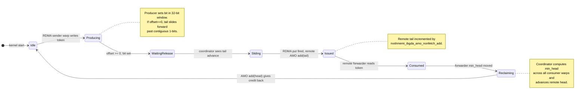
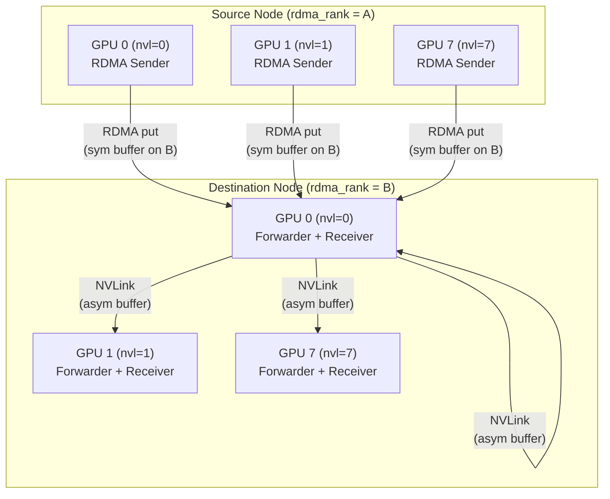
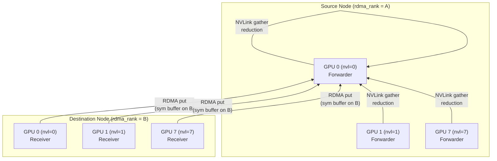

# Asymmetric-Domain Bandwidth Forwarding in DeepEP

This document describes the **normal internode communication path** in DeepEP, which implements a two-level forwarding strategy: RDMA across nodes and NVLink within nodes. This mode is explicitly **not** the low-latency path; it is optimized for **bandwidth efficiency** on clusters where RDMA bandwidth is substantially lower than NVLink bandwidth.

---

## 1. Problem Statement

In a typical multi-node GPU cluster, intra-node connectivity (NVLink) offers much higher bandwidth than inter-node connectivity (InfiniBand / RDMA). If every GPU were to issue direct all-to-all RDMA transfers to every other GPU, the aggregate traffic would be bottlenecked by the slow RDMA links many times over.

Consider an 8-GPU node:
- Each token may need to be sent to up to `topk` destinations, potentially spanning multiple nodes.
- A direct all-to-all RDMA pattern would require every local GPU to transmit duplicate copies of the same token to every remote GPU that needs it.
- With two-level forwarding, each local GPU sends **one copy** of the token to a **representative GPU** on the remote node (the RDMA peer). That representative then fans the token out to the correct local GPUs over the high-bandwidth NVLink fabric.

This reduces the RDMA bandwidth requirement from `O(num_nodes × num_gpus_per_node)` to `O(num_nodes)` per token.

---

## 2. Topology Roles

The codebase partitions the global rank space into two logical domains.

| Symbol | Meaning | Mapping |
|--------|---------|---------|
| `rdma_rank` | Node index in the RDMA cluster | `rank / NUM_MAX_NVL_PEERS` (line 123 of `internode.cu`) |
| `nvl_rank` | GPU index inside the local NVLink domain | `rank % NUM_MAX_NVL_PEERS` (line 123 of `internode.cu`) |
| `num_rdma_ranks` | Total number of nodes | `max(1, num_ranks / NUM_MAX_NVL_PEERS)` (line 166 of `deep_ep.cpp`) |
| `num_nvl_ranks` | Number of GPUs in the local node | `min(num_ranks, NUM_MAX_NVL_PEERS)` (line 166 of `deep_ep.cpp`) |

`NUM_MAX_NVL_PEERS` is statically asserted to be **8** (line 20 of `internode.cu`, line 55 of `deep_ep.hpp`). Therefore each RDMA rank (node) can host up to 8 NVLink peers.

In the normal internode path:
- NVSHMEM is initialized with one rank **per node**, not per GPU. The `nvshmem_rank` is `rdma_rank` and the team size is `num_rdma_ranks` (lines 362-364 of `deep_ep.cpp`).
- The RDMA buffer (`rdma_buffer_ptr`) is a symmetric NVSHMEM allocation visible across nodes.
- The NVLink buffer (`buffer_ptrs[nvl_rank]`) is a local CUDA allocation whose IPC handle is exchanged with the other 7 GPUs in the same node.

---

## 3. SourceMeta Deep Dive

`SourceMeta` is a tiny, fixed-size structure that travels with every token so that forwarders and receivers can route or combine the token **without re-parsing `topk_idx`**.

### 3.1 Exact Structure (8 bytes)

```cpp
// csrc/kernels/internode.cu, lines 17-34
struct SourceMeta {
    int src_rdma_rank;               // 4 bytes
    int is_token_in_nvl_rank_bits;   // 4 bytes (bitmask over up to 8 NVL peers)

    __device__ __forceinline__ SourceMeta(int rdma_rank, const bool* is_token_in_nvl_ranks) {
        src_rdma_rank = rdma_rank;
        is_token_in_nvl_rank_bits = is_token_in_nvl_ranks[0];
        #pragma unroll
        for (int i = 1; i < NUM_MAX_NVL_PEERS; ++i)
            is_token_in_nvl_rank_bits |= is_token_in_nvl_ranks[i] << i;
    }

    __device__ __forceinline__ bool is_token_in_nvl_rank(int nvl_rank) const {
        return (is_token_in_nvl_rank_bits >> nvl_rank) & 1;
    }
};
```

A static assert guarantees `sizeof(SourceMeta) % sizeof(int) == 0` (line 36) and the actual size is returned by `get_source_meta_bytes()` at line 38.

### 3.2 Encoding

During dispatch, the RDMA sender warp already knows which remote NVL ranks need this token (from the `is_token_in_rank` boolean matrix). Instead of copying the full `topk_idx` array into the RDMA metadata channel, it constructs a `SourceMeta` inline:

```cpp
// internode.cu, lines 666-678
SourceMeta src_meta;
// ...
if (lane_id == num_topk_ranks)
    src_meta = SourceMeta(rdma_rank, recv_is_token_in_nvl_ranks);
```

The `is_token_in_nvl_rank_bits` field is therefore a **compact Bloom-like bitmask** indicating which GPUs inside the target node should receive this token.

### 3.3 Decoding by the Forwarder

When the RDMA-and-NVL forwarder pulls a token out of the RDMA receive buffer, it inspects `src_meta.is_token_in_nvl_rank(dst_nvl_rank)` (line 966) to decide whether to forward the token into the NVLink channel for `dst_nvl_rank`. No access to the original `topk_idx` tensor is required.

---

## 4. Credit / Sliding Window Mechanism

Because the RDMA buffer is finite and shared among asynchronous producers and consumers, DeepEP implements a **32-slot credit window** per destination RDMA rank per channel.

### 4.1 Shared-Memory State (per SM / channel)

```cpp
// internode.cu, lines 560-562
__shared__ int rdma_send_channel_lock[kNumRDMARanks];
__shared__ int rdma_send_channel_tail[kNumRDMARanks];
__shared__ uint32_t rdma_send_channel_window[kNumRDMARanks];
```

- **`rdma_send_channel_tail`**: The latest tail index that has been released by the producer warps and is safe for the coordinator to issue over RDMA.
- **`rdma_send_channel_window`**: A 32-bit bitmap where bit `i` indicates whether the transaction at offset `i` from the current tail has been released.
- **`rdma_send_channel_lock`**: A per-rank spin-lock protecting the window and tail.

### 4.2 Window State Machine

```cpp
// internode.cu, lines 726-750
if (is_token_in_rank_uint64 != 0) {
    acquire_lock(rdma_send_channel_lock + lane_id);
    auto latest_tail = rdma_send_channel_tail[lane_id];
    auto offset = rdma_tail_idx - latest_tail;
    while (offset >= 32) {               // stall if window is full
        release_lock(...);
        acquire_lock(...);
        latest_tail = rdma_send_channel_tail[lane_id];
        offset = rdma_tail_idx - latest_tail;
    }

    auto window = rdma_send_channel_window[lane_id] | (1u << offset);
    if (offset == 0) {
        auto num_empty_slots = (~window) == 0 ? 32 : __ffs(~window) - 1;
        st_release_cta(rdma_send_channel_tail + lane_id, latest_tail + num_empty_slots);
        window >>= num_empty_slots;
    }
    rdma_send_channel_window[lane_id] = window;
    release_lock(rdma_send_channel_lock + lane_id);
}
```

**How it works:**
1. A producer warp (RDMA sender) computes the logical `rdma_tail_idx` for this token.
2. It acquires the lock and checks whether `offset = tail_idx - latest_tail` fits in `[0, 31]`.
3. It sets the corresponding bit in the 32-bit window.
4. If `offset == 0`, it greedily advances the tail past any contiguous set bits, shifting the window right by the same amount. This is the classic **sliding-window credit release**.
5. The coordinator warp later reads `rdma_send_channel_tail` (line 800) to know how many tokens it is allowed to issue.

### 4.3 Remote Tail Updates via AMO Add

After the coordinator issues an RDMA `put`, it updates the **remote** buffer's tail pointer with an atomic add:

```cpp
// internode.cu, lines 835-839 (dispatch) and 2132-2136 (combine)
nvshmemi_ibgda_amo_nonfetch_add(rdma_channel_tail.buffer(rdma_rank),
                                num_tokens_to_issue,
                                translate_dst_rdma_rank<kLowLatencyMode>(dst_rdma_rank, nvl_rank),
                                channel_id,
                                dst_rdma_rank == rdma_rank);
```

This tells the consumer (forwarder or receiver) that new data has arrived without requiring an extra round-trip message.

### 4.4 Head Reclamation by the Coordinator

On the consumer side, the **ForwarderCoordinator** (dispatch, lines 1014-1055) and the **non-forwarder coordinator** (combine, lines 2223-2273) periodically compute the minimum head index seen by all active warps and advance the remote head with another AMO add:

```cpp
// dispatch forwarder coordinator, lines 1045-1050
nvshmemi_ibgda_amo_nonfetch_add(rdma_channel_head.buffer(rdma_rank),
                                min_head - last_head,
                                translate_dst_rdma_rank<kLowLatencyMode>(lane_id, nvl_rank),
                                channel_id + num_channels,
                                lane_id == rdma_rank);
```

Advancing the head is what gives credit back to the sender, preventing the circular buffer from wrapping around and overwriting unread data.

### 4.5 Mermaid: 32-Slot Credit Window State Machine



---

## 5. End-to-End Dispatch Flow

Dispatch moves tokens from the local GPU to the final destination GPU, potentially on another node. The kernel is launched with `num_channels * 2` blocks, where `num_channels = num_sms / 2` (line 489 of `internode.cu`). Each channel uses two SMs:
- **Even SM (`is_forwarder == true`)**: RDMA-and-NVL forwarder + forwarder coordinator.
- **Odd SM (`is_forwarder == false`)**: RDMA sender warps + RDMA sender coordinator + NVL receiver warps.

### 5.1 Phase 0: Notification (`notify_dispatch`)

Before data moves, a separate kernel (`notify_dispatch`, lines 92-344) performs an all-to-all of token counts:

1. **Inter-node exchange**: SM 0 copies `num_tokens_per_rank`, `num_tokens_per_expert`, and `num_tokens_per_rdma_rank` into the symmetric RDMA send buffer and issues `nvshmemi_ibgda_put_nbi_warp` to every other RDMA rank (lines 168-189).
2. **Barrier**: `nvshmem_sync_with_same_gpu_idx` + intra-node `barrier_block` (lines 142-144, 198-200).
3. **Intra-node broadcast**: Each GPU reduces the received per-expert counts and then scatters the per-rank/per-expert counts into the NVLink asymmetric buffer (lines 248-256).
4. **Prefix sums**: SM 0 computes `recv_rdma_rank_prefix_sum` and `recv_gbl_rank_prefix_sum` (lines 233-274).
5. **Channel prefix matrices**: The remaining SMs (one per `dst_rdma_rank`) compute `rdma_channel_prefix_matrix` and `gbl_channel_prefix_matrix` by scanning `is_token_in_rank` (lines 294-343).

The host side (`internode_dispatch`, lines 1096-1167 of `deep_ep.cpp`) busy-waits on CPU-mapped counters (`moe_recv_counter`, `moe_recv_rdma_counter`, `moe_recv_expert_counter`) to learn exactly how many tokens will arrive, then allocates output tensors.

### 5.2 Phase 1: Data Dispatch (`dispatch` kernel)

#### 5.2.1 RDMA Sender Warps (`WarpRole::kRDMASender`, lines 582-752)

Each sender warp iterates over its subset of tokens. For every token:
1. It looks up the 64-bit `is_token_in_rank` mask for each RDMA destination (lines 629-634).
2. It waits until the remote RDMA buffer has free slots by polling `rdma_channel_head` (lines 643-658).
3. It writes the full token payload (`x`, `x_scales`, `SourceMeta`, `topk_idx`, `topk_weights`) into the **symmetric** RDMA staging buffer (lines 684-722).
4. It releases the transaction into the 32-slot credit window (lines 726-750).

#### 5.2.2 RDMA Sender Coordinator (`WarpRole::kRDMASenderCoordinator`, lines 753-843)

The coordinator polls `rdma_send_channel_tail` for each destination rank. When at least `num_max_rdma_chunked_send_tokens` have accumulated (or all tokens for that rank are ready), it:
1. Issues the actual `nvshmemi_ibgda_put_nbi_warp` RDMA transfer (lines 818-824).
2. Updates the local `last_issued_tail` and decrements the remaining count.
3. Fires an **AMO add** on the remote `rdma_channel_tail` (lines 835-839).

#### 5.2.3 RDMA-and-NVL Forwarder (`WarpRole::kRDMAAndNVLForwarder`, lines 844-1013)

Each forwarder warp is responsible for one `dst_nvl_rank`:
1. It polls the RDMA metadata channel (`rdma_channel_meta`) until negative sentinel values arrive, indicating the token range for this channel (lines 852-893).
2. It round-robins over source RDMA ranks, checking `rdma_channel_tail` to see if new tokens have arrived (lines 931-956).
3. For each token, it loads `SourceMeta` from the RDMA buffer (line 964) and checks `is_token_in_nvl_rank(dst_nvl_rank)`.
4. If the token is destined for its NVL rank, it copies the token via **TMA** (`tma_load_1d` → `tma_store_1d`) into the NVLink asymmetric buffer (lines 981-989).
5. After processing a chunk, it writes `nvl_channel_tail` to notify NVL receivers (line 1007) and records the consumed RDMA head in shared memory for the coordinator (line 1002).

#### 5.2.4 Forwarder Coordinator (`WarpRole::kForwarderCoordinator`, lines 1014-1055)

This warp monitors `forward_channel_head` shared memory. When all forwarders for a given source RDMA rank have advanced past a chunk boundary, it issues an **AMO add** on the remote `rdma_channel_head` to reclaim buffer space (lines 1045-1050).

#### 5.2.5 NVL Receivers (`WarpRole::kNVLReceivers`, lines 1056-1191)

Each receiver warp is responsible for one `src_nvl_rank`. It:
1. Reads the prefix start/end sent by the forwarder via `nvl_channel_prefix_start` / `nvl_channel_prefix_end` (lines 1070-1093).
2. Polls `nvl_channel_tail` to discover available tokens (lines 1100-1121).
3. Uses TMA to copy hidden data and scales into the final output tensor `recv_x` (lines 1136-1146).
4. Reads `SourceMeta.src_rdma_rank` to compute the exact output index (`recv_token_idx`) via prefix-sum broadcast (lines 1128-1130).
5. Writes `recv_topk_idx` and `recv_topk_weights`, translating global expert IDs to local expert IDs (lines 1169-1179).

### 5.3 Mermaid: Full Internode Dispatch Data Path



> **Note**: Every source GPU sends RDMA traffic **only to GPU 0** of the remote node (the NVSHMEM peer with the same `nvl_rank`). GPU 0 then fans out to the other 7 GPUs over NVLink. In practice each source GPU sends to its own `nvl_rank` counterpart on every remote node.

---

## 6. End-to-End Combine Flow

Combine is the inverse of dispatch: it gathers partial results from many GPUs, reduces them, and produces a single combined token per source token. The kernel layout is again `num_channels * 2` blocks, but the even/odd SM roles are slightly swapped compared to dispatch.

### 6.1 Phase 0: Barrier & Cached Notify (`cached_notify`)

`internode_combine` (lines 1310-1496 of `deep_ep.cpp`) first launches `cached_notify` (lines 1310-1539 of `internode.cu`), which:
1. Drains all outstanding NVSHMEM puts with `nvshmemi_ibgda_quiet` (lines 1341-1346).
2. Performs inter-node and intra-node barriers (lines 1350-1354).
3. Zeroes the RDMA and NVLink buffer metadata regions (lines 1357-1366).
4. For non-cached mode, post-processes `combined_rdma_head` and `combined_nvl_head` in reverse order so that `-1` entries are resolved to absolute head indices (lines 1377-1466).

### 6.2 Phase 1: Data Combine (`combine` kernel)

The kernel enumerates five warp roles (line 1741):

```cpp
enum class WarpRole { kNVLSender, kNVLAndRDMAForwarder, kRDMAReceiver, kCoordinator };
```

#### 6.2.1 NVL Senders (`WarpRole::kNVLSender`, lines 1784-1922)

Each NVL sender warp is assigned one `dst_nvl_rank`. It reads its token range from `gbl_channel_prefix_matrix` and iterates over tokens. For each token:
1. It loads the token's hidden data and `topk_weights` from the input tensor `x`.
2. It appends the `SourceMeta` and `topk_weights` to form a full message.
3. It issues `tma_store_1d` into the local NVLink asymmetric buffer (lines 1892-1912).
4. It updates `nvl_channel_tail` to notify the forwarder (lines 1918-1921).

#### 6.2.2 NVL-and-RDMA Forwarder (`WarpRole::kNVLAndRDMAForwarder`, lines 1955-2144)

Forwarder warps are grouped into "large warps" of `kNumWarpsPerForwarder` warps, one group per destination `rdma_rank`.

For each chunk of tokens destined to a remote RDMA rank:
1. It polls `rdma_channel_head` to ensure the RDMA send buffer has space (lines 2014-2036).
2. For every token in the chunk, it reads `combined_nvl_head` to learn which NVL source ranks contributed this token (lines 2042-2047).
3. It waits until those source NVL ranks have published the token (`nvl_channel_tail`, lines 2051-2072).
4. It calls `combine_token` (line 2086) to **reduce** the partial results from all contributing NVL ranks into a single token in the **RDMA symmetric send buffer**.
5. After the chunk is reduced, the last sub-warp issues the `nvshmemi_ibgda_put_nbi_warp` RDMA transfer (lines 2111-2127) and updates the remote tail via AMO add (lines 2132-2137).

#### 6.2.3 RDMA Receivers (`WarpRole::kRDMAReceiver`, lines 2145-2222)

These warps reside on the odd SMs (non-forwarder SMs). They:
1. Iterate over their share of `num_combined_tokens` (lines 2159-2160).
2. Read `combined_rdma_head` to know which source RDMA ranks hold partial results for this token (lines 2163-2166).
3. Poll `rdma_channel_tail` until those tokens arrive (lines 2171-2188).
4. Call `combine_token` (line 2202) to reduce partial results from all source RDMA ranks directly into the output tensor `combined_x`.

Because the receiver runs on the **final destination node**, this is where the actual reduction over the entire distributed token set finishes.

### 6.3 `combine_token` Reduction Logic

`combine_token` (lines 1541-1704) is a heavily templated device function that performs the actual element-wise reduction.

Key template parameters:
- `kNumRanks`: Number of source ranks to reduce over (e.g. `NUM_MAX_NVL_PEERS` or `kNumRDMARanks`).
- `kMaybeWithBias`: Whether to add bias vectors (used only by RDMA receivers, not forwarders).
- `dtype_t`: The element type (`nv_bfloat16` in normal mode).
- `kUseTMA`: Forwarders use TMA for the reduction; receivers use direct global loads (`kUseTMA = false`).

**Algorithm:**
1. It broadcasts `is_token_in_rank` and `head_idx` across the warp to build a list of active source ranks and their slot indices (lines 1569-1575).
2. For the hidden data, it iterates in `int4` chunks:
   - If `kUseTMA`, it prefetches the next stage via `tma_load_1d` into shared memory while computing the current stage in FP32 (lines 1596-1641).
   - Otherwise, it loads directly from global memory (`ld_nc_global`) into registers (lines 1647-1690).
3. It adds optional biases (`bias_0`, `bias_1`) in FP32 (lines 1650-1671).
4. It accumulates contributions from all active source ranks in FP32 (lines 1619-1625 and 1674-1681).
5. It casts the final FP32 values back to `dtype_t` and stores them to the output buffer.
6. Finally, it reduces `topk_weights` across all active ranks (lines 1694-1699).

```cpp
// Simplified signature (line 1550)
__device__ int combine_token(
    bool is_token_in_rank, int head_idx, int lane_id, int hidden_int4, int num_topk,
    int4* combined_row, float* combined_topk_weights,
    const int4* bias_0_int4, const int4* bias_1_int4,
    int num_max_recv_tokens,
    const GetAddrFn& get_addr_fn,      // resolves (src_rank, slot, hidden_idx) -> int4*
    const ReceiveTWFn& recv_tw_fn,     // resolves (src_rank, slot, topk_idx) -> float
    uint8_t* smem_ptr,
    uint32_t (&tma_phase)[kNumStages]
);
```

### 6.4 Mermaid: Combine Inverse Path



> **Note**: The arrows are drawn bottom-to-top to emphasize that combine is the **inverse** of dispatch. In practice:
> 1. NVL senders on Node B push partial results into NVLink buffers.
> 2. The forwarder on Node B gathers from all local NVL ranks, reduces them, and sends one RDMA message per chunk to Node A.
> 3. The RDMA receiver on Node A gathers from all source RDMA ranks and writes the final `combined_x`.

---

## 7. Memory Layout and Buffer Sizing

### 7.1 RDMA Buffer (Symmetric, NVSHMEM)

Allocated via `internode::alloc(num_rdma_bytes, NUM_BUFFER_ALIGNMENT_BYTES)` (line 368 of `deep_ep.cpp`).

The size hint is computed by `Config::get_rdma_buffer_size_hint` (lines 76-104 of `config.hpp`):

```cpp
size_t get_rdma_buffer_size_hint(int64_t hidden_bytes, int num_ranks) const {
    const int num_rdma_ranks = num_ranks / NUM_MAX_NVL_PEERS;
    const int num_channels = num_sms / 2;

    size_t num_bytes = 0;
    num_bytes += num_channels * num_rdma_ranks * (NUM_MAX_NVL_PEERS * 2 + 2) * 2 * sizeof(int);  // metadata
    num_bytes += num_channels * num_rdma_ranks * num_max_rdma_chunked_recv_tokens * hidden_bytes * 2;
    num_bytes += num_channels * num_rdma_ranks * num_max_rdma_chunked_recv_tokens * internode::get_source_meta_bytes() * 2;
    num_bytes += num_channels * num_rdma_ranks * num_max_rdma_chunked_recv_tokens * kNumMaxTopK * sizeof(topk_idx_t) * 2;
    num_bytes += num_channels * num_rdma_ranks * num_max_rdma_chunked_recv_tokens * kNumMaxTopK * sizeof(float) * 2;
    num_bytes += num_channels * num_rdma_ranks * num_max_rdma_chunked_recv_tokens * kNumMaxScales * sizeof(float) * 2;
    num_bytes += num_channels * num_rdma_ranks * num_max_rdma_chunked_recv_tokens * sizeof(int4) * 2;
    num_bytes = ((num_bytes + 127) / 128) * 128;
    return num_bytes;
}
```

The `* 2` factor accounts for the **symmetric** layout: every channel needs both a send side and a receive side for each RDMA peer.

### 7.2 NVLink Buffer (Asymmetric, IPC)

Allocated via CUDA malloc / fabric allocation (lines 182-184 of `deep_ep.cpp`).

The size hint is `Config::get_nvl_buffer_size_hint` (lines 52-74 of `config.hpp`):

```cpp
size_t get_nvl_buffer_size_hint(size_t hidden_bytes, int num_ranks) const {
    const auto num_rdma_ranks = std::max(num_ranks / NUM_MAX_NVL_PEERS, 1);
    const auto num_nvl_ranks = std::min(num_ranks, NUM_MAX_NVL_PEERS);
    const int num_channels = num_sms / 2;

    size_t num_bytes = 0;
    num_bytes += num_channels * num_nvl_ranks * (2 * num_rdma_ranks + 3) * sizeof(int);  // head/tail/prefix
    num_bytes += num_channels * num_nvl_ranks * num_max_nvl_chunked_recv_tokens * hidden_bytes;
    num_bytes += num_channels * num_nvl_ranks * num_max_nvl_chunked_recv_tokens * internode::get_source_meta_bytes();
    num_bytes += num_channels * num_nvl_ranks * num_max_nvl_chunked_recv_tokens * kNumMaxTopK * sizeof(topk_idx_t);
    num_bytes += num_channels * num_nvl_ranks * num_max_nvl_chunked_recv_tokens * kNumMaxTopK * sizeof(float);
    num_bytes += num_channels * num_nvl_ranks * num_max_nvl_chunked_recv_tokens * kNumMaxScales * sizeof(float);
    num_bytes = ((num_bytes + 127) / 128) * 128;
    return num_bytes;
}
```

There is no `* 2` here because the asymmetric buffer design multiplexes send and receive regions by rank: `rs_wr_buffer_ptr` is "read-for-senders, write-for-receivers" and `ws_rr_buffer_ptr` is the opposite (lines 530-537 of `internode.cu`).

---

## 8. Design Evaluation

### 8.1 Bandwidth Efficiency

**Win**: By funneling all internode traffic through one GPU per node pair (same `nvl_rank` to same `nvl_rank`), the RDMA link carries each token exactly once per remote node, regardless of how many GPUs inside that node need the token. NVLink—being 3-10× faster than RDMA—handles the intra-node fan-out with negligible bottleneck.

**Cost**: The forwarder GPU must read every incoming token from the RDMA buffer and rewrite it into the NVLink buffer. This consumes a small amount of NVLink bandwidth twice (read + write), but because NVLink bandwidth is abundant, the trade-off is overwhelmingly favorable.

### 8.2 Latency Cost of Two-Hop Forwarding

**Extra latency**: A token suffers:
1. RDMA transmission latency to the representative GPU.
2. Forwarder polling latency (waiting for `rdma_channel_tail` to advance).
3. NVLink transmission latency from the representative to the final GPU.

This makes the normal path unsuitable for latency-sensitive small-token workloads. The codebase therefore provides a separate **low-latency mode** (`low_latency_mode = true`) that bypasses the two-hop design and uses direct RDMA from every GPU to every GPU.

### 8.3 Memory Overhead

**Why both buffers are needed:**
- **RDMA buffer**: Required because NVSHMEM operates on symmetric allocations; the sender must have a local mirror of the remote buffer to issue `put` operations.
- **NVLink buffer**: Required because IPC memory is not symmetric across nodes and because the forwarder needs a staging area to replicate a single RDMA-received token to multiple local GPUs without re-fetching it over RDMA.

The total memory footprint is `get_rdma_buffer_size_hint() + get_nvl_buffer_size_hint()` per GPU. For large hidden dimensions and many channels, this can be hundreds of megabytes.

### 8.4 When to Prefer Normal Mode over Low-Latency Mode

| Criterion | Normal Mode | Low-Latency Mode |
|-----------|-------------|------------------|
| Token size | Large (e.g., > 1k hidden) | Small |
| Batch size | Large | Small |
| `topk` | High (many destinations) | Low |
| Latency sensitivity | Low | High |
| RDMA bandwidth | Scarce | Less critical |

The normal mode is the default whenever `num_ranks > NUM_MAX_NVL_PEERS` and `low_latency_mode == false` (line 233 of `deep_ep.cpp`).

---

## 9. Code References

### 9.1 Core Structs and Constants

| Item | File | Lines |
|------|------|-------|
| `NUM_MAX_NVL_PEERS == 8` | `csrc/kernels/internode.cu` | 20 |
| `struct SourceMeta` | `csrc/kernels/internode.cu` | 17-34 |
| `get_source_meta_bytes()` | `csrc/kernels/internode.cu` | 38-40 |
| `struct Buffer` (host-side) | `csrc/deep_ep.hpp` | 54-298 |
| `Config::get_nvl_buffer_size_hint` | `csrc/config.hpp` | 52-74 |
| `Config::get_rdma_buffer_size_hint` | `csrc/config.hpp` | 76-104 |

### 9.2 Host Entry Points

| Function | File | Lines |
|----------|------|-------|
| `Buffer::internode_dispatch` | `csrc/deep_ep.cpp` | 928-1308 |
| `Buffer::internode_combine` | `csrc/deep_ep.cpp` | 1310-1496 |
| Rank derivation (`rdma_rank`, `nvl_rank`) | `csrc/deep_ep.cpp` | 165-166 |
| NVSHMEM init (one rank per node) | `csrc/deep_ep.cpp` | 362-364 |
| RDMA buffer allocation | `csrc/deep_ep.cpp` | 368 |
| NVLink buffer allocation | `csrc/deep_ep.cpp` | 182-184 |

### 9.3 Device Kernels

| Kernel | File | Lines |
|--------|------|-------|
| `notify_dispatch` (template) | `csrc/kernels/internode.cu` | 92-344 |
| `notify_dispatch` (host launcher) | `csrc/kernels/internode.cu` | 346-434 |
| `dispatch` (template) | `csrc/kernels/internode.cu` | 441-1208 |
| `dispatch` (host launcher) | `csrc/kernels/internode.cu` | 1210-1308 |
| `cached_notify` (template) | `csrc/kernels/internode.cu` | 1310-1468 |
| `cached_notify` (host launcher) | `csrc/kernels/internode.cu` | 1470-1539 |
| `combine_token` (template) | `csrc/kernels/internode.cu` | 1541-1704 |
| `combine` (template) | `csrc/kernels/internode.cu` | 1706-2275 |
| `combine` (host launcher) | `csrc/kernels/internode.cu` | 2278-2373 |

### 9.4 Critical Code Snippets by Section

**SourceMeta construction in dispatch:**
```cpp
// csrc/kernels/internode.cu, lines 666-678
SourceMeta src_meta;
int num_topk_ranks = 0, topk_ranks[kNumTopkRDMARanks];
void* dst_send_buffers[kNumTopkRDMARanks];
#pragma unroll
for (int i = 0, slot_idx; i < kNumRDMARanks; ++i)
    if ((slot_idx = __shfl_sync(0xffffffff, rdma_tail_idx, i)) >= 0) {
        slot_idx = slot_idx % num_max_rdma_chunked_recv_tokens;
        topk_ranks[num_topk_ranks] = i;
        auto recv_is_token_in_rank_uint64 = broadcast(is_token_in_rank_uint64, i);
        auto recv_is_token_in_rank_values = reinterpret_cast<const bool*>(&recv_is_token_in_rank_uint64);
        if (lane_id == num_topk_ranks)
            src_meta = SourceMeta(rdma_rank, recv_is_token_in_rank_values);
        dst_send_buffers[num_topk_ranks++] =
            reinterpret_cast<uint8_t*>(broadcast(send_buffer, i)) + slot_idx * num_bytes_per_token;
    }
```

**32-slot credit window release:**
```cpp
// csrc/kernels/internode.cu, lines 740-746
auto window = rdma_send_channel_window[lane_id] | (1u << offset);
if (offset == 0) {
    auto num_empty_slots = (~window) == 0 ? 32 : __ffs(~window) - 1;
    st_release_cta(rdma_send_channel_tail + lane_id, latest_tail + num_empty_slots);
    window >>= num_empty_slots;
}
rdma_send_channel_window[lane_id] = window;
```

**Forwarder TMA copy from RDMA to NVLink:**
```cpp
// csrc/kernels/internode.cu, lines 981-989
if (elect_one_sync()) {
    tma_load_1d(tma_buffer, shifted, tma_mbarrier, num_bytes_per_token, false);
    mbarrier_arrive_and_expect_tx(tma_mbarrier, num_bytes_per_token);
}
__syncwarp();
mbarrier_wait(tma_mbarrier, tma_phase);
if (elect_one_sync())
    tma_store_1d(tma_buffer, dst_shifted, num_bytes_per_token);
```

**Combine forwarder calling `combine_token`:**
```cpp
// csrc/kernels/internode.cu, lines 2086-2100
combine_token<NUM_MAX_NVL_PEERS, false, dtype_t, NUM_MAX_NVL_PEERS, true, kNumStages, kNumTMALoadBytes>(
    expected_head >= 0,
    expected_head,
    lane_id,
    hidden_int4,
    num_topk,
    static_cast<int4*>(shifted),
    reinterpret_cast<float*>(static_cast<int8_t*>(shifted) + hidden_bytes + sizeof(SourceMeta)),
    nullptr, nullptr,
    num_max_nvl_chunked_recv_tokens_per_rdma,
    get_addr_fn,
    recv_tw_fn,
    smem_ptr,
    tma_phase);
```

**AMO add for remote tail update:**
```cpp
// csrc/kernels/internode.cu, lines 835-839
nvshmemi_ibgda_amo_nonfetch_add(rdma_channel_tail.buffer(rdma_rank),
                                num_tokens_to_issue,
                                translate_dst_rdma_rank<kLowLatencyMode>(dst_rdma_rank, nvl_rank),
                                channel_id,
                                dst_rdma_rank == rdma_rank);
```

---

*End of document.*
