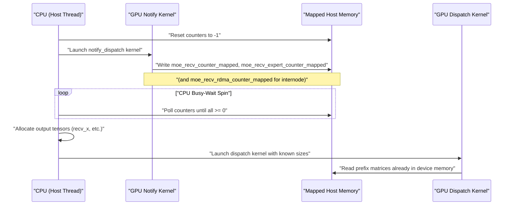
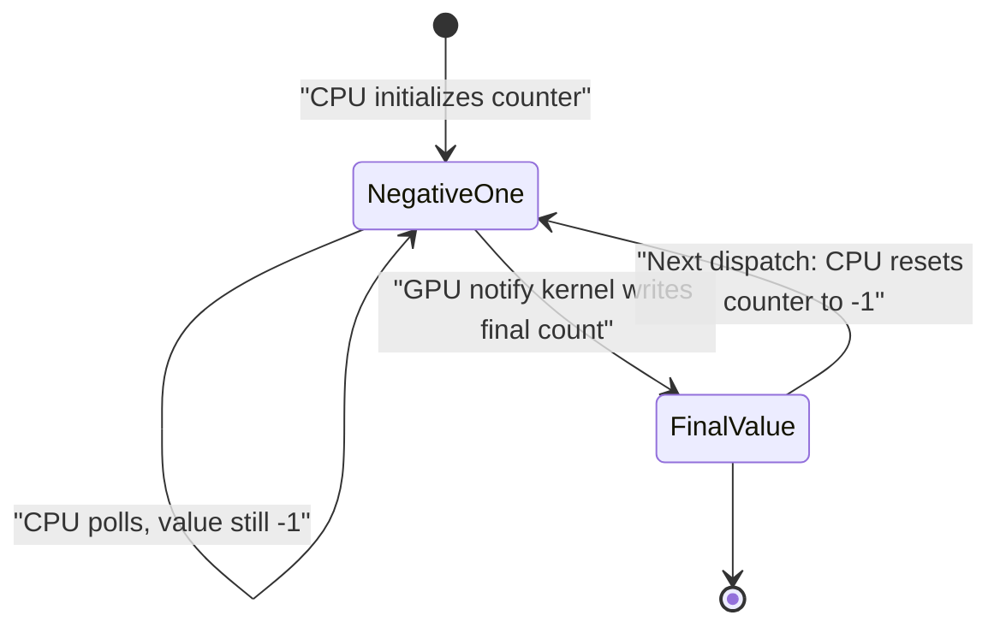

# CPU Busy-Wait Synchronization in DeepEP

This document explains how DeepEP synchronizes the host CPU with GPU kernels during the dispatch phase. Instead of using CUDA events, callbacks, or explicit `cudaMemcpyAsync` copies, DeepEP uses **pinned+mapped host memory** and **CPU spin-loops** to discover receive tensor sizes with the lowest possible latency.

---

## 1. The Fundamental Problem

In the non-cached dispatch path, the CPU must allocate output tensors (`recv_x`, `recv_topk_idx`, `recv_x_scales`, etc.) before it can launch the actual data-movement kernel. The sizes of these tensors depend on the exact number of tokens that each rank will receive, which is computed from the `topk_idx` and `is_token_in_rank` tensors that reside on the GPU.

Because tensor allocation is a host-side operation (via `torch::empty`), the CPU needs the receive counts **before** the dispatch kernel is enqueued. DeepEP solves this by launching a lightweight *notify* kernel that performs an all-to-all size exchange on the GPU, writes the final counts into host-mapped memory, and then lets the CPU poll that memory until the values arrive.

---

## 2. Memory Allocation Details

The mapped counters are allocated once in the `Buffer` constructor (`csrc/deep_ep.cpp`, lines 200–216):

```cpp
// MoE counter
CUDA_CHECK(cudaMallocHost(&moe_recv_counter, sizeof(int64_t), cudaHostAllocMapped));
CUDA_CHECK(cudaHostGetDevicePointer(&moe_recv_counter_mapped, const_cast<int*>(moe_recv_counter), 0));
*moe_recv_counter = -1;

// MoE expert-level counter
CUDA_CHECK(cudaMallocHost(&moe_recv_expert_counter, sizeof(int) * NUM_MAX_LOCAL_EXPERTS, cudaHostAllocMapped));
CUDA_CHECK(cudaHostGetDevicePointer(&moe_recv_expert_counter_mapped, const_cast<int*>(moe_recv_expert_counter), 0));
for (int i = 0; i < NUM_MAX_LOCAL_EXPERTS; ++i)
    moe_recv_expert_counter[i] = -1;

// MoE RDMA-level counter
if (num_rdma_ranks > 0) {
    CUDA_CHECK(cudaMallocHost(&moe_recv_rdma_counter, sizeof(int), cudaHostAllocMapped));
    CUDA_CHECK(cudaHostGetDevicePointer(&moe_recv_rdma_counter_mapped, const_cast<int*>(moe_recv_rdma_counter), 0));
    *moe_recv_rdma_counter = -1;
}
```

### Why `-1`?

`0` is a perfectly valid receive count (a rank may legitimately receive zero tokens). `-1` is therefore used as a sentinel value that means **"not yet written by the GPU"**. The CPU spin-loop terminates only when the counter becomes `>= 0`.

### Pinned + Mapped Memory

- `cudaMallocHost(..., cudaHostAllocMapped)` allocates **page-locked** host memory that is also mapped into the GPU virtual address space.
- `cudaHostGetDevicePointer` yields the GPU-visible pointer (e.g., `moe_recv_counter_mapped`).
- Writes from the GPU kernel go through the memory fabric (NVLink or PCIe) and become visible to the CPU cache-coherently, without requiring an explicit copy engine or a CUDA API call.

---

## 3. GPU Write Side

### 3.1 Intranode `notify_dispatch`

**Kernel:** `intranode::notify_dispatch` (`csrc/kernels/intranode.cu`, lines 12–113)  
**Host wrapper:** lines 115–159

The kernel performs an intra-node barrier, writes per-rank and per-expert token counts into the shared NVLink buffer, reduces them, and then writes the final results to the mapped counters:

1. **`moe_recv_counter_mapped`** — total tokens this rank will receive.
   ```cpp
   // line 63
   if (thread_id == rank)
       *moe_recv_counter_mapped = local_per_rank_buffer[(kNumRanks - 1) * kNumRanks + rank];
   ```
2. **`moe_recv_expert_counter_mapped`** — per-expert receive counts (rounded up to `expert_alignment`).
   ```cpp
   // line 74
   moe_recv_expert_counter_mapped[thread_id] = sum;
   ```

The `__syncthreads()` at line 76 ensures that the reductions are complete before any thread writes to mapped memory.

### 3.2 Internode `notify_dispatch`

**Kernel:** `internode::notify_dispatch` (`csrc/kernels/internode.cu`, lines 92–344)  
**Host wrapper:** lines 346–434

This kernel is more complex because it must exchange metadata across RDMA peers via NVSHMEM, then reduce NVLink-local counts. It writes three mapped counters (only when `num_worst_tokens == 0`):

1. **`moe_recv_rdma_counter_mapped`** — total tokens received from RDMA peers.
   ```cpp
   // lines 240–244
   if (num_worst_tokens == 0) {
       while (ld_volatile_global(moe_recv_rdma_counter_mapped) != -1)
           ;
       *moe_recv_rdma_counter_mapped = sum;
   }
   ```
2. **`moe_recv_counter_mapped`** — total global tokens received.
   ```cpp
   // lines 269–273
   if (num_worst_tokens == 0) {
       while (ld_volatile_global(moe_recv_counter_mapped) != -1)
           ;
       *moe_recv_counter_mapped = sum;
   }
   ```
3. **`moe_recv_expert_counter_mapped`** — per-expert receive counts.
   ```cpp
   // lines 281–285
   if (num_worst_tokens == 0) {
       while (ld_volatile_global(moe_recv_expert_counter_mapped + thread_id) != -1)
           ;
       moe_recv_expert_counter_mapped[thread_id] = sum;
   }
   ```

**Order of writes:** The kernel first issues RDMA `put` operations to exchange counts, barriers across the RDMA team, reduces expert counts in NVLink-shared memory, barriers again, and finally writes the mapped counters. The inner `while (ld_volatile_global(...) != -1)` loops are defensive: they guarantee that the CPU has already reset the counter to `-1` before the kernel overwrites it, preventing a stale value from persisting across multiple launches.

---

## 4. CPU Read Side

### 4.1 Intranode Spin-Loop

Location: `Buffer::intranode_dispatch` (`csrc/deep_ep.cpp`, lines 602–652)

Before launching the GPU kernel the CPU resets the counters:

```cpp
*moe_recv_counter = -1;
for (int i = 0; i < num_local_experts; ++i)
    moe_recv_expert_counter[i] = -1;
```

After `intranode::notify_dispatch` is launched, the CPU enters the following loop (lines 633–650):

```cpp
auto start_time = std::chrono::high_resolution_clock::now();
while (true) {
    // Read total count
    num_recv_tokens = static_cast<int>(*moe_recv_counter);

    // Read per-expert count
    bool ready = (num_recv_tokens >= 0);
    for (int i = 0; i < num_local_experts and ready; ++i)
        ready &= moe_recv_expert_counter[i] >= 0;

    if (ready)
        break;

    // Timeout check
    if (std::chrono::duration_cast<std::chrono::seconds>(
            std::chrono::high_resolution_clock::now() - start_time).count() >
        NUM_CPU_TIMEOUT_SECS)
        throw std::runtime_error("DeepEP error: CPU recv timeout");
}
num_recv_tokens_per_expert_list =
    std::vector<int>(moe_recv_expert_counter, moe_recv_expert_counter + num_local_experts);
```

### 4.2 Internode Spin-Loop

Location: `Buffer::internode_dispatch` (`csrc/deep_ep.cpp`, lines 1102–1166)

Counter reset (lines 1102–1105):

```cpp
*moe_recv_counter = -1, *moe_recv_rdma_counter = -1;
for (int i = 0; i < num_local_experts; ++i)
    moe_recv_expert_counter[i] = -1;
```

Spin-loop (lines 1142–1164):

```cpp
auto start_time = std::chrono::high_resolution_clock::now();
while (true) {
    // Read total count
    num_recv_tokens = static_cast<int>(*moe_recv_counter);
    num_rdma_recv_tokens = static_cast<int>(*moe_recv_rdma_counter);

    // Read per-expert count
    bool ready = (num_recv_tokens >= 0) and (num_rdma_recv_tokens >= 0);
    for (int i = 0; i < num_local_experts and ready; ++i)
        ready &= moe_recv_expert_counter[i] >= 0;

    if (ready)
        break;

    // Timeout check
    if (std::chrono::duration_cast<std::chrono::seconds>(
            std::chrono::high_resolution_clock::now() - start_time).count() >
        NUM_CPU_TIMEOUT_SECS) {
        printf("Global rank: %d, num_recv_tokens: %d, num_rdma_recv_tokens: %d\n",
               rank, num_recv_tokens, num_rdma_recv_tokens);
        for (int i = 0; i < num_local_experts; ++i)
            printf("moe_recv_expert_counter[%d]: %d\n", i, moe_recv_expert_counter[i]);
        throw std::runtime_error("DeepEP error: timeout (dispatch CPU)");
    }
}
num_recv_tokens_per_expert_list =
    std::vector<int>(moe_recv_expert_counter, moe_recv_expert_counter + num_local_experts);
```

### 4.3 Timeout Constants

Defined in `csrc/kernels/configs.cuh` (lines 12–18):

```cpp
#ifndef ENABLE_FAST_DEBUG
#define NUM_CPU_TIMEOUT_SECS 100
#define NUM_TIMEOUT_CYCLES 200000000000ull  // 200G cycles ~= 100s
#else
#define NUM_CPU_TIMEOUT_SECS 10
#define NUM_TIMEOUT_CYCLES 20000000000ull   // 20G cycles ~= 10s
#endif
```

- `NUM_CPU_TIMEOUT_SECS` governs the host-side spin-loop.
- `NUM_TIMEOUT_CYCLES` governs device-side spin-loops inside the dispatch/combine kernels.

On timeout, both paths throw a `std::runtime_error`. The internode path additionally prints the current counter values for debugging.

---

## 5. GIL Release

Only `internode_dispatch` explicitly releases the Python Global Interpreter Lock (GIL). This happens at the very top of the function (`csrc/deep_ep.cpp`, lines 949–952):

```cpp
#ifndef DISABLE_NVSHMEM
    // In dispatch, CPU will busy-wait until GPU receive tensor size metadata from other ranks, which can be quite long.
    // If users of DeepEP need to execute other Python code on other threads, such as KV transfer, their code will get stuck due to GIL
    // unless we release GIL here.
    pybind11::gil_scoped_release release;
```

### Why internode but not intranode?

- **Intranode** notify dispatch is extremely fast (microseconds) because it only touches NVLink-local shared memory. Holding the GIL for a few microseconds does not materially block other Python threads.
- **Internode** notify dispatch can take milliseconds because it involves RDMA network transfers and remote GPU reductions. If the CPU held the GIL while spinning, any other Python thread (e.g., a KV-cache transfer thread) would be starved, potentially causing deadlocks or severe performance degradation. Releasing the GIL allows those threads to execute concurrently while the DeepEP thread busy-waits on mapped memory.

---

## 6. Cached Path Optimization

Both dispatch functions expose a **cached mode**. When the caller supplies pre-computed prefix matrices and exact token counts, DeepEP bypasses the size-discovery phase entirely.

### Intranode Cached Path

`Buffer::intranode_dispatch` (`csrc/deep_ep.cpp`, lines 585–593):

```cpp
if (cached_mode) {
    num_recv_tokens = cached_num_recv_tokens;
    rank_prefix_matrix = cached_rank_prefix_matrix.value();
    channel_prefix_matrix = cached_channel_prefix_matrix.value();

    // Copy rank prefix matrix and clean flags
    intranode::cached_notify_dispatch(
        rank_prefix_matrix.data_ptr<int>(), num_memset_int,
        buffer_ptrs_gpu, barrier_signal_ptrs_gpu, rank, num_ranks, comm_stream);
}
```

### Internode Cached Path

`Buffer::internode_dispatch` (`csrc/deep_ep.cpp`, lines 1065–1095):

```cpp
if (cached_mode) {
    num_recv_tokens = cached_num_recv_tokens;
    num_rdma_recv_tokens = cached_num_rdma_recv_tokens;
    rdma_channel_prefix_matrix = cached_rdma_channel_prefix_matrix.value();
    recv_rdma_rank_prefix_sum = cached_recv_rdma_rank_prefix_sum.value();
    gbl_channel_prefix_matrix = cached_gbl_channel_prefix_matrix.value();
    recv_gbl_rank_prefix_sum = cached_recv_gbl_rank_prefix_sum.value();

    // Just a barrier and clean flags
    internode::cached_notify(hidden_int4, num_scales, num_topk, ...);
}
```

### Trade-off

| Aspect | Non-Cached | Cached |
|--------|------------|--------|
| **Latency** | Higher (spin + metadata exchange) | Lower (barrier only) |
| **CPU usage** | One core busy-waits | No spin-loop |
| **Correctness burden** | Automatic | Caller must guarantee cached matrices are still valid |

The cached path is ideal for training workloads where the MoE routing distribution is stable across many iterations. The user trades manual cache-consistency management for the lowest possible dispatch latency.

---

## 7. Mermaid Diagrams

### Sequence Diagram



### State Diagram of a Counter



---

## 8. Design Evaluation

### 8.1 Latency Comparison with Alternatives

| Mechanism | Additional Latency | Remarks |
|-----------|-------------------|---------|
| **`cudaEventSynchronize`** | ~1–10 µs (driver sleep + wakeup) | Requires a kernel-completion event; overshoots for a simple integer write. |
| **CUDA host callback** | ~1–10 µs (queueing + thread-pool dispatch) | Adds driver overhead and cannot return values directly to the spinning thread. |
| **`cudaMemcpyAsync` + `cudaStreamSynchronize`** | ~1–5 µs (copy engine + API call) | Wastes the asynchronous copy engine for a few integers. |
| **Mapped-memory spin-loop (DeepEP)** | Sub-µs to a few µs | Coherency-bound only; no driver call, no sleep, no copy engine. |

### 8.2 CPU Core Waste

The spin-loop consumes 100% of a host CPU core while waiting. In practice this is acceptable because:

1. The wait is short (microseconds for intranode, milliseconds for internode).
2. Training nodes are typically core-rich; dedicating one core per GPU for lower tail latency is a net win.
3. The alternative—sleeping and waking—introduces non-deterministic latency that can create pipeline bubbles in the training step, reducing model FLOPs utilization (MFU).

### 8.3 Robustness

- **Timeouts**: Both the CPU (`NUM_CPU_TIMEOUT_SECS`, default 100 s) and the GPU kernels (`NUM_TIMEOUT_CYCLES`, default 200 G cycles ≈ 100 s) have hard timeouts. If a network link fails, a peer GPU crashes, or a kernel deadlocks, the system throws an exception rather than hanging forever.
- **Sentinel value `-1`**: Prevents the CPU from misinterpreting a legitimate zero-count as an unwritten counter.
- **Defensive GPU writes**: The internode notify kernel explicitly waits for `-1` before overwriting, avoiding race conditions with a slow CPU reset.

### 8.4 Why This Is the Right Trade-off for Training

Training workloads are throughput-oriented but critically sensitive to the **tail latency** of the all-to-all dispatch/combine phases. Every microsecond of overhead in discovering the receive tensor sizes can delay the launch of the next forward pass. By using pinned+mapped memory and a CPU spin-loop, DeepEP minimizes the end-to-end latency of the metadata-exchange phase at the cost of burning a CPU core. This design aligns with the broader philosophy of high-performance GPU communication libraries: reduce synchronization overhead to the absolute minimum, and accept host-side resource consumption as the price.

---

## 9. Code References

| File | Lines | Description |
|------|-------|-------------|
| `csrc/deep_ep.cpp` | 200–216 | Allocation of `moe_recv_counter`, `moe_recv_expert_counter`, and `moe_recv_rdma_counter` with `cudaMallocHost(..., cudaHostAllocMapped)` and `cudaHostGetDevicePointer`. |
| `csrc/deep_ep.cpp` | 602–604 | Reset of intranode mapped counters to `-1`. |
| `csrc/deep_ep.cpp` | 606–622 | Launch of `intranode::notify_dispatch`. |
| `csrc/deep_ep.cpp` | 633–650 | CPU spin-loop inside `intranode_dispatch`. |
| `csrc/deep_ep.cpp` | 949–952 | `pybind11::gil_scoped_release` in `internode_dispatch`. |
| `csrc/deep_ep.cpp` | 1102–1105 | Reset of internode mapped counters to `-1`. |
| `csrc/deep_ep.cpp` | 1106–1135 | Launch of `internode::notify_dispatch`. |
| `csrc/deep_ep.cpp` | 1142–1164 | CPU spin-loop inside `internode_dispatch`. |
| `csrc/deep_ep.hpp` | 102–111 | Member declarations for `moe_recv_counter`, `moe_recv_counter_mapped`, `moe_recv_expert_counter`, `moe_recv_expert_counter_mapped`, `moe_recv_rdma_counter`, `moe_recv_rdma_counter_mapped`. |
| `csrc/kernels/intranode.cu` | 12–113 | `intranode::notify_dispatch` kernel. Write to `moe_recv_counter_mapped` at line 63; write to `moe_recv_expert_counter_mapped` at line 74. |
| `csrc/kernels/intranode.cu` | 115–159 | Host wrapper for `intranode::notify_dispatch`. |
| `csrc/kernels/internode.cu` | 92–344 | `internode::notify_dispatch` kernel. Writes to `moe_recv_rdma_counter_mapped` (lines 240–244), `moe_recv_counter_mapped` (lines 269–273), and `moe_recv_expert_counter_mapped` (lines 281–285). |
| `csrc/kernels/internode.cu` | 346–434 | Host wrapper for `internode::notify_dispatch`. |
| `csrc/kernels/configs.cuh` | 12–18 | Definitions of `NUM_CPU_TIMEOUT_SECS` and `NUM_TIMEOUT_CYCLES`. |
