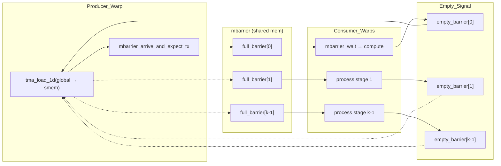
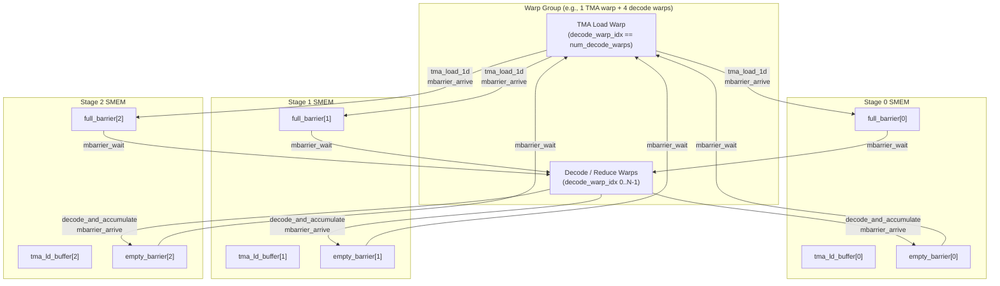

# TMA (Tensor Memory Accelerator) Multi-Stage Pipelines in DeepEP

DeepEP exploits NVIDIA Hopper's **Tensor Memory Accelerator (TMA)** to build asynchronous copy pipelines in its dispatch and combine kernels. TMA offloads 1-D/2-D bulk transfers from the SM register file to a dedicated hardware unit, reducing register pressure and enabling producer-consumer overlap via `mbarrier` synchronization. This document explains how DeepEP uses TMA and `mbarrier` across intranode, internode, and low-latency kernels.

---

## 1. TMA Primer

### What TMA Is

TMA is a hardware engine introduced in the Hopper (SM90) architecture that executes bulk asynchronous copies between global memory and shared memory. Instead of having every thread issue scalar `LDG`/`STG` instructions and occupy registers for the data in flight, a single warp leader calls:

```cpp
// Load from global to shared memory
tma_load_1d(smem_ptr, gmem_ptr, mbar_ptr, num_bytes);

// Store from shared memory to global memory
tma_store_1d(smem_ptr, gmem_ptr, num_bytes);
```

The actual byte movement is performed by the TMA unit, freeing the warp to perform other work.

### Register-Pressure Reduction

In the combine reducer, each warp must accumulate up to `kNumRanks` `int4` vectors per element. Without TMA, the warp would have to hold all loaded inputs in registers, perform the reduction, and then write the result back with `st_na_global`. By staging the final result into a small shared-memory buffer and issuing `tma_store_1d`, the compiler no longer needs to keep the store data in registers across the entire reduction loop. This is especially important when the kernel runs with high occupancy (e.g., 768 threads / 24 warps per SM).

### `mbarrier` Synchronization

Because TMA is asynchronous, consumer warps must wait for the copy to complete. DeepEP uses CUDA's `mbarrier` (memory barrier) objects placed in shared memory:

1. **Initialization**: one thread calls `mbarrier_init(mbar_ptr, arrive_count)` to set the expected number of arriving participants.
2. **Arrival with transaction size**: the producer thread calls `mbarrier_arrive_and_expect_tx(mbar_ptr, num_bytes)` after issuing `tma_load_1d`.
3. **Wait**: consumer threads call `mbarrier_wait(mbar_ptr, phase)` to block until the TMA copy completes.

This creates a classic **producer-consumer pipeline** where TMA loads run ahead of compute, hiding global-memory latency.

---

## 2. Intranode TMA Paths (`csrc/kernels/intranode.cu`)

### 2.1 Dispatch Receiver

In the intranode `dispatch` kernel, even-numbered SMs send tokens via `st_na_global` into a ring buffer, and odd-numbered SMs receive them. The receiver path uses TMA to move the token payload from the peer's ring buffer (global) into shared memory, then immediately to the local `recv_x` output buffer.

**Key code** (lines 279–293 and 465–476):

```cpp
// Per-warp SMEM allocation
extern __shared__ __align__(1024) uint8_t smem_buffer[];
auto tma_buffer = smem_buffer + (thread_id / 32) * kNumTMABytesPerWarp;
auto tma_mbarrier = reinterpret_cast<uint64_t*>(tma_buffer + half_hidden_bytes);
uint32_t tma_phase = 0;
if (elect_one_sync()) {
    mbarrier_init(tma_mbarrier, 1);
    fence_barrier_init();
}
__syncwarp();
```

Each warp receives `hidden_int4` `int4` words split into two halves:

```cpp
#pragma unroll
for (int i = 0; i < 2; ++i) {
    tma_store_wait<0>();
    if (elect_one_sync()) {
        tma_load_1d(tma_buffer, shifted_buffer_x_int4 + i * half_hidden_int4,
                    tma_mbarrier, half_hidden_bytes);
        mbarrier_arrive_and_expect_tx(tma_mbarrier, half_hidden_bytes);
        mbarrier_wait(tma_mbarrier, tma_phase);
        tma_store_1d(tma_buffer, shifted_recv_x_int4 + i * half_hidden_int4,
                     half_hidden_bytes, false);
    }
}
__syncwarp();
```

- **`kNumTMABytesPerWarp`**: `8192` bytes (line 563).
- **Pipeline depth**: effectively 1 stage per half-token (the load and store are back-to-back within the same warp).
- **Fallback**: when `DISABLE_SM90_FEATURES` is defined, the code falls back to `ld_nc_global` / `st_na_global` (line 478).

### 2.2 Combine Reducer

The intranode `combine` kernel (odd-numbered SMs) performs an all-to-all reduction over `kNumRanks` buffers, then writes the result. It uses an **8-stage TMA store pipeline** (`kNumStages = 8`, line 942) to flush register-accumulated results asynchronously.

**Shared-memory layout**:

```cpp
auto tma_buffer = smem_buffer + (thread_id / 32) * kNumTMABytesPerWarp;
```

with `kNumTMABytesPerWarp = 4096` (line 1057). Each stage holds `32 * sizeof(int4) = 512` bytes, so 8 stages consume 4096 bytes per warp.

**Reduction + TMA flush loop** (lines 944–1008):

```cpp
constexpr int kNumStages = 8;
#pragma unroll
for (int i = lane_id; i < hidden_int4; i += 32) {
    // ... compute `out_int4` in registers ...

    if (i < hidden_int4_aligned) {
        tma_store_wait<kNumStages - 1>();
        __syncwarp();

        auto tma_stage_idx = (i / 32) % kNumStages;
        reinterpret_cast<int4*>(tma_buffer)[tma_stage_idx * 32 + lane_id] = out_int4;

        tma_store_fence();
        __syncwarp();
        if (elect_one_sync()) {
            auto tma_bytes = min(32, hidden_int4 - i) * sizeof(int4);
            tma_store_1d(reinterpret_cast<int4*>(tma_buffer) + tma_stage_idx * 32,
                         recv_int4 + token_idx * hidden_int4 + i,
                         tma_bytes, false);
        }
        __syncwarp();
    } else {
        recv_int4[token_idx * hidden_int4 + i] = out_int4;
    }
}
```

- Up to 8 TMA stores are in flight concurrently (`kNumStages = 8`).
- `tma_store_wait<kNumStages - 1>()` ensures that at most 7 stores are outstanding before overwriting the next stage.
- The tail (elements after `hidden_int4_aligned`) is written directly with scalar stores because it may not fill a complete 512-byte stage.

---

## 3. Internode TMA Paths (`csrc/kernels/internode.cu`)

### 3.1 Dispatch Forwarder (RDMA → NVLink)

Internode dispatch uses a two-hop path: RDMA sender → local RDMA receive buffer → NVLink forwarder → peer NVLink buffer. The forwarder SM (even-numbered) acts as a TMA bridge.

**Setup** (lines 566–575):

```cpp
extern __shared__ __align__(1024) uint8_t smem_tma_buffer[];
auto tma_buffer = smem_tma_buffer + target_rank * kNumTMABytesPerWarp;
auto tma_mbarrier = reinterpret_cast<uint64_t*>(tma_buffer + num_bytes_per_token);
uint32_t tma_phase = 0;
if ((warp_role == WarpRole::kRDMAAndNVLForwarder or
     warp_role == WarpRole::kNVLReceivers) and elect_one_sync()) {
    mbarrier_init(tma_mbarrier, 1);
    fence_barrier_init();
    EP_DEVICE_ASSERT(num_bytes_per_token + sizeof(uint64_t) <= kNumTMABytesPerWarp);
}
__syncwarp();
```

with `kNumTMABytesPerWarp = 16384` (line 1249).

**Forwarder TMA loop** (lines 981–989):

```cpp
if (elect_one_sync()) {
    tma_load_1d(tma_buffer, shifted, tma_mbarrier,
                num_bytes_per_token, false);
    mbarrier_arrive_and_expect_tx(tma_mbarrier, num_bytes_per_token);
}
__syncwarp();
mbarrier_wait(tma_mbarrier, tma_phase);
if (elect_one_sync())
    tma_store_1d(tma_buffer, dst_shifted, num_bytes_per_token);
__syncwarp();
```

- `shifted` points into the RDMA receive buffer (global).
- `dst_shifted` points into the NVLink peer buffer (global).
- A trailing `tma_store_wait<0>()` (line 996) ensures the store is visible before the tail index is released.

### 3.2 NVLink Receiver (Peer Buffer → `recv_x`)

The NVL receiver path (odd-numbered SMs) also uses TMA to copy the full token (`hidden_bytes` + optional `scale_bytes`) from the NVLink buffer into the final output tensors (lines 1137–1145):

```cpp
if (elect_one_sync()) {
    tma_load_1d(tma_buffer, shifted, tma_mbarrier, tma_load_bytes);
    mbarrier_arrive_and_expect_tx(tma_mbarrier, tma_load_bytes);
}
__syncwarp();
mbarrier_wait(tma_mbarrier, tma_phase);
if (elect_one_sync()) {
    tma_store_1d(tma_buffer, recv_x + recv_token_idx * hidden_int4, hidden_bytes, false);
    if (scale_aligned)
        tma_store_1d(tma_buffer + hidden_bytes,
                     recv_x_scales + recv_token_idx * num_scales,
                     scale_bytes, false);
}
__syncwarp();
```

### 3.3 `combine_token<kUseTMA=true>` — 2-Stage Prefetch Pipeline

The internode `combine` kernel uses a templated helper `combine_token` to reduce and forward a single token. When `kUseTMA` is true, it builds a **2-stage prefetch pipeline** (`kNumStages = 2`, line 1578) for loading rank contributions.

**SMEM layout** (lines 1582–1593):

```cpp
constexpr int kNumTMABufferBytesPerStage = kNumTMALoadBytes * (NUM_MAX_NVL_PEERS + 1) + 16;
auto tma_load_buffer = [&](int i, int j) -> int4* { ... };
auto tma_store_buffer = [&](int i) -> int4* { ... };
auto tma_mbarrier = [&](int i) -> uint64_t* { ... };
```

**Prefetch + compute loop** (lines 1596–1641):

```cpp
// Prefetch stage 0
if (lane_id < num_topk_ranks)
    tma_load_1d(tma_load_buffer(0, lane_id),
                get_addr_fn(topk_ranks[lane_id], slot_indices[lane_id], 0),
                tma_mbarrier(0), kNumTMALoadBytes);
mbarrier_arrive_and_expect_tx(tma_mbarrier(0),
    lane_id < num_topk_ranks ? kNumTMALoadBytes : 0);
__syncwarp();

for (int shifted = 0, iter = 0; shifted < hidden_int4; shifted += 32, iter += 1) {
    const int stage_idx = iter % kNumStages;
    const int next_stage_idx = (iter + 1) % kNumStages;

    // Prefetch next stage
    if (shifted + 32 < hidden_int4) {
        if (lane_id < num_topk_ranks)
            tma_load_1d(tma_load_buffer(next_stage_idx, lane_id), ...);
        mbarrier_arrive_and_expect_tx(tma_mbarrier(next_stage_idx), ...);
        __syncwarp();
    }

    mbarrier_wait(tma_mbarrier(stage_idx), tma_phase[stage_idx]);
    // ... reduce in registers ...

    tma_store_wait<kNumStages - 1>();
    // write result into tma_store_buffer(stage_idx)
    tma_store_fence();
    __syncwarp();
    if (elect_one_sync())
        tma_store_1d(tma_store_buffer(stage_idx),
                     combined_row + shifted, kNumTMALoadBytes);
    __syncwarp();
}
tma_store_wait<0>();
```

- While the current 32-`int4` chunk is being reduced, the next chunk is already being loaded by TMA into the alternate stage.
- This classic double-buffering pattern hides NVLink read latency behind reduction compute.

---

## 4. Low-Latency TMA Paths (`csrc/kernels/internode_ll.cu`)

The low-latency internode kernels use the most sophisticated TMA pipeline in DeepEP: a **3-stage pipeline with split warp groups**, where one dedicated warp issues TMA loads and the remaining warps consume the data.

### 4.1 Combine Send Phase

In the send phase, each warp group processes its assigned tokens and uses TMA to copy them into the RDMA send buffer (or a local staging buffer for zero-copy mode).

**Constants** (lines 806–808):

```cpp
constexpr int kNumTMABufferBytes = sizeof(int4) * 32 * kNumSendUnrolls;  // e.g., 512 or 1024
constexpr int kNumStages = 3;
constexpr int kNumPrefetch = 1;
```

**mbarrier initialization** (lines 820–823):

```cpp
if (lane_id < kNumStages) {
    mbarrier_init(full_barriers[lane_id], 1);
    fence_barrier_init();
}
__syncwarp();
```

**TMA prefetch loop** (lines 857–905):

```cpp
if (elect_one_sync())
    tma_load_and_arrive(0, cpy_src_int4_ptr, get_num_tma_bytes(0));
__syncwarp();

#pragma unroll
for (int i = lane_id * kNumSendUnrolls, iter_idx = 0;
     i < hidden_bf16_int4_pad;
     i += 32 * kNumSendUnrolls, ++iter_idx) {
    const int& stage_idx = iter_idx % kNumStages;
    const int& next_stage_idx = (iter_idx + 1) % kNumStages;

    if (iter_idx + 1 < kNumIters and elect_one_sync()) {
        tma_store_wait<kNumStages - kNumPrefetch - 1>();
        const auto& offset_int4 = i + 32 * kNumSendUnrolls;
        tma_load_and_arrive(next_stage_idx,
                            cpy_src_int4_ptr + offset_int4,
                            get_num_tma_bytes(offset_int4));
    }
    __syncwarp();

    mbarrier_wait<true>(full_barriers[stage_idx], tma_phase, stage_idx);
    // ... optional LogFMT encoding ...
    if (elect_one_sync())
        tma_store_1d(tma_buffers[stage_idx], cpy_dst_int4_ptr + i, get_num_tma_bytes(i));
}
tma_store_wait<0>();
```

- `full_barriers` signal that a TMA load has arrived and the data is safe to read.
- `kNumPrefetch = 1` means one future stage is always in flight ahead of the consumer.

### 4.2 Combine Receive Phase — 3-Stage Pipeline with Warp Splitting

The receive phase is where DeepEP's TMA pipeline design peaks. The block's warps are split into **groups**; within each group:

- **1 warp** acts as the TMA producer, prefetching token chunks from the RDMA receive buffer into SMEM.
- **`num_decode_warps` warps** act as consumers, decoding (LogFMT or BF16) and accumulating the loaded data.

**Constants** (lines 990–995):

```cpp
constexpr int kNumStages = 3;
constexpr int kNumTMABufferBytes = 16 * 2 + kHidden * 2;   // metadata + data
constexpr int kNumBF16PerWarpBytes = 32 * kNumRecvUnrolls * kNumElemsPerInt4 * 2;
constexpr int kNumLogFMTPerWarpBytes = kNumBF16PerWarpBytes / 16 * 10;
constexpr int kNumBytesPerGroup = kNumStages * kNumTMABufferBytes + kHidden * 2
                                   + kNumStages * kNumDivisionBytes * 3;
```

**Barrier allocation** (lines 999–1002):

```cpp
auto full_barriers = PatternVisitor([=](const int& i) {
    return reinterpret_cast<uint64_t*>(smem_group_buffer + i * kNumTMABufferBytes);
});
auto empty_barriers = PatternVisitor([=](const int& i) {
    return reinterpret_cast<uint64_t*>(smem_group_buffer + i * kNumTMABufferBytes + 8);
});
```

**Initialization** (lines 1026–1030):

```cpp
if (decode_warp_idx == num_decode_warps and lane_id < kNumStages) {
    mbarrier_init(full_barriers[lane_id], 1);
    mbarrier_init(empty_barriers[lane_id], num_decode_warps);
}
asm volatile("bar.sync %0, %1;" ::"r"(group_idx + 1), "r"((num_decode_warps + 1) * 32));
```

- `full_barriers[stage]` is initialized with arrive-count `1` (the TMA producer).
- `empty_barriers[stage]` is initialized with arrive-count `num_decode_warps` (all consumer warps must signal they are done before the stage can be reused).

**Producer warp (TMA load)** (lines 1034–1070):

```cpp
if (decode_warp_idx == num_decode_warps) {
    for (int token_idx = sm_id + num_sms * group_idx;
         token_idx < num_combined_tokens;
         token_idx += num_sms * num_groups) {
        for (int i = 0; i < num_topk; ++i) {
            // Wait until consumers have released this stage
            mbarrier_wait<true>(empty_barriers[stage_idx], tma_phase, stage_idx);

            // Issue TMA load for this top-k rank's chunk
            if (elect_one_sync()) {
                int num_tma_bytes = ...;
                tma_load_1d(tma_ld_buffers[stage_idx],
                            buffer + (kUseLogFMT ? kNumMetaBytes : 0),
                            full_barriers[stage_idx], num_tma_bytes);
                mbarrier_arrive_and_expect_tx(full_barriers[stage_idx], num_tma_bytes);
            }
            __syncwarp();
            stage_idx = (stage_idx + 1) % kNumStages;
        }
    }
}
```

**Consumer warps (decode + accumulate)** (lines 1072–1136):

```cpp
float combined_values[kNumElemsPerInt4 * kNumRecvUnrolls] = {0.0f};
for (int i = 0; i < num_topk; ++i) {
    // Wait until TMA load has landed
    mbarrier_wait<true>(full_barriers[stage_idx], tma_phase, stage_idx);

    // Decode and accumulate
    decode_and_accumulate<kNumRecvUnrolls>(...);

    // Signal that this consumer is done with the stage
    if (elect_one_sync())
        mbarrier_arrive(empty_barriers[stage_idx]);
    stage_idx = (stage_idx + 1) % kNumStages;
}
tma_store_wait<0>();

// Write accumulated result back via TMA store
for (int k = 0; k < kNumRecvUnrolls * 4; ++k) { ... }
tma_store_fence();
if (elect_one_sync()) {
    tma_store_1d(tma_st_buffers[decode_warp_idx],
                 static_cast<int4*>(combined_x) + token_idx * hidden_bf16_int4
                     + decode_warp_idx * kNumRecvUnrolls * 32,
                 kNumBF16PerWarpBytes);
}
__syncwarp();
```

- The **empty barrier** prevents the producer from overwriting a stage that a slow consumer is still reading.
- The **full barrier** prevents a consumer from reading a stage before the TMA load completes.
- With `kNumStages = 3`, one stage is being loaded, one is being consumed, and one is kept as a buffer, maximizing overlap.

---

## 5. Mermaid Diagrams

### 5.1 Generic k-Stage TMA Pipeline



*The producer issues `tma_load_1d` and arrives on `full_barrier`. Consumers wait on `full_barrier`, perform compute, then arrive on `empty_barrier`, allowing the producer to reuse the stage.*

### 5.2 3-Stage Low-Latency Combine Receive Pipeline (Warp Group Split)



*In the 3-stage receive pipeline, the TMA load warp rotates through stages 0→1→2. Each stage has a `full_barrier` (producer→consumer) and an `empty_barrier` (consumer→producer). Decode warps wait on `full_barrier`, accumulate, then arrive on `empty_barrier`.*

---

## 6. Design Evaluation

### 6.1 Occupancy Gains vs. Shared-Memory Cost

TMA enables higher occupancy because it removes the need for warps to hold large register buffers for global-memory traffic. However, the multi-stage pipelines consume significant shared memory:

| Kernel | `kNumStages` | Bytes per Warp / Group | Total SMEM |
|--------|-------------|------------------------|------------|
| Intranode dispatch recv | 1 (implicit) | 8192 | 192 KB (24 warps) |
| Intranode combine reducer | 8 | 4096 | 96 KB (24 warps) |
| Internode dispatch forwarder | 1 (implicit) | 16384 | 128 KB (8 target ranks) |
| Internode `combine_token` | 2 | variable | depends on `kNumTMALoadBytes` |
| LL combine send | 3 | `3 * (kNumTMABufferBytes + 16)` | per-warp-group |
| LL combine recv | 3 | `kNumBytesPerGroup` | `kMaxNumGroups * kNumBytesPerGroup` |

DeepEP sets `__launch_bounds__(..., 1)` on all TMA kernels, meaning each SM hosts exactly one block. The large dynamic shared-memory allocations are tolerated because the kernels are already launched at 100 % block occupancy (1 block / SM). The trade-off is acceptable: SMEM is abundant on Hopper (up to 228 KB), and the register savings directly translate to more warps being able to run concurrently within the single block.

### 6.2 Hopper-Only Limitation

All TMA paths are guarded by `#ifndef DISABLE_SM90_FEATURES` (see `csrc/kernels/configs.cuh`, lines 58–67). When this macro is defined (e.g., on A100 / Ampere), the code falls back to explicit warp-scoped copy loops using `ld_nc_global` and `st_na_global`. This means:

- **A100 users** lose the asynchronous pipeline overlap and register-pressure relief.
- **A100 users** also lose FP8 support, which is stubbed out in the same `#else` block.
- The fallback path is functionally identical but typically slower for large hidden sizes because every thread participates in scalar loads/stores.

### 6.3 Complexity of Pipeline Correctness

Multi-stage TMA pipelines are notoriously subtle. DeepEP mitigates risk through several patterns:

1. **Static stage counts**: `kNumStages` is always a `constexpr` (2, 3, or 8), allowing the compiler to unroll loops and fold modulo operations.
2. **Explicit `mbarrier` per stage**: each stage has its own `uint64_t` barrier, avoiding indexing bugs.
3. **`tma_store_wait<0>()` at phase boundaries**: before a warp group moves to the next token or before retiring, all outstanding TMA stores are drained.
4. **`elect_one_sync()` for TMA issue**: only lane 0 (or a single elected thread) issues `tma_load_1d` / `tma_store_1d`, preventing duplicate asynchronous operations.
5. **`__syncwarp()` after every TMA issue / wait**: ensures that all threads in the warp observe the same phase before proceeding.

Even so, the low-latency receive pipeline with split warp groups and dual `full`/`empty` barriers is the most complex synchronization structure in the entire codebase. A bug in barrier initialization counts (e.g., `num_decode_warps` changing due to a hidden-size template switch) would deadlock the SM.

### 6.4 Performance Impact

While exact benchmarks depend on model configuration, the expected performance wins from TMA pipelines are:

- **Dispatch**: TMA in the forwarder and receiver paths hides RDMA / NVLink latency, improving effective bandwidth for token movement.
- **Combine**: The 8-stage store pipeline in the intranode reducer allows the warp scheduler to interleave reduction math with asynchronous stores, increasing instruction-level parallelism.
- **Low-latency combine**: The 3-stage prefetch + decode pipeline is critical for LogFMT mode, where the decode step is compute-heavy (logarithm, exponentiation). Overlapping TMA loads with decode arithmetic prevents the memory unit from stalling the compute unit.

---

## 7. Code References

### 7.1 Config / Feature Gating

- `DISABLE_SM90_FEATURES` — `csrc/kernels/configs.cuh`, lines 58–67.

### 7.2 TMA Primitives

- `mbarrier_init` — `csrc/kernels/utils.cuh`, line 342.
- `mbarrier_wait` — `csrc/kernels/utils.cuh`, line 353.
- `mbarrier_arrive_and_expect_tx` — `csrc/kernels/utils.cuh`, line 370.
- `mbarrier_arrive` — `csrc/kernels/utils.cuh`, line 375.
- `tma_load_1d` — `csrc/kernels/utils.cuh`, line 387.
- `tma_store_1d` — `csrc/kernels/utils.cuh`, line 401.
- `tma_store_wait` — `csrc/kernels/utils.cuh`, line 413.

### 7.3 Intranode (`csrc/kernels/intranode.cu`)

- Dispatch receiver `mbarrier_init` — line 288.
- Dispatch receiver `tma_load_1d` / `tma_store_1d` loop — lines 468–476.
- Dispatch `kNumTMABytesPerWarp = 8192` — line 563.
- Combine reducer `kNumStages = 8` — line 942.
- Combine reducer `tma_store_wait<kNumStages - 1>` — line 986.
- Combine reducer `tma_store_1d` — line 998.
- Combine `kNumTMABytesPerWarp = 4096` — line 1057.

### 7.4 Internode (`csrc/kernels/internode.cu`)

- Dispatch forwarder `mbarrier_init` — line 571.
- Dispatch forwarder `tma_load_1d` / `tma_store_1d` — lines 982–988.
- NVL receiver `tma_load_1d` / `tma_store_1d` — lines 1137–1145.
- `cached_notify` `mbarrier_init` — line 1416.
- `cached_notify` `tma_load_1d` / `tma_store_1d` — lines 1434–1462.
- `combine_token<kUseTMA=true>` `kNumStages = 2` — line 1578.
- `combine_token` prefetch `tma_load_1d` — lines 1597, 1609.
- `combine_token` `tma_store_1d` — line 1639.
- Combine NVL sender `mbarrier_init` — line 1809.
- Combine NVL sender `tma_load_1d` / `tma_store_1d` — lines 1893, 1912.
- Combine forwarder `mbarrier_init` — line 1984.

### 7.5 Low-Latency (`csrc/kernels/internode_ll.cu`)

- Combine send `kNumStages = 3` — line 807.
- Combine send `mbarrier_init` — line 821.
- Combine send `tma_load_1d` helper (`tma_load_and_arrive`) — line 828.
- Combine send `tma_store_1d` — lines 886, 892.
- Combine recv `kNumStages = 3` — line 990.
- Combine recv `full_barriers` / `empty_barriers` layout — lines 999–1002.
- Combine recv `mbarrier_init` for `full_barriers` and `empty_barriers` — lines 1027–1028.
- Combine recv producer `tma_load_1d` — line 1064.
- Combine recv consumer `mbarrier_arrive` on `empty_barriers` — line 1119.
- Combine recv consumer `tma_store_1d` — line 1131.

---

*End of document.*
