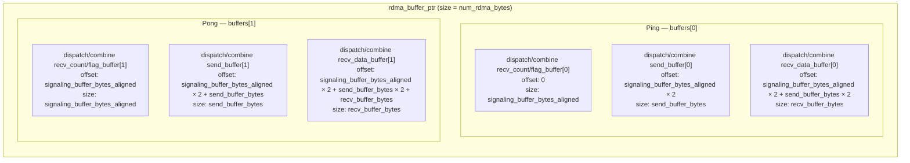
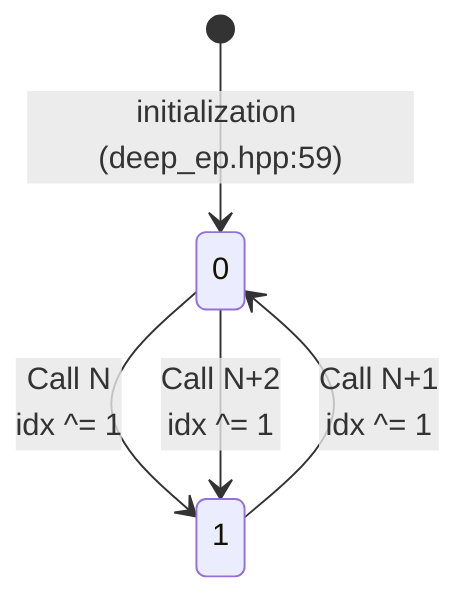
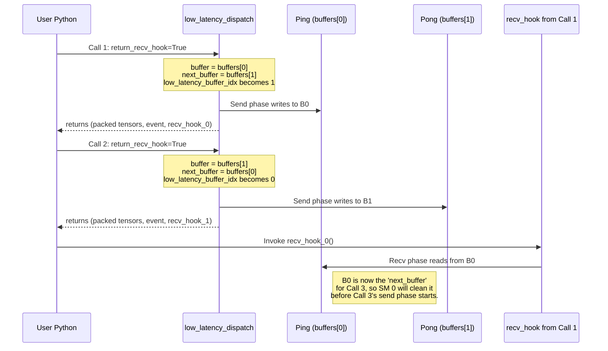

# Double-Buffer Ping-Pong in DeepEP Low-Latency Mode

This document explains how DeepEP implements **static double-buffering (ping-pong)** inside the single `rdma_buffer_ptr` that backs low-latency internode dispatch and combine. The mechanism allows the Python-level "hook mode" (`return_recv_hook=True`) to hold an incomplete communication state while the next low-latency kernel is already launched on the alternate half of the memory.

---

## 1. Why Double Buffering is Necessary

Low-latency mode exposes an API contract called **hook mode**:

* `low_latency_dispatch(..., return_recv_hook=True)` returns a `recv_hook` lambda.
* `low_latency_combine(..., return_recv_hook=True)` returns a `recv_hook` lambda.

The caller may choose **not** to execute that lambda immediately. Instead, it can overlap compute with the send phase (which already ran inside the kernel) and only invoke the hook later when the received data is actually needed. During that window, the RDMA receive buffers and signaling counters for the pending call are still "in-flight."

Without ping-pong, the next call to `low_latency_dispatch` or `low_latency_combine` would reuse the *same* physical RDMA send/receive/signaling regions and therefore **overwrite in-flight data** before the hook has consumed it. Double buffering eliminates that hazard by giving every consecutive call a symmetric, non-overlapping half of `rdma_buffer_ptr`. Because there are only two halves, the design inherently caps the number of outstanding low-latency hooks to **two**.

---

## 2. Memory Layout Math

### 2.1 Structs and Alignment Constant

```cpp
// csrc/kernels/configs.cuh
#define NUM_BUFFER_ALIGNMENT_BYTES 128   // line 7
```

All low-latency sub-buffers are `int4`-aligned (16 B) and the overall hint is rounded up to `NUM_BUFFER_ALIGNMENT_BYTES` (128 B).

```cpp
// csrc/config.hpp:107-125
struct LowLatencyBuffer {
    int num_clean_int = 0;

    void* dispatch_rdma_send_buffer = nullptr;
    void* dispatch_rdma_recv_data_buffer = nullptr;
    int*  dispatch_rdma_recv_count_buffer = nullptr;

    void* combine_rdma_send_buffer = nullptr;
    void* combine_rdma_recv_data_buffer = nullptr;
    int*  combine_rdma_recv_flag_buffer = nullptr;

    void* combine_rdma_send_buffer_data_start = nullptr;
    size_t num_bytes_per_combine_msg = 0;

    std::pair<int*, int> clean_meta() {
        EP_HOST_ASSERT(dispatch_rdma_recv_count_buffer == combine_rdma_recv_flag_buffer);
        return {dispatch_rdma_recv_count_buffer, num_clean_int};
    }
};
```

`clean_meta()` proves that dispatch and combine **share the same signaling word** inside each half. The send and receive data buffers are also physically shared between dispatch and combine; the layout simply reserves enough space for the larger of the two message types.

### 2.2 `LowLatencyLayout` Constructor

```cpp
// csrc/config.hpp:136-187
LowLatencyLayout(void* rdma_buffer,
                 int num_max_dispatch_tokens_per_rank,
                 int hidden,
                 int num_ranks,
                 int num_experts)
```

**Per-message size calculations** (lines 147-149):

```cpp
const int num_scales = hidden / 128;
EP_HOST_ASSERT(num_scales * sizeof(float) <= hidden);

size_t num_bytes_per_dispatch_msg = sizeof(int4) +
    std::max(hidden * sizeof(nv_bfloat16), hidden + num_scales * sizeof(float));

size_t num_bytes_per_combine_msg = num_scales * sizeof(nv_bfloat162) +
    hidden * sizeof(nv_bfloat16);
```

*Dispatch* reserves an `int4` header plus the larger of BF16 payload or FP8 payload with per-128-channel scales.  
*Combine* reserves per-128-channel `nv_bfloat162` min/max metadata plus the BF16 payload.

**Send region size** (lines 151-156):

```cpp
size_t dispatch_send_buffer_bytes = num_max_dispatch_tokens_per_rank *
                                    num_bytes_per_dispatch_msg;
size_t combine_send_buffer_bytes  = num_experts *
                                    num_max_dispatch_tokens_per_rank *
                                    num_bytes_per_combine_msg;
size_t send_buffer_bytes = std::max(dispatch_send_buffer_bytes,
                                    combine_send_buffer_bytes);
EP_HOST_ASSERT(send_buffer_bytes % sizeof(int4) == 0);
total_bytes += send_buffer_bytes * 2;   // ×2 for ping + pong
```

**Receive region size** (lines 158-164):

```cpp
size_t dispatch_recv_data_buffer_bytes = num_experts *
    num_max_dispatch_tokens_per_rank * num_bytes_per_dispatch_msg;
size_t combine_recv_buffer_bytes = num_experts *
    num_max_dispatch_tokens_per_rank * num_bytes_per_combine_msg;
size_t recv_buffer_bytes = std::max(dispatch_recv_data_buffer_bytes,
                                    combine_recv_buffer_bytes);
EP_HOST_ASSERT(recv_buffer_bytes % sizeof(int4) == 0);
total_bytes += recv_buffer_bytes * 2;   // ×2 for ping + pong
```

**Signaling region size** (lines 166-171):

```cpp
size_t dispatch_recv_count_buffer_bytes = num_experts * sizeof(int);
size_t combine_recv_flag_buffer_bytes   = dispatch_recv_count_buffer_bytes;
size_t signaling_buffer_bytes = std::max(dispatch_recv_count_buffer_bytes,
                                         combine_recv_flag_buffer_bytes);
size_t signaling_buffer_bytes_aligned = align_up<size_t>(signaling_buffer_bytes, 128);
total_bytes += signaling_buffer_bytes_aligned * 2;   // ×2 for ping + pong
```

The signaling buffer is explicitly aligned to **128 bytes** (the cache-line size) so that two independent kernels will not false-share the same cache line when they zero the metadata of the *next* buffer.

### 2.3 Exact Pointer Assignment

```cpp
// csrc/config.hpp:176-186
for (int i = 0; i < 2; ++i) {
    buffers[i] = {
        static_cast<int>(signaling_buffer_bytes / sizeof(int)),
        // dispatch_rdma_send_buffer
        advance(rdma_buffer, signaling_buffer_bytes_aligned * 2 +
                             send_buffer_bytes * i),
        // dispatch_rdma_recv_data_buffer
        advance(rdma_buffer, signaling_buffer_bytes_aligned * 2 +
                             send_buffer_bytes * 2 +
                             recv_buffer_bytes * i),
        // dispatch_rdma_recv_count_buffer
        advance<int*>(rdma_buffer, signaling_buffer_bytes_aligned * i),
        // combine_rdma_send_buffer
        advance(rdma_buffer, signaling_buffer_bytes_aligned * 2 +
                             send_buffer_bytes * i),
        // combine_rdma_recv_data_buffer
        advance(rdma_buffer, signaling_buffer_bytes_aligned * 2 +
                             send_buffer_bytes * 2 +
                             recv_buffer_bytes * i),
        // combine_rdma_recv_flag_buffer
        advance<int*>(rdma_buffer, signaling_buffer_bytes_aligned * i),
        // combine_rdma_send_buffer_data_start
        advance(rdma_buffer, signaling_buffer_bytes_aligned * 2 +
                             send_buffer_bytes * i),
        num_bytes_per_combine_msg
    };
}
```

Because dispatch and combine share the same physical areas, several fields alias each other. The in-memory order of the **raw** `rdma_buffer_ptr` is therefore:

| Region | Offset from `rdma_buffer_ptr` | Size |
|--------|------------------------------|------|
| Signaling[0] (`buffers[0]` recv count/flag) | `0` | `signaling_buffer_bytes_aligned` |
| Signaling[1] (`buffers[1]` recv count/flag) | `signaling_buffer_bytes_aligned` | `signaling_buffer_bytes_aligned` |
| Send[0] (`buffers[0]` send data) | `signaling_buffer_bytes_aligned × 2` | `send_buffer_bytes` |
| Send[1] (`buffers[1]` send data) | `signaling_buffer_bytes_aligned × 2 + send_buffer_bytes` | `send_buffer_bytes` |
| Recv[0] (`buffers[0]` recv data) | `signaling_buffer_bytes_aligned × 2 + send_buffer_bytes × 2` | `recv_buffer_bytes` |
| Recv[1] (`buffers[1]` recv data) | `signaling_buffer_bytes_aligned × 2 + send_buffer_bytes × 2 + recv_buffer_bytes` | `recv_buffer_bytes` |

**Total bytes consumed by layout**:

```
total_bytes = (signaling_buffer_bytes_aligned +
               send_buffer_bytes +
               recv_buffer_bytes) × 2
```

---

## 3. Buffer Size Calculation

```cpp
// csrc/config.hpp:190-193
size_t get_low_latency_rdma_size_hint(int num_max_dispatch_tokens_per_rank,
                                      int hidden,
                                      int num_ranks,
                                      int num_experts) {
    auto num_bytes = LowLatencyLayout(nullptr,
                                      num_max_dispatch_tokens_per_rank,
                                      hidden,
                                      num_ranks,
                                      num_experts).total_bytes;
    return ((num_bytes + NUM_BUFFER_ALIGNMENT_BYTES) /
            NUM_BUFFER_ALIGNMENT_BYTES) *
           NUM_BUFFER_ALIGNMENT_BYTES;
}
```

The function constructs a throw-away `LowLatencyLayout` with a null base pointer just to accumulate `total_bytes`. It then rounds the result **up** to the nearest 128-byte boundary so that `internode::alloc(num_rdma_bytes, NUM_BUFFER_ALIGNMENT_BYTES)` (line 368 of `csrc/deep_ep.cpp`) satisfies NVSHMEM / IBGDA alignment requirements.

**Python usage** (from `tests/test_low_latency.py:258`):

```python
num_rdma_bytes = deep_ep.Buffer.get_low_latency_rdma_size_hint(
    num_tokens, hidden, num_ranks, num_experts)
```

And the static Python wrapper (`deep_ep/buffer.py:175-189`) forwards directly to the C++ helper above.

---

## 4. Toggle Logic

The toggle is a single XOR-assignment on the persistent member `low_latency_buffer_idx` (declared at `csrc/deep_ep.hpp:59`):

```cpp
// csrc/deep_ep.hpp:59
int low_latency_buffer_idx = 0;
```

Inside every low-latency entry point the same two lines appear:

```cpp
// csrc/deep_ep.cpp:1576-1577  (inside low_latency_dispatch)
auto buffer = layout.buffers[low_latency_buffer_idx];
auto next_buffer = layout.buffers[low_latency_buffer_idx ^= 1];

// csrc/deep_ep.cpp:1721-1722  (inside low_latency_combine)
auto buffer = layout.buffers[low_latency_buffer_idx];
auto next_buffer = layout.buffers[low_latency_buffer_idx ^= 1];
```

### Implications of the XOR Toggle

* **Evaluation order matters.** The first statement captures `buffer = buffers[old_idx]`. The second statement evaluates the subscript expression `low_latency_buffer_idx ^= 1`, which mutates the member to the new index and yields that new value as an rvalue. Therefore `next_buffer = buffers[new_idx]`.
* **Every call advances the index.** After the first call the index is `1`; after the second it is `0`; after the third it is `1`, and so on.
* **Cleaning semantics.** The kernel launched by the current call receives `next_clean = next_buffer.clean_meta()`. It zeroes the signaling words of the *other* half before that half is used on the subsequent call. This avoids an extra host-side memset.

---

## 5. `get_next_low_latency_combine_buffer`

Python callers can write directly into the raw combine send buffer instead of passing a fully materialized input tensor to `low_latency_combine`. The helper returns a `torch::Tensor` that aliases the **current** ping (or pong) send region with custom strides so the logical shape `{local_experts, tokens, hidden}` skips over the per-message metadata gaps.

```cpp
// csrc/deep_ep.cpp:1798-1815
torch::Tensor Buffer::get_next_low_latency_combine_buffer(
        int num_max_dispatch_tokens_per_rank,
        int hidden,
        int num_experts) const {
    LowLatencyLayout layout(rdma_buffer_ptr,
                            num_max_dispatch_tokens_per_rank,
                            hidden,
                            num_ranks,
                            num_experts);

    auto buffer = layout.buffers[low_latency_buffer_idx];
    auto dtype = torch::kBFloat16;
    auto num_msg_elems = static_cast<int>(
        buffer.num_bytes_per_combine_msg /
        elementSize(torch::kBFloat16));

    EP_HOST_ASSERT(buffer.num_bytes_per_combine_msg %
                   elementSize(torch::kBFloat16) == 0);

    return torch::from_blob(
        buffer.combine_rdma_send_buffer_data_start,
        {num_experts / num_ranks,
         num_ranks * num_max_dispatch_tokens_per_rank,
         hidden},
        {num_ranks * num_max_dispatch_tokens_per_rank * num_msg_elems,
         num_msg_elems,
         1},
        torch::TensorOptions().dtype(dtype).device(torch::kCUDA));
}
```

### Stride Mechanics

Each combine message physically occupies `num_bytes_per_combine_msg` bytes:

```
num_bytes_per_combine_msg = (hidden / 128) * sizeof(nv_bfloat162)
                            + hidden * sizeof(nv_bfloat16)
```

The tensor view exposes only the `hidden` BF16 elements as the last dimension. The stride between adjacent tokens (dim 1) is `num_msg_elems = num_bytes_per_combine_msg / sizeof(BF16)`, which is **strictly larger** than `hidden`. The gap between the end of the `hidden`-sized logical row and the start of the next token is where the per-128-channel `nv_bfloat162` min/max metadata lives. When `low_latency_combine` is called later, it reads the *same* memory through the raw `buffer.combine_rdma_send_buffer` pointer and interprets the full message layout correctly.

---

## 6. Cleanup (`clean_low_latency_buffer`)

There are **two** levels of cleanup:

### 6.1 Explicit Host API

```cpp
// csrc/deep_ep.cpp:1498-1525
void Buffer::clean_low_latency_buffer(int num_max_dispatch_tokens_per_rank,
                                      int hidden,
                                      int num_experts) {
    EP_HOST_ASSERT(low_latency_mode);

    auto layout = LowLatencyLayout(rdma_buffer_ptr,
                                   num_max_dispatch_tokens_per_rank,
                                   hidden, num_ranks, num_experts);
    auto clean_meta_0 = layout.buffers[0].clean_meta();
    auto clean_meta_1 = layout.buffers[1].clean_meta();

    // boundary checks against num_rdma_bytes ...

    internode_ll::clean_low_latency_buffer(
        clean_meta_0.first,  clean_meta_0.second,
        clean_meta_1.first,  clean_meta_1.second,
        rank, num_ranks,
        mask_buffer_ptr,
        sync_buffer_ptr,
        at::cuda::getCurrentCUDAStream());   // <-- compute stream
}
```

This routine zeros **both** buffers' signaling arrays (`dispatch_rdma_recv_count_buffer` / `combine_rdma_recv_flag_buffer`). It is meant to be called **once at initialization** or after an explicit reset, because normal operation relies on the automatic next-buffer cleaning inside the dispatch/combine kernels.

### 6.2 Kernel-Level Automatic Cleaning

Both `internode_ll::dispatch` and `internode_ll::combine` receive `next_clean` and `num_next_clean_int`:

```cpp
// csrc/kernels/internode_ll.cu:288-290  (inside dispatch kernel)
#pragma unroll
for (int i = lane_id; i < num_next_clean_int; i += 32)
    next_clean[i] = 0;

// csrc/kernels/internode_ll.cu:779-781  (inside combine kernel)
#pragma unroll
for (int i = lane_id; i < num_next_clean_int; i += 32)
    next_clean[i] = 0;
```

This warp-level loop runs on **SM 0** before the send phase begins, guaranteeing that the alternate half will not carry stale counts/flags from a previous iteration.

### 6.3 Cleanup Kernel Internals

```cpp
// csrc/kernels/internode_ll.cu:72-102  (device kernel)
template <int kNumThreads>
__launch_bounds__(kNumThreads, 1)
__global__ void clean_low_latency_buffer(int* clean_0, int num_clean_int_0,
                                         int* clean_1, int num_clean_int_1,
                                         int rank, int num_ranks,
                                         int* mask_buffer_ptr,
                                         int* sync_buffer_ptr) {
    auto thread_id = static_cast<int>(threadIdx.x);

    // Barrier before cleaning (in case of unfinished chunked EP)
    if (sync_buffer_ptr == nullptr)
        nvshmemx_barrier_all_block();
    else
        barrier<kNumThreads>(thread_id, rank, num_ranks,
                             mask_buffer_ptr, sync_buffer_ptr);

    // Zero both ping and pong signaling regions
    #pragma unroll
    for (int i = thread_id; i < num_clean_int_0; i += kNumThreads)
        clean_0[i] = 0;
    #pragma unroll
    for (int i = thread_id; i < num_clean_int_1; i += kNumThreads)
        clean_1[i] = 0;

    // Barrier after cleaning
    if (sync_buffer_ptr == nullptr)
        nvshmemx_barrier_all_block();
    else
        barrier<kNumThreads>(thread_id, rank, num_ranks,
                             mask_buffer_ptr, sync_buffer_ptr);
}
```

The host wrapper launches it with **1 block × 256 threads** on the stream passed in (the compute stream for the explicit API).

---

## 7. Mermaid Diagrams

### 7.1 Physical `rdma_buffer_ptr` Layout



### 7.2 State Diagram of `low_latency_buffer_idx`



### 7.3 Sequence Diagram: Hook Mode + Ping-Pong



---

## 8. Design Evaluation

| Aspect | Analysis |
|--------|----------|
| **Memory cost** | **2×** the peak single-call footprint. The user must allocate `num_rdma_bytes` large enough for two complete `{send + recv + signaling}` copies. |
| **Latency benefit** | **Zero waiting.** Because the next call can be issued immediately on the alternate half, there is no host-side synchronization or stream wait to drain the previous call before reuse. This is essential for overlapping computation with the send half of a low-latency kernel. |
| **In-flight constraint** | **Max 2 outstanding results.** Since there are only two physical halves, the user can hold at most two unexecuted `recv_hook` lambdas. A third call would circle back to the half still owned by the oldest hook and corrupt it. |
| **Static vs dynamic** | The layout is **fully static**; all offsets are computed once from constructor parameters. There is no allocator, no fragmentation, and no pointer chase. The trade-off is inflexibility: if `num_max_dispatch_tokens_per_rank`, `hidden`, or `num_experts` change, a new `Buffer` with a new `num_rdma_bytes` must be created. |
| **Alignment rationale** | `signaling_buffer_bytes_aligned` is rounded to 128 B so that the cleaning warp on SM 0 does not false-share cache lines with the receiving warps of the *other* half. The final `get_low_latency_rdma_size_hint` also rounds to 128 B to match NVSHMEM's `internode::alloc` alignment contract. |

---

## 9. Code References

### Constants and Structs

| Symbol | File | Line(s) | Meaning |
|--------|------|---------|---------|
| `NUM_BUFFER_ALIGNMENT_BYTES` | `csrc/kernels/configs.cuh` | 7 | 128-byte alignment requirement |
| `LowLatencyBuffer` | `csrc/config.hpp` | 107–125 | Per-half pointer bundle |
| `LowLatencyLayout` | `csrc/config.hpp` | 127–188 | Layout calculator and pointer assigner |
| `get_low_latency_rdma_size_hint` | `csrc/config.hpp` | 190–193 | Rounds `total_bytes` up to 128 B |
| `low_latency_buffer_idx` | `csrc/deep_ep.hpp` | 59 | Persistent ping-pong index on `Buffer` |

### C++ Entry Points

| Function | File | Line(s) | Key Lines |
|----------|------|---------|-----------|
| `Buffer::clean_low_latency_buffer` | `csrc/deep_ep.cpp` | 1498–1525 | Calls `internode_ll::clean_low_latency_buffer` on compute stream |
| `Buffer::low_latency_dispatch` | `csrc/deep_ep.cpp` | 1527–1672 | Toggle at 1576–1577; `next_clean` at 1616 |
| `Buffer::low_latency_combine` | `csrc/deep_ep.cpp` | 1674–1796 | Toggle at 1721–1722; `next_clean` at 1744 |
| `Buffer::get_next_low_latency_combine_buffer` | `csrc/deep_ep.cpp` | 1798–1815 | Reads current index; does **not** toggle |

### CUDA Kernels

| Kernel | File | Line(s) | Purpose |
|--------|------|---------|---------|
| `clean_low_latency_buffer<kNumThreads>` (device) | `csrc/kernels/internode_ll.cu` | 72–102 | Barriers + zeroes both signaling regions |
| `clean_low_latency_buffer` (host wrapper) | `csrc/kernels/internode_ll.cu` | 104–127 | Launches 1 block × 256 threads |
| `dispatch` kernel (next-clean) | `csrc/kernels/internode_ll.cu` | 288–290 | Zeros `next_clean` before send phase |
| `combine` kernel (next-clean) | `csrc/kernels/internode_ll.cu` | 779–781 | Zeros `next_clean` before send phase |

### Python Bindings

| Function | File | Line(s) | Behavior |
|----------|------|---------|----------|
| `get_low_latency_rdma_size_hint` | `deep_ep/buffer.py` | 175–189 | Static wrapper that forwards to C++ helper |

---

## 10. Summary

DeepEP low-latency mode implements a **static, symmetric, two-slot ping-pong** inside the pre-allocated `rdma_buffer_ptr`. `LowLatencyLayout` deterministically splits the buffer into two identical `LowLatencyBuffer` instances, each containing shared send, receive, and signaling sub-regions for both dispatch and combine. The member `low_latency_buffer_idx` is toggled with `^= 1` on every call, allowing a user to hold one incomplete hook result while issuing the next low-latency kernel immediately on the alternate half. The design trades 2× memory for zero-latency reuse and is capped at two outstanding in-flight calls.
