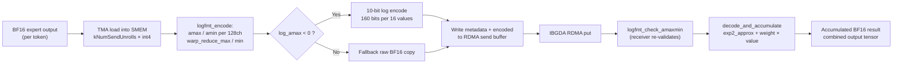

# Online Format Conversion in DeepEP Kernels

DeepEP’s low-latency internode path fuses **FP8 quantization** (during dispatch) and **LogFMT compression** (during combine) directly into the RDMA communication kernel.  This document explains the mechanics, trade-offs, and exact code paths.

---

## 1. Motivation: Why Fuse Conversion into the Communication Kernel?

In a traditional pipeline the data movement and numerical conversion are separate steps:

1. Cast kernel (BF16 → FP8 / LogFMT) → global memory write  
2. Communication kernel → read the casted buffer → RDMA send  
3. Receiver kernel → read RDMA buffer → cast back → global memory write

Each extra kernel launch adds:
*   **Launch latency** (CPU → GPU command-buffer overhead)
*   **HBM traffic** (the casted tensor must be written to and then re-read from global memory)
*   **Synchronization points** (additional events / barriers between kernels)

By embedding the conversion inside the same kernel that issues `nvshmemi_ibgda_put_nbi_warp` (send) and the same warps that unpack the received payload (recv), DeepEP:
*   **Eliminates** the dedicated cast kernels entirely.
*   **Hides** quantization ALU work behind network latency (the sender warps compute scales while other warps are still quieting QPs).
*   **Reduces** peak RDMA buffer footprint because the on-the-wire format is smaller than BF16.

> This design is only available in the **low-latency internode** path (`low_latency_dispatch` / `low_latency_combine`).

---

## 2. FP8 Dispatch

The dispatch kernel is instantiated as:

```cpp
// csrc/kernels/internode_ll.cu:129
template <bool kUseFP8, bool kUseUE8M0, int kHidden>
__global__ __launch_bounds__(1024, 1) void dispatch(...)
```

The host launcher selects the template specialization at runtime based on the `use_fp8`, `round_scale`, and `use_ue8m0` booleans passed from Python/C++ (`csrc/deep_ep.cpp:1534`).

### 2.1 Per-128-Channel `amax` Reduction

Each sending warp reads the source token in `int4` vectors (`8 × nv_bfloat16` per thread):

```cpp
// csrc/kernels/internode_ll.cu:197
constexpr int kNumElemsPerRead = sizeof(int4) / sizeof(nv_bfloat16);  // == 8
```

A full warp therefore covers `8 × 32 = 256` elements.  The hidden dimension is processed in **128-element channels** (`kNumPerChannels = 128`, line 173).  Consequently the warp is split into two 16-lane groups, each responsible for one channel:

```cpp
// csrc/kernels/internode_ll.cu:232
EP_STATIC_ASSERT(kNumElemsPerRead * 32 / kNumPerChannels == 2, "Invalid vectorization");
```

The local absolute maximum is reduced across the 16 lanes with:

```cpp
// csrc/kernels/internode_ll.cu:233
amax = warp_reduce_max<16>(amax);
```

### 2.2 Scale Calculation

After the reduction the kernel calls:

```cpp
// csrc/kernels/internode_ll.cu:234
calculate_fp8_scales(amax, scale, scale_inv, round_scale);
```

Defined in `csrc/kernels/utils.cuh:484`, this function has two modes:

| Mode | Formula (scale) | Formula (scale_inv) | Where |
|------|----------------|---------------------|-------|
| **Exact** (`round_scale = false`) | `scale = kFinfoAmaxE4M3 / amax`  (i.e. `448.0f / amax`) | `scale_inv = amax * kFinfoAmaxInvE4M3` | `utils.cuh:490–491` |
| **Power-of-two** (`round_scale = true`) | `scale = fast_pow2(-exp_scale_inv)` | `scale_inv = fast_pow2(exp_scale_inv)` | `utils.cuh:486–488` |

The power-of-two path uses `fast_log2_ceil` (`utils.cuh:477`) which extracts the raw IEEE-754 exponent and adds one if the mantissa is non-zero, yielding a pure power-of-two scale that can be applied with a bit-shift on some hardware paths.

### 2.3 FP8 Conversion

Each thread operates on pairs of `float` values and emits `__nv_fp8x2_storage_t`:

```cpp
// csrc/kernels/internode_ll.cu:242–244
for (int j = 0; j < kNumElemsPerRead; j += 2) {
    float2 fp32x2 = {fp32_values[j] * scale, fp32_values[j + 1] * scale};
    fp8x2_values[j / 2] = __nv_cvt_float2_to_fp8x2(fp32x2, __NV_SATFINITE, __NV_E4M3);
}
```

*   `__nv_cvt_float2_to_fp8x2` is the Hopper-native FP8 conversion intrinsic.
*   `__NV_SATFINITE` clamps overflows to the max finite value rather than generating `Inf`/`NaN`.
*   `__NV_E4M3` selects the 4-bit exponent / 3-bit mantissa format (max representable value = 448).

### 2.4 Scale Packing, Transport, and Unpacking

**Sender layout:**  The RDMA message for one token is laid out as:

```
[int4 header: source token index]  // 16 bytes
[hidden_bytes of FP8 data]         // kHidden × sizeof(__nv_fp8_storage_t)
[num_scales × sizeof(float) scales] // scale_inv per 128 channels
```

The sender writes the inverse scale (`scale_inv`) into the message tail:

```cpp
// csrc/kernels/internode_ll.cu:235–236
if (lane_id == 0 or lane_id == 16)
    rdma_x_scales[i * kNumElemsPerRead / 128] = scale_inv;
```

**Receiver layout:**  During the recv phase the same kernel copies the payload into `packed_recv_x` and extracts the scales:

```cpp
// csrc/kernels/internode_ll.cu:440–460
if constexpr (kUseFP8) {
    const auto src_scales = reinterpret_cast<float*>(... + hidden_bytes);
    // ...
    auto scale = extract_required_scale_format<kUseUE8M0>(ld_nc_global(src_scales + lane_id));
    recv_x_scales[...] = scale;
}
```

`extract_required_scale_format<kIsUE8M0>` (`utils.cuh:496`) is a compile-time branch:
*   `kIsUE8M0 == false` → returns the raw `float` scale.
*   `kIsUE8M0 == true`  → extracts the exponent byte: `(*reinterpret_cast<uint32_t*>(&value)) >> 23`.

The scales are stored in a **column-major** tensor on the receiver:

```cpp
// csrc/deep_ep.cpp:1604 / 1608
packed_recv_x_scales = torch::empty({num_local_experts,
                                      hidden / 128,          // or hidden / 512 for UE8M0
                                      num_ranks * num_max_dispatch_tokens_per_rank},
                                     torch::dtype(torch::kFloat32)); // or torch::kInt for UE8M0
packed_recv_x_scales = torch::transpose(packed_recv_x_scales.value(), 1, 2);
```

### 2.5 `round_scale` and `use_ue8m0` Variations

| Flag | Effect | Constraints |
|------|--------|-------------|
| `use_fp8` | Enables the `dispatch<true, …>` template path. | `hidden` must be a multiple of 512 (`deep_ep.cpp:1602`). |
| `round_scale` | Scales are rounded to the next power of two. Required for UE8M0. | Checked at `deep_ep.cpp:511`. |
| `use_ue8m0` | Stores **one `uint8_t` exponent** per 512 channels instead of one `float` per 128 channels. | `round_scale` must be `true`.  Scale tensor dtype becomes `torch::kInt` (`deep_ep.cpp:1608`). |

---

## 3. LogFMT Combine

The combine kernel is instantiated as:

```cpp
// csrc/kernels/internode_ll.cu:715
template <bool kUseLogFMT, int kHidden, int kNumMaxTopk, int kNumMaxUnrolls>
__global__ __launch_bounds__(1024, 1) void combine(...)
```

The host side selects the specialization at `csrc/deep_ep.cpp:1674` (`use_logfmt` parameter) and asserts that `zero_copy` and `use_logfmt` are never enabled simultaneously (`csrc/deep_ep.cpp:1183`).

### 3.1 `logfmt_encode`

```cpp
// csrc/kernels/internode_ll.cu:558
template <int kNumSendUnrolls>
__forceinline__ __device__ int logfmt_encode(void* buffer,
                                               nv_bfloat162* shared_amaxmin,
                                               const int& lane_id)
```

**Local amax/amin:**  Each lane loads `kNumSendUnrolls` (`2` or `4`) `int4` chunks, computes lane-local `amax` and `amin` with `__hmax2` / `__hmin2` on `nv_bfloat162` pairs, and strips sign bits into a `local_signs` bitmask.

**Warp reduction:**  The 128-channel group size determines the number of lanes that must agree:

```cpp
// csrc/kernels/internode_ll.cu:594
constexpr static int kNumLanesToReduce = 128 * sizeof(nv_bfloat16) / (kNumSendUnrolls * sizeof(int4));
// For kNumSendUnrolls == 4  → 256 / 64 == 4 lanes
amax = warp_reduce_max<kNumLanesToReduce>(amax);
amin = warp_reduce_min<kNumLanesToReduce>(amin);
```

**Predicate:**  LogFMT is enabled only if **all** lanes in the group satisfy:

```cpp
// csrc/kernels/internode_ll.cu:606
bool enable_cast = warp_reduce_and<kNumLanesToReduce, true>(
    log_amax < kLogThreshold and log_amin < log_amax);
```

`kLogThreshold == 0`, so the condition requires `amax < 1.0` and a non-empty dynamic range.

**10-bit encoding:**  When the predicate passes, the kernel computes:
*   `step = (log_amax - log_amin) / (kNumValues - 2)`  
*   `fused_rounding = rounding - log_amin * step_inv`

Each 16-value BF16 chunk (256 bits) is compressed into **five `uint32_t` words** (160 bits):

```cpp
// csrc/kernels/internode_ll.cu:626–631
st_buffer[i * 5 + 0] = (encoded[0] >> 0) | (encoded[1] << 9)  | (encoded[2] << 18) | (encoded[3] << 27);
st_buffer[i * 5 + 1] = (encoded[3] >> 5) | (encoded[4] << 4)  | (encoded[5] << 13) | (encoded[6] << 22) | (encoded[7] << 31);
st_buffer[i * 5 + 2] = (encoded[7] >> 1) | (encoded[8] << 8)  | (encoded[9] << 17) | (encoded[10] << 26);
st_buffer[i * 5 + 3] = (encoded[10] >> 6) | (encoded[11] << 3) | (encoded[12] << 12) | (encoded[13] << 21) | (encoded[14] << 30);
st_buffer[i * 5 + 4] = (encoded[14] >> 2) | (encoded[15] << 7) | (local_signs << 16);
```

The function returns the number of bytes actually written (compressed or raw) so the caller can advance the TMA offset.

### 3.2 `logfmt_check_amaxmin`

On the receiver side the **load warp** (the warp that issues TMA loads) re-validates the remote metadata before the reduction warps decode anything:

```cpp
// csrc/kernels/internode_ll.cu:641
template <int kNumLanes, int kNumSendUnrolls, int kNumRecvUnrolls>
__forceinline__ __device__ void logfmt_check_amaxmin(
    uint8_t* meta_buffer, float2* shared_log_amax, float2* shared_log_amin,
    int* shared_cast_info, const int lane_id)
```

*   Reads `nv_bfloat162` min/max pairs from the message metadata (`line 650`).
*   Recomputes `log2f_approx(amax)` and `log2f_approx(amin)` independently (`line 657–658`).
*   Aggregates `enable_cast` with `warp_reduce_and<kNumSendUnrolls>` (`line 665`).
*   Computes a per-decode-warp prefix sum of casted chunks and stores it in `shared_cast_info` (`line 666–669`).  This tells each reduction warp exactly where its chunk lives in the variable-length encoded buffer.

### 3.3 `decode_and_accumulate`

```cpp
// csrc/kernels/internode_ll.cu:673
template <int kNumRecvUnrolls>
__forceinline__ __device__ void decode_and_accumulate(
    uint32_t* ld_buffer, float* accum,
    const float& log_amax, const float& log_amin,
    const bool& enable_cast, const float& weight)
```

**Compressed path:**  The warp first **concatenates** the five 32-bit words into six 32-bit values with overlapping bit shifts so that every 10-bit field is aligned:

```cpp
// csrc/kernels/internode_ll.cu:689–694
uint32_t concat[6];
concat[0] = ld_buffer[i * 5];
for (int k = 1; k < 5; ++k)
    concat[k] = (ld_buffer[i * 5 + k - 1] >> (32 - k * 5)) | (ld_buffer[i * 5 + k] << (k * 5));
concat[5] = ld_buffer[i * 5 + 4] >> 7;
```

Decoding is performed with the PTX `ex2.approx.f32` intrinsic wrapped by `exp2f_approx` (`utils.cuh:305`):

```cpp
// csrc/kernels/internode_ll.cu:681–683
auto decode = [=](const uint32_t& encoded, const uint32_t& sign) {
    const auto decoded = encoded == 0 ? .0f : exp2f_approx((encoded - 1) * step + log_amin);
    return sign ? -decoded : decoded;
};
```

The decoded value is multiplied by the `topk_weight` and accumulated into a `float` register array.

**Fallback path:**  If `enable_cast == false`, the same function simply reinterprets the bits as `__nv_bfloat162` and accumulates directly (`line 705–711`).

---

## 4. Precision and Bandwidth Trade-offs

### 4.1 FP8 (E4M3)
*   **Bandwidth savings:** 1 byte per element vs 2 bytes for BF16 → **≈ 50 %** reduction in RDMA payload.
*   **Hardware support:** Native `__nv_cvt_float2_to_fp8x2` on Hopper (`SM90`).  The build is gated by `DISABLE_SM90_FEATURES` (`configs.cuh:58`).
*   **Precision:** Per-128-channel scaling keeps the relative quantization error bounded.  The max representable value is 448; values larger than that are saturated (`__NV_SATFINITE`).
*   **Overhead:** One `float` scale per 128 channels (0.78 % metadata overhead).  UE8M0 drops this to one byte per 512 channels (~0.05 % overhead) at the cost of coarser power-of-two scales.

### 4.2 LogFMT
*   **Bandwidth savings:** 10 bits per element vs 16 bits for BF16 → **37.5 %** theoretical reduction.
*   **Effective savings:**  Only realized when the `enable_cast` predicate is true.  If many 128-channel groups have `amax >= 1.0`, the kernel falls back to raw BF16 and savings drop toward 0 %.
*   **Compute overhead:**  Adds `log2.approx.f32` / `ex2.approx.f32` (PTX), bit-manipulation shifts, and warp-level predicates on both sender and receiver.  This is traded against the saved RDMA bytes.
*   **Precision:**  Logarithmic quantization has finer resolution near zero and coarser resolution for large magnitudes.  The 10-bit code space (`0 … 511`) is mapped to the dynamic range `[amin, amax]`.  Zero is exactly preserved (`encoded == 0`).

---

## 5. Mermaid Diagrams

### 5.1 FP8 Dispatch Path

```mermaid
flowchart LR
    A["BF16 input tensor<br/>(per token)"] --> B["Read int4 vector<br/>8 × BF16 per thread"]
    B --> C["Local abs-max<br/>warp_reduce_max&lt;16&gt;<br/>(per 128 channels)"]
    C --> D["calculate_fp8_scales<br/>scale = 448.0 / amax"]
    D --> E["__nv_cvt_float2_to_fp8x2<br/>(SATFINITE, E4M3)"]
    E --> F["Pack FP8 hidden data<br/>+ float scale_inv<br/>into RDMA send buffer"]
    F --> G["IBGDA RDMA put<br/>nvshmemi_ibgda_put_nbi_warp"]
    G --> H["Receiver unpacks<br/>scales & FP8 payload"]
    H --> I["Reconstruct BF16<br/>for MoE expert compute"]
```



### 5.2 LogFMT Combine Path



---

## 6. Design Evaluation

### 6.1 Compute-vs-Bandwidth Shifting
Online conversion is a deliberate **ALU-for-bandwidth** trade.  Modern MoE training is often bottlenecked by inter-GPU (RDMA) bandwidth rather than SM throughput.  By moving quantization/compression into the communication kernel, DeepEP:
*   Saves **one full HBM round-trip** on both sender and receiver.
*   Reduces **on-the-wire bytes**, which directly lowers end-to-end latency for small-to-medium token counts.

### 6.2 Hopper Dependency (SM90-Only)
The FP8 path is tightly coupled to Hopper hardware:
*   `__nv_cvt_float2_to_fp8x2` and the `__nv_fp8_storage_t` types are only available when `DISABLE_SM90_FEATURES` is **not** defined (`configs.cuh:58–67`).
*   The low-latency kernels also rely on Hopper-specific features such as TMA (`tma_load_1d`, `tma_store_1d`) and asynchronous m-barriers (`mbarrier_init`, `mbarrier_wait`), which are compiled conditionally for `sm_90`.
*   Runtime check: `is_sm90_compiled()` (`deep_ep.cpp:1817`).

LogFMT encode/decode does **not** require FP8 hardware and could theoretically run on Ampere, but the surrounding low-latency combine kernel is still tuned for Hopper TMA/barriers.

### 6.3 Numerical Stability Concerns
*   **FP8:** Per-128-channel scaling limits error, yet outliers > 448 are **saturated** (not clipped to 448 with a larger scale).  Power-of-two rounding (`round_scale`) can enlarge the effective quantization bin size by up to ~2×, which may matter for weight gradients with heavy tails.
*   **LogFMT:** The mapping is nonlinear.  Relative error is smallest near `amax` and largest near `amin`.  The `kMinClip = 32` guard (`internode_ll.cu:561`) prevents the step size from collapsing to zero when `amin` is extremely small.  Because the decoder uses `ex2.approx.f32`, there is an additional ~1–2 ULP error from the PTX approximation.

### 6.4 When to Use Each Mode
| Scenario | Recommended Mode | Rationale |
|----------|------------------|-----------|
| Forward dispatch (activations) | **FP8** | Universal 2× bandwidth win; activations usually fit well in E4M3 range. |
| Backward combine (gradients) with small magnitude | **LogFMT** | Up to 37.5 % savings when `amax < 1.0`; gradients often satisfy this. |
| Backward combine with large outliers | **BF16 (no compression)** | LogFMT predicate will fail frequently, yielding little savings and added compute. |
| Extremely memory-constrained scale storage | **FP8 + UE8M0** | One byte of metadata per 512 channels minimizes scale memory. |

> **Important:** `use_logfmt` is **incompatible** with zero-copy combine (`deep_ep.cpp:1183` asserts `not(zero_copy and use_logfmt)`), because the encoder must write into a staging buffer before RDMA.

---

## 7. Code References

### 7.1 Files and Line Numbers

| Symbol | File | Line(s) | Description |
|--------|------|---------|-------------|
| `DISABLE_SM90_FEATURES` | `csrc/kernels/configs.cuh` | 58–67 | Gate that includes `<cuda_fp8.h>` and defines `__nv_fp8_storage_t`. |
| `dispatch<kUseFP8, kUseUE8M0, kHidden>` | `csrc/kernels/internode_ll.cu` | 129 | Low-latency dispatch kernel template. |
| `kNumPerChannels` | `csrc/kernels/internode_ll.cu` | 173 | `== 128`; channel size for FP8 scaling. |
| `kNumElemsPerRead` | `csrc/kernels/internode_ll.cu` | 197 | `== 8`; number of BF16 values in one `int4` load. |
| `warp_reduce_max<16>` | `csrc/kernels/internode_ll.cu` | 233 | Reduces `amax` across half a warp (128 channels). |
| `calculate_fp8_scales` | `csrc/kernels/utils.cuh` | 484 | Computes `scale` and `scale_inv` from `amax`. |
| `fast_log2_ceil` | `csrc/kernels/utils.cuh` | 477 | Raw-float-exponent helper for power-of-two scales. |
| `__nv_cvt_float2_to_fp8x2` | `csrc/kernels/internode_ll.cu` | 244 | Hopper intrinsic converting two `float`s to E4M3 FP8. |
| `rdma_x_scales[...] = scale_inv` | `csrc/kernels/internode_ll.cu` | 236 | Sender writes inverse scales into the RDMA message tail. |
| `extract_required_scale_format<kUseUE8M0>` | `csrc/kernels/utils.cuh` | 496 | Converts `float` scale to `uint8_t` exponent when UE8M0 is enabled. |
| `Buffer::low_latency_dispatch` | `csrc/deep_ep.cpp` | 1534 | Host API; accepts `use_fp8`, `round_scale`, `use_ue8m0`. |
| `Buffer::low_latency_combine` | `csrc/deep_ep.cpp` | 1674 | Host API; accepts `use_logfmt`. |
| `logfmt_encode<kNumSendUnrolls>` | `csrc/kernels/internode_ll.cu` | 558 | Sender-side LogFMT encoder. |
| `kNumLanesToReduce` | `csrc/kernels/internode_ll.cu` | 594 | `128 * sizeof(bf16) / (kNumSendUnrolls * sizeof(int4))`. |
| `warp_reduce_and<kNumLanesToReduce, true>` | `csrc/kernels/internode_ll.cu` | 606 | Predicate that decides whether to enable LogFMT for a 128-channel group. |
| `logfmt_check_amaxmin<kNumLanes, kNumSendUnrolls, kNumRecvUnrolls>` | `csrc/kernels/internode_ll.cu` | 641 | Receiver-side metadata validator. |
| `decode_and_accumulate<kNumRecvUnrolls>` | `csrc/kernels/internode_ll.cu` | 673 | Receiver-side decoder and weighted accumulator. |
| `exp2f_approx` | `csrc/kernels/utils.cuh` | 305 | PTX wrapper: `ex2.approx.f32`. |
| `log2f_approx` | `csrc/kernels/utils.cuh` | 299 | PTX wrapper: `lg2.approx.f32`. |
| `combine<kUseLogFMT, kHidden, kNumMaxTopk, kNumMaxUnrolls>` | `csrc/kernels/internode_ll.cu` | 715 | Low-latency combine kernel template. |
| `EP_HOST_ASSERT(not(zero_copy and use_logfmt))` | `csrc/deep_ep.cpp` | 1183 | Enforces that LogFMT cannot be used with zero-copy. |
| `is_sm90_compiled()` | `csrc/deep_ep.cpp` | 1817 | Runtime query for SM90 feature compilation. |

### 7.2 PTX / CUDA Intrinsics Used

| Intrinsic / PTX | Usage | File:Line |
|-----------------|-------|-----------|
| `__nv_cvt_float2_to_fp8x2(float2, __NV_SATFINITE, __NV_E4M3)` | FP8 dispatch cast | `internode_ll.cu:244` |
| `lg2.approx.f32` (via `log2f_approx`) | LogFMT log-amax / log-amin | `utils.cuh:299` |
| `ex2.approx.f32` (via `exp2f_approx`) | LogFMT encode rounding & decode | `utils.cuh:305` |
| `__hmax2` / `__hmin2` | Per-lane BF16 max/min in LogFMT | `internode_ll.cu:586–587` |
| `__bfloat1622float2` | BF16 → float conversion for LogFMT | `internode_ll.cu:622` |
| `__float2uint_rd` | Log index rounding | `internode_ll.cu:623–624` |
| `mbarrier_init` / `mbarrier_wait` / `mbarrier_arrive` | Hopper async-copy pipelining | `internode_ll.cu:821`, `877`, `1119` |
| `tma_load_1d` / `tma_store_1d` | Tensor Memory Accelerator for staging | `internode_ll.cu:828`, `886` |

---

*End of document.*
