# DeepEP 技术文档

> 本文档基于 DeepEP 代码库的完整分析撰写，力求详尽、准确地总结代码的功能、机制、流程、设计目的与权衡。

---

## 1. 概述

DeepEP 是一个面向混合专家模型（MoE）和高性能专家并行（Expert Parallelism, EP）的 GPU 通信库。它提供了高吞吐、低延迟的 all-to-all GPU 内核，支持：

- **Dispatch**：将输入 token 按照 top-k 专家索引分发到目标 GPU；
- **Combine**：将各专家计算后的结果按原路径聚合回源 GPU。

通信场景覆盖：
1. **Intranode（节点内）**：纯 NVLink 通信，最多 8 个 peer；
2. **Internode（跨节点）**：节点内 NVLink + 跨节点 RDMA（不对称域带宽转发）；
3. **Low-Latency（低延迟）**：纯 RDMA（通过 NVSHMEM IBGDA），支持通信-计算重叠（hook 机制），兼容 CUDA Graph。

技术栈：
- **前端**：Python（PyTorch）
- **后端**：C++17 / CUDA C++（PyBind11 绑定）
- **构建**：PyTorch `CUDAExtension`（`torch.utils.cpp_extension`）
- **目标架构**：SM80（Ampere，如 A100）或 SM90（Hopper，如 H100/H800）

---

## 2. 架构总览

DeepEP 采用三层架构：

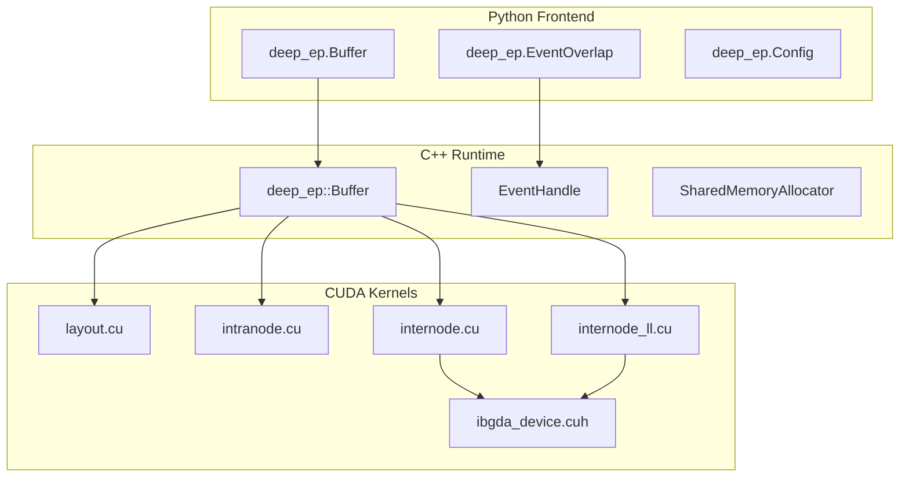

- **Python 层**：极薄的封装，负责参数校验、自动路由（intranode/internode）、类型桥接和生命周期管理。
- **C++ 层**：`Buffer` 类持有所有 GPU/CPU 状态（IPC 句柄、NVSHMEM 内存、CUDA Stream、同步计数器），并实现所有 host-side  orchestration。
- **CUDA 层**：按场景分为 Layout、Intranode、Internode、Low-Latency 四大模块，使用模板特化、Warp 分工、TMA、IBGDA 等技术榨干硬件带宽。

---

## 3. 背景知识：以 DeepSeek-V3 为例的 MoE 与 Expert Parallelism

DeepEP 的诞生与大规模 MoE（Mixture-of-Experts）模型——尤其是 DeepSeek-V3——的分布式训练/推理需求密不可分。理解 DeepSeek-V3 的架构规模和通信特征，有助于理解 DeepEP 中 dispatch 与 combine 两个核心操作的实际意义。

### 3.1 DeepSeek-V3 的模型规模

DeepSeek-V3 是目前最具代表性的开源 MoE 大模型之一，其核心指标如下：

| 指标 | 数值 | 说明 |
|------|------|------|
| 总参数量 | 671 B | 包含 256 个 routed experts 和 1 个 shared expert。 |
| 每 token 激活参数 | 37 B | 仅激活约 5.5% 的参数，实现高容量与低推理成本的平衡。 |
| 专家数量 | 256 routed + 1 shared | 每个 token 通过 router 动态选择 top-8 个 routed expert，同时必过 shared expert。 |
| MoE 层数 | 58 层 | 每个 MoE 层都包含一次 dispatch 和一次 combine。 |
| 上下文长度 | 128 K | 采用 MLA（Multi-head Latent Attention）压缩 KV Cache。 |
| 训练数据 | 14.8 T tokens | 在 2048 张 H800 GPU 上完成预训练。 |

### 3.2 为什么需要 Expert Parallelism（EP）

在 DeepSeek-V3 中，单个 GPU 的显存（如 H800 的 80 GB）无法容纳全部 671 B 参数。因此，专家必须被**切分（shard）**到多张 GPU 上。Expert Parallelism（EP）正是将不同专家放置在不同 GPU 上的并行策略。

以 DeepSeek-V3 的一个典型训练配置为例：
- **EP64**：64 路专家并行，即把 256 个专家分成 64 组，每组 4 个专家，放置到 64 张 GPU 上。
- 结合 **PP（Pipeline Parallelism）** 和 **DP（Data Parallelism）**，实际部署可能是 `PP4 × VPP4 × EP64` 共 256 张 GPU。

由于每个 token 的 top-8 专家可能分布在任意 GPU 上，模型前向传播时必须在 MoE 层前后执行**两次 all-to-all 通信**：
1. **Dispatch**：将 token 从当前 GPU 发送到持有其目标专家的 GPU。
2. **Combine**：将专家计算结果从各 GPU 收集回来，按权重聚合。

### 3.3 通信瓶颈的严峻性

根据 Megatron Core 的技术报告，在 DeepSeek-V3 的 EP64 配置下：
- 若 EP 完全在 NVLink 域内（如 GB200 NVL72），EP all-to-all 开销约占训练时间的 **20%**。
- 若 EP 跨节点（如 H100 通过 InfiniBand 互联），开销会飙升至 **40%–60%**。

DeepSeek-V3 的部署报告中明确指出，跨节点的 all-to-all 采用"先通过 IB（InfiniBand）跨节点传输，再通过 NVLink 在节点内转发"的策略——这正是 DeepEP `internode` 模式的核心设计来源。而在 decode 阶段，为了进一步降低延迟，DeepSeek 还采用了 `DualPipe` 算法将计算与通信重叠，这与 DeepEP `low_latency` 模式下的 hook 机制目标一致。

### 3.4 Dispatch 与 Combine 在模型中的位置

在一个 MoE 层内，数据流如下：

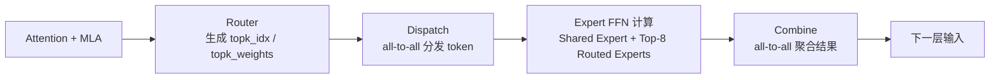

- **Dispatch** 发生在 Router 之后：根据每个 token 的 top-8 专家索引，将其 hidden state 发送到对应专家所在的 GPU。
- **Combine** 发生在 Expert 计算之后：将各专家返回的 hidden state 按 `topk_weights` 加权求和，发回原 GPU，恢复原始 batch/sequence 顺序。

> 对于 58 层 MoE 的 DeepSeek-V3，每一层都要执行上述完整流程两次通信，通信频率极高。因此，将 dispatch/combine 的延迟和开销降到最低，是决定模型训练和推理效率的关键。

---

## 4. Dispatch 与 Combine 端到端流程详解

本章从最基础的语义出发，详细拆解 DeepEP 中 dispatch 和 combine 在三种通信模式（Intranode、Internode、Low-Latency）下的完整执行流程。所有流程均配有对应的 Mermaid 流程图。

---

### 4.1 基础语义

#### 什么是 Dispatch？
Dispatch 是 MoE 层的前置通信步骤，其任务可概括为：
> **"把当前 GPU 上每个 token 的 hidden state，按照 router 分配的 top-k 专家索引，发送到持有这些专家的 GPU 上。"**

输入：
- `x`：当前 GPU 上的 token hidden states，形状 `(num_tokens, hidden)`。
- `topk_idx`：每个 token 激活的 top-k 专家索引，形状 `(num_tokens, num_topk)`，如 8。
- `topk_weights`：对应专家的权重，形状 `(num_tokens, num_topk)`。

输出：
- `recv_x`：当前 GPU 接收到的、需要由本地专家处理的所有 token 的 hidden states。
- `recv_topk_idx` / `recv_topk_weights`：接收到的 token 附带的路由信息，用于后续 combine。
- `handle`（或 `src_meta` 等）：缓存元数据，供 combine 阶段反向寻址。

#### 什么是 Combine？
Combine 是 MoE 层的后置通信步骤，其任务可概括为：
> **"把各专家计算后的输出，按原路由权重加权聚合，发回源 GPU，恢复原始序列顺序。"**

输入：
- 专家计算后的输出（在本地 GPU 上）。
- `handle` / `src_meta`：dispatch 阶段保存的元数据，告诉 combine 每个结果该发给谁。
- `topk_weights`：用于加权求和。

输出：
- `combined_x`：与原始 `x` 形状相同的聚合结果，可直接作为下一层的输入。

---

### 4.2 Intranode 模式下的完整流程

Intranode 模式适用于单节点内（最多 8 张 GPU，通过 NVLink 互联）。此时没有跨节点 RDMA，所有通信都通过直接读写 peer 的共享内存完成。

#### 4.2.1 Intranode Dispatch 流程

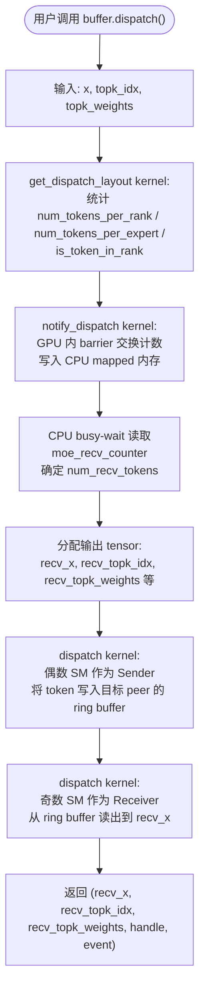

**流程说明：**
1. **Layout 阶段**：`get_dispatch_layout` 遍历 `topk_idx`，统计出每个 rank 和每个 expert 要接收多少 token，并生成 `is_token_in_rank` 布尔掩码。
2. **Notify 阶段**：`notify_dispatch` 让所有 GPU 的 SM 0 通过 NVLink barrier 汇聚计数，计算前缀和，并将最终接收总数写入 CPU 侧的 `moe_recv_counter`。
3. **CPU 同步**：CPU 发现 `moe_recv_counter` 从 `-1` 变为非负值后，就知道了 `num_recv_tokens`，从而可以精确分配 `recv_x` 的大小。
4. **Dispatch Kernel**：发射 `num_sms` 个 block（必须为偶数）。偶数 block 的 warp 负责将本地 token 按目标 rank 分组，写入 peer 的 NVLink ring buffer；奇数 block 的 warp 负责从本地 ring buffer 读取数据，写入 `recv_x`。SM90 上使用 TMA 加速拷贝。

#### 4.2.2 Intranode Combine 流程

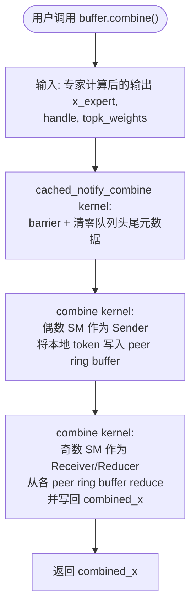

**流程说明：**
1. **Notify/Prepare 阶段**：`cached_notify_combine` 首先执行 barrier，确保所有 rank 都准备好，然后清零 ring buffer 的头尾指针。它还会对 `send_head` 做反向填充，方便 receiver 快速跳过空槽。
2. **Combine Kernel**：偶数 block 作为 sender，把本地需要归约的 token 写入各 peer 的 ring buffer；奇数 block 作为 receiver/reducer，从多个 peer 的 ring buffer 中读取数据，在寄存器中以 `float` 精度累加（可选 bias），最后 cast 回 `bf16` 写回 `combined_x`。

---

### 4.3 Internode 模式下的完整流程

Internode 模式适用于多节点集群（如 DeepSeek-V3 的 EP64）。节点内用 NVLink，节点间用 RDMA（InfiniBand）。DeepEP 采用了"两阶段转发"策略：先 RDMA 到目标节点的代表卡，再 NVLink 二次转发。

#### 4.3.1 Internode Dispatch 流程

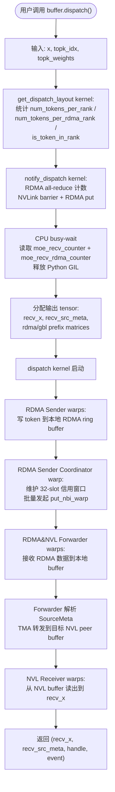

**流程说明：**
1. **Layout 阶段**：除了统计 per-rank 的 token 数，还要统计 per-rdma-rank（即 per-node）的 token 数，因为 RDMA 是以节点为单位发送的。
2. **Notify 阶段**：SM 0 先 quiet 所有 QP，然后通过 NVLink barrier 和 RDMA put 交换计数，最后把全局接收数写回 CPU mapped 内存。由于跨节点通信耗时更长，CPU busy-wait 期间**显式释放了 Python GIL**，避免阻塞其他线程。
3. **Dispatch Kernel**：这是一个 fused kernel，内部有 5 种 warp 角色：
   - **RDMA Sender**：把本地 token 拷贝到 RDMA ring buffer。
   - **RDMA Sender Coordinator**：维护 32-slot 滑动窗口，只有当远端有空闲 slot 时才通过 `put_nbi_warp` 发起 RDMA 发送，防止缓冲区溢出。
   - **RDMA&NVL Forwarder**：在代表卡上接收 RDMA 数据，解析 `SourceMeta`（8 字节路由元数据），然后通过 TMA 把 token 转发到节点内需要该 token 的 NVLink peer buffer。
   - **Forwarder Coordinator**：监控转发进度，通过 AMO add 回收 RDMA 发送信用。
   - **NVL Receiver**：从 NVLink buffer 消费数据，写入最终的 `recv_x`。

#### 4.3.2 Internode Combine 流程

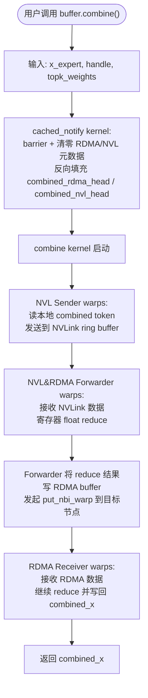

**流程说明：**
1. **Prepare 阶段**：`cached_notify` 清零 RDMA 和 NVLink 的队列元数据，并对 `combined_rdma_head` / `combined_nvl_head` 做反向填充，让缺失的 token 可以被快速跳过。
2. **Combine Kernel**：是 dispatch 的逆过程：
   - **NVL Sender**：把本地需要聚合的 token 发到 NVLink ring buffer。
   - **NVL&RDMA Forwarder**：接收来自节点内所有 peer 的数据，reduce 后写入 RDMA buffer，再通过 `put_nbi_warp` 发往目标节点。
   - **RDMA Receiver**：在目标节点接收 RDMA 数据，做最终 reduce，写回 `combined_x`。
   - **Coordinator**：同时更新 NVLink 和 RDMA 的最小 head，释放 credit。

---

### 4.4 Low-Latency 模式下的完整流程

Low-Latency 模式面向对延迟极度敏感的场景（如 decode 阶段）。它跳过 NVLink 二次转发，直接通过 IBGDA（GPU-initiated RDMA）点对点通信，并支持 hook 机制实现计算-通信重叠。

#### 4.4.1 Low-Latency Dispatch 流程

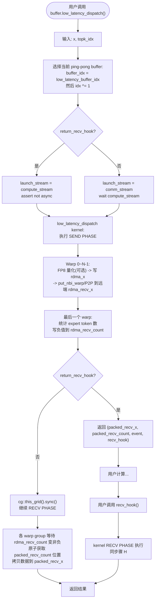

**流程说明：**
1. **Buffer 选择**：每次调用都会切换 `low_latency_buffer_idx ^= 1`，使用 ping-pong 双缓冲。
2. **Send Phase**：在 kernel 内，大部分 warp 负责遍历 token，可选做 FP8 量化，然后通过 `nvshmemi_ibgda_put_nbi_warp` 或 P2P 零拷贝发送到远端的 `rdma_recv_x`。最后一个 warp 负责统计每个 expert 的接收 token 数，并将负值计数写入远端的 `rdma_recv_count`（通知接收方数据量）。
3. **Recv Phase**：如果 `return_recv_hook=False`，send 和 recv 在同一个 kernel 内通过 `cg::this_grid().sync()` 分隔。各 warp group 等待 `rdma_recv_count` 变为非负，原子获取在 `packed_recv_x` 中的写入位置，然后把 `rdma_recv_x` 的数据拷贝过来，并重新排列 FP8 scale。
4. **Hook 模式**：如果 `return_recv_hook=True`，kernel 只执行 send phase 后立即返回一个 `recv_hook` callable。用户可以在当前 CUDA stream 上继续执行其他计算（如 Attention），待需要结果时再调用 `recv_hook()` 触发 recv phase。这种方式让 GPU 在等待网络传输期间不被通信阻塞。

#### 4.4.2 Low-Latency Combine 流程

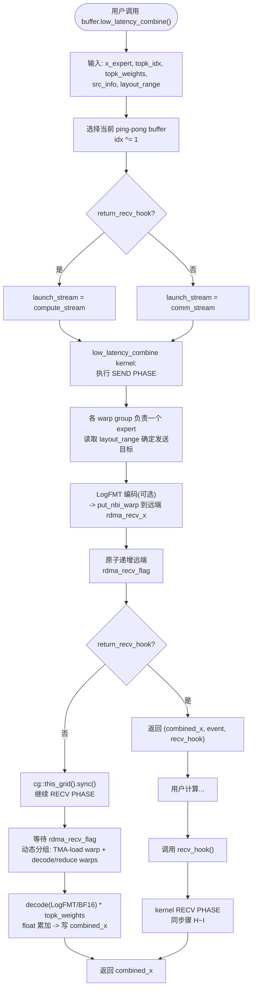

**流程说明：**
1. **Send Phase**：每个 warp group 负责一个 expert。根据 `layout_range` 确定要发给哪些 rank 的哪些 token。可选做 LogFMT 压缩，然后通过 IBGDA `put_nbi_warp` 发送。所有发送完成后，原子递增远端的 `rdma_recv_flag`。
2. **Recv Phase**：等待所有源 rank 的 `rdma_recv_flag` 就绪。线程被动态分为最多 2 个 decode group，每个 group 内有一个 warp 负责 TMA 预取（3-stage pipeline），其余 warp 负责 decode 并累加。最终结果写回 `combined_x`。
3. **Hook 模式**：与 dispatch 相同，combine 也可以拆分为 send/recv 两个阶段，通过 hook 延迟触发 recv phase，最大化与计算的 overlap。

---

### 4.5 三种模式的对比总结

| 维度 | Intranode | Internode | Low-Latency |
|------|-----------|-----------|-------------|
| **适用场景** | 单节点（≤8 GPU） | 多节点集群 | Decode / 超低延迟 |
| **跨节点方式** | 无 | RDMA + NVLink 二次转发 | 纯 IBGDA RDMA / P2P |
| **Kernel 数量** | notify + dispatch（2 个） | notify + dispatch（2 个） | 1 个（fused send/recv，可 hook 拆分） |
| **CPU 同步** | busy-wait | busy-wait（释放 GIL） | 无 CPU 同步 |
| **最大并发缓冲** | 无限制 | 无限制 | 2 个（ping-pong 限制） |
| **特色优化** | TMA 拷贝 | Credit 窗口、SourceMeta | Hook 重叠、FP8/LogFMT 在线转换 |

理解上述流程后，再看 DeepEP 的代码结构就会非常清晰：**无论哪种模式，底层都是"通知-分配-传输"三段式模型，区别在于通知的范围、分配的方式，以及传输路径的选择。**

---

## 5. Python 前端层

### 3.1 公共 API

`deep_ep/__init__.py` 导出了非常扁平的公共接口：

```python
from .utils import EventOverlap
from .buffer import Buffer
from deep_ep_cpp import Config, topk_idx_t
```

没有深层继承体系，核心类型只有三个：

| 类型 | 角色 |
|------|------|
| `Buffer` | 主通信缓冲区，封装 dispatch/combine 的全生命周期。 |
| `EventOverlap` | 对 C++ `EventHandle` 的薄包装，支持 `with` 语句实现流间同步。 |
| `Config` | 编译到 C++ 扩展中的轻量调参对象，控制 SM 数量和分块大小。 |

### 3.2 Buffer 的生命周期与初始化

`Buffer.__init__` 的执行流程如下：

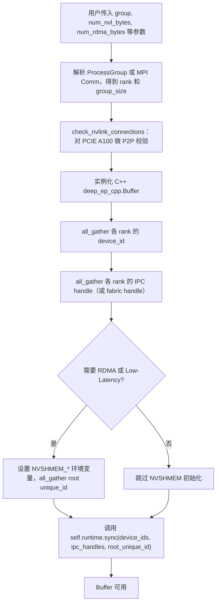

关键设计点：
- **IPC Handle 交换**：节点内每个 GPU 将自己的 `cudaIpcMemHandle_t`（或 Fabric Handle）广播给所有 peer，C++ 层在 `sync()` 中打开这些句柄，建立共享内存池。
- **NVSHMEM 初始化**：如果需要 internode 或 low-latency 通信，会收集 NVSHMEM 的 root unique ID，在 C++ 层调用 `nvshmemx_init_attr_with_uniqueid`。

### 3.3 自动路由机制

`Buffer.dispatch` 和 `Buffer.combine` 会根据运行时拓扑自动选择内核：

```python
if self.runtime.get_num_rdma_ranks() > 1:
    return self.internode_dispatch(...)
else:
    return self.runtime.intranode_dispatch(...)
```

用户无需显式区分 intranode 和 internode，调用统一 API 即可。

### 3.4 EventOverlap 与流同步

`EventOverlap` 包装了 C++ 的 `EventHandle`，其核心语义是：

```python
with event_overlap:
    # 在 event_overlap 关联的 stream 上执行某些操作
    pass
# 退出 with 块时，当前 CUDA stream 会 wait 该 event
```

这在异步模式（`async_finish=True`）下尤为重要：内核在 `comm_stream` 上提交，返回 `EventOverlap`，用户通过 `with event:` 让计算流等待通信完成。

### 3.5 Config 与性能调参

`Config` 的构造参数：

```cpp
Config(int num_sms = 20,
       int num_max_nvl_chunked_send_tokens = 6,
       int num_max_nvl_chunked_recv_tokens = 256,
       int num_max_rdma_chunked_send_tokens = 6,
       int num_max_rdma_chunked_recv_tokens = 256)
```

设计约束（在 `config.hpp` 中硬校验）：
- `send_tokens > 0` 且 `send_tokens < recv_tokens`；
- `send_tokens <= recv_tokens / 2`（这是由“懒头更新”协议决定的，receiver 必须能容纳至少两批发送数据，否则发送端在 receiver 未消费完前会覆盖数据）。

---

## 6. C++ 运行时层

C++ 核心代码位于 `csrc/` 目录，包括 `deep_ep.hpp`（声明）、`deep_ep.cpp`（实现与 PyBind11 绑定）、`config.hpp`（配置与工具函数）、`event.hpp`（CUDA 事件封装）。

### 4.1 Buffer 类状态一览

`deep_ep::Buffer` 是一个 `struct`，所有成员直接暴露在同一作用域内。关键成员如下：

| 成员 | 类型 | 含义 |
|------|------|------|
| `low_latency_buffer_idx` | `int` | 低延迟双缓冲索引（0/1 切换）。 |
| `low_latency_mode` | `bool` | 是否为低延迟模式。 |
| `num_nvl_bytes` | `int64_t` | NVLink 环形缓冲区大小。 |
| `buffer_ptrs[NUM_MAX_NVL_PEERS]` | `void*` | 每个 NVLink peer 的缓冲区基址（本地 + 打开的 IPC）。 |
| `buffer_ptrs_gpu` | `void**` | 设备端 `buffer_ptrs` 副本，供 kernel 直接读取。 |
| `num_rdma_bytes` | `int64_t` | NVSHMEM RDMA 缓冲区大小。 |
| `rdma_buffer_ptr` | `void*` | NVSHMEM 分配的 RDMA 缓冲区。 |
| `barrier_signal_ptrs_gpu` | `int**` | 设备端屏障信号指针数组。 |
| `workspace` | `void*` | 32 MiB 设备工作区（`NUM_WORKSPACE_BYTES`）。 |
| `moe_recv_counter` 等 | `int*` | 主机端锁定页（pinned + mapped），供 CPU busy-wait 读取 GPU 写的接收计数。 |
| `comm_stream` | `at::cuda::CUDAStream` | 内部高优先级 CUDA 流，所有通信 kernel 均在此流上发射。 |
| `shared_memory_allocator` | `SharedMemoryAllocator` | 根据 `use_fabric` 选择 Fabric 或 IPC 分配器。 |

### 4.2 SharedMemoryAllocator：IPC vs Fabric

```cpp
union MemHandleInner {
    cudaIpcMemHandle_t cuda_ipc_mem_handle;
    CUmemFabricHandle cu_mem_fabric_handle;
};
struct MemHandle { MemHandleInner inner; size_t size; };
```

- **IPC 路径**：调用 `cudaMalloc` + `cudaIpcGetMemHandle` / `cudaIpcOpenMemHandle`，适用于单节点内 GPU 间共享内存。
- **Fabric 路径**：调用驱动 API `cuMemCreate` → `cuMemAddressReserve` → `cuMemMap` → `cuMemSetAccess`，生成 Fabric Handle，适用于多节点 Scale-up 场景（如 NVLink4 + NVSwitch 的远程内存访问）。

### 4.3 sync()：建立全网共享内存视图

`Buffer::sync()` 是通信准备阶段的核心函数，流程如下：

1. **IPC Handle 解析**：遍历所有 NVLink peer，用 `shared_memory_allocator.open_mem_handle` 打开远程句柄，填充 `buffer_ptrs[]` 和 `barrier_signal_ptrs[]`。
2. **拷贝到设备端**：将上述指针数组通过 `cudaMemcpyAsync` 复制到设备内存 `buffer_ptrs_gpu` 和 `barrier_signal_ptrs_gpu`，供 kernel 使用。
3. **NVSHMEM 初始化**（若启用）：
   - 调用 `internode::init(root_unique_id, nvshmem_rank, num_nvshmem_ranks, low_latency_mode)`；
   - 若 `low_latency_mode` 且 `num_ranks > 8`，会创建一个 strided 的 RDMA sub-team（`cpu_rdma_team`），让低延迟模式下的 QP 数与 local experts 对齐；
   - 分配并清零 `rdma_buffer_ptr`；
   - 若 `enable_shrink`，分配 `mask_buffer_ptr` 和 `sync_buffer_ptr`。
4. 设置 `available = true`。

### 4.4 destroy() 与析构函数

`destroy()` 的执行顺序经过精心设计，以避免 use-after-free 和死锁：

1. `cudaDeviceSynchronize()` 全局同步；
2. 若存在 NVLink 缓冲区：先执行 intranode barrier，再关闭远程 IPC handle，最后释放本地块；
3. 若启用了 NVSHMEM：先 barrier，释放 `rdma_buffer_ptr`、shrink 缓冲区，再 `internode::finalize()`；
4. 释放 `workspace` 和 CPU mapped 计数器；
5. 设置 `destroyed = true; available = false`。

析构函数 `~Buffer()` 的行为：
- 若 `explicitly_destroy == false`（默认），析构时自动调用 `destroy()`；
- 若 `explicitly_destroy == true`，则要求用户显式调用 `destroy()`，否则打印警告。这是因为 Python 异常处理过程中自动析构可能与 CUDA 同步发生死锁，显式销毁更可控。

### 4.5 计算流与通信流的交互模式

所有 dispatch/combine/layout 方法都遵循统一的流切换模板：

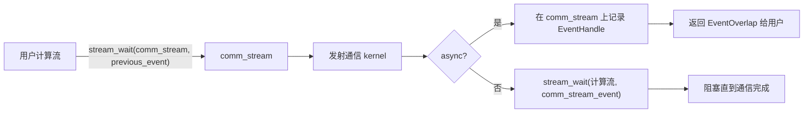

当 `allocate_on_comm_stream=True` 时，输出 tensor 的分配也会临时切到 `comm_stream` 上，确保分配和计算在正确的事件序下完成。

### 4.6 CPU Busy-Wait：非缓存路径的同步核心

在 **非缓存 dispatch** 路径中（即第一次调用或 token 分布发生变化时），GPU 需要先交换每个 rank 要接收多少 token，然后 CPU 才知道该分配多大的输出缓冲区。由于这个信息在 GPU 上产生，CPU 必须等待 GPU 写完才能继续。

解决方案：在 `Buffer` 构造时分配了 **pinned + mapped** 的 host 内存（`moe_recv_counter`、`moe_recv_expert_counter`、`moe_recv_rdma_counter`），并在 `notify_dispatch` kernel 中由 GPU 原子写入这些地址。然后 CPU 侧执行 busy-wait：

```cpp
while (*moe_recv_counter < 0) {
    if (timeout) EP_HOST_ASSERT(false);
}
```

**Internode dispatch 特别释放了 Python GIL**：
```cpp
pybind11::gil_scoped_release release;
```
因为 busy-wait 可能持续数百微秒到数毫秒，释放 GIL 能避免阻塞其他 Python 线程（例如 KV Cache 传输线程）。

---

## 7. 通信模式详解

DeepEP 的三种通信模式在问题定义、带宽利用和延迟模型上有本质差异。

### 5.1 Intranode（纯 NVLink）

**适用场景**：单节点内最多 8 个 GPU（如 DGX H100），GPU 之间通过 NVLink 全互联或 cube mesh 互联。

**内存模型**：每个 GPU 分配一段本地共享内存，其他 7 个 peer 通过打开的 IPC handle 获得直接读写权限。所有 rank 的缓冲区基址收集在 `buffer_ptrs_gpu` 中，kernel 通过 `buffer_ptrs[peer_rank]` 直接 `st_global` / `ld_global`。

**Kernel 分工**：
- `layout::get_dispatch_layout`：先统计每个 expert 和每个 rank 要接收多少 token。
- `intranode::notify_dispatch`：GPU 内通过 barrier 和 shared memory 交换计数，写回 CPU mapped 计数器。
- `intranode::dispatch`：发送 SM（偶数 SM）将 token 写入目标 peer 的环形缓冲区；接收 SM（奇数 SM）从本地环形缓冲区读出到 `recv_x`。
- `intranode::cached_notify_dispatch` / `cached_notify_combine`：当 token 分布不变时，跳过计数交换，直接清零队列头尾。

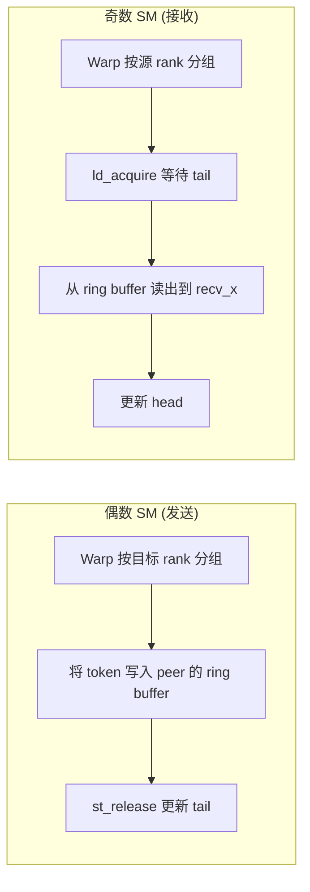

**关键技术细节**：
- 发送端使用 `UNROLLED_WARP_COPY(5, ...)` 进行 `int4` 级别的批量拷贝，隐藏延迟。
- SM90（Hopper）上接收端使用 **TMA**（`tma_load_1d` 从 ring buffer 读到 shared memory，再 `tma_store_1d` 写到 `recv_x`），降低寄存器压力。
- 通过 `bar.sync` 在 block 内同步负责同一 rank 的多个 warp。

### 5.2 Internode（RDMA + NVLink 混合）

**适用场景**：多节点集群，每个节点 8 卡。跨节点通信走 RDMA（InfiniBand），节点内仍然走 NVLink。

**核心设计思想**：
- **两阶段转发**：源 GPU 先将 token 通过 RDMA 发到目标节点内的某张“代表卡”（与源卡具有相同 local index 的 GPU），然后该代表卡通过 NVLink 二次转发给节点内需要该 token 的其他 GPU。
- **不对称域带宽转发**：RDMA 带宽通常低于 NVLink，因此利用 NVLink 的高带宽做节点内二次分发，避免每张卡都单独发 RDMA。

**拓扑角色**：
- `num_ranks` = 总 rank 数（如 64）
- `num_nvl_ranks` = 每节点卡数（固定 8）
- `num_rdma_ranks` = 总节点数（如 8）
- `rdma_rank` = 节点 ID
- `nvl_rank` = 节点内的 local GPU index

**Internode dispatch 流程**：

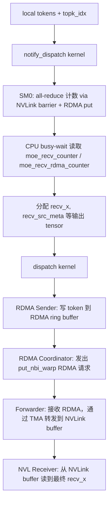

**Warp 角色分工（单 kernel 内）**：

| 角色 | 所在 SM | 职责 |
|------|---------|------|
| `kRDMASender` | 偶数 SM | 遍历本地 token，拷贝到 RDMA ring buffer，记录 `send_rdma_head`。 |
| `kRDMASenderCoordinator` | 偶数 SM | 维护 32-slot 滑动窗口，批量发起 `put_nbi_warp`，用 AMO add 更新远端 tail。 |
| `kRDMAAndNVLForwarder` | 奇数 SM | 接收 RDMA 数据到本地 RDMA buffer，解析 `SourceMeta`，用 TMA 转发到 NVLink ring buffer。 |
| `kForwarderCoordinator` | 奇数 SM | 监控转发进度，通过 AMO add / relaxed store 释放 RDMA 发送端的信用（credit）。 |
| `kNVLReceivers` | 奇数 SM | 从 NVLink buffer 消费数据，写回 `recv_x`，将 expert 索引转为 local expert id。 |

**SourceMeta**：一个 8 字节（64-bit）结构体，包含 `src_rdma_rank`（int）和 `is_token_in_nvl_rank_bits`（8-bit NVL peer 掩码），使得 forwarder 无需重新解析 `topk_idx` 就能知道要把 token 发给节点内的哪些 GPU。

**Internode combine 流程**：
Combine 是 dispatch 的逆过程：
1. 节点内各卡先将需要归约的 token 通过 NVLink 汇聚到代表卡；
2. 代表卡将归约结果通过 RDMA 发到目标节点；
3. 目标节点的代表卡再二次归约并写回 `combined_x`。

Kernel 内同样使用 TMA 多阶段流水线（2-stage 或 3-stage）和 `mbarrier` 进行生产者-消费者同步。

### 5.3 Low-Latency（纯 RDMA / IBGDA）

**适用场景**：对延迟极度敏感的场景（如 decoding 阶段），要求通信不占用 SM 做接收等待，支持 CUDA Graph。

**核心差异**：
- **跳过 NVLink 二次转发**：每个 GPU 直接通过 IBGDA（InfiniBand GPUDirect Async）与其他所有 GPU 通信。当 `num_ranks <= 8` 且 peer 位于同一节点时，`nvshmemi_get_p2p_ptr` 会返回有效的 NVLink P2P 指针，此时实际走零拷贝 P2P 而不是网卡 RDMA；只有在跨节点（`num_ranks > 8`）时才会真正走网卡 RDMA。
- **双缓冲（Ping-Pong）**：`rdma_buffer_ptr` 内部分为两套对称缓冲区，`low_latency_buffer_idx` 每次调用后翻转（`^= 1`），因此最多只能同时持有 2 个低延迟 kernel 的结果。
- **Hook 机制**：`low_latency_dispatch/combine` 支持 `return_recv_hook=True`，将 kernel 拆分为 send phase 和 recv phase。send phase 在调用时立即执行，recv phase 通过返回的 lambda（hook）在后续由用户触发，从而实现计算与通信的重叠。

**LowLatencyLayout**：
`LowLatencyLayout` 在 `rdma_buffer_ptr` 内静态划分出以下区域（每套 ping-pong buffer 都有）：
- Signaling 区（`rdma_recv_count`、`atomic_counter_per_expert` 等）
- Send 区（`rdma_x`）
- Receive 区（`rdma_recv_x`）

其大小由 `get_low_latency_rdma_size_hint` 根据 `num_max_dispatch_tokens_per_rank`、`hidden`、`num_ranks`、`num_experts` 计算得出，并向上对齐到 128 字节。

**Hook 模式下的流选择**：
- 若 `return_recv_hook=True`，kernel 在**用户当前 CUDA 流**（compute stream）上发射，且不允许 `async=True`（因为用户通过 hook 自己控制同步）。
- 否则在 `comm_stream` 上发射，并可选返回 `EventOverlap`。

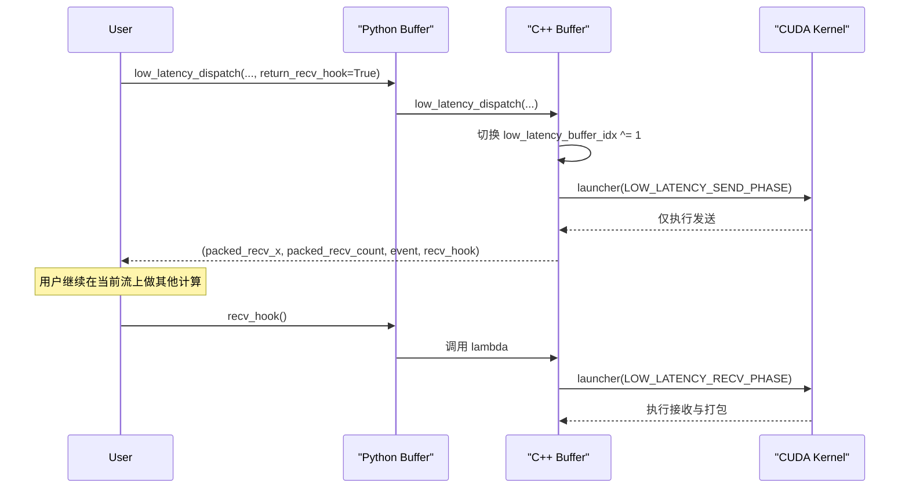

**FP8 支持（仅 SM90）**：
低延迟 dispatch 支持在发送时在线将 `bfloat16` 转换为 FP8（E4M3 或 UE8M0）。过程包括：
1. 每 128 个 hidden channel 做 `warp_reduce_max` 求 `amax`；
2. 计算 `scale = 448.0f / amax`（或 UE8M0 的 2 的幂次缩放）；
3. 使用 `__nv_cvt_float2_to_fp8x2` 批量转换；
4. 接收端将 FP8 反量化并重新排列 scale 布局。

**LogFMT 压缩（低延迟 combine）**：
为了进一步降低 RDMA 带宽，combine 支持 `use_logfmt=True`：
- 对每 128 channel 计算 `amax` 和 `amin`；
- 如果值域较小，使用 10-bit 对数量化（logarithmic quantization），将 256 bit 压缩到 160 bit；
- 接收端动态解码，恢复为 `float` 后再累加。

**Shrink / 故障屏蔽**：
当 `enable_shrink=True` 时，Buffer 会分配 `mask_buffer_ptr`。如果某个 peer 超时未响应（通过 `dispatch_wait_recv_cost_stats` 等机制检测），可以动态将该 rank 标记为 masked，后续通信跳过该 peer，实现部分失效容忍。

---

## 8. CUDA Kernel 实现细节

### 6.1 Layout Kernels (`layout.cu`)

`get_dispatch_layout` 负责从 `topk_idx` 统计出：
- `num_tokens_per_rank`：每个 rank 接收的 token 数；
- `num_tokens_per_rdma_rank`：每个 RDMA 组（节点）接收的 token 数；
- `num_tokens_per_expert`：每个专家接收的 token 数；
- `is_token_in_rank`：每个 token 是否会被发到某个 rank（布尔掩码）。

**算法**：
- 前 `ceil(num_experts / 4)` 个 SM 负责 expert 计数：每个 SM 处理最多 4 个 expert，256 个线程各自遍历全部 token，在 shared memory 中维护 per-thread 直方图，最后跨线程规约。
- 剩余 SM 负责 rank 计数：每个 SM 处理最多 8 个 rank，线程遍历 token，检查 top-k 索引是否落在该 rank 的 expert 范围内，累加并设置 `is_token_in_rank`。

### 6.2 Intranode Kernels (`intranode.cu`)

#### notify_dispatch

SM 0 执行以下步骤：
1. `barrier_block`：所有 rank 的 SM 0 到达同一点；
2. 每个 rank 将自己的 `num_tokens_per_rank` 和 `num_tokens_per_expert` 写入对称缓冲区（其他 peer 的 shared memory）；
3. 再次 barrier 后，SM 0 计算 `rank_prefix_matrix`（前缀和矩阵）并写入 CPU mapped 计数器；
4. `memset` 清零 tail 索引，为后续 dispatch 做准备。

SM 1 ~ num_channels 负责计算 `channel_prefix_matrix`：对每个目标 rank，扫描 `is_token_in_rank`，计算每个 channel 要发送多少 token 的前缀和。

#### dispatch

发射 `num_sms` 个 block，必须为偶数（`num_channels = num_sms / 2`）。

**Sender（偶数 SM）**：
- 每个 block 内的 warp 按 `responsible_rank` 分组；
- 以 `num_max_send_tokens` 为粒度，将 token 的 hidden 数据（`int4` 为单位）拷贝到目标 peer 的 `channel_x_buffers`；
- 同时写入 metadata（`src_idx`、`topk_idx`、`topk_weights`、`x_scales`）；
- 使用 `st_release_sys_global` 原子释放 tail，通知 receiver 数据可用。

**Receiver（奇数 SM）**：
- 每个 block 负责从一个源 rank 接收；
- 使用 `ld_acquire_sys_global` 等待 sender 的 tail；
- SM90 使用 TMA 将 ring buffer 数据批量搬到 `recv_x`；
- 非 SM90 使用 warp-striped `ld_nc_global` / `st_na_global`；
- 未使用的槽位在 `recv_topk_idx` 中填充 `-1`。

#### combine

Even SM 为 sender，odd SM 为 receiver/reducer。

**Receiver 端的 reduce 逻辑**：
- warp 0 负责持续更新所有 consumer warp 的最小队列 head；
- 其他 warp 遍历自己的 token，读取 `send_head` 知道哪些 rank 贡献了该 token；
- 对每个 rank 的 ring buffer 执行 `ld_nc_global`，在寄存器中以 `float` 精度累加；
- 可选地加上 `bias_0` / `bias_1`；
- 最后 cast 回 `nv_bfloat16`，通过 TMA（SM90）或直接 global store 写回 `recv_x`。

### 6.3 Internode Kernels (`internode.cu`)

#### notify_dispatch

SM 0 执行：
1. `nvshmemi_ibgda_quiet`：确保所有之前的 RDMA QP 操作完成；
2. NVLink `barrier_block<NUM_MAX_NVL_PEERS>`；
3. 若需要，调用 `nvshmem_sync_with_same_gpu_idx` 同步跨节点的同索引 GPU；
4. 将计数打包到对称 RDMA 缓冲区；
5. 对所有远程 RDMA rank 发起 `put_nbi_warp`；
6. 等待完成、barrier、规约 RDMA 接收到的计数到 NVLink 发送缓冲区；
7. 再次 NVLink barrier，计算全局前缀和并写回 CPU mapped 计数器。

SM 1 ~ num_rdma_ranks 负责计算：
- `rdma_channel_prefix_matrix`：每个 RDMA channel 的 token 前缀和；
- `gbl_channel_prefix_matrix`：全局 channel 的 token 前缀和。

#### dispatch

这是整个代码库最复杂的 kernel 之一，长约 770 行。核心思路是：在一个 fused kernel 内完成 **RDMA 发送 → RDMA 接收并 NVLink 转发 → NVLink 接收** 的全流程。

**信用机制（Credit / Sliding Window）**：
`kRDMASenderCoordinator` 维护每个 RDMA rank 的 32-slot 发送窗口（`rdma_send_channel_window`）。只有当远端确认有空闲 slot 时（通过 AMO add 获取的 tail 偏移），才会发起下一批 `put_nbi_warp`。这避免了 RDMA 缓冲区溢出，同时允许最多 32 个 chunk 在网线上并发传输。

**TMA 在转发中的使用**：
`kRDMAAndNVLForwarder` 使用 `tma_load_1d` 将 RDMA buffer 中的 token 批量读到 shared memory，然后用 `tma_store_1d` 写到 NVLink 的目标 peer buffer。TMA 的异步特性使得 forwarder 可以在等待数据到达的同时处理其他 token。

#### cached_notify

在 cached dispatch 之后、combine 之前执行，用于：
1. 清空 RDMA 和 NVLink buffer 的元数据；
2. 对 `combined_rdma_head` 和 `combined_nvl_head` 做反向填充（将负数条目替换为 `-last_head - 1`），这样在 combine 时可以通过简单的比较快速跳过缺失的 token。

#### combine

Combine kernel 同样采用 warp-role specialization：
- `kNVLSender`：从本地 `combined_x` 读取并发送到 NVLink ring buffer；
- `kNVLAndRDMAForwarder`：接收 NVLink 数据，reduce 后写入 RDMA buffer，再 `put_nbi_warp` 到远端；
- `kRDMAReceiver`：接收 RDMA 数据，reduce 后直接写回 `combined_x`；
- `kCoordinator`：更新最小 head，释放信用。

`combine_token` 模板函数：
- `kUseTMA = true`（forwarder 路径）：使用 2-stage TMA 预取流水线，将多个 rank 的数据先读到 shared memory，再在寄存器中以 `float` 累加，最后 TMA store 到 RDMA buffer。
- `kUseTMA = false`（receiver 路径）：直接从 global memory `ld_nc_global` 读取，寄存器累加后 `st_na_global` 写回。

### 6.4 Low-Latency Kernels (`internode_ll.cu`)

#### clean_low_latency_buffer

在切换到 low-latency 模式前调用（或每次调用前根据需要调用），用于清零 RDMA 缓冲区中的 signaling 区（计数器和 flag）。它使用 `cg::this_grid().sync()` 进行全网格同步，然后对两个 ping-pong buffer 的 metadata 执行 `memset`。

#### dispatch

Send phase：
- 大部分 warp 遍历本地 token，根据 `topk_idx` 确定目标 expert 和 rank；
- 若 `use_fp8`，执行在线 FP8 量化；
- 将数据写入 `rdma_x`（本地 send buffer），然后通过 `nvshmemi_ibgda_put_nbi_warp` 或 P2P `ld_nc_global`/`st_na_global` 发送到远端的 `rdma_recv_x`；
- 最后一个 warp 统计每个 expert 的 token 数，将负值计数写入远端的 `rdma_recv_count`（通知接收方有多少数据到达）。

Recv phase（若在同一 kernel 内，通过 `cg::this_grid().sync()` 分隔）：
- 每个 warp group 等待对应 expert 的 `rdma_recv_count` 变为非负（spin-loop，带 timeout）；
- 原子获取 `packed_recv_count` 中的写入位置；
- 将 `rdma_recv_x` 中的数据拷贝到 `packed_recv_x`，并重新排列 FP8 scale。

#### combine

Send phase：
- 每个 warp group 负责一个 expert；
- 根据 `layout_range` 确定要发给哪些 rank 的哪些 token；
- 若 `use_logfmt`，执行在线 LogFMT 编码；
- 发起 IBGDA `put_nbi_warp`；
- 所有发送完成后，原子递增远端的 `rdma_recv_flag`。

Recv phase：
- 等待 `rdma_recv_flag` 指示所有源 rank 发送完成；
- **动态分组**：线程被拆分为最多 2 个 decode group；
- 每个 group 内有一个 warp 负责 TMA 预取（3-stage pipeline，`full_barriers` 和 `empty_barriers`），其他 warp 负责 decode 并累加；
- 最终结果通过 `tma_store_1d` 写回 `combined_x`。

### 6.5 IBGDA 设备层 (`ibgda_device.cuh`)

`ibgda_device.cuh` 是从 NVSHMEM 的 `ibgda_device.cuh` 精简而来的设备端 RDMA 原语库，提供了不经过 CPU 的直接 GPU-initiated RDMA 能力。

**核心原语**：

| 函数 | 作用 |
|------|------|
| `nvshmemi_ibgda_put_nbi_warp` | warp 级非阻塞 RDMA WRITE。自动处理 local/remote MR 边界不一致时的分片。 |
| `nvshmemi_ibgda_rma_p` | 远程写一个 4 字节 `int`（inline RDMA WRITE）。 |
| `nvshmemi_ibgda_amo_nonfetch_add` | 远程原子加（masked fetch-and-add）。 |
| `nvshmemi_ibgda_quiet` | 轮询 CQ 直到当前 `prod_idx` 之前的所有 WQE 完成。 |
| `nvshmemi_get_p2p_ptr` | 若 peer 可通过 NVLink P2P 访问，返回可直接 `ld/st` 的指针，否则返回 0。 |

**WQE 构造与门铃**：
- `ibgda_write_rdma_write_wqe`：构建标准 RDMA WRITE WQE；
- `ibgda_write_amo_add_wqe`：构建 32-bit AMO WQE；
- `ibgda_reserve_wqe_slots`：通过原子加在 TX WQ 上预留 slot；
- `ibgda_post_send`：更新 producer index 并写 doorbell record（BlueFlame 门铃）。

这些函数全部在 GPU 上执行，实现了零 CPU 参与的 RDMA 通信，是 DeepEP 低延迟能力的基石。

---

## 9. 构建系统与编译配置

### 7.1 setup.py 构建流程

`setup.py` 使用 PyTorch 的 `CUDAExtension` 构建 `.so` 扩展。源码文件分为两组：

- ** always compiled**：`deep_ep.cpp`、`runtime.cu`、`layout.cu`、`intranode.cu`
- **NVSHMEM-dependent**：`internode.cu`、`internode_ll.cu`（仅当检测到 NVSHMEM 时才编译）

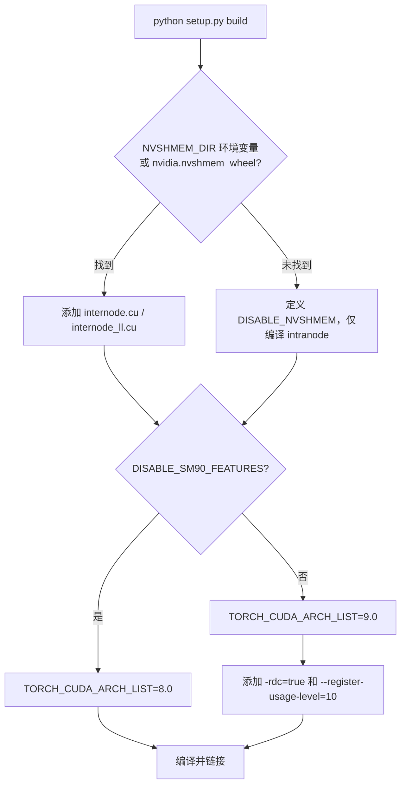

### 7.2 NVSHMEM 检测逻辑

```python
nvshmem_dir = os.getenv('NVSHMEM_DIR', None)
if nvshmem_dir is None:
    try:
        nvshmem_dir = importlib.util.find_spec("nvidia.nvshmem").submodule_search_locations[0]
    except (ModuleNotFoundError, AttributeError, IndexError):
        disable_nvshmem = True
```

- 若通过 `NVSHMEM_DIR` 或 `nvidia.nvshmem` wheel 找到 NVSHMEM，则添加头文件路径、库路径，并链接 `libnvshmem_host.so.*` 和 `libnvshmem_device.a`。
- 同时需要在 `nvcc_dlink` 阶段传入 `-dlink -L$NVSHMEM_DIR/lib -lnvshmem_device`，以解析 relocatable device code（RDC）符号。

### 7.3 条件编译宏

| 宏 | 触发条件 | 效果 |
|----|----------|------|
| `DISABLE_NVSHMEM` | NVSHMEM 未找到 | 排除 internode/low-latency 源码，禁用所有 RDMA 功能。 |
| `DISABLE_SM90_FEATURES` | 环境变量 `DISABLE_SM90_FEATURES=1` | 强制 arch 8.0，禁用 FP8、TMA、自定义启动方式。**同时强制禁用 NVSHMEM**。 |
| `DISABLE_AGGRESSIVE_PTX_INSTRS` | 默认 `1`，除非 arch 恰好是 `9.0` | 禁用 `.L1::no_allocate.L2::256B` 等激进 PTX 指令，保证兼容性。 |
| `TOPK_IDX_BITS=32/64` | 环境变量 `TOPK_IDX_BITS` | 控制 `topk_idx_t` 为 `int32_t` 或 `int64_t`（默认 64）。 |

### 7.4 CUDA 架构选择

- **SM90（默认）**：针对 H100/H800，启用 TMA、`nv_bfloat16`、FP8、`__nv_cvt_float2_to_fp8x2` 等 Hopper 专属指令。
- **SM80 回退**：A100 用户设置 `DISABLE_SM90_FEATURES=1`，此时库仅支持 intranode（因为 NVSHMEM 也被强制禁用），且所有 TMA/FP8 路径被编译器排除。

### 7.5 格式化与 CI

- **Python**：`yapf`（基于 PEP8，列宽 140）+ `ruff` 作为 linter。
- **C++/CUDA**：`clang-format` 15.0.7（Google style，列宽 140）。
- `format.sh` 脚本会先处理 `//#pragma unroll` 的保护逻辑（clang-format 对 `#pragma unroll` 有已知 bug，会错误缩进，脚本通过临时替换规避），再调用格式化工具。
- CI 中的 format job 运行 `format.sh`，若产生任何 diff 则构建失败。

---

## 10. 设计权衡与安全考量

### 8.1 性能 vs 兼容性

**激进 PTX 指令**：
代码中使用了 `ld.global.nc.L1::no_allocate.L2::256B` 这种未定义行为（UB）的 PTX，用于在 Hopper 上获得极致的 volatile 读取性能。该行为仅在 `TORCH_CUDA_ARCH_LIST` 恰好为 `9.0` 时默认启用，其他情况自动关闭，体现了“在可控风险下追求极致性能”的权衡。

**TMA 与 Register Pressure**：
在 combine 的 reduce 路径中，使用 TMA 虽然增加了 shared memory 占用和同步复杂度，但显著降低了寄存器压力，允许编译器生成更高的 occupancy。这在 Hopper 的高带宽场景下是净收益。

### 8.2 延迟 vs 吞吐量

**Normal Kernels vs Low-Latency Kernels**：
- **Normal**：采用两阶段 RDMA+NVLink 转发，最大化跨节点吞吐，但 latency 较高（因为涉及多次 kernel launch 和 NVLink 二次转发）。
- **Low-Latency**：采用纯 RDMA，kernel 内 fused send/recv，支持 hook 重叠，latency 最低，但 RDMA 带宽利用率可能不如 normal 模式（因为缺少 NVLink 聚合）。

**CPU Busy-Wait 的权衡**：
非缓存 dispatch 需要 CPU 等待 GPU 写出接收计数。DeepEP 选择了 pinned + mapped host memory + CPU spin 的方案，而不是 cudaMemcpyAsync + event wait，原因是：
- 减少一次 host-device 拷贝和 kernel launch 开销；
- busy-wait 的延迟远低于 callback/event 路径；
- 代价是浪费一个 CPU core。对于通信密集型训练任务，这是一个可接受的 trade-off。

### 8.3 内存与灵活性

**双缓冲限制**：
Low-latency 模式只使用 2 个 ping-pong buffer，因此用户不能同时持有超过 2 个未完成的 low-latency dispatch/combine 结果。这是为了在 latency 和内存占用之间取得平衡——增加 buffer 数量会线性增加 RDMA 内存需求。

**缓存路径（Cached Handles）**：
当 token 分布不变时，用户可以传入 `cached_rank_prefix_matrix` 等参数，跳过 `notify_dispatch` 的计数交换和 CPU busy-wait。这显著降低了重复调用的 latency，但要求用户自己管理缓存一致性。

### 8.4 GIL 释放与 Python 线程安全

`internode_dispatch` 显式释放了 Python GIL：
```cpp
pybind11::gil_scoped_release release;
```
这是因为在跨节点场景下，CPU busy-wait 可能持续更久，若持有 GIL 会阻塞同进程内的其他 Python 线程（例如做 KV Cache offloading 或数据预处理的线程）。其他方法（如 intranode dispatch）由于 busy-wait 时间通常很短，没有释放 GIL。

### 8.5 零拷贝与 P2P 短路

在 low-latency 内核中，代码会尝试通过 `nvshmemi_get_p2p_ptr` 获取 peer 的 P2P 指针。如果成功（说明 peer 在同节点且 NVLink 可用），则直接走 `ld_nc_global` / `st_na_global` 的零拷贝路径，而不是 IBGDA RDMA。这兼顾了低延迟模式在单节点和多节点混合部署时的效率。

---

## 11. 测试体系

测试使用 `torch.multiprocessing.spawn` 在每个 GPU 上起一个进程，通过 NCCL 建立进程组。

### 9.1 test_intranode.py

- **Layout 正确性**：对比 `get_dispatch_layout` 与 Python 参考实现。
- **Dispatch/Combine 闭环**：BF16 和 FP8（若编译支持）的前向分发 + 反向聚合，验证数值一致性。
- **异步模式**：`async_finish=True` 和 `previous_event` 的流同步。
- **Cached 路径**：重用 handle 跳过 CPU 同步。
- **Worst-case**：`num_worst_tokens > 0` 的 CUDA-Graph 兼容路径。
- **Auto-tuning**：网格搜索 `nvl_chunk_size` 和 SM 数量，报告带宽。

### 9.2 test_internode.py

- 覆盖 `test_intranode.py` 的所有测试项，但在 internode 模式下执行。
- 额外测试：
  - `num_tokens_per_rdma_rank` 的元数据正确性；
  - Grouped top-k（DeepSeek-V3 风格专家分组）；
  - Combine 中的 `bias=(bias_0, bias_1)`；
  - **压力测试（pressure test）**：固定随机种子重复 20 次，通过 `hash_tensor` 验证结果确定性，以捕捉竞态条件或内存污染。
- Auto-tuning 同时搜索 `rdma_chunk_size` 和 `nvl_chunk_size`。

### 9.3 test_low_latency.py

- **Low-latency dispatch/combine**：验证数值正确性。
- **FP8 路径**：`use_fp8=True`、`round_scale=True`、`use_ue8m0=True`。
- **Hook 机制**：`return_recv_hook=True`，验证 send/recv 分阶段执行和结果正确性。
- **LogFMT**：`use_logfmt=True` 的 combine 压缩路径。
- **Shrink 测试**：动态 mask/unmask rank，验证 `mask_status` 和跳过逻辑。
- **带宽基准**：分别报告 dispatch 和 combine 的 RDMA 带宽，以及 hook 模式下的 send/recv 耗时拆分。

---

## 12. 核心流程图解

### 10.1 Buffer 完整生命周期

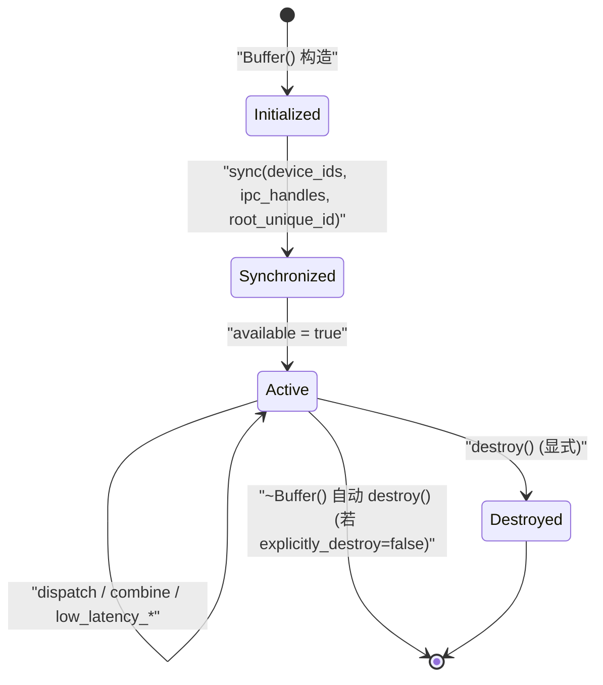

### 10.2 正常 Dispatch 端到端流程

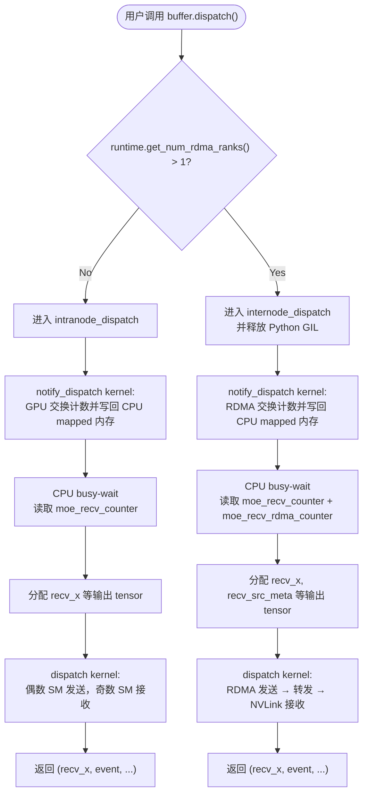

### 10.3 正常 Combine 端到端流程

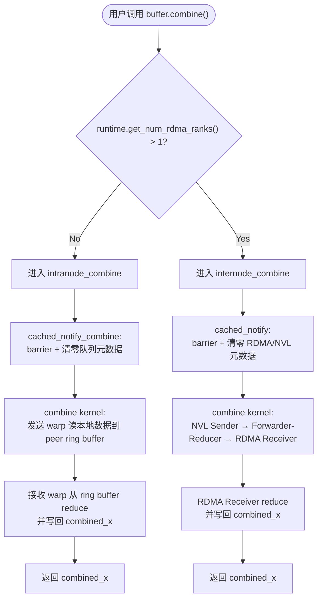

### 10.4 Internode Dispatch Kernel 内部 Warp 角色

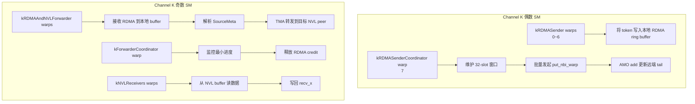

### 10.5 Low-Latency 双缓冲切换

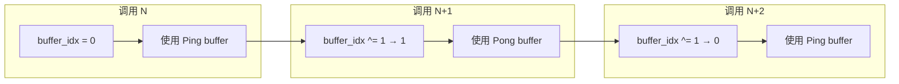

---

## 13. 核心机制专题文档索引

为了更深入地理解 DeepEP 的关键设计，以下 8 份专题文档对代码中最重要的机制进行了逐项剖析。每份文档均围绕一个核心特性，详细梳理其实现、流程、设计目的与权衡。

| 编号 | 专题 | 文件 | 核心内容 |
|------|------|------|----------|
| 1 | Warp-Role Specialization | `01_warp_role_specialization.md` | 单 kernel 内 warp 角色分工、流水线协作与同步机制 |
| 2 | GPU-Initiated RDMA (IBGDA) | `02_ibgda.md` | 设备端直接发起 RDMA 的底层原语、QP 管理与门铃机制 |
| 3 | Hook 机制 | `03_hook_mechanism.md` | Low-latency 模式下 send/recv 解耦、hook 调用时序与 CUDA Graph 兼容 |
| 4 | 不对称域带宽转发 | `04_asymmetric_bandwidth_forwarding.md` | Internode 的两阶段 RDMA→NVLink 转发、SourceMeta 路由与 credit 窗口 |
| 5 | CPU Busy-Wait 同步 | `05_cpu_busy_wait.md` | Pinned+mapped 内存、CPU spin-loop、GIL 释放与缓存路径优化 |
| 6 | TMA 多阶段流水线 | `06_tma_pipeline.md` | Hopper TMA + mbarrier 在 dispatch/combine 中的异步拷贝与 reduce 流水线 |
| 7 | 双缓冲 Ping-Pong | `07_double_buffering.md` | Low-latency RDMA 双缓冲布局、切换逻辑、内存约束与生命周期 |
| 8 | 在线格式转换 | `08_online_format_conversion.md` | Kernel 内 FP8 量化与 LogFMT 压缩的实现、收益与精度权衡 |

---

## 14. 总结

DeepEP 的设计目标是在大规模 MoE 训练/推理中，将 all-to-all 通信的延迟和开销降到最低。为了实现这一目标，代码在多个层面做出了精细的工程取舍：

1. **三层架构清晰分离**：Python 负责易用性和生命周期管理，C++ 负责跨进程同步和内存分配，CUDA 负责裸机性能优化。
2. **三种通信模式互补**：Intranode 榨干 NVLink 带宽，Internode 利用 RDMA+NVLink 混合转发实现跨节点高吞吐，Low-Latency 模式则通过 IBGDA 和 hook 机制将延迟推向极限。
3. **Kernel 内极致并行**：通过 warp-role specialization、TMA、mbarrier、IBGDA 等硬件特性，将原本需要多次 kernel launch 和 CPU 介入的通信流程，压缩为单次 GPU kernel 执行。
4. **安全与性能并重**：CPU busy-wait 释放 GIL、双缓冲限制、显式 destroy 机制、条件编译宏控制激进指令，都是在“更快”与“更稳”之间寻找平衡。

理解 DeepEP 的关键在于把握其 **“通知-分配-传输”** 三段式模型：先通过轻量 notify kernel 交换元数据，CPU 确定输出大小后分配 tensor，最后通过大规模并行 kernel 完成实际数据传输。无论是 NVLink 的 ring buffer、RDMA 的 credit 窗口，还是低延迟的 hook 拆分，都围绕这一核心模型展开。

---

*文档版本：基于 DeepEP 代码库分析生成*
