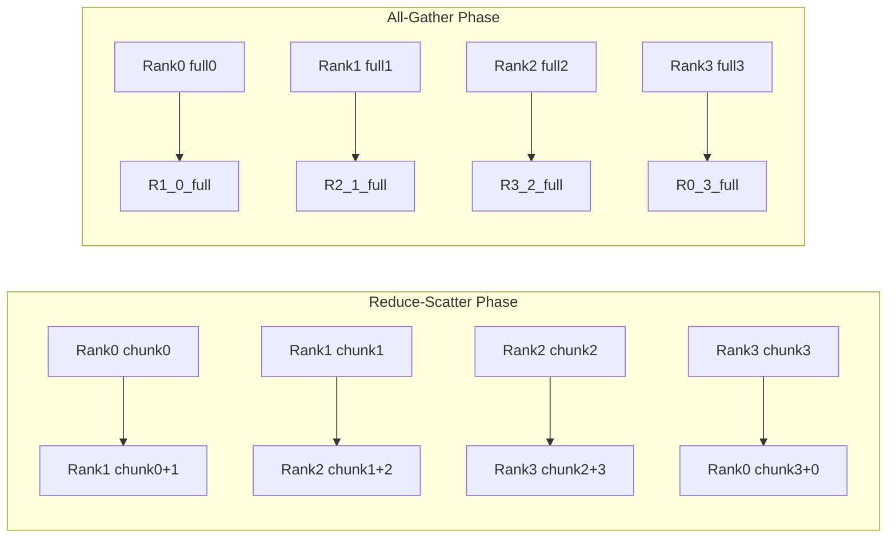
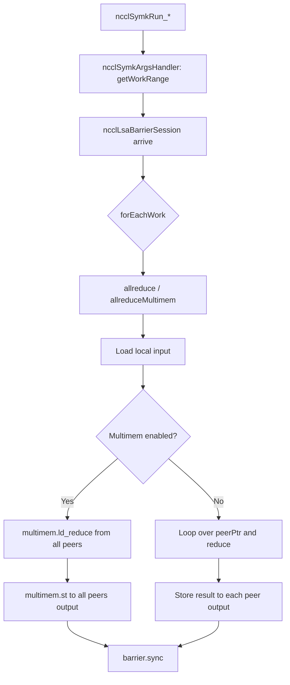

# NCCL `src/device/` 代码深度分析文档

> **文档目标**：对 NVIDIA Collective Communications Library (NCCL) 中 `src/device/` 目录下的 CUDA 设备端代码进行系统性、逐层剖析。内容涵盖功能定位、核心机制、数据流转、底层硬件适配、代码生成、子模块原理，以及设计初衷与性能权衡。
>
> **分析版本**：基于 NCCL 源码 commit `49839df`（master 分支，2026-04-05 前后）。

---

## 目录

1. [概述与架构定位](#1-概述与架构定位)
2. [目录结构与文件职责](#2-目录结构与文件职责)
3. [代码生成机制：`generate.py`](#3-代码生成机制generatepy)
4. [Kernel 基础设施：`common.h` / `common.cu`](#4-kernel-基础设施commonh--commoncu)
5. [通信协议与原语](#5-通信协议与原语)
   - 5.1 [协议抽象：`primitives.h`](#51-协议抽象primitivesh)
   - 5.2 [SIMPLE 协议：`prims_simple.h`](#52-simple-协议prims_simpleh)
   - 5.3 [LL 协议：`prims_ll.h`](#53-ll-协议prims_llh)
   - 5.4 [LL128 协议：`prims_ll128.h`](#54-ll128-协议prims_ll128h)
6. [数据归约与拷贝引擎：`reduce_kernel.h` / `common_kernel.h`](#6-数据归约与拷贝引擎reduce_kernelh--common_kernelh)
7. [集合通信算法实现](#7-集合通信算法实现)
   - 7.1 [AllReduce](#71-allreduce)
   - 7.2 [AllGather](#72-allgather)
   - 7.3 [ReduceScatter](#73-reducescatter)
   - 7.4 [Broadcast / Reduce / SendRecv](#74-broadcast--reduce--sendrecv)
8. [Symmetric Memory / GIN 子系统：`symmetric/`](#8-symmetric-memory--gin-子系统symmetric)
9. [网络设备解压子系统：`network/unpack/`](#9-网络设备解压子系统networkunpack)
10. [硬件特性与编译期条件](#10-硬件特性与编译期条件)
11. [设计权衡与性能考量](#11-设计权衡与性能考量)
12. [核心流程图（Mermaid）](#12-核心流程图mermaid)

---

## 1. 概述与架构定位

`src/device/` 是 NCCL 的 **CUDA 设备端核心**，负责在 GPU 上执行所有集合通信（Collective Communication）和点对点（P2P）通信的 CUDA Kernel。它与 host 端的 `src/enqueue.cc`、`src/init.cc`、`src/proxy.cc` 等协同工作，构成了完整的通信流水线。

### 1.1 核心职责

| 职责 | 说明 |
|------|------|
| **Kernel 执行** | 为 `ncclAllReduce`、`ncclBroadcast`、`ncclSend/Recv` 等 API 提供设备端实现。 |
| **通信协议** | 实现了 SIMPLE、LL（Low-Latency）、LL128 三种核心通信协议，适配不同消息大小和硬件场景。 |
| **拓扑算法** | 在设备端实现 Ring、Tree、CollNet、NVLS、PAT 等多种算法调度逻辑。 |
| **数据归约** | 提供高度特化的 `reduceCopy` 引擎，支持 Sum、Prod、MinMax、PreMulSum、SumPostDiv 等操作。 |
| **对称内存/GPU-Initiated Networking** | 在 `symmetric/` 中实现基于 LSA（Local Shared Addressing）和 GIN 的高性能路径。 |
| **网络卸载辅助** | 在 `network/unpack/` 中支持网卡设备端解包（Net Device Unpack）。 |

### 1.2 与 Host 端的交互边界

Host 端（`enqueue.cc` / `dev_runtime.cc`）负责：
1. 构建 `ncclDevKernelArgs`（包含 channel mask、work batch 指针等）。
2. 选择并调用对应的 CUDA Kernel（通过 `ncclDevKernelList` 中的函数指针）。
3. 管理 `ncclWorkBatch`、`ncclDevWorkColl`/`ncclDevWorkP2p` 等描述符的内存分配与生命周期。

Device 端（`src/device/`）负责：
1. 接收 Kernel Args，将其加载到 Shared Memory（`ncclShmem`）。
2. 解析 Work Batch，获取本 block/channel 需要处理的 collective/p2p 任务。
3. 执行具体的通信算法，通过 `Primitives` 与 peer GPU / 网络代理进行数据交换。
4. 更新 `workCounter`、profiler 计数器等状态。

### 1.3 设计哲学

NCCL 设备端代码遵循一套非常鲜明的工程哲学：

- **模板元编程（Template Metaprogramming）**：大量使用 C++ 模板将 `ncclFunc_t`（操作类型）、`ncclDataType_t`（数据类型）、`ncclDevRedOp_t`（归约操作）、`Algo`（算法）、`Proto`（协议）在编译期特化，以消除运行时分支，最大化指令级并行。
- **代码生成（Code Generation）**：由于模板组合爆炸（7 种 collective × 5 种 redop × 12 种类型 × 7 种算法 × 3 种协议），NCCL 使用 Python 脚本 `generate.py` 在编译期生成数千个 Kernel 变体，但只编译实际需要的组合。
- **Shared Memory 中心化**：所有 Kernel 共享一个全局的 `ncclShmem` 结构，Args、Channel、Work Batch、ConnInfo 都先拷贝到 SMEM，避免反复从 global memory 读取。
- **PTX Inline Assembly**：大量核心路径（`barrier.sync`、`ld.volatile.global`、`multimem.ld_reduce`、`fence.acq_rel.sys` 等）使用内联汇编，精确控制指令选择和内存序。

---

## 2. 目录结构与文件职责

```
src/device/
├── common.cu              # Kernel 入口、ncclShmem 定义、GIN reset kernel
├── common.h               # Kernel Main Loop、Work Batch 加载、Profiler、Barrier 封装
├── common_kernel.h        # reduceCopy / reduceCopyPacks 核心引擎
├── primitives.h           # 协议类（ProtoSimple/ProtoLL/ProtoLL128）、Fan 类、Primitives 声明
├── prims_simple.h         # SIMPLE 协议 Primitives 特化（最复杂、支持 Direct、NVLS、NetUnpack）
├── prims_ll.h             # LL 协议 Primitives 特化（基于 16B FIFO line + flag）
├── prims_ll128.h          # LL128 协议 Primitives 特化（基于 128B line + 64b flag）
├── reduce_kernel.h        # 所有归约操作的类型特化（FuncSum/MinMax/PreMulSum/...）
├── op128.h                # 128-bit 加载/存储辅助、BytePack、cvta、multimem_st 等底层原语
├── onerank.cu             # 单 rank PreMulSum 特殊 Kernel（无需通信）
├── generate.py            # 编译期代码生成：产生 device_table.cu / host_table.cc / 各 collective 的 .cu
├── all_reduce.h           # AllReduce 的 Ring/Tree/CollNet/NVLS/PAT 算法
├── all_gather.h           # AllGather 的 Ring/CollNet/NVLS/PAT 算法
├── all_gather_v.h         # AllGatherV（未在 generate.py 中暴露大量变体）
├── broadcast.h            # Broadcast 的 Ring 算法
├── reduce.h               # Reduce 的 Ring 算法
├── reduce_scatter.h       # ReduceScatter 的 Ring/CollNet/NVLS/PAT 算法
├── sendrecv.h             # Send/Recv P2P 的 WorkBatch 调度与执行
├── network/
│   └── unpack/
│       ├── unpack_defs.h  # Net Device Unpack 元数据结构定义
│       └── unpack.h       # 设备端 unpack 实现（bulkLoad、iovec 到 flat buffer）
└── symmetric/
    ├── generate.py        # symmetric kernel 的代码生成
    ├── kernel.cuh         # symmetric kernel 声明头
    ├── primitives.cuh     # symmetric 基础工具（ArgsHandler、Barrier、SmemPartition）
    ├── data_ops.cuh       # 数据移动操作（Scatter/Gather 等，若存在）
    ├── all_reduce.cuh     # LSA/GIN AllReduce 实现
    ├── all_gather.cuh     # LSA/GIN AllGather 实现
    ├── reduce_scatter.cuh # LSA/GIN ReduceScatter 实现
    ├── gin_scratch.h      # GIN scratch 内存管理类型
    ├── gin_scratch__funcs.h
    ├── gin_scratch__types.h
    ├── all_gather_gin.cuh # GIN 特化 AllGather
    └── reduce_scatter_gin.cuh # GIN 特化 ReduceScatter
```

---

## 3. 代码生成机制：`generate.py`

NCCL 设备端代码的一个核心特点是 **“模板组合爆炸，但编译产物可控”**。这完全依赖于 `src/device/generate.py`（以及 `symmetric/generate.py`）在构建时生成的代码。

### 3.1 生成什么？

`generate.py` 接收两个参数：
1. `gensrc`：生成文件的目标目录（如 `build/gensrc`）。
2. `func_pattern`（可选）：正则过滤字符串，用于开发调试时只生成部分函数，减小二进制体积。

它生成以下文件：

| 生成文件 | 内容 |
|---------|------|
| `device_table.cu` | 所有 `ncclDevFunc_*` 的前向声明，以及 `ncclDevFuncTable[]` 函数指针表。 |
| `host_table.cc` | Host 端可见的 `ncclDevKernelList[]`、`ncclDevKernelForFunc[]`、`ncclDevFuncRowToId[]` 等映射表。 |
| `<coll>_<redop>_<ty>.cu` | 聚合了某个 collective（如 `all_reduce`）下特定 redop 和类型的所有 Kernel/Func 定义。 |
| `rules.mk` | Makefile 构建规则（CMake 环境下不生成）。 |

### 3.2 生成逻辑详解

脚本顶部的列表定义了全部枚举空间：

```python
all_colls  = ["Broadcast","Reduce","AllGather","AllGatherV","ReduceScatter","AllReduce","SendRecv"]
all_redops = ["Sum","Prod","MinMax","PreMulSum","SumPostDiv"]
all_tys    = ["i8","u8","i32","u32","i64","u64","f16","f32","f64","bf16","f8e4m3","f8e5m2"]
all_protos = ["LL","LL128","SIMPLE"]
all_algos  = ["TREE","RING","COLLNET_DIRECT","COLLNET_CHAIN","NVLS","NVLS_TREE","PAT"]
```

**核心函数：**

- `required_cuda(coll, redop, ty, algo, proto)`：判断某个组合在当前 CUDA 版本和架构下是否合法。例如：
  - `bf16` 要求 `CUDART >= 11000`。
  - `f8` 要求 `CUDART >= 11080 && __CUDA_ARCH__ >= 900`。
  - NVLS 算法只支持特定的 `(type, redop)` 组合。
- `equivalent_primary(...)`：将功能等价的组合映射到同一个 Primary Function，减少二进制体积。例如：
  - 所有有符号整数的 `Sum` 操作映射到无符号整数版本（因为位模式相同）。
  - `MinMax` 在非 NVLS 算法下也做同样映射。
- `best_kernel(...)`：决定某个 primary function 应该由哪个“特化 Kernel”来执行。例如：
  - `AllGather` 的最佳特化 Kernel 固定为 `AllGather RING LL`（因为 SIMPLE 通常走 Generic）。
  - `AllReduce` 的最佳特化 Kernel 为 `(Sum, RING/TREE, LL)`。

**为什么要做 Primary Function 和 Best Kernel 的区分？**

- `ncclDevFuncTable` 的大小等于 Primary Function 的数量（几百到一千多）。每个 Work Batch 通过 `funcId` 索引到这张表，表项是一个 `__device__` 函数指针。
- 为了减少间接跳转开销，NCCL 会对最常用的 `(coll, redop, ty, algo, proto)` 组合生成**专门命名的 `__global__` Kernel**（即 `ncclDevKernel_*`）。当 `funcId` 匹配时，Kernel 直接内联调用对应的 `RunWorkBatch`，不走函数指针表。
- 如果 `funcId` 不匹配最佳特化，则回退到 `ncclDevFuncTable[funcId]()` 的通用调用。

### 3.3 生成的 `.cu` 文件示例

以 `all_reduce_sum_f32.cu` 为例，它可能包含：

```cpp
#include "common.h"
#include "all_reduce.h"

// 一个特化 Kernel（Best Kernel）
DEFINE_ncclDevKernel(_AllReduce_Sum_f32_TREE_LL, ncclFuncAllReduce, FuncSum, float, NCCL_ALGO_TREE, NCCL_PROTO_LL, 123)
DEFINE_ncclDevKernel(_AllReduce_Sum_f32_RING_LL, ncclFuncAllReduce, FuncSum, float, NCCL_ALGO_RING, NCCL_PROTO_LL, 456)

// 多个 Primary Functions（会被插入 ncclDevFuncTable）
DEFINE_ncclDevFunc(_AllReduce_Sum_f32_TREE_LL,  ncclFuncAllReduce, FuncSum, float, NCCL_ALGO_TREE, NCCL_PROTO_LL)
DEFINE_ncclDevFunc(_AllReduce_Sum_f32_TREE_LL128, ...)
DEFINE_ncclDevFunc(_AllReduce_Sum_f32_TREE_SIMPLE, ...)
DEFINE_ncclDevFunc(_AllReduce_Sum_f32_RING_LL, ...)
DEFINE_ncclDevFunc(_AllReduce_Sum_f32_RING_LL128, ...)
DEFINE_ncclDevFunc(_AllReduce_Sum_f32_RING_SIMPLE, ...)
DEFINE_ncclDevFunc(_AllReduce_Sum_f32_COLLNET_DIRECT_SIMPLE, ...)
// ... 等等
```

`DEFINE_ncclDevKernel` 和 `DEFINE_ncclDevFunc` 都是在 `common.h` 中定义的宏：

```cpp
#define DEFINE_ncclDevKernel(suffix, coll, redop, ty, algo, proto, specializedFnId) \
  __global__ void ncclDevKernel_##suffix(ncclDevKernelArgs4K NCCL_GRID_CONSTANT const args4K) { \
    ncclKernelMain<specializedFnId, RunWorkBatch<coll, ty, redop<ty>, algo, proto>>(&args4K.args); \
  }

#define DEFINE_ncclDevFunc(suffix, coll, redop, ty, algo, proto) \
  __device__ void ncclDevFunc_##suffix() { \
    RunWorkBatch<coll, ty, redop<ty>, algo, proto>().run(); \
  }
```

---

## 4. Kernel 基础设施：`common.h` / `common.cu`

### 4.1 `ncclShmem`：Shared Memory 的全局状态

每个 CUDA block 启动后，第一件事就是将 Kernel Args、Channel Info、Work Batch 从 global memory 拷贝到 shared memory。这是因为：

1. **寄存器压力**：如果线程直接从参数空间的指针追指针，编译器往往将中间结果 spill 到 local memory（栈），造成巨大性能损失。
2. **访问速度**：Shared Memory 延迟远低于 Global Memory，且同一个 block 内所有线程共享。

`common.cu` 中定义了：

```cpp
__shared__ ncclShmemData ncclShmem;
#if __CUDA_ARCH__ < 700
  __shared__ ulong2 ncclShmemPerWarp[...];
#endif
```

`ncclShmemData` 的结构（`common.h`）非常关键：

```cpp
struct ncclShmemData {
  struct ncclDevKernelArgs args;
  int channelId;
  int aborted;
  alignas(16) struct ncclKernelComm comm;
  alignas(16) struct ncclDevChannel channel;

  int batchIx, nextBatchIx;
  enum ncclDevWorkType workType;
  uint8_t directMode;
  uint16_t funcId;
  int nWorks;
  int workSize;
  uint64_t workCounter;
  bool profilerEnabled;
  struct ncclShmemGroup groups[NCCL_MAX_GROUPS];

  alignas(16) char workStorage[ncclMaxDevWorkBatchBytes()];
  alignas(16) union { unpackShmem unpack; } devicePlugin;
};
```

| 字段 | 作用 |
|------|------|
| `args` | 拷贝自 Kernel 参数的 `ncclDevKernelArgs`（comm 指针、channelMask、workBuf 等）。 |
| `channelId` | 本 block 对应的 channel 索引（通过 `channelMask` 中第 n 个 set bit 计算得到）。 |
| `comm` / `channel` | 从 global `ncclKernelCommAndChannels` 拷贝到 SMEM 的 communicator 和 channel 状态。 |
| `workStorage` | 本 channel 需要处理的一个或多个 `ncclDevWorkColl` / `ncclDevWorkP2p` 结构体。 |
| `groups` | 每个 `Primitives` 组（group）的上下文，包含 `recvConns`、`sendConns`、`userInput`、`userOutput`、`srcs`、`dsts` 等指针。 |

### 4.2 `ncclKernelMain`：所有 Collective Kernel 的统一入口

```cpp
template<int SpecializedFnId, typename SpecializedRunWorkBatch>
__device__ __forceinline__ void ncclKernelMain(struct ncclDevKernelArgs const* args) {
  int tid = threadIdx.x;
  int tn = blockDim.x;

  // 1. 将 Kernel Args 拷贝到 SMEM
  if (tid < sizeof(ncclDevKernelArgs)/sizeof(uint32_t)) {
    ((uint32_t*)&ncclShmem.args)[tid] = ((uint32_t*)args)[tid];
  }

  // 2. 通过 channelMask 计算本 block 的 channelId
  if (tid < MAXCHANNELS && (args->channelMask & (1ull<<tid))) {
    int n = __popcll(args->channelMask & ((1ull<<tid)-1));
    if (blockIdx.x == n) ncclShmem.channelId = tid;
  }
  __syncthreads();

  // 3. 分 Warp 加载 comm / channel / work batch
  switch (tid/WARP_SIZE) {
  case 0: copyToShmem16(tid, &ncclShmem.comm, ncclShmem.args.comm, sizeof(ncclKernelComm)); break;
  case 1: copyToShmem16(tid-WARP_SIZE, &ncclShmem.channel, &..., sizeof(ncclDevChannel)); break;
  default: loadWorkBatchToShmem(tid - 2*WARP_SIZE, tn - 2*WARP_SIZE, args, blockIdx.x); break;
  }
  __syncthreads();

  // 4. Main loop：逐个执行 work batch 中的任务
  while (ncclShmem.aborted == 0) {
    profiler(START);
    if (0 <= SpecializedFnId && ncclShmem.funcId == (unsigned)SpecializedFnId) {
      SpecializedRunWorkBatch().run();  // 最佳特化路径：直接内联调用
    } else {
      ncclDevFuncTable[ncclShmem.funcId](); // 通用路径：函数指针跳转
    }

    if (ncclShmem.nextBatchIx == -1) break;
    int batchIx = ncclShmem.nextBatchIx;
    __syncthreads();
    profiler(STOP);
    loadWorkBatchToShmem(tid, tn, args, batchIx);
    __syncthreads();
  }
  profiler(FINI);
}
```

**关键设计点：**

- **三阶段加载**：Warp 0 加载 `comm`，Warp 1 加载 `channel`，其余线程加载 `work batch`。这是基于一个观察：参数结构的大小适合用 `copyToShmem16`（每个线程搬运 16 字节）高效完成。
- **` SpecializedFnId` 匹配**：如果本 batch 的 `funcId` 恰好等于特化 Kernel 编译时指定的 `SpecializedFnId`，则走零开销的直接调用路径；否则通过 `ncclDevFuncTable` 做间接调用。
- **Profiler 插桩**：在 `START` / `STOP` / `FINI` 三个阶段，通过 `globaltimer()` PTX 指令记录时间戳到 `ncclShmem.comm.workStarted[channelId]` 等数组中。

### 4.3 `loadWorkBatchToShmem`：Work Batch 的解析与加载

Host 端将多个 collective/p2p 任务打包成 `ncclDevWorkBatch` 数组。Device 端需要解析出本 channel 负责的那些任务。

一个 `ncclDevWorkBatch` 的结构：

```cpp
struct alignas(16) ncclDevWorkBatch {
  uint32_t nextJump:14, nextExtends:1;
  uint32_t workType:2, funcId:15;
  uint32_t offsetBase;
  uint64_t offsetBitset; // 哪些 work 属于本 batch
};
```

`loadWorkBatchToShmem` 的逻辑要点：

1. **fnsOfBitset 计算**：利用 warp 内协作，通过 `__popc` 找出 `offsetBitset` 中每个 set bit 的位置，即本 batch 包含哪些 work。
2. **按 16 字节 pack 加载**：每个线程负责搬运 `work struct` 的若干个 16 字节块。不同类型的 work（`P2p`、`Coll`、`Bcast`、`CollReg`）大小不同，但都是 16 的倍数。
3. **`workStorageType` 分支**：
   - `ncclDevWorkStorageTypeArgs`：work 数据紧跟在 `args` 后面（参数空间），使用 `ld.param` 加载。
   - `ncclDevWorkStorageTypeFifo` / `Persistent`：work 数据在 global `workBuf` 环形缓冲区中，使用 `ld.v2.u64` 从 global 加载。

> **注释中特意强调了参数空间和 global space 不能混用指针取址**，否则编译器会为了生成一个通用指针而将整个 4KB 参数结构 spill 到每个线程的 local memory，性能会彻底崩塌。这是 NCCL 开发者通过惨痛经验总结出的编译器行为陷阱。

### 4.4 Barrier 封装

NCCL 在设备端使用多种同步机制：

```cpp
__device__ inline void barrier_sync(int name) {
  asm volatile("barrier.sync.aligned %0;" :: "r"(name) : "memory");
}
__device__ inline void barrier_sync(int name, int nThreads) {
  asm volatile("barrier.sync.aligned %0, %1;" :: "r"(name), "r"(nThreads) : "memory");
}
__device__ inline bool barrier_red_or(bool vote, int name, int nThreads) {
  // PTX barrier.red.or.pred：阻塞同步并在所有线程上做逻辑或归约
}
```

- `barrier.sync.aligned` 比 `barrier.sync` 更高效（要求所有参与线程收敛）。
- `barrier_red_or` 用于 `barrierAny`：在 `Primitives` 中快速判断组内是否有某个条件成立（例如是否需要 threadfence）。

---


## 5. 通信协议与原语

NCCL 的核心抽象是 `Primitives<T, RedOp, Fan, Direct, Proto, P2p>` 类模板。它屏蔽了底层 buffer、step、peer 的细节，向算法代码（如 `all_reduce.h`）提供高层语义接口：`send`、`recv`、`recvReduceSend`、`directRecvCopyDirectSend` 等。

`primitives.h` 是入口，它声明了三个协议类（`ProtoSimple`、`ProtoLL`、`ProtoLL128`）和 `Primitives` 主模板，随后 `prims_simple.h`、`prims_ll.h`、`prims_ll128.h` 分别对 `Primitives` 做模板特化。

### 5.1 协议抽象：`primitives.h`

#### 5.1.1 协议类（Protocol Classes）

```cpp
template<int SlicePerChunk_1, int StepPerSlice_1, int Unroll_1 = COLL_UNROLL,
         int MultimemSrcs_1 = 0, int MultimemDsts_1 = 0>
struct ProtoSimple {
  static constexpr int Id = NCCL_PROTO_SIMPLE;
  static constexpr int SlicePerChunk = SlicePerChunk_1;
  static constexpr int StepPerSlice = StepPerSlice_1;
  static constexpr int Unroll = Unroll_1;
  static constexpr int MultimemSrcs = MultimemSrcs_1;
  static constexpr int MultimemDsts = MultimemDsts_1;

  __device__ static int calcBytePerStep() {
    return ncclShmem.comm.buffSizes[NCCL_PROTO_SIMPLE] / NCCL_STEPS;
  }
  __device__ static int calcBytePerGrain() { return sizeof(uint64_t); }
  static constexpr int MaxGroupWidth = 2;
};

struct ProtoLL {
  static constexpr int Id = NCCL_PROTO_LL;
  __device__ static int calcBytePerStep() {
    return ncclShmem.comm.buffSizes[NCCL_PROTO_LL] / NCCL_STEPS / 2;
  }
  __device__ static int calcBytePerGrain() { return sizeof(uint64_t); }
  static constexpr int MaxGroupWidth = 1;
};

struct ProtoLL128 { /* 类似，基于 128B line */ };
```

| 属性 | SIMPLE | LL | LL128 |
|------|--------|----|-------|
| **设计目标** | 大消息高吞吐 | 小消息低延迟 | 中等消息平衡 |
| **Buffer 组织** | 纯数据 FIFO | 16B line：8B data + 8B flag | 128B line：120B data + 8B flag |
| **同步方式** | 基于 head/tail step 计数器 | 基于 32-bit flag 的逐 line 轮询 | 基于 64-bit flag 的逐 line 轮询 |
| **Overhead** | 低（几乎全部带宽用于数据） | 高（50% 带宽用于 flag） | 低（~6.25% 带宽用于 flag） |
| **`MaxGroupWidth`** | 2 | 1 | 1 |

`SlicePerChunk` 和 `StepPerSlice` 是 SIMPLE 协议独有的参数，用于控制流水线深度。例如 `ProtoSimple<ALLREDUCE_CHUNKSTEPS/ALLREDUCE_SLICESTEPS, ALLREDUCE_SLICESTEPS>` 意味着：
- 每个 chunk 包含 `CHUNKSTEPS` 个 step。
- 每 `SLICESTEPS` 个 step 对应一个 slice。
- `SlicePerChunk = 2`，`StepPerSlice = 2`。

#### 5.1.2 Fan 类：扇入扇出抽象

```cpp
template<int MaxRecv_, int MaxSend_>
struct FanAsymmetric {
  static constexpr int MaxRecv = MaxRecv_, MaxSend = MaxSend_;
  int nr, ns;
  __device__ int nrecv() const { return MaxRecv ? nr : 0; }
  __device__ int nsend() const { return MaxSend ? ns : 0; }
};

template<int MaxArity>
struct FanSymmetric {
  static constexpr int MaxRecv = MaxArity, MaxSend = MaxArity;
  int n;
  __device__ int nrecv() const { return n; }
  __device__ int nsend() const { return n; }
};
```

Fan 类在编译期确定最大接收/发送 peer 数，使得 `Primitives` 内部循环可以被完全展开，避免动态分支。例如：
- Ring 算法：`FanSymmetric<1>`（只有一个 prev 和一个 next）。
- Tree 算法：`FanAsymmetric<3, 1>`（最多接收 3 个，发送 1 个）。
- NVLS AllGather：`FanAsymmetric<0, 32>`（发送给最多 32 个 local peer）。

#### 5.1.3 `PrimitivesWithoutDirect`

`primitives.h` 还定义了一个辅助类 `PrimitivesWithoutDirect`，它为 LL/LL128 协议提供了一套默认的 `directSend`/`directRecv` 实现（本质上退化为非 direct 路径）。因为 LL/LL128 当前不支持 Direct P2P。

---

### 5.2 SIMPLE 协议：`prims_simple.h`

SIMPLE 是 NCCL 最复杂、最通用的协议，支持：
- **Direct 传输**：通过 CUDA P2P（`NCCL_P2P_READ` / `NCCL_P2P_WRITE`）直接读写 peer 的 user buffer。
- **Proxy 通信**：通过 `connFifo` 与 CPU proxy 线程交互（网络发送）。
- **NVLS**：通过 `multimem.ld_reduce` / `multimem.st` 利用 NVLink SHARP 的硬件归约/广播。
- **Net Device Unpack**：在接收侧调用 `ncclNetDeviceUnpack` 进行设备端数据重组。
- **Scatter/Gather**：支持 `CollNet` 的 `scatter` 和 `gather` 语义。

#### 5.2.1 构造函数与线程角色分配

```cpp
__device__ Primitives(int tid, int nthreads, int const *recvPeers, int const *sendPeers,
                      void const *inputBuf, void *outputBuf, uint64_t redOpArg, uint8_t group=0,
                      uint8_t connIndexRecv = 0, uint8_t connIndexSend = 0,
                      struct ncclDevWorkColl* collWork = nullptr,
                      struct ncclDevWorkP2p* p2pWork = nullptr, int stepSize_ = 0, int mode = primsModeDefault)
```

线程被划分为多个角色：

| 角色 | 职责 | 线程分配 |
|------|------|----------|
| `RoleWaitRecv` | 轮询 peer 的 tail step，等待数据就绪；设置 `srcs[]` 指针。 | `tid < nrecv` |
| `RoleWaitSend` | 轮询 peer 的 head step，等待发送 credit；设置 `dsts[]` 指针。 | `nrecv <= tid < nrecv+nsend` |
| `RolePostSend` | 数据搬运完成后，增加 step 并写回 peer 的 tail。 | `nthreads-nsend <= tid` |
| `RolePostRecv` | 数据接收完成后，增加 step 并写回 peer 的 head（释放 credit）。 | `nthreads-nrecv-nsend <= tid` |
| `RoleInput/Output` | PAT 模式下负责本地数据的读写。 | PAT 专用 |

**`ThreadPerSync` 的静态断言**：

```cpp
constexpr int ThreadPerSync =
  MaxSend >= 16 || MaxRecv >= 16 ? 32 :
  MaxSend >= 8 || MaxRecv >= 8 ? 16 : 8;
static_assert(MaxSend <= ThreadPerSync && MaxRecv <= ThreadPerSync,
              "Not enough threads to cover all peers");
```

这保证了所有 Wait/Post 角色可以在一个 warp 内完成，便于使用 warp 级原语。

#### 5.2.2 `waitPeer`：等待与指针解析

`waitPeer` 是 SIMPLE 协议的心脏。它根据模板参数 `DirectRecv`、`DirectSend`、`Recv`、`Send`、`SrcBuf`、`DstBuf` 做编译期分支：

```cpp
template <int DirectRecv, int DirectSend, int Recv, int Send, int Src, int Dst>
__device__ __forceinline__ void waitPeer(intptr_t srcIx, intptr_t dstIx, int offset, int nelts) {
  if ((flags & (Recv * RoleWaitRecv)) || (flags & (Send * RoleWaitSend))) {
    int spins = 0;
    while (connStepCache + (isSendNotRecv ? NCCL_STEPS : 0) < step + StepPerSlice) {
      connStepCache = loadStepValue(connStepPtr);
      if (checkAbort(flags, Aborted, spins)) break;
    }

    // 根据 NetReg、ConnFifo、Direct 等模式解析真正的数据指针
    void **ptrs = isSendNotRecv ? ncclShmem.groups[group].dsts + Dst
                                : ncclShmem.groups[group].srcs + Src;
    // ... 多种分支设置 ptrs[index]
  }
  step += StepPerSlice;
}
```

**`loadStepValue`** 是一个关键函数：

```cpp
inline __device__ uint64_t loadStepValue(uint64_t* ptr) {
  #if __CUDA_ARCH__ >= 900 && CUDART_VERSION >= 12010
  if (flags & NvlsMinPolling) {
    uint64_t ans;
    asm volatile("multimem.ld_reduce.acquire.sys.global.min.u64 %0, [%1];"
                 : "=l"(ans) : "l"(cvta_to_global(ptr)) : "memory");
    return ans;
  }
  #endif
  return ld_volatile_global(ptr);
}
```

- 对于普通 P2P/网络路径，使用 `ld.volatile.global.u64`（绕过 L1 cache，保证看到最新值）。
- 对于 NVLS（Hopper+），使用 `multimem.ld_reduce.acquire.sys.global.min`，这是 NVLink SHARP 的硬件支持指令，可以在加载时执行跨 GPU 的 `min` 归约，用于高效的 barrier/credit 同步。

#### 5.2.3 `genericOp`：SIMPLE 的核心执行循环

```cpp
template <int DirectRecv1, int DirectSend1, int Recv, int Send, int SrcBuf, int DstBuf>
__device__ __forceinline__ void genericOp(intptr_t srcIx, intptr_t dstIx, int nelem, bool postOp) {
  // 计算 slice 大小，确保 16B 对齐
  int sliceSize = stepSize * StepPerSlice;
  sliceSize = max(divUp(nelem, 16*SlicePerChunk)*16, sliceSize/32);

  // Worker-only loop：将 "是否是 worker" 和 "slice 是否为空" 的判断从热路径移除
  if (tid < nworkers && offset < nelem && !isNetOffload) {
    do {
      // 1. 等待 peer 就绪
      waitPeer<...>(srcIx, dstIx, offset, sliceSize);
      subBarrier();

      // 2. 执行 reduceCopy（数据搬运 + 归约）
      int workSize = ncclShmem.aborted ? 0 : sliceSize;
      reduceCopy<Unroll, RedOp, T, MultimemSrcs, Recv+Src, Recv*MaxRecv+Src,
                 MultimemDsts, Send+Dst, Send*MaxSend+Dst, PreOpSrcs>
        (tid, nworkers, ncclShmem.groups[group].redOpArgs, postOp,
         Recv*fan.nrecv()+Src, ncclShmem.groups[group].srcs,
         Send*fan.nsend()+Dst, ncclShmem.groups[group].dsts, workSize);

      barrier();
      postPeer<Recv, Send>(0 < workSize);
      offset += sliceSize;
    } while (slice < SlicePerChunk && offset < nelem);
  }

  // Non-workers / empty-slices loop
  while (slice < SlicePerChunk) { ... }
}
```

**性能优化细节（代码注释中明确说明）：**

原始代码会在每个 slice 迭代中判断 `if (worker)` 和 `if (slice not empty)`，动态分支开销为 `2 * numSlices`。新代码将 worker 和非 worker 拆成两个循环，开销变为 `2 + numSlices`。当 `numSlices > 2` 时，新代码更优。对于 `numSlices=1` 的常见情况，循环会被编译器完全展开，只保留 2 个分支指令。

#### 5.2.4 Direct 模式详解

SIMPLE 协议支持 `Direct=1`，即绕过 NCCL 的内部 FIFO buffer，直接读写 peer 的 user buffer。这是大消息高吞吐的关键。

**Direct 的四种子模式**：

在 `loadRecvConn` / `loadSendConn` 中，根据 `conn->flags` 设置 `DirectRead` 或 `DirectWrite`：

- **`NCCL_P2P_WRITE`（recv provider）**：接收方将自己的 output buffer 地址写到 `ptrExchange`，发送方直接 `st.global` 写入该地址。
- **`NCCL_P2P_READ`（send provider）**：发送方将自己的 input/output buffer 地址写到 `ptrExchange`，接收方直接 `ld.global` 从该地址读取。
- **`NCCL_NVLS_MIN_POLL`（NVLS Direct）**：使用 NVLink SHARP 的 `multimem` 指令。
- **`NCCL_DIRECT_NIC`（Net Reg Mode）**：网络注册的 buffer，proxy 可以直接 DMA，无需经过内部 FIFO。

`setDataPtrs` 函数实现了 `ptrExchange` 的握手逻辑：

```cpp
__device__ void setDataPtrs(...) {
  if (recvProvider) {
    void* volatile* slot = ncclShmem.groups[group].recvConns[index]->ptrExchange;
    while (*slot != nullptr && !checkAbort(...)); // 等待 slot 为空
    *slot = reinterpret_cast<void*>(exchgPtr);    // 写入我的 buffer 地址
  }
  if (sendAcceptor) {
    void* volatile* slot = ...;
    void* ptr;
    while (slot) {
      ptr = *slot;
      if (ptr != nullptr || checkAbort(...)) break; // 等待对端写入地址
    }
    directBuff = reinterpret_cast<T*>(ptr);
    *slot = nullptr;
  }
}
```

这是一个 **Ctor-level 的同步握手**：每个 `Primitives` 对象构造时，Wait 线程和 Post 线程通过 `ptrExchange` 完成一次零拷贝 buffer 地址交换。

#### 5.2.5 `process` 与 `ScatterGatherOp`

`process<Recv, Send>(Fn&& fn, ...)` 是 SIMPLE 为 `CollNet` / `NVLS` 设计的高级接口。它允许调用者传入一个 functor（如 `Scatterer`），由 functor 内部决定如何调用 `reduceCopy`。

`ScatterGatherOp` 实现了 `scatter` 和 `gather` 语义：
- **Scatter**：将本地 input buffer 的数据按 peer offset 拆分，分别发送给多个 peer。
- **Gather**：从多个 peer 接收数据，按 peer offset 写入本地 output buffer 的对应位置。

这在 `AllGather` / `ReduceScatter` 的 `CollNetDirect` / `NVLS` 路径中被大量使用。

---

### 5.3 LL 协议：`prims_ll.h`

LL（Low-Latency）协议专为小消息设计，其核心思想是：**用 32-bit flag 做逐 line 的握手，而不是用全局 step 计数器**。

#### 5.3.1 Buffer 格式

```cpp
union ncclLLFifoLine {
  struct { uint32_t data1; uint32_t flag1; uint32_t data2; uint32_t flag2; };
  uint64_t v[2];
  int4 i4;
};
```

每个 FIFO line 是 16 字节：
- `data1` + `data2` = 8 字节有效数据。
- `flag1` + `flag2` = 8 字节标志位（必须放在数据后面，防止网络只收到 flag 没收到数据）。

#### 5.3.2 读写原语

```cpp
__device__ uint64_t readLL(int offset, int i) {
  union ncclLLFifoLine* src = recvPtr(i) + offset;
  uint32_t flag = recvFlag(i);
  uint32_t data1, flag1, data2, flag2;
  int spins = 0;
  do {
    asm volatile("ld.volatile.global.v4.u32 {%0,%1,%2,%3}, [%4];"
                 : "=r"(data1), "=r"(flag1), "=r"(data2), "=r"(flag2)
                 : "l"(&src->i4) : "memory");
    if (checkAbort(abort, 1, spins)) break;
  } while ((flag1 != flag) || (flag2 != flag));
  return data1 + (((uint64_t)data2) << 32);
}

__device__ void storeLL(union ncclLLFifoLine* dst, uint64_t val, uint32_t flag) {
  asm volatile("st.volatile.global.v4.u32 [%0], {%1,%2,%3,%4};"
               :: "l"(&dst->i4), "r"((uint32_t)val), "r"(flag),
                  "r"((uint32_t)(val >> 32)), "r"(flag) : "memory");
}
```

**特点：**
- 使用 `ld.volatile.global.v4.u32` 和 `st.volatile.global.v4.u32` 一次性读写整个 16B line。
- 接收方轮询 `flag1 == flag && flag2 == flag`。
- `flag` 的计算：`NCCL_LL_FLAG(step+1)`，每次通信 step 递增。

#### 5.3.3 `LLGenericOp`：接收-归约-发送流水线

```cpp
template <int RECV, int SEND, int SrcBuf, int DstBuf>
__device__ __forceinline__ void LLGenericOp(intptr_t srcIx, intptr_t dstIx, int nelem, bool postOp) {
  // 1. 等待发送 credit（head 指针）
  if (SEND) waitSend(divUp(nelem, EltPerLine)*sizeof(ncclLLFifoLine));

  nelem -= tid*EltPerLine;
  srcElts += tid*EltPerLine;
  dstElts += tid*EltPerLine;
  while (nelem > 0) {
    int eltInLine = EltPerLine < nelem ? EltPerLine : nelem;

    // 2. 预加载 src 数据（如果有）
    DataLoader dl;
    if (SRC) dl.loadBegin(srcElts, eltInLine);

    // 3. 接收第一个 peer 的数据
    ncclLLFifoLine line[MaxRecv];
    if (RECV) {
      readLLBeginAll<1>(offset, line);
      peerData = readLL(offset, 0);
    }

    // 4. 完成 src 加载，并执行 PreOp
    if (SRC) {
      data = dl.loadFinish();
      if (SrcBuf == Input) data = applyPreOp(redOp, data);
    }

    // 5. 归约所有接收到的 peer 数据
    if (RECV) {
      data = !SRC ? peerData : applyReduce(redOp, peerData, data);
      for (int i=1; i < MaxRecv && i < fan.nrecv(); i++) {
        peerData = readLLFinish(offset, line, i);
        data = applyReduce(redOp, peerData, data);
      }
    }

    if (postOp) data = applyPostOp(redOp, data);

    // 6. 发送给所有 peer
    if (SEND) {
      for (int i=1; i < MaxSend && i < fan.nsend(); i++)
        storeLL(sendPtr(i)+offset, data, sendFlag(i));
      storeLL(sendPtr(0)+offset, data, sendFlag(0));
    }

    // 7. 写回本地 dst buffer
    if (DST) storeData(dstElts, data, eltInLine);

    nelem -= eltPerTrip;
    offset += nthreads;
  }

  if (RECV) { incRecv(...); postRecv(); }
  if (SEND) { incSend(...); }
}
```

**与 SIMPLE 的关键差异：**
- **无 slice/chunk 分层**：LL 的粒度就是 `ncclLLFifoLine`，消息被拆成若干 line，每个线程负责一个 line。
- **显式 flag 轮询**：每个 line 的接收都需要独立轮询 flag，而不是轮询一个全局 step。
- **Cleanup 机制**：当 `sendStep` 到达 `NCCL_LL_CLEAN_MASK` 边界时，需要将所有 flag 写一遍 0，防止 flag 回绕后旧数据被误读。

---

### 5.4 LL128 协议：`prims_ll128.h`

LL128 是 LL 的演进版，主要改进：
1. **Line size 从 16B 提升到 128B**：flag 只占 8B（一个 `uint64_t`），有效数据占 120B，overhead 从 50% 降到 ~6.25%。
2. **Flag 线程（Flag Thread）**：每个 warp 的 lane 7 专门负责存储/比较 flag，其他 lane 负责数据。这样 flag 和数据可以同一线程交错处理，减少额外线程开销。
3. **寄存器预加载 + shuffle**：使用 `loadRegsBegin` / `loadRegsFinish` 两阶段加载，将寄存器 shuffle 的延迟隐藏在其他内存操作之后。

#### 5.4.1 Buffer 格式

```cpp
#define NCCL_LL128_LINESIZE 128
#define NCCL_LL128_LINEELEMS (NCCL_LL128_LINESIZE/sizeof(uint64_t)) // = 16
#define NCCL_LL128_DATAELEMS (NCCL_LL128_LINEELEMS-1) // = 15
```

每个 128B line 包含 15 个 `uint64_t` 的数据 + 1 个 `uint64_t` 的 flag。

#### 5.4.2 `loadRegsBegin` / `loadRegsFinish`

```cpp
template<int WordPerThread>
__device__ __forceinline__ void loadRegsBegin(uint64_t(&regs)[WordPerThread], T const *src, int eltN) {
  if (reinterpret_cast<uintptr_t>(src)%16 == 0) {
    // 16B 对齐：直接从 global 加载到寄存器
    #pragma unroll
    for(int g=0; g < WordPerThread/2; g++) {
      int ix = g*WARP_SIZE - 4*(g/2) + wid - (g%2)*(wid/8);
      if(!flagThread || g%2==0) {
        if(ix*EltPer16B < eltN)
          load128((uint64_t*)(src + ix*EltPer16B), regs[2*g+0], regs[2*g+1]);
      }
    }
  } else {
    // 非对齐：先加载到 SMEM scratch，再从 SMEM 加载到寄存器
    // ...
  }
}

template<int WordPerThread>
__device__ __forceinline__ void loadRegsFinish(uint64_t(&regs)[WordPerThread]) {
  // 将 flag thread 中的数据移动到相邻寄存器的空位中
  #pragma unroll
  for (int g=1; g < WordPerThread/2; g+=2) {
    if (flagThread) regs[2*g] = regs[2*g-1];
  }
}
```

**设计意图**：`flagThread`（`tid%8==7`）在每个 128B line 中只加载一半的数据（因为它要留一个寄存器给 flag）。`loadRegsBegin` 先发起所有 `load128` 指令，然后 `loadRegsFinish` 再做寄存器间的 `mov`，将 `flagThread` 的数据补齐。这样做的目的是 **将 shuffle/mov 的延迟与后续内存操作（如从其他 peer 接收数据）重叠**。

#### 5.4.3 `recvReduceSendCopy`

这是 LL128 的核心函数，整合了接收、归约、发送：

```cpp
template <int ELEMS_PER_THREAD, int RECV, int SEND, int SrcBuf, int DstBuf>
__device__ __forceinline__ void recvReduceSendCopy(uint64_t(&v)[ELEMS_PER_THREAD], int ll128Offset, bool postOp) {
  __syncwarp();
  /************************ Wait first recv ********************/
  if (RECV) {
    uint64_t* ptr = recvPtr(0)+ll128Offset;
    uint64_t flag = recvFlag(0);
    bool needReload;
    int spins = 0;
    do {
      needReload = false;
      #pragma unroll
      for (int u=0; u<ELEMS_PER_THREAD; u+=2) {
        load128(ptr+u*WARP_SIZE, vr[u], vr[u+1]);
        needReload |= flagThread && (vr[u+1] != flag);
      }
      needReload &= (0 == checkAbort(abort, 1, spins));
    } while (__any_sync(WARP_MASK, needReload));
    // 再加载一次（确保没有 torn read）
    #pragma unroll
    for (int u=0; u<ELEMS_PER_THREAD; u+=2)
      load128(ptr+u*WARP_SIZE, vr[u], vr[u+1]);
  }

  /************* Finish register load **************/
  if (SRC) {
    loadRegsFinish(v);
    if (SrcBuf == Input) {
      #pragma unroll
      for (int u=0; u<ELEMS_PER_THREAD; u+=2) {
        v[u] = applyPreOp(redOp, v[u]);
        if (!flagThread) v[u+1] = applyPreOp(redOp, v[u+1]);
      }
    }
  }

  /************************ Recv rest *********************/
  if (RECV) {
    // 消费第一个 peer 的数据
    #pragma unroll
    for (int u=0; u<ELEMS_PER_THREAD; u+=2) {
      v[u]   = SRC ? applyReduce(redOp, vr[u], v[u]) : vr[u];
      v[u+1] = SRC ? applyReduce(redOp, vr[u+1], v[u+1]) : vr[u+1];
    }
    // 继续接收其他 peer
    for (int i=1; i<MaxRecv && i<fan.nrecv(); i++) { ... }
  }

  if (postOp) { ... }

  /************************ Send **************************/
  if (SEND) {
    for (int i=1; i<MaxSend && i<fan.nsend(); i++) {
      uint64_t flag = sendFlag(i);
      uint64_t* ptr = sendPtr(i)+ll128Offset;
      #pragma unroll
      for (int u=0; u<ELEMS_PER_THREAD; u+=2) {
        store128(ptr+u*WARP_SIZE, v[u], flagThread ? flag : v[u+1]);
      }
    }
    ...
  }
}
```

**与 LL 的差异总结：**

| 特性 | LL | LL128 |
|------|----|-------|
| Line Size | 16B | 128B |
| Flag Size | 8B (2×u32) | 8B (1×u64) |
| Data/Flag Overhead | 50% | ~6.25% |
| Flag 线程 | 所有线程 | 每 warp lane 7 |
| 对齐要求 | 较低 | 需要 16B 对齐或 SMEM staging |
| 发送 fence | `barrier` + 隐式 | `__threadfence_system()`（Hopper+）或 `__threadfence()` |

---


## 6. 数据归约与拷贝引擎：`reduce_kernel.h` / `common_kernel.h`

如果说 `Primitives` 是 NCCL 的“血管”，那么 `reduceCopy` 就是“心脏”——它负责在多个 source 和 destination 之间高效地完成数据搬运、类型转换和归约操作。

### 6.1 `reduce_kernel.h`：归约操作的类型特化

NCCL 支持的归约操作包括：`FuncCopy`、`FuncSum`、`FuncProd`、`FuncMinMax`、`FuncPreMulSum`、`FuncSumPostDiv`。

`reduce_kernel.h` 使用了三层 trait 体系：

#### 6.1.1 操作类定义

```cpp
template<typename T>
struct FuncSum  { using EltType = T; __device__ __forceinline__ FuncSum(uint64_t opArg=0) {}; };

template<typename T>
struct FuncMinMax {
  using EltType = T;
  BytePack<sizeof(T)> xormask;
  bool isMinNotMax;
  __device__ __forceinline__ FuncMinMax(uint64_t opArg=0) {
    xormask.native = opArg;
    isMinNotMax = (opArg&1)==0;
  }
};
```

#### 6.1.2 Trait 类：`Apply_Reduce`、`Apply_PreOp`、`Apply_PostOp`

```cpp
template<typename Fn, int EltPerPack>
struct Apply_Reduce {
  template<int Size>
  __device__ __forceinline__ static BytePack<Size> reduce(Fn fn, BytePack<Size> a, BytePack<Size> b) {
    a.half[0] = Apply_Reduce<Fn, EltPerPack/2>::reduce(fn, a.half[0], b.half[0]);
    a.half[1] = Apply_Reduce<Fn, EltPerPack/2>::reduce(fn, a.half[1], b.half[1]);
    return a;
  }
};
```

这是典型的 **递归二分展开**。例如对于 `EltPerPack=4`（一个 16B pack 包含 4 个 float），它会递归调用到 `EltPerPack=2`，再到 `EltPerPack=1`。

基 case（`EltPerPack=1`）是手写的：

```cpp
template<typename T>
struct Apply_Reduce<FuncSum<T>, 1> {
  __device__ __forceinline__ static BytePack<sizeof(T)> reduce(FuncSum<T> fn, BytePack<sizeof(T)> a, BytePack<sizeof(T)> b) {
    return toPack<T>(fromPack<T>(a) + fromPack<T>(b));
  }
};
```

#### 6.1.3 大量手写的 SIMD 优化

NCCL 对常见的 `(操作, 类型, PackSize)` 组合做了大量手写特化，以利用 CUDA 的 SIMD 指令：

- `FuncSum<uint8_t>, EltPerPack=4`：使用位掩码和 `__byte_perm` 在 32-bit 寄存器内并行做 4 个 uint8 加法。
- `FuncMinMax<uint8_t>, EltPerPack=4`：使用 9-bit 算术和位操作实现无分支的 4 字节并行 min/max。
- `FuncSum<half>, EltPerPack=2`：在 SM53+ 上使用 `__hadd2`（half2 向量加法）。
- `FuncMinMax<half>, EltPerPack=2`：在 SM80+ 上使用 `__hmin2` / `__hmax2`。
- `FuncPreMulSum<half>`：在 SM53+ 上将 scalar 广播为 `__half2`，使用 `__hmul2`。

**FP8 支持（Hopper+）**：

```cpp
#if __CUDA_ARCH__ >= 900
  SPECIALIZE_REDUCE(FuncSum, __nv_fp8_e4m3, 1, __nv_fp8_e4m3,
                    __nv_fp8_e4m3(__hadd(__half(x), __half(y))))
```

注意 FP8 的归约实际上是先扩展到 `__half`，调用 `__hadd`，再截断回 `__nv_fp8_e4m3`。这是由 FP8 的硬件特性决定的：FP8 不支持原生算术运算。

### 6.2 `common_kernel.h`：`reduceCopy` / `reduceCopyPacks`

#### 6.2.1 接口设计

```cpp
template<int Unroll, typename RedFn, typename T,
         int MultimemSrcs, int MinSrcs, int MaxSrcs,
         int MultimemDsts, int MinDsts, int MaxDsts, int PreOpSrcs,
         typename IntBytes, typename SrcPtrFn, typename DstPtrFn>
__device__ __forceinline__ void reduceCopy(
    int thread, int nThreads,
    uint64_t redArg, bool postOp,
    int nSrcs, SrcPtrFn const &srcPtrFn,
    int nDsts, DstPtrFn const &dstPtrFn,
    IntBytes nElts
  );
```

参数看似复杂，但每个都有明确目的：

| 模板参数 | 含义 |
|----------|------|
| `Unroll` | 循环展开因子，控制每个线程每次迭代处理的 pack 数量。 |
| `RedFn` | 归约函数类型（如 `FuncSum<float>`）。 |
| `T` | 用户数据类型。 |
| `MultimemSrcs` | 前多少个 source 使用 `multimem.ld_reduce`（NVLS）。 |
| `MinSrcs` / `MaxSrcs` | 编译期已知的最小/最大 source 数。 |
| `MultimemDsts` | 前多少个 destination 使用 `multimem.st`（NVLS 广播）。 |
| `MinDsts` / `MaxDsts` | 编译期已知的最小/最大 destination 数。 |
| `PreOpSrcs` | 前多少个 source 需要执行 `applyPreOp`（如 `PreMulSum` 的乘法）。 |
| `SrcPtrFn` / `DstPtrFn` | 可以是函数对象（lambda）或指针数组，用于动态/静态获取地址。 |

#### 6.2.2 `reduceCopy` 的执行策略

`reduceCopy` 内部是一个三层降级的策略：

1. **尝试最大 Pack Size（`BigPackSize`）**：
   - 如果 `MultimemSrcs > 0`，则 `BigPackSize` 受限于 `LoadMultimem_BigPackSize<RedFn>::BigPackSize`（例如 FP16 Sum 可以是 16B）。
   - 如果没有 multimem，`BigPackSize = 16`。
   - 检查所有指针是否 `BigPackSize` 对齐，若对齐则调用 `reduceCopyPacks<..., BigPackSize>`。

2. **降级到 `sizeof(T)` 的 Pack Size**：
   - 调用 `reduceCopyPacks<..., Unroll*(16/sizeof(T))/2, sizeof(T)>`。

3. **最终收尾（Unroll=1, Pack=sizeof(T)）**：
   - 处理尾部未对齐的元素。

#### 6.2.3 `reduceCopyPacks` 核心循环

```cpp
template<typename RedFn, typename T, int Unroll, int BytePerPack, ...>
__device__ __forceinline__ void reduceCopyPacks(...) {
  constexpr int BytePerHunk = Unroll * WARP_SIZE * BytePerPack;
  int nWarps = nThreads / WARP_SIZE;
  int warp = thread / WARP_SIZE;
  int lane = thread % WARP_SIZE;

  // 计算本线程的起始偏移
  IntBytes threadBytesBehind = nBytesBehind + (warp*BytePerHunk + lane*BytePerPack);
  IntBytes threadBytesAhead  = nBytesAhead  - (warp*BytePerHunk + lane*BytePerPack);

  // 计算总 hunk 数，并推进集体指针
  IntBytes nHunksAhead = nBytesAhead / (BytePerHunk + !BytePerHunk);
  nBytesBehind += nHunksAhead * BytePerHunk;
  nBytesAhead  -= nHunksAhead * BytePerHunk;
  nHunksAhead -= warp;

  RedFn redFn(redArg);
  uintptr_t minSrcs[MinSrcs + !MinSrcs];
  uintptr_t minDsts[MinDsts + !MinDsts];
  #pragma unroll
  for (int s=0; s < MinSrcs; s++) minSrcs[s] = cvta_to_global(srcPtrFn(s)) + threadBytesBehind;
  #pragma unroll
  for (int d=0; d < MinDsts; d++) minDsts[d] = cvta_to_global(dstPtrFn(d)) + threadBytesBehind;

  while (Unroll==1 ? (BytePerPack <= threadBytesAhead) : (0 < nHunksAhead)) {
    BytePack<BytePerPack> acc[Unroll];

    // 加载 source 0（必有）
    #pragma unroll Unroll
    for (int u=0; u < Unroll; u++) {
      if (0 < MultimemSrcs)
        acc[u] = applyLoadMultimem<RedFn, BytePerPack>(redFn, minSrcs[0]);
      else
        acc[u] = ld_volatile_global<BytePerPack>(minSrcs[0]);
      if (0 < PreOpSrcs) acc[u] = applyPreOp(redFn, acc[u]);
      minSrcs[0] += WARP_SIZE * BytePerPack;
    }

    // 加载并归约剩余的 MinSrcs source
    #pragma unroll (MinSrcs-1 + !(MinSrcs-1))
    for (int s=1; s < MinSrcs; s++) { ... }

    // 加载并归约动态的 MaxSrcs source（运行时决定 nSrcs）
    for (int s=MinSrcs; (MinSrcs < MaxSrcs) && (s < MaxSrcs) && (s < nSrcs); s++) { ... }

    if (postOp) {
      #pragma unroll Unroll
      for (int u=0; u < Unroll; u++) acc[u] = applyPostOp(redFn, acc[u]);
    }

    // 存储到 MinDsts destination
    #pragma unroll (MinDsts + !MinDsts)
    for (int d=0; d < MinDsts; d++) {
      #pragma unroll Unroll
      for (int u=0; u < Unroll; u++) {
        if (d < MultimemDsts) multimem_st_global(minDsts[d], acc[u]);
        else st_global<BytePerPack>(minDsts[d], acc[u]);
        minDsts[d] += WARP_SIZE * BytePerPack;
      }
    }

    // 存储到动态的 MaxDsts destination
    for (int d=MinDsts; (MinDsts < MaxDsts) && (d < MaxDsts) && (d < nDsts); d++) { ... }

    // 推进到下一个 hunk
    threadBytesBehind += nWarps * BytePerHunk;
    threadBytesAhead  -= nWarps * BytePerHunk;
    nHunksAhead -= nWarps;
  }

  // 工作重分配：让最后完成工作的 warp 变成 warp 0，为下一次 reduceCopy 做准备
  warp = -nHunksAhead;
  thread = warp * WARP_SIZE + lane;
}
```

**关键优化点：**

- **`cvta_to_global`**：将 generic 指针转换为 global 地址空间指针，帮助编译器生成更高效的 LD/ST 指令（避免 `LDG.E` 的 generic 路径）。
- **`ld_volatile_global`**：绕过 L1 cache。因为 source 指针可能是 peer GPU 刚写入的 FIFO buffer，如果使用普通 `ld.global`，可能读到 stale cache line。`volatile` 保证直接从 L2 / device memory 读取。
- **Warps 间的负载均衡**：通过 `nHunksAhead` 的减法，如果上一次 `reduceCopyPacks` 有 partial hunk（即不是所有 warp 都参与），`warp = -nHunksAhead` 会让负载最小的 warp 编号归零，使得下一次调用时 warp 0 获得新任务，减少 warp divergence。

### 6.3 `multimem` 指令与 `Apply_LoadMultimem`

在 Hopper（SM90+）上，NCCL 利用 `multimem.ld_reduce` 和 `multimem.st` PTX 指令实现 NVLink SHARP（NVLS）的硬件加速。

```cpp
#if __CUDA_ARCH__ >= 900 && CUDART_VERSION >= 12010
  DEFINE_Apply_LoadMultimem_sum(float, f32, 4)
  DEFINE_Apply_LoadMultimem_sum(half, f16, 2)
  DEFINE_Apply_LoadMultimem_sum_v4_and_xparts(float, f32, 4)
  // ...
#endif
```

`multimem.ld_reduce.relaxed.sys.global.add.f32` 的含义：
- `multimem`：多目标内存操作（multi-memory）。
- `ld_reduce`：加载并执行归约。
- `relaxed.sys.global`：relaxed 内存序，system scope。
- `add.f32`：执行浮点加法归约。

**硬件原理**：当 GPU 对 `multimem` 地址执行 `ld_reduce` 时，NVSwitch 会收集来自所有连接到该 multicast group 的 GPU 的读请求，在 switch 内完成归约，然后将结果返回给请求者。这避免了数据在 GPU 间反复传递，显著降低了 AllReduce 的延迟和带宽压力。

**`multimem.st.global.v4.f32`** 则实现硬件广播：一次 store 同时写入 multicast group 中所有 peer 的对应地址。

---

## 7. 集合通信算法实现

NCCL 的每种 collective 都在单独的头文件（如 `all_reduce.h`）中实现。它们共享同一套 `Primitives` 接口，但根据算法（Ring、Tree、NVLS 等）组织不同的调用序列。

### 7.1 AllReduce

`all_reduce.h` 实现了 AllReduce 的多种算法变体：

#### 7.1.1 Ring AllReduce

```cpp
template<typename T, typename RedOp, typename Proto>
__device__ __forceinline__ void runRing(int tid, int nthreads, struct ncclDevWorkColl* work) {
  ncclRing *ring = &ncclShmem.channel.ring;
  int ringIx = ring->index;
  const int nranks = ncclShmem.comm.nRanks;
  // ... 计算 gridOffset, channelCount, chunkCount

  Primitives<T, RedOp, FanSymmetric<1>, 1, Proto, 0> prims
    (tid, nthreads, &ring->prev, &ring->next, work->sendbuff, work->recvbuff, work->redOpArg, 0, 0, 0, work);

  for (ssize_t elemOffset = 0; elemOffset < channelCount; elemOffset += loopCount) {
    // Step 0: push data to next GPU
    chunk = modRanks(ringIx + nranks - 1);
    prims.directSend(offset, offset, nelem);

    // Steps 1..nranks-2: reduce and copy to next GPU
    for (int j = 2; j < nranks; ++j) {
      chunk = modRanks(ringIx + nranks - j);
      prims.directRecvReduceDirectSend(offset, offset, nelem);
    }

    // Step nranks-1: reduce local buffer + received data -> final result, push to next
    chunk = ringIx + 0;
    prims.directRecvReduceCopyDirectSend(offset, offset, nelem, /*postOp=*/true);

    // Steps nranks..2*nranks-3: copy final result to next GPU
    for (int j = 1; j < nranks - 1; ++j) {
      chunk = modRanks(ringIx + nranks - j);
      prims.directRecvCopyDirectSend(offset, offset, nelem);
    }

    // Final step: receive final chunk
    chunk = modRanks(ringIx + 1);
    prims.directRecv(offset, nelem);
  }
}
```

**Ring AllReduce 的数学本质**：
- 分为 **Reduce-Scatter** 阶段（前 `n-1` 步）和 **All-Gather** 阶段（后 `n-1` 步）。
- 每个 GPU 将自己的 input buffer 按 rank 顺序划分为 `n` 个 chunk。
- 在 Reduce-Scatter 阶段，每个 chunk 在环上旋转一圈，每到一个 GPU 就与本地的对应 chunk 做归约，最终每个 GPU 只保留一个完整的归约后 chunk。
- 在 All-Gather 阶段，这些完整 chunk 再绕环传播一圈，最终所有 GPU 都获得全部结果。

**为什么 `postOp=true` 只在最后一步？**

因为 `postOp` 对应 `SumPostDiv`（即 `ncclAvg`）的除法操作，必须在所有数据归约完成后才能执行。如果在中间步骤执行，会导致只除以部分 rank 数，结果错误。

#### 7.1.2 Tree AllReduce（TreeSplit）

Tree 算法用于节点间通信（尤其是网络带宽不对称时）。NCCL 实现了两种 Tree 变体：

- **`runTreeUpDown`**：先做一次 Reduce-Up（叶子向根汇聚），再做一次 Broadcast-Down（根向叶子广播）。
- **`runTreeSplit`**：将 block 内的线程分成两组，一组同时做 Reduce-Up，另一组同时做 Broadcast-Down，实现流水线重叠。

`runTreeSplit` 的线程划分：

```cpp
if (nthreadsSplit >= 256) nthreadsSplit += 64; // 给 Bcast 组更多线程

if (tree->up == -1) { // 我是根
  Primitives<T, RedOp, FanSymmetric<NCCL_MAX_TREE_ARITY_TOP>, 1, Proto, 0> prims(...);
  prims.directRecvReduceCopyDirectSend(offset, offset, nelem, /*doPost=*/true);
}
else if (tid < nthreadsSplit) { // Reduce-Up 组
  Primitives<T, RedOp, FanAsymmetric<NCCL_MAX_TREE_ARITY, 1>, 1, Proto, 0> prims(...);
  if (tree->down[0] == -1) prims.directSend(...);
  else prims.directRecvReduceDirectSend(...);
}
else { // Broadcast-Down 组
  Primitives<T, RedOp, FanAsymmetric<1, NCCL_MAX_TREE_ARITY>, 1, Proto, 0> prims(...);
  if (tree->down[0] == -1) prims.directRecv(...);
  else prims.directRecvCopyDirectSend(...);
}
```

**设计权衡**：
- TreeSplit 通过牺牲一部分线程的同步简单性，换取了 Reduce 和 Bcast 的并行执行，降低了总 latency。
- 对于小消息，Reduce-Up 和 Broadcast-Down 的 latency 累加可能优于 Ring 的 `2*(n-1)` 步；对于大消息，Ring 的带宽利用率更高。因此 NCCL 的 tuner 会根据消息大小在 Ring 和 Tree 之间切换。

#### 7.1.3 CollNetDirect / CollNetChain

`CollNet`（Collective Network）是 NCCL 为支持网卡硬件 offloading（如 IB SHARP、NCCL-Net 的 collnet 插件）设计的算法。

- **`CollNetDirect`**：每个 rank 将自己的数据拆分为多个 rail，通过本地 `scatter` 操作将不同 rail 发送给不同的 `head` peer；head 负责将数据发送到网络（由 collnet 插件处理全交换）；接收后再通过 `gather` 写回各个 rank。
- **`CollNetChain`**：将 rank 组织成一条链，数据沿链 Reduce-Up 后由链首发送给网络，再沿链 Broadcast-Down。这适用于 collnet 不支持全连接的场景。

代码中大量使用了 `Primitives::scatter` 和 `Primitives::gather`，以及 `sendPeerNotify` / `recvPeerNotify`（用于 netReg 模式下的轻量级 step 推进）。

#### 7.1.4 NVLS / NVLS_TREE

NVLS（NVLink SHARP）是 Hopper（SM90）引入的硬件特性，允许 NVSwitch 在传输过程中执行归约操作。

`AllReduce` 的 NVLS 实现分为以下阶段（单节点）：

```cpp
if (tid < tidEndScatter) {
  // Scatter：将本地 input 拆成多个 chunk，写入 NVLS 的 shared buffer（up）
  prims.scatter(offset, nelem, chunkSize, chunkSize, -1, 0);
}
else if (tid < tidEndGather) {
  // Gather：从 NVLS shared buffer 读取所有 peer 的数据，写入本地 output
  prims.gather(offset, nelem, chunkSize, chunkSize, -1, 0);
}
else if (tid < tidEndReduce && nvls->headRank != -1) {
  // Reduce-Broadcast：head rank 通过 NVLS 执行 reduce + broadcast
  using Proto = ProtoSimple<1, 1, COLL_UNROLL, 1, 1>; // MultimemSrcs=1, MultimemDsts=1
  Primitives<T, RedOp, FanSymmetric<1>, 1, Proto, 0> prims(...);
  prims.directRecvDirectSend(offset, offset, nelem);
}
```

**`ProtoSimple<..., 1, 1>` 的含义**：`MultimemSrcs=1` 和 `MultimemDsts=1` 表示 `reduceCopy` 会对第一个 source 使用 `multimem.ld_reduce`，对第一个 destination 使用 `multimem.st`。这正是 NVLS 的硬件归约+广播路径。

### 7.2 AllGather

#### 7.2.1 Ring AllGather

Ring AllGather 的逻辑比 AllReduce 简单，只有 `n-1` 步的 copy-send 和 recv-copy-send：

```cpp
// step 0: push data to next GPU
prims.directSend(dataOffset, offset, nelem); // 或 directCopySend（非 in-place）

// k-2 steps: copy to next GPU
for (int j = 1; j < nranks - 1; ++j)
  prims.directRecvCopyDirectSend(offset, offset, nelem);

// final step: recv last chunk
prims.directRecv(offset, nelem);
```

**Net Offload 优化**：

当 `work->isOneRPN && work->netRegUsed` 为真时（即每个节点只有一个 rank，且使用了网络注册 buffer），AllGather 启用 net offload 模式：

```cpp
if (isNetOffload) {
  workNthreads = WARP_SIZE;
  chunkCount = NCCL_MAX_NET_SIZE;
  Primitives<T, RedOp, FanSymmetric<1>, 1, Proto, 0, true> prims(...);
  // 1 个 warp 负责网络通信
}
else {
  // 其余 warp 做本地 input->output 的拷贝
  reduceCopy<COLL_UNROLL, RedOp, T, 0,1,1, 0,1,1, 0>
    (tid - workNthreads, nthreads - workNthreads, ..., partCount);
}
barrier_sync(14, nthreads);
```

这是典型的 **通信与计算（拷贝）重叠** 策略。由于网络代理可以直接 DMA 注册的 buffer，GPU 上只需要极少量线程推进 step 计数器，其余线程可以并行完成本地内存拷贝。

#### 7.2.2 NVLS AllGather

NVLS AllGather 同样使用了 `scatter` + `gather` + `bcast` 的流水线：

- **Scatter**：将本地 input 按 rail 拆分，通过 P2P 发送给各个 local peer 的 NVLS buffer。
- **Bcast**：一个 head（或所有 rank）通过 `multimem.st` 将 NVLS buffer 广播到所有 peer 的 output buffer。
- **Gather**：从各个 peer 的 output buffer 收集数据到完整的结果 buffer。

### 7.3 ReduceScatter

ReduceScatter 的 Ring 算法与 AllReduce 的前半段（Reduce-Scatter）完全一致：

```cpp
// step 0: send
prims.send(offset, nelem);

// k-2 steps: recv-reduce-send
for (int j=2; j<nranks; ++j)
  prims.recvReduceSend(offset, nelem);

// final step: recv-reduce-copy (with postOp)
prims.recvReduceCopy(offset, dataOffset, nelem, /*postOp=*/true);
```

每个 rank 最终只保留自己对应 chunk 的归约结果。`dataOffset` 通常是 `gridOffset + elemOffset`（本 rank 的 chunk 位置）。

### 7.4 Broadcast / Reduce / SendRecv

#### 7.4.1 Broadcast

Ring Broadcast 非常简单：
- 如果 `rank == root`：`directSend` 或 `directCopySend`。
- 如果 `nextRank == root`（即我是 root 的前一个）：`directRecv`。
- 其他 rank：`directRecvCopyDirectSend`（中继）。

#### 7.4.2 Reduce

Ring Reduce 是 ReduceScatter 的简化版：
- 如果 `prevRank == root`：`send`。
- 如果 `rank == root`：`recvReduceCopy`（带 `postOp`）。
- 其他 rank：`recvReduceSend`（中继并归约）。

#### 7.4.3 SendRecv (P2P)

`sendrecv.h` 是 NCCL P2P 通信的设备端实现。它的入口不是 `RunWorkColl`，而是 `RunWorkBatch` 对 `ncclFuncSendRecv` 的特化。

**核心逻辑：**

1. **Work Partitioning**：Warp 0 负责计算每个 P2p work 被多少个 channel 分担，并更新每个 work 的 `sendAddr`/`recvAddr` 和 `sendBytes`/`recvBytes`。
2. **Warp Assignment**：根据 `nWorks` 和 `nWarps` 计算每个 work 分配多少个 warp。发送和接收通常对半分（或根据 warp 数微调）。
3. **执行**：每个子 warp group 调用 `runSend<Proto>` 或 `runRecv<Proto>`。

```cpp
template<typename Proto>
__device__ void runSend(int tid, int tn, int group, struct ncclDevWorkP2p* work) {
  bool useLargeChunk = (work->sendIpcReg && ncclShmem.comm.isAllNvlink) || work->sendNetReg;
  int chunkSize = useLargeChunk ? NCCL_MAX_NET_SIZE : u32fp8Decode(work->sendChunkSize_u32fp8);
  int stepSize = useLargeChunk ? NCCL_MAX_NET_SIZE : ncclShmem.comm.p2pChunkSize;

  Primitives<T, RedOp, FanAsymmetric<0, 1>, 1, Proto, 1> prims
    (tid, tn, nullptr, &work->sendRank, work->sendAddr, nullptr, 0, group, 1, 1, nullptr, work, stepSize);

  size_t cursor = 0;
  do {
    int n = min(size_t(chunkSize), bytes-cursor);
    prims.directSend(cursor, cursor, n);
    cursor += n;
  } while (cursor < bytes);
}
```

**P2P 的 chunk size 选择**：
- 如果启用了 IPC registration（`sendIpcReg`）且所有 GPU 都是 NVLink 直连，或者启用了 Net registration（`sendNetReg`），则使用 `NCCL_MAX_NET_SIZE`（1GB）的超大 chunk。这是因为 Direct/NetReg 路径没有 FIFO 深度限制，可以一次性通知 proxy 发送全部数据。
- 否则使用编码在 `u32fp8` 中的标准 chunk size（通常是几 KB 到几百 KB）。

---


## 8. Symmetric Memory / GIN 子系统：`symmetric/`

`symmetric/` 目录是 NCCL 为新一代硬件（Hopper+）和新型通信模式设计的子系统。它基于 **LSA（Local Shared Addressing）** 和 **GIN（GPU-Initiated Networking）** 构建，目标是在设备端实现更低延迟、更高并发的集合通信。

### 8.1 核心概念

#### 8.1.1 LSA（Local Shared Addressing）

LSA 是 NCCL 内部的一种内存抽象，它允许同一个节点内的多个 GPU 通过一个统一的“窗口（window）”访问彼此的设备内存。其底层通常基于：
- **CUDA IPC**：通过 `cudaIpcOpenMemHandle` 将 peer GPU 的内存映射到本地地址空间。
- **NVLink P2P**：通过 `cuMemCreate` / `cuMemMap` 建立的对称内存区域。
- **Multimem**：在 Hopper+ 上，多个 GPU 可以通过 NVSwitch 的 `multicast` 功能映射到同一个物理地址别名，从而实现硬件级别的广播/归约。

在代码中，`ncclSymPtr<T>` 是 LSA 指针的封装：

```cpp
// 大致语义（定义在 nccl_device.h 或相关头中）
template<typename T>
struct ncclSymPtr {
  struct ncclWindow_vidmem* window;
  size_t offset;
  __device__ T* localPtr() const;
  __device__ T* peerPtr(ncclTeam team, int peer) const;
  __device__ T* multimemPtr(...) const;
};
```

#### 8.1.2 GIN（GPU-Initiated Networking）

GIN 允许 GPU  kernel 直接触发网络发送/接收，而无需通过 CPU proxy 线程中转。这对于超低延迟通信至关重要。NCCL 的 GIN 实现依赖于：
- **DOCA GPUNetIO**（在 `src/transport/net_ib/gdaki/doca-gpunetio/` 中 vendored）或类似的网卡设备端 API。
- GPU 可以直接写网卡的 doorbell / send queue，网卡 DMA 直接从 GPU memory 取数。

在 `symmetric/` 中，GIN 通过 `gin_scratch.h` 中的 `ncclGinOutboxHandle`、`ncclGinInboxA2AHandle` 等结构体管理发送/接收队列和同步信号。

#### 8.1.3 LLA2A（Low-Latency All-to-All）

`ncclLLA2ASession` 是 symmetric kernel 中用于实现低延迟 all-to-all 通信的核心类。它基于 LSA 的共享内存，通过**轮询槽位（slot）**的方式在多个 peer 之间交换固定大小的数据包。

在 `all_gather.cuh` 和 `all_reduce.cuh` 中可以看到：

```cpp
ncclLLA2ASession<ncclCoopCta> lla2a(
  ncclCoopCta(), handler.comm, ncclTeamLsa(handler.comm), handler.lsaLLA2A,
  blockIdx.x, ncclSymkMaxThreads, multimem, handler.comm.lsaMultimem
);
```

`lla2a.bcast(slot, data)` 将数据写入一个公共槽位，所有 peer 都可以读取；`lla2a.recvReduce(...)` 从一系列槽位中读取并归约数据。

### 8.2 `symmetric/primitives.cuh`：基础设施

#### 8.2.1 `ncclSymkArgsHandler`

这是 symmetric kernel 的“参数解析器”，负责：
1. 从 `ncclSymkDevWorkArgs` 中提取 `comm`、`lsaLLA2A`、`ginOutbox` 等句柄。
2. 通过 `channelWorkRange` 计算本 block 负责处理的 work 范围（支持多个 work 的 fused kernel）。
3. 提供 `forEachWork<T>(Fn)` 和 `singleWork<T>(Fn)` 等迭代器，简化 kernel 编写。

```cpp
struct ncclSymkArgsHandler {
  ncclDevComm const& comm;
  ncclLLA2AHandle const& lsaLLA2A;
  ncclGinOutboxHandle const& ginOutbox;
  // ...

  template<typename T>
  __device__ void getWorkRange(int block, uint16_t& workLo, size_t& indexLo,
                               uint16_t& workHi, size_t& indexHi);

  template<typename T, typename Fn>
  __device__ void forEachWork(Fn const& fn);
};
```

**Work Range 的计算**：

Host 端会将一个或多个 collective work 切分给多个 block。`channelWorkRange[block]` 记录了每个 block 结束时的 `workHi`（work 索引）和 `fracHi`（在 work 内的进度，16-bit 定点数）。Device 端根据这些信息精确计算出本 block 需要处理的数据区间，避免重叠或遗漏。

#### 8.2.2 `ncclSymkAccumType`：累加器类型提升

为了数值稳定性，symmetric kernel 在内部累加时可能会将低精度类型提升到高精度：

```cpp
template<template<typename> typename Red, typename T, bool nvls>
struct ncclSymkAccumType { using Type = T; };

template<> struct ncclSymkAccumType<FuncSum, __half, false> { using Type = float; };
template<> struct ncclSymkAccumType<FuncSum, __nv_bfloat16, false> { using Type = float; };
template<> struct ncclSymkAccumType<FuncSum, __nv_fp8_e4m3, false> { using Type = float; };
```

对于 GIN 路径，累加器类型可能进一步提升（例如 FP8 -> FP16），因为 GIN 的 wire format 可能要求更高精度。

#### 8.2.3 `bcastMultimem`

这是一个底层工具函数，使用 `multimem.st` 实现高效的硬件广播：

```cpp
template<typename T>
static __device__ void bcastMultimem(
    ncclSymkArgsHandler& handler, int tn, int t,
    ncclSymPtr<T> input, ncclSymPtr<T> output, size_t nElts) {
  // 1. 处理前缀未对齐部分（到 16B 边界）
  // 2. 中间对齐部分：每个 warp 每次处理 UnrollPacks * WARP_SIZE * 16B 的数据
  // 3. 处理后缀未对齐部分
  for (...) {
    BytePack<16> tmp[UnrollPacks];
    // 从 input 加载
    // multimem_st_global 到 output
  }
}
```

### 8.3 `symmetric/all_reduce.cuh`

AllReduce 的 symmetric 实现提供了两种主要模式：

#### 8.3.1 `ncclSymkRun_AllReduce_RSxLD_AGxST`（Reduce-Scatter + All-Gather via Store）

这是经典的 LSA-based AllReduce，不使用 multimem 归约：

```cpp
template<template<typename> typename Red, typename T>
__device__ __forceinline__ void ncclSymkRun_AllReduce_RSxLD_AGxST(ncclSymkDevWorkArgs const* args) {
  ncclSymkArgsHandler handler{args};
  ncclLsaBarrierSession<ncclCoopCta> bar{ ncclCoopCta(), handler.comm, ncclTeamTagLsa(), blockIdx.x };
  Red<typename ncclSymkAccumType<Red, T, false>::Type> red(handler.devWork->redOpArg);

  bar.arrive(ncclCoopCta(), cuda::memory_order_relaxed);

  bool waitNeeded = true;
  handler.forEachWork<T>(
    [&]__device__(int block, int nBlocks, size_t nElts, size_t nAllElts,
                  ncclSymPtr<T> input, ncclSymPtr<T> output) {
      // 全局线程编号：先按 rank 再按 block 再按 warp 轮询
      int gt = flattenIx(threadIdx.x%WARP_SIZE, WARP_SIZE,
                         rank, nRanks,
                         block, nBlocks,
                         threadIdx.x/WARP_SIZE, blockDim.x/WARP_SIZE);
      int gtn = nRanks * nBlocks * blockDim.x;

      allreduce(handler, gtn, gt, nBlocks, waitNeeded, bar, red, input, output, nElts);
      waitNeeded = false;
    }
  );
  bar.sync(ncclCoopCta(), cuda::memory_order_release);
}
```

`allreduce` 函数内部：
1. **对齐处理**：先处理前缀到 16B 对齐的数据。
2. **Deep Loop（对齐部分）**：使用 `allreduceDeep<BytePerPack, UnrollPacks, UnrollPeers>`，每个 warp 处理一大块数据：
   - 加载本地数据 `acc0`。
   - 等待 `barrier`（如果是第一次迭代）。
   - 循环读取所有 peer 的 input buffer，累加到 `acc1`（使用 `applyCast<T, Acc>` 提升精度）。
   - 将结果 `applyCast<Acc, T>` 写回所有 peer 的 output buffer。
3. **Ends Loop（尾缀部分）**：使用 `allreduceEnds` 逐个元素处理未对齐尾部。

#### 8.3.2 `ncclSymkRun_AllReduce_RSxLDMC_AGxSTMC`（Multimem 版本）

如果启用了 NVLS（`lsaMultimem` 有效），则走 `MC`（Multicast）路径：

```cpp
template<template<typename> typename Red, typename T>
__device__ __forceinline__ void ncclSymkRun_AllReduce_RSxLDMC_AGxSTMC(...) {
  ncclLsaBarrierSession<ncclCoopCta> bar{ ..., /*multimem=*/true };
  // ...
  allreduceMultimem(gtn, gt, red, input.multimemPtr(multimem), output.multimemPtr(multimem), nElts);
}
```

`allreduceMultimem` 直接使用 `applyLoadMultimem<Red, BytePerPack>` 和 `multimem_st_global`，将原本需要 `O(n)` 次 peer 读取的归约操作压缩为一次 `multimem.ld_reduce` 指令。这是 Hopper 上 AllReduce 带宽能达到接近 NVLink 理论峰值的关键。

#### 8.3.3 `ncclSymkRun_AllReduce_AGxLL_R`（LLA2A 版本）

这种模式使用 `ncclLLA2ASession` 进行基于 slot 的 all-gather + reduce：

```cpp
ncclLLA2ASession<ncclCoopCta> lla2a(...);
handler.singleWork<T>(
  [&]__device__(int nElts, int nAllElts, ncclSymPtr<T> input, ncclSymPtr<T> output) {
    while (0 < nPacks) {
      Pack inp = loadPack<Pack>((Pack*)input, t, nPacks);
      lla2a.bcast(/*slot=*/nIterPacks*rank + t, inp);

      AccPack out = lla2a.template recvReduce</*Unroll=*/8, Pack>(
        /*slotStart=*/t, /*slotCount=*/nRanks, /*slotStride=*/nIterPacks,
        /*eltToAcc=*/[&](Pack x)->AccPack { return applyCast<T, Acc>(x); },
        /*reduce=*/[&](AccPack a, AccPack b)->AccPack { return applyReduce(red, a, b); }
      );
      storePack((Pack*)output, t, nPacks, applyCast<Acc, T>(out));
      lla2a.endEpoch(cta);
      // 推进指针
    }
  }
);
```

每个线程将自己的一个 pack 广播到一个 slot，然后从所有 peer 的对应 slot 读取并归约。`endEpoch` 用于同步并清空槽位，准备下一轮。

### 8.4 `symmetric/all_gather.cuh`

AllGather 的 symmetric 实现同样有多个变体：

#### 8.4.1 `ncclSymkRun_AllGather_ST`（Store 广播）

```cpp
bcast(handler, btn, bt, nBlocks, waitNeeded, bar, input, output + rank*nAllElts, nElts);
```

逻辑：每个 rank 将自己的 `nElts` 数据通过 `bcastDeep` / `bcastEnds` 写入所有 peer 的 `output + rank*nAllElts` 位置。

#### 8.4.2 `ncclSymkRun_AllGather_STMC`（Multimem 广播）

直接使用 `bcastMultimem`，通过 `multimem.st` 一次性广播到所有 peer。

#### 8.4.3 `ncclSymkRun_AllGather_LL`（LLA2A）

```cpp
ncclLLA2ASession<ncclCoopCta> lla2a(...);
allgather_LL_body(handler, lla2a, blockInput, blockOutput, nElts, nPacks, nAllElts);
```

`allgather_LL_body` 的核心：
1. 每个线程将自己的 pack 通过 `lla2a.bcast` 广播。
2. 所有线程通过 `lla2a.recvUnrolled` 接收所有 peer 的数据。
3. 将接收到的数据按 `peer * nStrideElts + pack*EltPerPack` 的偏移写入 output buffer。

### 8.5 `symmetric/reduce_scatter.cuh`

ReduceScatter 的 symmetric 实现：

#### 8.5.1 `ncclSymkRun_ReduceScatter_LD`

```cpp
reduce(handler, tn, t, nBlocks, waitNeeded, bar, red, input + rank*nAllElts, output, nElts);
```

每个 rank 只负责 output 中自己的那一块 `nElts`。它从所有 peer 的 `input + rank*nAllElts` 位置读取数据并归约。

#### 8.5.2 `ncclSymkRun_ReduceScatter_LDMC`

使用 `multimem.ld_reduce` 从所有 peer 的 `input.multimemPtr(...) + rank*nAllElts` 直接加载并归约。

#### 8.5.3 `ncclSymkRun_ReduceScatter_LL`

使用 LLA2A：
1. 每个线程从各个 peer 的 input 加载 pack，通过 `lla2a.send(peer, slot, pack)` 发送。
2. 本 rank 的线程从 `rank*nIterPacks + pack` 的 slot 中接收所有 peer 的数据并归约。
3. 写回本地 output。

### 8.6 `gin_scratch.h` 与 GIN 资源管理

`gin_scratch.h` 定义了 GIN 的底层数据结构，如：

```cpp
struct ncclGinOutboxHandle { /* GPU 可直接访问的发送队列 */ };
struct ncclGinInboxA2AHandle { /* GPU 可直接访问的接收队列 */ };
struct ncclGinCounter_t { /* 同步计数器 */ };
struct ncclGinSyncHandle { /* barrier / signal 句柄 */ };
```

GIN 的核心优势在于消除了 CPU proxy 的轮询开销。传统 NCCL 网络路径中，GPU kernel 推进 step 后，CPU proxy 线程通过 `spin` 或 `epoll` 检测到变化，再调用网卡 API 发送数据。GIN 路径下，GPU kernel 直接操作网卡的发送描述符（doorbell），latency 可以降至微秒级。

---

## 9. 网络设备解压子系统：`network/unpack/`

### 9.1 功能定位

某些高性能网卡（如 NVIDIA ConnectX-7 配合 DOCA）支持在网卡内部进行数据分片/打包（iovec），以优化小消息的传输效率。但是，接收到的数据可能是非连续的、带有元数据的，需要 GPU 在设备端将其“解压”（unpack）成连续的 flat buffer。

`network/unpack/unpack.h` 就是处理这个逻辑的模块。

### 9.2 核心数据结构

`unpack_defs.h`（被 `unpack.h` 包含）定义了：

```cpp
struct loadMeta {
  uint32_t src_off;   // 在 bounce_buf 中的源偏移
  uint32_t dst_off;   // 在目标 flat buffer 中的目的偏移
  uint32_t len;       // 本段长度
};

struct unpackNetDeviceHandle {
  struct netUnpackMeta* meta;      // 元数据数组（设备端可访问）
  void* bounce_buf;                // 网卡 DMA 的目标 bounce buffer
  uint64_t head;                   // 当前处理到的 meta 索引
};
```

### 9.3 `ncclNetDeviceUnpack` 执行流程

在 `prims_simple.h` 的 `waitPeer` 和 `genericOp` 中，当检测到 `conn->netDeviceHandle.netDeviceType == NCCL_NET_DEVICE_UNPACK` 时，会设置 `NetDeviceUnpack` 标志。在 `genericOp` 中：

```cpp
if (flags & AnyNetDeviceUnpack) {
  ncclNetDeviceUnpack<Recv>(tid, tidInBlock, nworkers, group,
    ncclShmem.groups[group].devicePlugin.unpack.unpackNetDeviceIndexMask, Src, workSize);
  subBarrier();
}
```

`ncclNetDeviceUnpack<Recv=1>` 的核心逻辑在 `unpack.h` 中：

1. **获取 Mask**：`mask` 表示哪些 recv peer 需要 unpack。
2. **循环处理每个 peer**：
   ```cpp
   while (mask != 0) {
     int ix = __ffs(mask) - 1; // 找到第一个需要 unpack 的 peer
     mask &= mask - 1;
     ncclNetDeviceUnpackInner(tid, tidInBlock, nworkers, group, ix,
                              ncclShmem.groups[group].srcs[ix + Src], workSize, head);
   }
   ```

3. **`ncclNetDeviceUnpackInner`**：
   - 从 `g_meta_struct->cnt[head]` 读取本次接收包含多少个 `loadMeta` 条目。
   - 将 meta 数据从 global memory 加载到 warp 的 shared memory scratch 中。
   - 对于每个 meta 条目 `(src_off, dst_off, len)`，调用 `bulkLoad<align>` 将数据从 `bounce_buf + src_off` 拷贝到 `flat_buffer + dst_off`。
   - `bulkLoad` 会根据 `(src_off | dst_off) % DATA_LOAD_SIZE` 的对齐情况，选择 16B、8B、4B、2B 或 1B 的加载/存储粒度，以最大化内存带宽。
   - 最后处理剩余不足 `DATA_LOAD_SIZE` 的字节（串行拷贝）。

### 9.4 设计权衡

- **为什么需要 bounce buffer？** 网卡通常按页（page）或固定大小的块接收数据，而用户的 flat buffer 可能不是网卡 DMA 的理想目标（例如未对齐、跨页边界）。bounce buffer 提供了一个固定的、对齐的接收区域。
- **为什么放在 GPU 端 unpack？** 传统做法由 CPU proxy 解压后再拷贝到 GPU，会引入额外的 PCIe 往返延迟。NCCL 选择在 GPU  kernel 内直接解压，虽然消耗了少量 SM 资源，但消除了 CPU-GPU 同步开销。

---


## 10. 硬件特性与编译期条件

NCCL 的 device code 大量使用了 `#if __CUDA_ARCH__ >= XXX` 和 `CUDART_VERSION` 条件编译，以在不同 GPU 代际之间实现最佳性能和功能适配。

### 10.1 架构版本映射

| 架构版本 | GPU 代际 | 关键特性 |
|----------|----------|----------|
| 700 | Volta (V100) | 引入 Tensor Core， Cooperative Groups |
| 800 | Ampere (A100) | BF16，MIG，第三代 NVLink |
| 900 | Hopper (H100) | FP8，NVLS (multimem)，第四代 NVLink |
| 1000 / 1010 / 1200 | Blackwell (B100/B200) | 第五代 NVLink，新 FP4/FP6 类型 |

### 10.2 按架构条件编译的关键代码

#### 10.2.1 FP8 支持（Hopper+）

```cpp
#if __CUDA_ARCH__ >= 900
  SPECIALIZE_REDUCE(FuncSum, __nv_fp8_e4m3, 1, ...)
  SPECIALIZE_REDUCE(FuncSum, __nv_fp8_e5m2, 1, ...)
  SPECIALIZE_REDUCE(FuncMinMax, __nv_fp8_e4m3, 1, ...)
  SPECIALIZE_REDUCE(FuncMinMax, __nv_fp8_e5m2, 1, ...)
#endif
```

FP8 类型没有原生算术指令，因此归约操作需要提升到 `__half` 后再截断回 FP8。

#### 10.2.2 Multimem 指令（Hopper+，CUDA 12.1+）

```cpp
#if __CUDA_ARCH__ >= 900 && CUDART_VERSION >= 12010
  DEFINE_Apply_LoadMultimem_sum(float, f32, 4)
  DEFINE_Apply_LoadMultimem_sum(half, f16, 2)
  DEFINE_Apply_LoadMultimem_minmax(half, f16, 2, ...)
  DEFINE_Apply_LoadMultimem_sum_v4_and_xparts(float, f32, 4)
#endif
```

`multimem.ld_reduce` 和 `multimem.st` 是 NVLS 的硬件基础。如果架构或 CUDA 版本不足，NCCL 会 fallback 到传统的 LSA load/store 路径。

#### 10.2.3 PTX 指令差异

```cpp
#if __CUDA_ARCH__ < 700
  #define SHFL_UPFLY(x,y,w) __shfl_up((x),(y),(w))
#else
  #define SHFL_UPFLY(x,y,w) __shfl_up_sync(~0u,(x),(y),(w))
#endif
```

Volta 引入了独立线程调度，warp-level primitives 必须使用带 `_sync` 后缀的版本并传入 mask（通常是 `~0u`，即全 active 线程）。

### 10.3 `CUDART_VERSION` 与功能门控

在 `generate.py` 中，`required_cuda()` 函数决定某个 `(coll, redop, ty, algo, proto)` 组合是否需要特定的 CUDA 版本：

```python
def required_cuda(coll, redop, ty, algo, proto):
    # e.g. NVLS requires cudart 12.1+
    if algo in ("NVLS", "NVLS_TREE") and cudart < (12, 1):
        return None
    # e.g. FP8 requires arch 900+
    if ty in ("fp8_e4m3", "fp8_e5m2") and arch < 900:
        return None
    ...
```

这意味着：
- 在编译阶段，`generate.py` 会自动过滤掉目标架构不支持的组合，减少编译时间和二进制体积。
- 在运行阶段，NCCL 主库会根据当前 GPU 架构和驱动版本选择对应的 kernel。

### 10.4 Blackwell 新增支持

在 `reduce_kernel.h` 中可以找到对 Blackwell 新增 FP4/FP6 类型的支持：

```cpp
#if defined(__CUDA_ARCH__) && __CUDA_ARCH__ >= 1000
  SPECIALIZE_REDUCE(FuncSum, __nv_fp4_e2m1, 1, float, f32)
  SPECIALIZE_REDUCE(FuncSum, __nv_fp6_e2m3, 1, float, f32)
  SPECIALIZE_REDUCE(FuncSum, __nv_fp6_e3m2, 1, float, f32)
#endif
```

这些类型的归约同样遵循“提升为 `float` 计算，再截断回目标类型”的模式。

---

## 11. 设计权衡与性能考量

### 11.1 模板爆炸 vs. 运行时开销

NCCL 的 device code 是模板编程的极致典范。几乎所有关键路径都使用了模板参数（`T`, `RedOp`, `Fan`, `Direct`, `Proto`, `P2p`），编译器可以在编译时内联、展开循环、消除分支。

**代价**：
- 编译时间极长。
- 二进制体积巨大（`libnccl.so` 可达数百 MB）。
- `generate.py` 的过滤逻辑必须非常精细，否则编译会 OOM 或超时。

**收益**：
- kernel 内部几乎没有运行时分支。
- `Primitives` 的 `genericOp` 可以针对每个 `(Fan, Proto)` 组合生成最优指令序列。
- `reduceCopy` 可以在编译时决定使用 `multimem` 还是普通 `ld/st`。

### 11.2 Direct vs. Non-Direct 路径

| 模式 | 优点 | 缺点 | 适用场景 |
|------|------|------|----------|
| **Non-Direct**（通过 FIFO） | 无需注册，启动简单；自动处理不对齐；支持任意拓扑 | 多一次 memcpy；占用额外显存 | 小消息；动态 buffer；未启用注册时 |
| **Direct**（直接 P2P） | 零拷贝；带宽利用率最高 | 需要 `ncclRegister` / IPC 映射；对 buffer 对齐有要求；对 buffer 生命周期有要求 | 大消息；重复性通信（DL 训练） |
| **NetReg** | Proxy 可直接 DMA；CPU 开销最小 | 需要网卡支持注册 buffer；buffer 必须 pin 住 | 大消息网络通信；RDMA 场景 |

NCCL 的 tuner（在 `src/graph/` 中）会根据消息大小、拓扑、注册状态等因素动态选择最佳路径。

### 11.3 Simple vs. LL vs. LL128

| 协议 | 带宽 | 延迟 | 适用消息大小 | 实现复杂度 |
|------|------|------|--------------|------------|
| **Simple** | 最高 | 较高 | 大消息（>16KB） | 中 |
| **LL** | 低 | 最低 | 极小消息（<1KB） | 低 |
| **LL128** | 中高 | 低 | 小消息（1KB~16KB） | 高 |

- **Simple** 的延迟主要来自 `waitPeer` 中对 step 计数器的多次往返检测，以及非连续 chunk 的多次 `Primitives::send/recv` 调用。但它的每字节开销最小，因为数据是直接以 128-bit 或更大粒度搬运的。
- **LL** 每条 FIFO line 只有 8B payload，带宽很低，但每条消息只需要读写一次 flag，延迟最低。
- **LL128** 每条 cache line 有 120B payload，同时 flag 的轮询负担远低于 Simple，是小消息场景下的 sweet spot。

### 11.4 Warp 级并行与线程分配

NCCL 非常注重 warp 级并行设计：

- **COLL_UNROLL=4**：每个 warp 一次处理 4 个 pack（例如 16B * 4 = 64B），最大化 memory-level parallelism。
- **线程组大小通常是 WARP_SIZE 的整数倍**：例如 AllGather 的 net offload 路径只分配 1 个 warp（32 线程）做网络通信，其余做本地拷贝。
- **Warp 0 负责元数据加载**：在 `ncclKernelMain` 和 `RunWorkBatch` 中，Warp 0 专门负责从 global memory 加载 `ncclDevWorkColl` / `ncclDevWorkP2p`，并通过 shmem 广播给其他 warp。

### 11.5 NVLS：软件归约 vs. 硬件归约

在 Hopper+ 和 NVSwitch 3.0 的系统中，AllReduce 有两条主要路径：

1. **软件归约**（传统 Ring/Tree）：数据在 GPU 间传递，由 SM 的 ALU 执行归约。带宽受限于 P2P 链路的 bisection bandwidth，延迟为 `O(n)` 或 `O(log n)`。
2. **硬件归约**（NVLS）：通过 `multimem.ld_reduce`，NVSwitch 在传输过程中完成归约。带宽接近 NVLink 单向带宽，延迟为 `O(1)`（相对于 rank 数）。

**但 NVLS 也有局限**：
- 需要所有参与的 GPU 属于同一个 NVSwitch domain（通常限制在单节点或 MNNVL 内的子集）。
- 需要 buffer 对齐到 16B。
- 支持的归约类型有限（主要是 Sum、Min/Max，以及部分数据类型）。

因此 NCCL 的 tuner 会在 host 端决定何时使用 NVLS，何时 fallback 到 Ring/Tree。

---

## 12. 核心流程图（Mermaid）

### 12.1 Kernel 启动与分发流程

```mermaid
flowchart TD
    A[Host: ncclCommInitRank] --> B[Host: 构建 Channel / Ring / Tree]
    B --> C[Host: ncclEnqueueCheck 将 work 写入 global FIFO]
    C --> D[Host: cudaLaunchKernel 启动 ncclDevKernel]
    D --> E[Device: ncclKernelMain]
    E --> F{SpecializedFnId >= 0 && matches?}
    F -->|Yes| G[SpecializedRunWorkBatch::run]
    F -->|No| H[ncclDevFuncTable[funcId]]
    G --> I[RunWorkColl<func, T, RedOp, Algo, Proto>::run]
    H --> I
    I --> J[Primitives::send/recv/directSend/directRecv/...]
    J --> K[reduceCopy / readLL / storeLL / multimem.st]
```

### 12.2 Ring AllReduce 数据流（4 Ranks）



### 12.3 Simple Protocol `genericOp` 执行流

```mermaid
flowchart TD
    A[genericOp called] --> B{waitPeer}
    B --> C{Any Net Device Unpack?}
    C -->|Yes| D[ncclNetDeviceUnpack]
    C -->|No| E[Load src data]
    D --> E
    E --> F{P2p == 0?}
    F -->|Yes| G[reduceCopy: apply RedOp]
    F -->|No| H[Skip reduce, direct copy]
    G --> I{Direct || dstNeedsLoad?}
    H --> I
    I -->|Yes| J[ScatterGatherOp or direct store]
    I -->|No| K[reduceCopy to dst]
    J --> L{postOp?}
    K --> L
    L -->|Yes| M[applyPostOp e.g. SumPostDiv]
    L -->|No| N[No post op]
    M --> O[postPeer: advance step]
    N --> O
```

### 12.4 Symmetric Kernel 执行流（AllReduce via LSA）



---

## 13. 结论

NCCL 的 `src/device/` 目录是集合通信库中最复杂、最精密的设备端代码之一。它通过以下设计原则实现了极致性能：

1. **极致的模板特化**：几乎所有的运行时决策（协议、算法、数据类型、归约操作、peer 数量）都被移到了编译期，消除了 kernel 内部的分支和函数调用开销。
2. **多层次协议抽象**：`ProtoSimple`、`ProtoLL`、`ProtoLL128` 覆盖了从大消息带宽优化到小消息延迟优化的全 spectrum，tuner 可以在 host 端动态选择。
3. **零拷贝与直接内存访问**：通过 IPC registration、ptrExchange、`Direct` 模式，`Primitives` 可以直接在用户 buffer 之间读/写，避免额外的 bounce buffer 拷贝。
4. **硬件感知优化**：从 Volta 的 `__shfl_up_sync` 到 Hopper 的 `multimem` 指令，再到 Blackwell 的 FP4/FP6 支持，NCCL 始终紧跟 CUDA 硬件演进。
5. **对称内存与 GPU-Initiated Networking**：`symmetric/` 子系统代表了 NCCL 的未来方向——更少地依赖 CPU proxy，更多地将通信控制下沉到 GPU kernel 内部，以适配越来越密集的 GPU 集群和越来越低的延迟需求。

对于希望深入理解 NCCL、编写自定义 tuner 或 profiler 插件、甚至为 NCCL 贡献新算法的开发者而言，`src/device/` 是不可绕过的核心领域。本文档力求覆盖其整体架构、关键代码路径和设计哲学，为后续学习和工程实践提供一个扎实的参考基线。

---

*文档版本：基于 NCCL master (commit 49839df) 分析*
*分析日期：2026-04-10*
