# NCCL CUDA Graph Capture 机制深度分析

## 前言

CUDA Graph Capture 是 NVIDIA GPU 生态中消除 CPU launch overhead 的关键技术。对于分布式训练框架（如 PyTorch、Megatron-LM），训练迭代中的前向/反向传播往往包含大量确定性、重复执行的通信算子（AllReduce、AllGather 等）。将这些算子连同计算一起捕获到 CUDA Graph 中，可以显著降低调度延迟、提升端到端吞吐量。

然而，NCCL 作为一個复杂的集合通信库，其内部大量依赖异步 host 工作（proxy thread、buffer registration、动态 kernel 参数填充）以及多 Stream 同步机制。要在 CUDA Graph 中正确、高效地支持 NCCL，必须解决以下核心问题：

1. **Stream 身份的保持**：普通 CUDA Stream 在 Graph Capture 下失去跨实例的身份一致性，无法用来序列化对持久资源（如 `deviceStream`、`hostStream`）的访问。
2. **Host 异步任务的捕获**：NCCL 的 proxy 操作需要在 kernel 执行前由 host 提交，但 CUDA Graph 的捕获是 stream-based 的，host 任务如何被“延迟”到 graph 执行时触发？
3. **资源的生命周期管理**：被 graph 引用的 kernel 参数、work buffer 不能在 graph 仍然存活时被释放。
4. **可重入同步**：CE (Copy Engine) collectives 依赖序列号同步，但 graph 执行时 CPU 不会推进序列号，如何保证多次执行 graph 时的跨 rank 同步仍然正确？

本文档基于 NCCL 源码（commit 49839df 附近），系统性地分析 NCCL 支持 CUDA Graph Capture 的完整机制、设计权衡与性能影响。

---

## 1. 设计目标与初衷

### 1.1 设计目标

| 目标 | 说明 |
|------|------|
| **Zero-launch-overhead** | 将 NCCL 通信调用从“每迭代 host 调度”转变为“Graph 重放”，消除 cudaLaunchKernel、memcpy 等 API 的 CPU 路径开销。 |
| **与计算无缝融合** | 允许用户在同一个 CUDA Graph 中混合捕获 cublas/cudnn 计算核与 NCCL 通信核，实现计算-通信 overlap 的端到端优化。 |
| **向后兼容与灵活性** | 支持 `graphUsageMode=2`（Mixing 模式），允许同一个 communicator 在部分迭代中被 capture、部分迭代中走普通路径，无需为 graph 单独创建 communicator。 |
| **正确性优先** | 所有涉及 proxy 提交、work counter 同步、CE 同步的机制，在 graph 模式下必须与非 graph 模式语义等价。 |

### 1.2 配置参数

NCCL 通过 `comm->config.graphUsageMode` 控制 graph 支持级别：

- `0`：显式禁用。任何尝试在 graph capture 中调用 NCCL 都会报错（若 CUDA Runtime >= 11.3）。
- `1`：仅允许 graph capture，禁止 mixing（默认已被覆盖）。
- `2`：允许 mixing（默认值）。同一个 communicator 既可以被 capture，也可以在非 capture stream 上自由使用。

环境变量 `NCCL_GRAPH_MIXING_SUPPORT=1` 会强制 `graphUsageMode=2`；`NCCL_GRAPH_MIXING_SUPPORT=0` 会强制为 `0`。

---

## 2. 核心抽象：Strong Stream

### 2.1 问题背景：普通 Stream 在 Graph 中的缺陷

NCCL 内部维护多条私有 Stream 来串行化资源访问，最核心的是 `sharedRes->deviceStream`（用于 device 端内存操作）和 `sharedRes->hostStream`（用于 host callback / proxy 提交）。

在普通（non-captured）模式下，这些 Stream 的 `cudaStream_t` 句柄是稳定的，NCCL 可以通过 `cudaEventRecord` + `cudaStreamWaitEvent` 在它们之间建立确定性顺序。

但在 CUDA Graph Capture 模式下，**同一个 `cudaStream_t` 在不同 graph 实例之间没有身份关联**。例如：
- 第一次 capture 时，`deviceStream` 上记录的操作属于 Graph A；
- 第二次 capture 时，`deviceStream` 上记录的操作属于 Graph B；
- Graph A 与 Graph B 的执行实例之间没有任何隐式 happen-before 关系。

这意味着，如果 NCCL 直接在 `deviceStream` 上 capture `cudaMemcpyAsync`，那么两个 graph 实例可能会并发访问 `deviceStream` 上的持久资源（例如共享的 workFifo），导致 race condition。

### 2.2 Strong Stream 的数据结构

NCCL 在 `src/misc/strongstream.cc` 和 `src/include/strongstream.h` 中引入了 `ncclStrongStream` 抽象。

```cpp
struct ncclStrongStream {
  cudaStream_t liveStream;          // 非 capture 模式下使用的真实 stream
  void* liveAcquiredBy;             // 记录哪个 thread 正在持有 liveStream
#if CUDART_VERSION >= 11030
  bool everCaptured;                // 该 strong stream 是否曾经被 capture 过
  std::mutex mutex;                 // 保护 captureHead 链表
  struct ncclStrongStreamCapture* captureHead; // 每个活跃 graph 对应的 capture 节点链表
  cudaEvent_t serialEvent;          // 用于 liveStream 与 captureStream 之间串行化
#endif
};

struct ncclStrongStreamCapture {
  struct ncclStrongStreamCapture* next;
  cudaGraph_t graph;
  unsigned long long graphId;       // CUDA Graph 的唯一标识
  cudaStream_t captureStream;       // 专门用于该 graph  capture 的代理 stream
  void* acquiredBy;                 // 记录持有线程
};
```

### 2.3 Acquire/Release 在 Capture 模式下的行为

Strong Stream 的核心接口是 `ncclStrongStreamAcquire` 和 `ncclStrongStreamRelease`。它们根据当前是否处于 graph capture 状态，采取不同的策略。

#### Acquire (capture 模式)

```cpp
ncclResult_t ncclStrongStreamAcquire(
   struct ncclCudaGraph graph, struct ncclStrongStream* ss, bool concurrent,
   cudaStream_t* workStream);
```

当 `graph.graphId != ULLONG_MAX`（即处于 active capture）时：

1. **查找/创建 `captureStream`**：根据 `graphId` 在 `captureHead` 链表中查找。若不存在，创建一个新的 `cudaStream_t`（`cudaStreamNonBlocking`），并插入链表。
2. **将 `captureStream` 引入 Graph**：NCCL 不希望 `captureStream` 自动继承 origin stream 上所有的前驱依赖（否则会导致依赖爆炸）。因此它执行以下操作：
   - 在 `graph.origin`（用户传入的 capture stream）上 `cudaEventRecord(scratchEvent)`；
   - 让 `captureStream` `cudaStreamWaitEvent(scratchEvent)`；
   - 调用 `cudaStreamUpdateCaptureDependencies(captureStream, nullptr, 0, cudaStreamSetCaptureDependencies)` **清空** `captureStream` 上的 capture 依赖。
   
   这一系列操作的目的是：**`captureStream` 被注册为该 graph 的一个 capture stream，但其当前没有前驱节点**。后续通过 `ncclStrongStreamRelease` 添加的依赖才会真正成为其前驱。

3. **Mixing 同步**：若 `graphUsageMode == 2`（mixing），且这是该 strong stream 的第一次 capture，NCCL 会在 `liveStream` 上记录 `serialEvent`；并让 `captureStream` 等待该 `serialEvent`。这确保了：**如果 strong stream 此前在非 capture 模式下有未完成的工作，graph capture 中的工作必须等待它们完成**。

#### Release (capture 模式)

```cpp
ncclResult_t ncclStrongStreamRelease(
    struct ncclCudaGraph graph, struct ncclStrongStream* ss, bool concurrent);
```

Release 阶段是 Strong Stream 魔术发生的地方：

1. **提取 captureStream 上的所有节点**：调用 `cudaStreamGetCaptureInfo_v2/v3(captureStream, ...)`，获取自上次 clear 以来被 capture 到该 stream 上的所有 `cudaGraphNode_t` 列表。
2. **创建 Event Record Node**：在 graph 中创建一个 `cudaGraphAddEventRecordNode`，记录 `ss->serialEvent`。**将上一步获取的所有节点作为该 event record node 的依赖**。这代表了“此次 acquire 到 release 之间在 captureStream 上完成的所有工作”的完成点。
3. **设置 captureStream 的后继依赖**：调用 `cudaStreamUpdateCaptureDependencies(captureStream, &recordNode, 1, cudaStreamSetCaptureDependencies)`，让 `captureStream` **未来的所有 capture 操作都依赖 `recordNode`**。
4. 下一次 `Acquire` 同一张 graph 时，返回的仍然是同一个 `captureStream`，而该 stream 现在的 capture 依赖就是 `recordNode`。因此，**同一 graph 内对同一个 strong stream 的多次 Acquire/Release 会自动串行化**。

这一过程可以用下图表示：

```mermaid
flowchart TD
    subgraph Graph_Capture
        A[Previous Work Nodes on captureStream] -->|depends on| B[cudaGraphEventRecordNode serialEvent]
        B -->|via UpdateCaptureDependencies| C[Next Work Nodes on captureStream]
    end

    subgraph Acquire_Phase
        AC1[Find/Create captureStream for graphId]
        AC2[Clear capture dependencies]
        AC1 --> AC2 --> AC3[Return captureStream]
    end

    subgraph Release_Phase
        RL1[Query captured nodes from captureStream]
        RL2[Add EventRecordNode to graph]
        RL3[Make captured nodes depend on EventRecordNode]
        RL4[Set captureStream future deps to EventRecordNode]
        RL1 --> RL2 --> RL3 --> RL4
    end
```

#### 2.3.1 `ncclStrongStreamSynchronize` 与 `serialEvent` 等待

在 mixing 模式下，`liveStream` 与 capture stream 之间通过 `serialEvent` 建立了跨路径的 happen-before 关系，但 `liveStream` 本身不会自动等待 `serialEvent`。因此，`ncclStrongStreamSynchronize` 的实现中显式加入了：

```cpp
CUDACHECK(cudaStreamWaitEvent(ss->liveStream, ss->serialEvent, 0));
CUDACHECK(cudaStreamSynchronize(ss->liveStream));
```

这确保了：当调用者（如 `channel.cc` 的初始化代码）需要同步 Strong Stream 时，所有此前在 capture stream 上完成的工作也必须先完成，才能真正达到“全序同步”的语义。如果缺少对 `serialEvent` 的等待，`cudaStreamSynchronize(liveStream)` 只会同步 live 路径上的操作，可能导致 capture 路径上的 device 端数据尚未就绪就被后续代码访问。

### 2.4 `ncclStreamAdvanceToEvent`：避免 Graph 边爆炸

在 `ncclLaunchFinish` 中，NCCL 需要让 `deviceStream` 等待 `launchStream` 上记录的 `finishedEvent`。在非 capture 模式下，这只需 `cudaStreamWaitEvent(deviceStream, finishedEvent)`。

但在 capture 模式下，如果每次都在 `deviceStream` 的 `captureStream` 上直接 capture 一个 `WaitEvent`，会导致 graph 中产生大量从 `launchStream` 节点指向 `deviceStream` 节点的边。

NCCL 的优化做法是 `ncclStreamAdvanceToEvent`：
1. 创建一个临时 `tmpStream`；
2. 让 `tmpStream` `cudaStreamWaitEvent(finishedEvent)`；
3. 提取 `tmpStream` 上 capture 的节点（即 wait event 节点）；
4. 调用 `cudaStreamUpdateCaptureDependencies_v2` 将这些节点直接添加到 `deviceStream` 的 capture 依赖中，而不创建从 `launchStream` 出发的显式边。

这有效控制了 graph 的拓扑复杂度。

---

## 3. Kernel Plan 的生命周期与 Persistent 语义

### 3.1 Persistent Plan 的构建

在 `ncclLaunchPrepare` 中，NCCL 检测到当前处于 graph capture 时，会将 `planner->persistent` 设为 `true`，并为每一个生成的 `ncclKernelPlan` 设置 `plan->persistent = true`。

```cpp
// src/enqueue.cc
bool persistent = ncclCudaGraphValid(planner->capturingGraph);
planner->persistent = persistent;
...
plan->persistent = persistent;
plan->workStorageType = persistent ? ncclDevWorkStorageTypePersistent
                                   : ncclDevWorkStorageTypeFifo;
```

**为什么不能用 Fifo？**
- 非 capture 模式下，NCCL 使用循环 FIFO（`workFifoBuf`）来传递 kernel work descriptor。Kernel 执行完后，CPU 会通过 `workFifoConsumed` 推进消费指针，允许后续 plan 覆写 FIFO 空间。
- 但在 graph capture 模式下，CPU 不会在 graph 执行时推进 `workFifoConsumed`（graph 是 self-contained 的）。如果多个 persistent plan 共用同一个 FIFO，后续 plan 可能会在 graph 尚未执行时就覆写了前面 plan 的 FIFO 内容，或者在 graph 执行期间发生覆盖。
- 因此，**graph capture 下的 plan 必须使用独立的 Persistent Buffer**。

### 3.2 Work Upload：Fifo vs Persistent

`uploadWork` 函数负责将 host 上构建好的 work descriptor 上传到 GPU memory。

- **Fifo 分支**：直接将 work 写入 `workFifoBuf`，更新 `workFifoProduced`。
- **Persistent 分支**：
  1. 通过 `ncclStrongStreamAcquire(ncclCudaGraphNone(...), ...)` 获取 **live** `deviceStream`（**不 capture** 到 graph 中）。
  2. 在 `deviceStream` 上调用 `cudaMallocAsync` 分配 persistent device buffer。
  3. 调用 `cudaMemcpyAsync` 将 work descriptor 从 host 拷贝到该 buffer。
  4. 记录 event，并通过 `eventCallbackQueue` 异步释放 host staging buffer。

注意：这里 `cudaMallocAsync` 和 `cudaMemcpyAsync` 是在 graph **capture 阶段** 实时执行的，而不是被 capture 到 graph 中。这意味着当 graph 最终被 `cudaGraphLaunch` 时，这些 buffer 已经存在于 device memory 中，kernel node 的参数指针已经指向了合法的 persistent buffer。

### 3.3 Persistent 资源的回收：cudaUserObject

Persistent plan 不能在 kernel 执行完后立即释放，因为 graph 可能会在未来被多次实例化并执行。NCCL 需要一种机制，将 plan 的生命周期与 CUDA Graph 的生命周期绑定。

CUDA 11.3 引入了 `cudaUserObject` API。NCCL 利用它实现了 `ncclCudaGraphAddDestructor`：

```cpp
ncclResult_t ncclCudaGraphAddDestructor(struct ncclCudaGraph graph, cudaHostFn_t fn, void* arg) {
    cudaUserObject_t object;
    cudaUserObjectCreate(&object, arg, fn, /*initialRefcount=*/1, cudaUserObjectNoDestructorSync);
    // 将 object 所有权转移给 graph
    cudaGraphRetainUserObject(graph.graph, object, 1, cudaGraphUserObjectMove);
    return ncclSuccess;
}
```

在 `ncclLaunchPrepare` 中，NCCL 注册了一个 destructor：

```cpp
if (persistent) {
    comm->sharedRes->persistentRefs += nPlans;
    comm->localPersistentRefs += nPlans;
    ncclCudaGraphAddDestructor(planner->capturingGraph, persistentDestructor, (void*)planHead);
}
```

`persistentDestructor` 的逻辑：

```cpp
static void persistentDestructor(void* plans_) {
    struct ncclKernelPlan* plan = (struct ncclKernelPlan*)plans_;
    struct ncclComm* comm = plan->comm;
    while (plan != nullptr) {
        struct ncclKernelPlan* next = plan->next;
        ncclIntruQueueMpscEnqueue(&comm->callbackQueue, &plan->reclaimer);
        plan = next;
    }
}
```

当用户调用 `cudaGraphDestroy` 销毁 graph 时，CUDA runtime 会自动调用 `persistentDestructor`，将 plan 链表推入 communicator 的 `callbackQueue`。随后，主线程（或任何调用 `ncclCommPollCallbacks` 的线程）会执行 `reclaimPlan`，减少 `persistentRefs` 并释放 persistent buffer。

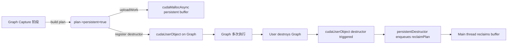

---

## 4. Proxy 操作与 Host Callback 的捕获

### 4.1 Proxy 的作用

NCCL 的通信协议（尤其是网络传输、SHM、NVLink 的某些模式）依赖一个 host-side 的 proxy thread。在 kernel launch 前，host 必须将 proxy 操作（如发送/接收描述符、缓冲区注册信息）提交到 proxy thread 的 work queue 中。

在非 capture 模式下，这通常通过 `cudaLaunchHostFunc(hostStream, hostStreamPlanCallback, plan)` 异步完成，或者在 `ncclLaunchKernelAfter_NoCuda` 中直接同步调用。

### 4.2 Graph Capture 下的 Host Callback

在 `ncclLaunchPrepare` 中，如果 `persistent == true`，NCCL 会强制启用 host stream callback 路径：

```cpp
if (persistent || ncclCudaLaunchBlocking || status == cudaErrorNotReady) {
    bool acquired = false;
    cudaStream_t hostStream;
    for (struct ncclKernelPlan* plan=planHead; plan != nullptr; plan = plan->next) {
        if (plan->hasProxyOps) {
            if (!acquired) {
                acquired = true;
                ncclStrongStreamAcquire(planner->capturingGraph, &comm->sharedRes->hostStream, ...);
            }
            plan->isHostCbEnq = true;
            cudaLaunchHostFunc(hostStream, hostStreamPlanCallback, plan);
        }
    }
    if (acquired) {
        ncclStreamWaitStream(launchStream, hostStream, ...); // kernel 等待 host callback 完成
        ncclStrongStreamRelease(planner->capturingGraph, &comm->sharedRes->hostStream, ...);
    }
}
```

关键点：
- `hostStream` 也是一个 `ncclStrongStream`。在 capture 模式下，`ncclStrongStreamAcquire` 返回的是该 graph 对应的 `captureStream`。
- `cudaLaunchHostFunc(hostStream, ...)` 会被 CUDA Runtime 捕获为 graph 中的一个 **Host Node**。
- 当 graph 执行到该 host node 时，`hostStreamPlanCallback` 会在 host 端被调用。该回调内部调用 `hostStreamPlanTask`，进而调用 `uploadProxyOps` 和 `ncclProxyStart`，将 proxy 操作推送到 proxy thread。

这意味着：**在 graph capture 阶段，proxy 操作不会被立即提交；它们被延迟到 graph 每次执行时的 host node 阶段才提交**。

### 4.3 Proxy WorkCounter 的同步

在 `src/proxy.cc` 的 `SaveProxyProfiler` 中：

```cpp
if (!comm->planner.persistent) incWorkCounter(comm, op);
...
if (comm->planner.persistent) incWorkCounter(comm, op);
```

`workCounter` 用于 kernel 与 proxy thread 之间的同步（例如，kernel 等待 proxy 准备好接收缓冲区）。在非 capture 模式下，`workCounter` 的递增与 kernel launch 是交错进行的。在 capture 模式下，由于所有 plan 在 capture 阶段就构建完成，`workCounter` 必须在 capture 阶段就完成递增，以确保 proxy 端看到的 counter 值与 kernel 参数中固化的一致。

---

## 5. CE Collectives 的 Graph 适配

### 5.1 CE Collective 简介

NCCL 的 CE (Copy Engine) Collective 是一种不启动 CUDA kernel、而是直接使用 CUDA Copy Engine（`cudaMemcpyAsync`、`cudaMemcpyBatchAsync`）完成数据搬运的集合通信路径，常用于小数据量或特定拓扑优化场景。

### 5.2 GRAPH_SYNC_VALUE 与 Reset 机制

CE Collectives 依赖跨 rank 的同步标志（`readyPtrs` / `completePtrs`）。在非 capture 模式下，每个操作使用递增的序列号（`ceSeqNum`）来实现点对点的 happen-before 语义：

```cpp
uint32_t currentSeq = ++comm->ceColl.ceSeqNum;
// 将自己的 flag 写为 currentSeq
// 等待其他 rank 的 flag 等于 currentSeq
```

但在 graph capture 模式下，**graph 执行时 CPU 不会执行 `++ceSeqNum`**，因此不能使用递增序列号。

NCCL 的解决方案是引入常量 `GRAPH_SYNC_VALUE = 1`：

```cpp
bool capturing = ncclCudaGraphValid(comm->planner.capturingGraph);
void* srcPtr = capturing ? (void*)&GRAPH_SYNC_VALUE : (void*)&currentSeq;
uint32_t waitValue = capturing ? GRAPH_SYNC_VALUE : currentSeq;
```

在 capture 模式下，所有 rank 都将自己的 flag **写为 1**，并**等待其他 rank 的 flag 等于 1**。

但这里有一个问题：如果 graph 被多次执行，第一次执行后内存中的 flag 值已经是 1。第二次执行时，write 1 之后 flag 仍然是 1，`CU_STREAM_WAIT_VALUE_EQ` 会立刻通过，**失去了同步屏障的作用**。

为了修复这个问题，NCCL 在 batch memory op 中额外添加了 **reset 操作**：

```cpp
if (ncclCudaGraphValid(comm->planner.capturingGraph)) {
    for (int i = 0; i < comm->nRanks; i++) {
        batchParams[opIdx] = {};
        batchParams[opIdx].writeValue.operation = CU_STREAM_MEM_OP_WRITE_VALUE_32;
        batchParams[opIdx].writeValue.address = ...
        batchParams[opIdx].writeValue.value = 0;  // reset to 0
        batchParams[opIdx].writeValue.flags = CU_STREAM_WRITE_VALUE_DEFAULT;
        opIdx++;
    }
}
ncclCuStreamBatchMemOp(stream, opIdx, batchParams);
```

这样，在 graph 的每个执行实例内部，同步流程变为：
1. Write 1 to own flag (通知他人我已就绪)
2. Wait 1 on peer flags (等待他人就绪)
3. **Write 0 to all flags (reset，为下一次执行做准备)**

由于 write 1、wait 1、write 0 是在同一个 stream 上按 CUDA 流序执行的，wait 1 一定在 write 0 之前完成，因此同步语义被正确保持。

### 5.3 `cudaMemcpyBatchAsync` 的回退

CUDA Graph 目前不支持捕获 `cudaMemcpyBatchAsync`。因此，在 `src/ce_coll.cc` 中：

```cpp
if (capturing || isLegacyStream) {
    for (int i = 0; i < params->numOps; i++) {
        cudaMemcpyAsync(..., stream); // 逐个 capture memcpy
        if (params->intraBatchSync && ...) {
            ncclMemOpSync(comm, args, stream);
        }
    }
} else {
    // 使用 cudaMemcpyBatchAsync 获得更高性能
    ...
}
```

这是一个明确的性能权衡：graph capture 模式下，CE collective 的性能会略低于非 capture 模式，因为它失去了 batch memcpy 的硬件优化。

### 5.4 非 Graph 模式下的 CE Collective CPU-GPU 协作

在非 graph 模式下，CE Collectives 的同步机制与 graph 模式有本质不同：

1. **递增序列号同步**：`ncclPrepMCSync` / `ncclPrepUCSync` 使用 `++comm->ceColl.ceSeqNum` 作为每个操作的唯一同步令牌。每个 rank 将自己的 ready/complete flag 写为当前序列号，并通过 `CU_STREAM_MEM_OP_WAIT_VALUE_32` 等待其他 rank 的 flag 等于同一序列号。
2. **Batch MemOp**：同步操作通过 `cuStreamBatchMemOp` 批量提交到 Copy Engine 上执行，CPU 仅负责构建 `CUstreamBatchMemOpParams` 数组。
3. **`cudaMemcpyBatchAsync` 优化**：在 CUDA 12.8+ 且非 graph 模式下，CE Collective 的数据拷贝使用 `cudaMemcpyBatchAsync`，并设置 `cudaMemcpySrcAccessOrderStream` 和 `cudaMemcpyFlagPreferOverlapWithCompute` 属性，以最大化与计算核的 overlap。

与 kernel-based collective 不同，CE Collective 的 CPU-GPU 协作模型是：**CPU 构建命令描述符，GPU Copy Engine 负责执行通信和数据同步**。CPU 完全不参与数据搬运，只负责在 host 侧准备 batch params 和同步标志。

---

## 6. Launch 流程与 Implicit Order

### 6.1 `doLaunches` 中的 Graph 一致性检查

在 `src/group.cc` 的 `doLaunches` 函数中：

```cpp
bool capturingYes = false, capturingNo = false;
do {
    (ncclCudaGraphValid(comm->planner.capturingGraph) ? capturingYes : capturingNo) = true;
    ...
} while (...);

if (capturingYes && capturingNo) {
    WARN("Either none or all communicators in a ncclGroup() can be CUDA graph captured.");
    result = ncclInvalidUsage;
    goto failure;
}
```

**约束**：在同一个 `ncclGroupStart/End()` 块中，所有 communicator 要么全部被 capture，要么全部不被 capture。混合是不允许的，否则会破坏 group barrier 和 launch 顺序的一致性。

### 6.2 Launch Prepare：Stream 同步与 Host Callback

`ncclLaunchPrepare` 的完整逻辑可以概括为：

1. 构建 plan（persistent 或普通）。
2. `deviceStream` acquire：获取用于后续 kernel 参数的 device-side 工作 stream。
3. **User Stream 对齐**：将所有 user stream（除了第一个）通过 event 同步到 `launchStream`（即第一个 user stream）。
4. `launchStream` 等待 `deviceStream`：确保 kernel 不会在前一个 communicator 的 device 工作完成前启动。
5. **Implicit Order**：若启用，让 `launchStream` 等待 per-context `launchOrder` strong stream，保证同一 device 上多个 communicator 的串行化（在 graph capture 下使用 concurrent acquire）。
6. **Host Callback 提交**：对于 persistent plan，在 `hostStream` 上提交 `cudaLaunchHostFunc`，并让 `launchStream` 等待 `hostStream`。
7. **注册 Graph Destructor**：对于 persistent plan，调用 `ncclCudaGraphAddDestructor`。

### 6.3 `ncclLaunchKernelBefore_NoUncapturedCuda`

该函数在 intra-process barrier 之后、kernel launch 之前调用。其注释说明了设计意图：

```cpp
// This code is called after we've checked in to the intra-process barrier
// but before launching the kernel. We are not allowed to call CUDA unless the
// kernel launch is captured.
```

实际上，它调用 `uploadWork(comm, plan)`。对于 persistent plan，这会在 `liveStream` 上执行 `cudaMallocAsync` + `cudaMemcpyAsync`（因为 `uploadWork` 内部 acquire `deviceStream` 时传入的是 `ncclCudaGraphNone`）。

### 6.4 `ncclLaunchFinish`

Launch 完成后，`ncclLaunchFinish` 负责：
1. 在 `launchStream` 上记录 `finishedEvent`。
2. 让 `deviceStream` 通过 `ncclStreamAdvanceToEvent` 等待 `finishedEvent`。
3. 恢复所有其他 user stream 与 `launchStream` 的同步。
4. 释放 `launchOrder` 和 `deviceStream` 的 strong stream 持有。

对于 persistent plan，`ncclLaunchFinish` 不会回收 plan 结构体，plan 继续由 graph 持有。

---

## 7. 完整流程图

### 7.1 Strong Stream Acquire/Release (Graph Capture 模式)

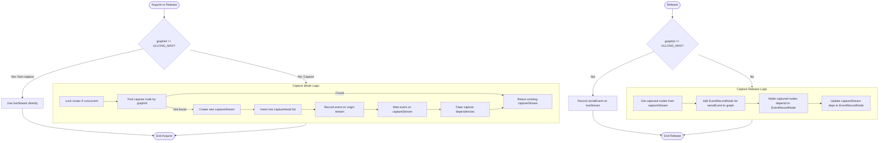

### 7.2 Persistent Kernel Plan 生命周期

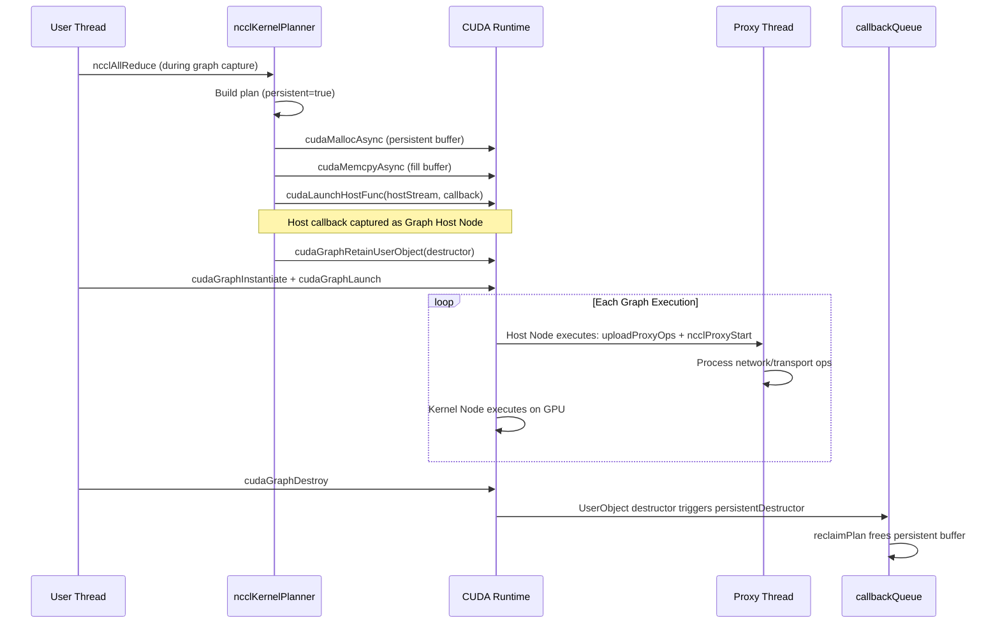

### 7.3 Group Launch with Graph Capture 整体流程

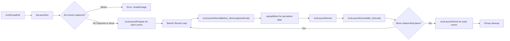

---

## 8. 限制与使用约束

1. **Group 内禁止混合 Capture**：同一个 `ncclGroupStart/End` 中，所有 communicator 必须同时被 capture 或同时不被 capture。
2. **Buffer 地址固定**：Graph capture 固化了 kernel 参数中的指针地址。如果用户希望每次 graph 执行使用不同的 sendbuff/recvbuff，需要在 capture 后通过 `cudaGraphExecKernelNodeSetParams` 手动更新 kernel node 参数，或者使用固定的注册缓冲区池。
3. **CE Collective 性能回退**：由于 `cudaMemcpyBatchAsync` 不支持 graph capture，CE 路径会回退到逐个 `cudaMemcpyAsync`。
4. **Driver/Runtime 版本要求**：
   - `ncclCudaGraph` 功能要求 CUDA Runtime >= 11.3 且 Driver >= R465。
   - `CU_LAUNCH_ATTRIBUTE_LAUNCH_COMPLETION_EVENT`（Implicit Order Launch 模式）要求 CUDA >= 12.3。
   - `cudaStreamUpdateCaptureDependencies_v2` 要求 CUDA >= 13.0（或向后兼容的宏定义）。
5. **Host Callback 延迟**：虽然 host callback 被 capture 为 host node，但 graph 执行到该节点时仍需要 host CPU 介入提交 proxy 操作。如果 proxy 路径较重（如 InfiniBand 网络），这部分延迟无法被 graph 完全消除。

---

## 9. 性能分析与实现评论

### 9.1 性能收益

| 收益点 | 说明 |
|--------|------|
| **Eliminate CPU overhead** | 对于小消息量（如 LL/LL128 协议）或高频 collective（如 Transformer layer 中的 AllReduce），graph capture 可将 CPU 侧 launch 开销降至接近零。 |
| **更稳定的 timing** | Graph 消除了 CPU jitter，使得 kernel 之间的间隔更加均匀，有利于网络流水线的稳定填充。 |
| ** fuse compute and comm** | 在同一个 graph 中，计算与通信核的依赖关系由 CUDA runtime 静态优化调度，往往比动态 launch 更优。 |

### 9.2 性能损耗与权衡

| 损耗点 | 说明 |
|--------|------|
| **Capture-time malloc** | 每个 persistent plan 在 capture 时都要执行一次 `cudaMallocAsync`。对于包含大量 communication 的 graph（如 MoE 模型），capture 阶段可能有明显的 host 延迟。 |
| **Persistent buffer 膨胀** | 每个 captured collective 都占用独立的 persistent buffer，不像 Fifo 那样循环复用。对于大消息量，这会显著增加显存占用。 |
| **CE batching 缺失** | `cudaMemcpyBatchAsync` 无法被 capture，导致 CE collective 在 graph 模式下性能下降。 |
| **Mixing false dependency** | `graphUsageMode=2` 下，`serialEvent` 在 capture 和 live 执行之间建立了全局串行化，可能降低并发性。如果应用确定不会 mixing，建议显式设置 `graphUsageMode=1` 以消除该开销。 |
| **Host node 阻塞风险** | 如果 proxy thread 处理速度慢，`cudaLaunchHostFunc` 的 host node 可能成为 graph 执行的关键路径。 |

### 9.3 实现方案评论

**优点：**
- **Strong Stream 抽象优雅**：它以最小的侵入性解决了 Graph 中 Stream 身份丢失的核心问题。通过 `captureStream` + `serialEvent` + `cudaStreamUpdateCaptureDependencies` 的组合，实现了对持久资源的跨 graph 实例串行化。
- **User Object 生命周期管理得当**：利用 `cudaUserObject` 将 persistent plan 的生命周期绑定到 graph，避免了复杂的引用计数和泄漏风险。
- **CE sync 设计精巧**：`GRAPH_SYNC_VALUE` + reset 机制用非常低的复杂度（一个常量 + 一个 batch write）解决了无 CPU 参与下的可重入同步问题。
- **向后兼容良好**：代码中大量使用 `#if CUDART_VERSION >= 11030` 等条件编译，确保在老版本 CUDA 上编译和运行不受影响。

**可以改进的空间：**
- **Persistent buffer 池化**：目前的 `cudaMallocAsync` 是按 plan 分配的，可以考虑在 communicator 级别维护一个 persistent buffer pool，在 capture 时从 pool 中取出，graph 销毁后归还 pool，减少 allocator 开销和内存碎片。
- **Graph-aware proxy batching**：当前每个 plan 对应一个独立的 host callback。如果多个 plan 的 proxy ops 可以预先合并为单个更大的 host node，可能减少 graph 执行时的 host 上下文切换次数。
- **支持 `cudaGraphExecUpdate`**：目前 kernel 参数在 capture 阶段完全固化。如果能更方便地支持更新 captured graph 中的 buffer 指针（例如通过 `workBuf` 的间接层），将提升 graph 在动态 shape 场景下的可用性。

---

## 10. NCCL Stream 架构与 CPU-GPU 协作机制深度剖析

NCCL 不仅是一个集合通信库，更是一个精密的异构调度系统。它在 Host CPU 与 GPU Device 之间构建了多层协作机制：通过私有 CUDA Stream 管理资源访问顺序，通过 Host Callback 异步提交网络代理任务，通过 Proxy Thread 在后台驱动网卡/传输层。理解这套机制，是理解 Graph Capture 设计的必要前置知识。

### 10.1 NCCL 的 Stream 分层架构

NCCL 在运行时会涉及三类 Stream：**User Stream**（用户传入）、**Device Stream**（NCCL 内部 GPU 工作流）和 **Host Stream**（NCCL 内部 CPU 回调流）。此外，还有一个跨 communicator 的 **Launch Order** 流，用于保证同一 GPU Context 上多个 communicator 的串行化。

#### 10.1.1 User Stream

User Stream 是用户调用 `ncclAllReduce(stream=xxx)` 时传入的 `cudaStream_t`。NCCL 不会在该 stream 上直接执行内部操作（如内存分配、proxy 回调），而是将最终要执行的 CUDA kernel 调度到该 stream 上。具体而言：
- `ncclLaunchPrepare` 阶段，NCCL 选择 `planner->streams->stream`（即第一个 user stream）作为 **launchStream**，所有的 kernel launch 都发生在这个 stream 上。
- 如果 group 内存在多个 user stream，`launchStream` 仅取第一个，其余 stream 通过 `cudaStreamWaitEvent` 与之对齐。

#### 10.1.2 Device Stream (`sharedRes->deviceStream`)

`deviceStream` 是 `ncclSharedResources` 中的 `ncclStrongStream`，在 `devCommSetup` 和 `channel.cc` 的初始化阶段创建。它的核心职责是承载 NCCL 内部对 GPU memory 的异步操作：
- `devComm` 及其相关 channel 结构的 `cudaMallocAsync` / `cudaMemcpyAsync`。
- `uploadWork` 中 persistent buffer 的 `cudaMallocAsync` + `cudaMemcpyAsync`。
- Transport setup 中 `connInfo` 的 device 端更新。

为什么需要独立的 `deviceStream` 而不直接在 user stream 上做这些操作？
1. **资源隔离**：NCCL 的内存初始化/上传可能与用户的计算重叠，使用独立 stream 可以在不阻塞 user stream 的情况下并行完成。
2. **确定性同步**：通过 `ncclStreamWaitStream(launchStream, deviceStream, scratchEvent)`，NCCL 能精确控制 kernel 在 device 端准备工作完成后再启动。

**Transport Setup 中的协作**：在 `ncclTransportP2pSetup` (`src/transport.cc`) 中，NCCL 通过 bootstrap 在 host 侧交换连接元数据后，会在 `hostStream` 上执行 `cudaMemcpyAsync`，将 `connInfo` 从 host 拷贝到 device 端的 `devPeersHostPtr[peer]->send[connIndex]` 和 `recv[connIndex]`。随后通过 `ncclStreamWaitStream(deviceStream, hostStream, scratchEvent)` 确保后续在 `deviceStream` 上的任何设备端操作（如 kernel launch）都能观察到最新的连接信息。这是 NCCL 初始化阶段 CPU-GPU 协作的经典范例。

#### 10.1.3 Host Stream (`sharedRes->hostStream`)

`hostStream` 同样是 `ncclStrongStream`，职责是串行化所有需要 CPU 介入的异步任务，主要是：
- **Proxy 提交**：通过 `cudaLaunchHostFunc(hostStream, hostStreamPlanCallback, plan)` 将 `uploadProxyOps` 任务异步派发到 CUDA driver 的 host callback 队列。
- **Profiler 事件**：部分 profiler 事件的启停。

Host Stream 的设计初衷是**避免在 kernel launch 的 critical path 上同步执行 host 任务**。`cudaLaunchHostFunc` 的语义是：该 host 函数在 GPU driver 执行到 stream 中对应位置时，在后台线程中调用。由于 host 函数可能涉及锁、网络系统调用（IB verbs），直接在 launch 线程中同步调用会阻塞后续的 kernel launch。通过将其注册到独立的 `hostStream` 上，并让 `launchStream` 通过 event 等待 `hostStream`，实现了 CPU 任务的 offloading。

#### 10.1.4 Launch Order (`ncclCudaContext->launchOrder`)

`launchOrder` 是一个 per-CUDA-context 的 `ncclStrongStream`。当同一 GPU 上有多个 NCCL communicator 时（例如通过 `ncclCommSplit` 创建），如果没有全局顺序控制，不同 communicator 的 kernel 可能在 GPU 上并发执行，导致资源竞争（例如共享的 NVLink 带宽、GDR 注册表）。

`launchOrder` 通过在每次 launch 前让 `launchStream` 等待 `launchOrder`，并在 launch 完成后将 `launchOrder` 推进到 `finishedEvent` 之后，实现了同一 context 下所有 communicator kernel 的串行化（若开启了 `ncclParamLaunchOrderImplicit`）。在 Graph Capture 模式下，由于程序顺序由 graph 拓扑决定，`launchOrder` 的 acquire 被标记为 `concurrent=true`。

#### 10.1.5 Intra-process Barrier：同一进程内多 Rank 的同步

NCCL 没有使用 `pthread_barrier`，而是实现了一套基于原子操作的自旋屏障（`ncclCommIntraBarrierIn` / `ncclCommIntraBarrierOut`），用于同一进程内所有 communicator（即同一 GPU 上的多个 rank 或 split 产生的子 communicator）的同步。

**数据结构**（以 `intraComm0` 为 leader）：
- `intraBarrierCounter`：到达计数器，高 32 位存储归约和 `x`，低 32 位存储到达人数。
- `intraBarrierGate`：释放门，低 1 位是相位位（phase flip），避免 ABA 问题。
- `intraBarrierPhase`：每个 communicator 本地的相位状态。

**工作流程**：
1. `ncclCommIntraBarrierIn(comm, x)`：每个 rank 原子增加 `intraBarrierCounter`（人数 +1，`x` 累加）。如果到达人数等于 `intraRanks`，leader 重置计数器并将 `intraBarrierGate` 的相位翻转，通知所有等待者释放。
2. `ncclCommIntraBarrierOut(comm)`：rank 翻转本地相位，然后自旋读取 `intraBarrierGate`，直到相位与全局门匹配。返回所有 rank 的 `x` 之和。

**在 Launch 中的作用**：
当 `ncclParamLaunchMode == ncclLaunchModeGroup` 时，同一 clique（`intraComm0` 相同的 communicator 组）的每一轮 kernel launch 都会先 `BarrierIn`、再 `BarrierOut`。这保证了同一 GPU 上所有 rank 的 NCCL kernel 按轮次齐步发射，并通过 `BarrierOut` 返回的 `x` 之和判断“是否还有 rank 存在未发射的 plan”，从而决定是否需要继续下一轮。

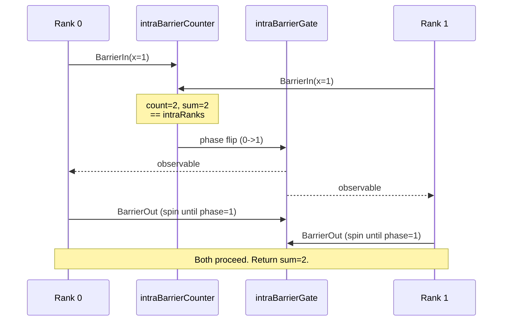

#### 10.1.6 双队列异步回调机制：`eventCallbackQueue` 与 `callbackQueue`

NCCL 内部维护了两条异步回调队列，用于在不同条件下将清理或回收任务从生产线程 offload 到消费线程。

**`eventCallbackQueue`（单生产者单消费者，基于 CUDA Event）**：
- 队列中的每个节点包含一个 `cudaEvent_t` 和一个回调函数 `fn`。
- 消费端 `ncclCommPollEventCallbacks` 会查询队首事件的 `cudaEventQuery`（或 `cudaEventSynchronize` 当 `waitSome=true`）。一旦事件完成，立即出队并执行回调。
- **典型用例**：
  - `uploadWork_cleanup_fn`：在 `uploadWork` 的 persistent 路径中，当 `deviceStream` 上的 `cudaMemcpyAsync` 完成后，通过事件回调异步释放 host staging buffer。
  - `KernelFinishCallback`：kernel 完成后推进 `workFifoConsumed`。
- **阻塞场景**：在 `waitWorkFifoAvailable` 中，当 Fifo 满时，NCCL 不会直接 `cudaStreamSynchronize`，而是调用 `ncclCommPollEventCallbacks(comm, /*waitSome=*/true)`，通过等待事件并触发回调来推进 `workFifoConsumed`，从而解除 Fifo 满的状态。

**`callbackQueue`（多生产者单消费者，MPSC，Lock-free）**：
- 基于 `ncclIntruQueueMpsc` 实现，使用了 `COMPILER_ATOMIC_EXCHANGE` 的 Treiber-like 链表尾部交换算法，支持无锁入队。
- 生产端可以是任何线程（如 proxy thread 的 `persistentDestructor`、host callback 中的 `hostStreamPlanTask`）。
- 消费端 `ncclCommPollCallbacks` 会一次性批量出队所有节点并执行。若队列为空且 `waitSome=true`，消费者会自旋 10μs 后进入条件变量睡眠，直到被生产者唤醒。
- **典型用例**：
  - `reclaimPlan`：被 `persistentDestructor` 推入队列，由主线程异步释放 persistent buffer。
  - 各种 `ncclCommPushCudaFree` 的延迟释放任务。

两者的核心区别在于：`eventCallbackQueue` 的触发条件是 **GPU 事件完成**，而 `callbackQueue` 的触发条件是 **跨线程的 host-side 任务投递**。

#### 10.1.7 `ncclStrongStreamSynchronize` 中的 `serialEvent` 等待

`ncclStrongStreamSynchronize` 的实现如下：

```cpp
ncclResult_t ncclStrongStreamSynchronize(struct ncclStrongStream* ss) {
    CUDACHECK(cudaStreamWaitEvent(ss->liveStream, ss->serialEvent, 0));
    CUDACHECK(cudaStreamSynchronize(ss->liveStream));
    return ncclSuccess;
}
```

在 mixing 模式下，`liveStream` 与 capture stream 通过 `serialEvent` 建立了跨路径的 happen-before 关系，但 `liveStream` 本身不会自动等待 `serialEvent`。因此，在需要真正同步 Strong Stream 所有工作时（如 `channel.cc` 初始化完毕后的同步），NCCL 显式先在 `liveStream` 上 `cudaStreamWaitEvent(serialEvent)`，然后再 `cudaStreamSynchronize(liveStream)`。这保证了无论是 live 路径还是 capture 路径上的工作，都必须全部完成后，调用者才能继续执行。

### 10.2 CUDA Event 与 Stream 同步机制

NCCL 内部几乎不使用 `cudaStreamSynchronize`（阻塞 host），而是依赖 `cudaEventRecord` + `cudaStreamWaitEvent` 实现非阻塞的跨 stream 同步。

#### 10.2.1 `ncclStreamWaitStream`：跨 stream 同步的原子操作

```cpp
ncclResult_t ncclStreamWaitStream(cudaStream_t a, cudaStream_t b, cudaEvent_t scratchEvent) {
  CUDACHECK(cudaEventRecord(scratchEvent, b));
  CUDACHECK(cudaStreamWaitEvent(a, scratchEvent, 0));
  return ncclSuccess;
}
```

这是 NCCL 中最基础的同步原语：
- 在 stream `b` 上记录一个一次性 event；
- 让 stream `a` 等待该 event；
- 从而保证 `a` 中后续操作在 `b` 中此前所有操作完成后才开始。

`scratchEvent` 取自 `sharedRes->scratchEvent`，是 communicator 级别的复用 event，避免了频繁创建/销毁 event 的开销。

#### 10.2.2 Launch Prepare 中的同步链

在 `ncclLaunchPrepare` 中，一个典型的 non-captured launch 会建立如下同步链：

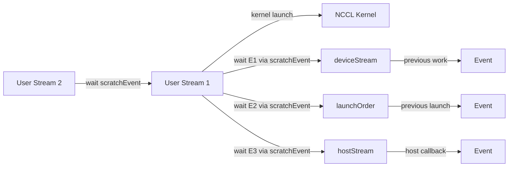

这确保了：
1. 所有 user stream 对齐到 `launchStream`（User Stream 1）。
2. `launchStream` 等待 `deviceStream` 上的准备工作完成（如 work upload、connInfo 更新）。
3. `launchStream` 等待 `launchOrder`，避免同一 context 上 communicator 间并发。
4. `launchStream` 等待 `hostStream`，确保 proxy ops 已提交后再启动 kernel。

在 `ncclLaunchFinish` 中，这些依赖关系被反向释放：
1. `deviceStream` 等待 `launchStream` 的 `finishedEvent`（fast-forward）。
2. `launchOrder` 被推进到 `finishedEvent` 之后。
3. 其他 user stream 也等待 `finishedEvent`，从而与 `launchStream` 对齐。

### 10.3 CPU-GPU 协作：从 API 调用到 Kernel 执行的完整链路

NCCL 的一个 collective API 调用（如 `ncclAllReduce`）从用户线程发起，到最终在 GPU 上执行 kernel，经历了以下几个阶段。

#### 10.3.1 阶段一：Task Append（纯 CPU）

用户线程调用 `ncclAllReduce`，进入 `taskAppendColl`（或 `ncclEnqueueCheck`）：
1. **参数校验**：检查 datatype、op、count 等。
2. **Graph 检测**：调用 `ncclCudaGetCapturingGraph`，判断当前 stream 是否处于 graph capture。
3. **Task 构建**：在 communicator 的 `planner` 中分配 `ncclTaskColl`，填充 sendbuff、recvbuff、count 等信息，并将 task 推入对应的队列（如 `collSorter` 或 `p2pQueue`）。

此时没有任何 CUDA API 被调用，所有工作都在用户线程的 CPU 上下文中完成。

#### 10.3.2 阶段二：Group End / Launch Prepare（CPU 调度）

当用户调用 `ncclGroupEnd`（或单个 collective 隐式触发 group）时，进入 `doLaunches`：
1. **Preconnect**：如果需要，建立 P2P / Ring / Tree / NVLS 连接。
2. **Task Scheduling**：`ncclPrepareTasks` 将 task 队列中的操作调度到具体的 channel 和算法上，生成 `ncclKernelPlan`。
3. **Plan Finalization**：`finishPlan` 将 work descriptor、batch 信息整理到 kernel args 中。

#### 10.3.3 阶段三：Work Upload（CPU + GPU DMA）

对于每个 plan，`uploadWork` 负责将 kernel 需要读取的 work descriptor 送到 GPU memory：

- **Fifo 模式**：直接写入 host 端的 `workFifoBuf`（pinned memory 或 GDR mapped memory），更新 `workFifoProduced`。由于 FIFO buffer 是 device-mapped 的，kernel 可以直接读取，无需显式 `cudaMemcpy`。
  - **GDR/GDRCopy 与内存序保证**：当 `comm->workFifoBufGdrHandle != nullptr` 时，表示 `workFifoBuf` 是一块通过 GPU Direct RDMA (GDR) 或 GDRCopy 映射到 GPU 地址空间的 host memory，且通常被标记为 **Write-Combining (WC)**。WC 内存在 CPU 侧可能经过写合并缓冲区，不会立即刷到物理内存。为了保证 proxy thread 或网卡 DMA 引擎能读到最新数据，`uploadWork` 在更新 `workFifoProduced` 之前会调用 `wc_store_fence()`（发出 `sfence` 或等效屏障），强制刷空 WC buffer，确保 Fifo 数据对 GPU/网卡立即可见。
- **Persistent 模式**：在 `deviceStream` 上执行 `cudaMallocAsync` + `cudaMemcpyAsync`，将 host staging buffer 拷贝到 device buffer。完成后通过 `eventCallbackQueue` 异步释放 host buffer。
- **Args 模式**：如果 work descriptor 足够小（能装进 kernel args），直接嵌入 `kernelArgs` 结构体中，无需额外 upload。

#### 10.3.4 阶段四：Proxy 提交（Host Callback）

`uploadProxyOps` 将 plan 中的 `ncclProxyOp` 转换为 communicator 共享的 `opCount`，并推入 proxy 的本地 pool。随后 `ncclProxyStart` 唤醒 proxy thread。

这个提交有两种路径：
1. **同步路径**（`isHostCbEnq == false`）：在 `ncclLaunchKernelAfter_NoCuda` 中直接调用 `hostStreamPlanTask`，在当前用户线程中同步完成 proxy 提交。适用于没有 persistent refs 且不需要 host stream 的场景。
2. **异步路径**（`isHostCbEnq == true`）：在 `ncclLaunchPrepare` 中通过 `cudaLaunchHostFunc(hostStream, hostStreamPlanCallback, plan)` 异步提交。CUDA driver 会在 GPU 执行到该 host node 时，在内部 worker thread 中调用回调。

#### 10.3.5 阶段五：Kernel Launch（GPU）

`ncclLaunchKernel` 使用 `cuLaunchKernel` 或 `cuLaunchKernelEx` 将 NCCL kernel 发射到 `launchStream`。Kernel 的 `extra` 参数指向 `plan->kernelArgs`，其中包含了所有 channel 的 work batch 指针和 communicator device handle (`devComm`)。

在较新的 CUDA driver 上，NCCL 还会附加 `CU_LAUNCH_ATTRIBUTE_LAUNCH_COMPLETION_EVENT`（若 `implicitOrder == ncclImplicitOrderLaunch`），该事件会被 GPU 硬件在 kernel grid 完全结束后自动记录，比传统的 `cudaEventRecord` 更早、更轻量。

#### 10.3.6 阶段六：Proxy Thread 执行（后台 CPU 线程）

##### 10.3.6.1 Proxy Connection 的生命周期（Control Path）

在 data path 的 `ncclProxyOp` 能被 proxy thread 处理之前，每个 transport connection 必须经过控制面的初始化状态机。这些控制面消息同样通过 `ncclProxyPost` 提交到 proxy thread，但由 `proxyProgressAsync` 处理：

1. **`ncclProxyMsgInit`**：`proxyConnInit` 分配 `ncclProxyConnection` 结构体。
2. **`ncclProxyMsgSetup`**：调用 transport 的 `proxySetup`（例如 IB 创建 Queue Pair、SHM 创建共享内存段、NET 分配资源）。
3. **`ncclProxyMsgConnect`**：调用 transport 的 `proxyConnect`（例如 IB 修改 QP 状态到 RTS、交换 LID/GID、建立 socket 连接）。
4. 当状态变为 `connConnected` 后，该 connection 才能接收 data path 的 `ncclProxyOp`。

`proxyProgressAsync` 是一个异步状态机，某些 transport 的 `proxySetup` / `proxyConnect` 可能需要多次轮询（`done == 0`）才能完成。控制面任务与 data path 任务共享同一个 proxy thread，但控制面通常只在 communicator 初始化或连接建立阶段出现。

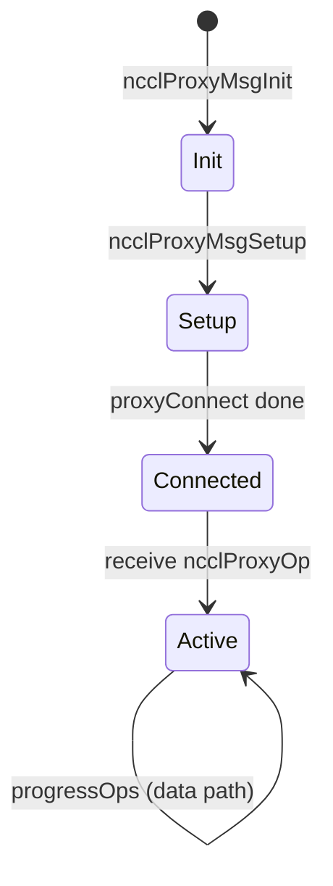

Proxy thread（`ncclProxyProgress`）是一个独立的 `std::thread`，通常每个 GPU 设备有一个。在 data path 上，它的主循环如下：

```cpp
do {
    // 1. 处理当前已激活的 proxy args（调用各 transport 的 progress 函数）
    ret = progressOps(proxyState, state, state->active, &idle);
    
    // 2. 定期从提交队列拉取新任务
    if (idle || !state->active || (++proxyOpAppendCounter == freq)) {
        ncclProxyGetPostedOps(proxyState, &added);
        proxyOpAppendCounter = 0;
    }
    
    // 3. 若没有任何进展，yield CPU
    if (added == 0) std::this_thread::yield();
    
} while (not stopped && not aborted);
```

`ncclProxyGetPostedOps` 的核心逻辑：
1. 检查 `opsPool->nextOps`。如果为空且当前没有 active args，则调用 `pool->cond.wait(lock)` **阻塞等待**。
2. 当 `ncclProxyStart`（由 host callback 或用户线程调用）通过 `pool->cond.notify_one()` 唤醒 proxy thread 后，proxy thread 从 pool 的链表中取出所有新提交的 `ncclProxyOp`。
3. 对每个 op，调用 `ProxyAppend`，将其合并到对应 connection 的 `ncclProxyArgs` 链表中（同一 connection 上相同 `opCount` 的 op 会被合并为 subs）。
4. 将合并后的 args 链表挂到 `state->active` 上，供 `progressOps` 在下一轮处理。

`progressOps` 则会遍历所有 active args，调用每个 transport 注册的 `proxyProgress` 函数（如 IB Verbs 的 post send/recv、SHM 的 memcpy、NET 的 `send`/`recv`）。这些函数通常是非阻塞的，通过轮询 CQ（completion queue）或标志位来推进状态。

### 10.4 `cudaThreadExchangeStreamCaptureMode` 的防御性编程模式

在 NCCL 源码中，大量内存分配/释放和同步函数都遵循一个固定的防御性模式：

```cpp
cudaStreamCaptureMode mode = cudaStreamCaptureModeRelaxed;
CUDACHECK(cudaThreadExchangeStreamCaptureMode(&mode));
// ... 执行 cudaMalloc / cudaFree / cudaHostAlloc / cudaStreamSynchronize ...
CUDACHECK(cudaThreadExchangeStreamCaptureMode(&mode));
```

**原因**：当某个线程正在进行 CUDA Graph Capture 时，CUDA Runtime 默认将该线程的 capture mode 设为 `Global` 或 `ThreadLocal`。在此模式下，调用 `cudaMalloc`、`cudaFree`、`cudaStreamSynchronize`、`cudaHostRegister` 等 API 会触发 `cudaErrorStreamCaptureUnsupported` 错误。

NCCL 在以下场景中大量使用该模式：
- `alloc.h` 中的 `ncclCudaMallocDebug`、`ncclCudaCallocDebug`、`ncclCudaFree`。
- `enqueue.cc` 中 `reclaimPlan` 释放 persistent buffer 时的 `cudaFree`。
- `shmutils.cc` 中 `cudaHostRegister` 共享内存时。
- `comm.h` 中 `ncclCommPollEventCallbacks` 调用 `cudaEventSynchronize` 时。

通过临时切换到 `cudaStreamCaptureModeRelaxed`，这些 API 可以在 capture 期间安全执行，且不会被意外 capture 进 graph。这是 NCCL 能够在 graph capture 阶段执行 `uploadWork`（部分 API 如 `cudaMallocAsync` 可被 capture）的同时，又安全执行 `cudaFree` 和 `cudaEventSynchronize` 的关键机制。

### 10.5 Host Callback 的 CUDA 语义与 Graph 行为

`cudaLaunchHostFunc(stream, fn, arg)` 是 CUDA 提供的一种在 stream 执行流中插入 CPU 回调的机制。其关键语义包括：

1. **异步性**：调用 `cudaLaunchHostFunc` 的 host 线程不会等待 `fn` 执行，而是立即返回。`fn` 由 CUDA driver 的内部线程池在某个后续时间点调用。
2. **流序保证**：`fn` 一定在 stream 中所有此前入队的 GPU 操作完成后执行；`fn` 执行完成后，stream 中后续入队的 GPU 操作才能开始。
3. **阻塞效应**：虽然 `fn` 本身在后台线程执行，但**在同一个 stream 中，fn 执行期间会阻塞该 stream 上后续 GPU 操作的调度**。因此 `fn` 必须尽快完成，否则会形成“host callback 瓶颈”。

在 **CUDA Graph Capture** 中，`cudaLaunchHostFunc` 会被捕获为一个 **Host Node**。与普通 stream 不同的是：
- 当 graph 实例被 `cudaGraphLaunch` 执行时，CUDA runtime 会在执行到 host node 时调用 `fn`。
- 若 host node 尚未完成，graph 中该 node 之后的所有 GPU 操作都不会被调度到硬件上（即使它们与前面的 GPU 节点没有数据依赖，因为 graph 是拓扑顺序执行）。
- 这意味着：在 graph 模式下，`hostStreamPlanCallback` 的延迟会直接变成 graph 执行的关键路径延迟。

### 10.6 为什么 NCCL 需要 Proxy Thread？

NCCL kernel 是运行在 GPU SMs 上的 CUDA 代码，它无法直接执行 host-only 的操作，例如：
- 调用 IB Verbs API（`ibv_post_send`、`ibv_poll_cq`）发送/接收 RDMA 消息。
- 调用 socket API 进行 TCP 通信。
- 调用 OS 系统调用进行共享内存同步（futex、semaphore）。
- 向 NVSwitch 或 GPU Copy Engine 下发命令。

Proxy Thread 的存在就是为了弥合这一鸿沟：
- **GPU Kernel** 负责在 device memory 中准备数据、更新 doorbell、轮询 device-visible 的 completion flag。
- **Proxy Thread** 负责在 host side 与网卡/操作系统交互，将网络请求真正投递出去，并在收到完成通知后更新 device-visible 状态。

两者之间通过**共享内存中的 FIFO/Flag 进行同步**。例如，在 Ring 算法的 Simple 协议中，kernel 会将数据写入 send buffer，然后更新 `head` 指针；proxy thread 检测到 `head` 前进后，调用 `ibv_post_send` 将数据发出；当网卡报告发送完成后，proxy thread 更新 `tail` 指针；kernel 轮询 `tail` 指针确认数据已被接收。

### 10.7 完整协作流程图

#### 10.7.1 单次 Collective 的 CPU-GPU 时序

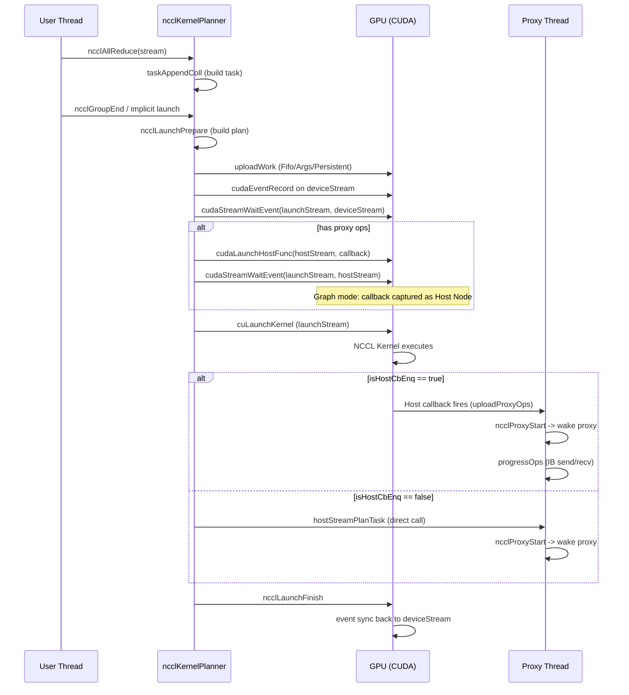

#### 10.7.2 Proxy Thread 主循环与任务提交

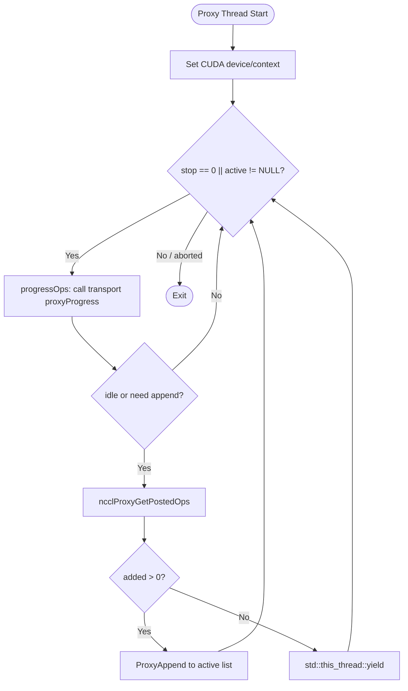

#### 10.7.3 UploadWork 的三种存储路径

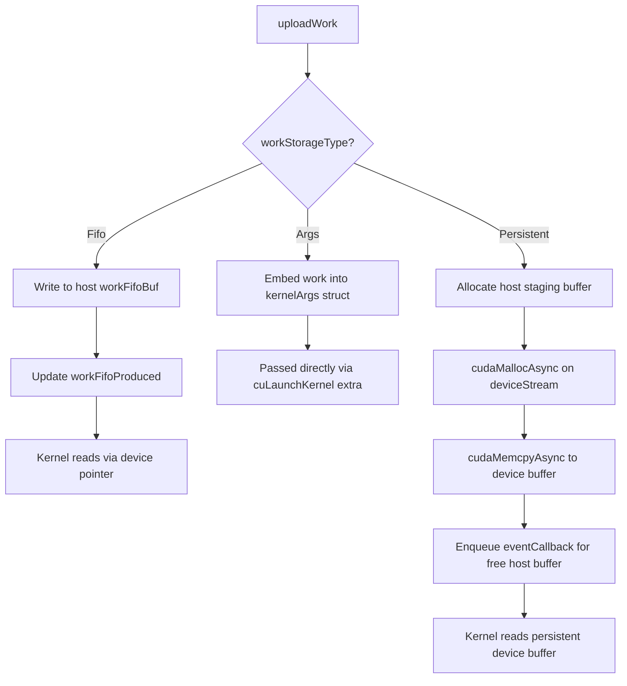

### 10.8 关键设计洞察

1. **三层流水线解耦**：User Thread 负责 API 封装与 plan 构建；CUDA Streams（deviceStream / hostStream / launchStream）负责调度 GPU 与 Host Callback 的执行顺序；Proxy Thread 负责底层网络 I/O。三者通过 Event 和共享内存 FIFO 松耦合，最大化并行度。

2. **避免 Host 阻塞**：NCCL 极力避免在 launch path 上调用 `cudaStreamSynchronize` 或长时间持有锁。Fifo upload 是同步写内存（无阻塞），persistent upload 和 proxy 提交都 offload 到异步路径。唯一可能阻塞用户线程的地方是 `waitWorkFifoAvailable`（当 Fifo 满时等待 `eventCallbackQueue` 推进消费指针），但即使如此，它也是通过 `ncclCommPollEventCallbacks` 等待 CUDA event 而非硬阻塞在 stream sync 上。

3. **Graph 下的语义等价**：Graph Capture 并没有改变 NCCL 的 CPU-GPU 协作模型，它只是将原本在 launch 时刻动态发生的 `cuLaunchKernel` 和 `cudaLaunchHostFunc` 固化到 graph topology 中。Strong Stream 保证了 graph 内部对持久资源的串行化，Persistent Buffer 替代了循环 Fifo，Host Node 替代了动态的 host callback。

---

## 11. 总结

NCCL 对 CUDA Graph Capture 的支持是一个在**正确性、性能、兼容性**之间精心权衡的工程设计。其核心可以概括为以下几点：

1. **Strong Stream** 解决了 Graph 中 Stream 身份丢失与资源串行化的问题，是整套机制的基石。
2. **Persistent Plan** 通过独立 buffer + `cudaUserObject` 生命周期绑定，确保了 graph 可以安全地多次执行而不会覆写共享状态。
3. **Host Callback Capture** 巧妙地将 proxy 提交从 capture 阶段延迟到 graph 执行阶段，保持了 kernel 与 proxy 的同步语义。
4. **CE Sync 适配** 通过固定同步值 + reset 操作，实现了无 CPU 参与的可重入跨 rank 同步。

对于用户而言，使用 NCCL 的 CUDA Graph Capture 时应注意：
- 尽量保证 communicator 在同一 group 内的一致性（全 capture 或全非 capture）。
- 对于确定性的通信模式（固定 buffer、固定 count），graph capture 的收益最大。
- 在 Mixing 模式下要意识到 `serialEvent` 引入的潜在串行化开销；如果不需要 mixing，建议显式设置 `NCCL_GRAPH_MIXING_SUPPORT=0` 并配置 `graphUsageMode=1`。

