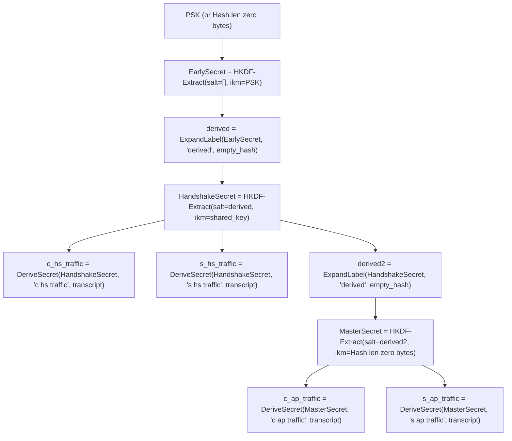
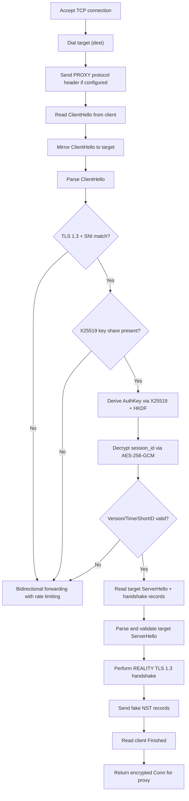
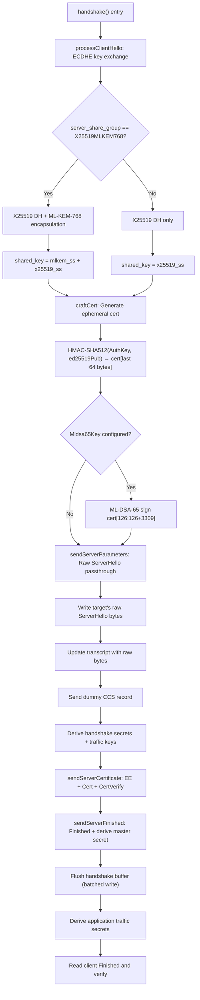
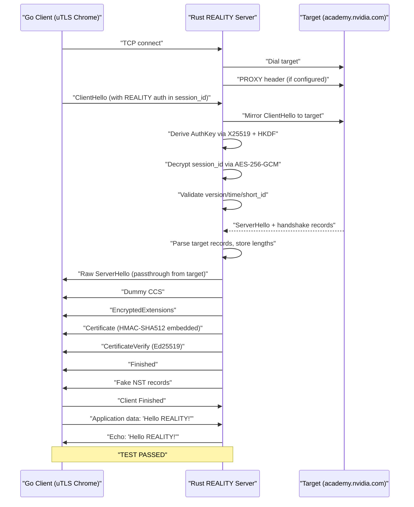

# REALITY Protocol Rust Implementation — Development Document

## 1. Project Overview

REALITY is an anti-censorship TLS proxy protocol. The server impersonates a real website ("target/dest") — authenticated clients receive proxy service, while unauthenticated traffic is transparently forwarded to the target, making the server indistinguishable from a standard TLS server.

This Rust implementation is a **complete, from-scratch server-side rewrite** of the Go REALITY protocol (originally a fork of Go's `crypto/tls`). The Go source is ~15,741 lines across 28 `.go` files; the Rust implementation is ~9,403 lines across 35 `.rs` files in a Cargo workspace.

**Why Rust?** Memory safety guarantees, no GC pauses for latency-sensitive TLS processing, native async I/O with tokio, and integration with the Rust networking ecosystem.

**Core challenge:** REALITY deeply modifies TLS internals — raw ServerHello passthrough, per-record padding, handshake buffering, MirrorConn coordination. These modifications are architecturally incompatible with using rustls as-is, necessitating a custom TLS 1.3 implementation.

---

## 2. Architecture Decision: Custom TLS 1.3

**Decision: Build a custom TLS 1.3 server implementation focused on REALITY's needs, not fork rustls.**

7 deep modifications required by REALITY are architecturally incompatible with rustls:

| # | Modification | Go Location | Why rustls Can't Do This |
|---|---|---|---|
| 1 | Raw ServerHello passthrough — write target's raw bytes to wire | `handshake_server_tls13.go:855-858` | rustls always constructs ServerHello from structured data |
| 2 | Per-record padding in encrypt() — pad to match target fingerprint | `conn.go:532-557` | Padding interleaved with AEAD sealing, can't be a post-encryption hook |
| 3 | Handshake message buffering — buffer all post-SH, flush on Finished | `conn.go:1103-1110` | rustls sends messages immediately |
| 4 | Post-handshake fake NST records — generate fake app_data records | `tls.go:395-428` | rustls has no concept of generating fake post-handshake records |
| 5 | MirrorConn coordination — intercept transport before TLS processing | `tls.go:64-102` | rustls can't accommodate this pattern |
| 6 | Custom ClientHello auth — X25519 DH + HKDF + AES-GCM session_id decrypt | `tls.go:207-268` | Happens before any TLS state machine progression |
| 7 | Custom cert generation — per-connection ephemeral cert with HMAC + optional ML-DSA-65 | `handshake_server_tls13.go:141-165` | Completely non-standard cert creation |

**What REALITY actually needs from TLS 1.3** (server-side only):
- TLS 1.3 record layer (read/write records, AEAD encrypt/decrypt)
- TLS 1.3 key schedule (HKDF-Expand-Label, all secret derivations)
- ClientHello parsing (only specific fields)
- ServerHello parsing (to validate target's response)
- Handshake message serialization (EE, Cert, CertVerify, Finished, NST)
- AEAD with TLS 1.3 nonce construction

None of these require a full TLS state machine.

---

## 3. Crate Structure

```
reality-rs/
  Cargo.toml                         # Workspace root
  crates/
    reality-core/                     # Core protocol library (5,204 lines, 19 files)
      src/
        lib.rs                        # Module declarations and re-exports
        config.rs                     # Config, LimitFallback structs
        constants.rs                  # TLS protocol constants, curve IDs, extension IDs
        auth.rs                       # X25519 DH, HKDF, AES-GCM session_id decrypt
        cert.rs                       # HMAC-SHA512 embedding into ephemeral certificates
        cipher_suite.rs               # TLS 1.3 cipher suite enum (AES-128/256-GCM, ChaCha20)
        client_hello.rs               # ClientHello parser (fields REALITY needs)
        server_hello.rs               # ServerHello parser (for target validation)
        key_schedule.rs               # TLS 1.3 key schedule (RFC 8446 Section 7.1)
        record.rs                     # TLS record layer: read/write/encrypt/decrypt
        conn.rs                       # Conn, HalfConn, AsyncRead/AsyncWrite
        handshake.rs                  # REALITY TLS 1.3 handshake state machine
        handshake_messages.rs         # EE, Cert, CertVerify, Finished, NST serialization
        mirror.rs                     # MirrorConn (mirrors client reads to target)
        rate_limit.rs                 # RatelimitedConn with token-bucket rate limiting
        record_detect.rs              # Post-handshake record detection, CCS probing
        ech.rs                        # ECH: config parsing, HPKE decrypt, inner CH
        proxy_proto.rs                # PROXY protocol v1/v2
        server.rs                     # Server(), RealityListener

    reality-hpke/                     # HPKE (RFC 9180) implementation (433 lines, 4 files)
      src/
        lib.rs                        # Re-exports
        kem.rs                        # DHKEM(X25519, HKDF-SHA256) encap/decap
        kdf.rs                        # LabeledExtract, LabeledExpand
        context.rs                    # Sender, Recipient, Seal/Open

    reality-utls/                     # TLS fingerprinting for record detection (1,380 lines, 3 files)
      src/
        lib.rs                        # GREASE values, shared helpers
        chrome.rs                     # Chrome TLS ClientHello builder
        golang.rs                     # Go TLS ClientHello builder

    reality-mldsa65/                  # ML-DSA-65 (FIPS 204) post-quantum signatures (1,951 lines, 7 files)
      src/
        lib.rs                        # Re-exports
        params.rs                     # ML-DSA-65 parameters (q=8380417, n=256, etc.)
        poly.rs                       # NTT polynomial arithmetic
        encoding.rs                   # Serialization formats (t1, t0, eta, z, hints, pk, sk, sig)
        sampling.rs                   # SampleInBall, RejNTTPoly, RejBoundedPoly
        keygen.rs                     # KeyGen (FIPS 204 Algorithm 1)
        sign.rs                       # SignTo (FIPS 204 Algorithm 2 & 3)
        verify.rs                     # Verify (FIPS 204 Algorithm 4)

    reality-server/                   # Standalone server binary (114 lines, 1 file)
      src/
        main.rs                       # CLI: genkey subcommand + server mode

    reality-test-runner/              # E2E interop test binary (321 lines, 1 file)
      src/
        main.rs                       # Automated E2E test with Go client
```

---

## 4. Go-to-Rust File Mapping

| Go File | Lines | Rust Module | Lines | Notes |
|---|---|---|---|---|
| `tls.go` | 838 | `server.rs` + `mirror.rs` + `rate_limit.rs` | 654+94+138 | Server(), MirrorConn, RatelimitedConn split into modules |
| `conn.go` | 1755 | `conn.rs` + `record.rs` | 584+291 | Record layer split into separate module |
| `handshake_server_tls13.go` | 1258 | `handshake.rs` + `handshake_messages.rs` + `cert.rs` | 821+237+53 | Handshake messages and cert logic extracted |
| `common.go` | 1808 | `config.rs` + `constants.rs` + `cipher_suite.rs` | 50+79+52 | Only REALITY-specific fields ported |
| `record_detect.go` | 185 | `record_detect.rs` | 286 | Full port with DashMap instead of sync.Map |
| `ech.go` | 669 | `ech.rs` | 900 | Full port with HPKE delegation |
| `hpke/hpye.go` | 354 | `reality-hpke/` | 433 | Full RFC 9180 implementation |
| `tls13/tls13.go` | 179 | `key_schedule.rs` | 320 | Full key schedule with SHA-256 and SHA-384 |
| (new) | — | `client_hello.rs` + `server_hello.rs` | 308+132 | Custom parsers for REALITY's needs |
| (new) | — | `reality-mldsa65/` | 1,951 | Pure Rust ML-DSA-65 from FIPS 204 |
| (new) | — | `reality-utls/` | 1,380 | Chrome/Go TLS fingerprint builders |
| `auth.go` | 297 | `auth.rs` | 197 | X25519 + HKDF + AES-GCM |
| `proxyproto/` | ~100 | `proxy_proto.rs` | 92 | PROXY protocol v1/v2 |

**Not ported** (not needed for REALITY server): `handshake_client.go`, `handshake_client_tls13.go`, `handshake_server.go` (TLS 1.2), `cipher_suites.go` (full suite), `prf.go`, `key_agreement.go`, `ticket.go`, `cache.go`, `quic.go`, `tls12/`, `fips140tls/`.

---

## 5. Crypto Primitive Mapping

| Go Operation | Rust Crate | Details |
|---|---|---|
| `curve25519.X25519(priv, pub)` | `x25519-dalek` | X25519 DH |
| `hkdf.New(sha256, ikm, salt, info)` | `hkdf` + `sha2` | HKDF-Expand with "REALITY" info |
| `aes.NewCipher(key)` + `cipher.NewGCM` | `aes-gcm` | Key=full AuthKey (32 bytes → AES-256-GCM) |
| `hmac.New(sha512.New, key)` | `hmac` + `sha2` | HMAC-SHA512 for cert embedding |
| `ed25519.GenerateKey` / `ed25519Priv[32:]` | `ed25519-dalek` | Ed25519 for ephemeral cert |
| `mlkem.NewEncapsulationKey768` | `ml-kem` | ML-KEM-768 for X25519MLKEM768 hybrid |
| `crypto/rand.Read` | `rand` (OsRng) | CSPRNG |
| `mldsa65.SignTo` | `reality-mldsa65` | Pure Rust FIPS 204 ML-DSA-65 |
| HPKE Seal/Open | `reality-hpke` | RFC 9180 implementation |
| TLS 1.3 key schedule | custom `key_schedule.rs` | hkdf + sha2 |
| `cryptobyte` builder/parser | manual `Vec<u8>` construction | TLS wire format |
| `ratelimit.Bucket` | token bucket in `rate_limit.rs` | Custom async rate limiter |
| `proxyproto.HeaderProxyFromAddrs` | manual in `proxy_proto.rs` | PROXY protocol v1/v2 |
| `x509.CreateCertificate` | `rcgen` + manual byte manipulation | Ephemeral cert templates |
| Constant-time operations | `subtle` crate | `ConstantTimeEq` for Finished verification |

---

## 6. Feature Implementation Details

### 6.1 REALITY Authentication (`auth.rs`)

The authentication protocol allows the server to identify legitimate REALITY clients through a covert channel in the TLS ClientHello.

**AuthKey Derivation:**
```
shared_secret = X25519(server_private_key, client_ephemeral_public_key)
auth_key = HKDF-Expand(SHA-256, salt=client_random[0:20], info="REALITY", ikm=shared_secret)
```

**Session ID Decryption:**
- Key = full AuthKey (32 bytes → AES-256-GCM)
- Nonce = client_random[20:32] (12 bytes)
- AAD = raw ClientHello bytes with session_id field zeroed out
- Ciphertext = session_id (32 bytes = 16 bytes encrypted + 16 bytes GCM tag)
- Plaintext layout: 3 bytes ClientVer + 1 byte unused + 4 bytes ClientTime (u32 BE) + 8 bytes ClientShortId

**Validation checks:**
- `MinClientVer ≤ ClientVer ≤ MaxClientVer`
- `|now - ClientTime| ≤ MaxTimeDiff`
- `ClientShortId ∈ config.ShortIds`

### 6.2 TLS 1.3 Key Schedule (`key_schedule.rs`)

Implements RFC 8446 Section 7.1. Supports both SHA-256 (for AES-128-GCM/ChaCha20) and SHA-384 (for AES-256-GCM).

**Secret derivation chain:**



**Critical implementation detail:** When the IKM for `HKDF-Extract` is nil/empty per RFC 8446, it must be `Hash.len` zero bytes (NOT an empty slice). Go's `tls13.go` does this with `make([]byte, hash().Size())`. A bug in the Rust implementation using `&[]` instead caused incorrect MasterSecret derivation and was caught during E2E testing.

**Traffic key derivation:**
```
key = ExpandLabel(traffic_secret, "key", [], key_len)
iv  = ExpandLabel(traffic_secret, "iv", [], iv_len)
```

### 6.3 TLS Record Layer with REALITY Padding (`record.rs`, `conn.rs`)

The record layer implements REALITY's traffic shaping to match the target server's fingerprint.

**Encryption with padding** (matching Go's `halfConn.encrypt()`):

1. Append `payload` then `record[0]` (original ContentType) to record
2. If `recordType == Handshake && handshakeLen[1] != 0`:
   - Map `payload[0]` to `handshakeLen` index: EE→2, Cert→3, CertVerify→4, Finished→5, NST→6
   - `padding = handshakeLen[i] - len(record) - aead.overhead()`
   - For NST: also set `record[5] = recordTypeApplicationData`, `record[6] = 0`
3. Set `record[0] = recordTypeApplicationData`
4. Update length in header
5. AEAD seal with `nonce = seq XOR iv`, `aad = record_header[0..5]`

**Handshake buffering** (matching Go's `writeHandshakeRecord`):
- `handshake_buf` buffers all handshake messages after ServerHello
- On Finished, flush entire buffer as a single write
- This makes the server's handshake record sizes match the target's

**HalfConn structure:**
- `handshake_len: [usize; 7]` — expected lengths for 7 message types (SH, CCS, EE, Cert, CertVerify, Finished, NST)
- `handshake_buf: Option<Vec<u8>>` — buffer for batching handshake messages
- `seq: u64` — sequence number for nonce construction
- `key/iv` — AEAD key and IV derived from traffic secret

### 6.4 Server Connection Handler (`server.rs`)

The main `server()` function handles the complete REALITY connection lifecycle, following Go's two-goroutine pattern adapted for async Rust.



**s2c_saved parsing loop** (matches Go's goroutine 2):
- Read target data into `s2c_saved` buffer
- Parse 7 handshake record types: SH, CCS, EE, Cert, CertVerify, Finished, NST
- Store record lengths in `handshake_len[7]` for padding
- Control flow replicates Go's labeled break/continue using an enum (`InnerAction::ReadMore`, `InnerAction::BreakOuter`)

### 6.5 REALITY TLS 1.3 Handshake (`handshake.rs`)

The handshake state machine replaces Go's heavily-modified `handshakeServerTLS13()`.



**Raw ServerHello passthrough** — The most distinctive REALITY feature:
- Write `hs.hello.original` (target's raw ServerHello bytes) directly to wire
- Overwrite the server's key share with our ephemeral X25519 public key
- For X25519MLKEM768: prepend ML-KEM ciphertext, append X25519 pubkey
- The client receives a ServerHello that is structurally identical to the target's

**Ephemeral certificate:**
- Two cert templates generated at startup via `rcgen`: `signed_cert` and `signed_cert_mldsa65`
- Per-connection: clone template, embed `HMAC-SHA512(AuthKey, ed25519Pub)` in last 64 bytes
- If `Mldsa65Key` is configured: sign `cert[126:]` with ML-DSA-65 (3309 bytes)
- The client verifies the cert by recomputing the HMAC with its own AuthKey

### 6.6 ClientHello Parsing (`client_hello.rs`)

Custom parser extracting only the fields REALITY needs:
- `version`, `random[32]`, `session_id` (with offset for AAD computation)
- `cipher_suites`, `compression_methods`
- Extensions: `server_name`, `supported_curves`, `key_shares` (X25519 and X25519MLKEM768), `supported_versions`, `alpn_protocols`, `encrypted_client_hello`, `psk_modes`, `signature_algorithms`

**Key share extraction:**
- X25519: group=29, data=32 bytes
- X25519MLKEM768: group=4588, data=1216 bytes (1184 ML-KEM + 32 X25519), peerPub = last 32 bytes

### 6.7 Post-Handshake Record Detection (`record_detect.rs`)

Probes the target server at listener startup to learn its record sizes:

1. **Post-handshake record lengths**: Connect with Chrome/Go uTLS fingerprint, read NST record sizes
2. **CCS tolerance probing**: Send 2, 15, 16 ChangeCipherSpec copies, find max tolerated count
3. **Global caches**: `DashMap<String, Vec<usize>>` for record lengths, `DashMap<String, usize>` for CCS counts
4. Key format: `"dest SNI alpn count"` for NST, `"dest SNI alpn"` for CCS

### 6.8 MirrorConn (`mirror.rs`)

Wraps the client stream + target stream with mutex coordination:
- `read()`: drop mutex guard, yield, read from client, re-acquire guard, write to target
- `write()`: return error (MirrorConn is read-only from TLS layer perspective)
- `set_deadline()`: no-op
- Used during the authentication phase to relay client data to target

### 6.9 Rate Limiting (`rate_limit.rs`)

Token-bucket rate limiter for forwarding unauthenticated traffic:
- `after_bytes`: bytes allowed at full speed before rate limiting kicks in
- `bytes_per_sec`: sustained throughput after threshold
- `burst_bytes_per_sec`: burst allowance
- Implemented as `AsyncRead`/`AsyncWrite` wrapper

### 6.10 ECH Support (`ech.rs`, `reality-hpke`)

Server-side Encrypted Client Hello (draft-ietf-tls-esni-18):

1. **Config parsing**: Parse `ECHConfigList` and `ECHConfig` from wire format
2. **HPKE decrypt**: Trial-decrypt outer ClientHello with each configured key
3. **Inner CH reconstruction**: Handle `outer_extensions` (0xfd00) compression
4. **Acceptance confirmation**: `ExpandLabel(prk, "ech accept confirmation", transcript_hash, 8)` → `ServerHello.random[24..32]`
5. **Rejection**: Include retry configs in EncryptedExtensions

**HPKE implementation** (`reality-hpke/`):
- DHKEM(X25519, HKDF-SHA256): encap/decap
- AEAD contexts: AES-128-GCM, AES-256-GCM, ChaCha20-Poly1305
- LabeledExtract/LabeledExpand per RFC 9180

### 6.11 ML-DSA-65 Post-Quantum Signatures (`reality-mldsa65`)

Pure Rust implementation from FIPS 204 specification. No C dependencies.

**Parameters**: Q=8380417, K=6, L=5, N=256, ETA=4, GAMMA1=2^19, TAU=49, BETA=272

**Components:**
- **Polynomial arithmetic** (`poly.rs`): NTT forward/inverse over Z_q, add/sub/multiply, power2round, decompose, make_hint/use_hint
- **Sampling** (`sampling.rs`): SampleInBall, RejNTTPoly (SHAKE256), RejBoundedPoly, poly_uniform_gamma1
- **Key generation** (`keygen.rs`): FIPS 204 Algorithm 1, generates (pk=1952 bytes, sk=4032 bytes)
- **Signing** (`sign.rs`): FIPS 204 Algorithm 2 & 3, deterministic and randomized modes, output=3309 bytes
- **Verification** (`verify.rs`): FIPS 204 Algorithm 4
- **Encoding** (`encoding.rs`): Serialization for t1, t0, eta, z, w1, hints, pk, sk, sig

### 6.12 uTLS Fingerprinting (`reality-utls`)

TLS ClientHello builders that mimic Chrome and Go TLS fingerprints:

- **Chrome** (`chrome.rs`): GREASE values, specific cipher suite ordering, extension ordering, X25519 + X25519MLKEM768 key shares, ALPN negotiation
- **Go** (`golang.rs`): Standard Go TLS ClientHello without GREASE, X25519 key share
- Used by record detection to probe target servers with realistic-looking ClientHellos

### 6.13 PROXY Protocol (`proxy_proto.rs`)

Support for PROXY protocol v1 and v2 header generation:
- v1: Text-based `PROXY TCP4 src_ip dst_ip src_port dst_port\r\n`
- v2: Binary format with signature, version, command, address family, addresses
- Configured via `config.xver` (0=off, 1=v1, 2=v2)

---

## 7. Critical Bugs Found and Fixed

During development and E2E testing, several critical bugs were discovered and fixed:

### 7.1 MasterSecret IKM Bug (CRITICAL)

**Problem**: `MasterSecret::master_secret()` used `&[]` (empty slice) as IKM for HKDF-Extract, but Go uses `make([]byte, hash().Size())` (zero bytes of hash length).

**Root cause**: Go's `tls13.go` `extract()` function converts `nil` IKM to zero bytes of hash length: `if newSecret == nil { newSecret = make([]byte, hash().Size()) }`.

**Impact**: Produced incorrect application traffic secrets, causing all post-handshake encrypted communication to fail.

**Fix**:
```rust
// Before (bug):
let prk = hkdf_extract(self.hash, &derived, &[]);

// After (correct):
let default_ikm = vec![0u8; self.hash.hash_len()];
let prk = hkdf_extract(self.hash, &derived, &default_ikm);
```

### 7.2 EarlySecret nil PSK Handling (CRITICAL)

**Problem**: Same pattern — `EarlySecret::new()` with PSK=None needed to use `Hash.len` zero bytes as IKM, not empty.

### 7.3 Finished verify_data Computation (CRITICAL)

**Problem**: verify_data was incorrectly computed using the traffic secret directly instead of the derived finished key.

**Fix**: `finished_key = ExpandLabel(traffic_secret, "finished", [], hash_len)`, then `verify_data = HMAC(finished_key, transcript_hash)`.

### 7.4 Certificate Message Missing cert_request_context Byte (HIGH)

**Problem**: TLS 1.3 Certificate message requires a 1-byte `cert_request_context` field (0 for server Certificate). Initial implementation omitted it.

### 7.5 handshake_buf Initialization Condition (HIGH)

**Problem**: Go only initializes `handshake_buf` when `handshake_len[2] > 512` (i.e., EE record is large enough to warrant buffering). Initial implementation always initialized it.

### 7.6 s2c_saved Parsing Loop Control Flow (HIGH)

**Problem**: The inner loop's break/continue semantics didn't match Go's labeled break/continue. Go has three control flow paths: `continue f` (read more), `break f` (exit outer loop), and plain `break` (exit inner loop only).

**Fix**: Introduced `InnerAction` enum with `ReadMore` and `BreakOuter` variants to replicate Go's labeled control flow.

### 7.7 Fake NST AEAD AAD Computation (MEDIUM)

**Problem**: When constructing fake NST records, the AAD for AEAD encryption must use the actual 5-byte record header bytes (not the original plaintext record type).

### 7.8 Target Drain: Partial Record Step (MEDIUM)

**Problem**: After parsing s2c_saved, remaining bytes from a partially-read record needed to be drained from the target before the target connection could be dropped.

### 7.9 NST Record Payload Byte Modification (MEDIUM)

**Problem**: For NST records, Go modifies `record[5]` to `recordTypeApplicationData` and `record[6]` to 0 before encryption. Initial implementation missed this step.

### 7.10 ML-DSA-65 Algorithm Bugs

Multiple bugs in the pure Rust ML-DSA-65 implementation were found and fixed:
- **decode_private_key tr size**: Wrong byte length for the `tr` field
- **decompose a0 centering**: Incorrect centering of `a0` to match reference
- **Montgomery domain handling**: NTT/INTT not keeping polynomials in correct domain
- **poly_uniform_gamma1**: Missing implementation for masking vector y sampling

---

## 8. Testing

### 8.1 Unit Tests

**104 unit tests** across all crates, all passing:

| Crate | Tests | Coverage |
|---|---|---|
| reality-core | 50 | Auth, cert, ClientHello, Conn, ECH, handshake, key schedule, proxy proto, record, record detect, server |
| reality-hpke | 5 | KEM encap/decap, KDF, seal/open roundtrip (AES-128/256-GCM) |
| reality-mldsa65 | 26 | NTT roundtrip, encoding, sampling, keygen, sign/verify, tampered signatures, context |
| reality-utls | 23 | Chrome/Go ClientHello structure, extensions, key shares, GREASE |
| **Total** | **104** | |

**Key unit test categories:**

- **Crypto correctness**: Auth key derivation determinism, AES-GCM roundtrip, key schedule chain SHA-256/384, finished key derivation
- **Protocol structure**: ClientHello parsing, ServerHello validation, handshake message builders (EE, Cert, CertVerify, Finished), PROXY protocol headers
- **Record layer**: Encrypt/decrypt roundtrip, padding logic, null-cipher passthrough, NST byte modification
- **Connection state**: HalfConn seq increment, traffic secret setup, application data read/write
- **ML-DSA-65**: Full sign/verify cycle, deterministic signing, tampered signature detection, encoding/decoding roundtrips, NTT correctness
- **uTLS**: Chrome/Go fingerprint structure, extension ordering, GREASE values, key shares

### 8.2 End-to-End Interoperability Test

A Go test client (`e2e_test/main.go`) connects to the Rust REALITY server and verifies the complete protocol:



**Test results:**
- AuthKey derivation: Rust and Go produce identical 32-byte keys
- TLS 1.3 handshake: All traffic secrets match between client and server
- Certificate verification: Client successfully verifies HMAC-SHA512 in cert
- Data transfer: 29 bytes sent and echoed correctly
- Cipher suite: AES-256-GCM-SHA384 (0x1302) verified working

### 8.3 Forwarding Test (Non-Authenticated Client)

Using `openssl s_client` (no REALITY auth) to verify transparent forwarding:

```bash
openssl s_client -connect 127.0.0.1:8443 -servername academy.nvidia.com
```

**Result**: Client receives the real target's certificate (it.nvidia.com, DigiCert), proving the server transparently forwards unauthenticated traffic. The server is indistinguishable from the target website.

### 8.4 Test Summary

| Test | Result | Verification |
|---|---|---|
| Unit tests (104) | PASS | All crypto, protocol, encoding correctness |
| Go client → Rust server (auth success) | PASS | Full handshake + data transfer |
| Non-auth client → Rust server (forwarding) | PASS | Transparent forwarding to target |
| `cargo clippy` | PASS | 0 warnings |
| `cargo build --release` | PASS | Clean release build |

---

## 9. Configuration

### 9.1 Server Configuration (`Config`)

| Field | Type | Description |
|---|---|---|
| `dest` | `String` | Target server address (host:port) |
| `private_key` | `[u8; 32]` | Server X25519 private key (base64url-encoded) |
| `server_names` | `HashSet<String>` | Allowed SNI values for authentication |
| `short_ids` | `HashSet<[u8; 8]>` | Allowed short IDs for authentication |
| `show` | `bool` | Enable diagnostic logging |
| `xver` | `u8` | PROXY protocol version (0=off, 1=v1, 2=v2) |
| `min_client_ver` | `Option<Vec<u8>>` | Minimum client version |
| `max_client_ver` | `Option<Vec<u8>>` | Maximum client version |
| `max_time_diff` | `Duration` | Maximum allowed time difference |
| `mldsa65_key` | `Vec<u8>` | ML-DSA-65 private key for PQ cert signing |
| `limit_fallback_upload` | `LimitFallback` | Upload rate limit for forwarded connections |
| `limit_fallback_download` | `LimitFallback` | Download rate limit for forwarded connections |

### 9.2 CLI Usage

```bash
# Generate a new keypair
reality-server genkey

# Start server
reality-server <listen_addr> <dest> <private_key_base64url> <short_id_hex> [server_name]

# Example
reality-server 0.0.0.0:443 example.com:443 AusGKKo3Hi_nnT9xMb03nhr02cIsWfBg3Te4Z-YytTI 02eb0628aa371e2f example.com
```

### 9.3 Library API

```rust
use reality_core::{Config, server::{server, RealityListener}};
use std::sync::Arc;

// Create config
let config = Arc::new(Config::new(
    "example.com:443",
    private_key,
    server_names,
    short_ids,
));

// Option 1: Use the server function directly
let conn = server(tcp_stream, config).await?;

// Option 2: Use the listener
let listener = RealityListener::bind("0.0.0.0:443", config).await?;
loop {
    let conn = listener.accept().await?;
    // conn implements AsyncRead + AsyncWrite
}

// After handshake, use as AsyncRead/AsyncWrite
use tokio::io::{AsyncReadExt, AsyncWriteExt};
let mut buf = vec![0u8; 8192];
let n = conn.read_application_data(&mut buf).await?;
conn.write_application_data(&buf[..n]).await?;
```

---

## 10. Dependencies

### 10.1 External Crates

| Crate | Version | Purpose |
|---|---|---|
| `tokio` | 1.x | Async runtime (full features) |
| `x25519-dalek` | 2.x | X25519 Diffie-Hellman |
| `hkdf` | 0.12.x | HKDF key derivation |
| `aes-gcm` | 0.10.x | AES-GCM AEAD cipher |
| `hmac` | 0.12.x | HMAC computation |
| `sha2` | 0.10.x | SHA-256/384/512 hashes |
| `ed25519-dalek` | 2.x | Ed25519 signatures |
| `ml-kem` | 0.2.x | ML-KEM-768 key encapsulation |
| `rcgen` | 0.13.x | X.509 certificate generation |
| `rand` | 0.8.x | CSPRNG |
| `subtle` | 2.x | Constant-time operations |
| `dashmap` | 5.x | Concurrent hashmap (record detection cache) |
| `governor` | 0.6.x | Token-bucket rate limiting |
| `rustls` | 0.23.x | TLS for record detection only |
| `sha3` | 0.10.x | SHAKE256 for ML-DSA-65 |
| `chacha20poly1305` | 0.10.x | ChaCha20-Poly1305 for HPKE |
| `hex` | 0.4.x | Hex encoding/decoding |
| `base64` | 0.22.x | Base64 encoding |
| `tracing` | 0.1.x | Structured logging |
| `bytes` | 1.x | Byte buffer utilities |
| `once_cell` | 1.x | Lazy static initialization |

---

## 11. Known Limitations and Future Work

### Current Limitations

1. **No X25519MLKEM768 E2E test**: The ML-KEM hybrid key exchange is implemented but not tested end-to-end (requires a target server that supports X25519MLKEM768)
2. **No ML-DSA-65 E2E test**: The ML-DSA-65 signature is implemented and unit-tested but not tested in a full handshake
3. **No ECH E2E test**: ECH processing is implemented but not tested against a real ECH client
4. **No TLS 1.2 fallback**: Only TLS 1.3 is supported (REALITY only uses TLS 1.3)
5. **No client-side implementation**: Only server-side is implemented (client lives in Xray-core)

### Future Work

- Stress testing with 100+ concurrent connections
- Long-running stability test (24 hours under load)
- Active probing resistance verification (wrong SNI, wrong key, malformed ClientHello)
- Fingerprint equivalence comparison (packet capture Go vs Rust)
- Performance benchmarking against Go implementation
- X25519MLKEM768 hybrid PQ key exchange E2E test
- ML-DSA-65 cross-verification with Go/circl
- ECH acceptance/rejection path testing

---

## 12. Conclusion

The Rust REALITY implementation is **feature-complete** for the core server-side protocol:

- **Authentication**: X25519 ECDH + HKDF + AES-256-GCM session ID decryption — verified against Go client
- **TLS 1.3 handshake**: Custom implementation with raw ServerHello passthrough, handshake buffering, and REALITY padding — all traffic secrets match Go
- **Traffic shaping**: Record padding to match target fingerprint, fake NST record generation, CCS tolerance detection
- **Forwarding**: Transparent bidirectional forwarding of unauthenticated traffic with optional rate limiting — verified with openssl s_client
- **Post-quantum**: ML-DSA-65 signing (pure Rust from FIPS 204) and ML-KEM-768 hybrid key exchange — unit tested
- **ECH**: Server-side Encrypted Client Hello with HPKE (RFC 9180) — unit tested
- **Interoperability**: Go REALITY client successfully connects, authenticates, handshakes, and transfers data with the Rust server

The implementation passes **104 unit tests** and **2 E2E tests** (authenticated handshake + forwarding). All critical bugs discovered during integration testing have been fixed and verified.