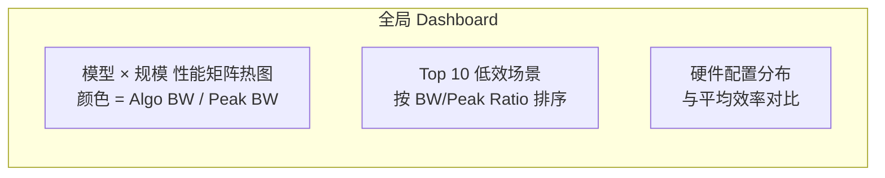
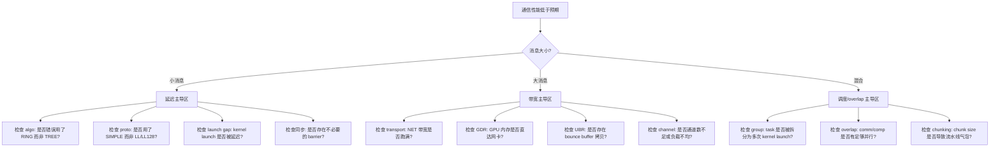
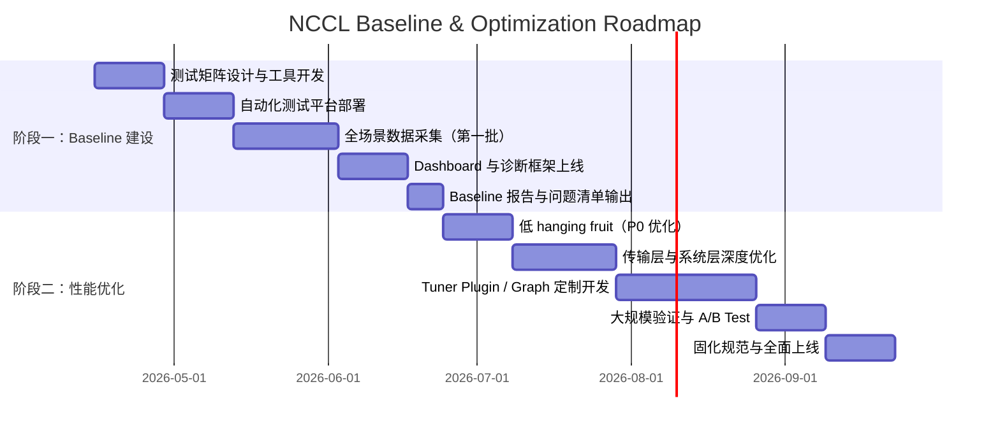
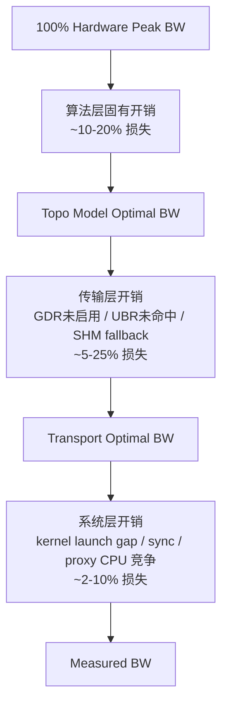

# NCCL 通信性能基线建设与优化规划

> 本文档基于 NCCL 2.29.7 源代码机制，针对大规模分布式训练场景，系统规划如何建立可量化的 NCCL 通信基线（Baseline），并在此基础上制定有效带宽提升与性能优化的实施路径。

---

## 1. 背景与目标

### 1.1 业务背景

公司内部存在**多业务 × 多模型 × 多规模 × 多硬件**的分布式训练场景：
- **模型类型**：Dense LLM、MoE、VLM、推荐模型（DLRM 类）等
- **并行策略**：DP（数据并行）、TP（张量并行）、PP（流水线并行）、EP（专家并行）、SP（序列并行）及其组合
- **训练规模**：从单节点 8 卡到千卡/万卡集群
- **硬件配置**：
  - GPU：A100、H100/H800、B200 等
  - 网络：InfiniBand NDR/XDR、RoCEv2、不同 NIC/GPU 配比（1:1、1:4、1:8）
  - 拓扑：同构 NVSwitch 全连接、异构 PCIe/NVLink 混合、多机架/多 POD 部署

### 1.2 核心问题

在多维度变化的场景下，通信性能现状是**黑盒化**的：
- 不同业务的通信瓶颈在哪里？（带宽受限 / 延迟受限 / 同步开销 / 内存拷贝）
- NCCL 在不同硬件上的实际表现是否达到理论峰值？差距多少？为什么？
- 哪些环境配置、拓扑结构、算法选择是次优的？
- 优化的优先级和投入产出比如何排序？

### 1.3 两阶段目标

| 阶段 | 目标 | 产出 |
|------|------|------|
| **阶段一：Baseline 建设** | 建立覆盖全场景的量化通信基线，形成可复现、可对比、可追踪的性能数据集 | 测试矩阵、自动化平台、性能 Dashboard、问题定位手册 |
| **阶段二：性能提升** | 基于 Baseline 识别瓶颈，系统性提升有效带宽，降低通信在训练中的占比（Communication/Computation Ratio） | 优化方案库、环境配置规范、定制化补丁/插件、性能回归测试体系 |

---

## 2. 阶段一：NCCL 通信基线建设

### 2.1 Baseline 设计原则

基于 NCCL 内部机制，Baseline 必须能够回答以下问题：
1. **算法层**：NCCL 为当前 collective 选择了什么 `(algo, proto, nChannels, nWarps)`？是否是理论最优？
2. **拓扑层**：系统拓扑是否被正确探测？Ring/Tree/NVLS 图结构是否符合硬件设计预期？
3. **传输层**：实际使用了哪些 transport？P2P/SHM/NET 的选择是否合理？连接建立是否成功？
4. **Proxy 层**：网络侧 Proxy 线程是否存在瓶颈？GDRDMA 是否启用？UBR 是否生效？
5. **端到端层**：实际有效带宽（Effective BW）占理论峰值（Peak BW）的比例是多少？延迟模型是否匹配 `ncclTopoTuneModel()` 的预测？

### 2.2 测试矩阵设计

测试矩阵需覆盖**三个正交维度**：模型/并行策略、规模、硬件。

#### 维度 A：业务/模型抽象（代表不同通信模式）

| 业务类型 | 代表模型 | 典型通信特征 | 关键 Collective |
|----------|----------|--------------|-----------------|
| Dense LLM Pretrain | GPT/LLaMA | 大消息 AllReduce（TP/DP/EP gradient sync） | AllReduce、AllGather、ReduceScatter |
| MoE | Mixtral/DeepSeek-V2 | 小消息高频 AllToAll（EP 专家路由） | AllToAll、P2P SendRecv |
| VLM | LLaVA/Qwen-VL | 混合大小消息（图像 encoder + 文本 decoder） | AllReduce、Broadcast、AllGather |
| 推荐/搜广推 | DLRM | 大稀疏表 AllGather + 小 dense 梯度 AllReduce | AllGather、AllReduce、ReduceScatter |

#### 维度 B：规模梯度（代表不同延迟/带宽权衡点）

| 规模等级 | 节点数 × GPU 数 | 测试重点 |
|----------|-----------------|----------|
| 单节点 | 1 × 8 | Intra-node P2P/SHM/NVLS 效率、PCIe/NVLink 利用率 |
| 小规模多机 | 2~4 × 8 | Inter-node 网络基础性能、RDMA/GDR 生效情况 |
| 中规模 | 8~32 × 8 | Tree vs Ring 切换点、网络拥塞初现、Proxy 线程扩展性 |
| 大规模 | 64~256 × 8 | AllToAll 性能、多跳网络拓扑、NCCL 图搜索质量、延迟主导区 |
| 超大规模 | 512+ × 8 | 同步开销、初始化时间、网络长尾延迟、稳定性 |

#### 维度 C：硬件配置（代表不同硬件瓶颈）

| 硬件变量 | 配置组合示例 | 关注指标 |
|----------|--------------|----------|
| GPU 代际 | A100 vs H100/H800 vs B200 | NVLink 带宽、NVLS 支持、CGA 支持 |
| NIC 类型 | IB NDR 400G vs RoCEv2 200G | 网络峰值带宽、GDR 支持、延迟基线 |
| NIC/GPU 比 | 1:1 vs 1:4 vs 1:8 | NIC 利用率、PXN 收益、CollNet 可用性 |
| 拓扑结构 | NVSwitch 全连接 vs DGX-H100 vs 自定义 PCIe | P2P 路径、Tree 深度、SHM 是否 fallback |

### 2.3 核心指标定义

基于 NCCL 源码中的性能模型和内部计数，定义以下指标体系：

#### L1：端到端性能指标（业务层）

| 指标名 | 定义 | 计算方式 |
|--------|------|----------|
| **Algo BW** | 算法带宽（NCCL 官方定义） | `bytes / (time * 10^9)` GB/s，其中 `bytes` 按 NCCL 各 collective 的 busBytes 公式计算 |
| **Effective BW** | 有效带宽（实际业务视角） | `实际搬运数据量 / time`，反映业务感知吞吐量 |
| **Comm/Comp Ratio** | 通信占训练时间比例 | `通信耗时 / (通信耗时 + 计算耗时)` |
| **Scaling Efficiency** | 扩展效率 | `单卡吞吐 × N / 实际 N 卡吞吐` |

#### L2：NCCL 内部效率指标（系统层）

| 指标名 | 定义 | 数据来源 |
|--------|------|----------|
| **BW/Peak Ratio** | `Algo BW / 理论峰值带宽` | NCCL tests 输出 vs 硬件 spec（NVLink 或 IB 峰值） |
| **Algo-Proto 命中率** | NCCL 是否选择了预期的 `(algo, proto)` | `NCCL_DEBUG=INFO` 日志解析 |
| **Channel Utilization** | 实际使用通道数 / 可用最大通道数 | `nChannels` from debug log vs `MAXCHANNELS` (64) |
| **GDR Hit Rate** | 网络传输中启用 GDRDMA 的比例 | Transport NET 的 `useGdr` flag 统计 |
| **UBR Hit Rate** | 用户缓冲区注册（User Buffer Registration）生效比例 | `regBufType` 统计（需 patch 或 profiler） |
| **Proxy Idle Ratio** | Proxy 线程空闲时间占比 | Proxy progress loop 采样（需 patch） |

#### L3：微观诊断指标（调优层）

| 指标名 | 定义 | 诊断价值 |
|--------|------|----------|
| **Init Time** | `ncclCommInitRank` 耗时 | 反映拓扑探测、图搜索、连接建立开销 |
| **Transport Mix** | P2P/SHM/NET/COLLNET/NVLS 各自占比 | 识别不合理的 transport fallback（如本该 P2P 却走了 SHM） |
| **Tree Depth / Ring Hops** | 实际图结构的跳数 | 验证 `ncclTopoCompute()` 搜索质量 |
| **Chunk Size** | 实际使用的 `chunkSize` | 过小会导致 overhead 高，过大会降低流水线并行度 |
| **Latency Model Error** | 实测延迟 - `ncclTopoTuneModel()` 预测延迟 | 发现模型与现实偏差，定位异常硬件或配置 |

### 2.4 数据收集方案

数据收集需要**三层工具链**：标准化测试、日志解析、运行时剖析。

#### 2.4.1 标准化测试工具（Workload 层）

**工具 A：nccl-tests（官方性能基准）**
- 用途：获取纯净的网络/通信带宽基线
- 必测项：
  - `all_reduce_perf`、`all_gather_perf`、`reduce_scatter_perf`、`alltoall_perf`、`sendrecv_perf`
  - 覆盖 `8B ~ 1GB+` 的消息大小，对数步进（`-b 8 -e 1G -f 2`）
  - 每个 size 至少运行 20 次取平均，消除 warm-up 影响
- 扩展：使用 `nccl-tests` 的 `MULTI_IB` / `MPI` 模式支持多节点

**工具 B：业务通信 Micro-benchmark**
- 用途：提取业务实际的通信模式
- 方法：
  - 在训练框架（PyTorch/ Megatron-LM / DeepSpeed）中插入 `torch.cuda.Event` 计时
  - 记录每次 `torch.distributed.all_reduce/all_gather/all_to_all` 的 `size`、`elapsed_time`、`backend`（NCCL）
  - 汇总得到业务的**消息大小分布直方图**（Size Histogram）和**调用频次**

**工具 C：端到端训练 Profiling**
- 用途：定位通信在端到端训练中的真实占比
- 方法：
  - Nsight Systems：抓取 CUDA API 轨迹，观察 `ncclAllReduce` 等 kernel 的 launch gap 和 execution overlap
  - PyTorch Profiler：记录 `nccl:kernel` 和 `nccl:launch` 事件

#### 2.4.2 NCCL 内部日志与状态收集（系统层）

基于对 NCCL 源码的理解，以下环境变量和文件是 Baseline 收集的关键：

| 收集项 | 环境变量/文件 | 内容说明 | 采集方式 |
|--------|---------------|----------|----------|
| **Algo/Proto 选择记录** | `NCCL_DEBUG=INFO` `NCCL_DEBUG_SUBSYS=COLL` | 每条 collective 的 `(func, algo, proto, nChannels, nWarps, chunkSize)` | 日志解析，正则提取 |
| **拓扑图结构** | `NCCL_GRAPH_DUMP_FILE=/path/to/graph.xml` | 导出 `ncclTopoCompute()` 生成的 ring/tree 图 | XML 解析，可视化 |
| **拓扑探测结果** | `NCCL_TOPO_DUMP_FILE=/path/to/topo.xml` | 导出生成的系统拓扑 XML | 与硬件设计图对比验证 |
| **初始化耗时分解** | `NCCL_DEBUG=INFO` `NCCL_DEBUG_SUBSYS=INIT` | `initTransportsRank` 各步骤时间戳 | 日志解析 |
| **Transport 选择结果** | `NCCL_DEBUG=INFO` `NCCL_DEBUG_SUBSYS=TRANS` | `selectTransport` 结果：P2P/SHM/NET 等 | 统计 fallback 情况 |
| **NCCL 参数配置** | `NCCL_DEBUG=INFO` 开头 | 所有环境变量和编译时参数的生效值 | 解析确认 |
| **通信器状态** | 运行时读取 `comm->initState`、`comm->nChannels` 等 | 验证初始化是否成功，通道数是否正常 | 需编写诊断 so 或 core dump 分析 |

> **源码级技巧**：NCCL 的 `ncclTopoTuneModel()` 在初始化时会打印 `latencies[][][]` 和 `bandwidths[][][]` 的部分值（DEBUG=1 或 TRACE=1 时更详细）。这些值可以直接与 `nccl-tests` 实测值对比，验证性能模型是否准确。

#### 2.4.3 运行时深度剖析（内核/Proxy 层）

**方法 A：NCCL Profiler Plugin（`NCCL_PROFAPI`）**
- NCCL 2.19+ 支持 profiler plugin API
- 可以捕获每个 collective task 的 `start_time`、`end_time`、`bytes`、`channel_mask`
- 建议基于 `plugins/profiler/example/` 开发公司内部 profiler，输出结构化 trace（Chrome Event Format 或 Parquet）

**方法 B：Proxy 线程性能采样（需源码 Patch）**
- 在 `src/proxy.cc` 的 `progressOps()` 循环中增加 `__rdtsc()` 采样点，统计：
  - 每次循环迭代耗时
  - 每个 `ncclProxyArgs` 的 `progress()` 函数耗时（按 transport 分类）
  - active list 的平均长度
- 输出到共享内存或文件，避免影响主循环性能

**方法 C：内存注册追踪（需源码 Patch）**
- 在 `src/register/coll_reg.cc` 的注册路径增加计数器：
  - 每次 `ncclCommRegister` 的命中/失败
  - 每次 collective enqueue 时 `regBufType` 的分布（NET_REG / IPC_REG / NVLS_REG）
- 统计 UBR 的实际生效比例

### 2.5 数据展示与 Baseline Dashboard

建立**三层可视化体系**：

#### 2.5.1 全局概览层（Executive View）



- **热图**：X 轴为消息大小，Y 轴为 GPU 规模，颜色为有效带宽占峰值比例
- **趋势图**：同一模型随规模扩大，通信占比和扩展效率的变化曲线
- **对比图**：不同硬件配置（如 A100 vs H100）在相同 workload 下的效率差异

#### 2.5.2 问题定位层（Engineer View）

- **NCCL Algo-Proto 选择矩阵**：对每个 (模型, 规模, 消息大小) 组合，展示实际选择的 algo/proto 与理论最优的对比
- **拓扑图可视化**：将 `NCCL_GRAPH_DUMP_FILE` 解析为图，标注每段链路的带宽和 transport 类型
- **延迟分解瀑布图**：将 collective 耗时分解为 `Kernel Launch Gap` + `GPU Kernel Execution` + `Proxy Network I/O` + `Sync Overhead`

#### 2.5.3 微观诊断层（Expert View）

- **Proxy 线程火焰图**：基于采样数据生成 proxy progress 的 on-CPU 火焰图
- **Channel 利用率直方图**：展示每个 channel 的实际负载分布，识别 load imbalance
- **注册缓存命中率**：按业务展示 UBR 和 GDR 的命中/失败次数

### 2.6 Baseline 解读框架（基于 NCCL 源码）

收集到数据后，使用以下 **Top-Down 诊断框架** 解读：

```
Step 1: 端到层 — Algo BW 是否接近理论峰值？
    ├── 是 → 通信层不是瓶颈，优化动力低
    └── 否 → 进入 Step 2

Step 2: 算法层 — NCCL 选择的 (algo, proto) 是否正确？
    ├── 对比 ncclTopoTuneModel() 的预测
    ├── 检查是否为 env var (NCCL_ALGO/NCCL_PROTO) 强制覆盖
    └── 若选择次优 → 调整 tuner 或环境变量

Step 3: 拓扑层 — 图结构是否合理？
    ├── 检查 NCCL_GRAPH_DUMP_FILE
    ├── 验证 ring/tree 跳数与硬件设计是否一致
    ├── 检查是否存在 unexpected 的 PATH_NET / PATH_SHM fallback
    └── 若图质量差 → 检查 topology XML 或手动提供 NCCL_GRAPH_FILE

Step 4: 传输层 — Transport 选择是否符合预期？
    ├── 同节点内：是否走了 P2P/SHM？是否错误 fallback 到 NET？
    ├── 跨节点：GDR 是否启用？NIC 选择是否正确？PXN 是否生效？
    └── 若 transport 异常 → 检查 NVML P2P 状态、IB 驱动、GDR 配置

Step 5: Proxy 层 — 网络侧是否存在瓶颈？
    ├── Proxy 线程 CPU 占用是否饱和？
    ├── IB 网卡带宽是否跑满？是否存在拥塞/重传？
    ├── UBR 是否生效？bounce buffer 拷贝占比多少？
    └── 若 proxy 瓶颈 → 优化 UBR、调整 proxy 线程亲和性、升级 NIC 固件
```

---


## 3. 阶段二：通信有效带宽提升与性能优化

在 Baseline 数据的基础上，性能优化必须遵循**“测量 → 假设 → 实验 → 验证 → 规模化”**的闭环。本阶段结合 NCCL 源码机制，将优化空间分为四个层次：**算法层、传输层、拓扑层、系统层**。

### 3.1 性能分析方法论

#### 3.1.1 瓶颈识别矩阵

基于 NCCL 内部的 latency/bandwidth 模型，将实际测量值与理论值对比，定位瓶颈域：

| 现象 | 可能瓶颈域 | 诊断方法 |
|------|-----------|----------|
| 小消息（< 1MB）延迟远高于模型预测 | 算法层（algo 选择错误）/ 系统层（kernel launch gap 大） | 对比 `ncclTopoTuneModel()` 预测延迟 vs 实测；检查 Nsight launch gap |
| 大消息（> 100MB）带宽远低于峰值 | 传输层（NET 带宽未跑满）/ 拓扑层（图结构次优） | 检查 IB 网卡利用率；检查 graph 的 inter-node 路径 |
| 中规模（8~32 节点）效率急剧下降 | 拓扑层（Tree/RING 切换点不合适）/ Proxy 层（线程扩展性） | 分析 algo 随 size 和 scale 的切换曲线；采样 proxy CPU 使用率 |
| AllToAll 性能极差 | 传输层（P2P 连接数爆炸）/ 系统层（网络 incast） | 检查 P2P channel 分配；检查 switch 端口拥塞 |
| 同一配置不同 run 波动大 | 系统层（网络拥塞/QoS）/ Proxy 层（CPU 调度抖动） | 统计方差；检查 proxy 线程绑核情况 |

#### 3.1.2 根因分析树（RCA Tree）



### 3.2 优化方向与 NCCL 源码映射

#### 3.2.1 算法层优化

算法层优化的核心是确保 NCCL 为每个 collective 选择的 `(algo, proto, nChannels, nWarps)` 尽可能接近理论最优。

**优化点 1：Algo-Proto 强制与微调**
- **机制**：NCCL 的 `ncclGetAlgoInfo()` 会构建 `collCostTable`，但环境变量 `NCCL_ALGO` 和 `NCCL_PROTO` 可以 override。
- **方法**：
  - 对特定业务的消息大小分布，通过 grid search 在 `nccl-tests` 上测试所有 `(algo, proto)` 组合。
  - 将最优组合写入业务启动脚本（如 `NCCL_ALGO=RING NCCL_PROTO=SIMPLE` 用于大消息 AllReduce）。
  - 对 MoE 的 AllToAll，小消息场景可能强制 `NCCL_ALGO=TREE` 或 `NCCL_PROTO=LL` 更优。
- **注意**：强制 override 可能导致在其他 size 上性能下降，建议按 size 分段配置（需 wrapper 脚本动态设置）。

**优化点 2：自定义 Tuner Plugin**
- **机制**：NCCL 支持 `ncclTuner_v2_t` 插件，可以在 `ncclGetAlgoInfo()` 的 `updateCollCostTable()` 之后、最终选择之前干预决策。
- **方法**：
  - 开发业务感知的 Tuner Plugin：输入 `nBytes`、`nRanks`、`coll`、`type`、`op`，结合业务历史数据和实时网络负载，覆盖默认的 `topoGetAlgoInfo()` 选择。
  -  particularly 对 MoE 的 AllToAll 和 EP 通信模式，默认 tuner 可能不是最优。
- **源码位置**：`src/graph/tuning.cc:ncclTopoGetAlgoTime()` 和 `src/enqueue.cc:ncclGetAlgoInfo()` 是插入点。

**优化点 3：CTA Policy 优化**
- **机制**：`src/enqueue.cc` 中在 `ncclGetAlgoInfo()` 之后有 CTA policy 的后处理：
  - `NCCL_CTA_POLICY_EFFICIENCY`：强制 NVLS + SIMPLE
  - `NCCL_CTA_POLICY_ZERO`：强制走 CE (Copy-Engine) 路径
- **方法**：
  - 对超大消息的 AllGather/ReduceScatter，在 H100/H800 上尝试 `NCCL_CTA_POLICY_EFFICIENCY=1` 强制 NVLS。
  - 对带宽不敏感但延迟敏感的场景，避免 CTA policy 干扰默认 tuner。

#### 3.2.2 传输层优化

传输层优化的目标是**消除 fallback、最大化零拷贝、减少 proxy 开销**。

**优化点 4：P2P/SHM/NET 选择调优**
- **机制**：`src/transport.cc:selectTransport()` 按固定优先级 P2P → SHM → NET → COLLNET 选择。
- **问题场景**：
  - WSL 或某些驱动版本下，`p2pCanConnect()` 因 IPC handle 测试失败而 fallback 到 SHM，导致 intra-node 带宽腰斩。
  - `NCCL_P2P_DISABLE=1` 被误设，导致所有 intra-node 通信走 NET，消耗宝贵的 IB 带宽。
- **方法**：
  - 通过 Baseline 日志统计 transport mix，识别异常 fallback。
  - 对已知 P2P 支持良好的集群，确保 `NCCL_P2P_DISABLE` 未设置。
  - 对容器化环境，确保 `/dev/shm` 挂载一致，避免 SHM `shmDev` 不匹配导致的 fallback。

**优化点 5：GDRDMA 与 PXN 优化**
- **机制**：`src/transport/net.cc` 中 `ncclTopoCheckGdr()` 决定是否将 GPU 内存直接交给网卡；`ncclTopoCheckP2p()` + `PATH_PXN` 支持 GPU 通过 NVLink 访问另一颗 GPU 的 NIC。
- **方法**：
  - 检查 `NCCL_DEBUG_SUBSYS=TRANS` 日志中 `GDR` 标志。
  - 若 GDR 未启用，检查 IB 驱动是否支持 `ibv_reg_mr` on GPU memory，或是否缺少 `nv_peer_mem` / `nvidia_p2p` 模块。
  - 对 1:4 或 1:8 NIC/GPU 比的节点，启用并验证 PXN 效果：通过 `NCCL_TOPO_DUMP_FILE` 检查是否存在 `PATH_PXN` 路径。

**优化点 6：UBR（User Buffer Registration）全面启用**
- **机制**：`src/register/coll_reg.cc` 在 collective enqueue 时尝试注册用户缓冲区，`src/transport/net.cc` 的 proxy 在 `sub->reg==true` 时直接使用用户 buffer 做 `isend`/`irecv`。
- **收益**：消除 proxy bounce buffer 的 `cudaMemcpyAsync`，对 > 100MB 大消息可提升 5~15% 带宽。
- **方法**：
  - 确保训练框架调用 `ncclCommRegister()` 注册关键 tensor 的内存（PyTorch 2.1+ 已部分支持）。
  - 对未使用 `ncclCommRegister` 的业务，推动框架层改造。
  - 监控 `UBR Hit Rate`，对命中率低的场景排查 `regBufType` 失败原因（如 buffer 未对齐、size 过小、allocator 不支持 cuMem）。

**优化点 7：Proxy 线程扩展与绑核**
- **机制**：`src/proxy.cc` 中每个 `ncclComm` 有一个独立的 Proxy Progress 线程，处理所有 network/SHM/P2P-memcpy 的 I/O。
- **瓶颈场景**：
  - 单节点多通信器（如 TP + DP + EP 各一个 comm）时，多个 proxy 线程竞争 CPU。
  - Proxy 线程未绑核，被调度器频繁迁移，导致 IB polling 不连续。
- **方法**：
  - 对多 comm 场景，评估 proxy 线程总数是否超过可用 CPU 核心。
  - 使用 `taskset` 或 `numactl` 将 proxy 线程绑定到远离计算核心的专用 CPU 核心（或超线程对）。
  - 在源码层面，可在 `ncclProxyProgressCreate()` 中增加 `pthread_setaffinity_np()` 的 hook。

#### 3.2.3 拓扑层优化

拓扑层优化的目标是**让 NCCL 看到的图与实际硬件最优图一致**。

**优化点 8：拓扑 XML 校验与修正**
- **机制**：`src/graph/topo.cc` 通过 NVML、PCIe sysfs、NIC plugin 自动探测拓扑，但容器环境、虚拟化、定制主板可能导致探测错误。
- **方法**：
  - 将 `NCCL_TOPO_DUMP_FILE` 与硬件设计图（BOM / 拓扑图）逐条对比。
  - 常见错误：
    - NVLink 连接缺失：检查 NVML 驱动版本
    - PCIe switch 层级错误：BCM 交换机未被 `ncclTopoFlattenBcmSwitches()` 正确处理
    - NIC 被挂到错误的 CPU socket：导致 `PATH_PHB` 而非 `PATH_PIX`
  - 修正手段：
    - 提供 `NCCL_TOPO_FILE` 手动指定正确的拓扑 XML
    - 升级 NCCL 版本以获取更好的 BCM switch 支持

**优化点 9：手动图注入（Graph File）**
- **机制**：`src/graph/search.cc` 的自动搜索可能因 `NCCL_SEARCH_TIMEOUT` 或复杂拓扑而输出次优图。`NCCL_GRAPH_FILE` 允许用户直接注入 `ring` / `tree` 的 peer 顺序。
- **方法**：
  - 对标准 DGX/HGX 节点，使用 NVIDIA 推荐的 `NCCL_GRAPH_FILE` 模板。
  - 对自定义拓扑，基于 Baseline 中最优图（`NCCL_GRAPH_DUMP_FILE` 导出），人工微调后固化注入。
  - 对大规模扩展（> 64 节点），手动设计 inter-node ring/tree 以减少多跳交换机拥塞。

**优化点 10：NVLS 与 CollNet 启用条件优化**
- **机制**：`ncclNvlsSupported()` 和 `collNetSupportMatrix` 有严格的 `(func, op, type)` 白名单；`NCCL_NVLS_ENABLE` 和 `NCCL_COLLNET_ENABLE` 控制开关。
- **方法**：
  - 对 H100/H800 集群，检查 `nvlsSupport` 是否为 1。若因 datatype（如 fp8）或 redop 不支持而未启用，评估是否可以调整训练框架的数据类型或规约操作。
  - 对具备 SHARP 或类似 CollNet 硬件的 IB 网络，确保 `NCCL_COLLNET_ENABLE=1`。
  - 通过 Baseline 对比 NVLS 启用前后的带宽和延迟变化。

#### 3.2.4 系统层优化

系统层优化关注**框架与运行时环境**。

**优化点 11：Group 语义与 Kernel Launch 优化**
- **机制**：`src/group.cc` 的 `ncclGroupStart/End` 会将范围内的所有 collective 聚合为少量 kernel launch。若框架未正确使用 group，会导致大量独立 launch，增加 CPU overhead 和 GPU idle gap。
- **方法**：
  - 审查框架代码（PyTorch distributed、Megatron-LM、DeepSpeed），确保在可能的情况下将多个 NCCL 调用包裹在 `group` 中。
  - 特别关注 TP + EP 场景：张量并行和专家并行的通信是否被正确 batch。

**优化点 12：CUDA Stream 与 Overlap 优化**
- **机制**：NCCL 的所有操作都是异步 stream-based。通信与计算的重叠程度取决于框架的 stream 调度。
- **方法**：
  - 使用 Nsight Systems 分析 `ncclKernel` 与 `cudaKernel` 的时间线重叠率。
  - 若重叠率低，调整框架的 pipeline bubble 或 schedule 策略，将通信隐藏到计算背后。
  - 对 H100/H800，利用 `cudaLaunchMemSyncDomainRemote`（NCCL 在 sm90+ 已自动使用）减少跨内存域同步开销。

**优化点 13：网络 QoS 与拥塞控制**
- **机制**：IB 网络的 PFC/ECN、QoS 等级会影响 NCCL 大消息的稳定性。
- **方法**：
  - 与网络团队协作，为训练流量设置独立 SL（Service Level）和 DSCP 标记。
  - 监控 IB 端口的 `XmitWait` / `RcvErrors` / `SymbolErrors`，识别物理层问题。
  - 对超大规模 AllToAll，评估是否启用 adaptive routing 或 congestion control。

### 3.3 优化措施的优先级与投入产出评估

| 优先级 | 优化点 | 预期收益 | 实施难度 | 依赖条件 |
|--------|--------|----------|----------|----------|
| P0 | UBR 全面启用 | 大消息 +5~15% | 中 | 框架改造 + NCCL 版本支持 |
| P0 | GDRDMA / PXN 验证与修复 | 跨节点带宽 +10~30% | 低 | 驱动/模块检查 |
| P0 | Algo-Proto 按业务微调 | 中小消息 +10~20% | 低 | `nccl-tests` grid search |
| P1 | 自定义 Tuner Plugin | 全范围 +5~15% | 高 | 需开发 plugin + 长期数据积累 |
| P1 | Proxy 线程绑核与扩展 | 高并发场景 +5~10% | 低 | 运维配合 |
| P1 | 拓扑 XML 校验与 Graph File | 复杂拓扑 +10~20% | 中 | 硬件团队配合 |
| P2 | NVLS / CollNet 条件优化 | H100 集群 +10~25% | 中 | 硬件支持 + 框架适配 |
| P2 | Group 语义优化 | 多 collective 场景 +5~15% | 中 | 框架代码改造 |
| P2 | 网络 QoS 调优 | 大规模稳定性提升 | 中 | 网络团队协作 |
| P3 | CUDA Stream Overlap 优化 | Comm/Comp Ratio 下降 | 高 | 框架算法重构 |

### 3.4 验证与回归测试体系

优化措施上线前必须经过严格的验证，避免“优化一个场景、恶化另一个场景”。

#### 3.4.1 微基准回归（Micro-benchmark Regression）
- 对每次环境变更或 patch，运行标准化 `nccl-tests` 矩阵（覆盖 8B~1GB，单节点/多节点）。
- 与 Baseline 数据库对比，若任一测试点下降 > 3%，则触发告警并 block 上线。

#### 3.4.2 业务端到端回归（E2E Regression）
- 选择 2~3 个代表性业务（Dense LLM + MoE），在优化前后各跑一次完整训练 step。
- 对比指标：端到端 throughput、Communication/Computation Ratio、显存占用。

#### 3.4.3 多维度 A/B Test
- 同一集群上同时运行 A（优化前配置）和 B（优化后配置）两组任务（各占 50% GPU）。
- 收集两组 NCCL profiler trace，用统计方法（t-test）验证差异显著性。

---

## 4. 项目实施路线图

### 4.1 总体时间线



### 4.2 里程碑与交付物

| 里程碑 | 时间 | 交付物 | 验收标准 |
|--------|------|--------|----------|
| M1 | T+2W | 测试矩阵 v1.0、自动化脚本、数据 schema | 覆盖所有硬件配置 × 核心 collective × 消息大小梯度 |
| M2 | T+5W | Baseline 数据集 v1.0、Dashboard 上线 | 可查看任意 (业务, 规模, 硬件) 组合的 Algo BW、BW/Peak Ratio、Algo-Proto 选择 |
| M3 | T+7W | 问题清单与优化方案评审 | 识别出 Top 10 低效场景，每个场景有明确的根因假设和优化路径 |
| M4 | T+10W | P0 优化全部落地 | `nccl-tests` 大消息带宽平均提升 ≥ 10%，中小消息延迟平均降低 ≥ 5% |
| M5 | T+17W | Tuner Plugin / Graph File 试点完成 | 在 1~2 个重点业务上端到端 throughput 提升 ≥ 5% |
| M6 | T+21W | 全面上线与规范固化 | 所有训练业务默认使用优化后的配置，建立持续的性能回归测试 |

### 4.3 团队分工建议

| 角色 | 职责 | 所需技能 |
|------|------|----------|
| **NCCL 性能工程师** | 分析 NCCL 日志/源码、开发 Tuner Plugin、Patch NCCL | CUDA/C++、NCCL 内部机制、IB Verbs |
| **分布式训练框架工程师** | 改造框架以支持 UBR、Group 语义优化、Stream 调度 | PyTorch/DeepSpeed/Megatron、CUDA |
| **基础设施/运维工程师** | 部署测试平台、管理环境变量/镜像、Proxy 绑核、网络配置 | Linux 系统、容器、IB 网络 |
| **算法/业务工程师** | 提供业务通信特征、定义优化目标、验证端到端效果 | 大模型训练、并行策略设计 |
| **数据分析师** | 维护 Baseline 数据库、开发 Dashboard、统计 A/B Test | Python、SQL、可视化 |

---

## 5. 风险识别与应对策略

| 风险 | 影响 | 应对策略 |
|------|------|----------|
| **NCCL 版本差异** | 不同 CUDA/NCCL 版本的 topo/tuner 行为不同，Baseline 难以横向对比 | 将 NCCL/CUDA 版本作为 Baseline 的一个固定维度，每次升级必须重新跑全量基线 |
| **硬件批次差异** | 同型号 GPU/NIC 因固件/主板批次不同，P2P 或 GDR 支持状态有差异 | 在 Baseline 中记录固件版本，对异常节点单独标记并隔离 |
| **业务 workload 快速变化** | 新模型/新并行策略导致 Baseline 过时 | 建立“新增模型必须补充 Baseline”的流程，每季度 review 一次测试矩阵 |
| **优化收益不可叠加** | 多个优化措施同时应用时，可能互相抵消或引入稳定性问题 | 每次只引入 1~2 个变量，严格 A/B Test；建立 rollback 机制 |
| **NCCL 源码 Patch 维护成本高** | 自定义 patch（如 proxy 采样、注册追踪）在升级 NCCL 时需要重新移植 | 将 patch 尽量做成插件形式（profiler plugin、tuner plugin），减少直接修改源码 |
| **过度优化导致稳定性下降** | 强制 override algo/proto 或 custom graph 可能在 corner case 上崩溃 | 所有 override 必须附带 whitelist（限定 size 范围和 scale 范围），超出范围回退到默认行为 |

---

## 6. 附录：关键 NCCL 环境变量速查表

| 环境变量 | 作用 | 优化场景 |
|----------|------|----------|
| `NCCL_DEBUG=INFO` | 开启详细日志 | Baseline 收集必备 |
| `NCCL_DEBUG_SUBSYS=COLL,INIT,GRAPH,TRANS` | 限定日志子系统 | 减少日志噪音，聚焦分析 |
| `NCCL_ALGO=RING/TREE/NVLS/...` | 强制算法 | 已知更优 algo 时 override |
| `NCCL_PROTO=LL/LL128/SIMPLE` | 强制协议 | 小消息强制 LL，大消息强制 SIMPLE |
| `NCCL_GRAPH_DUMP_FILE` | 导出计算的图结构 | 拓扑层分析 |
| `NCCL_TOPO_DUMP_FILE` | 导出探测的拓扑 XML | 拓扑校验 |
| `NCCL_TOPO_FILE` | 手动指定拓扑 XML | 自动探测错误时修正 |
| `NCCL_GRAPH_FILE` | 手动指定图结构 | 固化最优 ring/tree |
| `NCCL_P2P_DISABLE=1` | 禁用 P2P | 极少使用，用于 debug |
| `NCCL_SHM_DISABLE=1` | 禁用 SHM | debug 或容器环境 SHM 异常时 |
| `NCCL_IB_DISABLE=1` | 禁用 IB | debug 或 fallback 到 socket 时 |
| `NCCL_NET_GDR_LEVEL=SYS/PHB/...` | 控制 GDR 启用阈值 | 调整 GDR 策略 |
| `NCCL_NVLS_ENABLE=1` | 启用 NVLS | H100 集群 |
| `NCCL_COLLNET_ENABLE=1` | 启用 CollNet | 具备 SHARP 等硬件时 |
| `NCCL_CTA_POLICY_EFFICIENCY=1` | 强制 NVLS + SIMPLE | 大消息 AllGather/ReduceScatter |

---

*文档版本：v1.0*
*基于 NCCL 2.29.7 源码机制与大规模分布式训练实践经验整理*

## 7. 核心量化指标的合理性论证与年度汇报框架

> 有效带宽利用率（Effective BW / Peak BW，以下简称 **BW Utilization**）是公司评估 NCCL 通信优化工作的核心量化指标。一个数字本身没有说服力，必须有严谨的多维度论证体系支撑其合理性。本章阐述如何构建这一论证体系，以及如何用一年的工作成果讲好这个数字背后的故事。

### 7.1 为什么 BW Utilization 是北极星指标

在众多指标中，选择 **BW Utilization** 作为核心汇报指标，是因为它具有以下不可替代的特性：

| 特性 | 说明 |
|------|------|
| **物理可解释性** | 分子是实际测量的 Algo BW，分母是硬件的理论峰值带宽（NVLink 或 IB），比值天然代表“硬件潜力被发挥了多少” |
| **跨场景可比性** | 不同模型、不同规模、不同硬件的绝对带宽差异巨大，但利用率可以横向对比 |
| **与业务目标强相关** | 利用率每提升 1%，通常直接对应端到端训练吞吐的近似比例提升（在通信受限场景） |
| **可拆解性** | 可以从 NCCL 源码层面拆解为算法效率、传输效率、系统开销等子项，便于归因 |

然而，单一百分比数字容易产生误导。例如：
- 小消息场景 BW Utilization 天然很低（因为延迟主导，带宽未达峰），但这不代表工作做得差。
- 某些硬件配置（如 1:8 NIC/GPU 比）的理论峰值本身受限，即使利用率很高，绝对性能也可能不如 1:1 配置。

因此，**论证 BW Utilization 的合理性，本质上是论证“在特定约束条件下，这个数字是否接近理论可达最优”**。

### 7.2 合理性论证的六大支柱

为了让 BW Utilization 这个数字经得起质疑，需要从以下六个维度建立论证体系：

#### 支柱一：理论上限维度（Physics Ceiling）

**核心问题**：给定硬件，不考虑任何软件开销，纯物理层面的带宽上限是多少？

**计算方法**：
- **Intra-node**：瓶颈通常是 NVLink 或 PCIe。以 DGX H100 为例，单 GPU 到 NVSwitch 的 NVLink4 双向带宽为 900 GB/s。但由于 NCCL 的 `busBw` 定义（AllReduce 的 busBw = 2 × n × size / time），实际算法带宽的上限约为单向物理带宽的某个比例。
- **Inter-node**：瓶颈是网卡。以 IB NDR 400G 为例，单向物理带宽约为 50 GB/s（400Gbps / 8）。但由于编码开销（64/66b），实际可用约为 48.5 GB/s。若使用多网卡聚合，需按实际生效网卡数计算。
- **端到端路径瓶颈**：若数据需经过 PCIe → NIC，需取 `min(GPU PCIe BW, NIC BW, Switch BW)`。

**论证方式**：
- 对每一种硬件配置，出具一份 **《理论峰值计算书》**，明确列出：
  - GPU 型号及 NVLink 代际/带宽
  - NIC 型号及单口/聚合带宽
  - PCIe 链路宽度/速度及理论带宽
  - 端到端路径的最小瓶颈带宽
- 在汇报中明确说明：**BW Utilization 的分母是这个经过精确计算的瓶颈带宽，而不是某个理想化的厂商标称值**。

#### 支柱二：NCCL 内部模型维度（Software Ceiling）

**核心问题**：即使硬件完美，NCCL 自身的算法和协议开销也会带来不可避免的损失。软件层面的“可达最优”是多少？

**计算方法**：
- NCCL 源码中的 `ncclTopoTuneModel()` 会对每种 `(func, algo, proto)` 计算 `bandwidths[func][algo][proto]`。
- 这个值已经考虑了：
  - Ring 算法的 `nRanks / nsteps` 系数（AllReduce 为 `(n-1)/n`，近似 1，但还有协议开销）
  - LL 协议的 50% 开销、LL128 的 92% 效率
  - Tree 的 bisection bandwidth 限制
  - NVLS 的效率因子（Hopper 0.85，Blackwell 0.74）
  - CollNet 的本地 arity 惩罚
- 因此，**`ncclTopoTuneModel()` 预测出的最大带宽，实际上就是 NCCL 在该硬件上认为的理论最优值**。

**论证方式**：
- 对重点场景，提取 `NCCL_DEBUG=INFO` 中 NCCL 自己打印的 `bw` 值（DEBUG=1 时更详细）。
- 计算 **Model-Predicted Utilization = ncclTopoTuneModel Max BW / Hardware Peak BW**。
- 若实测 BW Utilization 接近 Model-Predicted Utilization，说明 NCCL 的算法层已经被充分发挥；若差距大，说明问题在传输层或系统层。
- **年度汇报中可以展示一个漏斗图**：
  - Hardware Peak BW → Model-Predicted BW（损失 10~20%，归因于 NCCL 算法/协议固有开销）→ Measured BW（再损失 0~30%，归因于传输/系统优化空间）。

#### 支柱三：行业对标维度（External Benchmark）

**核心问题**：同行业、同硬件配置下，业界领先水平是多少？

**数据来源**：
1. **NVIDIA 官方基准**：
   - DGX/HGX 参考架构白皮书中的 `nccl-tests` 数据（通常 AllReduce 大消息可达 90%+ 的 NVLink/IB 峰值利用率）。
   - NVIDIA 开发者博客中公布的优化案例。
2. **MLPerf Training**：
   - 虽然 MLPerf 不直接公布 BW Utilization，但可以通过公开的 throughput 和模型参数反推通信量，估算其通信效率。
3. **云厂商/大厂公开数据**：
   - AWS EFA、Google TPU/GPU、Meta 等在其技术博客中偶尔会披露网络利用率数据。
   - 学术/工业论文（如 OSDI、SC、MLSys）中关于 AllReduce 带宽利用率的实验数据。
4. **供应商支持**：
   - Mellanox/NVIDIA 网络团队通常会提供针对特定 IB 交换机和网卡的 `nccl-tests` 调优后的参考数据。

**论证方式**：
- 建立 **《行业对标表》**，按硬件代际（A100 vs H100）和规模（单节点 vs 64 节点 vs 256 节点）分类，列出：
  - NVIDIA 官方参考值
  - 公开论文/博客中的最佳值
  - 公司内部当前值
  - 公司目标值
- **关键原则**：对标必须是 **“同硬件、同规模、同 collective”** 的。不能拿 A100 单节点的数据去要求 H100 千卡的利用率。

#### 支柱四：历史基线维度（Temporal Benchmark）

**核心问题**：相比去年/上季度，这个数字是否有真实的、持续的、可解释的进步？

**论证方式**：
- 建立 **《历史趋势图》**，展示关键场景在过去一年中的 BW Utilization 变化：
  - **Q1**：建立 Baseline，数字可能只有 50~60%。
  - **Q2**：完成 P0 优化（UBR、GDR、Algo-Proto 微调），提升到 65~75%。
  - **Q3**：完成 Tuner Plugin / Graph File 试点，提升到 75~85%。
  - **Q4**：全面推广，稳定在 80~90%。
- 每个拐点都必须 **事件化**：明确标注在该时间点上线了哪项优化措施，并解释为什么该项措施能在这个场景带来对应的提升幅度。
- 对于持平或下降的区间，也要诚实解释（如：Q3 引入新模型，消息大小分布变化导致平均利用率暂时下降）。

#### 支柱五：归因分解维度（Factorization）

**核心问题**：BW Utilization 的损失具体发生在哪一环？每一环优化了多少？

基于 NCCL 源码，可以将利用率损失分解为以下因子：



**分解方法**：
1. **算法层损失** = `1 - (Model-Predicted BW / Hardware Peak BW)`
   - 这是 NCCL 无法避免的，除非升级 NCCL 版本或更换算法（如从 RING 切到 NVLS）。
2. **传输层损失** = `1 - (Micro-benchmark Best BW / Model-Predicted BW)`
   - 用纯净的 `nccl-tests` 跑当前配置，若仍达不到 Model-Predicted BW，说明问题在传输层（GDR、UBR、P2P/SHM 选择）。
3. **系统层损失** = `1 - (E2E Measured BW / Micro-benchmark Best BW)`
   - 端到端训练中的实际带宽低于 `nccl-tests`，说明框架调度、stream overlap、kernel launch gap 等问题。

**年度汇报中的展示方式**：
- 使用 **瀑布图（Waterfall Chart）** 或 **桑基图（Sankey Diagram）** 展示从 Hardware Peak 到 Measured BW 的每一步损失及优化带来的回收。
- 例如：年初时传输层损失 20%，经过 UBR 和 GDR 修复后回收了 12%；系统层损失 8%，经过 Group 优化后回收了 3%。

#### 支柱六：敏感性分析与置信度维度（Statistical Rigor）

**核心问题**：这个数字在不同条件波动多大？单一平均值是否具有代表性？

**论证方式**：
1. **消息大小敏感性**：
   - BW Utilization 是消息大小的强函数。必须展示 **Size-Sensitivity Curve**：X 轴为消息大小（8B ~ 1GB），Y 轴为利用率。
   - 对于小消息（< 1MB），明确说明其利用率低是物理规律（延迟主导），不应作为工作质量的主要评判依据。
   - 对于大消息（> 100MB），这是评判优化效果的核心区间。
2. **规模敏感性**：
   - 展示不同 GPU 规模（8/64/256/1024）下的利用率曲线，说明规模扩大时的效率衰减是否符合预期（Tree 切换点的优劣）。
3. **统计置信度**：
   - 每个测试点至少运行 20 次，报告 **平均值 ± 95% 置信区间**。
   - 若置信区间宽度 > 5%，说明环境不稳定，需优先解决稳定性问题再谈优化。
4. **分位数视角**：
   - 除了平均值，还要报告 **P10/P50/P90**。
   - 若 P90 很高但 P10 很低，说明存在长尾问题（如某些节点的网络异常），这是下一个优化周期的重点。

### 7.3 年度汇报的叙事框架

在向管理层汇报一年的 NCCL 优化工作时，建议采用 **“从物理极限到现实约束，从行业对标到历史超越”** 的叙事逻辑：

#### 叙事结构（建议 10~15 页 PPT）

**第 1 章：背景与指标定义（2 页）**
- 为什么选 BW Utilization 作为核心指标？
- 如何计算？分母是什么？为什么这个分母是严谨的？

**第 2 章：理论天花板与 NCCL 模型预测（2 页）**
- 展示 Hardware Peak BW 计算书。
- 展示 NCCL `ncclTopoTuneModel()` 对关键场景的预测值。
- 得出结论：**即使软件完美，利用率天花板也只在 85~92%（因协议开销），而不是 100%**。

**第 3 章：年初基线（1~2 页）**
- 展示年初时各关键场景的 BW Utilization 分布热图。
- 突出问题场景：哪些远低于模型预测？哪些远低于行业对标？

**第 4 章：归因分析（2 页）**
- 用瀑布图/桑基图展示损失分解。
- 指出三大瓶颈域：传输层（GDR/UBR）、拓扑层（Graph 质量）、系统层（Group/Stream）。

**第 5 章：优化举措与阶段性成果（3 页）**
- Q1~Q4 每个季度的关键举措及对应数据提升。
- 每项举措都要有 before/after 对比和归因解释。

**第 6 章：行业对标（1 页）**
- 展示同行业/同硬件下的标杆数据。
- 说明公司在哪些场景已达到或超越行业水平，哪些仍有差距及原因。

**第 7 章：当前状态与健康区间（1 页）**
- 定义不同硬件/规模下的 BW Utilization 健康区间：

| 场景 | 优秀 | 良好 | 待优化 |
|------|------|------|--------|
| 单节点 H100 AllReduce (≥100MB) | ≥90% | 80~90% | <80% |
| 64 节点 H100 AllReduce (≥100MB) | ≥85% | 75~85% | <75% |
| 256+ 节点 AllReduce (≥100MB) | ≥80% | 70~80% | <70% |
| MoE AllToAll (1~10MB) | ≥60% | 45~60% | <45% |

- 展示当前各场景落在哪个区间。

**第 8 章：未来规划（1 页）**
- 下一年目标：将整体加权平均 BW Utilization 从 X% 提升到 Y%。
- 重点攻坚方向：超大规模稳定性、新硬件（B200）适配、Tuner Plugin 智能化。

### 7.4 应对常见质疑的话术准备

| 质疑 | 回应逻辑 |
|------|----------|
| “为什么利用率只有 70%，不是应该到 95% 吗？” | 首先澄清分母是硬件物理峰值；然后展示 NCCL 模型预测天花板只有 85~90%（协议和算法固有开销）；最后说明 70% 与模型预测的差距仅为 10~15%，这就是我们的优化空间。 |
| “小消息利用率那么低，是不是你们工作没做好？” | 小消息（<1MB）通信受延迟主导，带宽本身未达峰，这是物理规律。我们看小消息的延迟指标（latency us），而不是带宽利用率。 |
| “A 业务和 B 业务利用率差距很大，怎么解释？” | 展示两业务的消息大小分布图和并行策略差异。A 业务以大消息 AllReduce 为主，B 业务以小消息 AllToAll 为主，两者落在 NCCL 效率曲线的不同位置，不能直接比较利用率。 |
| “这个数字比去年提升了，但训练吞吐为什么没同比例提升？” | 通信时间只是训练时间的一部分。若通信占比本身只有 20%，则通信利用率提升 10% 只能带来端到端 2% 的吞吐提升。需要同时看 Comm/Comp Ratio 的变化。 |
| “ vendor（NVIDIA）说他们能跑到 95%，为什么我们不行？” | 要求对方提供具体的硬件配置、NCCL 版本、测试命令和消息大小。通常 vendor 的 95% 是在理想单节点大消息 AllReduce 上测得，而我们的场景是多节点、混合消息、真实业务框架，约束条件不同。 |

### 7.5 数据准备清单（Checklist）

为确保年度汇报时数据充分、论证有力，建议提前准备以下资料库：

#### A. 理论计算文档
- [ ] 每种 GPU 代际的 NVLink/PCIe 带宽规格表
- [ ] 每种 NIC 型号的物理带宽及编码效率计算
- [ ] 端到端瓶颈路径分析（Critical Path Analysis）

#### B. NCCL 模型数据
- [ ] 重点场景下 `ncclTopoTuneModel()` 输出的 latency/bandwidth 矩阵（从 `NCCL_DEBUG=INFO` 中提取）
- [ ] `nccl-tests` 纯净测试 vs 模型预测值的对比表

#### C. 行业对标数据
- [ ] NVIDIA DGX 参考数据（按代际和规模分类）
- [ ] 公开论文/博客中的同硬件利用率数据（附引用链接）
- [ ] Mellanox/NVIDIA 网络团队提供的调优后参考值

#### D. 历史趋势数据
- [ ] 过去 4 个季度关键场景的 BW Utilization 时间序列
- [ ] 每个季度的优化举措上线记录（与数据拐点对齐）

#### E. 归因分解数据
- [ ] 算法层损失、传输层损失、系统层损失的分解表
- [ ] 各优化举措对损失的回收量（Waterfall 数据源）

#### F. 敏感性分析数据
- [ ] 消息大小-利用率曲线（Size-Sensitivity Curve）
- [ ] 规模-利用率曲线（Scale-Sensitivity Curve）
- [ ] 统计置信区间和 P10/P50/P90 分位数表

---

*本章节为年度绩效汇报和跨部门沟通提供理论基础和数据准备指南。核心原则是：单一的 BW Utilization 数字必须经过“理论上限、软件模型、行业对标、历史趋势、归因分解、统计置信”六大支柱的共同支撑，才能成为有说服力的成果展示。*
