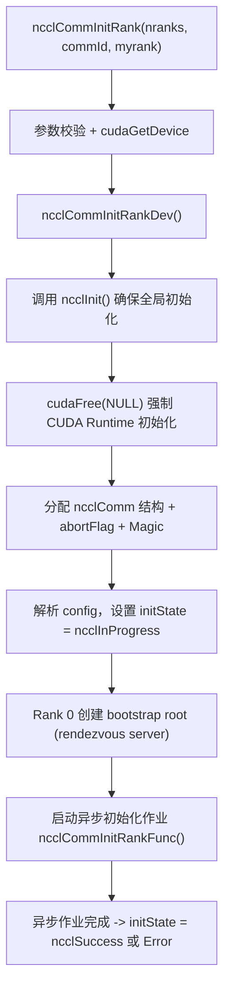
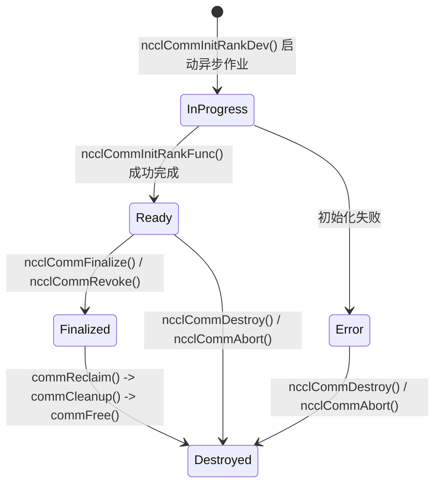
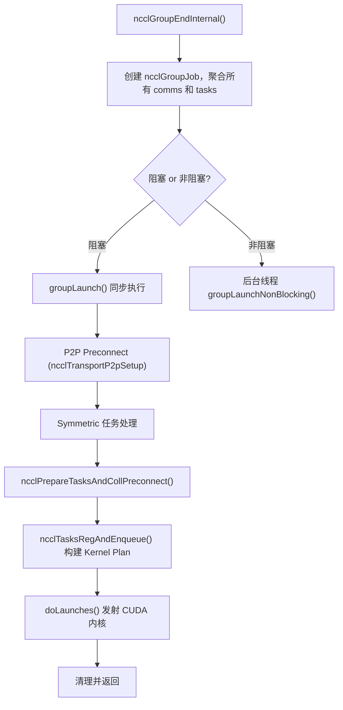
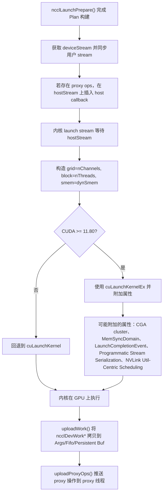
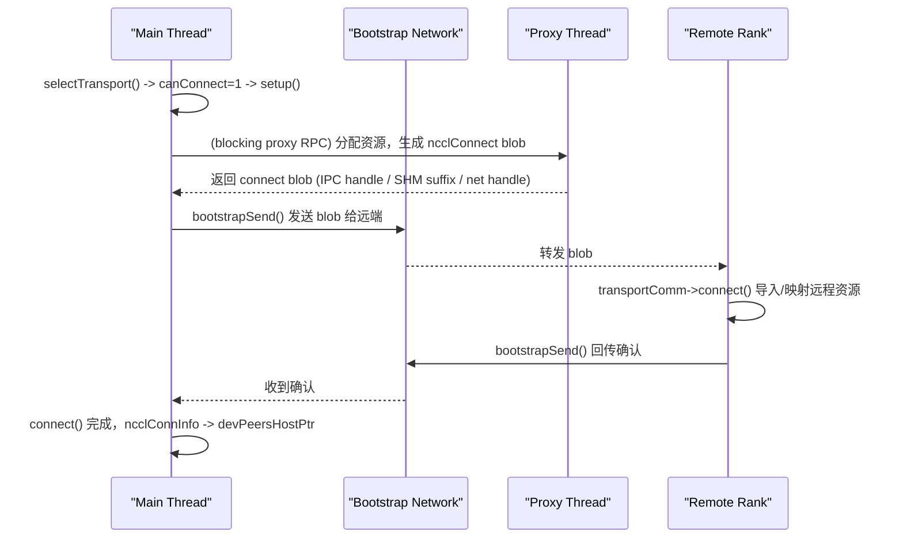
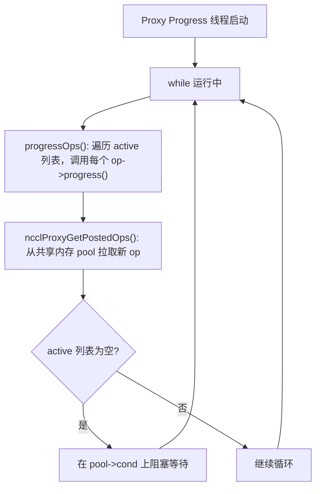
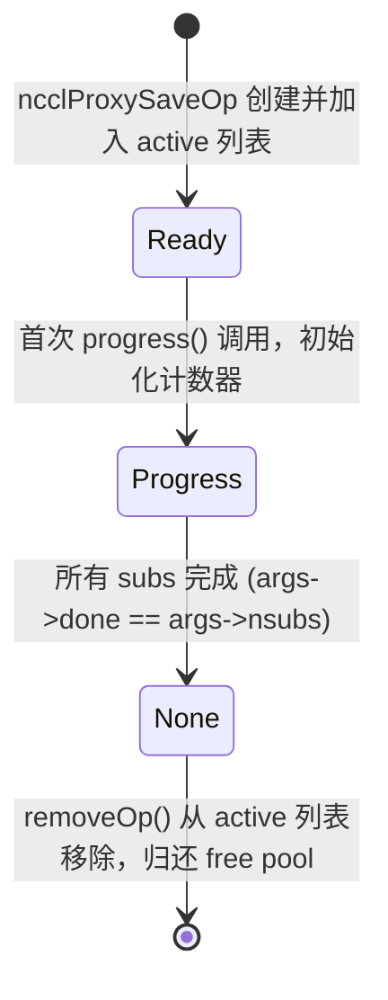
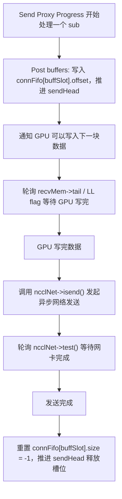
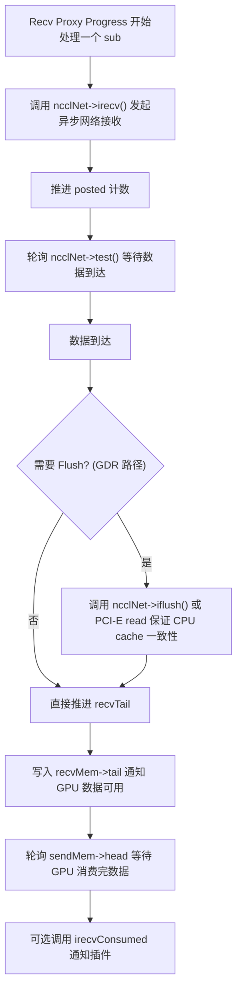

# NCCL 深度技术解析

> 本文档基于对 NCCL 2.29.7 源代码的完整分析，系统梳理其整体流程、核心机制、设计目标、工程权衡，以及集合通信实现细节。

---

## 1. 概述与设计哲学

**NCCL**（NVIDIA Collective Communications Library）是一个独立的、多 GPU 通信原语库，提供经过深度优化的 `AllReduce`、`AllGather`、`ReduceScatter`、`Broadcast`、`Reduce`、`Scatter`、`Gather`、`AlltoAll` 以及点对点 `Send`/`Recv` 等操作。

### 1.1 设计目标

| 目标 | 说明 |
|------|------|
| **极致性能** | 最大化带宽、最小化延迟，充分利用 NVLink、NVSwitch、InfiniBand 等硬件 |
| **拓扑感知** | 自动探测系统拓扑（GPU、NIC、交换机、CPU），自适应选择 ring/tree/NVLS/CollNet 等算法 |
| **异步无阻塞** | 所有公共 API 均为异步，仅将任务入队到 CUDA Stream，由 GPU 内核主导实际数据搬运 |
| **零拷贝优先** | 通过 P2P、IPC、GDR（GPU Direct RDMA）、DMA-BUF 等技术，避免不必要的主机内存拷贝 |
| **可扩展性** | 支持单节点多 GPU、多节点分布式、以及通过插件接口扩展自定义网络传输 |
| **编译时特化** | 针对每一种 `(collective × redop × datatype × algorithm × protocol)` 组合生成专门的 CUDA 内核，以获得最佳指令级优化 |

### 1.2 核心设计权衡

| 权衡维度 | NCCL 的选择 | 代价/限制 |
|----------|-------------|-----------|
| **内核驱动 vs CPU 驱动** | 将尽可能多的逻辑（同步、分块、规约循环）下沉到 CUDA 内核 | 二进制体积巨大（~100MB+），构建依赖 Python 代码生成 |
| **Ring vs Tree vs NVLS** | Ring 适合大消息带宽最优；Tree 适合中小消息延迟更低；NVLS 依赖 Hopper+ 和 NVSwitch，但性能最好 | 需要根据消息大小和硬件条件动态决策 |
| **LL vs LL128 vs SIMPLE** | LL（16B 粒度）延迟最低但带宽有 50% 开销；LL128（128B 粒度）折中；SIMPLE（大 buffer）带宽最高但延迟最大 | 按消息大小阈值切换协议 |
| **Proxy 线程开销** | 每个通信器配备独立的 CPU Proxy 线程处理网络 I/O | 占用一个 CPU 核心，增加上下文切换开销 |
| **Group 语义 vs 立即发射** | 默认在 `ncclGroupStart/End` 范围内聚合任务，合并为一次或少量内核发射 | 错误被延迟到 `ncclGroupEnd` 才暴露 |

---

## 2. 整体架构分层

NCCL 的代码组织清晰地反映了从用户 API 到硬件的纵向分层：

```
┌─────────────────────────────────────────────────────────────┐
│  Public API Layer         src/nccl.h.in, src/collectives.cc │
│  (ncclAllReduce, ncclGroupStart/End, ncclCommInitRank...)   │
├─────────────────────────────────────────────────────────────┤
│  Collective / Enqueue     src/enqueue.cc, src/group.cc      │
│  (任务聚合、算法选择、Kernel Plan 构建、CUDA 内核发射)        │
├─────────────────────────────────────────────────────────────┤
│  Scheduler / Planner      src/include/comm.h (ncclKernelPlanner)
│  (按大小排序、分 bin、(algo,proto) 选择、channel 分配)        │
├─────────────────────────────────────────────────────────────┤
│  Transport Layer          src/transport/, src/proxy.cc        │
│  (P2P, SHM, NET, COLLNET, NVLS, Proxy 线程异步网络卸载)       │
├─────────────────────────────────────────────────────────────┤
│  Topology / Graph         src/graph/                          │
│  (XML 拓扑探测、路径计算、ring/tree 搜索、性能模型调参)        │
├─────────────────────────────────────────────────────────────┤
│  Device Kernel Layer      src/device/ (generate.py 生成)      │
│  (专门化的 CUDA 内核执行实际数据搬运与规约)                    │
├─────────────────────────────────────────────────────────────┤
│  Bootstrap Layer          src/bootstrap.cc                    │
│  (基于 Socket/Net 的带外初始化与信息交换)                      │
└─────────────────────────────────────────────────────────────┘
```

### 2.1 关键数据结构全景

| 结构体 | 所在文件 | 职责 |
|--------|----------|------|
| `ncclComm` | `src/include/comm.h` | 通信器核心结构，包含 channels、拓扑、planner、proxy 状态、调参表 |
| `ncclChannel` | `src/include/comm.h` | 逻辑通道（最多 64 个），维护 peers、ring/tree/collnet/nvls 子结构 |
| `ncclTaskColl` / `ncclTaskP2p` | `src/include/comm.h` | 主机侧任务描述符，由公共 API 调用创建 |
| `ncclKernelPlan` | `src/include/comm.h` | 内核计划单元，对应一次 CUDA 内核发射 |
| `ncclDevWorkColl` / `ncclDevWorkP2p` | `src/include/device.h` | 设备侧工作描述符，被内核读取 |
| `ncclProxyOp` / `ncclProxyArgs` | `src/include/proxy.h` | Proxy 线程的操作描述符与聚合状态 |
| `ncclTopoSystem` | `src/graph/topo.h` | 拓扑图系统，包含节点与链路带宽信息 |

---

## 3. 初始化与通信器生命周期

### 3.1 全局一次性初始化 `ncclInit()`

`ncclInit()` 通过 `std::call_once` 确保每个进程仅执行一次：
1. `ncclOsInitialize()` — OS 相关初始化
2. `initGdrCopy()` — 可选初始化 GDRCOPY
3. `bootstrapNetInit()` — 初始化 Bootstrap 网络层（默认 Socket，或 Net-based 若 `NCCL_OOB_NET_ENABLE=1`）

### 3.2 `ncclCommInitRank()` 的完整流程



### 3.3 异步初始化核心 `ncclCommInitRankFunc()`

该函数在后台线程（或主线程，若阻塞模式）中执行真正的重初始化逻辑：

1. **CUDA 环境设置**：`cudaSetDevice(cudaDev)`，查询 `maxSharedMem`、`cudaArch`，调用 `ncclInitKernelsForDevice()` 加载/ JIT 当前架构的内核。
2. **Bootstrap 初始化**：
   - 普通初始化：`bootstrapInit()`
   - Split/Shrink：`bootstrapSplit()`（复用父通信器的 bootstrap ring）
3. **Transport Rank 初始化**：`initTransportsRank(comm, parent, timers)` — 最重要的步骤（详见下文）。
4. **设置状态**：`comm->initState = ncclSuccess`。

### 3.4 Bootstrap 机制详解

Bootstrap 是 NCCL 初始化阶段专用的**带外通信机制**，仅在初始化/销毁时使用，不参与实际数据通信。

#### Bootstrap Root (Rendezvous Server)
- Rank 0（或配置指定的根）调用 `bootstrapCreateRoot()`，启动一个独立线程 `bootstrapRoot()` 作为 rendezvous server。
- 该线程监听 TCP Socket，等待各 rank 上报自己的监听地址（`extInfo`）。
- 所有 rank check-in 后，Root 将每个 rank 的地址转发给其逻辑上的前驱和后继 rank，从而构建一个**逻辑环**。
- Root 在初始环建立后即退出，不会长期驻留。

#### Bootstrap AllGather
NCCL 在 `initTransportsRank` 中执行**两次 Bootstrap AllGather**：
- **AllGather 1**：交换 `ncclPeerInfo`（CUDA 设备、NVML 设备、Bus ID、Host Hash、PID Hash、版本、GDR 支持等）。之后每个 rank 都知道其他 rank 的硬件与进程位置。
- **AllGather 3**：交换 `graphInfo`（各算法的图信息、topoRanks、CPU 架构、local ranks 等）。之后各 rank 就通道数、树模式、节点拓扑达成一致。

Bootstrap AllGather 的实现：
- **Socket 模式**：基于已建立的双向 ring socket，使用 `socketDoubleSendRecv` 在 `nranks/2` 步内完成。
- **Net 模式**：基于单向 ring，每步通过 `netSendRecv` 收发。

### 3.5 `initTransportsRank()` — 传输层初始化核心

在两次 Bootstrap AllGather 之间，NCCL 完成以下关键步骤：

1. **计算节点内信息**：从 `peerInfo` 的 `hostHash` 计算 `nNodes`，从 `pidHash` 计算 `intraProcRanks`/`intraProcRank`，确定 `intraComm0`（同一进程内的第一个通信器，用于进程内 barrier）。
2. **拓扑探测与图计算**：
   - 调用 `ncclTopoGetSystem()` 探测并融合本地 XML 拓扑。
   - 调用 `ncclTopoComputePaths()` 计算所有节点间的路径。
   - 调用 `ncclTopoTrimSystem()` 修剪不可达设备，然后重新计算路径。
   - 对每种模式（Ring、Tree、CollNet、NVLS）调用 `ncclTopoCompute()` 搜索最优图。
3. **构建性能模型**：`ncclTopoTuneModel()` 计算每种 `(func, algo, proto)` 的延迟和带宽表。
4. **初始化 Channels**：`initChannel()` 分配 `peers`、`devPeers`、`ring.userRanks` 等。
5. **建立 Transport 连接**：
   - `ncclTransportP2pSetup()`：为 ring/tree/PAT 图建立 P2P/SHM/NET 连接。
   - `ncclTransportCollNetSetup()`：为 CollNet 建立主从连接。
   - `ncclTransportNvlsSetup()`：为 NVLS 建立多播组。
6. **节点内 Barrier**：`bootstrapIntraNodeBarrier()` 确保本节点所有 rank 的 CUDA 分配和 Proxy 初始化完成。

### 3.6 通信器状态机



### 3.7 销毁流程 `ncclCommDestroy()`

1. 设置 `comm->destroyFlag = 1`。
2. `ncclCommEnsureReady()` 等待任何非阻塞初始化完成。
3. 启动异步回收作业 `commReclaim()`：
   - 通过 `intraComm0->finalizeRankCnt` 进行进程内引用计数。
   - **最后一个调用 destroy 的 rank 负责统一清理**：遍历进程内所有通信器，依次调用 `commDestroySync()`（同步流、停止 proxy）和 `commCleanup()`。
   - `commFree()` 真正释放资源：通道、拓扑、peer info、bootstrap、共享资源（若引用计数归零则释放 proxy 状态、streams、events）。
4. 对通信器结构执行 `commPoison()` 防止 use-after-free。

### 3.8 Group API 机制

`ncclGroupStart()` 仅增加线程局部的 `ncclGroupDepth` 计数器。
`ncclGroupEnd()` 执行真正的批量发射：
1. 创建 `ncclGroupJob`，将线程局部队列中的通信器、任务、异步作业移入其中。
2. 判断是否为非阻塞模式（只要任一通信器是非阻塞，整个 group 按非阻塞处理）。
   - **阻塞模式**：直接调用 `groupLaunch()` 同步执行。
   - **非阻塞模式**：后台线程运行 `groupLaunchNonBlocking()`，立即返回 `ncclInProgress`。
3. `groupLaunch()` 内部：
   - 执行 P2P Preconnect（`ncclTransportP2pSetup`）。
   - 执行 Symmetric 注册任务。
   - 对每个通信器调用 `ncclPrepareTasksAndCollPreconnect()` 和 `ncclTasksRegAndEnqueue()` 构建 kernel plan。
   - 调用 `doLaunches()` 实际发射 CUDA 内核。

---


## 4. 拓扑发现与图构造

### 4.1 拓扑探测的两层架构

NCCL 的拓扑构建分为 **XML 层** 和 **Graph 层**：

| 层级 | 关键文件 | 职责 |
|------|----------|------|
| XML 层 | `src/graph/xml.cc` | 通过读取 `/sys`、NVML、CPUID 自动生成 XML 树 |
| Graph 层 | `src/graph/topo.cc` | 将 XML 解析为内存中的 `ncclTopoSystem` |

#### XML 自动探测细节

`ncclTopoGetSystem()`  orchestrates 探测过程：
- **GPU 探测**：`ncclTopoFillGpu()` 遍历 `/sys/class/pci_bus/` 找到 GPU 的 PCIe 路径，查询 NVML 获取：
  - CUDA 计算能力 (`sm`)
  - NVLink 连接（`nvlink` 标签，包含目标 bus ID 和 link count）
  - C2C 链路（Hopper+，`c2c` 标签，包含 `bw` 和 `count`）
  - GDR 支持状态
- **CPU 探测**：读取 `/sys/devices/system/node/nodeX/cpumap` 获取 NUMA 亲和性，x86 上通过 CPUID 检测架构、厂商、family/model。
- **NIC 探测**：查询网络插件 `ncclNet->getProperties()` 获取 PCI 路径、速率、延迟、端口、GUID。
- **PCI 交换机探测**：读取 `/sys/kernel/pci_switch_link/` 检测 BCM 交换机，生成 `pcilink` 标签。

#### XML 融合

NCCL 最初只能探测到**本地 GPU**。同一节点上的所有 rank 通过 `bootstrapIntraNodeAllGather` 交换各自的 XML 子树，然后 `ncclTopoFuseXml()` 递归合并匹配的子树。对于 MNNVL（多节点 NVLink）场景，跨 clique 融合。

XML 示例结构（简化）：
```xml
<system version="1">
  <cpu numaid="0" host_hash="..." arch="x86_64" vendor="GenuineIntel">
    <pci busid="0000:17:00.0" class="0x060400" link_width="16" link_speed="16 GT/s">
      <pci busid="0000:18:00.0" class="0x03">
        <gpu sm="90" rank="0" dev="0" gdr="1">
          <nvlink target="0000:0b:00.0" count="2" tclass="0x03"/>
          <c2c count="4" bw="32000"/>
        </gpu>
      </pci>
      <nic>
        <net name="mlx5_0" dev="0" speed="100000" latency="0" port="1" gdr="1"/>
      </nic>
    </pci>
  </cpu>
</system>
```

### 4.2 从 XML 到 `ncclTopoSystem`

`ncclTopoGetSystemFromXml()` 将融合后的 XML 转换为图结构：
- 节点类型：`GPU`、`PCI`、`NVS`（NVSwitch）、`CPU`、`NIC`、`NET`、`GIN`
- 边类型：`ncclTopoLink`，包含类型和带宽
- 特殊处理：
  - `ncclTopoAddNvLinks()`：连接 GPU 直接或通过 NVSwitch
  - `ncclTopoAddC2c()`：Grace Hopper 的 C2C 连接
  - `ncclTopoAddPci()`：PCIe 带宽 = `width * speed / 80.0` (GB/s)
  - `ncclTopoFlattenBcmSwitches()`：合并 BCM Gen4/Gen5 层级交换机，避免搜索空间爆炸
  - `ncclTopoConnectCpus()`：根据 CPU 架构（Intel QPI/UPI、AMD、Power9、ARM）添加 `LINK_SYS` 边

### 4.3 Ring 构造算法

Ring 构造的入口是 `ncclTopoCompute()`，使用模式 `NCCL_TOPO_PATTERN_RING`。

`ncclTopoSearchRec()` 采用**深度优先回溯搜索**，并带带宽预留：
1. 从 NET 节点（跨节点）或 GPU 0（节点内）开始。
2. 每一步通过 `ncclTopoSearchNextGpuSort()` 对候选 GPU 评分，依据：
   - `interBw`（到 NIC 的带宽）最重要
   - `interPciBw`、`interNhops`（跳数）
   - `intraBw`、`intraNhops`
   - `startIndex` 作为 tie-breaker
3. `ncclTopoFollowPath()` 在选定路径上**预留带宽**。若剩余带宽不足则回溯。
4. Ring 要求最后一个 GPU 能回到第一个 GPU，且最后一个 GPU 能回到 NIC。
5. 搜索有时间限制：`NCCL_SEARCH_TIMEOUT`（约 16K 步）每次尝试，`NCCL_SEARCH_GLOBAL_TIMEOUT` 限制总时间。

找到优质环后，`ncclTopoDupChannels()` 会复制通道以充分利用高带宽拓扑（如 NVSwitch），最多复制到 `maxChannels`。

### 4.4 Tree 构造算法

NCCL 使用**双二叉树**（Double Binary Tree）算法：

#### 单棵二叉树 `ncclGetBtree()`
- 基于 2 的幂次。
- 对给定 rank，找到第一个非零 bit。
- Parent：`(rank ^ bit) | (bit << 1)`（带边界钳制）
- Children：`rank - lowbit` 和 `rank + lowbit`
- 例如 14 个 rank 时，根为 0，分支到 4，再到 2/6，再到 1/3/5/7...

#### 双二叉树 `ncclGetDtree()`
- **Tree 0**：标准 btree。
- **Tree 1**：
  - `nranks` 为偶数时，镜像树（`nranks-1-rank`）。
  - `nranks` 为奇数时，偏移 1 的移位树。

这样可同时存在两棵独立树，支持双向树算法（一棵向上规约、一棵向下广播）。

### 4.5 路径计算 `ncclTopoComputePaths()`

对每种节点类型（CPU、GPU、NIC、NVS、GIN）执行 BFS：
- 标准 BFS 遍历拓扑图。
- 路径带宽取 `min(当前路径带宽, 链路带宽)`。
- 反向路径以 `ncclTopoLinkList` 存储。
- 路径类型由最差链路类型决定：
  - `PATH_NVB`：通过中间 GPU 的 1-hop NVLink
  - `PATH_PXB`：跨越多个 PCI 交换机
  - `PATH_PHB`：经过 CPU
  - `PATH_P2C`：C2C + PHB 组合
  - `PATH_PXN`：GPU → NVLink → 代理 GPU → NIC（Proxy Cross-NIC）

BFS 后会应用策略覆盖：
- P2P 禁用时，将 GPU→GPU 路径改经本地 CPU。
- SHM 禁用时，标记路径为 `PATH_NET`。
- PXN 启用时，若某 GPU 通过 NVLink 访问另一 GPU 的 NIC 更优，则创建 `PATH_PXN` 路由。
- GDR 禁用时，GPU↔NIC 路径改经 CPU。

### 4.6 性能模型与调参 `ncclTopoTuneModel()`

`ncclTopoTuneModel()` 计算所有 `(function, algorithm, protocol)` 三元组的延迟和带宽表。

#### 带宽计算
- **基础带宽**：`nChannels * bw`（`bwIntra` 或 `bwInter`）
- **算法修正**：
  - Ring：LL 乘以 0.5；LL128 乘以 0.92（上限 `perChMaxRingLL128Bw`）
  - Tree：上限 `perChMaxTreeBw`；若 max tree pattern 为 TREE 则再 ×0.85；LL × 1/3.8
  - NVLS/NVLS_TREE：效率因子（Hopper 0.85，Blackwell 0.74），上限 `perChMaxNVLSTreeBw`
  - CollNetDirect：基于 GPU/NIC 比例惩罚；Hopper+ ×0.85
  - PAT：×0.75
- **Bus BW → Algorithm BW**：
  - Ring/NVLS：乘以 `nRanks / nsteps`
  - Tree/CollNet：乘以 0.5

#### 延迟计算
- **Ring**：`nsteps * intraLat + nInterSteps * interLat` + 网络开销
- **Tree (AllReduce)**：`2 * ((ppn-1) * intraLat + log2(nNodes) * interLat)`
- **NVLS**：`intraLat + interLat`（若多节点）
- **NVLS_TREE**：`intraLat + 2 * log2(nNodes) * interLat`
- **CollNetDirect**： arity 串行化延迟（每本地 rank +0.4µs）

#### 运行时选择
`ncclTopoGetAlgoTime()` 估算给定 `(coll, algo, proto, nbytes)` 的执行时间：
```
time = latency * latCount + nbytes / (1000 * bw)
```
内部或插件 tuner 选择时间最小的组合。此外还会根据 `nBytes` 与 `nChannels * nThreads * threadThreshold` 的关系**动态降通道数/线程数**，避免小消息过度并行。

### 4.7 图缓存与复用

NCCL **不会**将图持久化到磁盘，每次初始化都会重新计算。但在以下层面有缓存/复用：
- **XML 缓存**：同一节点 rank 融合后的 `ncclTopoSystem` 存入 `comm->topo`。
- **环境变量级缓存**：`ncclNvmlDevicePairs`（P2P 状态矩阵）、`netDevsPolicy`、`ncclTopoUserP2pLevel`、`ncclTopoUserGdrLevel` 通过 `std::call_once` 只读一次。
- **通信器共享**：`comm->sharedRes` 在 split/dup 通信器间共享拓扑和传输资源。
- **外部图导入**：支持 `NCCL_GRAPH_FILE` 直接加载预计算图；支持 `NCCL_GRAPH_DUMP_FILE` 导出计算结果。

---

## 5. 集合通信调度与内核启动

### 5.1 从公共 API 到任务追加

所有公共集体操作 API（`ncclAllReduce`、`ncclBroadcast` 等）遵循统一模式：
1. 构建 `ncclInfo` 结构（包含 `func`、buffer、count、datatype、op、comm、stream）。
2. 调用 `ncclEnqueueCheck(&info)`，这是进入 enqueue 系统的唯一入口。
3. `ncclEnqueueCheck` 隐式调用 `ncclGroupStartInternal()`，然后调用 `taskAppend(comm, info)`，最后调用 `ncclGroupEndInternal()` 触发发射。

#### `taskAppend()` 的分发逻辑

| 操作类型 | 处理路径 |
|----------|----------|
| P2P (`Send`/`Recv`) | `p2pTaskAppend()` → 分配 `ncclTaskP2p` → 插入 `planner->peers[peer].sendQueue/recvQueue` |
| 普通 Collective | `collTaskAppend()` → 分配 `ncclTaskColl` → 计算 `trafficBytes` → 插入 `planner->collSorter`（按大小降序） |
| `AlltoAll` / `Gather` / `Scatter` | 在 `taskAppend()` 内**分解**为多个 `ncclTaskP2p` |
| CE Collective | 若满足 `NCCL_CTA_POLICY_ZERO` 且 `ncclCeAvailable`，走 `ceCollTaskAppend()`，使用 `cudaMemcpyAsync` 绕过内核路径 |
| RMA (`PutSignal`/`Signal`/`WaitSignal`) | `rmaTaskAppend()` → 分配 `ncclTaskRma` → 放入 `planner->rmaTaskQueues[ctx]` |

### 5.2 `ncclGroupEndInternal()` → Kernel Plan 构建与发射

当 group 结束时（`ncclGroupDepth` 回到 0），`groupLaunch()` 执行以下流程：



### 5.3 `ncclLaunchPrepare()` — Kernel Plan 构建

`ncclLaunchPrepare(comm)` 是构建计划的核心：
1. 从 `comm->memPool_ncclKernelPlan` 分配 `ncclKernelPlan`。
2. 按优先级排空任务：
   - RMA 任务
   - CE collectives
   - Symmetric collectives
   - 标准 collectives
   - Batched broadcasts
   - P2P 任务
3. `finishPlan()` 决定 `workStorageType`：
   - **Args**：所有工作能塞进内核参数（`ncclDevKernelArgs`）。
   - **Persistent**：CUDA Graph 捕获场景，分配专用持久缓冲区。
   - **Fifo**：默认路径，拷贝到 `comm->workFifoBuf`。
4. 将 per-channel 的 proxy ops 按 `opCount` 归并到 `plan->proxyOpQueue`。

### 5.4 算法与协议选择 `ncclGetAlgoInfo()`

`ncclPrepareTasks()` 对每个待调度的 collective 调用 `ncclGetAlgoInfo()`：

1. 计算 `nBytes = elementSize * ncclFuncMaxSendRecvCount(...)`。
2. 构建 `collCostTable[NCCL_NUM_ALGORITHMS][NCCL_NUM_PROTOCOLS]`，初始为 `NCCL_ALGO_PROTO_IGNORE`。
3. `updateCollCostTable()` 遍历每个有效的 `(algo, proto)` 对，调用 `ncclTopoGetAlgoTime()` 填充代价表，并施加约束：
   - CollNet 需要 `collNetSupport==1`
   - NVLS 需要 `nvlsSupport` 且 `(func, op, type)` 合法
   - PAT 禁用某些 `ReduceScatter` 配置
   - FP8 对深 ring tree 有惩罚
4. **Tuner 插件**：若加载了 tuner，调用 `tuner->getCollInfo(...)`，可能覆盖 `nMaxChannels`。
5. **默认选择**：`topoGetAlgoInfo()` 从代价表中选时间最短的 `(algo, proto)`，然后计算 `nMaxChannels` 和 `nWarps`。
   - 若 `nBytes < nChannels * nThreads * threadThreshold`，逐步减少 `nChannels`（甚至 `nThreads`），避免小消息过度并行。
   - CollNetDirect 有特殊的通道递减策略（16→8→4→2→1）。
   - NVLS 被限制在 `comm->nvlsChannels`。
   - Tree/PAT 始终使用 `NCCL_MAX_NTHREADS`。

### 5.5 Channel 模型与分配

#### Channel 初始化
`initChannel(comm, channelId)`：
- 分配 `channel->peers` 数组，大小为 `nRanks + 1 (CollNet) + nvlsRanks (NVLS)`。
- Peers 指向 `comm->sharedRes->peers[channelId]`（split 通信器间共享）。
- 分配 `devPeers` 和 `devPeersHostPtr`。
- 分配 `ring.userRanks` 和 `devRingUserRanks`。
- `initNvlsChannel()` / `initCollnetChannel()` 分配额外的 NVLS/CollNet peer 槽位。

#### Channel 分配逻辑

**Collectives** (`scheduleCollTasksToPlan`)：
- 最大通道数取决于任务类型：
  - 标准： `comm->nChannels`
  - NVLS： `comm->nvlsChannels`
  - CollNet： `comm->nChannels`
  - CollNet+NVLS： `min(comm->nChannels, comm->nvlsChannels)`
- `trafficPerChannel = divUp(trafficBytes / nChannels, 16) * 16`
- 将 `count` 分成 cell（约 32KB 最小流量每通道），顺序分配给 channel：
  - `countLo` → 第一个 channel
  - `countMid` → 中间 channels
  - `countHi` → 最后一个 channel
- 结果存入 `ncclDevWorkColl::cbd` (`countLo/Mid/Hi`, `chunkGrainsLo/Mid/Hi`)。

**P2P** (`scheduleP2pTasksToPlan`)：
- 每个 `(sendRank, recvRank)` 对是一个 p2pRound。
- `nChannelsMax = comm->p2pnChannelsPerPeer`
- `nChannelsMin` 被限制为满足 `nChannelsMin * nRanks <= comm->p2pnChannels`
- 通过 `ncclP2pChannelBaseForRound()` 和 `ncclP2pChannelForPart()` 选择 channel，使用 bit-reversal 分散负载。

### 5.6 内核发射 `ncclLaunchKernel()`



#### 内核参数结构 `ncclDevKernelArgs`

```cpp
struct alignas(16) ncclDevKernelArgs {
  struct ncclKernelComm* comm;
  uint64_t channelMask;
  enum ncclDevWorkStorageType workStorageType;
  uint32_t workMask;
  void* workBuf;
  // 后面跟着 ncclDevWorkBatch batches[]
};
```

#### Work 上传的三种路径

1. **Args 路径** (`ncclDevWorkStorageTypeArgs`)：
   - `ncclDevWork*` 直接放在 `ncclDevKernelArgs` 分配的内存后面。
   - 随内核参数一起 `cudaMemcpy` 到设备，无需额外拷贝。

2. **FIFO 路径** (`ncclDevWorkStorageTypeFifo`)：
   - 拷贝到 `comm->workFifoBuf` 的 `workFifoProduced` 偏移处。
   - `plan->kernelArgs->workBuf = comm->workFifoBufDev`。
   - 完成回调推进 `workFifoConsumed`。

3. **Persistent 路径** (`ncclDevWorkStorageTypePersistent`)：
   - 用于 CUDA Graph。
   - `cudaMallocAsync` 分配专用设备缓冲区，在内部 device stream 上拷贝。
   - cleanup callback 负责后续释放。

### 5.7 支持的算法与协议

#### 算法 (`NCCL_NUM_ALGORITHMS`)

| 算法 | 说明 | 适用场景 |
|------|------|----------|
| `NCCL_ALGO_RING` | 环形算法，带宽最优，延迟随 rank 数线性增长 | 大消息，通用 fallback |
| `NCCL_ALGO_TREE` | 双二叉树，对数延迟，带宽受 bisection 限制 | 中小消息 |
| `NCCL_ALGO_COLLNET_DIRECT` | 网络硬件 offload（如 SHARP），直接模式 | 需要足够 NIC/GPU 比，大消息 |
| `NCCL_ALGO_COLLNET_CHAIN` | 网络硬件 offload 的链式模式 | 特定网络配置 |
| `NCCL_ALGO_NVLS` | NVLink SHARP，利用 NVSwitch 硬件规约 | Hopper+， intra-node 或小规模 multi-node |
| `NCCL_ALGO_NVLS_TREE` | NVLS + Tree 扩展，跨节点时使用 tree over NET | 多节点 NVLS |
| `NCCL_ALGO_PAT` | Pairwise-AllToAll-Tree，递归折半/倍增 | 仅 1 GPU per node 的 AllGather/ReduceScatter |

#### 协议 (`NCCL_NUM_PROTOCOLS`)

| 协议 | 说明 | 适用场景 |
|------|------|----------|
| `NCCL_PROTO_LL` | Low-Latency，16 字节粒度，flag 内联同步 | 极小消息，延迟敏感 |
| `NCCL_PROTO_LL128` | 128 字节粒度，120 字节有效数据 | 中小消息，延迟与带宽折中 |
| `NCCL_PROTO_SIMPLE` | 大 buffer，无内联 flag，512 字节粒度 | 大消息，带宽最优 |

### 5.8 Chunk Size 调优

`calcCollChunking()` 为不同算法计算 chunk size：
- **CollNetDirect**：根据数据量阶梯式下调（131072 → 65536 → 32768）。
- **NVLS**：受 `comm->nvlsChunkSize` 限制，小数据时进一步缩减。
- **NVLS_TREE**：受 `nvlsTreeMaxChunkSize` 限制（默认 65536，≥4 节点）。
- **Tree LL128**：基于 `nNodes` 和 `ppn` 调整。
- **PAT AG/RS**：若 `chunkSize * nChannels * 32/16 > nBytes` 则缩减。

---


## 6. 传输层详解

NCCL 的传输层负责在 rank 之间建立实际的数据通路。逻辑上定义了 5 种传输类型（`0..4`），按固定优先级尝试：

| ID | 名称 | 实现文件 | 用途 |
|----|------|----------|------|
| 0 | **P2P** | `src/transport/p2p.cc` | GPU 之间通过 NVLink/PCIe 直接访问或 CUDA IPC |
| 1 | **SHM** | `src/transport/shm.cc` | 同节点进程间通过主机共享内存回退 |
| 2 | **NET** | `src/transport/net.cc` | 网络传输（IB Verbs、Socket、外部插件） |
| 3 | **COLLNET** | `src/transport/coll_net.cc` | 针对集体操作优化的网络硬件 offload |
| 4 | **PROFILER** | `src/transport/profiler.cc` | 非数据通道，仅生成 proxy op 用于采样 profiler 计数器 |

> **注意**：NVLS (`src/transport/nvls.cc`) **不在**上述 `NTRANSPORTS` 优先级列表中。`nvlsCanConnect()` 始终返回 0，因此不会被 `selectTransport` 选中。NVLS 直接绑定到 `ncclPatternNvls` 算法路径，绕过常规的 per-peer 连接模型。

### 6.1 Transport 选择 `selectTransport()`

`selectTransport< type >()` 是传输选择的核心模板：
1. 按固定顺序遍历 `t = 0 .. NTRANSPORTS-1`：P2P → SHM → NET → COLLNET。
2. 对每个 transport 调用 `transport->canConnect(&ret, comm, graph, myInfo, peerInfo)`。
3. **第一个返回 `ret = 1` 的 transport 获胜**。
4. 调用获胜 transport 的 `setup()` 填充 `connector->transportComm` 和 `connect` 数据。

#### `ncclTransportP2pSetup` — Ring/Tree/PAT 的连接建立

1. **轮询配对**：对 `i = 1 .. nRanks-1`，每个 rank 与 `recvPeer = (rank - i) % nRanks` 和 `sendPeer = (rank + i) % nRanks` 配对。
2. **Per-channel `selectTransport`**：对 `connectRecv[peer]` 和 `connectSend[peer]` mask 中的每个 bit，调用 `selectTransport` 选 transport 并执行 `setup()`。
3. **Bootstrap 交换**：通过 bootstrap 网络交换 `ncclConnect` blob（包含 IPC handle、SHM suffix、net handle 等）。
4. **两阶段连接**：
   - 反复调用 `transportComm->connect()` 直到返回 `ncclSuccess`（NET 可能返回 `ncclInProgress`）。
   - 连接成功后，将 `ncclConnInfo` `cudaMemcpyAsync` 到 `devPeersHostPtr` 让 GPU 可见。
5. **同步 Barrier**：最后一轮空的 bootstrap 消息确保所有 rank 完成连接后再释放临时缓冲区。

### 6.2 P2P Transport (`src/transport/p2p.cc`)

#### `p2pCanConnect()` 的判断逻辑
1. `ncclTopoCheckP2p()` 检查拓扑连通性和距离。
2. 若需要**中间 rank** 中继且 CE memcpy 被禁用，返回 0。
3. `ncclTopoCheckNet()` — 若拓扑显示 NET 更优，返回 0。
4. 对于本地 peer，验证 `cudaDeviceCanAccessPeer()`。
5. WSL 环境会额外测试 legacy CUDA IPC handle 生成，失败则禁用 P2P。

#### P2P 路径类型 (`enum p2pType`)

| 类型 | 使用场景 |
|------|----------|
| `P2P_DIRECT` | 同一 PID，直接设备指针访问 |
| `P2P_IPC` | 不同 PID，legacy `cudaIpcGetMemHandle` / `cudaIpcOpenMemHandle` |
| `P2P_CUMEM` | `NCCL_CUMEM_ENABLE=1`，使用 `cuMemCreate` + `cuMemExportToShareableHandle` + `cuMemMap` |
| `P2P_INTERMEDIATE` | 拓扑要求经过第三颗 GPU 中继 |

#### P2P 内存模型
- **Send 端**分配 `ncclSendMem`（包含 `head`、`ptrExchange`、`redOpArgExchange`）。
- **Recv 端**分配 `ncclRecvMem`（包含 `tail`、`connFifo[]`）。
- **P2P Read**（Ampere+ NVLink 默认启用，或 `NCCL_P2P_READ_ENABLE`）：SIMPLE 协议缓冲区挂在 **sender 的** `ncclSendMem` 上，sender 从远端内存读取（而非写入）。
- 缓冲区分配由 **proxy 线程**完成（`p2pSendProxySetup` / `p2pRecvProxySetup`），以确保 IPC handle 在正确的 CUDA context 中创建。

#### CE memcpy 回退
若 `NCCL_P2P_USE_CUDA_MEMCPY=1`，P2P 回退到 proxy 驱动的 `cudaMemcpyAsync`：
- 创建 `p2pShm` 结构（映射到 CPU 和 GPU 的主机共享内存）。
- Proxy 线程将数据从本地 GPU staging buffer 拷贝到 SHM 段，再更新 receiver 的 `tail`。

### 6.3 SHM Transport (`src/transport/shm.cc`)

#### `shmCanConnect()` 条件
- `NCCL_SHM_DISABLE != 1`
- 拓扑未强制 NET
- `hostHash` 匹配（同一物理主机）
- `shmDev` 匹配（同一 `/dev/shm` 挂载，避免隔离容器问题）

#### SHM 内存分配
- **Legacy** (`CUDART_VERSION < 12020` 或 `NCCL_CUMEM_ENABLE=0`)：`ncclShmOpen` 在 `/dev/shm/nccl-XXXXXX` 创建 POSIX SHM 文件，通过 `mmap` 映射。
- **cuMem** (`CUDART_VERSION >= 12020` + `ncclCuMemHostEnable`)：`ncclCuMemHostAlloc` 使用 `CUmemGenericAllocationHandle` 创建可共享的主机分配，通过文件描述符或跨设备 handle 导入/导出。

#### SHM 数据路径
- **Sender** 写入本地 `ncclSendMem` + 协议缓冲区到 SHM 段。
- **Receiver** 从远端 `ncclRecvMem` 段读取。
- `shmLocality` 控制缓冲区位置：
  - `SHM_SEND_SIDE`（默认 1）：缓冲区在 sender
  - `SHM_RECV_SIDE`（2）：缓冲区在 receiver

#### SHM CE memcpy 模式
`NCCL_SHM_USE_CUDA_MEMCPY=1` 时启用 proxy 驱动拷贝：
- `shmSendProxyProgress`：GPU → proxy staging buffer (`devFifo`) → `cudaMemcpyAsync` 到 **主机** SHM (`shmFifo`)。
- `shmRecvProxyProgress`：主机 SHM → `cudaMemcpyAsync` 到 GPU staging buffer → 通过 `ceRecvMem->tail` 通知 GPU。

### 6.4 NET Transport (`src/transport/net.cc` + `net_ib/`)

NET transport 是一个**薄适配层**，覆盖在 **ncclNet plugin API (v11)** 之上，将实际工作委托给插件（IB、Socket 或外部）。

#### `canConnect` (`net.cc`)
- 跨主机 peer 始终返回 1。
- 同主机 peer 检查 `ncclTopoCheckNet`；若 intra-node NET 被禁用则返回 0。

#### `sendSetup` / `recvSetup`
1. `ncclTopoGetNetDev()` 确定 NIC 设备。
2. `ncclTopoCheckGdr()` 检查 GDRDMA 资格。
3. 确定 **proxy rank**（PXN 场景下可能不同）。
4. 向 proxy 线程发起**阻塞 RPC** (`ncclProxyMsgSetup`)。
5. **Recv 端**通过 bootstrap 向 sender 返回 `ncclNetHandle_t`（插件不透明的句柄，最大 128 字节）。

#### `sendConnect` / `recvConnect`（异步）
1. 首次调用时向 proxy 线程发起 `ncclProxyCallAsync`，携带远端 `ncclNetHandle_t`。
2. 轮询 `ncclPollProxyResponse()` 直到 proxy 线程完成插件的 `connect()` / `accept()`。
3. Proxy 响应包含 `connectMap`，描述 `sendMem`、`recvMem`、协议缓冲区的位置（host vs device，shared vs dedicated）。

#### 内存映射 `connectMap`
NET transport 使用一套复杂的**银行偏移系统**：
- **HOSTMEM**：CPU 可见的锁页主机内存
- **DEVMEM**：GPU 内存（GDRDMA 启用时使用）
- **SHARED_HOSTMEM / SHARED_DEVMEM**：跨 P2P NET 通道共享的缓冲区
- **GDCMEM**：可选的 GDRCOPY 快速同步内存

若 proxy **跨进程**运行（PXN），主机内存 bank 通过 `ncclShmImportShareableBuffer` 导入；设备内存 bank 通过 `ncclP2pImportShareableBuffer` 导入。

#### IB Verbs 插件 (`src/transport/net_ib/`)

| 文件 | 职责 |
|------|------|
| `init.cc` | 探测 IB 设备（`ibv_get_device_list`），打开 context，查询 port，合并多 port NIC 为虚拟设备（`makeVDevice`），探测 DMA-BUF 支持 |
| `connect.cc` | 建立 RC QP，通过 bootstrap 交换 GID/LID/QPN，修改 QP 状态到 RTR/RTS |
| `p2p.cc` | `isend` / `irecv` 实现，使用 `post_send` / `post_recv`，支持 inline send、SRQ |
| `reg.cc` | 内存注册，`ibv_reg_mr` 或 `mlx5dv_reg_dmabuf_mr` |

#### Socket 插件 (`src/transport/net_socket.cc`)
- 纯 TCP 回退。
- 多线程/多 socket 设计：大传输被拆分到 `nSocks` 个 socket，由 `nThreads` 个持久工作线程处理。
- `listen` / `connect` / `accept` 通过 `ncclSocket` 抽象实现。

### 6.5 NVLS Transport (`src/transport/nvls.cc`)

NVLS = **NVLink SHARP**，基于 CUDA **Multicast** API（CUDA ≥ 12.1）。

#### 架构特点
- 不建立 per-peer 连接，而是创建**跨所有本地 GPU 的多播组**。
- 每 rank 分配：
  - **Unicast (UC)** 内存：本地物理 GPU 内存（`cuMemCreate` + `cuMemMap`）
  - **Multicast (MC)** 内存：虚拟地址映射到多播 handle（`cuMulticastBindMem` 将 UC 物理内存绑定到组）

#### 缓冲区布局
`ncclNvlsBufferSetup` 为每通道每 head 设置两个方向槽位：
- **Reduce**：sender UC → receiver MC
- **Broadcast**：sender MC → receiver UC
- 信用（head/tail 同步）也由 UC/MC 内存对支持。

#### 用户缓冲区注册
`ncclNvlsGraphRegisterBuffer` / `ncclNvlsLocalRegisterBuffer` 允许通过 `cuMulticastBindAddr` 将用户缓冲区绑定到 NVLS 多播组。这让 NVLS 内核可以直接读写用户内存，无需中间拷贝。

#### 多节点扩展
当 `nNodes > 1` 时，NVLS 使用 **tree over NET** (`ncclNvlsTreeConnect`) 跨节点规约，然后通过本地 NVLS 多播广播结果。

### 6.6 Net Plugin API

插件 API 定义在 `src/include/plugin/ncclNet.h`（当前版本 v11）。

#### 核心 `ncclNet_v11_t` API

```cpp
typedef struct {
  const char* name;
  ncclResult_t (*init)(void** ctx, uint64_t commId, ncclNetCommConfig_v11_t* config,
                       ncclDebugLogger_t logFn, ncclProfilerCallback_t profFn);
  ncclResult_t (*devices)(int* ndev);
  ncclResult_t (*getProperties)(int dev, ncclNetProperties_v11_t* props);
  ncclResult_t (*listen)(void* ctx, int dev, void* handle, void** listenComm);
  ncclResult_t (*connect)(void* ctx, int dev, void* handle, void** sendComm, ncclNetDeviceHandle_t** sendDevComm);
  ncclResult_t (*accept)(void* listenComm, void** recvComm, ncclNetDeviceHandle_t** recvDevComm);
  ncclResult_t (*regMr)(void* comm, void* data, size_t size, int type, void** mhandle);
  ncclResult_t (*regMrDmaBuf)(void* comm, void* data, size_t size, int type, uint64_t offset, int fd, void** mhandle);
  ncclResult_t (*deregMr)(void* comm, void* mhandle);
  ncclResult_t (*isend)(void* sendComm, void* data, size_t size, int tag, void* mhandle, void* phandle, void** request);
  ncclResult_t (*irecv)(void* recvComm, int n, void** data, size_t* sizes, int* tags, void** mhandles, void** phandles, void** request);
  ncclResult_t (*iflush)(void* recvComm, int n, void** data, int* sizes, void** mhandles, void** request);
  ncclResult_t (*test)(void* request, int* done, int* sizes);
  ncclResult_t (*closeSend)(void* sendComm);
  ncclResult_t (*closeRecv)(void* recvComm);
  ncclResult_t (*closeListen)(void* listenComm);
  ncclResult_t (*getDeviceMr)(void* comm, void* mhandle, void** dptr_mhandle);
  ncclResult_t (*irecvConsumed)(void* recvComm, int n, void* request);
  ncclResult_t (*makeVDevice)(int* d, ncclNetVDeviceProps_v11_t* props);
  ncclResult_t (*finalize)(void* ctx);
  ncclResult_t (*setNetAttr)(void* ctx, ncclNetAttr_v11_t* netAttr);
} ncclNet_v11_t;
```

#### 插件加载 (`src/plugin/net.cc`)
1. `initPluginLibsOnceFunc` 构建插件列表：
   - 外部插件：`NCCL_NET_PLUGIN` 环境变量指定（如 `libnccl-net.so`）
   - 内部 IB 插件：`ncclNetIb`
   - 内部 Socket 插件：`ncclNetSocket`
2. `ncclNetInit` 遍历列表，`dlopen` 外部插件，`dlsym` `ncclNetPlugin_v11`，调用 `init()` 和 `devices()`。
3. **第一个初始化成功的插件**被分配给通信器。

#### CollNet Plugin
独立的 `ncclCollNet_v11_t` API，为 AllReduce、AllGather、ReduceScatter 提供硬件 offload。

### 6.7 连接建立的两阶段模型

NCCL 使用 **Setup + Connect** 两阶段模型：



---

## 7. 代理线程与异步网络卸载

NCCL 的 Proxy 线程是实现**异步网络卸载**的核心，它将阻塞的网络 I/O 与 GPU 内核解耦。

### 7.1 两种 Proxy 线程

`src/proxy.cc` 中实现了**两个线程**：

| 线程 | 创建函数 | 职责 |
|------|----------|------|
| **Proxy Service 线程** | `ncclProxyCreate()` | 控制面：监听 TCP/UDS socket，处理 Setup/Connect/Register/Stop 等 RPC |
| **Proxy Progress 线程** | `ncclProxyProgressCreate()` | 数据面：轮询执行网络 `isend`/`irecv`、memcpy、刷新内存 |

### 7.2 Proxy Progress 线程主循环



主循环（`proxy.cc:944`）三件事：
1. **推进活跃操作**：`progressOps()` 遍历 `state->active` 链表，对每个 `ncclProxyArgs` 调用其 `progress()` 函数。
2. **追加新操作**：`ncclProxyGetPostedOps()` 从共享内存 `ncclProxyOpsPool` 拉取主线程新投递的 `ncclProxyOp`，转换为 `ncclProxyArgs` 挂到 active 列表。
3. **休眠/唤醒**：若无活跃操作，线程在条件变量 `pool->cond` 上等待，直到主线程 `post` 新工作。

### 7.3 Proxy Op 生命周期

#### 状态机 (`enum ncclProxyOpState`)



- `ncclProxyOpReady`：已加入 active 列表，但尚未执行 progress。
- `ncclProxyOpProgress`：正在执行中，progress 函数推进各 sub 的计数器。
- `ncclProxyOpNone`：完成，被移除。

#### 连接状态 (`enum proxyConnectState`)

```
connUninitialized -> connInitialized -> connSharedInitialized -> connSetupDone -> connConnected
```

### 7.4 GPU 与 Proxy 的协作机制

GPU 内核与 Proxy 线程通过**内存映射的控制结构**和 **FIFO** 协作，GPU 从不直接调用网络 API。

#### 控制结构

```cpp
struct ncclSendMem {
  uint64_t head;            // Proxy 推进：通知 GPU "空间已准备好"
  void* ptrExchange;
  uint64_t redOpArgExchange[2];
  int offsFifo[NCCL_STEPS];
};

struct ncclRecvMem {
  uint64_t tail;            // Proxy 推进：通知 GPU "数据已就绪"
  struct ncclConnFifo connFifo[NCCL_STEPS];
  int flush;
};
```

这些结构映射到双方都能访问的内存（锁页主机内存或通过 GDR 映射的 GPU BAR 内存）。

#### Send Proxy Progress 流程 (`net.cc`)



#### Recv Proxy Progress 流程 (`net.cc`)



> **核心设计**：GPU 只读写本地内存并更新 `head`/`tail`，所有阻塞的 socket/IBVerbs 调用都在 Proxy 线程中异步轮询完成。

### 7.5 Proxy 操作的批量化

`ncclProxySaveOp()` 在主机侧 enqueue 时创建 `ncclProxyOp`。
`ncclLocalOpAppend()` 将其追加到共享内存 `ncclProxyOpsPool` 的 per-peer ring buffer 中。
`ProxyAppend()` 在 Proxy 线程中将多个共享相同 `connection` 和 `opCount` 的 `ncclProxyOp` **合并**为同一个 `ncclProxyArgs` 的多个 **subs** (`ncclProxySubArgs`)，减少链表遍历开销。

---

## 8. 内存管理与用户缓冲区注册 (UBR)

### 8.1 内存注册子系统 (`src/register/`)

#### `src/register/register.cc` — 注册缓存
`ncclCommRegister(buff, size, &handle)` 的核心逻辑：
1. 将 buffer 按页对齐后创建 `ncclReg` 条目，插入通信器的 `ncclRegCache`（按 `begAddr` 排序）。
2. 每个 `ncclReg` 追踪：
   - `begAddr` / `endAddr`（页对齐范围）
   - `localRefs` / `graphRefs`（引用计数）
   - 状态标志：`NET_REG_COMPLETE`、`NVLS_REG_COMPLETE`、`COLLNET_REG_COMPLETE`、`IPC_REG_COMPLETE`
   - transport-specific handle：`netHandleHead`、`mcHandle`、`collnetHandle`、`ipcInfos[]`
3. `regCleanup()` 在最后一个引用释放时注销所有 transport handle。

#### `src/register/coll_reg.cc` — 集合通信时的动态注册

在集合通信 enqueue 时，NCCL 会尝试为当前算法**注册用户缓冲区**：
- **NVLS / NVLS-Tree** → `ncclNvlsLocalRegisterBuffer` / `ncclNvlsGraphRegisterBuffer`（多播 cuMem handle）。
- **CollNetDirect** → `ncclCollnetLocal/GraphRegisterBuffer`。
- **Ring (Simple protocol)** → 若用户已通过 `ncclCommRegister` 预注册，则 `ncclRegFind` 查找后调用 `ncclNetLocal/GraphRegisterBuffer` 获取网络 plugin MR handle，或设置 IPC handle 用于 intra-node P2P。

注册成功后，`ncclTaskColl` 的 `regBufType` 被标记（`NCCL_NET_REG_BUFFER`、`NCCL_IPC_REG_BUFFER`、`NCCL_NVLS_REG_BUFFER`），对应的 handle 会传递到 proxy op，使 proxy 能直接对用户缓冲区执行 `isend`/`irecv`，**消除 bounce buffer 拷贝**。

### 8.2 UBR (User Buffer Registration)

UBR 是 NCCL 实现**零拷贝网络通信**的关键机制：

1. 用户调用 `ncclCommRegister(buff, size, &handle)`。
2. NCCL 在 `ncclRegCache` 中记录该缓冲区。
3. **Enqueue 时**：若算法使用网络（或 NVLS/IPC）且缓冲区在缓存中，NCCL 调用 transport-specific registration 获取 `mhandle`。
4. **Proxy 中**：`sendProxyProgress` / `recvProxyProgress` 发现 `sub->reg == true` 时，直接使用 `sub->sendbuff` / `sub->recvbuff` 和 `sub->sendMhandle` / `sub->recvMhandle` 调用 `isend`/`irecv`。

控制环境变量：
- `NCCL_LOCAL_REGISTER`（默认 1）：启用本地注册。
- `NCCL_GRAPH_REGISTER`：启用跨 CUDA Graph 重放的持久注册。

### 8.3 设备内存分配

#### 公共 API (`src/allocator.cc`)
`ncclMemAlloc()` / `ncclMemFree()`：
- **CUDA ≥ 11.3 且 `ncclCuMemEnable()`**：使用 `cuMemCreate` + `cuMemAddressReserve` + `cuMemMap` + `cuMemSetAccess`。这种分配可导出 shareable handle，支持 P2P 和 RDMA。
- 失败或旧版 CUDA：回退到 `cudaMalloc` / `cudaFree`。

#### 内部辅助函数 (`src/include/alloc.h`)

| 函数 | 用途 |
|------|------|
| `ncclCudaMalloc()` | 设备分配，优先 cuMem，失败回退 cudaMalloc |
| `ncclCudaCalloc()` | 同上，并 `cudaMemsetAsync` 清零 |
| `ncclCudaHostCalloc()` | 锁页主机内存，`cudaHostAlloc(cudaHostAllocMapped)` |
| `ncclCuMemHostAlloc()` | CUDA ≥ 12.2，在 CPU NUMA 节点上用 `cuMemCreate` 分配可共享主机内存 |
| `ncclIbMalloc()` | 页对齐主机分配，专供 InfiniBand `ibv_reg_mr` |

### 8.4 内存分配器架构

NCCL 使用了**多层分配器**设计：

#### A. `ncclSpace` (`src/allocator.cc`)
段分配器，在一维非负整数线上维护排序的 **cuts**，标记 full/empty 段。用于在大缓冲区中分配逻辑偏移，无需在缓冲区本身存储元数据。

#### B. `ncclShadowPool` (`src/allocator.cc`)
分配**小设备对象**及对应的主机 shadow copy。
- 底层使用 CUDA `cudaMemPool_t`。
- ≤ ~21KB 的对象从 **64KB 页**中分配，用 64-bit free mask 管理。
- 更大对象直接通过 `cudaMallocFromPoolAsync` 分配。
- Hash 表 `ncclShadowPoolToHost` 映射设备指针到主机 shadow。

#### C. `ncclMemoryPool` / `ncclMemoryStack` (`src/include/utils.h`)
主机侧快速分配器，用于 enqueue 路径中的临时结构：
- `ncclMemoryStack`：bump allocator，带 push/pop frame，超大小请求回退到 `malloc`。
- `ncclMemoryPool`：固定大小 cell 的 LIFO free list，底层用 `ncclMemoryStack`。用于 `ncclProxyOp`、`ncclKernelPlan`、`ncclTaskColl`、`ncclTaskP2p` 等。

#### D. CUDA Async Memory Pool (`comm->memPool`)
CUDA 11.2+ 时，NCCL 创建设备 `cudaMemPool_t` 并设置 release threshold，用于需要持久但可被驱动高效回收的异步分配。

#### E. `ncclMemManager` (`src/mem_manager.cc`)
顶级 `cuMem` 分配追踪器：
- 记录物理 handle，支持 **suspend/resume**：unmap 物理内存但保留虚拟地址预留，checkpoint 后可重新映射。
- 支持 **P2P 导出**：通过 POSIX FD 或 FABRIC handle 导出。
- 分类：
  - `ncclMemPersist`：永不释放（如通信器状态）。
  - `ncclMemScratch`：suspend 时释放，无备份。
  - `ncclMemOffload`：suspend 时拷贝到 CPU 备份，resume 时恢复。

---


## 9. 实现的集合通信完整列表

NCCL 实现了标准的 MPI 式集体操作以及扩展的 P2P 和 RMA 原语。以下列出所有在 `src/nccl.h.in` 公共 API 和内部调度中支持的通信原语：

### 9.1 集体操作 (Collectives)

| 操作 | 公共 API | 内部 func ID | 支持的算法 | 说明 |
|------|----------|--------------|------------|------|
| **AllReduce** | `ncclAllReduce()` | `ncclFuncAllReduce` | Ring, Tree, NVLS, NVLS_TREE, CollNetDirect, CollNetChain | 所有 rank 对数据执行规约，结果分发到所有 rank |
| **AllGather** | `ncclAllGather()` | `ncclFuncAllGather` | Ring, NVLS, NVLS_TREE, PAT | 每个 rank 贡献一块数据，最终所有 rank 拥有完整数据 |
| **ReduceScatter** | `ncclReduceScatter()` | `ncclFuncReduceScatter` | Ring, Tree, NVLS, NVLS_TREE, PAT, CollNetDirect, CollNetChain | 先规约，再按 rank 顺序scatter结果 |
| **Broadcast** | `ncclBroadcast()` / `ncclBcast()` | `ncclFuncBroadcast` | Ring, Tree | root rank 将数据广播到所有 rank |
| **Reduce** | `ncclReduce()` | `ncclFuncReduce` | Ring, Tree, CollNetDirect, CollNetChain | 将所有 rank 的数据规约到 root rank |
| **Gather** | `ncclGather()` | `ncclFuncGather` | P2P 分解 | root rank 收集所有 rank 的数据 |
| **Scatter** | `ncclScatter()` | `ncclFuncScatter` | P2P 分解 | root rank 将数据分发给各 rank |
| **AlltoAll** | `ncclAlltoAll()` | `ncclFuncAllToAll` | P2P 分解 | 每个 rank 向每个其他 rank 发送一块数据并接收一块 |

### 9.2 点对点操作 (P2P)

| 操作 | 公共 API | 说明 |
|------|----------|------|
| **Send** | `ncclSend()` | 向指定 peer 发送数据 |
| **Recv** | `ncclRecv()` | 从指定 peer 接收数据 |

### 9.3 单边 RMA 操作 (One-Sided)

| 操作 | 公共 API | 说明 |
|------|----------|------|
| **Window Register** | `ncclCommWindowRegister()` | 注册一个可被远程访问的内存窗口 |
| **Window Deregister** | `ncclCommWindowDeregister()` | 注销窗口 |
| **Put Signal** | `ncclPutSignal()` | 向远程窗口写数据并发送信号 |
| **Signal** | `ncclSignal()` | 发送信号 |
| **Wait Signal** | `ncclWaitSignal()` | 等待信号 |

### 9.4 内部/扩展调度类型

| 类型 | 说明 |
|------|------|
| **Batched Broadcast (AllGatherV)** | 内部 batched broadcast scheduler 处理，用于特定分解场景 |
| **CE Collective** | Copy-Engine 路径，绕过 SM，使用 `cudaMemcpyAsync` 处理大传输 |
| **Symmetric Collective** | 基于对称内存窗口的集合操作，由 `src/scheduler/symmetric_sched.cc` 调度 |

### 9.5 支持的数据类型 (`ncclDataType_t`)

- `ncclInt8`, `ncclUint8`
- `ncclInt32`, `ncclUint32`
- `ncclInt64`, `ncclUint64`
- `ncclFloat16`, `ncclFloat32`, `ncclFloat64`
- `ncclBfloat16`
- `ncclFp8E4M3`, `ncclFp8E5M2`

### 9.6 支持的规约操作 (`ncclRedOp_t`)

- `ncclSum`, `ncclProd`
- `ncclMax`, `ncclMin`
- `ncclAvg`
- `ncclPreMulSum` / `ncclSumPostDiv`（通过 `ncclRedOpCreatePreMulSum()` 自定义）

---

## 10. 关键硬件特性与支持

NCCL 针对 NVIDIA GPU 生态系统的多种硬件特性进行了深度优化和条件探测。以下是其依赖和利用的核心硬件特性：

### 10.1 NVLink / NVSwitch

| 特性 | 代码中的支持 | 作用 |
|------|--------------|------|
| **NVLink P2P** | `src/transport/p2p.cc`, `src/graph/topo.cc` | GPU 之间通过 NVLink 直接读写内存，绕过 PCIe 和 CPU |
| **NVSwitch** | `src/graph/topo.cc`, `src/transport/nvls.cc` | 全连接拓扑，支持 `NCCL_ALGO_NVLS` 硬件规约 |
| **NVLink SHARP (NVLS)** | `src/transport/nvls.cc` | 在 NVSwitch 上执行 in-switch reduction，Hopper+ 支持 |
| **C2C (Chip-to-Chip)** | `src/graph/topo.cc` | Grace Hopper 超级芯片内部的 C2C 链路探测与带宽计算 |

NCCL 通过 **NVML** 查询 NVLink 状态：
- `nvmlDeviceGetNvLinkCapability`
- `nvmlDeviceGetNvLinkState`
- `nvmlDeviceGetNvLinkRemotePciInfo`

### 10.2 PCIe 拓扑

NCCL 读取 `/sys/class/pci_bus/` 和 `/sys/kernel/pci_switch_link/`：
- 获取 GPU、NIC 的 PCIe BDF、厂商 ID、设备 ID、类别码。
- 获取链路宽度和速度（`link_width`、`link_speed`）。
- 探测 BCM 交换机并扁平化层级，避免搜索爆炸。
- 计算 PCIe 带宽：`width * speed / 80.0` (GB/s)。

### 10.3 InfiniBand / RoCE (IB Verbs)

通过 `src/transport/net_ib/` 插件实现：
- 设备探测：`ibv_get_device_list`
- RC QP 连接：交换 GID、LID、QPN，状态机推进到 `RTR` / `RTS`
- **GDRDMA (GPU Direct RDMA)**：`ncclTopoCheckGdr()` 判断是否可以直接从 GPU 内存通过网卡收发。
- **DMA-BUF**：`mlx5dv_reg_dmabuf_mr` 支持基于 dma-buf 的内存注册，减少 MR 开销。
- **Multi-port NIC**：通过 `makeVDevice` 将多端口 NIC 聚合为虚拟设备。
- **PXN (Proxy Cross-NIC)**：允许 GPU 通过 NVLink 访问另一颗 GPU 的 NIC，提升网卡利用率。

### 10.4 CPU 与 NUMA

NCCL 探测 CPU 架构以优化拓扑路径和带宽估算：
- **x86**：通过 CPUID 读取 vendor、family、model。
- **NUMA 亲和性**：读取 `/sys/devices/system/node/nodeX/cpumap`。
- **CPU 互联**：`ncclTopoConnectCpus()` 根据架构添加 `LINK_SYS` 边（Intel QPI/UPI、AMD Infinity Fabric、Power9、ARM CMN）。

### 10.5 CUDA 架构相关特性

| CUDA 版本 / SM | 特性 | NCCL 中的使用 |
|----------------|------|---------------|
| **CUDA ≥ 11.2** | `cudaMemPool_t` | 异步设备内存池 (`comm->memPool`) |
| **CUDA ≥ 11.3** | `cuMemCreate` / `cuMemMap` | `ncclMemAlloc`、P2P shareable memory、UBR |
| **CUDA ≥ 11.8** | `cuLaunchKernelEx` | 内核发射时附加 CGA cluster、mem sync domain、launch completion event |
| **CUDA ≥ 12.1** | `cuMulticast*` | NVLS 多播组创建与管理 |
| **CUDA ≥ 12.2** | `cuMemCreate` on host NUMA | `ncclCuMemHostAlloc` 分配可共享主机内存 |
| **CUDA ≥ 12.3** | Launch completion event | 隐式排序优化 |
| **SM90+ (Hopper)** | NVLS、CGA (Cooperative Grid Array) | `NCCL_ALGO_NVLS`、cluster size 配置 |
| **SM100+ (Blackwell)** | NVLink Util-Centric Scheduling | `cuLaunchKernelEx` 附加调度属性 |

### 10.6 GDRCOPY

可选支持 GDRCOPY（`initGdrCopy()`），用于：
- 快速 CPU 访问 GPU BAR 内存中的同步标志（`head`/`tail`）。
- 在 proxy 线程中替代部分 `cudaMemcpy` 操作，降低延迟。

### 10.7 网络插件扩展硬件

通过 `NCCL_NET_PLUGIN` 可加载第三方网络插件，支持：
- AWS EFA、Intel Gaudi、Cray Slingshot 等自定义网络硬件。
- 插件可提供 `collNet` offload（如 InfiniBand SHARP）。

---

## 11. 设备内核代码生成

NCCL 最独特的设计之一是其**编译时内核特化**机制。源代码树中并不存在成百上千个手写的 `.cu` 文件，而是由 Python 脚本在构建时生成。

### 11.1 代码生成器

| 生成器 | 输出 |
|--------|------|
| `src/device/generate.py` | `build/obj/device/` 下数百个 `.cu` 文件，覆盖所有 `(collective, redop, datatype, algorithm, protocol)` 组合 |
| `src/device/symmetric/generate.py` | 对称内存集体操作的内核 `.cu` 文件 |
| `src/misc/generate_git_version.py` | `nccl_git_version.h` |

### 11.2 为什么需要代码生成？

NCCL 的内核逻辑重度依赖 C++ 模板和内联展开。将 `datatype`、`redop`、`algorithm`、`protocol` 全部模板化并编译时实例化，可以带来：
- **零运行时分支**：数据类型大小、规约操作、同步粒度全部是编译时常量。
- **循环完全展开**：chunk 循环、step 循环可被编译器充分展开。
- **最优寄存器分配**：避免了通用 kernel 中因大量 `switch-case` 导致的寄存器压力。

代价是二进制体积巨大。开发阶段可用 `ONLY_FUNCS` 过滤：
```bash
make ONLY_FUNCS="AllReduce Sum f32 * *"   # 仅生成 AllReduce Sum fp32
make ONLY_FUNCS="SendRecv"                # 仅生成 Send/Recv
```

### 11.3 内核索引

设备内核通过 `ncclDevFuncId()` 计算索引，该函数将 `(coll, devRedOp, type, algo, proto)` 编码为一个行 ID，再通过 `ncclDevFuncRowToId[]` 和 `ncclDevKernelForFunc[]` 映射到实际的 `__global__` 函数指针。

---

## 12. 总结

NCCL 是一个在设计上**极端面向性能**的通信库，其成功依赖于以下几个关键的设计决策：

1. **内核中心化**：将同步、调度、数据搬运的核心逻辑下沉到 CUDA 内核，CPU 仅负责任务入队和资源初始化。这使得 NCCL 能够以极低的 CPU 开销驱动大规模 GPU 集群通信。

2. **拓扑感知与自适应**：通过自动探测 NVLink、PCIe、NIC、CPU 等硬件拓扑，构建精确的图模型，并基于性能模型动态选择最优的算法（Ring/Tree/NVLS/CollNet）和协议（LL/LL128/SIMPLE）。

3. **Proxy 线程异步卸载**：将阻塞的网络 I/O 从 GPU 内核中剥离到独立的 CPU 线程，使 GPU 可以专注于计算和数据搬运，Proxy 线程负责 NIC 轮询和内存一致性刷新。

4. **零拷贝与 UBR**：通过 P2P、IPC、GDRDMA、NVLS 多播、DMA-BUF 以及用户缓冲区注册（UBR），最大程度消除不必要的数据拷贝，直接在网络和 GPU 内存之间搬运数据。

5. **编译时特化与代码生成**：利用 Python 脚本在构建时生成针对每一种 `(collective, redop, datatype, algorithm, protocol)` 组合的专用 CUDA 内核，获得指令级的极致优化。

6. **可扩展的插件架构**：通过网络插件（ncclNet）、调参插件（ncclTuner）、性能分析插件（ncclProfiler）等接口，NCCL 能够在不修改核心代码的情况下支持新兴网络硬件和自定义优化策略。

从代码实现上看，NCCL 的代码组织清晰、层次分明：
- `src/init.cc` + `src/bootstrap.cc` 负责通信器生命周期和初始化协调；
- `src/graph/` 负责拓扑探测、路径计算、图搜索和性能调参；
- `src/enqueue.cc` + `src/group.cc` 负责任务聚合、算法选择、Kernel Plan 构建和 CUDA 发射；
- `src/transport/` + `src/proxy.cc` 负责实际的数据通路建立和异步网络 I/O；
- `src/device/generate.py` + `src/device/` 负责生成和执行最终的 CUDA 内核；
- `src/register/` + `src/allocator.cc` + `src/mem_manager.cc` 负责内存注册、分配和跨进程共享。

理解 NCCL 的关键，在于理解其**“主机负责规划、设备负责执行、Proxy 负责网络、拓扑决定策略”**的分工模型。这一模型使得 NCCL 能够在从单节点多卡到数千节点超级计算机的广泛场景下，都保持接近硬件极限的通信性能。

---

*文档版本：基于 NCCL 2.29.7 源代码分析整理*
