# NCCL 深度分析文档：初始化、拓扑生成与GIN通信

## 目录

1. [NCCL初始化过程、流程、机制](#1-nccl初始化过程流程机制)
2. [通信拓扑的生成和Tuning过程、流程、机制和实现](#2-通信拓扑的生成和tuning过程流程机制和实现)
3. [GIN通信的实现、机制、流程、硬件原理和硬件能力要求](#3-gin通信的实现机制流程硬件原理和硬件能力要求)

---

# 1. NCCL初始化过程、流程、机制

## 1.1 初始化概述

NCCL（NVIDIA Collective Communications Library）的初始化是一个复杂的多阶段过程，涉及通信器创建、拓扑发现、通道建立和连接设置等多个关键步骤。

## 1.2 核心数据结构

### 1.2.1 ncclComm 通信器结构

```cpp
// 位于 src/include/comm.h
struct ncclComm {
  int rank;                    // 当前进程在通信器中的rank
  int nRanks;                  // 通信器中总rank数
  int nNodes;                  // 节点数
  int localRanks;              // 本地rank数
  int localRank;               // 本地rank
  
  struct ncclChannel* channels; // 通道数组
  int nChannels;               // 通道数量
  
  struct ncclPeerInfo* peerInfo; // 对等进程信息
  struct ncclSharedResources* sharedRes; // 共享资源
  
  struct ncclTopoSystem* topo;  // 拓扑系统
  struct ncclBootstrapHandle* bootstrap; // Bootstrap句柄
  
  // GIN相关
  struct ncclGinState ginState;
  void* ginContext;
  int ginPluginIndex;
  
  // 内存管理
  struct ncclMemManager* memManager;
};
```

### 1.2.2 ncclChannel 通道结构

```cpp
// 位于 src/include/channel.h
struct ncclChannel {
  int id;                      // 通道ID
  struct ncclChannelPeer** peers; // 对等通道指针
  
  // Ring拓扑信息
  struct {
    int* userRanks;
    int* rankToIndex;
  } ring;
  
  // 设备端指针
  struct ncclDevChannelPeer** devPeers;
  struct ncclDevChannelPeer** devPeersHostPtr;
};
```

## 1.3 初始化流程图

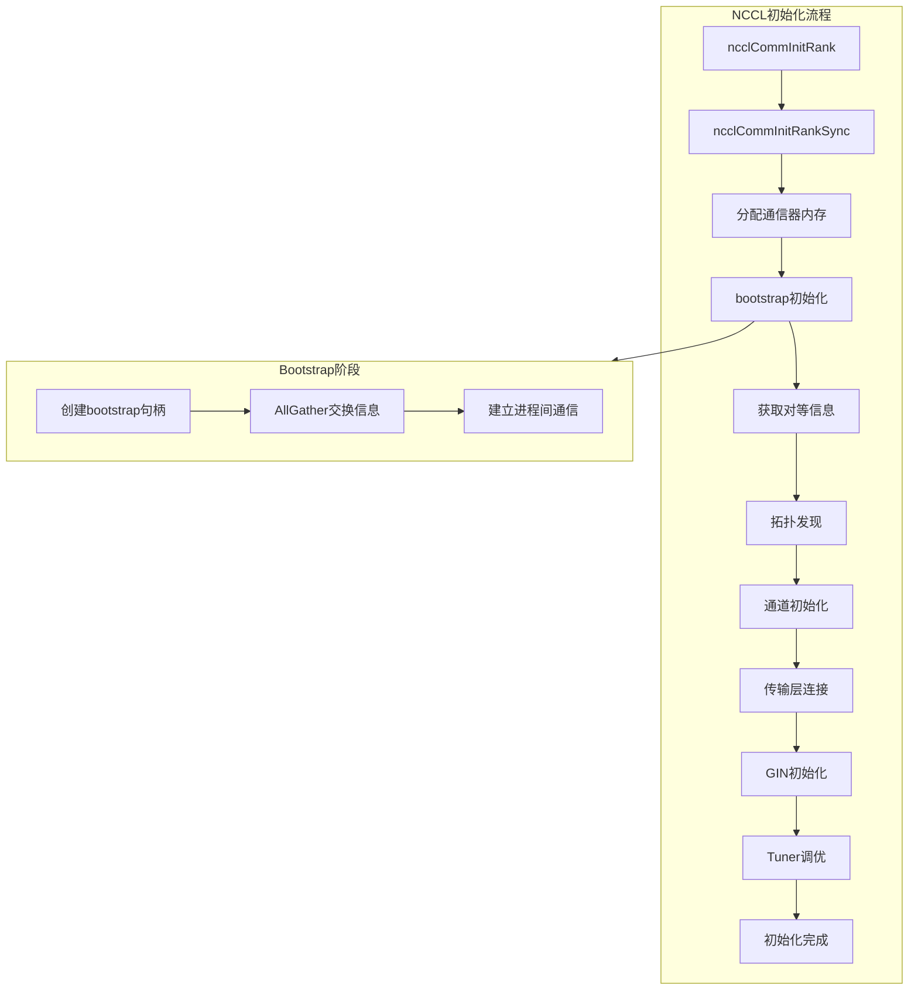

## 1.4 详细初始化步骤

### 1.4.1 Bootstrap机制

Bootstrap是NCCL初始化的第一步，负责在进程之间建立初始通信通道。

```cpp
// 位于 src/bootstrap.cc
ncclResult_t ncclBootstrapInit(ncclBootstrapHandle* handle) {
  // 1. 创建唯一的通信ID
  // 2. 初始化网络连接
  // 3. 建立进程间的初始通信通道
}
```

**Bootstrap AllGather机制：**

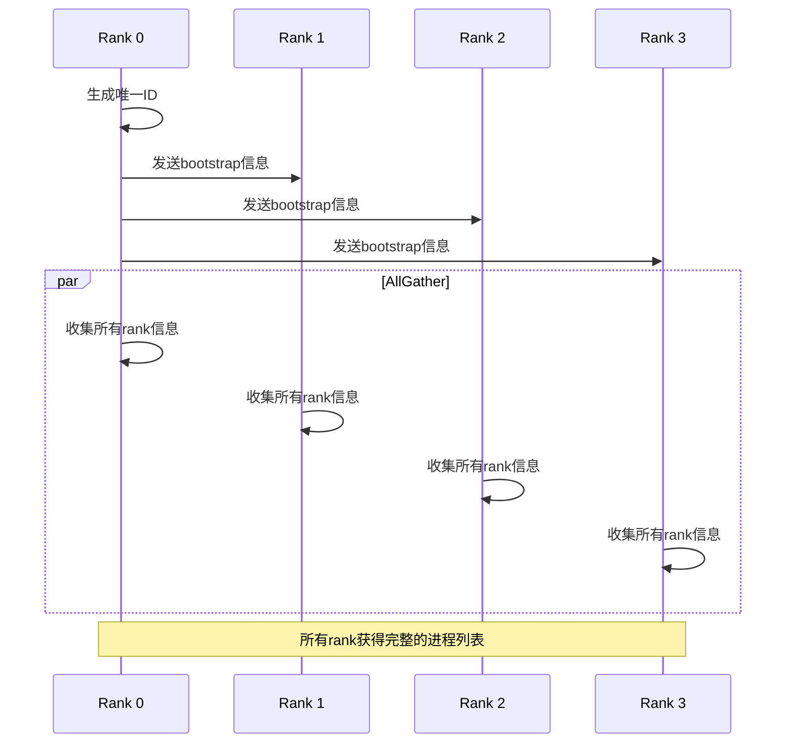

### 1.4.2 对等信息收集

```cpp
// 位于 src/init.cc
struct ncclPeerInfo {
  int rank;                    // Rank ID
  int cudaDev;                 // CUDA设备ID
  int nvmlDev;                 // NVML设备ID
  int gdrSupport;              // GPUDirect RDMA支持
  uint64_t hostHash;           // 主机哈希
  uint64_t pidHash;            // 进程ID哈希
  dev_t shmDev;                // 共享内存设备
  int64_t busId;               // PCI总线ID
  int cudaCompCap;             // CUDA计算能力
  size_t totalGlobalMem;       // 全局内存大小
  
  // MNNVL支持
  nvmlGpuFabricInfoV_t fabricInfo;
  int cuMemSupport;
  ncclGinType_t supportedGinType;
  bool crossNicSupport;
};
```

### 1.4.3 通道初始化

```cpp
// 位于 src/channel.cc
ncclResult_t initChannel(struct ncclComm* comm, int channelId) {
  struct ncclChannel* channel = &comm->channels[channelId];
  
  // 1. 分配peer资源
  if (channel->peers == NULL) {
    NCCLCHECK(ncclCalloc(sharedRes->peers + channelId, sharedRes->tpNRanks));
    channel->peers = ncclMemoryStackAlloc<struct ncclChannelPeer*>(&comm->memPermanent, nPeers);
  }
  
  // 2. 分配设备端peer资源
  if (channel->devPeers == NULL) {
    NCCLCHECK(ncclCudaCallocAsync(&channel->devPeers, nPeers, deviceStream, comm->memManager));
  }
  
  // 3. 初始化Ring拓扑信息
  channel->ring.userRanks = ncclMemoryStackAlloc<int>(&comm->memPermanent, nRanks);
  channel->ring.rankToIndex = ncclMemoryStackAlloc<int>(&comm->memPermanent, nRanks);
}
```

### 1.4.4 内存管理初始化

```cpp
// 位于 src/mem_manager.cc
ncclResult_t ncclMemManagerInit(struct ncclComm* comm) {
  // 1. 初始化内存池
  // 2. 设置CUDA内存分配器
  // 3. 配置共享内存区域
}
```

## 1.5 代理(Proxy)机制

NCCL使用代理进程来处理网络通信，避免CPU端的开销。

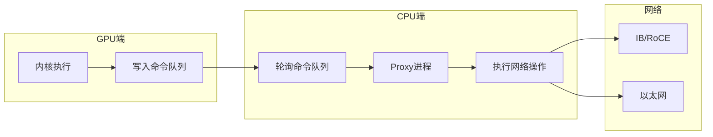

## 1.6 共享资源管理

```cpp
// 位于 src/include/comm.h
struct ncclSharedResources {
  int tpNRanks;                // 拓扑rank数
  struct ncclChannelPeer** peers; // 通道peer数组
  struct ncclDevChannelPeer** devPeers; // 设备端peer数组
  
  // 流管理
  struct ncclStrongStream hostStream;
  struct ncclStrongStream deviceStream;
  
  // GIN状态
  struct ncclGinState ginState;
  
  // CollNet共享资源
  struct ncclCollNetSharedRes* collNetSharedRes;
  
  // NVLS共享资源
  struct ncclNvlsSharedRes* nvlsSharedRes;
};
```

---

# 2. 通信拓扑的生成和Tuning过程、流程、机制和实现

## 2.1 拓扑系统概述

NCCL的拓扑系统是其性能优化的核心，负责发现和建模GPU、NIC、CPU和PCIe交换机之间的物理连接关系。

## 2.2 拓扑节点类型

```cpp
// 位于 src/graph/topo.h
#define NCCL_TOPO_NODE_TYPES 7

enum ncclTopoNodeType {
  GPU = 0,    // GPU设备
  PCI = 1,    // PCIe交换机
  NVS = 2,    // NVLink交换机
  CPU = 3,    // CPU/NUMA域
  NIC = 4,    // 网络接口卡
  NET = 5,    // 网络端点
  GIN = 6     // GIN端点
};
```

## 2.3 路径类型

```cpp
// 位于 src/graph/topo.h
enum ncclTopoPathType {
  PATH_LOC = 0,   // 本地（自身）
  PATH_NVL = 1,   // NVLink连接
  PATH_NVB = 2,   // 通过中间GPU的NVLink
  PATH_C2C = 3,   // C2C连接（Grace Hopper）
  PATH_PIX = 4,   // 单个PCIe桥
  PATH_PXB = 5,   // 多个PCIe桥
  PATH_P2C = 6,   // GPU到NIC通过C2C
  PATH_PXN = 7,   // 通过中间GPU到NIC
  PATH_PHB = 8,   // 通过CPU
  PATH_SYS = 9,   // 通过SMP互连
  PATH_NET = 10,  // 通过网络
  PATH_DIS = 11   // 断开
};
```

## 2.4 拓扑构建流程

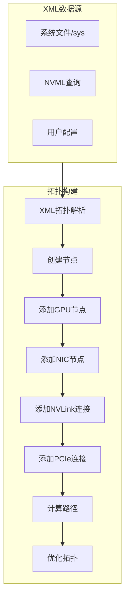

### 2.4.1 从XML构建拓扑

```cpp
// 位于 src/graph/topo.cc
ncclResult_t ncclTopoGetSystemFromXml(struct ncclXml* xml, struct ncclTopoSystem** topoSystem, uint64_t localHostHash) {
  // 1. 分配拓扑系统
  NCCLCHECK(ncclCalloc(topoSystem, 1));
  struct ncclTopoSystem* system = *topoSystem;
  
  // 2. 添加CPU节点
  for (int s = 0; s < topNode->nSubs; s++) {
    if (strcmp(node->name, "cpu") == 0) {
      NCCLCHECK(ncclTopoAddCpu(node, *topoSystem));
    }
  }
  
  // 3. 添加NVLink连接
  NCCLCHECK(ncclTopoAddNvLinks(topNode, *topoSystem, NULL, 0));
  
  // 4. 添加C2C连接
  NCCLCHECK(ncclTopoAddC2c(topNode, *topoSystem, NULL, 0));
  
  // 5. 添加PCIe连接
  NCCLCHECK(ncclTopoAddPciLinks(topNode, *topoSystem, NULL, 0));
  
  // 6. 连接CPU节点
  NCCLCHECK(ncclTopoConnectCpus(*topoSystem));
  
  // 7. 排序系统
  NCCLCHECK(ncclTopoSortSystem(*topoSystem));
}
```

### 2.4.2 路径计算

```cpp
// 位于 src/graph/paths.cc
ncclResult_t ncclTopoComputePaths(struct ncclTopoSystem* system, struct ncclComm* comm) {
  // 对每个GPU节点计算到所有其他节点的路径
  for (int g = 0; g < system->nodes[GPU].count; g++) {
    NCCLCHECK(ncclTopoSetPaths(system->nodes[GPU].nodes + g, system));
  }
  
  // 对每个NIC节点计算路径
  for (int n = 0; n < system->nodes[NET].count; n++) {
    NCCLCHECK(ncclTopoSetPaths(system->nodes[NET].nodes + n, system));
  }
}

static ncclResult_t ncclTopoSetPaths(struct ncclTopoNode* baseNode, struct ncclTopoSystem* system) {
  // 广度优先搜索设置到所有节点的路径
  struct ncclTopoNodeList nodeList;
  nodeList.count = 1;
  nodeList.list[0] = baseNode;
  
  while (nodeList.count) {
    for (int n = 0; n < nodeList.count; n++) {
      struct ncclTopoNode* node = nodeList.list[n];
      for (int l = 0; l < node->nlinks; l++) {
        // 更新路径信息
        float bw = std::min(path->bw, link->bw);
        remPath->type = std::max(path->type, type);
      }
    }
  }
}
```

## 2.5 环(Ring)拓扑构建

```cpp
// 位于 src/graph/rings.cc
ncclResult_t ncclBuildRings(int nrings, int* rings, int rank, int nranks, int* prev, int* next) {
  for (int r = 0; r < nrings; r++) {
    int current = rank;
    for (int i = 0; i < nranks; i++) {
      rings[r * nranks + i] = current;
      current = next[r * nranks + current];
    }
    // 验证环完整性
    if (current != rank) {
      WARN("Ring does not loop back to start");
      return ncclInternalError;
    }
  }
}
```

## 2.6 树(Tree)拓扑构建

```cpp
// 位于 src/graph/trees.cc
ncclResult_t ncclGetBtree(int nranks, int rank, int* u, int* d0, int* d1, int* parentChildType) {
  // 二叉树构建算法
  int bit;
  for (bit = 1; bit < nranks; bit <<= 1) {
    if (bit & rank) break;
  }
  
  if (rank == 0) {
    *u = -1;
    *d0 = -1;
    *d1 = nranks > 1 ? bit >> 1 : -1;
    return ncclSuccess;
  }
  
  // 计算父节点和子节点
  up = (rank ^ bit) | (bit << 1);
  if (up >= nranks) up = (rank ^ bit);
  *u = up;
  
  // 计算子节点
  int lowbit = bit >> 1;
  down0 = lowbit == 0 ? -1 : rank - lowbit;
  down1 = lowbit == 0 ? -1 : rank + lowbit;
}

// 双二叉树用于AllReduce
ncclResult_t ncclGetDtree(int nranks, int rank, int* s0, int* d0_0, int* d0_1, int* parentChildType0,
                          int* s1, int* d1_0, int* d1_1, int* parentChildType1) {
  // 第一棵树：使用标准二叉树
  ncclGetBtree(nranks, rank, s0, d0_0, d0_1, parentChildType0);
  
  // 第二棵树：镜像或移位
  if (nranks % 2 == 1) {
    // 移位树
    int shiftrank = (rank - 1 + nranks) % nranks;
    ncclGetBtree(nranks, shiftrank, &u, &d0, &d1, parentChildType1);
    *s1 = u == -1 ? -1 : (u + 1) % nranks;
    *d1_0 = d0 == -1 ? -1 : (d0 + 1) % nranks;
    *d1_1 = d1 == -1 ? -1 : (d1 + 1) % nranks;
  } else {
    // 镜像树
    ncclGetBtree(nranks, nranks - 1 - rank, &u, &d0, &d1, parentChildType1);
    *s1 = u == -1 ? -1 : nranks - 1 - u;
    *d1_0 = d0 == -1 ? -1 : nranks - 1 - d0;
    *d1_1 = d1 == -1 ? -1 : nranks - 1 - d1;
  }
}
```

### 2.6.1 树拓扑示意图

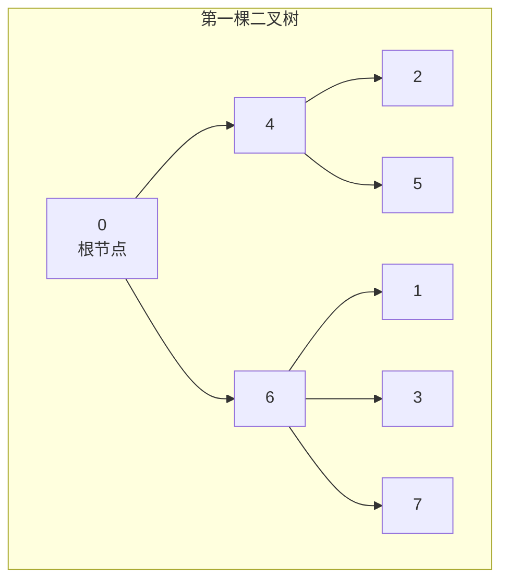

## 2.7 拓扑搜索算法

```cpp
// 位于 src/graph/search.cc
ncclResult_t ncclTopoSearchRec(struct ncclTopoSystem* system, struct ncclTopoGraph* graph, 
                                struct ncclTopoGraph* saveGraph, int* time) {
  // 递归搜索最优拓扑
  // 1. 尝试不同的GPU排序
  // 2. 评估带宽和延迟
  // 3. 选择最优配置
}

ncclResult_t ncclTopoSearchNextGpuSort(struct ncclTopoSystem* system, struct ncclTopoGraph* graph,
                                        struct ncclTopoNode* gpu, int* next, int* countPtr, int sortNet) {
  // 对候选GPU进行排序
  struct ncclGpuScore {
    int g;             // GPU索引
    int startIndex;    // 起始位置
    int intraNhops;    // 节点内跳数
    int intraBw;       // 节点内带宽
    int interNhops;    // 节点间跳数
    int interBw;       // 节点间带宽
  };
  
  // 根据带宽和跳数排序
  qsort(scores, count, sizeof(struct ncclGpuScore), cmpScore);
}
```

## 2.8 Tuning机制

### 2.8.1 Tuner配置

```cpp
// 位于 src/graph/tuning.cc
typedef struct ncclTunerConstants {
  // 基础延迟 (us)
  float baseLatencies[NCCL_NUM_ALGORITHMS][NCCL_NUM_PROTOCOLS];
  
  // 硬件延迟 (us)
  float hwLatencies[NCCL_NUM_HW_TYPES][NCCL_NUM_ALGORITHMS][NCCL_NUM_PROTOCOLS];
  
  // LL最大带宽
  float llMaxBws[NCCL_NUM_COMPCAPS][3];
  
  // 每通道最大带宽
  float perChMaxRingLL128Bws[NCCL_NUM_COMPCAPS][3];
  float perChMaxTreeLL128Bws[NCCL_NUM_COMPCAPS][3];
  float perChMaxTreeBws[NCCL_NUM_COMPCAPS][3];
  float perChMaxNVLSTreeBws[NCCL_NUM_COMPCAPS][3];
} ncclTunerConstants_t;
```

### 2.8.2 算法选择流程

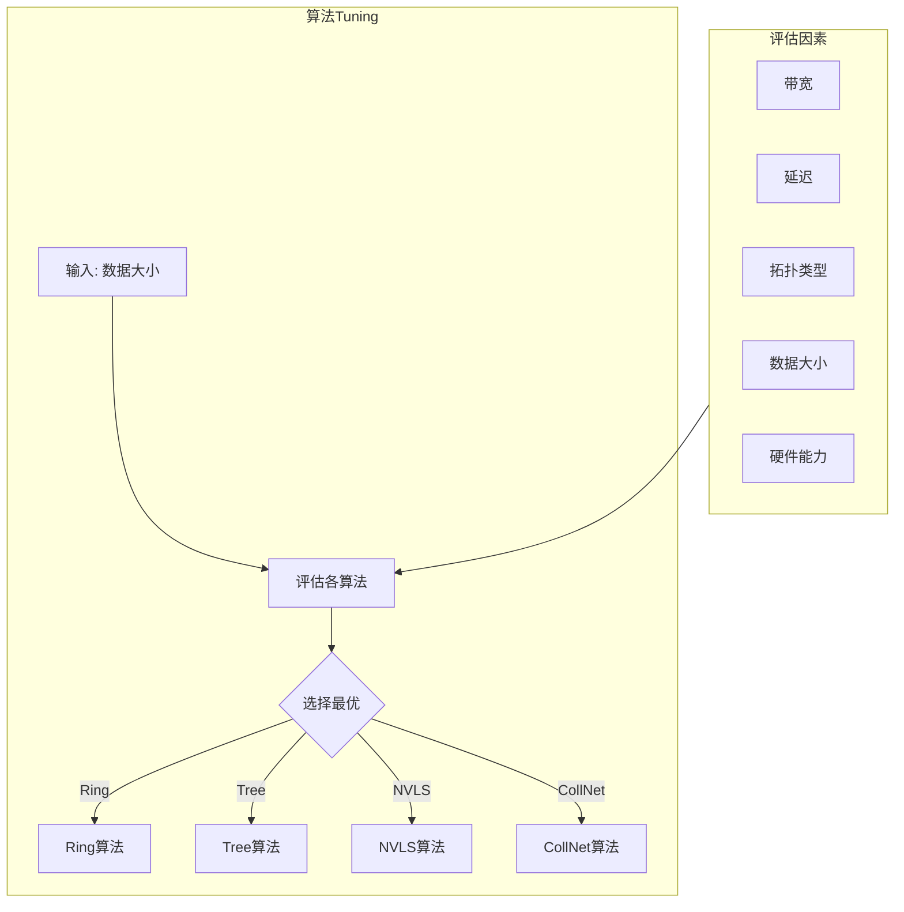

### 2.8.3 模型调优代码

```cpp
// 位于 src/graph/tuning.cc
ncclResult_t ncclTopoTuneModel(struct ncclComm* comm, int minCompCap, int maxCompCap, 
                               struct ncclTopoGraph** graphs) {
  // 计算每种算法和协议的带宽和延迟
  for (int coll = 0; coll < NCCL_NUM_FUNCTIONS; coll++) {
    for (int a = 0; a < NCCL_NUM_ALGORITHMS; a++) {
      for (int p = 0; p < NCCL_NUM_PROTOCOLS; p++) {
        // 计算带宽
        float busBw = graphs[a]->nChannels * bw;
        
        // 应用各种修正因子
        if (a == NCCL_ALGO_RING && p == NCCL_PROTO_LL) {
          busBw = std::min(llMaxBw, busBw * .5);
        }
        if (a == NCCL_ALGO_TREE && coll == ncclFuncAllReduce) {
          busBw = std::min(busBw * .92, graphs[a]->nChannels * perChMaxTreeBw);
        }
        
        // 计算延迟
        float intraLat = comm->tunerConstants.hwLatencies[intraHw[a]][a][p];
        float interLat = comm->tunerConstants.hwLatencies[NCCL_HW_NET][a][p];
        comm->latencies[coll][a][p] = comm->tunerConstants.baseLatencies[a][p];
        comm->latencies[coll][a][p] += ...; // 添加各种延迟组件
        
        comm->bandwidths[coll][a][p] = busBw;
      }
    }
  }
}
```

### 2.8.4 支持的算法

| 算法 | 描述 | 适用场景 |
|------|------|----------|
| RING | 环形算法 | 中等数据量，通用场景 |
| TREE | 树形算法 | 小数据量，低延迟需求 |
| COLLNET_DIRECT | 集合网络直连 | 大规模集群，有SHARP支持 |
| COLLNET_CHAIN | 集合网络链式 | 多节点，网络聚合 |
| NVLS | NVLink交换机 | 单节点NVSwitch系统 |
| NVLS_TREE | NVLS+Tree | 多节点NVSwitch系统 |
| PAT | 点对点聚合 | 单GPU节点场景 |

### 2.8.5 协议类型

| 协议 | 描述 | 特点 |
|------|------|------|
| LL | Low Latency | 最小延迟，小数据优化 |
| LL128 | 128字节低延迟 | 中等数据，平衡延迟和带宽 |
| SIMPLE | 简单协议 | 大数据，高带宽 |

## 2.9 P2P连接检查

```cpp
// 位于 src/graph/paths.cc
ncclResult_t ncclTopoCheckP2p(struct ncclComm* comm, struct ncclTopoSystem* system, 
                              int rank1, int rank2, int* p2p, int* read, 
                              int* intermediateRank, int* cudaP2p) {
  // 获取两个GPU的拓扑路径
  struct ncclTopoLinkList* path = gpu1->paths[GPU] + g2;
  
  // 检查是否有中间GPU
  if (path->count == 2) {
    struct ncclTopoNode* intermediateNode = path->list[0]->remNode;
    if (intermediateNode->type == GPU) {
      intermediateIndex = intermediateNode - system->nodes[GPU].nodes;
      *intermediateRank = intermediateNode->gpu.rank;
    }
  }
  
  // 确定P2P级别
  int p2pLevel = PATH_PXB;
  
  // 检查路径类型
  if (path->type <= p2pLevel) *p2p = 1;
  
  // NVLink支持P2P读取（Ampere架构）
  if (path->type == PATH_NVL && gpu1->gpu.cudaCompCap == 80) {
    *read = 1;
  }
}
```

## 2.10 GDR（GPUDirect RDMA）检查

```cpp
// 位于 src/graph/paths.cc
ncclResult_t ncclTopoCheckGdr(struct ncclTopoSystem* system, int rank, int64_t netId, 
                              int read, enum ncclTopoGdrMode* gdrMode) {
  // 检查NIC和GPU都支持GDR
  if (net->net.gdrSupport == 0 || gpu->gpu.gdrSupport == 0) {
    *gdrMode = ncclTopoGdrModeDisable;
    return ncclSuccess;
  }
  
  // 检查距离
  int netGdrLevel = ncclParamNetGdrC2c() ? PATH_P2C : PATH_PXB;
  int distance = gpu->paths[NET][n].type;
  
  if (distance > netGdrLevel) {
    INFO(NCCL_GRAPH | NCCL_NET, "GPU Direct RDMA Disabled: distance %d > %d", distance, netGdrLevel);
    return ncclSuccess;
  }
  
  *gdrMode = ncclTopoGdrModeDefault;
}
```

---

# 3. GIN通信的实现、机制、流程、硬件原理和硬件能力要求

## 3.1 GIN概述

GIN（Group Interface for Networking）是NCCL中的高性能网络通信接口，支持GPU直接发起网络操作，减少CPU介入。

## 3.2 GIN架构

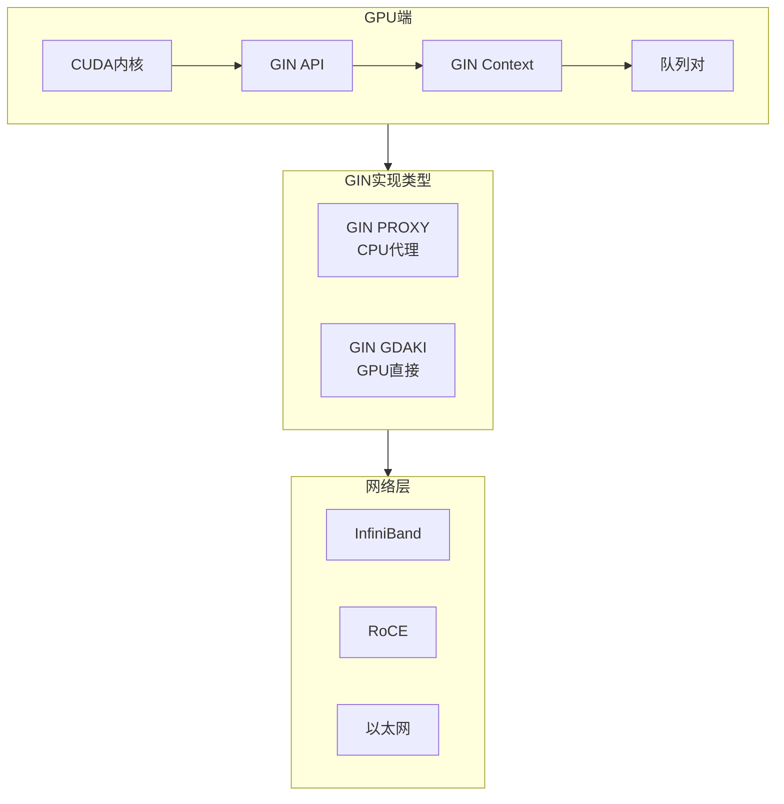

## 3.3 GIN类型

```cpp
// 位于 src/include/gin/gin_host.h
typedef enum ncclGinType {
  NCCL_GIN_TYPE_NONE = 0,      // 不使用GIN
  NCCL_GIN_TYPE_PROXY = 1,     // 通过CPU代理
  NCCL_GIN_TYPE_GDAKI = 2      // GPU直接网络接口
} ncclGinType_t;
```

### 3.3.1 GIN PROXY

GIN PROXY模式通过CPU代理进程处理网络操作：

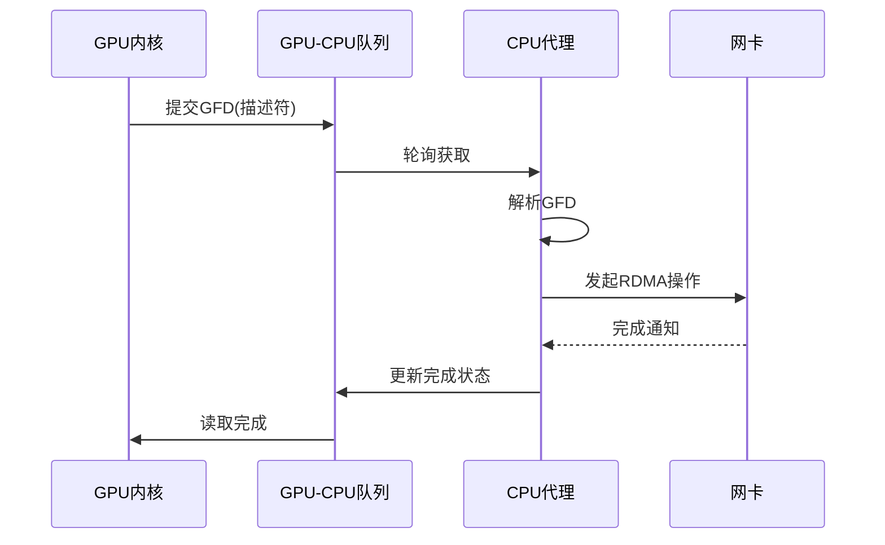

### 3.3.2 GIN GDAKI

GIN GDAKI模式允许GPU直接发起网络操作：

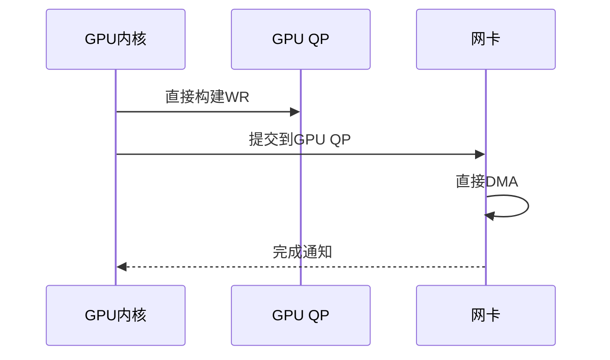

## 3.4 GIN核心数据结构

### 3.4.1 GIN插件接口

```cpp
// 位于 src/include/plugin/gin/gin_v12.h
typedef struct {
  const char* name;
  
  // 初始化和设备管理
  ncclResult_t (*init)(void** ctx, uint64_t commId, ncclDebugLogger_t logFunction);
  ncclResult_t (*devices)(int* ndev);
  ncclResult_t (*getProperties)(int dev, ncclNetProperties_v11_t* props);
  
  // 连接管理
  ncclResult_t (*listen)(void* ctx, int dev, void* handle, void** listenComm);
  ncclResult_t (*connect)(void* ctx, void* handles[], int nranks, int rank, 
                          int nConnections, int queueDepth, void* listenComm, void** collComm);
  
  // Context管理
  ncclResult_t (*createContext)(void* collComm, int nSignals, int nCounters, 
                                 int nContexts, void** ginCtx, ncclNetDeviceHandle_v11_t** devHandle);
  ncclResult_t (*destroyContext)(void* ginCtx);
  
  // 内存注册
  ncclResult_t (*regMrSym)(void* collComm, void* data, size_t size, int type, 
                           uint64_t mrFlags, void** mhandle, void** ginHandle);
  ncclResult_t (*deregMrSym)(void* collComm, void* mhandle);
  
  // Put操作
  ncclResult_t (*iput)(void* collComm, uint64_t srcOff, void* srcMhandle, size_t size,
                       uint64_t dstOff, void* dstMhandle, uint32_t rank, 
                       int connectionId, void** request);
  ncclResult_t (*iputSignal)(void* collComm, uint64_t srcOff, void* srcMhandle,
                             size_t size, uint64_t dstOff, void* dstMhandle,
                             uint32_t rank, uint64_t signalOff, void* signalMhandle,
                             uint64_t signalValue, uint32_t signalOp, 
                             int connectionId, void** request);
  
  // 测试和进度
  ncclResult_t (*test)(void* collComm, void* request, int* done);
  ncclResult_t (*ginProgress)(void* collComm);
  
  // 错误处理
  ncclResult_t (*queryLastError)(void* ginCtx, bool* hasError);
  ncclResult_t (*finalize)(void* ctx);
} ncclGin_v12_t;
```

### 3.4.2 GIN状态结构

```cpp
// 位于 src/gin/gin_host.cc
struct ncclGinState {
  ncclGin_t ncclGin;           // GIN插件指针
  ncclGinType_t ginType;       // GIN类型
  int ginVersion;              // 版本号
  int ginConnectionType;       // 连接类型
  void* ginInstance;           // 实例指针
  
  int ginCommCount;            // 通信器数量
  void* ginComms[NCCL_GIN_MAX_CONNECTIONS]; // 通信器数组
  void* ginCtx[NCCL_GIN_MAX_CONNECTIONS];    // Context数组
  ncclNetDeviceHandle_t* ginDevHandles[NCCL_GIN_MAX_CONNECTIONS]; // 设备句柄
  
  // 信号和计数器
  int signalSpaceSize;
  int counterSpaceSize;
  ncclSpace signalSpace;
  ncclSpace counterSpace;
  
  // 进度线程
  int needsProxyProgress;
  int ginProgress;
  std::thread thread;
  std::mutex mutex;
  std::condition_variable cond;
};
```

## 3.5 GIN初始化流程

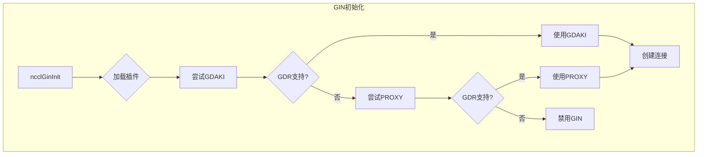

### 3.5.1 GIN插件加载

```cpp
// 位于 src/plugin/gin.cc
ncclResult_t ncclGinInit(struct ncclComm* comm) {
  // 1. 初始化插件库
  std::call_once(initPluginLibsOnceFlag, initPluginLibsOnceFunc);
  
  // 2. 遍历所有可用插件
  for (int pluginIndex = 0; pluginIndex < pluginCount; pluginIndex++) {
    // 加载插件
    NCCLCHECK(ncclGinPluginLoad(&ginPluginLibs[pluginIndex]));
    
    // 初始化插件
    NCCLCHECK(ncclGinPluginInit(comm, &ginPluginLibs[pluginIndex]));
    
    // 分配到通信器
    if (ginPluginLibs[pluginIndex].ncclGinPluginState == ncclGinPluginStateEnabled) {
      NCCLCHECK(ncclGinPluginAssignToComm(comm, pluginIndex, &isAssigned));
      if (isAssigned) break;
    }
  }
}
```

### 3.5.2 GIN连接建立

```cpp
// 位于 src/gin/gin_host.cc
ncclResult_t ncclGinConnectOnce(struct ncclComm* comm, ncclGinConnectionType_t requestedConnectionType,
                                 int reqGinContextCount, int reqGinQueueDepth) {
  struct ncclGinState* ginState = &comm->sharedRes->ginState;
  
  // 1. 获取本地GIN设备
  int localGinDevs[NCCL_TOPO_MAX_NODES];
  NCCLCHECK(ncclTopoGetLocalGinDevs(comm, localGinDevs, &nLocalGinDevs));
  
  // 2. 交换连接信息
  NCCLCHECK(bootstrapAllGather(comm->bootstrap, allHandles, NCCL_NET_HANDLE_MAXSIZE));
  
  // 3. 建立连接
  for (int n = 0; n < ginState->ginCommCount; n++) {
    // 监听
    NCCLCHECK(ginState->ncclGin->listen(ginState->ginInstance, localGinDevs[n % nLocalGinDevs],
                                         handle, &listenComm));
    
    // 连接
    NCCLCHECK(ginState->ncclGin->connect(comm->ginContext, handles, nGinRanks, myGinRank,
                                          nContextsPerComm, ginState->ginQueueDepth, 
                                          listenComm, ginState->ginComms + n));
    
    // 创建Context
    if (ginState->ginType == NCCL_GIN_TYPE_PROXY) {
      NCCLCHECK(ncclGinProxyCreateContext(comm, ginState->ginComms[n], ...));
    } else {
      NCCLCHECK(ginState->ncclGin->createContext(ginState->ginComms[n], ...));
    }
  }
  
  // 4. 启动进度线程（如果需要）
  if (ginState->needsProxyProgress) {
    ginState->thread = std::thread(ncclGinProgress, ginState);
  }
}
```

## 3.6 GIN Proxy实现详解

### 3.6.1 Proxy描述符(GFD)

```cpp
// 位于 src/include/nccl_device/gin/proxy/gin_proxy_device_host_common.h
struct ncclGinProxyGfd {
  uint64_t qword[8];
};

// GFD头部
struct ncclGinProxyGfdHeader {
  uint64_t flag : 1;
  uint64_t op : 7;
  uint64_t size : 56;
};

// 操作类型
enum ncclGinProxyOp {
  ncclGinProxyOpPut = 0x01,
  ncclGinProxyOpWithInline = 0x02,
  ncclGinProxyOpWithSignalInc = 0x04,
  ncclGinProxyOpWithSignalAdd = 0x08,
  ncclGinProxyOpWithCounter = 0x10,
  ncclGinProxyOpVASignal = 0x20
};
```

### 3.6.2 GPU端Put操作

```cpp
// 位于 src/include/nccl_device/gin/proxy/gin_proxy.h
template <typename Coop>
NCCL_DEVICE_INLINE void put(Coop coop, ncclGinProxyGfd_t* gfd, ncclGinProxyGpuCtx_t* proxyCtx,
                            int peer, ncclGinWindow_t dstWnd, size_t dstOff, T srcVal,
                            bool hasInline, ncclGinWindow_t srcWnd, size_t srcOff, size_t bytes,
                            ncclGinSignalDescriptor signal, ncclGinSignalOp_t signalOp,
                            uint64_t signalVal, bool hasCounter, ncclGinCounter_t counterId) {
  // 1. 构建操作类型
  ncclGinProxyOp_t op;
  constructProxyOp(op, hasInline, putSignalType, signalOp, hasCounter);
  
  // 2. 构建GFD
  buildGfd(gfd, op, srcVal, hasInline, srcOff, srcWnd, dstOff, dstWnd, bytes,
           counterId, signalId, signalVal, nullptr, 0);
  
  // 3. 提交到队列
  postGfd<Coop>(coop, proxyCtx, gfd, peer);
}
```

### 3.6.3 CPU代理进度函数

```cpp
// 位于 src/gin/gin_host.cc
void* ncclGinProgress(struct ncclGinState* ginState_) {
  while (1) {
    if (ginState->ginProgress == 1) {
      for (int n = 0; n < ginState->ginCommCount; n++) {
        if (ginState->ginType == NCCL_GIN_TYPE_PROXY) {
          ret = ncclGinProxyProgress(ginState->ncclGin, ginState->ginCtx[n]);
        } else {
          ret = ginState->ncclGin->ginProgress(ginState->ginComms[n]);
        }
      }
    }
  }
}
```

## 3.7 GIN GDAKI实现详解

### 3.7.1 GDAKI概述

GDAKI（GPUDirect Async Kernel Interface）利用DOCA GPUNetIO库，允许GPU内核直接发起RDMA操作。

```cpp
// 位于 src/include/nccl_device/gin/gdaki/gin_gdaki.h
template <typename Coop>
NCCL_DEVICE_INLINE static void putImpl(ncclGinCtx ctx, Coop coop, int peer, bool hasWins,
                                       ncclGinWindow_t dstWin, size_t dstOff, ncclGinWindow_t srcWin,
                                       size_t srcOff, size_t bytes, bool hasSignal,
                                       size_t signalOffset, __be32 signalKey, ncclGinSignalOp_t signalOp,
                                       uint64_t signalOpArg, bool hasCounter,
                                       ncclGinCounter_t counterId) {
  ncclGinGdakiGPUContext* gdaki = &((struct ncclGinGdakiGPUContext*)ctx.handle)[ctx.contextId];
  doca_gpu_dev_verbs_qp* qp = loadConst(&gdaki->gdqp) + peer;
  
  // 设置地址
  doca_gpu_dev_verbs_addr raddr, laddr;
  raddr.addr = dstOff;
  raddr.key = loadConst(loadConst(&dstMh->rkeys) + peer);
  laddr.addr = srcOff;
  laddr.key = loadConst(&srcMh->lkey);
  
  // 执行Put操作
  if (hasSignal && hasCounter) {
    doca_gpu_dev_verbs_put_signal_counter<DOCA_GPUNETIO_VERBS_SIGNAL_OP_ADD>(
      qp, raddr, laddr, bytes, sig_raddr, sig_laddr, signalOpArg, 
      companion_qp, counter_raddr, counter_laddr, 1, codeOpt);
  } else if (hasSignal) {
    doca_gpu_dev_verbs_put_signal<DOCA_GPUNETIO_VERBS_SIGNAL_OP_ADD>(
      qp, raddr, laddr, bytes, sig_raddr, sig_laddr, signalOpArg, codeOpt);
  } else {
    doca_gpu_dev_verbs_put(qp, raddr, laddr, bytes, codeOpt);
  }
}
```

### 3.7.2 GDAKI Context结构

```cpp
// 位于 src/include/nccl_device/gin/gdaki/gin_gdaki_device_host_common.h
struct ncclGinGdakiGPUContext {
  // Queue Pairs
  doca_gpu_dev_verbs_qp* gdqp;           // 主QP数组
  doca_gpu_dev_verbs_qp* companion_gdqp; // 伴生QP（用于counter）
  
  // 内存键
  uint32_t sink_buffer_lkey;
  
  // 信号表
  struct {
    uint64_t* buffer;
    __be32* rkeys;
    uint32_t offset;
  } signals_table;
  
  // 计数器表
  struct {
    uint64_t* buffer;
    __be32* rkeys;
    uint32_t offset;
  } counters_table;
};
```

## 3.8 GIN内存注册

```cpp
// 位于 src/gin/gin_host.cc
ncclResult_t ncclGinRegister(struct ncclComm* comm, void* address, size_t size,
                             void* ginHostWins[NCCL_GIN_MAX_CONNECTIONS],
                             ncclGinWindow_t ginDevWins[NCCL_GIN_MAX_CONNECTIONS], int winFlags) {
  struct ncclGinState* ginState = &comm->sharedRes->ginState;
  
  for (int n = 0; n < ginState->ginCommCount; n++) {
    if (ginState->ginType == NCCL_GIN_TYPE_PROXY) {
      // Proxy模式使用对称内存注册
      NCCLCHECK(ncclGinProxyRegister(ginState->ncclGin, ginState->ginCtx[n], 
                                     address, size, NCCL_PTR_CUDA, mrFlags,
                                     &ginHostWins[n], &ginDevWins[n]));
    } else {
      // GDAKI模式使用对称内存注册
      NCCLCHECK(ginState->ncclGin->regMrSym(ginState->ginComms[n], address, size, 
                                            NCCL_PTR_CUDA, mrFlags,
                                            &ginHostWins[n], &ginDevWins[n]));
    }
  }
}
```

## 3.9 GIN IB实现

### 3.9.1 InfiniBand GIN初始化

```cpp
// 位于 src/transport/net_ib/gin.cc
ncclResult_t ncclGinIbInitType(void** ctx, uint64_t commId, ncclDebugLogger_t logFunction,
                                int ginType, ncclGin_t* ginIb) {
  // 初始化IB设备
  NCCLCHECK(ncclIbInitDevices(logFunction, nullptr));
  
  // 优先尝试GDAKI
  if (ginType == NCCL_GIN_TYPE_GDAKI || ginType == -1) {
    NCCLCHECK(ncclGinIbGdakiInit());
    if (ncclGinIbGdakiNDevs > 0) {
      NCCLCHECK(ncclGinIbGdrSupport(&gdrSupport, true));
      if (gdrSupport) {
        if (ginIb) memcpy(ginIb, &ncclGinIbGdaki, sizeof(ncclGinIb));
        goto end;
      }
    }
  }
  
  // 回退到Proxy
  if (ginType == NCCL_GIN_TYPE_PROXY || ginType == -1) {
    NCCLCHECK(ncclGinIbGdrSupport(&gdrSupport, false));
    if (gdrSupport) {
      if (ginIb) memcpy(ginIb, &ncclGinIbProxy, sizeof(ncclGinIb));
    }
  }
}
```

### 3.9.2 RDMA Put操作

```cpp
// 位于 src/transport/net_ib/gin.cc
ncclResult_t ncclGinIbProxyIPut(void* collComm, uint64_t srcOff, void* srcMhandle, size_t size,
                                 uint64_t dstOff, void* dstMhandle, uint32_t rank, int connectionId,
                                 void** request) {
  struct ncclIbGinProxyMrHandle* srcMrHandle = (struct ncclIbGinProxyMrHandle*)srcMhandle;
  struct ncclIbGinProxyMrHandle* dstMrHandle = (struct ncclIbGinProxyMrHandle*)dstMhandle;
  
  void* srcPtr = (void*)(srcMrHandle->base_vas[cComm->rank] + srcOff);
  void* dstPtr = (void*)(dstMrHandle->base_vas[rank] + dstOff);
  uint32_t lkey = srcMrHandle->mrHandle->mrs[0]->lkey;
  uint32_t rkey = dstMrHandle->rkeys[rank];
  
  // 构建RDMA Write Work Request
  struct ibv_send_wr wr;
  wr.opcode = IBV_WR_RDMA_WRITE;
  wr.send_flags = IBV_SEND_SIGNALED;
  wr.wr.rdma.remote_addr = (uint64_t)dstPtr;
  wr.wr.rdma.rkey = rkey;
  
  struct ibv_sge sge;
  sge.addr = (uintptr_t)srcPtr;
  sge.length = size;
  sge.lkey = lkey;
  
  // 提交到QP
  NCCLCHECK(wrap_ibv_post_send(qp->qp, &wr, &bad_wr));
}
```

### 3.9.3 带信号的Put操作

```cpp
ncclResult_t ncclGinIbProxyIPutSignal(void* collComm, uint64_t srcOff, void* srcMhandle,
                                       size_t size, uint64_t dstOff, void* dstMhandle, uint32_t rank,
                                       uint64_t signalOff, void* signalMhandle, uint64_t signalValue,
                                       uint32_t signalOp, int connectionId, void** request) {
  // 构建两个Work Request：一个RDMA Write，一个Atomic操作
  
  // 1. RDMA Write (数据传输)
  if (size > 0) {
    wr[0].opcode = IBV_WR_RDMA_WRITE;
    wr[0].send_flags = 0; // 不需要信号
    wr[0].next = &wr[1];
  }
  
  // 2. Atomic Fetch and Add (信号)
  wr[1].opcode = IBV_WR_ATOMIC_FETCH_AND_ADD;
  wr[1].send_flags = IBV_SEND_SIGNALED;
  wr[1].wr.atomic.remote_addr = (uint64_t)signalPtr;
  wr[1].wr.atomic.compare_add = signalOp == NCCL_GIN_SIGNAL_OP_INC ? 1 : signalValue;
  wr[1].wr.atomic.rkey = signalRkey;
  
  // 链式提交
  NCCLCHECK(wrap_ibv_post_send(qp->qp, size > 0 ? &wr[0] : &wr[1], &bad_wr));
}
```

## 3.10 硬件要求和能力

### 3.10.1 GIN PROXY硬件要求

| 要求 | 描述 |
|------|------|
| GPU | 支持CUDA的NVIDIA GPU |
| NIC | 支持RDMA的网卡（InfiniBand或RoCE） |
| GPUDirect RDMA | GPU和NIC都需支持GPUDirect RDMA |
| PeerMem或DMA-BUF | 需要nv_peer_mem模块或DMA-BUF支持 |
| PCIe | PCIe 3.0或更高 |

### 3.10.2 GIN GDAKI硬件要求

| 要求 | 描述 |
|------|------|
| GPU | NVIDIA GPU，支持DOCA GPUNetIO |
| NIC | NVIDIA BlueField-3或更新的DPU/SmartNIC |
| DOCA | DOCA 2.0或更高版本 |
| GPUDirect RDMA | 必需 |
| CUDA | CUDA 12.0或更高 |
| GPU直接QP访问 | GPU可以访问和操作QP |

### 3.10.3 GPUDirect RDMA支持检查

```cpp
// 位于 src/transport/net_ib/gin.cc
static ncclResult_t ncclGinIbGdrSupport(bool* gdrSupport, bool gdaki) {
  *gdrSupport = true;
  
  // 检查peer memory支持
  bool peerMemSupport = gdaki ? ncclIbPeerMemSupport() == ncclSuccess 
                              : ncclIbGdrSupport() == ncclSuccess;
  if (peerMemSupport) return ncclSuccess;
  
  // 检查DMA-BUF支持
  if (ncclIbDmaBufSupport(0) == ncclSuccess) return ncclSuccess;
  
  *gdrSupport = false;
  INFO(NCCL_NET, "Unable to use GIN: Peermem is not supported, nor DMA-BUF.");
  return ncclSuccess;
}
```

## 3.11 GIN信号和计数器机制

### 3.11.1 信号类型

```cpp
// 位于 src/include/nccl_device/gin/gin_device_common.h
enum ncclGinSignalType {
  NCCL_GIN_SIGNAL_TYPE_NONE = 0,     // 无信号
  NCCL_GIN_SIGNAL_TYPE_INDEXED = 1,  // 索引信号（使用信号池）
  NCCL_GIN_SIGNAL_TYPE_VA = 2        // 虚拟地址信号
};

enum ncclGinSignalOp {
  ncclGinSignalInc = 0,   // 递增1
  ncclGinSignalAdd = 1    // 加指定值
};
```

### 3.11.2 信号和计数器分配

```cpp
// 位于 src/gin/gin_host.cc
ncclResult_t ncclGinAllocSignalsCounters(struct ncclComm* comm, int nSignals, uint32_t* outSignal0,
                                          int nCounters, uint32_t* outCounter0) {
  struct ncclGinState* ginState = &comm->sharedRes->ginState;
  
  // 从信号池分配
  if (nSignals != 0) {
    NCCLCHECK(ncclSpaceAlloc(&ginState->signalSpace, ginState->signalSpaceSize, 
                             nSignals, 1, &start));
    *outSignal0 = (uint32_t)start;
  }
  
  // 从计数器池分配
  if (nCounters != 0) {
    NCCLCHECK(ncclSpaceAlloc(&ginState->counterSpace, ginState->counterSpaceSize, 
                             nCounters, 1, &start));
    *outCounter0 = (uint32_t)start;
  }
}
```

## 3.12 MNNVL支持

MNNVL（Multi-Node NVLink）允许跨节点的GPU通过NVLink fabric直接通信。

```cpp
// 位于 src/mnnvl.cc
ncclResult_t ncclMnnvlCheck(struct ncclComm* comm) {
  // 检查cuMem支持
  if (!ncclCuMemEnable()) return ncclSuccess;
  
  // 检查FABRIC handle支持
  CUCHECK(cuDeviceGetAttribute(&flag, CU_DEVICE_ATTRIBUTE_HANDLE_TYPE_FABRIC_SUPPORTED, currentDev));
  if (!flag) return ncclSuccess;
  
  // 检查所有rank的fabric状态
  for (int i = 0; i < comm->nRanks; i++) {
    if (comm->peerInfo[i].fabricInfo.state != NVML_GPU_FABRIC_STATE_COMPLETED) 
      return ncclSuccess;
  }
  
  // 确定MNNVL域/clique
  for (int i = 0; i < comm->nRanks; i++) {
    if (memcmp(fabricInfo1->clusterUuid, fabricInfo2->clusterUuid, NVML_GPU_FABRIC_UUID_LEN) == 0 &&
        fabricInfo1->cliqueId == fabricInfo2->cliqueId) {
      comm->clique.ranks[comm->clique.size++] = i;
    }
  }
  
  // 测试FABRIC handle导入导出
  NCCLCHECK(ncclCuMemAlloc(&ptr, &handle, CU_MEM_HANDLE_TYPE_FABRIC, CUDA_IPC_MIN, ...));
  err = CUPFN(cuMemExportToShareableHandle(&cuDesc, handle, CU_MEM_HANDLE_TYPE_FABRIC, 0));
  
  comm->MNNVL = 1;
}
```

## 3.13 GIN性能优化

### 3.13.1 批量操作

```cpp
// 多个操作可以批量提交
template <typename Coop>
NCCL_DEVICE_INLINE void postGfd(Coop coop, ncclGinProxyGpuCtx_t* proxyCtx, 
                                ncclGinProxyGfd_t* gfd, uint32_t pe) {
  // 原子获取槽位
  uint32_t idx = pi.fetch_add(1, cuda::memory_order_relaxed);
  
  // 等待信用
  while (queueSize <= idx - ci.load(cuda::memory_order_relaxed)) {}
  
  // 写入描述符（使用write-through缓存提示）
  idx &= queueSize - 1;
  #pragma unroll
  for (uint8_t i = 0; i < 4; i++) {
    __stwt((uint4*)&q[idx] + i, ((uint4*)gfd)[i]);
  }
}
```

### 3.13.2 Flush机制

```cpp
// 确保所有操作完成
NCCL_DEVICE_INLINE void flush(ncclGinProxyGpuCtx_t* proxyCtx, uint32_t pe, 
                              cuda::memory_order ord, uint32_t* abortFlag) {
  cuda::atomic_ref<uint32_t, cuda::thread_scope_system> pi(loadConst(&proxyCtx->pis)[pe]);
  cuda::atomic_ref<uint32_t, cuda::thread_scope_system> ci(loadConst(&proxyCtx->cis)[pe]);
  
  uint32_t p = pi.load(cuda::memory_order_relaxed);
  while (!rollingLessEq<uint32_t>(p, ci.load(ord)) && !testAbort(abortFlag, steps)) continue;
}
```

## 3.14 完整的GIN通信流程图

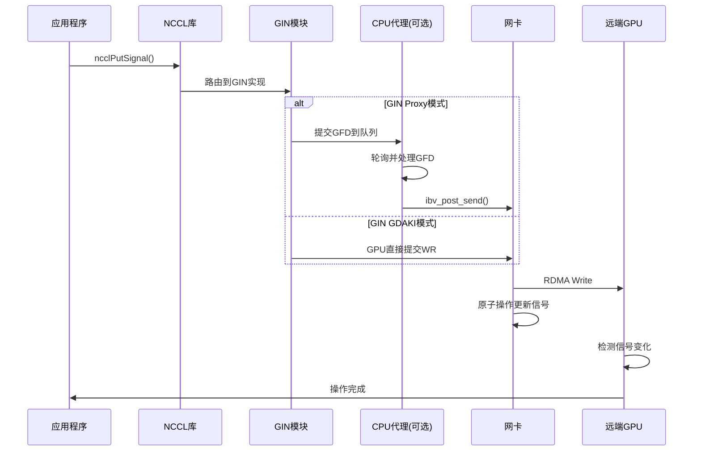

---

# 附录

## A. 环境变量

| 变量 | 描述 | 默认值 |
|------|------|--------|
| NCCL_GIN_ENABLE | 启用/禁用GIN | 1 |
| NCCL_GIN_TYPE | 强制GIN类型 | -1 |
| NCCL_GIN_NCONNECTIONS | GIN连接数 | -2 |
| NCCL_GIN_NCONTEXTS | GIN context数 | -1 |
| NCCL_GIN_SIGNAL_POOL_SIZE | 信号池大小 | 524288 |
| NCCL_GIN_COUNTER_POOL_SIZE | 计数器池大小 | 524288 |
| NCCL_P2P_LEVEL | P2P通信级别 | PIX |
| NCCL_NET_GDR_LEVEL | GDR级别 | PXB |

## B. 调试和日志

NCCL使用分层日志系统，可以通过`NCCL_DEBUG`和`NCCL_DEBUG_SUBSYS`环境变量控制：

```bash
# 启用所有调试信息
export NCCL_DEBUG=TRACE
export NCCL_DEBUG_SUBSYS=ALL

# 仅启用GIN相关调试
export NCCL_DEBUG_SUBSYS=GIN,NET

# 仅启用拓扑相关调试
export NCCL_DEBUG_SUBSYS=GRAPH
```

## C. 参考资料

1. NCCL源代码: `src/init.cc`, `src/graph/topo.cc`, `src/gin/gin_host.cc`
2. NVIDIA GPUDirect文档
3. DOCA GPUNetIO编程指南
4. InfiniBand架构规范
5. NVIDIA NVLink技术白皮书

---

*文档生成时间: 2026-04-05*
*基于NCCL源代码分析*

---

# D. 代理机制详解

## D.1 代理服务架构

NCCL代理是一个独立的服务进程，负责处理GPU和网络之间的数据传输。

```cpp
// 位于 src/proxy.cc
struct ncclProxyState {
  struct ncclProxyArgs* active;       // 活动操作列表
  struct ncclProxyArgs* pool;         // 操作对象池
  struct ncclProxyPool* pools;        // 内存池链表
  
  // 异步操作管理
  struct ncclProxyOps* proxyOps;
  struct ncclExpectedProxyResponse* expectedResponses;
};

struct ncclProxyArgs {
  int done;                           // 完成标志
  uint64_t opCount;                   // 操作计数
  int sliceSteps;                     // 切片步数
  int chunkSteps;                     // 块步数
  int nChannels;                      // 通道数
  int nPeers;                         // 对等节点数
  int nsubs;                          // 子操作数
  ncclProxyOpState_t state;           // 操作状态
  
  struct ncclProxySubArgs subs[NCCL_PROXY_MAX_SUBS];
  struct ncclProxyArgs* next;
  struct ncclProxyArgs* nextPeer;
};
```

## D.2 代理操作流程

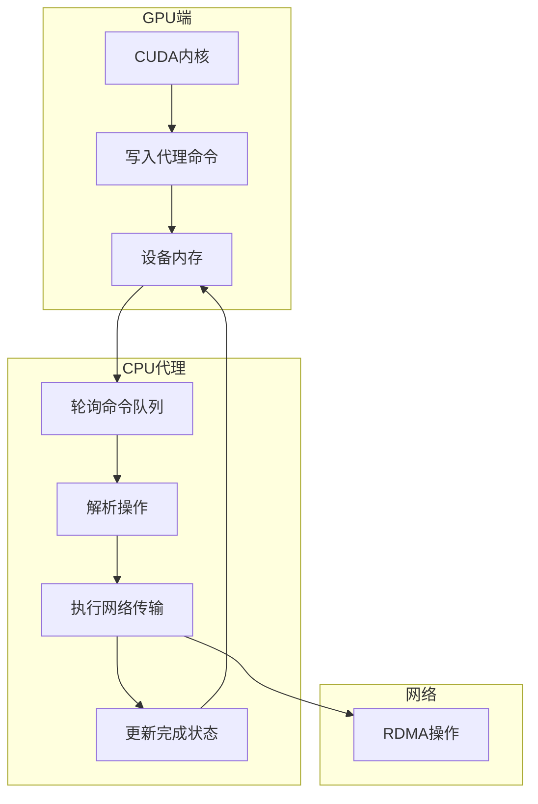

## D.3 代理Append机制

```cpp
// 位于 src/proxy.cc
static ncclResult_t ProxyAppend(struct ncclProxyProgressState* state, struct ncclProxyOp* op) {
  struct ncclProxyConnection* connection = op->connection;
  int shared = connection->shared;
  struct ncclProxyArgs* args = *connection->proxyAppendPtr;

  if (args) {
    if (shared && args->opCount == op->opCount) {
      // 合并到现有操作的子操作
      NCCLCHECK(ncclProxyOpToArgs(op, args, args->nsubs));
    } else {
      // 创建新的对等操作
      struct ncclProxyArgs* prevArgs = args;
      NCCLCHECK(allocateArgs(state, &args));
      NCCLCHECK(ncclProxyOpToArgs(op, args, 0));
      prevArgs->nextPeer = args;
    }
  } else {
    // 创建新的活动操作
    NCCLCHECK(allocateArgs(state, &args));
    NCCLCHECK(ncclProxyOpToArgs(op, args, 0));
    
    if (state->active == NULL) {
      state->active = args;
    } else {
      // 添加到列表末尾
      struct ncclProxyArgs* last = state->active;
      while (last->next) last = last->next;
      last->next = args;
    }
    *args->proxyAppendPtr = args;
  }
}
```

## D.4 代理进度函数

```cpp
// 代理主循环
void* ncclProxyService(void* arg) {
  while (1) {
    // 1. 轮询所有活动操作
    struct ncclProxyArgs* op = state->active;
    while (op) {
      // 执行操作进度函数
      NCCLCHECK(op->progress(state, op));
      
      // 检查操作是否完成
      if (op->done) {
        // 从活动列表移除
        // 回收到对象池
      }
      op = op->next;
    }
    
    // 2. 处理新的代理请求
    // 3. 处理异步操作
  }
}
```

---

# E. 拓扑连接建立详解

## E.1 连接预设

```cpp
// 位于 src/graph/connect.cc
ncclResult_t ncclTopoPreset(struct ncclComm* comm, struct ncclTopoGraph** graphs, 
                            struct ncclTopoRanks* topoRanks) {
  int nChannels = comm->nChannels;
  int localRanks = comm->topo->nodes[GPU].count;
  
  for (int c = 0; c < nChannels; c++) {
    struct ncclChannel* channel = comm->channels + c;
    
    // 初始化通道拓扑
    channel->ring.prev = channel->ring.next = -1;
    channel->tree.up = -1;
    for (int i = 0; i < NCCL_MAX_TREE_ARITY; i++) {
      channel->tree.down[i] = -1;
    }
    
    int* ringIntra = graphs[NCCL_ALGO_RING]->intra + c * localRanks;
    int* treeIntra = graphs[NCCL_ALGO_TREE]->intra + c * localRanks;
    
    // 设置Ring拓扑
    for (int i = 0; i < localRanks; i++) {
      if (ringIntra[i] == rank) {
        topoRanks->ringRecv[c] = ringIntra[0];
        topoRanks->ringSend[c] = ringIntra[localRanks - 1];
        topoRanks->ringPrev[c] = (i == 0) ? -1 : ringIntra[i - 1];
        topoRanks->ringNext[c] = (i == localRanks - 1) ? -1 : ringIntra[i + 1];
      }
    }
    
    // 设置Tree拓扑
    for (int i = 0; i < localRanks; i++) {
      if (treeIntra[i] == rank) {
        channel->tree.up = i == 0 ? -1 : treeIntra[i - 1];
        channel->tree.down[0] = i == localRanks - 1 ? -1 : treeIntra[i + 1];
      }
    }
  }
}
```

## E.2 Ring连接建立

```cpp
static ncclResult_t connectRings(struct ncclComm* comm, int* ringRecv, int* ringSend, 
                                  int* ringPrev, int* ringNext) {
  int nChannels = comm->nChannels;
  int nNodes = comm->nNodes;
  
  for (int c = 0; c < nChannels; c++) {
    for (int n = 0; n < nNodes; n++) {
      int recvRank = ringRecv[c * comm->nNodes + n];
      int prevSendRank = ringSend[c * comm->nNodes + ((n - 1 + nNodes) % nNodes)];
      ringPrev[c * comm->nRanks + recvRank] = prevSendRank;
      
      int sendRank = ringSend[c * comm->nNodes + n];
      int nextRecvRank = ringRecv[c * comm->nNodes + ((n + 1) % nNodes)];
      ringNext[c * comm->nRanks + sendRank] = nextRecvRank;
    }
  }
}
```

### E.2.1 Ring连接示意图

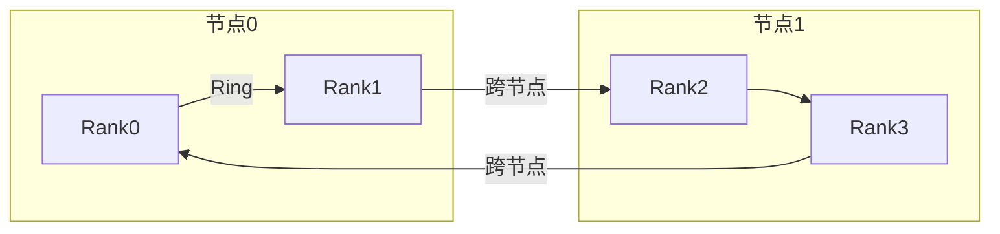

## E.3 Tree连接建立

```cpp
static ncclResult_t connectTrees(struct ncclComm* comm, int* treeToParent, 
                                  int* treeToChild0, int* treeToChild1) {
  const int nChannels = comm->nChannels;
  const int nNodes = comm->nNodes;
  const int node = comm->node;
  
  // 获取双二叉树结构
  int t0u, t0d0, t0d1, t0ChildType;
  int t1u, t1d0, t1d1, t1ChildType;
  NCCLCHECK(ncclGetDtree(nNodes, node, &t0u, &t0d0, &t0d1, &t0ChildType,
                          &t1u, &t1d0, &t1d1, &t1ChildType));
  
  for (int c = 0; c < nChannels; c++) {
    struct ncclChannel* channel0 = comm->channels + c;
    struct ncclChannel* channel1 = channel0 + nChannels;
    
    int* ttp = treeToParent + c * comm->nNodes;
    int* ttc0 = treeToChild0 + c * comm->nNodes;
    int* ttc1 = treeToChild1 + c * comm->nNodes;
    
    // 设置第一棵树的连接
    if (comm->rank == ttp[node]) {
      NCCLCHECK(setTreeUp(&channel0->tree, t0ChildType == 0 ? ttc0 : ttc1, t0u));
    }
    if (comm->rank == ttc0[node]) {
      NCCLCHECK(setTreeDown(&channel0->tree, ttp, t0d0));
    }
    if (comm->rank == ttc1[node]) {
      NCCLCHECK(setTreeDown(&channel0->tree, ttp, t0d1));
    }
    
    // 计算树深度
    int depth = comm->nRanks / nNodes - 1 + log2i(nNodes);
    channel0->tree.depth = channel1->tree.depth = depth;
  }
}
```

## E.4 CollNet连接

```cpp
static ncclResult_t connectCollNet(struct ncclComm* comm, struct ncclTopoGraph* collNetGraph) {
  int localRanks = comm->localRanks;
  int nHeads = 0;
  int* heads;
  
  // 找到所有head ranks
  for (int c = 0; c < collNetGraph->nChannels; c++) {
    int* collNetIntra = collNetGraph->intra + c * localRanks;
    int head = collNetIntra[0];
    // 检查是否已存在
    bool exists = false;
    for (int h = 0; h < nHeads; h++) {
      if (heads[h] == head) exists = true;
    }
    if (!exists) heads[nHeads++] = head;
  }
  
  // 设置每个通道的CollNet连接
  for (int c = 0; c < comm->nChannels; c++) {
    struct ncclChannel* channel = comm->channels + c;
    
    // 检查是否是head
    for (int i = 0; i < nHeads; i++) {
      if (rank == heads[i]) {
        channel->collnetDirect.headRank = i;
        channel->collnetDirect.out = comm->nRanks; // 连接到CollNet根
        // 连接到所有本地peer
        int nDown = 0;
        for (int r = 0; r < localRanks; r++) {
          if (collNetIntra[r] != rank) {
            channel->collnetDirect.down[nDown++] = collNetIntra[r];
          }
        }
        break;
      }
    }
    
    // 连接到所有heads
    int nUp = 0;
    for (int h = 0; h < nHeads; h++) {
      if (rank != heads[h]) {
        channel->collnetDirect.up[nUp++] = heads[h];
      }
    }
    
    channel->collnetDirect.nHeads = nHeads;
    channel->collnetDirect.shift = (rank % localRanks) % nHeads;
  }
}
```

## E.5 NVLS连接

```cpp
static ncclResult_t connectNvls(struct ncclComm* comm, int* nvlsHeads, int nHeads) {
  int headRank = -1;
  
  // 找到本rank的head位置
  for (int h = 0; h < nHeads; h++) {
    if (nvlsHeads[h * comm->nNodes + comm->node] == comm->rank) {
      headRank = h;
    }
  }
  
  for (int c = 0; c < comm->nvlsChannels; c++) {
    struct ncclChannel* channel = comm->channels + c;
    channel->nvls.nHeads = nHeads;
    
    // 设置上行连接到NVSwitch
    for (int h = 0; h < nHeads; h++) {
      channel->nvls.up[h] = comm->nRanks + 1 + h;
    }
    
    // 设置下行连接
    channel->nvls.down = comm->nRanks + 1 + headRank;
    channel->nvls.headRank = headRank;
  }
  
  if (comm->nNodes > 1) {
    // 多节点：建立NVLS树
    int tree0Parent, tree0Child0, tree0Child1;
    int tree1Parent, tree1Child0, tree1Child1;
    NCCLCHECK(ncclGetDtree(comm->nNodes, comm->node,
          &tree0Parent, &tree0Child0, &tree0Child1, &pc0,
          &tree1Parent, &tree1Child0, &tree1Child1, &pc1));
    
    // 设置树的上下行连接
    for (int h = 0; h < nHeads; h++) {
      if (heads[comm->node] == comm->rank) {
        channel->nvls.treeUp[0] = tree0Parent == -1 ? -1 : heads[tree0Parent];
        channel->nvls.treeDown[0][0] = tree0Child0 == -1 ? -1 : heads[tree0Child0];
        channel->nvls.treeDown[0][1] = tree0Child1 == -1 ? -1 : heads[tree0Child1];
      }
    }
  }
}
```

---

# F. 组(Group)操作机制

## F.1 组操作概述

NCCL组操作允许将多个集合通信操作批量执行，提高效率。

```cpp
// 位于 src/group.cc
thread_local int ncclGroupDepth = 0;              // ncclGroupStart嵌套深度
thread_local ncclResult_t ncclGroupError = ncclSuccess;
thread_local struct ncclComm* ncclGroupCommHead[ncclGroupTaskTypeNum] = {nullptr};
thread_local struct ncclIntruQueue<struct ncclAsyncJob, &ncclAsyncJob::next> ncclAsyncJobs;
```

## F.2 组操作流程

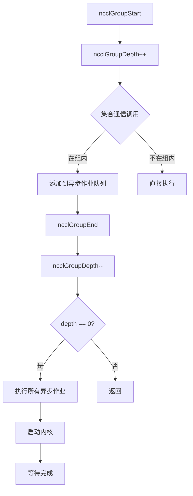

## F.3 异步作业执行

```cpp
// 位于 src/group.cc
ncclResult_t ncclAsyncLaunch(struct ncclAsyncJob* job,
    ncclResult_t(*func)(struct ncclAsyncJob*),
    void(*undo)(struct ncclAsyncJob*),
    void(*destructor)(void*), ncclComm_t comm) {
  
  if (ncclGroupDepth == 0) {
    // 不在组内：直接执行
    ret = func(job);
    if (ret != ncclSuccess && undo) undo(job);
    if (destructor) destructor(job);
  } else {
    // 在组内：添加到作业队列
    job->func = func;
    job->undo = undo;
    job->destructor = destructor;
    job->state = ncclGroupJobRunning;
    ncclIntruQueueEnqueue(&ncclAsyncJobs, job);
  }
}

void* ncclAsyncJobMain(void* arg) {
  struct ncclAsyncJob* job = (struct ncclAsyncJob*)arg;
  job->result = job->func(job);
  COMPILER_ATOMIC_STORE(&job->state, ncclGroupJobDone, std::memory_order_release);
  return arg;
}
```

## F.4 组结束处理

```cpp
static ncclResult_t doLaunches(struct ncclComm* head) {
  struct ncclComm* cliqueHead = head;
  bool useBarrier = ncclParamLaunchMode == ncclLaunchModeGroup;
  
  // 遍历所有clique
  do {
    struct ncclComm* comm = cliqueHead;
    
    // 准备启动
    do {
      NCCLCHECK(ncclLaunchPrepare(comm));
      if (useBarrier) ncclCommIntraBarrierIn(comm, 1);
      comm = comm->groupNext[ncclGroupTaskTypeCollective];
    } while (comm != nullptr && comm->intraComm0 == cliqueHead->intraComm0);
    
    // 执行多轮启动
    while (true) {
      bool moreRounds = false;
      comm = cliqueHead;
      
      do {
        if (moreRounds) {
          // 弹出下一个未启动的内核
          struct ncclKernelPlan* plan = comm->planner.unlaunchedPlansHead;
          if (plan != nullptr) {
            comm->planner.unlaunchedPlansHead = plan->next;
            NCCLCHECK(ncclLaunchKernel(comm, plan));
          }
        } else {
          // 最终轮：完成
          NCCLCHECK(ncclLaunchFinish(comm));
        }
        comm = next;
      } while (comm != cliqueNextHead);
      
      if (!moreRounds) break;
    }
    cliqueHead = cliqueNextHead;
  } while (cliqueHead != nullptr);
}
```

---

# G. GIN Proxy详细实现

## G.1 Proxy Context结构

```cpp
// 位于 src/gin/gin_host_proxy.cc
struct ginProxyCtx {
  struct ncclComm* comm;
  void* collComm;
  ncclNetDeviceHandle_t* devHandle;
  ncclNetProperties_t props;
  
  // GPU队列（GDR时在GPU，否则在CPU）
  struct ginProxyHostGpuCtx* hostGpuCtx;
  
  // 信号和计数器
  uint64_t* counters;
  uint64_t* countersDev;
  uint64_t* signalsDev;
  void* signalsMhandle;
  void* signalsGinHandle;
  
  int nContexts;
  int nCountersPerContext;
  int nSignalsPerContext;
};

struct ginProxyHostGpuCtx {
  int contextId;
  size_t queueSize;
  
  ncclGinProxyGfd_t* queues;      // GFD队列
  uint32_t* cis;                   // 已消费索引
  uint32_t* cisShadow;             // 本地缓存
  uint32_t* sis;                   // 已看到索引
  
  struct ginProxyGfdState* states; // GFD状态
  uint64_t* inlines;               // 内联数据
};
```

## G.2 Proxy进度函数

```cpp
ncclResult_t ncclGinProxyProgress(ncclGin_t* ginComm, void* ginCtx) {
  struct ginProxyCtx* ctx = (struct ginProxyCtx*)ginCtx;
  
  for (int contextId = 0; contextId < ctx->nContexts; contextId++) {
    struct ginProxyHostGpuCtx* hostGpuCtx = ctx->hostGpuCtx + contextId;
    
    // 1. 轮询完成
    NCCLCHECK(proxyGinPollCompletions(ginComm, ctx->collComm, ctx, hostGpuCtx));
    
    // 2. 处理新的GFD
    for (int targetRank = 0; targetRank < ctx->comm->nRanks; targetRank++) {
      ncclGinProxyGfd_t gfd;
      struct ginProxyGfdState* state = NULL;
      
      if (proxyGinPollGfd(ctx, hostGpuCtx, targetRank, &gfd, &state)) {
        NCCLCHECK(proxyGinProcessGfd(ginComm, ctx->collComm, ctx, 
                                      hostGpuCtx, targetRank, &gfd, state));
      }
    }
  }
}
```

## G.3 GFD处理

```cpp
static int proxyGinPollGfd(struct ginProxyCtx* ctx, ginProxyHostGpuCtx* hostGpuCtx, 
                           int targetRank, ncclGinProxyGfd_t* gfd, 
                           struct ginProxyGfdState** state) {
  ncclGinProxyGfd_t* q = hostGpuCtx->queues + targetRank * hostGpuCtx->queueSize;
  uint32_t idx = hostGpuCtx->sis[targetRank] & (hostGpuCtx->queueSize - 1);
  
  // 检查是否有新的GFD
  ncclGinProxyQword_t qword;
  COMPILER_ATOMIC_LOAD_DEST(&q[idx].qword[ncclGinProxyGfdHeader].raw, 
                            &qword.raw, std::memory_order_relaxed);
  if (qword.flag.v == 0) return 0;
  
  // 复制GFD
  gfd->qword[ncclGinProxyGfdHeader] = q[idx].qword[ncclGinProxyGfdHeader];
  for (int k = 1; k < ncclGinProxyGfdQwords; k++) {
    do {
      COMPILER_ATOMIC_LOAD_DEST(&q[idx].qword[k].raw, &qword.raw, 
                                std::memory_order_relaxed);
    } while (qword.flag.v == 0);
    gfd->qword[k] = q[idx].qword[k];
  }
  
  // 重置队列中的GFD
  for (int k = 0; k < ncclGinProxyGfdQwords; k++) {
    COMPILER_ATOMIC_STORE(&q[idx].qword[k].raw, 0, std::memory_order_relaxed);
  }
  
  // 设置状态
  uint32_t stateIdx = targetRank * hostGpuCtx->queueSize + idx;
  *state = &hostGpuCtx->states[stateIdx];
  (*state)->op = (ncclGinProxyOp_t)(gfd->qword[ncclGinProxyGfdHeader].header.op);
  (*state)->counterId = gfd->qword[ncclGinProxyGfdCompletion].completion.counterId;
  (*state)->done = 0;
  (*state)->request = NULL;
  
  hostGpuCtx->sis[targetRank]++;
  return 1;
}
```

## G.4 GFD执行

```cpp
static ncclResult_t proxyGinProcessGfd(ncclGin_t* ginComm, void* collComm, 
                                       struct ginProxyCtx* ctx,
                                       struct ginProxyHostGpuCtx* hostGpuCtx, 
                                       int targetRank, ncclGinProxyGfd_t* gfd, 
                                       struct ginProxyGfdState* state) {
  // 处理VA信号操作（无PUT的纯信号）
  if (gfd->qword[ncclGinProxyGfdHeader].header.op & ncclGinProxyOpVASignal) {
    uint64_t signalOff = gfd->qword[ncclGinProxyGfdVASignalOff].vaSignalOff.vaSignalOff;
    void* signalHandle = (void*)(uint64_t)gfd->qword[ncclGinProxyGfdVASignalHandle].vaSignalHandle.vaSignalHandle;
    uint64_t signalVal = extractSignalVal(gfd);
    int signalOp = mapGfdOpToSignalOp(gfd);
    
    NCCLCHECK(ginComm->iputSignal(collComm, 0, nullptr, 0, 0, nullptr,
                                  targetRank, signalOff, signalHandle, signalVal,
                                  signalOp, hostGpuCtx->contextId, &state->request));
    return ncclSuccess;
  }
  
  // 提取操作参数
  uint64_t size = gfd->qword[ncclGinProxyGfdHeader].header.size;
  uint64_t srcOff, dstOff;
  void *srcHandle, *dstHandle;
  
  if (gfd->qword[ncclGinProxyGfdHeader].header.op & ncclGinProxyOpWithInline) {
    // 内联数据
    uint64_t* inlineVal = &hostGpuCtx->inlines[state - hostGpuCtx->states];
    srcOff = (uint64_t)&inlineVal[0] - (uint64_t)hostGpuCtx->inlines;
    *inlineVal = gfd->qword[ncclGinProxyGfdInlineLow].inlineLow.inlineValLow;
    // 重组内联值
    srcHandle = hostGpuCtx->inlinesMhandle;
  } else {
    srcOff = gfd->qword[ncclGinProxyGfdSrcOff].srcOff.srcOff;
    srcHandle = (void*)(uint64_t)gfd->qword[ncclGinProxyGfdSrcHandle].srcHandle.srcHandle;
  }
  
  dstOff = gfd->qword[ncclGinProxyGfdDstOff].dstOff.dstOff;
  dstHandle = (void*)(uint64_t)gfd->qword[ncclGinProxyGfdDstHandle].dstHandle.dstHandle;
  
  // 执行PUT操作
  int signalOp = mapGfdOpToSignalOp(gfd);
  if (signalOp == -1) {
    // 无信号：简单PUT
    NCCLCHECK(ginComm->iput(collComm, srcOff, srcHandle, size, dstOff, dstHandle,
                            targetRank, hostGpuCtx->contextId, &state->request));
  } else {
    // 带信号PUT
    uint64_t signalVal = extractSignalVal(gfd);
    uint64_t signalOff = (gfd->qword[ncclGinProxyGfdCompletion].completion.signalId +
                          hostGpuCtx->contextId * ctx->nSignalsPerContext) * sizeof(uint64_t);
    NCCLCHECK(ginComm->iputSignal(collComm, srcOff, srcHandle, size, dstOff, dstHandle,
                                  targetRank, signalOff, ctx->signalsGinHandle, signalVal,
                                  signalOp, hostGpuCtx->contextId, &state->request));
  }
}
```

---

*文档生成时间: 2026-04-05*
*基于NCCL源代码分析*
