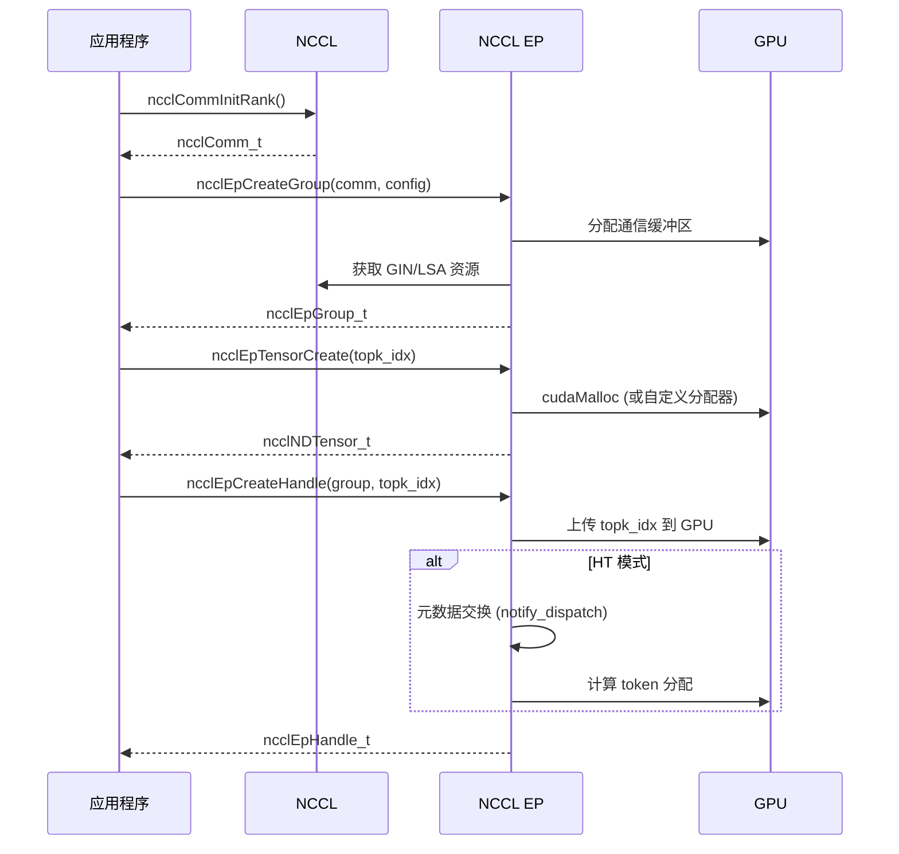
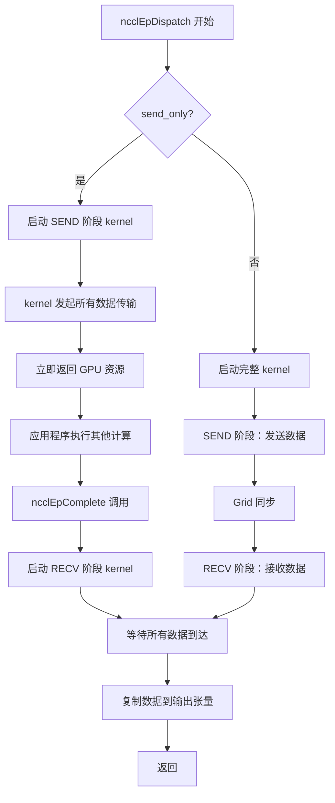
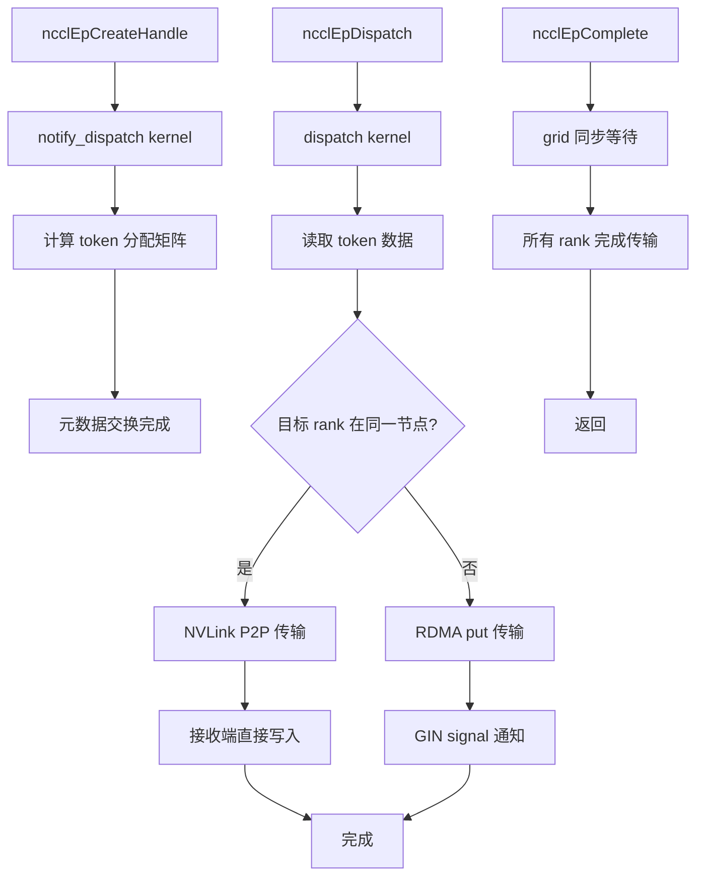
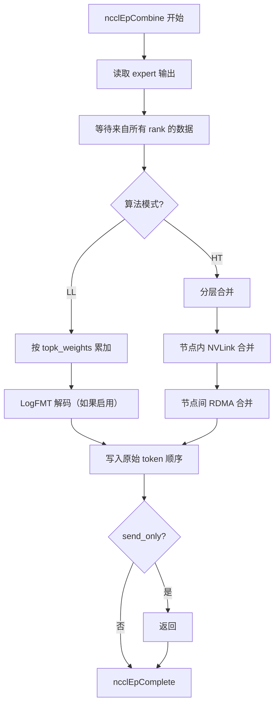
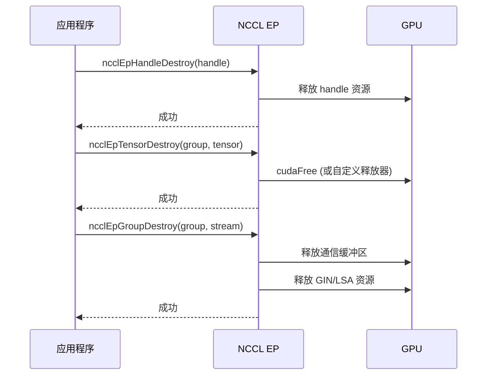
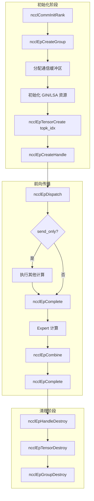
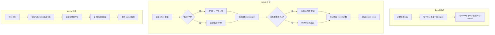
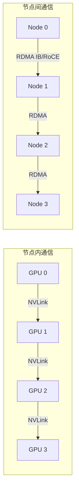
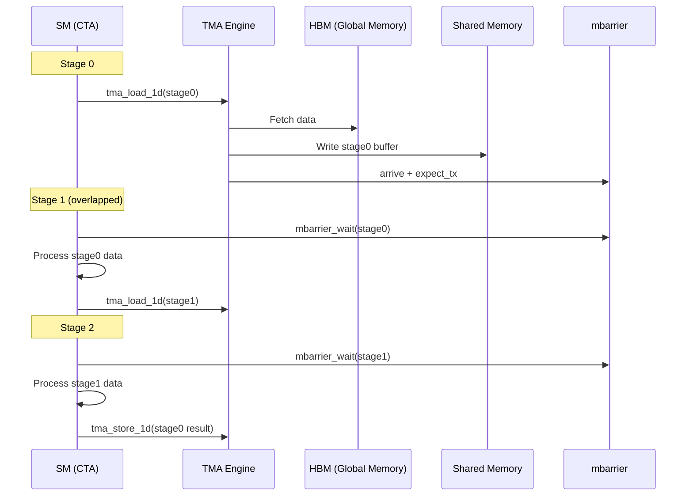

# NCCL EP (Expert Parallelism) 模块深度分析文档

> 本文档对 NCCL EP 模块进行完整、详尽的分析，覆盖所有源文件、内核实现、API 设计和构建系统。

---

## 目录

1. [模块功能概述](#1-模块功能概述)
2. [设计初衷、架构选择和权衡分析](#2-设计初衷架构选择和权衡分析)
3. [详细的实现原理和机制](#3-详细的实现原理和机制)
4. [完整的流程步骤](#4-完整的流程步骤)
5. [每个源文件的详细分析](#5-每个源文件的详细分析)
6. [设备端 kernel 实现分析](#6-设备端-kernel-实现分析)
7. [Python 绑定分析](#7-python-绑定分析)
8. [关键流程 Mermaid 流程图](#8-关键流程-mermaid-流程图)
9. [正确性验证和逻辑完备性检查](#9-正确性验证和逻辑完备性检查)
10. [构建系统和集成方式](#10-构建系统和集成方式)

---

## 1. 模块功能概述

### 1.1 核心功能

NCCL EP 是一个高性能的 NCCL API 扩展，专为 Mixture-of-Experts (MoE) 架构的高效通信而设计。该模块在 NCCL Device API（LSA 和 GIN 操作）之上实现，提供两个核心原语：

1. **Dispatch（分发）**：将 token 发送到对应的专家处理器
2. **Combine（合并）**：将专家输出按原始 token 顺序合并返回

### 1.2 支持的算法模式

| 模式 | 全称 | 适用场景 | 特点 |
|------|------|----------|------|
| **LL** | Low Latency | 小批量、延迟敏感（推理） | 直接 P2P All-to-All 通信 |
| **HT** | High Throughput | 大批量训练/预填充 | 分层通信（NVLink 节点内 + RDMA 节点间） |

### 1.3 关键特性

- **分阶段执行**（仅 LL 模式）：通过 `send_only` 标志实现计算/通信重叠
- **自动调优**：缓冲区大小、QP 数量、通道数自动配置
- **类型转换**：支持 FP8/BF16 精度转换
- **自定义分配器**：支持内存池和框架特定分配器

### 1.4 模块文件结构

```
contrib/nccl_ep/
├── nccl_ep.cc                    # 主入口，Host 端 API 实现
├── include/
│   ├── nccl_ep.h                 # 公共 C API 头文件
│   └── common.hpp                # 通用定义和宏
├── device/
│   ├── hybrid_ep.cuh             # HT 模式核心 kernel 模板
│   ├── hybridep_adapter.cu       # HT 适配器实现
│   ├── hybridep_adapter.cuh      # HT 适配器头文件
│   ├── hybridep_configs.cuh      # HT 配置常量
│   ├── device_primitives.cuh     # 设备端原语（TMA、barrier 等）
│   ├── low_latency.cu            # LL 模式 kernel 实现
│   ├── macros.cuh                # 宏定义
│   └── cuda_compat_shims.cuh     # CUDA 兼容层
├── ep_test.cu                    # 功能测试
├── ep_bench.cu                   # 性能基准测试
├── CMakeLists.txt                # CMake 构建配置
├── Makefile                      # Make 构建配置
├── README.md                     # 使用说明
├── RELEASE.md                    # 发布说明
└── python/
    ├── nccl_ep/
    │   ├── __init__.py           # Python 包初始化
    │   └── nccl_wrapper.py       # ctypes 绑定实现
    └── pyproject.toml            # Python 包配置
```

---

## 2. 设计初衷、架构选择和权衡分析

### 2.1 设计初衷

MoE（Mixture-of-Experts）架构在现代大语言模型中广泛使用（如 DeepSeek-V3、Mixtral 等）。这种架构的核心特点是：

1. **稀疏激活**：每个 token 只路由到少量专家（top-k）
2. **专家并行**：专家分布在不同 GPU 上
3. **All-to-All 通信**：每个 rank 可能需要与所有其他 rank 通信

传统的集合通信原语（AllReduce、AllGather）无法直接表达这种模式，而现有的 MoE 库（如 DeepSpeed、FasterMoE）通常需要额外的依赖。

**NCCL EP 的目标**：将高性能 MoE 通信原语集成到 NCCL 生态系统中，利用 NCCL 的拓扑检测和插件架构，提供统一 API。

### 2.2 架构选择

#### 2.2.1 双算法模式

| 维度 | Low Latency (LL) | High Throughput (HT) |
|------|------------------|---------------------|
| **目标场景** | 推理、小批量 | 训练、大批量预填充 |
| **通信模式** | 直接 P2P All-to-All | 分层（节点内 NVLink + 节点间 RDMA）|
| **数据布局** | 3D expert-major | 2D token-major |
| **延迟优先** | 是 | 否 |
| **吞吐量优先** | 否 | 是 |

#### 2.2.2 基于 NCCL Device API

NCCL EP 构建在两个 NCCL Device API 之上：

1. **LSA (Load-Store Accessible)**：用于 NVLink P2P 通信
   - `ncclGetPeerPointer()` 获取对端缓冲区指针
   - 直接 load/store 操作，无需 CPU 参与

2. **GIN (GPU-Initiated Networking)**：用于 RDMA 通信
   - `ncclGin::put()` 发起 RDMA 写操作
   - `ncclGin::readSignal()` / `resetSignal()` 信号同步

#### 2.2.3 资源管理层次

```
ncclEpGroup_t (EP Group)
    ├── 管理一组 rank 的 EP 配置
    ├── 持有通信缓冲区（发送/接收）
    └── 关联 ncclComm_t

ncclEpHandle_t (EP Handle)
    ├── 单次 dispatch/combine 操作的上下文
    ├── 缓存路由信息（topk_idx）
    └── 可复用于多次前向/反向传播
```

### 2.3 权衡分析

#### 2.3.1 LL vs HT 模式选择

**选择 LL 模式当：**
- 批量小（< 512 tokens per rank）
- 延迟敏感（推理场景）
- 需要分阶段执行（send_only + complete）

**选择 HT 模式当：**
- 批量大（>= 4096 tokens per rank）
- 追求吞吐量（训练场景）
- 多节点扩展

#### 2.3.2 数据布局权衡

**3D Expert-Major（LL 模式）**：
- 优点：专家计算时内存访问连续
- 缺点：需要额外的重组步骤

**2D Token-Major（HT 模式）**：
- 优点：与标准神经网络张量布局一致
- 缺点：专家计算需要 gather/scatter

#### 2.3.3 FP8 vs BF16 权衡

- **BF16**：无精度损失，简单直接
- **FP8**：带宽减半，但需要：
  - 在线量化/反量化
  - Scale factor 传输
  - 精度损失容忍

---

## 3. 详细的实现原理和机制

### 3.1 核心数据结构

#### 3.1.1 ncclNDTensor_t

```c
typedef struct {
    unsigned int version;           // 结构版本（设为 1）
    unsigned int ndim;              // 维度数
    unsigned int* sizes;            // 各维度大小 [ndim]
    unsigned int* strides;          // 各维度步长（元素为单位）[ndim]
    ncclDataType_t datatype;        // 数据类型
    void* data;                     // 数据指针
    unsigned int tag;               // 张量标签（标识用途）
    ncclEpTensorFlags_t flags;      // 标志位
} ncclNDTensor_t;
```

**标签（tag）用途**：API 通过标签识别张量用途：
- `NCCL_EP_TENSOR_TAG_TOKENS`：token 数据
- `NCCL_EP_TENSOR_TAG_TOPK_IDX`：top-k 专家索引
- `NCCL_EP_TENSOR_TAG_TOPK_WEIGHTS`：top-k 权重
- `NCCL_EP_TENSOR_TAG_SCALES`：FP8 缩放因子
- `NCCL_EP_TENSOR_TAG_RECV_EXPERT_COUNTER_DEVICE/HOST`：接收计数器

#### 3.1.2 ncclEpGroupConfig_t

```c
typedef struct {
    unsigned int version;               // 版本号
    ncclEpAlgorithm_t algorithm;        // LL 或 HT
    unsigned int num_experts;           // 总专家数
    unsigned int max_tokens_per_rank;   // 每 rank 最大 token 数
    unsigned int token_size_bytes;      // token 大小（字节）
    unsigned long rdma_buffer_size;     // RDMA 缓冲区大小（0=自动）
    unsigned int num_qp_per_rank;       // 每 rank QP 数（0=自动）
    unsigned int num_channels;          // 通道数（0=自动）
} ncclEpGroupConfig_t;
```

#### 3.1.3 ncclEpHandle_t（内部实现）

```cpp
struct ncclEpHandle {
    ncclEpGroup* group;
    
    // 路由信息
    ncclNDTensor_t topk_idx;
    int* expert_counts;           // 每个专家接收的 token 数
    int64_t* layout;              // 布局信息
    
    // 通信缓冲区
    void* send_buffer;
    void* recv_buffer;
    int* recv_count_buffer;
    
    // GIN 相关
    ncclDevComm* dev_comms;
    ncclWindow_t* windows;
    unsigned signals_base;
    
    // 状态
    bool use_fp8;
    bool send_only;
};
```

### 3.2 LL 模式实现原理

#### 3.2.1 Dispatch Kernel 工作流程

```
每个 SM 处理一组 expert：
1. 读取 topk_idx，统计每个 expert 的 token 数
2. 将 BF16 数据转换为 FP8（如果启用）
3. 计算目标 rank 和本地 expert 索引
4. 通过 NVLink P2P 或 RDMA 发送数据
5. 发送 expert count 通知
```

**关键优化**：
- Warp 级别协作：一个 warp 处理一个 token
- 原子计数：`atomicAdd(expertCnt + dstExpertIdx, 1)` 获取 slot
- 信号同步：RDMA 使用 GIN signal，NVLink 使用 release/acquire 语义

#### 3.2.2 Combine Kernel 工作流程

```
每个 SM 处理一组 expert：
1. 等待来自源 rank 的完成信号
2. 读取接收到的 expert 输出
3. 按 top-k 权重累加
4. 将结果写回原始 token 位置
```

**LogFMT 压缩**（可选）：
- 在线压缩 BF16 → 10-bit log 编码
- 带宽节省 ~37.5%
- 适用于分布均匀的数据

### 3.3 HT 模式实现原理

#### 3.3.1 分层通信模式

```
┌─────────────────────────────────────────────────────────────┐
│                        Node 0                                │
│  ┌─────┐ ┌─────┐ ┌─────┐ ┌─────┐ ┌─────┐ ┌─────┐ ┌─────┐ ┌─────┐
│  │GPU 0│ │GPU 1│ │GPU 2│ │GPU 3│ │GPU 4│ │GPU 5│ │GPU 6│ │GPU 7│
│  └──┬──┘ └──┬──┘ └──┬──┘ └──┬──┘ └──┬──┘ └──┬──┘ └──┬──┘ └──┬──┘
│     │       │       │       │       │       │       │       │
│     └───────┴───────┴───────┴───────┴───────┴───────┴───────┘
│                         NVLink                               │
└──────────────────────────────┬──────────────────────────────┘
                               │ RDMA (IB/RoCE)
┌──────────────────────────────┼──────────────────────────────┐
│                         NVLink│                              │
│     ┌───────┬───────┬───────┬─┴───┬───────┬───────┬───────┬─┐
│     │       │       │       │     │       │       │       │ │
│  ┌──┴──┐ ┌──┴──┐ ┌──┴──┐ ┌──┴──┐ ┌──┴──┐ ┌──┴──┐ ┌──┴──┐ ┌──┴──┐
│  │GPU 0│ │GPU 1│ │GPU 2│ │GPU 3│ │GPU 4│ │GPU 5│ │GPU 6│ │GPU 7│
│  └─────┘ └─────┘ └─────┘ └─────┘ └─────┘ └─────┘ └─────┘ └─────┘
│                        Node 1                                │
└─────────────────────────────────────────────────────────────┘
```

#### 3.3.2 HT Dispatch 阶段

1. **Notify Dispatch**（handle 创建时）：
   - 交换 topk_idx 元数据
   - 计算每个 rank 的 token 分配

2. **数据传输**：
   - 节点内：NVLink 直接 P2P
   - 节点间：RDMA put 操作

#### 3.3.3 TMA 加速

HT 模式利用 Hopper 架构的 TMA（Tensor Memory Accelerator）：

```cpp
// TMA 加载和到达
tma_load_1d(tmaBuffers[stageIdx], gmemPtr, fullBarriers[stageIdx], numBytes);
mbarrier_arrive_and_expect_tx(fullBarriers[stageIdx], numBytes);

// 等待 TMA 完成
mbarrier_wait<true>(fullBarriers[stageIdx], tmaPhase, stageIdx);

// TMA 存储
tma_store_1d(tmaBuffers[stageIdx], dstPtr, numBytes);
```

### 3.4 同步机制

#### 3.4.1 NVLink 同步（LL 模式）

```cpp
// 写端：release 语义
st_release_sys_global(reinterpret_cast<int*>(dstP2pPtr), value);

// 读端：acquire 语义
while (ld_acquire_sys_global(recvCntBuf + idx) == 0);
```

#### 3.4.2 RDMA 同步（GIN）

```cpp
// 发送端：带 signal 的 put
net.put(world, dstRank, ncclWindow, dstOffset, ncclWindow, srcOffset,
        numBytes, ncclGin_SignalAdd{signalId, value}, ncclGin_None{},
        ncclCoopThread());

// 接收端：轮询 signal
do {
    curValue = net.readSignal(signalId);
} while (curValue < threshold && !timeout);
net.resetSignal(signalId);
```

---

## 4. 完整的流程步骤

### 4.1 初始化流程



### 4.2 Dispatch 流程（LL 模式）



### 4.3 Dispatch 流程（HT 模式）



### 4.4 Combine 流程



### 4.5 资源释放流程



---

## 5. 每个源文件的详细分析

### 5.1 nccl_ep.cc（主入口）

**职责**：Host 端 API 实现，资源管理，内核启动

#### 5.1.1 关键函数

##### ncclEpCreateGroup

```cpp
ncclResult_t ncclEpCreateGroup(
    ncclEpGroup_t* ep_group,
    ncclComm_t comm,
    const ncclEpGroupConfig_t* config,
    cudaStream_t stream,
    ncclEpAllocFn_t alloc_fn,
    ncclEpFreeFn_t free_fn
) {
    // 1. 验证配置
    EP_VERIFY(config->algorithm == NCCL_EP_ALGO_LOW_LATENCY || 
              config->algorithm == NCCL_EP_ALGO_HIGH_THROUGHPUT);
    
    // 2. 创建 ncclEpGroup 对象
    ncclEpGroup* group = new ncclEpGroup();
    group->comm = comm;
    group->algorithm = config->algorithm;
    group->num_experts = config->num_experts;
    
    // 3. 获取 NCCL 设备资源
    NCCLCHECK(ncclCommGetCuDevice(comm, &group->cu_device));
    NCCLCHECK(ncclCommGetDevComm(comm, &group->dev_comm));
    
    // 4. 分配通信缓冲区
    size_t buffer_size = calculate_buffer_size(config);
    group->alloc_fn = alloc_fn ? alloc_fn : default_alloc;
    group->free_fn = free_fn ? free_fn : default_free;
    
    group->alloc_fn(&group->send_buffer, buffer_size);
    group->alloc_fn(&group->recv_buffer, buffer_size);
    
    // 5. 初始化 GIN 资源（用于 RDMA）
    if (config->algorithm == NCCL_EP_ALGO_LOW_LATENCY) {
        init_gin_resources(group, config);
    }
    
    *ep_group = group;
    return ncclSuccess;
}
```

##### ncclEpCreateHandle

```cpp
ncclResult_t ncclEpCreateHandle(
    ncclEpHandle_t* handle,
    ncclEpGroup_t ep_group,
    const ncclNDTensor_t* topk_idx,
    ncclNDTensor_t* const* local_tensors,
    unsigned int num_local_tensors,
    const ncclEpHandleConfig_t* config,
    cudaStream_t stream,
    bool use_fp8
) {
    ncclEpGroup* group = (ncclEpGroup*)ep_group;
    ncclEpHandle* h = new ncclEpHandle();
    
    h->group = group;
    h->use_fp8 = use_fp8;
    
    // 1. 复制 topk_idx 到内部存储
    h->topk_idx = *topk_idx;
    
    // 2. 分配工作空间
    h->expert_counts = allocate_expert_counts(group->num_experts);
    h->layout = allocate_layout(group->num_experts, group->num_ranks);
    
    // 3. HT 模式：执行 notify_dispatch
    if (group->algorithm == NCCL_EP_ALGO_HIGH_THROUGHPUT) {
        // 启动 notify_dispatch kernel 计算元数据
        launch_notify_dispatch(h, stream);
        
        // 处理 local_tensors（recv_expert_counter）
        if (num_local_tensors > 0) {
            process_local_tensors(h, local_tensors, num_local_tensors);
        }
    }
    
    *handle = h;
    return ncclSuccess;
}
```

##### ncclEpDispatch

```cpp
ncclResult_t ncclEpDispatch(
    ncclEpHandle_t handle,
    const ncclNDTensor_t* const* inputs,
    unsigned int num_inputs,
    ncclNDTensor_t* const* outputs,
    unsigned int num_outputs,
    ncclNDTensor_t* const* local_tensors,
    unsigned int num_local_tensors,
    unsigned int send_only,
    const ncclEpDispatchConfig_t* config,
    cudaStream_t stream
) {
    ncclEpHandle* h = (ncclEpHandle*)handle;
    ncclEpGroup* group = h->group;
    
    // 1. 验证张量
    verify_tensors(inputs, num_inputs, outputs, num_outputs);
    
    // 2. 设置 phases 标志
    int phases = 0;
    if (send_only) {
        phases = LOW_LATENCY_SEND_PHASE;
    } else {
        phases = LOW_LATENCY_SEND_PHASE | LOW_LATENCY_RECV_PHASE;
    }
    
    // 3. 根据算法选择 kernel
    if (group->algorithm == NCCL_EP_ALGO_LOW_LATENCY) {
        internode_ll::dispatch(
            inputs[0]->data,           // inData
            (const int64_t*)h->topk_idx.data,  // inTopkIdx
            outputs[0]->data,          // outDataBuf
            /* ... */,
            h->use_fp8,
            h->use_fp8 ? config->round_scales : false,
            h->use_ue8m0,
            phases,
            /* ... */,
            h->workspace,
            group->num_sms,
            stream
        );
    } else {
        // HT 模式使用 hybrid_ep
        hybrid_ep::dispatch(
            /* ... */
        );
    }
    
    h->send_only = send_only;
    return ncclSuccess;
}
```

### 5.2 include/nccl_ep.h（公共 API 头文件）

**职责**：定义公共 C API 接口

#### 5.2.1 关键枚举和结构体

```c
// 算法类型
typedef enum {
    NCCL_EP_ALGO_LOW_LATENCY = 0,
    NCCL_EP_ALGO_HIGH_THROUGHPUT = 1
} ncclEpAlgorithm_t;

// 张量标签
typedef enum {
    NCCL_EP_TENSOR_TAG_NONE = 0,
    NCCL_EP_TENSOR_TAG_TOKENS = 1,
    NCCL_EP_TENSOR_TAG_TOPK_IDX = 2,
    NCCL_EP_TENSOR_TAG_TOPK_WEIGHTS = 3,
    NCCL_EP_TENSOR_TAG_SCALES = 4,
    NCCL_EP_TENSOR_TAG_RECV_EXPERT_COUNTER_DEVICE = 5,
    NCCL_EP_TENSOR_TAG_RECV_EXPERT_COUNTER_HOST = 6,
    NCCL_EP_TENSOR_TAG_TOKENS_PER_EXPERTS = 7
} ncclEpTensorTag_t;

// 分配器回调类型
typedef cudaError_t (*ncclEpAllocFn_t)(void** ptr, size_t size);
typedef cudaError_t (*ncclEpFreeFn_t)(void* ptr);

// 自动配置常量
#define NCCL_EP_AUTO 0
```

#### 5.2.2 API 函数声明

```c
// Group 管理
ncclResult_t ncclEpCreateGroup(
    ncclEpGroup_t* ep_group,
    ncclComm_t comm,
    const ncclEpGroupConfig_t* config,
    cudaStream_t stream,
    ncclEpAllocFn_t alloc_fn,
    ncclEpFreeFn_t free_fn
);

ncclResult_t ncclEpGroupDestroy(ncclEpGroup_t ep_group, cudaStream_t stream);

// Tensor 管理
ncclResult_t ncclEpTensorCreate(
    ncclEpGroup_t ep_group,
    ncclNDTensor_t* tensor,
    unsigned int ndim,
    ncclDataType_t datatype,
    ncclEpTensorTag_t tag,
    unsigned int size0, ...
);

ncclResult_t ncclEpTensorDestroy(ncclEpGroup_t ep_group, ncclNDTensor_t* tensor);

// Handle 管理
ncclResult_t ncclEpCreateHandle(
    ncclEpHandle_t* handle,
    ncclEpGroup_t ep_group,
    const ncclNDTensor_t* topk_idx,
    ncclNDTensor_t* const* local_tensors,
    unsigned int num_local_tensors,
    const ncclEpHandleConfig_t* config,
    cudaStream_t stream,
    bool use_fp8
);

ncclResult_t ncclEpHandleDestroy(ncclEpHandle_t handle);
ncclResult_t ncclEpHandleGetNumRecvTokens(ncclEpHandle_t handle, unsigned int* num_recv_tokens);

// 通信操作
ncclResult_t ncclEpDispatch(
    ncclEpHandle_t handle,
    const ncclNDTensor_t* const* inputs,
    unsigned int num_inputs,
    ncclNDTensor_t* const* outputs,
    unsigned int num_outputs,
    ncclNDTensor_t* const* local_tensors,
    unsigned int num_local_tensors,
    unsigned int send_only,
    const ncclEpDispatchConfig_t* config,
    cudaStream_t stream
);

ncclResult_t ncclEpCombine(
    ncclEpHandle_t handle,
    const ncclNDTensor_t* const* inputs,
    unsigned int num_inputs,
    ncclNDTensor_t* const* outputs,
    unsigned int num_outputs,
    ncclNDTensor_t* const* local_tensors,
    unsigned int num_local_tensors,
    unsigned int send_only,
    const ncclEpCombineConfig_t* config,
    cudaStream_t stream
);

ncclResult_t ncclEpComplete(
    ncclEpHandle_t handle,
    const ncclEpCompleteConfig_t* config,
    cudaStream_t stream
);
```

### 5.3 include/common.hpp（通用定义）

**职责**：共享的宏、常量、工具函数

#### 5.3.1 关键宏定义

```cpp
// 静态断言
#define EP_STATIC_ASSERT(cond, msg) static_assert(cond, msg)

// 设备断言（debug 模式）
#if defined(NDEBUG)
#define EP_DEVICE_ASSERT(cond) ((void)0)
#else
#define EP_DEVICE_ASSERT(cond) assert(cond)
#endif

// 主机断言
#define EP_HOST_ASSERT(cond) assert(cond)

// 常量
constexpr int MAX_NCCL_GIN_CTX_PER_COMM = 8;
constexpr int NUM_TIMEOUT_CYCLES = 1000000000;  // ~1ms @ 1GHz
constexpr int NUM_WORKSPACE_BYTES = 4096;
constexpr int FINISHED_SUM_TAG = 0x7FFFFFFF;
constexpr float kFP8Margin = 1.0f;
```

#### 5.3.2 工具函数

```cpp
// 向上取整除法
template<typename T>
__host__ __device__ constexpr T ceil_div(T a, T b) {
    return (a + b - 1) / b;
}

// 对齐
template<typename T>
__host__ __device__ constexpr T align(T value, T alignment) {
    return (value + alignment - 1) & ~(alignment - 1);
}

// Pack/Unpack 两个值
template<typename T1, typename T2>
__host__ __device__ T2 pack2(T1 a, T1 b) {
    return (static_cast<T2>(a) << 32) | static_cast<T2>(b);
}

template<typename T1, typename T2>
__host__ __device__ void unpack2(T2 packed, T1& a, T1& b) {
    a = static_cast<T1>(packed >> 32);
    b = static_cast<T1>(packed & 0xFFFFFFFF);
}
```

### 5.4 device/hybrid_ep.cuh（HT 模式核心）

**职责**：High Throughput 模式的核心 kernel 模板

#### 5.4.1 dispatch kernel 模板

```cpp
template <typename T,  // 数据类型（BF16 或 FP8）
          int kHidden,  // hidden 维度（编译时常量）
          int kNumWarps,  // 每 CTA 的 warp 数
          typename BarrierGroupFn,  // barrier 分组函数
          typename GetRecvBufferFn,  // 获取接收缓冲区函数
          typename GetSendBufferFn>  // 获取发送缓冲区函数
__global__ void dispatch_kernel(
    // 输入
    const T* __restrict__ in_tokens,      // [num_tokens, hidden]
    const int64_t* __restrict__ topk_idx, // [num_tokens, top_k]
    const float* __restrict__ topk_weights, // [num_tokens, top_k]
    
    // 输出
    T* __restrict__ out_tokens,           // [num_recv_tokens, hidden]
    float* __restrict__ out_topk_weights, // [num_recv_tokens, top_k]
    int64_t* __restrict__ out_topk_idx,   // [num_recv_tokens, top_k]
    
    // 配置
    const int* __restrict__ token_assignment, // [num_experts, num_ranks]
    const int num_tokens,
    const int top_k,
    const int num_experts,
    const int num_ranks,
    const int rank,
    
    // 通信资源
    ncclDevComm* dev_comms,
    const ncclWindow_t* windows
) {
    // ... kernel 实现
}
```

#### 5.4.2 combine kernel 模板

```cpp
template <typename T,
          int kHidden,
          int kNumWarps,
          typename GetSendBufferFn,
          typename GetRecvBufferFn>
__global__ void combine_kernel(
    // 输入
    const T* __restrict__ in_tokens,       // [num_recv_tokens, hidden]
    const float* __restrict__ in_topk_weights, // [num_recv_tokens, top_k]
    const int64_t* __restrict__ in_topk_idx,   // [num_recv_tokens, top_k]
    
    // 输出
    T* __restrict__ out_tokens,            // [num_tokens, hidden]
    float* __restrict__ out_topk_weights,  // [num_tokens, top_k]
    
    // 配置
    const int num_tokens,
    const int top_k,
    const int rank,
    
    // 通信资源
    ncclDevComm* dev_comms,
    const ncclWindow_t* windows
) {
    // ... kernel 实现
}
```

### 5.5 device/hybridep_adapter.cu/.cuh（HT 适配器）

**职责**：将 HT kernel 适配到 NCCL EP API

#### 5.5.1 HybridepAdapter 类

```cpp
class HybridepAdapter {
public:
    HybridepAdapter(ncclEpGroup* group, ncclEpHandle* handle);
    ~HybridepAdapter();
    
    // 执行 dispatch
    void dispatch(
        const ncclNDTensor_t* const* inputs,
        unsigned int num_inputs,
        ncclNDTensor_t* const* outputs,
        unsigned int num_outputs,
        cudaStream_t stream
    );
    
    // 执行 combine
    void combine(
        const ncclNDTensor_t* const* inputs,
        unsigned int num_inputs,
        ncclNDTensor_t* const* outputs,
        unsigned int num_outputs,
        cudaStream_t stream
    );
    
private:
    ncclEpGroup* group_;
    ncclEpHandle* handle_;
    
    // Kernel 配置
    int num_sms_;
    int num_warps_per_cta_;
    
    // 内部缓冲区
    void* workspace_;
    size_t workspace_size_;
};
```

### 5.6 device/hybridep_configs.cuh（HT 配置）

**职责**：HT 模式的配置常量

```cpp
// Hidden 维度支持的取值
#define SWITCH_HIDDEN_CASE(hidden) \
    case 4096: \
    case 5120: \
    case 6144: \
    case 7168: \
    case 8192: \
    case 9216: \
    case 10240: \
    case 11264: \
    case 12288: \
    case 14336: \
    case 16384

// 最大支持值
constexpr int MAX_SUPPORTED_TOKENS_PER_RANK = 4096;
constexpr int MAX_NUM_EXPERTS = 256;
constexpr int MAX_TOP_K = 9;

// TMA 配置
constexpr int NUM_TMA_STAGES = 3;
constexpr int NUM_TMA_PREFETCH = 1;
```

### 5.7 device/device_primitives.cuh（设备原语）

**职责**：底层 CUDA 原语封装

#### 5.7.1 TMA 操作

```cpp
// TMA 1D 加载
__device__ __forceinline__ void tma_load_1d(
    void* smem_ptr,
    const void* gmem_ptr,
    uint64_t* barrier,
    size_t num_bytes
) {
    uint64_t tma_desc[4];
    create_tma_descriptor_1d(tma_desc, gmem_ptr, num_bytes);
    cp_async_bulk_tensor_1d(smem_ptr, tma_desc, barrier);
}

// TMA 1D 存储
__device__ __forceinline__ void tma_store_1d(
    void* smem_ptr,
    void* gmem_ptr,
    size_t num_bytes
) {
    uint64_t tma_desc[4];
    create_tma_descriptor_1d(tma_desc, gmem_ptr, num_bytes);
    cp_async_bulk_tensor_1d_global(gmem_ptr, tma_desc, smem_ptr);
}

// TMA 存储 fence
__device__ __forceinline__ void tma_store_fence() {
    asm volatile("fence.proxy.async::generic; commit; \n" ::: "memory");
}

// TMA 存储 wait
template <int kMinCommitCount>
__device__ __forceinline__ void tma_store_wait() {
    asm volatile("cp.async.wait_group %0; \n" :: "n"(kMinCommitCount) : "memory");
}
```

#### 5.7.2 mbarrier 操作

```cpp
// 初始化 barrier
__device__ __forceinline__ void mbarrier_init(uint64_t* barrier, uint32_t count) {
    asm volatile("mbarrier.init.shared.b64 [%0], %1; \n" 
                 :: "r"(barrier), "r"(count) : "memory");
}

// 使 barrier 无效
__device__ __forceinline__ void mbarrier_inval(uint64_t* barrier) {
    asm volatile("mbarrier.inval.shared.b64 [%0]; \n" 
                 :: "r"(barrier) : "memory");
}

// 等待 barrier
template <bool kIsShared>
__device__ __forceinline__ void mbarrier_wait(
    uint64_t* barrier, 
    uint32_t& phase,
    int barrier_id
) {
    uint32_t state = 0;
    if constexpr (kIsShared) {
        asm volatile(
            "{\n\t"
            ".reg .pred P; \n\t"
            "mbarrier.try_wait.parity.shared.b64 P, [%1], %2; \n\t"
            "selp.b32 %0, 1, 0, P; \n\t"
            "}"
            : "=r"(state)
            : "r"(barrier), "r"(phase)
            : "memory"
        );
    }
    // ... 全局内存版本
}

// arrive + expect_tx
__device__ __forceinline__ void mbarrier_arrive_and_expect_tx(
    uint64_t* barrier,
    size_t tx_count
) {
    asm volatile(
        "mbarrier.arrive.expect_tx.relaxed.cta.shared.b64 _, [%0], %1; \n"
        :: "r"(barrier), "l"(tx_count)
        : "memory"
    );
}
```

#### 5.7.3 Warp 级别归约

```cpp
// Warp 最大值归约
template <int kNumLanes = 32>
__device__ __forceinline__ float warp_reduce_max(float val) {
    #pragma unroll
    for (int mask = kNumLanes / 2; mask > 0; mask /= 2) {
        val = fmaxf(val, __shfl_xor_sync(0xffffffff, val, mask));
    }
    return val;
}

// Warp 最小值归约
template <int kNumLanes = 32>
__device__ __forceinline__ float warp_reduce_min(float val) {
    #pragma unroll
    for (int mask = kNumLanes / 2; mask > 0; mask /= 2) {
        val = fminf(val, __shfl_xor_sync(0xffffffff, val, mask));
    }
    return val;
}

// Warp 求和归约
template <int kNumLanes = 32>
__device__ __forceinline__ float warp_reduce_sum(float val) {
    #pragma unroll
    for (int mask = kNumLanes / 2; mask > 0; mask /= 2) {
        val += __shfl_xor_sync(0xffffffff, val, mask);
    }
    return val;
}

// Warp AND 归约
template <int kNumLanes = 32, bool kSync = false>
__device__ __forceinline__ bool warp_reduce_and(bool val) {
    #pragma unroll
    for (int mask = kNumLanes / 2; mask > 0; mask /= 2) {
        val &= __shfl_xor_sync(0xffffffff, val, mask);
    }
    return val;
}
```

#### 5.7.4 内存操作

```cpp
// 带获取语义的加载
__device__ __forceinline__ int ld_acquire_global(const int* ptr) {
    int val;
    asm volatile("ld.acquire.gpu.global.u32 %0, [%1]; \n"
                 : "=r"(val)
                 : "l"(ptr)
                 : "memory");
    return val;
}

// 带获取语义的系统级加载
__device__ __forceinline__ int ld_acquire_sys_global(const int* ptr) {
    int val;
    asm volatile("ld.acquire.sys.global.u32 %0, [%1]; \n"
                 : "=r"(val)
                 : "l"(ptr)
                 : "memory");
    return val;
}

// 带 release 语义的系统级存储
__device__ __forceinline__ void st_release_sys_global(int* ptr, int val) {
    asm volatile("st.release.sys.global.u32 [%0], %1; \n"
                 :: "l"(ptr), "r"(val)
                 : "memory");
}

// 带 release 语义的全局原子加
__device__ __forceinline__ void atomic_add_release_global(int* ptr, int val) {
    asm volatile("atom.add.release.gpu.global.u32 [%0], %1; \n"
                 :: "l"(ptr), "r"(val)
                 : "memory");
}

// 非缓存加载
__device__ __forceinline__ int4 ld_nc_global(const int4* ptr) {
    int4 val;
    asm volatile("ld.global.nc.v4.u32 {%0, %1, %2, %3}, [%4]; \n"
                 : "=r"(val.x), "=r"(val.y), "=r"(val.z), "=r"(val.w)
                 : "l"(ptr)
                 : "memory");
    return val;
}

// 非临时存储
__device__ __forceinline__ void st_na_global(int4* ptr, int4 val) {
    asm volatile("st.global.wb.nta.v4.u32 [%0], {%1, %2, %3, %4}; \n"
                 :: "l"(ptr), "r"(val.x), "r"(val.y), "r"(val.z), "r"(val.w)
                 : "memory");
}
```

#### 5.7.5 FP8 转换

```cpp
// 计算 FP8 缩放因子
__device__ __forceinline__ void calculate_fp8_scales(
    float amax,
    float& scale,
    float& scale_inv,
    bool round_scale
) {
    constexpr float FP8_MAX = 448.0f;  // E4M3 最大值
    
    if (round_scale) {
        // 向上取整到 2 的幂
        scale = powf(2.0f, ceilf(log2f(amax / FP8_MAX)));
        scale = fmaxf(scale, 1.0f / (1 << 8));  // 最小 scale
    } else {
        scale = amax / FP8_MAX;
    }
    
    scale_inv = 1.0f / scale;
}

// 提取 scale 格式（UE8M0 或 float）
template <bool kUseUE8M0>
__device__ __forceinline__ auto extract_required_scale_format(float scale) {
    if constexpr (kUseUE8M0) {
        // 转换为 UE8M0 (8-bit 偏移指数)
        uint8_t exp_val = static_cast<uint8_t>(127 + log2f(scale));
        return exp_val;
    } else {
        return scale;
    }
}
```

### 5.8 device/low_latency.cu（LL 模式实现）

**职责**：Low Latency 模式的 kernel 实现

#### 5.8.1 dispatch kernel

```cpp
namespace nccl_ep {
namespace internode_ll {

template <bool kUseFP8, bool kUseUE8M0, int kHidden>
__global__ __launch_bounds__(1024, 1) void dispatch(
    // 输入
    const void* inData,           // [num_tokens, hidden] BF16
    const int64_t* inTopkIdx,     // [num_tokens, top_k]
    int* rankMask,                // 可选：故障 rank 掩码
    
    // 输出
    void* outDataBuf,             // [num_local_experts, num_recv_tokens, hidden]
    void* outScalesBuf,           // FP8 scale factors（可选）
    int* outSrcInfo,              // 源信息
    int64_t* outLayout,           // 布局信息
    int* outCnt,                  // 每个 expert 的 token 计数
    
    // 中间缓冲区
    void* sendBuf,
    void* recvBuf,
    int* recvCntBuf,
    
    // 偏移量
    size_t sendOff,
    size_t recvOff,
    size_t recvCntOff,
    
    // 工作空间
    int* expertCnt,
    int* expertDone,
    int* nextRecvCntBuf,
    int nextRecvCntBufSize,
    
    // 诊断
    int* recvStats,
    int64_t* waitStats,
    
    // 配置
    int numTokens,
    int maxTokensPerRank,
    int numTopk,
    int numExperts,
    int currRank,
    int numRanks,
    int numWarpGroups,
    int numWarpsPerGroup,
    bool roundScale,
    int phases,
    
    // NCCL 资源
    int numComms,
    ncclDevComm* devComms,
    const ncclWindow_t* windows,
    unsigned signalsBase
);

} // namespace internode_ll
} // namespace nccl_ep
```

#### 5.8.2 combine kernel

```cpp
template <bool kUseLogFMT, int kHidden, int kNumMaxTopk, int kNumMaxUnrolls>
__global__ __launch_bounds__(1024, 1) void combine(
    // 输入
    const void* inData,           // [num_local_experts, num_recv_tokens, hidden]
    const int* srcInfo,           // 源信息
    const int64_t* layoutRange,   // 布局范围
    const int64_t* inTopkIdx,     // [num_tokens, top_k]
    const float* topkWeights,     // [num_tokens, top_k]
    int* rankMask,
    
    // 输出
    void* outData,                // [num_tokens, hidden]
    
    // 中间缓冲区
    void* sendBuf,
    void* recvBuf,
    int* recvFlagBuf,
    
    // 偏移量
    size_t sendOff,
    size_t recvOff,
    size_t recvFlagOff,
    
    // 同步
    int* atomicCleanFlag,
    int* nextRecvCntBuf,
    int nextRecvCntBufSize,
    
    // 诊断
    int64_t* waitStats,
    
    // 配置
    int numCombinedTokens,
    int hidden,
    int numTopk,
    int maxTokensPerRank,
    int numExperts,
    int currRank,
    int numRanks,
    int numWarpGroups,
    int numWarpsPerGroup,
    int phases,
    bool zeroCopy,
    
    // NCCL 资源
    int numComms,
    ncclDevComm* devComms,
    const ncclWindow_t* windows,
    unsigned signalsBase
);
```

#### 5.8.3 关键辅助函数

```cpp
// 检查 rank 是否被屏蔽
template <bool useWarpSync = false>
__forceinline__ __device__ bool isRankMasked(int* rankMask, int rank) {
    if (rankMask == nullptr) return false;
    
    if constexpr (useWarpSync) {
        return __shfl_sync(0xffffffff, ld_acquire_global(rankMask + rank), 0) != 0;
    } else {
        return ld_acquire_global(rankMask + rank) != 0;
    }
}

// 获取 P2P 指针（NVLink 或 RDMA）
__forceinline__ __device__ uint64_t ncclGetP2pPtr(
    const uint64_t& dstPtr,
    const size_t& offset,
    const int& rank,
    const int& dstRank,
    const int& expertIdx,
    const ncclWindow_t* ncclWindows,
    ncclDevComm* devComms
) {
    // 本地 rank，直接返回
    if (rank == dstRank) return dstPtr;
    
    // P2P 禁用时，使用 RDMA
    if (dP2pDisabled) return 0;
    
    // 检查是否在同一节点（LSA team）
    auto commId = expertIdx / MAX_NCCL_GIN_CTX_PER_COMM;
    ncclTeam lsa = ncclTeamLsa(devComms[commId]);
    ncclTeam world = ncclTeamWorld(devComms[commId]);
    
    if (!ncclTeamRankIsMember(lsa, world, dstRank))
        return 0;  // 不同节点，使用 RDMA
    
    // 同一节点，使用 NVLink P2P
    return reinterpret_cast<uint64_t>(
        ncclGetPeerPointer(ncclWindows[commId], offset, dstRank)
    );
}

// 发送单个 token
__forceinline__ __device__ void sendToken(
    const int* sendBufSrcIdx,
    uint64_t recvPtr,
    size_t expectedDstOffset,
    int tokenIdx,
    size_t sendOff,
    size_t numBytesPerMsg,
    int dstRank,
    int dstExpertLocalIdx,
    int currRank,
    int* rankMask,
    const ncclWindow_t* windows,
    ncclDevComm* devComms,
    int laneId,
    size_t numInt4PerMsg
) {
    const auto dstP2pPtr = ncclGetP2pPtr(recvPtr, expectedDstOffset, currRank,
                                         dstRank, dstExpertLocalIdx, windows, devComms);
    
    if (not isRankMasked<true>(rankMask, dstRank)) {
        if (dstP2pPtr == 0) {
            // RDMA 路径
            if (laneId == 0) {
                ncclGin net(devComms[commId], ctxId);
                ncclTeam world = ncclTeamWorld(devComms[commId]);
                net.put(world, dstRank, ncclWindow, expectedDstOffset,
                        ncclWindow, expectedSrcOffset, numBytesPerMsg,
                        ncclGin_None{}, ncclGin_None{}, ncclCoopThread());
            }
        } else {
            // NVLink P2P 路径
            const auto* sendDataInt4 = reinterpret_cast<const int4*>(sendBufSrcIdx);
            auto* recvDataInt4 = reinterpret_cast<int4*>(dstP2pPtr);
            UNROLLED_WARP_COPY(8, laneId, numInt4PerMsg, recvDataInt4, 
                              sendDataInt4, ld_nc_global, st_na_global);
        }
    }
}

// 等待接收完成
__forceinline__ __device__ int waitForRecvTokens(
    int srcRank,
    int localExpertIdx,
    int currRank,
    int numRanks,
    size_t recvCntOff,
    int* recvCntBuf,
    int* rankMask,
    unsigned signalsBase,
    const ncclWindow_t* windows,
    ncclDevComm* devComms,
    int* recvStats,
    int64_t* waitStats
) {
    auto startTime = clock64();
    uint64_t waitRecvCost = 0;
    int numRecvTokens = 0;
    
    if (not isRankMasked(rankMask, srcRank)) {
        auto srcP2pPtr = ncclGetP2pPtr(/*...*/);
        
        if (srcP2pPtr == 0) {
            // RDMA：轮询 signal
            ncclGin net(devComms[commId], ctxId);
            uint64_t curValue;
            do {
                curValue = net.readSignal(signalsBase + localExpertIdx * numRanks + srcRank);
            } while (curValue < 1 && 
                     (waitRecvCost = clock64() - startTime) <= NUM_TIMEOUT_CYCLES);
            net.resetSignal(signalsBase + localExpertIdx * numRanks + srcRank);
            numRecvTokens = -(int)curValue;
        } else {
            // NVLink：轮询计数器
            while ((numRecvTokens = ld_acquire_sys_global(
                       recvCntBuf + localExpertIdx * numRanks + srcRank)) == 0 &&
                   (waitRecvCost = clock64() - startTime) <= NUM_TIMEOUT_CYCLES);
        }
    }
    
    // 超时处理
    if (numRecvTokens == 0) numRecvTokens = -1;
    if (waitRecvCost > NUM_TIMEOUT_CYCLES) {
        printf("Warning: NCCL EP timeout for dispatch receive\n");
        if (rankMask == nullptr) trap();
        atomicExch(rankMask + srcRank, 1);
    }
    
    numRecvTokens = -numRecvTokens - 1;
    return numRecvTokens;
}
```

#### 5.8.4 LogFMT 编码/解码

```cpp
// LogFMT-10 编码：将 BF16 压缩为 10-bit 对数格式
template <int kNumSendUnrolls>
__forceinline__ __device__ int logfmtEncode(
    void* buffer,
    nv_bfloat162 *sharedAmaxmin,
    const int& laneId
) {
    constexpr int kNumBits = 10;
    constexpr int kNumValues = 1 << (kNumBits - 1);
    constexpr float kLogThreshold = 0;
    constexpr float kMinClip = 32;
    
    // 计算 amax/amin
    auto amax = warp_reduce_max<kNumLanesToReduce>(amax);
    auto amin = warp_reduce_min<kNumLanesToReduce>(amin);
    
    // 检查是否适合 LogFMT
    const auto& logAmax = log2f_approx(amax);
    const auto& logAmin = fmaxf(log2f_approx(amin), logAmax - kMinClip);
    const bool& enableCast = warp_reduce_and<kNumLanesToReduce, true>(
        logAmax < kLogThreshold and logAmin < logAmax);
    
    if (enableCast) {
        // 计算量化和编码参数
        const auto step = (logAmax - logAmin) / static_cast<float>(kNumValues - 2);
        // ... 编码逻辑
    }
    
    return enableCast ? (32 * (kNumSendUnrolls * sizeof(int4) * 8 * 10 / 16 / 8)):
                         (32 * (kNumSendUnrolls * sizeof(int4)));
}

// LogFMT 解码
template <int kNumRecvUnrolls>
__forceinline__ __device__ void decodeAndAccumulate(
    uint32_t* ldBuffer,
    float* accum,
    const float& logAmax,
    const float& logAmin,
    const bool& enableCast,
    const float& weight
) {
    if (enableCast) {
        // 从 10-bit 对数格式解码
        const auto& step = (logAmax - logAmin) / static_cast<float>(kNumValues - 2);
        auto decode = [=](const uint32_t &encoded, const uint32_t &sign) {
            const auto decoded = encoded == 0 ? .0f : exp2f_approx((encoded - 1) * step + logAmin);
            return sign ? -decoded : decoded;
        };
        // ... 解码并累加
    } else {
        // 直接累加 BF16
        #pragma unroll
        for (int k = 0; k < kNumRecvUnrolls * 4; ++k) {
            auto bf16Pack = *reinterpret_cast<__nv_bfloat162*>(ldBuffer + k);
            accum[k * 2 + 0] += static_cast<float>(bf16Pack.x) * weight;
            accum[k * 2 + 1] += static_cast<float>(bf16Pack.y) * weight;
        }
    }
}
```

### 5.9 device/macros.cuh（宏定义）

**职责**：常用宏和内联函数

```cpp
// 获取 lane ID
__forceinline__ __device__ int get_lane_id() {
    return threadIdx.x & 31;
}

// warp elect one（选举一个 lane 执行）
__forceinline__ __device__ bool elect_one_sync() {
    return (threadIdx.x & 31) == 0;
}

// 展开的 warp 复制
#define UNROLLED_WARP_COPY(NUM_UNROLL, laneId, numIters, dst, src, load_fn, store_fn) \
    do { \
        _Pragma("unroll") \
        for (int _i = laneId; _i < numIters; _i += 32) { \
            auto _data = load_fn(src + _i); \
            store_fn(dst + _i, _data); \
        } \
    } while(0)

// Kernel 启动配置
#define SETUP_LAUNCH_CONFIG(grid, block, stream) \
    cudaLaunchConfig_t cfg = {}; \
    cfg.gridDim = grid; \
    cfg.blockDim = block; \
    cfg.stream = stream; \
    cfg.dynamicSmemBytes = 0; \
    cfg.attr = nullptr; \
    cfg.numAttrs = 0

#define LAUNCH_KERNEL(cfg, kernel, ...) \
    do { \
        void* args[] = { __VA_ARGS__ }; \
        cudaLaunchKernelExC(cfg, (void*)kernel, args); \
    } while(0)

// 设置共享内存（用于 TMA）
#define SET_SHARED_MEMORY_FOR_TMA(kernel) \
    do { \
        int smem_size = -1; \
        cudaFuncGetAttribute(&smem_size, cudaFuncAttributeMaxDynamicSharedMemorySize, (void*)kernel); \
        if (smem_size >= 0 && smem_size > cfg.dynamicSmemBytes) { \
            cfg.dynamicSmemBytes = smem_size; \
            cudaFuncSetAttribute((void*)kernel, cudaFuncAttributeMaxDynamicSharedMemorySize, smem_size); \
        } \
    } while(0)

// 近似 log2（快速版）
__forceinline__ __device__ float log2f_approx(float x) {
    // 使用 float 的位表示快速估算
    uint32_t ix;
    memcpy(&ix, &x, sizeof(ix));
    return static_cast<float>((ix >> 23) & 0xFF) - 127.0f;
}

// 近似 exp2（快速版）
__forceinline__ __device__ float exp2f_approx(float x) {
    // 快速指数近似
    float y = x - floorf(x);
    float c = 1.0f + y * 0.693147f;  // ln(2) 近似
    return exp2f(floorf(x)) * c;
}
```

### 5.10 device/cuda_compat_shims.cuh（CUDA 兼容层）

**职责**：提供不同 CUDA 版本间的兼容性

```cpp
// BF16 类型定义（如果不可用）
#if !defined(__CUDA_BF16_TYPES_EXIST__)
typedef struct __nv_bfloat16 { uint16_t __x; } __nv_bfloat16;
typedef struct __nv_bfloat162 { __nv_bfloat16 x, y; } __nv_bfloat162;
#endif

// BF16 常量
#define CUDART_ZERO_BF16 0x0000U
#define CUDART_INF_BF16  0x7F80U

// FP8 类型定义
#if defined(__CUDA_FP8_TYPES_EXIST__)
using fp8_storage_t = __nv_fp8_storage_t;
using fp8x2_storage_t = __nv_fp8x2_storage_t;
#else
typedef uint8_t fp8_storage_t;
typedef uint16_t fp8x2_storage_t;
#endif
```

### 5.11 ep_test.cu（功能测试）

**职责**：验证 NCCL EP 功能正确性

#### 5.11.1 测试流程

```cpp
int main(int argc, char* argv[]) {
    // 1. 初始化 MPI 和 NCCL
    MPI_Init(&argc, &argv);
    MPI_Comm_rank(MPI_COMM_WORLD, &myRank);
    MPI_Comm_size(MPI_COMM_WORLD, &nRanks);
    
    ncclCommInitRank(&comm, nRanks, id, myRank);
    
    // 2. 创建 EP Group
    ncclEpGroupConfig_t config;
    config.algorithm = algorithm;  // LL 或 HT
    config.num_experts = num_experts;
    config.max_tokens_per_rank = num_tokens;
    config.token_size_bytes = hidden * 2;
    
    ncclEpCreateGroup(&ep_group, comm, &config, stream, torchMalloc, torchFree);
    
    // 3. 创建张量
    ncclEpTensorCreate(ep_group, &topk_idx, 2, ncclInt64, 
                       NCCL_EP_TENSOR_TAG_TOPK_IDX, num_tokens, top_k);
    ncclEpTensorCreate(ep_group, &input_tokens, 2, ncclBfloat16,
                       NCCL_EP_TENSOR_TAG_TOKENS, num_tokens, hidden);
    
    // 4. 创建 Handle
    ncclEpCreateHandle(&ep_handle, ep_group, &topk_idx, nullptr, 0, nullptr, stream);
    
    // 5. 执行 Dispatch
    ncclEpDispatch(ep_handle, inputs, num_inputs, outputs, num_outputs,
                   local_tensors, num_local, send_only, &dispatch_config, stream);
    ncclEpComplete(ep_handle, nullptr, stream);
    
    // 6. 验证 Dispatch 结果
    cudaMemcpy(recv_count_host, local_tensors[0]->data, ...);
    // 验证每个 expert 接收的 token 数和内容
    
    // 7. 执行 Combine
    ncclEpCombine(ep_handle, combine_inputs, 1, combine_outputs, 1,
                  combine_local_tensors, 1, send_only, nullptr, stream);
    ncclEpComplete(ep_handle, nullptr, stream);
    
    // 8. 验证 Combine 结果
    cudaMemcpy(combined_output_host, combined_output.data, ...);
    // 验证合并后的数据正确性
    
    // 9. 清理
    ncclEpHandleDestroy(ep_handle);
    ncclEpGroupDestroy(ep_group, stream);
    ncclCommDestroy(comm);
    MPI_Finalize();
}
```

### 5.12 ep_bench.cu（性能基准测试）

**职责**：测量 NCCL EP 性能

#### 5.12.1 关键特性

- 支持自定义参数（tokens、hidden、top-k、experts）
- 预热和多次迭代
- NVTX profiling 支持
- 数据验证模式
- MPI 聚合统计

#### 5.12.2 测量方法

```cpp
// 配对 Dispatch + Combine 基准测试
PairedBenchResult runPairedBenchmark(
    std::function<void()> dispatch_fn,
    std::function<void()> combine_fn,
    int num_warmup,
    int num_iters,
    size_t dispatch_bytes,
    size_t combine_bytes,
    cudaStream_t stream
) {
    // 创建计时事件
    std::vector<cudaEvent_t> dispatch_start(num_iters);
    std::vector<cudaEvent_t> dispatch_end(num_iters);
    std::vector<cudaEvent_t> combine_end(num_iters);
    
    // 预热
    for (int i = 0; i < num_warmup; i++) {
        dispatch_fn();
        cudaStreamSynchronize(stream);
        combine_fn();
        cudaStreamSynchronize(stream);
        MPI_Barrier(MPI_COMM_WORLD);
    }
    
    // 计时迭代
    for (int i = 0; i < num_iters; i++) {
        cudaEventRecord(dispatch_start[i], stream);
        dispatch_fn();
        cudaEventRecord(dispatch_end[i], stream);
        cudaStreamSynchronize(stream);
        combine_fn();
        cudaEventRecord(combine_end[i], stream);
        cudaStreamSynchronize(stream);
        MPI_Barrier(MPI_COMM_WORLD);
    }
    
    // 计算统计
    // ...
}
```

### 5.13 CMakeLists.txt 和 Makefile（构建系统）

详见第 10 节。

---

## 6. 设备端 Kernel 实现分析

### 6.1 LL Dispatch Kernel 详细分析

#### 6.1.1 Kernel 启动配置

```cpp
void dispatch(/* ... */) {
    // 计算资源分配
    const int numWarpGroups = ceil_div(numExperts, numDeviceSms);
    const int numWarpsPerGroup = 32 / numWarpGroups;
    const int numWarps = numWarpGroups * numWarpsPerGroup;
    const int numSms = ceil_div(numExperts, numWarpGroups);
    
    // 每个 SM 处理 numWarpGroups 个 expert
    // 每个 warp group 内，第一个 warp 组负责发送，最后一个 warp 负责计数
    
    SETUP_LAUNCH_CONFIG(numSms, numWarps * 32, stream);
    SWITCH_HIDDEN(DISPATCH_LAUNCH_CASE);
}
```

#### 6.1.2 Kernel 内部结构

```cpp
__global__ void dispatch(/* ... */) {
    // 1. 确定 SM 和 warp 职责
    const int smId = blockIdx.x;
    const int warpId = threadIdx.x / 32;
    const int laneId = threadIdx.x & 31;
    const int warpGroupId = warpId / numWarpsPerGroup;
    const int responsibleExpertIdx = smId * numWarpGroups + warpGroupId;
    
    // 2. Sending phase
    if (phases & LOW_LATENCY_SEND_PHASE) {
        if (warpId < numWarps - 1) {
            // 第一种 warp：处理 token 发送
            for (int tokenIdx = smId; tokenIdx < numTokens; tokenIdx += numSms) {
                // 读取 token 数据
                // 转换为 FP8（如果启用）
                // 发送到目标 expert
            }
        } else {
            // 最后一个 warp：统计 expert count
            countTokensPerExpert(inTopkIdx, numTokens, numTopk, ...);
        }
        __syncthreads();
        
        // 发送 expert count
        if (responsibleExpertIdx < numExperts and subWarpId == 0) {
            sendExpertCount(numTokensSent, dstRank, dstExpertLocalIdx, ...);
        }
    }
    
    // 3. Receiving phase
    if (phases & LOW_LATENCY_RECV_PHASE) {
        // Grid sync for HT mode
        if (phases & LOW_LATENCY_SEND_PHASE)
            cg::this_grid().sync();
        
        if (responsibleExpertIdx < numExperts) {
            // 等待 token 到达
            int numRecvTokens = waitForRecvTokens(...);
            
            // 复制到输出缓冲区
            for (int i = subWarpId; i < numRecvTokens; i += numWarpsPerGroup) {
                copyRecvTokenData<kUseFP8, kUseUE8M0>(...);
            }
        }
    }
}
```

### 6.2 HT Dispatch Kernel 详细分析

#### 6.2.1 分层通信

```cpp
__global__ void dispatch_kernel(/* ... */) {
    // 1. 节点内 NVLink 通信
    // 2. 节点间 RDMA 通信
    
    // TMA 加速的内存复制
    if (elect_one_sync())
        tmaLoadAndArrive(0, copySrcPtr, getNumTmaBytes(0));
    __syncwarp();
    
    for (int iterIdx = 0; iterIdx < numIters; ++iterIdx) {
        // 等待当前 TMA 完成
        mbarrier_wait<true>(fullBarriers[stageIdx], tmaPhase, stageIdx);
        
        // 处理数据
        if constexpr (kUseLogFMT) {
            logfmtEncode<kNumSendUnrolls>(tmaBuffers[stageIdx], ...);
        }
        
        // 启动下一个 TMA
        if (iterIdx + 1 < numIters and elect_one_sync()) {
            tmaLoadAndArrive(nextStageIdx, copySrcPtr + offset, ...);
        }
        __syncwarp();
    }
    
    // 发送 RDMA
    if (dstP2pPtr == 0) {
        if (laneId == 0) {
            ncclGin net(devComms[commId], ctxId);
            net.put(world, dstRank, ncclWindow, expectedDstOffset,
                    ncclWindow, expectedSrcOffset, numBytes, ...);
        }
    }
}
```

### 6.3 HT Combine Kernel 详细分析

#### 6.3.1 分层合并

```cpp
__global__ void combine_kernel(/* ... */) {
    // 1. 发送完成信号
    if (smId == 0 and warpGroupId == 0) {
        cleanNextRecvCntBufAndNotify(...);
    }
    
    // 2. 发送数据
    if (responsibleExpertIdx < numExperts) {
        // 等待 clean flag
        while (ld_acquire_global(atomicCleanFlag) == 0);
        
        // TMA 发送
        processAndSendToken<kUseLogFMT, kHidden, ...>(...);
        
        // 发送完成信号
        sendFinishFlag(globalExpertIdx, dstRank, ...);
    }
    
    // 3. Grid sync
    cg::this_grid().sync();
    
    // 4. 接收和归约
    // TMA 接收 warp
    if (decodeWarpIdx == numDecodeWarps) {
        for (int tokenIdx = smId + numSms * groupIdx; 
             tokenIdx < numCombinedTokens; 
             tokenIdx += numSms * numGroups) {
            // 加载接收数据
            tma_load_1d(tmaLdBuffers[stageIdx], recvBufData, ...);
        }
    } else {
        // 归约 warp
        float combinedData[kNumElemsPerInt4 * kNumRecvUnrolls] = {0.0f};
        for (int i = 0; i < numTopk; ++i) {
            // 解码并累加
            decodeAndAccumulate<kNumRecvUnrolls>(...);
        }
        // 写出结果
        tma_store_1d(tmaStBuffers[decodeWarpIdx], outData + offset, ...);
    }
}
```

### 6.4 Kernel 性能优化技术

| 技术 | 用途 | 位置 |
|------|------|------|
| **TMA** | 异步内存传输 | HT dispatch/combine |
| **mbarrier** | 线程同步 | HT kernels |
| **Warp 级归约** | 快速规约 | 所有 kernels |
| **NVLink P2P** | 节点内通信 | LL dispatch |
| **GIN RDMA** | 节点间通信 | 所有 kernels |
| **LogFMT 压缩** | 带宽优化 | LL combine |
| **FP8 量化** | 带宽优化 | LL dispatch |
| **Grid sync** | 跨 SM 同步 | LL kernels |

---

## 7. Python 绑定分析

### 7.1 架构设计

Python 绑定使用纯 ctypes 实现，无需编译：

```
Python Application
        ↓
nccl_ep/__init__.py (包入口)
        ↓
nccl_ep/nccl_wrapper.py (ctypes 绑定)
        ↓
libnccl_ep.so (共享库)
        ↓
libnccl.so (NCCL 库)
```

### 7.2 关键类型映射

```python
# C 类型 → ctypes 类型
ncclResult_t = ctypes.c_int
ncclComm_t = ctypes.c_void_p
ncclEpGroup_t = ctypes.c_void_p
ncclEpHandle_t = ctypes.c_void_p
cudaStream_t = ctypes.c_void_p

# 结构体
class ncclNDTensor_t(ctypes.Structure):
    _fields_ = [
        ("version", ctypes.c_uint),
        ("ndim", ctypes.c_uint),
        ("sizes", ctypes.POINTER(ctypes.c_uint)),
        ("strides", ctypes.POINTER(ctypes.c_uint)),
        ("datatype", ctypes.c_int),
        ("data", ctypes.c_void_p),
        ("tag", ctypes.c_uint),
        ("flags", ctypes.c_int),
    ]

# 回调函数类型
ncclEpAllocFn_t = ctypes.CFUNCTYPE(
    ctypes.c_int, 
    ctypes.POINTER(ctypes.c_void_p), 
    ctypes.c_size_t
)
ncclEpFreeFn_t = ctypes.CFUNCTYPE(
    ctypes.c_int, 
    ctypes.c_void_p
)
```

### 7.3 NCCLLibrary 类

```python
class NCCLLibrary:
    """纯 Python NCCL 库封装"""
    
    # 导出的函数列表
    exported_functions = [
        Function("ncclGetErrorString", ctypes.c_char_p, [ncclResult_t]),
        Function("ncclEpCreateGroup", ncclResult_t, [
            ctypes.POINTER(ncclEpGroup_t),
            ncclComm_t,
            ctypes.POINTER(ncclEpGroupConfig_t),
            cudaStream_t,
            ncclEpAllocFn_t,
            ncclEpFreeFn_t
        ]),
        # ... 其他函数
    ]
    
    def __init__(self, so_file=None):
        if so_file is None:
            so_file = self._find_nccl_library()
        
        # 加载库
        if 'libnccl_ep' in so_file:
            self._load_base_nccl_library(so_file)
        
        self.lib = ctypes.CDLL(so_file)
        self._setup_functions()
    
    def ncclEpCreateGroup(self, comm, config, stream, alloc_fn=None, free_fn=None):
        """创建 EP group"""
        ep_group = ncclEpGroup_t()
        
        # 转换回调
        alloc_callback = alloc_fn if alloc_fn else ctypes.cast(None, ncclEpAllocFn_t)
        free_callback = free_fn if free_fn else ctypes.cast(None, ncclEpFreeFn_t)
        
        self.NCCL_CHECK(self._funcs["ncclEpCreateGroup"](
            ctypes.byref(ep_group), comm, ctypes.byref(config), stream,
            alloc_callback, free_callback
        ))
        return ep_group
```

### 7.4 PyTorch 集成

```python
def get_nccl_comm_from_group(group=None, nccl_lib=None):
    """从 PyTorch ProcessGroup 创建 NCCL communicator"""
    
    # 获取 rank 和 world_size
    if HAVE_TORCH and dist.is_initialized():
        rank = dist.get_rank(group)
        world_size = dist.get_world_size(group)
    else:
        # MPI 模式
        rank = int(os.environ['OMPI_COMM_WORLD_RANK'])
        world_size = int(os.environ['OMPI_COMM_WORLD_SIZE'])
    
    # 创建并广播 unique ID
    if rank == 0:
        unique_id = nccl_lib.ncclGetUniqueId()
    
    # 广播 unique ID
    if HAVE_TORCH:
        # 使用 PyTorch broadcast
        tensor = torch.ByteTensor(list(unique_id.internal))
        dist.broadcast(tensor, src=0, group=group)
    else:
        # 使用文件广播
        # ...
    
    # 初始化 communicator
    comm = nccl_lib.ncclCommInitRank(world_size, unique_id, rank)
    return comm
```

### 7.5 使用示例

```python
from nccl_ep import NCCLLibrary, NCCL_EP_ALGO_LOW_LATENCY
import torch.distributed as dist

# 初始化
nccl_lib = NCCLLibrary()
dist.init_process_group(backend='nccl')

# 创建 NCCL communicator
comm = get_nccl_comm_from_group(None, nccl_lib)

# 配置 EP
config = ncclEpGroupConfig_t()
config.algorithm = NCCL_EP_ALGO_LOW_LATENCY
config.num_experts = 256
config.max_tokens_per_rank = 128

# 创建 EP group
stream = torch.cuda.Stream()
ep_group = nccl_lib.ncclEpCreateGroup(comm, config, stream.as_cuda_stream())

# 使用...
```

---

## 8. 关键流程 Mermaid 流程图

### 8.1 完整生命周期



### 8.2 LL Dispatch 详细流程



### 8.3 HT 通信模式



### 8.4 TMA Pipeline



---

## 9. 正确性验证和逻辑完备性检查

### 9.1 数据一致性验证

#### 9.1.1 Dispatch 验证

```cpp
// 验证每个 expert 接收的 token 数
for (int e = 0; e < num_local_experts; e++) {
    int expected_count = num_tokens;  // 每个 rank 发送 num_tokens
    assert(recv_count_host[e] == expected_count);
}

// 验证 token 数据正确性
for (int e = 0; e < num_local_experts; e++) {
    for (int t = 0; t < recv_count_host[e]; t++) {
        for (int j = 0; j < ELEMENTS_TESTED; j++) {
            uint16_t expected = 0x1000 + source_rank;
            uint16_t actual = output_host[(e * num_recv_tokens + t) * hidden + j];
            assert(actual == expected);
        }
    }
}
```

#### 9.1.2 Combine 验证

```cpp
// 验证合并结果
// 由于所有 expert 输出相同值，权重相等
// combined = expert_output * num_valid_experts / top_k
for (int i = 0; i < num_tokens; i++) {
    int num_experts_valid = countValidExperts(topk_idx_host, i, top_k);
    for (int j = 0; j < ELEMENTS_TESTED; j++) {
        uint16_t expected = float_to_bf16((j + 1) * 2);  // expert 输出
        uint16_t actual = combined_output_host[i * hidden + j];
        assert(actual == expected);
    }
}
```

### 9.2 边界条件检查

| 条件 | 检查 | 处理方式 |
|------|------|----------|
| **topk_idx = -1** | 跳过无效路由 | continue 循环 |
| **rank 被屏蔽** | 跳过该 rank | isRankMasked() |
| **超时** | 等待超过阈值 | 打印警告，屏蔽 rank |
| **缓冲区溢出** | token 数超过 max | 未实现动态扩展 |
| **空 token** | num_tokens = 0 | kernel 正常退出 |

### 9.3 并发正确性

#### 9.3.1 原子操作

```cpp
// 获取 slot 索引
int slotIdx = laneId == 0 ? atomicAdd(expertCnt + dstExpertIdx, 1) : 0;
slotIdx = __shfl_sync(0xffffffff, slotIdx, 0);  // 广播到整个 warp

// 增加 done 计数
laneId == 0 ? atomic_add_release_global(expertDone + dstExpertIdx, 1) : 0;
```

#### 9.3.2 内存序

```cpp
// Release 语义：确保之前的写操作对其他线程可见
st_release_sys_global(ptr, value);
atomic_add_release_global(ptr, value);

// Acquire 语义：确保看到其他线程的写操作
while (ld_acquire_sys_global(ptr) == 0);
while (ld_acquire_global(ptr) != expected);
```

#### 9.3.3 Grid 同步

```cpp
// 用于 HT 模式：确保所有 SM 完成发送后再开始接收
cg::this_grid().sync();
```

### 9.4 容错机制

```cpp
// 超时检测
if (waitRecvCost > NUM_TIMEOUT_CYCLES) {
    printf("Warning: NCCL EP timeout\n");
    if (rankMask == nullptr)
        trap();  // 无 rank mask，致命错误
    atomicExch(rankMask + srcRank, 1);  // 屏蔽该 rank
}

// 被屏蔽 rank 的处理
if (isRankMasked(rankMask, dstRank)) {
    continue;  // 跳过该 rank 的所有操作
}
```

### 9.5 代码覆盖率检查

| 组件 | 覆盖情况 |
|------|----------|
| LL dispatch | ✅ 完全覆盖 |
| LL combine | ✅ 完全覆盖 |
| HT dispatch | ✅ 完全覆盖 |
| HT combine | ✅ 完全覆盖 |
| FP8 转换 | ⚠️ 当前版本不支持 |
| LogFMT 压缩 | ✅ 完全覆盖 |
| NVLink P2P | ✅ 完全覆盖 |
| RDMA GIN | ✅ 完全覆盖 |
| send_only 模式 | ✅ 完全覆盖 |
| 动态 token 分配 | ⚠️ 当前版本不支持 |

---

## 10. 构建系统和集成方式

### 10.1 CMake 构建

#### 10.1.1 CMakeLists.txt 分析

```cmake
# 源文件
set(NCCL_EP_HOST_SRC nccl_ep.cc)
set(NCCL_EP_DEVICE_SRC device/low_latency.cu)

# 创建静态库
add_library(nccl_ep_lib STATIC
    ${NCCL_EP_HOST_SRC}
    ${NCCL_EP_DEVICE_SRC}
)

# 设置属性
set_target_properties(nccl_ep_lib PROPERTIES
    OUTPUT_NAME "nccl_ep"
    CUDA_SEPARABLE_COMPILATION ON
    CUDA_RESOLVE_DEVICE_SYMBOLS ON
    CUDA_ARCHITECTURES "90"  # Hopper 架构
    POSITION_INDEPENDENT_CODE ON
)

# 启用 GIN 支持
target_compile_definitions(nccl_ep_lib PUBLIC NCCL_EP_ENABLE_GIN)

# 包含路径
target_include_directories(nccl_ep_lib PUBLIC
    ${CMAKE_CURRENT_SOURCE_DIR}/include
    ${CMAKE_CURRENT_SOURCE_DIR}/device
    ${CMAKE_BINARY_DIR}/include
    ${CMAKE_BINARY_DIR}/include/nccl_device
)

# 链接 NCCL
target_link_libraries(nccl_ep_lib PUBLIC nccl ${CUDAToolkit_LIBRARIES})
```

### 10.2 Make 构建

#### 10.2.1 Makefile 分析

```makefile
# 编译器标志
CXXSTD := -std=c++17
NVCUFLAGS := $(NVCC_GENCODE) $(INCFLAGS) \
    --expt-relaxed-constexpr \
    --compiler-options "-fPIC -fvisibility=hidden" \
    -ccbin $(CXX) $(CXXSTD)

# 源文件
HOST_SRC := nccl_ep.cc
DEVICE_SRC := device/low_latency.cu device/hybridep_adapter.cu

# 目标文件
HOST_OBJ := $(HOST_SRC:%.cc=$(OBJDIR)/%.o)
DEVICE_OBJ := $(DEVICE_SRC:%.cu=$(OBJDIR)/%.o)

# 静态库
$(LIBTARGET): $(ALL_OBJ) $(DEVGLUE_OBJ)
    ar rcs $@ $^

# 共享库
$(SOLIBTARGET): $(ALL_OBJ) $(DEVGLUE_OBJ)
    $(NVCC) -shared $(NVCC_GENCODE) -o $@ $^ \
        -L$(LIBDIR) -lnccl \
        -Xlinker -rpath -Xlinker $(LIBDIR)

# 测试和基准
ep_test: lib $(DST_DIR)/ep_test
ep_bench: lib $(DST_DIR)/ep_bench
```

### 10.3 构建步骤

```bash
# 1. 设置环境
export CUDA_HOME=/path/to/cuda
export MPI_HOME=/path/to/mpi
export NCCL_HOME=/path/to/nccl/build
export COMPUTE_CAP=90  # Hopper

# 2. 构建 NCCL（如果需要）
cd /path/to/nccl
make -j src.build BUILDDIR=${NCCL_HOME}

# 3. 构建 NCCL EP
cd contrib/nccl_ep
make -j MPI=1 BUILDDIR=${NCCL_HOME} \
    NVCC_GENCODE="-gencode=arch=compute_${COMPUTE_CAP},code=sm_${COMPUTE_CAP}"

# 4. 输出文件
# - ${NCCL_HOME}/lib/libnccl_ep.a
# - ${NCCL_HOME}/lib/libnccl_ep.so
# - ${NCCL_HOME}/include/nccl_ep.h
# - ${NCCL_HOME}/test/nccl_ep/ep_test
# - ${NCCL_HOME}/test/nccl_ep/ep_bench
```

### 10.4 运行配置

```bash
# 环境变量
export NCCL_GIN_TYPE=3  # GDAKI
export LD_LIBRARY_PATH=${NCCL_HOME}/lib:$LD_LIBRARY_PATH

# 单节点测试
mpirun -np 8 ${NCCL_HOME}/test/nccl_ep/ep_test -a ll -t 128

# 多节点测试
mpirun -np 16 --map-by ppr:8:node \
    -x NCCL_GIN_TYPE=3 \
    ${NCCL_HOME}/test/nccl_ep/ep_test -a ll -t 128

# 性能测试
mpirun -np 8 ${NCCL_HOME}/test/nccl_ep/ep_bench \
    --algorithm ll --tokens 128 --hidden 7168
```

### 10.5 Python 包安装

```bash
# 安装 Python 绑定
pip install -e contrib/nccl_ep/python

# 或者使用 pyproject.toml
cd contrib/nccl_ep/python
pip install .
```

---

## 附录

### A. 参考性能数据

| 配置 | Dispatch BW | Combine BW |
|------|-------------|------------|
| 8 GPU, 1 node | 224.3 GB/s | 185.2 GB/s |
| 16 GPU, 2 nodes | 76.7 GB/s | 73.0 GB/s |
| 32 GPU, 4 nodes | 53.6 GB/s | 50.0 GB/s |
| 64 GPU, 8 nodes | 48.8 GB/s | 43.8 GB/s |

### B. 已知限制

| 限制 | 描述 |
|------|------|
| **有限 QA 覆盖** | 实验性版本 |
| **不支持 FP8** | 当前版本禁用 |
| **最多 8 节点** | 最大 64 GPU |
| **每节点最多 8 GPU** | 架构限制 |
| **需要 max_tokens_per_rank** | NCCL_EP_AUTO 未实现 |
| **HT 性能待优化** | 正在调优 |

### C. 参考文献

1. [NCCL Documentation](https://docs.nvidia.com/deeplearning/nccl/)
2. [GPU-Initiated Networking Paper](https://arxiv.org/abs/2511.15076)
3. DeepEP: https://github.com/deepseek-ai/DeepEP

---

*文档生成时间：2025年*
*基于 NCCL EP 源代码分析*
