# NCCL AllReduce 执行流程与高性能 Pipeline 机制深度剖析

---

## 目录

- [第一部分：AllReduce 调用的详细执行过程和数据流转过程](#第一部分allreduce-调用的详细执行过程和数据流转过程)
  - [1.1 整体架构概览](#11-整体架构概览)
  - [1.2 Phase 1: 用户 API 调用](#12-phase-1-用户-api-调用)
  - [1.3 Phase 2: 任务入队与分组机制](#13-phase-2-任务入队与分组机制)
  - [1.4 Phase 3: 任务规划与调度](#14-phase-3-任务规划与调度)
  - [1.5 Phase 4: 算法与协议选择](#15-phase-4-算法与协议选择)
  - [1.6 Phase 5: 数据分块与 Channel 分配](#16-phase-5-数据分块与-channel-分配)
  - [1.7 Phase 6: CUDA 内核启动](#17-phase-6-cuda-内核启动)
  - [1.8 Phase 7: 设备端 Ring AllReduce 执行](#18-phase-7-设备端-ring-allreduce-执行)
  - [1.9 Phase 8: 传输层与代理机制](#19-phase-8-传输层与代理机制)
  - [1.10 Phase 9: 完成与资源回收](#110-phase-9-完成与资源回收)
- [第二部分：NCCL 高性能 Pipeline 机制](#第二部分nccl-高性能-pipeline-机制)
  - [2.1 Pipeline 设计概述](#21-pipeline-设计概述)
  - [2.2 Channel 并行机制](#22-channel-并行机制)
  - [2.3 数据分块策略](#23-数据分块策略)
  - [2.4 协议层流水线](#24-协议层流水线)
  - [2.5 代理线程与 GPU 内核的协同](#25-代理线程与-gpu-内核的协同)
  - [2.6 完整 Pipeline 流程图](#26-完整-pipeline-流程图)
  - [2.7 传输层实现细节](#27-传输层实现细节)
  - [2.8 性能优化策略总结](#28-性能优化策略总结)

---

## 第一部分：AllReduce 调用的详细执行过程和数据流转过程

### 1.1 整体架构概览

NCCL AllReduce 的执行涉及 Host 端和 Device 端的紧密协作。整体架构分为以下层次：

```
┌─────────────────────────────────────────────────────┐
│                  用户 API 层                          │
│  ncclAllReduce(sendbuff, recvbuff, count, op, ...)   │
└──────────────────────┬──────────────────────────────┘
                       │
┌──────────────────────▼──────────────────────────────┐
│              任务入队与分组层                           │
│  ncclEnqueueCheck → taskAppend → collTaskAppend      │
│  ncclGroupStart / ncclGroupEnd                       │
└──────────────────────┬──────────────────────────────┘
                       │
┌──────────────────────▼──────────────────────────────┐
│              规划与调度层                              │
│  ncclPrepareTasks → ncclGetAlgoInfo                  │
│  scheduleCollTasksToPlan → calcCollChunking          │
│  Channel 分配 + 数据分块                              │
└──────────────────────┬──────────────────────────────┘
                       │
┌──────────────────────▼──────────────────────────────┐
│              内核启动层                               │
│  ncclLaunchKernel → cuLaunchKernelEx                 │
│  Grid = nChannels 个 Block                           │
└──────────────────────┬──────────────────────────────┘
                       │
┌──────────────────────▼──────────────────────────────┐
│              设备端执行层                              │
│  ncclDevKernel → RunWorkColl<AllReduce>              │
│  runRing / runTreeSplit → Primitives                  │
│  (send/recv/reduceCopy via transport)                │
└──────────────────────┬──────────────────────────────┘
                       │
┌──────────────────────▼──────────────────────────────┐
│              传输与代理层                              │
│  Transport (P2P/SHM/NET) + Proxy Thread              │
│  GPU↔GPU 数据搬运 (NVLink/PCIe/IB)                   │
└─────────────────────────────────────────────────────┘
```

### 1.2 Phase 1: 用户 API 调用

**源文件**: `src/collectives.cc:111-122`

```cpp
ncclResult_t ncclAllReduce(const void* sendbuff, void* recvbuff, size_t count,
    ncclDataType_t datatype, ncclRedOp_t op, ncclComm* comm, cudaStream_t stream) {
```

入口函数执行以下操作：

1. **NVTX 标记**: 通过 `NVTX3_FUNC_WITH_PARAMS` 插入性能分析标记
2. **构建 ncclInfo 结构体**: 封装所有调用参数
3. **调用 ncclEnqueueCheck**: 将操作入队

```cpp
struct ncclInfo info = {
    ncclFuncAllReduce,           // 集合通信类型
    "AllReduce",                 // 操作名称
    sendbuff, recvbuff,          // 发送/接收缓冲区
    count, datatype, op,         // 元素数量、数据类型、规约操作
    0,                           // root (AllReduce 不需要)
    comm, stream,                // 通信子和 CUDA 流
    ALLREDUCE_CHUNKSTEPS,        // chunkSteps = 1
    ALLREDUCE_SLICESTEPS         // sliceSteps = 1
};
return ncclEnqueueCheck(&info);
```

`ncclInfo` 结构体（定义在 `src/include/info.h`）的关键字段：
- `chunkSteps` / `sliceSteps`: 控制 Simple 协议下每次内核迭代的 chunk 数量和 slice 数量，直接影响流水线深度

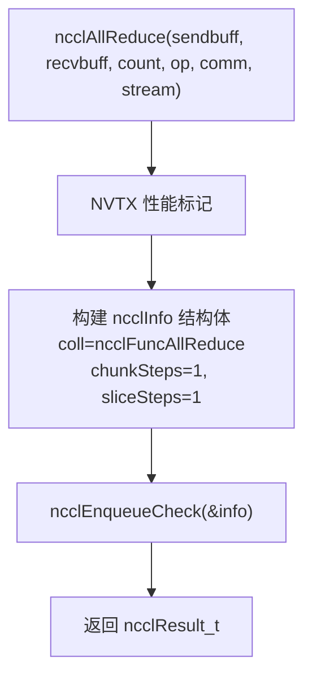

### 1.3 Phase 2: 任务入队与分组机制

**源文件**: `src/enqueue.cc:2979-3024`

`ncclEnqueueCheck` 是所有集合通信操作的统一入口：

```cpp
ncclResult_t ncclEnqueueCheck(struct ncclInfo* info) {
    // 1. 通信子有效性检查
    ncclResult_t ret = CommCheck(info->comm, info->opName, "comm");
    // 2. 隐式开启 group（内部调用 ncclGroupStartInternal）
    NCCLCHECK(ncclGroupStartInternal());
    // 3. 确保通信子已初始化完成
    NCCLCHECKGOTO(ncclCommEnsureReady(info->comm), ret, fail);
    // 4. 参数检查
    NCCLCHECKGOTO(ArgsCheck(info), ret, fail);
    // 5. 核心步骤：将任务追加到规划器
    NCCLCHECKGOTO(taskAppend(info->comm, info), ret, fail);
    // 6. 隐式结束 group（触发调度和启动）
    NCCLCHECK(ncclGroupEndInternal());
    return ret;
}
```

**taskAppend** (`src/enqueue.cc:2885-2977`) 根据操作类型分派：
- **Send/Recv** → `p2pTaskAppend`
- **PutSignal/Signal/WaitSignal** → `rmaTaskAppend`
- **集合通信** → `collTaskAppend`

对于 AllReduce，进入 `collTaskAppend`，其核心操作：

1. 转换规约操作为设备端格式（`hostToDevRedOp`）
2. 检查是否可用 CE（Copy Engine）对称路径
3. 创建 `ncclTaskColl` 任务结构体
4. 计算流量字节：`trafficBytes = count * elementSize * 2`（AllReduce 的流量系数为 2）
5. 插入排序器（按流量大小降序）：`ncclTaskCollSorterInsert`
6. 增加 `planner->nTasksColl` 计数

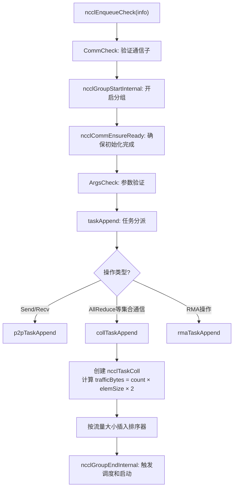

### 1.4 Phase 3: 任务规划与调度

**源文件**: `src/group.cc` + `src/enqueue.cc`

当 `ncclGroupEndInternal()` 被调用时（group 深度降至 0），触发完整的调度流程：

```cpp
// group.cc - groupLaunch 函数流程
1. asyncJobLaunch()              // 运行异步预连接任务
2. ncclCommGroupRegisterSymmetric() // 对称内存注册
3. ncclPrepareTasksAndCollPreconnect() // 准备任务 + 建立连接
4. ncclTasksRegAndEnqueue()      // 注册缓冲区并入队设备工作
5. doLaunches()                  // 启动 CUDA 内核
```

**ncclPrepareTasks** (`src/enqueue.cc:362-561`) 是核心规划函数：

1. **按 (func, op, datatype) 分桶**: 将相同类型的操作聚合
2. **计算算法信息**: 对每个桶调用 `ncclGetAlgoInfo` 决定算法和协议
3. **分配 channel 范围**: `devWork->channelLo`, `devWork->channelHi`
4. **构建 ncclDevWorkColl**: 设备端工作描述结构体

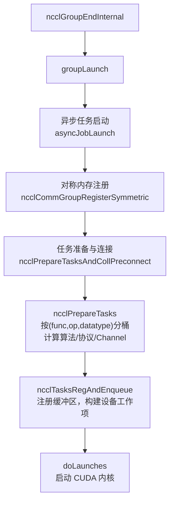

### 1.5 Phase 4: 算法与协议选择

**源文件**: `src/enqueue.cc:2030` (`ncclGetAlgoInfo`) + `src/graph/tuning.cc`

NCCL 支持以下算法：

| 算法 | 描述 | 适用场景 |
|------|------|----------|
| **RING** | 环形 AllReduce | 通用场景，大消息 |
| **TREE** | 树形（双二叉树） | 小消息，低延迟 |
| **NVLS** | NVLink SHARP | 单节点 NVSwitch |
| **NVLS_TREE** | NVLS + 树 | 多节点 NVLS |
| **COLLNET_DIRECT** | 集合网络直连 | 有 SHARP 网络硬件 |
| **COLLNET_CHAIN** | 集合网络链式 | 有 SHARP 网络硬件 |

支持以下协议：

| 协议 | 描述 | 特点 |
|------|------|------|
| **SIMPLE** | 简单协议 | 大数据量，高带宽 |
| **LL** | 低延迟协议 | 小数据量，低延迟，4x 数据膨胀 |
| **LL128** | 128字节行协议 | 中等数据量，平衡带宽和延迟 |

算法选择基于：
- **消息大小**: 小消息→TREE+LL，大消息→RING+SIMPLE
- **节点数**: 单节点→NVLS/P2P，多节点→NET
- **拓扑**: NVLink 连接类型、PCIe 拓扑
- **硬件能力**: 是否有 SHARP、NVSwitch
- **数据类型**: 某些算法不支持特定数据类型的规约

### 1.6 Phase 5: 数据分块与 Channel 分配

**源文件**: `src/enqueue.cc:571-811` (`scheduleCollTasksToPlan`)

这是 Pipeline 机制的关键环节。NCCL 将数据按以下层次分割：

```
总数据 (count 个元素)
├── 按 Channel 分割: countLo, countMid, countHi
│   ├── Channel 0: countLo 个元素
│   ├── Channel 1..N-1: countMid 个元素/Channel
│   └── Channel N: countHi 个元素
│       └── 每个 Channel 内按 Chunk 分割: chunkSize
│           └── 每个 Chunk 内按 Slice 分割: sliceSize
```

**Channel 分配算法** (`scheduleCollTasksToPlan`)：

1. **计算每 Channel 流量**: `trafficPerChannel = totalTraffic / nChannels`
2. **将元素按 cell 划分**: `cellSize = max(MinTrafficPerChannel/trafficPerByte, 16)` 对齐到 16
3. **分配到 Channel**: 
   - `cellsLo`: 最后一个 Channel 的剩余 cell
   - `cellsMid`: 中间 Channel 各分到的 cell
   - `cellsHi`: 最高 Channel 的 cell
4. **为每个 Channel 计算分块** (通过 `calcCollChunking`):
   - `chunkSize`: 每次 ring/tree 步进的数据量
   - `sliceSize`: 每次 DMA 传输的数据量（chunkSteps × sliceSteps 个 slice 组成 chunk）

**关键数据结构 ncclDevWorkColl** (传递给设备端):

```cpp
struct ncclDevWorkColl {
    void* sendbuff;           // 发送缓冲区
    void* recvbuff;           // 接收缓冲区
    int channelLo, channelHi; // Channel 范围
    // CBD (Chunk-Block Distribution) 模式:
    size_t countLo, countMid, countHi;  // 各 Channel 的元素数
    uint32_t chunkGrainsLo, chunkGrainsMid, chunkGrainsHi; // 各 Channel 的 chunk 粒度
    // 或 CollNet 模式:
    size_t collnetCount;      // 总元素数
    uint32_t collnetChunkCount; // 每 Channel 的 chunk 大小
    ncclDevRedOpFull redOpArg; // 规约操作参数
    int nWarps;               // 每 Block 的 warp 数
};
```

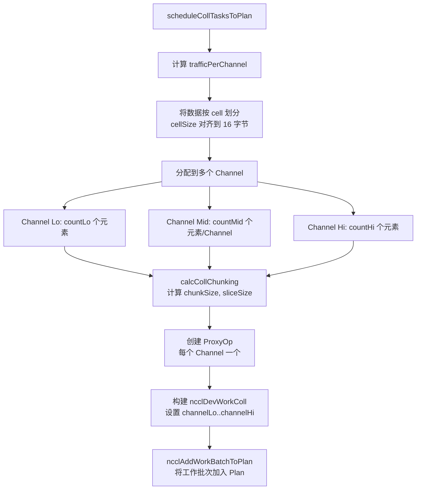

### 1.7 Phase 6: CUDA 内核启动

**源文件**: `src/enqueue.cc:1677-1776` (`ncclLaunchKernel`)

内核启动的关键参数：

```
Grid 维度:  {nChannels, 1, 1}      // 每个 Channel 一个 Block
Block 维度: {threadPerBlock, 1, 1}  // 通常 512 或 1024 线程
共享内存:   ncclShmemDynamicSize    // 用于 ncclShmem 结构体
```

内核参数通过 `CU_LAUNCH_PARAM_BUFFER_POINTER` 传递，包含：
- `ncclDevKernelArgs4K`: 内核参数结构体（最大 4KB）
  - `workFifo`: 设备端工作 FIFO 指针
  - 其他内核配置

内核函数通过 `ncclDevKernelForFunc[devFuncId]` 查找，`devFuncId` 由 `(func, op, datatype, algorithm, protocol)` 五元组编码。

在 SM90+ 上还支持：
- **Thread Block Cluster**: 多个 Block 组成 Cluster 协同执行
- **MemSync Domain**: 设置内存同步域
- **Programmatic Stream Serialization**: 可编程流序列化
- **NVLink Centric Scheduling**: NVLink 亲和调度

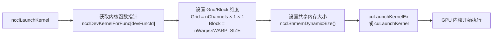

### 1.8 Phase 7: 设备端 Ring AllReduce 执行

**源文件**: `src/device/all_reduce.h:14-84` (`runRing`)

每个 CUDA Block 处理一个 Channel 的数据。以 Ring AllReduce 为例：

#### Ring AllReduce 算法（N 个 GPU，每个 GPU 处理 1/N 的数据）

**总计 2(N-1) 步**，分为 Reduce-Scatter 阶段和 All-Gather 阶段：

```
Reduce-Scatter 阶段 (N-1 步):
  Step 0:     直接发送自己的 chunk[(ringIx-1) % N] 给下一个 GPU
  Step 1..N-2: 接收 chunk[(ringIx-j) % N]，执行规约，发送给下一个 GPU

All-Gather 阶段 (N-1 步):
  Step N-1:   接收 chunk[ringIx]，执行最终规约+拷贝，发送给下一个 GPU（postOp 在此处执行）
  Step N..2N-3: 接收 chunk[(ringIx-j+1) % N]，拷贝到 recvbuff，转发给下一个 GPU
  Final:      接收最后一个 chunk 到 recvbuff
```

设备端关键代码（`runRing` 模板函数）：

```cpp
// 初始化 Primitives 通信原语
Primitives<T, RedOp, FanSymmetric<1>, 1, Proto, 0> prims
    (tid, nthreads, &ring->prev, &ring->next,
     work->sendbuff, work->recvbuff, work->redOpArg, 0, 0, 0, work);

// 获取本 Channel 负责的数据范围
ncclCollCbdPart(work, channelId, Proto::Id, sizeof(T),
    nullptr, &gridOffset, &channelCount, &chunkCount);
const ssize_t loopCount = nranks * chunkCount;

for (ssize_t elemOffset = 0; elemOffset < channelCount; elemOffset += loopCount) {
    // Step 0: 发送初始 chunk
    chunk = modRanks(ringIx + nranks - 1);
    prims.directSend(offset, offset, nelem);

    // Steps 1..N-2: 接收+规约+发送
    for (int j = 2; j < nranks; ++j) {
        prims.directRecvReduceDirectSend(offset, offset, nelem);
    }

    // Step N-1: 最终规约+拷贝+发送（执行 postOp，如除以 rank 数）
    chunk = ringIx + 0;
    prims.directRecvReduceCopyDirectSend(offset, offset, nelem, /*postOp=*/true);

    // Steps N..2N-2: 接收+拷贝+发送（All-Gather）
    for (int j = 1; j < nranks - 1; ++j) {
        prims.directRecvCopyDirectSend(offset, offset, nelem);
    }

    // Final: 接收最后一个 chunk
    prims.directRecv(offset, nelem);
}
```

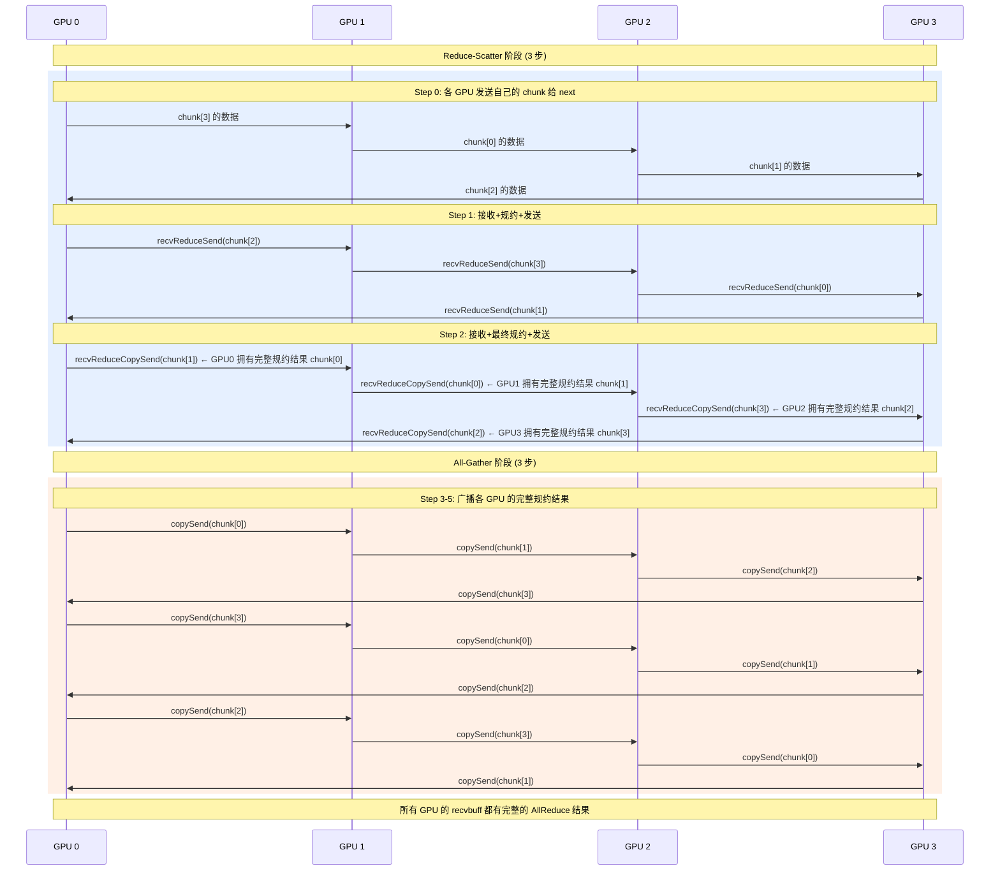

#### Primitives 通信原语

`Primitives` 类（`src/device/primitives.h`）封装了底层数据传输操作：

| 原语方法 | 功能 |
|----------|------|
| `directSend(src, dst, n)` | 从 sendbuff 直接发送 n 个元素 |
| `directRecv(src, n)` | 接收到 recvbuff |
| `directRecvReduceDirectSend(src, dst, n)` | 接收 + 规约 + 发送 |
| `directRecvReduceCopyDirectSend(src, dst, n, postOp)` | 接收 + 规约 + 拷贝到 recvbuff + 发送 |
| `directRecvCopyDirectSend(src, dst, n)` | 接收 + 拷贝 + 发送 |

这些原语通过 Protocol 特化实现不同的数据传输方式。

#### ncclShmem 共享内存

每个 Block 使用 `ncclShmem`（位于共享内存）进行线程间通信：

```cpp
struct ncclShmem {
    ncclDevChannel channel;  // Channel 信息（ring/tree 拓扑）
    ncclDevComm comm;        // 设备端通信子
    int channelId;           // 当前 Channel ID
};
```

### 1.9 Phase 8: 传输层与代理机制

每个 Channel 有两个连接器（Connector）：send 和 recv，分别连接到前驱和后继 GPU。

**传输类型**:

| 传输 | 文件 | 场景 |
|------|------|------|
| **P2P** | `src/transport/p2p.cc` | 同节点 GPU 间 NVLink/PCIe |
| **SHM** | `src/transport/shm.cc` | 同节点进程间共享内存 |
| **NET** | `src/transport/net.cc` | 跨节点网络通信 |
| **NVLS** | `src/transport/nvls.cc` | NVLink SHARP |

**对于跨节点通信，代理线程 (Proxy Thread) 充当中间角色**：

```
GPU Kernel                    Proxy Thread                   Remote GPU
    │                              │                              │
    ├─ write to send buffer ──────►│                              │
    │                              ├─ network send ──────────────►│
    │                              │                              ├─ write to recv buffer
    │                              │◄─ network recv ──────────────┤
    │◄─ read from recv buffer ────┤                              │
```

代理线程在 `src/proxy.cc` 中实现，通过 Unix Domain Socket 接收操作请求，然后通过 Transport 层发送/接收数据。

### 1.10 Phase 9: 完成与资源回收

**源文件**: `src/group.cc:290-362` (`doLaunches`) + `src/enqueue.cc:1803-1860` (`ncclLaunchFinish`)

1. **记录完成事件**: `cudaEventRecord(finishedEvent, launchStream)`
2. **同步设备流**: `deviceStream` 等待 `launchStream`
3. **同步用户流**: 所有用户流等待第一个用户流的完成
4. **资源回收**: 通过回调队列异步回收 Plan、ProxyOp、Task 内存
5. **Group 清理**: `ncclGroupCommLeave` 重置规划器状态

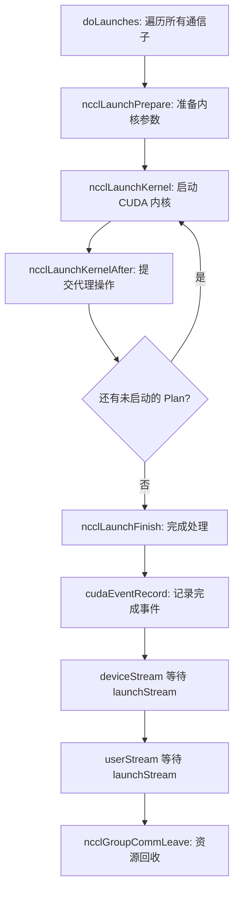

---

## 第二部分：NCCL 高性能 Pipeline 机制

### 2.1 Pipeline 设计概述

NCCL 的 Pipeline 设计旨在最大化通信带宽利用率，通过**多级并行**隐藏延迟：

1. **Channel 级并行**: 多个 Channel 同时处理不同的数据块
2. **Chunk 级流水线**: 在一个 Channel 内，数据被切分为多个 Chunk，实现发送/接收/计算的重叠
3. **Slice 级流水线**: 每个 Chunk 进一步被切分为多个 Slice，实现更细粒度的流水线

```
时间 ─────────────────────────────────────────────────────►

Channel 0: [Chunk0: Slice0|Slice1|Slice2|...] [Chunk1: ...] [Chunk2: ...]
Channel 1: [Chunk0: Slice0|Slice1|Slice2|...] [Chunk1: ...] [Chunk2: ...]
Channel 2: [Chunk0: Slice0|Slice1|Slice2|...] [Chunk1: ...] [Chunk2: ...]
...
Channel N: [Chunk0: Slice0|Slice1|Slice2|...] [Chunk1: ...] [Chunk2: ...]

↑ 多个 Channel 完全并行
↑ 每个 Channel 内多个 Chunk 流水执行
```

### 2.2 Channel 并行机制

**Channel 是 NCCL Pipeline 的核心抽象**。每个 Channel 是一个独立的通信路径，包含：

- **独立的 send/recv 连接**: 连接到 ring/tree 中的前后节点
- **独立的缓冲区**: 发送和接收各有一组缓冲区
- **独立的代理操作**: 可以独立推进

Channel 数量由以下因素决定：
- **可用硬件路径数**: NVLink 链路数、NIC 数量
- **通道配置参数**: `NCCL_MAXCHANNELS`（默认 32 或 64）
- **拓扑发现结果**: `src/graph/topo.cc` 发现的硬件拓扑

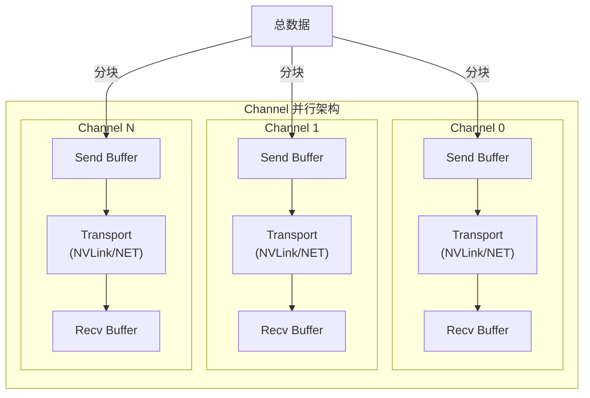

### 2.3 数据分块策略

NCCL 使用三级分块策略：

```
总数据 (例如 1GB AllReduce)
│
├── Level 1: Channel 分配
│   将数据均匀分配到 N 个 Channel
│   每个 Channel 处理约 (1GB/N) 的数据
│
├── Level 2: Chunk 切分 (由 chunkSteps × sliceSteps 控制)
│   每个 Channel 的数据被切分为多个 Chunk
│   chunkSize = 由 calcCollChunking() 计算
│   每个 Chunk 是 ring/tree 一次完整步进的数据量
│
└── Level 3: Slice 切分
    每个 Chunk 被切分为 (chunkSteps × sliceSteps) 个 Slice
    sliceSize 是最小的 DMA 传输单位
```

**calcCollChunking** 函数的关键逻辑：

```
sliceSize = 根据协议计算的最小传输单位
  - SIMPLE: 通常为较大值
  - LL: 包含数据和 flag 的行大小
  - LL128: 128 字节对齐的行大小

chunkSize = sliceSize × sliceSteps × chunkSteps
  - chunkSteps: 每个 Chunk 包含几组 Slice
  - sliceSteps: 每组包含几个 Slice

nSteps = channelDataSize / chunkSize
  - Channel 数据被分为 nSteps 个 Chunk 处理
```

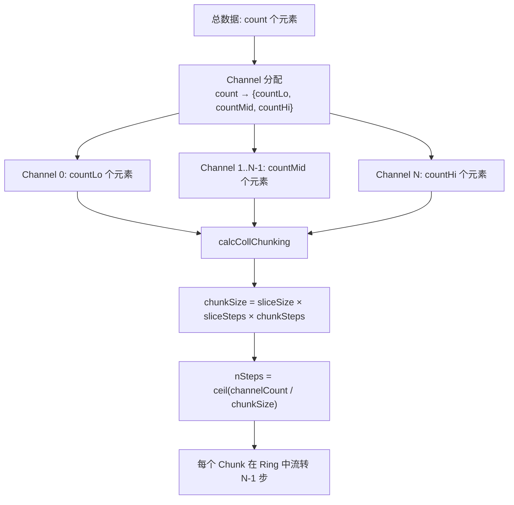

### 2.4 协议层流水线

三种协议在 Pipeline 中扮演不同角色：

#### SIMPLE 协议

```
┌─────────────────────────────────────────────────┐
│ Send Buffer (N × sliceSize × sliceSteps × chunkSteps) │
├─────────┬─────────┬─────────┬─────────────────┤
│ Slice 0 │ Slice 1 │ Slice 2 │ ...             │  ← GPU Kernel 写入
├─────────┼─────────┼─────────┼─────────────────┤
│ Slice 0 │ Slice 1 │ Slice 2 │ ...             │  ← Proxy/Transport 读取发送
└─────────┴─────────┴─────────┴─────────────────┘
同步机制: head/tail 指针
  - Kernel 写入时推进 head
  - Transport 读取时推进 tail
```

**SIMPLE 协议特点**:
- 使用 head/tail 指针实现生产者-消费者同步
- `NCCL_SHARED_STEPS` (默认 8) 个 Slice 的环形缓冲区
- Kernel 写入 Slice[i]，Transport 发送 Slice[i-1]，形成流水线

#### LL (Low-Latency) 协议

```
┌───────────────────────────────────────────┐
│ 每个 LL Line: [Data | Flags (64-bit)]     │
│ Flags 包含: valid 位 + sequence number    │
├──────────────────────────────────────────┤
│ Line 0: [Data | Flags]                    │
│ Line 1: [Data | Flags]                    │
│ ...                                       │
└───────────────────────────────────────────┘
数据膨胀: 4x（因为 flags 占用空间）
优势: 极低延迟（通过 polling flags 实现同步）
```

#### LL128 协议

```
┌─────────────────────────────────────────────┐
│ 每 128 字节对齐的数据行                       │
│ 利用 GPU 的 128-byte 内存事务对齐             │
├─────────────────────────────────────────────┤
│ [Data 120B | Flags 8B] × N                  │
└─────────────────────────────────────────────┘
平衡带宽和延迟
```

### 2.5 代理线程与 GPU 内核的协同

代理线程是 NCCL Pipeline 的关键组件，负责处理跨节点网络通信，让 GPU 内核专注于计算。

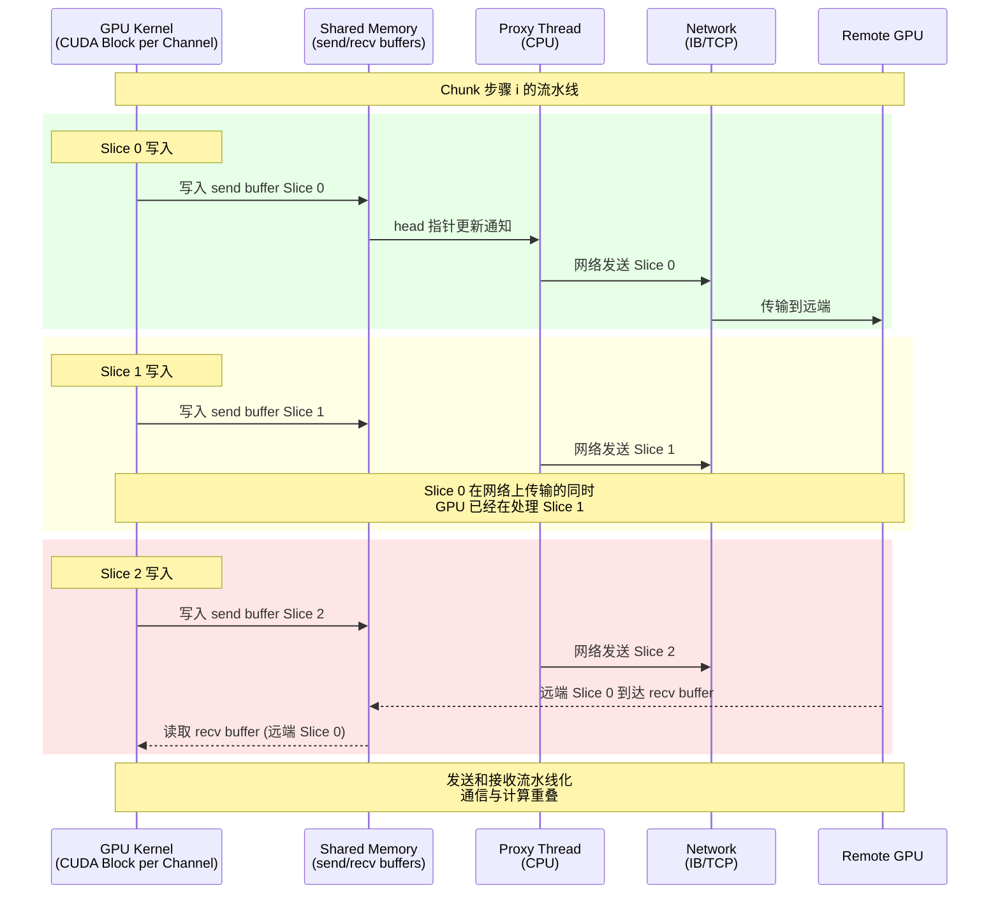

**同步机制**:

1. **GPU → Proxy**: 通过 head 指针（在设备内存中）。GPU 写入数据后更新 head，Proxy 轮询 head 变化
2. **Proxy → GPU**: 通过 tail 指针。Proxy 完成接收后更新 tail，GPU 轮询 tail 变化
3. **对于 P2P/NVLink**: 不经过 Proxy，GPU 直接通过 NVLink 读写远端内存（使用 CUDA IPC 或 cuMem）

### 2.6 完整 Pipeline 流程图

以下流程图展示了 AllReduce 在多级 Pipeline 下的完整执行过程：

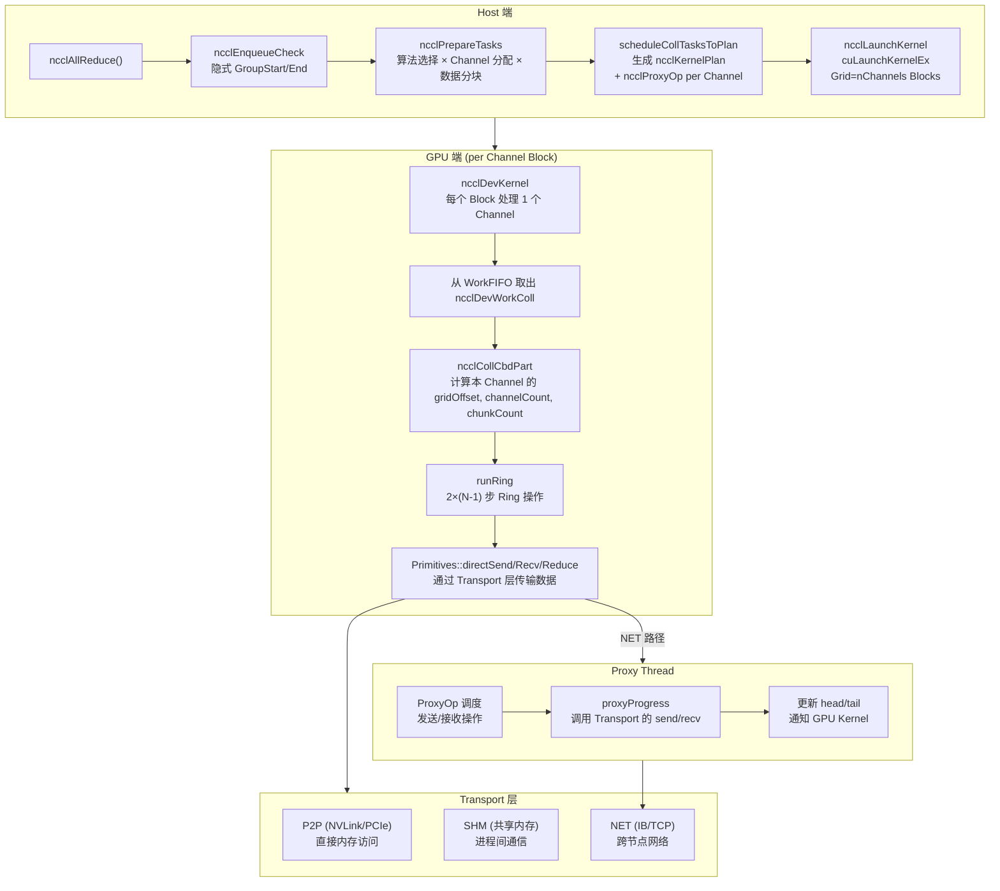

### 2.7 传输层实现细节

#### P2P 传输（NVLink/PCIe）

```
GPU 0 (CUDA Kernel)              GPU 1 (CUDA Kernel)
    │                                  │
    ├─ 直接写入远程 recvBuffer          │
    │  (通过 NVLink, cudaIpcMemcpy)     │
    │  或远程直接读取 (P2P Read)        │
    │                                  │
    └─ 通过 ptrExchange 同步 ─────────►├─ 读取 recvBuffer
```

P2P 传输支持四种模式（`src/transport/p2p.cc`）：
1. **P2P_DIRECT**: 直接指针访问（同进程）
2. **P2P_IPC**: CUDA IPC 句柄（跨进程）
3. **P2P_CUMEM**: cuMem 虚拟地址映射
4. **P2P_INTERMEDIATE**: 通过中间 GPU 中转

#### NET 传输（跨节点）

```
GPU Kernel → write sendBuffer → Proxy Thread reads → IB Send → ... → IB Recv → Proxy writes recvBuffer → GPU Kernel reads
```

NET 传输通过代理线程处理网络 I/O：

1. **GPU Kernel** 将数据写入 send buffer（设备内存）
2. **Proxy Thread** 检测到新数据（通过 head 指针），调用网络插件的 send 操作
3. **网络传输**: 通过 InfiniBand 或 TCP 传输到远端
4. **远端 Proxy Thread** 接收数据，写入 recv buffer
5. **远端 GPU Kernel** 读取 recv buffer 中的数据

#### 缓冲区注册与零拷贝

NCCL 支持用户缓冲区注册（User Buffer Registration），避免额外的内存拷贝：

- **IPC 注册**: 通过 `ncclIpcLocalRegisterBuffer` 注册用户缓冲区
- **NET 注册**: 通过 `ncclNetLocalRegisterBuffer` 注册网络缓冲区
- **NVLS 注册**: 通过 NVLink SHARP 的多播缓冲区注册

注册后，GPU Kernel 可以直接在用户缓冲区上操作（`regUsed` / `netRegUsed` 标志），无需通过中间缓冲区拷贝。

### 2.8 性能优化策略总结

| 策略 | 实现位置 | 效果 |
|------|----------|------|
| **多 Channel 并行** | `scheduleCollTasksToPlan` | N 个 Channel 同时工作，带宽 ×N |
| **Chunk 流水线** | `calcCollChunking` | 通信与计算重叠 |
| **Slice 细粒度流水** | `prims_simple/ll/ll128.h` | 更细粒度的发送/接收重叠 |
| **代理线程异步传输** | `src/proxy.cc` | CPU 处理网络 I/O，GPU 专注计算 |
| **零拷贝 (Reg Buffer)** | `src/register/` | 避免 GPU→GPU 的额外拷贝 |
| **CGA Cluster** | `ncclLaunchKernel` | SM90+ 多 Block 协同，减少同步开销 |
| **自适应算法选择** | `ncclGetAlgoInfo` | 根据消息大小和拓扑选择最优算法 |
| **数据量感知 Channel 分配** | `scheduleCollTasksToPlan` | 大消息多用 Channel，小消息少用 Channel |
| **CUDA Graph 支持** | `group.cc` | 图捕获模式下避免重复调度开销 |

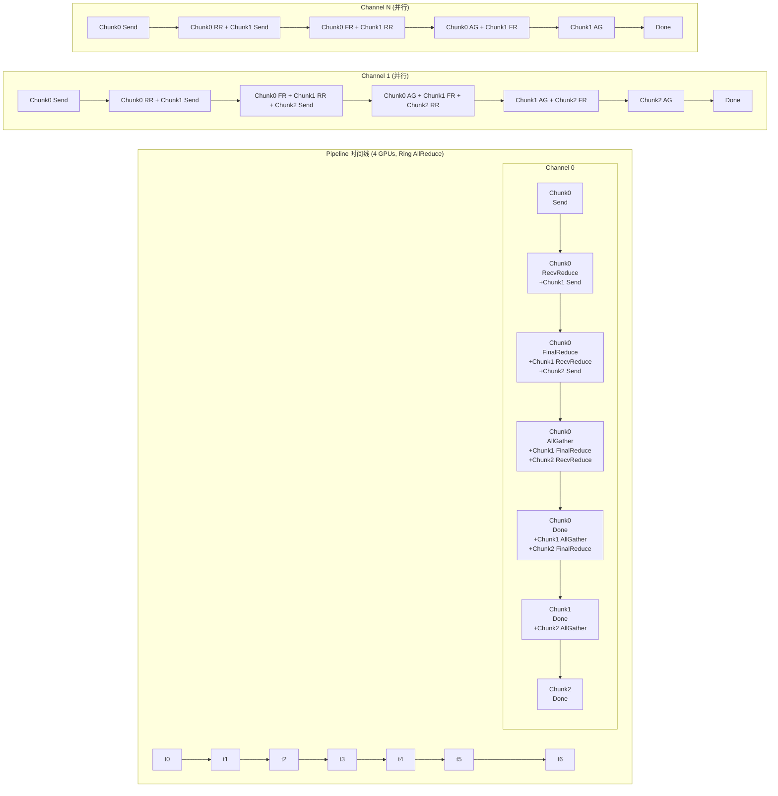

---

> **文档版本**: 基于NCCL master 分支，commit `49839df`  
> **覆盖范围**: AllReduce 从 API 调用到设备执行的完整流程，以及多级 Pipeline 机制  
> **关键源文件**: `collectives.cc`, `enqueue.cc`, `group.cc`, `device/all_reduce.h`, `device/primitives.h`, `device/prims_simple.h`, `proxy.cc`, `transport/p2p.cc`, `transport/net.cc`
