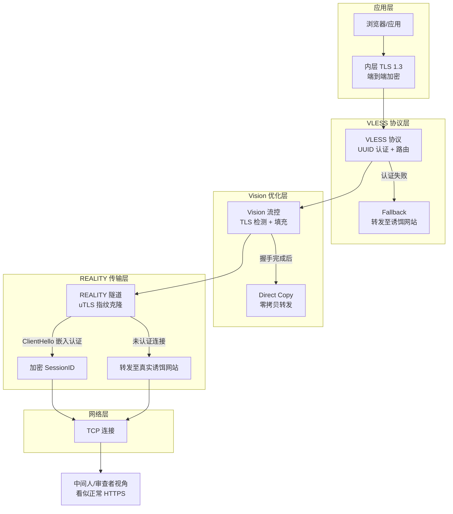
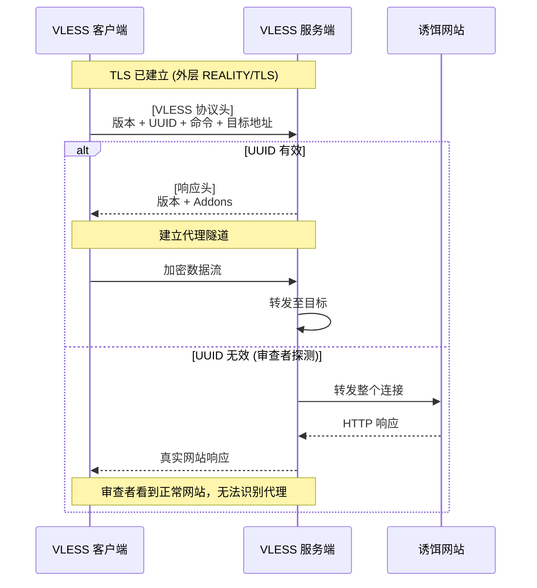
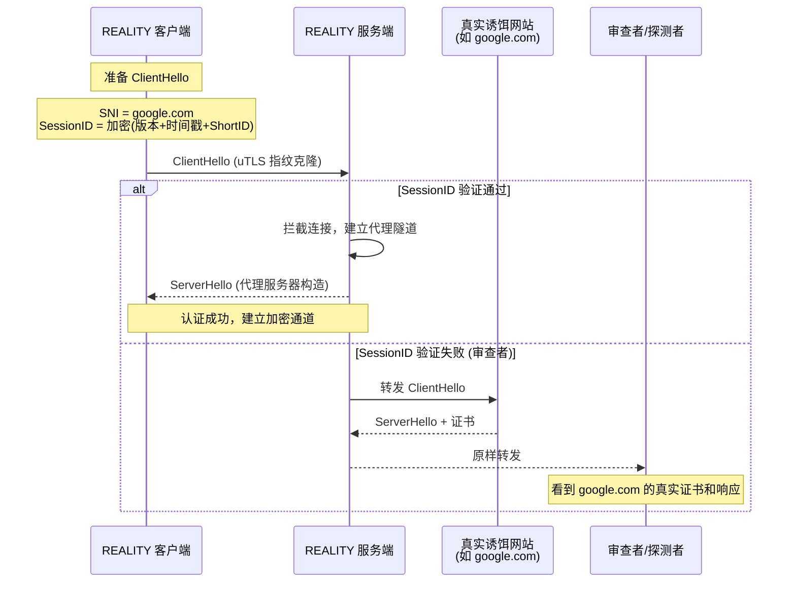
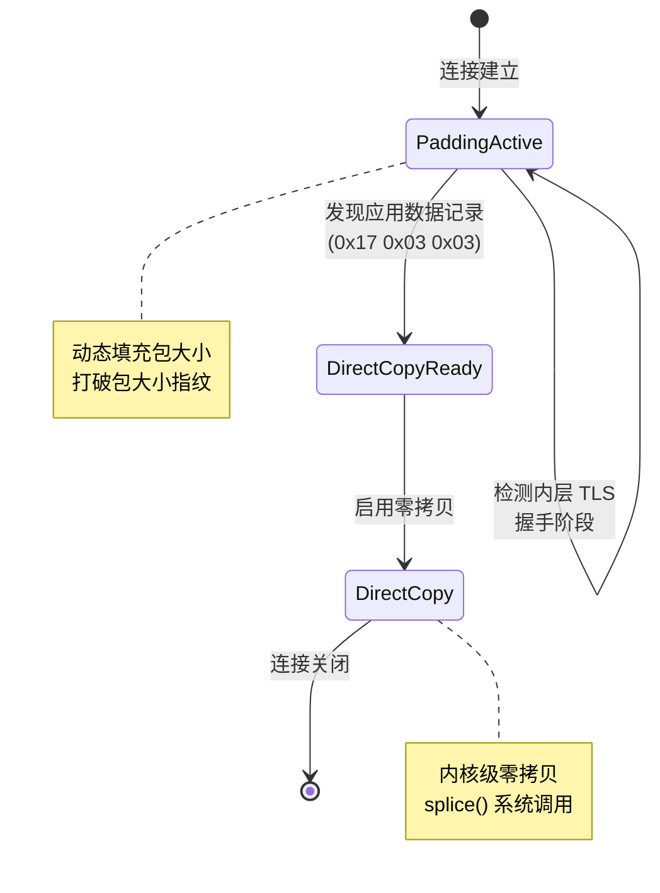
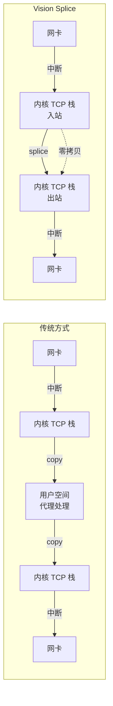
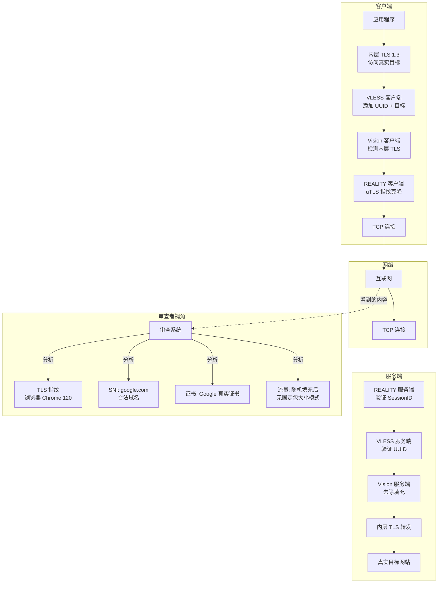

# VLESS + REALITY + Vision 抗审查方案深度技术分析

> 本文档深入分析 Xray-core 中 VLESS + REALITY + Vision 三层架构如何协同工作，构建一个高度抗检测的代理系统。内容基于 Xray-core 源代码逆向分析，涵盖协议设计原理、实现细节和对抗检测的机制。

## 目录

1. [架构概述](#架构概述)
2. [VLESS 协议设计](#vless-协议设计)
3. [REALITY 协议深度分析](#reality-协议深度分析)
4. [Vision/XTLS 流控制](#visionxtls-流控制)
5. [三层协同与威胁模型](#三层协同与威胁模型)
6. [代码实现关键路径](#代码实现关键路径)

---

## 架构概述

VLESS + REALITY + Vision 是一个三层防御体系，每一层针对不同的审查向量：

| 层级 | 组件 | 主要对抗目标 | 核心机制 |
|------|------|-------------|---------|
| 应用层 | **VLESS** | 协议指纹识别 | 零握手、极简协议头、UUID 认证 |
| 传输层 | **REALITY** | TLS 指纹检测、主动探测 | uTLS 指纹克隆、转发至诱饵、SessionID 嵌入认证 |
| 优化层 | **Vision** | 流量分析、包大小指纹识别 | TLS 握手检测、动态填充、零拷贝转发 |

设计理念：**"对于无法计算特定共享密钥的观察者，看起来完全像正常的 HTTPS"**



---

## VLESS 协议设计

### 零开销、无握手架构

VLESS 协议（`proxy/vless/encoding/encoding.go`）的设计哲学是**极简主义**——消除所有可能被指纹识别的握手过程。

#### 协议格式

```
[版本: 1字节][UUID: 16字节][Addons: 变长][命令: 1字节][地址: 变长]
```

**关键代码** (`encoding.go:30-61`):

```go
func EncodeRequestHeader(writer io.Writer, request *protocol.RequestHeader, requestAddons *Addons) error {
    buffer := buf.StackNew()
    defer buffer.Release()
    
    // 1. 版本字节 (固定为 0)
    if err := buffer.WriteByte(request.Version); err != nil {
        return errors.New("failed to write request version").Base(err)
    }
    
    // 2. UUID (16字节) - 既是认证凭证又是用户标识
    if _, err := buffer.Write(request.User.Account.(*vless.MemoryAccount).ID.Bytes()); err != nil {
        return errors.New("failed to write request user id").Base(err)
    }
    
    // 3. Addons (流量控制等)
    if err := EncodeHeaderAddons(&buffer, requestAddons); err != nil {
        return errors.New("failed to encode request header addons").Base(err)
    }
    
    // 4. 命令类型 (TCP/UDP/Mux等)
    if err := buffer.WriteByte(byte(request.Command)); err != nil {
        return errors.New("failed to write request command").Base(err)
    }
    
    // 5. 目标地址和端口
    if request.Command != protocol.RequestCommandMux && request.Command != protocol.RequestCommandRvs {
        if err := addrParser.WriteAddressPort(&buffer, request.Address, request.Port); err != nil {
            return errors.New("failed to write request address and port").Base(err)
        }
    }
    
    if _, err := writer.Write(buffer.Bytes()); err != nil {
        return errors.New("failed to write request header").Base(err)
    }
    return nil
}
```

#### 为什么这能对抗审查

1. **无多轮握手**：认证(UUID)和路由指令(命令+地址)打包在 TLS 建立后的第一个数据写操作中
   - `EncodeRequestHeader` 单次缓冲区写入完成所有协议头
   - `DecodeRequestHeader` (`encoding.go:64-132`) 单次读取完成解析

2. **UUID 作为认证**：16字节 UUID 同时是认证凭证和用户标识
   - 对于观察加密 TLS 流的审查者，这 16 字节与随机应用数据无法区分
   - 代码: `encoding.go:38` - `request.User.Account.(*vless.MemoryAccount).ID.Bytes()`

3. **无协议标识**：版本字节固定为 0 (`encoding.go:19`)，不暴露协议类型

4. **Fallback 机制**：服务端 (`inbound/inbound.go:307-512`) 实现 Fallback 路由
   - `DecodeRequestHeader` 失败(无效UUID)时，连接不被拒绝
   - 转发到配置的 Fallback 目标(通常是诱饵网站本身)
   - 审查者的探测会收到真实网站的正常 HTTP 响应



---

## REALITY 协议深度分析

### 核心创新：转发至诱饵 + 指纹克隆

REALITY (`transport/internet/reality/reality.go`) 解决了两个关键问题：
1. **主动探测**：审查者主动连接你的服务器，如何让他们看到正常网站？
2. **TLS 指纹识别**：Go 的 TLS 库有独特的指纹，如何伪装成浏览器？

#### 诱饵转发机制

**服务端配置** (`config.proto`):
```protobuf
message Config {
    string dest = 2;              // 诱饵目的地
    repeated string server_names = 21;  // 允许的 SNI 值(诱饵域名)
    bytes private_key = 3;        // 服务器 X25519 私钥
    repeated bytes short_ids = 24;      // 预共享短标识符
}
```

**协议流程**:



#### uTLS 指纹克隆

**为什么这很关键**：Go 默认 TLS 库的 ClientHello 有独特特征(密码套件排序、扩展顺序、GREASE 值)，与真实浏览器不同。这是最常见的代理检测向量之一。

**代码实现** (`reality.go:117-277`):

```go
func UClient(c net.Conn, config *Config, ctx context.Context, dest net.Destination) (net.Conn, error) {
    uConn := &UConn{
        Config: config,
    }
    
    utlsConfig := &utls.Config{
        VerifyPeerCertificate:  uConn.VerifyPeerCertificate,
        ServerName:             config.ServerName,
        InsecureSkipVerify:     true,
        SessionTicketsDisabled: true,
    }
    
    // 1. 获取指纹配置 (Chrome/Firefox/Safari 等)
    fingerprint := tls.GetFingerprint(config.Fingerprint)
    if fingerprint == nil {
        return nil, errors.New("REALITY: failed to get fingerprint").AtError()
    }
    
    // 2. 使用 uTLS 克隆浏览器指纹
    uConn.UConn = utls.UClient(c, utlsConfig, *fingerprint)
    
    // 3. 构建握手状态
    uConn.BuildHandshakeState()
    hello := uConn.HandshakeState.Hello
    
    // 4. 在 SessionID 中嵌入认证信息
    hello.SessionId = make([]byte, 32)
    hello.SessionId[0] = core.Version_x      // Xray 版本
    hello.SessionId[1] = core.Version_y
    hello.SessionId[2] = core.Version_z
    hello.SessionId[3] = 0                    // 保留
    binary.BigEndian.PutUint32(hello.SessionId[4:], uint32(time.Now().Unix()))  // 时间戳
    copy(hello.SessionId[8:], config.ShortId)  // 服务器标识
    
    // 5. 使用 X25519 ECDH 派生 AuthKey
    publicKey, err := ecdh.X25519().NewPublicKey(config.PublicKey)
    ecdhe := uConn.HandshakeState.State13.KeyShareKeys.Ecdhe
    uConn.AuthKey, _ = ecdhe.ECDH(publicKey)
    
    // 6. 使用 HKDF 强化密钥
    if _, err := hkdf.New(sha256.New, uConn.AuthKey, hello.Random[:20], []byte("REALITY")).Read(uConn.AuthKey); err != nil {
        return nil, err
    }
    
    // 7. 使用 AES-GCM 加密 SessionID 前 16 字节
    aead := crypto.NewAesGcm(uConn.AuthKey)
    aead.Seal(hello.SessionId[:0], hello.Random[20:], hello.SessionId[:16], hello.Raw)
    copy(hello.Raw[39:], hello.SessionId)
    
    // 8. 执行握手
    if err := uConn.HandshakeContext(ctx); err != nil {
        return nil, err
    }
    
    // 9. 验证服务器证书签名
    if !uConn.Verified {
        // 不是 REALITY 服务器，可能是真实诱饵或中间人
        errors.LogError(ctx, "REALITY: received real certificate (potential MITM or redirection)")
        // ... 爬虫模拟正常浏览行为
        return nil, errors.New("REALITY: processed invalid connection").AtWarning()
    }
    
    return uConn, nil
}
```

#### 认证流程详解

```mermaid
flowchart LR
    subgraph "客户端"
        A1[生成临时 X25519 密钥对] --> A2["ECDH 计算共享密钥<br/>AuthKey"]
        A2 --> A3[HKDF 扩展密钥]
        A3 --> A4["AES-GCM 加密<br/>SessionID[:16"]]
        A4 --> A5[发送 ClientHello]
    end
    
    subgraph "服务端"
        B5[接收 ClientHello] --> B4[解密 SessionID]
        B4 --> B3[验证 ShortID]
        B3 --> B2[检查时间戳]
        B2 --> B1["计算 HMAC 签名<br/>cert.Signature"]
    end
    
    A5 --> B5
    
    subgraph "认证通过"
        C1[返回带签名的证书] --> C2[客户端验证签名]
    end
    
    B1 --> C1
```

**服务端验证** (`reality.go:76-115`):

```go
func (c *UConn) VerifyPeerCertificate(rawCerts [][]byte, verifiedChains [][]*x509.Certificate) error {
    // 提取服务器证书公钥
    p, _ := reflect.TypeOf(c.Conn).Elem().FieldByName("peerCertificates")
    certs := *(*([]*x509.Certificate))(unsafe.Pointer(uintptr(unsafe.Pointer(c.Conn)) + p.Offset))
    
    if pub, ok := certs[0].PublicKey.(ed25519.PublicKey); ok {
        // 验证证书签名是否匹配 HMAC(AuthKey, pubKey)
        h := hmac.New(sha512.New, c.AuthKey)
        h.Write(pub)
        if bytes.Equal(h.Sum(nil), certs[0].Signature) {
            // 额外 ML-DSA-65 验证(如启用)
            if len(c.Config.Mldsa65Verify) > 0 {
                // ...
            }
            c.Verified = true
            return nil
        }
    }
    
    // 验证失败：是真实诱饵证书或中间人
    // 执行标准 x509 验证
    opts := x509.VerifyOptions{
        DNSName:       c.ServerName,
        Intermediates: x509.NewCertPool(),
    }
    if _, err := certs[0].Verify(opts); err != nil {
        return err
    }
    return nil
}
```

#### REALITY vs 标准 TLS

| 方面 | 标准 TLS | REALITY |
|------|---------|---------|
| 证书 | 自签名或 Let's Encrypt (可识别) | 使用诱饵真实证书 |
| SNI | 指向代理服务器 | 指向合法网站 |
| 主动探测响应 | 连接拒绝 / 错误证书 | 返回诱饵真实网站 |
| Session ID | 随机 | 加密认证数据 |
| 检测面 | SNI + 证书指纹 | 仅 AuthKey 派生的 SessionID 加密 |

---

## Vision/XTLS 流控制

### TLS 流量检测与直接复制

Vision (`proxy/proxy.go:174-404`) 检测**内层** TLS 流量(被代理的连接，而非外层 REALITY/TLS)以确定何时可安全切换到原始复制模式。

#### 核心洞察

内层 TLS 握手完成并进入应用数据阶段(操作码 `0x17 0x03 0x03`)后，流量已完全加密。此时代理无需检查单个记录，可直接透传字节。

#### TLS 检测逻辑

```go
func XtlsFilterTls(buffer buf.MultiBuffer, trafficState *TrafficState, ctx context.Context) {
    // 检查前 ~8 个包寻找 TLS ClientHello/ServerHello 模式
    for _, b := range buffer {
        if b.IsEmpty() {
            continue
        }
        
        // 检测 TLS 1.3 支持版本扩展
        // bytes: 0x00, 0x2b, 0x00, 0x02, 0x03, 0x04
        if bytes.Contains(b.Bytes(), Tls13SupportedVersions) {
            trafficState.IsTLS12orAbove = true
        }
        
        // 检测 TLS 握手类型
        if b.Len() > 5 {
            contentType := b.Byte(0)
            version := binary.BigEndian.Uint16(b.BytesRange(1, 3))
            
            // 0x16 = Handshake
            if contentType == 0x16 && version >= 0x0303 {
                handshakeType := b.Byte(5)
                // 0x01 = ClientHello, 0x02 = ServerHello
                if handshakeType == TlsHandshakeTypeClientHello {
                    trafficState.IsTLS = true
                }
            }
        }
    }
    
    // 递减包过滤计数器
    if trafficState.NumberOfPacketToFilter > 0 {
        trafficState.NumberOfPacketToFilter--
    }
}
```

#### Vision 状态机



#### 填充策略

Vision 的填充 (`proxy/proxy.go:496-532`) 在内层 TLS 握手阶段运作：

**填充格式**:
```
[UUID: 16字节(仅首包)][命令: 1][内容长度: 2][填充长度: 2][内容][填充]
```

**填充参数** (通过 `testseed` 配置，默认 `[900, 500, 900, 256]`):
- 内容 < 900 字节且 `longPadding` 为真 → 填充 = random(0..500) + 900 - contentLen
- 否则 → 填充 = random(0..256)
- 最大填充限制：`buf.Size - 21 - contentLen`

```go
func XtlsPadding(b *buf.Buffer, command byte, userUUID *[]byte, longPadding bool, ctx context.Context, testseed []uint32) *buf.Buffer {
    var contentLen int32 = 0
    var paddingLen int32 = 0
    if b != nil {
        contentLen = b.Len()
    }
    
    // 计算填充长度
    if contentLen < int32(testseed[0]) && longPadding {
        l, err := rand.Int(rand.Reader, big.NewInt(int64(testseed[1])))
        if err != nil {
            errors.LogDebugInner(ctx, err, "failed to generate padding")
        }
        paddingLen = int32(l.Int64()) + int32(testseed[2]) - contentLen
    } else {
        l, err := rand.Int(rand.Reader, big.NewInt(int64(testseed[3])))
        if err != nil {
            errors.LogDebugInner(ctx, err, "failed to generate padding")
        }
        paddingLen = int32(l.Int64()))
    }
    
    // 限制最大填充
    if paddingLen > buf.Size-21-contentLen {
        paddingLen = buf.Size - 21 - contentLen
    }
    
    newbuffer := buf.New()
    if userUUID != nil {
        newbuffer.Write(*userUUID)
        *userUUID = nil
    }
    
    // 写入命令和内容长度
    newbuffer.Write([]byte{command, byte(contentLen >> 8), byte(contentLen), byte(paddingLen >> 8), byte(paddingLen)})
    
    if b != nil {
        newbuffer.Write(b.Bytes())
        b.Release()
    }
    
    // 添加随机填充
    newbuffer.Extend(paddingLen)
    return newbuffer
}
```

#### 为什么填充能对抗审查

内层 TLS 握手有非常可预测的包大小：
- ClientHello ~512 字节
- ServerHello ~150 字节  
- Certificate ~2-4KB

没有填充时，审查者可以通过加密层识别这些精确大小。Vision 在握手阶段为每个记录添加随机填充，打破大小指纹。

#### 零拷贝转发 (Splice)

`CopyRawConnIfExist` (`proxy/proxy.go:718-792`) 执行终极优化：

1. **解包**所有代理层 (TLS/uTLS/REALITY/stats/mask/proxyproto) 获取原始 TCP socket
2. 在 Linux 上使用 `TCPConn.ReadFrom()` 调用内核 `splice()` 系统调用
3. 数据直接从入站 TCP socket 流向出站 TCP socket，**完全在 kernel 空间**——零用户空间拷贝



**性能影响**：对于长连接 TLS 1.3，代理有效变成 kernel 级 TCP 转发器，接近零 CPU 开销。这使得流量体积分析更困难(代理不引入时序或吞吐伪影)。

---

## 三层协同与威胁模型

### 完整数据流



### 各层负责的审查对抗

| 审查技术 | 负责层 | 机制 |
|---------|-------|------|
| TLS 指纹检测 | REALITY (uTLS) | 克隆浏览器 ClientHello |
| 主动探测 | REALITY (诱饵转发) + VLESS (Fallback) | 探测者看到真实网站 |
| SNI 封锁 | REALITY | SNI 指向合法域名 |
| 流量模式/包大小分析 | Vision | 握手阶段填充 |
| 时序分析 | Vision (splice) | 内核级转发消除用户空间时序伪影 |
| 协议指纹识别 | VLESS | 无握手，UUID 在首包 |
| 证书检测 | REALITY | 使用诱饵真实证书 |

### 威胁模型分析

#### 能抵抗的攻击

1. **被动 TLS 指纹识别**：uTLS 使 ClientHello 与真实浏览器无法区分。审查者无法通过 TLS 握手结构识别连接。

2. **主动探测 (SNI-based)**：审查者用诱饵 SNI 连接服务器会看到真实诱饵网站。服务器转发整个连接到真实目标，无代理行为可观测。

3. **主动探测 (随机 SNI)**：REALITY 服务器仅接受白名单 ServerNames 且有效 AuthKey 派生 SessionID 的连接。无效连接转发到诱饵或在 TLS 层拒绝(表现为不服务该 SNI 的正常服务器)。

4. **证书透明度监控**：服务器从不呈现代理特定证书。使用诱饵真实证书(通过 TLS 转发获得)，CT 日志中无可疑证书。

5. **包大小指纹识别**：Vision 的填充随机化握手阶段包大小，最具指纹特征的阶段被混淆。

6. **握手后模式分析**：Vision 切换到零拷贝内核 splice 后，代理不引入额外时序或处理伪影。流量看起来像长连接 HTTPS。

7. **SNI 封锁**：SNI 是真实、流行的域名。封锁它意味着封锁合法大网站。

#### 剩余漏洞

1. **IP 封锁**：如果服务器 IP 被发现(通过非协议手段：社交媒体、DNS 泄漏、端点分析)，审查者可直接封锁 IP，无论协议行为如何。REALITY 不提供 IP 隐藏。

2. **统计流量分析 (高级)**：虽然填充击败简单大小指纹，但拥有大规模流量相关能力的复杂对手可能匹配客户端→服务端流量体积/时序与服务端→目标模式。Vision 的填充仅针对握手，非持续。

3. **SessionID 熵分析**：REALITY ClientHello 的 32 字节 SessionID 是加密的，但总是 32 字节。一些合法 TLS 1.3 实现使用更短或空 session ID。这是非常弱的信号，但理论上可聚合检测。

4. **uTLS 指纹过时**：克隆的指纹必须跟踪浏览器更新。如果 Chrome 改变 ClientHello 结构而 uTLS 库未更新，指纹变成"稍旧的 Chrome"——可被拥有当前浏览器指纹数据库的审查者检测。代码通过 `HelloChrome_Auto`, `HelloChrome_120`, `HelloChrome_131` 等缓解。

5. **连接频率/元数据**：与单一诱饵域有大量 TLS 连接、异常时段连接、或来自多样地理位置的服务器，可能通过协议层外的元数据分析被标记。

6. **供应链/实现漏洞**：Vision 中使用 `unsafe.Pointer` 访问 Go 内部 TLS `input`/`rawInput` 字段 (`inbound.go:569-586`, `outbound.go:288-289`) 脆弱且依赖 Go 版本。Go 更新可能破坏此功能，导致回退到非 splice 模式，其流量特征可能不同。

---

## 代码实现关键路径

### VLESS 核心文件

| 文件 | 功能 | 关键行 |
|------|------|--------|
| `proxy/vless/encoding/encoding.go` | 协议编解码 | 30-61 (Encode), 64-132 (Decode) |
| `proxy/vless/inbound/inbound.go` | 服务端处理 | 270-350 (Process), 117-176 (Fallback) |
| `proxy/vless/outbound/outbound.go` | 客户端处理 | 148-250 (Process) |
| `proxy/vless/validator.go` | UUID 验证 | 全文件 |

### REALITY 核心文件

| 文件 | 功能 | 关键行 |
|------|------|--------|
| `transport/internet/reality/reality.go` | 客户端实现 | 117-277 (UClient), 76-115 (Verify) |
| `transport/internet/reality/config.proto` | 配置定义 | 全文件 |

### Vision 核心文件

| 文件 | 功能 | 关键行 |
|------|------|--------|
| `proxy/proxy.go` | Vision 读写器 | 174-285 (VisionReader), 287-404 (VisionWriter), 496-532 (Padding) |
| `proxy/vless/encoding/addons.go` | Flow 控制 | 71 (VisionWriter 初始化) |

### 配置示例

```json
{
  "inbounds": [{
    "port": 443,
    "protocol": "vless",
    "settings": {
      "clients": [{
        "id": "uuid-uuid-uuid-uuid",
        "flow": "xtls-rprx-vision"
      }],
      "decryption": "none",
      "fallbacks": [{
        "dest": "/var/run/nginx.sock",
        "xver": 1
      }]
    },
    "streamSettings": {
      "network": "tcp",
      "security": "reality",
      "realitySettings": {
        "dest": "www.google.com:443",
        "serverNames": ["www.google.com"],
        "privateKey": "base64-private-key",
        "shortIds": ["0123456789abcdef"]
      }
    }
  }]
}
```

---

## 总结

VLESS + REALITY + Vision 通过三层深度防御构建了一个**在密码学意义上无法区分于正常 HTTPS**的代理系统：

1. **VLESS** 消除了协议握手指纹，将认证嵌入首包 UUID
2. **REALITY** 通过 uTLS 指纹克隆和诱饵转发，使主动探测完全失效
3. **Vision** 通过动态填充和零拷贝，消除了流量分析的可能性

这套方案的设计哲学体现了现代抗审查系统的最高标准：**不是隐藏流量，而是让流量与合法流量在统计意义上完全一致**。

---

*文档版本: 1.0*  
*基于 Xray-core 源码分析*  
*生成日期: 2025*
