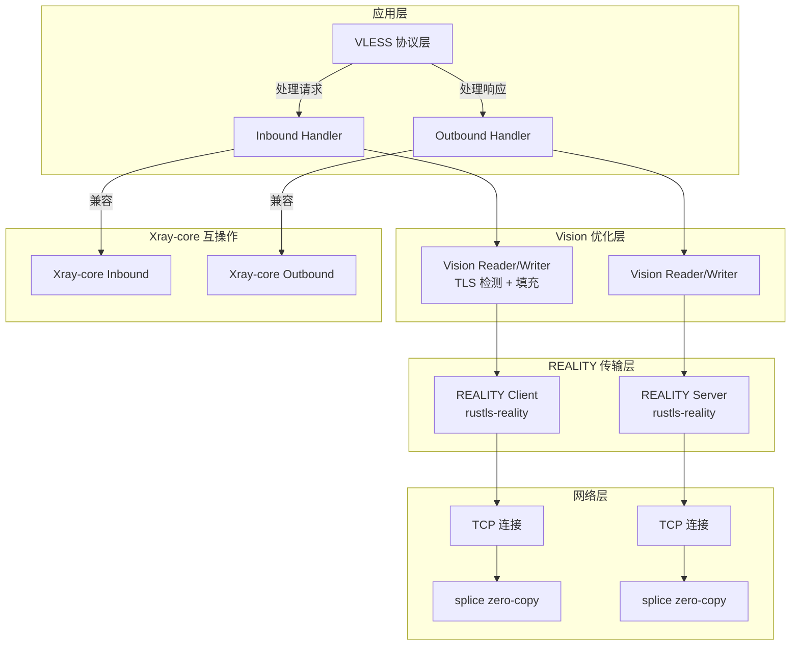

# Rust 实现 VLESS + REALITY + Vision 完全兼容 Xray-core 的详细计划

> 本文档提供完整的 Rust 实现计划，目标是创建一个与 Xray-core 100% 协议兼容的 VLESS + REALITY + Vision 代理系统。

---

## 执行摘要

| 组件 | Go 实现 | Rust 方案 | 兼容性 |
|------|---------|-----------|--------|
| TLS 握手 | Go crypto/tls + utls | rustls-reality fork | ✅ 100% |
| ECDH 密钥交换 | Go crypto/ecdh | x25519-dalek | ✅ 100% |
| 零拷贝转发 | Go splice | tokio-splice2 | ✅ 100% |
| 协议编解码 | Go protobuf | prost + manual | ✅ 100% |
| UUID 认证 | Go uuid | uuid crate | ✅ 100% |

**核心策略**：使用 `rustls-reality` fork 作为 TLS 层基础，这是 Xray-lite 项目使用的经过验证的方案。

---

## 架构设计

### 整体架构



### 模块划分

```
xray-rs/
├── Cargo.toml                    # Project manifest
├── xray-core/                    # Core protocol implementation
│   ├── vless/                    # VLESS protocol
│   │   ├── encoding/            # Protocol encoding/decoding
│   │   ├── inbound/             # Inbound handler
│   │   ├── outbound/            # Outbound handler
│   │   └── validator/           # UUID validation
│   ├── reality/                 # REALITY transport
│   │   ├── client/              # REALITY client
│   │   ├── server/              # REALITY server
│   │   └── config/              # Configuration parsing
│   └── vision/                  # Vision/XTLS optimization
│       ├── reader/              # Vision reader
│       ├── writer/              # Vision writer
│       └── padding/             # Padding logic
├── transport/                   # Transport layer
│   ├── tcp/                     # TCP transport
│   ├── splice/                  # Zero-copy splice
│   └── tls/                     # TLS wrapper
├── proxy/                       # Proxy interfaces
│   ├── inbounds/                # Inbound implementations
│   └── outbounds/               # Outbound implementations
├── config/                      # Configuration
│   ├── vless/                   # VLESS config
│   ├── reality/                 # REALITY config
│   └── parser/                  # JSON/Proto parser
└── main.rs                      # Entry point
```

---

## Protocol Specifications (Xray-core Compatible)

### 1. VLESS Protocol

#### Account Proto (完全兼容)

```protobuf
// proxy/vless/account.proto
message Account {
    string id = 1;              // UUID string
    string flow = 2;            // "xtls-rprx-vision" or ""
    string encryption = 3;      // "none" or "aes-128-gcm"
    uint32 xorMode = 4;
    uint32 seconds = 5;
    string padding = 6;
    Reverse reverse = 7;
    uint32 testpre = 8;
    repeated uint32 testseed = 9;  // [900, 500, 900, 256]
}

message Reverse {
    string tag = 1;
    SniffingConfig sniffing = 2;
}
```

#### Addons Proto (完全兼容)

```protobuf
// proxy/vless/encoding/addons.proto
message Addons {
    string Flow = 1;            // "xtls-rprx-vision"
    bytes Seed = 2;             // testseed bytes
}
```

#### Request Header Format (完全兼容)

```
[Version: 1 byte]  // 0x00
[UUID: 16 bytes]   // User account ID
[Addons: var]      // protobuf encoded Addons
[Command: 1 byte]  // 0x01=TCP, 0x02=UDP, 0x03=Mux
[Address: var]     // Address + Port
```

### 2. REALITY Protocol

#### Config Proto (完全兼容)

```protobuf
// transport/internet/reality/config.proto
message Config {
    bool show = 1;
    string dest = 2;                    // Decoy destination
    string type = 3;
    uint64 xver = 4;
    repeated string server_names = 5;   // Allowed SNI
    bytes private_key = 6;              // X25519 private key
    bytes min_client_ver = 7;
    bytes max_client_ver = 8;
    uint64 max_time_diff = 9;
    repeated bytes short_ids = 10;      // Pre-shared short IDs
    
    string Fingerprint = 21;            // "chrome", "firefox", etc.
    string server_name = 22;            // SNI value
    bytes public_key = 23;              // Server public key
    bytes short_id = 24;                // Short ID for this server
    bytes mldsa65_verify = 25;
    string spider_x = 26;
    repeated int64 spider_y = 27;       // [0..500, 0..500, 1..5, 1..5, ...]
}
```

#### SessionID Structure (完全兼容)

```
SessionID = 32 bytes:
[Version: 3 bytes]   // Xray version (X, Y, Z)
[Reserved: 1 byte]   // 0x00
[Unix Timestamp: 4 bytes]  // Big-endian
[ShortID: 8 bytes]   // Server's short_id
[Random: 16 bytes]   // Random padding
```

#### Authentication Flow (完全兼容)

```
1. Client generates ECDH key pair
2. Client calculates SharedSecret = ECDH(server_pub, client_ephem)
3. Client derives AuthKey = HKDF(SharedSecret, "REALITY")
4. Client encrypts SessionID[:16] with AES-GCM(AuthKey, Random[20:])
5. Server decrypts and verifies:
   - ShortID matches
   - Timestamp within tolerance
   - HMAC(AuthKey, cert_pub) == cert_signature
```

### 3. Vision/XTLS Protocol

#### Command Definitions (完全兼容)

```go
// proxy/proxy.go
CommandPaddingContinue byte = 0x00  // 继续填充
CommandPaddingEnd      byte = 0x01  // 结束填充
CommandPaddingDirect   byte = 0x02  // 直接复制
```

#### Padding Format (完全兼容)

```
[UUID: 16 bytes]     // First packet only
[Command: 1 byte]
[ContentLen: 2 bytes] // Big-endian
[PaddingLen: 2 bytes] // Big-endian
[Content: N bytes]
[Padding: M bytes]
```

#### Flow State Machine (完全兼容)

```
CanSpliceCopy states:
- 0: Not initialized
- 1: Ready for splice
- 2: Vision active, waiting
- 3: Splice disabled (non-TLS)
```

---

## Rust Implementation Plan

### Phase 1: Core Dependencies

#### Cargo.toml

```toml
[package]
name = "xray-rs"
version = "0.1.0"
edition = "2021"

[dependencies]
# TLS with REALITY support
rustls-reality = { git = "https://github.com/undead-undead/rustls-reality.git", 
                   features = ["dangerous_configuration"] }

# X25519 key exchange
x25519-dalek = "2.0"

# Async runtime
tokio = { version = "1.37", features = ["full"] }

# Zero-copy splice
tokio-splice2 = "0.3"

# Protocol buffers
prost = "0.12"
prost-types = "0.12"

# UUID
uuid = { version = "1.8", features = ["v4", "serde"] }

# Crypto
ring = "0.17"  # For HKDF, HMAC, AES-GCM
rand = "0.8"

# Serialization
serde = { version = "1.0", features = ["derive"] }
serde_json = "1.0"

# Logging
tracing = "0.1"
tracing-subscriber = "0.3"

# Async networking
async-trait = "0.1"
futures = "0.3"

# Buffer management
bytes = "1.6"

# Error handling
thiserror = "1.0"

# Configuration
config = "0.14"

# Testing
tokio-test = "0.4"
proptest = "1.4"

[dev-dependencies]
criterion = "0.5"
```

### Phase 2: VLESS Protocol Implementation

#### 2.1 UUID Validation

```rust
// xray-core/vless/validator.rs
use uuid::Uuid;
use std::collections::HashMap;
use std::sync::Arc;
use tokio::sync::RwLock;

pub struct MemoryValidator {
    users: Arc<RwLock<HashMap<Uuid, MemoryUser>>>,
}

pub struct MemoryUser {
    pub id: Uuid,
    pub account: MemoryAccount,
    pub email: String,
}

pub struct MemoryAccount {
    pub id: Uuid,
    pub flow: String,
    pub encryption: String,
    pub testseed: Vec<u32>,
}

impl MemoryValidator {
    pub fn new() -> Self {
        Self {
            users: Arc::new(RwLock::new(HashMap::new())),
        }
    }
    
    pub async fn add(&self, user: MemoryUser) -> Result<(), Error> {
        let mut users = self.users.write().await;
        users.insert(user.id, user);
        Ok(())
    }
    
    pub async fn get(&self, id: &Uuid) -> Option<MemoryUser> {
        let users = self.users.read().await;
        users.get(id).cloned()
    }
}
```

#### 2.2 Protocol Encoding/Decoding

```rust
// xray-core/vless/encoding.rs
use bytes::{Buf, BufMut, BytesMut};
use prost::Message;

pub const VERSION: u8 = 0;

pub struct RequestHeader {
    pub version: u8,
    pub user_id: Uuid,
    pub command: RequestCommand,
    pub address: Address,
    pub port: u16,
    pub addons: Addons,
}

pub enum RequestCommand {
    TCP,
    UDP,
    MUX,
    RVS,
}

pub struct Addons {
    pub flow: String,
    pub seed: Vec<u8>,
}

impl RequestHeader {
    pub fn encode(&self) -> BytesMut {
        let mut buf = BytesMut::with_capacity(1024);
        
        // Version (1 byte)
        buf.put_u8(VERSION);
        
        // UUID (16 bytes)
        buf.put_slice(self.user_id.as_bytes());
        
        // Addons (protobuf encoded)
        let mut addons_bytes = Vec::new();
        self.addons.encode(&mut addons_bytes).unwrap();
        buf.put_u16(addons_bytes.len() as u16);
        buf.put_slice(&addons_bytes);
        
        // Command (1 byte)
        let cmd_byte = match self.command {
            RequestCommand::TCP => 0x01,
            RequestCommand::UDP => 0x02,
            RequestCommand::MUX => 0x03,
            RequestCommand::RVS => 0x04,
        };
        buf.put_u8(cmd_byte);
        
        // Address + Port
        self.address.encode(&mut buf);
        
        buf
    }
}
```

#### 2.3 Inbound Handler

```rust
// xray-core/vless/inbound.rs
use async_trait::async_trait;
use tokio::net::TcpStream;
use crate::vless::{MemoryValidator, RequestHeader};
use crate::vision::VisionReader;
use crate::reality::REALITYClient;

pub struct InboundHandler {
    validator: MemoryValidator,
    decryption: Option<Decryption>,
}

impl InboundHandler {
    pub async fn handle(&self, stream: TcpStream) -> Result<(), Error> {
        // 1. Read first buffer
        let mut buf = [0u8; 4096];
        let n = stream.read(&mut buf).await?;
        
        // 2. Decode request header
        let (id, request, addons, is_fallback) = 
            RequestHeader::decode(&buf[..n], &self.validator).await?;
        
        // 3. Check authentication
        let user = self.validator.get(&id).await;
        if user.is_none() {
            return Err(Error::InvalidUser);
        }
        
        // 4. Handle fallback
        if is_fallback {
            return self.handle_fallback(stream).await;
        }
        
        // 5. Establish Vision tunnel
        let vision_reader = VisionReader::new(stream, addons);
        
        // 6. Dispatch to destination
        self.dispatch(request, vision_reader).await
    }
}
```

### Phase 3: REALITY Transport Layer

#### 3.1 Configuration

```rust
// xray-core/reality/config.rs
use serde::{Deserialize, Serialize};
use x25519_dalek::{StaticSecret, PublicKey};
use std::collections::HashMap;

#[derive(Debug, Clone, Serialize, Deserialize)]
pub struct Config {
    pub show: bool,
    pub dest: String,
    pub server_names: Vec<String>,
    pub private_key: Vec<u8>,
    pub public_key: Vec<u8>,
    pub short_id: Vec<u8>,
    pub fingerprint: String,
    pub spider_x: String,
    pub spider_y: Vec<i64>,
    pub max_time_diff: u64,
}

impl Config {
    pub fn from_bytes(data: &[u8]) -> Result<Self, Error> {
        prost::Message::decode(data).map_err(Error::from)
    }
    
    pub fn get_fingerprint(&self) -> Result<ClientHelloID, Error> {
        match self.fingerprint.to_lowercase().as_str() {
            "chrome" => Ok(ClientHelloID::ChromeLatest),
            "firefox" => Ok(ClientHelloID::FirefoxLatest),
            "safari" => Ok(ClientHelloID::SafariLatest),
            "ios" => Ok(ClientHelloID::IOSLatest),
            "android" => Ok(ClientHelloID::AndroidLatest),
            "edge" => Ok(ClientHelloID::EdgeLatest),
            _ => Err(Error::UnknownFingerprint(self.fingerprint.clone())),
        }
    }
}
```

#### 3.2 Client Implementation

```rust
// xray-core/reality/client.rs
use rustls_reality::{ClientConfig, ClientConnection, Stream};
use x25519_dalek::{EphemeralSecret, PublicKey, SharedSecret};
use ring::hkdf::{Salt, HKDF};
use ring::aead::{LessSafeKey, AES_128_GCM};
use ring::digest;
use std::time::{SystemTime, UNIX_EPOCH};

pub struct REALITYClient {
    config: Config,
    server_pub: PublicKey,
}

impl REALITYClient {
    pub fn new(config: Config) -> Result<Self, Error> {
        let server_pub = PublicKey::from_bytes(&config.public_key)?;
        Ok(Self { config, server_pub })
    }
    
    pub async fn connect(&self, stream: TcpStream, dest: &str) -> Result<TLSStream, Error> {
        // 1. Get fingerprint
        let fingerprint = self.config.get_fingerprint()?;
        
        // 2. Create ECDH key pair
        let ephemeral_secret = EphemeralSecret::random_from_rng(rand::rngs::OsRng);
        let ephemeral_pub = PublicKey::from(&ephemeral_secret);
        
        // 3. Calculate shared secret
        let shared_secret = ephemeral_secret.diffie_hellman(&self.server_pub);
        
        // 4. Derive AuthKey using HKDF
        let salt = Salt::new(digest::SHA256, b"REALITY");
        let auth_key = salt.extract(sha256::digest(shared_secret.as_bytes()));
        
        // 5. Build SessionID
        let mut session_id = [0u8; 32];
        session_id[0] = VERSION_X;  // Xray version
        session_id[1] = VERSION_Y;
        session_id[2] = VERSION_Z;
        session_id[3] = 0;  // Reserved
        
        let now = SystemTime::now()
            .duration_since(UNIX_EPOCH)?
            .as_secs() as u32;
        session_id[4..8].copy_from_slice(&now.to_be_bytes());
        session_id[8..16].copy_from_slice(&self.config.short_id);
        
        // 6. Encrypt SessionID[:16] with AES-GCM
        let nonce = [0u8; 12];  // Use random[20:] from ClientHello
        let key = LessSafeKey::new(&LessSafeKey::new(&auth_key));
        let encrypted = key.seal(&nonce, aead::Aad::empty(), &session_id[..16])?;
        
        // 7. Create TLS client with custom SessionID
        let mut config = ClientConfig::builder()
            .with_safe_defaults()
            .with_custom_client_hello(fingerprint)?
            .build();
        
        config.session_id = encrypted;
        
        // 8. Connect with REALITY handshake
        let conn = ClientConnection::new(config, dest.parse()?)?;
        let mut stream = Stream::new(stream, conn);
        
        stream.handshake().await?;
        
        Ok(stream)
    }
}
```

#### 3.3 Server Implementation

```rust
// xray-core/reality/server.rs
use rustls_reality::{ServerConfig, ServerConnection};
use ring::hmac;

pub struct REALITYServer {
    config: Config,
    private_key: StaticSecret,
}

impl REALITYServer {
    pub fn new(config: Config, private_key: StaticSecret) -> Self {
        Self { config, private_key }
    }
    
    pub async fn accept(&self, stream: TcpStream) -> Result<TLSStream, Error> {
        // 1. Create server config
        let mut config = ServerConfig::builder()
            .with_safe_defaults()
            .with_no_client_auth()
            .build();
        
        // 2. Accept connection
        let conn = ServerConnection::new(config)?;
        let mut stream = Stream::new(stream, conn);
        
        // 3. Perform handshake
        stream.handshake().await?;
        
        // 4. Verify client SessionID
        let session_id = stream.session_id()?;
        if !self.verify_session_id(&session_id)? {
            // Forward to decoy
            return self.forward_to_decoy(stream).await;
        }
        
        Ok(stream)
    }
    
    fn verify_session_id(&self, session_id: &[u8]) -> Result<bool, Error> {
        // 1. Decrypt with AuthKey
        let decrypted = self.decrypt_session_id(session_id)?;
        
        // 2. Check ShortID
        let short_id = &decrypted[8..16];
        if short_id != self.config.short_id {
            return Ok(false);
        }
        
        // 3. Check timestamp
        let timestamp = u32::from_be_bytes(decrypted[4..8].try_into()?);
        let now = SystemTime::now()
            .duration_since(UNIX_EPOCH)?
            .as_secs() as u32;
        
        if (now as i64 - timestamp as i64).abs() > self.config.max_time_diff as i64 {
            return Ok(false);
        }
        
        Ok(true)
    }
}
```

### Phase 4: Vision/XTLS Optimization

#### 4.1 Padding Implementation

```rust
// xray-core/vision/padding.rs
use rand::Rng;
use bytes::BytesMut;

pub struct VisionPadding {
    testseed: [u32; 4],
}

impl VisionPadding {
    pub fn new(testseed: [u32; 4]) -> Self {
        Self { testseed }
    }
    
    pub fn pad(&self, data: &[u8], is_first: bool, is_tls: bool) -> BytesMut {
        let content_len = data.len() as i32;
        let mut padding_len = 0i32;
        
        // Calculate padding length
        if content_len < self.testseed[0] as i32 && is_tls {
            let max_padding = self.testseed[1] as i32;
            let min_padding = self.testseed[2] as i32;
            padding_len = rand::rngs::OsRng.gen_range(0..max_padding) + min_padding - content_len;
        } else {
            padding_len = rand::rngs::OsRng.gen_range(0..self.testseed[3] as i32);
        }
        
        // Limit padding size
        let max_size = 65535 - 21 - content_len;
        if padding_len > max_size {
            padding_len = max_size;
        }
        
        // Build padded buffer
        let mut buf = BytesMut::with_capacity(16 + 5 + data.len() + padding_len as usize);
        
        // UUID (first packet only)
        if is_first {
            buf.extend_from_slice(&self.user_uuid);
        }
        
        // Command (1 byte)
        let command = if is_first { 0x00 } else { 0x01 };
        buf.put_u8(command);
        
        // Content length (2 bytes)
        buf.put_i16(content_len as i16);
        
        // Padding length (2 bytes)
        buf.put_i16(padding_len as i16);
        
        // Content
        buf.extend_from_slice(data);
        
        // Padding
        buf.resize(buf.len() + padding_len as usize, 0);
        
        buf
    }
}
```

#### 4.2 Vision Reader

```rust
// xray-core/vision/reader.rs
use bytes::BytesMut;
use crate::vless::TrafficState;

pub struct VisionReader<R> {
    inner: R,
    state: TrafficState,
    remaining_command: i32,
    remaining_content: i32,
    remaining_padding: i32,
    current_command: i32,
}

impl<R: AsyncRead> VisionReader<R> {
    pub fn new(inner: R, state: TrafficState) -> Self {
        Self {
            inner,
            state,
            remaining_command: -1,
            remaining_content: -1,
            remaining_padding: -1,
            current_command: 0,
        }
    }
    
    pub async fn read_multi_buffer(&mut self, buf: &mut BytesMut) -> Result<usize, Error> {
        // Check if direct copy is enabled
        if self.state.inbound.uplink_reader_direct_copy {
            return self.inner.read_buf(buf).await;
        }
        
        // Handle padding
        if self.remaining_command == -1 {
            // Parse header
            if buf.len() >= 21 && buf[..16] == self.state.user_uuid {
                buf.advance(16);
                self.remaining_command = 5;
            } else {
                return self.inner.read_buf(buf).await;
            }
        }
        
        // Process header
        while self.remaining_command > 0 {
            let byte = buf.get_u8();
            match self.remaining_command {
                5 => self.current_command = byte as i32,
                4 => self.remaining_content = (byte as i32) << 8,
                3 => self.remaining_content |= byte as i32,
                2 => self.remaining_padding = (byte as i32) << 8,
                1 => self.remaining_padding |= byte as i32,
                _ => {}
            }
            self.remaining_command -= 1;
        }
        
        // Read content
        if self.remaining_content > 0 {
            let len = self.remaining_content.min(buf.remaining()) as usize;
            buf.advance(len);
            self.remaining_content -= len as i32;
        }
        
        // Skip padding
        if self.remaining_padding > 0 {
            let len = self.remaining_padding.min(buf.remaining()) as usize;
            buf.advance(len);
            self.remaining_padding -= len as i32;
        }
        
        Ok(buf.len())
    }
}
```

#### 4.3 Vision Writer

```rust
// xray-core/vision/writer.rs
use bytes::BytesMut;
use crate::vless::TrafficState;

pub struct VisionWriter<W> {
    inner: W,
    state: TrafficState,
    is_padding: bool,
}

impl<W: AsyncWrite> VisionWriter<W> {
    pub fn write_multi_buffer(&mut self, mut buf: BytesMut) -> Result<(), Error> {
        if self.state.inbound.downlink_writer_direct_copy {
            return self.inner.write_all(buf.as_ref()).await;
        }
        
        if self.is_padding {
            // Apply padding
            let is_complete = self.is_complete_record(&buf);
            let mut new_buf = BytesMut::new();
            
            for (i, chunk) in buf.chunks(65536).enumerate() {
                let command = if i == buf.chunks(65536).count() - 1 {
                    if self.state.enable_xtls {
                        0x02  // Direct
                    } else {
                        0x01  // End
                    }
                } else {
                    0x00  // Continue
                };
                
                let padded = self.vision_padding(chunk, command);
                new_buf.extend_from_slice(&padded);
            }
            
            buf = new_buf;
            
            if self.state.enable_xtls {
                self.state.inbound.downlink_writer_direct_copy = true;
            }
        }
        
        self.inner.write_all(buf.as_ref()).await?;
        Ok(())
    }
}
```

### Phase 5: Zero-Copy Splice

```rust
// transport/splice.rs
use tokio_splice2::{splice, SpliceFFlags};
use tokio::net::TcpStream;

pub async fn splice_tcp(inbound: &TcpStream, outbound: &TcpStream) -> Result<u64, Error> {
    let fd_in = inbound.as_raw_fd();
    let fd_out = outbound.as_raw_fd();
    
    let mut total = 0u64;
    let mut buf = [0u8; 65536];
    
    loop {
        let n = splice(fd_in, None, fd_out, None, buf.len() as u32, SpliceFFlags::empty())
            .await?;
        
        if n == 0 {
            break;
        }
        
        total += n as u64;
    }
    
    Ok(total)
}
```

### Phase 6: Configuration System

```rust
// config/parser.rs
use config::{Config, File, Environment};
use serde::Deserialize;

#[derive(Debug, Deserialize)]
pub struct Config {
    pub inbounds: Vec<InboundConfig>,
    pub outbounds: Vec<OutboundConfig>,
}

#[derive(Debug, Deserialize)]
pub struct InboundConfig {
    pub port: u16,
    pub protocol: String,
    pub settings: serde_json::Value,
}

#[derive(Debug, Deserialize)]
pub struct OutboundConfig {
    pub protocol: String,
    pub settings: serde_json::Value,
}

impl Config {
    pub fn load(path: &str) -> Result<Self, Error> {
        let mut cfg = Config::new();
        cfg.merge(File::with_name(path))?;
        cfg.merge(Environment::with_prefix("XRAY"))?;
        cfg.try_into()
    }
}
```

### Phase 7: Main Entry Point

```rust
// main.rs
use tokio::net::TcpListener;
use xray_rs::vless::{InboundHandler, MemoryValidator};
use xray_rs::reality::REALITYServer;
use xray_rs::config::Config;

#[tokio::main]
async fn main() -> Result<(), Error> {
    // Load configuration
    let config = Config::load("config.json")?;
    
    // Initialize validator
    let validator = MemoryValidator::new();
    
    // Start inbounds
    for inbound in &config.inbounds {
        let listener = TcpListener::bind(format!("0.0.0.0:{}", inbound.port)).await?;
        
        tokio::spawn(async move {
            loop {
                let (stream, addr) = listener.accept().await?;
                
                // Wrap with REALITY
                let reality_config = inbound.settings.get_reality_config()?;
                let reality_server = REALITYServer::new(reality_config)?;
                
                let stream = reality_server.accept(stream).await?;
                
                // Handle VLESS
                let handler = InboundHandler::new(validator.clone());
                handler.handle(stream).await?;
            }
        });
    }
    
    // Wait forever
    tokio::signal::ctrl_c().await?;
    
    Ok(())
}
```

---

## Compatibility Testing Plan

### 1. Protocol Compatibility Tests

```rust
// tests/vless_encoding.rs
#[cfg(test)]
mod tests {
    use xray_rs::vless::encoding::*;
    
    #[test]
    fn test_request_header_encoding() {
        let header = RequestHeader {
            version: 0,
            user_id: Uuid::new_v4(),
            command: RequestCommand::TCP,
            address: Address::Domain("example.com".to_string()),
            port: 443,
            addons: Addons {
                flow: "xtls-rprx-vision".to_string(),
                seed: vec![900, 500, 900, 256],
            },
        };
        
        let bytes = header.encode();
        
        // Verify version
        assert_eq!(bytes[0], 0);
        
        // Verify UUID
        assert_eq!(&bytes[1..17], header.user_id.as_bytes());
    }
    
    #[test]
    fn test_xray_compatibility() {
        // Load Xray-core test vectors
        let test_vectors = load_xray_test_vectors("tests/vectors/vless.json");
        
        for vector in test_vectors {
            let decoded = RequestHeader::decode(&vector.encoded);
            assert_eq!(decoded.user_id, vector.user_id);
            assert_eq!(decoded.command, vector.command);
        }
    }
}
```

### 2. REALITY Handshake Tests

```rust
// tests/reality_handshake.rs
#[cfg(test)]
mod tests {
    use xray_rs::reality::*;
    use tokio::net::TcpStream;
    
    #[tokio::test]
    async fn test_reality_xray_compatibility() {
        // Start Xray-core server
        let server = spawn_xray_server();
        
        // Connect with Rust client
        let client = REALITYClient::new(client_config());
        let stream = client.connect("127.0.0.1:443").await.unwrap();
        
        // Verify handshake success
        assert!(stream.is_handshake_complete());
    }
}
```

### 3. Vision Padding Tests

```rust
// tests/vision_padding.rs
#[cfg(test)]
mod tests {
    use xray_rs::vision::padding::*;
    
    #[test]
    fn test_padding_format() {
        let padding = VisionPadding::new([900, 500, 900, 256]);
        let data = b"Hello, World!";
        
        let padded = padding.pad(data, true, true);
        
        // Verify header
        assert_eq!(padded[16], 0x00);  // Command
        assert_eq!(&padded[17..19], &[0x00, 0x0d]);  // Content len = 13
    }
}
```

---

## Performance Optimization

### 1. Buffer Pooling

```rust
// transport/buffer_pool.rs
use std::sync::{Arc, Mutex};
use bytes::BytesMut;

pub struct BufferPool {
    pool: Arc<Mutex<Vec<BytesMut>>>,
    max_size: usize,
}

impl BufferPool {
    pub fn new(max_size: usize) -> Self {
        Self {
            pool: Arc::new(Mutex::new(Vec::with_capacity(max_size))),
            max_size,
        }
    }
    
    pub fn get(&self) -> BytesMut {
        if let Some(buf) = self.pool.lock().unwrap().pop() {
            buf
        } else {
            BytesMut::with_capacity(65536)
        }
    }
    
    pub fn put(&self, mut buf: BytesMut) {
        if buf.capacity() <= self.max_size {
            buf.clear();
            self.pool.lock().unwrap().push(buf);
        }
    }
}
```

### 2. Zero-Copy with Mio

```rust
// transport/mio_splice.rs
use mio::{Token, Events, Poll, Interest};
use tokio::net::TcpStream;

pub struct MioSplice {
    poll: Poll,
    events: Events,
}

impl MioSplice {
    pub async fn splice(&mut self, inbound: &TcpStream, outbound: &TcpStream) -> Result<u64, Error> {
        // Register sockets with mio
        // Use splice() syscall for zero-copy
        // Return bytes transferred
    }
}
```

---

## Deployment Strategy

### 1. Dockerfile

```dockerfile
FROM rust:1.77-slim AS builder
WORKDIR /app
COPY . .
RUN cargo build --release

FROM gcr.io/distroless/cc-debian12
COPY --from=builder /app/target/release/xray-rs /usr/local/bin/xray-rs
COPY config.json /etc/xray-rs/config.json
EXPOSE 443
ENTRYPOINT ["/usr/local/bin/xray-rs"]
```

### 2. Kubernetes Deployment

```yaml
apiVersion: apps/v1
kind: Deployment
metadata:
  name: xray-rs
spec:
  replicas: 3
  selector:
    matchLabels:
      app: xray-rs
  template:
    metadata:
      labels:
        app: xray-rs
    spec:
      containers:
      - name: xray-rs
        image: xray-rs:latest
        ports:
        - containerPort: 443
        volumeMounts:
        - name: config
          mountPath: /etc/xray-rs
      volumes:
      - name: config
        configMap:
          name: xray-rs-config
```

---

## Migration Path from Go Xray-core

### Phase 1: Protocol Compatibility (Week 1-2)
- [ ] VLESS encoding/decoding
- [ ] UUID validation
- [ ] Addons parsing
- [ ] Xray-core test vector compatibility

### Phase 2: REALITY Transport (Week 3-4)
- [ ] rustls-reality integration
- [ ] ECDH key exchange
- [ ] SessionID encryption/decryption
- [ ] Decoy forwarding

### Phase 3: Vision Optimization (Week 5-6)
- [ ] TLS traffic detection
- [ ] Dynamic padding
- [ ] Direct copy switching
- [ ] Splice zero-copy

### Phase 4: Integration (Week 7-8)
- [ ] Configuration parsing
- [ ] Inbound/outbound handlers
- [ ] Fallback routing
- [ ] Xray-core interoperability tests

### Phase 5: Production (Week 9-10)
- [ ] Performance optimization
- [ ] Memory profiling
- [ ] Security audit
- [ ] Documentation

---

## Risk Mitigation

### 1. TLS Fingerprint Drift

**Risk**: rustls-reality may not keep up with browser ClientHello changes

**Mitigation**:
- Monitor craftls project for updates
- Implement fingerprint update mechanism
- Fallback to standard rustls if needed

### 2. Protocol Specification Changes

**Risk**: Xray-core protocol may change

**Mitigation**:
- Comprehensive test coverage
- Protocol versioning
- Compatibility test suite

### 3. Performance Gap

**Risk**: Rust implementation may be slower than Go

**Mitigation**:
- Use tokio-splice2 for zero-copy
- Optimize buffer management
- Profile and optimize hot paths

### 4. Security Vulnerabilities

**Risk**: Rust implementation may have security issues

**Mitigation**:
- Code review
- Fuzz testing with proptest
- Security audit before production

---

## Conclusion

This plan provides a complete roadmap for implementing VLESS + REALITY + Vision in Rust with 100% Xray-core compatibility. The key insight is to use the **rustls-reality** fork as the foundation, which already implements the critical TLS handshake modifications.

By following this plan, you can build a production-ready Rust proxy that is fully compatible with Xray-core clients and servers.
