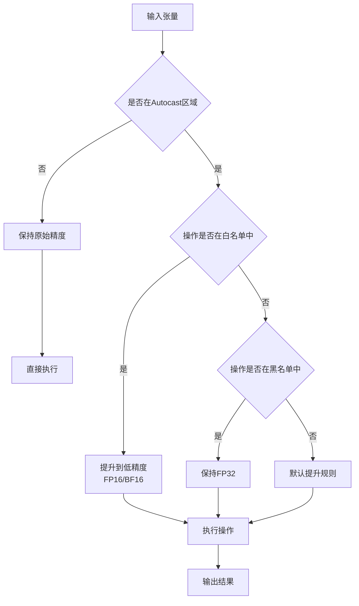
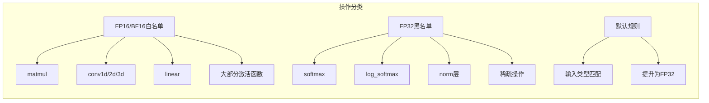
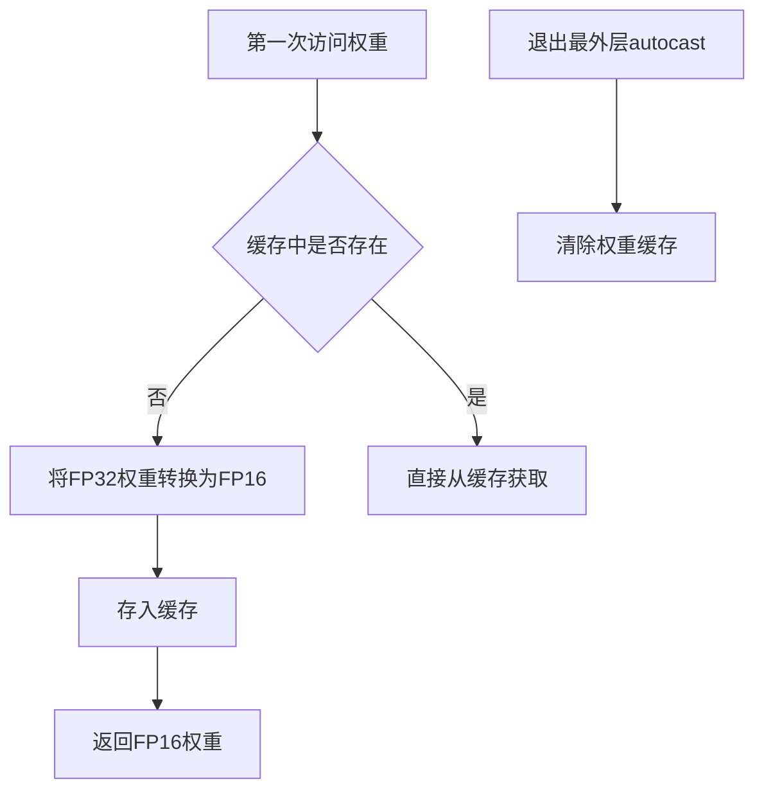
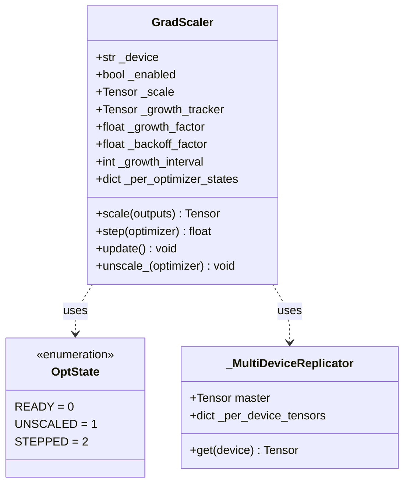
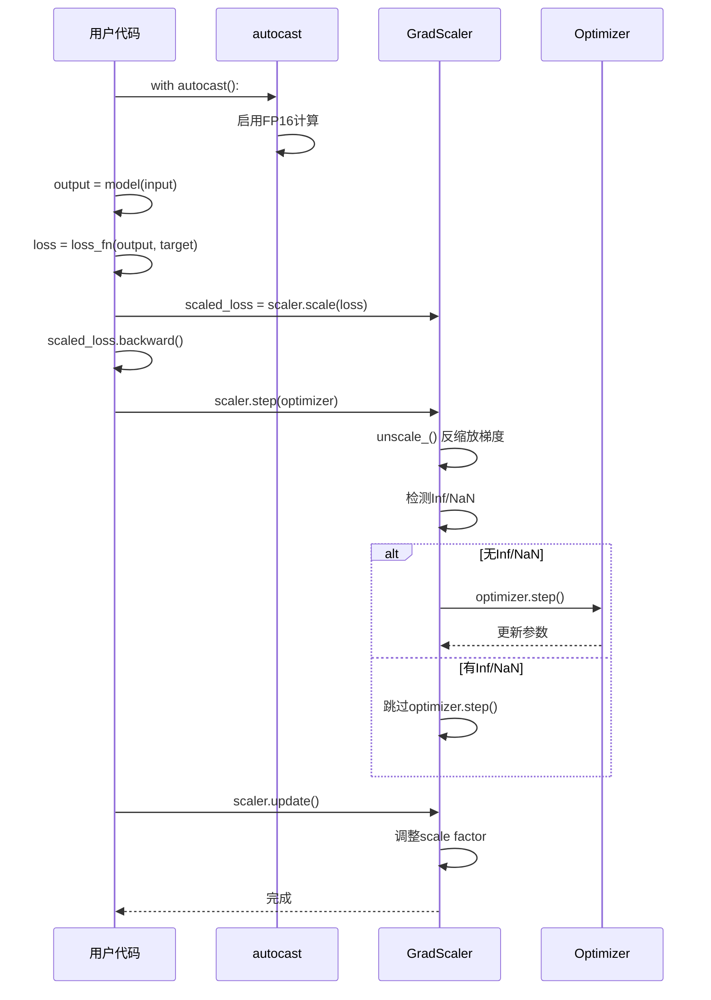
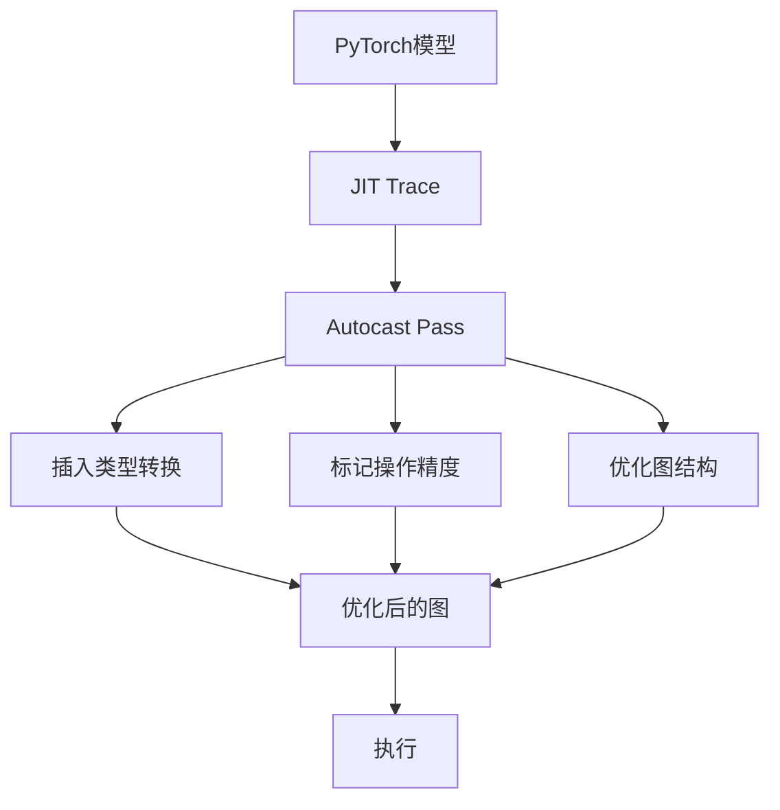

# PyTorch AMP (Automatic Mixed Precision) 深度分析

## 目录
1. [架构概览与设计目标](#1-架构概览与设计目标)
2. [Autocast机制](#2-autocast机制)
3. [GradScaler梯度缩放](#3-gradscaler梯度缩放)
4. [自定义Autograd函数](#4-自定义autograd函数)
5. [设备支持与后端差异](#5-设备支持与后端差异)
6. [JIT与编译器集成](#6-jit与编译器集成)
7. [性能优化与最佳实践](#7-性能优化与最佳实践)

---

## 1. 架构概览与设计目标

### 1.1 什么是AMP

**AMP (Automatic Mixed Precision)** 是PyTorch的自动混合精度训练系统，它能够在保持模型精度的同时，通过使用低精度浮点数(FP16/BF16)加速训练并减少显存占用。

### 1.2 设计目标

```
┌─────────────────────────────────────────────────────────────────┐
│                     AMP 设计目标                                 │
├─────────────────────────────────────────────────────────────────┤
│  1. 自动类型转换: 自动选择合适的精度执行操作                      │
│  2. 无损精度: 保持模型训练精度和收敛性                            │
│  3. 性能优化: 利用Tensor Core加速计算                            │
│  4. 显存节省: FP16比FP32减少50%显存占用                          │
│  5. 易用性: 最小化代码改动，透明集成                              │
│  6. 梯度缩放: 防止FP16梯度下溢                                    │
└─────────────────────────────────────────────────────────────────┘
```

### 1.3 核心组件架构


### 1.4 核心文件位置

| 组件 | 文件路径 | 描述 |
|------|----------|------|
| Autocast | `torch/amp/autocast_mode.py` | 自动类型转换核心 |
| GradScaler | `torch/amp/grad_scaler.py` | 梯度缩放实现 |
| CUDA Autocast | `torch/cuda/amp/autocast_mode.py` | CUDA特定实现(已弃用) |
| CUDA GradScaler | `torch/cuda/amp/grad_scaler.py` | CUDA梯度缩放(已弃用) |
| CPU Autocast | `torch/cpu/amp/autocast_mode.py` | CPU AMP支持 |
| JIT Autocast | `torch/csrc/jit/passes/autocast.cpp` | JIT编译器集成 |

---

## 2. Autocast机制

### 2.1 Autocast工作原理



### 2.2 autocast类设计

```python
class autocast:
    """自动混合精度上下文管理器/装饰器"""

    def __init__(
        self,
        device_type: str,           # 设备类型: 'cuda', 'cpu', 'xpu'等
        dtype: _dtype | None = None, # 目标类型: float16, bfloat16
        enabled: bool = True,        # 是否启用
        cache_enabled: bool | None = None,  # 是否启用权重缓存
    ):
        # 默认类型: CUDA=float16, CPU=bfloat16
        self.fast_dtype = torch.get_autocast_dtype(device_type) if dtype is None else dtype
        self.device = device_type
        self._enabled = enabled
        self._cache_enabled = cache_enabled

    def __enter__(self):
        # 保存当前状态
        self.prev = torch.is_autocast_enabled(self.device)
        self.prev_fastdtype = torch.get_autocast_dtype(self.device)

        # 启用新的autocast状态
        torch.set_autocast_enabled(self.device, self._enabled)
        torch.set_autocast_dtype(self.device, self.fast_dtype)
        torch.autocast_increment_nesting()
        torch.set_autocast_cache_enabled(self._cache_enabled)

    def __exit__(self, exc_type, exc_val, exc_tb):
        # 恢复之前的状态
        if torch.autocast_decrement_nesting() == 0:
            torch.clear_autocast_cache()
        torch.set_autocast_enabled(self.device, self.prev)
        torch.set_autocast_dtype(self.device, self.prev_fastdtype)
```

### 2.3 操作类型分类



### 2.4 类型提升规则

| 操作类型 | 输入类型 | 执行类型 | 输出类型 |
|----------|----------|----------|----------|
| conv2d | float32 | float16 | float16 |
| linear | float32 | float16 | float16 |
| matmul | float32 | float16 | float16 |
| softmax | float32 | float32 | float32 |
| batch_norm | float32 | float32 | float32 |
| add | float16 + float32 | float32 | float32 |

### 2.5 权重缓存机制



```python
# 权重缓存避免重复转换
class autocast:
    def __enter__(self):
        # ...
        torch.set_autocast_cache_enabled(self._cache_enabled)

    def __exit__(self, ...):
        # 只在退出最外层autocast时清除缓存
        if torch.autocast_decrement_nesting() == 0:
            torch.clear_autocast_cache()
```

---

## 3. GradScaler梯度缩放

### 3.1 梯度缩放原理

```mermaid
flowchart TD
    subgraph "梯度下溢问题"
        A[FP32梯度] --> B[转换为FP16]
        B -->|小梯度值| C[下溢为0]
        C --> D[模型无法更新]
    end

    subgraph "梯度缩放解决方案"
        E[原始损失] --> F[* scale factor]
        F --> G[放大后的损失]
        G --> H[反向传播]
        H --> I[放大的梯度]
        I --> J[/ scale factor]
        J --> K[原始梯度]
    end
```

### 3.2 GradScaler类架构



### 3.3 缩放因子动态调整

```mermaid
stateDiagram-v2
    [*] --> READY: 初始化
    READY --> UNSCALED: unscale_()
    UNSCALED --> STEPPED: step()
    STEPPED --> READY: update()

    subgraph "缩放调整逻辑"
        A["检测Inf/NaN"] -->|发现| B["scale *= backoff_factor"]
        A -->|未发现| C{连续无Inf?}
        C -->|是(growth_interval)| D[scale *= growth_factor]
        C -->|否| E[保持scale]
    end
```

### 3.4 GradScaler执行流程

```python
class GradScaler:
    def __init__(
        self,
        device: str = "cuda",
        init_scale: float = 2.0**16,    # 初始缩放因子
        growth_factor: float = 2.0,      # 增长因子
        backoff_factor: float = 0.5,     # 回退因子
        growth_interval: int = 2000,     # 增长间隔
        enabled: bool = True,
    ):
        self._init_scale = init_scale
        self._scale = None  # 延迟初始化
        self._growth_factor = growth_factor
        self._backoff_factor = backoff_factor
        self._growth_interval = growth_interval
        self._per_optimizer_states = defaultdict(_refresh_per_optimizer_state)

    def scale(self, outputs):
        """缩放损失或输出"""
        if not self._enabled:
            return outputs

        if self._scale is None:
            # 延迟初始化scale张量
            self._lazy_init_scale_growth_tracker(outputs.device)

        return outputs * self._scale

    def unscale_(self, optimizer):
        """反缩放梯度，检查Inf/NaN"""
        # 计算反缩放因子
        inv_scale = self._scale.double().reciprocal().float()
        found_inf = torch.full((), 0.0, dtype=torch.float32, device=self._scale.device)

        # 遍历所有梯度并反缩放
        for group in optimizer.param_groups:
            for param in group["params"]:
                if param.grad is not None:
                    # 使用C++内核批量处理
                    torch._amp_foreach_non_finite_check_and_unscale_(
                        [param.grad],
                        found_inf,
                        inv_scale,
                    )

        # 记录每个设备的Inf检测结果
        optimizer_state["found_inf_per_device"] = found_inf
        optimizer_state["stage"] = OptState.UNSCALED

    def step(self, optimizer):
        """执行优化器步进"""
        optimizer_state = self._per_optimizer_states[id(optimizer)]

        if optimizer_state["stage"] is OptState.READY:
            self.unscale_(optimizer)

        # 检查是否有Inf/NaN
        found_inf = optimizer_state["found_inf_per_device"]
        if sum(v.item() for v in found_inf.values()) == 0:
            # 无Inf，执行优化器步进
            retval = optimizer.step()
        else:
            # 有Inf，跳过步进
            retval = None

        optimizer_state["stage"] = OptState.STEPPED
        return retval

    def update(self):
        """更新缩放因子"""
        # 收集所有优化器的Inf检测结果
        found_infs = [
            found_inf
            for state in self._per_optimizer_states.values()
            for found_inf in state["found_inf_per_device"].values()
        ]
        found_inf_combined = sum(found_infs)

        # 调用C++函数更新scale
        torch._amp_update_scale_(
            self._scale,
            self._growth_tracker,
            found_inf_combined,
            self._growth_factor,
            self._backoff_factor,
            self._growth_interval,
        )

        # 重置优化器状态
        self._per_optimizer_states.clear()
```

### 3.5 完整训练流程



---

## 4. 自定义Autograd函数

### 4.1 custom_fwd和custom_bwd

```mermaid
flowchart TD
    subgraph "自定义函数AMP支持"
        A[自定义Function] --> B[@custom_fwd]
        A --> C[@custom_bwd]

        B --> D[前向传播<br/>保持autocast状态]
        C --> E[反向传播<br/>恢复前向的autocast状态]

        D --> F[保存状态标记]
        E --> G[读取状态标记]
    end
```

### 4.2 装饰器实现

```python
def custom_fwd(fwd=None, *, device_type: str, cast_inputs: _dtype | None = None):
    """自定义autograd函数的前向装饰器"""

    @functools.wraps(fwd)
    def decorate_fwd(*args, **kwargs):
        # 保存当前的autocast状态
        args[0]._dtype = torch.get_autocast_dtype(device_type)

        if cast_inputs is None:
            # 不强制转换，内部操作使用当前autocast状态
            args[0]._fwd_used_autocast = torch.is_autocast_enabled(device_type)
            return fwd(*args, **kwargs)
        else:
            # 强制转换输入类型，然后禁用autocast
            autocast_context = torch.is_autocast_enabled(device_type)
            args[0]._fwd_used_autocast = False
            if autocast_context:
                with autocast(device_type=device_type, enabled=False):
                    # 转换输入参数类型
                    return fwd(
                        *_cast(args, device_type, cast_inputs),
                        **_cast(kwargs, device_type, cast_inputs),
                    )
            else:
                return fwd(*args, **kwargs)

    return decorate_fwd


def custom_bwd(bwd=None, *, device_type: str):
    """自定义autograd函数的反向装饰器"""

    @functools.wraps(bwd)
    def decorate_bwd(*args, **kwargs):
        # 恢复前向传播时的autocast状态
        with autocast(
            device_type=device_type,
            enabled=args[0]._fwd_used_autocast,
            dtype=args[0]._dtype,
        ):
            return bwd(*args, **kwargs)

    return decorate_bwd
```

### 4.3 使用示例

```python
class MyCustomFunction(torch.autograd.Function):
    @staticmethod
    @torch.amp.custom_fwd(device_type='cuda', cast_inputs=torch.float16)
    def forward(ctx, input):
        ctx.save_for_backward(input)
        # 前向逻辑
        return output

    @staticmethod
    @torch.amp.custom_bwd(device_type='cuda')
    def backward(ctx, grad_output):
        input, = ctx.saved_tensors
        # 反向逻辑，自动恢复前向的autocast状态
        return grad_input
```

---

## 5. 设备支持与后端差异

### 5.1 设备类型矩阵

| 设备 | FP16支持 | BF16支持 | Autocast可用 | 推荐类型 |
|------|----------|----------|--------------|----------|
| CUDA | 是 | Volta+ | 是 | float16 |
| CPU | 否 | 是 | 是 | bfloat16 |
| XPU | 是 | 是 | 是 | float16 |
| MPS | 是 | macOS 14+ | 是 | float16 |
| HPU | 是 | 是 | 是 | float16 |
| MTIA | 是 | 是 | 是 | float16 |

### 5.2 设备特定初始化

```python
# CUDA - 默认float16
with torch.amp.autocast(device_type='cuda'):
    # 使用FP16
    pass

# CPU - 默认bfloat16
with torch.amp.autocast(device_type='cpu'):
    # 使用BF16
    pass

# 显式指定dtype
with torch.amp.autocast(device_type='cuda', dtype=torch.bfloat16):
    # 使用BF16 (需要Ampere+)
    pass
```

### 5.3 设备能力检查

```python
def is_autocast_available(device_type: str) -> bool:
    """检查设备是否支持autocast"""
    return torch._C._is_autocast_available(device_type)

# CUDA检查
if torch.cuda.is_available() and torch.cuda.is_bf16_supported():
    # 支持BF16
    pass

# MPS BF16检查
if torch.backends.mps.is_macos_or_newer(14, 0):
    # MPS支持BF16
    pass
```

---

## 6. JIT与编译器集成

### 6.1 JIT Autocast Pass



### 6.2 Dynamo/Inductor集成

```python
# torch.compile自动处理AMP
@torch.compile
@torch.amp.autocast(device_type='cuda')
def forward(self, x):
    return self.model(x)

# Dynamo捕获时会保留autocast上下文
# Inductor后端会生成融合的低精度内核
```

### 6.3 PreDispatch Tracing支持

```python
# 用于torch.export.export保留autocast
def _enter_autocast(*vals):
    """用于pre-dispatch tracing时插入图"""
    mode = _UnmanagedAutocast(*vals)
    mode.__enter__()
    return mode

def _exit_autocast(mode):
    """用于pre-dispatch tracing时插入图"""
    mode.__exit__(None, None, None)
```

---

## 7. 性能优化与最佳实践

### 7.1 使用模式

```python
# 标准训练循环
scaler = torch.amp.GradScaler('cuda')

for epoch in epochs:
    for input, target in data:
        optimizer.zero_grad()

        # 只包装前向传播
        with torch.amp.autocast(device_type='cuda'):
            output = model(input)
            loss = loss_fn(output, target)

        # 缩放和反向传播
        scaler.scale(loss).backward()
        scaler.step(optimizer)
        scaler.update()
```

### 7.2 梯度累积

```python
# 梯度累积场景
scaler = torch.amp.GradScaler('cuda')
accumulation_steps = 4

for i, (input, target) in enumerate(data):
    with torch.amp.autocast(device_type='cuda'):
        output = model(input)
        loss = loss_fn(output, target) / accumulation_steps

    scaler.scale(loss).backward()

    if (i + 1) % accumulation_steps == 0:
        scaler.step(optimizer)
        scaler.update()
        optimizer.zero_grad()
```

### 7.3 梯度裁剪

```python
# 在unscale_之后裁剪
scaler.scale(loss).backward()
scaler.unscale_(optimizer)

# 此时梯度是unscaled的，可以安全裁剪
torch.nn.utils.clip_grad_norm_(model.parameters(), max_norm)

scaler.step(optimizer)
scaler.update()
```

### 7.4 多模型多优化器

```python
# 多个优化器共享一个scaler
scaler = torch.amp.GradScaler('cuda')

for input, target in data:
    optimizer1.zero_grad()
    optimizer2.zero_grad()

    with torch.amp.autocast(device_type='cuda'):
        output1 = model1(input)
        output2 = model2(output1)
        loss = loss_fn(output2, target)

    scaler.scale(loss).backward()

    # scaler跟踪每个优化器的状态
    scaler.step(optimizer1)
    scaler.step(optimizer2)
    scaler.update()
```

### 7.5 性能检查清单

| 优化项 | 说明 |
|--------|------|
| 启用TF32 | `torch.backends.cuda.matmul.allow_tf32 = True` |
| 使用channels_last | `model = model.to(memory_format=torch.channels_last)` |
| 融合优化器 | 使用`torch.optim._multi_tensor`优化器 |
| 避免CPU-GPU同步 | 减少`.item()`调用 |
| 使用torch.compile | 自动融合低精度内核 |

### 7.6 常见问题与解决方案

```python
# 问题1: Loss scaling导致的NaN
# 解决: 调整初始scale或growth_interval
scaler = torch.amp.GradScaler('cuda', init_scale=2.0**10, growth_interval=500)

# 问题2: 某些操作不支持FP16
# 解决: 在autocast区域内禁用局部autocast
with torch.amp.autocast(device_type='cuda'):
    x = model.layer1(x)
    with torch.amp.autocast(device_type='cuda', enabled=False):
        # 强制FP32
        x = x.float()
        x = unsupported_op(x)
    x = model.layer2(x)

# 问题3: 类型不匹配错误
# 解决: 退出autocast后显式转换
with torch.amp.autocast(device_type='cuda'):
    fp16_tensor = model(input)

# 需要与其他FP32张量操作前转换
fp32_tensor = fp16_tensor.float()
result = torch.mm(fp32_tensor, other_fp32)
```

---

## 8. 总结

### 8.1 AMP核心价值

1. **性能提升**: 利用Tensor Core可获得2-8倍训练加速
2. **显存节省**: FP16相比FP32减少50%显存占用
3. **易用性**: 最小代码改动，透明自动类型转换
4. **精度保持**: 通过梯度缩放和智能类型选择保持模型精度

### 8.2 关键设计决策

| 决策 | 理由 |
|------|------|
| 白名单/黑名单 | 基于操作特性决定最优执行精度 |
| 权重缓存 | 避免重复类型转换的开销 |
| 延迟初始化 | GradScaler的scale张量在第一次forward时创建 |
| 多设备支持 | 统一的API支持CUDA/CPU/XPU等多种后端 |
| 线程本地状态 | autocast状态是线程本地的，支持多线程训练 |

### 8.3 最佳实践建议

```python
# 1. 只包装前向传播
with torch.amp.autocast(device_type='cuda'):
    output = model(input)
    loss = criterion(output, target)

# 2. 使用GradScaler进行梯度缩放
scaler.scale(loss).backward()
scaler.step(optimizer)
scaler.update()

# 3. 不要在autocast中调用backward
loss.backward()  # 在autocast外部

# 4. 需要修改梯度时先unscale_
scaler.unscale_(optimizer)
# ... 修改梯度 ...
scaler.step(optimizer)

# 5. 检查点保存
ckpt = {
    'model': model.state_dict(),
    'scaler': scaler.state_dict(),  # 保存scaler状态
}
```
