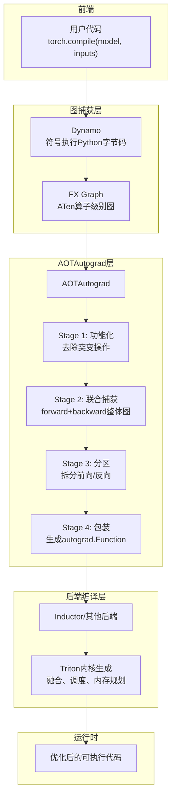
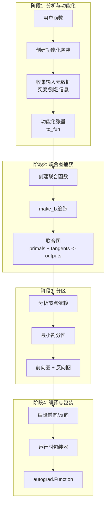
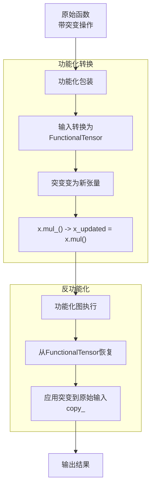
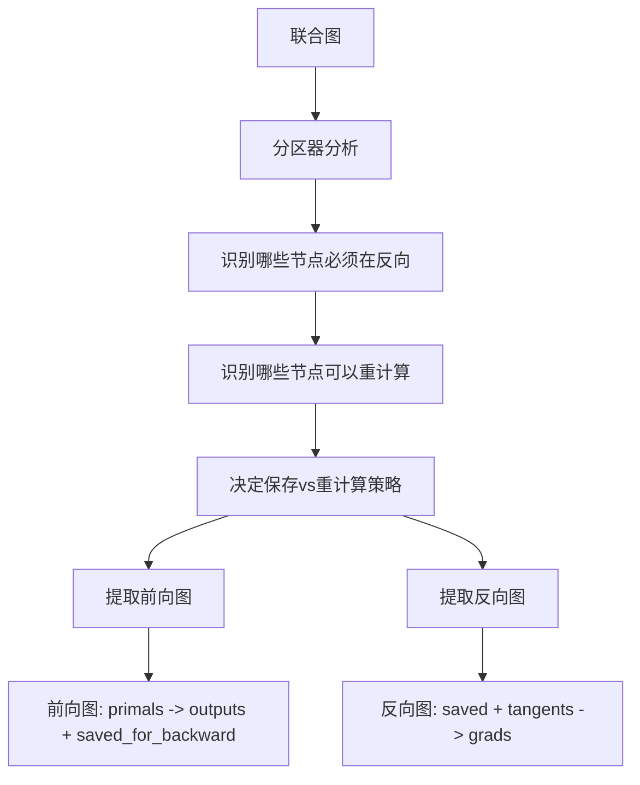
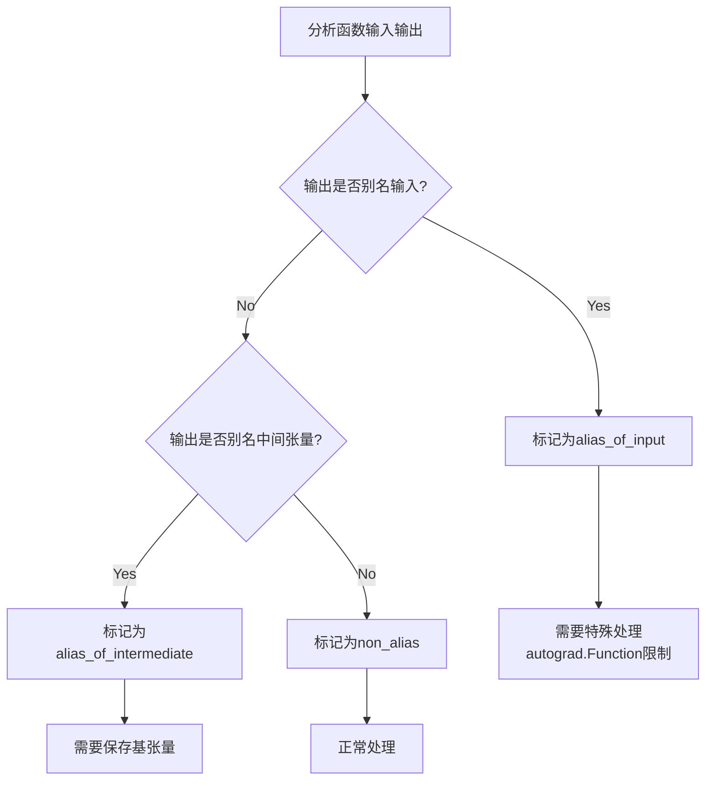
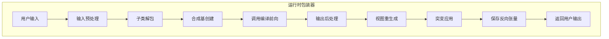
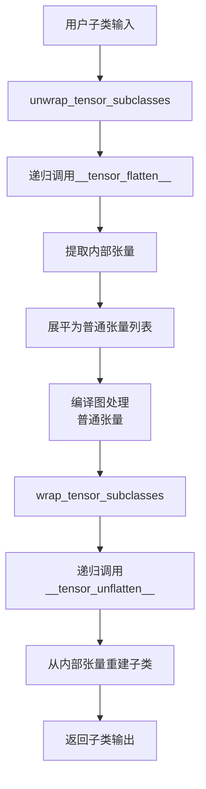
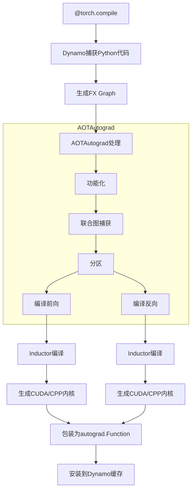
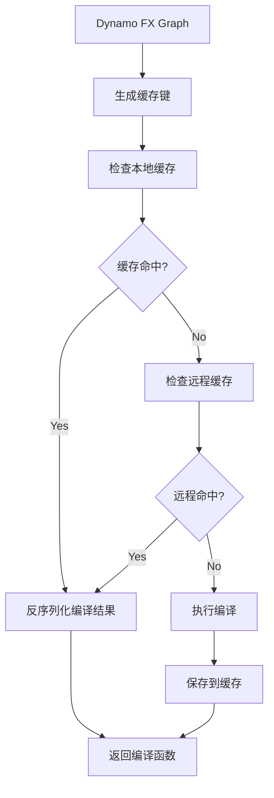
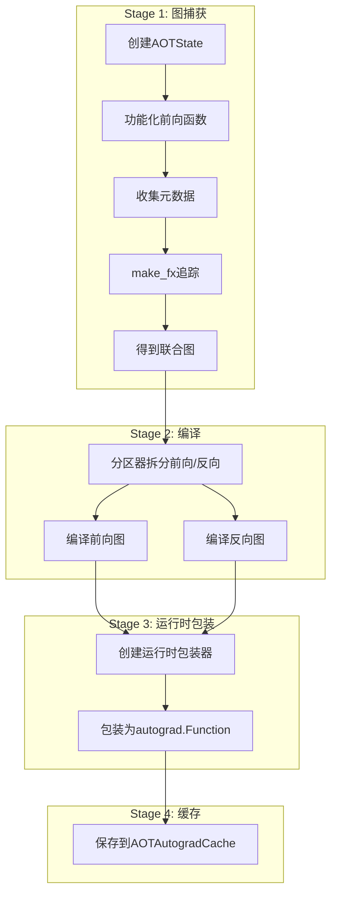

# PyTorch AOTAutograd (Ahead-of-Time Autograd) 深度分析

## 目录
1. [架构概览与设计目标](#1-架构概览与设计目标)
2. [核心概念与数据流](#2-核心概念与数据流)
3. [功能化与突变处理](#3-功能化与突变处理)
4. [联合图捕获](#4-联合图捕获)
5. [分区器策略](#5-分区器策略)
6. [输入输出分析](#6-输入输出分析)
7. [运行时包装器](#7-运行时包装器)
8. [子类处理](#8-子类处理)
9. [别名与视图处理](#9-别名与视图处理)
10. [与Dynamo和Inductor集成](#10-与dynamo和inductor集成)
11. [AOTAutograd缓存机制](#11-aotautograd缓存机制)
12. [编译流程详解](#12-编译流程详解)

---

## 1. 架构概览与设计目标

### 1.1 什么是AOTAutograd

**AOTAutograd**是PyTorch 2.0编译栈的核心组件，负责**提前捕获前向和反向计算图**并进行优化。它解决了Eager模式下反向图动态构建的局限性，允许编译器进行全局优化。

**核心设计目标**：

1. **功能化转换（Functionalization）**：将非功能式操作（inplace、视图）转换为纯函数式操作
2. **联合图捕获**：同时捕获前向和反向图，支持全局内存规划和重计算策略
3. **突变安全**：正确处理输入/输出的突变和别名关系
4. **张量子类支持**：支持NestedTensor等子类的编译
5. **后端无关**：为Inductor、TensorRT、XLA等后端提供统一接口

### 1.2 设计哲学

```
Eager Mode: 前向时构建计算图 -> 反向时动态遍历图 -> 逐个节点计算
AOT Mode:   编译时捕获完整图 -> 静态分析优化 -> 生成优化后的前向/反向内核
```

**优势对比**：

| 方面 | Eager Autograd | AOTAutograd |
|------|----------------|-------------|
| 图可见性 | 反向时逐个节点 | 编译时完整图 |
| 内存规划 | 动态分配 | 静态规划，缓冲区重用 |
| 算子融合 | 有限 | 跨前向/反向的全局融合 |
| 重计算 | 手动 | 自动（checkpointing） |
| 开销 | 每次反向遍历图 | 一次性编译，后续直接执行 |

### 1.3 在编译栈中的位置



### 1.4 核心文件与模块

| 模块 | 路径 | 职责 |
|------|------|------|
| **主入口** | `torch/_functorch/aot_autograd.py` | AOTAutograd主逻辑和API |
| **分区器** | `torch/_functorch/partitioners.py` | 前向/反向图分离策略 |
| **功能化工具** | `torch/_functorch/_aot_autograd/functional_utils.py` | FunctionalTensor转换 |
| **模式定义** | `torch/_functorch/_aot_autograd/schemas.py` | 数据结构定义（ViewAndMutationMeta等） |
| **运行时包装** | `torch/_functorch/_aot_autograd/runtime_wrappers.py` | 运行时包装器生成 |
| **图捕获** | `torch/_functorch/_aot_autograd/graph_capture_wrappers.py` | 联合图捕获逻辑 |
| **元数据收集** | `torch/_functorch/_aot_autograd/collect_metadata_analysis.py` | 前向分析 |
| **子类处理** | `torch/_functorch/_aot_autograd/subclass_utils.py` | 张量子类支持 |
| **缓存** | `torch/_functorch/_aot_autograd/autograd_cache.py` | AOTAutograd缓存 |

---

## 2. 核心概念与数据流

### 2.1 整体数据流



### 2.2 核心数据结构

**ViewAndMutationMeta**：存储输入输出的突变和别名信息的核心元数据结构。

```python
# torch/_functorch/_aot_autograd/schemas.py
@dataclass(eq=False)
class ViewAndMutationMeta:
    # 每个输入的别名信息
    input_info: list[InputAliasInfo]
    # 每个输出的别名信息
    output_info: list[OutputAliasInfo]
    # 中间基张量数量（用于视图输出）
    num_intermediate_bases: int
    # 保留在图中的输入突变
    mutated_graph_handled_indices: list[int]
    # 在运行时才应用的输入突变（需要在epilogue中处理）
    mutated_inp_runtime_indices: list[int]
    # 子类元数据
    subclass_inp_meta: list[PlainTensorMeta | SubclassCreationMeta]
    subclass_fw_graph_out_meta: list[PlainTensorMeta | SubclassCreationMeta]
    subclass_tangent_meta: list[PlainTensorMeta | SubclassCreationMeta]
    # 保存用于反向的张量数量
    num_forward_returns: int
    num_forward: int
    # 其他元数据...
```

**InputAliasInfo**：输入张量的别名和突变信息。

```python
@dataclass(frozen=True)
class InputAliasInfo:
    is_leaf: bool                          # 是否是叶子节点
    mutates_data: bool                     # 是否突变数据
    mutates_metadata: bool                 # 是否突变元数据
    mutations_hidden_from_autograd: bool   # 突变对autograd隐藏
    mutations_under_no_grad_or_inference_mode: bool  # 在no_grad下的突变
    mutation_inductor_storage_resize: bool # 存储大小调整
    mutates_storage_metadata: bool         # 存储元数据突变
    requires_grad: bool                    # 是否需要梯度
    keep_input_mutations: bool             # 是否保留输入突变

    @functools.cached_property
    def mutation_type(self) -> MutationType:
        """判断突变类型：NOT_MUTATED / MUTATED_IN_GRAPH / MUTATED_OUT_GRAPH"""
        if not any([self.mutates_data, self.mutates_metadata, self.mutation_inductor_storage_resize]):
            return MutationType.NOT_MUTATED
        if _check_if_mutation_can_be_in_graph(...):
            return MutationType.MUTATED_IN_GRAPH
        return MutationType.MUTATED_OUT_GRAPH
```

**OutputAliasInfo**：输出张量的别名信息。

```python
@dataclass(frozen=True)
class OutputAliasInfo:
    output_type: OutputType                # 输出类型枚举
    raw_type: type                         # 原始类型
    base_idx: int | None                   # 基张量索引
    dynamic_dims: set[int] | None          # 动态维度
    requires_grad: bool                    # 是否需要梯度
    requires_grad_for_backward: bool       # 反向是否需要梯度
    view_meta_sequence: ViewMetaSequence | None = None  # 视图元数据序列
```

### 2.3 输出类型枚举

```python
OutputType = Enum(
    "OutputType",
    (
        "non_alias",                           # 非别名输出
        "alias_of_input",                      # 别名输入
        "is_input",                            # 就是输入本身
        "alias_of_intermediate_save_as_output", # 中间张量别名，需保存为输出
        "alias_of_intermediate",               # 中间张量别名
        "alias_of_intermediate_base_is_user_output",  # 基是用户输出
        "unsafe_view_alias",                   # 不安全视图别名
        "custom_function_view",                # 自定义函数视图
    ),
)
```

---

## 3. 功能化与突变处理

### 3.1 功能化原理

功能化（Functionalization）是AOTAutograd的核心转换，将非函数式操作转换为纯函数式操作。



**核心代码**（`functional_utils.py`）：

```python
def to_fun(x: torch.Tensor) -> FunctionalTensor:
    """将普通张量转换为功能化张量"""
    if isinstance(x, FunctionalTensor):
        return x
    return FunctionalTensor(x)

def from_fun(x: FunctionalTensor) -> torch.Tensor:
    """从功能化张量恢复普通张量"""
    if not isinstance(x, FunctionalTensor):
        return x
    return x.elem

def has_data_mutation(t: torch.Tensor) -> bool:
    """检查张量是否有数据突变"""
    if not isinstance(t, FunctionalTensor):
        return False
    return torch._functionalize_has_data_mutation(t.elem)

def has_metadata_mutation(t: torch.Tensor) -> bool:
    """检查张量是否有元数据突变（如size/stride变化）"""
    if not isinstance(t, FunctionalTensor):
        return False
    return torch._functionalize_has_metadata_mutation(t.elem)
```

### 3.2 输入突变处理

**设计原理**：AOTAutograd需要发送给后端的图必须是纯函数式的，但用户代码可能包含输入突变。AOTAutograd通过以下方式处理：

1. **图中移除突变**：将突变操作转换为返回新张量的功能式操作
2. **运行时应用突变**：在编译图执行后，通过`copy_`将更新后的值复制回原始输入

```python
# 原始用户代码
def f(x):
    x.mul_(2)           # 输入突变
    out = x.mul(3)
    return out

# AOTAutograd处理后的三个阶段：

# (a) 编译的前向图（完全功能化）
def compiled_forward_graph(x):
    x_updated = x.mul(2)    # 功能化：返回新张量
    out = x_updated.mul(3)
    return x_updated, out   # 返回更新后的输入作为额外输出

# (b) autograd.Function封装
def autograd_Function_forward(x):
    x_updated, out = compiled_forward_graph(x)
    return x_updated, out

# (c) 运行时包装器（执行突变应用）
def compiled_wrapper(x):
    x_updated, out = autograd_Function.apply(x)
    x.copy_(x_updated)      # 将突变应用到原始输入
    return out
```

**突变类型决策逻辑**（`schemas.py`）：

```python
class MutationType(Enum):
    NOT_MUTATED = 1           # 未突变
    MUTATED_IN_GRAPH = 2      # 在图中突变（保留在图中）
    MUTATED_OUT_GRAPH = 3     # 在图外突变（从图中移除，运行时应用）

def _check_if_mutation_can_be_in_graph(
    keep_input_mutations: bool,
    mutates_data: bool,
    mutates_metadata: bool,
    mutations_hidden_from_autograd: bool,
    mutations_under_no_grad_or_inference_mode: bool,
    mutates_storage_metadata: bool,
    mutation_inductor_storage_resize: bool,
    requires_grad: bool,
) -> bool:
    """
    决定输入突变是否可以保留在编译后的图中。

    可以保留在图中的情况：
    1. 推理模式且keep_input_mutations=True
    2. 突变对autograd隐藏（如torch.no_grad()中的突变）
    3. 特定存储操作（如.resize_）
    """
    if keep_input_mutations and mutates_data and not mutates_metadata:
        return True
    if mutations_hidden_from_autograd:
        return True
    if mutates_storage_metadata or mutation_inductor_storage_resize:
        return True
    return False
```

### 3.3 元数据突变处理

```python
# 原始代码
def f(x):
    x.t_()              # 元数据突变（转置）
    out = x.mul(3)
    return out

# 编译的前向图
def compiled_forward_graph(x):
    x_updated = x.t()   # 功能化
    out = x_updated.mul(3)
    return x_updated, out

# 运行时包装器
def compiled_wrapper(x):
    x_updated, out = autograd_Function.apply(x)
    # 应用元数据突变（更新size/stride）
    x.as_strided_(x_updated.size(), x_updated.stride())
    return out
```

---

## 4. 联合图捕获

### 4.1 联合函数定义

**设计原理**：传统的autograd在反向传播时动态构建计算图，这限制了优化机会。AOTAutograd通过提前捕获前向+反向的联合图，允许进行全局优化（如重计算策略、内存规划）。

```python
# torch/_functorch/_aot_autograd/graph_capture_wrappers.py

def create_joint(fn: Callable, num_forward_outputs: int) -> Callable:
    """创建联合前向/反向函数

    联合函数将前向和反向结合在一起，输入包括：
    - primals: 前向输入（原始输入）
    - tangents: 反向梯度输入（对应前向输出的梯度）

    输出包括：
    - 前向输出
    - 输入的梯度
    """
    def joint_forward_backward(primals, tangents):
        # 1. 运行前向
        outs = fn(*primals)

        # 2. 分离可微输出（需要梯度的输出）
        outs_for_grad = [out for out in outs if out.requires_grad]

        # 3. 运行反向
        grads = torch.autograd.grad(
            outs_for_grad,
            primals,
            grad_outputs=tangents,
            create_graph=True,  # 需要创建计算图以进行高阶导数
        )

        # 返回前向输出 + 梯度
        return *outs, *grads

    return joint_forward_backward
```

### 4.2 联合图捕获流程


**代码实现**：

```python
# aot_autograd.py - aot_stage1_graph_capture
def aot_stage1_graph_capture(aot_state: AOTState, flat_fn: Callable) -> AOTGraphCapture:
    # 步骤1: 创建功能化包装
    functional_call = create_functionalized_fn(
        flat_fn,
        aot_state.fw_metadata,
        aot_state.aot_config,
        aot_state.fake_mode,
    )

    # 步骤2: 准备用于联合追踪的函数
    fn_prepped_for_autograd = fn_prepped_for_autograd(
        functional_call,
        aot_state.fw_metadata,
    )

    # 步骤3: 创建联合函数（如果需要反向）
    if aot_state.needs_autograd:
        joint_fn = create_joint(fn_prepped_for_autograd, num_forward_outputs)
    else:
        joint_fn = None

    # 步骤4: 使用make_fx追踪
    with FunctionalTensorMode(...):
        traced_joint = make_fx(joint_fn, ...)(*joint_inputs)

    return AOTGraphCapture(traced_joint=traced_joint, ...)
```

### 4.3 联合图结构

```python
# 联合图的典型结构
"""
graph(%primals_1 : [num_fwd_inputs]
      %tangents_1 : [num_fwd_outputs_requiring_grad]):

    # ===== 前向计算 =====
    %intermediate_1 : Tensor = aten::mul(%primals_1, %primals_2)
    %intermediate_2 : Tensor = aten::sin(%intermediate_1)
    %fwd_output : Tensor = aten::add(%intermediate_2, %primals_3)

    # ===== 反向计算 =====
    # grad_output是tangents
    %grad_intermediate_2 : Tensor = aten::add_backward(%tangents_1, ...)
    %grad_intermediate_1 : Tensor = aten::sin_backward(%grad_intermediate_2, %intermediate_1)
    %grad_primals_1 : Tensor = aten::mul_backward(%grad_intermediate_1, %primals_2)

    return (%fwd_output, %grad_primals_1, %grad_primals_2, ...)
"""
```

---

## 5. 分区器策略

### 5.1 分区器职责

**设计原理**：分区器将联合图拆分为前向图和反向图。核心决策是：**哪些中间结果需要保存用于反向，哪些可以在反向时重计算**。



### 5.2 节点分类

```python
# torch/_functorch/partitioners.py
@dataclass
class OpTypes:
    """算子分类，决定哪些可以重计算"""
    fusible_ops: OrderedSet[Callable]          # 可融合算子（pointwise）
    compute_intensive_ops: OrderedSet[Callable]  # 计算密集型（matmul, conv）
    random_ops: OrderedSet[Callable]           # 随机算子（不可重计算）
    view_ops: OrderedSet[Callable]             # 视图算子
    recomputable_ops: OrderedSet[Callable]     # 可重计算算子

    def is_recomputable(self, node: fx.Node) -> bool:
        """判断算子是否可以在反向重计算

        不可重计算的情况：
        1. 计算密集型（如conv, matmul）- 重计算成本太高
        2. 随机算子 - 需要保持随机状态一致
        3. 用户标记MUST_RECOMPUTE的算子
        """
        target = get_aten_target(node)
        if target in self.compute_intensive_ops:
            return False
        if target in self.random_ops:
            return False
        if must_recompute(node):  # 用户通过checkpoint标记
            return True
        if target not in self.recomputable_ops:
            return False
        return True
```

### 5.3 最小割分区算法

**设计原理**：使用最小割（min-cut）算法决定前向/反向分区。目标是在最小化激活内存的同时，限制重计算成本。

```python
def min_cut_rematerialization_partition(
    joint_graph: fx.Graph,
    options: MinCutOptions
) -> tuple[fx.Graph, fx.Graph]:
    """
    使用最小割算法决定前向/反向分区

    算法步骤：
    1. 找出必须在反向的节点
    2. 找出可以重计算的节点
    3. 构建节点依赖图
    4. 使用启发式或ILP求解最小割
    5. 提取前向图和反向图
    """
    # 1. 识别必须在反向的节点
    required_bw_nodes = find_nodes_required_for_backward(joint_graph)

    # 2. 识别可以重计算的节点
    recomputable_nodes = find_recomputable_nodes(joint_graph, op_types)

    # 3. 构建节点依赖图
    node_dependencies = build_dependency_graph(joint_graph)

    # 4. 使用启发式求解最小割
    saved_nodes = solve_min_cut_with_knapsack(
        nodes=joint_graph.nodes,
        required_bw=required_bw_nodes,
        recomputable=recomputable_nodes,
        dependencies=node_dependencies,
        options=options
    )

    # 5. 提取前向图（包括saved_nodes作为输出）
    forward_graph = extract_forward_graph(
        joint_graph,
        saved_nodes,
        required_fw_nodes
    )

    # 6. 提取反向图
    backward_graph = extract_backward_graph(
        joint_graph,
        saved_nodes,
        required_bw_nodes
    )

    return forward_graph, backward_graph
```

### 5.4 动态规划求解背包问题

**设计原理**：分区问题可以建模为背包问题——在内存预算限制下，选择保存哪些激活值以最小化重计算成本。

```python
def dp_knapsack(
    items: list[Node],
    capacity: int,
    runtime_estimator: Callable[[Node], int]
) -> set[Node]:
    """
    动态规划求解0/1背包问题

    items: 候选保存的节点
    capacity: 内存预算
    runtime_estimator: 估计重计算成本的函数

    返回: 应该保存的节点集合
    """
    n = len(items)
    # dp[i][w] = 使用前i个物品，容量为w时的最大收益
    dp = [[0] * (capacity + 1) for _ in range(n + 1)]

    for i in range(1, n + 1):
        item = items[i - 1]
        cost = get_memory_cost(item)
        value = runtime_estimator(item)  # 重计算成本

        for w in range(capacity + 1):
            if cost <= w:
                dp[i][w] = max(dp[i-1][w], dp[i-1][w-cost] + value)
            else:
                dp[i][w] = dp[i-1][w]

    # 回溯找出选择的节点
    selected = set()
    w = capacity
    for i in range(n, 0, -1):
        if dp[i][w] != dp[i-1][w]:
            selected.add(items[i-1])
            w -= get_memory_cost(items[i-1])

    return selected
```

---

## 6. 输入输出分析

### 6.1 别名分析

**设计原理**：AOTAutograd需要精确追踪张量别名关系，以正确处理：
1. **输出别名输入**：需要特殊处理，因为autograd.Function.forward不能返回对输入的视图
2. **输出别名中间张量**：需要保存中间张量用于反向
3. **输入之间的别名**：需要创建合成基（synthetic base）



### 6.2 输出别名输入的处理

**设计原理**：`autograd.Function.forward`不能返回对输入的视图，因为如果视图在反向前被突变，会导致问题。

```python
# 解决方案：在运行时重新生成视图

def handle_output_aliasing_input(
    output_info: OutputAliasInfo,
    orig_inputs: list[torch.Tensor],
    fw_outs: list[torch.Tensor],
) -> torch.Tensor:
    """处理输出别名输入的情况

    步骤：
    1. 从原始输入获取基张量
    2. 使用view_meta_sequence重新生成视图
    3. 返回重新生成的视图（而非编译图的输出）
    """
    if output_info.output_type == OutputType.alias_of_input:
        base_tensor = orig_inputs[output_info.base_idx]

        # 使用view_meta_sequence重新生成视图
        # 这比as_strided更高效，因为它记录了原始视图操作序列
        return replay_views(
            base_tensor,
            output_info.view_meta_sequence
        )
```

**ViewMetaSequence**：记录视图操作序列，用于高效重放。

```python
class ViewMeta:
    """单个视图操作的元数据"""
    def __init__(self, view_fn: Callable, view_args: tuple):
        self.view_fn = view_fn
        self.view_args = view_args

    def replay(self, base: torch.Tensor) -> torch.Tensor:
        return self.view_fn(base, *self.view_args)

class ViewMetaSequence:
    """视图操作序列"""
    def __init__(self, metas: list[ViewMeta]):
        self.metas = metas

    def replay(self, base: torch.Tensor) -> torch.Tensor:
        """重放所有视图操作"""
        current = base
        for meta in self.metas:
            current = meta.replay(current)
        return current
```

### 6.3 合成基处理

**设计原理**：当两个输入别名同一基张量，其中一个被突变时，需要创建"合成基"统一处理。

```python
# 问题示例
def f(x, x_view):
    x.mul_(2)  # 影响x_view
    return x * x_view
f(x, x.view(-1))

# 解决方案：创建"合成基"
def create_synthetic_base(aliased_inputs: list[torch.Tensor]) -> torch.Tensor:
    """将别名输入合并为单一基张量"""
    # 创建一个包含所有数据的基张量
    base = torch.cat([x.flatten() for x in aliased_inputs])
    return base

def regenerate_from_synthetic_base(
    base: torch.Tensor,
    metadata: list[ViewMeta]
) -> Iterator[torch.Tensor]:
    """从合成基重新生成原始输入"""
    offset = 0
    for meta in metadata:
        size = meta.numel()
        # 从基张量切片重建视图
        yield base[offset:offset+size].view(meta.shape)
        offset += size
```

---

## 7. 运行时包装器

### 7.1 运行时包装器架构

**设计原理**：运行时包装器桥接编译图和Python运行时，处理：
1. 输入预处理（子类解包、合成基创建）
2. 调用编译的前向/反向
3. 输出后处理（视图重生成、突变应用）
4. 保存用于反向的张量



### 7.2 运行时包装器生成

```python
# torch/_functorch/_aot_autograd/runtime_wrappers.py

def create_runtime_wrapper(
    compiled_fw: Callable,
    compiled_bw: Callable | None,
    runtime_metadata: ViewAndMutationMeta,
    indices_to_detach: list[int],
    trace_joint: bool,
    keep_input_mutations: bool,
):
    """创建运行时包装器"""

    def runtime_wrapper(*args):
        # 1. 预处理输入
        # - 解包子类
        # - 创建合成基
        processed_args = preprocess_inputs(args, runtime_metadata)

        # 2. 调用编译的前向
        raw_outputs = compiled_fw(*processed_args)

        # 3. 后处理输出
        # - 分离突变后的输入
        # - 重生成别名输出
        # - 应用视图操作
        outputs = postprocess_outputs(
            raw_outputs,
            args,
            runtime_metadata
        )

        # 4. 应用输入突变（如果需要）
        if keep_input_mutations:
            apply_input_mutations(args, outputs, runtime_metadata)

        # 5. 为反向保存张量
        if trace_joint and compiled_bw is not None:
            setup_backward_save_hooks(outputs, compiled_bw)

        return outputs

    return runtime_wrapper
```

### 7.3 突变应用实现

```python
def apply_input_mutations(
    orig_inputs: list[torch.Tensor],
    fw_outputs: list[torch.Tensor],
    metadata: ViewAndMutationMeta,
) -> None:
    """将突变应用到原始输入

    注意：fw_outputs包含更新后的输入值（作为额外输出）
    """
    # 获取需要运行时处理的突变索引
    for idx in metadata.mutated_inp_runtime_indices:
        input_info = metadata.input_info[idx]

        if input_info.mutates_data:
            # 数据突变：使用copy_
            updated_idx = get_updated_input_index(idx, metadata)
            updated = fw_outputs[updated_idx]
            orig_inputs[idx].copy_(updated)

        elif input_info.mutates_metadata:
            # 元数据突变：使用as_strided_更新size/stride
            updated_idx = get_updated_input_index(idx, metadata)
            updated = fw_outputs[updated_idx]
            orig_inputs[idx].as_strided_(
                updated.size(),
                updated.stride(),
                updated.storage_offset()
            )
```

---

## 8. 子类处理

### 8.1 子类解包与包装

**设计原理**：编译器（如Inductor）只能处理普通张量，不能处理子类（如NestedTensor）。AOTAutograd通过在编译前解包子类、运行后重新包装来支持子类。



### 8.2 子类元数据结构

```python
@dataclass
class SubclassCreationMeta:
    """用于重建子类的元数据

    设计说明：
    - 编译图只接受普通张量，但用户模型可能有子类输入/输出
    - 需要包装/解包装子类来转换用户视图（子类）和编译器视图（普通张量）

    属性：
    - flat_tensor_start_idx: 在展平张量列表中的起始索引
    - arg_count: 包含的内部张量数量（含嵌套子类）
    - attrs: __tensor_flatten__返回的属性和元数据
    - outer_size/outer_stride: 外部尺寸和步长
    - original_subclass_type: 原始子类类型（用于运行时重建）
    """
    flat_tensor_start_idx: int
    arg_count: int
    included_subclass_symints: bool
    attrs: dict[str, SubclassCreationMeta | PlainTensorMeta | OpaqueMeta]
    outer_size: Iterable[IntLikeType | None]
    outer_stride: Iterable[IntLikeType | None]
    meta: Any
    original_subclass: torch.Tensor | None  # 编译时使用
    original_subclass_type: type | None     # 运行时使用
    memory_format: MemoryFormatMeta | None

    def creation_fn(
        self,
        all_args: Sequence[torch.Tensor],
        *,
        is_runtime: bool,
    ) -> torch.Tensor:
        """从展平张量重建子类"""
        inner_tensors: dict[str, torch.Tensor] = {}
        curr_idx = self.flat_tensor_start_idx

        for attr, creation_meta in self.attrs.items():
            if isinstance(creation_meta, PlainTensorMeta):
                inner_tensors[attr] = all_args[curr_idx]
                curr_idx += 1
            elif isinstance(creation_meta, SubclassCreationMeta):
                # 递归处理嵌套子类
                inner_tensors[attr] = creation_meta.creation_fn(
                    all_args, is_runtime=is_runtime
                )
                curr_idx += creation_meta.arg_count

        # 获取子类类型
        subclass_type = (
            self.original_subclass_type if is_runtime
            else type(self.original_subclass)
        )

        # 调用__tensor_unflatten__重建子类
        return subclass_type.__tensor_unflatten__(
            inner_tensors, self.meta,
            self.outer_size, self.outer_stride
        )
```

### 8.3 嵌套子类处理

```python
def unwrap_tensor_subclasses(
    tensor: torch.Tensor,
    *,
    recurse: bool = True
) -> list[torch.Tensor]:
    """递归解包子类

    如果子类的内部张量也是子类，递归解包直到普通张量。
    """
    if not is_traceable_wrapper_subclass(tensor):
        return [tensor]

    # 获取子类内部张量
    attrs, ctx = tensor.__tensor_flatten__()
    inner_tensors = [getattr(tensor, attr) for attr in attrs]

    if recurse:
        result = []
        for t in inner_tensors:
            result.extend(unwrap_tensor_subclasses(t, recurse=True))
        return result
    else:
        return inner_tensors
```

---

## 9. 别名与视图处理

### 9.1 视图重放

**设计原理**：对于别名输出，AOTAutograd存储视图操作序列（而非直接存储张量），在运行时从基张量重新生成。

```python
def gen_alias_from_base(
    base: torch.Tensor,
    target: torch.Tensor,
    requires_grad: bool,
    view_meta_sequence: ViewMetaSequence,
    replay_views: bool = True
) -> torch.Tensor:
    """从基张量重新生成视图

    优势：
    1. 比as_strided更高效（as_strided有额外的安全检查）
    2. 可以处理复杂的视图链（如transpose + slice + reshape）
    """
    if replay_views and view_meta_sequence is not None:
        # 方法1: 视图重放（更高效）
        current = base
        for view_meta in view_meta_sequence.metas:
            current = view_meta.replay(current)
        return current
    else:
        # 方法2: 使用as_strided（通用但可能较慢）
        return torch.as_strided(
            base,
            target.size(),
            target.stride(),
            target.storage_offset()
        )
```

### 9.2 中间基优化

**设计原理**：当输出别名中间张量时，需要保留中间张量用于反向。但如果中间张量也是用户输出，就不需要额外保存。

```python
# output_info.output_type决定如何处理
def handle_intermediate_bases(fw_outputs, metadata):
    """处理中间基张量"""
    saved_bases = []

    for i, info in enumerate(metadata.output_info):
        if info.output_type == OutputType.alias_of_intermediate_save_as_output:
            # 输出别名中间张量，且中间不是用户输出
            # 需要额外保存中间基
            base_idx = info.base_idx
            saved_bases.append(fw_outputs[base_idx])

        elif info.output_type == OutputType.alias_of_intermediate_base_is_user_output:
            # 中间基已经是用户输出，不需要额外保存
            pass

    return saved_bases
```

---

## 10. 与Dynamo和Inductor集成

### 10.1 完整编译流程



### 10.2 配置选项

```python
# torch/_functorch/config.py

class AOTConfig:
    """AOTAutograd配置"""

    # 是否保留推理时的输入突变
    keep_inference_input_mutations: bool = False

    # 分区器选项
    partitioner_config: dict = field(default_factory=dict)

    # 是否使用函数式Rng
    functionalize_rng_ops: bool = False

    # 是否启用自动动态
    enable_auto_dynamic: bool = True

    # 是否猜测切线步长
    guess_tangent_strides_as_outputs: bool = True

    # 静态输入索引（参数和缓冲区）
    static_input_indices: list[int] = field(default_factory=list)

    # 是否预分发
    pre_dispatch: bool = False

    # 是否为导出模式
    is_export: bool = False
```

### 10.3 调试工具

```python
# 查看AOTAutograd生成的图
import torch._logging
torch._logging.set_logs(aot_graphs=True)

# 查看联合图
TORCH_LOGS="aot_joint_graph"

# 查看前向/反向分离后的图
TORCH_LOGS="aot_forward_graph,aot_backward_graph"

# 查看分区器决策
TORCH_LOGS="partitioner"

# 查看所有AOTAutograd日志
TORCH_LOGS="aot"
```

---

## 11. AOTAutograd缓存机制

### 11.1 缓存架构

**设计原理**：AOTAutograd缓存（AOTAutogradCache）用于避免重复编译相同的图，加速后续执行。缓存基于图的哈希键，考虑图结构、输入元数据、配置等。



### 11.2 缓存键生成

```python
# torch/_functorch/_aot_autograd/autograd_cache.py

class AOTAutogradCacheDetails(FxGraphHashDetails):
    """用于计算AOTAutograd缓存键的详细信息

    包含：
    - FX图结构（继承自FxGraphHashDetails）
    - AOT配置
    - 梯度状态
    - AMP状态
    - 确定性算法设置
    - 自动微分配置
    - Triton内核源码（如果使用）
    """
    def __init__(
        self,
        gm: torch.fx.GraphModule,
        example_inputs: Sequence[Any],
        aot_config: AOTConfig,
        fx_config: _CompileFxKwargs,
    ):
        self.aot_config = aot_config
        self.grad_enabled = torch.is_grad_enabled()
        self.disable_amp = torch._C._is_any_autocast_enabled()
        self.deterministic_algorithms = torch.are_deterministic_algorithms_enabled()
        self.autograd_config = config.save_config()

        # 获取Triton内核源码（用于缓存键）
        if has_triton_package():
            self.triton_kernel_source_codes = self.get_triton_source_codes_from_gm(gm)

        # 调用父类初始化（处理FX图哈希）
        super().__init__(gm, example_inputs, fx_config, [])


class AOTAutogradCachePickler(FxGraphCachePickler):
    """自定义pickler，处理AOTAutograd特有的类型"""

    def __init__(self, gm: torch.fx.GraphModule):
        super().__init__(gm)
        self.dispatch_table.update({
            AOTConfig: functools.partial(self._reduce_aot_config),
            torch.Tensor: functools.partial(self._reduce_tensor),
            FakeScriptObject: functools.partial(self._reduce_fake_script_object),
        })

    def _get_stable_hash(self, obj: Any) -> str:
        """生成稳定的哈希值（跨进程一致）

        使用blake2b替代Python的hash()，因为后者受PYTHONHASHSEED影响。
        """
        if hasattr(obj, "_stable_hash_for_caching"):
            return obj._stable_hash_for_caching()
        elif isinstance(obj, torch.Tensor) and is_traceable_wrapper_subclass(obj):
            return self._default_stable_hash_for_caching(obj)
        else:
            metadata = extract_tensor_metadata_for_cache_key(obj)
            return hashlib.blake2b(pickle.dumps(metadata), digest_size=16).hexdigest()
```

### 11.3 缓存安全性检查

```python
def check_cacheable(gm: torch.fx.GraphModule) -> None:
    """检查图模块是否可缓存

    保守策略：只有明确安全的操作才允许缓存。
    """
    nodes = gm.graph.nodes

    # 禁用某些全局配置时不能缓存
    if torch._inductor.config.freezing:
        raise BypassAOTAutogradCache("Cannot cache with freezing enabled")

    if not torch._inductor.config.fx_graph_cache:
        raise BypassAOTAutogradCache("FX graph cache is not enabled")

    for node in nodes:
        check_node_safe(node)


def check_node_safe(node: Node) -> None:
    """检查单个节点是否安全可缓存"""
    SAFE_TORCH_MODULES = ("torch.functional", "torch.nn.functional")
    SAFE_TORCH_FUNCTIONS = (
        "torch.Size", "torch.Tensor", "torch.sym_int",
        "torch._sym_sqrt", "torch.sym_float",
        # ... 更多安全函数
    )

    if node.op == "call_function":
        if not is_cacheable_function(node.target):
            raise BypassAOTAutogradCache(
                f"Unsupported call_function target {node.target}"
            )
    elif node.op == "call_method":
        # 只支持基础张量的方法调用
        method_target = node.args[0]
        if not isinstance(method_target, Node) or not is_tensor(method_target):
            raise BypassAOTAutogradCache(
                f"Unsupported call_method target {method_target}"
            )
    elif node.op in ("placeholder", "get_attr", "call_module", "output"):
        pass  # 这些操作是安全的
    else:
        raise BypassAOTAutogradCache(f"Unsupported node op {node.op}")
```

### 11.4 缓存查找与保存

```python
class AOTAutogradCache(GuardedCache[GenericAOTAutogradResult]):
    """AOTAutograd缓存实现

    继承GuardedCache，支持基于守卫表达式的条件缓存。
    """

    @staticmethod
    def try_load(
        mod: torch.fx.GraphModule,
        args: list[Any],
        aot_config: AOTConfig,
        compiler_config_extra: CompilerConfigExtra | None,
        local: bool,
        remote: bool,
    ) -> Callable[..., Any] | None:
        """尝试从缓存加载"""
        try:
            # 生成缓存键
            cache_key, debug_lines = autograd_cache_key(
                mod, args, aot_config, compiler_config_extra
            )

            # 查找缓存
            result = AOTAutogradCache._lookup(
                cache_key, local, remote, args, cache_info, aot_config
            )

            if result is not None:
                entry, pickled_content = result
                # 重新包装编译结果
                compiled_fn = entry.wrap_post_compile(args, aot_config, fx_config)
                return compiled_fn

        except BypassAOTAutogradCache as e:
            # 不能缓存，降级到重新编译
            counters["aot_autograd"]["autograd_cache_bypass"] += 1
            log.info("Bypassing autograd cache due to: %s", e)

        return None

    @staticmethod
    def save(
        key: str,
        entry: GenericAOTAutogradResult,
        remote: bool
    ) -> None:
        """保存编译结果到缓存"""
        try:
            entry.pre_save()
            content = AOTAutogradCache._pickle_entry(entry, remote)

            if content is None:
                return

            # 写入本地缓存
            AOTAutogradCache._write_to_local_cache(key, content)

            # 写入远程缓存（如果启用）
            if remote:
                remote_cache = AOTAutogradCache.get_remote_cache()
                if remote_cache is not None:
                    cache_data = {
                        "data": base64.b64encode(content).decode("ascii"),
                        "time_taken_ms": time_taken_ms,
                    }
                    remote_cache.put(key, cache_data)

        except Exception as e:
            log.warning("AOTAutograd cache unable to serialize: %s", e)
```

---

## 12. 编译流程详解

### 12.1 四阶段编译流程

AOTAutograd将编译分为四个主要阶段，每个阶段有明确的职责：



### 12.2 主入口函数

```python
# torch/_functorch/aot_autograd.py

def aot_function(
    fn: Callable,
    fw_compiler: AOTDispatchCompiler,
    bw_compiler: AOTDispatchCompiler | None = None,
    partition_fn: Callable = default_partition,
    decompositions: dict | None = None,
    num_params_buffers: int = 0,
    keep_inference_input_mutations: bool = False,
    dynamic: bool = False,
) -> Callable:
    """AOTAutograd主入口函数

    Args:
        fn: 要编译的用户函数
        fw_compiler: 前向图编译器
        bw_compiler: 反向图编译器
        partition_fn: 分区函数（默认min-cut）
        decompositions: 算子分解映射
        dynamic: 是否启用动态形状

    Returns:
        编译后的函数
    """
    aot_config = AOTConfig(
        fw_compiler=fw_compiler,
        bw_compiler=bw_compiler,
        partition_fn=partition_fn,
        decompositions=decompositions,
        num_params_buffers=num_params_buffers,
        keep_inference_input_mutations=keep_inference_input_mutations,
        dynamic_shapes=dynamic,
    )

    @wraps(fn)
    def returned_function(*args, **kwargs):
        # 展平输入
        flat_args = pytree.arg_tree_leaves(*args, **kwargs)

        # Stage 1: 创建AOTState（首次调用时）
        if cached_res is None:
            flat_fn, out_spec = create_tree_flattened_fn(fn, args, kwargs)
            fake_mode, shape_env = construct_fake_mode(flat_args, aot_config)

            with contextlib.ExitStack() as stack:
                aot_state = create_aot_state(
                    stack, flat_fn, fake_flat_args,
                    fake_flat_args_descs, aot_config, fake_mode, shape_env
                )

                # Stage 1: 图捕获
                aot_graph_capture = aot_stage1_graph_capture(aot_state, flat_fn)

                # Stage 2: 编译
                compiled_fn, _ = aot_stage2_compile(
                    aot_state,
                    aot_graph_capture,
                    partition_fn,
                    fw_compiler,
                    bw_compiler,
                    inference_compiler,
                )

                cached_res = (compiled_fn, out_spec)

        # 执行编译后的函数
        cached_fn, out_spec = cached_res
        out = cached_fn(flat_args)
        return out_spec.unflatten(out)

    return returned_function
```

### 12.3 Stage 1: 图捕获详情

```python
def aot_stage1_graph_capture(
    aot_state: AOTState,
    flat_fn: Callable,
) -> AOTGraphCapture:
    """第一阶段：图捕获

    步骤：
    1. 创建功能化包装
    2. 准备用于autograd的函数
    3. 创建联合函数（如需要反向）
    4. 使用make_fx追踪
    """
    fw_metadata = aot_state.fw_metadata
    aot_config = aot_state.aot_config

    # 1. 创建功能化包装
    functional_call = create_functionalized_fn(
        flat_fn,
        fw_metadata,
        aot_config,
        aot_state.fake_mode,
    )

    # 2. 准备用于autograd的函数
    fn_prepped = fn_prepped_for_autograd(
        functional_call,
        fw_metadata,
        aot_config,
    )

    # 3. 创建联合函数（如果训练模式）
    if aot_state.needs_autograd:
        joint_fn = create_joint(
            fn_prepped,
            len(fw_metadata.output_info),
        )
    else:
        joint_fn = None

    # 4. 使用make_fx追踪
    with FunctionalTensorMode(...):
        traced_joint = make_fx(
            joint_fn,
            decomposition_table=aot_config.decompositions,
            tracing_mode="symbolic" if aot_config.dynamic_shapes else "fake",
        )(*joint_inputs)

    return AOTGraphCapture(
        traced_joint=traced_joint,
        fw_metadata=fw_metadata,
    )
```

### 12.4 Stage 2: 编译详情

```python
def aot_stage2_compile(
    aot_state: AOTState,
    aot_graph_capture: AOTGraphCapture,
    partition_fn: Callable,
    fw_compiler: AOTDispatchCompiler,
    bw_compiler: AOTDispatchCompiler | None,
    inference_compiler: AOTDispatchCompiler | None,
) -> tuple[Callable, AOTGraphCapture]:
    """第二阶段：编译

    步骤：
    1. 分区联合图
    2. 编译前向图
    3. 编译反向图（如需要）
    4. 创建运行时包装器
    """
    traced_joint = aot_graph_capture.traced_joint

    if aot_state.needs_autograd:
        # 1. 分区
        fw_module, bw_module = partition_fn(
            traced_joint,
            aot_state.fw_metadata,
        )

        # 2. 编译前向
        compiled_fw = fw_compiler(fw_module, fw_args)

        # 3. 编译反向
        compiled_bw = bw_compiler(bw_module, bw_args) if bw_module else None

    else:
        # 推理模式：直接使用联合图作为前向
        compiled_fw = inference_compiler(traced_joint, fw_args)
        compiled_bw = None

    # 4. 创建运行时包装器
    runtime_wrapper = create_runtime_wrapper(
        compiled_fw,
        compiled_bw,
        aot_state.fw_metadata,
        ...
    )

    return runtime_wrapper, aot_graph_capture
```

---

## 13. 总结

### 13.1 AOTAutograd核心价值

1. **功能化转换**: 将非函数式代码转换为可编译的函数式图，解决突变和别名问题
2. **联合优化**: 同时看到前向和反向，进行全局决策（内存规划、重计算）
3. **内存优化**: 通过智能分区最小化激活内存，支持自动重计算
4. **正确性保证**: 精确处理突变、别名、子类等复杂情况
5. **后端无关**: 为各种编译器后端（Inductor、TensorRT等）提供干净图

### 13.2 关键设计决策

| 决策 | 理由 | 实现位置 |
|------|------|----------|
| 功能化优先 | 函数式图更容易分析和优化 | `functional_utils.py` |
| 联合捕获 | 允许前向/反向联合优化 | `graph_capture_wrappers.py` |
| 最小割分区 | 平衡内存和计算的最佳理论方法 | `partitioners.py` |
| 运行时包装 | 处理Python层面的副作用和别名 | `runtime_wrappers.py` |
| 子类展平 | 编译器不需要了解子类细节 | `subclass_utils.py` |
| 视图重放 | 比as_strided更高效 | `functional_utils.py` |

### 13.3 最佳实践

```python
# 1. 基本使用
@torch.compile
def my_fn(x, y):
    return x @ y

# 2. 自定义编译器
from torch._functorch.aot_autograd import aot_function
from torch._functorch.partitioners import default_partition

def my_compiler(gm, inputs):
    # 自定义编译逻辑
    print(gm)
    return gm.forward

compiled_fn = aot_function(
    my_fn,
    fw_compiler=my_compiler,
    partition_fn=default_partition
)

# 3. 调试技巧
# 查看中间图
with torch._logging.enable_logs("aot_graphs"):
    compiled_fn(x, y)

# 4. 内存优化配置
import torch._functorch.config as config
config.functionalize_rng_ops = True  # 功能化随机操作
config.guess_tangent_strides_as_outputs = True  # 猜测切线步长

# 5. 缓存调试
import logging
logging.getLogger("torch._functorch.autograd_cache").setLevel(logging.DEBUG)
```

### 13.4 常见陷阱

1. **输入突变与梯度**：如果输入同时需要梯度和突变，AOTAutograd可能无法处理某些复杂情况
2. **子类限制**：输出别名在子类场景下有限制
3. **动态形状**：动态形状支持需要额外的守卫检查
4. **随机操作**：默认不功能化随机操作，需要显式启用

