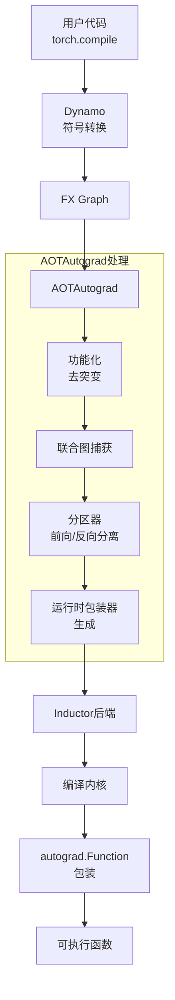
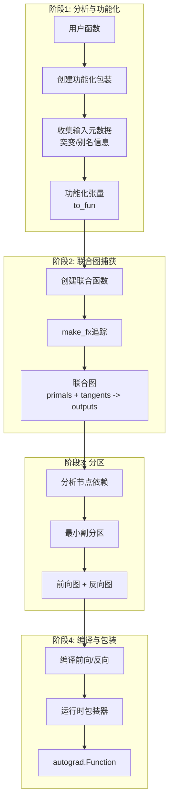
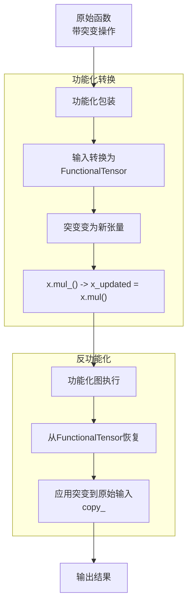
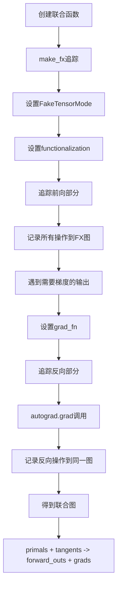
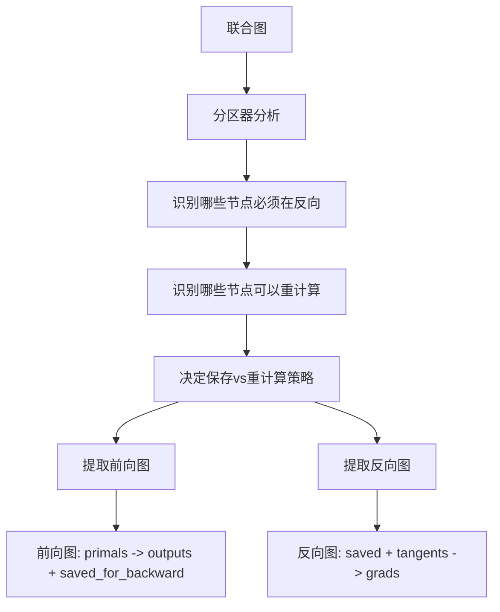
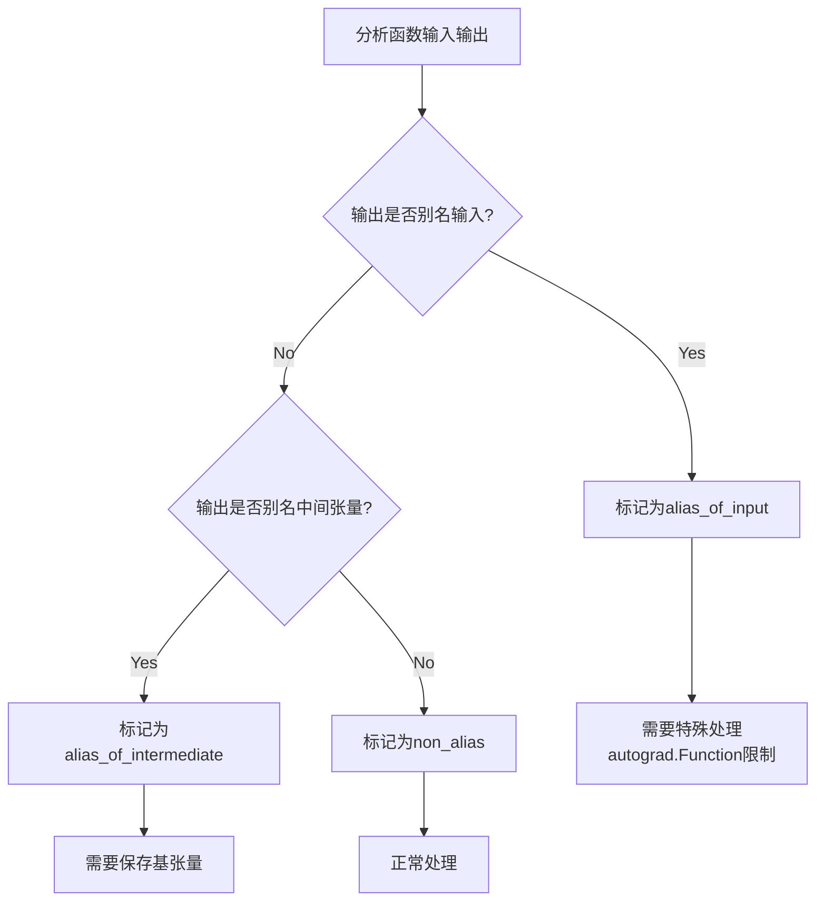
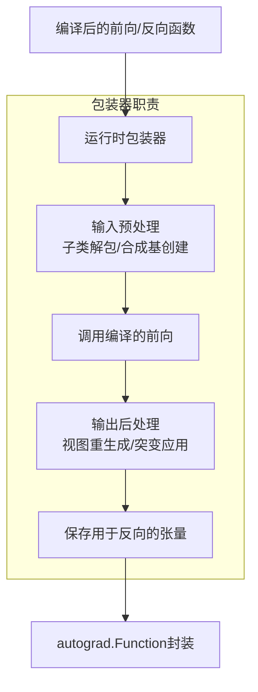
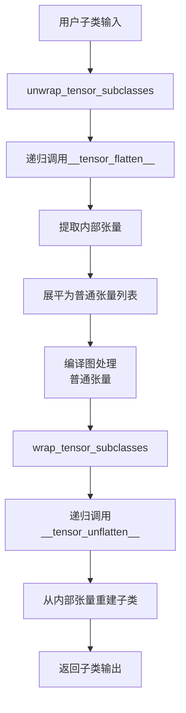
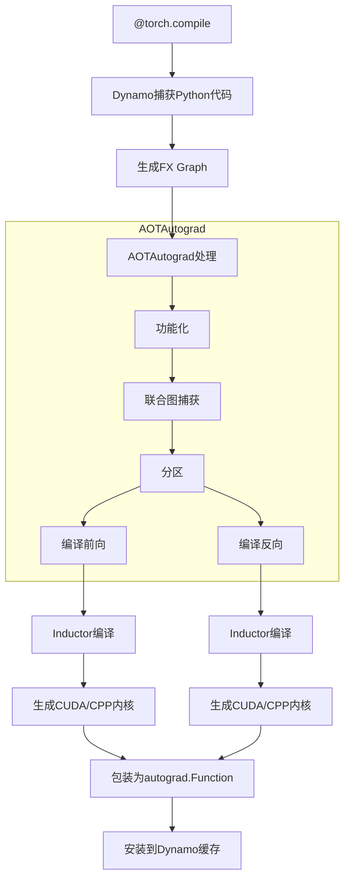

# PyTorch AOTAutograd (Ahead-of-Time Autograd) 深度分析

## 目录
1. [架构概览与设计目标](#1-架构概览与设计目标)
2. [核心概念与数据流](#2-核心概念与数据流)
3. [功能化与突变处理](#3-功能化与突变处理)
4. [联合图捕获](#4-联合图捕获)
5. [分区器策略](#5-分区器策略)
6. [输入输出分析](#6-输入输出分析)
7. [运行时包装器](#7-运行时包装器)
8. [子类处理](#8-子类处理)
9. [别名与视图处理](#9-别名与视图处理)
10. [与Dynamo和Inductor集成](#10-与dynamo和inductor集成)

---

## 1. 架构概览与设计目标

### 1.1 什么是AOTAutograd

**AOTAutograd**是PyTorch中用于**提前捕获前向和反向计算图**的系统。它允许编译器同时看到前向和反向传播，从而进行全局优化（如内存规划、算子融合、重计算策略等）。

### 1.2 设计目标

```
┌─────────────────────────────────────────────────────────────┐
│                    AOTAutograd 设计目标                      │
├─────────────────────────────────────────────────────────────┤
│  1. 功能化: 将突变操作转换为函数式操作                        │
│  2. 联合捕获: 同时捕获前向和反向图                           │
│  3. 智能分区: 决定哪些节点保存/重计算                        │
│  4. 别名处理: 正确处理输入输出别名关系                       │
│  5. 子类支持: 支持张量子类（如NestedTensor）               │
│  6. 与编译器集成: 为Inductor等后端提供干净图               │
└─────────────────────────────────────────────────────────────┘
```

### 1.3 在编译栈中的位置



### 1.4 核心文件位置

| 组件 | 文件路径 | 描述 |
|------|----------|------|
| 主入口 | `torch/_functorch/aot_autograd.py` | AOTAutograd主逻辑 |
| 分区器 | `torch/_functorch/partitioners.py` | 前向/反向分区策略 |
| 功能化工具 | `torch/_functorch/_aot_autograd/functional_utils.py` | 功能化辅助函数 |
| 模式定义 | `torch/_functorch/_aot_autograd/schemas.py` | 数据类型定义 |
| 运行时包装 | `torch/_functorch/_aot_autograd/runtime_wrappers.py` | 运行时包装器 |
| 输入输出分析 | `torch/_functorch/_aot_autograd/input_output_analysis.py` | 别名/突变分析 |
| 图捕获包装 | `torch/_functorch/_aot_autograd/graph_capture_wrappers.py` | 联合图捕获 |
| 子类工具 | `torch/_functorch/_aot_autograd/subclass_utils.py` | 子类处理 |
| 元数据收集 | `torch/_functorch/_aot_autograd/collect_metadata_analysis.py` | 前向元数据收集 |

---

## 2. 核心概念与数据流

### 2.1 整体数据流



### 2.2 核心数据结构

```python
# ViewAndMutationMeta: 存储输入输出的突变和别名信息
@dataclass
class ViewAndMutationMeta:
    input_info: list[InputAliasInfo]      # 每个输入的别名信息
    output_info: list[OutputAliasInfo]    # 每个输出的别名信息
    num_intermediate_bases: int           # 中间基张量数量
    num_outputs_aliased_to_inputs: int    # 输出别名输入的数量
    num_outputs_bases_forwarded_to_backward: int  # 转发到反向的输出基
    num_outputs_total: int                # 总输出数（包括内部输出）
    num_symints_saved_for_backward: int   # 保存的符号整数数量

# InputAliasInfo: 输入张量的别名信息
@dataclass
class InputAliasInfo:
    is_leaf: bool                         # 是否是叶子节点
    mutates_data: bool                    # 是否突变数据
    mutates_metadata: bool                # 是否突变元数据
    mutations_hidden_from_autograd: bool  # 突变对autograd隐藏
    mutations_under_no_grad: bool         # 在no_grad下的突变
    requires_grad: bool                   # 是否需要梯度

# OutputAliasInfo: 输出张量的别名信息
@dataclass
class OutputAliasInfo:
    output_type: OutputType               # 输出类型（非别名/别名输入等）
    base_idx: int | None                  # 基张量索引
    requires_grad: bool                   # 是否需要梯度
    dynamic_dims: set[int] | None         # 动态维度
```

### 2.3 输出类型枚举

```python
OutputType = Enum(
    "OutputType",
    (
        "non_alias",                           # 非别名输出
        "alias_of_input",                      # 别名输入
        "is_input",                            # 就是输入本身
        "alias_of_intermediate_save_as_output", # 中间张量别名，保存为输出
        "alias_of_intermediate",               # 中间张量别名
        "alias_of_intermediate_base_is_user_output",  # 基是用户输出
        "unsafe_view_alias",                   # 不安全视图别名
        "custom_function_view",                # 自定义函数视图
    ),
)
```

---

## 3. 功能化与突变处理

### 3.1 功能化原理



### 3.2 输入突变处理

```python
# 原始用户代码
def f(x):
    x.mul_(2)           # 输入突变
    out = x.mul(3)
    return out

# AOTAutograd处理后:

# 编译的前向图（完全功能化）
def compiled_forward_graph(x):
    x_updated = x.mul(2)    # 功能化：返回新张量
    out = x_updated.mul(3)
    return x_updated, out   # 返回更新后的输入

# 运行时包装器
def compiled_wrapper(x):
    x_updated, out = autograd.Function.apply(x)
    x.copy_(x_updated)      # 将突变应用到原始输入
    return out
```

### 3.3 元数据突变处理

```python
# 原始代码
def f(x):
    x.t_()              # 元数据突变（转置）
    out = x.mul(3)
    return out

# 编译的前向图
def compiled_forward_graph(x):
    x_updated = x.t()   # 功能化
    out = x_updated.mul(3)
    return x_updated, out

# 运行时包装器
def compiled_wrapper(x):
    x_updated, out = autograd.Function.apply(x)
    x.as_strided_(x_updated.size(), x_updated.stride())  # 应用元数据突变
    return out
```

### 3.4 突变类型判断

```python
class MutationType(Enum):
    NOT_MUTATED = 1           # 未突变
    MUTATED_IN_GRAPH = 2      # 在图中突变（保留在图中）
    MUTATED_OUT_GRAPH = 3     # 在图外突变（从图中移除，运行时应用）

def determine_mutation_type(info: InputAliasInfo) -> MutationType:
    if not info.mutates_data and not info.mutates_metadata:
        return MutationType.NOT_MUTATED

    # 决定是否可以保留在图中
    if can_mutate_in_graph(info):
        return MutationType.MUTATED_IN_GRAPH
    else:
        return MutationType.MUTATED_OUT_GRAPH
```

---

## 4. 联合图捕获

### 4.1 联合函数定义

```python
# 联合函数将前向和反向结合在一起
def create_joint_function(forward_fn, num_forward_outputs):
    """创建联合前向/反向函数"""

    def joint_forward_backward(primals, tangents):
        # primals: 前向输入
        # tangents: 反向梯度输入

        # 1. 运行前向
        forward_outputs = forward_fn(*primals)

        # 2. 分离可微输出
        outputs_for_grad = [
            out for out in forward_outputs
            if isinstance(out, torch.Tensor) and out.requires_grad
        ]

        # 3. 运行反向
        grads = torch.autograd.grad(
            outputs_for_grad,
            primals,
            grad_outputs=tangents,
            create_graph=True,  # 需要创建计算图以进行高阶导数
        )

        return *forward_outputs, *grads

    return joint_forward_backward
```

### 4.2 联合图捕获流程



### 4.3 联合图结构

```python
# 联合图的典型结构
"""
graph():
    # 输入
    %primals_1 : [num_fwd_inputs]
    %tangents_1 : [num_fwd_outputs_requiring_grad]

    # 前向计算
    %intermediate_1 = aten.op1(%primals_1)
    %intermediate_2 = aten.op2(%intermediate_1)
    %fwd_output = aten.op3(%intermediate_2)

    # 反向计算（使用tangents）
    %grad_intermediate = aten.op3_backward(%tangents_1, %intermediate_2)
    %grad_input = aten.op2_backward(%grad_intermediate, %intermediate_1)

    return (%fwd_output, %grad_input)
"""
```

---

## 5. 分区器策略

### 5.1 分区器职责



### 5.2 节点分类

```python
@dataclass
class OpTypes:
    """算子分类"""
    fusible_ops: set          # 可融合算子（pointwise）
    compute_intensive_ops: set  # 计算密集型（matmul, conv）
    random_ops: set           # 随机算子
    view_ops: set             # 视图算子
    recomputable_ops: set     # 可重计算算子

    def is_recomputable(self, node) -> bool:
        """判断算子是否可以在反向重计算"""
        target = get_aten_target(node)

        # 不可重计算的算子
        if target in self.compute_intensive_ops:
            return False
        if target in self.random_ops:
            return False
        if must_recompute(node):  # 用户标记必须重计算
            return True
        if target not in self.recomputable_ops:
            return False

        return True
```

### 5.3 最小割分区算法

```python
def min_cut_rematerialization_partition(
    joint_graph: fx.Graph,
    options: MinCutOptions
) -> tuple[fx.Graph, fx.Graph]:
    """
    使用最小割算法决定前向/反向分区

    目标：最小化激活值内存，同时限制重计算成本
    """

    # 1. 识别必须在反向的节点
    required_bw_nodes = find_nodes_required_for_backward(joint_graph)

    # 2. 识别可以重计算的节点
    recomputable_nodes = find_recomputable_nodes(joint_graph)

    # 3. 构建节点依赖图
    node_dependencies = build_dependency_graph(joint_graph)

    # 4. 使用启发式或ILP求解最小割
    saved_nodes = solve_min_cut(
        nodes=joint_graph.nodes,
        required_bw=required_bw_nodes,
        recomputable=recomputable_nodes,
        dependencies=node_dependencies,
        options=options
    )

    # 5. 提取前向图（包括saved_nodes作为输出）
    forward_graph = extract_forward_graph(
        joint_graph,
        saved_nodes
    )

    # 6. 提取反向图（从saved_nodes开始）
    backward_graph = extract_backward_graph(
        joint_graph,
        saved_nodes,
        required_bw_nodes
    )

    return forward_graph, backward_graph
```

### 5.4 分区策略比较

| 策略 | 描述 | 适用场景 |
|------|------|----------|
| 默认分区 | 使用最小割算法平衡内存和计算 | 通用场景 |
| 全部保存 | 保存所有中间结果 | 内存充足，追求速度 |
| 全部重计算 | 反向时重计算所有中间结果 | 内存受限，可接受更多计算 |
| 检查点 | 分段保存中间结果 | 非常深的网络 |

---

## 6. 输入输出分析

### 6.1 别名分析



### 6.2 输出别名输入的处理

```python
# 问题：autograd.Function.forward不能返回对输入的视图
# 因为如果视图被突变，会导致问题

# 解决方案：在运行时重新生成视图

# 编译图返回中间结果
# 运行时从原始输入重新生成视图

def handle_output_aliasing_input(output_info, orig_inputs, fw_outs):
    """处理输出别名输入的情况"""
    if output_info.output_type == OutputType.alias_of_input:
        base_tensor = orig_inputs[output_info.base_idx]

        # 使用view_meta_sequence重新生成视图
        return replay_views(
            base_tensor,
            output_info.view_meta_sequence
        )
```

### 6.3 合成基处理

```python
# 问题：两个输入别名同一基张量，其中一个被突变
# def f(x, x_view):
#     x.mul_(2)  # 影响x_view
#     return x * x_view

# 解决方案：创建"合成基"

def create_synthetic_base(aliased_inputs):
    """将别名输入合并为单一基张量"""
    # 创建一个包含所有数据的基张量
    base = torch.cat([x.flatten() for x in aliased_inputs])
    return base

def regenerate_from_synthetic_base(base, metadata):
    """从合成基重新生成原始输入"""
    # 使用as_strided从基张量重建视图
    for info in metadata:
        yield base.as_strided(info.size, info.stride, info.offset)
```

---

## 7. 运行时包装器

### 7.1 运行时包装器架构



### 7.2 运行时包装器生成

```python
def create_runtime_wrapper(
    compiled_fn,           # 编译后的函数
    runtime_metadata,      # 运行时元数据
    indices_to_detach,     # 需要detach的输入索引
    trace_joint,           # 是否联合追踪
    keep_input_mutations,  # 是否保留输入突变
):
    """创建运行时包装器"""

    def runtime_wrapper(*args):
        # 1. 预处理输入
        processed_args = preprocess_inputs(args, runtime_metadata)

        # 2. 调用编译的前向
        raw_outputs = compiled_fn(*processed_args)

        # 3. 处理后向输出
        outputs = postprocess_outputs(
            raw_outputs,
            args,  # 原始输入（用于别名处理）
            runtime_metadata
        )

        # 4. 应用输入突变（如果需要）
        if keep_input_mutations:
            apply_input_mutations(args, outputs, runtime_metadata)

        return outputs

    return runtime_wrapper
```

### 7.3 突变应用

```python
def apply_input_mutations(orig_inputs, fw_outputs, metadata):
    """将突变应用到原始输入"""
    for i, input_info in enumerate(metadata.input_info):
        if input_info.mutates_data:
            # 数据突变：使用copy_
            updated = fw_outputs[metadata.mutated_input_idx[i]]
            orig_inputs[i].copy_(updated)

        elif input_info.mutates_metadata:
            # 元数据突变：使用as_strided_
            updated = fw_outputs[metadata.mutated_input_idx[i]]
            orig_inputs[i].as_strided_(
                updated.size(),
                updated.stride(),
                updated.storage_offset()
            )
```

---

## 8. 子类处理

### 8.1 子类解包与包装



### 8.2 子类元数据

```python
@dataclass
class SubclassCreationMeta:
    """用于重建子类的元数据"""
    flat_tensor_start_idx: int    # 内部张量起始索引
    arg_count: int                # 内部张量数量
    attrs: dict[str, SubclassCreationMeta | PlainTensorMeta]
    outer_size: tuple             # 外部尺寸
    outer_stride: tuple           # 外部步长
    meta: Any                     # __tensor_flatten__返回的元数据
    original_subclass_type: type  # 原始子类类型

    def compute_outer_size_and_stride(self, all_args):
        """计算外部尺寸和步长（处理符号形状）"""
        # 替换符号整数占位符
        if has_symbolic_sizes:
            return replace_placeholders_with_args(self.outer_size, all_args)
        return self.outer_size, self.outer_stride
```

### 8.3 嵌套子类处理

```python
def unwrap_tensor_subclasses(tensor, *, recurse=True):
    """递归解包子类"""
    if not is_traceable_wrapper_subclass(tensor):
        return [tensor]

    # 获取子类内部张量
    attrs, ctx = tensor.__tensor_flatten__()
    inner_tensors = [getattr(tensor, attr) for attr in attrs]

    if recurse:
        # 递归处理内部张量（可能是嵌套子类）
        result = []
        for t in inner_tensors:
            result.extend(unwrap_tensor_subclasses(t, recurse=True))
        return result
    else:
        return inner_tensors
```

---

## 9. 别名与视图处理

### 9.1 视图重放

```python
def gen_alias_from_base(
    base: torch.Tensor,
    target: torch.Tensor,
    requires_grad: bool,
    view_meta_sequence: ViewMetaSequence,
    replay_views: bool = True
) -> torch.Tensor:
    """从基张量重新生成视图"""

    if replay_views and view_meta_sequence is not None:
        # 使用视图重放（更高效）
        current = base
        for view_meta in view_meta_sequence.metas:
            current = view_meta.replay(current)
        return current
    else:
        # 使用as_strided（通用但可能较慢）
        return torch.as_strided(
            base,
            target.size(),
            target.stride(),
            target.storage_offset()
        )
```

### 9.2 中间基优化

```python
# 问题：输出别名中间张量时，需要保留中间张量用于反向
# 但如果中间张量也是用户输出，就不需要额外保存

def handle_intermediate_bases(fw_outputs, metadata):
    """处理中间基张量"""
    for i, info in enumerate(metadata.output_info):
        if info.output_type == OutputType.alias_of_intermediate_save_as_output:
            # 需要额外保存中间基
            base_idx = info.base_idx
            saved_bases.append(fw_outputs[base_idx])

        elif info.output_type == OutputType.alias_of_intermediate_base_is_user_output:
            # 基已经是用户输出，不需要额外保存
            pass
```

---

## 10. 与Dynamo和Inductor集成

### 10.1 完整编译流程



### 10.2 配置选项

```python
# torch/_functorch/config.py

class AOTConfig:
    """AOTAutograd配置"""

    # 是否保留推理时的输入突变
    keep_inference_input_mutations: bool = False

    # 分区器选项
    partitioner_config: dict = field(default_factory=dict)

    # 是否使用函数式Rng
    functionalize_rng_ops: bool = False

    # 是否启用自动动态
    enable_auto_dynamic: bool = True

    # 是否猜测切线步长
    guess_tangent_strides_as_outputs: bool = True
```

### 10.3 调试工具

```python
# 查看AOTAutograd生成的图
import torch._logging
torch._logging.set_logs(aot_graphs=True)

# 查看联合图
TORCH_LOGS="aot_joint_graph"

# 查看前向/反向分离后的图
TORCH_LOGS="aot_forward_graph,aot_backward_graph"

# 查看分区器决策
TORCH_LOGS="partitioner"
```

---

## 11. 总结

### 11.1 AOTAutograd核心价值

1. **功能化转换**: 将非函数式代码转换为可编译的函数式图
2. **联合优化**: 同时看到前向和反向，进行全局决策
3. **内存优化**: 通过智能分区最小化激活内存
4. **正确性保证**: 处理突变、别名、子类等复杂情况
5. **后端无关**: 为各种编译器后端提供干净图

### 11.2 关键设计决策

| 决策 | 理由 |
|------|------|
| 功能化优先 | 函数式图更容易分析和优化 |
| 联合捕获 | 允许前向/反向联合优化 |
| 最小割分区 | 平衡内存和计算的最佳理论方法 |
| 运行时包装 | 处理Python层面的副作用和别名 |
| 子类展平 | 编译器不需要了解子类细节 |

### 11.3 使用建议

```python
# 1. 基本使用
@torch.compile
def my_fn(x, y):
    return x @ y

# 2. 自定义后端
from torch._functorch.aot_autograd import aot_function
from torch._functorch.partitioners import default_partition

def my_compiler(gm, inputs):
    # 自定义编译逻辑
    return gm.forward

compiled_fn = aot_function(
    my_fn,
    fw_compiler=my_compiler,
    partition_fn=default_partition
)

# 3. 查看中间结果
with torch._logging.enable_logs("aot_graphs"):
    compiled_fn(x, y)
```
