# PyTorch Autograd Engine 深度分析

## 目录
1. [架构概览与设计原理](#1-架构概览与设计原理)
2. [核心组件详解](#2-核心组件详解)
3. [Node与Edge图结构](#3-node与edge图结构)
4. [GraphTask与执行上下文](#4-graphtask与执行上下文)
5. [Task调度与执行机制](#5-task调度与执行机制)
6. [evaluate_function核心逻辑](#6-evaluate_function核心逻辑)
7. [Gradient Accumulation](#7-gradient-accumulation)
8. [CUDA流与多设备同步](#8-cuda流与多设备同步)
9. [Reentrant Backwards](#9-reentrant-backwards)
10. [Checkpointing机制](#10-checkpointing机制)
11. [Compiled Autograd](#11-compiled-autograd)
12. [Anomaly Mode与调试](#12-anomaly-mode与调试)

---

## 1. 架构概览与设计原理

### 1.1 Autograd Engine设计目标

PyTorch Autograd Engine是一个**异步、并行、设备感知**的反向传播执行引擎，设计目标包括：

1. **异步执行**：反向传播图节点可以并行执行，无需等待所有前置节点完成
2. **设备感知**：自动处理CPU/CUDA/其他设备之间的流同步和数据传输
3. **内存高效**：支持gradient checkpointing减少激活值内存占用
4. **可重入**：支持在backward过程中调用新的backward（reentrant backwards）
5. **线程安全**：支持多线程并发backward调用

### 1.2 核心文件位置

| 组件 | 文件路径 | 描述 |
|------|----------|------|
| Engine | `torch/csrc/autograd/engine.h/.cpp` | 核心引擎实现 |
| Node | `torch/csrc/autograd/function.h` | 反向图节点基类 |
| Edge | `torch/csrc/autograd/edge.h` | 边结构（指向父节点的链接） |
| GraphTask | `torch/csrc/autograd/graph_task.h` | 执行上下文 |
| InputBuffer | `torch/csrc/autograd/input_buffer.h` | 输入梯度聚合 |
| PythonEngine | `torch/csrc/autograd/python_engine.cpp` | Python接口封装 |
| AccumulateGrad | `torch/csrc/autograd/functions/accumulate_grad.cpp` | 叶子节点梯度累加 |

### 1.3 整体执行流程

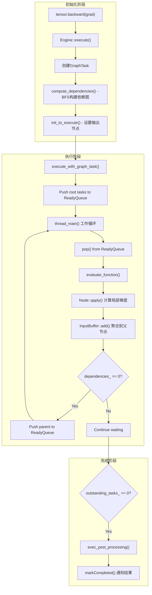

---

## 2. 核心组件详解

### 2.1 Engine类结构

```cpp
// 来自torch/csrc/autograd/engine.h
struct TORCH_API Engine {
  // 执行入口
  variable_list execute(const edge_list& roots,
                       const variable_list& inputs,
                       bool keep_graph,
                       bool create_graph,
                       bool accumulate_grad = true,
                       const edge_list& outputs = {});
  
  // 线程管理
  void thread_init(int device, const std::shared_ptr<ReadyQueue>& ready_queue);
  void thread_main(const std::shared_ptr<GraphTask>& task);
  
  // 评估函数
  void evaluate_function(std::shared_ptr<GraphTask>& task,
                        Node* func,
                        InputBuffer& inputs,
                        const std::shared_ptr<ReadyQueue>& queue);
  
  // 依赖计算
  void compute_dependencies(Node* root, GraphTask& task, uint64_t min_topo_nr);
  
  // Compiled Autograd支持
  typedef variable_list (*compiled_autograd_fn)(
      const std::shared_ptr<Node>& graph_root,
      const GraphTask& graph_task,
      bool accumulate_grad,
      const edge_list& outputs);
  static void set_compiled_autograd(compiled_autograd_fn fn);
  
  // 线程池（用于reentrant backwards）
  std::shared_ptr<ThreadPoolBase> thread_pool_;
  
  // 每个设备的ReadyQueue
  std::vector<std::shared_ptr<ReadyQueue>> ready_queues_;
};
```

### 2.2 ReadyQueue优先级队列

```cpp
// 来自torch/csrc/autograd/engine.h
struct ReadyQueue {
  // 优先级比较：shutdown任务 > 普通任务（按序列号排序）
  // 重要：返回true表示t2应该排在t1前面（t2优先级更高）
  struct CompareNodeTaskTime {
    bool operator()(const NodeTask& t1, const NodeTask& t2) {
      if (t2.isShutdownTask_) return true;        // Shutdown任务优先级最高
      if (t1.isShutdownTask_) return false;
      if (!t1.fn_) return true;                   // 空函数任务优先级低
      if (!t2.fn_) return false;
      if (t1.getReentrantDepth() == t2.getReentrantDepth()) {
        return t1.fn_->sequence_nr() < t2.fn_->sequence_nr();  // 序列号小的先执行
      } else {
        return t1.getReentrantDepth() < t2.getReentrantDepth(); // 深度大的先执行
      }
    }
  };
  
  std::priority_queue<NodeTask, std::vector<NodeTask>, CompareNodeTaskTime> heap_;
  std::mutex mutex_;
  std::condition_variable not_empty_;
  
  void push(NodeTask item, bool incrementOutstandingTasks = true);
  void pushShutdownTask();
  NodeTask pop();
};
```

**关键修正**：之前的文档错误地描述了比较逻辑。实际上返回 `true` 表示 `t2` 应该排在 `t1` 前面。对于 `sequence_nr`，**小的数值先执行**（因为序列号是递增分配的，先创建的节点应该先执行）。

### 2.3 NodeTask任务结构

```cpp
// 来自torch/csrc/autograd/engine.h
struct NodeTask {
  std::weak_ptr<GraphTask> base_;      // 所属GraphTask
  std::shared_ptr<Node> fn_;           // 要执行的Node
  InputBuffer inputs_;                  // 输入梯度
  bool isShutdownTask_ = false;        // 是否是关闭任务
  
  // 用于reentrant backward的排序
  int getReentrantDepth() const;
  uint64_t sequence_nr_;                // 来自fn_->sequence_nr()
};
```

---

## 3. Node与Edge图结构

### 3.1 Node基类

```cpp
// 来自torch/csrc/autograd/function.h
struct TORCH_API Node : std::enable_shared_from_this<Node> {
  uint64_t sequence_nr_;                    // 单调递增ID，用于执行排序
  uint64_t topological_nr_ = 0;            // 到任何叶节点的最长路径
  edge_list next_edges_;                    // 指向父节点的边
  bool is_cuda_node_ = false;              // 是否是CUDA节点（用于流同步）
  
  // 输入元数据（类型/形状信息）
  std::vector<InputMetadata> input_metadata_;
  
  // 核心方法：计算梯度
  virtual variable_list apply(variable_list&& inputs) = 0;
  
  // 流信息（用于CUDA流同步）
  c10::optional<c10::Stream> stream() const;
  
  // 元数据
  std::string name() const;
  bool is_leaf() const { return num_inputs() == 0; }
  
  // 异常处理
  void metadata()->store_stack();
  void metadata()->print_stack();
};
```

### 3.2 Edge边结构

```cpp
// 来自torch/csrc/autograd/edge.h
struct Edge {
  std::shared_ptr<Node> function;    // 目标Node
  uint32_t input_nr;                  // 输入索引
  
  Edge() noexcept : function(nullptr), input_nr(0) {}
  Edge(std::shared_ptr<Node> function, uint32_t input_nr)
      : function(std::move(function)), input_nr(input_nr) {}
      
  bool is_valid() const noexcept { return function != nullptr; }
};
```

### 3.3 图构建流程

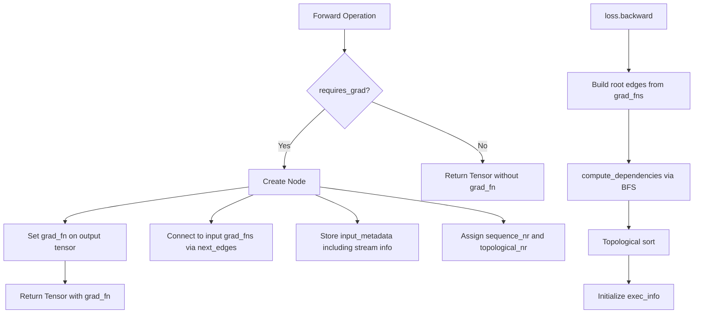

---

## 4. GraphTask与执行上下文

### 4.1 GraphTask结构

```cpp
// 来自torch/csrc/autograd/graph_task.h
struct GraphTask : std::enable_shared_from_this<GraphTask> {
  // 执行模式
  bool keep_graph_;           // 是否保留计算图
  bool create_graph_;         // 是否创建二级导数图
  bool accumulate_grad_;      // 是否累加梯度到叶子节点
  
  // 依赖管理
  std::unordered_map<Node*, int> dependencies_;
  std::unordered_set<Node*> nodes_in_graph_;
  
  // 执行状态
  std::atomic<uint64_t> outstanding_tasks_{0};
  std::atomic<bool> has_error_{false};
  std::exception_ptr exception_;
  
  // 结果收集
  std::unordered_map<Node*, InputBuffer> not_ready_;
  std::unordered_map<Node*, std::shared_ptr<Future>> captured_vars_;
  
  // 线程管理
  std::shared_ptr<ReadyQueue> cpu_ready_queue_;
  std::vector<std::shared_ptr<Future>> futures_;
  
  // 完成通知
  std::condition_variable completion_condition_;
  std::atomic<bool> completed_{false};
  std::shared_ptr<Future> future_result_;
  
  // CUDA流同步
  std::vector<c10::Stream> leaf_streams_;
  std::vector<c10::Stream> caller_current_streams_;
  
  // Checkpointing支持
  bool can_checkpoint_ = true;
  
  // Compiled Autograd支持
  bool execute_cpp_node_in_compiler_ = false;
  
  // 方法
  void mark_as_completed_and_run_post_processing();
  void exec_post_processing();
  bool completed();
  
  // 异常处理
  void set_exception_without_signal(std::exception_ptr e);
  void set_exception(std::exception_ptr e);
};
```

### 4.2 依赖计算

```cpp
void Engine::compute_dependencies(Node* root, GraphTask& task, uint64_t min_topo_nr) {
  std::vector<Node*> queue{root};
  
  while (!queue.empty()) {
    auto fn = queue.back();
    queue.pop_back();
    
    for (const auto& edge : fn->next_edges()) {
      if (auto next_ptr = edge.function.get()) {
        // 增加依赖计数
        task.dependencies_[next_ptr] += 1;
        
        // 插入图中
        const bool was_inserted = task.nodes_in_graph_.insert(next_ptr).second;
        if (was_inserted) {
          queue.push_back(next_ptr);
        }
      }
    }
  }
}
```

---

## 5. Task调度与执行机制

### 5.1 线程模型与ReadyQueue

Autograd Engine采用**多线程工作窃取**模型：

```cpp
// 每个设备有一个ReadyQueue
std::vector<std::shared_ptr<ReadyQueue>> device_ready_queues_;

// 线程局部变量：当前线程处理的设备
thread_local int worker_device = NO_DEVICE;

// 线程局部变量：当前线程的ReadyQueue
thread_local std::shared_ptr<ReadyQueue> local_ready_queue;
```

**线程类型**：
1. **调用者线程**：执行backward()的线程，处理CPU设备任务
2. **设备专用线程**：每个CUDA设备有一个专用线程处理该设备任务
3. **线程池线程**：用于重入backward的额外线程

### 5.2 Task优先级与调度策略

```cpp
struct CompareNodeTaskTime {
  bool operator()(const NodeTask& t1, const NodeTask& t2) {
    // Shutdown任务优先级最高（用于优雅退出）
    if (t2.isShutdownTask_) return true;
    if (t1.isShutdownTask_) return false;
    
    // 空函数任务用于唤醒等待的线程
    if (!t1.fn_) return true;
    if (!t2.fn_) return false;
    
    if (t1.getReentrantDepth() == t2.getReentrantDepth()) {
      // 同深度：按序列号FIFO（先创建的先执行）
      return t1.fn_->sequence_nr() < t2.fn_->sequence_nr();
    } else {
      // 不同深度：深度大的先执行（优先完成子图）
      return t1.getReentrantDepth() < t2.getReentrantDepth();
    }
  }
};
```

### 5.3 执行流程详解

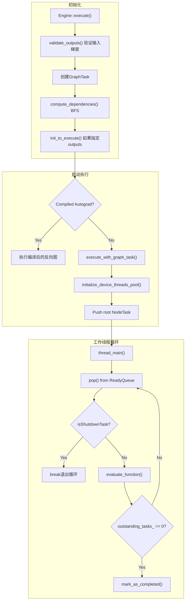

---

## 6. evaluate_function核心逻辑

### 6.1 函数执行流程

```cpp
void Engine::evaluate_function(
    std::shared_ptr<GraphTask>& graph_task,
    Node* func,
    InputBuffer& inputs,
    const std::shared_ptr<ReadyQueue>& cpu_ready_queue) {
  
  // 1. 设备上下文设置
  auto opt_parent_stream = func->stream();
  const auto parent_stream = opt_parent_stream
      ? *opt_parent_stream
      : c10::Stream(c10::Stream::DEFAULT::CPU, -1);
  
  // 2. 调用pre hooks
  auto inputs_after_hooks = call_pre_hooks(*func, inputs.buffer());
  inputs_after_hooks = call_tensor_pre_hooks(*func, inputs_after_hooks);
  
  // 3. 核心：执行Node.apply()计算梯度
  variable_list outputs;
  {
    at::ThreadLocalStateGuard tls_guard(graph_task->thread_locals_);
    GraphTaskGuard guard(graph_task);
    NodeGuard ndguard(func);
    outputs = func->apply(inputs_after_hooks);
  }
  
  // 4. 调用post hooks
  outputs = call_post_hooks(*func, outputs, inputs_after_hooks, has_post_hooks);
  
  // 5. 验证输出
  validate_outputs(
      func->next_edges(), outputs, ...);
  
  // 6. 传递梯度给父节点
  for (size_t i = 0; i < outputs.size(); ++i) {
    const auto& edge = func->next_edges()[i];
    if (!edge.is_valid()) continue;
    
    auto& output = outputs[i];
    auto next = edge.function.get();
    
    // 累加到InputBuffer
    auto opt_next_stream = next->stream();
    InputBuffer input_buffer(next->num_inputs());
    input_buffer.add(
        edge.input_nr,
        std::move(output),
        parent_stream,
        opt_next_stream,
        next);
    
    // 减少依赖计数
    int remaining_dependencies = --graph_task->dependencies_[next];
    
    if (remaining_dependencies == 0) {
      // 所有输入就绪，推入ReadyQueue
      auto queue = ready_queue(cpu_ready_queue, next->device());
      queue->push(NodeTask(graph_task, next, std::move(input_buffer)));
    } else {
      // 存入not_ready等待其他输入
      graph_task->not_ready_[next].add(
          edge.input_nr, std::move(output), parent_stream, opt_next_stream, next);
    }
  }
  
  // 7. 如果不需要保留计算图，释放Node
  if (!graph_task->keep_graph_) {
    func->release_variables();
  }
}
```

### 6.2 InputBuffer梯度聚合

InputBuffer负责聚合来自多个子节点的梯度：

```cpp
struct InputBuffer {
  // buffer[i] 存储第i个输入的累积梯度
  std::vector<Variable> buffer;
  
  // 添加梯度到指定位置
  void add(size_t index, Variable grad, ...) {
    auto& old = buffer[index];
    if (!old.defined()) {
      buffer[index] = std::move(grad);
    } else {
      // 使用aten::add进行累加，自动处理设备/流同步
      buffer[index] = old + grad;
    }
  }
};
```

### 6.3 流同步机制

```cpp
// 在InputBuffer::add中处理流同步
void InputBuffer::add(
    size_t index,
    Variable grad,
    const c10::Stream& producer_stream,  // 产生梯度的流
    const c10::optional<c10::Stream>& consumer_stream,  // 消费梯度的流
    Node* consumer) {
  
  if (consumer_stream && producer_stream != *consumer_stream) {
    // 如果生产者和消费者在不同流，需要同步
    // 1. 在当前流（生产者）记录事件
    auto event = c10::Event{producer_stream.device_type()};
    event.record(producer_stream);
    
    // 2. 让消费者流等待该事件
    consumer_stream->wait(event);
  }
  
  // 现在可以安全地累加梯度
  // ...
}
```

---
  c10::OptionalStreamGuard parent_stream_guard(opt_parent_stream);
  
  // 2. 等待输入事件（CUDA流同步）
  inputs.wait(opt_parent_stream);
  
  // 3. 执行Node的apply方法
  auto outputs = call_function(graph_task, func, inputs);
  
  // 4. 验证输出（检查NaN等）
  if (AnomalyMode::should_check_nan()) {
    // 检查outputs中的NaN
  }
  
  // 5. 处理输出
  int num_outputs = outputs.size();
  for (const auto i : c10::irange(num_outputs)) {
    auto& output = outputs[i];
    const auto& next = func->next_edge(i);
    
    if (!next.is_valid()) continue;
    
    // 6. 递减依赖计数
    auto& dependencies = graph_task->dependencies_;
    auto it = dependencies.find(next.function.get());
    bool is_ready = false;
    if (it != dependencies.end()) {
      if (--it->second == 0) {
        is_ready = true;
        dependencies.erase(it);
      }
    }
    
    // 7. 累积或创建新的InputBuffer
    auto not_ready_it = not_ready.find(next.function.get());
    if (not_ready_it == not_ready.end()) {
      // 第一次看到这个Node
      InputBuffer input_buffer(next.function->num_inputs());
      input_buffer.add(next.input_nr, std::move(output), opt_parent_stream, 
                       next.function->stream());
      
      if (is_ready) {
        cpu_ready_queue->push(
            NodeTask(graph_task, next.function, std::move(input_buffer)));
      } else {
        not_ready.emplace(next.function.get(), std::move(input_buffer));
      }
    } else {
      // 累积到现有buffer
      not_ready_it->second.add(next.input_nr, std::move(output), 
                               opt_parent_stream, next.function->stream());
    }
  }
  
  // 8. 检查完成
  if (--graph_task->outstanding_tasks_ == 0) {
    if (graph_task->completed()) {
      graph_task->mark_as_completed_and_run_post_processing();
    }
  }
}
```

---

## 6. Gradient Accumulation

### 6.1 InputBuffer结构

```cpp
// 来自torch/csrc/autograd/input_buffer.h
struct InputBuffer {
  // 构造函数预分配指定数量的输入槽
  explicit InputBuffer(size_t size);
  
  // 添加梯度
  void add(size_t idx, Variable var, const c10::optional<c10::Stream>& producer_stream,
           const c10::optional<c10::Stream>& consumer_stream);
  
  // 等待所有就绪事件
  void wait(const c10::optional<c10::Stream>& stream);
  
  // 缓冲区
  std::vector<Variable> buffer_;
  
  // CUDA流同步相关 - 为每个槽位记录就绪事件
  std::vector<c10::Event> ready_events_;
};
```

**补充说明**：`ready_events_` 用于记录生产者流的完成事件，以便消费者流可以正确同步。

### 6.2 Accumulation流程

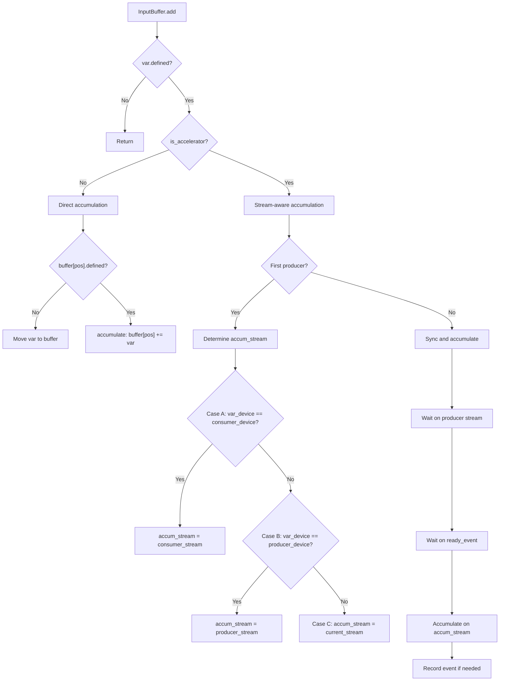

### 6.3 AccumulateGrad节点

```cpp
// 来自torch/csrc/autograd/functions/accumulate_grad.cpp
variable_list AccumulateGrad::apply(variable_list&& grads) {
  if (!grads[0].defined()) return {};
  if (!variable.requires_grad()) return {};
  
  std::lock_guard<std::mutex> lock(mutex_);
  
  auto& variable_grad = variable.grad();
  auto& new_grad = grads[0];
  
  // 情况1：还没有梯度
  if (!variable_grad.defined()) {
    // 尝试直接复用张量
    if (can_steal(new_grad)) {
      variable_grad = new_grad.detach();
    } else {
      variable_grad = new_grad.clone(layout_contract);
    }
  }
  // 情况2：一级导数（非高阶导数）
  else if (!GradMode::is_enabled()) {
    // 检查稀疏+稠密情况
    if (new_grad.is_sparse() && !variable_grad.is_sparse()) {
      variable_grad = variable_grad + new_grad;  // 稠密+稀疏=稠密
    } else {
      variable_grad += new_grad;  // 原地累加
    }
  }
  // 情况3：高阶导数
  else {
    variable_grad = variable_grad + new_grad;  // 非原地
  }
  
  // 运行后处理钩子
  run_post_accumulate_grad_hooks();
  
  return {};
}
```

---

## 7. CUDA流同步

### 7.1 Streaming Backwards机制

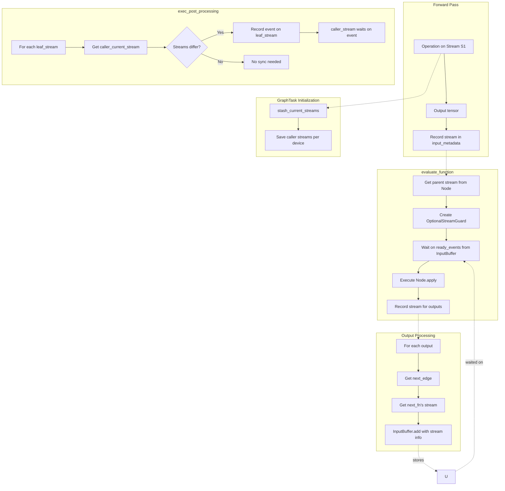

### 7.2 流同步代码

```cpp
void InputBuffer::add(size_t idx, Variable var, 
                      const c10::optional<c10::Stream>& producer_stream,
                      const c10::optional<c10::Stream>& consumer_stream) {
  if (!var.defined()) return;
  
  // 加速器（CUDA等）需要流同步
  if (var.device().is_accelerator()) {
    // 决定在哪个流上累加
    c10::optional<c10::Stream> accum_stream;
    
    if (!buffer_[idx].defined()) {
      // 第一次：检查var的设备是否匹配consumer或producer
      if (var.device() == consumer_stream.device()) {
        accum_stream = consumer_stream;
      } else if (var.device() == producer_stream.device()) {
        accum_stream = producer_stream;
      } else {
        accum_stream = c10::current_stream(var.device());
      }
      
      // 如果生产者和累加流不同，记录事件
      if (producer_stream != accum_stream) {
        ready_events_[idx].record(*producer_stream);
      }
    } else {
      // 后续累加：在consumer流上同步
      accum_stream = consumer_stream;
      
      // 等待之前的就绪事件
      if (ready_events_[idx].is_defined()) {
        ready_events_[idx].block(*accum_stream);
      }
      
      // 等待当前producer流
      if (producer_stream != accum_stream) {
        ready_events_[idx].record(*producer_stream);
        ready_events_[idx].block(*accum_stream);
      }
    }
    
    c10::OptionalStreamGuard stream_guard(accum_stream);
    accumulate(buffer_[idx], var);
  } else {
    // CPU直接累加
    accumulate(buffer_[idx], var);
  }
}
```

---

## 8. Reentrant Backwards

### 8.1 死锁预防

```cpp
// 来自engine.cpp的注释 [Reentrant backwards]
// 当backward()在工作线程内部被调用时，我们不能阻塞该线程等待结果，
// 因为这会导致死锁（所有工作线程都在等待，没有线程在干活）
// 
// 解决方案：使用线程池，工作者可以接管被阻塞的任务
```

### 8.2 Reentrant Backward流程

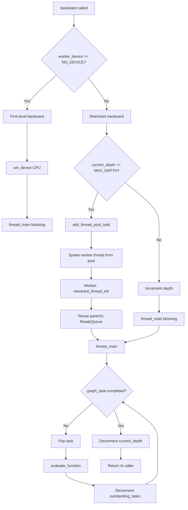

### 8.3 MAX_DEPTH限制

```cpp
// Maximum reentrant backward depth before switching to a new thread
// This limit is based on the TSAN's deadlock detector, where it will
// fail if a program hold more than 65 locks in one thread at once.
static constexpr int MAX_DEPTH = 60;
```

---

## 9. Checkpointing

### 9.1 Checkpoint有效性检查

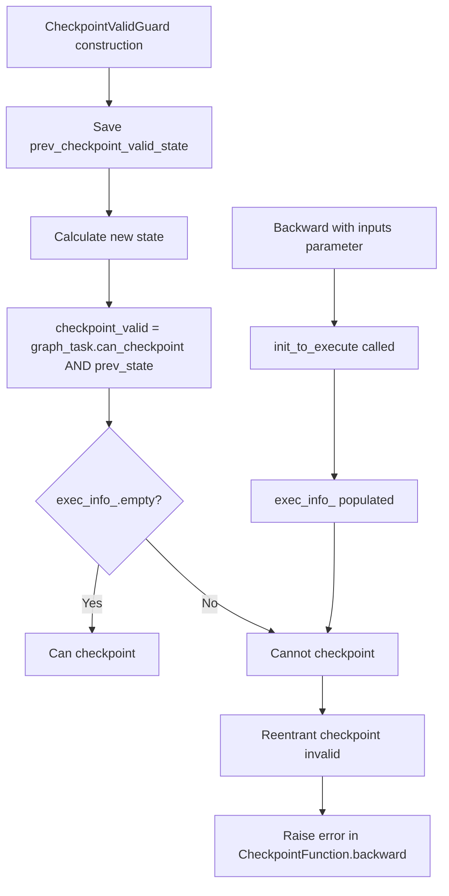

### 9.2 Checkpointing流程

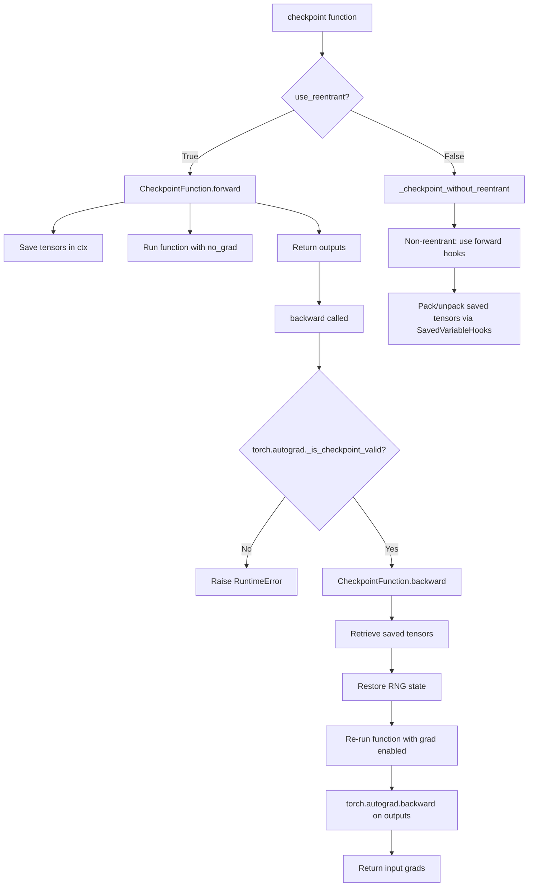

### 9.3 Non-Reentrant Checkpointing

```cpp
// 非重入检查点使用SavedVariableHooks避免递归
// 这对分布式训练很重要，因为它不会增加调用栈深度
class CheckpointHook : public SavedVariableHooks {
  void pack_hook(const Tensor& tensor) override {
    // 保存张量或引用
  }
  
  Tensor unpack_hook() override {
    // 恢复张量，必要时重新计算
  }
};
```

---

## 10. Compiled Autograd

### 10.1 什么是Compiled Autograd

Compiled Autograd是PyTorch 2.0+的新特性，它将autograd图编译为优化的FX图，使用Inductor进行优化。

### 10.2 工作流程

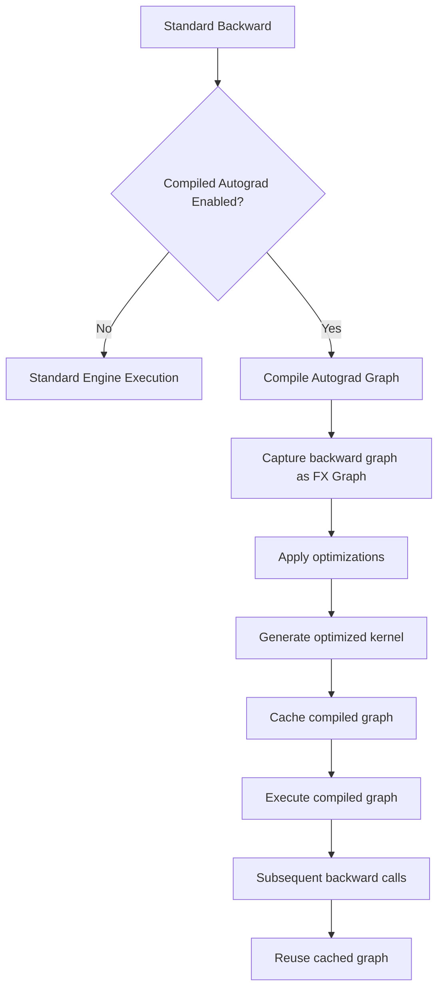

### 10.3 实现细节

```cpp
// 来自torch/csrc/autograd/compiled_autograd.h
// Engine中的compiled_autograd回调
typedef variable_list (*compiled_autograd_fn)(
    const std::shared_ptr<Node>& graph_root,
    const GraphTask& graph_task,
    bool accumulate_grad,
    const edge_list& outputs);

// Python端实现
// torch._dynamo.compiled_autograd.compile_autograd_graph
```

### 10.4 优势

1. **图优化**：可以融合操作，消除中间张量
2. **内存优化**：更好的缓冲区重用
3. **性能**：对于重复的backward模式，编译后执行更快
4. **与Dynamo集成**：自动捕获和优化

---

## 11. Anomaly Mode

### 11.1 Anomaly Detection

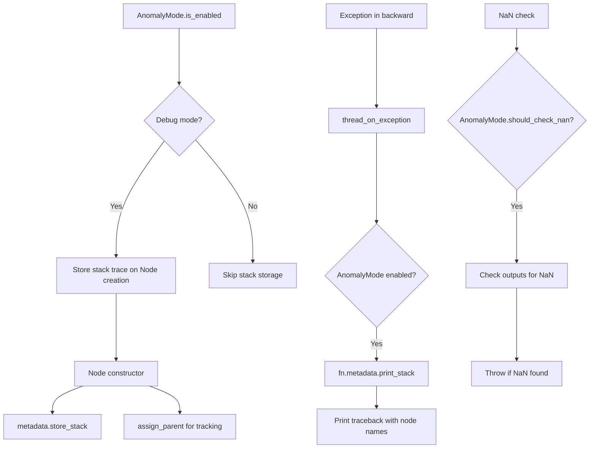

### 11.2 Anomaly Mode代码

```cpp
// 来自torch/csrc/autograd/anomaly_mode.h
struct AnomalyMode {
  static bool is_enabled();
  static void set_enabled(bool enabled);
  
  // 检测NaN
  static bool should_check_nan();
  
  // 存储堆栈跟踪
  void store_stack();
  void print_stack();
};

// 在Node构造函数中使用
Node::Node() {
  if (AnomalyMode::is_enabled()) {
    metadata()->store_stack();
  }
  // ...
}

// 在evaluate_function中检查NaN
if (AnomalyMode::should_check_nan()) {
  for (auto& output : outputs) {
    if (output.defined() && output.is_floating_point()) {
      TORCH_CHECK(!output.isnan().any().item<bool>(),
          "Function '", name(), "' returned nan values in its output");
    }
  }
}
```

### 11.3 SavedVariableHooks与Anomaly

```cpp
// Anomaly模式还跟踪保存的变量
// 如果在反向传播中使用了已修改的张量，会报错
void check_saved_variables_are_valid() {
  for (auto& saved : saved_variables_) {
    if (saved.has_been_modified()) {
      throw_error("Saved variable has been modified in-place");
    }
  }
}
```

---

## 13. 性能优化策略

### 13.1 执行优化

| 优化技术 | 实现 | 效果 |
|---------|------|------|
| **并行执行** | 依赖计数触发，无依赖节点并行 | 多核利用 |
| **流异步** | CUDA流非阻塞，自动同步 | 隐藏延迟 |
| **内存池** | InputBuffer重用，避免频繁分配 | 减少malloc |
| **零拷贝** | can_steal检测，直接复用张量 | 减少clone |
| **CPU亲和性** | 调用者线程处理CPU任务 | 减少线程切换 |

### 13.2 内存优化

```cpp
// 1. 梯度累加的原地操作
if (!GradMode::is_enabled()) {
  variable_grad += new_grad;  // 原地累加
}

// 2. 张量窃取（Steal）
if (can_steal(new_grad)) {
  variable_grad = std::move(new_grad);  // 避免拷贝
}

// 3. 及时释放计算图
if (!graph_task->keep_graph_) {
  func->release_variables();  // 释放saved_variables
}
```

### 13.3 关键路径优化

```cpp
// evaluate_function热点优化
void evaluate_function(...) {
  // 1. 使用线程局部存储避免锁
  at::ThreadLocalStateGuard tls_guard(graph_task->thread_locals_);
  
  // 2. 内联关键调用
  auto outputs = func->apply(inputs);  // 虚函数调用
  
  // 3. 批量依赖更新
  for (auto& output : outputs) {
    if (--dependencies[next] == 0) {
      ready_queue->push(task);  // 快速入队
    }
  }
}
```

---

## 14. 核心流程总结

### 14.1 Backward调用完整流程

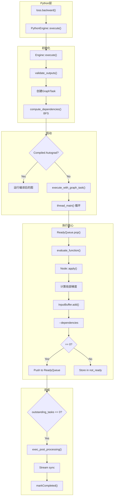

### 14.2 关键设计决策

| 决策 | 理由 |
|------|------|
| **工作窃取模型** | 避免静态任务分配，动态负载均衡 |
| **依赖计数vs拓扑排序** | 运行时动态触发，支持动态图 |
| **优先级队列** | 保证执行顺序，支持重入管理 |
| **设备专用线程** | 避免CUDA上下文切换开销 |
| **InputBuffer聚合** | 支持多输出节点，减少同步次数 |

---

## 15. 调试与诊断

### 15.1 启用Anomaly Mode

```python
# 检测NaN和In-place操作
import torch
torch.autograd.set_detect_anomaly(True)

# 或使用上下文管理器
with torch.autograd.detect_anomaly():
    loss.backward()
```

### 15.2 打印执行顺序

```python
# 使用torch.profiler查看autograd执行
torch.profiler.profile(
    activities=[
        torch.profiler.ProfilerActivity.CPU,
        torch.profiler.ProfilerActivity.CUDA,
    ],
    with_stack=True
) as prof:
    loss.backward()
    
print(prof.key_averages().table())
```

### 15.3 核心计数器

```cpp
// 在GraphTask中跟踪执行状态
struct GraphTask {
  std::atomic<uint64_t> outstanding_tasks_;  // 未完成任务数
  std::atomic<bool> has_error_;              // 错误标志
  uint64_t id_;                              // 唯一ID（用于调试）
};
```

---

## 16. 总结

PyTorch Autograd Engine是一个高度优化的异步反向传播执行引擎：

### 核心特点

1. **异步并行执行**：依赖计数触发机制允许多个节点同时执行
2. **设备感知**：自动处理CUDA流同步，多设备无缝协作
3. **内存高效**：Gradient checkpointing减少激活值内存占用
4. **可重入**：支持backward过程中调用新的backward
5. **编译优化**：Compiled Autograd将图编译为优化内核

### 性能关键路径

| 组件 | 职责 | 优化重点 |
|------|------|---------|
| ReadyQueue | 任务调度 | 无锁优先级队列 |
| InputBuffer | 梯度聚合 | 流感知累加 |
| evaluate_function | 节点执行 | 内联关键调用 |
| GraphTask | 上下文管理 | 原子计数器 |

### 最佳实践

```python
# 1. 使用梯度累加减少backward次数
for i, batch in enumerate(loader):
    loss = model(batch) / accumulation_steps
    loss.backward()
    if (i + 1) % accumulation_steps == 0:
        optimizer.step()
        optimizer.zero_grad()

# 2. 使用checkpoint减少内存
from torch.utils.checkpoint import checkpoint
output = checkpoint(module, input)

# 3. 避免不必要的中断
# 尽量在.backward()前减少同步操作

# 4. 使用Compiled Autograd（PyTorch 2.0+）
# 自动编译和优化autograd图
```
  virtual ~SavedVariableHooks() = default;
};

// 设置默认hooks
void Engine::set_default_saved_variable_hooks(
    std::unique_ptr<SavedVariableHooks> hooks);
```

### 12.2 使用场景

1. **检查点**：将张量保存到CPU内存或磁盘
2. **压缩**：压缩保存的梯度
3. **分布式**：在分布式设置中管理保存的变量

---

## 13. 关键设计决策

### 13.1 拓扑执行

- 使用**依赖计数**（引用计数）跟踪节点何时就绪
- 零依赖节点被推入ReadyQueue
- BFS遍历在`compute_dependencies`期间执行

### 13.2 线程安全

- 每个设备有自己的ReadyQueue
- CPU操作在调用者线程或CPU-ready队列处理
- 共享状态的互斥保护（依赖项、not_ready、captured_vars）

### 13.3 内存管理

- InputBuffer高效累加梯度
- AccumulateGrad尽可能原地更新
- 梯度布局约定优化器效率

### 13.4 CUDA同步

- 流记录在forward期间的input_metadata中
- 事件用于同步生产者-消费者流关系
- 后处理将叶子流与调用者流同步

### 13.5 Reentrant Backward

- 当递归深度超过MAX_DEPTH（60）时，线程池生成工作者
- 工作者重用父队列以提高效率
- 适当的深度跟踪防止堆栈溢出

---

## 14. 文件位置汇总

| 组件 | 文件路径 |
|------|----------|
| Engine Interface | torch/csrc/autograd/engine.h |
| Engine Implementation | torch/csrc/autograd/engine.cpp |
| Node Base Class | torch/csrc/autograd/function.h |
| Graph Task | torch/csrc/autograd/graph_task.h |
| Input Buffer | torch/csrc/autograd/input_buffer.h |
| Input Buffer Impl | torch/csrc/autograd/input_buffer.cpp |
| Edge Definition | torch/csrc/autograd/edge.h |
| AccumulateGrad | torch/csrc/autograd/functions/accumulate_grad.h |
| AccumulateGrad Impl | torch/csrc/autograd/functions/accumulate_grad.cpp |
| Python Engine | torch/csrc/autograd/python_engine.cpp |
| Anomaly Mode | torch/csrc/autograd/anomaly_mode.h |
| Checkpoint Utility | torch/utils/checkpoint.py |
| Gradient Functions | torch/csrc/autograd/FunctionsManual.cpp |
| Compiled Autograd | torch/csrc/autograd/compiled_autograd.h |
| Saved Variable Hooks | torch/csrc/autograd/saved_variable_hooks.h |

---

## 15. 总结

PyTorch的Autograd Engine是一个精密的反向传播执行系统：

1. **图执行**：通过依赖计数和优先级队列实现高效拓扑排序执行

2. **多线程**：设备专用队列 + 线程池处理reentrant情况

3. **内存效率**：InputBuffer、AccumulateGrad优化梯度累加

4. **CUDA同步**：Streaming backwards确保正确的流同步

5. **灵活性**：Checkpointing、Anomaly Mode支持各种训练和调试场景

6. **可靠性**：异常处理、NaN检测、版本计数器确保梯度正确性

7. **未来方向**：Compiled Autograd将autograd图编译为优化代码，提升性能
