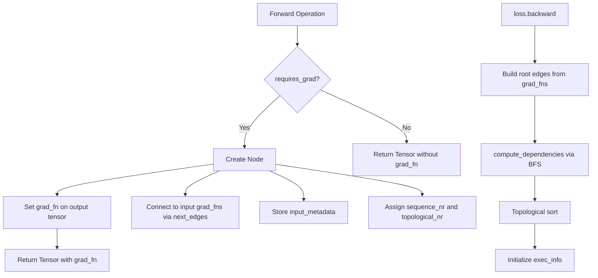
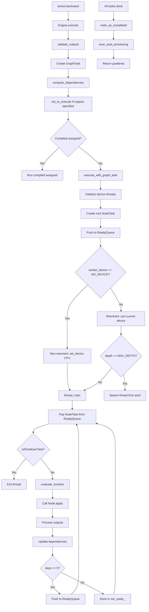
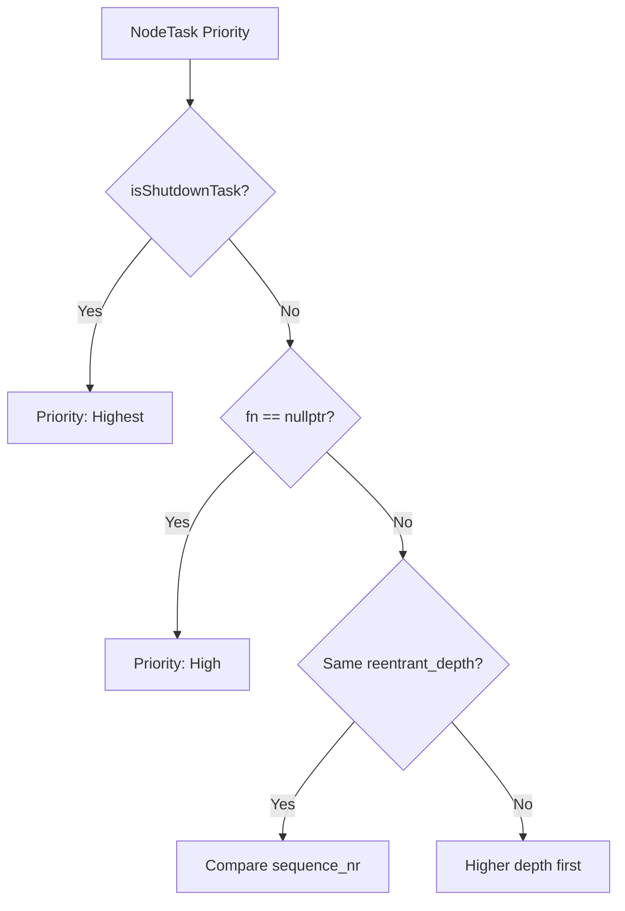
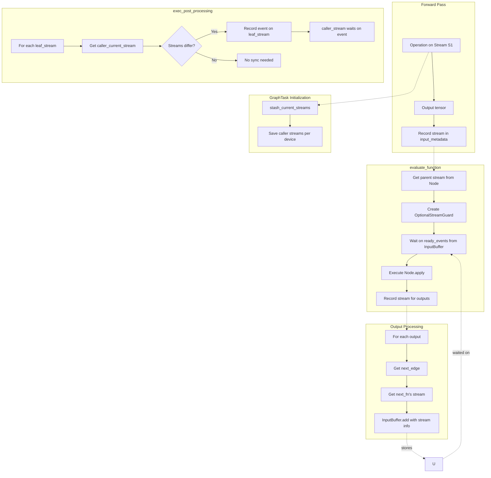
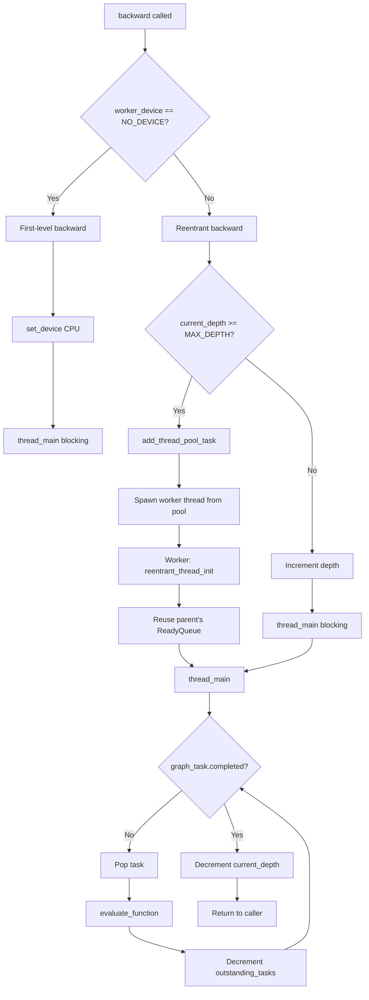
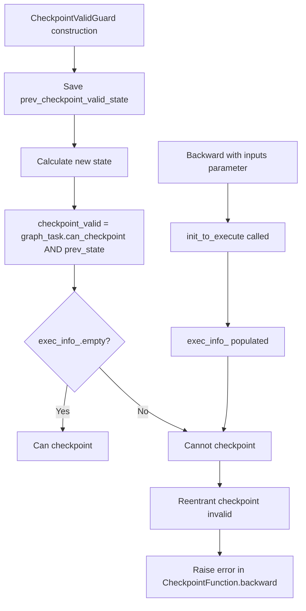
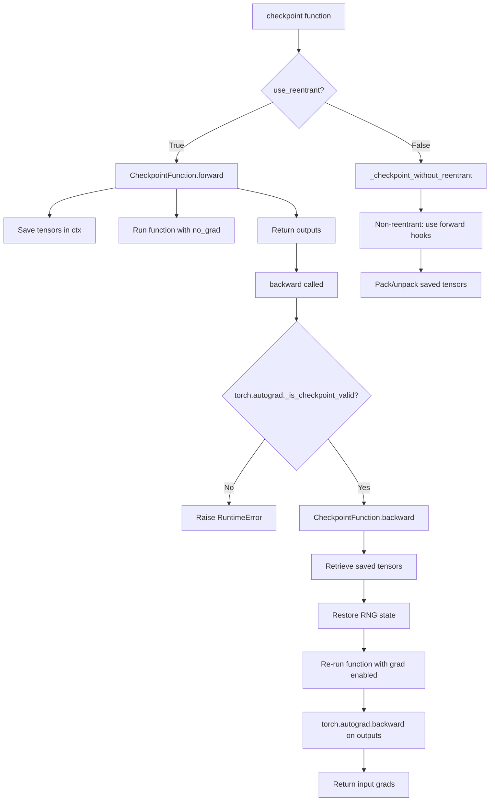
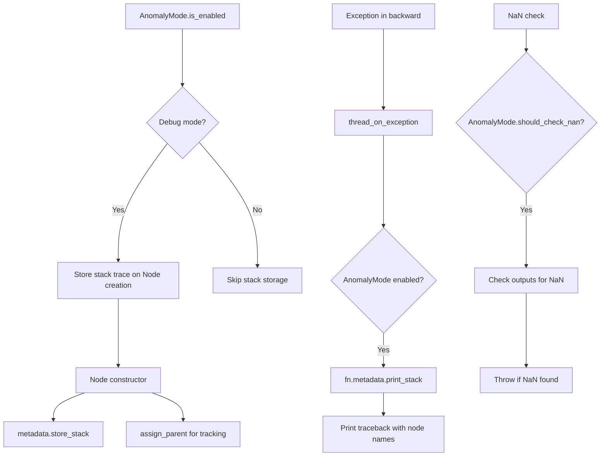

# PyTorch Autograd Engine深度分析

## 目录
1. [架构概览](#1-架构概览)
2. [核心组件详解](#2-核心组件详解)
3. [Node与Edge图结构](#3-node与edge图结构)
4. [GraphTask与执行上下文](#4-graphtask与执行上下文)
5. [Task调度机制](#5-task调度机制)
6. [Gradient Accumulation](#6-gradient-accumulation)
7. [CUDA流同步](#7-cuda流同步)
8. [Reentrant Backwards](#8-reentrant-backwards)
9. [Checkpointing](#9-checkpointing)
10. [Anomaly Mode](#10-anomaly-mode)

---

## 1. 架构概览

### 1.1 核心文件位置

| 组件 | 文件路径 | 行数 |
|------|----------|------|
| Engine | torch/csrc/autograd/engine.cpp | ~1800行 |
| Engine Header | torch/csrc/autograd/engine.h | ~283行 |
| Node | torch/csrc/autograd/function.h | ~705行 |
| Edge | torch/csrc/autograd/edge.h | ~40行 |
| InputBuffer | torch/csrc/autograd/input_buffer.cpp | ~300行 |
| Python Engine | torch/csrc/autograd/python_engine.cpp | ~250行 |
| AccumulateGrad | torch/csrc/autograd/functions/accumulate_grad.cpp | ~150行 |

### 1.2 整体架构

```
┌─────────────────────────────────────────────────────────────┐
│                    Python API                               │
│              tensor.backward() / autograd.grad()            │
└─────────────────────────────────────────────────────────────┘
                              │
┌─────────────────────────────────────────────────────────────┐
│                    PythonEngine                             │
│         GIL管理、Python异常处理                             │
└─────────────────────────────────────────────────────────────┘
                              │
┌─────────────────────────────────────────────────────────────┐
│                    Engine (Singleton)                       │
│    - 设备线程池管理                                         │
│    - ReadyQueue调度                                         │
│    - 任务执行                                               │
└─────────────────────────────────────────────────────────────┘
                              │
┌─────────────────────────────────────────────────────────────┐
│                    GraphTask                                │n│    - 反向图执行上下文                                       │
│    - 依赖计数                                               │
│    - 结果收集                                               │
└─────────────────────────────────────────────────────────────┘
                              │
┌─────────────────────────────────────────────────────────────┐
│                    Node (Function)                          │
│    - 每个操作的反向计算                                     │
│    - next_edges连接父节点                                   │
│    - apply()计算梯度                                        │
└─────────────────────────────────────────────────────────────┘
```

---

## 2. 核心组件详解

### 2.1 Engine类结构

```cpp
// 来自torch/csrc/autograd/engine.h (第130-283行)
struct TORCH_API Engine {
  // 执行入口
  variable_list execute(const edge_list& roots,
                       const variable_list& inputs,
                       bool keep_graph,
                       bool create_graph,
                       bool accumulate_grad = true,
                       const edge_list& outputs = {});
  
  // 线程管理
  void thread_init(int device, const std::shared_ptr<ReadyQueue>& ready_queue);
  void thread_main(const std::shared_ptr<GraphTask>& task);
  
  // 评估函数
  void evaluate_function(std::shared_ptr<GraphTask>& task,
                        Node* func,
                        InputBuffer& inputs,
                        const std::shared_ptr<ReadyQueue>& queue);
  
  // 依赖计算
  void compute_dependencies(Node* root, GraphTask& task, uint64_t min_topo_nr);
  
  // 线程池（用于reentrant backwards）
  std::shared_ptr<ThreadPoolBase> thread_pool_;
  
  // 每个设备的ReadyQueue
  std::vector<std::shared_ptr<ReadyQueue>> ready_queues_;
};
```

### 2.2 ReadyQueue优先级队列

```cpp
// 来自torch/csrc/autograd/engine.h (第86-125行)
struct ReadyQueue {
  // 优先级比较：shutdown任务 > 普通任务（按序列号排序）
  struct CompareNodeTaskTime {
    bool operator()(const NodeTask& t1, const NodeTask& t2) {
      if (t1.isShutdownTask_) return false;
      if (t2.isShutdownTask_) return true;
      if (t1.fn_ == nullptr) return true;
      if (t2.fn_ == nullptr) return false;
      return t1.sequence_nr_ > t2.sequence_nr_;
    }
  };
  
  std::priority_queue<NodeTask, std::vector<NodeTask>, CompareNodeTaskTime> heap_;
  std::mutex mutex_;
  std::condition_variable not_empty_;
  
  void push(NodeTask item);
  NodeTask pop();
};
```

### 2.3 NodeTask任务结构

```cpp
// 来自torch/csrc/autograd/engine.h (第51-73行)
struct NodeTask {
  std::weak_ptr<GraphTask> base_;      // 所属GraphTask
  std::shared_ptr<Node> fn_;           // 要执行的Node
  InputBuffer inputs_;                  // 输入梯度
  bool isShutdownTask_ = false;        // 是否是关闭任务
  
  // 用于reentrant backward的排序
  int reentrant_depth_;
  uint64_t sequence_nr_;
};
```

---

## 3. Node与Edge图结构

### 3.1 Node基类

```cpp
// 来自torch/csrc/autograd/function.h (第113-705行)
struct TORCH_API Node : std::enable_shared_from_this<Node> {
  uint64_t sequence_nr_;                    // 单调递增ID，用于执行排序
  uint64_t topological_nr_ = 0;            // 到任何叶节点的最长路径
  edge_list next_edges_;                    // 指向父节点的边
  
  // 输入元数据（类型/形状信息）
  std::vector<InputMetadata> input_metadata_;
  
  // 核心方法：计算梯度
  virtual variable_list apply(variable_list&& inputs) = 0;
  
  // 预分配输出缓冲区
  variable_list pre_allocated_outputs();
  
  // 元数据
  std::string name() const;
  bool is_leaf() const { return num_inputs() == 0; }
  
  // 异常处理
  void metadata()->store_stack();
  void metadata()->print_stack();
};
```

### 3.2 Edge边结构

```cpp
// 来自torch/csrc/autograd/edge.h
struct Edge {
  std::shared_ptr<Node> function;    // 目标Node
  uint32_t input_nr;                  // 输入索引
  
  Edge() noexcept : function(nullptr), input_nr(0) {}
  Edge(std::shared_ptr<Node> function, uint32_t input_nr)
      : function(std::move(function)), input_nr(input_nr) {}
      
  bool is_valid() const noexcept { return function != nullptr; }
};
```

### 3.3 图构建流程



---

## 4. GraphTask与执行上下文

### 4.1 GraphTask结构

```cpp
// 来自torch/csrc/autograd/graph_task.h
struct GraphTask : std::enable_shared_from_this<GraphTask> {
  // 执行模式
  bool keep_graph_;           // 是否保留计算图
  bool create_graph_;         // 是否创建二级导数图
  bool accumulate_grad_;      // 是否累加梯度到叶子节点
  
  // 依赖管理
  std::unordered_map<Node*, int> dependencies_;
  std::unordered_set<Node*> nodes_in_graph_;
  
  // 执行状态
  std::atomic<uint64_t> outstanding_tasks_{0};
  std::atomic<bool> has_error_{false};
  std::exception_ptr exception_;
  
  // 结果收集
  std::unordered_map<Node*, InputBuffer> not_ready_;
  std::unordered_map<Node*, std::shared_ptr<Future>> captured_vars_;
  
  // 线程管理
  std::shared_ptr<ReadyQueue> cpu_ready_queue_;
  std::vector<std::shared_ptr<Future>> futures_;
  
  // 完成通知
  std::condition_variable completion_condition_;
  std::atomic<bool> completed_{false};
  std::shared_ptr<Future> future_result_;
  
  // CUDA流同步
  std::vector<c10::Stream> leaf_streams_;
  
  // Checkpointing支持
  bool can_checkpoint_ = true;
  
  // 方法
  void mark_as_completed_and_run_post_processing();
  void exec_post_processing();
  bool completed();
};
```

### 4.2 依赖计算

```cpp
void Engine::compute_dependencies(Node* root, GraphTask& task, uint64_t min_topo_nr) {
  std::vector<Node*> queue{root};
  
  while (!queue.empty()) {
    auto fn = queue.back();
    queue.pop_back();
    
    for (const auto& edge : fn->next_edges()) {
      if (auto next_ptr = edge.function.get()) {
        // 增加依赖计数
        task.dependencies_[next_ptr] += 1;
        
        // 插入图中
        const bool was_inserted = task.nodes_in_graph_.insert(next_ptr).second;
        if (was_inserted) {
          queue.push_back(next_ptr);
        }
      }
    }
  }
}
```

---

## 5. Task调度机制

### 5.1 主执行流程



### 5.2 Task优先级



### 5.3 evaluate_function核心逻辑

```cpp
void Engine::evaluate_function(
    std::shared_ptr<GraphTask>& graph_task,
    Node* func,
    InputBuffer& inputs,
    const std::shared_ptr<ReadyQueue>& cpu_ready_queue) {
  
  // 1. 设置设备上下文
  auto opt_parent_stream = func->stream();
  c10::OptionalStreamGuard parent_stream_guard(opt_parent_stream);
  
  // 2. 等待输入事件（CUDA流同步）
  inputs.wait(opt_parent_stream);
  
  // 3. 执行Node的apply方法
  auto outputs = call_function(graph_task, func, inputs);
  
  // 4. 处理输出
  int num_outputs = outputs.size();
  for (const auto i : c10::irange(num_outputs)) {
    auto& output = outputs[i];
    const auto& next = func->next_edge(i);
    
    if (!next.is_valid()) continue;
    
    // 5. 递减依赖计数
    auto& dependencies = graph_task->dependencies_;
    auto it = dependencies.find(next.function.get());
    bool is_ready = false;
    if (it != dependencies.end()) {
      if (--it->second == 0) {
        is_ready = true;
        dependencies.erase(it);
      }
    }
    
    // 6. 累积或创建新的InputBuffer
    auto not_ready_it = not_ready.find(next.function.get());
    if (not_ready_it == not_ready.end()) {
      // 第一次看到这个Node
      InputBuffer input_buffer(next.function->num_inputs());
      input_buffer.add(next.input_nr, std::move(output), opt_parent_stream, 
                       next.function->stream());
      
      if (is_ready) {
        queue->push(NodeTask(graph_task, next.function, std::move(input_buffer)));
      } else {
        not_ready.emplace(next.function.get(), std::move(input_buffer));
      }
    } else {
      // 累积到现有buffer
      not_ready_it->second.add(next.input_nr, std::move(output), 
                               opt_parent_stream, next.function->stream());
    }
  }
  
  // 7. 检查完成
  if (--graph_task->outstanding_tasks_ == 0) {
    if (graph_task->completed()) {
      graph_task->mark_as_completed_and_run_post_processing();
    }
  }
}
```

---

## 6. Gradient Accumulation

### 6.1 InputBuffer结构

```cpp
// 来自torch/csrc/autograd/input_buffer.h
struct InputBuffer {
  // 构造函数预分配指定数量的输入槽
  explicit InputBuffer(size_t size);
  
  // 添加梯度
  void add(size_t idx, Variable var, const c10::optional<c10::Stream>& producer_stream,
           const c10::optional<c10::Stream>& consumer_stream);
  
  // 缓冲区
  std::vector<Variable> buffer_;
  
  // CUDA流同步相关
  void wait(const c10::optional<c10::Stream>& stream);
  std::vector<c10::Event> ready_events_;
};
```

### 6.2 Accumulation流程

```mermaid
flowchart TD
    A[InputBuffer.add] --> B{var.defined?}
    B -->|No| C[Return]
    B -->|Yes| D{is_accelerator?}
    
    D -->|No| E[Direct accumulation]
    D -->|Yes| F[Stream-aware accumulation]
    
    E --> G{buffer[pos].defined?}
    G -->|No| H[Move var to buffer]
    G -->|Yes| I[accumulate: buffer[pos] += var]
    
    F --> J{First producer?}
    J -->|Yes| K[Determine accum_stream]
    J -->|No| L[Sync and accumulate]
    
    K --> M{Case A: var_device == consumer_device?}
    M -->|Yes| N[accum_stream = consumer_stream]
    M -->|No| O{Case B: var_device == producer_device?}
    O -->|Yes| P[accum_stream = producer_stream]
    O -->|No| Q[Case C: accum_stream = current_stream]
    
    L --> R[Wait on producer stream]
    R --> S[Wait on ready_event]
    S --> T[Accumulate on accum_stream]
    T --> U[Record event if needed]
```

### 6.3 AccumulateGrad节点

```cpp
// 来自torch/csrc/autograd/functions/accumulate_grad.cpp
variable_list AccumulateGrad::apply(variable_list&& grads) {
  if (!grads[0].defined()) return {};
  if (!variable.requires_grad()) return {};
  
  std::lock_guard<std::mutex> lock(mutex_);
  
  // 情况1：还没有梯度
  if (!variable_grad.defined()) {
    // 尝试直接复用张量
    if (can_steal(var)) {
      variable_grad = var.detach();
    } else {
      variable_grad = var.clone(layout_contract);
    }
  }
  // 情况2：一级导数
  else if (!GradMode::is_enabled()) {
    // 检查稀疏+稠密情况
    if (is_sparse(grads[0]) && is_dense(variable_grad)) {
      variable_grad = variable_grad + grads[0];  // 稠密+稀疏=稠密
    } else {
      variable_grad += grads[0];  // 原地累加
    }
  }
  // 情况3：高阶导数
  else {
    variable_grad = variable_grad + grads[0];  // 非原地
  }
  
  // 运行后处理钩子
  run_post_accumulate_grad_hooks();
  
  return {};
}
```

---

## 7. CUDA流同步

### 7.1 Streaming Backwards机制



### 7.2 流同步代码

```cpp
void InputBuffer::add(size_t idx, Variable var, 
                      const c10::optional<c10::Stream>& producer_stream,
                      const c10::optional<c10::Stream>& consumer_stream) {
  if (!var.defined()) return;
  
  // 加速器（CUDA等）需要流同步
  if (var.device().is_accelerator()) {
    // 决定在哪个流上累加
    c10::optional<c10::Stream> accum_stream;
    
    if (!buffer_[idx].defined()) {
      // 第一次：检查var的设备是否匹配consumer或producer
      if (var.device() == consumer_stream.device()) {
        accum_stream = consumer_stream;
      } else if (var.device() == producer_stream.device()) {
        accum_stream = producer_stream;
      } else {
        accum_stream = c10::current_stream(var.device());
      }
    } else {
      // 后续累加：在consumer流上同步
      accum_stream = consumer_stream;
      // 等待producer流
      if (producer_stream != accum_stream) {
        auto& event = ready_events_[idx];
        event.record(*producer_stream);
        event.block(*accum_stream);
      }
    }
    
    c10::OptionalStreamGuard stream_guard(accum_stream);
    accumulate(buffer_[idx], var);
  } else {
    // CPU直接累加
    accumulate(buffer_[idx], var);
  }
}
```

---

## 8. Reentrant Backwards

### 8.1 死锁预防

```cpp
// 来自engine.cpp的注释 [Reentrant backwards]
// 当backward()在工作线程内部被调用时，我们不能阻塞该线程等待结果，
// 因为这会导致死锁（所有工作线程都在等待，没有线程在干活）
// 
// 解决方案：使用线程池，工作者可以接管被阻塞的任务
```

### 8.2 Reentrant Backward流程



---

## 9. Checkpointing

### 9.1 Checkpoint有效性检查



### 9.2 Checkpointing流程



---

## 10. Anomaly Mode

### 10.1 Anomaly Detection



### 10.2 Anomaly Mode代码

```cpp
// 来自torch/csrc/autograd/anomaly_mode.h
struct AnomalyMode {
  static bool is_enabled();
  static void set_enabled(bool enabled);
  
  // 检测NaN
  static bool should_check_nan();
  
  // 存储堆栈跟踪
  void store_stack();
  void print_stack();
};

// 在Node构造函数中使用
Node::Node() {
  if (AnomalyMode::is_enabled()) {
    metadata()->store_stack();
  }
  // ...
}
```

---

## 11. 关键设计决策

### 11.1 拓扑执行

- 使用**依赖计数**（引用计数）跟踪节点何时就绪
- 零依赖节点被推入ReadyQueue
- BFS遍历在`compute_dependencies`期间执行

### 11.2 线程安全

- 每个设备有自己的ReadyQueue
- CPU操作在调用者线程或CPU-ready队列处理
- 共享状态的互斥保护（依赖项、not_ready、captured_vars）

### 11.3 内存管理

- InputBuffer高效累加梯度
- AccumulateGrad尽可能原地更新
- 梯度布局约定优化器效率

### 11.4 CUDA同步

- 流记录在forward期间的input_metadata中
- 事件用于同步生产者-消费者流关系
- 后处理将叶子流与调用者流同步

### 11.5 Reentrant Backward

- 当递归深度超过MAX_DEPTH（60）时，线程池生成工作者
- 工作者重用父队列以提高效率
- 适当的深度跟踪防止堆栈溢出

---

## 12. 文件位置汇总

| 组件 | 文件路径 |
|------|----------|
| Engine Interface | torch/csrc/autograd/engine.h |
| Engine Implementation | torch/csrc/autograd/engine.cpp |
| Node Base Class | torch/csrc/autograd/function.h |
| Graph Task | torch/csrc/autograd/graph_task.h |
| Input Buffer | torch/csrc/autograd/input_buffer.h |
| Input Buffer Impl | torch/csrc/autograd/input_buffer.cpp |
| Edge Definition | torch/csrc/autograd/edge.h |
| AccumulateGrad | torch/csrc/autograd/functions/accumulate_grad.h |
| AccumulateGrad Impl | torch/csrc/autograd/functions/accumulate_grad.cpp |
| Python Engine | torch/csrc/autograd/python_engine.cpp |
| Anomaly Mode | torch/csrc/autograd/anomaly_mode.h |
| Checkpoint Utility | torch/utils/checkpoint.py |
| Gradient Functions | torch/csrc/autograd/FunctionsManual.cpp |

---

## 13. 总结

PyTorch的Autograd Engine是一个精密的反向传播执行系统：

1. **图执行**：通过依赖计数和优先级队列实现高效拓扑排序执行

2. **多线程**：设备专用队列 + 线程池处理reentrant情况

3. **内存效率**：InputBuffer、AccumulateGrad优化梯度累加

4. **CUDA同步**：Streaming backwards确保正确的流同步

5. **灵活性**：Checkpointing、Anomaly Mode支持各种训练和调试场景

6. **可靠性**：异常处理、NaN检测、版本计数器确保梯度正确性
