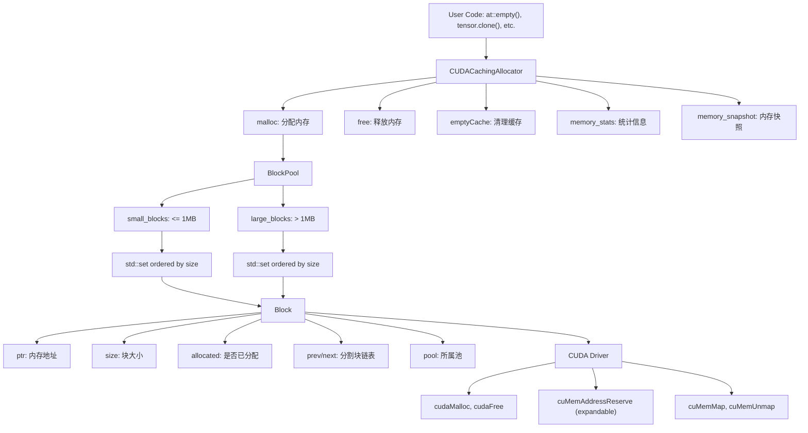
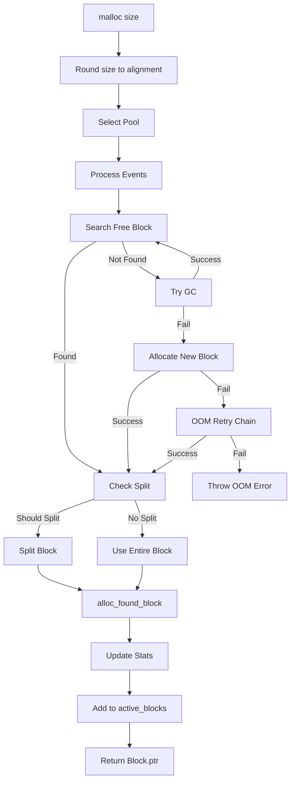
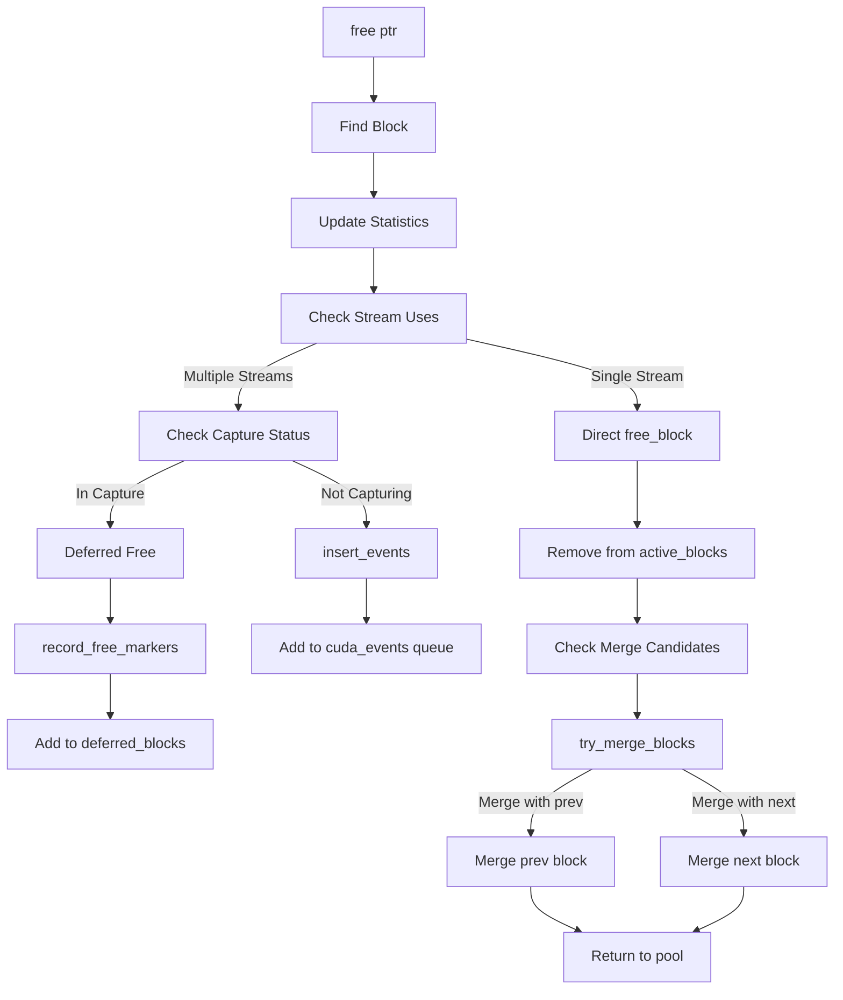
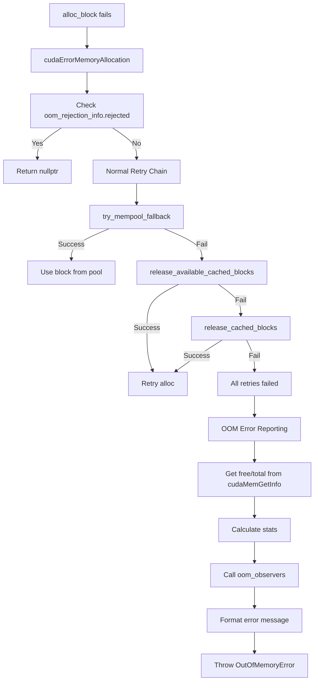

# PyTorch CUDA Caching Allocator深度分析

## 目录
1. [架构概览](#1-架构概览)
2. [核心数据结构](#2-核心数据结构)
3. [Block分配策略](#3-block分配策略)
4. [分配流程详解](#4-分配流程详解)
5. [释放流程详解](#5-释放流程详解)
6. [Block分割与合并](#6-block分割与合并)
7. [OOM处理机制](#7-oom处理机制)
8. [垃圾回收](#8-垃圾回收)
9. [Expandable Segments](#9-expandable-segments)
10. [CUDA Graph支持](#10-cuda-graph支持)
11. [内存统计与Snapshot](#11-内存统计与snapshot)
12. [配置选项](#12-配置选项)

---

## 1. 架构概览

### 1.1 核心文件位置

| 文件 | 路径 | 描述 |
|------|------|------|
| 主实现 | c10/cuda/CUDACachingAllocator.cpp | 核心分配器逻辑 (~5000行) |
| 头文件 | c10/cuda/CUDACachingAllocator.h | 公共API和类接口 |
| 通用接口 | c10/core/CachingDeviceAllocator.h | 基类和统计结构 |
| CUDA配置 | c10/cuda/CUDAAllocatorConfig.h | CUDA特定配置 |
| 基础配置 | c10/core/AllocatorConfig.h | 通用分配器配置 |
| 内存追踪 | c10/core/impl/GPUTrace.h | GPU内存追踪 |

### 1.2 整体架构



---

## 2. 核心数据结构

### 2.1 Block结构

```cpp
// 来自c10/cuda/CUDACachingAllocator.cpp
struct Block {
  c10::DeviceIndex device;      // GPU设备索引
  cudaStream_t stream;          // 分配流
  stream_set stream_uses;       // 使用过该块的流
  int32_t registration_counter{-1};  // 用于排序
  size_t size;                  // 块大小（字节）
  size_t requested_size;        // 原始请求大小
  BlockPool* pool{nullptr};     // 所属内存池
  void* ptr{nullptr};           // 内存地址
  bool allocated{false};        // 是否已分配
  bool mapped{true};            // 物理内存映射状态（expandable segments）
  Block* prev{nullptr};         // 前一个分割块
  Block* next{nullptr};         // 后一个分割块
  int event_count{0};           // 未完成CUDA事件数
  int64_t gc_count_base{0};     // 插入时的GC计数器
  std::shared_ptr<GatheredContext> context_when_allocated;
  std::shared_ptr<GatheredContext> context_when_segment_allocated;
  ExpandableSegment* expandable_segment_{nullptr};
  
  bool is_split() const {
    return (prev != nullptr) || (next != nullptr);
  }
  
  size_t gc_count() {
    TORCH_INTERNAL_ASSERT(pool);
    return static_cast<size_t>(pool->get_free_blocks_call_count - gc_count_base);
  }
};
```

### 2.2 BlockPool结构

```cpp
// 来自c10/cuda/CUDACachingAllocator.cpp
struct BlockPool {
  BlockPool(bool small, PrivatePool* private_pool = nullptr)
      : blocks(BlockComparatorRegistrationCounter),
        unmapped(BlockComparatorAddress),
        is_small(small),
        owner_PrivatePool(private_pool) {}

  std::set<Block*, Comparison> blocks;      // 空闲块，按注册计数器排序
  std::set<Block*, Comparison> unmapped;    // 未映射块（expandable segments）
  const bool is_small;
  PrivatePool* owner_PrivatePool;
  int64_t get_free_blocks_call_count{0};
  
  // 插入块时更新gc计数器
  std::pair<std::set<Block*, Comparison>::iterator, bool> insert_into_blocks(
      Block* block) {
    block->gc_count_base = get_free_blocks_call_count;
    return blocks.insert(block);
  }
};
```

### 2.3 大小阈值（已验证）

```cpp
// 来自c10/core/AllocatorConfig.h（已核实）
constexpr size_t kSmallBuffer = 2097152;     // 2 MiB
constexpr size_t kMinBlockSize = 512;        // 最小分配大小
constexpr size_t kSmallSize = 1048576;       // 1 MiB - 小/大块分界
constexpr size_t kMinLargeAlloc = 10485760;  // 10 MiB
constexpr size_t kRoundLarge = 2097152;      // 大块舍入粒度（2 MiB）

// 可配置的大块段大小（默认20MB）
// AcceleratorAllocatorConfig::large_segment_size() 返回 20971520 (20MB)
```

### 2.4 统计结构

```cpp
// 来自c10/core/CachingDeviceAllocator.h
struct DeviceStats {
  StatArray allocation;          // COUNT: 分配请求
  StatArray segment;             // COUNT: cudaMalloc段
  StatArray active;              // COUNT: 活跃内存块
  StatArray inactive_split;      // COUNT: 非活跃分割块
  StatArray allocated_bytes;     // SUM: 已分配字节
  StatArray reserved_bytes;      // SUM: 保留字节
  StatArray active_bytes;        // SUM: 活跃字节
  StatArray inactive_split_bytes;// SUM: 非活跃分割字节
  StatArray requested_bytes;     // SUM: 客户端请求字节
  StatArray pool_specific;       // 池特定统计
  
  int64_t num_alloc_retries = 0;
  int64_t num_ooms = 0;
  int64_t num_sync_all_streams = 0;
  int64_t num_fragmentation = 0;
};

// 单个统计条目
struct Stat {
  int64_t current = 0;    // 当前值
  int64_t peak = 0;       // 峰值
  int64_t allocated = 0;  // 累计分配
  int64_t freed = 0;      // 累计释放
};
```

---

## 3. Block分配策略

### 3.1 池选择

```cpp
// 来自c10/cuda/CUDACachingAllocator.cpp
BlockPool& get_pool(size_t size, cudaStream_t stream) {
  // 检查CUDA图捕获池
  if (C10_UNLIKELY(!captures_underway.empty())) {
    for (auto it = captures_underway.rbegin(); it != captures_underway.rend(); ++it) {
      if (it->second(stream)) {
        auto it1 = graph_pools.find(it->first);
        if (size <= kSmallSize) {
          return it1->second->small_blocks;
        } else {
          return it1->second->large_blocks;
        }
      }
    }
  }
  
  // 默认池基于大小选择
  if (size <= kSmallSize) {
    return small_blocks;
  } else {
    return large_blocks;
  }
}
```

### 3.2 大小舍入

```cpp
// 来自c10/cuda/CUDACachingAllocator.cpp
static size_t round_size(size_t size) {
  if (size < kMinBlockSize) {
    return kMinBlockSize;
  } else {
    auto divisions = AcceleratorAllocatorConfig::roundup_power2_divisions(size);
    if (divisions > 1 && size > (kMinBlockSize * divisions)) {
      return roundup_power2_next_division(size, divisions);
    } else {
      return kMinBlockSize * ((size + kMinBlockSize - 1) / kMinBlockSize);
    }
  }
}
```

### 3.3 分配大小计算（已更新）

```cpp
// 来自c10/cuda/CUDACachingAllocator.cpp
static size_t get_allocation_size(size_t size) {
  if (size <= kSmallSize) {
    return kSmallBuffer;  // 2 MiB for small
  } else if (size < kMinLargeAlloc) {
    // 使用可配置的大块段大小（默认20MB）
    return AcceleratorAllocatorConfig::large_segment_size();
  } else {
    return kRoundLarge * ((size + kRoundLarge - 1) / kRoundLarge);
  }
}
```

---

## 4. 分配流程详解

### 4.1 分配流程图



### 4.2 核心分配代码

```cpp
// 分配主流程
void* CUDACachingAllocator::malloc(int device, size_t size, cudaStream_t stream) {
  // 1. 舍入大小
  size = round_size(size);
  
  // 2. 选择池
  BlockPool& pool = get_pool(size, stream);
  
  // 3. 处理事件（释放已完成的块）
  process_events();
  
  // 4. 查找空闲块
  Block* block = get_free_block(size, stream, &pool);
  
  if (block != nullptr) {
    // 5. 检查是否需要分割
    if (should_split(block, size)) {
      block = split_block(block, size);
    }
    return alloc_found_block(block, size, stream);
  }
  
  // 6. 尝试垃圾回收
  garbage_collect_cached_blocks();
  block = get_free_block(size, stream, &pool);
  if (block != nullptr) {
    return alloc_found_block(block, size, stream);
  }
  
  // 7. 分配新块
  block = alloc_block(size, stream, &pool);
  if (block != nullptr) {
    return alloc_found_block(block, size, stream);
  }
  
  // 8. OOM处理
  return oom_allocation(device, size, stream);
}
```

### 4.3 查找空闲块

```cpp
Block* get_free_block(size_t size, cudaStream_t stream, BlockPool* pool) {
  // 使用best-fit策略在有序集合中查找
  // 构造搜索key
  Block key{device, stream, size};
  auto it = pool->blocks.lower_bound(&key);
  
  // 遍历找到合适的块
  for (; it != pool->blocks.end(); ++it) {
    Block* block = *it;
    if (!block->allocated && block->size >= size) {
      // 检查流兼容性
      if (block->stream == stream || block->stream_uses.empty()) {
        return block;
      }
    }
  }
  return nullptr;
}
```

---

## 5. 释放流程详解

### 5.1 释放流程图



### 5.2 释放核心代码

```cpp
void CUDACachingAllocator::free(Block* block) {
  // 1. 更新统计
  stats.increaseAllocated(-block->size);
  
  // 2. 检查是否在多个流上使用
  if (!block->stream_uses.empty()) {
    // 插入事件进行延迟释放
    insert_events(block);
    return;
  }
  
  // 3. 直接释放
  free_block(block);
}

void free_block(Block* block) {
  // 从active_blocks中移除
  active_blocks.erase(block->ptr);
  
  // 尝试合并
  Block* merged = try_merge_blocks(block->prev, block, pool);
  if (merged != nullptr) {
    block = merged;
  }
  merged = try_merge_blocks(block, block->next, pool);
  if (merged != nullptr) {
    block = merged;
  }
  
  // 返回池中
  pool->blocks.insert(block);
}
```

---

## 6. Block分割与合并

### 6.1 分割决策

```cpp
// 来自c10/cuda/CUDACachingAllocator.cpp
bool should_split(const Block* block, size_t size, bool is_expandable_segments_active) {
  // 检查池是否标记为不可分割
  if (no_split_pools.find(block->pool->owner_MempoolId()) != no_split_pools.end()) {
    return false;
  }
  
  size_t remaining = block->size - size;
  if (block->pool->is_small || is_expandable_segments_active) {
    return remaining >= kMinBlockSize;
  } else {
    return (size < AcceleratorAllocatorConfig::max_split_size()) &&
           (remaining > kSmallSize);
  }
}
```

### 6.2 合并块

```cpp
// 来自c10/cuda/CUDACachingAllocator.cpp
size_t try_merge_blocks(Block* dst, Block* src, BlockPool& pool) {
  // 无法合并的条件
  if (!src || src->allocated || src->event_count > 0 ||
      !src->stream_uses.empty() || dst->mapped != src->mapped) {
    return 0;
  }

  AT_ASSERT(dst->is_split() && src->is_split());

  if (dst->prev == src) {  // [src dst]
    dst->ptr = src->ptr;
    dst->prev = src->prev;
    if (dst->prev) {
      dst->prev->next = dst;
    }
  } else {  // [dst src]
    dst->next = src->next;
    if (dst->next) {
      dst->next->prev = dst;
    }
  }
  
  const size_t subsumed_size = src->size;
  dst->size += subsumed_size;
  
  auto erased = src->mapped ? pool.blocks.erase(src) : pool.unmapped.erase(src);
  delete src;
  return subsumed_size;
}
```

### 6.3 分割与合并流程图


---

## 7. OOM处理机制

### 7.1 OOM处理流程图



### 7.2 OOM错误报告

```cpp
// OOM错误格式
"CUDA out of memory. Tried to allocate X MiB. "
"GPU Y has Z MiB total capacity. "
"Allocated A MiB, reserved B MiB. "
"CUDACachingAllocator stats: ..."

// 调用OOM Observers
void notifyOfOOM(const std::vector<std::pair<std::string, std::string>>& stats) {
  for (auto& observer : oom_observers_) {
    observer(stats);
  }
}
```

### 7.3 OOM Observer机制（新增）

```cpp
// 注册OOM回调
void registerOOMObserver(std::function<void(
    const std::vector<std::pair<std::string, std::string>>&)> observer);

// 使用场景：
// 1. 记录OOM事件到日志
// 2. 发送告警
// 3. 触发内存分析
```

---

## 8. 垃圾回收

### 8.1 GC机制

```cpp
// 来自c10/cuda/CUDACachingAllocator.cpp
void garbage_collect_cached_blocks(const std::shared_ptr<GatheredContext>& context) {
  // 获取配置阈值
  double gc_threshold = AcceleratorAllocatorConfig::garbage_collection_threshold();
  if (gc_threshold <= 0) {
    return;  // GC已禁用
  }
  
  // 计算阈值（字节）
  size_t gc_threshold_bytes = static_cast<size_t>(
      gc_threshold * static_cast<double>(allowed_memory_maximum.value()));
  
  if (total_allocated_memory <= gc_threshold_bytes) {
    return;  // 无需GC
  }
  
  const auto target_size = total_allocated_memory - gc_threshold_bytes;
  
  // 计算可释放块的平均年龄
  size_t total_age = 0.0;
  int freeable_block_count = 0;
  for (auto& b : large_blocks.blocks) {
    if (!b->is_split()) {
      total_age += b->gc_count();
      ++freeable_block_count;
    }
  }
  
  if (freeable_block_count == 0) return;
  
  double age_threshold = static_cast<double>(total_age) / freeable_block_count;
  
  // 释放超过平均年龄的块
  for (auto it = large_blocks.blocks.begin(); it != large_blocks.blocks.end();) {
    Block* block = *it;
    ++it;
    if (!block->is_split() && !block->expandable_segment_ &&
        static_cast<double>(block->gc_count()) >= age_threshold) {
      release_block(block, context);
    }
  }
}
```

### 8.2 GC配置

```cpp
// 通过环境变量配置
// PYTORCH_CUDA_ALLOC_CONF=garbage_collection_threshold:0.5

// 表示当使用内存超过50%最大允许内存时触发GC
// 默认值为0（禁用GC）
```

---

## 9. Expandable Segments

### 9.1 概述

Expandable Segments允许分配器预留大的虚拟地址空间，按需映射物理页面，减少碎片。

**配置启用**：
```bash
export PYTORCH_CUDA_ALLOC_CONF=expandable_segments:True
```

### 9.2 ExpandableSegment结构

```cpp
// 来自c10/cuda/CUDACachingAllocator.cpp
struct ExpandableSegment {
  // 映射虚拟地址范围到物理内存
  SegmentRange map(SegmentRange range);
  
  // 取消映射物理页面（归还内存给系统）
  SegmentRange unmap(SegmentRange range);
  
  // 创建可共享的句柄用于IPC
  SegmentRange share(SegmentRange range, std::ostream& buf);
  
  // 从共享句柄导入
  static std::unique_ptr<ExpandableSegment> fromShared(...);
  
  // 使用CUDA驱动的cuMemAddressReserve, cuMemCreate, cuMemMap
  CUdeviceptr device_ptr_;
  size_t size_;
  size_t allocated_size_;
};
```

### 9.3 分配流程

```cpp
Block* try_allocate_expandable_block(
    c10::DeviceIndex device,
    cudaStream_t stream,
    BlockPool* pool,
    size_t size,
    const std::shared_ptr<GatheredContext>& ctx) {
  
  // 查找或创建expandable segment
  Block* candidate = find_expandable_block(device, stream, pool, size);
  
  // 如需要则映射物理内存
  if (!candidate->mapped &&
      !map_block(candidate, std::min(candidate->size, size), ctx)) {
    return nullptr;
  }
  
  // 通过映射更多内存来扩展
  while (candidate->size < size) {
    auto remaining = size - candidate->size;
    auto new_candidate = candidate->next;
    if (!map_block(new_candidate, std::min(remaining, candidate->next->size), ctx)) {
      return nullptr;
    }
    candidate = new_candidate;
  }
  
  return candidate;
}
```

---

## 10. CUDA Graph支持

### 10.1 PrivatePool

```cpp
// 来自c10/cuda/CUDACachingAllocator.cpp
struct PrivatePool {
  MempoolId_t id;
  int use_count{1};           // 使用该池的图数量
  int cudaMalloc_count{0};    // 未释放的cudaMalloc数量
  std::shared_ptr<CUDAAllocator> allocator_;
  BlockPool large_blocks;
  BlockPool small_blocks;
  
  // 额外的统计信息
  int64_t allocated_bytes = 0;
  int64_t reserved_bytes = 0;
};
```

### 10.2 捕获通知

```cpp
void beginAllocateToPool(MempoolId_t mempool_id, std::function<bool(cudaStream_t)> filter);
void endAllocateToPool(MempoolId_t mempool_id);
void releasePool(MempoolId_t mempool_id);  // 图销毁时调用

// 使用示例（来自CUDAGraph）
void capture_begin() {
  allocator->beginAllocateToPool(mempool_id_, [this](cudaStream_t stream) {
    return stream == capture_stream_;
  });
}

void capture_end() {
  allocator->endAllocateToPool(mempool_id_);
}
```

### 10.3 延迟释放

```cpp
// 捕获期间，cudaEventQuery是非法的，使用图节点标记延迟释放
void record_free_markers(Block* block);
void add_to_deferred_blocks(Block* block);

// 捕获结束后释放
cudaGraphNode_t free_node;
cudaGraphAddMemFreeNode(&free_node, graph, &dependencies, dep_count, block->ptr);
```

---

## 11. 内存统计与Snapshot

### 11.1 Memory Snapshot API（新增）

```python
import torch

# 记录内存快照
snapshot = torch.cuda.memory_snapshot()

# snapshot是一个列表，包含每个块的详细信息：
# - address: 内存地址
# - size: 块大小
# - state: 状态（active, inactive_split, pool）
# - allocated_size: 实际分配大小
# - requested_size: 请求大小
# - stream: 分配流
# - frames: 分配时的调用栈
```

### 11.2 内存统计Python API

```python
import torch

# 获取设备统计
torch.cuda.memory_stats(device=None)
# 返回包含以下信息的字典：
# - allocated_bytes: 已分配字节数
# - reserved_bytes: 保留字节数
# - active_bytes: 活跃字节数
# - num_alloc_retries: 分配重试次数
# - num_ooms: OOM次数

# 获取内存摘要
torch.cuda.memory_summary(device=None, abbreviated=False)

# 重置峰值统计
torch.cuda.reset_peak_memory_stats(device=None)

# 清空缓存
torch.cuda.empty_cache()
```

### 11.3 GatheredContext（新增）

```cpp
// 用于内存调试，记录分配时的调用栈
struct GatheredContext {
  std::vector<std::string> cpp_frames;
  std::vector<std::string> python_frames;
  
  static std::shared_ptr<GatheredContext> gather() {
    // 收集C++和Python调用栈
  }
};

// 在分配时记录上下文
block->context_when_allocated = GatheredContext::gather();
```

---

## 12. 配置选项

### 12.1 关键设置（已更新）

| 选项 | 环境变量 | 默认值 | 描述 |
|------|----------|--------|------|
| max_split_size_mb | PYTORCH_CUDA_ALLOC_CONF | unlimited | 可分割的最大块大小 |
| max_non_split_rounding_mb | PYTORCH_CUDA_ALLOC_CONF | 0 | 超大块的舍入容差 |
| garbage_collection_threshold | PYTORCH_CUDA_ALLOC_CONF | 0 | GC触发阈值（0-1） |
| expandable_segments | PYTORCH_CUDA_ALLOC_CONF | false | 启用可扩展段 |
| roundup_power2_divisions | PYTORCH_CUDA_ALLOC_CONF | [] | 大小舍入除数 |
| per_process_memory_fraction | PYTORCH_CUDA_ALLOC_CONF | 1.0 | 内存使用限制 |
| large_segment_size_mb | PYTORCH_CUDA_ALLOC_CONF | 20 | 大块段大小（MB） |

### 12.2 配置示例

```bash
# 启用垃圾回收和可扩展段
export PYTORCH_CUDA_ALLOC_CONF="garbage_collection_threshold:0.5,expandable_segments:True"

# 配置大小舍入
export PYTORCH_CUDA_ALLOC_CONF="roundup_power2_divisions:[64:8,256:4,1024:4,>:1]"

# 限制最大分割大小
export PYTORCH_CUDA_ALLOC_CONF="max_split_size_mb:1024"

# 组合多个选项
export PYTORCH_CUDA_ALLOC_CONF="max_split_size_mb:512,garbage_collection_threshold:0.8,expandable_segments:True"
```

### 12.3 配置解析器

```cpp
// 来自c10/core/AllocatorConfig.h
class ConfigTokenizer {
  // 解析格式: "key1:val1,key2:[val2,val3]"
  // 支持列表值: "key:[v1,v2,v3]"
  // 示例: "max_split_size_mb:100,garbage_collection_threshold:0.5"
};

// CUDA特定配置
class CUDAAllocatorConfig {
  static void parseArgs(const std::string& env);
  
  // CUDA特定选项:
  // - expandable_segments
  // - release_lock_on_malloc
};
```

---

## 13. 文件位置汇总

| 组件 | 文件路径 |
|------|----------|
| 主实现 | c10/cuda/CUDACachingAllocator.cpp |
| 头文件 | c10/cuda/CUDACachingAllocator.h |
| 基类 | c10/core/CachingDeviceAllocator.h |
| 通用配置 | c10/core/AllocatorConfig.h |
| CUDA配置 | c10/cuda/CUDAAllocatorConfig.h |
| GPU追踪 | c10/core/impl/GPUTrace.h |

---

## 14. 总结

PyTorch的CUDA Caching Allocator是一个精密的GPU内存管理系统：

1. **块池管理**：小/大块池分离，快速查找合适块

2. **内存分配策略**：Best-fit分配，避免过多碎片

3. **分割合并**：动态分割大块，释放时自动合并相邻块

4. **OOM处理**：多层重试机制，包括GC、释放缓存块、OOM Observers

5. **Expandable Segments**：虚拟内存管理，减少碎片，支持配置启用

6. **CUDA Graph支持**：PrivatePool管理图内存，延迟释放

7. **统计和调试**：详细的内存统计、内存快照、调用栈追踪

8. **灵活配置**：通过环境变量动态配置分配器行为

9. **垃圾回收**：基于年龄的GC策略，可配置触发阈值

该分配器成功平衡了：
- **性能**：快速分配，避免频繁cudaMalloc
- **内存效率**：块重用，合并分割
- **稳定性**：OOM优雅处理，多种重试策略
- **灵活性**：支持多种使用场景（标准训练、CUDA图、多流、Expandable Segments）
- **可调试性**：内存快照、统计信息、调用栈追踪
