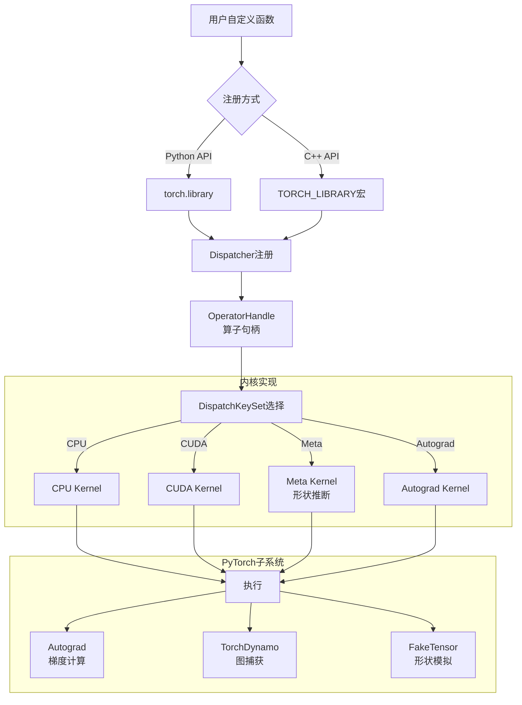
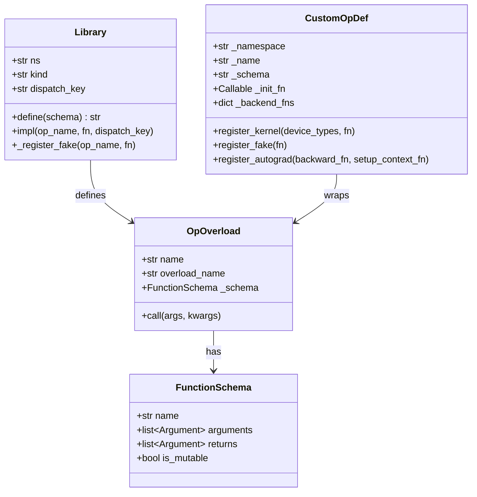
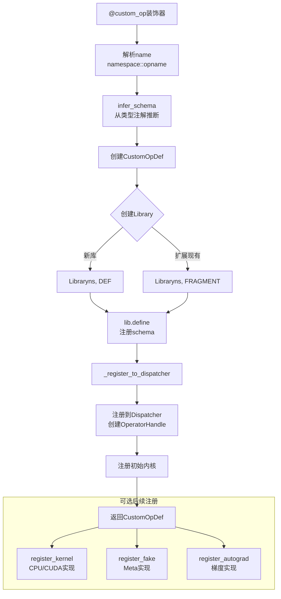
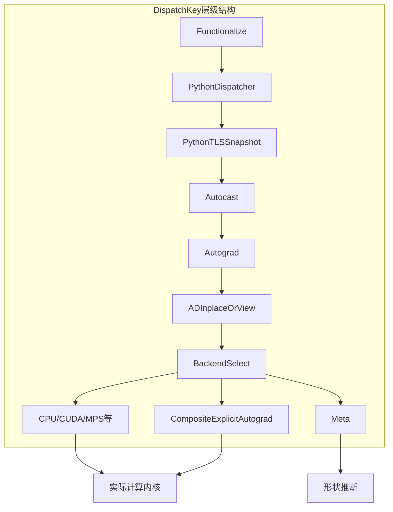
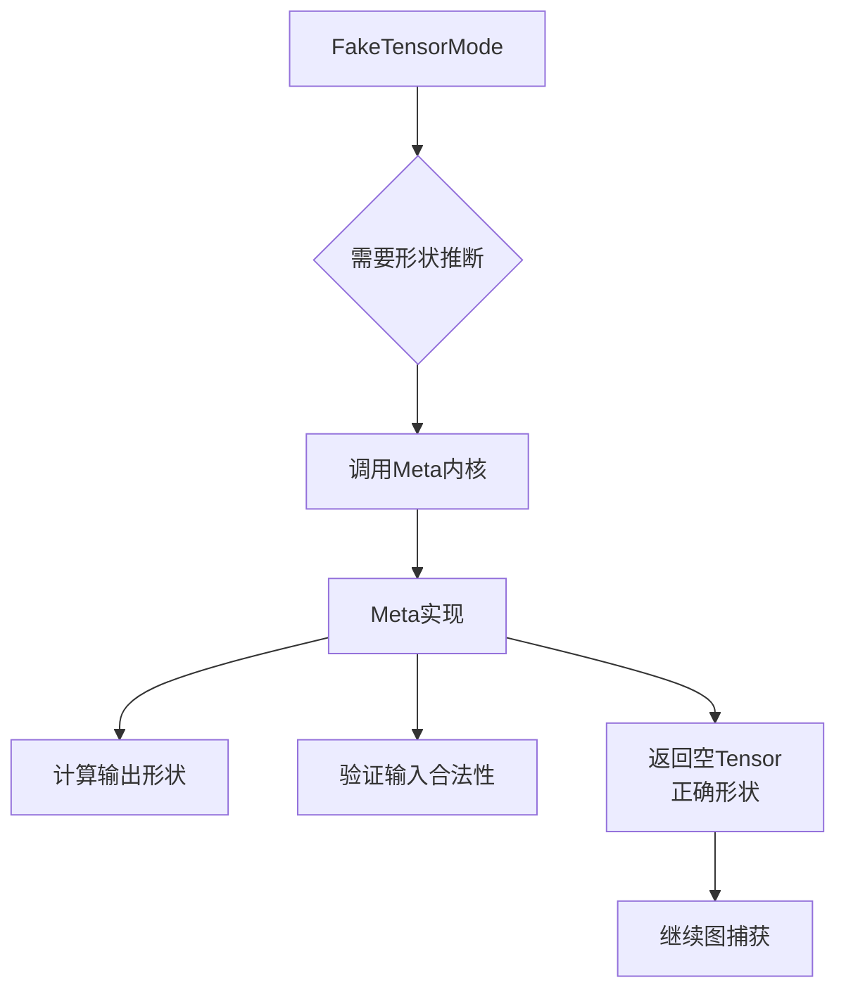
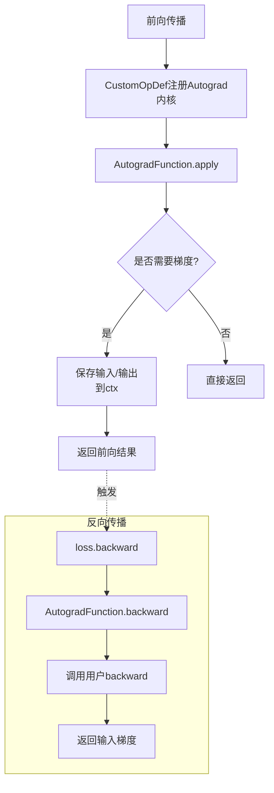
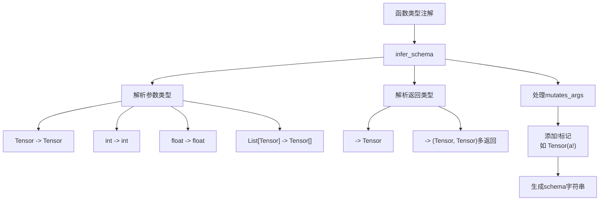

# PyTorch Custom Operator System 深度分析

## 目录
1. [架构概览与设计目标](#1-架构概览与设计目标)
2. [核心概念与API](#2-核心概念与api)
3. [自定义算子创建流程](#3-自定义算子创建流程)
4. [DispatchKey与内核注册](#4-dispatchkey与内核注册)
5. [元实现与FakeTensor支持](#5-元实现与faketensor支持)
6. [自动微分集成](#6-自动微分集成)
7. [模式推断与验证](#7-模式推断与验证)
8. [高级特性](#8-高级特性)

---

## 1. 架构概览与设计目标

### 1.1 什么是自定义算子系统

**自定义算子系统**允许用户用Python或C++定义新的PyTorch算子，使其与原生算子一样工作，包括支持自动微分、torch.compile、FakeTensor模拟、序列化等PyTorch子系统。

### 1.2 设计目标

```
┌─────────────────────────────────────────────────────────────┐
│               自定义算子系统设计目标                         │
├─────────────────────────────────────────────────────────────┤
│  1. 无缝集成: 像原生算子一样工作                             │
│  2. 多后端支持: CPU/CUDA等设备的独立实现                     │
│  3. 自动微分: 支持Autograd自动求导                           │
│  4. 编译支持: 兼容torch.compile和torch.export                │
│  5. 元数据支持: FakeTensor形状推断                           │
│  6. 序列化: 支持模型保存和加载                               │
└─────────────────────────────────────────────────────────────┘
```

### 1.3 在PyTorch栈中的位置



### 1.4 核心文件位置

| 组件 | 文件路径 | 描述 |
|------|----------|------|
| Library API | `torch/library.py` | Python库定义API |
| CustomOpDef | `torch/_library/custom_ops.py` | 现代自定义算子API |
| Autograd | `torch/_library/autograd.py` | 自动微分支持 |
| Fake实现 | `torch/_library/fake_impl.py` | FakeTensor实现注册 |
| 模式推断 | `torch/_library/infer_schema.py` | 类型注解转schema |
| 工具函数 | `torch/_library/utils.py` | 通用工具 |
| C++ Dispatcher | `aten/src/ATen/core/dispatch/` | C++分发系统 |

---

## 2. 核心概念与API

### 2.1 类结构概览



### 2.2 Library类

```python
class Library:
    """
    用于创建算子库或覆盖现有库的类。

    Args:
        ns: 库名称（命名空间）
        kind: "DEF"(定义新库), "IMPL"(覆盖现有库), "FRAGMENT"(库片段)
        dispatch_key: 默认分发键，如"CPU", "CUDA"
    """

    def __init__(self, ns, kind, dispatch_key=""):
        self.m = torch._C._dispatch_library(kind, ns, dispatch_key, ...)
        self.ns = ns
        self.kind = kind
        self.dispatch_key = dispatch_key

    def define(self, schema, alias_analysis="", *, tags=()):
        """
        定义新算子。

        Args:
            schema: 函数schema，如"my_op(Tensor self, Scalar other) -> Tensor"
            alias_analysis: 别名分析策略 ("FROM_SCHEMA"或"CONSERVATIVE")
            tags: 算子标签，如torch.Tag.needs_fixed_stride_order

        Returns:
            算子名称
        """
        return self.m.define(schema, alias_analysis, tags)

    def impl(self, op_name, fn, dispatch_key="", *, with_keyset=False):
        """
        注册算子实现。

        Args:
            op_name: 算子名称或OpOverload对象
            fn: 实现函数
            dispatch_key: 分发键，如"CPU", "CUDA", "CompositeImplicitAutograd"
            with_keyset: 是否传递当前keyset给函数
        """
        self.m.impl(name, dispatch_key, fn, with_keyset)
```

### 2.3 custom_op装饰器

```python
@exposed_in("torch.library")
def custom_op(
    name: str,
    fn: Callable | None = None,
    /,
    *,
    mutates_args: str | Iterable[str],
    device_types: str | Sequence[str] | None = None,
    schema: str | None = None,
    tags: Sequence[torch.Tag] | None = None,
) -> CustomOpDef | Callable:
    """
    将函数包装为自定义算子。

    Args:
        name: 算子名称，格式为"{namespace}::{name}"
        mutates_args: 突变的参数名列表，或"unknown"
        device_types: 支持的设备类型，如"cpu", "cuda"
        schema: 自定义schema字符串（可选，推荐自动推断）
        tags: 算子标签

    Returns:
        CustomOpDef对象
    """
    def inner(fn: Callable) -> CustomOpDef:
        # 推断schema
        if schema is None:
            schema_str = infer_schema(fn, mutates_args=mutates_args)
        else:
            schema_str = schema

        namespace, opname = name.split("::")

        # 创建CustomOpDef
        result = CustomOpDef(namespace, opname, schema_str, fn, tags)

        # 注册初始内核
        result.register_kernel(device_types)(fn)

        return result

    if fn is None:
        return inner
    return inner(fn)
```

### 2.4 CustomOpDef类

```python
class CustomOpDef:
    """自定义算子定义包装器"""

    def __init__(
        self,
        namespace: str,
        name: str,
        schema: str,
        fn: Callable,
        tags: Sequence[torch.Tag] | None = None,
    ):
        self._namespace = namespace
        self._name = name
        self._schema = schema
        self._init_fn = fn
        self._tags = tags

        # 存储各种实现
        self._backend_fns: dict[str | None, Callable] = {}
        self._abstract_fn: Callable | None = None
        self._setup_context_fn: Callable | None = None
        self._backward_fn: Callable | None = None
        self._torch_dispatch_fns: dict[type, Callable] = {}
        self._vmap_fn: Callable | None = None

        # 创建Library并注册
        self._lib = get_library_allowing_overwrite(namespace, name)
        self._register_to_dispatcher(tags)

    @property
    def _qualname(self) -> str:
        return f"{self._namespace}::{self._name}"

    def register_kernel(
        self,
        device_types: str | Sequence[str] | None,
        fn: Callable | None = None,
        /
    ) -> Callable:
        """注册设备特定内核"""
        def inner(fn):
            for device_type in device_types:
                self._backend_fns[device_type] = fn

                # 注册到dispatcher
                if device_type is None:
                    self._lib.impl(
                        self._name, backend_impl, "CompositeExplicitAutograd"
                    )
                else:
                    self._lib.impl(
                        self._name,
                        backend_impl,
                        _C._dispatch_key_for_device(device_type),
                    )
            return fn

        if fn is None:
            return inner
        return inner(fn)

    def register_fake(self, fn: Callable, /) -> Callable:
        """注册Meta/Fake实现（用于形状推断）"""
        self._abstract_fn = fn
        self._lib._register_fake(self._name, fn, _stacklevel=2)
        return fn

    def register_autograd(
        self,
        backward: Callable,
        /,
        *,
        setup_context: Callable,
    ) -> None:
        """注册自动微分支持"""
        self._setup_context_fn = setup_context
        self._backward_fn = backward

        # 注册autograd内核
        autograd_kernel = make_autograd_kernel(self, setup_context, backward)
        self._lib.impl(self._name, autograd_kernel, "Autograd")

    def __call__(self, *args, **kwargs):
        """直接调用算子"""
        return _C._dispatch_call_boxed(self._ophandle, *args, **kwargs)
```

---

## 3. 自定义算子创建流程

### 3.1 创建流程



### 3.2 基本使用示例

```python
import torch
from torch import Tensor
from torch.library import custom_op

# 1. 基本自定义算子
@custom_op("mylib::my_linear", mutates_args=())
def my_linear(x: Tensor, weight: Tensor, bias: Tensor) -> Tensor:
    """自定义线性层算子"""
    return torch.matmul(x, weight.t()) + bias

# 2. 注册CUDA实现
@my_linear.register_kernel("cuda")
def my_linear_cuda(x, weight, bias):
    """CUDA特定实现"""
    # 可以调用cuBLAS等CUDA库
    return torch.matmul(x, weight.t()) + bias

# 3. 注册Fake实现（形状推断）
@my_linear.register_fake
def my_linear_fake(x, weight, bias):
    """FakeTensor模式下的形状推断"""
    # 返回相同形状的tensor，不分配实际内存
    return torch.empty(
        x.shape[:-1] + weight.shape[-1:],
        dtype=x.dtype,
        device=x.device
    )

# 使用
x = torch.randn(2, 3)
weight = torch.randn(4, 3)
bias = torch.randn(4)
result = my_linear(x, weight, bias)  # shape: [2, 4]
```

### 3.3 原地修改算子

```python
# 定义原地修改算子（需正确标注mutates_args）
@custom_op("mylib::my_add_", mutates_args={"x"})
def my_add_(x: Tensor, y: Tensor) -> None:
    """原地加法，修改x"""
    x_np = x.numpy()
    y_np = y.numpy()
    x_np += y_np

# 使用
x = torch.ones(3)
y = torch.tensor([1.0, 2.0, 3.0])
my_add_(x, y)
print(x)  # tensor([2., 3., 4.])
```

---

## 4. DispatchKey与内核注册

### 4.1 DispatchKey层级



### 4.2 常用DispatchKey

| DispatchKey | 用途 |
|------------|------|
| CPU | CPU实现 |
| CUDA | CUDA实现 |
| Meta | 形状推断（FakeTensor） |
| Autograd | 自动微分包装 |
| Autocast | 自动混合精度 |
| CompositeImplicitAutograd | 自动分解到aten算子 |
| CompositeExplicitAutograd | 显式后端实现 |
| BackendSelect | 工厂函数后端选择 |

### 4.3 内核注册方式

```python
# 方式1: 通过Library.impl
lib = torch.library.Library("mylib", "DEF")
lib.define("my_op(Tensor x) -> Tensor")

def my_op_cpu(x):
    # CPU实现
    return x + 1

def my_op_cuda(x):
    # CUDA实现
    return x + 1

lib.impl("my_op", my_op_cpu, "CPU")
lib.impl("my_op", my_op_cuda, "CUDA")

# 方式2: 通过CustomOpDef.register_kernel
@custom_op("mylib::my_op2", mutates_args=())
def my_op2(x: Tensor) -> Tensor:
    return x * 2

@my_op2.register_kernel("cpu")
def my_op2_cpu(x):
    return x * 2

@my_op2.register_kernel("cuda")
def my_op2_cuda(x):
    return x * 2

# 方式3: 通用实现（所有后端）
@custom_op("mylib::my_op3", mutates_args=(), device_types=None)
def my_op3(x: Tensor) -> Tensor:
    """自动注册为CompositeExplicitAutograd"""
    return x ** 2
```

---

## 5. 元实现与FakeTensor支持

### 5.1 Meta实现的作用



### 5.2 Meta实现注册

```python
# 方式1: @register_fake装饰器
@my_op.register_fake
def my_op_meta(x: Tensor) -> Tensor:
    """Meta实现用于形状推断"""
    # 基于输入形状计算输出形状
    out_shape = compute_output_shape(x.shape)
    return torch.empty(out_shape, dtype=x.dtype, device=x.device)

# 方式2: 使用get_ctx()处理数据依赖形状
from torch.library import get_ctx

@custom_op("mylib::my_op_dynamic", mutates_args=())
def my_op_dynamic(x: Tensor) -> Tensor:
    """输出形状依赖数据内容"""
    nonzero_count = x.nonzero().shape[0]
    return torch.zeros(nonzero_count)

@my_op_dynamic.register_fake
def my_op_dynamic_fake(x):
    ctx = get_ctx()
    # 获取当前shape环境中的符号
    s = ctx.new_dynamic_size()
    # 返回带符号形状的tensor
    return torch.empty(s, dtype=x.dtype, device=x.device)

# 方式3: 通过Library._register_fake（旧API）
lib = torch.library.Library("mylib", "DEF")
lib.define("my_op(Tensor x) -> Tensor")

@torch.library.impl_abstract("mylib::my_op")
def my_op_abstract(x):
    return torch.empty_like(x)
```

### 5.3 形状推断示例

```python
import torch
from torch import Tensor
from torch.library import custom_op, get_ctx

@custom_op("mylib::repeat_interleave", mutates_args=())
def repeat_interleave(x: Tensor, repeats: int) -> Tensor:
    """重复tensor元素"""
    return x.repeat_interleave(repeats)

@repeat_interleave.register_fake
def repeat_interleave_fake(x, repeats):
    """Fake实现：计算输出形状"""
    # 输出形状 = 输入元素数 * repeats
    output_size = x.numel() * repeats
    # 处理多维情况
    if x.dim() == 1:
        return torch.empty(output_size, dtype=x.dtype, device=x.device)
    else:
        out_shape = list(x.shape)
        out_shape[-1] *= repeats
        return torch.empty(out_shape, dtype=x.dtype, device=x.device)

# 测试
def test_meta():
    with torch._subclasses.FakeTensorMode():
        x = torch.randn(3, 4)
        result = repeat_interleave(x, 2)
        print(result.shape)  # torch.Size([3, 8])

test_meta()
```

---

## 6. 自动微分集成

### 6.1 Autograd注册流程



### 6.2 完整Autograd示例

```python
import torch
from torch import Tensor
from torch.library import custom_op
from typing import Tuple

# 1. 定义带梯度的自定义算子
@custom_op("mylib::my_custom_linear", mutates_args=())
def my_custom_linear(x: Tensor, weight: Tensor, bias: Tensor) -> Tensor:
    """自定义线性层，支持梯度"""
    return torch.matmul(x, weight.t()) + bias

# 2. 注册Meta实现
@my_custom_linear.register_fake
def my_custom_linear_fake(x, weight, bias):
    out_shape = x.shape[:-1] + weight.shape[:1]
    return torch.empty(out_shape, dtype=x.dtype, device=x.device)

# 3. 注册Autograd
@my_custom_linear.register_autograd(
    # 反向传播函数
    backward=lambda ctx, grad_output: my_linear_backward(ctx, grad_output),
    # 设置上下文函数（在前向中调用，保存需要的信息）
    setup_context=lambda ctx, inputs, output: my_linear_setup(ctx, inputs, output),
)
def my_linear_setup(ctx, inputs, output):
    """在前向传播中设置上下文，保存反向需要的信息"""
    x, weight, bias = inputs
    ctx.save_for_backward(x, weight, bias)
    ctx.mark_non_differentiable(output)  # 如果有不需要梯度的输出

def my_linear_backward(ctx, grad_output):
    """反向传播计算"""
    x, weight, bias = ctx.saved_tensors

    # 计算各输入的梯度
    grad_x = grad_weight = grad_bias = None

    if ctx.needs_input_grad[0]:  # x需要梯度
        grad_x = grad_output.matmul(weight)

    if ctx.needs_input_grad[1]:  # weight需要梯度
        grad_weight = grad_output.t().matmul(x)

    if ctx.needs_input_grad[2]:  # bias需要梯度
        grad_bias = grad_output.sum(0)

    return grad_x, grad_weight, grad_bias

# 4. 测试
x = torch.randn(2, 3, requires_grad=True)
weight = torch.randn(4, 3, requires_grad=True)
bias = torch.randn(4, requires_grad=True)

out = my_custom_linear(x, weight, bias)
loss = out.sum()
loss.backward()

print(f"x.grad shape: {x.grad.shape}")      # [2, 3]
print(f"weight.grad shape: {weight.grad.shape}")  # [4, 3]
print(f"bias.grad shape: {bias.grad.shape}")      # [4]
```

### 6.3 简化Autograd模式

```python
# 对于简单的点wise操作，可以使用functionalize自动推导
from torch.autograd import function

@custom_op("mylib::my_activation", mutates_args=())
def my_activation(x: Tensor) -> Tensor:
    """自定义激活函数"""
    return torch.where(x > 0, x, torch.exp(x) - 1)  # ELU-like

# 使用torch.autograd.functional进行梯度验证
from torch.autograd.gradcheck import gradcheck

def test_grad():
    x = torch.randn(2, 3, requires_grad=True, dtype=torch.float64)
    # 使用torch.autograd.gradcheck验证梯度正确性
    # 需要实现反向传播
```

---

## 7. 模式推断与验证

### 7.1 Schema推断流程



### 7.2 支持的类型映射

| Python类型 | Schema类型 | 说明 |
|-----------|-----------|------|
| `torch.Tensor` | `Tensor` | 张量 |
| `int` | `int` | 整数 |
| `float` | `float` | 浮点数 |
| `bool` | `bool` | 布尔 |
| `str` | `str` | 字符串 |
| `torch.dtype` | `ScalarType` | 数据类型 |
| `torch.device` | `Device` | 设备 |
| `List[Tensor]` | `Tensor[]` | 张量列表 |
| `List[int]` | `int[]` | 整数列表 |
| `Optional[Tensor]` | `Tensor?` | 可选张量 |

### 7.3 模式验证

```python
from torchgen.model import FunctionSchema

# 手动验证schema
schema_str = "my_op(Tensor x, int repeats) -> Tensor"
schema = FunctionSchema.parse(schema_str)

print(f"算子名: {schema.name}")
print(f"参数: {schema.arguments}")
print(f"返回值: {schema.returns}")

# 验证与函数签名匹配
def validate_signature(func, schema):
    """验证函数签名与schema匹配"""
    import inspect
    sig = inspect.signature(func)

    # 检查参数数量
    if len(sig.parameters) != len(schema.arguments):
        raise ValueError("参数数量不匹配")

    # 检查参数类型
    for (name, param), arg in zip(sig.parameters.items(), schema.arguments):
        # 验证类型兼容性
        ...

# 使用示例
def my_func(x: torch.Tensor, repeats: int) -> torch.Tensor:
    return x.repeat(repeats)

validate_signature(my_func, schema)
```

---

## 8. 高级特性

### 8.1 Triton内核集成

```python
from torch.library import triton_op, wrap_triton
import triton
import triton.language as tl

# 定义Triton内核
@triton.jit
def add_kernel(x_ptr, y_ptr, output_ptr, n_elements, BLOCK_SIZE: tl.constexpr):
    pid = tl.program_id(axis=0)
    block_start = pid * BLOCK_SIZE
    offsets = block_start + tl.arange(0, BLOCK_SIZE)
    mask = offsets < n_elements

    x = tl.load(x_ptr + offsets, mask=mask)
    y = tl.load(y_ptr + offsets, mask=mask)
    output = x + y
    tl.store(output_ptr + offsets, output, mask=mask)

# 包装为自定义算子
@triton_op("mylib::triton_add", mutates_args=())
def triton_add(x: Tensor, y: Tensor) -> Tensor:
    output = torch.empty_like(x)
    n_elements = output.numel()

    def grid_fn(meta):
        return (triton.cdiv(n_elements, meta["BLOCK_SIZE"]),)

    # wrap_triton包装Triton内核
    wrap_triton(add_kernel)[grid_fn](x, y, output, n_elements, BLOCK_SIZE=1024)
    return output
```

### 8.2 序列化支持

```python
# 自定义算子默认支持torch.save/load
# 因为它们是dispatcher的一部分

# 保存包含自定义算子的模型
torch.save(model, "model.pt")

# 加载（需要自定义算子已注册）
model = torch.load("model.pt")

# 对于torch.export，需要确保算子在序列化范围内
ep = torch.export.export(model, (x,))
torch.export.save(ep, "model.pt2")
```

### 8.3 与torch.compile集成

```python
# 自定义算子默认与torch.compile兼容
# 因为它们是aten级别的操作

@torch.compile
def compiled_func(x, weight, bias):
    # my_custom_linear是自定义算子
    return my_custom_linear(x, weight, bias)

# 对于更复杂的自定义算子，可能需要定义分解
@torch.library.register_decomposition("mylib::my_op")
def my_op_decomposition(x):
    # 分解为基本aten算子
    return x + 1
```

### 8.4 C++自定义算子

```cpp
// C++中定义自定义算子（用于高性能场景）
// my_op.cpp

#include <torch/library.h>

// 定义schema
TORCH_LIBRARY(mylib, m) {
    m.def("my_op(Tensor x) -> Tensor");
}

// CPU实现
TORCH_LIBRARY_IMPL(mylib, CPU, m) {
    m.impl("my_op", [](const at::Tensor& x) {
        return x + 1;
    });
}

// CUDA实现
TORCH_LIBRARY_IMPL(mylib, CUDA, m) {
    m.impl("my_op", [](const at::Tensor& x) {
        return x + 1;  // 实际应调用CUDA kernel
    });
}

// Meta实现
TORCH_LIBRARY_IMPL(mylib, Meta, m) {
    m.impl("my_op", [](const at::Tensor& x) {
        return at::empty_like(x);
    });
}
```

---

## 9. 总结

### 9.1 自定义算子系统核心价值

1. **扩展性**: 轻松添加新算子
2. **一致性**: 与原生算子相同的行为
3. **多后端**: 支持CPU/CUDA等多种设备
4. **完整集成**: 支持Autograd、torch.compile、export

### 9.2 最佳实践

| 实践 | 说明 |
|------|------|
| 使用类型注解 | 让schema自动推断 |
| 正确标注mutates_args | 确保别名分析正确 |
| 实现Meta内核 | 支持FakeTensor和编译 |
| 为所有设备注册 | CPU、CUDA至少都支持 |
| 提供梯度实现 | 如需训练则实现register_autograd |

### 9.3 使用建议

```python
# 1. 基本自定义算子
@custom_op("mylib::my_op", mutates_args=())
def my_op(x: Tensor) -> Tensor:
    return x + 1

# 2. 完整实现的自定义算子
@custom_op("mylib::full_op", mutates_args=())
def full_op(x: Tensor, scale: float) -> Tensor:
    """完整示例"""
    return x * scale

@full_op.register_fake
def _(x, scale):
    return torch.empty_like(x)

@full_op.register_autograd(
    backward=lambda ctx, gout: (gout * ctx.scale, None),
    setup_context=lambda ctx, inputs, output: setattr(ctx, 'scale', inputs[1]),
)

# 3. C++扩展（高性能需求）
# 使用pybind11或TORCH_LIBRARY宏
```
