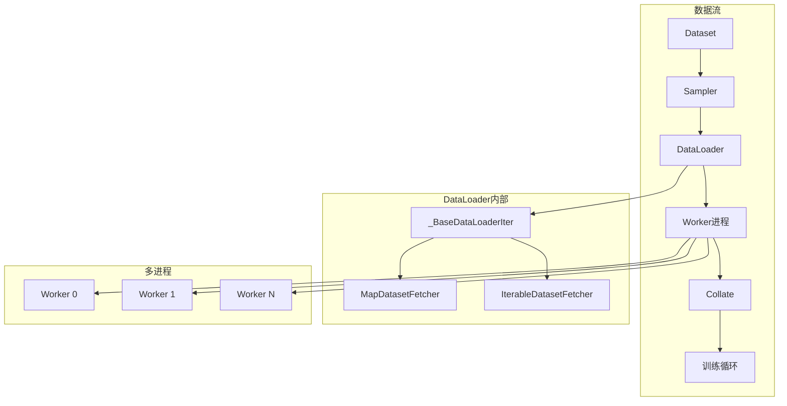
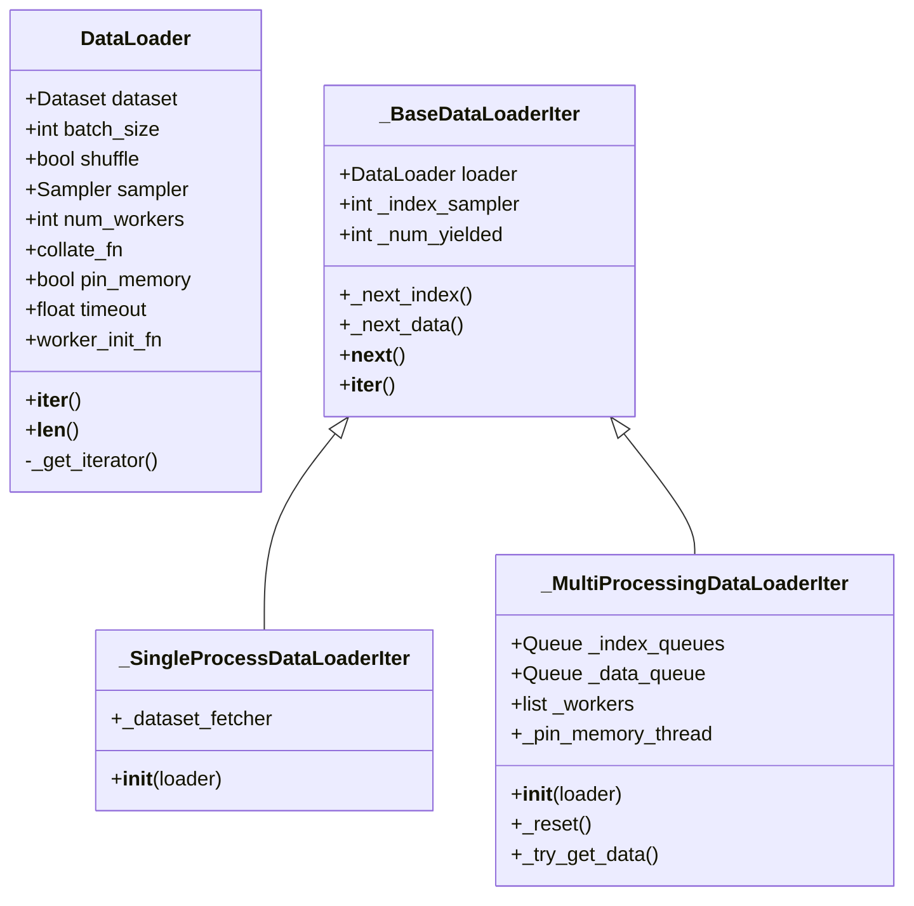
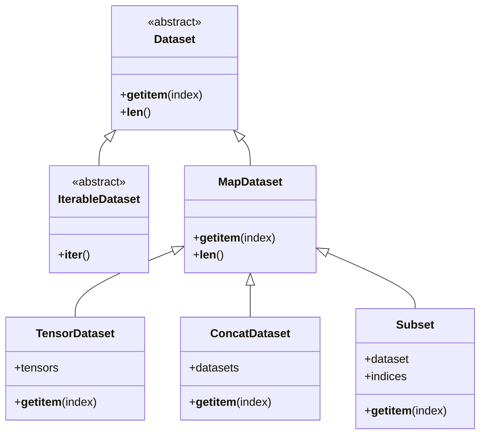
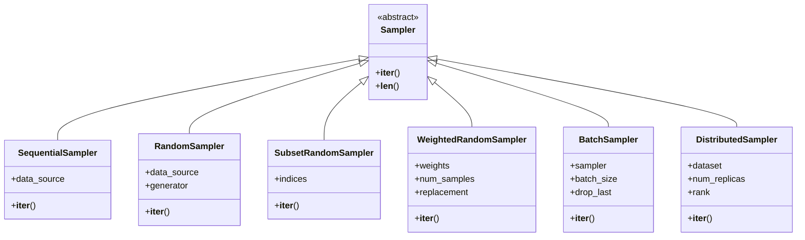
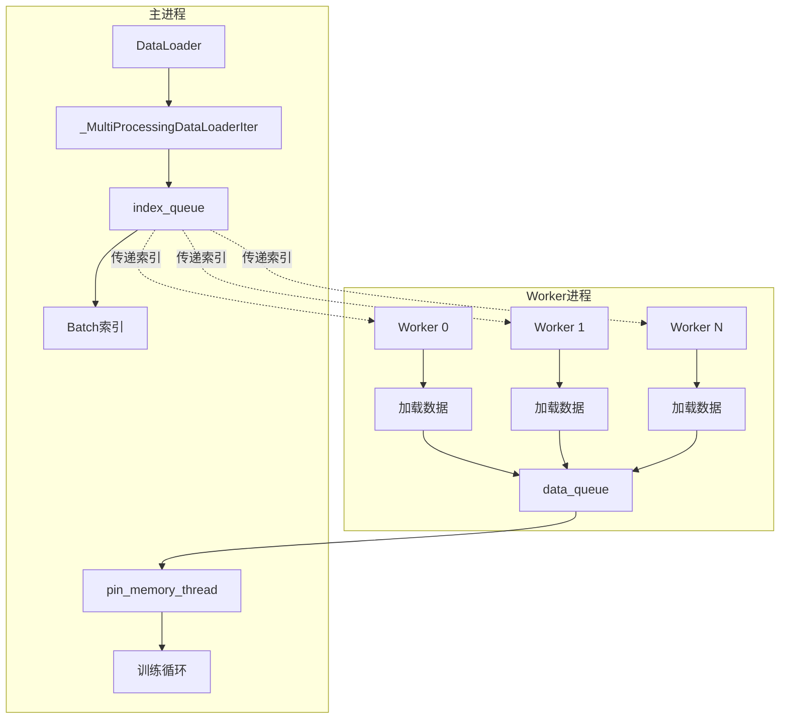
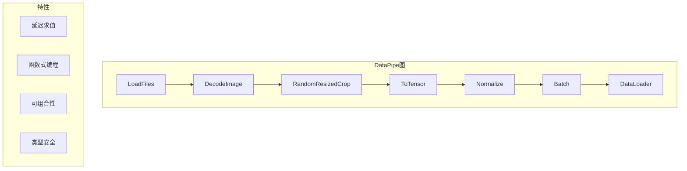

# PyTorch DataLoader (数据加载) 深度分析

## 目录
1. [架构概览与设计目标](#1-架构概览与设计目标)
2. [DataLoader核心机制](#2-dataloader核心机制)
3. [Dataset抽象](#3-dataset抽象)
4. [Sampler采样器](#4-sampler采样器)
5. [多进程数据加载](#5-多进程数据加载)
6. [Collate函数](#6-collate函数)
7. [DataPipe系统](#7-datapipe系统)

---

## 1. 架构概览与设计目标

### 1.1 什么是DataLoader

**DataLoader**是PyTorch的数据加载抽象，负责将Dataset封装为可迭代的数据加载器，支持自动批处理、采样、多进程加载和内存固定等特性。

### 1.2 设计目标

```
┌─────────────────────────────────────────────────────────────────┐
│                     DataLoader 设计目标                          │
├─────────────────────────────────────────────────────────────────┤
│  1. 批处理: 自动将样本组合成批次                                 │
│  2. 采样: 支持随机/顺序/自定义采样策略                           │
│  3. 多进程: 支持多进程并行数据加载                               │
│  4. 内存优化: 支持pinned memory加速GPU传输                       │
│  5. 灵活性: 支持MapStyle和Iterable两种数据集类型                 │
│  6. 可扩展: DataPipe支持复杂数据流图                             │
└─────────────────────────────────────────────────────────────────┘
```

### 1.3 DataLoader在训练流程中的位置



### 1.4 核心文件位置

| 组件 | 文件路径 | 描述 |
|------|----------|------|
| DataLoader | `torch/utils/data/dataloader.py` | DataLoader主类 |
| Dataset | `torch/utils/data/dataset.py` | Dataset抽象基类 |
| Sampler | `torch/utils/data/sampler.py` | 采样器实现 |
| Fetcher | `torch/utils/data/_utils/fetch.py` | 数据获取器 |
| Worker | `torch/utils/data/_utils/worker.py` | 工作进程逻辑 |
| DataPipe | `torch/utils/data/datapipes/` | DataPipe系统 |

---

## 2. DataLoader核心机制

### 2.1 DataLoader类结构



### 2.2 DataLoader初始化

```python
class DataLoader(Generic[T_co]):
    def __init__(
        self,
        dataset: Dataset[T_co],
        batch_size: int = 1,
        shuffle: bool = False,
        sampler: Optional[Sampler[int]] = None,
        batch_sampler: Optional[Sampler[Sequence[int]]] = None,
        num_workers: int = 0,
        collate_fn: Optional[_collate_fn_t] = None,
        pin_memory: bool = False,
        drop_last: bool = False,
        timeout: float = 0,
        worker_init_fn: Optional[_worker_init_fn_t] = None,
        multiprocessing_context=None,
        generator=None,
        prefetch_factor: int = 2,
        persistent_workers: bool = False,
        pin_memory_device: str = "",
    ):
        self.dataset = dataset
        self.batch_size = batch_size
        self.num_workers = num_workers
        self.collate_fn = collate_fn
        self.pin_memory = pin_memory
        self.drop_last = drop_last
        self.timeout = timeout
        self.worker_init_fn = worker_init_fn
        self.multiprocessing_context = multiprocessing_context
        self.generator = generator
        self.prefetch_factor = prefetch_factor
        self.persistent_workers = persistent_workers

        # 数据集类型判断
        if isinstance(dataset, IterableDataset):
            self._dataset_kind = _DatasetKind.Iterable
        else:
            self._dataset_kind = _DatasetKind.Map

        # 创建采样器
        if sampler is None:
            if shuffle:
                sampler = RandomSampler(dataset, generator=generator)
            else:
                sampler = SequentialSampler(dataset)

        # 创建批采样器
        if batch_sampler is None:
            batch_sampler = BatchSampler(sampler, batch_size, drop_last)

        self.sampler = sampler
        self.batch_sampler = batch_sampler
```

### 2.3 迭代器选择

```mermaid
flowchart TD
    A[调用iter(dataloader)] --> B{_get_iterator}
    B --> C{num_workers}

    C -->|0| D[_SingleProcessDataLoaderIter]
    C -->|>0| E[_MultiProcessingDataLoaderIter]

    D --> F[在主进程加载数据]
    E --> G[启动worker进程]
    G --> H[通过Queue通信]
```

### 2.4 单进程迭代器

```python
class _SingleProcessDataLoaderIter(_BaseDataLoaderIter):
    """单进程数据加载迭代器"""

    def __init__(self, loader: DataLoader):
        super().__init__(loader)

        # 创建数据获取器
        self._dataset_fetcher = _DatasetKind.create_fetcher(
            self._dataset_kind,
            self._dataset,
            self._auto_collation,
            self._collate_fn,
            self._drop_last,
        )

    def _next_data(self):
        """获取下一个数据"""
        index = self._next_index()  # 获取索引
        data = self._dataset_fetcher.fetch(index)  # 获取数据
        if self._pin_memory:
            data = _utils.pin_memory.pin_memory(data, self._pin_memory_device)
        return data
```

---

## 3. Dataset抽象

### 3.1 Dataset类型



### 3.2 MapStyle Dataset

```python
class Dataset(Generic[T_co]):
    """Map-style数据集基类"""

    def __getitem__(self, index) -> T_co:
        """根据索引获取样本"""
        raise NotImplementedError

    def __len__(self) -> int:
        """返回数据集大小"""
        raise NotImplementedError

# 示例实现
class MyDataset(Dataset):
    def __init__(self, data_dir, transform=None):
        self.data = load_data(data_dir)
        self.transform = transform

    def __len__(self):
        return len(self.data)

    def __getitem__(self, idx):
        sample = self.data[idx]
        image = sample['image']
        label = sample['label']

        if self.transform:
            image = self.transform(image)

        return image, label
```

### 3.3 Iterable Dataset

```python
class IterableDataset(Dataset[T_co]):
    """Iterable-style数据集基类"""

    def __iter__(self) -> Iterator[T_co]:
        """返回样本迭代器"""
        raise NotImplementedError

    def __len__(self) -> int:
        raise NotImplementedError

# 示例实现
class MyIterableDataset(IterableDataset):
    def __init__(self, data_stream):
        self.data_stream = data_stream

    def __iter__(self):
        for data in self.data_stream:
            yield process_data(data)
```

### 3.4 Dataset对比

| 特性 | MapStyle | IterableStyle |
|------|----------|---------------|
| 访问方式 | 随机访问 `__getitem__` | 顺序迭代 `__iter__` |
| 实现难度 | 简单 | 复杂（需要处理分片） |
| 内存需求 | 可预加载索引 | 适合流式数据 |
| 多进程支持 | 简单 | 需要手动分片 |
| 使用场景 | 图片分类等 | 文本流、实时数据 |

---

## 4. Sampler采样器

### 4.1 Sampler架构



### 4.2 采样器实现

```python
class SequentialSampler(Sampler[int]):
    """顺序采样器"""

    def __init__(self, data_source):
        self.data_source = data_source

    def __iter__(self):
        return iter(range(len(self.data_source)))

    def __len__(self):
        return len(self.data_source)


class RandomSampler(Sampler[int]):
    """随机采样器"""

    def __init__(self, data_source, replacement=False, num_samples=None, generator=None):
        self.data_source = data_source
        self.replacement = replacement
        self.num_samples = num_samples or len(data_source)
        self.generator = generator

    def __iter__(self):
        n = len(self.data_source)
        if self.generator is None:
            seed = int(torch.empty((), dtype=torch.int64).random_().item())
            generator = torch.Generator()
            generator.manual_seed(seed)
        else:
            generator = self.generator

        if self.replacement:
            # 有放回抽样
            yield from torch.randint(high=n, size=(self.num_samples,), generator=generator).tolist()
        else:
            # 无放回抽样
            yield from torch.randperm(n, generator=generator).tolist()

    def __len__(self):
        return self.num_samples


class BatchSampler(Sampler[List[int]]):
    """批采样器"""

    def __init__(self, sampler, batch_size, drop_last):
        self.sampler = sampler
        self.batch_size = batch_size
        self.drop_last = drop_last

    def __iter__(self):
        batch = []
        for idx in self.sampler:
            batch.append(idx)
            if len(batch) == self.batch_size:
                yield batch
                batch = []

        # 处理剩余样本
        if len(batch) > 0 and not self.drop_last:
            yield batch

    def __len__(self):
        if self.drop_last:
            return len(self.sampler) // self.batch_size
        else:
            return (len(self.sampler) + self.batch_size - 1) // self.batch_size
```

### 4.3 分布式采样器

```python
class DistributedSampler(Sampler[T_co]):
    """分布式训练采样器"""

    def __init__(
        self,
        dataset,
        num_replicas=None,
        rank=None,
        shuffle=True,
        seed=0,
        drop_last=False,
    ):
        if num_replicas is None:
            num_replicas = dist.get_world_size()
        if rank is None:
            rank = dist.get_rank()

        self.dataset = dataset
        self.num_replicas = num_replicas
        self.rank = rank
        self.epoch = 0
        self.drop_last = drop_last

        # 计算每个进程的数据量
        if self.drop_last and len(self.dataset) % self.num_replicas != 0:
            self.num_samples = math.ceil((len(self.dataset) - self.num_replicas) / self.num_replicas)
        else:
            self.num_samples = math.ceil(len(self.dataset) / self.num_replicas)

        self.total_size = self.num_samples * self.num_replicas

        self.shuffle = shuffle
        self.seed = seed

    def __iter__(self):
        if self.shuffle:
            # 基于epoch生成随机种子
            g = torch.Generator()
            g.manual_seed(self.seed + self.epoch)
            indices = torch.randperm(len(self.dataset), generator=g).tolist()
        else:
            indices = list(range(len(self.dataset)))

        # 填充确保可被num_replicas整除
        if not self.drop_last:
            padding_size = self.total_size - len(indices)
            indices += indices[:padding_size]

        # 切片分配给当前rank
        indices = indices[self.rank:self.total_size:self.num_replicas]
        assert len(indices) == self.num_samples

        return iter(indices)

    def __len__(self):
        return self.num_samples

    def set_epoch(self, epoch):
        """设置epoch以确保不同epoch采样不同"""
        self.epoch = epoch
```

---

## 5. 多进程数据加载

### 5.1 多进程架构



### 5.2 多进程迭代器

```python
class _MultiProcessingDataLoaderIter(_BaseDataLoaderIter):
    """多进程数据加载迭代器"""

    def __init__(self, loader: DataLoader):
        super().__init__(loader)

        self._prefetch_factor = loader.prefetch_factor
        self._persistent_workers = loader.persistent_workers

        # 创建进程上下文
        multiprocessing_context = loader.multiprocessing_context
        if multiprocessing_context is None:
            multiprocessing_context = multiprocessing

        self._multiprocessing_context = multiprocessing_context

        # 创建队列
        self._index_queues = []
        self._worker_result_queue = multiprocessing_context.Queue()

        # 创建worker进程
        self._workers = []
        for i in range(self._num_workers):
            index_queue = multiprocessing_context.Queue()
            self._index_queues.append(index_queue)

            worker = multiprocessing_context.Process(
                target=_utils.worker._worker_loop,
                args=(
                    i,
                    self._worker_info,
                    index_queue,
                    self._worker_result_queue,
                    self._data_queue,
                    self._dataset,
                    self._dataset_kind,
                    self._collate_fn,
                    ...
                ),
                daemon=True,
            )
            worker.start()
            self._workers.append(worker)

        # 创建pin memory线程
        if self._pin_memory:
            self._pin_memory_thread = threading.Thread(
                target=_utils.pin_memory._pin_memory_loop,
                args=(self._data_queue, self._worker_result_queue, ...),
            )
            self._pin_memory_thread.daemon = True
            self._pin_memory_thread.start()

        # 预取索引
        self._try_put_index()

    def _try_put_index(self):
        """尝试向worker队列放入索引"""
        assert self._tasks_outstanding < self._prefetch_factor * self._num_workers

        try:
            index = self._next_index()
        except StopIteration:
            return

        for _ in range(self._num_workers):
            index_queue = self._index_queues[self._worker_queue_idx]
            index_queue.put(index)
            self._worker_queue_idx = (self._worker_queue_idx + 1) % self._num_workers
            self._tasks_outstanding += 1

    def _next_data(self):
        """获取下一个数据"""
        # 尝试放入更多索引
        self._try_put_index()

        # 从结果队列获取数据
        success, data = self._try_get_data()
        if success:
            self._tasks_outstanding -= 1
            return data
```

### 5.3 Worker工作循环

```python
def _worker_loop(
    worker_id,
    worker_info,
    index_queue,
    data_queue,
    dataset,
    dataset_kind,
    collate_fn,
    ...
):
    """Worker进程主循环"""

    # 设置worker信息
    worker_info.id = worker_id
    torch.utils.data.set_worker_info(worker_info)

    # 初始化worker
    if worker_init_fn is not None:
        worker_init_fn(worker_info.id)

    # 创建数据获取器
    fetcher = _DatasetKind.create_fetcher(
        dataset_kind,
        dataset,
        auto_collation,
        collate_fn,
        drop_last,
    )

    while True:
        # 获取索引
        r = index_queue.get()
        if isinstance(r, _utils.worker._ResumeIteration):
            # 重置迭代器
            fetcher = _DatasetKind.create_fetcher(...)
            continue
        elif r is None:
            # 结束信号
            break

        idx, index = r
        try:
            # 获取数据
            data = fetcher.fetch(index)
        except Exception as e:
            # 包装异常
            data = _utils.ExceptionWrapper(e)

        # 发送数据到主进程
        data_queue.put((idx, data))
```

### 5.4 多进程注意事项

| 问题 | 解决方案 |
|------|----------|
| 内存共享 | 使用multiprocessing共享内存 |
| Worker启动开销 | persistent_workers=True保持进程 |
| 随机种子 | 每个worker使用不同种子 |
| 数据不平衡 | drop_last或分布式采样 |
| 死锁 | 设置合理的timeout |

---

## 6. Collate函数

### 6.1 Collate流程

```mermaid
flowchart TD
    A[样本列表] --> B[[样本1], [样本2], ...]
    B --> C[分离组件]
    C --> D[图像列表: [img1, img2, ...]]
    C --> E[标签列表: [label1, label2, ...]]

    D --> F[stack]
    E --> G[stack或cat]

    F --> H[批次Tensor]
    G --> I[批次Tensor]

    H --> J[批次数据]
    I --> J
```

### 6.2 默认Collate实现

```python
def default_collate(batch):
    """默认collate函数"""

    if not isinstance(batch, list):
        return batch

    elem = batch[0]
    elem_type = type(elem)

    if isinstance(elem, torch.Tensor):
        # 张量列表：使用stack合并
        return torch.stack(batch, 0)

    elif isinstance(elem, (str, bytes)):
        # 字符串列表：直接返回
        return batch

    elif isinstance(elem, Mapping):
        # 字典：递归collate每个键
        return {key: default_collate([d[key] for d in batch]) for key in elem}

    elif isinstance(elem, tuple) and hasattr(elem, '_fields'):
        # namedtuple
        return elem_type(*(default_collate(samples) for samples in zip(*batch)))

    elif isinstance(elem, Sequence):
        # 其他序列
        return [default_collate(samples) for samples in zip(*batch)]

    else:
        # 其他类型：尝试转换为张量后stack
        return torch.stack([torch.as_tensor(b) for b in batch])


# 使用示例
dataloader = DataLoader(
    dataset,
    batch_size=4,
    collate_fn=default_collate,
)

# 对于变长序列，使用自定义collate
def pad_collate(batch):
    """对变长序列进行padding"""
    data = [item[0] for item in batch]  # 序列
    labels = [item[1] for item in batch]  # 标签

    # 对序列进行padding
    data = torch.nn.utils.rnn.pad_sequence(data, batch_first=True)
    labels = torch.tensor(labels)

    return data, labels
```

### 6.3 自定义Collate示例

```python
# 示例1: 语义分割collate
def seg_collate(batch):
    images = [item[0] for item in batch]
    masks = [item[1] for item in batch]
    image_sizes = [item[2] for item in batch]

    # 图片可以stack（假设已resize到相同大小）
    images = torch.stack(images, 0)

    # mask可能需要padding（如果大小不一）
    masks = torch.nn.utils.rnn.pad_sequence(masks, batch_first=True)

    return images, masks, image_sizes

# 示例2: 目标检测collate (YOLO格式)
def yolo_collate(batch):
    images = [item[0] for item in batch]
    targets = [item[1] for item in batch]

    # 图片stack
    images = torch.stack(images, 0)

    # 为每个目标的batch索引
    for i, target in enumerate(targets):
        target[:, 0] = i

    # 合并所有目标
    targets = torch.cat(targets, 0)

    return images, targets
```

---

## 7. DataPipe系统

### 7.1 DataPipe架构



### 7.2 DataPipe概念

```python
# DataPipe是懒加载的数据流图
from torch.utils.data import datapipes

# 创建DataPipe
dp = datapipes.load.FilesLister('data/images')
dp = dp.map(decode_image)
dp = dp.map(random_crop)
dp = dp.batch(batch_size=32)

# 迭代时才执行
dataloader = DataLoader(dp, num_workers=4)
for batch in dataloader:
    # 训练
    pass
```

### 7.3 DataPipe优势

| 特性 | DataLoader | DataPipe |
|------|-----------|----------|
| 定义方式 | 命令式 | 声明式（图） |
| 执行时机 | 立即执行 | 延迟执行 |
| 可组合性 | 有限 | 高（函数式） |
| 类型检查 | 弱 | 强（泛型） |
| 序列化 | 困难 | 容易 |

---

## 8. 总结

### 8.1 DataLoader核心价值

1. **高效加载**: 多进程并行加速数据加载
2. **批处理**: 自动组合样本为批次
3. **灵活性**: 支持多种采样策略和自定义处理
4. **内存优化**: pinned memory加速GPU传输
5. **可扩展性**: DataPipe支持复杂数据流

### 8.2 关键设计决策

| 决策 | 理由 |
|------|------|
| 多进程 | 绕过GIL，充分利用多核CPU |
| 队列通信 | 解耦生产和消费，支持预取 |
| Sampler抽象 | 灵活切换采样策略 |
| Collate函数 | 支持复杂数据结构的批处理 |
| persistent_workers | 减少worker启动开销 |

### 8.3 最佳实践

```python
# 1. 多进程加载
loader = DataLoader(dataset, batch_size=32, num_workers=4)

# 2. 内存固定（GPU训练）
loader = DataLoader(dataset, batch_size=32, pin_memory=True)

# 3. 持久化worker
loader = DataLoader(dataset, batch_size=32, num_workers=4, persistent_workers=True)

# 4. 分布式训练
sampler = DistributedSampler(dataset)
loader = DataLoader(dataset, batch_size=32, sampler=sampler)

# 5. 自定义collate
loader = DataLoader(dataset, batch_size=32, collate_fn=pad_collate)

# 6. 迭代时设置epoch
for epoch in range(num_epochs):
    sampler.set_epoch(epoch)  # 分布式采样器
    for data in loader:
        train(...)
```
