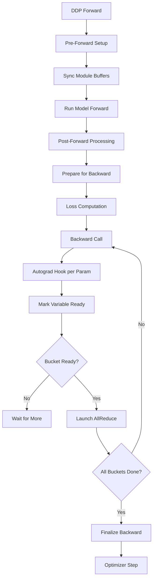
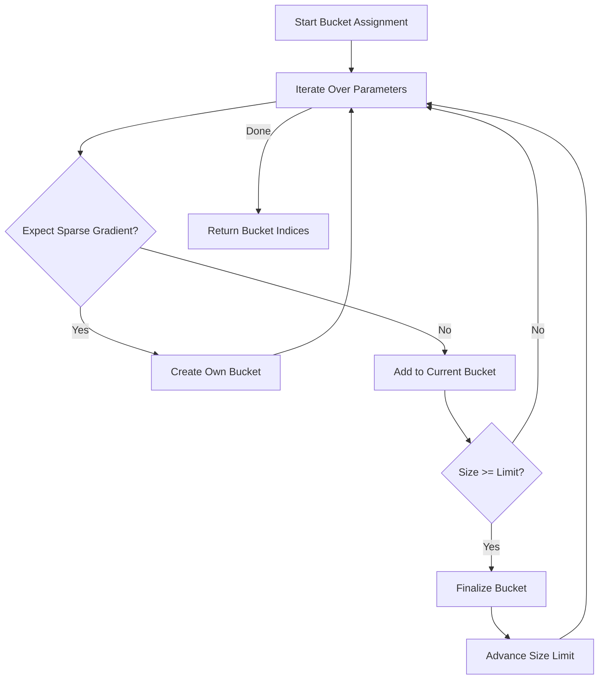
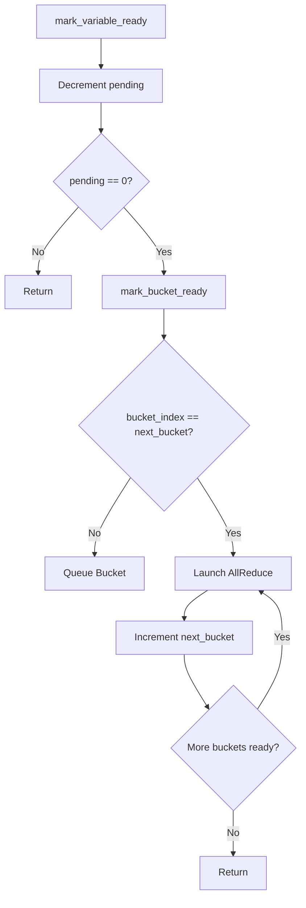
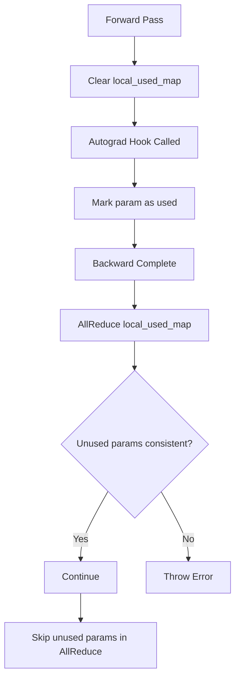

# PyTorch DDP Reducer深度分析

## 目录
1. [DDP概述](#1-ddp概述)
2. [核心组件架构](#2-核心组件架构)
3. [Gradient Bucketing](#3-gradient-bucketing)
4. [Reducer钩子机制](#4-reducer钩子机制)
5. [梯度同步流程](#5-梯度同步流程)
6. [通信与计算重叠](#6-通信与计算重叠)
7. [通信钩子](#7-通信钩子)
8. [动态Bucket重建](#8-动态bucket重建)
9. [find_unused_parameters](#9-find_unused_parameters)
10. [Static Graph优化](#10-static-graph优化)
11. [Distributed Join](#11-distributed-join)

---

## 1. DDP概述

### 1.1 什么是DDP

Distributed Data Parallel (DDP)是PyTorch用于跨多机/多GPU训练神经网络的模块，使用集合通信操作（主要是AllReduce）在进程间同步梯度。

### 1.2 DDP训练流程


### 1.3 核心文件位置

| 组件 | 文件路径 | 描述 |
|------|----------|------|
| Python DDP Wrapper | torch/nn/parallel/distributed.py | 主Python包装器 |
| Reducer C++ | torch/csrc/distributed/c10d/reducer.cpp | C++核心实现 |
| Reducer Header | torch/csrc/distributed/c10d/reducer.hpp | Reducer类定义 |
| Comm Hook | torch/csrc/distributed/c10d/comm.hpp | 通信钩子接口 |
| Default Hooks | torch/csrc/distributed/c10d/default_comm_hooks.hpp | 内置钩子 |
| Join Handler | torch/nn/parallel/distributed.py | Join机制 |

---

## 2. 核心组件架构

### 2.1 DistributedDataParallel类

```python
# 来自torch/nn/parallel/distributed.py
class DistributedDataParallel(Module):
    def __init__(self, module, device_ids=None, ...):
        self.module = module
        self.device_ids = device_ids
        self.process_group = process_group
        # 关键参数
        self.bucket_bytes_cap = bucket_cap_mb * 1024 * 1024
        self.find_unused_parameters = find_unused_parameters
        self.gradient_as_bucket_view = gradient_as_bucket_view
        self.static_graph = static_graph
        self.delay_all_reduce_named_params = delay_all_reduce_named_params
```

### 2.2 Reducer类结构

```cpp
// 来自torch/csrc/distributed/c10d/reducer.hpp
class Reducer {
    // 参数分组
    std::vector<Bucket> buckets_;
    std::vector<VariableLocator> variable_locators_;
    
    // 梯度累加器钩子
    std::vector<torch::autograd::hooks::LambdaPostHook> hooks_;
    
    // 通信
    c10::intrusive_ptr<c10d::ProcessGroup> process_group_;
    std::unique_ptr<CommHookInterface> comm_hook_;
    
    // 状态
    bool expect_autograd_hooks_;
    bool require_finalize_;
    size_t next_bucket_;
    int num_buckets_ready_;
    
    // find_unused_parameters相关
    std::vector<at::Tensor> local_used_maps_;
    at::Tensor local_used_map_dev_;
    bool dynamic_graph_find_unused_;
    bool static_graph_;
    
    // bucket重建
    std::vector<at::Tensor> rebuilt_params_;
    std::vector<int64_t> rebuilt_param_indices_;
    bool has_rebuilt_bucket_;
    
    // 延迟梯度
    std::unordered_map<std::string, at::Tensor> delay_all_reduce_named_params_;
};
```

---

## 3. Gradient Bucketing

### 3.1 什么是梯度分桶

梯度被分组到"桶"中以优化通信。DDP不是单独对每个梯度执行AllReduce，而是将多个梯度分组到桶中并对整个桶执行AllReduce。

### 3.2 Bucket结构（已修正）

```cpp
// 来自reducer.hpp
struct Bucket {
    // 展平的梯度张量
    at::Tensor gradients;
    
    // 每个变量的视图（输入/输出）
    std::vector<at::Tensor> bucket_views_in;
    std::vector<at::Tensor> bucket_views_out;
    
    // 该桶中的变量（参数引用）
    std::vector<at::Tensor> variables;
    std::vector<at::Tensor> parameters;  // 参数引用（用于梯度更新）
    
    // 每个变量的偏移和长度
    std::vector<size_t> offsets;
    std::vector<size_t> lengths;
    std::vector<c10::IntArrayRef> sizes_vec;  // 原始大小
    
    // 剩余需要计算的梯度数
    size_t pending;
    
    // 异步通信句柄
    c10::intrusive_ptr<at::ivalue::Future> future_work;
    
    // 稀疏梯度处理
    bool expect_sparse_gradient;
    std::vector<int64_t> sparse_tensor_indices;
};
```

### 3.3 桶大小配置

```cpp
// 来自reducer.hpp
constexpr int kDefaultFirstBucketBytes = 1024 * 1024;    // 1 MB
constexpr int kDefaultBucketBytesCap = 25 * 1024 * 1024;  // 25 MB

// 可以在构造函数中自定义
Reducer(
    std::vector<at::Tensor> params,
    std::vector<std::vector<size_t>> bucket_indices,
    c10::intrusive_ptr<c10d::ProcessGroup> process_group,
    std::vector<bool> expect_sparse_gradients,
    int64_t bucket_bytes_cap,          // 桶大小限制
    bool find_unused_parameters,
    bool gradient_as_bucket_view,
    ...,
    int64_t first_bucket_bytes_cap,    // 第一个桶大小
    ...,
    std::vector<int64_t> bucket_bytes_cap_list);  // 每个桶的大小限制列表
```

### 3.4 桶分配算法

```cpp
// 来自reducer.cpp
std::tuple<std::vector<std::vector<size_t>>, std::vector<size_t>>
compute_bucket_assignment_by_size(
    const std::vector<at::Tensor>& tensors,
    const std::vector<size_t>& bucket_size_limits,
    const std::vector<bool>& expect_sparse_gradient,
    const std::vector<int64_t>& tensor_indices) {
    
    std::vector<BucketAccumulator> buckets;
    std::vector<std::vector<size_t>> result;
    
    for (size_t i = 0; i < tensors.size(); i++) {
        size_t idx = tensor_indices.empty() ? i : tensor_indices[i];
        const auto& tensor = tensors[idx];
        size_t size = tensor.numel() * tensor.element_size();
        
        // 稀疏张量总是得到自己的桶
        if (expect_sparse_gradient[i]) {
            result.push_back({idx});
            continue;
        }
        
        // 尝试添加到现有桶
        bool added = false;
        for (auto& bucket : buckets) {
            if (bucket.size + size <= bucket.size_limit) {
                bucket.indices.push_back(idx);
                bucket.size += size;
                added = true;
                break;
            }
        }
        
        // 创建新桶
        if (!added) {
            BucketAccumulator new_bucket;
            new_bucket.indices = {idx};
            new_bucket.size = size;
            new_bucket.size_limit = get_bucket_size_limit(buckets.size(), bucket_size_limits);
            buckets.push_back(std::move(new_bucket));
        }
    }
    
    // 转换结果
    for (auto& bucket : buckets) {
        result.push_back(std::move(bucket.indices));
    }
    
    return std::make_tuple(result, size_limits);
}
```

---

## 4. Reducer钩子机制

### 4.1 通信钩子接口

```cpp
// 来自comm.hpp
class CommHookInterface {
 public:
  virtual c10::intrusive_ptr<c10::ivalue::Future> runHook(
      GradBucket& bucket) = 0;
  virtual at::Tensor parseHookResult(const c10::IValue& result) = 0;
  virtual ~CommHookInterface() = default;
};

// C++钩子基类
template <typename T>
class CppCommHookInterface : public CommHookInterface {
 public:
  CppCommHookInterface(c10::intrusive_ptr<c10d::ProcessGroup> state)
      : state_(std::move(state)) {}

  at::Tensor parseHookResult(const c10::IValue& result) override {
    return result.toTensor();
  }

 protected:
  c10::intrusive_ptr<T> state_;
};
```

### 4.2 GradBucket类

```cpp
class GradBucket {
    size_t index_;                    // 桶索引
    size_t bucket_count_;             // 总桶数
    at::Tensor tensor_;               // 展平梯度
    std::vector<size_t> offsets_;     // 每个参数的偏移
    std::vector<size_t> lengths_;     // 每个参数的长度
    std::vector<c10::IntArrayRef> sizes_vec_;  // 每个参数的原始大小
    std::vector<at::Tensor> parameters_;  // 参数引用
    std::vector<int64_t> sparse_tensor_indices_;  // 稀疏张量索引
};
```

### 4.3 钩子注册

```cpp
void Reducer::register_comm_hook(std::unique_ptr<CommHookInterface> iface) {
    TORCH_CHECK(comm_hook_ == nullptr,
        "register_comm_hook can only be called once.");
    TORCH_CHECK(
        std::all_of(buckets_.begin(), buckets_.end(), 
            [](const Bucket& bucket) { return bucket.future_work == nullptr; }),
        "register_comm_hook should be called before forward.");
    comm_hook_ = std::move(iface);
}

void Reducer::register_builtin_comm_hook(BuiltinCommHookType type) {
    TORCH_CHECK(comm_hook_ == nullptr,
        "register_builtin_comm_hook can only be called once.");
    switch (type) {
        case BuiltinCommHookType::ALLREDUCE:
            comm_hook_ = std::make_unique<AllReduceCommHook>(process_group_);
            break;
        case BuiltinCommHookType::FP16_COMPRESS:
            comm_hook_ = std::make_unique<FP16CompressCommHook>(process_group_);
            break;
        case BuiltinCommHookType::BF16_COMPRESS:
            comm_hook_ = std::make_unique<BF16CompressCommHook>(process_group_);
            break;
        case BuiltinCommHookType::QUANTIZE_PER_TENSOR:
            comm_hook_ = std::make_unique<_AllReduceBySumCommHook>(
                process_group_, quantize_per_tensor);
            break;
    }
}
```

---

## 5. 梯度同步流程

### 5.1 Autograd钩子注册

```cpp
// 为每个参数注册后向钩子
void Reducer::register_grad_accumulator_hooks() {
  for (size_t variable_index = 0; variable_index < variable_locators_.size();
       variable_index++) {
    auto& variable = variables_[variable_index];
    const auto index = variable_index;
    
    // 获取梯度累加器
    auto grad_accumulator = torch::autograd::impl::grad_accumulator(variable);
    
    // 注册后向钩子
    hooks_.emplace_back(
        grad_accumulator->add_post_hook(
            std::make_unique<LambdaPostHook>(
                [this, index](const variable_list& outputs, const variable_list& inputs) {
                    this->autograd_hook(index);
                    return outputs;
                })));
  }
}
```

### 5.2 Autograd钩子流程

```cpp
void Reducer::autograd_hook(size_t index) {
    std::lock_guard<std::mutex> lock(this->mutex_);
    
    // 标记参数为本地使用（用于find_unused_parameters）
    if (dynamic_graph_find_unused()) {
        local_used_map_[index] = 1;
    }
    
    // 如果此参数不需要allreduce，跳过
    if (delay_all_reduce_named_params_.count(param_names_[index]) > 0) {
        return;
    }
    
    // 标记变量准备好进行归约
    mark_variable_ready(index);
}
```

### 5.3 标记变量就绪

```cpp
void Reducer::mark_variable_ready(size_t variable_index) {
    const auto& bucket_index = variable_locators_[variable_index];
    auto& bucket = buckets_[bucket_index.bucket_index];
    
    // 将梯度复制到桶
    if (bucket.expect_sparse_gradient) {
        mark_variable_ready_sparse(variable_index);
    } else {
        mark_variable_ready_dense(variable_index);
    }
    
    // 检查桶是否准备好进行AllReduce
    if (--bucket.pending == 0) {
        mark_bucket_ready(bucket_index.bucket_index);
    }
}
```

### 5.4 密集梯度处理

```cpp
void Reducer::mark_variable_ready_dense(size_t variable_index) {
    const auto& bucket_index = variable_locators_[variable_index];
    auto& bucket = buckets_[bucket_index.bucket_index];
    auto& variable = variables_[variable_index];
    auto& bucket_view = bucket.bucket_views_in[bucket_index.intra_bucket_index];
    
    runGradCallbackForVariable(variable, [&](auto& grad) {
        if (grad.defined()) {
            // 检查是否需要复制
            if (!grad.is_alias_of(bucket_view)) {
                if (comm_hook_ == nullptr) {
                    // 标准DDP：除以世界大小后复制
                    bucket_view.copy_(grad / div_factor_);
                } else {
                    // 自定义钩子：直接复制
                    bucket_view.copy_(grad);
                }
            } else {
                // 已经是视图，原地除以世界大小
                if (comm_hook_ == nullptr) {
                    bucket_view.div_(div_factor_);
                }
            }
        } else {
            // 梯度未定义，填充零
            bucket_view.zero_();
        }
        return true;  // 成功处理
    });
}
```

---

## 6. 通信与计算重叠

### 6.1 桶就绪调度

```cpp
void Reducer::mark_bucket_ready(size_t bucket_index) {
    // 桶按顺序归约
    if (bucket_index > next_bucket_) {
        return;  // 乱序，等待前面的桶
    }
    
    // 处理所有就绪的桶
    for (; next_bucket_ < buckets_.size() && 
           buckets_[next_bucket_].pending == 0;
         next_bucket_++) {
        
        auto& bucket = buckets_[next_bucket_];
        all_reduce_bucket(bucket);
    }
}
```

### 6.2 AllReduce启动

```cpp
void Reducer::all_reduce_bucket(Bucket& bucket) {
    GradBucket grad_bucket(
        next_bucket_,
        buckets_.size(),
        bucket.gradients,
        bucket.offsets,
        bucket.lengths,
        bucket.sizes_vec,
        get_variables_for_bucket(next_bucket_, bucket),
        bucket.sparse_tensor_indices);
    
    // 启动异步AllReduce
    bucket.future_work = run_comm_hook(grad_bucket);
}

c10::intrusive_ptr<c10::ivalue::Future> Reducer::run_comm_hook(
    GradBucket& grad_bucket) {
    if (comm_hook_ != nullptr) {
        return comm_hook_->runHook(grad_bucket);
    } else {
        return run_allreduce_hook(grad_bucket);
    }
}
```

### 6.3 后向完成处理

```cpp
void Reducer::finalize_backward() {
    // 等待异步归约并解平桶
    for (auto& bucket : buckets_) {
        if (bucket.future_work == nullptr) {
            continue;
        }
        
        // 等待通信完成
        bucket.future_work->wait();
        
        // 解析结果
        at::Tensor future_result;
        if (comm_hook_ == nullptr) {
            auto result = bucket.future_work->value();
            future_result = parseCppCommHookResult(result);
        } else {
            future_result = comm_hook_->parseHookResult(bucket.future_work->value());
        }
        
        // 将结果复制回参数梯度
        if (!gradient_as_bucket_view_) {
            populate_bucket_views_out(bucket, future_result);
            finalize_bucket_dense(bucket);
        } else {
            // gradient_as_bucket_view模式：直接使用桶作为梯度
            bucket.gradients.copy_(future_result);
        }
    }
    
    // 重置状态
    require_finalize_ = false;
}
```

---

## 7. 通信钩子

### 7.1 内置通信钩子

```cpp
enum class BuiltinCommHookType : uint8_t {
    ALLREDUCE = 1,           // 标准AllReduce
    FP16_COMPRESS = 2,       // FP16压缩
    BF16_COMPRESS = 3,       // BF16压缩
    QUANTIZE_PER_TENSOR = 4, // 每张量量化
};

// 标准AllReduce钩子
class AllReduceCommHook : public CppCommHookInterface<ProcessGroup> {
 public:
    c10::intrusive_ptr<c10::ivalue::Future> runHook(GradBucket& bucket) override {
        std::vector<at::Tensor> tensors = {bucket.getBufferRef()};
        return state_->allreduce(tensors)->getFuture();
    }
};

// FP16压缩钩子
class FP16CompressCommHook : public CppCommHookInterface<ProcessGroup> {
 public:
    c10::intrusive_ptr<c10::ivalue::Future> runHook(GradBucket& bucket) override {
        auto compressed = bucket.getBuffer().to(torch::kFloat16);
        std::vector<at::Tensor> tensors = {compressed};
        return state_->allreduce(tensors)->getFuture();
    }
    
    at::Tensor parseHookResult(const c10::IValue& result) override {
        auto tensor = result.toTensor();
        return tensor.to(torch::kFloat32);  // 解压缩回FP32
    }
};

// BF16压缩钩子
class BF16CompressCommHook : public CppCommHookInterface<ProcessGroup> {
 public:
    c10::intrusive_ptr<c10::ivalue::Future> runHook(GradBucket& bucket) override {
        auto compressed = bucket.getBuffer().to(torch::kBFloat16);
        std::vector<at::Tensor> tensors = {compressed};
        return state_->allreduce(tensors)->getFuture();
    }
    
    at::Tensor parseHookResult(const c10::IValue& result) override {
        auto tensor = result.toTensor();
        return tensor.to(torch::kFloat32);
    }
};
```

### 7.2 Python通信钩子

```python
# 注册自定义钩子
def register_comm_hook(self, state, hook):
    """
    Args:
        state: 传递给钩子的状态
        hook: 可调用对象，签名：
              hook(state, bucket: dist.GradBucket) -> torch.futures.Future
    """
    self._check_comm_hook(hook)
    dist._register_comm_hook(self.reducer, state, hook)

# 注册内置钩子
def register_builtin_comm_hook(self, comm_hook_type):
    """
    Args:
        comm_hook_type: dist.BuiltinCommHookType 
                       (ALLREDUCE, FP16_COMPRESS, BF16_COMPRESS, QUANTIZE_PER_TENSOR)
    """
    dist._register_builtin_comm_hook(self.reducer, comm_hook_type)

# 自定义钩子示例
def powerSGD_hook(state, bucket):
    # 压缩梯度
    compressed = powerSGD_compress(bucket.get_buffer())
    # AllReduce压缩后的梯度
    fut = state.process_group.allreduce(compressed).get_future()
    # 解压缩
    return fut.then(lambda f: powerSGD_decompress(f.value()))

ddp_model.register_comm_hook(state, powerSGD_hook)
```

### 7.3 Gradient Compression Hooks

```cpp
// PowerSGD钩子（在python/torch/distributed/algorithms/ddp_comm_hooks中实现）
// 使用幂迭代压缩梯度

// Quantization钩子
class QuantizePerTensorCommHook : public CppCommHookInterface<ProcessGroup> {
    at::Tensor quantize_per_tensor(const at::Tensor& tensor) {
        // 计算scale和zero_point
        auto min = tensor.min();
        auto max = tensor.max();
        auto scale = (max - min) / 255.0;
        auto zero_point = -min / scale;
        return at::quantize_per_tensor(tensor, scale, zero_point, at::kQUInt8);
    }
    
    c10::intrusive_ptr<c10::ivalue::Future> runHook(GradBucket& bucket) override {
        auto quantized = quantize_per_tensor(bucket.getBuffer());
        std::vector<at::Tensor> tensors = {quantized};
        return state_->allreduce(tensors)->getFuture();
    }
};
```

---

## 8. 动态Bucket重建

### 8.1 为什么需要重建

在第一次迭代中，DDP根据参数注册顺序创建桶。但实际梯度准备顺序可能不同。重建根据实际梯度就绪顺序重新组织桶。

### 8.2 重建流程

```cpp
bool Reducer::rebuild_buckets() {
    if (!should_rebuild_buckets() || rebuilt_params_.empty()) {
        return false;
    }
    
    // 基于实际梯度就绪顺序重建
    auto [rebuilt_bucket_indices, per_bucket_size_limits] =
        compute_bucket_assignment_by_size(
            rebuilt_params_,
            bucket_size_limits,
            expect_sparse_gradients_,
            rebuilt_param_indices_);
    
    // 跨rank同步桶索引
    sync_bucket_indices(rebuilt_bucket_indices);
    
    has_rebuilt_bucket_ = true;
    
    // 重新初始化桶
    initialize_buckets(std::move(rebuilt_bucket_indices));
    
    // 清空重建缓存
    rebuilt_params_.clear();
    rebuilt_param_indices_.clear();
    
    return true;
}

bool Reducer::should_rebuild_buckets() const {
    // 只有满足以下条件时才重建：
    // 1. 是静态图，或没有启用find_unused_parameters
    // 2. 还没有重建过
    return (static_graph_ || !find_unused_parameters_) && !has_rebuilt_bucket_;
}
```

### 8.3 同步桶索引

```cpp
void Reducer::sync_bucket_indices(std::vector<std::vector<size_t>>& bucket_indices) {
    // 所有rank必须达成一致的桶分配
    // 使用broadcast确保一致性
    
    auto tensor = at::empty({static_cast<long>(bucket_indices.size())}, at::kInt);
    auto tensor_data = tensor.accessor<int, 1>();
    
    for (size_t i = 0; i < bucket_indices.size(); i++) {
        tensor_data[i] = static_cast<int>(bucket_indices[i].size());
    }
    
    // Broadcast from rank 0
    process_group_->broadcast({tensor}, {.rootRank = 0})->wait();
}
```

---

## 9. find_unused_parameters

### 9.1 用途

当模型的某些参数在当前迭代中没有被使用时（例如条件计算），需要`find_unused_parameters=True`来正确处理梯度同步。

### 9.2 实现机制

```cpp
void Reducer::autograd_hook(size_t index) {
    std::lock_guard<std::mutex> lock(mutex_);
    
    // 标记参数为已使用
    if (dynamic_graph_find_unused()) {
        local_used_map_[index] = 1;
    }
    
    mark_variable_ready(index);
}

void Reducer::prepare_for_backward(const std::vector<at::Tensor>& outputs) {
    // 重置local_used_map
    local_used_map_.fill_(0);
    
    // ...其他准备工作
}

void Reducer::finalize_backward() {
    // ...常规finalize
    
    if (dynamic_graph_find_unused()) {
        // AllReduce local_used_map
        // 确保所有rank对哪些参数被使用达成一致
        local_used_map_dev_ = local_used_map_.to(device);
        auto fut = process_group_->allreduce({local_used_map_dev_})->getFuture();
        fut->wait();
        
        // 检查未使用参数的一致性
        // 如果某个rank使用了参数而另一个没有，报错
        check_and_sync_used_params();
    }
}
```

### 9.3 local_used_map

```cpp
// local_used_map_ 是一个1D张量，长度等于参数数量
// local_used_map_[i] = 1 表示第i个参数在此迭代中被使用
std::vector<at::Tensor> local_used_maps_;  // 每个设备一个
at::Tensor local_used_map_dev_;            // 设备端副本
```

---

## 10. Static Graph优化

### 10.1 什么是Static Graph

当`static_graph=True`时，DDP假设模型的计算图在每次迭代中都是相同的，允许进行更多优化。

```python
model = DistributedDataParallel(
    model,
    static_graph=True  # 启用静态图优化
)
```

### 10.2 优化点

1. **桶重建**：静态图保证只需要重建一次桶
2. **梯度准备顺序**：可以预测梯度就绪顺序
3. **跳过一些检查**：不需要每次检查参数使用状态

```cpp
void Reducer::set_static_graph() {
    static_graph_ = true;
    // 静态图模式下，可以做一些预优化
    // 例如预先分配通信缓冲区
}

bool Reducer::should_rebuild_buckets() const {
    // 静态图允许桶重建
    return (static_graph_ || !find_unused_parameters_) && !has_rebuilt_bucket_;
}
```

### 10.3 与非Static Graph的区别

| 特性 | Static Graph | Dynamic Graph |
|------|--------------|---------------|
| 桶重建 | 只重建一次 | 可能多次重建 |
| 参数使用检查 | 最小化 | 每次迭代都检查 |
| 适用场景 | 固定计算图 | 动态计算图（条件分支等） |
| 性能 | 更优 | 稍低 |

---

## 11. Distributed Join

### 11.1 什么是Join

在分布式训练中，当不同rank的数据量不均匀时（例如最后一个batch），DDP的Join机制确保所有rank正确同步。

```python
from torch.nn.parallel import DistributedDataParallel as DDP
from torch.distributed.algorithms.join import Join

# 使用Join上下文管理器
with Join([ddp_model]):
    for data in uneven_dataset:
        loss = ddp_model(data)
        loss.backward()
        optimizer.step()
```

### 11.2 Join机制实现

```python
# torch/distributed/algorithms/join.py
class Join:
    def __init__(self, models, divide_by_initial_world_size=True):
        self.models = models
        self.divide_by_initial_world_size = divide_by_initial_world_size
        
    def __enter__(self):
        # 启用Join模式
        for model in self.models:
            model._join_config.enable()
        return self
        
    def __exit__(self, exc_type, exc_value, traceback):
        # 处理Join逻辑
        self._join()
        for model in self.models:
            model._join_config.disable()
            
    def _join(self):
        # 1. 检测哪些rank已经用完数据
        # 2. 已用完数据的rank参与AllReduce（梯度设为0）
        # 3. 确保所有rank的参数保持一致
        pass
```

### 11.3 Join对DDP的影响

```cpp
// 在Join模式下，DDP需要特殊处理
void Reducer::join() {
    // 即使本地没有梯度，也要参与AllReduce
    // 发送零梯度
    for (auto& bucket : buckets_) {
        bucket.gradients.zero_();
        all_reduce_bucket(bucket);
    }
    finalize_backward();
}
```

---

## 12. 流程图

### 12.1 DDP前向/后向流程



### 12.2 梯度分桶流程



### 12.3 AllReduce调度流程



### 12.4 find_unused_parameters流程



---

## 13. 文件位置汇总

| 组件 | 文件路径 |
|------|----------|
| DDP Python Wrapper | torch/nn/parallel/distributed.py |
| Reducer Header | torch/csrc/distributed/c10d/reducer.hpp |
| Reducer Implementation | torch/csrc/distributed/c10d/reducer.cpp |
| Comm Hook Interface | torch/csrc/distributed/c10d/comm.hpp |
| Default Comm Hooks | torch/csrc/distributed/c10d/default_comm_hooks.hpp |
| PowerSGD Hooks | torch/distributed/algorithms/ddp_comm_hooks/powerSGD_hook.py |
| Default Hooks Python | torch/distributed/algorithms/ddp_comm_hooks/default_hooks.py |
| Join Implementation | torch/distributed/algorithms/join.py |

---

## 14. 总结

DDP Reducer是一个精密的梯度同步系统：

1. **梯度分桶**：将多个梯度分组到桶中优化AllReduce通信，支持可配置桶大小

2. **Autograd钩子**：在后向传播过程中异步收集梯度，使用LambdaPostHook

3. **通信重叠**：在前面的桶计算时启动后面桶的AllReduce，支持pipeline效果

4. **通信钩子**：支持自定义梯度压缩和聚合策略（FP16, BF16, Quantization, PowerSGD）

5. **动态重建**：根据实际梯度就绪顺序优化桶组织，提高通信效率

6. **find_unused_parameters**：处理动态计算图中部分参数不被使用的情况

7. **Static Graph优化**：对于固定计算图，减少运行时开销

8. **Join机制**：处理不均匀数据分布，确保训练正确性

9. **gradient_as_bucket_view**：内存优化，避免额外的梯度复制

10. **延迟AllReduce**：支持延迟特定参数的梯度同步（optimizer in backward场景）
