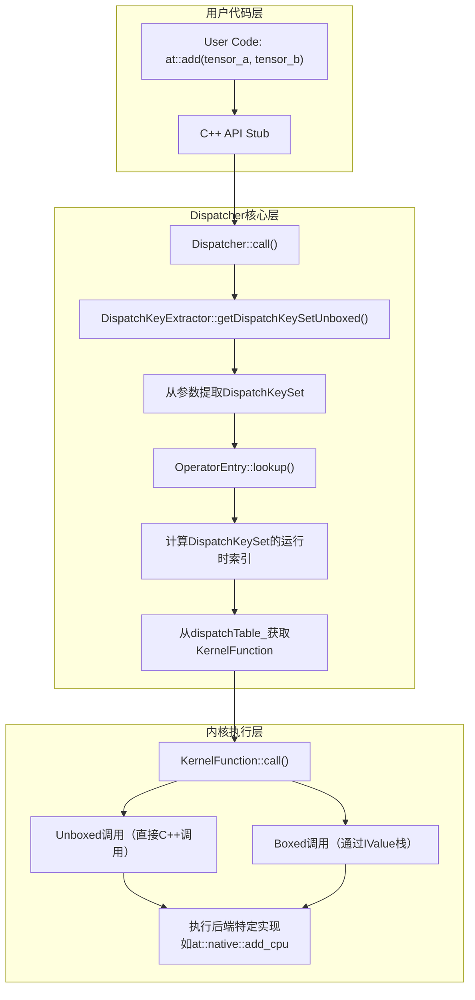
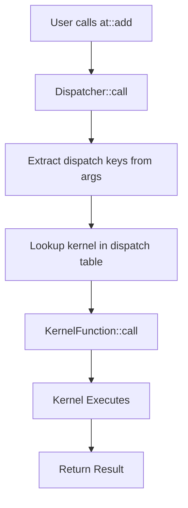
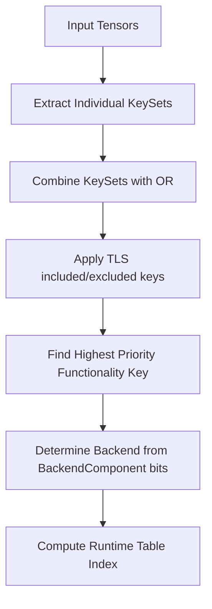
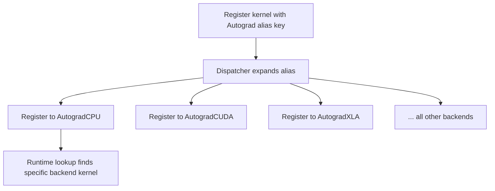

# PyTorch Dispatch System 深度分析

## 目录
1. [架构概览与设计原理](#1-架构概览与设计原理)
2. [DispatchKey详解](#2-dispatchkey详解)
3. [DispatchKeySet机制](#3-dispatchkeyset机制)
4. [Dispatch Table结构与索引计算](#4-dispatch-table结构与索引计算)
5. [Dispatcher核心实现](#5-dispatcher核心实现)
6. [OperatorEntry内核管理](#6-operatorentry内核管理)
7. [Dispatch Key提取机制](#7-dispatch-key提取机制)
8. [Backend Fallback机制](#8-backend-fallback机制)
9. [Boxing与Unboxing](#9-boxing与unboxing)
10. [Python Dispatch集成](#10-python-dispatch集成)
11. [Composite与Alias Keys](#11-composite与alias-keys)
12. [线程安全与性能优化](#12-线程安全与性能优化)

---

## 1. 架构概览与设计原理

### 1.1 设计目标

PyTorch Dispatch System的设计目标是提供一个**高效、可扩展、线程安全**的算子分发机制：

1. **多态分发**：根据输入张量的设备类型（CPU/CUDA）、数据类型（Dense/Sparse/Quantized）自动选择正确的内核实现
2. **零开销抽象**：运行时分发开销最小化（通常只需几次位运算和数组索引）
3. **可扩展性**：支持新后端（如XPU、PrivateUse）和功能（如Autograd、Functionalize）的无缝集成
4. **线程安全**：支持多线程并发调用而不需要全局锁

### 1.2 核心文件位置

| 组件 | 文件路径 | 描述 |
|------|----------|------|
| DispatchKey | `c10/core/DispatchKey.h` | 分发键枚举定义 |
| DispatchKeySet | `c10/core/DispatchKeySet.h` | 64位位集实现 |
| Dispatcher | `aten/src/ATen/core/dispatch/Dispatcher.h` | 主分发器单例 |
| OperatorEntry | `aten/src/ATen/core/dispatch/OperatorEntry.h` | 算子条目与分发表 |
| DispatchKeyExtractor | `aten/src/ATen/core/dispatch/DispatchKeyExtractor.h` | 从参数提取dispatch key |
| KernelFunction | `aten/src/ATen/core/boxing/KernelFunction.h` | 内核函数包装器 |
| Boxing | `aten/src/ATen/core/boxing/impl/boxing.h` | 装箱/拆箱工具 |

### 1.3 整体架构流程



### 1.4 关键设计决策

**为什么使用位集（Bitset）？**
- 紧凑表示：64位可以表示所有后端和功能组合
- 快速操作：位运算（OR/AND/NOT）是CPU单周期指令
- 优先级隐含：高位自动表示高优先级（通过`count leading zeros`找到最高位）

**为什么分离Dispatcher和OperatorEntry？**
- Dispatcher是全局单例，负责算子名称到OperatorHandle的映射
- OperatorEntry管理单个算子的所有内核注册和分发表
- 这种分离允许细粒度的锁（Dispatcher锁用于注册，查表无锁）

---

## 2. DispatchKey详解

### 2.1 DispatchKey概念

`DispatchKey`是一个枚举值，标识PyTorch分发机制中的特定"层级"，用作分发表中的索引。

```cpp
// 来自c10/core/DispatchKey.h
// DispatchKey标识可能的"层级"，可以注册处理程序
// 在实现上，DispatchKey标识DispatchKeySet中的特定"位"
// 更高位的索引优先处理（因为提取最高优先级DispatchKey时"计数前导零"）
```

### 2.2 DispatchKey分类

| 类别 | 示例 | 在DispatchKeySet中有位 | 有运行时表槽 |
|------|------|------------------------|--------------|
| 非可定制后端 | FPGA, Vulkan, Metal | 是 | 是 |
| 非可定制功能 | Functionalize, Python | 是 | 是 |
| 每后端功能 | Dense, Sparse, Quantized, AutogradFunctionality | 是 | 是 |
| 每后端实例 | CPU, CUDA, SparseCPU, AutogradCPU | 是 | 是 |
| 别名键 | Autograd, CompositeImplicitAutograd, CompositeExplicitAutograd | 否 | 否 |

### 2.3 BackendComponent - 后端位索引

**重要说明**：`BackendComponent`定义的是**位位置索引**（bit index），不是位值（bit value）。

```cpp
// 来自c10/core/DispatchKey.h
enum class BackendComponent : uint8_t {
  InvalidBit = 0,
  CPUBit,      // 索引1，对应位值 (1 << 1) = 0x2
  CUDABit,     // 索引2，对应位值 (1 << 2) = 0x4
  HIPBit,      // 索引3
  XLABit,      // 索引4
  MPSBit,      // 索引5
  IPUBit,      // 索引6
  XPUBit,      // 索引7
  HPUBit,      // 索引8
  VEBit,       // 索引9
  LazyBit,     // 索引10
  MTIABit,     // 索引11
  MAIABit,     // 索引12
  PrivateUse1Bit,  // 索引13
  PrivateUse2Bit,  // 索引14
  PrivateUse3Bit,  // 索引15
  MetaBit,         // 索引16
  EndOfBackendKeys = MetaBit,
};
```

**位值计算**：实际位掩码值为 `1 << static_cast<uint8_t>(BackendComponent::XXBit)`

---

## 3. DispatchKeySet机制

### 3.1 内部表示

`DispatchKeySet`是一个64位位集，采用巧妙的编码：

```
位布局（64位总计）：
┌─────────────────────────────────────────────────────────────────────┐
│ 后端位 (0-16) │ 功能位 (17-63)                                      │
├─────────────────────────────────────────────────────────────────────┤
│ CPU  │ CUDA │ XLA  │ ... │ Dense │ Quantized │ Sparse │ Autograd... │
│ Bit1 │ Bit2 │ Bit4 │ ... │ Bit17 │ Bit18     │ Bit19  │ ...         │
└─────────────────────────────────────────────────────────────────────┘
```

**注意**：后端位从第1位开始（InvalidBit=0不占用位），所以实际后端位位置是1-16。

### 3.2 核心操作

```cpp
// 来自c10/core/DispatchKeySet.h
class DispatchKeySet final {
  uint64_t repr_ = 0;  // 位集表示
  
  // 组合：
  // - 后端位（CPU, CUDA等）在低比特（位1-16）
  // - 功能位（Dense, Sparse, Autograd等）在高比特（位17+）
};
```

### 3.3 运行时键计算

```cpp
// 计算DispatchKeySet的分发表索引
int getDispatchTableIndexForDispatchKeySet() const {
  // 步骤1：找到最高功能位
  auto functionality_idx = DispatchKeySet(repr_ >> num_backends).indexOfHighestBit();
  
  // 步骤2：获取该功能的偏移和掩码
  auto offset_and_mask = offsetsAndMasks()[functionality_idx];
  
  // 步骤3：计算后端索引（如果是每后端功能）
  auto backend_idx = DispatchKeySet((repr_ & offset_and_mask.mask) >> 1)
      .indexOfHighestBit();
  
  // 步骤4：计算最终索引
  return offset_and_mask.offset + backend_idx;
}
```

---

## 4. Dispatch Table

### 4.1 FunctionalityOffsetAndMask

```cpp
struct FunctionalityOffsetAndMask {
  uint16_t offset{};  // 该功能在分发表中的偏移
  uint16_t mask{};    // 每后端功能的后端掩码
};

static const std::array<FunctionalityOffsetAndMask, num_functionality_keys>& offsetsAndMasks() {
  static auto offsets_and_masks_ = initializeFunctionalityOffsetsAndMasks();
  return offsets_and_masks_;
}
```

### 4.2 运行时索引计算示例

| 键 | 功能索引 | 后端索引 | 最终索引 |
|-----|---------|---------|---------|
| Undefined | 0 | 0 | 0 |
| Dense (CPU) | 1 | 1 | Dense_offset + 1 |
| Dense (CUDA) | 1 | 2 | Dense_offset + 2 |
| Sparse (CPU) | Sparse偏移 | 1 | Sparse_offset + 1 |
| AutogradCPU | Autograd偏移 | 1 | Autograd_offset + 1 |

---

## 5. Dispatcher核心实现

### 5.1 Dispatcher单例模式与线程安全

Dispatcher采用**单例模式**全局唯一，但针对不同平台有不同优化：

```cpp
class TORCH_API Dispatcher final {
 private:
  // 使用list而非vector避免重新分配时指针失效
  std::list<OperatorDef> operators_;
  
  // 读写锁保护的算子查找表
  // 非Mobile: 使用LeftRight（一种无锁读写的数据结构）
  // Mobile: 使用RWSafeLeftRightWrapper（更简单的读写锁）
#if !defined(C10_MOBILE)
  LeftRight<ska::flat_hash_map<OperatorName, OperatorHandle>> operatorLookupTable_;
#else
  RWSafeLeftRightWrapper<ska::flat_hash_map<OperatorName, OperatorHandle>> operatorLookupTable_;
#endif
  
  // Backend Fallback内核数组：每种DispatchKey对应一个Fallback内核
  std::array<impl::AnnotatedKernel, num_runtime_entries> backendFallbackKernels_;
  
  // 条件变量：用于多解释器场景（如torchdeploy）的注册同步
  std::condition_variable cond_var_;
  
  // 保护并发访问的Guard（通过shared_ptr支持回调安全）
  std::shared_ptr<Guard> guard_;
};
```

**单例获取优化**：

```cpp
C10_ALWAYS_INLINE static Dispatcher& singleton() {
#if !defined C10_MOBILE
  // 非Mobile：内联实现，避免函数调用开销
  // 使用函数局部static确保单次初始化
  static Dispatcher& s = realSingleton();
  return s;
#else
  // Mobile：不内联，避免__cxa_guard_acquire带来的代码膨胀
  return realSingleton();
#endif
}
```

### 5.2 算子注册与查找

**算子定义（Def）vs 实现（Impl）**：

```cpp
// registerDef: 注册算子Schema（签名信息）
// - 每个算子只能有一个Schema
// - 增加def_count计数
RegistrationHandleRAII registerDef(FunctionSchema schema, std::string debug, ...);

// registerImpl: 注册具体内核实现
// - 可以为不同DispatchKey注册多个实现
// - 如：CPU实现、CUDA实现、Autograd实现
RegistrationHandleRAII registerImpl(
    OperatorName op_name,
    std::optional<DispatchKey> dispatch_key,  // nullopt表示CatchAll
    KernelFunction kernel,
    ...
);
```

**查找算子**：

```cpp
// 通过算子名称查找（用于内部调用）
std::optional<OperatorHandle> findSchema(const OperatorName& operator_name);

// 快速查找（用于C++ API），失败时抛出异常
OperatorHandle findSchemaOrThrow(const char* name, const char* overload_name);
```

### 5.3 分发调用流程详解

**Unboxed调用（模板化，性能最优）**：

```cpp
template <class Return, class... Args>
C10_ALWAYS_INLINE_UNLESS_MOBILE Return Dispatcher::call(
    const TypedOperatorHandle<Return(Args...)>& op,
    Args... args) const {
  // 1. 从参数提取DispatchKeySet（编译时确定提取逻辑）
  auto dispatchKeySet = op.operatorDef_->op.dispatchKeyExtractor()
      .template getDispatchKeySetUnboxed<Args...>(args...);
  
  // 2. 查分发表获取内核（关键路径）
  const KernelFunction& kernel = op.operatorDef_->op.lookup(dispatchKeySet);
  
  // 3. 调用内核（内联展开）
  return kernel.template call<Return, Args...>(
      op, dispatchKeySet, std::forward<Args>(args)...);
}
```

**Boxed调用（动态，用于Python绑定）**：

```cpp
void callBoxed(const OperatorHandle& op, Stack* stack) const {
  // 从栈上的IValue提取DispatchKeySet
  auto dispatchKeySet = op.operatorDef_->op.dispatchKeyExtractor()
      .getDispatchKeySetBoxed(stack);
  
  const KernelFunction& kernel = op.operatorDef_->op.lookup(dispatchKeySet);
  kernel.callBoxed(op, dispatchKeySet, stack);
}
```

---

## 6. OperatorEntry内核管理

### 6.1 OperatorEntry数据结构

OperatorEntry管理单个算子的所有注册内核和计算后的分发表：

```cpp
class TORCH_API OperatorEntry final {
  OperatorName name_;                          // 算子名称（如"aten::add"）
  std::optional<AnnotatedSchema> schema_;      // 可选的Schema定义
  
  // 计算后的分发表：数组索引 = DispatchKey运行时索引
  std::array<KernelFunction, c10::num_runtime_entries> dispatchTable_;
  
  // 原始注册的内核（支持多版本和卸载）
  // key: DispatchKey, value: 该key下注册的所有内核列表（按时间排序）
  ska::flat_hash_map<DispatchKey, std::list<AnnotatedKernel>> kernels_;
  
  // 用于从参数提取DispatchKey的提取器
  DispatchKeyExtractor dispatchKeyExtractor_;
  
  // Python缓存（加速Python层调用）
  c10::PyHandleCache py_cache_;
};
```

### 6.2 分发表计算逻辑

**内核查找（运行时关键路径）**：

```cpp
const KernelFunction& lookup(DispatchKeySet ks) const {
  // 步骤1：将DispatchKeySet转换为数组索引
  const auto idx = ks.getDispatchTableIndexForDispatchKeySet();
  
  // 步骤2：索引越界检查（-1表示无法找到有效键）
  if (C10_UNLIKELY(idx == -1)) {
    reportError(ks.highestPriorityTypeId());
  }
  
  // 步骤3：从预计算表中获取内核
  const auto& kernel = dispatchTable_[idx];
  
  // 步骤4：验证内核有效性（开发模式检查）
  if (C10_UNLIKELY(!kernel.isValidUnboxed())) {
    if (!kernel.isValid()) {
      reportError(ks.highestPriorityTypeId());
    }
  }
  return kernel;
}
```

**分发表重建（注册时）**：

当新内核注册时，需要重新计算分发表：

```cpp
// 伪代码示意
void updateDispatchTable_(DispatchKey dispatch_key) {
  // 1. 获取该DispatchKey对应的内核列表（按注册时间排序）
  auto& kernels = kernels_[dispatch_key];
  
  // 2. 取最新的内核（列表头部）
  const auto& kernel = kernels.front();
  
  // 3. 计算该DispatchKey在表中的索引
  auto idx = toRuntimeIndex(dispatch_key);
  
  // 4. 更新分发表
  dispatchTable_[idx] = kernel.kernel;
  
  // 5. 对于别名键（如Autograd），展开到所有具体后端键
  if (isAliasKey(dispatch_key)) {
    for (auto expanded_key : expandAlias(dispatch_key)) {
      updateDispatchTable_(expanded_key);
    }
  }
}
```

### 6.3 内核生命周期管理

**RAII注册句柄**：

```cpp
// registerImpl返回RAII句柄，析构时自动注销
{
  auto handle = dispatcher.registerImpl(
      op_name, dispatch_key, kernel, ...);
  // ... 使用内核 ...
} // handle析构，自动调用deregisterImpl

// 支持内核覆盖（如动态加载新库时）
// 新内核加入列表头部，旧内核保留但不再使用
// 卸载库时恢复旧内核
```

---

## 7. Dispatch Key提取机制

### 7.1 DispatchKeyExtractor设计

提取器缓存了从算子参数提取DispatchKey的优化逻辑：

```cpp
struct TORCH_API DispatchKeyExtractor final {
  // 位集合：标记哪些参数位置包含Tensor（需要提取key_set）
  // 使用反向索引（从栈顶开始），便于Boxed调用时直接peek
  c10::utils::bitset dispatch_arg_indices_reverse_;
  
  // 直通键掩码：标记哪些DispatchKey是直通（fallthrough）
  DispatchKeySet nonFallthroughKeys_;
  
  // 是否需要每个后端单独的直通掩码（用于复杂算子）
  bool requiresBitsetPerBackend_ = false;
  std::array<DispatchKeySet, num_backends> nonFallthroughKeysPerBackend_;
};
```

### 7.2 参数位集构建

**Schema分析（注册时）**：

```cpp
static c10::utils::bitset makeBitsetForDispatchArgs(const FunctionSchema& schema) {
  c10::utils::bitset dispatch_arg_indices_reverse;
  
  // 遍历所有参数
  for (const auto index : c10::irange(schema.arguments().size())) {
    const auto& arg = schema.arguments()[index];
    
    // 检查参数类型是否需要dispatch
    if (isDispatchType(*arg.type())) {
      // 记录反向索引（从栈顶）
      dispatch_arg_indices_reverse.set(schema.arguments().size() - 1 - index);
    }
  }
  return dispatch_arg_indices_reverse;
}

static bool isDispatchType(const Type& type) {
  // Tensor类型
  if (type.isSubtypeOf(*TensorType::get())) return true;
  // Tensor列表类型
  if (type.isSubtypeOf(*ListType::ofTensors())) return true;
  // Optional<Tensor>类型
  if (type.isSubtypeOf(*OptionalType::ofTensor())) return true;
  return false;
}
```

### 7.3 Unboxed提取（C++模板）

编译时生成优化的提取代码：

```cpp
template <class... Args>
DispatchKeySet getDispatchKeySetUnboxed(const Args&... args) const {
  // 使用可变参数模板和CRTP模式迭代提取
  auto ks = detail::multi_dispatch_key_set(args...);
  
  // 应用TLS和直通掩码
  return impl::computeDispatchKeySet(
      ks, 
      requiresBitsetPerBackend_ 
          ? nonFallthroughKeysPerBackend_[ks.getBackendIndex()]
          : nonFallthroughKeys_
  );
}

// MultiDispatchKeySet使用CRTP迭代
template <typename... Args>
DispatchKeySet multi_dispatch_key_set(const Args&... args) {
  return MultiDispatchKeySet().apply(args...).ts;
}

struct MultiDispatchKeySet : at::IterArgs<MultiDispatchKeySet> {
  DispatchKeySet ts;
  
  // 重载：处理单个Tensor
  void operator()(const at::Tensor& x) {
    ts = ts | x.key_set();
  }
  
  // 重载：处理Optional<Tensor>
  void operator()(const std::optional<at::Tensor>& x) {
    if (x.has_value()) ts = ts | x->key_set();
  }
  
  // 重载：处理Tensor列表
  void operator()(at::ArrayRef<at::Tensor> xs) {
    for (const auto& x : xs) ts = ts | x.key_set();
  }
  
  // 其他类型忽略
  template <typename T>
  void operator()(const T& /*unused*/) {}
};
```

### 7.4 Boxed提取（Python调用）

从IValue栈提取（支持运行时动态检查）：

```cpp
DispatchKeySet getDispatchKeySetBoxed(const torch::jit::Stack* stack) const {
  DispatchKeySet ks;
  
  // 遍历标记的参数位置
  dispatch_arg_indices_reverse_.for_each_set_bit([&](size_t reverse_arg_index) {
    // 从栈peek（不pop，避免拷贝）
    const auto& ivalue = torch::jit::peek(*stack, 0, reverse_arg_index + 1);
    
    if (C10_LIKELY(ivalue.isTensor())) {
      // 直接访问TensorImpl避免引用计数
      ks = ks | ivalue.unsafeToTensorImpl()->key_set();
    } else if (C10_UNLIKELY(ivalue.isTensorList())) {
      // 处理Tensor列表
      for (const auto& nv : ivalue.toListRef()) {
        ks = ks | nv.unsafeToTensorImpl()->key_set();
      }
    }
  });
  
  return impl::computeDispatchKeySet(ks, nonFallthroughKeys_);
}
```

---

## 8. Backend Fallback机制

### 8.1 Fallback内核注册

Backend Fallback允许为整个后端注册默认处理函数：

```cpp
// 为特定DispatchKey注册Fallback内核
RegistrationHandleRAII registerFallback(
    DispatchKey dispatch_key,
    KernelFunction kernel,
    std::string debug
);

// 示例：为Python后端注册Fallback
TORCH_LIBRARY_IMPL(_, Python, m) {
  m.fallback(torch::CppFunction::makeFromBoxedFunction<&pythonFallback>());
}
```

### 8.2 Fallback触发逻辑

当算子没有特定内核时触发Fallback：

```cpp
// 在OperatorEntry::lookup中
const KernelFunction& lookup(DispatchKeySet ks) const {
  auto idx = ks.getDispatchTableIndexForDispatchKeySet();
  const auto& kernel = dispatchTable_[idx];
  
  // 如果没有有效内核，尝试Fallback
  if (C10_UNLIKELY(!kernel.isValid())) {
    // 获取最高优先级的DispatchKey
    auto highest_key = ks.highestPriorityTypeId();
    
    // 检查Dispatcher中是否有该key的Fallback
    if (dispatcher.hasBackendFallbackForDispatchKey(highest_key)) {
      return dispatcher.getBackendFallbackKernel(highest_key);
    }
    
    // 报错：没有可用内核
    reportError(highest_key);
  }
  return kernel;
}
```

### 8.3 Fallback使用场景

| 场景 | Fallback用途 |
|------|-------------|
| Python后端 | 所有算子都路由到Python处理（如TorchDispatchMode） |
| Meta后端 | 返回Meta张量的形状信息而不执行计算 |
| Functionalize | 将inplace操作转换为functional操作 |
| Autograd | 自动生成反向传播逻辑 |

---

## 9. Boxing与Unboxing

### 9.1 KernelFunction设计

KernelFunction是内核的统一包装器，支持两种调用方式：

```cpp
class TORCH_API KernelFunction final {
public:
  // Unboxed调用：直接C++函数调用，性能最优
  template <class Return, class... Args>
  Return call(const OperatorHandle& op, DispatchKeySet ks, Args... args) const {
    if (C10_LIKELY(unboxed_kernel_ != nullptr)) {
      // 直接调用C++函数指针
      return unboxed_kernel_(op, ks, std::forward<Args>(args)...);
    }
    // 退化到Boxed调用（很少发生）
    return callUnboxedOnly<Return, Args...>(op, ks, std::forward<Args>(args)...);
  }
  
  // Boxed调用：通过IValue栈，支持动态类型
  void callBoxed(const OperatorHandle& op, DispatchKeySet ks, Stack* stack) const {
    boxed_kernel_func_(op, ks, stack, boxed_kernel_);
  }

private:
  // 两种内核存储
  void* boxed_kernel_ = nullptr;                          // 装箱内核
  using BoxedKernelFunc = void(*)(...);
  BoxedKernelFunc boxed_kernel_func_ = nullptr;          // 装箱调用包装器
  
  // 可选的Unboxed内核（直接函数指针）
  std::function<...> unboxed_kernel_ = nullptr;
};
```

### 9.2 Unboxed到Boxed的包装

当只提供Boxed实现时，自动生成Unboxed包装器：

```cpp
// 模板自动生成：将Unboxed参数装箱，调用Boxed内核，然后拆箱结果
template <class Return, class... Args>
Return make_boxed_from_unboxed(const OperatorHandle& op, DispatchKeySet ks, Args... args) {
  // 1. 创建IValue栈
  Stack stack;
  stack.reserve(sizeof...(Args));
  
  // 2. 装箱参数
  torch::jit::push(stack, std::forward<Args>(args)...);
  
  // 3. 调用Boxed内核
  op.callBoxed(stack);
  
  // 4. 拆箱结果
  return std::move(stack[0]).to<Return>();
}
```

### 9.3 选择Boxed vs Unboxed

| 场景 | 推荐方式 | 原因 |
|------|---------|------|
| C++原生内核 | Unboxed | 最高性能，零开销 |
| Python内核 | Boxed | 需要通过IValue与Python交互 |
| 动态类型 | Boxed | 运行时确定类型 |
| 模板通用 | Unboxed | 编译时生成最优代码 |

---

## 10. Python Dispatch集成

### 10.1 PythonKernelHolder

Python内核通过持有PyObject*实现：

```cpp
class PythonKernelHolder : public c10::OperatorKernel {
  c10::SafePyObject func_;       // Python函数对象（GIL安全）
  c10::DispatchKey dispatch_key_;
  c10::SafePyObject module_name_;
  
public:
  void operator()(const c10::OperatorHandle& op,
                  c10::DispatchKeySet keyset,
                  torch::jit::Stack* stack) {
    // 检查是否有TorchDispatchMode激活
    if (c10::impl::TorchDispatchModeTLS::stack_len() > 0) {
      // 路由到模式的__torch_dispatch__
      auto* mode = c10::impl::TorchDispatchModeTLS::get_stack_at(
        c10::impl::TorchDispatchModeTLS::stack_len() - 1);
      return mode->dispatch(op, keyset, stack);
    }
    
    // 检查参数中是否有Python张量
    auto arguments = torch::jit::pop(*stack, op.schema().arguments().size());
    for (auto& ivalue : arguments) {
      if (ivalue.isTensor() && isPythonTensor(ivalue.toTensor())) {
        // 路由到张量的__torch_dispatch__
        return dispatchToTensor(op, keyset, stack, ivalue.toTensor());
      }
    }
    
    // 默认：直接调用Python函数
    py::gil_scoped_acquire g;
    auto result = py::call_function(func_.ptr(arguments...));
    torch::jit::push(stack, result);
  }
};
```

### 10.2 TorchDispatchMode

Python层的分发拦截机制：

```python
# Python使用示例
with torch.overrides.TorchDispatchMode(MyHandler):
    # 此区域内的所有算子调用都会路由到MyHandler
    x = torch.add(a, b)

class MyHandler:
    def __torch_dispatch__(self, op, types, args, kwargs):
        # 自定义处理逻辑
        print(f"Called {op}")
        return op(*args, **kwargs)
```

C++层实现：

```cpp
// TLS存储当前激活的Mode栈
thread_local std::vector<PyObject*> torch_dispatch_mode_stack;

// 检查并分发
bool TorchDispatchModeTLS::dispatch(const OperatorHandle& op, ...) {
  if (!torch_dispatch_mode_stack.empty()) {
    auto* mode = torch_dispatch_mode_stack.back();
    // 调用mode的__torch_dispatch__
    return callPythonDispatch(mode, op, ...);
  }
  return false;  // 没有激活的Mode
}
```

---

## 11. Composite与Alias Keys

### 11.1 别名键机制

别名键允许一次注册应用到多个后端：

```cpp
// 别名键展开表
static const std::array<DispatchKey, 3> autograd_backends = {
    DispatchKey::AutogradCPU,
    DispatchKey::AutogradCUDA,
    DispatchKey::AutogradXLA,
    // ... 更多后端
};

// 注册时展开
void registerKernelWithAlias(DispatchKey alias_key, KernelFunction kernel) {
  for (auto expanded_key : expandAlias(alias_key)) {
    registerImpl(expanded_key, kernel);
  }
}
```

### 11.2 CompositeImplicitAutograd vs CompositeExplicitAutograd

| 特性 | CompositeImplicitAutograd | CompositeExplicitAutograd |
|------|---------------------------|---------------------------|
| 扩展目标 | Dense + 所有Autograd后端 | 仅Dense后端（无Autograd） |
| Autograd支持 | 通过分解自动支持 | 需要显式注册Autograd内核 |
| 使用场景 | 纯函数式实现（无inplace） | 需要自定义梯度实现 |
| 典型示例 | aten::add（用out=版本实现） | aten::convolution |

**实现差异**：

```cpp
// CompositeImplicitAutograd内核
Tensor add(const Tensor& self, const Tensor& other) {
  Tensor result = at::empty(self.sizes(), self.options());
  at::add_out(result, self, other);  // 调用out=版本
  return result;
}
// Autograd自动处理，因为out=版本支持自动微分

// CompositeExplicitAutograd内核
Tensor convolution(const Tensor& input, const Tensor& weight, ...) {
  // 数值计算
  return native::convolution_nograd(input, weight, ...);
}
// 需要单独注册AutogradConvolution
```

---

## 12. 线程安全与性能优化

### 12.1 无锁读路径

分发路径（call/lookup）是**完全无锁**的：

```cpp
// 线程局部缓存
thread_local LocalDispatchKeySet tls_local_dispatch_key_set;

// Dispatcher::call - 无锁
// 1. 从TLS读取included/excluded keys
// 2. 查分发表（预计算的数组索引）
// 3. 调用内核

// 关键保证：
// - 分发表只在注册/注销时修改
// - 读写使用内存屏障保证可见性
// - 读路径不持有任何锁
```

### 12.2 LeftRight数据结构

用于operatorLookupTable_的无锁读写：

```cpp
// LeftRight允许一个写者与多个读者并发
// 写操作通过翻转"左右"副本实现
class LeftRight<T> {
  std::array<T, 2> data_;           // 两份数据
  std::atomic<int> read_index_;     // 当前读索引（0或1）
  std::atomic<int> write_count_;    // 写计数（用于同步）
  
public:
  // 读：获取当前读索引，使用该副本
  T read() {
    return data_[read_index_.load()];
  }
  
  // 写：修改非活动副本，原子翻转索引
  void write(std::function<void(T&)> mutator) {
    int other = 1 - read_index_.load();
    mutator(data_[other]);
    read_index_ = other;  // 原子翻转
  }
};
```

### 12.3 性能优化总结

| 优化技术 | 效果 |
|---------|------|
| 64位位集表示 | 单次位运算确定分发目标 |
| 预计算分发表 | O(1)数组索引，无哈希查找 |
| 内联模板 | 编译时展开，零开销抽象 |
| TLS缓存 | 避免全局锁，线程局部配置 |
| 引用计数优化 | unsafeToTensorImpl避免RCU |
| 分支预测 | C10_LIKELY/C10_UNLIKELY提示 |

**典型分发开销**：
- DispatchKeySet提取：~10-20个CPU周期
- 分发表查找：~5个CPU周期
- 总计：~20-30周期（纳秒级）

---

## 11. 流程图

### 11.1 分发机制流程



### 11.2 后端选择流程



### 11.3 Alias Key解析流程



---

## 12. 关键概念总结

### 12.1 BackendComponent vs DispatchKey

| 方面 | BackendComponent | DispatchKey |
|------|-----------------|-------------|
| 用途 | 标识后端位位置（索引） | 标识功能层级 |
| 位位置 | 低~16位（位1-16） | 高位（17+） |
| 值含义 | 位索引（1, 2, 3...） | 直接是位掩码 |
| 示例 | CPUBit=1（索引）, 实际位值=0x2 | Dense直接在高位 |

**关键区别**：BackendComponent是**位索引**，需要通过 `1 << index` 转换为位值。

### 12.2 优先级规则

1. **高位优先**：DispatchKeySet中高位（更大的数值）优先被处理
2. **功能优先于后端**：功能键检查优先于后端选择
3. **TLS可以覆盖**：Thread Local Storage中的included/excluded keys可以修改默认行为

---

## 13. 文件位置汇总

| 组件 | 文件路径 |
|------|----------|
| Dispatcher Interface | aten/src/ATen/core/dispatch/Dispatcher.h |
| Dispatcher Implementation | aten/src/ATen/core/dispatch/Dispatcher.cpp |
| Operator Entry | aten/src/ATen/core/dispatch/OperatorEntry.h |
| Dispatch Key Extractor | aten/src/ATen/core/dispatch/DispatchKeyExtractor.h |
| Kernel Function | aten/src/ATen/core/boxing/KernelFunction.h |
| Boxing Utilities | aten/src/ATen/core/boxing/impl/boxing.h |
| Dispatch Key | c10/core/DispatchKey.h |
| Dispatch Key Set | c10/core/DispatchKeySet.h |
| Python Dispatch | torch/csrc/utils/python_dispatch.cpp |

---

## 14. 总结

PyTorch的分发系统通过精巧的位打包将后端和功能位打包到64位DispatchKeySet中，实现高效的运行时分发到适当的内核。关键设计包括：

1. **分离关注点**：后端标识和功能标识分离，BackendComponent是位索引，功能键直接是位掩码
2. **高效查找**：通过位操作快速计算分发表索引，支持O(1)的内核查找
3. **灵活扩展**：支持多种后端和功能组合，别名键允许一次性注册到多个后端
4. **动态层支持**：FuncTorch通过特殊的dispatch key实现vmap、grad等转换
5. **统一接口**：Boxing/Unboxing机制提供统一调用接口，支持C++和Python内核
