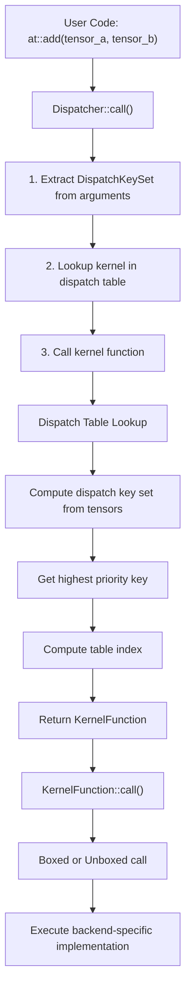
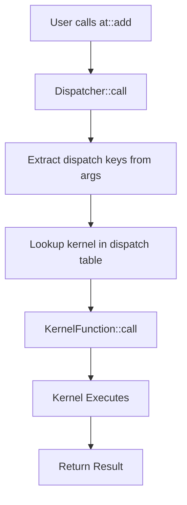
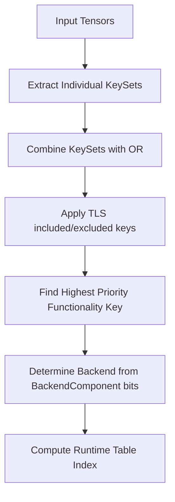
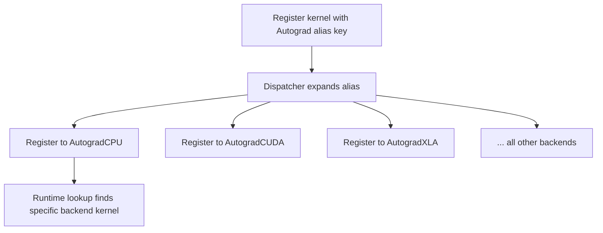

# PyTorch Dispatch System深度分析

## 目录
1. [架构概览](#1-架构概览)
2. [DispatchKey详解](#2-dispatchkey详解)
3. [DispatchKeySet机制](#3-dispatchkeyset机制)
4. [Dispatch Table](#4-dispatch-table)
5. [Dispatcher实现](#5-dispatcher实现)
6. [Dispatch Key提取](#6-dispatch-key提取)
7. [Boxing与Unboxing](#7-boxing与unboxing)
8. [Python Dispatch集成](#8-python-dispatch集成)
9. [Composite与Alias Keys](#9-composite与alias-keys)
10. [Functorch动态层](#10-functorch动态层)

---

## 1. 架构概览

### 1.1 核心文件位置

| 组件 | 文件路径 | 描述 |
|------|----------|------|
| DispatchKey | c10/core/DispatchKey.h | 分发键定义 |
| DispatchKeySet | c10/core/DispatchKeySet.h | 分发键集合实现 |
| Dispatcher | aten/src/ATen/core/dispatch/Dispatcher.h | 主分发器 |
| OperatorEntry | aten/src/ATen/core/dispatch/OperatorEntry.h | 操作符条目管理 |
| KernelFunction | aten/src/ATen/core/boxing/KernelFunction.h | 内核函数包装 |
| Boxing | aten/src/ATen/core/boxing/impl/boxing.h | 装箱工具 |

### 1.2 整体架构



---

## 2. DispatchKey详解

### 2.1 DispatchKey概念

`DispatchKey`是一个枚举值，标识PyTorch分发机制中的特定"层级"，用作分发表中的索引。

```cpp
// 来自c10/core/DispatchKey.h
// DispatchKey标识可能的"层级"，可以注册处理程序
// 在实现上，DispatchKey标识DispatchKeySet中的特定"位"
// 更高位的索引优先处理（因为提取最高优先级DispatchKey时"计数前导零"）
```

### 2.2 DispatchKey分类

| 类别 | 示例 | 在DispatchKeySet中有位 | 有运行时表槽 |
|------|------|------------------------|--------------|
| 非可定制后端 | FPGA, Vulkan, Metal | 是 | 是 |
| 非可定制功能 | Functionalize, Python | 是 | 是 |
| 每后端功能 | Dense, Sparse, Quantized, AutogradFunctionality | 是 | 是 |
| 每后端实例 | CPU, CUDA, SparseCPU, AutogradCPU | 是 | 是 |
| 别名键 | Autograd, CompositeImplicitAutograd, CompositeExplicitAutograd | 否 | 否 |

### 2.3 BackendComponent - 后端位索引

**重要说明**：`BackendComponent`定义的是**位位置索引**（bit index），不是位值（bit value）。

```cpp
// 来自c10/core/DispatchKey.h
enum class BackendComponent : uint8_t {
  InvalidBit = 0,
  CPUBit,      // 索引1，对应位值 (1 << 1) = 0x2
  CUDABit,     // 索引2，对应位值 (1 << 2) = 0x4
  HIPBit,      // 索引3
  XLABit,      // 索引4
  MPSBit,      // 索引5
  IPUBit,      // 索引6
  XPUBit,      // 索引7
  HPUBit,      // 索引8
  VEBit,       // 索引9
  LazyBit,     // 索引10
  MTIABit,     // 索引11
  MAIABit,     // 索引12
  PrivateUse1Bit,  // 索引13
  PrivateUse2Bit,  // 索引14
  PrivateUse3Bit,  // 索引15
  MetaBit,         // 索引16
  EndOfBackendKeys = MetaBit,
};
```

**位值计算**：实际位掩码值为 `1 << static_cast<uint8_t>(BackendComponent::XXBit)`

---

## 3. DispatchKeySet机制

### 3.1 内部表示

`DispatchKeySet`是一个64位位集，采用巧妙的编码：

```
位布局（64位总计）：
┌─────────────────────────────────────────────────────────────────────┐
│ 后端位 (0-16) │ 功能位 (17-63)                                      │
├─────────────────────────────────────────────────────────────────────┤
│ CPU  │ CUDA │ XLA  │ ... │ Dense │ Quantized │ Sparse │ Autograd... │
│ Bit1 │ Bit2 │ Bit4 │ ... │ Bit17 │ Bit18     │ Bit19  │ ...         │
└─────────────────────────────────────────────────────────────────────┘
```

**注意**：后端位从第1位开始（InvalidBit=0不占用位），所以实际后端位位置是1-16。

### 3.2 核心操作

```cpp
// 来自c10/core/DispatchKeySet.h
class DispatchKeySet final {
  uint64_t repr_ = 0;  // 位集表示
  
  // 组合：
  // - 后端位（CPU, CUDA等）在低比特（位1-16）
  // - 功能位（Dense, Sparse, Autograd等）在高比特（位17+）
};
```

### 3.3 运行时键计算

```cpp
// 计算DispatchKeySet的分发表索引
int getDispatchTableIndexForDispatchKeySet() const {
  // 步骤1：找到最高功能位
  auto functionality_idx = DispatchKeySet(repr_ >> num_backends).indexOfHighestBit();
  
  // 步骤2：获取该功能的偏移和掩码
  auto offset_and_mask = offsetsAndMasks()[functionality_idx];
  
  // 步骤3：计算后端索引（如果是每后端功能）
  auto backend_idx = DispatchKeySet((repr_ & offset_and_mask.mask) >> 1)
      .indexOfHighestBit();
  
  // 步骤4：计算最终索引
  return offset_and_mask.offset + backend_idx;
}
```

---

## 4. Dispatch Table

### 4.1 FunctionalityOffsetAndMask

```cpp
struct FunctionalityOffsetAndMask {
  uint16_t offset{};  // 该功能在分发表中的偏移
  uint16_t mask{};    // 每后端功能的后端掩码
};

static const std::array<FunctionalityOffsetAndMask, num_functionality_keys>& offsetsAndMasks() {
  static auto offsets_and_masks_ = initializeFunctionalityOffsetsAndMasks();
  return offsets_and_masks_;
}
```

### 4.2 运行时索引计算示例

| 键 | 功能索引 | 后端索引 | 最终索引 |
|-----|---------|---------|---------|
| Undefined | 0 | 0 | 0 |
| Dense (CPU) | 1 | 1 | Dense_offset + 1 |
| Dense (CUDA) | 1 | 2 | Dense_offset + 2 |
| Sparse (CPU) | Sparse偏移 | 1 | Sparse_offset + 1 |
| AutogradCPU | Autograd偏移 | 1 | Autograd_offset + 1 |

---

## 5. Dispatcher实现

### 5.1 Dispatcher架构

```cpp
// 来自aten/src/ATen/core/dispatch/Dispatcher.h
class TORCH_API Dispatcher final {
  std::list<OperatorDef> operators_;
  LeftRight<ska::flat_hash_map<OperatorName, OperatorHandle>> operatorLookupTable_;
  std::array<impl::AnnotatedKernel, num_runtime_entries> backendFallbackKernels_;
};
```

### 5.2 OperatorEntry

```cpp
// 来自aten/src/ATen/core/dispatch/OperatorEntry.h
class TORCH_API OperatorEntry final {
  std::array<KernelFunction, c10::num_runtime_entries> dispatchTable_;
  ska::flat_hash_map<DispatchKey, std::list<AnnotatedKernel>> kernels_;
  DispatchKeyExtractor dispatchKeyExtractor_;
};
```

### 5.3 分发流程

```cpp
// 来自aten/src/ATen/core/dispatch/Dispatcher.h
template <class Return, class... Args>
C10_ALWAYS_INLINE_UNLESS_MOBILE Return Dispatcher::call(
    const TypedOperatorHandle<Return(Args...)>& op,
    Args... args) const {
  // 步骤1：从参数计算分发键集
  auto dispatchKeySet = op.operatorDef_->op.dispatchKeyExtractor()
      .template getDispatchKeySetUnboxed<Args...>(args...);
  
  // 步骤2：在分发表中查找内核
  const KernelFunction& kernel = op.operatorDef_->op.lookup(dispatchKeySet);
  
  // 步骤3：调用内核
  return kernel.template call<Return, Args...>(
      op, dispatchKeySet, std::forward<Args>(args)...);
}
```

---

## 6. Dispatch Key提取

### 6.1 多DispatchKeySet提取

```cpp
// 来自aten/src/ATen/core/dispatch/DispatchKeyExtractor.h
struct MultiDispatchKeySet : at::IterArgs<MultiDispatchKeySet> {
  DispatchKeySet ts;
  void operator()(const at::Tensor& x) {
    ts = ts | x.key_set();
  }
  void operator()(at::ArrayRef<at::Tensor> xs) {
    for (const auto& x : xs) {
      ts = ts | x.key_set();
    }
  }
};
```

### 6.2 计算最终DispatchKeySet

```cpp
// 来自aten/src/ATen/core/dispatch/DispatchKeyExtractor.h
inline DispatchKeySet computeDispatchKeySet(
    DispatchKeySet ks,
    DispatchKeySet key_mask) {
  c10::impl::LocalDispatchKeySet local = c10::impl::tls_local_dispatch_key_set();
  // 组合：张量键集 | TLS包含的键 - TLS排除的键
  // 然后掩码掉直通键
  return (((ks | local.included_) - local.excluded_) & key_mask);
}
```

---

## 7. Boxing与Unboxing

### 7.1 KernelFunction

```cpp
// 来自aten/src/ATen/core/boxing/KernelFunction.h
class TORCH_API KernelFunction final {
public:
  // 以装箱方式调用
  void callBoxed(const OperatorHandle& op, DispatchKeySet ks, Stack* stack) const;
  
  // 以未装箱方式调用
  template <class Return, class... Args>
  Return call(const OperatorHandle& op, DispatchKeySet ks, Args... args) const;
};
```

### 7.2 Boxing工具

```cpp
// 来自aten/src/ATen/core/boxing/impl/boxing.h
// 将参数装箱到栈上
template <class... Args>
torch::jit::Stack boxArgs(Args... args) {
  torch::jit::Stack stack;
  stack.reserve(sizeof...(Args));
  torch::jit::push(stack, std::forward<Args>(args)...);
  return stack;
}
```

---

## 8. Python Dispatch集成

### 8.1 Python绑定

```cpp
// 来自torch/csrc/utils/python_dispatch.cpp
void initDispatchBindings(PyObject* module) {
  py::class_<c10::OperatorHandle>(m, "_DispatchOperatorHandle")
      .def("schema", &c10::OperatorHandle::schema)
      .def("redispatch_boxed", ...);
  
  py::class_<torch::Library>(m, "_DispatchModule")
      .def("def_", ...)      // 定义模式
      .def("impl", ...)      // 注册实现
      .def("fallback", ...); // 注册回退
}
```

### 8.2 Python内核持有者

```cpp
// 来自torch/csrc/utils/python_dispatch.cpp
class PythonKernelHolder : public c10::OperatorKernel {
  c10::SafePyObject func_;
  c10::DispatchKey dispatch_key_;
  
public:
  void operator()(const c10::OperatorHandle& op,
                  c10::DispatchKeySet keyset,
                  torch::jit::Stack* stack) {
    // 处理TorchDispatchMode
    if (c10::impl::TorchDispatchModeTLS::stack_len() > 0) {
      // 分发到模式的PyInterpreter
    }
    
    // 处理具有__torch_dispatch__的张量子类
    for (const auto& ivalue : arguments) {
      if (ivalue.isTensor() && hasPythonKey(ivalue)) {
        // 分发到张量的PyInterpreter
      }
    }
    
    // 默认：直接调用Python函数
    py::gil_scoped_acquire g;
    auto result = func_(...);
    pushPyOutToStack(op, stack, obj, "PythonKernelHolder");
  }
};
```

---

## 9. Composite与Alias Keys

### 9.1 别名键机制

别名键（Alias Key）不对应分发表中的实际槽位，而是用于同时注册到多个后端键。

| 别名键 | 扩展到 | 用例 |
|--------|--------|------|
| Autograd | 所有Autograd<Backend>键 | 为所有后端注册autograd内核 |
| CompositeImplicitAutograd | Dense + 所有Autograd键 | 内核适用于所有后端和autograd |
| CompositeExplicitAutograd | 仅Dense键 | 内核适用于所有后端但不包括autograd |

### 9.2 CompositeExplicitAutograd vs CompositeImplicitAutograd

```cpp
// CompositeImplicitAutograd: 内核通过自动微分分解，适用于所有情况
// 例如：aten::add.Tensor 可以用 aten::add.out 实现

// CompositeExplicitAutograd: 内核只实现数值计算，不处理autograd
// 例如：aten::convolution 需要显式的autograd内核
```

### 9.3 注册示例

```cpp
// 注册到CompositeImplicitAutograd会同时注册到CPU, CUDA等所有Dense后端
TORCH_LIBRARY_IMPL(aten, CompositeImplicitAutograd, m) {
  m.impl("my_op", my_op_kernel);  // 一次注册，多处可用
}
```

---

## 10. Functorch动态层

### 10.1 动态层Dispatch Keys

Functorch（vmap, grad, vjp等）使用特殊的dispatch key来处理动态层：

| Key | 用途 |
|-----|------|
| FuncTorchDynamicLayerFrontMode | 在前端拦截，设置层上下文 |
| FuncTorchDynamicLayerBackMode | 在后端处理，恢复上下文 |
| PythonTLSSnapshot | 保存/恢复Python TLS状态 |

### 10.2 动态层工作原理

```cpp
// 当调用vmap(fn)(x)时：
// 1. FuncTorchDynamicLayerFrontMode 被设置
// 2. 函数在前端模式包装下执行
// 3. 操作被拦截并根据batch大小扩展
// 4. FuncTorchDynamicLayerBackMode 清理状态
```

### 10.3 与Functionalization的关系

```cpp
// Functionalize key用于将in-place操作转换为functional操作
// 这对vmap至关重要，因为vmap需要处理视图的批处理
TORCH_LIBRARY_IMPL(_, Functionalize, m) {
  // 转换 inplace 操作为 functional 操作
}
```

---

## 11. 流程图

### 11.1 分发机制流程



### 11.2 后端选择流程



### 11.3 Alias Key解析流程



---

## 12. 关键概念总结

### 12.1 BackendComponent vs DispatchKey

| 方面 | BackendComponent | DispatchKey |
|------|-----------------|-------------|
| 用途 | 标识后端位位置（索引） | 标识功能层级 |
| 位位置 | 低~16位（位1-16） | 高位（17+） |
| 值含义 | 位索引（1, 2, 3...） | 直接是位掩码 |
| 示例 | CPUBit=1（索引）, 实际位值=0x2 | Dense直接在高位 |

**关键区别**：BackendComponent是**位索引**，需要通过 `1 << index` 转换为位值。

### 12.2 优先级规则

1. **高位优先**：DispatchKeySet中高位（更大的数值）优先被处理
2. **功能优先于后端**：功能键检查优先于后端选择
3. **TLS可以覆盖**：Thread Local Storage中的included/excluded keys可以修改默认行为

---

## 13. 文件位置汇总

| 组件 | 文件路径 |
|------|----------|
| Dispatcher Interface | aten/src/ATen/core/dispatch/Dispatcher.h |
| Dispatcher Implementation | aten/src/ATen/core/dispatch/Dispatcher.cpp |
| Operator Entry | aten/src/ATen/core/dispatch/OperatorEntry.h |
| Dispatch Key Extractor | aten/src/ATen/core/dispatch/DispatchKeyExtractor.h |
| Kernel Function | aten/src/ATen/core/boxing/KernelFunction.h |
| Boxing Utilities | aten/src/ATen/core/boxing/impl/boxing.h |
| Dispatch Key | c10/core/DispatchKey.h |
| Dispatch Key Set | c10/core/DispatchKeySet.h |
| Python Dispatch | torch/csrc/utils/python_dispatch.cpp |

---

## 14. 总结

PyTorch的分发系统通过精巧的位打包将后端和功能位打包到64位DispatchKeySet中，实现高效的运行时分发到适当的内核。关键设计包括：

1. **分离关注点**：后端标识和功能标识分离，BackendComponent是位索引，功能键直接是位掩码
2. **高效查找**：通过位操作快速计算分发表索引，支持O(1)的内核查找
3. **灵活扩展**：支持多种后端和功能组合，别名键允许一次性注册到多个后端
4. **动态层支持**：FuncTorch通过特殊的dispatch key实现vmap、grad等转换
5. **统一接口**：Boxing/Unboxing机制提供统一调用接口，支持C++和Python内核
