# PyTorch Distributed c10d (分布式通信库) 深度分析

## 目录
1. [架构概览与设计目标](#1-架构概览与设计目标)
2. [核心组件详解](#2-核心组件详解)
3. [Store机制与进程协调](#3-store机制与进程协调)
4. [Backend抽象与实现](#4-backend抽象与实现)
5. [ProcessGroup进程组管理](#5-processgroup进程组管理)
6. [Work异步操作机制](#6-work异步操作机制)
7. [集体通信操作](#7-集体通信操作)
8. [NCCL后端详解](#8-nccl后端详解)
9. [Gloo后端详解](#9-gloo后端详解)
10. [Python API层](#10-python-api层)

---

## 1. 架构概览与设计目标

### 1.1 什么是c10d

**c10d** (C10 Distributed) 是PyTorch的分布式通信库，提供跨进程的集体通信(Collective Communication)原语。它是PyTorch分布式训练的基础设施，支持数据并行、模型并行和流水线并行等多种并行策略。

### 1.2 设计目标

```
┌─────────────────────────────────────────────────────────────────┐
│                     c10d 设计目标                                │
├─────────────────────────────────────────────────────────────────┤
│  1. 多后端支持: NCCL(CUDA)、Gloo(CPU)、MPI、UCC、XCCL等         │
│  2. 统一API: 不同后端使用相同的Python/C++ API                    │
│  3. 异步执行: 所有集体操作都是异步的，支持重叠计算和通信          │
│  4. 进程组抽象: 支持多进程组，灵活控制通信域                     │
│  5. 容错机制: 支持错误检测、超时控制和恢复机制                    │
│  6. 性能优化: 支持通信合并、批量操作和优化算法                    │
└─────────────────────────────────────────────────────────────────┘
```

### 1.3 在分布式训练中的位置

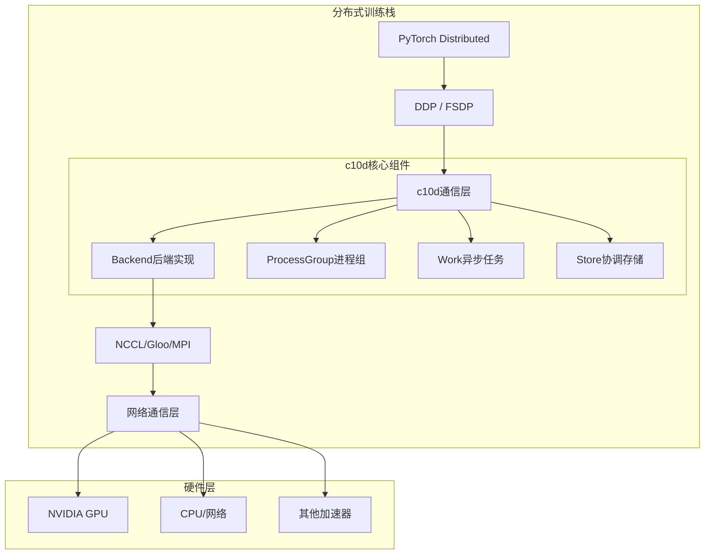
```mermaid
flowchart TD
    subgraph "分布式训练栈"
        A[PyTorch Distributed] --> B[DDP / FSDP]
        B --> C[c10d通信层]

        subgraph "c10d核心组件"
            C --> D[Backend后端实现]
            C --> E[ProcessGroup进程组]
            C --> F[Work异步任务]
            C --> G[Store协调存储]
        end

        D --> H[NCCL/Gloo/MPI]
        H --> I[网络通信层]
    end

    subgraph "硬件层"
        I --> J[NVIDIA GPU]
        I --> K[CPU/网络]
        I --> L[其他加速器]
    end
```

### 1.4 核心文件位置

| 组件 | 文件路径 | 描述 |
|------|----------|------|
| Backend | `torch/csrc/distributed/c10d/Backend.hpp` | 后端抽象基类 |
| Store | `torch/csrc/distributed/c10d/Store.hpp` | 键值存储接口 |
| Types | `torch/csrc/distributed/c10d/Types.hpp` | 数据结构和选项 |
| Work | `torch/csrc/distributed/c10d/Work.hpp` | 异步操作表示 |
| ProcessGroupNCCL | `torch/csrc/distributed/c10d/ProcessGroupNCCL.hpp` | NCCL后端 |
| ProcessGroupGloo | `torch/csrc/distributed/c10d/ProcessGroupGloo.hpp` | Gloo后端 |
| Python API | `torch/distributed/distributed_c10d.py` | Python接口 |

---

## 2. 核心组件详解

### 2.1 整体架构

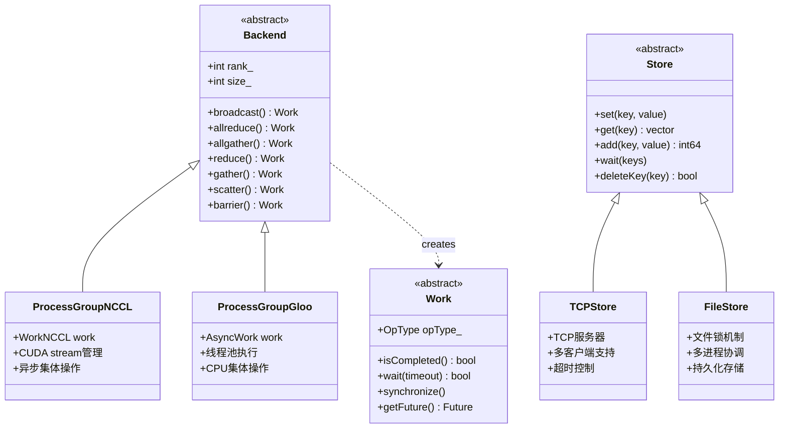
```mermaid
classDiagram
    class Backend {
        <<abstract>>
        +int rank_
        +int size_
        +broadcast() Work
        +allreduce() Work
        +allgather() Work
        +reduce() Work
        +gather() Work
        +scatter() Work
        +barrier() Work
    }

    class Store {
        <<abstract>>
        +set(key, value)
        +get(key) vector
        +add(key, value) int64
        +wait(keys)
        +deleteKey(key) bool
    }

    class Work {
        <<abstract>>
        +isCompleted() bool
        +wait(timeout) bool
        +synchronize()
        +getFuture() Future
        +OpType opType_
    }

    class ProcessGroupNCCL {
        +WorkNCCL work
        +CUDA stream管理
        +异步集体操作
    }

    class ProcessGroupGloo {
        +AsyncWork work
        +线程池执行
        +CPU集体操作
    }

    class TCPStore {
        +TCP服务器
        +多客户端支持
        +超时控制
    }

    class FileStore {
        +文件锁机制
        +多进程协调
        +持久化存储
    }

    Backend <|-- ProcessGroupNCCL
    Backend <|-- ProcessGroupGloo
    Store <|-- TCPStore
    Store <|-- FileStore
    Backend ..> Work : creates
```

### 2.2 组件交互流程

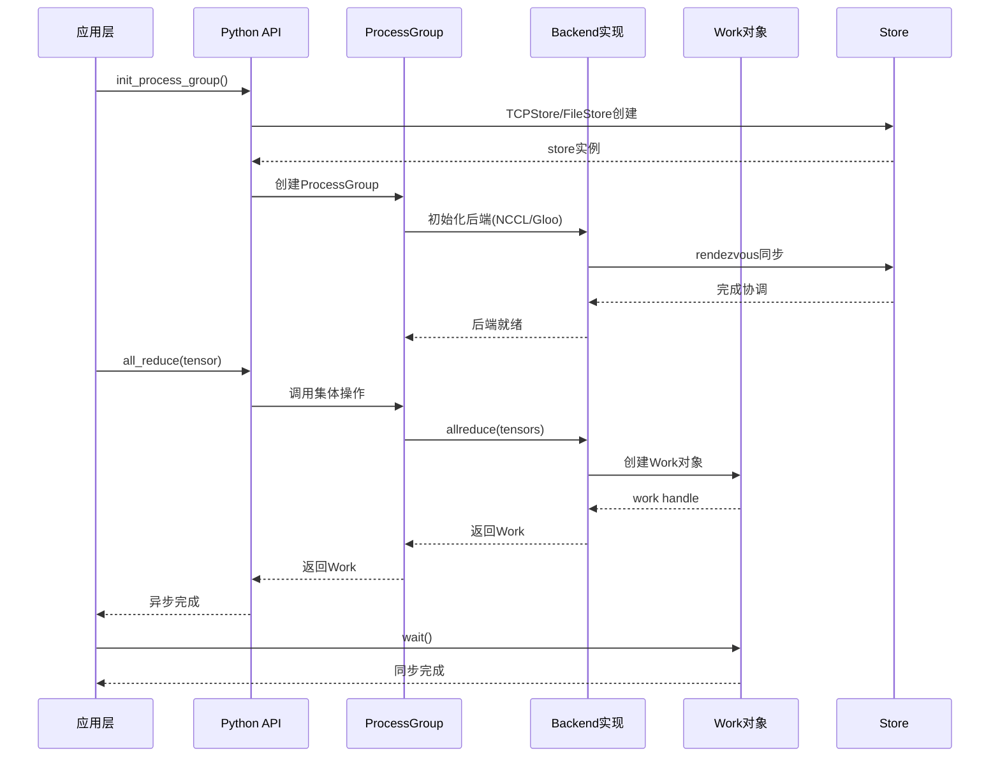
```mermaid
sequenceDiagram
    participant App as 应用层
    participant Python as Python API
    participant PG as ProcessGroup
    participant Backend as Backend实现
    participant Work as Work对象
    participant Store as Store

    App->>Python: init_process_group()
    Python->>Store: TCPStore/FileStore创建
    Store-->>Python: store实例
    Python->>PG: 创建ProcessGroup
    PG->>Backend: 初始化后端(NCCL/Gloo)
    Backend->>Store: rendezvous同步
    Store-->>Backend: 完成协调
    Backend-->>PG: 后端就绪

    App->>Python: all_reduce(tensor)
    Python->>PG: 调用集体操作
    PG->>Backend: allreduce(tensors)
    Backend->>Work: 创建Work对象
    Work-->>Backend: work handle
    Backend-->>PG: 返回Work
    PG-->>Python: 返回Work
    Python-->>App: 异步完成

    App->>Work: wait()
    Work-->>App: 同步完成
```

---

## 3. Store机制与进程协调

### 3.1 Store架构

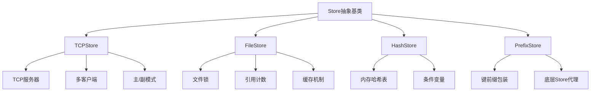
```mermaid
flowchart TD
    A[Store抽象基类] --> B[TCPStore]
    A --> C[FileStore]
    A --> D[HashStore]
    A --> E[PrefixStore]

    B --> B1[TCP服务器]
    B --> B2[多客户端]
    B --> B3[主/副模式]

    C --> C1[文件锁]
    C --> C2[引用计数]
    C --> C3[缓存机制]

    D --> D1[内存哈希表]
    D --> D2[条件变量]

    E --> E1[键前缀包装]
    E --> E2[底层Store代理]
```

### 3.2 TCPStore实现

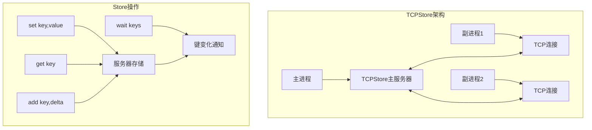
```mermaid
flowchart TD
    subgraph "TCPStore架构"
        A[主进程] --> B[TCPStore主服务器]
        C[副进程1] --> D[TCPStore客户端]
        E[副进程2] --> F[TCPStore客户端]

        B <---> D[TCP连接]
        B <---> F[TCP连接]
    end

    subgraph "Store操作"
        G[set key,value] --> H[服务器存储]
        I[get key] --> H
        J[add key,delta] --> H
        K[wait keys] --> L[条件变量等待]
        H --> L[键变化通知]
    end
```

### 3.3 Store用于Rendezvous

```python
# 初始化时的Rendezvous过程
def init_process_group(backend, init_method, world_size, rank):
    # 1. 创建Store连接到协调点
    store = _create_store_from_options(init_method)

    # 2. 存储本进程信息
    store.set(f"rank_{rank}", encode_address(local_addr))

    # 3. 等待所有进程加入
    store.wait([f"rank_{i}" for i in range(world_size)])

    # 4. 获取所有进程地址
    addresses = [store.get(f"rank_{i}") for i in range(world_size)]

    # 5. 创建ProcessGroup
    pg = ProcessGroup(store, rank, world_size, backend)
    return pg
```

### 3.4 PrefixStore装饰器

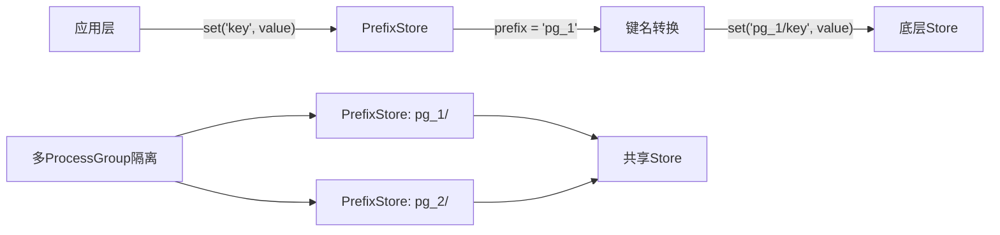
```mermaid
flowchart LR
    A[应用层] -->|"set('key', value)"| B[PrefixStore]
    B -->|"prefix = 'pg_1'"| C[键名转换]
    C -->|"set('pg_1/key', value)"| D[底层Store]

    E[多ProcessGroup隔离] --> F[PrefixStore: pg_1/]
    E --> G[PrefixStore: pg_2/]
    F --> H[共享Store]
    G --> H
```

---

## 4. Backend抽象与实现

### 4.1 Backend基类设计

```cpp
class Backend : public torch::CustomClassHolder {
 public:
  // 进程标识
  int rank_;   // 当前进程在组中的rank
  int size_;   // 进程组大小

  // 集体操作接口
  virtual c10::intrusive_ptr<Work> broadcast(
      std::vector<at::Tensor>& tensors,
      const BroadcastOptions& opts) = 0;

  virtual c10::intrusive_ptr<Work> allreduce(
      std::vector<at::Tensor>& tensors,
      const AllreduceOptions& opts) = 0;

  virtual c10::intrusive_ptr<Work> allgather(
      std::vector<std::vector<at::Tensor>>& outputs,
      std::vector<at::Tensor>& inputs,
      const AllgatherOptions& opts) = 0;

  virtual c10::intrusive_ptr<Work> reduce(
      std::vector<at::Tensor>& tensors,
      const ReduceOptions& opts) = 0;

  virtual c10::intrusive_ptr<Work> gather(
      std::vector<std::vector<at::Tensor>>& outputs,
      std::vector<at::Tensor>& inputs,
      const GatherOptions& opts) = 0;

  virtual c10::intrusive_ptr<Work> scatter(
      std::vector<at::Tensor>& outputs,
      std::vector<std::vector<at::Tensor>>& inputs,
      const ScatterOptions& opts) = 0;

  virtual c10::intrusive_ptr<Work> barrier(
      const BarrierOptions& opts) = 0;

  // P2P操作
  virtual c10::intrusive_ptr<Work> send(
      std::vector<at::Tensor>& tensors, int dstRank, int tag) = 0;

  virtual c10::intrusive_ptr<Work> recv(
      std::vector<at::Tensor>& tensors, int srcRank, int tag) = 0;
};
```

### 4.2 ReduceOp定义

```cpp
struct ReduceOp {
  enum RedOpType : uint8_t {
    SUM = 0,        // 求和
    AVG = 1,        // 平均
    PRODUCT = 2,    // 乘积
    MIN = 3,        // 最小值
    MAX = 4,        // 最大值
    BAND = 5,       // 按位与
    BOR = 6,        // 按位或
    BXOR = 7,       // 按位异或
    PREMUL_SUM = 8, // 预乘求和
  };
  RedOpType op_ = SUM;
};
```

### 4.3 操作选项结构

```cpp
struct AllreduceOptions {
  ReduceOp reduceOp = ReduceOp::SUM;  // 归约操作类型
  std::chrono::milliseconds timeout = kNoTimeout;  // 超时设置
};

struct BroadcastOptions {
  int rootRank = 0;  // 根进程rank
  std::chrono::milliseconds timeout = kNoTimeout;
};

struct AllgatherOptions {
  std::chrono::milliseconds timeout = kNoTimeout;
};

struct ReduceOptions {
  ReduceOp reduceOp = ReduceOp::SUM;
  int rootRank = 0;  // 目标rank
  std::chrono::milliseconds timeout = kNoTimeout;
};

struct GatherOptions {
  int rootRank = 0;
  std::chrono::milliseconds timeout = kNoTimeout;
};

struct ScatterOptions {
  int rootRank = 0;
  std::chrono::milliseconds timeout = kNoTimeout;
};

struct BarrierOptions {
  std::chrono::milliseconds timeout = kNoTimeout;
};
```

---

## 5. ProcessGroup进程组管理

### 5.1 进程组层次结构

```mermaid
flowchart TD
    subgraph "全局进程组"
        A[World Group<br/>world_size=4] --> B[Rank 0]
        A --> C[Rank 1]
        A --> D[Rank 2]
        A --> E[Rank 3]
    end

    subgraph "子进程组"
        F[Subgroup 1<br/>ranks=[0,1]] --> B
        F --> C
        G[Subgroup 2<br/>ranks=[2,3]] --> D
        G --> E
    end

    subgraph "进程组映射"
        H[_pg_map] --> I[默认PG: ProcessGroupNCCL]
        H --> J[subgroup1: ProcessGroupGloo]
        H --> K[subgroup2: ProcessGroupNCCL]
    end
```

### 5.2 创建子进程组

```mermaid
flowchart TD
    A[调用new_group<br/>ranks=[0,1,2]] --> B{rank是否在列表中}

    B -->|是| C[创建新的Store]
    B -->|否| D[创建无效组
GroupMember.NON_GROUP_MEMBER]

    C --> E[通过PrefixStore隔离]
    E --> F[创建新Backend]
    F --> G[rendezvous同步]
    G --> H[返回ProcessGroup]

    D --> I[返回None]
```

### 5.3 进程组生命周期

```cpp
// Python API: init_process_group
void init_process_group(
    const std::string& backend,
    const std::string& init_method,
    int world_size,
    int rank,
    ...
) {
    // 1. 创建Store
    store = createStore(init_method);

    // 2. 创建默认ProcessGroup
    default_pg = createProcessGroup(store, backend, rank, world_size);

    // 3. 注册到全局映射
    _pg_map[GroupMember.WORLD] = default_pg;
    _pg_names[default_pg] = "default_pg";
}

// 创建子组
ProcessGroup* new_group(std::vector<int> ranks, ...) {
    // 1. 检查当前rank是否在ranks中
    if (std::find(ranks.begin(), ranks.end(), get_rank()) == ranks.end()) {
        return GroupMember.NON_GROUP_MEMBER;
    }

    // 2. 创建PrefixStore隔离键空间
    prefix_store = new PrefixStore(group_name, default_store);

    // 3. 在子组内重新计算rank
    sub_rank = index_of(ranks, get_rank());
    sub_size = ranks.size();

    // 4. 创建新的ProcessGroup
    pg = createProcessGroup(prefix_store, backend, sub_rank, sub_size);

    // 5. 注册到全局映射
    _pg_map[group_name] = pg;
    return pg;
}
```

---

## 6. Work异步操作机制

### 6.1 Work类设计

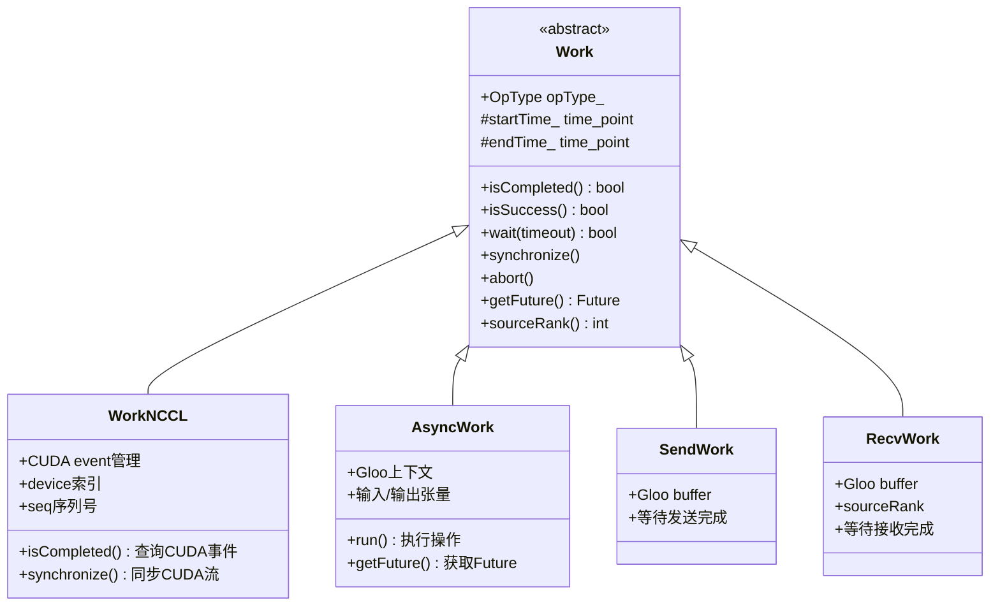
```mermaid
classDiagram
    class Work {
        <<abstract>>
        +isCompleted() bool
        +isSuccess() bool
        +wait(timeout) bool
        +synchronize()
        +abort()
        +getFuture() Future
        +sourceRank() int
        +OpType opType_
        #startTime_ time_point
        #endTime_ time_point
    }

    class WorkNCCL {
        +CUDA event管理
        +device索引
        +seq序列号
        +isCompleted() 查询CUDA事件
        +synchronize() 同步CUDA流
    }

    class AsyncWork {
        +Gloo上下文
        +输入/输出张量
        +run() 执行操作
        +getFuture() 获取Future
    }

    class SendWork {
        +Gloo buffer
        +等待发送完成
    }

    class RecvWork {
        +Gloo buffer
        +sourceRank
        +等待接收完成
    }

    Work <|-- WorkNCCL
    Work <|-- AsyncWork
    Work <|-- SendWork
    Work <|-- RecvWork
```

### 6.2 Work状态流转

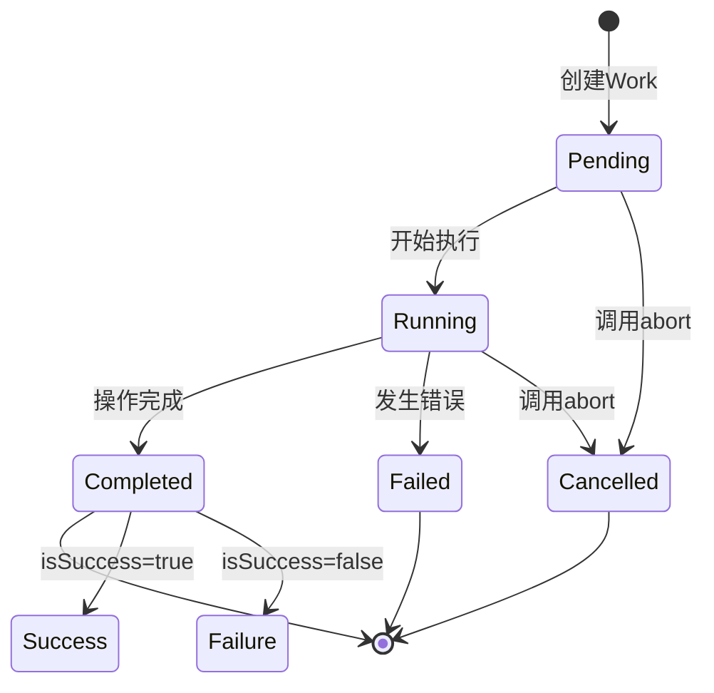
```mermaid
stateDiagram-v2
    [*] --> Pending: 创建Work
    Pending --> Running: 开始执行
    Running --> Completed: 操作完成
    Running --> Failed: 发生错误
    Pending --> Cancelled: 调用abort
    Running --> Cancelled: 调用abort
    Completed --> [*]
    Failed --> [*]
    Cancelled --> [*]

    Completed --> Success: isSuccess=true
    Completed --> Failure: isSuccess=false
```

### 6.3 异步操作等待机制

```cpp
// Work.wait() - 阻塞等待操作完成
bool Work::wait(std::chrono::milliseconds timeout) {
    // 1. 记录开始时间
    auto start = std::chrono::steady_clock::now();

    // 2. 循环检查完成状态
    while (!isCompleted()) {
        // 检查超时
        auto elapsed = std::chrono::steady_clock::now() - start;
        if (timeout != kNoTimeout && elapsed > timeout) {
            throw std::runtime_error("Wait timeout");
        }

        // 短暂休眠避免忙等待
        std::this_thread::sleep_for(std::chrono::milliseconds(1));
    }

    // 3. 同步设备状态
    synchronize();

    // 4. 检查是否成功
    return isSuccess();
}

// NCCL同步 - 等待CUDA流完成
void WorkNCCL::synchronize() {
    // 等待关联的CUDA事件完成
    for (auto& event : cudaEvents_) {
        event.block(currentStream);
    }
}

// Gloo同步 - 等待后台线程
void AsyncWork::synchronize() {
    // 已经在runLoop中完成，无需额外同步
}
```

### 6.4 Future集成

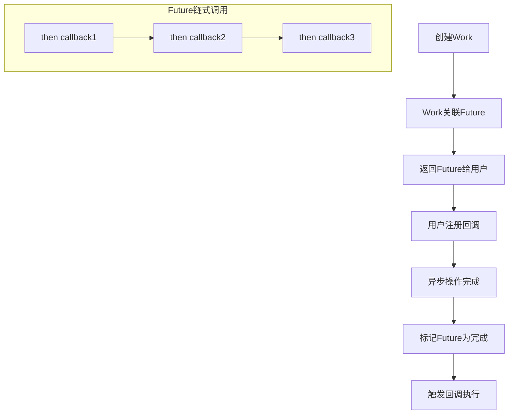
```mermaid
flowchart TD
    A[创建Work] --> B[Work关联Future]
    B --> C[返回Future给用户]
    C --> D[用户注册回调]
    D --> E[异步操作完成]
    E --> F[标记Future为完成]
    F --> G[触发回调执行]

    subgraph "Future链式调用"
        H[then callback1] --> I[then callback2]
        I --> J[then callback3]
    end
```

---

## 7. 集体通信操作

### 7.1 AllReduce操作

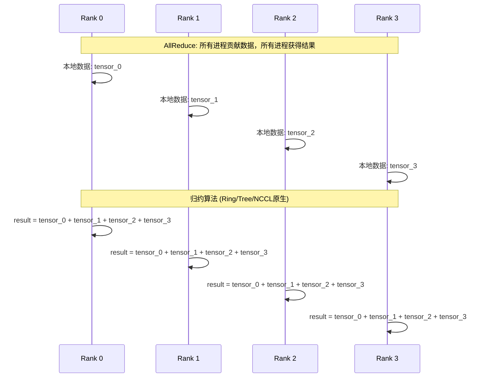
```mermaid
sequenceDiagram
    participant R0 as Rank 0
    participant R1 as Rank 1
    participant R2 as Rank 2
    participant R3 as Rank 3

    Note over R0,R3: AllReduce: 所有进程贡献数据，所有进程获得结果

    R0->>R0: 本地数据: tensor_0
    R1->>R1: 本地数据: tensor_1
    R2->>R2: 本地数据: tensor_2
    R3->>R3: 本地数据: tensor_3

    Note over R0,R3: 归约算法 (Ring/Tree/NCCL原生)

    R0->>R0: result = tensor_0 + tensor_1 + tensor_2 + tensor_3
    R1->>R1: result = tensor_0 + tensor_1 + tensor_2 + tensor_3
    R2->>R2: result = tensor_0 + tensor_1 + tensor_2 + tensor_3
    R3->>R3: result = tensor_0 + tensor_1 + tensor_2 + tensor_3
```

### 7.2 Broadcast操作

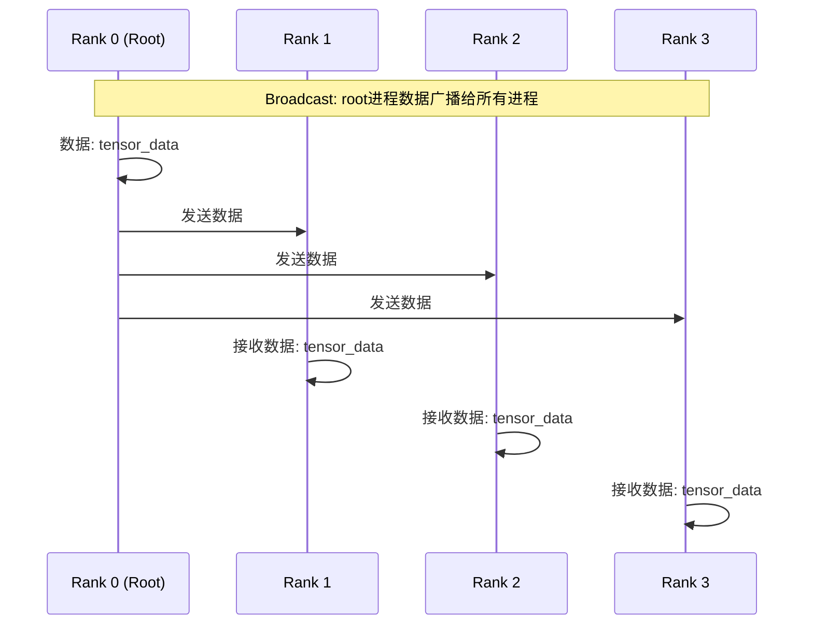
```mermaid
sequenceDiagram
    participant Root as Rank 0 (Root)
    participant R1 as Rank 1
    participant R2 as Rank 2
    participant R3 as Rank 3

    Note over Root,R3: Broadcast: root进程数据广播给所有进程

    Root->>Root: 数据: tensor_data

    Root->>R1: 发送数据
    Root->>R2: 发送数据
    Root->>R3: 发送数据

    R1->>R1: 接收数据: tensor_data
    R2->>R2: 接收数据: tensor_data
    R3->>R3: 接收数据: tensor_data
```

### 7.3 AllGather操作

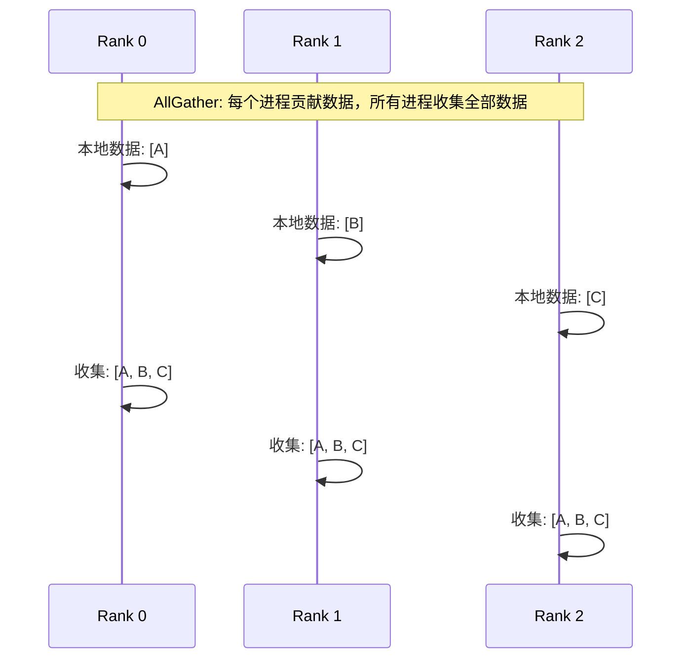
```mermaid
sequenceDiagram
    participant R0 as Rank 0
    participant R1 as Rank 1
    participant R2 as Rank 2

    Note over R0,R2: AllGather: 每个进程贡献数据，所有进程收集全部数据

    R0->>R0: 本地数据: [A]
    R1->>R1: 本地数据: [B]
    R2->>R2: 本地数据: [C]

    R0->>R0: 收集: [A, B, C]
    R1->>R1: 收集: [A, B, C]
    R2->>R2: 收集: [A, B, C]
```

### 7.4 ReduceScatter操作

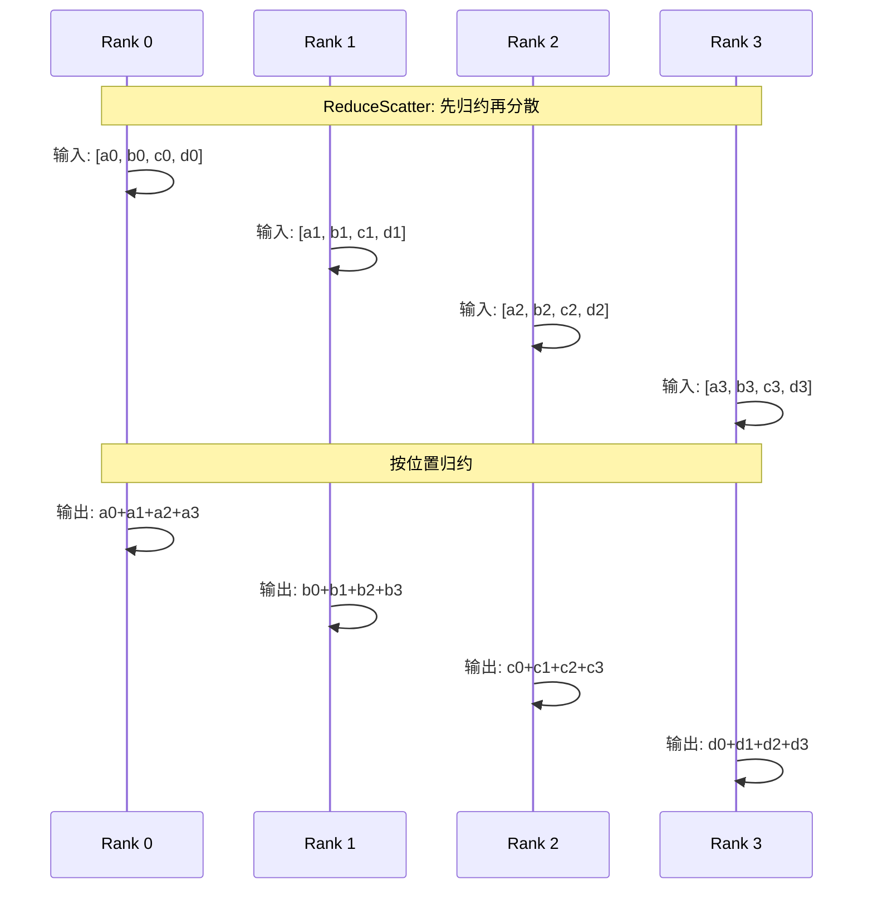
```mermaid
sequenceDiagram
    participant R0 as Rank 0
    participant R1 as Rank 1
    participant R2 as Rank 2
    participant R3 as Rank 3

    Note over R0,R3: ReduceScatter: 先归约再分散

    R0->>R0: 输入: [a0, b0, c0, d0]
    R1->>R1: 输入: [a1, b1, c1, d1]
    R2->>R2: 输入: [a2, b2, c2, d2]
    R3->>R3: 输入: [a3, b3, c3, d3]

    Note over R0,R3: 按位置归约

    R0->>R0: 输出: a0+a1+a2+a3
    R1->>R1: 输出: b0+b1+b2+b3
    R2->>R2: 输出: c0+c1+c2+c3
    R3->>R3: 输出: d0+d1+d2+d3
```

### 7.5 P2P通信 (Send/Recv)

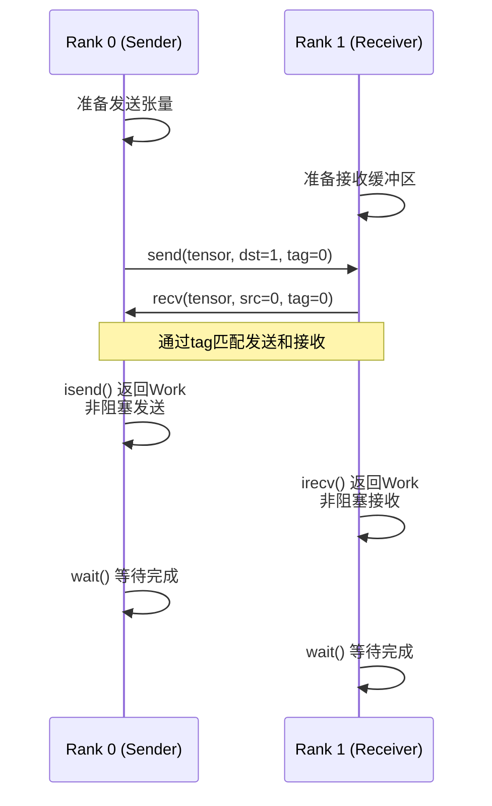
```mermaid
sequenceDiagram
    participant S as Rank 0 (Sender)
    participant R as Rank 1 (Receiver)

    S->>S: 准备发送张量
    R->>R: 准备接收缓冲区

    S->>R: send(tensor, dst=1, tag=0)
    R->>S: recv(tensor, src=0, tag=0)

    Note over S,R: 通过tag匹配发送和接收

    S->>S: isend() 返回Work<br/>非阻塞发送
    R->>R: irecv() 返回Work<br/>非阻塞接收

    S->>S: wait() 等待完成
    R->>R: wait() 等待完成
```

---

## 8. NCCL后端详解

### 8.1 NCCL架构

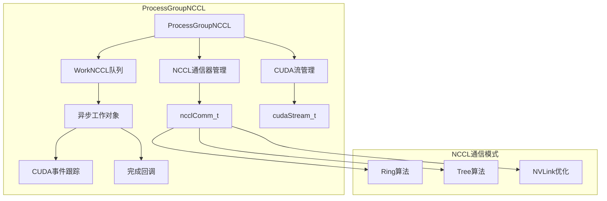
```mermaid
flowchart TD
    subgraph "ProcessGroupNCCL"
        A[ProcessGroupNCCL] --> B[NCCL通信器管理]
        A --> C[WorkNCCL队列]
        A --> D[CUDA流管理]

        B --> E[ncclComm_t]
        C --> F[异步工作对象]
        D --> G[cudaStream_t]

        F --> H[CUDA事件跟踪]
        F --> I[完成回调]
    end

    subgraph "NCCL通信模式"
        E --> J[Ring算法]
        E --> K[Tree算法]
        E --> L[NVLink优化]
    end
```

### 8.2 NCCL通信器初始化

```cpp
class ProcessGroupNCCL : public Backend {
 public:
  // NCCL特定Work实现
  struct WorkNCCL : public Work {
    // 设备索引
    std::vector<int> deviceIndices_;

    // NCCL通信器
    std::vector<ncclComm_t> ncclComms_;

    // CUDA事件 (用于跟踪完成状态)
    std::vector<at::cuda::CUDAEvent> ncclEvents_;
    std::vector<at::cuda::CUDAEvent> workEvents_;

    // 序列号
    uint64_t seq_{0};

    // 异步操作完成检测
    bool isCompleted() override {
      // 查询CUDA事件状态
      return cudaEventQuery(workEvents_[0]) == cudaSuccess;
    }

    // 同步CUDA流
    void synchronize() override {
      for (auto& event : workEvents_) {
        event.block(currentStream);
      }
    }
  };

 private:
  // 每个设备的NCCL通信器
  std::unordered_map<int, ncclComm_t> ncclCommStore_;

  // CUDA流 (每个设备一个)
  std::unordered_map<int, at::cuda::CUDAStream> streamStore_;

  // Work队列 (用于跟踪未完成操作)
  std::deque<c10::intrusive_ptr<WorkNCCL>> workQueue_;

  // 序列号生成器
  uint64_t seq_{0};
};
```

### 8.3 NCCL AllReduce执行流程

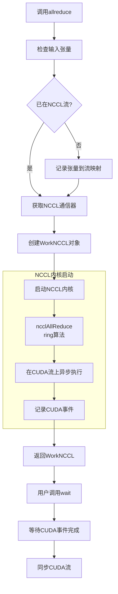
```mermaid
flowchart TD
    A[调用allreduce] --> B[检查输入张量]
    B --> C{已在NCCL流?}
    C -->|否| D[记录张量到流映射]
    C -->|是| E[获取NCCL通信器]

    D --> E
    E --> F[创建WorkNCCL对象]
    F --> G[启动NCCL内核]

    subgraph "NCCL内核启动"
        G --> H[ncclAllReduce
ring算法]
        H --> I[在CUDA流上异步执行]
        I --> J[记录CUDA事件]
    end

    J --> K[返回WorkNCCL]
    K --> L[用户调用wait]
    L --> M[等待CUDA事件完成]
    M --> N[同步CUDA流]
```

### 8.4 NCCL错误处理

```cpp
enum class ErrorHandlingMode {
  kNoHandling = 0,      // 不处理，直接崩溃
  kTearDown = 1,        // 关闭ProcessGroup
  kCleanUpOnly = 2,     // 清理资源但不关闭
  kSkipCleanUp = 3,     // 跳过清理
};

class ProcessGroupNCCL {
  // 错误检测
  bool ncclActive_ = false;
  std::atomic<bool> abortInProgress_{false};

  // 错误处理
  void ncclErrorHandler(ncclResult_t result, const char* msg) {
    if (result != ncclSuccess) {
      switch (errorHandlingMode_) {
        case ErrorHandlingMode::kTearDown:
          tearDownProcessGroup();
          break;
        case ErrorHandlingMode::kCleanUpOnly:
          cleanUpResources();
          break;
        case ErrorHandlingMode::kSkipCleanUp:
          // 跳过清理
          break;
      }
      throw std::runtime_error(msg);
    }
  }

  // 超时检测
  bool checkTimeout(WorkNCCL& work) {
    auto elapsed = std::chrono::steady_clock::now() - work.startTime_;
    return elapsed > work.timeout_;
  }
};
```

### 8.5 NCCL通信合并

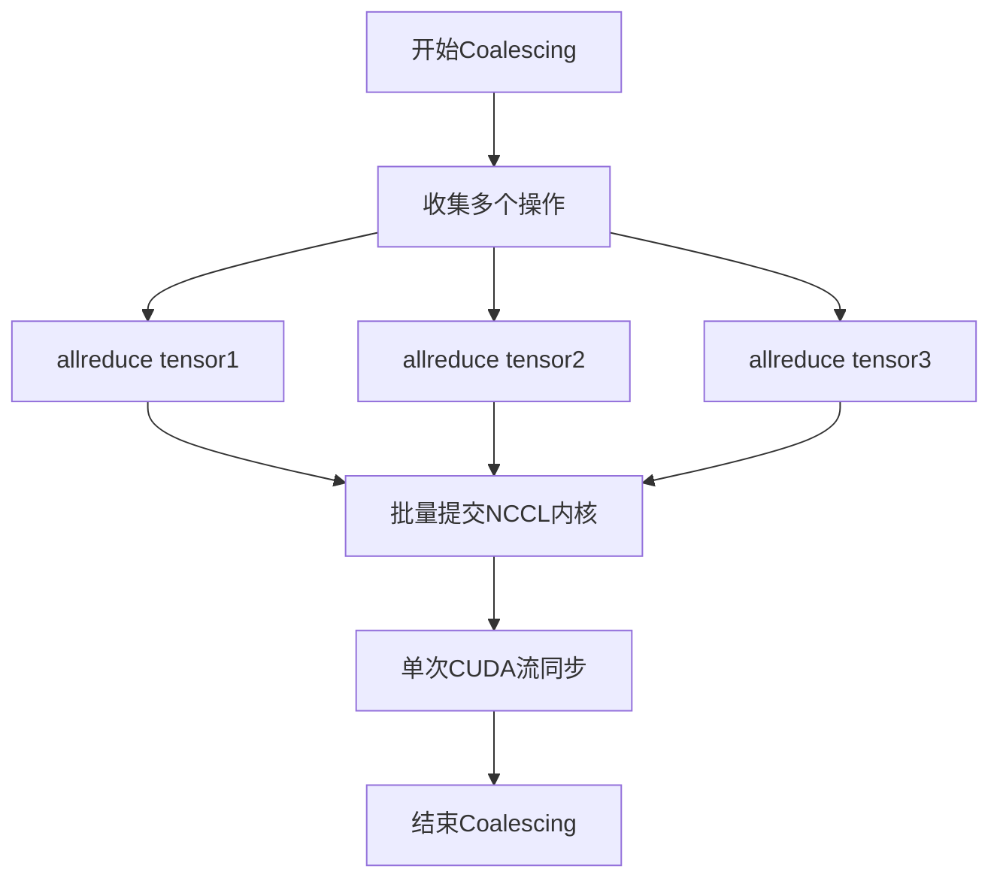
```mermaid
flowchart TD
    A[开始Coalescing] --> B[收集多个操作]
    B --> C[allreduce tensor1]
    B --> D[allreduce tensor2]
    B --> E[allreduce tensor3]

    C --> F[批量提交NCCL内核]
    D --> F
    E --> F

    F --> G[单次CUDA流同步]
    G --> H[结束Coalescing]
```

---

## 9. Gloo后端详解

### 9.1 Gloo架构

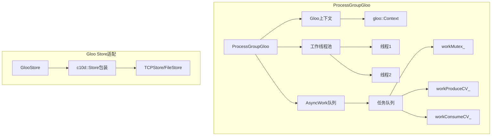
```mermaid
flowchart TD
    subgraph "ProcessGroupGloo"
        A[ProcessGroupGloo] --> B[Gloo上下文]
        A --> C[工作线程池]
        A --> D[AsyncWork队列]

        B --> E[gloo::Context]
        C --> F[线程1]
        C --> G[线程2]
        D --> H[任务队列]

        H --> I[workMutex_]
        H --> J[workProduceCV_]
        H --> K[workConsumeCV_]
    end

    subgraph "Gloo Store适配"
        L[GlooStore] --> M[c10d::Store包装]
        M --> N[TCPStore/FileStore]
    end
```

### 9.2 AsyncWork设计

```cpp
class ProcessGroupGloo : public Backend {
 public:
  // Gloo异步工作基类
  class AsyncWork : public Work {
   public:
    // Gloo上下文
    std::shared_ptr<gloo::Context> context_;

    // 执行阶段
    virtual void run() = 0;  // 在后台线程执行

    // 结果获取
    std::vector<at::Tensor> result() override;
    c10::intrusive_ptr<c10::ivalue::Future> getFuture() override;

    // 输入输出访问
    virtual const std::vector<at::Tensor> getInputTensors() = 0;
    virtual const std::vector<at::Tensor> getOutputTensors() = 0;

   protected:
    std::vector<std::vector<at::Tensor>> outputTensors_;
    c10::intrusive_ptr<at::ivalue::Future> future_;
    uint64_t seq_;
    at::ThreadLocalState tls_;
  };

  // 具体工作实现示例
  class AllreduceWork : public AsyncWork {
    void run() override {
      // 1. 准备输入
      auto& tensor = inputTensors_[0];

      // 2. 创建Gloo算法
      auto algorithm = std::make_unique<gloo::AllreduceHalvingDoubling<
          at::Tensor, gloo::ReduceOperator<at::Tensor>>>(
          context_,
          std::vector<at::Tensor>{tensor},
          getReduceOp(reduceOp_));

      // 3. 执行集体操作
      algorithm->run();

      // 4. 标记完成
      finishWorkGloo();
    }
  };

 private:
  // 工作线程管理
  std::vector<std::thread> threads_;
  bool stop_{false};
  std::deque<c10::intrusive_ptr<AsyncWork>> workQueue_;
  std::vector<c10::intrusive_ptr<AsyncWork>> workInProgress_;
  std::mutex workMutex_;
  std::condition_variable workProduceCV_;
  std::condition_variable workConsumeCV_;

  // 集体操作计数器 (用于匹配)
  uint32_t collectiveCounter_{0};

  void runLoop(int workerIndex) {
    while (!stop_) {
      std::unique_lock<std::mutex> lock(workMutex_);

      // 等待任务
      workConsumeCV_.wait(lock, [&] {
        return !workQueue_.empty() || stop_;
      });

      if (stop_) break;

      // 获取任务
      auto work = std::move(workQueue_.front());
      workQueue_.pop_front();
      workInProgress_.push_back(work);

      lock.unlock();
      workProduceCV_.notify_one();

      // 执行任务
      AsyncWork::execute(work);
    }
  }
};
```

### 9.3 Gloo工作线程执行流程

```mermaid
flowchart TD
    A[主线程调用allreduce] --> B[创建AllreduceWork]
    B --> C[enqueue到队列]
    C --> D[唤醒工作线程]
    D --> E[返回Work对象]

    E --> F[主线程继续执行]

    subgraph "工作线程"
        G[runLoop] --> H[从队列获取Work]
        H --> I[调用AsyncWork::execute]
        I --> J[执行run方法]
        J --> K[执行Gloo算法]
        K --> L[标记Future完成]
    end

    F --> M[需要结果时调用wait]
    M --> N[等待Future完成]
    L --> N
```

### 9.4 Gloo设备创建

```cpp
class ProcessGroupGloo {
  // 创建Gloo传输设备
  static std::shared_ptr<::gloo::transport::Device> createDeviceForInterface(
      const std::string& interface,
      bool lazyInit = false) {
    // 1. 解析网络接口
    struct ::ifaddrs* ifaddrs;
    getifaddrs(&ifaddrs);

    // 2. 查找匹配的接口
    for (auto* ifa = ifaddrs; ifa != nullptr; ifa = ifa->ifa_next) {
      if (interface == ifa->ifa_name) {
        // 3. 创建设备
        auto device = ::gloo::transport::tcp::CreateDevice(
            ::gloo::transport::tcp::attr{
                .hostname = hostname,
                .iface = interface,
            });
        return device;
      }
    }
  }

  // 自动创建设备
  static std::shared_ptr<::gloo::transport::Device> createDefaultDevice(
      bool lazyInit = false) {
    // 1. 尝试解析hostname
    auto hostname = getHostname();

    // 2. 尝试绑定到hostname地址
    try {
      return createDeviceForHostname(hostname, lazyInit);
    } catch (...) {
      // 3. 失败则回退到loopback
      return createDeviceForHostname("localhost", lazyInit);
    }
  }
};
```

---

## 10. Python API层

### 10.1 Python与C++绑定

```mermaid
flowchart TD
    subgraph "Python层"
        A[torch.distributed] --> B[distributed_c10d.py]
        B --> C[init_process_group]
        B --> D[all_reduce]
        B --> E[其他API]
    end

    subgraph "C++绑定"
        F[torch._C._distributed_c10d] --> G[ProcessGroup]
        F --> H[Store]
        F --> I[Work]
        F --> J[ReduceOp]
    end

    subgraph "C++实现"
        K[Backend派生类] --> L[ProcessGroupNCCL]
        K --> M[ProcessGroupGloo]
        N[Store派生类] --> O[TCPStore]
        N --> P[FileStore]
    end

    C --> F
    F --> K
    F --> N
```

### 10.2 Python API使用模式

```python
import torch.distributed as dist

# 1. 初始化
# 方式1: 环境变量初始化
dist.init_process_group(
    backend='nccl',      # 或 'gloo', 'mpi'
    init_method='env://', # 从环境变量读取配置
    world_size=4,
    rank=0
)

# 方式2: TCP初始化
dist.init_process_group(
    backend='nccl',
    init_method='tcp://192.168.1.1:29500',
    world_size=4,
    rank=0
)

# 方式3: 文件初始化
dist.init_process_group(
    backend='gloo',
    init_method='file:///tmp/shared_file',
    world_size=4,
    rank=0
)

# 2. 集体通信
# AllReduce
tensor = torch.randn(10, 10).cuda()
dist.all_reduce(tensor, op=dist.ReduceOp.SUM)

# Broadcast (root进程广播)
if dist.get_rank() == 0:
    tensor = torch.randn(10, 10).cuda()
else:
    tensor = torch.empty(10, 10).cuda()
dist.broadcast(tensor, src=0)

# AllGather
gather_list = [torch.empty(10, 10).cuda() for _ in range(dist.get_world_size())]
tensor = torch.randn(10, 10).cuda()
dist.all_gather(gather_list, tensor)

# ReduceScatter
output = torch.empty(10, 10).cuda()
input_list = [torch.randn(10, 10).cuda() for _ in range(dist.get_world_size())]
dist.reduce_scatter(output, input_list, op=dist.ReduceOp.SUM)

# 3. P2P通信
# 发送
if dist.get_rank() == 0:
    tensor = torch.randn(10, 10).cuda()
    dist.send(tensor, dst=1)

# 接收
if dist.get_rank() == 1:
    tensor = torch.empty(10, 10).cuda()
    dist.recv(tensor, src=0)

# 异步P2P
if dist.get_rank() == 0:
    work = dist.isend(tensor, dst=1)
else:
    work = dist.irecv(tensor, src=0)
work.wait()  # 等待完成

# 4. 创建子组
ranks = [0, 1]
subgroup = dist.new_group(ranks=ranks)
if dist.get_rank() in ranks:
    dist.all_reduce(tensor, group=subgroup)

# 5. 清理
dist.destroy_process_group()
```

### 10.3 Backend类定义

```python
class Backend(str):
    """后端枚举类"""
    UNDEFINED = "undefined"
    GLOO = "gloo"
    NCCL = "nccl"
    UCC = "ucc"
    MPI = "mpi"
    XCCL = "xccl"
    FAKE = "fake"

    # 动态插件注册
    _plugins: dict[str, _BackendPlugin] = {}

    @classmethod
    def register_backend(cls, name, creator_fn, extended_api=False):
        """注册自定义后端"""
        cls._plugins[name] = cls._BackendPlugin(creator_fn, extended_api)
        cls.backend_list.append(name)

    def __call__(self, backend_str):
        """解析后端字符串"""
        backend_str = backend_str.lower()
        if backend_str not in self.backend_list:
            raise ValueError(f"Unknown backend: {backend_str}")
        return backend_str
```

### 10.4 进程组管理Python接口

```python
# 全局状态
_pg_map: dict[Any, ProcessGroup] = {}  # 进程组映射
_pg_names: dict[ProcessGroup, str] = {}  # 进程组名称
_default_pg: Optional[ProcessGroup] = None  # 默认进程组

# 获取当前进程信息
def get_rank(group=None) -> int:
    """获取当前进程在组中的rank"""
    if group is None:
        group = _default_pg
    return group.rank()

def get_world_size(group=None) -> int:
    """获取进程组大小"""
    if group is None:
        group = _default_pg
    return group.size()

# 创建子组
def new_group(ranks=None, timeout=None, backend=None):
    """创建新的进程组"""
    # 1. 检查当前rank是否在ranks中
    if ranks is not None and get_rank() not in ranks:
        return GroupMember.NON_GROUP_MEMBER

    # 2. 创建PrefixStore
    global _pg_counter
    group_name = f"group_{_pg_counter}"
    _pg_counter += 1
    prefix_store = PrefixStore(group_name, _default_store)

    # 3. 创建ProcessGroup
    pg = _create_process_group(
        prefix_store,
        backend or _default_backend,
        ranks.index(get_rank()) if ranks else get_rank(),
        len(ranks) if ranks else get_world_size(),
        timeout
    )

    # 4. 注册到全局映射
    _pg_map[group_name] = pg
    _pg_names[pg] = group_name

    return pg
```

### 10.5 异步操作与Future

```python
# 异步操作返回Work对象
work = dist.all_reduce(tensor, async_op=True)

# 查询完成状态
if work.is_completed():
    print("操作已完成")

# 等待完成
work.wait()  # 阻塞等待
work.wait(timeout=timedelta(seconds=10))  # 带超时

# 获取Future
future = work.get_future()

# 注册回调
future.then(lambda f: print(f"Result: {f.value()}"))

# 批量P2P操作
ops = []
for i in range(world_size):
    if i == rank:
        continue
    ops.append(dist.P2POp(dist.isend, tensor, i))
    ops.append(dist.P2POp(dist.irecv, recv_tensor, i))

works = dist.batch_isend_irecv(ops)
for work in works:
    work.wait()
```

---

## 11. 总结

### 11.1 c10d核心价值

1. **统一抽象**: Backend抽象层支持多种底层通信库(NCCL/Gloo/MPI)
2. **进程组管理**: 灵活的进程组创建和管理机制
3. **异步执行**: 所有操作异步执行，支持计算通信重叠
4. **容错能力**: 超时控制、错误检测和恢复机制
5. **性能优化**: 支持通信合并、批量操作和NVLink优化

### 11.2 关键设计决策

| 决策 | 理由 |
|------|------|
| Backend抽象 | 统一API支持多种后端，运行时选择 |
| Store协调 | 解耦进程发现和通信，支持多种协调方式 |
| Work对象 | 统一异步操作表示，支持等待和回调 |
| 线程池(Gloo) | CPU后端使用线程池执行集体操作 |
| CUDA流(NCCL) | GPU后端使用CUDA流实现异步执行 |
| PrefixStore | 通过键前缀隔离不同进程组的Store空间 |

### 11.3 使用建议

```python
# 1. GPU训练使用NCCL后端
dist.init_process_group(backend='nccl', ...)

# 2. CPU训练使用Gloo后端
dist.init_process_group(backend='gloo', ...)

# 3. 使用async_op重叠计算和通信
work = dist.all_reduce(tensor, async_op=True)
# ... 执行其他计算 ...
work.wait()

# 4. 使用通信合并减少启动开销
with dist._coalescing_manager():
    dist.all_reduce(tensor1)
    dist.all_reduce(tensor2)
    dist.all_reduce(tensor3)

# 5. 合理设置超时时间
dist.init_process_group(
    backend='nccl',
    timeout=timedelta(minutes=30)
)
```
