# PyTorch Dynamo (Python Frame Capture JIT) 深度分析

## 目录
1. [架构概览与设计目标](#1-架构概览与设计目标)
2. [核心组件详解](#2-核心组件详解)
3. [PEP 523 Frame Evaluation机制](#3-pep-523-frame-evaluation机制)
4. [字节码符号转换](#4-字节码符号转换)
5. [VariableTracker系统](#5-variabletracker系统)
6. [Source与Guard系统](#6-source与guard系统)
7. [Graph构建与OutputGraph](#7-graph构建与outputgraph)
8. [副作用处理](#8-副作用处理)
9. [代码生成](#9-代码生成)
10. [图断点与恢复执行](#10-图断点与恢复执行)
11. [后端编译器注册](#11-后端编译器注册)
12. [缓存与重编译机制](#12-缓存与重编译机制)

---

## 1. 架构概览与设计目标

### 1.1 什么是Dynamo

**TorchDynamo**是PyTorch 2.0引入的Python级JIT编译器，它通过符号执行Python字节码，将PyTorch操作序列提取到FX图中，然后通过可定制的后端（如Inductor）进行编译优化。

### 1.2 核心设计哲学

```
┌─────────────────────────────────────────────────────────────┐
│                    Dynamo 设计哲学                           │
├─────────────────────────────────────────────────────────────┤
│  1. Python优先: 直接处理Python字节码，支持所有Python特性    │
│  2. 按需编译: 仅捕获PyTorch操作，Python控制流原生执行        │
│  3. 安全回退: 无法追踪的代码自动触发Graph Break              │
│  4. 守卫缓存: 通过Guards检测输入变化，决定重编译或缓存命中   │
│  5. 后端无关: 通过统一后端接口支持多种编译器                │
└─────────────────────────────────────────────────────────────┘
```

### 1.3 编译流程概览

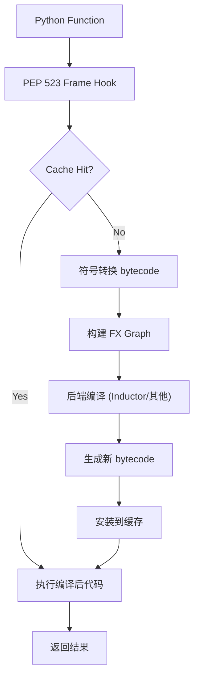

### 1.4 核心文件位置

| 组件 | 文件路径 | 描述 |
|------|----------|------|
| 入口点 | `torch/_dynamo/__init__.py` | 公共API与重置函数 |
| Frame Hook | `torch/_dynamo/eval_frame.py` | PEP 523帧评估钩子 |
| Frame转换 | `torch/_dynamo/convert_frame.py` | 帧转换主逻辑，错误处理 |
| 符号转换 | `torch/_dynamo/symbolic_convert.py` | 字节码符号执行核心 |
| 变量系统 | `torch/_dynamo/variables/` | VariableTracker实现 |
| Source系统 | `torch/_dynamo/source.py` | 值来源追踪 |
| Guard系统 | `torch/_dynamo/guards.py` | 守卫条件管理 |
| Graph输出 | `torch/_dynamo/output_graph.py` | FX图构建与管理 |
| 副作用 | `torch/_dynamo/side_effects.py` | 副作用追踪与重放 |
| 代码生成 | `torch/_dynamo/codegen.py` | Python字节码生成 |
| 后端注册 | `torch/_dynamo/backends/registry.py` | 编译器后端注册 |
| 恢复执行 | `torch/_dynamo/resume_execution.py` | Graph Break后恢复 |
| C++运行时 | `torch/csrc/dynamo/` | PEP 523钩子与Guard树 |

---

## 2. 核心组件详解

### 2.1 组件交互图

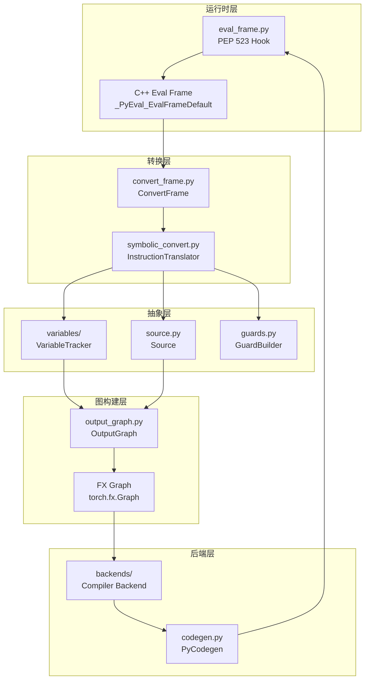

### 2.2 关键数据流

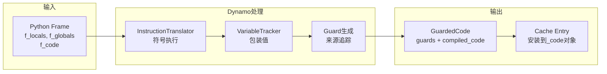

---

## 3. PEP 523 Frame Evaluation机制

### 3.1 PEP 523原理

PEP 523允许在CPython中注册自定义的帧评估函数，Dynamo利用这一点拦截Python函数的执行。

```cpp
// torch/csrc/dynamo/eval_frame.c
// 核心C代码：安装自定义帧评估函数

static PyObject* set_eval_frame(PyObject* callback) {
    // 设置线程本地回调
    // 当callback为函数时：完整Dynamo处理
    // 当callback为Py_False时：仅缓存查找
    // 当callback为None时：完全禁用Dynamo
}

// 自定义帧评估入口
dynamo__custom_eval_frame(PyThreadState* tstate,
                           _PyInterpreterFrame* frame,
                           int throw_flag) {
    // 1. 获取ExtraState（附加到code对象）
    // 2. 遍历CacheEntry链表进行guard检查
    // 3. 命中：执行compiled_code
    // 4. 未命中：调用Python回调进行编译
}
```

### 3.2 帧评估流程

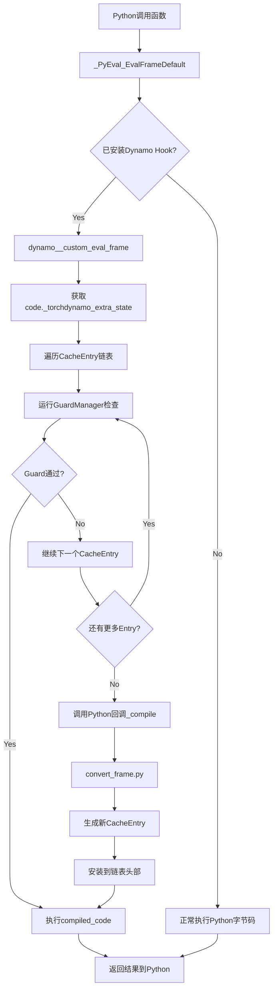

### 3.3 ExtraState与CacheEntry

```cpp
// ExtraState：附加到每个PyCodeObject
struct ExtraState {
    CacheEntry* cache_entry_list;  // LRU链表头
    FrameState* frame_state;       // 帧状态（动态形状等）
    PyObject* guard_manager_tree;  // Guard管理器树根
};

// CacheEntry：每个编译变体
struct CacheEntry {
    GuardManager* guard_manager;   // C++ Guard树（快速检查）
    PyObject* compiled_code;       // 编译后的代码对象
    PyObject* backend;             // 后端编译器
    CacheEntry* next;              // LRU链表下一项
};
```

### 3.4 C++ FrameLocalsMapping优化

**设计原理**：为了O(1)访问frame locals而不构建Python dict，Dynamo使用`FrameLocalsMapping`直接索引frame的`localsplus`数组。

```cpp
// torch/csrc/dynamo/framelocals_mapping.cpp

class FrameLocalsMapping {
    // 直接映射到frame->localsplus数组索引
    // 避免Python dict的构建开销

    PyObject* get_item(PyObject* name) {
        // O(1)直接索引
        int idx = name_to_idx[name];
        return frame->localsplus[idx];
    }
};
```

---

## 4. 字节码符号转换

### 4.1 InstructionTranslator架构

```python
# torch/_dynamo/symbolic_convert.py

class InstructionTranslatorBase:
    """字节码指令符号转换器基类

    核心职责：
    1. 逐条解释Python字节码指令
    2. 维护符号栈（symbolic stack）和符号本地变量
    3. 通过dispatch_table分发到具体处理器
    4. 处理控制流（循环、条件、异常）
    5. 管理推测执行（speculative execution）
    """

    def __init__(self, ...):
        self.stack: list[VariableTracker] = []  # 符号栈
        self.symbolic_locals: dict[str, VariableTracker] = {}  # 本地变量
        self.output: OutputGraph  # 图输出管理
        self.speculation_log: SpeculationLog  # 推测日志

    def run(self):
        """主执行循环"""
        while self.instruction_pointer is not None:
            inst = self.instructions[self.instruction_pointer]
            self.step(inst)

    def step(self, inst):
        """单步执行"""
        # 通过dispatch_table分发到具体处理器
        handler = self.dispatch_table[inst.opcode]
        handler(self, inst)
```

### 4.2 指令分发机制

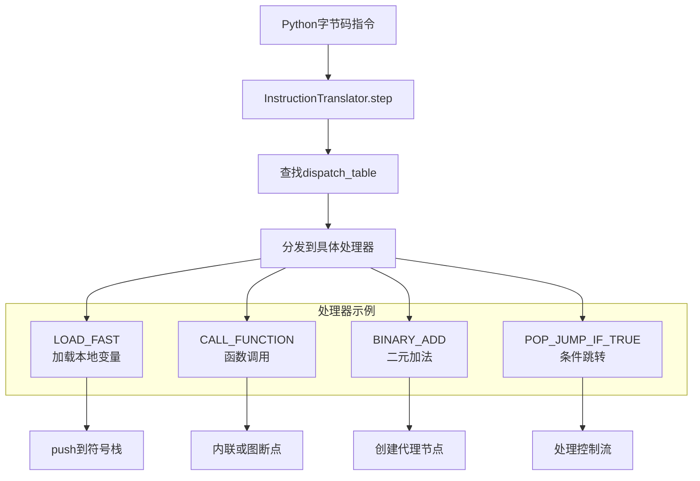

### 4.3 典型指令处理示例

```python
# LOAD_FAST处理器
def handle_load_fast(self, inst):
    """加载本地变量到栈"""
    name = inst.argval
    if name in self.symbolic_locals:
        self.push(self.symbolic_locals[name])
    else:
        # 未定义的变量处理
        unimplemented("undefined local")

# CALL_FUNCTION处理器
def handle_call_function(self, inst):
    """函数调用处理"""
    args = self.popn(inst.argval)  # 弹出参数
    fn = self.pop()  # 弹出函数

    # 尝试在Dynamo中内联执行
    result = fn.call_function(self, args, {})
    self.push(result)

# BINARY_ADD处理器
def handle_binary_add(self, inst):
    """二元加法处理"""
    left, right = self.popn(2)
    result = left.call_method(self, "__add__", [right], {})
    self.push(result)
```

### 4.4 推测执行与重启

**设计原理**：Dynamo支持推测执行——尝试执行某条分支，如果失败则重启分析并从另一条分支生成图断点。

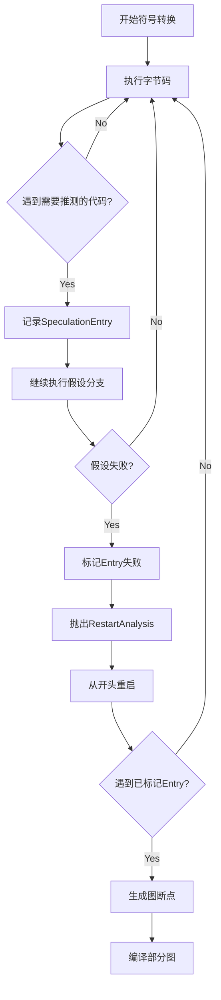

```python
@dataclass
class SpeculationEntry:
    """推测执行条目

    当Dynamo遇到需要推测的代码（如条件分支）时，
    创建SpeculationEntry记录该位置。

    如果推测失败（如遇到无法追踪的代码）：
    1. 标记_failed = True
    2. 抛出SpeculationRestartAnalysis
    3. 从开头重启分析
    4. 再次遇到此Entry时生成图断点
    """
    filename: str
    lineno: int
    instruction_pointer: int
    _failed: bool = False
    error_on_graph_break: bool | None = None
    reason: GraphCompileReason | None = None

    def fail_and_restart_analysis(self, error_on_graph_break: bool):
        self._failed = True
        raise exc.SpeculationRestartAnalysis(...)

    def failed(self, tx: InstructionTranslatorBase) -> bool:
        return self._failed
```

---

## 5. VariableTracker系统

### 5.1 VariableTracker层次结构

**设计原理**：Dynamo将所有Python值包装为VariableTracker对象，统一追踪值的来源、类型和可变性。

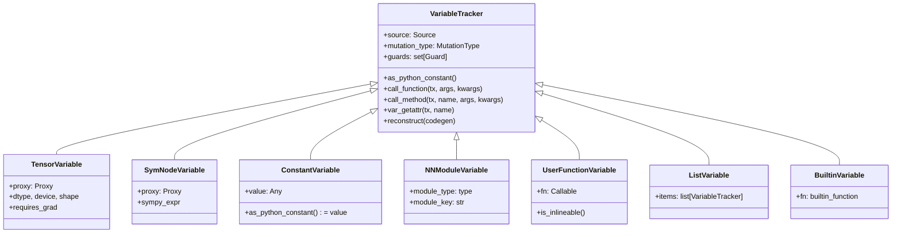

### 5.2 变量创建流程

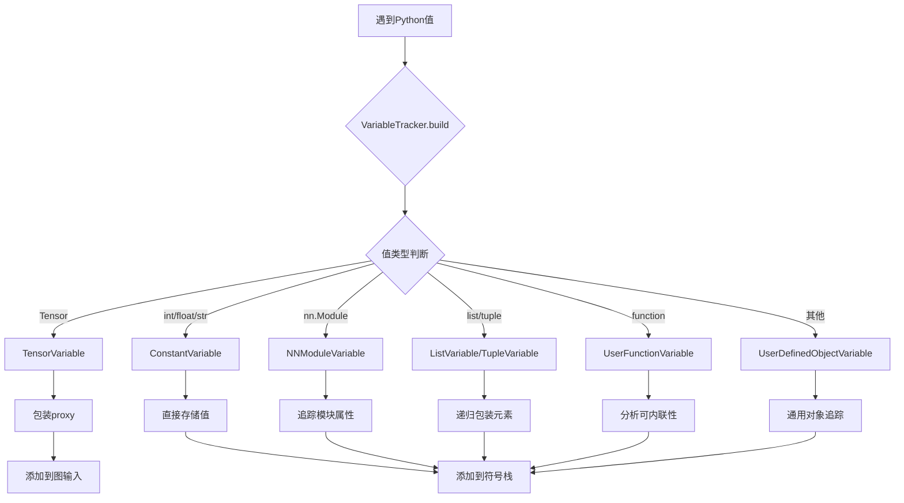

### 5.3 MutationType系统

**设计原理**：控制哪些修改被允许，防止跨作用域的非法修改。

```python
# VariableTracker的mutation_type字段控制可变性

class MutationType:
    """可变性类型

    scope: 表示创建作用域深度
    - 0: 已存在的外部值
    - 1: 当前级别新创建
    - >=2: Higher-Order Operator内部创建
    """
    scope: int

class ValueMutationNew(MutationType):
    """新创建的值（可变）"""
    scope: int = 1

class ValueMutationExisting(MutationType):
    """已存在的值（可变，需追踪修改）"""
    scope: int = 0
    is_modified: bool

class AttributeMutationNew(MutationType):
    """新创建对象的属性修改"""
    scope: int = 1
    cls_source: Source

class AttributeMutationExisting(MutationType):
    """已存在对象的属性修改"""
    scope: int = 0
```

### 5.4 作用域安全规则

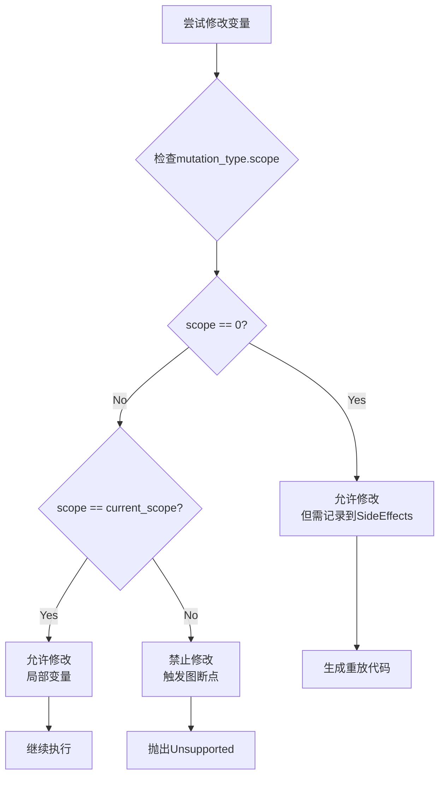

---

## 6. Source与Guard系统

### 6.1 Source层次结构

**设计原理**：Source表示值的来源，用于生成guard和重建代码。

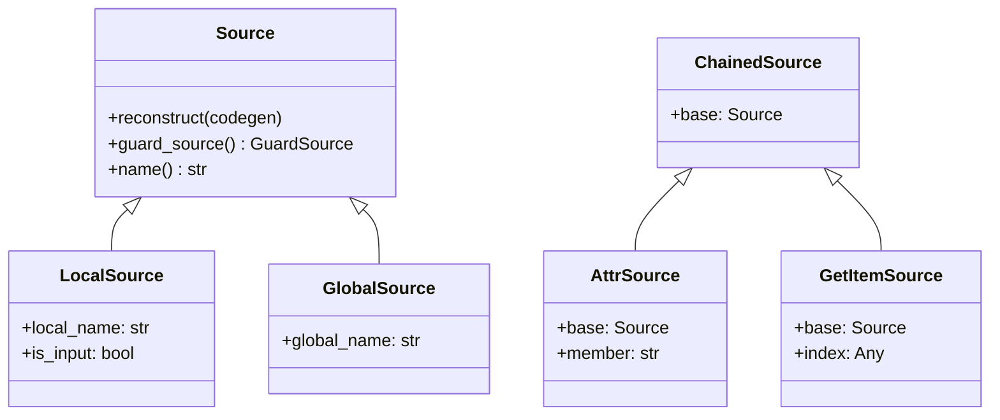

### 6.2 Guard生成流程

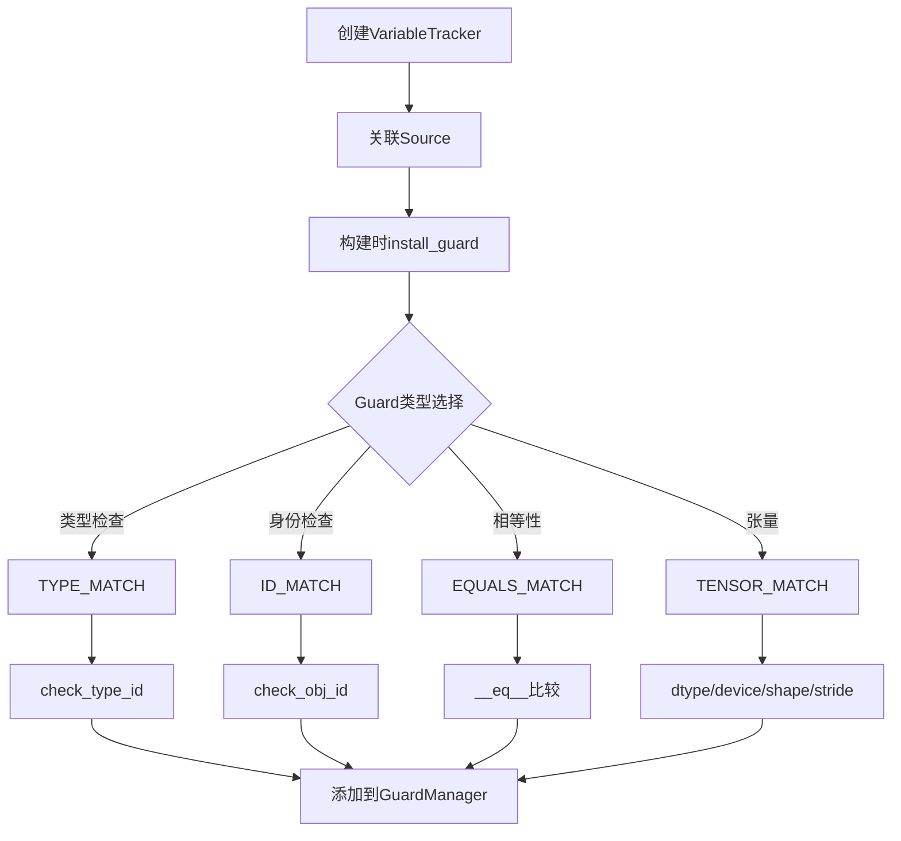

### 6.3 C++ Guard树

**设计原理**：Guard在C++层组织为树结构，实现O(1)快速检查。

```cpp
// torch/csrc/dynamo/guards.cpp
// GuardManager树结构用于快速检查

class RootGuardManager : public GuardManager {
    // 根节点：接收FrameLocalsMapping
    bool check(FrameLocalsMapping* mapping);
};

class GuardManager {
    vector<LeafGuard*> leaf_guards;           // 叶子守卫
    vector<pair<GuardAccessor*, GuardManager*>> children;  // 子节点
};

// GuardAccessor类型 - 定义树边
class FrameLocalsGuardAccessor : public GuardAccessor {
    // O(1)直接索引frame locals
    int idx;  // frame->localsplus索引
};

class GetAttrGuardAccessor : public GuardAccessor {
    // 属性访问
    PyObject* attr_name;
};

class DictGetItemGuardAccessor : public GuardAccessor {
    // 字典项访问
    PyObject* key;
};

// LeafGuard类型 - 实际检查
class TypeMatchGuard : public LeafGuard {
    // Py_TYPE指针比较
    PyTypeObject* expected_type;
};

class TensorMatchGuard : public LeafGuard {
    // 张量属性检查
    // dtype, device, shape, stride, dispatch keys
};
```

### 6.4 Guard检查流程

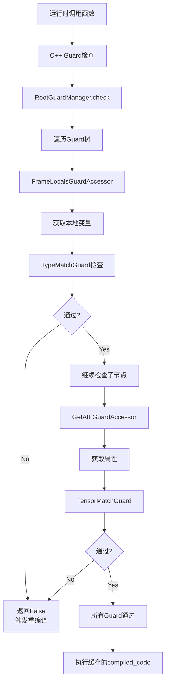

---

## 7. Graph构建与OutputGraph

### 7.1 OutputGraph架构

```python
# torch/_dynamo/output_graph.py

class OutputGraph:
    """管理FX图构建

    核心职责：
    1. 维护FX图（通过SubgraphTracer）
    2. 管理符号形状环境（ShapeEnv）
    3. 收集Guards
    4. 追踪SideEffects
    5. 编译子图
    """

    def __init__(self, ...):
        self.graph: torch.fx.Graph  # FX图
        self.subgraph_tracers: list[SubgraphTracer]  # 子图追踪器栈
        self.current_tracer: SubgraphTracer  # 当前活动追踪器
        self.side_effects: SideEffects  # 副作用追踪
        self.guards: set[Guard]  # 收集的guards
        self.shape_env: ShapeEnv  # 符号形状环境
        self.input_args: list[GraphArg]  # 图输入参数

    def compile_subgraph(self):
        """编译当前子图"""
        # 1. 收集图输入
        # 2. 构建GraphModule
        # 3. 调用后端编译器
        # 4. 生成输出字节码
```

### 7.2 SubgraphTracer与子图

**设计原理**：支持Higher-Order Operators（如cond、map、scan）通过嵌套SubgraphTracer。

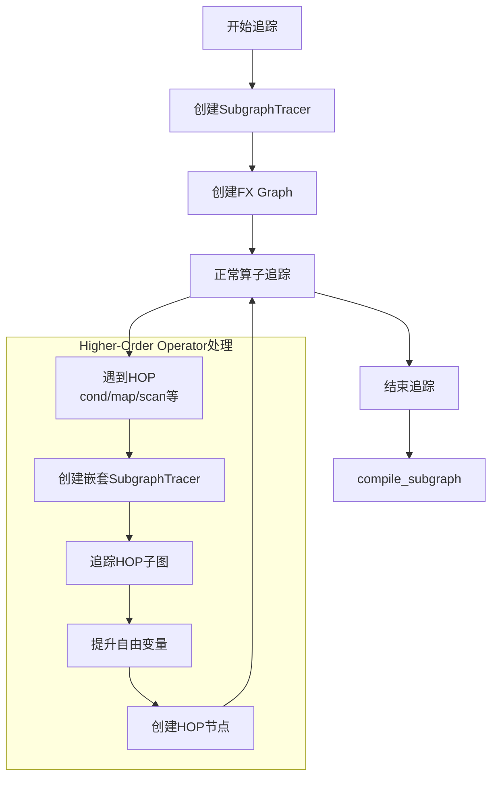

### 7.3 节点创建流程

```python
# 创建FX节点的典型流程

def create_proxy(self, target, args, kwargs):
    """创建FX代理节点"""
    # 1. 转换参数中的VariableTracker为proxy
    proxy_args = []
    for arg in args:
        if isinstance(arg, VariableTracker):
            proxy_args.append(arg.as_proxy())
        else:
            proxy_args.append(arg)

    # 2. 在FX图中创建节点
    proxy = self.current_tracer.create_node(
        "call_function",  # 节点类型
        target,           # 目标函数
        proxy_args,       # 参数
        {}                # kwargs
    )
    return proxy

# 3. 包装结果
result = TensorVariable.create(proxy, ...)
```

### 7.4 图编译流程

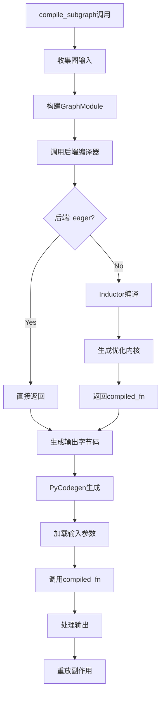

---

## 8. 副作用处理

### 8.1 SideEffects系统

```python
# torch/_dynamo/side_effects.py

class SideEffects:
    """追踪和重放副作用

    副作用类型：
    1. 属性修改：obj.attr = value
    2. 列表/字典修改：lst[0] = value
    3. Cell变量更新
    4. 张量钩子注册
    """

    def __init__(self):
        self.id_to_variable: dict[int, VariableTracker]
        self.store_attr_mutations: dict[VariableTracker, dict[str, VariableTracker]]
        self.keepalive: list[Any]  # 保持对象存活
        self.tensor_hooks: dict[int, tuple]  # 张量钩子
```

### 8.2 变异追踪流程

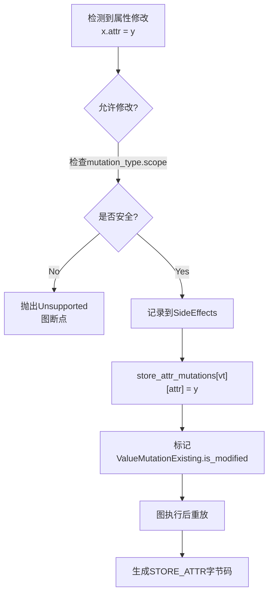

### 8.3 副作用重放

```python
# 在代码生成阶段重放副作用

def codegen_side_effects(self, codegen):
    # 1. 属性修改
    for vt, attrs in self.store_attr_mutations.items():
        for attr, value in attrs.items():
            # 生成: vt.attr = value
            codegen(vt)           # 加载对象
            codegen(value)        # 加载值
            codegen.extend_output(
                codegen.create_store_attrs(attr)
            )

    # 2. 列表/字典修改
    for vt in self.mutations:
        if isinstance(vt, ListVariable):
            # 生成列表更新代码
            pass

    # 3. 张量钩子
    for idx, hook_info in self.tensor_hooks.items():
        # 注册前向/反向钩子
        pass
```

---

## 9. 代码生成

### 9.1 PyCodegen架构

```python
# torch/_dynamo/codegen.py

class PyCodegen:
    """生成Python字节码"""

    def __init__(self, tx, ...):
        self._output: list[Instruction] = []  # 生成的指令
        self.tempvars: dict[Source, str] = {}  # 临时变量映射
        self.graph_outputs: dict[int, GraphOutputEntry] = {}  # 图输出

    def create_load(self, name: str) -> Instruction:
        return create_instruction("LOAD_FAST", argval=name)

    def create_store(self, name: str) -> Instruction:
        return create_instruction("STORE_FAST", argval=name)
```

### 9.2 代码生成流程

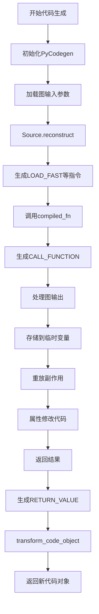

### 9.3 示例：简单函数的代码生成

```python
# 原始函数
def fn(x, y):
    z = x + y
    return z * 2

# Dynamo生成的代码结构（概念上）
def compiled_fn(x, y):
    # 从输入构建张量
    arg0 = x  # LOAD_FAST x
    arg1 = y  # LOAD_FAST y

    # 调用编译后的FX图
    results = compiled_graph(arg0, arg1)

    # 解包输出
    z = results[0]

    # 返回
    return z
```

---

## 10. 图断点与恢复执行

### 10.1 Graph Break机制

```python
# torch/_dynamo/exc.py

def unimplemented(gb_type, context, explanation, hints):
    """触发图断点

    参数：
    - gb_type: 图断点类型（用于分类）
    - context: 开发者上下文（可包含动态信息）
    - explanation: 用户可读解释
    - hints: 提示信息列表
    """
    raise Unsupported(
        msg=explanation,
        gb_type=gb_type,
        context=context,
        hints=hints
    )

# 使用示例
unimplemented(
    gb_type="custom_operator",
    context=f"Unsupported operator: {op}",
    explanation=f"Operator {op} is not supported by Dynamo",
    hints=[graph_break_hints.SUPPORTABLE]
)
```

### 10.2 图断点处理流程

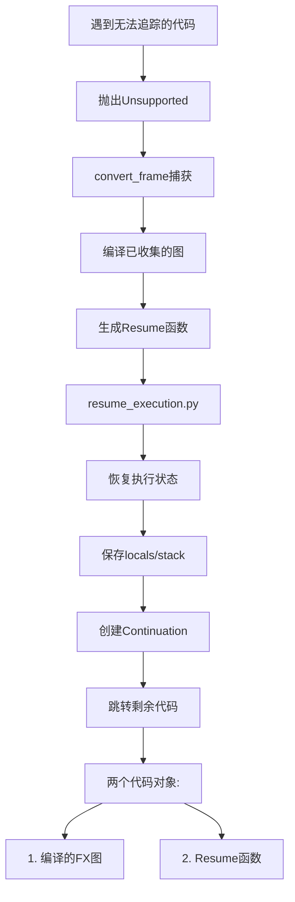

### 10.3 Resume函数生成

```python
# torch/_dynamo/resume_execution.py

def create_resume_fn(code, ...):
    """生成从图断点恢复的函数"""

    # 生成代码结构:
    def torch_dynamo_resume_in_fn(__resumed_locals):
        # 恢复局部变量
        x = __resumed_locals['x']
        y = __resumed_locals['y']

        # 继续执行原函数的剩余部分
        ...

    return torch_dynamo_resume_in_fn
```

### 10.4 完整图断点示例

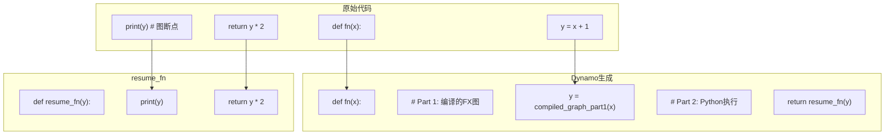

---

## 11. 后端编译器注册

### 11.1 后端注册机制

```python
# torch/_dynamo/backends/registry.py

_BACKENDS: dict[str, EntryPoint] = {}
_COMPILER_FNS: dict[str, CompilerFn] = {}

def register_backend(compiler_fn=None, name=None, tags=()):
    """注册编译器后端

    使用示例：
    @register_backend
    def my_compiler(gm, example_inputs):
        return gm.forward
    """
    name = name or compiler_fn.__name__
    _BACKENDS[name] = None
    _COMPILER_FNS[name] = compiler_fn
    return compiler_fn

# 内置后端
@register_backend
def inductor(gm, example_inputs):
    """PyTorch默认编译器，生成Triton/CPP内核"""
    from torch._inductor import compile_fx
    return compile_fx(gm, example_inputs)

@register_backend
def eager(gm, example_inputs):
    """直接执行FX图，无编译"""
    return gm.forward

@register_backend
def aot_eager(gm, example_inputs):
    """AOTAutograd + Eager"""
    from torch._functorch import aot_autograd
    return aot_autograd(...)
```

### 11.2 标准后端

| 后端 | 描述 | 标签 |
|------|------|------|
| `eager` | 直接执行FX图，无编译 | - |
| `inductor` | PyTorch默认编译器，生成Triton/CPP内核 | - |
| `cudagraphs` | CUDA Graph包装器 | - |
| `onnxrt` | ONNX Runtime后端 | experimental |
| `tensorrt` | TensorRT后端 | experimental |
| `tvm` | Apache TVM后端 | experimental |
| `aot_eager` | AOTAutograd + Eager | debug |

### 11.3 后端调用流程

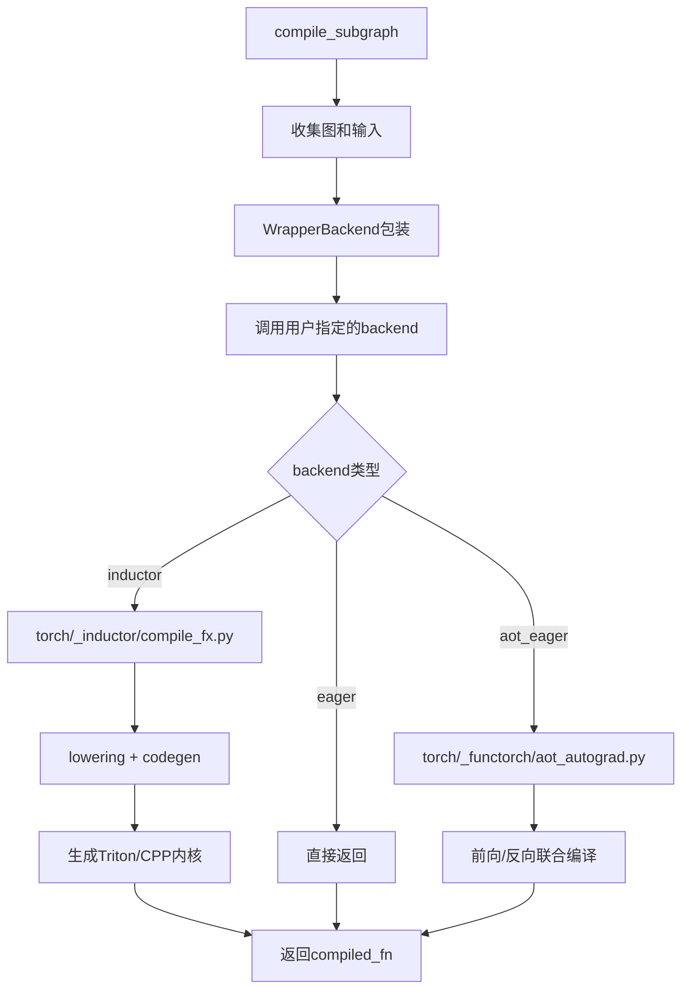

---

## 12. 缓存与重编译机制

### 12.1 缓存结构

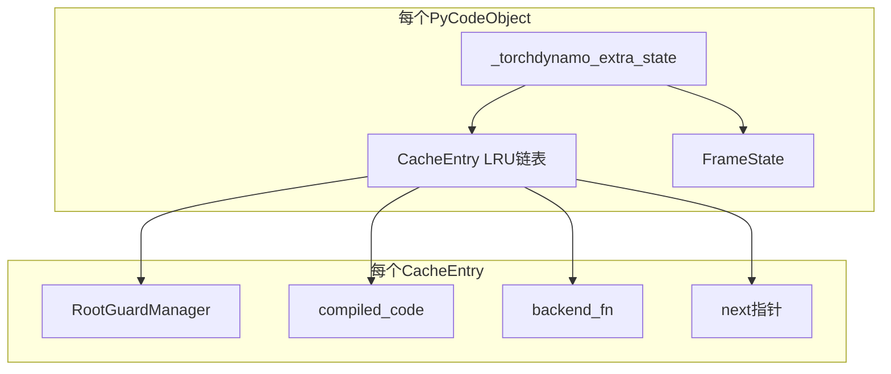

### 12.2 重编译触发条件

```python
# 触发重编译的常见情况

# 1. 张量形状变化
x = torch.randn(2, 3)
compiled_fn(x)  # 编译 shape=(2,3)
x = torch.randn(4, 5)
compiled_fn(x)  # 形状变化，重编译

# 2. 数据类型变化
x = torch.randn(2, 3, dtype=torch.float32)
compiled_fn(x)
x = x.to(torch.float16)  # dtype变化，重编译

# 3. 设备变化
x = torch.randn(2, 3, device="cpu")
compiled_fn(x)
x = x.cuda()  # device变化，重编译

# 4. Python控制流变化
def fn(x, flag):
    if flag:  # flag值变化可能触发重编译
        return x + 1
    return x + 2
```

### 12.3 自动动态形状

```mermaid
flowchart TD
    A["首次编译<br/>shape=(2,3,4)"] --> B["Guard记录静态形状"]

    B --> C["第二次调用<br/>shape=(3,3,4)"]
    C --> D{"第一维变化"}
    D -->|"超过自动动态阈值"| E["标记为动态维度"]
    E --> F["重新编译"]
    F --> G["Guard变为<br/>shape=(s0, 3, 4)"]

    D -->|"未超过阈值"| H["直接重编译"]

    G --> I["后续调用<br/>任意第一维"]
    I --> J["Guard命中"]
```

**代码实现**（`pgo.py`）：

```python
class FrameState:
    """记录帧级别的动态形状状态

    通过多次运行收集统计信息
    自动决定哪些维度应该是动态的
    """
    automatic_dynamic: dict[str, FrameStateSizeEntry]

class FrameStateSizeEntry:
    """单个维度的状态"""
    size: int           # 当前大小
    dynamic: bool       # 是否已标记为动态
    num_mismatches: int # 不匹配次数
```

### 12.4 缓存查找实现

```cpp
// torch/csrc/dynamo/eval_frame_cpp.cpp

static PyObject* dynamo__custom_eval_frame(...) {
    // 1. 获取ExtraState
    ExtraState* extra_state = get_extra_state(frame->f_code);

    // 2. 构建FrameLocalsMapping（O(1)访问）
    FrameLocalsMapping* locals_mapping = FrameLocalsMapping::create(frame);

    // 3. 遍历CacheEntry链表
    CacheEntry* entry = extra_state->cache_entry_list;
    while (entry != nullptr) {
        // 4. 运行GuardManager检查（C++层）
        bool guard_passed = entry->guard_manager->check(locals_mapping);

        if (guard_passed) {
            // 命中：执行编译代码
            return execute_compiled_code(entry->compiled_code, frame);
        }

        // 未命中：继续下一个
        entry = entry->next;
    }

    // 5. 全部未命中：调用Python回调编译
    return call_python_callback(frame, callback);
}
```

---

## 13. C++运行时层

### 13.1 文件结构

| 文件 | 职责 |
|------|------|
| `eval_frame.c` | PEP 523钩子安装 |
| `eval_frame_cpp.cpp` | 帧评估主逻辑 |
| `extra_state.cpp` | ExtraState管理 |
| `cache_entry.cpp` | CacheEntry管理 |
| `guards.cpp` | Guard树实现（~7800行） |
| `framelocals_mapping.cpp` | O(1) locals访问 |
| `init.cpp` | Python模块初始化 |

### 13.2 Guard树性能优化

```cpp
// torch/csrc/dynamo/guards.cpp

class GuardManager {
    // 关键优化：
    // 1. 失败快速访问器重排序 - 最常失败的guard排在前面
    // 2. 字典版本标签匹配 - 跳过未变化的子树
    // 3. FrameLocalsMapping - 避免Python dict构建
    // 4. check_nopybind - 避免pybind11开销

    bool check(FrameLocalsMapping* mapping) {
        // 检查叶子guards
        for (auto* leaf : leaf_guards) {
            if (!leaf->check(mapping)) {
                return false;  // 快速失败
            }
        }

        // 递归检查子节点
        for (auto& [accessor, child] : children) {
            PyObject* child_obj = accessor->access(mapping);
            if (!child->check(child_obj)) {
                return false;
            }
        }

        return true;
    }
};
```

---

## 14. 总结

### 14.1 Dynamo核心设计模式

1. **字节码级符号执行**: 不修改Python语法，直接处理字节码
2. **VariableTracker抽象**: 统一包装Python值，支持懒加载
3. **Source-Guard系统**: 追踪值来源，生成运行时检查
4. **副作用追踪**: 记录变异操作，生成重放代码
5. **推测执行**: 尝试分支，失败则重启分析

### 14.2 性能优化策略

| 策略 | 实现 |
|------|------|
| Guard快速路径 | C++ GuardManager树 |
| O(1) locals访问 | FrameLocalsMapping避免dict构建 |
| 缓存LRU | CacheEntry链表管理 |
| 自动动态形状 | 统计驱动维度提升 |
| Fail-fast accessor | 最常失败的guard排在前面 |

### 14.3 使用建议

```python
# 1. 减少Graph Break
@torch.compile
def fn(x):
    # 避免在编译区域内调用非PyTorch操作
    for i in range(10):  # 小循环会被展开
        x = x + 1
    return x

# 2. 控制动态形状
@torch.compile(dynamic=False)  # 禁用动态形状
def fn2(x):
    return x + 1

# 3. 使用fullgraph捕获完整图
@torch.compile(fullgraph=True)  # 禁止graph break
def fn3(x):
    return x * 2

# 4. 查看graph break原因
import torch._logging
torch._logging.set_logs(graph_breaks=True)

# 5. 调试技巧
# TORCH_LOGS="graph_code" - 查看捕获的FX图
# TORCH_LOGS="guards,recompiles" - 查看守卫和重编译原因
# TORCH_LOGS="+dynamo" - 完整调试日志
```

### 14.4 常见陷阱

1. **数据相关控制流**：if x.sum() > 0: 会导致图断点
2. **非PyTorch操作**：print、time等会触发图断点
3. **动态形状**：形状频繁变化导致重编译
4. **Python对象修改**：不支持修改外部Python对象
5. **异常处理**：try-except会触发图断点

