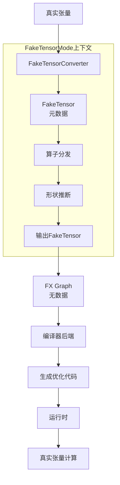
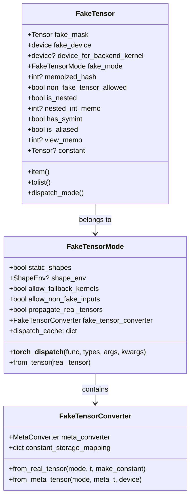
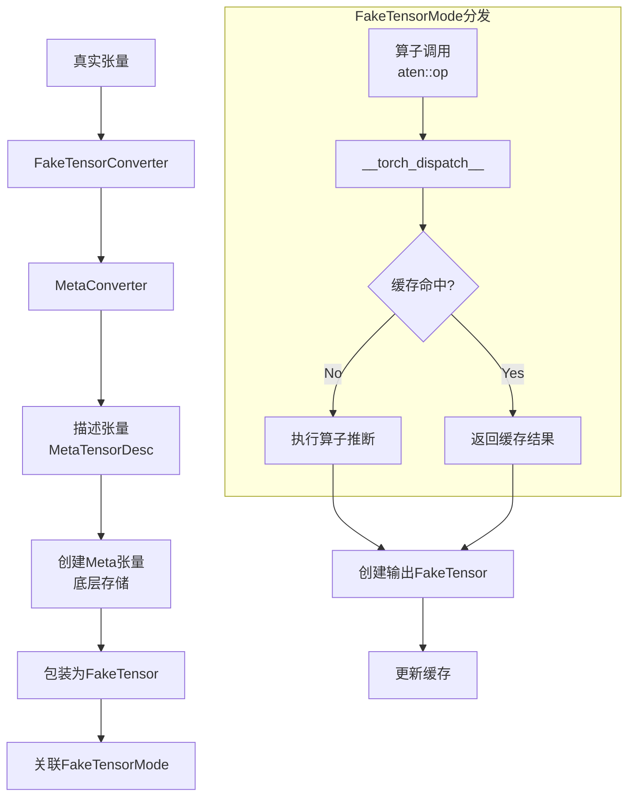
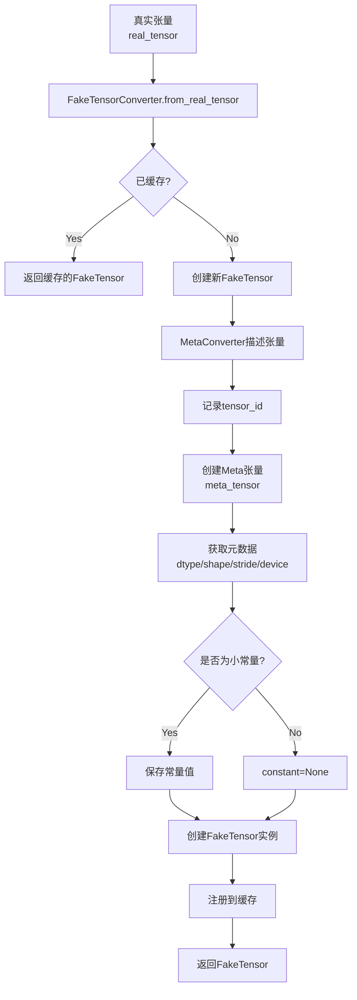
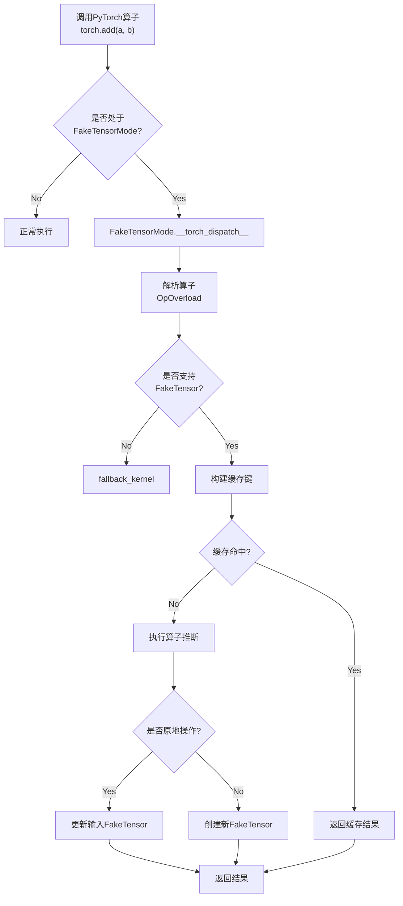
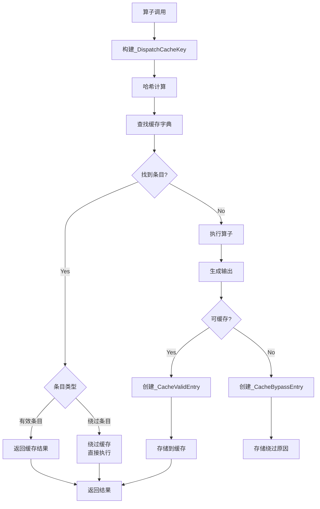
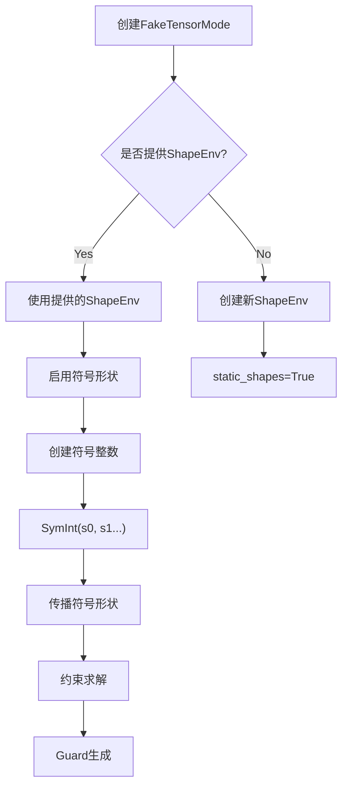
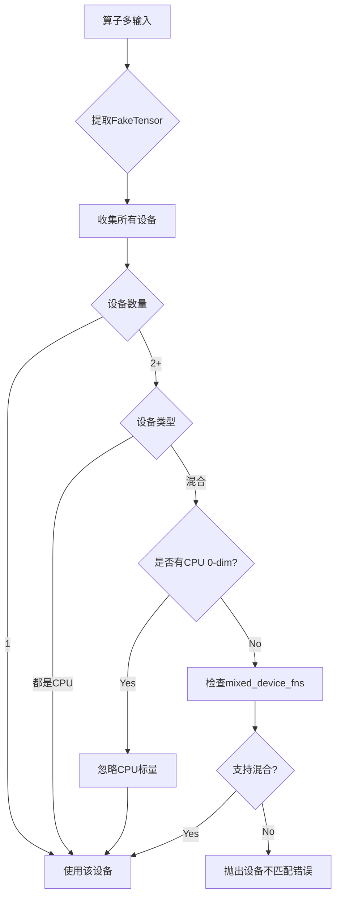
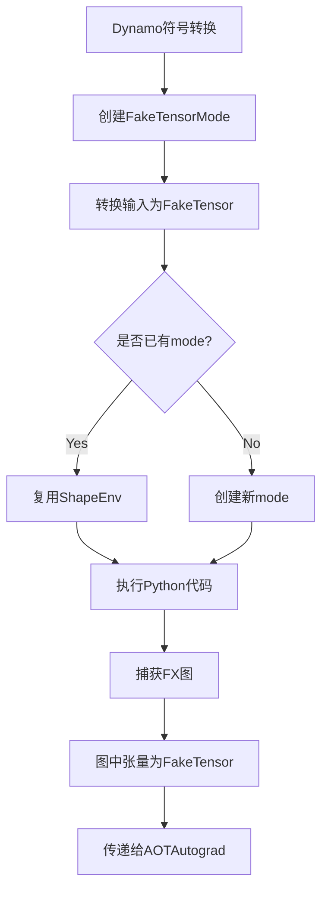

# PyTorch FakeTensor (无数据张量模拟) 深度分析

## 目录
1. [架构概览与设计目标](#1-架构概览与设计目标)
2. [核心组件详解](#2-核心组件详解)
3. [FakeTensor创建与转换](#3-faketensor创建与转换)
4. [FakeTensorMode分发机制](#4-faketensormode分发机制)
5. [元数据管理与缓存](#5-元数据管理与缓存)
6. [符号形状支持](#6-符号形状支持)
7. [设备传播策略](#7-设备传播策略)
8. [与Dynamo/AOTAutograd集成](#8-与dynamoaotautograd集成)
9. [性能优化与缓存](#9-性能优化与缓存)

---

## 1. 架构概览与设计目标

### 1.1 什么是FakeTensor

**FakeTensor**是PyTorch中的一种特殊张量类型，它**保留了张量的所有元数据**（形状、步长、设备、dtype等），但**不分配实际数据存储**。这使得可以在不消耗大量内存的情况下执行计算图，快速验证操作的合法性并推断输出形状。

### 1.2 设计目标

```
┌─────────────────────────────────────────────────────────────┐
│                    FakeTensor 设计目标                       │
├─────────────────────────────────────────────────────────────┤
│  1. 元数据模拟: 保持完整的张量元数据信息                      │
│  2. 零数据存储: 不分配实际数据内存                            │
│  3. 形状推断: 支持符号形状和动态形状                          │
│  4. 设备无关: 模拟各种设备（CUDA、CPU等）                    │
│  5. 分发拦截: 拦截算子调用，模拟执行                          │
│  6. 缓存优化: 缓存元数据计算结果                              │
└─────────────────────────────────────────────────────────────┘
```

### 1.3 在编译栈中的位置



### 1.4 核心文件位置

| 组件 | 文件路径 | 描述 |
|------|----------|------|
| FakeTensor | `torch/_subclasses/fake_tensor.py` | FakeTensor核心实现 |
| FakeTensorMode | `torch/_subclasses/fake_tensor.py` | 分发模式 |
| MetaConverter | `torch/_subclasses/meta_utils.py` | 元张量转换工具 |
| MetaUtils | `torch/_subclasses/meta_utils.py` | 元数据工具函数 |
| Fake Impls | `torch/_subclasses/fake_impls.py` | Fake专用实现 |

---

## 2. 核心组件详解

### 2.1 FakeTensor类结构



### 2.2 FakeTensor核心字段

```python
@dataclass
class FakeTensor(Tensor):
    """无数据张量，仅保留元数据"""

    # 基础元数据
    fake_device: torch.device  # 模拟的设备
    fake_mode: FakeTensorMode  # 所属的FakeTensorMode

    # 可选的额外信息
    constant: Optional[torch.Tensor]  # 常量值（用于小张量）

    # 缓存字段
    memoized_hash: Optional[int]  # 缓存的哈希值
    nested_int_memo: Optional[SymInt]  # 嵌套张量的整数memo

    @property
    def device(self) -> torch.device:
        """返回fake_device以模拟真实设备"""
        if self.fake_mode.in_kernel_invocation:
            return torch.device("meta")  # 内核执行时使用meta设备
        return self.fake_device
```

### 2.3 组件交互图



---

## 3. FakeTensor创建与转换

### 3.1 从真实张量创建



### 3.2 转换代码示例

```python
# 创建FakeTensorMode
with FakeTensorMode() as mode:
    # 从真实张量创建FakeTensor
    real_tensor = torch.randn(2, 3, device='cuda')
    fake_tensor = mode.from_tensor(real_tensor)

    # fake_tensor.device 显示为 'cuda:0'
    # 但实际数据存储在meta设备上

    # 执行操作
    result = fake_tensor + fake_tensor  # 不分配GPU内存

# 转换器API
converter = FakeTensorConverter()
fake = converter.from_real_tensor(mode, real_tensor)
```

### 3.3 MetaConverter内部机制

```python
class MetaConverter:
    """将真实张量转换为meta张量"""

    def __call__(self, t, *, shape_env, callback, source):
        # 1. 获取/创建tensor_id
        tid = self.get_tensor_id(t)

        # 2. 检查缓存
        if tid in self.tensor_memo:
            return self.tensor_memo[tid]

        # 3. 处理存储
        if t.is_sparse:
            # 稀疏张量特殊处理
            return self._handle_sparse(t)

        # 4. 创建meta张量
        def make_meta():
            return torch.empty(
                t.shape,
                dtype=t.dtype,
                device='meta',
                requires_grad=t.requires_grad
            )

        # 5. 通过回调创建FakeTensor
        fake = callback(make_meta, t.device)

        # 6. 设置视图关系
        if t._is_view():
            base = self(t._base, ...)
            fake._set_base(base)

        # 7. 缓存
        self.tensor_memo[tid] = fake
        return fake
```

---

## 4. FakeTensorMode分发机制

### 4.1 TorchDispatch分发



### 4.2 分发处理代码

```python
class FakeTensorMode(TorchDispatchMode):
    """FakeTensor分发模式"""

    def __torch_dispatch__(self, func, types, args=(), kwargs=None):
        # 1. 构建缓存键
        try:
            key = self._cache_key(func, args, kwargs)
            if key in self.dispatch_cache:
                return self._hit_cache(key, func, args)
        except _BypassDispatchCache:
            pass

        # 2. 检查是否所有输入都是FakeTensor
        flat_args = tree_flatten(args)
        if not all(isinstance(t, FakeTensor) for t in flat_args if isinstance(t, Tensor)):
            return self._handle_mixed_inputs(func, args, kwargs)

        # 3. 设备传播
        common_device = self._compute_common_device(func, args)

        # 4. 执行算子
        if func in self._fallback_kernels:
            result = self._fallback_kernel(func, args, kwargs)
        else:
            result = self._dispatch_impl(func, types, args, kwargs)

        # 5. 更新缓存
        self._update_cache(key, result)
        return result
```

### 4.3 缓存键构建

```python
def _cache_key(self, func, args, kwargs):
    """构建分发缓存键"""
    key_parts = [func]

    # 展平参数
    flat_args, _ = tree_flatten((args, kwargs))

    for arg in flat_args:
        if isinstance(arg, FakeTensor):
            # 提取关键元数据
            key_parts.append(arg.dtype)
            key_parts.append(tuple(arg.shape))
            key_parts.append(arg.device)
            key_parts.append(arg.stride())
        elif isinstance(arg, (SymInt, SymFloat)):
            # 符号值
            key_parts.append(str(arg))
        else:
            key_parts.append(arg)

    return tuple(key_parts)
```

---

## 5. 元数据管理与缓存

### 5.1 TensorMetadata结构

```python
@dataclass
class TensorMetadata:
    """用于缓存的元数据"""

    dtype: torch.dtype
    shape: tuple[Union[int, SymInt], ...]
    stride: tuple[Union[int, SymInt], ...]
    device: torch.device
    layout: torch.layout
    memory_format: Optional[torch.memory_format]
    storage_offset: Union[int, SymInt]
    storage_bytes: Optional[int]
    requires_grad: bool
    is_quantized: bool
    is_conj: bool
    is_neg: bool
    is_inference: bool
    is_sparse: bool
    # ... 更多字段
```

### 5.2 缓存机制流程



### 5.3 缓存条目类型

```python
@dataclass(frozen=True)
class _DispatchCacheValidEntry:
    """有效缓存条目"""
    output_infos: tuple[_DispatchCacheEntryOutputInfo]
    is_output_tuple: bool = False

@dataclass(frozen=True)
class _DispatchCacheBypassEntry:
    """绕过缓存条目（负缓存）"""
    reason: str  # 绕过原因

@dataclass(frozen=True)
class _DispatchCacheEntryOutputInfo:
    """输出信息"""
    inplace_idx: Optional[int]  # 原地操作索引
    metadata: Optional[TensorMetadata]  # 输出元数据
    view_idx: Optional[int]  # 视图操作索引
    constant_value: Any  # 常量值
```

---

## 6. 符号形状支持

### 6.1 ShapeEnv集成



### 6.2 符号形状传播

```python
class FakeTensorMode:
    def _create_symbolic_shape(self, real_tensor, source):
        """为真实张量创建符号形状"""
        if self.shape_env is None:
            return real_tensor.shape

        # 为每个维度创建符号
        shape = []
        for i, s in enumerate(real_tensor.shape):
            if isinstance(s, int):
                # 创建符号整数
                sym = self.shape_env.create_symbol(
                    s,
                    source=TensorPropertySource(source, TensorProperty.SIZE, i)
                )
                shape.append(sym)
            else:
                shape.append(s)

        return tuple(shape)

    def _maybe_create_symbolic_sizes(self, tensor, source):
        """可能创建符号尺寸"""
        if not self.static_shapes:
            return self._create_symbolic_shape(tensor, source)
        return tensor.shape
```

### 6.3 符号形状推断示例

```python
with FakeTensorMode(shape_env=ShapeEnv()) as mode:
    # 创建带符号形状的张量
    x = mode.from_tensor(torch.randn(3, 4))
    # x.shape = (s0, s1)

    y = mode.from_tensor(torch.randn(4, 5))
    # y.shape = (s1, s2)

    # matmul推断
    z = torch.matmul(x, y)
    # z.shape = (s0, s2)

    # 添加约束
    assert z.shape[0] == 3  # 生成guard
```

---

## 7. 设备传播策略

### 7.1 多设备处理



### 7.2 设备传播代码

```python
def _compute_common_device(self, func, args):
    """计算算子的公共设备"""
    flat_args = tree_flatten(args)[0]
    common_device = None
    has_scalar_only_inputs = False

    for t in flat_args:
        if not isinstance(t, FakeTensor):
            continue

        t_device = t.device

        if common_device is None:
            common_device = t_device
        elif t_device != common_device:
            # 处理CPU 0-dim张量特殊情况
            if t_device.type == "cpu" and t.numel() == 1:
                continue
            if common_device.type == "cpu" and common_device.numel() == 1:
                common_device = t_device
                continue

            # 检查是否支持混合设备
            if func in mixed_device_fns:
                if "cpu" in (common_device.type, t_device.type):
                    continue

            raise RuntimeError(
                f"设备不匹配: {common_device} vs {t_device}"
            )

    return common_device
```

---

## 8. 与Dynamo/AOTAutograd集成

### 8.1 Dynamo中的使用



### 8.2 AOTAutograd集成

```python
# AOTAutograd中的FakeTensor使用

def aot_dispatch_autograd(graph, inputs, ...):
    # 1. 检测或创建FakeTensorMode
    fake_mode = detect_fake_mode(inputs)

    if fake_mode is None:
        fake_mode = FakeTensorMode(shape_env=ShapeEnv())

    # 2. 在FakeTensorMode下追踪
    with fake_mode:
        # 所有张量操作使用FakeTensor
        # 不分配实际内存
        traced_graph = make_fx(graph)(*inputs)

    # 3. traced_graph中的节点值为FakeTensor
    # 可以用于形状分析和优化
    return traced_graph
```

### 8.3 元数据传递

```python
# FakeTensor元数据在编译流程中传递

# 1. Dynamo输出
# args = [FakeTensor(..., shape=(s0, s1), device='cuda')]

# 2. AOTAutograd联合图捕获
# 联合图中保持FakeTensor元数据

# 3. 分区器决策
# 基于FakeTensor.shape进行分区决策

# 4. Inductor编译
# 使用FakeTensor的shape/device信息生成代码
```

---

## 9. 性能优化与缓存

### 9.1 缓存命中分析

```python
class FakeTensorMode:
    cache: dict[_DispatchCacheKey, _DispatchCacheEntry] = {}
    cache_hits: int = 0
    cache_misses: int = 0
    cache_bypasses: dict[str, int] = defaultdict(int)

    def get_cache_info(self) -> DispatchCacheInfo:
        return DispatchCacheInfo(
            hits=self.cache_hits,
            misses=self.cache_misses,
            bypasses=dict(self.cache_bypasses),
            size=len(self.cache)
        )
```

### 9.2 性能优化策略

| 优化 | 描述 | 实现 |
|------|------|------|
| 元数据缓存 | 缓存算子输出元数据 | dispatch_cache |
| 哈希缓存 | 缓存FakeTensor哈希值 | memoized_hash |
| 视图复用 | 复用相同基张量的视图 | view_memo |
| 常量传播 | 小常量张量特殊处理 | constant字段 |
| 嵌套整数缓存 | NJT嵌套整数缓存 | nested_int_memo |

### 9.3 调试工具

```python
# 查看缓存统计
import torch._logging
torch._logging.set_logs(fake_tensor=logging.DEBUG)

# 获取缓存信息
mode = FakeTensorMode()
# ... 执行一些操作 ...
info = mode.get_cache_info()
print(f"缓存命中率: {info.hits / (info.hits + info.misses)}")

# 禁用缓存
with disable_fake_tensor_cache(mode):
    # 执行操作，不使用缓存
    pass

# 缓存交叉验证
mode.cache_crosscheck_enabled = True
```

---

## 10. 总结

### 10.1 FakeTensor核心价值

1. **内存效率**: 不分配数据存储，支持大规模图分析
2. **设备无关**: 模拟任何设备（CUDA、CPU等）的行为
3. **形状推断**: 支持符号形状和动态形状
4. **编译友好**: 为编译器提供完整的元数据信息
5. **安全回退**: 对不支持的操作提供回退机制

### 10.2 关键设计决策

| 决策 | 理由 |
|------|------|
| 元设备存储 | Meta设备提供张量元数据而不存储数据 |
| TorchDispatch | 通过分发机制拦截所有算子调用 |
| 分层缓存 | 缓存元数据计算避免重复推断 |
| 常量传播 | 特殊处理小常量张量提高精度 |
| 视图追踪 | 维护视图关系以正确处理别名 |

### 10.3 使用建议

```python
# 1. 基本使用
with FakeTensorMode() as mode:
    x = mode.from_tensor(torch.randn(2, 3))
    y = x + x  # 不分配内存

# 2. 符号形状
from torch.fx.experimental.symbolic_shapes import ShapeEnv
with FakeTensorMode(shape_env=ShapeEnv()) as mode:
    x = mode.from_tensor(torch.randn(3, 4))
    # x.shape = (s0, s1)

# 3. 与Dynamo结合
@torch.compile
def fn(x):
    # Dynamo自动使用FakeTensor
    return x + 1

# 4. 调试
import torch._logging
torch._logging.set_logs(fake_tensor=True)
```
