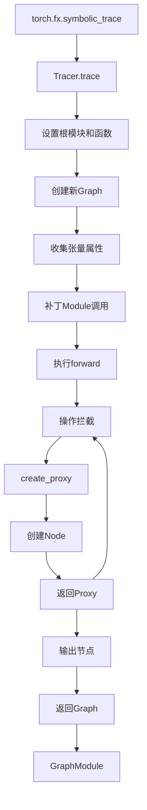
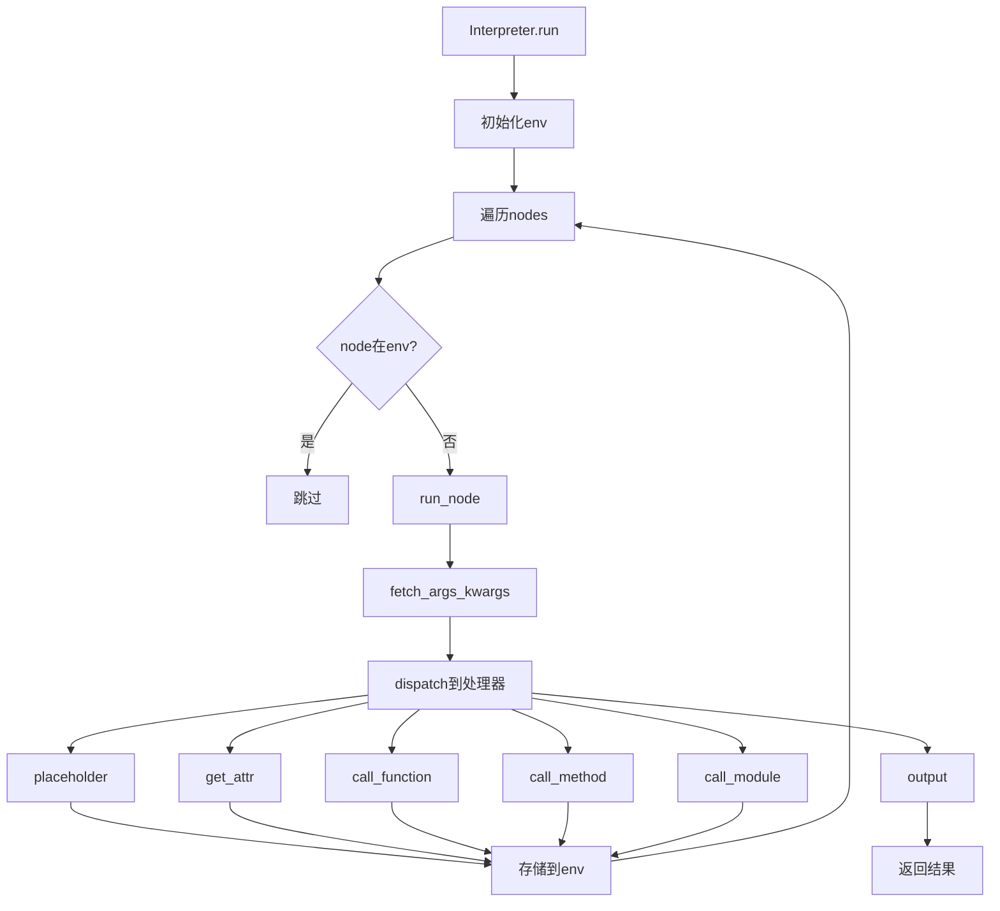
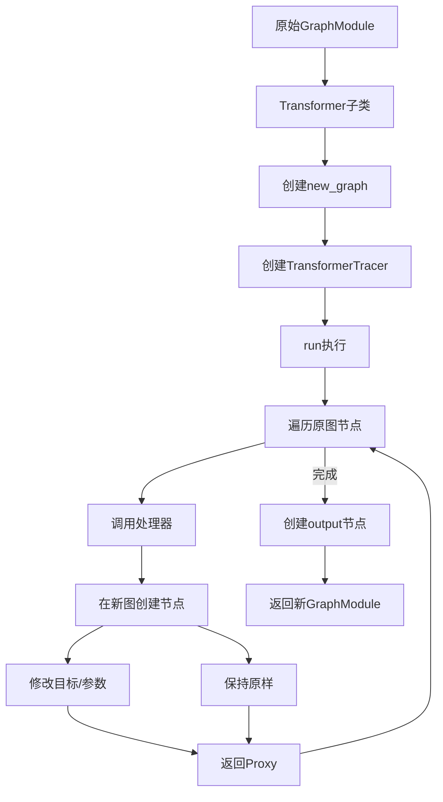
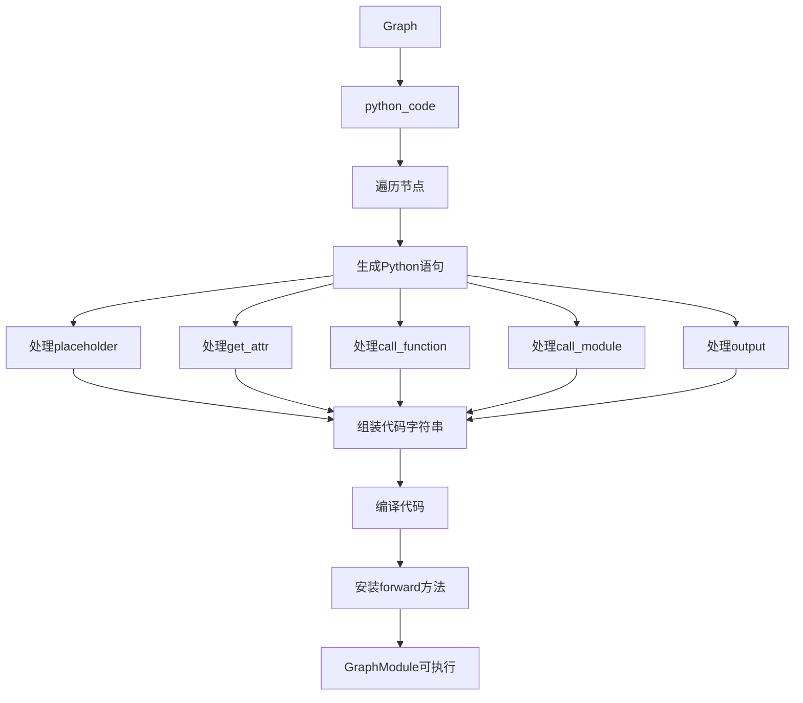
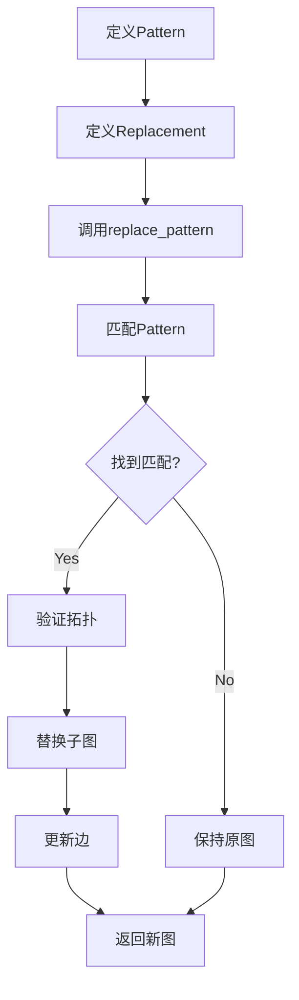

# PyTorch FX (Functional Transformation)深度分析

## 目录
1. [架构概览与设计目标](#1-架构概览与设计目标)
2. [核心数据结构](#2-核心数据结构)
3. [符号追踪机制](#3-符号追踪机制)
4. [Graph解释执行](#4-graph解释执行)
5. [Graph转换](#5-graph转换)
6. [GraphModule代码生成](#6-graphmodule代码生成)
7. [使用模式与示例](#7-使用模式与示例)
8. [内部实现细节](#8-内部实现细节)
9. [Subgraph Rewriting](#9-subgraph-rewriting)
10. [高级特性](#10-高级特性)

---

## 1. 架构概览与设计目标

### 1.1 什么是FX

**FX**是一个用于转换`nn.Module`实例的工具包，由三个主要组件构成：

1. **Symbolic Tracer** - 通过符号执行捕获模块语义
2. **Intermediate Representation (IR)** - 操作图表示
3. **Python Code Generation** - 从IR生成有效的Python代码

### 1.2 解决的问题

在FX之前，修改模型行为需要：
- 手动重写模型代码
- 复杂的猴子补丁
- 框架特定的转换

FX提供了一种系统化的方法：
- 将模型结构捕获为可操作的图
- 对图应用转换
- 重新生成有效的PyTorch代码

### 1.3 核心文件位置

| 组件 | 文件路径 | 描述 |
|------|----------|------|
| Graph | torch/fx/graph.py | 图IR数据结构 |
| Node | torch/fx/node.py | 节点定义 |
| Tracer | torch/fx/_symbolic_trace.py | 符号追踪器 |
| Proxy | torch/fx/proxy.py | 代理对象 |
| Interpreter | torch/fx/interpreter.py | 图解释器 |
| Transformer | torch/fx/interpreter.py | 图转换器 |
| GraphModule | torch/fx/graph_module.py | 图模块包装 |
| Subgraph Rewriter | torch/fx/subgraph_rewriter.py | 子图重写 |
| Pass Manager | torch/fx/passes/ | 变换管理 |

---

## 2. 核心数据结构

### 2.1 Node类

```python
# 来自torch/fx/node.py
class Node:
    _args: tuple["Argument", ...]     # 位置参数
    _kwargs: dict[str, "Argument"]    # 关键字参数
    graph: "Graph"                    # 父图
    name: str                         # 唯一名称
    op: str                           # 操作类型
    target: "Target"                  # 目标函数/模块/方法
    _input_nodes: dict["Node", None] # 输入节点
    users: dict["Node", None]         # 使用此节点输出的节点
    type: Any | None                  # 类型注解
    meta: dict[str, Any]              # 转换的元数据
    stack_trace: str | None           # 创建时的调用栈（调试用）
    
    def __init__(self, graph, name, op, target, args, kwargs, type=None):
        self.graph = graph
        self.name = name
        self.op = op
        self.target = target
        self._args = args
        self._kwargs = kwargs
        self.type = type
        self.meta = {}
        self.stack_trace = None
        self._update_args_kwargs(args, kwargs)
```

### 2.2 Node操作类型

| 操作码 | 描述 | 目标类型 | 示例 |
|--------|------|----------|------|
| `placeholder` | 函数输入 | `str` (参数名) | 输入张量 `x` |
| `get_attr` | 检索模块属性 | `str` (限定名) | `self.linear.weight` |
| `call_function` | 调用函数 | `Callable` | `torch.add`, `F.relu` |
| `call_module` | 调用nn.Module.forward | `str` (模块路径) | `self.linear` |
| `call_method` | 调用方法 | `str` (方法名) | `tensor.clamp` |
| `output` | 返回语句 | `str` ("output") | `return result` |

### 2.3 Graph类

```python
# 来自torch/fx/graph.py
class Graph:
    _root: Node                       # 哨兵根节点
    _used_names: dict[str, int]       # 名称跟踪
    _insert: Callable                 # 当前插入点
    _len: int                         # 节点计数
    _graph_namespace: _Namespace      # 名称唯一性
    _owning_module: GraphModule       # 父模块
    _tracer_cls: Type[Tracer]         # 使用的追踪器类
    _codegen: CodeGen                 # 代码生成策略
    
    def nodes(self):
        """返回图中所有节点（按拓扑序）"""
        current = self._root.next
        while current is not None:
            yield current
            current = current.next
```

---

## 3. 符号追踪机制

### 3.1 Tracer类

```python
# 来自torch/fx/_symbolic_trace.py
class Tracer(TracerBase):
    _autowrap_function_ids: set[int]  # 自动包装函数
    _autowrap_search: list[ModuleType]  # 自动包装搜索模块
    param_shapes_constant: bool       # 形状访问行为
    submodule_paths: dict[Module, str]  # 模块路径缓存
    scope: Scope                      # 当前模块作用域
    module_stack: OrderedDict         # 模块调用栈
    
    def trace(self, root: torch.nn.Module | Callable, concrete_args=None) -> Graph:
        # 1. 设置根模块和要追踪的函数
        # 2. 创建新Graph
        # 3. 收集张量属性
        # 4. 补丁Module.__call__和Module.__getattr__
        # 5. 用Proxy参数执行函数
        # 6. 用结果创建输出节点
        
    def create_proxy(self, op, target, args, kwargs, name=None, type_expr=None):
        # 创建Node并包装为Proxy
        node = self.create_node(op, target, args, kwargs, name, type_expr)
        return Proxy(node, self)
```

### 3.2 Proxy类

```python
# 来自torch/fx/proxy.py
class Proxy:
    def __init__(self, node: Node, tracer: "TracerBase" = None):
        self.tracer = tracer
        self.node = node
    
    # 在Proxy上的操作创建新节点
    def __add__(self, other):
        return self.tracer.create_proxy(
            "call_function", 
            operator.add, 
            (self, other), 
            {}
        )
    
    # 支持方法调用
    def __getattr__(self, k):
        if k == "node":
            return self.node
        return ProxyAttribute(self, k)
```

### 3.3 符号追踪流程图



---

## 4. Graph解释执行

### 4.1 Interpreter类

```python
# 来自torch/fx/interpreter.py
class Interpreter:
    def run(self, *args, initial_env=None, enable_io_processing=True) -> Any:
        self.env = initial_env if initial_env is not None else {}
        self.args_iter = iter(args)
        
        for node in self.graph.nodes:
            if node in self.env:
                continue
            self.env[node] = self.run_node(node)
            
            if node.op == "output":
                return self.env[node]
```

### 4.2 节点处理器

```python
def run_node(self, n: Node) -> Any:
    args, kwargs = self.fetch_args_kwargs_from_env(n)
    return getattr(self, n.op)(n.target, args, kwargs)

def placeholder(self, target, args, kwargs):
    return next(self.args_iter)

def get_attr(self, target, args, kwargs):
    return fetch_attr(target)

def call_function(self, target, args, kwargs):
    return target(*args, **kwargs)

def call_method(self, target, args, kwargs):
    return getattr(args[0], target)(*args[1:], **kwargs)

def call_module(self, target, args, kwargs):
    return fetch_attr(target)(*args, **kwargs)

def output(self, target, args, kwargs):
    return args[0]
```

### 4.3 解释执行流程图



---

## 5. Graph转换

### 5.1 Transformer类

```python
# 来自torch/fx/interpreter.py
class Transformer(Interpreter):
    def __init__(self, module):
        super().__init__(module)
        self.new_graph = Graph()
        self.new_graph._tracer_cls = module._tracer_cls
        self.tracer = TransformerTracer(self.new_graph, module)
    
    def placeholder(self, target, args, kwargs):
        return Proxy(self.new_graph.placeholder(target), self.tracer)
    
    def call_function(self, target, args, kwargs):
        return self.tracer.create_proxy("call_function", target, args, kwargs)
    
    def transform(self):
        result = self.run(enable_io_processing=False)
        self.new_graph.output(result)
        return GraphModule(self.module, self.new_graph)
```

### 5.2 转换示例

```python
class MyTransformer(Transformer):
    def call_function(self, target, args, kwargs):
        # 将torch.neg替换为torch.sigmoid
        if target is torch.neg:
            return self.tracer.create_proxy(
                "call_function", torch.sigmoid, args, kwargs
            )
        return super().call_function(target, args, kwargs)

# 使用
gm = torch.fx.symbolic_trace(fn)
transformed = MyTransformer(gm).transform()
```

### 5.3 转换流程图



---

## 6. GraphModule代码生成

### 6.1 recompile方法

```python
# 来自torch/fx/graph_module.py
def recompile(self) -> PythonCode:
    python_code = self._graph.python_code(root_module="self")
    self._code = python_code.src
    # 编译并安装forward方法
    cls = type(self)
    cls.forward = _forward_from_src(self._code, python_code.globals)
    return python_code
```

### 6.2 生成的代码示例

```python
# 输入图
def forward(self, x):
    %param = get_attr[target=param]
    %add = call_function[target=operator.add](args = (%x, %param))
    %linear = call_module[target=linear](args = (%add,))
    return linear

# 生成的代码
def forward(self, x):
    param = self.param
    add = x + param;  x = param = None
    linear = self.linear(add);  add = None
    return linear
```

### 6.3 代码生成流程图



---

## 7. 使用模式与示例

### 7.1 符号追踪

```python
import torch
import torch.fx as fx

class MyModule(torch.nn.Module):
    def __init__(self):
        super().__init__()
        self.param = torch.nn.Parameter(torch.rand(3, 4))
        self.linear = torch.nn.Linear(4, 5)
    
    def forward(self, x):
        return self.linear(x + self.param).clamp(min=0.0, max=1.0)

module = MyModule()
traced = fx.symbolic_trace(module)

print(traced.graph)
# 输出：
# graph(%self, %x):
#     %param = get_attr[target=param]
#     %add = call_function[target=operator.add](args = (%x, %param))
#     %linear = call_module[target=linear](args = (%add,))
#     %clamp = call_method[target=clamp](args = (%linear,), kwargs = {min: 0.0, max: 1.0})
#     return clamp
```

### 7.2 图操作

```python
# 获取图
graph = traced.graph

# 遍历节点
for node in graph.nodes:
    print(f"{node.op}: {node.target}")

# 插入节点
with graph.inserting_before(existing_node):
    new_node = graph.call_function(torch.add, (node_a, node_b))

# 删除节点
graph.erase_node(unused_node)

# 替换所有使用
old_node.replace_all_uses_with(new_node)

# 死代码消除
graph.eliminate_dead_code()

# 重新编译
traced.recompile()
```

### 7.3 自定义转换

```python
class ReplaceAddWithMul(fx.Transformer):
    def call_function(self, target, args, kwargs):
        if target is torch.add:
            return self.tracer.create_proxy(
                "call_function", torch.mul, args, kwargs
            )
        return super().call_function(target, args, kwargs)

# 使用
transformed = ReplaceAddWithMul(traced).transform()
```

---

## 8. 内部实现细节

### 8.1 节点创建

```python
# 来自torch/fx/graph.py
def create_node(self, op, target=None, args=None, kwargs=None, name=None, type_expr=None):
    # 1. 验证参数
    # 2. 生成名称
    # 3. 创建节点
    # 4. 插入到当前位置
    # 5. 更新查找表
    
    candidate = name if name is not None else self._target_to_str(target)
    name = self._name(candidate)
    
    n = Node(self, name, op, target, args, kwargs, type_expr)
    self._insert(n)
    self._len += 1
    
    return n
```

### 8.2 名称生成

```python
def _name(self, candidate):
    # 确保名称唯一
    if candidate not in self._used_names:
        self._used_names[candidate] = 0
        return candidate
    
    i = self._used_names[candidate]
    while True:
        i += 1
        new_name = f"{candidate}_{i}"
        if new_name not in self._used_names:
            self._used_names[candidate] = i
            return new_name
```

### 8.3 依赖跟踪

```python
def _update_args_kwargs(self, args, kwargs):
    # 跟踪输入节点
    def register_input(input):
        if isinstance(input, Node):
            self._input_nodes[input] = None
            input.users[self] = None
        return input
    
    map_arg(args, register_input)
    map_arg(kwargs, register_input)
```

---

## 9. Subgraph Rewriting

### 9.1 子图重写简介

FX提供了子图重写功能，允许匹配和替换图中的模式。这对于优化（如算子融合）非常有用。

### 9.2 Pattern Matching

```python
from torch.fx.subgraph_rewriter import Match, replace_pattern_with_filters
from torch.fx.passes.utils.matcher_with_name_node_map import (
    SubgraphMatcherWithNameNodeMap,
)
from torch.fx.passes.utils.pattern_utils import PatternMatcher

# 定义模式
# pattern: 要匹配的子图
# replacement: 替换后的子图
def pattern(x, y):
    return torch.add(x, y)

def replacement(x, y):
    return torch.mul(x, y)

# 执行替换
torch.fx.subgraph_rewriter.replace_pattern(gm, pattern, replacement)
```

### 9.3 匹配器工作流程

```python
# torch/fx/passes/utils/matcher_with_name_node_map.py
class SubgraphMatcherWithNameNodeMap:
    def __init__(self, pattern, match_output=False, match_placeholder=False):
        self.pattern = pattern
        self.match_output = match_output
        self.match_placeholder = match_placeholder
    
    def match(self, graph):
        # 1. 获取pattern中的所有anchor节点
        # 2. 在目标图中搜索匹配
        # 3. 验证拓扑关系
        # 4. 返回匹配结果
        pass
```

### 9.4 高级重写示例

```python
# 融合Conv-BN-ReLU
import torch
from torch.fx import symbolic_trace
from torch.fx.subgraph_rewriter import replace_pattern

def conv_bn_relu_pattern(input, weight, bias, bn_weight, bn_bias):
    conv = torch.nn.functional.conv2d(input, weight, bias)
    bn = torch.nn.functional.batch_norm(conv, bn_weight, bn_bias)
    relu = torch.relu(bn)
    return relu

def conv_bn_relu_fused(input, weight, bias, bn_weight, bn_bias):
    # 假设有融合的实现
    return torch.nn.functional.conv2d(input, weight, bias)

# 应用融合
model = MyModel()
traced = symbolic_trace(model)
replace_pattern(traced, conv_bn_relu_pattern, conv_bn_relu_fused)
```

### 9.5 子图重写流程图



---

## 10. 高级特性

### 10.1 Shape Propagation

```python
from torch.fx.passes.shape_prop import ShapeProp

# 传播形状信息
sp = ShapeProp(traced_model)
sp.propagate(*example_inputs)

# 现在每个节点都有类型和形状信息
for node in traced_model.graph.nodes:
    print(f"{node.name}: {node.type}, shape={node.meta.get('tensor_meta')}")
```

### 10.2 Split Module

```python
from torch.fx.passes.split_module import split_module

# 将图分割为多个子图
def split_callback(node):
    # 返回子图的名称
    if "conv" in node.name:
        return "conv_part"
    return "rest"

split_gm = split_module(gm, None, split_callback)

# 现在split_gm包含两个子模块
```

### 10.3 Constant Propagation

```python
# 常量传播优化
from torch.fx.passes.const_prop import ConstProp

# 传播常量并折叠
# 例如：x + 0 -> x
#       x * 1 -> x
```

### 10.4 Graph Transformations Passes

```python
from torch.fx.passes import passes

# 死代码消除
passes.eliminate_dead_code(graph)

# 公共子表达式消除
passes.common_subexpression_elimination(graph)

# 常量折叠
passes.constant_folding(graph)
```

---

## 11. 文件位置汇总

| 组件 | 文件路径 |
|------|----------|
| Core IR | torch/fx/graph.py, torch/fx/node.py |
| Tracing | torch/fx/_symbolic_trace.py, torch/fx/proxy.py |
| Execution | torch/fx/interpreter.py |
| Module Wrapper | torch/fx/graph_module.py |
| Subgraph Rewriter | torch/fx/subgraph_rewriter.py |
| Pattern Matching | torch/fx/passes/utils/matcher_with_name_node_map.py |
| Shape Propagation | torch/fx/passes/shape_prop.py |
| Split Module | torch/fx/passes/split_module.py |
| Pass Manager | torch/fx/passes/infra/pass_manager.py |
| Public API | torch/fx/__init__.py |

---

## 12. 总结

**FX设计模式**：
1. **访问者模式** - Interpreter/Transformer遍历节点
2. **代理模式** - Proxy对象拦截和记录操作
3. **策略模式** - CodeGen类处理不同代码生成策略
4. **模板方法** - TracerBase定义追踪算法，子类自定义

**使用场景**：
- 模型量化（Model Quantization）
- 算子融合（Operator Fusion）
- 死代码消除（Dead Code Elimination）
- 自定义编译器后端（Custom Compiler Backends）
- 模型分析和调试（Model Analysis and Debugging）
- 子图重写和优化（Subgraph Rewriting and Optimization）
- 形状传播和类型推断（Shape Propagation and Type Inference）

**FX的优势**：
- 保持Python语义：生成的代码是有效的Python
- 可互操作：与PyTorch生态系统兼容
- 可扩展：易于添加自定义转换
- 调试友好：保留原始代码位置信息（stack_trace）
