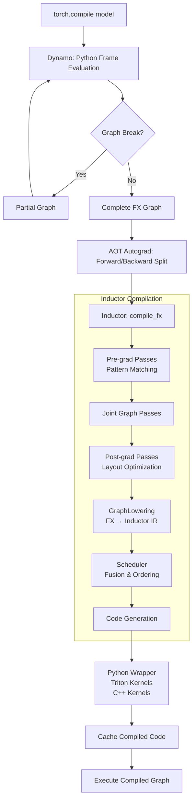
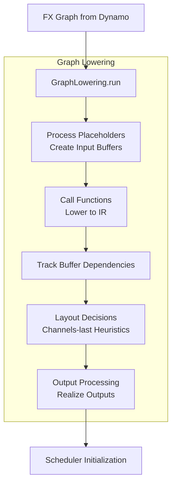
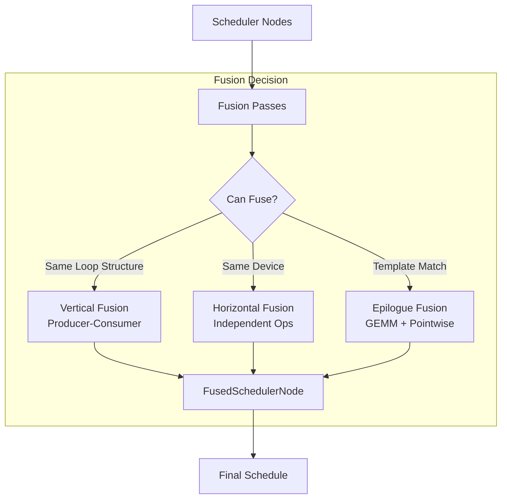
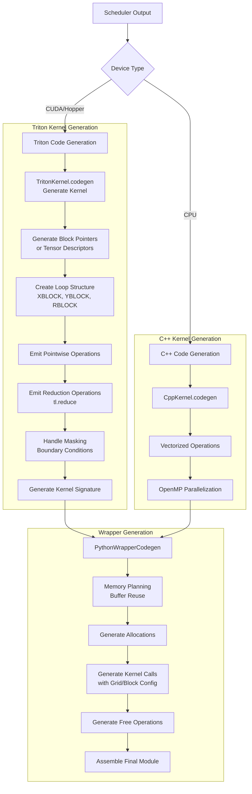
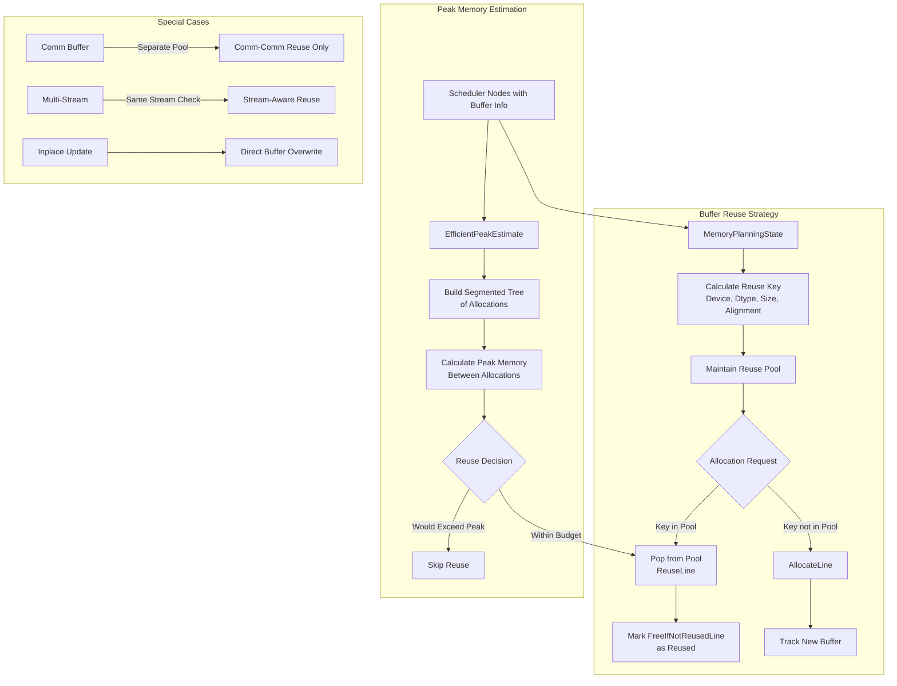
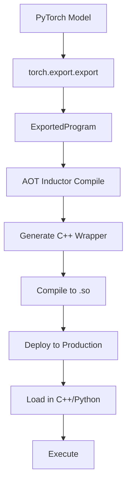

# PyTorch Inductor编译器深度分析

## 目录
1. [架构概览](#1-架构概览)
2. [编译流程](#2-编译流程)
3. [GraphLowering详解](#3-graphlowering详解)
4. [Scheduler调度器](#4-scheduler调度器)
5. [代码生成](#5-代码生成)
6. [内存规划](#6-内存规划)
7. [Triton Kernel生成](#7-triton-kernel生成)
8. [优化策略](#8-优化策略)
9. [AOT编译](#9-aot编译)

---

## 1. 架构概览

### 1.1 核心文件位置

| 组件 | 文件路径 | 行数 |
|------|----------|------|
| compile_fx | torch/_inductor/compile_fx.py | ~1286行 |
| graph | torch/_inductor/graph.py | ~2766行 |
| scheduler | torch/_inductor/scheduler.py | ~2800行 |
| wrapper | torch/_inductor/codegen/wrapper.py | ~2400行 |
| triton | torch/_inductor/codegen/triton.py | ~3800行 |
| ir | torch/_inductor/ir.py | ~5200行 |
| codecache | torch/_inductor/codecache.py | ~1841行 |

### 1.2 整体架构

```
┌─────────────────────────────────────────────────────────────┐
│                    torch.compile model                      │
└─────────────────────────────────────────────────────────────┘
                              │
                              ▼
┌─────────────────────────────────────────────────────────────┐
│                    Dynamo Frame Evaluation                  │
│              Python字节码捕获 → FX Graph                   │
└─────────────────────────────────────────────────────────────┘
                              │
                              ▼
┌─────────────────────────────────────────────────────────────┐
│                    AOT Autograd                             │
│              前向/反向图分离                               │
└─────────────────────────────────────────────────────────────┘
                              │
                              ▼
┌─────────────────────────────────────────────────────────────┐
│                    Inductor: compile_fx                     │
├─────────────────────────────────────────────────────────────┤
│  1. Pre-grad Passes     - 模式匹配                         │
│  2. Joint Graph Passes  - 前向/反向优化                    │
│  3. Post-grad Passes    - 布局优化                         │
│  4. GraphLowering       - FX → Inductor IR                │
│  5. Scheduler           - 融合与调度                       │
│  6. Code Generation     - Triton/C++代码                  │
└─────────────────────────────────────────────────────────────┘
                              │
                              ▼
┌─────────────────────────────────────────────────────────────┐
│                    Python Wrapper + Kernels                 │
│  - Triton Kernels (GPU)                                    │
│  - C++ Kernels (CPU)                                       │
└─────────────────────────────────────────────────────────────┘
```

---

## 2. 编译流程

### 2.1 torch.compile完整流程



### 2.2 compile_fx_inner核心代码

```python
# 来自torch/_inductor/compile_fx.py
def compile_fx_inner(
    gm: GraphModule,
    example_inputs: Sequence[InputType],
    cudagraphs: Optional[BoxedBool] = None,
    num_static_inputs: Optional[int] = None,
    is_backward: bool = False,
    graph_id: Optional[str] = None,
    **kwargs,
) -> OutputCode:
    # 1. 图预处理 - 检查和转换
    # 2. 缓存查找 - 避免重复编译
    # 3. 代码生成和编译
    # 4. 编译后设置
    
    # 核心调用
    return _compile_fx_inner(
        gm, example_inputs, cudagraphs, num_static_inputs,
        is_backward, graph_id, **kwargs
    )

def _compile_fx_inner(
    gm: GraphModule,
    example_inputs: Sequence[InputType],
    ...
) -> OutputCode:
    # 应用post-grad passes
    # 创建GraphLowering
    # 运行scheduler
    # 生成wrapper代码
    # 编译和缓存
```

---

## 3. GraphLowering详解

### 3.1 GraphLowering类

```python
# 来自torch/_inductor/graph.py
class GraphLowering(torch.fx.Interpreter):
    """
    将FX图转换为Inductor IR的关键职责：
    - 通过ShapeEnv进行符号形状跟踪
    - 缓冲区管理和分配
    - 操作降级注册表
    - 布局优化决策
    """
    
    def __init__(self, gm: GraphModule, ...):
        self.sizevars = SizeVarAllocator(shape_env)
        self.buffers: list[ir.Buffer] = []
        self.operations: list[ir.Operation] = []
        self.name_to_buffer: dict[str, ir.Buffer] = {}
        
    def call_function(self, target: Callable, args: Any, kwargs: dict[str, Any]) -> Any:
        """将FX操作降级为Inductor IR"""
        if target in lowerings:
            return lowerings[target](*args, **kwargs)
        # 对不支持的操作进行回退处理
```

### 3.2 IR数据结构

```python
# 来自torch/_inductor/ir.py
class Buffer(IRNode):
    """内存缓冲区的基类"""
    def __init__(self, name, layout):
        self.name = name
        self.layout = layout  # 包含device, dtype, sizes, strides
        
class ComputedBuffer(Buffer):
    """存储计算结果的缓冲区"""
    def __init__(self, name, layout, data):
        super().__init__(name, layout)
        self.data = data  # Loops/Body containing computation
        
class Pointwise(Loops):
    """逐元素操作"""
    pass
    
class Reduction(Loops):
    """归约操作（sum, max等）"""
    pass
```

### 3.3 GraphLowering流程



---

## 4. Scheduler调度器

### 4.1 Scheduler类

```python
# 来自torch/_inductor/scheduler.py
class Scheduler:
    """
    管理调度节点、融合和内核生成。
    """
    
    def __init__(self, nodes: list[ir.Operation]) -> None:
        self.nodes = [self.create_scheduler_node(n) for n in nodes]
        self.compute_dependencies()
        self.nodes = self.fuse_nodes(self.nodes)  # 关键融合步骤
        self.merge_loops()
```

### 4.2 Scheduler Node类型

```python
class SchedulerNode:
    """标准计算操作（逐元素、归约）"""
    pass

class FusedSchedulerNode:
    """融合的操作"""
    pass

class ExternKernelSchedulerNode:
    """外部内核调用（cuBLAS等）"""
    pass

class NopKernelSchedulerNode:
    """无操作"""
    pass

class ForeachKernelSchedulerNode:
    """批处理操作（组合内核）"""
    pass

class GroupedSchedulerNode:
    """临时分组的节点"""
    pass
```

### 4.3 融合策略



### 4.4 can_fuse逻辑

```python
def can_fuse(self, node1: BaseSchedulerNode, node2: BaseSchedulerNode) -> bool:
    """确定两个调度器节点是否可以融合。"""
    # 检查设备兼容性
    if node1.get_device() != node2.get_device():
        return False
        
    # 检查循环结构兼容性
    if not self.have_compatible_loop_structures(node1, node2):
        return False
        
    # 检查数据依赖
    if node2.get_name() in node1.ancestors:
        # 生产者-消费者：检查融合是否有益
        return self.should_fuse_producer_consumer(node1, node2)
    
    # 检查独立节点（水平融合）
    if self.are_independent(node1, node2):
        return self.should_fuse_independent(node1, node2)
        
    return False
```

---

## 5. 代码生成

### 5.1 Wrapper Code Generation

```python
# 来自torch/_inductor/codegen/wrapper.py
class PythonWrapperCodegen(CodeGen):
    """
    生成编排内核执行的外部包装代码。
    """
    
    def __init__(self):
        self.imports = IndentedBuffer()
        self.header = IndentedBuffer()
        self.prefix = IndentedBuffer()
        self.wrapper_call = IndentedBuffer()
        self.lines: list[Line] = []  # 内存规划行
        
    def generate(self, is_inference):
        # 1. 运行wrapper IR passes
        self.run_wrapper_ir_passes(is_inference)
        # 2. 生成内存规划
        # 3. 组装最终代码
```

### 5.2 代码生成流程



---

## 6. 内存规划

### 6.1 MemoryPlanningState

```python
class MemoryPlanningState:
    def __init__(self):
        self.reuse_pool: dict[ReuseKey, list[FreeIfNotReusedLine]] = \
            collections.defaultdict(list)
    
    def pop(self, key: ReuseKey) -> FreeIfNotReusedLine:
        item = self.reuse_pool[key].pop()
        return item
        
    def push(self, key: ReuseKey, item: FreeIfNotReusedLine) -> None:
        self.reuse_pool[key].append(item)

def buffer_reuse_key(node: BufferLike) -> ReuseKey:
    """为缓冲区重用匹配创建键。"""
    return (
        node.get_device_or_error(),
        node.get_dtype(),
        sympy_str(V.graph.sizevars.simplify(storage_size)),
        alignment,
    )
```

### 6.2 内存规划流程



---

## 7. Triton Kernel生成

### 7.1 TritonKernel类

```python
# 来自torch/_inductor/codegen/triton.py
class TritonKernel(SIMDKernel[TritonCSEVariable]):
    """
    为逐元素/归约操作生成Triton内核代码。
    """
    
    def __init__(self, tiling: dict[str, sympy.Expr], ...):
        self.cse = TritonCSE(...)  # 公共子表达式消除
        self.range_trees: list[IterationRangesRoot] = []  # 循环结构
        self.block_ptr_id = itertools.count()
        
    def codegen_kernel(self, name: str = None) -> str:
        """生成完整的Triton内核源代码"""
        code = IndentedBuffer()
        
        # 写入内核签名
        code.writeline(f"@triton.jit")
        code.writeline(f"def {name or self.name}(")
        
        # 写入参数
        for arg in self.args:
            code.writeline(f"    {arg},")
        code.writeline("):")
        
        with code.indent():
            # 初始化块指针
            for block_ptr in self.block_ptrs.values():
                code.writeline(f"{block_ptr.name} = {block_ptr.codegen_init()}")
            
            # 生成循环结构
            for tree in self.range_trees:
                code.writeline(f"{tree.codegen_start()}")
                
            # 生成计算主体
            code.splice(self.compute)
            
            # 处理归约
            if self.is_reduction():
                code.splice(self.post_loop_combine)
                code.splice(self.post_loop_store)
        
        return code.getvalue()
```

### 7.2 Triton代码生成示例

```python
# 生成的Triton内核示例
"""
@triton.jit
def triton_fused_add_mul(x_ptr, y_ptr, z_ptr, out_ptr, n_elements, BLOCK_SIZE: tl.constexpr):
    # 程序ID映射到数据范围
    pid = tl.program_id(axis=0)
    block_start = pid * BLOCK_SIZE
    offsets = block_start + tl.arange(0, BLOCK_SIZE)
    mask = offsets < n_elements
    
    # 加载数据
    x = tl.load(x_ptr + offsets, mask=mask)
    y = tl.load(y_ptr + offsets, mask=mask)
    z = tl.load(z_ptr + offsets, mask=mask)
    
    # 计算：out = (x + y) * z
    tmp = x + y
    out = tmp * z
    
    # 存储结果
    tl.store(out_ptr + offsets, out, mask=mask)
"""
```

---

## 8. 优化策略

### 8.1 布局优化

```python
def decide_layout_opt(gm: GraphModule, *, is_inference: bool) -> bool:
    """
    决定是否应启用channels-last布局优化。
    """
    conv_nodes = [n for n in gm.graph.nodes 
                  if n.target is torch.ops.aten.convolution.default]
    
    # 启发式：卷积太少则跳过
    if len(conv_nodes) == 0:
        return False
        
    # 检查组卷积（channels-last通常较慢）
    if any(is_grouped(n) for n in conv_nodes):
        return False
        
    # 检查小通道尺寸
    if all(is_small_channel(n) for n in conv_nodes):
        return False
        
    # 加权FLOP分析
    return weighted_flops_analysis(conv_nodes) <= total_flops
```

### 8.2 融合优化

1. **垂直融合**：生产者-消费者融合（如conv + relu）
2. **水平融合**：具有相同循环结构的独立操作
3. **模板融合**：将尾缀操作融合到GEMM模板
4. **组合内核**：批处理小独立内核

### 8.3 分块和自动调优

```python
class TritonKernel:
    def select_tiling(self):
        """选择最佳分块配置"""
        # 考虑因素：
        # - 数据形状
        # - 内存访问模式
        # - GPU架构（SM数量、共享内存）
        # - 自动调优缓存
        pass
```

---

## 9. AOT编译

### 9.1 AOT Inductor Runtime

```cpp
// 来自torch/csrc/inductor/aoti_runtime/interface.h
// C API for compiled models

// 加载和执行AOT编译模型
AOTInductorModelHandle model;
aoti_load_model("model.so", &model);

// 准备输入
AOTInductorTensorHandle inputs[] = {...};

// 执行
AOTInductorTensorHandle outputs[];
aoti_run_model(model, inputs, 1, outputs, 1);

// 清理
aoti_free_model(model);
```

### 9.2 AOT编译流程



---

## 10. 关键文件汇总

| 文件 | 用途 | 关键类/函数 |
|------|------|-------------|
| torch/_inductor/compile_fx.py | 主编译入口 | compile_fx_inner(), _compile_fx_inner() |
| torch/_inductor/graph.py | 图降级 | GraphLowering, lowerings registry |
| torch/_inductor/scheduler.py | 操作调度 | Scheduler, FusedSchedulerNode, can_fuse() |
| torch/_inductor/codegen/wrapper.py | 包装代码生成 | PythonWrapperCodegen, MemoryPlanningState |
| torch/_inductor/codegen/triton.py | Triton内核生成 | TritonKernel, TritonOverrides |
| torch/_inductor/ir.py | 中间表示 | Buffer, ComputedBuffer, Pointwise, Reduction |
| torch/_inductor/codegen/cpp.py | C++内核生成 | CppKernel, CppOverrides |
| torch/csrc/inductor/aoti_runtime/interface.h | AOT Inductor运行时 | C API for compiled models |
| torch/csrc/inductor/cpp_wrapper/ | C++包装模板 | 设备特定包装代码 |

---

## 11. 总结

PyTorch Inductor是一个先进的深度学习编译器：

1. **降低FX图**：到支持符号形状的IR
2. **调度操作**：使用激进的融合策略
3. **生成优化内核**：使用Triton生成GPU内核，C++生成CPU内核
4. **内存管理**：通过智能缓冲区重用和规划
5. **支持AOT编译**：用于部署场景

编译流程经过多个优化阶段，调度器在确定融合机会和操作排序方面发挥核心作用。代码生成是设备特定的，Triton通过自动调优提供高性能GPU内核。
