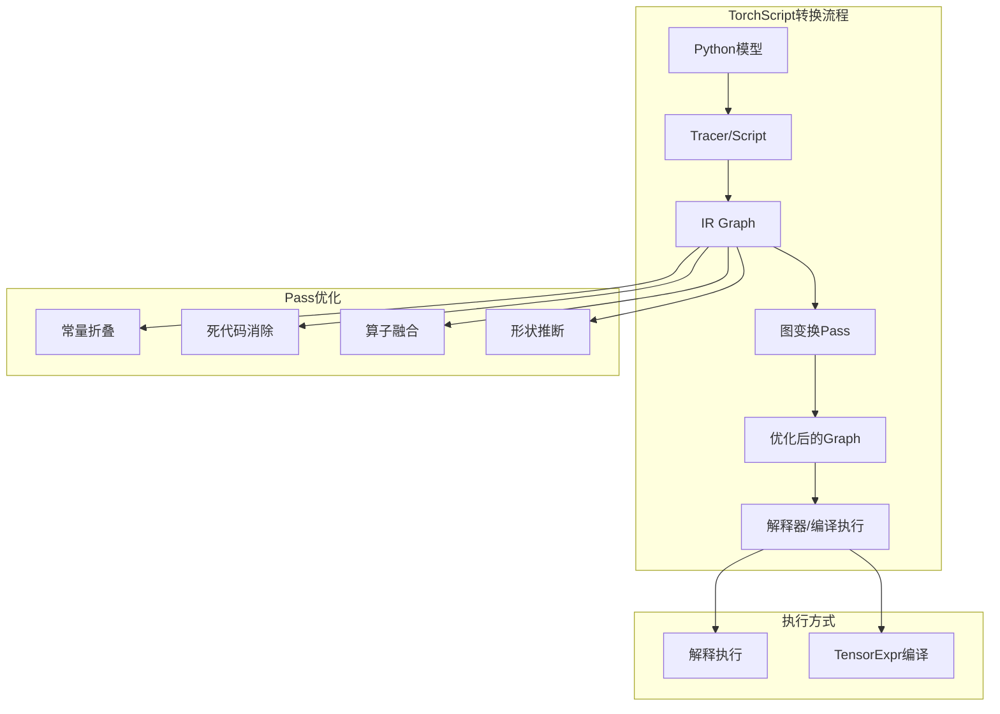
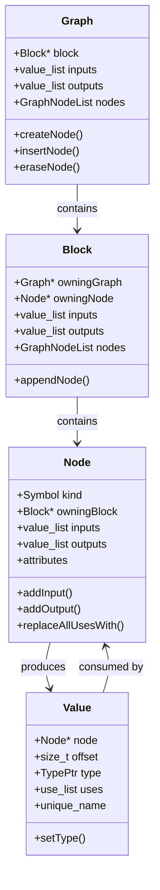
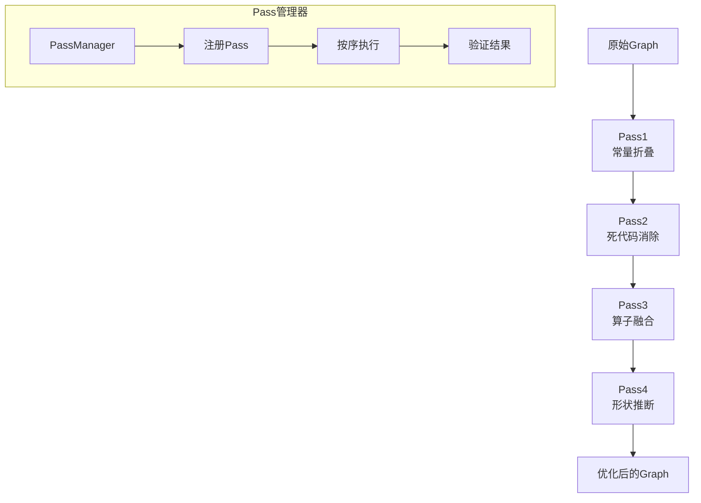
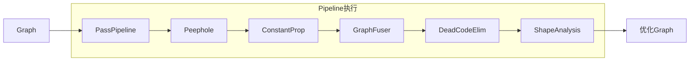
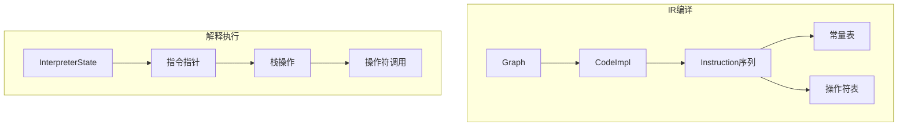
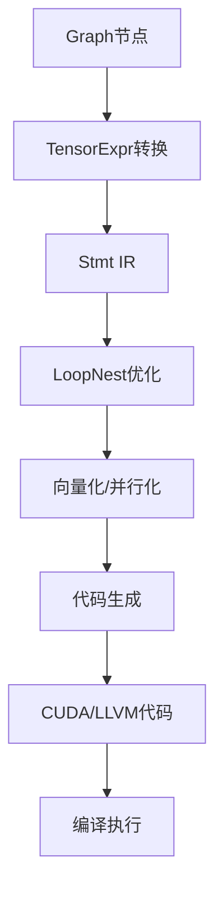
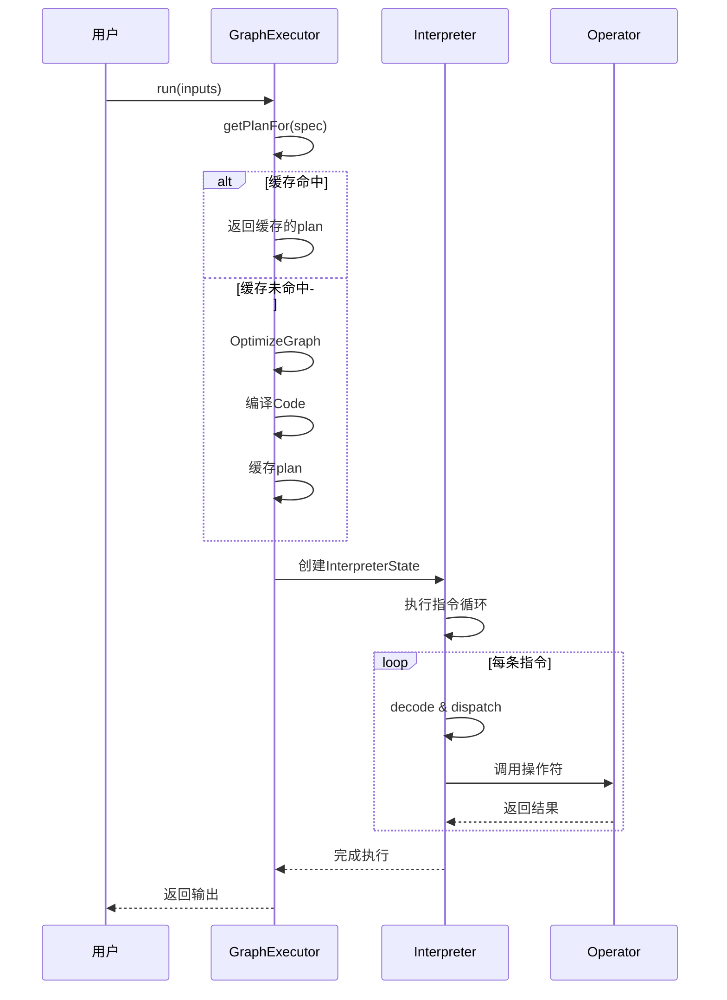

# PyTorch JIT Runtime (TorchScript运行时) 深度分析

## 目录
1. [架构概览与设计目标](#1-架构概览与设计目标)
2. [IR (Intermediate Representation)](#2-ir-intermediate-representation)
3. [图变换Pass系统](#3-图变换pass系统)
4. [解释器执行](#4-解释器执行)
5. [TensorExpr编译](#5-tensorexpr编译)
6. [图执行引擎](#6-图执行引擎)
7. [与PyTorch主栈集成](#7-与pytorch主栈集成)

---

## 1. 架构概览与设计目标

### 1.1 什么是JIT Runtime

**JIT (Just-In-Time) Runtime**是PyTorch的TorchScript执行引擎，它将Python模型转换为优化的中间表示(IR)，通过图变换优化后执行。它提供了脱离Python解释器的高性能推理能力。

### 1.2 设计目标

```
┌─────────────────────────────────────────────────────────────────┐
│                     JIT Runtime 设计目标                         │
├─────────────────────────────────────────────────────────────────┤
│  1. Python无关: 脱离Python GIL，纯C++执行推理                    │
│  2. 图优化: 通过Pass系统进行算子融合和代数简化                    │
│  3. 性能优化: TensorExpr生成高效机器码                            │
│  4. 序列化: 支持模型导出和跨平台部署                              │
│  5. 兼容性: 支持动态类型和可选类型                                │
│  6. 调试性: 保留源代码位置信息                                    │
└─────────────────────────────────────────────────────────────────┘
```

### 1.3 JIT在PyTorch中的位置



### 1.4 核心文件位置

| 组件 | 文件路径 | 描述 |
|------|----------|------|
| IR定义 | `torch/csrc/jit/ir/ir.h` | Graph/Node/Value定义 |
| Pass管理 | `torch/csrc/jit/passes/` | 图变换Pass |
| 解释器 | `torch/csrc/jit/runtime/interpreter/` | 字节码解释器 |
| TensorExpr | `torch/csrc/jit/tensorexpr/` | 张量表达式编译 |
| 执行引擎 | `torch/csrc/jit/runtime/graph_executor.cpp` | 图执行引擎 |
| 序列化 | `torch/csrc/jit/serialization/` | 模型序列化 |

---

## 2. IR (Intermediate Representation)

### 2.1 IR数据结构



### 2.2 Graph结构

```cpp
struct Graph {
  // 主block（函数体）
  Block* block() {
    return block_;
  }

  // 输入输出值
  at::ArrayRef<Value*> inputs() {
    return block_->inputs();
  }
  at::ArrayRef<Value*> outputs() {
    return block_->outputs();
  }

  // 节点迭代
  GraphNodeList nodes() {
    return block_->nodes();
  }

  // 创建节点
  Node* create(Symbol kind, size_t num_outputs=1) {
    Node* n = new Node(this, kind);
    for (size_t i = 0; i < num_outputs; i++) {
      n->addOutput();
    }
    return n;
  }

  // 插入节点
  Node* insertNode(Node* n) {
    return block_->appendNode(n);
  }

  Block* block_;
  std::string name_;
};
```

### 2.3 Node节点

```cpp
struct Node {
  NodeKind kind_;           // 节点类型（如aten::add）
  Block* owning_block_;     // 所属block
  value_list inputs_;       // 输入值
  value_list outputs_;      // 输出值
  Attributes attr_;         // 属性（如卷积参数）

  // 添加输入
  Value* addInput(Value* value) {
    inputs_.push_back(value);
    value->uses_.emplace_back(this, inputs_.size() - 1);
    return value;
  }

  // 添加输出
  Value* addOutput() {
    outputs_.push_back(new Value(this, outputs_.size()));
    return outputs_.back();
  }

  // 替换所有使用
  void replaceAllUsesWith(Node* n) {
    AT_ASSERT(outputs_.size() == n->outputs_.size());
    for (size_t i = 0; i < outputs_.size(); i++) {
      outputs_[i]->replaceAllUsesWith(n->outputs_[i]);
    }
  }
};
```

### 2.4 Value值

```cpp
struct Value {
  Node* node_;              // 产生此值的节点
  size_t offset_;           // 在节点outputs中的索引
  TypePtr type_;            // 类型信息
  use_list uses_;           // 使用此值的节点列表
  std::string unique_name_;

  // 设置类型
  Value* setType(TypePtr type) {
    type_ = std::move(type);
    return this;
  }

  // 替换所有使用
  void replaceAllUsesWith(Value* new_value) {
    for (auto& use : uses_) {
      use.user->inputs_[use.offset] = new_value;
      new_value->uses_.push_back(use);
    }
    uses_.clear();
  }

  // 检查是否有使用者
  bool hasUses() const {
    return !uses_.empty();
  }
};
```

### 2.5 IR示例

```python
# Python代码
import torch

@torch.jit.script
def foo(x, y):
    z = x + y
    w = z * 2
    return w
```

```
graph(%x.1 : Tensor,
      %y.1 : Tensor):
  %3 : int = prim::Constant[value=2]()      # 常量2
  %4 : Tensor = aten::add(%x.1, %y.1, %3)   # z = x + y
  %5 : Tensor = aten::mul(%4, %3)           # w = z * 2
  return (%5)
```

---

## 3. 图变换Pass系统

### 3.1 Pass架构



### 3.2 常用Pass类型

| Pass | 作用 | 效果 |
|------|------|------|
| ConstantPropagation | 常量传播 | 编译时计算常量表达式 |
| DeadCodeElimination | 死代码消除 | 移除不可达代码 |
| GraphFuser | 算子融合 | 将多个算子合并为融合内核 |
| PeepholeOptimize | 窥孔优化 | 局部代数化简 |
| Canonicalize | 规范化 | 统一等效表达形式 |
| Inline | 内联 | 展开函数调用 |
| LowerGradOf | 梯度下降 | 处理梯度计算 |

### 3.3 常量传播实现

```cpp
// 常量传播Pass
void ConstantPropagation(Node* n) {
  // 检查所有输入是否都是常量
  bool all_inputs_constant = true;
  for (auto input : n->inputs()) {
    if (input->node()->kind() != prim::Constant) {
      all_inputs_constant = false;
      break;
    }
  }

  if (all_inputs_constant) {
    // 获取常量值
    std::vector<IValue> constants;
    for (auto input : n->inputs()) {
      constants.push_back(toIValue(input).value());
    }

    // 执行操作
    IValue result = n->getOperation()(constants);

    // 替换为常量节点
    WithInsertPoint guard(n);
    Node* constant_node = n->owningGraph()->create(prim::Constant);
    constant_node->output()->setType(result.type());
    constant_node->ival_(attr::value, result);
    constant_node->insertBefore(n);

    n->output()->replaceAllUsesWith(constant_node->output());
    n->destroy();
  }
}
```

### 3.4 算子融合Pass

```cpp
// 融合Conv+BN+ReLU
void FuseConvBNRelu(std::shared_ptr<Graph>& graph) {
  GraphPatternMatcher matcher;

  // 定义融合模式
  auto pattern = R"IR(
    graph(%input, %weight, %bias, %bn_weight, %bn_bias, %running_mean, %running_var):
      %conv = aten::conv2d(%input, %weight, %bias, ...)
      %bn = aten::batch_norm(%conv, %bn_weight, %bn_bias, %running_mean, %running_var, ...)
      %relu = aten::relu(%bn)
      return (%relu)
  )IR";

  // 匹配并替换
  for (auto match : matcher.findMatches(graph, pattern)) {
    // 创建融合节点
    Node* fused = graph->create(prim::FusedConvBNRelu);
    fused->addInput(match.input);
    fused->addInput(match.weight);
    // ... 其他输入

    // 替换原节点
    match.relu->output()->replaceAllUsesWith(fused->output());
    match.conv->destroy();
    match.bn->destroy();
    match.relu->destroy();
  }
}
```

### 3.5 Pass执行流程



---

## 4. 解释器执行

### 4.1 解释器架构



### 4.2 指令集

```cpp
// JIT解释器指令集
enum OpCode : uint8_t {
  OP,           // 调用操作符
  LOAD,         // 加载寄存器值到栈
  STORE,        // 存储栈顶到寄存器
  MOVE,         // 寄存器间移动
  PUSH,         // 压入常量
  POP,          // 弹出栈顶
  JMP,          // 无条件跳转
  JMP_IF,       // 条件跳转
  RET,          // 返回
  LOOP,         // 循环开始
  ENTER,        // 进入作用域
  EXIT,         // 退出作用域
  // ... 更多指令
};

struct Instruction {
  OpCode op;     // 操作码
  uint8_t pad;   // 填充
  int16_t n;     // 操作数1
  int32_t x;     // 操作数2（跳转偏移等）
};
```

### 4.3 CodeImpl编译

```cpp
struct CodeImpl {
  std::vector<Instruction> instructions_;    // 指令序列
  std::vector<IValue> constant_table_;       // 常量表
  std::vector<Operation> operator_table_;    // 操作符表
  std::vector<Function*> function_table_;    // 函数表

  int register_size_ = 0;                    // 寄存器数量
  size_t n_outputs;                          // 输出数量
  size_t n_inputs;                           // 输入数量

  CodeImpl(const std::shared_ptr<Graph>& graph) {
    // 预处理图
    preprocess_.run(graph);

    // 为每个block生成指令
    emitCodeForBlock(graph->block());

    // 插入返回指令
    insertInstruction(RET);
  }

  void emitCodeForBlock(Block* block) {
    for (Node* node : block->nodes()) {
      emitNode(node);
    }
    emitInstructionsForBlockOutputs(block);
  }

  void emitNode(Node* node) {
    switch (node->kind()) {
      case prim::Constant:
        emitConstant(node);
        break;
      case prim::ListConstruct:
        emitListConstruct(node);
        break;
      case prim::TupleConstruct:
        emitTupleConstruct(node);
        break;
      default:
        emitOperator(node);
        break;
    }
  }

  void emitOperator(Node* node) {
    // 加载输入
    for (auto* input : node->inputs()) {
      emitLoad(input);
    }

    // 调用操作符
    insertInstruction(OP, operator_table_.size());
    operator_table_.push_back(node->getOperation());

    // 存储输出
    for (auto* output : node->outputs()) {
      emitStore(output);
    }
  }
};
```

### 4.4 解释器状态

```cpp
struct InterpreterState {
  std::vector<IValue> registers_;    // 寄存器文件
  std::vector<IValue> stack_;        // 操作数栈
  const CodeImpl* code_;             // 代码
  size_t pc;                         // 程序计数器

  // 执行单步
  bool runSingleInstruction() {
    const auto& inst = code_->instructions_[pc++];

    switch (inst.op) {
      case OP: {
        // 从操作符表获取操作
        auto& op = code_->operator_table_[inst.x];
        // 从栈弹出参数
        std::vector<IValue> inputs;
        for (int i = 0; i < inst.n; i++) {
          inputs.push_back(popStack());
        }
        // 执行并压入结果
        auto outputs = op(inputs);
        for (auto& out : outputs) {
          pushStack(std::move(out));
        }
        break;
      }

      case LOAD: {
        pushStack(registers_[inst.x]);
        break;
      }

      case STORE: {
        registers_[inst.x] = popStack();
        break;
      }

      case PUSH: {
        pushStack(code_->constant_table_[inst.x]);
        break;
      }

      case JMP: {
        pc += inst.x;
        break;
      }

      case JMP_IF: {
        auto cond = popStack().toBool();
        if (cond == (inst.n != 0)) {
          pc += inst.x;
        }
        break;
      }

      case RET: {
        return false;  // 执行完成
      }

      // ... 其他指令
    }

    return true;  // 继续执行
  }

  // 运行直到完成
  void run() {
    while (runSingleInstruction()) {}
  }

  void pushStack(IValue v) {
    stack_.push_back(std::move(v));
  }

  IValue popStack() {
    auto r = std::move(stack_.back());
    stack_.pop_back();
    return r;
  }
};
```

---

## 5. TensorExpr编译

### 5.1 TensorExpr架构



### 5.2 TensorExpr IR

```cpp
// 表达式
class Expr : public Node {
 public:
  Dtype dtype() const;
};

class Add : public Expr {
  Expr* lhs;
  Expr* rhs;
};

class Mul : public Expr {
  Expr* lhs;
  Expr* rhs;
};

class Var : public Expr {
  std::string name;
};

// 语句
class Stmt : public Node {};

class Store : public Stmt {
  Var* buf;
  std::vector<Expr*> indices;
  Expr* value;
};

class For : public Stmt {
  Var* var;
  Expr* start;
  Expr* stop;
  Stmt* body;
};

class Block : public Stmt {
  std::vector<Stmt*> stmts;
};
```

### 5.3 LoopNest优化

```cpp
class LoopNest {
 public:
  // 构造函数
  LoopNest(const std::vector<Tensor*>& output_tensors);

  // 循环变换
  void computeInline(Stmt* s);                    // 内联
  void splitWithTail(For* f, int factor);         // 循环分割
  void splitWithMask(For* f, int factor);         // 带mask的分割
  void reorder(For* outer, For* inner);           // 重排循环
  void tile(For* x, For* y, int x_factor, int y_factor);  // 分块
  void vectorize(For* f);                         // 向量化
  void unroll(For* f);                            // 展开
  void parallelize(For* f);                       // 并行化

  // 代码生成
  std::string codegenCuda();
  std::string codegenLlvm();
  std::string codegenC();
};
```

### 5.4 融合示例

```cpp
// 融合: out = (input + other) * 2
void fuseAddMul() {
  // 定义缓冲区
  BufHandle input("input", {M, N}, kFloat);
  BufHandle other("other", {M, N}, kFloat);
  BufHandle output("output", {M, N}, kFloat);

  // 定义计算
  Tensor* add = Compute("add", {{M, "m"}, {N, "n"}},
    [&](const VarHandle& m, const VarHandle& n) {
      return input.load(m, n) + other.load(m, n);
    });

  Tensor* mul = Compute("mul", {{M, "m"}, {N, "n"}},
    [&](const VarHandle& m, const VarHandle& n) {
      return add->call(m, n) * 2;
    });

  // 创建LoopNest并内联
  LoopNest nest({mul});
  nest.computeInline(add->buf());

  // 优化循环
  For* m = nest.getLoopStmts(mul)[0];
  For* n = nest.getLoopStmts(mul)[1];
  nest.vectorize(n);
  nest.parallelize(m);

  // 生成代码
  std::string cuda_code = nest.codegenCuda();
}
```

### 5.5 生成的CUDA代码示例

```cuda
// 融合后的CUDA内核
__global__ void fused_add_mul(float* __restrict__ input,
                               float* __restrict__ other,
                               float* __restrict__ output,
                               int M, int N) {
  int m = blockIdx.x * blockDim.x + threadIdx.x;
  int n = blockIdx.y * blockDim.y + threadIdx.y;

  if (m < M && n < N) {
    float add_result = input[m * N + n] + other[m * N + n];
    output[m * N + n] = add_result * 2;
  }
}
```

---

## 6. 图执行引擎

### 6.1 GraphExecutor

```cpp
class GraphExecutor {
 public:
  GraphExecutor(std::shared_ptr<Graph> graph, std::string function_name);

  // 执行图
  void run(Stack& inputs);

  // 获取优化后的图
  std::shared_ptr<Graph> graph() const;

 private:
  ExecutionPlan getPlanFor(Stack& inputs);

  std::shared_ptr<Graph> graph_;
  std::string function_name_;
  // 缓存不同输入形状的优化计划
  std::unordered_map<ArgumentSpec, ExecutionPlan> plan_cache_;
};

// 执行计划
struct ExecutionPlan {
  Code code;                          // 编译后的代码
  std::shared_ptr<Graph> graph;       // 优化后的图
  bool is_optimized;                  // 是否已优化
};
```

### 6.2 分析驱动的优化

```cpp
void GraphExecutor::run(Stack& inputs) {
  // 1. 根据输入推断形状和类型
  ArgumentSpec spec = inferSpec(inputs);

  // 2. 获取或创建执行计划
  ExecutionPlan plan = getPlanFor(spec);

  // 3. 执行
  InterpreterState state(plan.code);
  state.run(inputs);
}

ExecutionPlan GraphExecutor::getPlanFor(const ArgumentSpec& spec) {
  auto it = plan_cache_.find(spec);
  if (it != plan_cache_.end()) {
    return it->second;
  }

  // 创建优化后的图
  auto optimized_graph = graph_->copy();
  OptimizeGraph(optimized_graph, spec);

  // 编译代码
  Code code(optimized_graph);

  ExecutionPlan plan{code, optimized_graph, true};
  plan_cache_[spec] = plan;
  return plan;
}
```

### 6.3 执行流程



---

## 7. 与PyTorch主栈集成

### 7.1 Python到C++的绑定

```cpp
// 从Python调用TorchScript函数
PYBIND11_MODULE(TORCH_EXTENSION_NAME, m) {
  m.def("load", [](const std::string& filename) {
    auto module = torch::jit::load(filename);
    return module;
  });
}

// ScriptModule类
class ScriptModule {
 public:
  // 前向传播
  IValue forward(std::vector<IValue> inputs) {
    return method_->run(inputs);
  }

  // 调用其他方法
  IValue run_method(const std::string& method_name, std::vector<IValue> inputs) {
    auto method = find_method(method_name);
    return method->run(inputs);
  }

 private:
  std::shared_ptr<GraphExecutor> executor_;
  std::unordered_map<std::string, std::unique_ptr<Method>> methods_;
};
```

### 7.2 从Python导出模型

```python
import torch
import torch.nn as nn

class MyModel(nn.Module):
    def __init__(self):
        super().__init__()
        self.conv = nn.Conv2d(3, 16, 3)
        self.bn = nn.BatchNorm2d(16)
        self.relu = nn.ReLU()

    def forward(self, x):
        x = self.conv(x)
        x = self.bn(x)
        x = self.relu(x)
        return x

# 导出为TorchScript
model = MyModel()
scripted_model = torch.jit.script(model)

# 保存模型
scripted_model.save("model.pt")

# C++加载并执行
# auto module = torch::jit::load("model.pt");
# auto output = module.forward({input_tensor});
```

### 7.3 JIT与Eager模式对比

| 特性 | Eager模式 | JIT模式 |
|------|-----------|---------|
| 执行方式 | 立即执行 | 图编译后执行 |
| 灵活性 | 高（Python动态特性） | 低（静态图限制） |
| 性能 | 一般（Python开销） | 高（优化+无GIL） |
| 部署 | 依赖Python环境 | 纯C++，可独立部署 |
| 调试 | 容易 | 较难 |
| 适用场景 | 研究、调试 | 生产部署 |

---

## 8. 总结

### 8.1 JIT Runtime核心价值

1. **性能优化**: 通过图变换和编译生成高效代码
2. **脱离Python**: 脱离GIL限制，适合高并发推理
3. **跨平台**: 纯C++实现，支持移动和嵌入式部署
4. **图优化**: 自动算子融合、常量传播、死代码消除

### 8.2 关键设计决策

| 决策 | 理由 |
|------|------|
| SSA形式的IR | 简化分析和变换，便于优化 |
| 解释器+编译 | 平衡启动延迟和执行性能 |
| 分析驱动优化 | 根据实际输入形状生成最优代码 |
| Pass系统 | 模块化优化策略，易于扩展 |
| TensorExpr | 灵活的循环变换，生成高效内核 |

### 8.3 最佳实践

```python
# 1. 使用script模式导出
model = MyModel()
scripted = torch.jit.script(model)  # 推荐
# 或
traced = torch.jit.trace(model, example_input)

# 2. 冻结模型（进一步优化）
scripted = torch.jit.freeze(scripted)

# 3. 优化for推理
scripted = torch.jit.optimize_for_inference(scripted)

# 4. 保存和加载
scripted.save('model.pt')
loaded = torch.jit.load('model.pt')

# 5. C++部署
# #include <torch/script.h>
# torch::jit::Module module = torch::jit::load("model.pt");
# auto output = module.forward({input}).toTensor();
```
