# PyTorch nn.Module (神经网络模块) 深度分析

## 目录
1. [架构概览与设计目标](#1-架构概览与设计目标)
2. [Module基类核心机制](#2-module基类核心机制)
3. [参数与缓冲区管理](#3-参数与缓冲区管理)
4. [模块注册与树形结构](#4-模块注册与树形结构)
5. [前向传播钩子系统](#5-前向传播钩子系统)
6. [状态管理与设备迁移](#6-状态管理与设备迁移)
7. [序列化与反序列化](#7-序列化与反序列化)
8. [训练与评估模式](#8-训练与评估模式)

---

## 1. 架构概览与设计目标

### 1.1 什么是nn.Module

**nn.Module**是PyTorch神经网络的基础抽象类，所有神经网络层和模型都继承自它。它提供了统一的参数管理、设备迁移、状态保存等基础能力。

### 1.2 设计目标

```
┌─────────────────────────────────────────────────────────────────┐
│                     nn.Module 设计目标                           │
├─────────────────────────────────────────────────────────────────┤
│  1. 树形层次结构: 支持任意深度的模块嵌套                         │
│  2. 参数管理: 自动收集所有可训练参数                             │
│  3. 状态隔离: 参数、缓冲区、子模块的命名空间管理                  │
│  4. 设备无关: 透明支持CPU/CUDA等设备迁移                          │
│  5. 动态性: 支持动态构建和前向传播                               │
│  6. 可扩展: 钩子系统支持自定义行为注入                            │
│  7. 序列化: 完整的state_dict保存/加载机制                        │
└─────────────────────────────────────────────────────────────────┘
```

### 1.3 Module在PyTorch中的位置

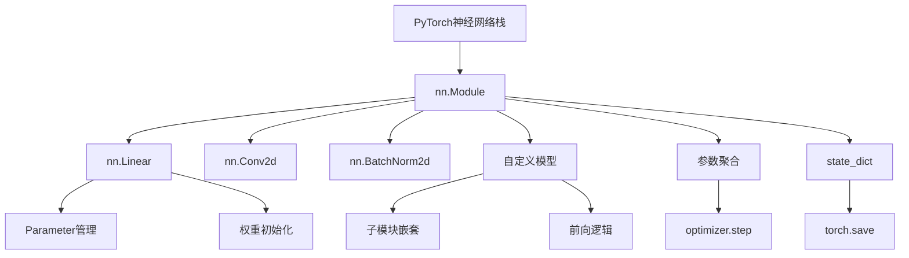

### 1.4 核心文件位置

| 组件 | 文件路径 | 描述 |
|------|----------|------|
| Module基类 | `torch/nn/modules/module.py` | nn.Module核心实现 |
| 线性层 | `torch/nn/modules/linear.py` | Linear实现示例 |
| 卷积层 | `torch/nn/modules/conv.py` | Conv实现示例 |
| 参数类 | `torch/nn/parameter.py` | Parameter类 |
| 初始化 | `torch/nn/init.py` | 权重初始化函数 |

---

## 2. Module基类核心机制

### 2.1 Module类结构

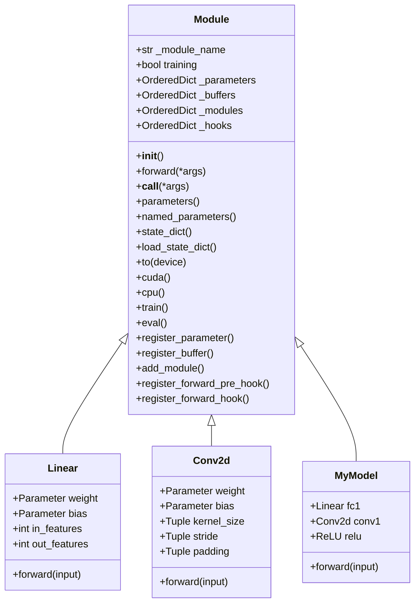

### 2.2 Module内部数据结构

```python
class Module:
    """神经网络模块基类"""

    def __init__(self):
        # 控制是否处于训练模式
        self.training = True

        # 存储参数字典
        self._parameters: Dict[str, Optional[Parameter]] = OrderedDict()

        # 存储缓冲区字典（非参数的张量，如running_mean）
        self._buffers: Dict[str, Optional[Tensor]] = OrderedDict()

        # 存储子模块字典
        self._modules: Dict[str, Optional[Module]] = OrderedDict()

        # 非持久性缓冲区（不保存到state_dict）
        self._non_persistent_buffers_set: Set[str] = set()

        # 前向钩子
        self._forward_pre_hooks: Dict[int, Callable] = OrderedDict()
        self._forward_hooks: Dict[int, Callable] = OrderedDict()

        # 反向钩子
        self._backward_hooks: Dict[int, Callable] = OrderedDict()

        # 钩子ID计数器
        self._forward_pre_hooks_with_kwargs: Dict[int, bool] = {}
        self._forward_hooks_with_kwargs: Dict[int, bool] = {}
        self._forward_hooks_always_called: Dict[int, bool] = {}
```

### 2.3 模块调用链

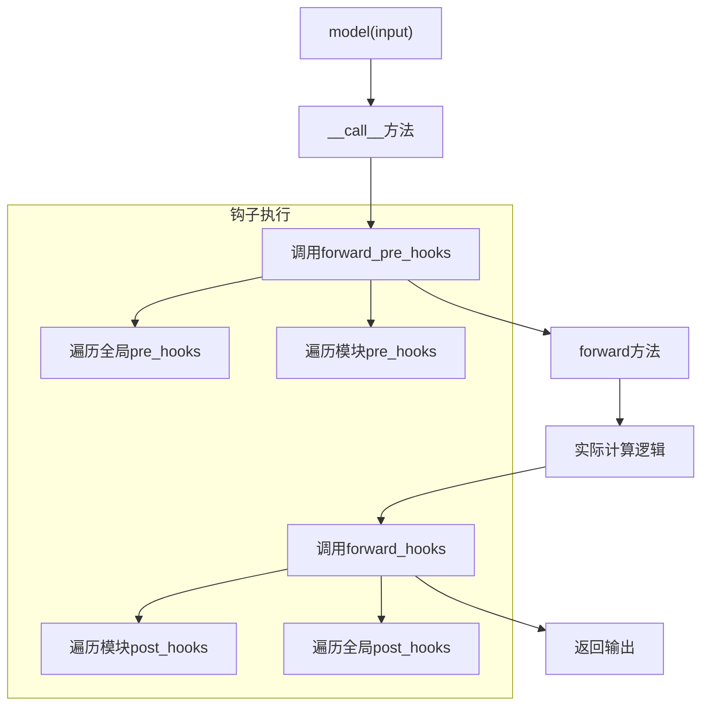

### 2.4 __call__方法实现

```python
class Module:
    def __call__(self, *args, **kwargs):
        """调用前向传播，触发钩子"""
        # 1. 执行前向传播前钩子
        for hook in self._forward_pre_hooks.values():
            result = hook(self, args)
            if result is not None:
                args = result

        # 2. 调用forward
        result = self.forward(*args, **kwargs)

        # 3. 执行前向传播后钩子
        for hook in self._forward_hooks.values():
            hook_result = hook(self, args, result)
            if hook_result is not None:
                result = hook_result

        return result

    def forward(self, *args, **kwargs):
        """子类必须实现此方法"""
        raise NotImplementedError
```

---

## 3. 参数与缓冲区管理

### 3.1 Parameter与Buffer的区别

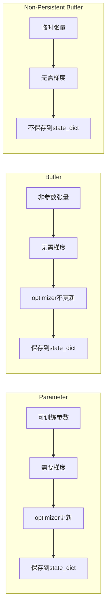

### 3.2 参数注册机制

```python
class Module:
    def register_parameter(self, name: str, param: Optional[Parameter]):
        """注册一个参数到模块"""
        if param is None:
            self._parameters[name] = None
        elif not isinstance(param, Parameter):
            raise TypeError(f"参数必须是Parameter类型，不是 {type(param)}")
        else:
            # 使用object.__setattr__避免递归
            object.__setattr__(self, name, param)
            self._parameters[name] = param

    def __setattr__(self, name: str, value: Any):
        """重载属性设置，自动识别Parameter和Module"""
        if isinstance(value, Parameter):
            # 移除旧的参数
            self._parameters.pop(name, None)
            # 注册新参数
            self.register_parameter(name, value)
        elif isinstance(value, Module):
            # 注册子模块
            self.add_module(name, value)
        else:
            object.__setattr__(self, name, value)

    def parameters(self, recurse: bool = True):
        """返回所有参数的迭代器"""
        for name, param in self.named_parameters(recurse=recurse):
            yield param

    def named_parameters(self, prefix: str = '', recurse: bool = True):
        """返回所有参数及其名称的迭代器"""
        modules = self.named_modules(prefix=prefix) if recurse else [(prefix, self)]
        for module_prefix, module in modules:
            for name, param in module._parameters.items():
                if param is not None:
                    yield module_prefix + ('.' if module_prefix else '') + name, param
```

### 3.3 缓冲区注册

```python
class Module:
    def register_buffer(self, name: str, tensor: Optional[Tensor], persistent: bool = True):
        """注册缓冲区（如BatchNorm的running_mean）"""
        if persistent:
            self._buffers[name] = tensor
        else:
            self._buffers[name] = tensor
            self._non_persistent_buffers_set.add(name)

        # 设置属性
        object.__setattr__(self, name, tensor)

# 使用示例
class BatchNorm2d(Module):
    def __init__(self, num_features):
        super().__init__()
        # 可训练参数
        self.weight = Parameter(torch.ones(num_features))
        self.bias = Parameter(torch.zeros(num_features))

        # 持久缓冲区
        self.register_buffer('running_mean', torch.zeros(num_features))
        self.register_buffer('running_var', torch.ones(num_features))

        # 非持久缓冲区
        self.register_buffer('num_batches_tracked', torch.tensor(0), persistent=False)
```

### 3.4 参数遍历流程

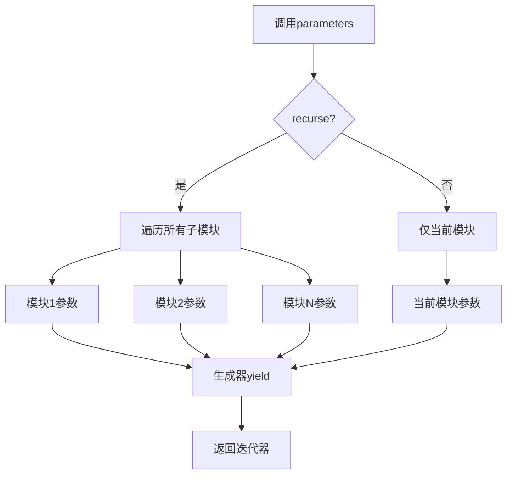

---

## 4. 模块注册与树形结构

### 4.1 模块树形结构

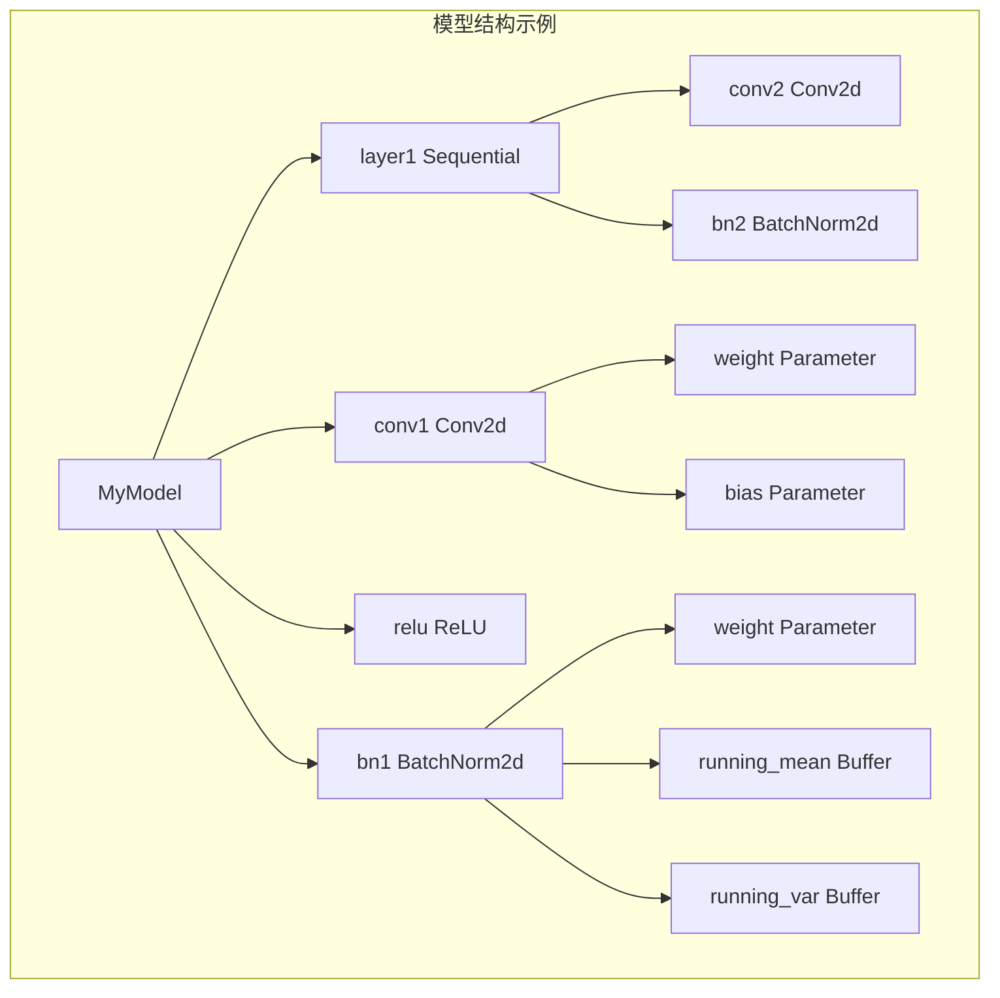

### 4.2 模块注册机制

```python
class Module:
    def add_module(self, name: str, module: Optional[Module]):
        """添加子模块"""
        if module is None:
            self._modules[name] = None
        elif not isinstance(module, Module):
            raise TypeError(f"必须是Module类型，不是 {type(module)}")
        else:
            # 使用object.__setattr__避免递归
            object.__setattr__(self, name, module)
            self._modules[name] = module

    def named_modules(self, memo: Optional[Set] = None, prefix: str = ''):
        """返回所有子模块的迭代器"""
        if memo is None:
            memo = set()

        # 检查循环引用
        if self not in memo:
            memo.add(self)
            yield prefix, self

            # 递归遍历子模块
            for name, module in self._modules.items():
                if module is None:
                    continue
                submodule_prefix = prefix + ('.' if prefix else '') + name
                yield from module.named_modules(memo, submodule_prefix)

    def modules(self):
        """返回所有子模块（不含名称）"""
        for _, module in self.named_modules():
            yield module

    def children(self):
        """返回直接子模块"""
        for _, module in self.named_children():
            yield module

    def named_children(self):
        """返回直接子模块及其名称"""
        for name, module in self._modules.items():
            if module is not None:
                yield name, module
```

### 4.3 模块树遍历示例

```python
class MyModel(nn.Module):
    def __init__(self):
        super().__init__()
        self.conv1 = nn.Conv2d(3, 64, 3)
        self.bn1 = nn.BatchNorm2d(64)
        self.layer1 = nn.Sequential(
            nn.Conv2d(64, 128, 3),
            nn.BatchNorm2d(128)
        )

model = MyModel()

# 遍历所有参数
for name, param in model.named_parameters():
    print(f"{name}: {param.shape}")
# 输出:
# conv1.weight: [64, 3, 3, 3]
# conv1.bias: [64]
# bn1.weight: [64]
# bn1.bias: [64]
# layer1.0.weight: [128, 64, 3, 3]
# layer1.0.bias: [128]
# layer1.1.weight: [64]
# layer1.1.bias: [64]

# 遍历所有模块
for name, module in model.named_modules():
    print(f"{name}: {type(module).__name__}")
# 输出:
# : MyModel
# conv1: Conv2d
# bn1: BatchNorm2d
# layer1: Sequential
# layer1.0: Conv2d
# layer1.1: BatchNorm2d
```

---

## 5. 前向传播钩子系统

### 5.1 钩子类型

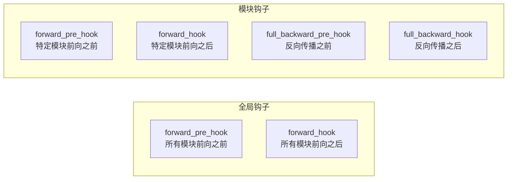

### 5.2 钩子注册与调用

```python
class Module:
    def register_forward_pre_hook(self, hook: Callable, with_kwargs: bool = False):
        """注册前向传播前钩子

        Args:
            hook: 可调用对象，签名: hook(module, input) -> modified_input
            with_kwargs: 是否传递kwargs给钩子

        Returns:
            RemovableHandle: 可用于移除钩子的句柄
        """
        handle = hooks.RemovableHandle(self._forward_pre_hooks)
        self._forward_pre_hooks[handle.id] = hook
        self._forward_pre_hooks_with_kwargs[handle.id] = with_kwargs
        return handle

    def register_forward_hook(self, hook: Callable, with_kwargs: bool = False):
        """注册前向传播后钩子

        Args:
            hook: 可调用对象，签名: hook(module, input, output) -> modified_output
        """
        handle = hooks.RemovableHandle(self._forward_hooks)
        self._forward_hooks[handle.id] = hook
        self._forward_hooks_with_kwargs[handle.id] = with_kwargs
        return handle

    def register_full_backward_hook(self, hook: Callable):
        """注册完整反向传播钩子

        Args:
            hook: 可调用对象，签名: hook(module, grad_input, grad_output)
        """
        handle = hooks.RemovableHandle(self._backward_hooks)
        self._backward_hooks[handle.id] = hook
        return handle
```

### 5.3 钩子执行流程

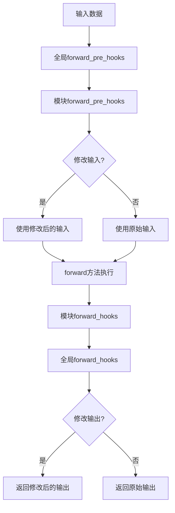

### 5.4 钩子使用示例

```python
# 示例1: 特征可视化钩子
activations = {}
def forward_hook(module, input, output):
    """保存中间层激活值"""
    activations[module.__class__.__name__] = output.detach()

model.layer1.register_forward_hook(forward_hook)

# 示例2: 梯度裁剪钩子
def backward_hook(module, grad_input, grad_output):
    """梯度裁剪"""
    return tuple(g.clamp(-1, 1) if g is not None else g for g in grad_input)

model.conv1.register_full_backward_hook(backward_hook)

# 示例3: 输入检查钩子
def pre_hook(module, args):
    """检查输入形状"""
    x = args[0]
    assert x.dim() == 4, f"期望4D输入，得到{input.dim()}D"
    return args

model.conv1.register_forward_pre_hook(pre_hook)
```

---

## 6. 状态管理与设备迁移

### 6.1 设备迁移流程

```mermaid
flowchart TD
    A["model.to(device)"] --> B[遍历所有参数]
    B --> C[遍历所有缓冲区]
    C --> D[递归处理子模块]

    D --> E[参数.to(device)]
    D --> F[缓冲区.to(device)]

    E --> G[更新存储位置]
    F --> G
```

### 6.2 to()方法实现

```python
class Module:
    def to(self, *args, **kwargs):
        """迁移模块到指定设备或转换数据类型

        Args:
            device: 目标设备 ('cpu', 'cuda:0'等)
            dtype: 目标数据类型 (torch.float32, torch.float16等)

        Returns:
            self
        """
        device, dtype, non_blocking, convert_to_format = torch._C._nn._parse_to(*args, **kwargs)

        if dtype is not None:
            if not (dtype.is_floating_point or dtype.is_complex):
                raise TypeError('to()只接受浮点或复数类型')

        def convert(t):
            """转换单个张量"""
            if convert_to_format is not None and t.dim() in (4, 5):
                # 转换内存格式 (channels_last)
                return t.to(device, dtype, non_blocking, memory_format=convert_to_format)
            return t.to(device, dtype, non_blocking)

        # 应用到所有参数和缓冲区
        return self._apply(convert)

    def _apply(self, fn):
        """对所有子模块、参数和缓冲区应用函数"""
        for module in self.children():
            module._apply(fn)

        for key, param in self._parameters.items():
            if param is not None:
                self._parameters[key] = fn(param)

        for key, buf in self._buffers.items():
            if buf is not None:
                self._buffers[key] = fn(buf)

        return self

    def cuda(self, device=None):
        """迁移到CUDA"""
        return self._apply(lambda t: t.cuda(device))

    def cpu(self):
        """迁移到CPU"""
        return self._apply(lambda t: t.cpu())

    def half(self):
        """转换为FP16"""
        return self._apply(lambda t: t.half() if t.is_floating_point() else t)

    def float(self):
        """转换为FP32"""
        return self._apply(lambda t: t.float() if t.is_floating_point() else t)
```

### 6.3 设备与dtype状态

```python
class Module:
    @property
    def device(self):
        """获取模块所在设备（从第一个参数推断）"""
        for param in self.parameters():
            return param.device
        for buf in self.buffers():
            return buf.device
        return None

    @property
    def dtype(self):
        """获取模块数据类型（从第一个参数推断）"""
        for param in self.parameters():
            return param.dtype
        for buf in self.buffers():
            return buf.dtype
        return None
```

---

## 7. 序列化与反序列化

### 7.1 state_dict结构

```mermaid
flowchart TD
    subgraph "state_dict结构"
        A[state_dict] --> B[参数]
        A --> C[缓冲区]

        B --> B1[conv1.weight Tensor]
        B --> B2[conv1.bias Tensor]
        B --> B3[fc.weight Tensor]

        C --> C1[bn.running_mean Tensor]
        C --> C2[bn.running_var Tensor]
        C --> C3[bn.num_batches_tracked Tensor]
    end
```

### 7.2 state_dict实现

```python
class Module:
    def state_dict(self, destination=None, prefix='', keep_vars=False):
        """返回模块的状态字典

        Args:
            destination: 目标字典（用于递归）
            prefix: 键前缀
            keep_vars: 是否保持Variable包装

        Returns:
            OrderedDict: 包含参数和缓冲区的字典
        """
        if destination is None:
            destination = OrderedDict()

        # 保存参数
        for name, param in self._parameters.items():
            if param is not None:
                destination[prefix + name] = param if keep_vars else param.detach()

        # 保存持久缓冲区
        for name, buf in self._buffers.items():
            if buf is not None and name not in self._non_persistent_buffers_set:
                destination[prefix + name] = buf if keep_vars else buf.detach()

        # 递归保存子模块
        for name, module in self._modules.items():
            if module is not None:
                module.state_dict(destination, prefix + name + '.', keep_vars)

        return destination

    def load_state_dict(self, state_dict, strict=True):
        """从state_dict加载状态

        Args:
            state_dict: 包含参数和缓冲区的字典
            strict: 是否严格执行大小和键匹配

        Returns:
            _IncompatibleKeys: 缺失和意外的键
        """
        missing_keys = []
        unexpected_keys = []
        error_msgs = []

        # 获取当前模块的状态
        local_state = {}
        for name, param in self._parameters.items():
            if param is not None:
                local_state[name] = param
        for name, buf in self._buffers.items():
            if buf is not None and name not in self._non_persistent_buffers_set:
                local_state[name] = buf

        # 加载参数
        for name, param in local_state.items():
            key = prefix + name
            if key in state_dict:
                input_param = state_dict[key]
                # 检查形状匹配
                if input_param.shape != param.shape:
                    error_msgs.append(f"size mismatch for {key}")
                    continue
                # 复制数据
                param.copy_(input_param)
            else:
                missing_keys.append(key)

        # 检查意外的键
        if strict:
            for key in state_dict.keys():
                if key not in local_state:
                    unexpected_keys.append(key)

        return _IncompatibleKeys(missing_keys, unexpected_keys)
```

### 7.3 保存与加载流程

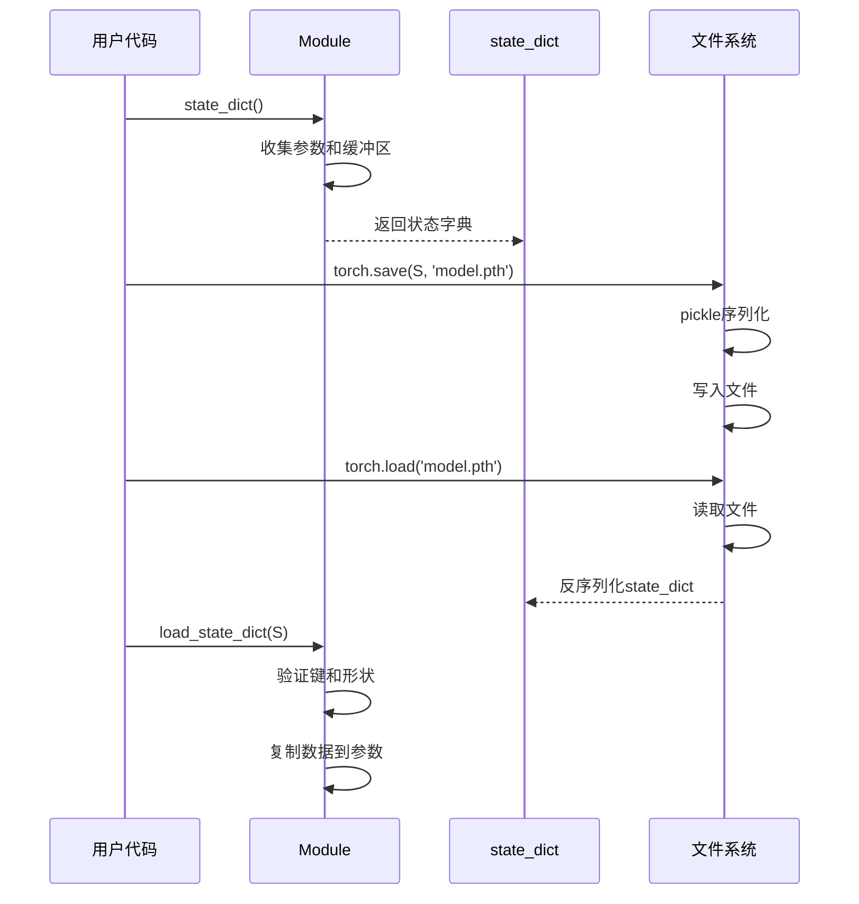

---

## 8. 训练与评估模式

### 8.1 train/eval切换

```python
class Module:
    def train(self, mode: bool = True):
        """设置训练模式

        训练模式会影响:
        - Dropout: 启用随机失活
        - BatchNorm: 使用batch统计，更新running_mean/var
        """
        self.training = mode
        for module in self.children():
            module.train(mode)
        return self

    def eval(self):
        """设置评估模式

        等价于 train(False)

        评估模式会影响:
        - Dropout: 禁用，保持所有神经元
        - BatchNorm: 使用running_mean/var，不更新统计
        """
        return self.train(False)

    def requires_grad_(self, requires_grad: bool = True):
        """设置所有参数是否需要梯度"""
        for param in self.parameters():
            param.requires_grad_(requires_grad)
        return self
```

### 8.2 模式对层行为的影响

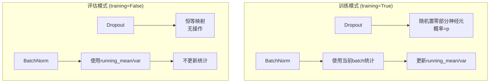

### 8.3 使用示例

```python
model = MyModel()

# 训练模式
model.train()
# - Dropout启用
# - BatchNorm使用batch统计
for data, target in train_loader:
    output = model(data)
    loss = criterion(output, target)
    loss.backward()
    optimizer.step()

# 评估模式
model.eval()
# - Dropout禁用
# - BatchNorm使用全局统计
with torch.no_grad():
    for data, target in test_loader:
        output = model(data)
        # 评估...
```

---

## 9. 总结

### 9.1 nn.Module核心价值

1. **统一抽象**: 为所有神经网络层提供统一接口
2. **树形结构**: 支持任意复杂的网络层次结构
3. **参数管理**: 自动收集和管理可训练参数
4. **设备透明**: 无缝支持CPU/GPU等设备迁移
5. **可扩展性**: 钩子系统支持自定义行为
6. **序列化**: 完整的模型保存/加载机制

### 9.2 关键设计决策

| 决策 | 理由 |
|------|------|
| __setattr__重载 | 自动识别Parameter和Module，简化注册 |
| OrderedDict | 保持注册顺序，便于调试和检查 |
| 递归遍历 | 支持任意深度的模块嵌套 |
| 钩子系统 | 在不修改模块代码的情况下注入行为 |
| state_dict | 灵活的序列化，支持部分加载 |

### 9.3 最佳实践

```python
# 1. 正确定义forward方法
class MyModule(nn.Module):
    def __init__(self):
        super().__init__()
        self.linear = nn.Linear(10, 5)

    def forward(self, x):  # 必须实现
        return torch.relu(self.linear(x))

# 2. 使用register_buffer保存非参数状态
self.register_buffer('running_mean', torch.zeros(num_features))

# 3. 设备迁移
model = model.to(device)  # 推荐
# 或
model = model.cuda()       # GPU
model = model.cpu()        # CPU

# 4. 训练/评估切换
model.train()  # 训练
model.eval()   # 评估，会禁用dropout和batchnorm更新

# 5. 保存和加载
torch.save(model.state_dict(), 'model.pth')
model.load_state_dict(torch.load('model.pth'))

# 6. 冻结部分参数
for param in model.base.parameters():
    param.requires_grad = False
```
