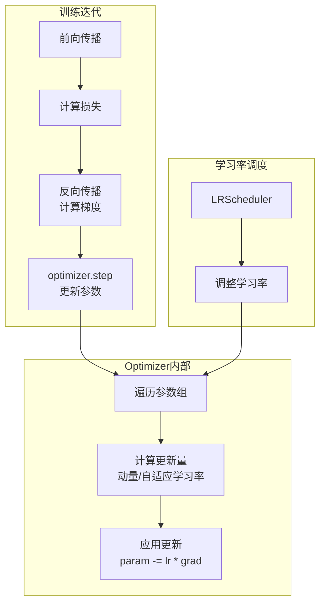
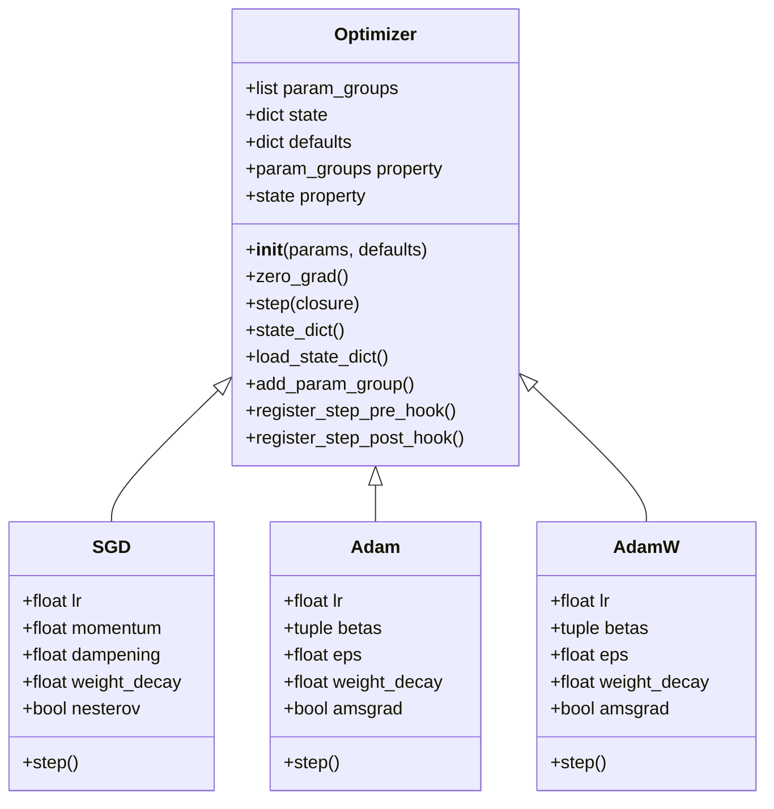
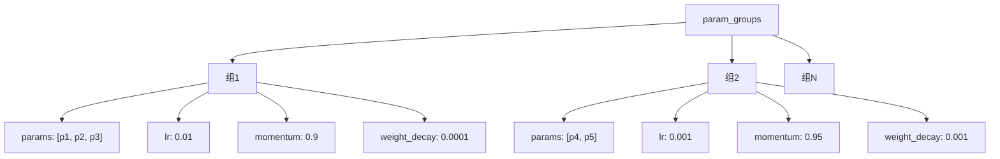
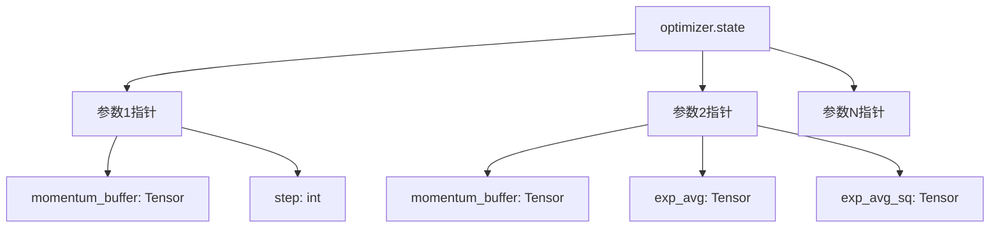
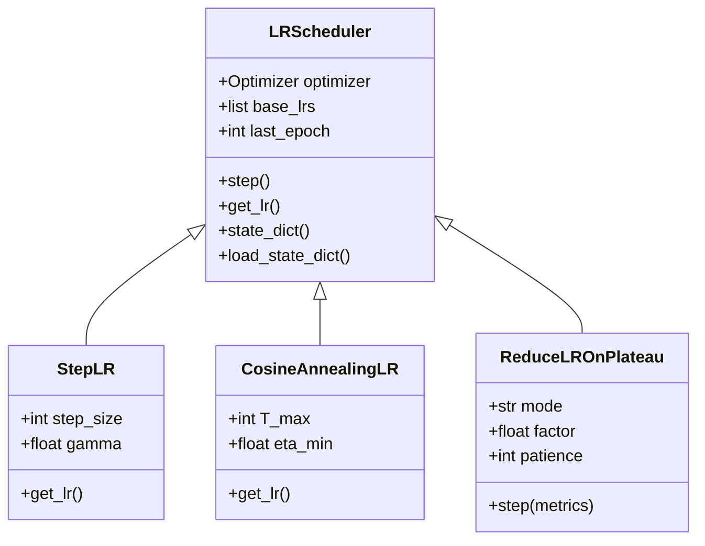
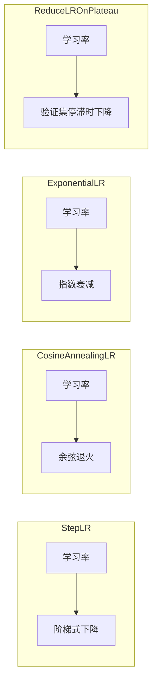
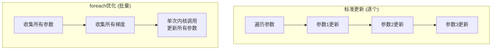

# PyTorch Optimizer (优化器) 深度分析

## 目录
1. [架构概览与设计目标](#1-架构概览与设计目标)
2. [Optimizer基类核心机制](#2-optimizer基类核心机制)
3. [参数组管理](#3-参数组管理)
4. [状态管理](#4-状态管理)
5. [学习率调度器](#5-学习率调度器)
6. [foreach与fused优化](#6-foreach与fused优化)
7. [常见优化器算法](#7-常见优化器算法)

---

## 1. 架构概览与设计目标

### 1.1 什么是Optimizer

**Optimizer**是PyTorch中用于更新模型参数的优化算法实现。它封装了梯度下降的各种变体（SGD、Adam、AdamW等），并提供统一的状态管理和参数更新接口。

### 1.2 设计目标

```
┌─────────────────────────────────────────────────────────────────┐
│                     Optimizer 设计目标                           │
├─────────────────────────────────────────────────────────────────┤
│  1. 算法抽象: 统一接口支持多种优化算法                           │
│  2. 参数分组: 支持不同参数组使用不同超参数                       │
│  3. 状态管理: 自动保存/加载优化器状态（动量等）                  │
│  4. 性能优化: foreach/fused模式加速多参数更新                    │
│  5. 学习率调度: 与学习率调度器无缝集成                            │
│  6. 类型安全: 支持 differentiable 模式                           │
└─────────────────────────────────────────────────────────────────┘
```

### 1.3 Optimizer在训练流程中的位置



### 1.4 核心文件位置

| 组件 | 文件路径 | 描述 |
|------|----------|------|
| Optimizer基类 | `torch/optim/optimizer.py` | 优化器基类实现 |
| SGD | `torch/optim/sgd.py` | 随机梯度下降 |
| Adam | `torch/optim/adam.py` | Adam优化器 |
| AdamW | `torch/optim/adamw.py` | Adam with Weight Decay |
| LR Scheduler | `torch/optim/lr_scheduler.py` | 学习率调度器 |
| foreach工具 | `torch/_utils/foreach_utils.py` | foreach辅助函数 |

---

## 2. Optimizer基类核心机制

### 2.1 Optimizer类结构



### 2.2 Optimizer基类实现

```python
class Optimizer:
    """优化器基类"""

    def __init__(self, params, defaults):
        """
        Args:
            params: 可迭代参数或参数组字典
            defaults: 默认超参数字典
        """
        self.defaults = defaults
        self.state = defaultdict(dict)  # 每个参数的状态
        self.param_groups = []          # 参数组列表

        # 处理参数输入
        param_groups = list(params)
        if len(param_groups) == 0:
            raise ValueError("optimizer got an empty parameter list")

        # 检查是否为参数组列表
        if not isinstance(param_groups[0], dict):
            param_groups = [{'params': param_groups}]

        # 验证并添加参数组
        for param_group in param_groups:
            self.add_param_group(param_group)

    def zero_grad(self, set_to_none: bool = False):
        """清零所有参数的梯度

        Args:
            set_to_none: 是否将梯度设为None而非0
                        True时可减少内存峰值
        """
        for group in self.param_groups:
            for p in group['params']:
                if p.grad is not None:
                    if set_to_none:
                        p.grad = None
                    else:
                        p.grad.detach_()
                        p.grad.zero_()

    def step(self, closure: Optional[Callable] = None):
        """执行单步优化

        Args:
            closure: 可选的闭包函数，重新计算损失

        Returns:
            闭包返回的损失值（如果有）
        """
        raise NotImplementedError

    def state_dict(self) -> Dict[str, Any]:
        """返回优化器状态字典"""
        return {
            'state': self.state,
            'param_groups': self.param_groups,
        }

    def load_state_dict(self, state_dict: Dict[str, Any]):
        """从状态字典加载"""
        self.state = state_dict['state']
        self.param_groups = state_dict['param_groups']
```

### 2.3 参数组数据结构



---

## 3. 参数组管理

### 3.1 参数组设计

```python
class Optimizer:
    def add_param_group(self, param_group: Dict[str, Any]):
        """添加参数组

        参数组允许为不同参数设置不同超参数
        """
        # 验证参数组包含必要键
        assert 'params' in param_group, "param_group must contain 'params' key"

        params = param_group['params']
        if isinstance(params, torch.Tensor):
            param_group['params'] = [params]
        elif isinstance(params, set):
            raise TypeError("optimizer parameters need to be organized in ordered collections")
        else:
            param_group['params'] = list(params)

        # 使用默认超参数填充缺失值
        for name, default in self.defaults.items():
            if default is required and name not in param_group:
                raise ValueError(f"parameter group didn't specify a value of {name}")
            param_group.setdefault(name, default)

        # 参数类型验证
        params = param_group['params']
        for param in params:
            if not isinstance(param, torch.Tensor):
                raise TypeError("optimizer can only optimize Tensors")
            if not param.is_leaf:
                raise ValueError("can't optimize a non-leaf Tensor")

        self.param_groups.append(param_group)
```

### 3.2 参数组使用示例

```python
# 1. 单组（默认）
optimizer = torch.optim.SGD(model.parameters(), lr=0.01)

# 2. 多组（不同学习率）
optimizer = torch.optim.SGD([
    {'params': model.base.parameters(), 'lr': 0.001},  # 预训练部分较小学习率
    {'params': model.classifier.parameters(), 'lr': 0.01}  # 新层较大学习率
], momentum=0.9)

# 3. 多组（不同超参数）
optimizer = torch.optim.AdamW([
    {'params': model.fc1.parameters(), 'lr': 1e-4, 'weight_decay': 0.01},
    {'params': model.fc2.parameters(), 'lr': 1e-3, 'weight_decay': 0.001},
], lr=1e-3)  # 默认参数
```

### 3.3 参数状态管理

```python
class Optimizer:
    @property
    def state(self):
        """返回优化器状态字典

        状态格式: {parameter_ptr: {'momentum_buffer': ..., 'step': ...}}
        """
        return self._state

    def _init_state(self, param, state_key, initial_value):
        """初始化参数状态"""
        param_state = self.state[param]
        if state_key not in param_state:
            param_state[state_key] = initial_value
        return param_state[state_key]

# SGD示例：初始化动量缓冲区
class SGD(Optimizer):
    def step(self, closure=None):
        for group in self.param_groups:
            momentum = group['momentum']
            for p in group['params']:
                if p.grad is None:
                    continue

                d_p = p.grad

                # 初始化动量缓冲区
                if momentum != 0:
                    param_state = self.state[p]
                    if 'momentum_buffer' not in param_state:
                        buf = param_state['momentum_buffer'] = torch.zeros_like(p.data)
                    else:
                        buf = param_state['momentum_buffer']
                    # 更新动量
                    buf.mul_(momentum).add_(d_p, alpha=1 - dampening)
                    d_p = buf
```

---

## 4. 状态管理

### 4.1 状态结构



### 4.2 状态保存与加载

```python
class Optimizer:
    def state_dict(self) -> Dict[str, Any]:
        """返回优化器状态字典

        Returns:
            {
                'state': {
                    param_id: {
                        'momentum_buffer': tensor,
                        'step': int,
                        ...
                    },
                    ...
                },
                'param_groups': [
                    {
                        'params': [param_id1, param_id2, ...],
                        'lr': float,
                        'momentum': float,
                        ...
                    },
                    ...
                ]
            }
        """
        # 将参数指针转换为id
        state = {
            id(p): v for p, v in self.state.items()
        }

        # 复制参数组，将参数转换为id
        param_groups = []
        for group in self.param_groups:
            param_group = {k: v for k, v in group.items()}
            param_group['params'] = [id(p) for p in group['params']]
            param_groups.append(param_group)

        return {
            'state': state,
            'param_groups': param_groups,
        }

    def load_state_dict(self, state_dict: Dict[str, Any]):
        """加载优化器状态"""
        # 验证参数组匹配
        if len(state_dict['param_groups']) != len(self.param_groups):
            raise ValueError("参数组数量不匹配")

        # 建立参数id到参数的映射
        id_map = {
            id(p): p for group in self.param_groups for p in group['params']
        }

        # 加载状态
        self.state = {
            id_map.get(k, k): v for k, v in state_dict['state'].items()
        }

        # 加载参数组（除params外的其他属性）
        for i, group in enumerate(self.param_groups):
            saved_group = state_dict['param_groups'][i]
            for key, value in saved_group.items():
                if key != 'params':
                    group[key] = value
```

### 4.3 状态保存示例

```python
# 保存检查点
checkpoint = {
    'epoch': epoch,
    'model_state_dict': model.state_dict(),
    'optimizer_state_dict': optimizer.state_dict(),
    'loss': loss,
}
torch.save(checkpoint, 'checkpoint.pth')

# 加载检查点恢复训练
checkpoint = torch.load('checkpoint.pth')
model.load_state_dict(checkpoint['model_state_dict'])
optimizer.load_state_dict(checkpoint['optimizer_state_dict'])
epoch = checkpoint['epoch']
loss = checkpoint['loss']

# 继续训练
model.train()
for data, target in train_loader:
    optimizer.zero_grad()
    output = model(data)
    loss = criterion(output, target)
    loss.backward()
    optimizer.step()
```

---

## 5. 学习率调度器

### 5.1 LRScheduler架构



### 5.2 LRScheduler基类

```python
class LRScheduler:
    """学习率调度器基类"""

    def __init__(self, optimizer: Optimizer, last_epoch: int = -1):
        # 附加优化器
        self.optimizer = optimizer

        # 记录初始学习率
        if last_epoch == -1:
            for group in optimizer.param_groups:
                group.setdefault('initial_lr', group['lr'])

        self.base_lrs = [group['initial_lr'] for group in optimizer.param_groups]
        self.last_epoch = last_epoch

        self._initial_step()

    def _initial_step(self):
        """初始化步数计数"""
        self._step_count = 0
        self.step()

    def step(self, epoch: Optional[int] = None):
        """执行调度步进

        应该在每个epoch后调用
        """
        self._step_count += 1

        if epoch is None:
            self.last_epoch += 1
        else:
            warnings.warn("epoch参数已弃用")
            self.last_epoch = epoch

        # 计算并更新学习率
        for param_group, lr in zip(self.optimizer.param_groups, self.get_lr()):
            param_group['lr'] = lr

    def get_lr(self) -> List[float]:
        """计算新的学习率

        子类必须实现此方法
        """
        raise NotImplementedError

    def state_dict(self) -> Dict[str, Any]:
        """返回调度器状态"""
        return {key: value for key, value in self.__dict__.items()
                if key != 'optimizer'}

    def load_state_dict(self, state_dict: Dict[str, Any]):
        """加载调度器状态"""
        self.__dict__.update(state_dict)
```

### 5.3 常用调度策略



### 5.4 调度器使用示例

```python
# 1. StepLR: 每隔step_size个epoch，学习率乘以gamma
scheduler = torch.optim.lr_scheduler.StepLR(optimizer, step_size=30, gamma=0.1)

# 2. CosineAnnealingLR: 余弦退火
scheduler = torch.optim.lr_scheduler.CosineAnnealingLR(optimizer, T_max=100, eta_min=0)

# 3. ReduceLROnPlateau: 验证集loss不下降时调整
scheduler = torch.optim.lr_scheduler.ReduceLROnPlateau(
    optimizer, mode='min', factor=0.1, patience=10
)

# 4. 组合调度器
scheduler1 = torch.optim.lr_scheduler.ConstantLR(optimizer, factor=0.5, total_iters=5)
scheduler2 = torch.optim.lr_scheduler.ExponentialLR(optimizer, gamma=0.9)
scheduler = torch.optim.lr_scheduler.SequentialLR(
    optimizer, schedulers=[scheduler1, scheduler2], milestones=[5]
)

# 使用
for epoch in range(num_epochs):
    train(...)
    validate(...)
    scheduler.step()  # 更新学习率
```

---

## 6. foreach与fused优化

### 6.1 foreach优化



### 6.2 foreach实现机制

```python
class Optimizer:
    def _group_tensors_by_device_and_dtype(self, tensors, *args):
        """按设备和数据类型对张量分组

        用于foreach优化，减少内核启动开销
        """
        return _group_tensors_by_device_and_dtype(tensors, *args)

def _default_to_fused_or_foreach(params, differentiable, use_fused=False):
    """判断是否可以使用foreach或fused模式"""
    if torch.jit.is_scripting() or differentiable:
        return False, False

    # fused模式需要特定设备和类型
    fused_supported = ['cuda']
    fused = use_fused and all(
        p is None or (
            type(p) in [torch.Tensor, Parameter] and
            p.device.type in fused_supported and
            torch.is_floating_point(p)
        )
        for p in params
    )

    # foreach模式支持更广
    foreach_supported = ['cuda', 'cpu']
    foreach = not fused and all(
        p is None or (
            type(p) in [torch.Tensor, Parameter] and
            p.device.type in foreach_supported
        )
        for p in params
    )

    return fused, foreach

# SGD的foreach实现
def sgd_foreach(params, grads, momentum_buffers, lr, momentum, ...):
    """批量更新参数"""
    if momentum == 0:
        # 无动量: 直接更新
        torch._foreach_mul_(grads, lr)
        torch._foreach_sub_(params, grads)
    else:
        # 有动量
        torch._foreach_mul_(momentum_buffers, momentum)
        torch._foreach_add_(momentum_buffers, grads, alpha=1)
        torch._foreach_mul_(momentum_buffers, lr)
        torch._foreach_sub_(params, momentum_buffers)
```

### 6.3 fused优化器

```python
# fused AdamW (CUDA only)
class AdamW(Optimizer):
    def __init__(self, ..., fused: bool = False):
        super().__init__(params, defaults)
        self.defaults['fused'] = fused

    def step(self, closure=None):
        for group in self.param_groups:
            if group['fused']:
                return self._fused_step(group)
            else:
                return self._single_tensor_step(group)

    def _fused_step(self, group):
        """使用融合CUDA内核"""
        # 调用C++融合内核，一次处理所有参数
        # 减少内存访问和内核启动开销
        return torch._fused_adamw(
            params,
            grads,
            exp_avgs,
            exp_avg_sqs,
            lr,
            betas[0],
            betas[1],
            weight_decay,
            eps,
            maximize,
            grad_scale,
            found_inf,
        )
```

### 6.4 性能对比

| 模式 | 适用场景 | 性能提升 |
|------|----------|----------|
| 默认 | 小模型，调试 | 基准 |
| foreach | 多参数，中等规模 | 10-30% |
| fused | CUDA，大规模 | 30-50% |

---

## 7. 常见优化器算法

### 7.1 SGD (随机梯度下降)

```python
class SGD(Optimizer):
    """带动量的随机梯度下降"""

    def step(self, closure=None):
        loss = None
        if closure is not None:
            with torch.enable_grad():
                loss = closure()

        for group in self.param_groups:
            weight_decay = group['weight_decay']
            momentum = group['momentum']
            dampening = group['dampening']
            nesterov = group['nesterov']
            maximize = group['maximize']
            foreach = group['foreach']

            for p in group['params']:
                if p.grad is not None:
                    grad = p.grad
                    if maximize:
                        grad = -grad

                    # 权重衰减
                    if weight_decay != 0:
                        grad = grad.add(p, alpha=weight_decay)

                    # 动量
                    if momentum != 0:
                        param_state = self.state[p]
                        if 'momentum_buffer' not in param_state:
                            buf = param_state['momentum_buffer'] = torch.zeros_like(p)
                        else:
                            buf = param_state['momentum_buffer']
                        buf.mul_(momentum).add_(grad, alpha=1 - dampening)
                        if nesterov:
                            grad = grad.add(buf, alpha=momentum)
                        else:
                            grad = buf

                    # 更新参数
                    p.add_(grad, alpha=-group['lr'])

        return loss
```

### 7.2 Adam (自适应矩估计)

```python
class Adam(Optimizer):
    """Adam优化器"""

    def step(self, closure=None):
        loss = None
        if closure is not None:
            with torch.enable_grad():
                loss = closure()

        for group in self.param_groups:
            params_with_grad = []
            grads = []
            exp_avgs = []
            exp_avg_sqs = []
            state_steps = []

            beta1, beta2 = group['betas']

            for p in group['params']:
                if p.grad is not None:
                    params_with_grad.append(p)
                    grads.append(p.grad)

                    state = self.state[p]
                    if len(state) == 0:
                        state['step'] = torch.tensor(0.)
                        state['exp_avg'] = torch.zeros_like(p)
                        state['exp_avg_sq'] = torch.zeros_like(p)

                    exp_avgs.append(state['exp_avg'])
                    exp_avg_sqs.append(state['exp_avg_sq'])
                    state['step'] += 1
                    state_steps.append(state['step'])

            # 调用Adam更新内核
            _fused_adam_or_foreach(
                params_with_grad,
                grads,
                exp_avgs,
                exp_avg_sqs,
                state_steps,
                amsgrad=group['amsgrad'],
                beta1=beta1,
                beta2=beta2,
                lr=group['lr'],
                weight_decay=group['weight_decay'],
                eps=group['eps'],
                maximize=group['maximize'],
                grad_scale=None,
                found_inf=None,
                fused=group['fused'],
            )

        return loss
```

### 7.3 算法对比

```mermaid
flowchart TD
    subgraph "SGD"
        S1[计算梯度] --> S2[应用动量]
        S2 --> S3[更新参数
θ -= lr * (momentum_buffer)]
    end

    subgraph "Adam"
        A1[计算梯度] --> A2[更新一阶矩
m = β1*m + (1-β1)*g]
        A2 --> A3[更新二阶矩
v = β2*v + (1-β2)*g²]
        A3 --> A4[偏差修正]
        A4 --> A5[更新参数
θ -= lr * m/(√v + ε)]
    end

    subgraph "AdamW"
        W1[计算梯度] --> W2[权重衰减
θ -= lr * λ * θ]
        W2 --> W3[Adam更新]
    end
```

---

## 8. 总结

### 8.1 Optimizer核心价值

1. **算法统一**: 为各种优化算法提供统一接口
2. **状态管理**: 自动保存/恢复优化器状态（动量、自适应统计等）
3. **参数分组**: 支持对不同参数使用不同超参数
4. **性能优化**: foreach和fused模式加速大规模训练
5. **调度集成**: 与学习率调度器无缝配合

### 8.2 关键设计决策

| 决策 | 理由 |
|------|------|
| 参数组 | 允许不同层使用不同学习率，如微调场景 |
| 状态字典 | 支持检查点恢复训练 |
| defaultdict | 延迟初始化参数状态，节省内存 |
| foreach/fused | 利用批量操作减少Python开销和内核启动 |
| 钩子系统 | 允许在step前后注入自定义逻辑 |

### 8.3 最佳实践

```python
# 1. 推荐foreach模式（默认开启）
optimizer = torch.optim.SGD(model.parameters(), lr=0.01, foreach=True)

# 2. CUDA上使用fused AdamW
optimizer = torch.optim.AdamW(model.parameters(), lr=1e-3, fused=True)

# 3. 分层学习率
optimizer = torch.optim.SGD([
    {'params': model.backbone.parameters(), 'lr': 1e-4},
    {'params': model.head.parameters(), 'lr': 1e-3},
], momentum=0.9)

# 4. 学习率调度
scheduler = torch.optim.lr_scheduler.CosineAnnealingLR(optimizer, T_max=100)
for epoch in range(100):
    train(...)
    scheduler.step()

# 5. 梯度清零
optimizer.zero_grad(set_to_none=True)  # 节省内存

# 6. 保存检查点
torch.save({
    'epoch': epoch,
    'model': model.state_dict(),
    'optimizer': optimizer.state_dict(),
    'scheduler': scheduler.state_dict(),
}, 'checkpoint.pth')
```
