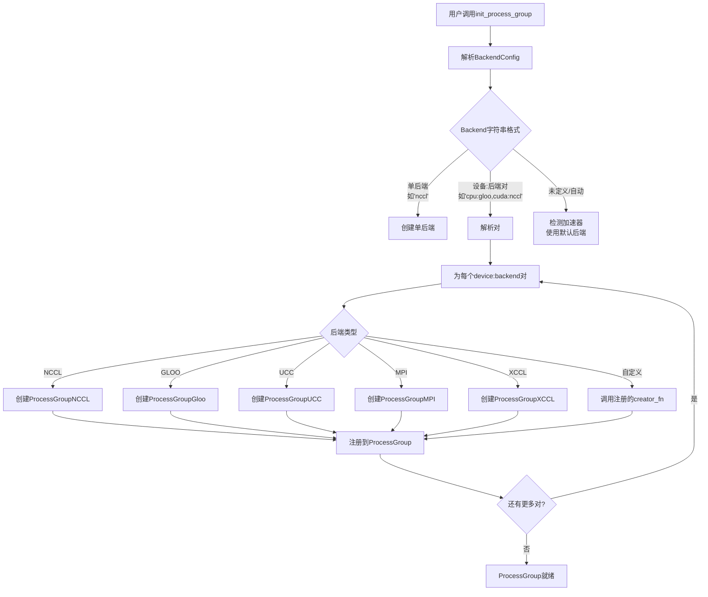
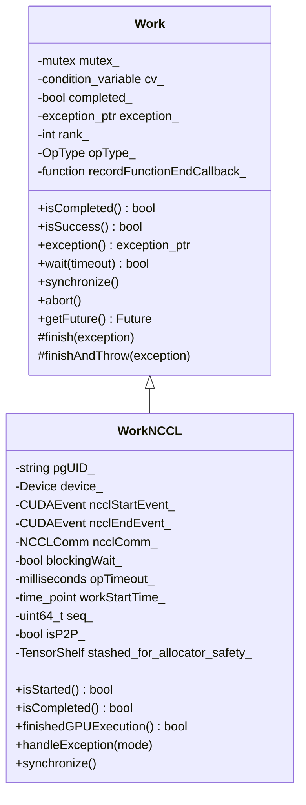
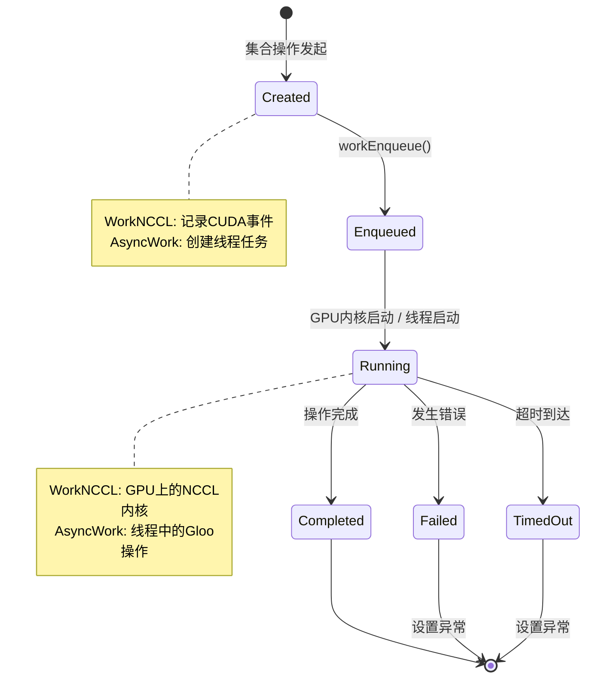
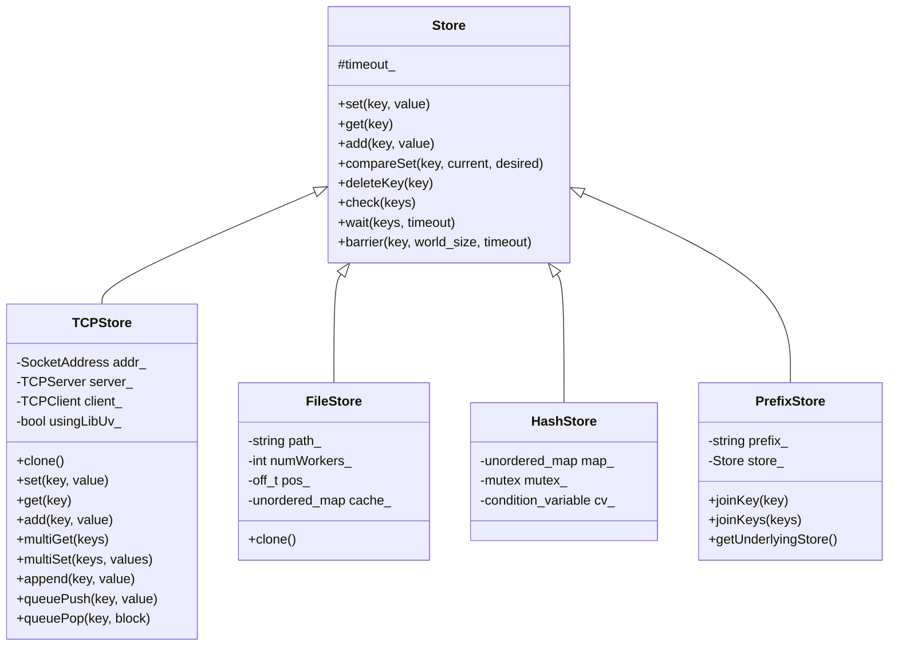
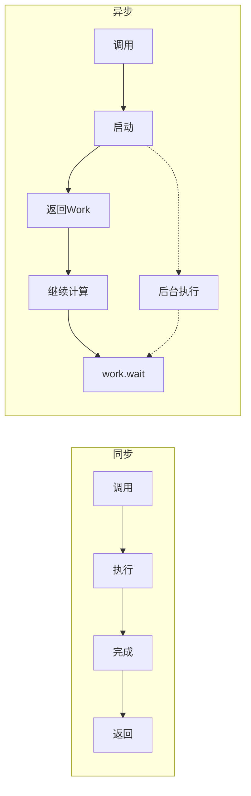

# PyTorch ProcessGroup实现深度分析

## 目录
1. [架构概览与设计哲学](#1-架构概览与设计哲学)
2. [核心组件详解](#2-核心组件详解)
3. [初始化流程详解](#3-初始化流程详解)
4. [后端注册与选择机制](#4-后端注册与选择机制)
5. [集合操作执行流程](#5-集合操作执行流程)
6. [Work跟踪机制](#6-work跟踪机制)
7. [Store协调机制](#7-store协调机制)
8. [错误处理机制](#8-错误处理机制)
9. [设计权衡与考量](#9-设计权衡与考量)
10. [使用模式与最佳实践](#10-使用模式与最佳实践)

---

## 1. 架构概览与设计哲学

### 1.1 分层架构设计

PyTorch的ProcessGroup架构采用分层设计模式，旨在提供统一、可扩展的分布式通信接口：

```
┌─────────────────────────────────────────────────────────────────┐
│                    Python API Layer                             │
│         (torch.distributed.distributed_c10d)                    │
├─────────────────────────────────────────────────────────────────┤
│                    ProcessGroup Class                           │
│     (Unified interface for all distributed operations)          │
├─────────────────────────────────────────────────────────────────┤
│              Backend Abstraction Layer                          │
│   (Backend base class - NCCL, Gloo, MPI, UCC, XCCL)             │
├─────────────────────────────────────────────────────────────────┤
│              Work/Operation Tracking                            │
│       (Asynchronous operation management)                       │
├─────────────────────────────────────────────────────────────────┤
│                    Store Layer                                  │
│   (TCPStore, FileStore, HashStore - Coordination)               │
└─────────────────────────────────────────────────────────────────┘
```

### 1.2 核心设计原则

1. **统一接口**: ProcessGroup提供统一的API，底层可以切换不同后端
2. **多后端支持**: 支持NCCL(GPU)、Gloo(CPU/通用)、MPI(HPC)、UCC(统一通信)
3. **异步优先**: 所有操作默认异步执行，通过Work对象跟踪
4. **设备感知**: 自动根据设备类型选择合适后端
5. **可扩展性**: 支持自定义后端注册

### 1.3 关键组件概览

| 组件 | 用途 | 核心文件 |
|------|------|----------|
| **ProcessGroup** | 主要的分布式通信API | `ProcessGroup.hpp/cpp` |
| **Backend** | 后端实现的抽象基类 | `Backend.hpp/cpp` |
| **Work** | 异步操作句柄和跟踪 | `Work.hpp/cpp` |
| **Store** | 进程协调的KV存储 | `Store.hpp/cpp`, `TCPStore.hpp/cpp` |
| **Types** | 集合操作选项定义 | `Types.hpp` |

---

## 2. 核心组件详解

### 2.1 类层次结构

```mermaid
classDiagram
    class torch::CustomClassHolder {
        +release_resources()
    }
    
    class Store {
        +set(key, value)
        +get(key)
        +add(key, value)
        +wait(keys, timeout)
        +barrier(key, world_size, timeout)
    }
    
    class TCPStore {
        -TCPServer server_
        -TCPClient client_
        -bool usingLibUv_
        +clone()
    }
    
    class FileStore {
        -string path_
        -int numWorkers_
        +clone()
    }
    
    class PrefixStore {
        -string prefix_
        -Store store_
        +joinKey(key)
    }
    
    class Backend {
        -int rank_
        -int size_
        +broadcast()
        +allreduce()
        +allgather()
        +reduce_scatter()
        +send()
        +recv()
        +barrier()
        +split()
        #init()
    }
    
    class ProcessGroup {
        -Store store_
        -int rank_
        -int size_
        -BackendType backendType_
        -deviceTypeToBackend_ map
        -backendTypeToBackend_ map
        +broadcast()
        +allreduce()
        +allgather()
        +getBackend(deviceType)
        +setBackend(deviceType, backendType, backend)
        +splitGroup()
    }
    
    class ProcessGroupNCCL {
        -Options options_
        -NCCLCommMap devNCCLCommMap_
        -Watchdog watchdog_
        -HeartbeatMonitor heartbeatMonitor_
        +WorkNCCL
    }
    
    class ProcessGroupGloo {
        -Options options_
        -GlooStore store_
        -vector~Context~ contexts_
        -vector~thread~ threads_
        +AsyncWork
    }
    
    class Work {
        -mutex mutex_
        -condition_variable cv_
        -bool completed_
        -exception_ptr exception_
        -OpType opType_
        +isCompleted()
        +isSuccess()
        +wait(timeout)
        +synchronize()
        #finish()
    }
    
    class WorkNCCL {
        -CUDAEvent ncclStartEvent_
        -CUDAEvent ncclEndEvent_
        -NCCLComm ncclComm_
        -bool blockingWait_
        +isStarted()
        +finishedGPUExecution()
        +handleException()
    }
    
    torch::CustomClassHolder <|-- Store
    Store <|-- TCPStore
    Store <|-- FileStore
    Store <|-- PrefixStore
    
    torch::CustomClassHolder <|-- Backend
    Backend <|-- ProcessGroupNCCL
    Backend <|-- ProcessGroupGloo
    
    torch::CustomClassHolder <|-- ProcessGroup
    
    torch::CustomClassHolder <|-- Work
    Work <|-- WorkNCCL
```

### 2.2 BackendType枚举

```cpp
// 来自ProcessGroup.hpp第88-96行
enum BackendType : uint8_t {
    UNDEFINED = 0,
    GLOO = 1,
    NCCL = 2,
    UCC = 3,
    MPI = 4,
    XCCL = 5,
    CUSTOM = 6,
};
```

### 2.3 OpType枚举

```cpp
// 来自Work.hpp第14-36行
enum class OpType : std::uint8_t {
  BROADCAST = 0,
  ALLREDUCE = 1,
  ALLREDUCE_COALESCED = 2,
  REDUCE = 3,
  ALLGATHER = 4,
  _ALLGATHER_BASE = 5,
  ALLGATHER_COALESCED = 6,
  GATHER = 7,
  SCATTER = 8,
  REDUCE_SCATTER = 9,
  ALLTOALL_BASE = 10,
  ALLTOALL = 11,
  SEND = 12,
  RECV = 13,
  RECVANYSOURCE = 14,
  BARRIER = 15,
  _REDUCE_SCATTER_BASE = 16,
  COALESCED = 17,
  _ALLREDUCE_SPARSE = 18,
  REDUCE_SCATTER_TENSOR_COALESCED = 19,
  UNKNOWN = 100,
};
```

---

## 3. 初始化流程详解

### 3.1 初始化序列图

```mermaid
sequenceDiagram
    participant User as 用户代码
    participant PythonAPI as distributed_c10d.py
    participant PG as ProcessGroup
    participant Backend as Backend实现
    participant Store as Store (TCP/File)
    
    User->>PythonAPI: init_process_group(backend, init_method, ...)
    PythonAPI->>PythonAPI: 验证参数
    PythonAPI->>PythonAPI: 确定后端配置
    
    alt 使用init_method (URL)
        PythonAPI->>PythonAPI: rendezvous(init_method)
        PythonAPI->>Store: 创建TCPStore/FileStore
        Store-->>PythonAPI: store实例
    else 直接使用store
        PythonAPI->>PythonAPI: 使用提供的store
    end
    
    PythonAPI->>PythonAPI: _new_process_group_helper()
    PythonAPI->>Store: PrefixStore(group_name/, store)
    
    PythonAPI->>PG: new ProcessGroup(prefix_store, rank, size)
    PG-->>PythonAPI: pg实例
    
    loop 每个device:backend对
        PythonAPI->>Backend: 创建后端特定的PG
        alt Backend == NCCL
            Backend->>Backend: ProcessGroupNCCL(store, rank, size, options)
        else Backend == GLOO
            Backend->>Backend: ProcessGroupGloo(store, rank, size, options)
        else Backend == MPI
            Backend->>Backend: ProcessGroupMPI.create(ranks)
        end
        Backend-->>PythonAPI: 后端实例
        PythonAPI->>PG: pg._register_backend(device, backend_type, backend)
    end
    end
    
    PythonAPI->>PythonAPI: _store_based_barrier()
    PythonAPI->>Store: add(barrier_key, 1)
    PythonAPI->>Store: wait(last_member_key)
    
    PythonAPI-->>User: 初始化完成
```

### 3.2 init_process_group核心代码

```python
# 来自distributed_c10d.py
@_time_logger
def init_process_group(
    backend: str | Backend | None = None,
    init_method: str | None = None,
    timeout: timedelta | None = None,
    world_size: int | None = None,
    rank: int | None = None,
    store: Store | None = None,
    group_name: str = "",
    pg_options: Any | None = None,
    device_id: torch.device | None = None,
) -> None:
    """初始化分布式进程组."""
    
    # 1. 参数验证和默认值设置
    if backend is None:
        backend = Backend.UNDEFINED
    
    backend = Backend(backend)
    
    # 2. 创建或获取Store
    if store is None:
        if init_method is None:
            init_method = "env://"
        store, world_size, rank = next(
            rendezvous(init_method, rank, world_size)
        )(...)
    
    # 3. 创建ProcessGroup
    _world.pg_group_ranks[GroupMember.WORLD] = {}
    default_pg = _new_process_group_helper(
        world_size,
        rank,
        [],
        backend,
        store,
        group_name=group_name,
        group_desc=None,
        timeout=timeout,
        pg_options=pg_options,
        device_id=device_id,
    )
    
    # 4. 存储到全局
    _world.pg_map[GroupMember.WORLD] = (backend, default_pg)
    _world.backend = backend
```

### 3.3 Store-based Barrier同步

```python
# 来自distributed_c10d.py第982-1048行
@_time_logger
def _store_based_barrier(
    rank,
    store,
    group_name: GroupName,
    rendezvous_count,
    timeout,
    logging_interval=timedelta(seconds=10),
) -> None:
    """基于store的barrier用于进程同步."""
    store_key = f"{STORE_BASED_BARRIER_PREFIX}:{group_name}"
    store.add(store_key, 1)  # 递增计数器
    
    world_size = rendezvous_count
    worker_count = store.add(store_key, 0)  # 获取当前计数
    
    last_worker_key = f"{store_key}:last_worker"
    if worker_count == world_size:
        store.set(last_worker_key, "1")  # 最后一个worker设置标志
    
    # 等待所有worker
    while True:
        try:
            store.wait([last_worker_key], logging_interval)
            break
        except RuntimeError as e:
            worker_count = store.add(store_key, 0)
            if timedelta(seconds=(time.time() - start)) > timeout:
                raise DistStoreError(...)
```

---

## 4. 后端注册与选择机制

### 4.1 后端注册流程



### 4.2 Backend类注册机制

```python
# 来自distributed_c10d.py第268-300行
class Backend(str):
    """用于后端的类枚举."""
    
    UNDEFINED = "undefined"
    GLOO = "gloo"
    NCCL = "nccl"
    UCC = "ucc"
    MPI = "mpi"
    XCCL = "xccl"
    FAKE = "fake"
    
    _BackendPlugin = namedtuple("_BackendPlugin", ["creator_fn", "extended_api"])
    _plugins: dict[str, _BackendPlugin] = {}
    
    backend_list = [UNDEFINED, GLOO, NCCL, XCCL, UCC, MPI, FAKE]
    
    default_device_backend_map: dict[str, str] = {
        "cpu": GLOO,
        "cuda": NCCL,
        "xpu": XCCL,
        "mps": GLOO,
    }
    
    @classmethod
    def register_backend(cls, name, func, extended_api=False, devices=None):
        """用给定的名称和实例化函数注册新后端."""
        cls._plugins[name.upper()] = cls._BackendPlugin(func, extended_api)
        
        if devices is not None:
            for device in devices:
                cls.default_device_backend_map[device] = name.lower()
```

### 4.3 后端选择逻辑

```cpp
// 来自ProcessGroup.hpp - 后端映射
std::unordered_set<c10::DeviceType> deviceTypes_;
std::map<c10::DeviceType, BackendType> deviceTypeToBackendType_;
std::unordered_map<c10::DeviceType, c10::intrusive_ptr<Backend>> deviceTypeToBackend_;
std::unordered_map<BackendType, c10::intrusive_ptr<Backend>> backendTypeToBackend_;

// 获取特定设备类型的后端
c10::intrusive_ptr<Backend> ProcessGroup::getBackend(c10::DeviceType deviceType) {
    // 1. 检查此设备是否已有后端
    if (deviceTypeToBackend_.find(deviceType) != deviceTypeToBackend_.end()) {
        return deviceTypeToBackend_.at(deviceType);
    }
    
    // 2. 获取设备的后端类型
    BackendType backendType = deviceTypeToBackendType_.at(deviceType);
    
    // 3. 检查后端实例是否已创建
    if (backendTypeToBackend_.find(backendType) != backendTypeToBackend_.end()) {
        auto backend = backendTypeToBackend_.at(backendType);
        deviceTypeToBackend_[deviceType] = backend;
        return backend;
    }
    
    // 4. 错误 - 找不到后端
    TORCH_CHECK(false, "Could not retrieve or create the backend");
}
```

---

## 5. 集合操作执行流程

### 5.1 集合操作分发流程

```mermaid
sequenceDiagram
    participant User as 用户代码
    participant PythonAPI as Python API
    participant PG as ProcessGroup
    participant Dispatcher as C10d Dispatcher
    participant Backend as Backend (NCCL/Gloo)
    participant Work as Work对象
    
    User->>PythonAPI: dist.all_reduce(tensor, group=pg)
    PythonAPI->>PG: pg.allreduce([tensor], opts)
    
    PG->>Dispatcher: 分发到c10d::allreduce_
    Note over Dispatcher: "使用PyTorch分发器<br/>进行后端选择"
    
    Dispatcher->>Backend: backend->allreduce(tensors, opts)
    
    alt NCCL后端
        Backend->>Backend: collective()模板
        Backend->>Backend: initWork() - 创建WorkNCCL
        Backend->>NCCL: ncclAllReduce()
        Backend->>Backend: workEnqueue()
    else Gloo后端
        Backend->>Backend: 创建AsyncWork
        Backend->>Backend: enqueue(work)
        Backend->>Gloo: gloo::Allreduce()
    end
    end
    
    Backend-->>PG: c10::intrusive_ptr<Work>
    PG-->>PythonAPI: Work对象
    
    alt 异步操作 (asyncOp=True)
        PythonAPI-->>User: 立即返回Work
        User->>Work: work.wait()  # 后续同步
    else 同步操作 (阻塞)
        PythonAPI->>Work: work.wait()
        Work-->>PythonAPI: 完成
        PythonAPI-->>User: 返回
    end
    end
```

### 5.2 集合操作选项结构

```cpp
// 来自Types.hpp
struct AllreduceOptions {
    ReduceOp reduceOp = ReduceOp::SUM;
    std::chrono::milliseconds timeout = kUnsetTimeout;
    bool asyncOp = true;
    std::optional<at::Tensor> sparseIndices = std::nullopt;
};

struct AllgatherOptions {
    std::chrono::milliseconds timeout = kUnsetTimeout;
    bool asyncOp = true;
};

struct ReduceScatterOptions {
    ReduceOp reduceOp = ReduceOp::SUM;
    std::chrono::milliseconds timeout = kUnsetTimeout;
    bool asyncOp = true;
};

struct BroadcastOptions {
    int64_t rootRank = 0;
    int64_t rootTensor = 0;
    std::chrono::milliseconds timeout = kUnsetTimeout;
    bool asyncOp = true;
};
```

---

## 6. Work跟踪机制

### 6.1 Work类架构



### 6.2 Work生命周期状态机



### 6.3 Work注册机制

```cpp
// 用于功能集合的线程本地work注册表
class WorkRegistry {
public:
    void register_work(const at::Tensor& tensor, 
                       const c10::intrusive_ptr<c10d::Work>& work);
    std::vector<c10::intrusive_ptr<c10d::Work>> pop_works(const at::Tensor& tensor);
    void unregister_work(const c10::intrusive_ptr<c10d::Work>& work);
    
private:
    std::unordered_map<c10::weak_intrusive_ptr<c10::StorageImpl>,
                       std::vector<c10::intrusive_ptr<c10d::Work>>> registry_;
    bool allow_inflight_collective_as_graph_input_ = false;
    std::mutex lock_;
};
```

---

## 7. Store协调机制

### 7.1 Store类层次结构



### 7.2 TCPStore架构

```
┌─────────────────────────────────────────────────────────────┐
│                      TCPStore Client                         │
│  ┌─────────────┐  ┌─────────────┐  ┌─────────────────────┐  │
│  │   set()     │  │   get()     │  │   wait()            │  │
│  └──────┬──────┘  └──────┬──────┘  └──────────┬──────────┘  │
│         └─────────────────┴────────────────────┘             │
│                           │                                  │
│                    ┌──────┴──────┐                          │
│                    │  TCPClient   │                          │
│                    └──────┬──────┘                          │
│                           │ TCP Socket                       │
└───────────────────────────┼─────────────────────────────────┘
                            │
┌───────────────────────────┼─────────────────────────────────┐
│                      TCPServer                               │
│  ┌────────────────────────┼──────────────────────────────┐  │
│  │              TCPStoreBackend / LibUVTCPStoreBackend    │  │
│  │                        │                               │  │
│  │  ┌─────────────────────┴───────────────────────┐       │  │
│  │  │         Key-Value Store Map                  │       │  │
│  │  │  ┌─────────┐ ┌─────────┐ ┌─────────┐        │       │  │
│  │  │  │ key1    │ │ key2    │ │ key3    │ ...    │       │  │
│  │  │  │ value1  │ │ value2  │ │ value3  │        │       │  │
│  │  │  └─────────┘ └─────────┘ └─────────┘        │       │  │
│  │  └─────────────────────────────────────────────┘       │  │
│  └─────────────────────────────────────────────────────────┘  │
└─────────────────────────────────────────────────────────────┘
```

### 7.3 Store操作用于会合

```cpp
// 典型的会合序列:
// 1. 每个进程写入其地址信息
store.set("rank_0_addr", "tcp://192.168.1.1:5000");
store.set("rank_1_addr", "tcp://192.168.1.2:5000");
// ...

// 2. Barrier确保所有进程都已写入
store.barrier("rendezvous_barrier", world_size, timeout);

// 3. 每个进程读取所有地址
for (int i = 0; i < world_size; i++) {
    auto addr = store.get("rank_" + std::to_string(i) + "_addr");
    connect_to_peer(addr);
}
```

---

## 8. 错误处理机制

### 8.1 错误类型和处理策略

```cpp
// 来自Backend.hpp第23-31行
enum class ErrorType {
  SUCCESS = 0,
  TIMEOUT = 1,
  COMM_ERROR = 2,    // 如NCCL错误
  REMOTE_ERROR = 3,
};

// NCCL错误处理模式
enum ErrorHandlingMode {
    NoHandling = 0,      // 不处理异步NCCL错误
    TearDown = 1,        // 错误时拆除进程
    CleanUpOnly = 2,     // 清理集合并中止通信器
    SkipCleanUp = 3,     // 不清理NCCL通信器就拆除
};
```

### 8.2 NCCL错误处理架构

```mermaid
sequenceDiagram
    participant Main as 主线程
    participant NCCL as NCCL GPU
    participant Watchdog as 看门狗线程
    participant Monitor as HeartbeatMonitor
    participant Store as TCPStore
    
    Main->>NCCL: 启动集合操作
    
    loop 看门狗循环
        Watchdog->>NCCL: 查询CUDA事件
        alt 成功
            NCCL-->>Watchdog: 完成
        else 超时
            Watchdog->>Store: broadcastDumpSignal()
            Watchdog->>Main: 抛出异常 / 中止
        else NCCL错误
            Watchdog->>Watchdog: checkAndSetRemoteError()
            Watchdog->>Store: 设置错误信号
            Watchdog->>Main: handleException()
        end
    end
    
    alt 看门狗挂起
        Monitor->>Monitor: 检查心跳超时
        Monitor->>Main: 终止进程
    end
    end
```

### 8.3 Work对象中的异常传播

```cpp
// 来自Work.hpp第141-153行
class Work {
protected:
    void finish(std::exception_ptr exception = nullptr) {
        std::unique_lock<std::mutex> lock(mutex_);
        completed_ = true;
        exception_ = std::move(exception);
        lock.unlock();
        cv_.notify_all();  // 通知所有等待者
    }
    
public:
    bool wait(std::chrono::milliseconds timeout) {
        std::unique_lock<std::mutex> lock(mutex_);
        cv_.wait_for(lock, timeout, [&] { return completed_; });
        
        if (exception_) {
            std::rethrow_exception(exception_);  // 传播错误
        }
        return true;
    }
};
```

---

## 9. 设计权衡与考量

### 9.1 后端对比

| 方面 | NCCL | Gloo | MPI | UCC |
|------|------|------|-----|-----|
| **主要用途** | NVIDIA GPU | CPU, 多设备 | HPC集群 | 统一通信 |
| **性能** | GPU最高 | CPU良好 | 可变 | 新兴 |
| **设置难度** | 简单 | 简单 | 困难(需要MPI) | 中等 |
| **容错性** | 异步错误处理 | 良好 | 有限 | 中等 |
| **多节点** | 是(IB/TCP) | 是 | 是 | 是 |
| **动态组** | ncclCommSplit | 是 | 有限 | 是 |

### 9.2 同步vs异步设计



**权衡:**
- **同步**: 编程模型简单，但等待时浪费GPU/CPU时间
- **异步**: 通过重叠获得更好性能，但需要仔细同步

### 9.3 内存管理考量

| 策略 | 优点 | 缺点 |
|------|------|------|
| **RecordStream** (NCCL默认) | 自动，与缓存分配器配合 | 轻微开销 |
| **AvoidRecordStream** (可选) | 更低开销 | 需要手动仔细同步 |
| **张量注册** | 已注册缓冲区零拷贝 | 设置开销，内存受限 |

---

## 10. 使用模式与最佳实践

### 10.1 基本初始化模式

```python
import torch.distributed as dist
import torch

# 标准初始化
dist.init_process_group(
    backend="nccl",           # 或 "gloo", "ucc", "mpi"
    init_method="env://",     # 或 "tcp://host:port", "file://path"
    world_size=4,
    rank=rank
)

# 设备特定后端选择
dist.init_process_group(
    backend="cpu:gloo,cuda:nccl",  # 多后端
    init_method="env://"
)

# 带设备绑定(NCCL优化)
dist.init_process_group(
    backend="nccl",
    init_method="env://",
    device_id=torch.device(f"cuda:{local_rank}")  # 启用eager init
)
```

### 10.2 子组创建模式

```python
# 创建子组
ranks = [0, 1, 2, 3]
subgroup = dist.new_group(ranks=ranks)

if dist.get_rank() in ranks:
    # 只有子组中的rank参与
    tensor = torch.tensor([dist.get_rank()], device='cuda')
    dist.all_reduce(tensor, group=subgroup)
```

### 10.3 异步操作模式

```python
# 用于重叠的异步操作
handles = []

# 启动多个操作
for i in range(num_layers):
    handle = dist.all_reduce(tensors[i], async_op=True)
    handles.append(handle)

# 在通信重叠时计算
compute_something()

# 等待所有操作
for handle in handles:
    handle.wait()
```

### 10.4 错误处理模式

```python
import os

# 启用NCCL异步错误处理
os.environ["TORCH_NCCL_ASYNC_ERROR_HANDLING"] = "1"

# 启用desync调试以分析超时
os.environ["TORCH_NCCL_DESYNC_DEBUG"] = "1"

# 设置超时
dist.init_process_group(
    backend="nccl",
    init_method="env://",
    timeout=timedelta(seconds=600)
)

try:
    dist.all_reduce(tensor)
except Exception as e:
    # 处理集合错误
    print(f"Collective failed: {e}")
    dist.destroy_process_group()
```

---

## 11. 关键实现细节

### 11.1 线程安全

```cpp
// ProcessGroupNCCL使用多个线程:
// 1. 主线程: 启动集合操作
// 2. 看门狗线程: 监控work完成和错误
// 3. HeartbeatMonitor线程: 确保看门狗有响应
// 4. onCompletionHookThread: 运行完成回调

// 同步原语:
std::mutex workMetaListMutex_;      // 保护workMetaList_
std::mutex completedWorkListMutex_; // 保护completedWorkList_
std::mutex mutex_;                  // 保护devNCCLCommMap_
std::condition_variable workMetaListCV_;  // 通知看门狗
```

### 11.2 CUDA流管理(NCCL)

```cpp
class ProcessGroupNCCL {
    // 每个集合操作使用专用NCCL流
    // 通过CUDA事件与用户流同步
    
    void synchronizeStream() {
        // 在NCCL流上记录事件
        ncclEndEvent_->record(ncclStream_);
        
        // 在用户流上等待
        ncclEndEvent_->block(currentStream);
    }
};
```

### 11.3 用于调试的序列号

```cpp
// 序列号帮助检测跨rank的集合不匹配
void setSequenceNumberForGroup() {
    if (rank_ == 0) {
        seq_ = rand();  // 生成随机起始序列
        store_->set(kSeqNumStoreKey, std::to_string(seq_));
    } else {
        auto seqStr = store_->get(kSeqNumStoreKey);
        seq_ = std::stoul(seqStr);
    }
}

uint64_t getSequenceNumberForGroup() {
    return seq_++;  // 每次集合操作递增
}
```

---

## 12. 总结

PyTorch的ProcessGroup实现为分布式训练提供了稳健、可扩展的基础:

1. **模块化架构**: ProcessGroup、Backend、Work和Store层之间清晰分离，实现灵活性和可扩展性。

2. **多后端支持**: NCCL用于NVIDIA GPU，Gloo用于通用场景，MPI用于HPC，以及自定义后端的可扩展性。

3. **异步设计**: 使用Work对象的非阻塞操作实现计算/通信重叠，获得最佳性能。

4. **健壮的错误处理**: 看门狗线程、心跳监控和序列号跟踪帮助诊断和处理故障。

5. **基于Store的协调**: TCPStore和FileStore提供可靠的会合和协调机制。

6. **生产就绪特性**: 支持子组、设备绑定、合并操作和高级调试工具。

---

## 参考文件

- **主要头文件**:
  - `/root/source/pytorch/torch/csrc/distributed/c10d/ProcessGroup.hpp` (1032行)
  - `/root/source/pytorch/torch/csrc/distributed/c10d/Backend.hpp` (554行)
  - `/root/source/pytorch/torch/csrc/distributed/c10d/Work.hpp` (189行)
  - `/root/source/pytorch/torch/csrc/distributed/c10d/Store.hpp` (167行)
  - `/root/source/pytorch/torch/csrc/distributed/c10d/Types.hpp`

- **实现文件**:
  - `/root/source/pytorch/torch/csrc/distributed/c10d/ProcessGroup.cpp`
  - `/root/source/pytorch/torch/csrc/distributed/c10d/Backend.cpp`
  - `/root/source/pytorch/torch/csrc/distributed/c10d/Work.cpp`
  - `/root/source/pytorch/torch/csrc/distributed/c10d/Store.cpp`

- **Python API**:
  - `/root/source/pytorch/torch/distributed/distributed_c10d.py` (6609行)

- **后端特定**:
  - `/root/source/pytorch/torch/csrc/distributed/c10d/ProcessGroupNCCL.hpp/cpp`
  - `/root/source/pytorch/torch/csrc/distributed/c10d/ProcessGroupGloo.hpp/cpp`
  - `/root/source/pytorch/torch/csrc/distributed/c10d/TCPStore.hpp/cpp`
  - `/root/source/pytorch/torch/csrc/distributed/c10d/FileStore.hpp/cpp`
  - `/root/source/pytorch/torch/csrc/distributed/c10d/PrefixStore.hpp/cpp`
