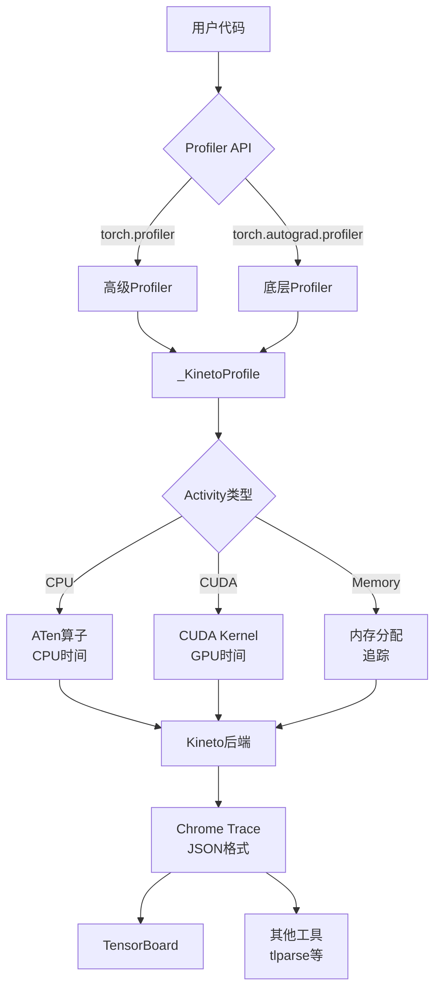
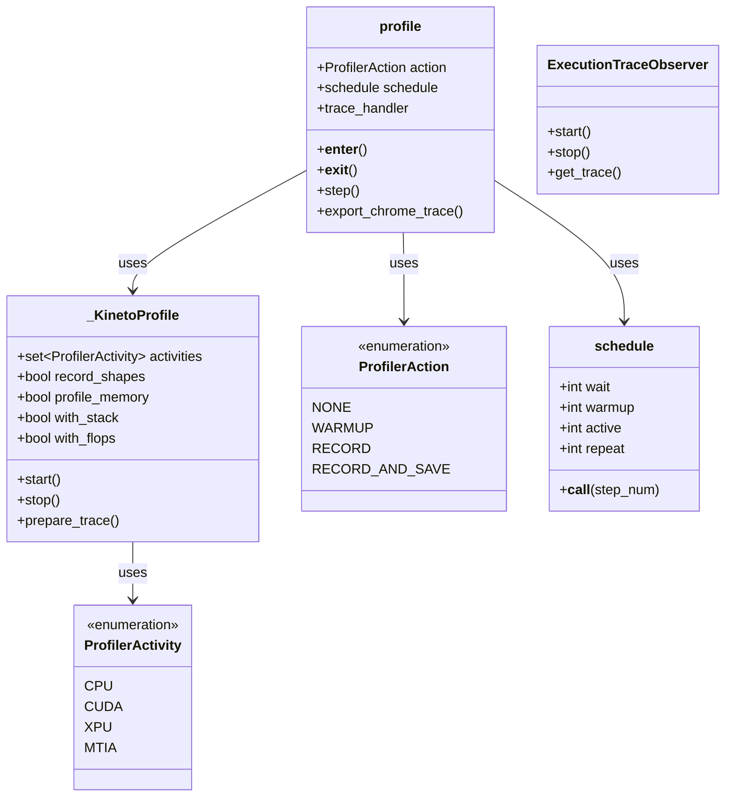
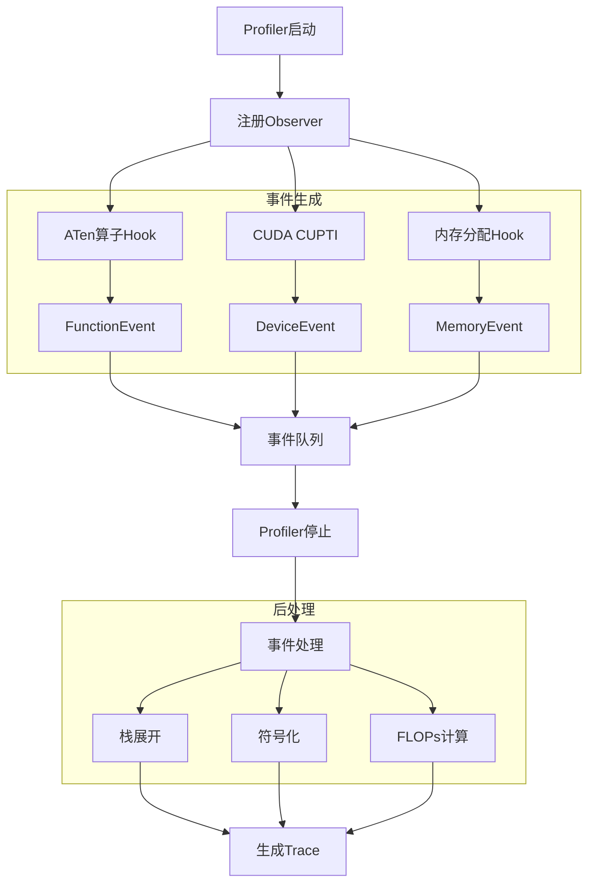
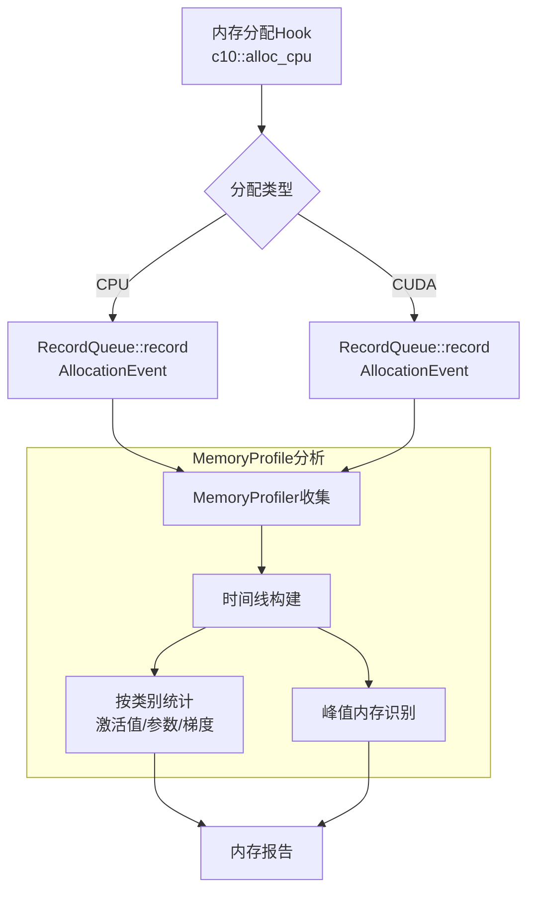
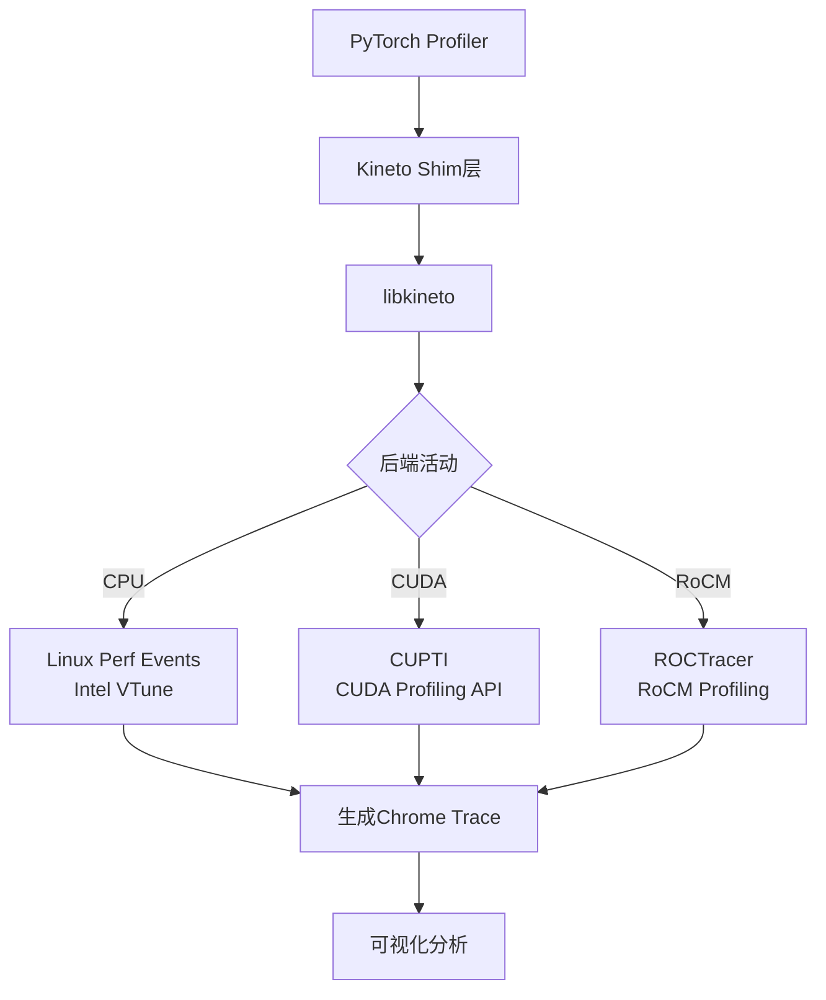
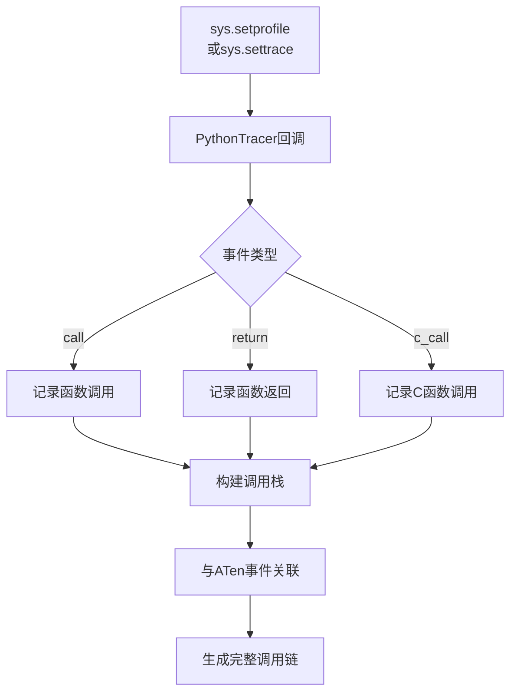
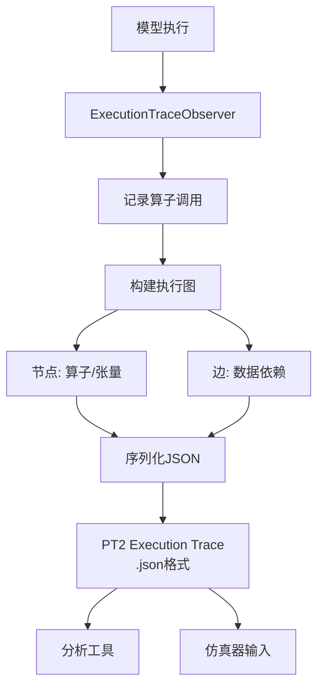
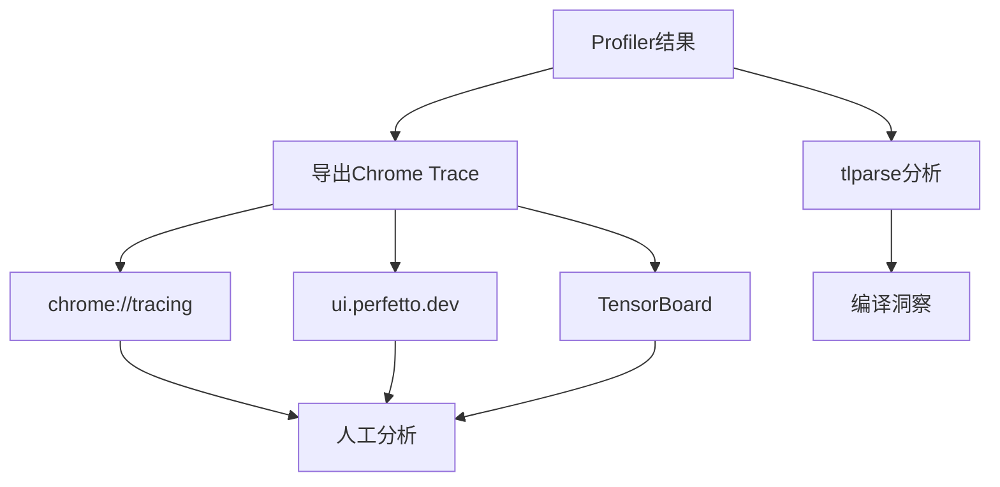

# PyTorch Profiler 深度分析

## 目录
1. [架构概览与设计目标](#1-架构概览与设计目标)
2. [核心组件与API](#2-核心组件与api)
3. [性能数据收集](#3-性能数据收集)
4. [内存分析](#4-内存分析)
5. [Kineto集成](#5-kineto集成)
6. [Python追踪](#6-python追踪)
7. [执行追踪 (Execution Trace)](#7-执行追踪-execution-trace)
8. [分析工具与可视化](#8-分析工具与可视化)

---

## 1. 架构概览与设计目标

### 1.1 什么是PyTorch Profiler

**PyTorch Profiler**是PyTorch的性能分析工具，用于收集和分析模型执行的详细信息，包括算子执行时间、内存使用、CUDA kernel启动、Python调用栈等，帮助识别性能瓶颈。

### 1.2 设计目标

```
┌─────────────────────────────────────────────────────────────┐
│                    Profiler 设计目标                         │
├─────────────────────────────────────────────────────────────┤
│  1. 低开销: 最小化对训练/推理性能的影响                      │
│  2. 多后端: 支持CPU、CUDA、XPU、MTIA等                     │
│  3. 多维度: 时间、内存、算子、Python栈等                   │
│  4. 可视化: Chrome trace格式，TensorBoard集成              │
│  5. 编程友好: 上下文管理器API，易于使用                    │
│  6. 生产就绪: 支持大规模分布式训练分析                     │
└─────────────────────────────────────────────────────────────┘
```

### 1.3 在PyTorch栈中的位置



### 1.4 核心文件位置

| 组件 | 文件路径 | 描述 |
|------|----------|------|
| Python API | `torch/profiler/profiler.py` | 高级profiler API |
| Python Tracer | `torch/profiler/python_tracer.py` | Python函数追踪 |
| Memory Profiler | `torch/profiler/_memory_profiler.py` | 内存分析 |
| C++ API | `torch/csrc/profiler/api.h` | C++ profiler接口 |
| Kineto Shim | `torch/csrc/profiler/kineto_shim.h` | Kineto集成 |
| 数据收集 | `torch/csrc/profiler/collection.h` | 性能数据收集 |
| 事件处理 | `torch/csrc/profiler/events.h` | 事件定义 |
| Unwind | `torch/csrc/profiler/unwind/` | 调用栈展开 |

---

## 2. 核心组件与API

### 2.1 类结构概览



### 2.2 ProfilerActivity - 活动类型

```python
class ProfilerActivity(Enum):
    """性能分析活动类型"""
    CPU = 0     # CPU算子执行
    CUDA = 1    # CUDA kernel
    XPU = 2     # Intel XPU
    MTIA = 3    # Meta MTIA
    HPU = 4     # HPU (Habana)
    PRIVATEUSE1 = 5  # 私有后端

def supported_activities():
    """返回当前系统支持的活动类型"""
    activities = {ProfilerActivity.CPU}

    if torch.cuda.is_available():
        activities.add(ProfilerActivity.CUDA)

    if hasattr(torch, 'xpu') and torch.xpu.is_available():
        activities.add(ProfilerActivity.XPU)

    if hasattr(torch, 'mtia') and torch.mtia.is_available():
        activities.add(ProfilerActivity.MTIA)

    return activities
```

### 2.3 _KinetoProfile - 底层分析器

```python
class _KinetoProfile:
    """底层Kineto性能分析器"""

    def __init__(
        self,
        *,
        activities: Iterable[ProfilerActivity] | None = None,
        record_shapes: bool = False,       # 记录输入形状
        profile_memory: bool = False,      # 追踪内存
        with_stack: bool = False,          # 记录调用栈
        with_flops: bool = False,          # 估算FLOPs
        with_modules: bool = False,        # 记录模块层次
        experimental_config: _ExperimentalConfig | None = None,
        acc_events: bool = False,          # 跨周期累积事件
        post_processing_timeout_s: float | None = None,
    ):
        self.activities = activities or supported_activities()
        self.record_shapes = record_shapes
        self.profile_memory = profile_memory
        self.with_stack = with_stack
        self.with_flops = with_flops
        self.with_modules = with_modules
        self.acc_events = acc_events

        # 初始化底层profiler
        self.profiler: prof.profile | None = None

    def start(self) -> None:
        """开始性能分析"""
        self.prepare_trace()
        self.start_trace()

    def prepare_trace(self) -> None:
        """准备追踪"""
        self.profiler = prof.profile(
            use_cpu=(ProfilerActivity.CPU in self.activities),
            use_device=self.use_device,
            record_shapes=self.record_shapes,
            with_flops=self.with_flops,
            profile_memory=self.profile_memory,
            with_stack=self.with_stack,
            with_modules=self.with_modules,
            use_kineto=True,
            ...
        )
        self.profiler._prepare_trace()

    def start_trace(self) -> None:
        """开始记录"""
        self.profiler._start_trace()

    def stop(self) -> None:
        """停止性能分析"""
        self.stop_trace()
        # 添加元数据
        if self.profile_memory:
            self.add_metadata_json("profile_memory", "1")
        ...
```

### 2.4 profile - 高级API

```python
class profile(_KinetoProfile):
    """高级性能分析器，支持调度"""

    def __init__(
        self,
        *,
        activities: Iterable[ProfilerActivity] | None = None,
        schedule: Callable[[int], ProfilerAction] | None = None,
        on_trace_ready: Callable[["profile"], None] | None = None,
        record_shapes: bool = False,
        profile_memory: bool = False,
        with_stack: bool = False,
        with_flops: bool = False,
        with_modules: bool = False,
        experimental_config: _ExperimentalConfig | None = None,
        execution_trace_observer: _ITraceObserver | None = None,
        **kwargs,
    ):
        super().__init__(...)
        self.schedule = schedule
        self.on_trace_ready = on_trace_ready
        self.step_num = 0
        self.current_action = ProfilerAction.NONE

    def __enter__(self):
        """上下文管理器入口"""
        self.start()
        return self

    def __exit__(self, exc_type, exc_val, exc_tb):
        """上下文管理器出口"""
        self.stop()

    def step(self):
        """执行一步（用于迭代式训练）"""
        self.step_num += 1

        if self.schedule is not None:
            prev_action = self.current_action
            self.current_action = self.schedule(self.step_num)

            # 状态转换
            if self.current_action == ProfilerAction.WARMUP and prev_action != ProfilerAction.WARMUP:
                self._start_warmup()
            elif self.current_action == ProfilerAction.RECORD:
                if prev_action == ProfilerAction.WARMUP:
                    self._start_record()
            elif self.current_action == ProfilerAction.RECORD_AND_SAVE:
                if prev_action == ProfilerAction.RECORD:
                    self._stop_record()
                    if self.on_trace_ready:
                        self.on_trace_ready(self)
```

### 2.5 调度器 (Schedule)

```python
def schedule(
    *,
    wait: int,      # 等待步数
    warmup: int,    # 预热步数
    active: int,    # 记录步数
    repeat: int = 0,  # 重复次数（0表示无限）
) -> Callable[[int], ProfilerAction]:
    """
    创建性能分析调度函数。

    每个周期: wait -> warmup -> active -> (保存)
    """
    def schedule_fn(step_num: int) -> ProfilerAction:
        # 计算当前在周期中的位置
        step_num = step_num - 1  # 转换为0索引

        if repeat != 0 and step_num >= (wait + warmup + active) * repeat:
            return ProfilerAction.NONE

        # 当前周期位置
        pos = step_num % (wait + warmup + active)

        if pos < wait:
            return ProfilerAction.NONE
        elif pos < wait + warmup:
            return ProfilerAction.WARMUP
        else:
            # 最后一个active步保存
            if pos == wait + warmup + active - 1:
                return ProfilerAction.RECORD_AND_SAVE
            return ProfilerAction.RECORD

    return schedule_fn

# 使用示例
prof_schedule = schedule(wait=1, warmup=1, active=3, repeat=2)
# 周期: [wait, warmup, record, record, save] x 2
```

---

## 3. 性能数据收集

### 3.1 数据收集流程



### 3.2 事件类型

```cpp
// torch/csrc/profiler/events.h

enum class EventType : uint8_t {
    TorchOp,          // ATen算子
    Backend,          // 后端事件
    Vulkan,           // Vulkan事件
    Allocation,       // 内存分配
    OutOfMemory,      // OOM事件
    PyCall,           // Python调用
    PyCCall,          // Python C调用
    Kineto,           // Kineto事件
    ...
};

struct TorchOp {
    // 算子信息
    std::string name;           // 算子名
    uint64_t sequence_number;   // 序列号
    std::vector<std::string> input_shapes;  // 输入形状
    std::vector<std::string> input_dtypes;  // 输入数据类型

    // 时间信息
    time_ns start_time;
    time_ns end_time;

    // 设备时间
    time_ns device_start_time;
    time_ns device_end_time;

    // 调用栈
    std::vector<std::string> stack_trace;
};

struct MemoryEvent {
    // 分配信息
    void* ptr;              // 内存地址
    size_t alloc_size;      // 分配大小
    size_t total_allocated; // 总分配量
    size_t total_reserved;  // 总预留量

    // 设备信息
    int64_t device_id;
    DeviceType device_type;

    // 时间
    time_ns start_time;

    // 分配上下文
    std::string op_name;    // 触发分配的算子
};
```

### 3.3 事件收集器

```python
# torch/csrc/profiler/collection.h

class RecordQueue {
public:
    // 各种事件的子队列
    ThreadSubQueue& getSubQueue(ThreadID tid);

    // 记录不同类型事件
    void record(TorchOpEvent&& event);
    void record(BackendEvent&& event);
    void record(AllocationEvent&& event);
    void record(PyCallEvent&& event);

    // 合并和导出事件
    std::deque<std::shared_ptr<Result>> moveRecords();

private:
    // 每线程的子队列
    ska::flat_hash_map<ThreadID, ThreadSubQueue> sub_queues_;

    // 全局状态
    ProfilerConfig config_;
    time_converter time_converter_;
};
```

---

## 4. 内存分析

### 4.1 内存分析架构



### 4.2 MemoryProfile

```python
class MemoryProfile:
    """内存使用分析器"""

    def __init__(self, op_tree: OpTree, memory_events: list[MemoryEvent]):
        self._op_tree = op_tree
        self._memory_events = memory_events
        self._timeline = MemoryProfileTimeline(memory_events)

    def _category_distribution(
        self,
        by: Literal["category", "device"]
    ) -> dict[str, list[tuple[int, int, int]]]:
        """
        按类别或设备统计内存分布。

        Returns:
            {类别: [(时间戳, 分配量, 预留量), ...]}
        """
        ...

    def export_memory_timeline(self, path: str, device: str | None = None) -> None:
        """导出内存时间线到文件"""
        ...

    @property
    def timeline(self) -> MemoryProfileTimeline:
        """内存时间线"""
        return self._timeline

# 内存类别枚举
class Category(Enum):
    UNKNOWN = 0
    ACTIVATION = 1      # 激活值
    PARAMETER = 2       # 参数
    OPTIMIZER_STATE = 3 # 优化器状态
    GRADIENT = 4        # 梯度
    TEMPORARY = 5       # 临时buffer

# 使用示例
with profile(profile_memory=True) as prof:
    model(input)

memory_profile = prof.memory_profile()
print(memory_profile.timeline)
```

### 4.3 内存时间线

```python
class MemoryProfileTimeline:
    """内存使用随时间的变化"""

    def __init__(self, events: list[MemoryEvent]):
        self.events = events
        self.timeline = self._build_timeline()

    def _build_timeline(self) -> list[tuple[int, int, int]]:
        """
        构建内存时间线。

        Returns:
            [(时间戳, 已分配字节数, 预留字节数), ...]
        """
        timeline = []
        allocated = 0
        reserved = 0

        for event in sorted(self.events, key=lambda e: e.timestamp):
            if event.is_allocation:
                allocated += event.size
            else:
                allocated -= event.size

            reserved = max(reserved, allocated)
            timeline.append((event.timestamp, allocated, reserved))

        return timeline

    def plot(self) -> None:
        """绘制内存使用图"""
        import matplotlib.pyplot as plt

        timestamps, allocated, reserved = zip(*self.timeline)
        plt.plot(timestamps, allocated, label='Allocated')
        plt.plot(timestamps, reserved, label='Reserved')
        plt.xlabel('Time')
        plt.ylabel('Memory (bytes)')
        plt.legend()
        plt.show()
```

---

## 5. Kineto集成

### 5.1 Kineto架构



### 5.2 Kineto Shim

```cpp
// torch/csrc/profiler/kineto_shim.h

namespace torch::profiler::impl::kineto {

// Kineto活动类型映射
enum class KinetoActivityType : uint8_t {
    CPU_OP = 0,
    CUDA_RUNTIME,
    CUDA_DRIVER,
    GPU_MEMCPY,
    GPU_MEMSET,
    CONCURRENT_KERNEL,
    EXTERNAL_CORRELATION,
    OVERHEAD,
    ...
};

// Kineto配置
struct KinetoConfig {
    bool cpu_trace_enabled;
    bool cuda_trace_enabled;
    std::set<std::string> activities;
    std::chrono::milliseconds profile_start_time;
    int32_t profile_duration_ms;
};

// 开始/停止Kineto追踪
void prepareTrace(
    const int64_t start_time,
    const ProfilerConfig& config,
    const std::set<ActivityType>& activities
);

void startTrace();
std::unique_ptr<ActivityTraceWrapper> stopTrace();

// 添加Kineto事件
void addMetadata(const std::string& key, const std::string& value);

} // namespace
```

### 5.3 Chrome Trace格式

```python
# Chrome Trace Viewer格式
{
    "displayTimeUnit": "ms",
    "schemaVersion": 1,
    "traceEvents": [
        # 进程元数据
        {"name": "process_name", "ph": "M", "pid": 1, "args": {"name": "python"}},

        # 算子执行（CPU）
        {
            "name": "aten::add",
            "ph": "X",  # 完整事件
            "ts": 1000000,  # 开始时间（微秒）
            "dur": 500,     # 持续时间
            "pid": 1,
            "tid": 1,
            "args": {
                "Input Dims": [[2, 3], [2, 3]],
                "Input type": ["float", "float"],
                "FLOPs": 6
            }
        },

        # CUDA Kernel
        {
            "name": "void at::native::elementwise_kernel<...>",
            "ph": "X",
            "ts": 1001000,
            "dur": 100,
            "pid": 2,  # GPU进程
            "tid": 7,  # CUDA Stream
            "cat": "kernel"
        },

        # 内存分配
        {
            "name": "[memory]",
            "ph": "i",  # 瞬时事件
            "ts": 1000500,
            "pid": 1,
            "tid": 1,
            "args": {
                "Device Type": "CPU",
                "Bytes": 24,
                "Addr": 140735640777728
            }
        },

        # 流程关联（CPU->GPU）
        {
            "name": "",
            "ph": "f",  # 流程开始
            "ts": 1000050,
            "pid": 1,
            "tid": 1,
            "id": 1,
            "bp": "e"   # 流程结束点
        },
        {
            "name": "",
            "ph": "s",  # 流程结束
            "ts": 1001000,
            "pid": 2,
            "tid": 7,
            "id": 1
        }
    ]
}
```

---

## 6. Python追踪

### 6.1 Python Tracer架构



### 6.2 PythonTracer实现

```python
# torch/profiler/python_tracer.py

class PythonTracer:
    """Python函数调用追踪器"""

    def __init__(self):
        self.stack = []
        self.events = []

    def start(self):
        """开始追踪"""
        sys.setprofile(self._profile_handler)

    def stop(self):
        """停止追踪"""
        sys.setprofile(None)

    def _profile_handler(self, frame, event, arg):
        """Python profile回调"""
        if event == 'call':
            # 记录函数调用
            func_name = frame.f_code.co_name
            filename = frame.f_code.co_filename
            line_no = frame.f_lineno

            self.stack.append({
                'name': func_name,
                'file': filename,
                'line': line_no,
                'time': time_ns()
            })

        elif event == 'return':
            # 记录函数返回
            if self.stack:
                call_info = self.stack.pop()
                duration = time_ns() - call_info['time']

                self.events.append({
                    'name': call_info['name'],
                    'file': call_info['file'],
                    'line': call_info['line'],
                    'duration_ns': duration
                })

# C++层面的Python追踪
# torch/csrc/profiler/python/init.cpp

void PythonTracer::recordPyCall(ThreadID tid, PyFrameObject* frame) {
    // 获取函数名
    auto code = frame->f_code;
    std::string func_name = THPUtils_unpackString(code->co_name);

    // 获取文件名和行号
    std::string filename = THPUtils_unpackString(code->co_filename);
    int line_no = PyFrame_GetLineNumber(frame);

    // 创建PyCall事件
    PyCallEvent event{
        .tid = tid,
        .name = func_name,
        .filename = filename,
        .line_no = line_no,
        .timestamp = getTime()
    };

    recordQueue_.record(std::move(event));
}
```

---

## 7. 执行追踪 (Execution Trace)

### 7.1 Execution Trace架构



### 7.2 ExecutionTraceObserver

```python
class ExecutionTraceObserver(_ITraceObserver):
    """执行追踪观察者"""

    def __init__(self):
        self._recorded_nodes = []
        self._tid = threading.current_thread().ident
        self._op_stack = []

    def start(self):
        """开始追踪"""
        self._register_hooks()

    def stop(self):
        """停止追踪"""
        self._unregister_hooks()

    def _register_hooks(self):
        """注册算子调用hook"""
        # 注册到ATen dispatcher
        self._handle = torch._C._dispatch_register_execution_trace_hook(
            self._execution_trace_callback
        )

    def _execution_trace_callback(self, op_name, inputs, outputs):
        """算子执行回调"""
        # 记录算子节点
        node = {
            "name": op_name,
            "inputs": self._serialize_tensors(inputs),
            "outputs": self._serialize_tensors(outputs),
            "tid": self._tid,
            "timestamp": time_ns()
        }
        self._recorded_nodes.append(node)

    def get_trace(self) -> dict:
        """获取执行追踪"""
        return {
            "schema": "1.0.0",
            "nodes": self._recorded_nodes,
            "tid": self._tid
        }

    def save(self, path: str):
        """保存到文件"""
        trace = self.get_trace()
        with open(path, 'w') as f:
            json.dump(trace, f, indent=2)
```

### 7.3 执行追踪格式

```json
{
  "schema": "1.0.0-chakra.0.0.4",
  "nodes": [
    {
      "id": 1,
      "name": "aten::empty",
      "type": "operator",
      "inputs": [
        {"id": 0, "name": "size", "type": "int_list", "value": [2, 3]}
      ],
      "outputs": [
        {"id": 1, "name": "result", "type": "tensor", "shape": [2, 3], "dtype": "float32"}
      ],
      "dependencies": [],
      "timestamp": 1000000,
      "tid": 1
    },
    {
      "id": 2,
      "name": "aten::add",
      "type": "operator",
      "inputs": [
        {"id": 1, "name": "self", "type": "tensor"},
        {"id": 2, "name": "other", "type": "tensor"}
      ],
      "outputs": [
        {"id": 3, "name": "result", "type": "tensor"}
      ],
      "dependencies": [1],
      "timestamp": 1000100,
      "tid": 1
    }
  ]
}
```

---

## 8. 分析工具与可视化

### 8.1 分析流程



### 8.2 常用API

```python
import torch
from torch.profiler import profile, record_function, ProfilerActivity

# 1. 基本使用
with profile(activities=[ProfilerActivity.CPU]) as prof:
    model(inputs)

print(prof.key_averages().table(sort_by="cpu_time_total"))

# 2. 完整配置
with profile(
    activities=[
        ProfilerActivity.CPU,
        ProfilerActivity.CUDA,
    ],
    schedule=torch.profiler.schedule(wait=1, warmup=1, active=3),
    on_trace_ready=torch.profiler.tensorboard_trace_handler("./log"),
    record_shapes=True,
    profile_memory=True,
    with_stack=True,
    with_flops=True,
) as prof:
    for step, data in enumerate(trainloader):
        prof.step()

        with record_function("model_forward"):
            outputs = model(data)

        with record_function("model_backward"):
            loss = criterion(outputs, targets)
            loss.backward()

        optimizer.step()
        optimizer.zero_grad()

# 3. 内存分析
prof.export_memory_timeline("memory.html", device="cuda:0")

# 4. 导出Chrome Trace
prof.export_chrome_trace("trace.json")

# 5. 使用torch.profiler.analyze
from torch.profiler._utils import analyze
stats = analyze(prof)
print(stats)
```

### 8.3 性能分析指标

| 指标 | 说明 |
|------|------|
| Self CPU time | 算子自身CPU时间（不包括子算子） |
| CPU time total | 算子总CPU时间（包括子算子） |
| Self CUDA time | 算子自身GPU时间 |
| CUDA time total | 算子总GPU时间 |
| # of Calls | 调用次数 |
| Input Shapes | 输入张量形状 |
| FLOPs | 浮点运算次数估算 |

---

## 9. 总结

### 9.1 Profiler核心价值

1. **性能洞察**: 识别性能瓶颈和热点算子
2. **内存分析**: 追踪内存使用和泄漏
3. **可视化**: Chrome Trace格式便于分析
4. **低开销**: 最小化对训练的影响
5. **多维度**: 时间、内存、算子、调用栈

### 9.2 最佳实践

| 实践 | 说明 |
|------|------|
| 使用schedule | 避免全程记录，减少开销 |
| 启用with_stack | 定位Python代码位置 |
| 启用record_shapes | 分析shape变化 |
| 启用profile_memory | 识别内存问题 |
| 使用TensorBoard | 便于长期对比 |

### 9.3 使用建议

```python
# 1. 快速分析
with profile() as prof:
    model(x)
print(prof.key_averages().table())

# 2. 训练分析
with profile(
    schedule=schedule(wait=1, warmup=1, active=3),
    on_trace_ready=tensorboard_trace_handler("./log"),
    with_stack=True,
    profile_memory=True,
) as prof:
    for i, batch in enumerate(dataloader):
        train(batch)
        prof.step()

# 3. 分布式分析（每个rank单独记录）
if rank == 0:
    prof = profile(...)
    prof.start()
# ... 训练 ...
if rank == 0:
    prof.stop()
    prof.export_chrome_trace(f"rank{rank}.json")
```
