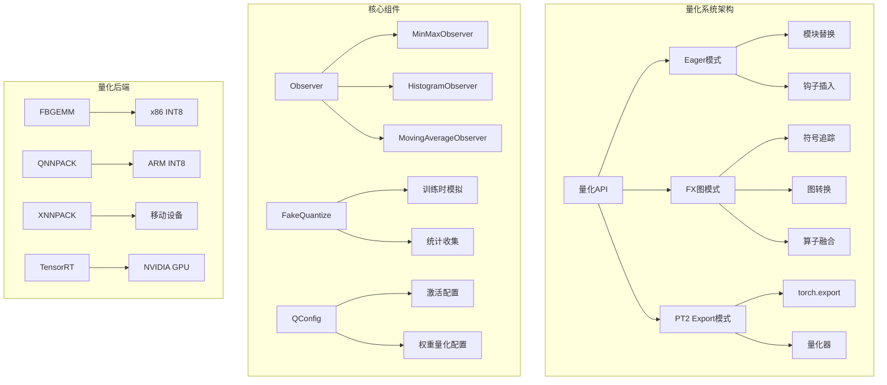
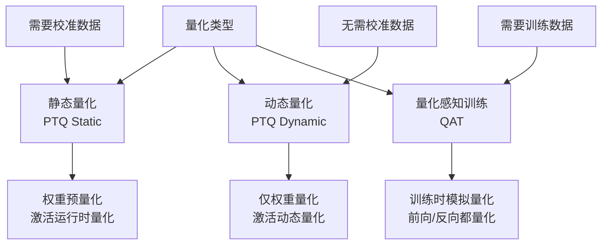
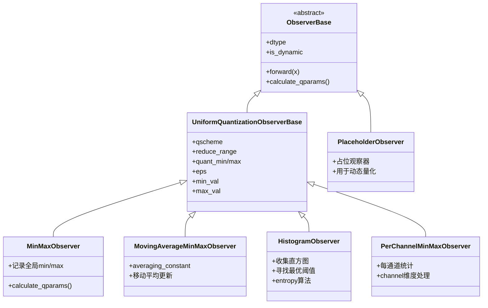
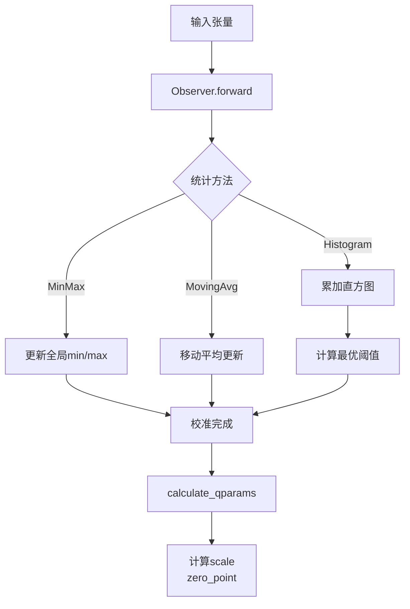
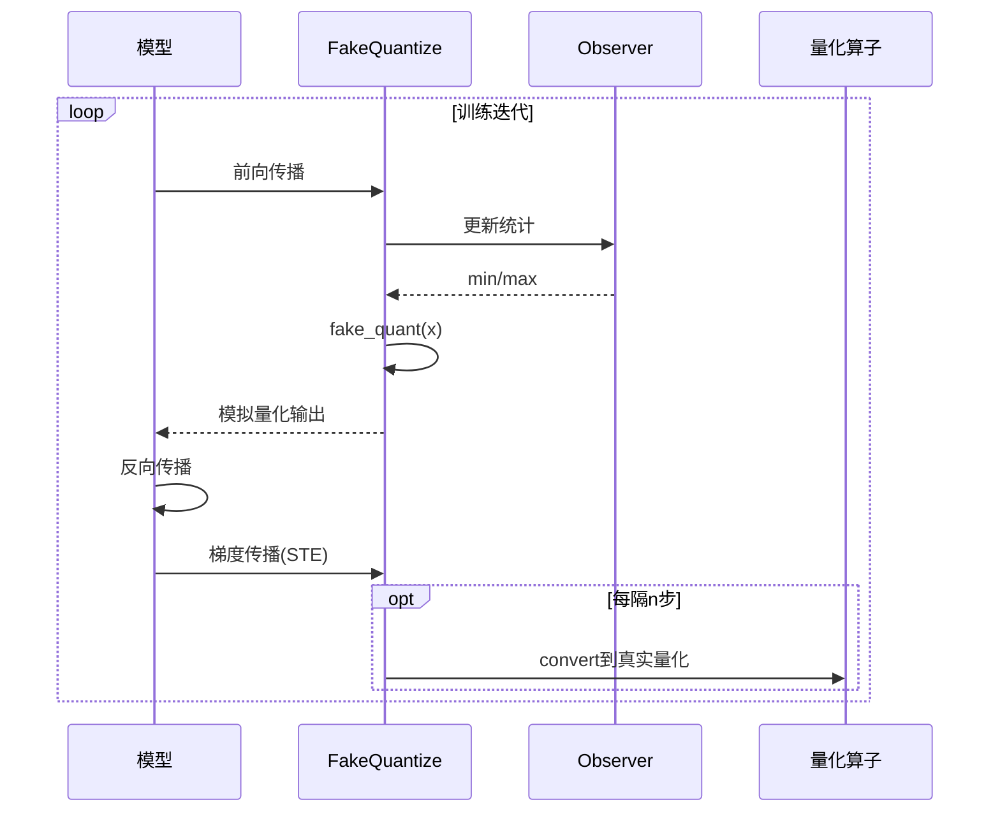
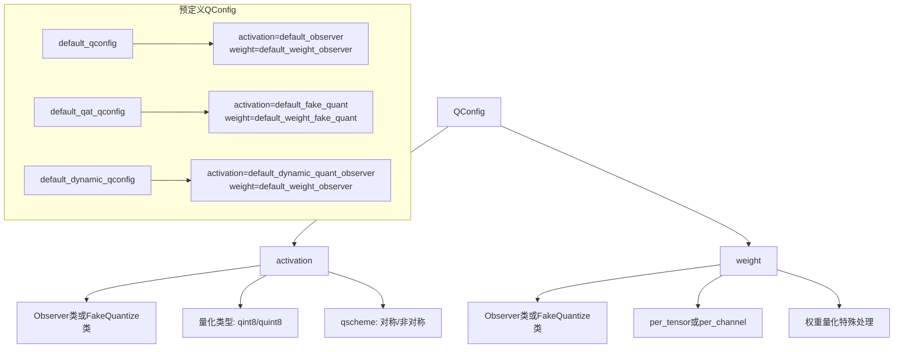
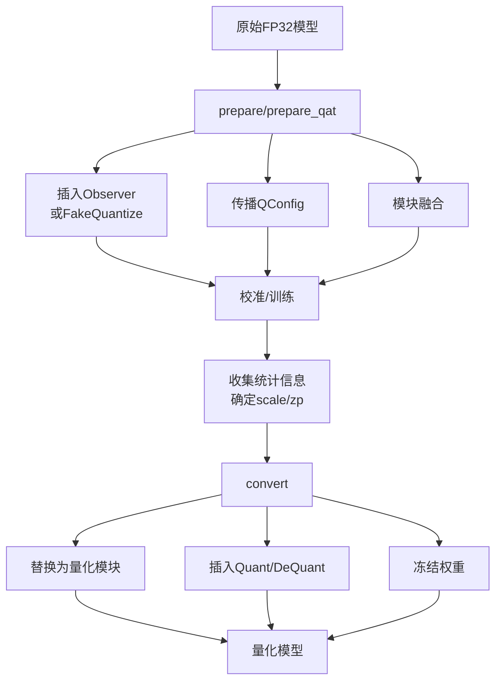
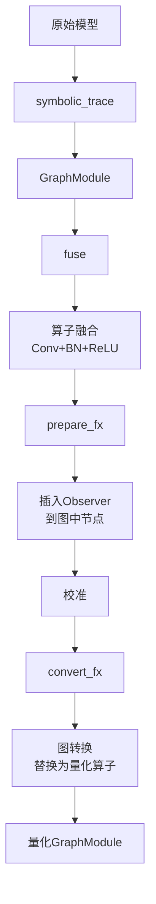
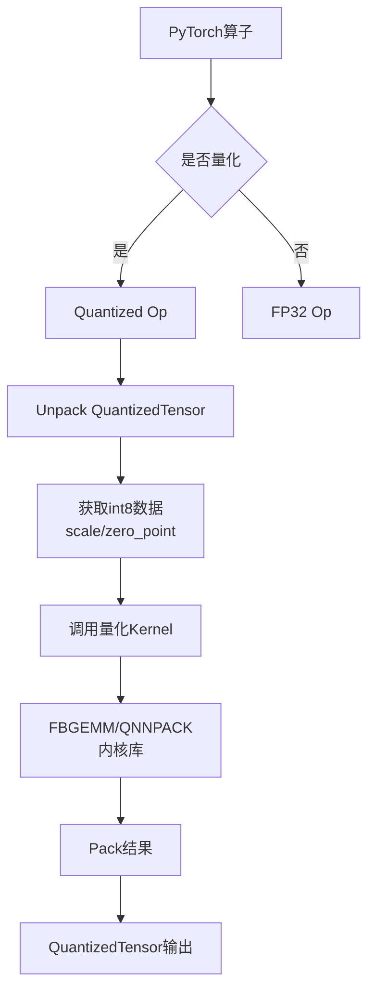

# PyTorch Quantization (模型量化) 深度分析

## 目录
1. [架构概览与设计目标](#1-架构概览与设计目标)
2. [量化类型与模式](#2-量化类型与模式)
3. [Observer机制](#3-observer机制)
4. [FakeQuantize与QAT](#4-fakequantize与qat)
5. [QConfig配置系统](#5-qconfig配置系统)
6. [量化流程: Prepare与Convert](#6-量化流程-prepare与convert)
7. [FX图模式量化](#7-fx图模式量化)
8. [量化后端支持](#8-量化后端支持)
9. [量化算子与Kernel](#9-量化算子与kernel)

---

## 1. 架构概览与设计目标

### 1.1 什么是量化

**量化 (Quantization)** 是将模型权重和激活从高精度浮点数(FP32)转换为低精度整数(INT8/UINT8/FP16)的技术，可以显著减少模型大小、降低内存带宽和加速推理。

### 1.2 设计目标

```
┌─────────────────────────────────────────────────────────────────┐
│                     Quantization 设计目标                        │
├─────────────────────────────────────────────────────────────────┤
│  1. 模型压缩: INT8相比FP32减少4倍模型大小                        │
│  2. 推理加速: 利用整数运算单元加速，降低内存带宽                  │
│  3. 精度保持: 通过校准和感知训练最小化精度损失                    │
│  4. 灵活配置: 支持多种量化策略和粒度                             │
│  5. 易用性: Eager模式和FX图模式两种API                           │
│  6. 多后端: FBGEMM、QNNPACK、XNNPACK、TensorRT等                 │
└─────────────────────────────────────────────────────────────────┘
```

### 1.3 量化系统架构



### 1.4 核心文件位置

| 组件 | 文件路径 | 描述 |
|------|----------|------|
| Eager Quantize | `torch/ao/quantization/quantize.py` | Eager模式量化API |
| FX Quantize | `torch/ao/quantization/quantize_fx.py` | FX图模式量化 |
| Observer | `torch/ao/quantization/observer.py` | 统计观察器 |
| FakeQuantize | `torch/ao/quantization/fake_quantize.py` | 伪量化模块 |
| QConfig | `torch/ao/quantization/qconfig.py` | 量化配置 |
| Backend Config | `torch/ao/quantization/backend_config/` | 后端配置 |
| Quantized Kernels | `aten/src/ATen/native/quantized/` | 量化算子实现 |

---

## 2. 量化类型与模式

### 2.1 量化类型对比



### 2.2 量化类型详细对比

| 特性 | 静态量化 (PTQ) | 动态量化 (Dynamic) | 量化感知训练 (QAT) |
|------|----------------|-------------------|-------------------|
| 权重量化 | 是 | 是 | 是 |
| 激活量化 | 是 | 运行时动态 | 是 |
| 需要校准数据 | 是 | 否 | 是(训练数据) |
| 精度损失 | 中等 | 较低 | 最小 |
| 推理速度 | 最快 | 较快 | 最快 |
| 适用场景 | 边缘部署 | NLP/LSTM | 精度敏感场景 |

### 2.3 量化粒度

```mermaid
flowchart LR
    subgraph "Per-Tensor 每张量"
        A1[Tensor<br/>shape=[C,H,W]] --> B1[单个scale
zero_point]
        B1 --> C1[整个张量共享
相同量化参数]
    end

    subgraph "Per-Channel 每通道"
        A2[Tensor<br/>shape=[C,H,W]] --> B2[C个scale
C个zero_point]
        B2 --> C2[每个通道独立
量化参数]
    end

    subgraph "Per-Token 每词元"
        A3[Tensor<br/>shape=[B,S,H]] --> B3[B*S个scale]
        B3 --> C3[常用于LLM
动态量化]
    end
```

### 2.4 量化公式

```python
# 仿射量化 (Affine Quantization)
# FP32 -> INT8
x_int = clamp(round(x / scale) + zero_point, quant_min, quant_max)

# INT8 -> FP32
x_float = (x_int - zero_point) * scale

# 对称量化 (Symmetric)
# zero_point = 0
x_int = clamp(round(x / scale), -128, 127)  # int8

# 非对称量化 (Affine)
# zero_point != 0
scale = (max_val - min_val) / (quant_max - quant_min)
zero_point = quant_min - round(min_val / scale)
```

---

## 3. Observer机制

### 3.1 Observer架构



### 3.2 Observer工作流程



### 3.3 MinMaxObserver实现

```python
class MinMaxObserver(UniformQuantizationObserverBase):
    """简单的MinMax观察器"""

    def __init__(self, dtype=torch.quint8, qscheme=torch.per_tensor_affine):
        super().__init__(dtype=dtype, qscheme=qscheme)
        # 注册缓冲区存储min/max
        self.register_buffer('min_val', torch.tensor(float('inf')))
        self.register_buffer('max_val', torch.tensor(float('-inf')))

    def forward(self, x_orig):
        r"""记录输入张量的min/max"""
        if self.min_val.numel() == 0 or self.max_val.numel() == 0:
            self.min_val = torch.min(x_orig).item()
            self.max_val = torch.max(x_orig).item()
        else:
            self.min_val = min(self.min_val, torch.min(x_orig).item())
            self.max_val = max(self.max_val, torch.max(x_orig).item())
        return x_orig

    def calculate_qparams(self):
        r"""计算量化参数 scale 和 zero_point"""
        return self._calculate_qparams(self.min_val, self.max_val)

    def _calculate_qparams(self, min_val, max_val):
        quant_min = self.quant_min
        quant_max = self.quant_max

        if self.qscheme == torch.per_tensor_symmetric:
            # 对称量化: zero_point = 0
            max_val = max(abs(min_val), abs(max_val))
            scale = max_val / (float(quant_max - quant_min) / 2)
            zero_point = 0
        else:
            # 非对称量化
            scale = (max_val - min_val) / float(quant_max - quant_min)
            zero_point = quant_min - round(min_val / scale)

        return torch.tensor([scale]), torch.tensor([zero_point])
```

### 3.4 HistogramObserver

```python
class HistogramObserver(UniformQuantizationObserverBase):
    """基于直方图的观察器，使用熵最小化寻找最优阈值"""

    def forward(self, x_orig):
        r"""累加直方图统计"""
        # 收集直方图
        min_val = self.min_val
        max_val = self.max_val
        histogram = self.histogram

        # 更新直方图
        new_histogram = torch.histc(x_orig, bins=len(histogram), min=min_val, max=max_val)
        self.histogram += new_histogram

        return x_orig

    def calculate_qparams(self):
        r"""使用熵最小化算法找到最优阈值"""
        return self._non_linear_param_search()

    def _non_linear_param_search(self):
        r"""非线性参数搜索，找到最小化量化误差的阈值"""
        # 遍历可能的阈值，选择使熵最小的
        # 返回最优的scale和zero_point
        pass
```

---

## 4. FakeQuantize与QAT

### 4.1 FakeQuantize原理

```mermaid
flowchart TD
    A[输入FP32] --> B[Observer统计]
    B --> C[计算scale/zero_point]

    C --> D[FakeQuantize]
    D --> E[量化: round(x/scale + zp)]
    E --> F[反量化: (int - zp) * scale]
    F --> G[输出FP32]

    G --> H[模拟量化误差]
    H --> I[梯度可传播]
```

### 4.2 FakeQuantize类设计

```python
class FakeQuantize(FakeQuantizeBase):
    r"""模拟量化-反量化操作，用于QAT训练"""

    def __init__(
        self,
        observer=MovingAverageMinMaxObserver,
        quant_min=None,
        quant_max=None,
        **observer_kwargs
    ):
        super().__init__()
        # 创建观察器
        self.activation_post_process = observer(**observer_kwargs)

        # 量化参数
        self.register_buffer('scale', torch.tensor([1.0]))
        self.register_buffer('zero_point', torch.tensor([0]))

        # 控制标志
        self.fake_quant_enabled = torch.tensor([1], dtype=torch.uint8)
        self.observer_enabled = torch.tensor([1], dtype=torch.uint8)

    def forward(self, X):
        # 1. 收集统计信息
        if self.observer_enabled[0] == 1:
            self.activation_post_process(X.detach())

        # 2. 计算量化参数
        self.scale, self.zero_point = self.calculate_qparams()

        # 3. 执行fake quantize
        if self.fake_quant_enabled[0] == 1:
            return torch.fake_quantize_per_tensor_affine(
                X, self.scale, self.zero_point, self.quant_min, self.quant_max
            )
        else:
            return X

    def calculate_qparams(self):
        return self.activation_post_process.calculate_qparams()
```

### 4.3 Fake Quantize公式

```python
# Fake Quantize前向
x_out = (
    clamp(
        round(x / scale + zero_point),
        quant_min,
        quant_max
    ) - zero_point
) * scale

# 梯度通过Straight-Through Estimator (STE)传播
# 梯度直接穿过fake_quantize操作
# dL/dx = dL/dx_out (当quant_min <= x/scale+zp <= quant_max)
```

### 4.4 QAT训练流程



### 4.5 QAT示例代码

```python
# 1. 准备QAT模型
model = prepare_qat(model, qconfig_mapping)

# 2. 训练循环
for epoch in range(num_epochs):
    for data, target in train_loader:
        optimizer.zero_grad()
        output = model(data)  # 经过FakeQuantize
        loss = criterion(output, target)
        loss.backward()
        optimizer.step()

# 3. 转换为量化模型
quantized_model = convert(model)
```

---

## 5. QConfig配置系统

### 5.1 QConfig结构



### 5.2 QConfig定义

```python
# QConfig是一个namedtuple
class QConfig(namedtuple('QConfig', ['activation', 'weight'])):
    r"""量化配置类

    activation: 激活的observer或fake_quantize类
    weight: 权重的observer或fake_quantize类

    注意: 传入的是类，不是实例
    """
    def __new__(cls, activation, weight):
        # 防止传入实例而不是类
        if isinstance(activation, nn.Module) or isinstance(weight, nn.Module):
            raise ValueError("QConfig接收observer类，不是实例")
        return super().__new__(cls, activation, weight)

# 默认配置
default_qconfig = QConfig(
    activation=MinMaxObserver.with_args(dtype=torch.quint8),
    weight=default_weight_observer
)

# QAT配置
default_qat_qconfig = QConfig(
    activation=FakeQuantize.with_args(observer=MovingAverageMinMaxObserver),
    weight=default_weight_fake_quant
)

# 动态量化配置
default_dynamic_qconfig = QConfig(
    activation=PlaceholderObserver.with_args(is_dynamic=True),
    weight=MinMaxObserver.with_args(dtype=torch.qint8)
)
```

### 5.3 QConfig传播

```python
def propagate_qconfig_(module, qconfig_dict=None):
    r"""递归传播qconfig到所有子模块"""

    def _propagate_qconfig_helper(module, qconfig_dict, qconfig_parent=None, prefix=""):
        # 获取当前模块的qconfig
        module_qconfig = qconfig_dict.get(type(module), qconfig_parent)
        module_qconfig = qconfig_dict.get(prefix, module_qconfig)

        # 设置qconfig
        module.qconfig = module_qconfig

        # 递归处理子模块
        for name, child in module.named_children():
            module_prefix = prefix + "." + name if prefix else name
            _propagate_qconfig_helper(child, qconfig_dict, module_qconfig, module_prefix)

    _propagate_qconfig_helper(module, qconfig_dict or {})
```

---

## 6. 量化流程: Prepare与Convert

### 6.1 整体流程



### 6.2 Prepare阶段

```python
def prepare(model, qconfig_mapping=None, ...):
    r"""准备模型进行静态量化

    步骤:
    1. 传播qconfig到所有模块
    2. 插入observer到激活输出
    3. 为权重添加observer
    """
    # 1. 传播qconfig
    propagate_qconfig_(model, qconfig_mapping)

    # 2. 添加observer
    _add_observer_(model, ...)

    return model

def _add_observer_(module, ...):
    r"""递归添加observer到模块"""
    for name, child in module.named_children():
        if hasattr(child, 'qconfig') and child.qconfig is not None:
            # 为激活添加observer
            child.add_module(
                'activation_post_process',
                child.qconfig.activation()
            )
            # 注册前向钩子
            _register_activation_post_process_hook(child)
```

### 6.3 Convert阶段

```python
def convert(model, mapping=None, ...):
    r"""将准备好的模型转换为量化模型

    步骤:
    1. 使用量化模块替换原始模块
    2. 移除observer
    3. 插入quant/dequant节点
    """
    if mapping is None:
        mapping = get_default_static_quant_module_mappings()

    # 递归替换模块
    _convert(module, mapping, ...)

    return model

def _convert(module, mapping=None, ...):
    r"""递归转换模块"""
    for name, mod in module.named_children():
        # 递归转换子模块
        _convert(mod, mapping)

        # 替换为量化模块
        if type(mod) in mapping:
            # 获取量化参数
            scale, zero_point = mod.activation_post_process.calculate_qparams()

            # 创建量化模块
            quantized_mod = mapping[type(mod)].from_float(mod)
            setattr(module, name, quantized_mod)
```

### 6.4 模块映射

```python
# 静态量化映射
STATIC_QUANT_MODULE_MAPPINGS = {
    nn.Linear: nn.quantized.Linear,
    nn.Conv1d: nn.quantized.Conv1d,
    nn.Conv2d: nn.quantized.Conv2d,
    nn.Conv3d: nn.quantized.Conv3d,
    nn.BatchNorm2d: nn.quantized.BatchNorm2d,
    nn.ReLU: nn.quantized.ReLU,
    nn.ReLU6: nn.quantized.ReLU6,
    # 融合模块
    nni.ConvReLU2d: nniq.ConvReLU2d,
    nni.LinearReLU: nniq.LinearReLU,
}

# QAT映射
QAT_MODULE_MAPPINGS = {
    nn.Linear: nnqat.Linear,
    nn.Conv2d: nnqat.Conv2d,
}

# 动态量化映射
DYNAMIC_QUANT_MODULE_MAPPINGS = {
    nn.Linear: nn.quantized.dynamic.Linear,
    nn.LSTM: nn.quantized.dynamic.LSTM,
    nn.LSTMCell: nn.quantized.dynamic.LSTMCell,
    nn.GRUCell: nn.quantized.dynamic.GRUCell,
}
```

---

## 7. FX图模式量化

### 7.1 FX图模式架构



### 7.2 FX量化流程

```python
# 1. 准备模型
model.eval()
example_inputs = (torch.randn(1, 3, 224, 224),)

# 2. 符号追踪
traced = symbolic_trace(model)

# 3. 融合
fused = fuse_fx(traced)

# 4. 准备 (插入observer)
prepared = prepare_fx(
    fused,
    qconfig_mapping,
    example_inputs
)

# 5. 校准
for data in calibration_data:
    prepared(data)

# 6. 转换
quantized_model = convert_fx(prepared)
```

### 7.3 FX与Eager模式对比

| 特性 | Eager模式 | FX图模式 |
|------|-----------|----------|
| 易用性 | 简单 | 中等 |
| 灵活性 | 有限 | 高 |
| 融合能力 | 手动 | 自动 |
| 算子支持 | 有限 | 更全 |
| 控制粒度 | 模块级 | 张量级 |

### 7.4 QConfigMapping

```python
# FX模式使用QConfigMapping指定不同部分的量化配置
qconfig_mapping = QConfigMapping()
    .set_global(default_qconfig)  # 全局配置
    .set_object("conv1", qconfig_v2)  # 特定模块
    .set_module_name_regex("conv.*", qconfig_v3)  # 正则匹配
    .set_module_name("layer1.conv1", qconfig_v4)  # 完整路径
```

---

## 8. 量化后端支持

### 8.1 后端对比

| 后端 | 平台 | 特点 | 推荐场景 |
|------|------|------|----------|
| FBGEMM | x86 | 高性能INT8，支持AVX2/AVX512 | 服务器CPU |
| QNNPACK | ARM | 移动优化，NEON指令 | 移动端 |
| XNNPACK | 通用 | 高性能，支持多种平台 | 通用部署 |
| TensorRT | NVIDIA GPU | GPU INT8优化 | NVIDIA GPU |
| ONNX Runtime | 通用 | 跨平台，模型兼容性好 | 通用部署 |

### 8.2 后端配置

```python
# FBGEMM (x86服务器)
import torch
model.qconfig = torch.ao.quantization.get_default_qconfig('fbgemm')

# QNNPACK (ARM移动)
model.qconfig = torch.ao.quantization.get_default_qconfig('qnnpack')

# 检查后端可用性
torch.backends.quantized.engine = 'fbgemm'  # 或 'qnnpack', 'x86'
```

### 8.3 后端配置类

```python
# BackendConfig定义后端支持的算子和融合模式
class BackendConfig:
    def __init__(self):
        self.configs = {}

    def set_backend_pattern_config(self, pattern, config):
        self.configs[pattern] = config

# FBGEMM配置示例
fbgemm_config = BackendConfig()
    .set_backend_pattern_config(
        (nn.Conv2d, nn.BatchNorm2d, nn.ReLU),
        BackendPatternConfig()
            .set_observation_type(ObservationType.OUTPUT_USE_DIFFERENT_OBSERVER_AS_INPUT)
            .set_fuser_method(fuse_conv_bn_relu)
    )
```

---

## 9. 量化算子与Kernel

### 9.1 量化算子架构



### 9.2 量化张量

```python
# QuantizedTensor结构
class QuantizedTensor:
    int_data: torch.Tensor  # 底层INT8数据
    scale: float           # 缩放因子
    zero_point: int        # 零点
    dtype: torch.dtype     # 量化类型 (qint8/quint8)

# 创建量化张量
x = torch.quantize_per_tensor(
    float_tensor,
    scale=0.1,
    zero_point=10,
    dtype=torch.quint8
)

# 解量化
float_tensor = x.dequantize()

# 底层int数据
int_data = x.int_repr()
```

### 9.3 量化算子实现

```python
# 量化线性层
class Linear(nn.Module):
    def __init__(self, in_features, out_features, ...):
        # 量化权重存储
        self.register_buffer(
            'weight',
            torch._empty_affine_quantized(
                [out_features, in_features],
                scale=1.0,
                zero_point=0,
                dtype=torch.qint8
            )
        )
        self.register_buffer('bias', torch.zeros(out_features))
        self.scale = 1.0
        self.zero_point = 0

    def forward(self, x):
        # 调用量化内核
        return torch.ops.quantized.linear(
            x, self.weight, self.bias, self.scale, self.zero_point
        )

    @classmethod
    def from_float(cls, mod):
        # 从浮点模块创建量化模块
        qweight = torch.quantize_per_tensor(
            mod.weight.float(),
            scale=mod.qconfig.weight().calculate_qparams()[0],
            zero_point=0,
            dtype=torch.qint8
        )
        return cls(qweight, mod.bias)
```

### 9.4 量化操作融合

```python
# 融合前: Conv2d -> BatchNorm2d -> ReLU
x = conv(x)
x = bn(x)
x = relu(x)

# 融合后: ConvBnReLU2d (单次内存访问)
x = fused_conv_bn_relu(x)

# 融合优势:
# 1. 减少内存访问
# 2. 减少中间结果存储
# 3. 提高缓存命中率
# 4. 减少量化/反量化操作
```

---

## 10. 总结

### 10.1 量化系统核心价值

1. **模型压缩**: INT8量化可减少4倍模型大小
2. **推理加速**: 整数运算比浮点更快，降低内存带宽
3. **灵活配置**: 支持PTQ、Dynamic、QAT多种模式
4. **跨平台**: FBGEMM/QNNPACK/XNNPACK支持多种硬件

### 10.2 关键设计决策

| 决策 | 理由 |
|------|------|
| Observer模式 | 分离统计收集和量化逻辑，支持多种算法 |
| FakeQuantize | 训练时模拟量化，使模型适应量化误差 |
| QConfig传播 | 灵活配置不同层使用不同量化策略 |
| FX图模式 | 自动融合和优化，支持更复杂的转换 |
| 后端抽象 | 统一API支持多种硬件后端 |

### 10.3 最佳实践建议

```python
# 1. 静态量化流程 (CNN/Transformer)
model.eval()
model.qconfig = torch.ao.quantization.get_default_qconfig('fbgemm')
prepared = torch.ao.quantization.prepare(model)
# 校准
for data in calibration_loader:
    prepared(data)
quantized = torch.ao.quantization.convert(prepared)

# 2. 动态量化流程 (NLP/LSTM)
model.eval()
quantized = torch.quantization.quantize_dynamic(
    model, {nn.Linear, nn.LSTM}, dtype=torch.qint8
)

# 3. QAT流程
model.train()
model.qconfig = torch.ao.quantization.get_default_qat_qconfig('fbgemm')
prepared = torch.ao.quantization.prepare_qat(model)
# 训练
for epoch in range(num_epochs):
    train(prepared)
quantized = torch.ao.quantization.convert(prepared.eval())

# 4. FX图模式 (推荐用于复杂模型)
from torch.ao.quantization import prepare_fx, convert_fx, get_default_qconfig_mapping
qconfig_mapping = get_default_qconfig_mapping('fbgemm')
example_inputs = (torch.randn(1, 3, 224, 224),)
prepared = prepare_fx(model, qconfig_mapping, example_inputs)
# 校准...
quantized = convert_fx(prepared)
```
