# PyTorch TensorImpl与Storage深度分析

## 目录
1. [架构概览](#1-架构概览)
2. [核心组件详解](#2-核心组件详解)
3. [TensorImpl类结构](#3-tensorimpl类结构)
4. [Storage与StorageImpl](#4-storage与storageimpl)
5. [SizesAndStrides优化](#5-sizesandstrides优化)
6. [DispatchKeySet与后端路由](#6-dispatchkeyset与后端路由)
7. [TensorOptions](#7-tensoroptions)
8. [SymInt与动态形状](#8-symint与动态形状)
9. [自定义设备支持](#9-自定义设备支持)
10. [TorchDispatchMode与TorchFunctionMode](#10-torchdispatchmode与torchfunctionmode)
11. [Meta Tensor](#11-meta-tensor)
12. [Functionalization](#12-functionalization)
13. [Tensor创建流程](#13-tensor创建流程)
14. [View创建机制](#14-view创建机制)
15. [Copy-on-Write机制](#15-copy-on-write机制)
16. [内存管理生命周期](#16-内存管理生命周期)

---

## 1. 架构概览

### 1.1 核心文件位置

| 组件 | 文件路径 | 行数 |
|------|----------|------|
| TensorImpl | c10/core/TensorImpl.h | 3334行 |
| Storage | c10/core/Storage.h | 292行 |
| StorageImpl | c10/core/StorageImpl.h | 419行 |
| Allocator | c10/core/Allocator.h | 451行 |
| TensorOptions | c10/core/TensorOptions.h | 786行 |
| SizesAndStrides | c10/core/impl/SizesAndStrides.h | 331行 |
| DispatchKeySet | c10/core/DispatchKeySet.h | 970行 |
| SymInt | c10/core/SymInt.h | 250行 |
| AutogradMeta | c10/core/AutogradMetaInterface.h | 80行 |

### 1.2 分层架构

```
┌─────────────────────────────────────────────────────────────┐
│                    Python Tensor API                         │
│              (torch.Tensor - Python前端)                     │
└─────────────────────────────────────────────────────────────┘
                              │
┌─────────────────────────────────────────────────────────────┐
│                    at::Tensor (ATen)                        │
│         包装类，持有intrusive_ptr<TensorImpl>               │
└─────────────────────────────────────────────────────────────┘
                              │
┌─────────────────────────────────────────────────────────────┐
│                    TensorImpl (C10)                         │
│    - Storage指针                                            │
│    - Sizes/Strides (支持SymInt)                             │
│    - DispatchKeySet                                         │
│    - Autograd元数据                                         │
│    - 版本计数器                                             │
└─────────────────────────────────────────────────────────────┘
                              │
┌─────────────────────────────────────────────────────────────┐
│                    Storage/StorageImpl                      │
│              实际数据存储，引用计数管理                       │
└─────────────────────────────────────────────────────────────┘
                              │
┌─────────────────────────────────────────────────────────────┐
│                    Allocator                                │
│              内存分配器 (CPU/CUDA/自定义设备)                │
└─────────────────────────────────────────────────────────────┘
```

---

## 2. 核心组件详解

### 2.1 关键关系图

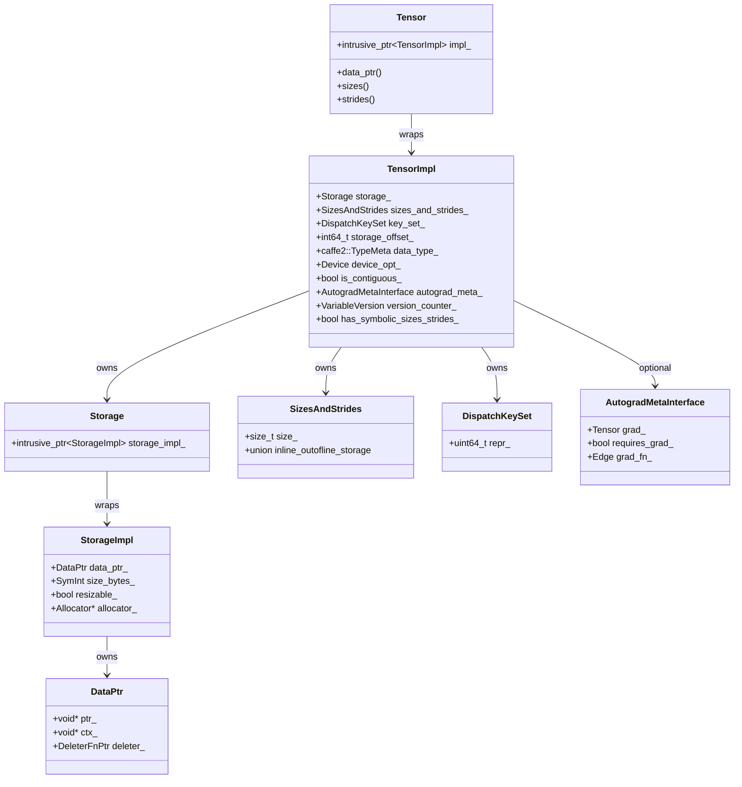

---

## 3. TensorImpl类结构

### 3.1 核心成员变量

```cpp
// 来自c10/core/TensorImpl.h (第2923-3077行)
struct C10_API TensorImpl : public c10::intrusive_ptr_target {
 protected:
  Storage storage_;                                    // Storage指针

 private:
  std::unique_ptr<c10::AutogradMetaInterface> autograd_meta_ = nullptr;
  std::unique_ptr<c10::ExtraMeta> extra_meta_ = nullptr;
  c10::VariableVersion version_counter_;
  impl::PyObjectSlot pyobj_slot_;

 protected:
  c10::impl::SizesAndStrides sizes_and_strides_;       // Sizes/strides存储
  int64_t storage_offset_ = 0;                         // Storage中的偏移
  int64_t numel_ = 1;                                  // 元素总数
  caffe2::TypeMeta data_type_;                         // 数据类型元数据
  std::optional<c10::Device> device_opt_;              // 设备信息

  // 连续性和状态位域
  bool is_contiguous_ : 1;
  bool storage_access_should_throw_ : 1;
  bool is_channels_last_ : 1;
  bool is_channels_last_contiguous_ : 1;
  bool is_non_overlapping_and_dense_ : 1;
  bool is_wrapped_number_ : 1;
  bool allow_tensor_metadata_change_ : 1;
  bool reserved_ : 1;
  uint8_t sizes_strides_policy_ : 2;
  bool has_symbolic_sizes_strides_ : 1;

  DispatchKeySet key_set_;                             // 分发键集合

  // Quantization相关字段
  std::unique_ptr<QScheme> qscheme_opt_;
  std::unique_ptr<Quantizer> quantizer_;
};
```

### 3.2 内存布局

TensorImpl在64位系统上设计为**208字节**，包含：
- vtable指针 (8字节)
- 强/弱引用计数 (16字节)
- Storage指针 (8字节)
- Autograd元数据指针 (16字节)
- 额外元数据指针 (16字节)
- 版本计数器 (8字节)
- PyObject槽 (16字节)
- SizesAndStrides (88字节) - 内联存储最多5维
- storage_offset (8字节)
- numel (8字节)
- data_type (2字节)
- device_opt (3字节)
- key_set (8字节)
- 各种位域

---

## 4. Storage与StorageImpl

### 4.1 StorageImpl结构

```cpp
// 来自c10/core/StorageImpl.h (第52-383行)
struct C10_API StorageImpl : public c10::intrusive_ptr_target {
  DataPtr data_ptr_;                    // 实际数据指针和删除器
  SymInt size_bytes_;                   // 大小（字节）
  bool size_bytes_is_heap_allocated_;
  bool resizable_;                      // 是否可调整大小
  bool received_cuda_;
  bool has_mutable_data_ptr_check_ = false;
  bool throw_on_mutable_data_ptr_ = false;
  bool throw_on_immutable_data_ptr_ = false;
  Allocator* allocator_;                // 分配器
  impl::PyObjectSlot pyobj_slot_;
  std::unique_ptr<StorageExtraMeta> extra_meta_ = nullptr;
};
```

### 4.2 Storage包装类

```cpp
// 来自c10/core/Storage.h (第25-227行)
struct C10_API Storage {
  c10::intrusive_ptr<StorageImpl> storage_impl_;

  const void* data() const;
  void* mutable_data() const;
  size_t nbytes() const;
  DeviceType device_type() const;
  size_t use_count() const;
  bool unique() const;
  bool is_alias_of(const Storage& other) const;
};
```

### 4.3 引用计数机制

PyTorch使用**侵入式引用计数**：

```cpp
class intrusive_ptr_target {
  mutable std::atomic<uint32_t> refcount_{1};
  mutable std::atomic<uint32_t> weakcount_{1};

  void retain() { ++refcount_; }
  void release() {
    if (--refcount_ == 0) {
      if (--weakcount_ == 0) {
        delete this;
      } else {
        destroy_resources();
      }
    }
  }
};
```

---

## 5. SizesAndStrides优化

### 5.1 小尺寸优化 (SSO)

```cpp
// 来自c10/core/impl/SizesAndStrides.h
#define C10_SIZES_AND_STRIDES_MAX_INLINE_SIZE 5

class C10_API SizesAndStrides {
  size_t size_{1};
  union {
    int64_t* outOfLineStorage_;    // 堆分配（>5维）
    int64_t inlineStorage_[C10_SIZES_AND_STRIDES_MAX_INLINE_SIZE * 2]; // 内联存储
  };
};
```

### 5.2 内存布局

对于内联存储（<=5维）：
```
inlineStorage_[0-4]   = sizes[0-4]
inlineStorage_[5-9]   = strides[0-4]
```

对于外部存储（>5维）：
```
outOfLineStorage_[0..size-1]      = sizes
outOfLineStorage_[size..2*size-1] = strides
```

**优势**：
- 80%的张量在典型工作负载中<=5维
- 避免堆分配开销
- 更好的缓存局部性

---

## 6. DispatchKeySet与后端路由

### 6.1 DispatchKeySet结构

```cpp
// 来自c10/core/DispatchKeySet.h
class DispatchKeySet final {
  uint64_t repr_ = 0;  // 位集表示

  // 组合：
  // - 后端位（CPU, CUDA等）在低比特
  // - 功能位（Dense, Sparse, Autograd等）在高比特
};
```

### 6.2 BackendComponent（重要修正）

```cpp
// 后端组件枚举 - 这些值是**位索引**，不是位值
enum class BackendComponent : uint8_t {
  CPUBit = 1,       // 对应位值: 1 << 1 = 2
  CUDABit = 2,      // 对应位值: 1 << 2 = 4
  XPUBit = 3,       // 对应位值: 1 << 3 = 8
  MPSBit = 4,       // 对应位值: 1 << 4 = 16
  HIPBit = 5,
  VEBit = 6,
  IPUBit = 7,
  XLABit = 8,
  XLANativeBit = 9,
  PrivateUse1Bit = 10,
  PrivateUse2Bit = 11,
  PrivateUse3Bit = 12,
  MetaBit = 13,
  // ... 更多后端
};

// 实际位值计算
constexpr static uint64_t toRaw(BackendComponent backend) {
  return 1ULL << static_cast<uint8_t>(backend);
}
```

**关键说明**：
- `CPUBit = 1` 表示这是第1个位的**索引**
- 实际的位值是 `1 << 1 = 2`（二进制10）
- DispatchKeySet.repr_ 使用这些位值进行按位运算

### 6.3 功能Dispatch Key

```cpp
enum class DispatchKey {
  // 功能键（比特16+）
  Dense = 0,          // 稠密张量
  Sparse = 1,         // 稀疏COO
  SparseCsr = 2,      // 稀疏CSR/CSC
  Quantized = 3,      // 量化张量
  AutogradFunctionality = 4,  // Autograd

  // Python层调度键
  Python = 8,
  PythonTLSSnapshot = 9,

  // 功能化
  Functionalize = 10,

  // 动态形状
  SymInt = 11,

  // ... 更多功能键
};
```

### 6.4 分发表索引计算

```cpp
int getDispatchTableIndexForDispatchKeySet() const {
  auto functionality_idx = DispatchKeySet(repr_ >> num_backends).indexOfHighestBit();
  auto offset_and_mask = offsetsAndMasks()[functionality_idx];
  auto backend_idx = DispatchKeySet((repr_ & offset_and_mask.mask) >> 1).indexOfHighestBit();
  return offset_and_mask.offset + backend_idx;
}
```

---

## 7. TensorOptions

### 7.1 结构

```cpp
// 来自c10/core/TensorOptions.h
struct C10_API TensorOptions {
  Device device_ = at::kCPU;                      // 16位
  caffe2::TypeMeta dtype_ = TypeMeta::Make<float>(); // 16位
  Layout layout_ = at::kStrided;                  // 8位
  MemoryFormat memory_format_ = MemoryFormat::Contiguous; // 8位

  bool requires_grad_ : 1;
  bool pinned_memory_ : 1;

  bool has_device_ : 1;
  bool has_dtype_ : 1;
  bool has_layout_ : 1;
  bool has_requires_grad_ : 1;
  bool has_pinned_memory_ : 1;
  bool has_memory_format_ : 1;
};
```

**大小约束**：必须适合128比特（2 * sizeof(int64_t)）

### 7.2 DispatchKey计算

```cpp
inline DispatchKey computeDispatchKey(
    std::optional<ScalarType> dtype,
    std::optional<Layout> layout,
    std::optional<Device> device) {
  const auto layout_ = layout_or_default(layout);
  const auto device_ = device_or_default(device);

  switch (layout_) {
    case Layout::Strided: {
      const auto dtype_ = dtype_or_default(dtype);
      switch (device_.type()) {
        case c10::DeviceType::CPU:
          return isQIntType(dtype_) ? DispatchKey::QuantizedCPU : DispatchKey::CPU;
        case c10::DeviceType::CUDA:
          return isQIntType(dtype_) ? DispatchKey::QuantizedCUDA : DispatchKey::CUDA;
        case c10::DeviceType::PrivateUse1:
          return DispatchKey::PrivateUse1;
        case c10::DeviceType::Meta:
          return DispatchKey::Meta;
      }
    }
    case Layout::Sparse:
      // 类似逻辑
  }
}
```

---

## 8. SymInt与动态形状

### 8.1 SymInt结构

```cpp
// 来自c10/core/SymInt.h
class SymInt {
  // 使用tagged pointer优化
  // - 如果是最多47位的整数，直接内联存储
  // - 否则存储指向SymIntNodeImpl的指针

  int64_t data_;

 public:
  bool is_symbolic() const {
    return data_ & SYM_INT_MASK;  // 检查符号位
  }

  int64_t as_int_unchecked() const {
    return data_ >> 1;  // 右移去掉tag
  }

  SymIntNodeImpl* toSymIntNodeImpl() const {
    return static_cast<SymIntNodeImpl*>(
      reinterpret_cast<void*>(data_ & ~SYM_INT_MASK));
  }
};
```

### 8.2 SymInt使用场景

```cpp
// 在TensorImpl中
class TensorImpl {
  // sizes_and_strides_ 可以存储 SymInt
  // has_symbolic_sizes_strides_ 标志指示是否使用动态形状

  bool has_symbolic_sizes_strides_ = false;

  // 获取大小（可能返回SymInt或int64_t）
  c10::SymInt sym_size(int64_t dim) const;
  c10::SymIntArrayRef sym_sizes() const;
  c10::SymInt sym_numel() const;
  c10::SymInt sym_storage_offset() const;
};
```

### 8.3 动态形状流程

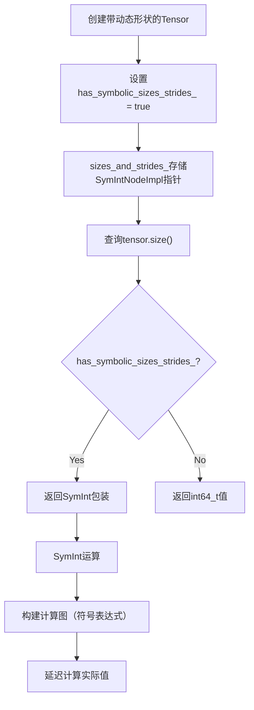

---

## 9. 自定义设备支持

### 9.1 PrivateUse1/2/3机制

PyTorch预留了三个自定义设备槽位用于第三方设备：

```cpp
// 来自c10/core/DispatchKey.h
enum class DispatchKey {
  // 自定义设备
  PrivateUse1 = ...,
  PrivateUse2 = ...,
  PrivateUse3 = ...,
};

// 来自c10/core/DeviceType.h
enum class DeviceType : int8_t {
  CPU = 0,
  CUDA = 1,
  // ...
  PrivateUse1 = 22,
  PrivateUse2 = 23,
  PrivateUse3 = 24,
};
```

### 9.2 注册自定义设备

```cpp
// 注册自定义分配器
at::register_privateuse1_allocator(allocator);

// 设置自定义设备模块名
torch::register_privateuse1_backend("mydevice");

// 现在可以使用：
// torch.Tensor.to("mydevice")
// torch.device("mydevice:0")
```

### 9.3 自定义设备调度流程

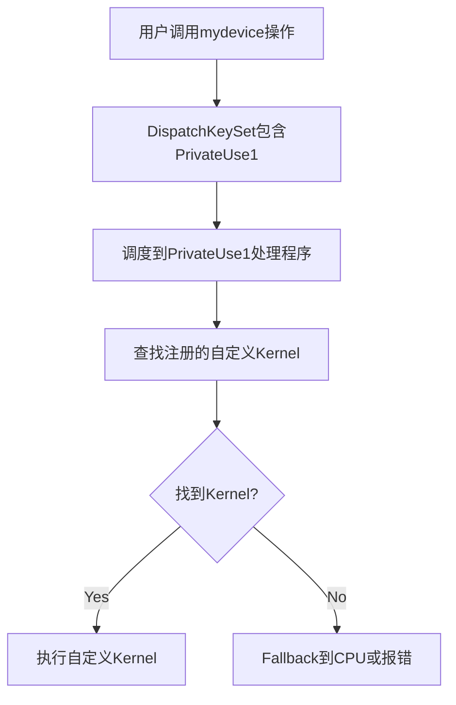

---

## 10. TorchDispatchMode与TorchFunctionMode

### 10.1 TorchDispatchMode

用于拦截所有张量操作：

```python
import torch

class MyDispatchMode(torch.utils._python_dispatch.TorchDispatchMode):
    def __torch_dispatch__(self, func, types, args, kwargs=None):
        print(f"Dispatching: {func}")
        return func(*args, **(kwargs or {}))

with MyDispatchMode():
    x = torch.randn(2, 3)
    y = x + x  # 拦截add操作
```

### 10.2 C++层实现

```cpp
// 来自torch/csrc/utils/python_dispatch.cpp
class TorchDispatchMode {
  PyObject* torch_dispatch_fn_;

  // 注册为全局调度模式
  // 在每个张量操作前调用
};

// 检查是否有活动的调度模式
bool dispatch_mode_enabled() {
  return current_torch_dispatch_mode != nullptr;
}
```

### 10.3 TorchFunctionMode

用于拦截Python层的`__torch_function__`调用：

```python
class MyFunctionMode(torch.overrides.TorchFunctionMode):
    def __torch_function__(self, func, types, args, kwargs=None):
        print(f"Function: {func}")
        return func(*args, **(kwargs or {}))

with MyFunctionMode():
    x = torch.randn(2, 3)
    y = torch.add(x, x)  # 拦截
```

### 10.4 模式堆栈

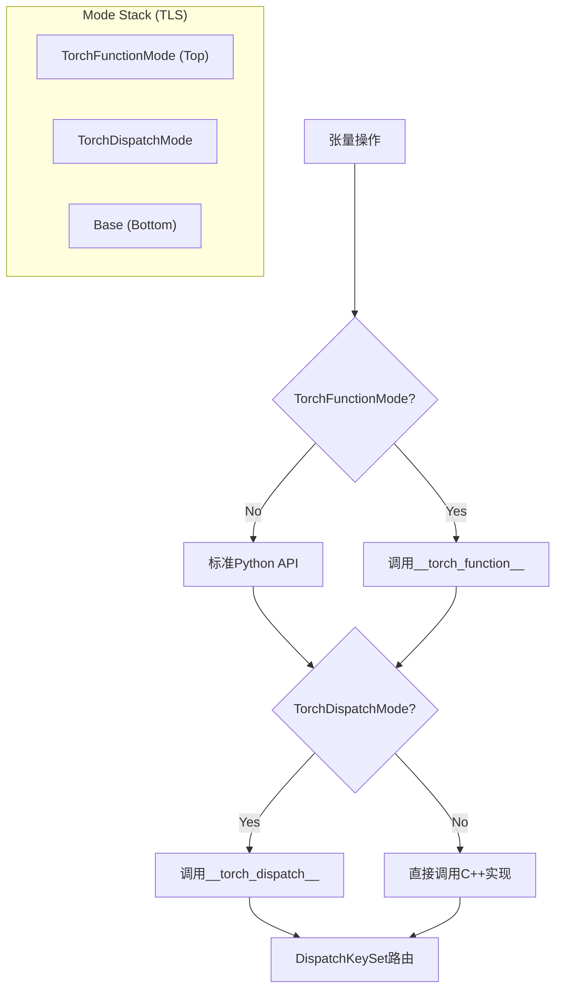

---

## 11. Meta Tensor

### 11.1 Meta Tensor概念

Meta Tensor用于**元数据传播**而不实际分配数据内存：

```python
import torch

# 创建Meta Tensor
x = torch.empty(2, 3, device="meta")
print(x.shape)  # torch.Size([2, 3])
print(x.device)  # meta

# 在Meta设备上执行操作只传播形状
y = x + x  # y也是meta tensor，不分配内存
```

### 11.2 实现机制

```cpp
// 来自c10/core/DispatchKey.h
enum class DispatchKey {
  Meta = ...,
};

// Meta张量的Storage不分配实际数据
class MetaAllocator : public Allocator {
  DataPtr allocate(size_t nbytes) override {
    // 返回空指针，只记录大小
    return DataPtr(nullptr, nullptr, &deleter, DeviceType::Meta);
  }
};

// TensorImpl检查
bool TensorImpl::is_meta() const {
  return key_set_.has(DispatchKey::Meta);
}
```

### 11.3 使用场景

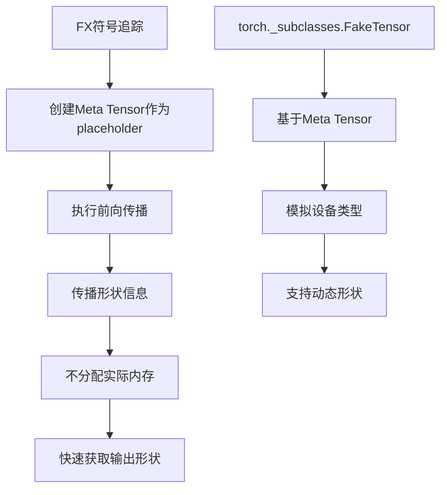

---

## 12. Functionalization

### 12.1 功能化概念

Functionalization将**原地操作**转换为**函数式操作**+**重新赋值**：

```python
# 原始代码
x.add_(1)  # 原地操作

# 功能化后
x = x.add(1)  # 变为函数式
```

### 12.2 C++实现

```cpp
// 来自aten/src/ATen/FunctionalStorageImpl.h
class FunctionalStorageImpl : public StorageImpl {
  // 存储值的链表（支持多版本）
  std::vector<std::pair<Tensor, size_t>> mutations_;
  size_t generation_ = 0;  // 当前代数

 public:
  // 添加突变
  void add_mutation(const Tensor& value);

  // 应用所有突变获取当前值
  Tensor apply_mutations();
};

// 功能化包装
class FunctionalTensorWrapper : public TensorImpl {
  TensorImpl* value_;  // 底层值
  bool is_symbolic_ = false;
};
```

### 12.3 功能化流程

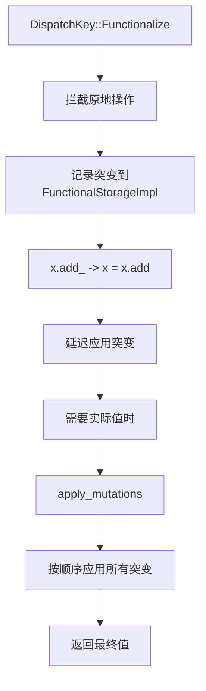

### 12.4 与AOTAutograd集成

```cpp
// 用于导出图时移除副作用
void functionalize_graph(Graph& graph) {
  for (auto node : graph.nodes()) {
    if (is_inplace(node)) {
      // 替换为函数式版本
      replace_with_functional(node);
    }
  }
}
```

---

## 13. Tensor创建流程

### 13.1 创建流程图

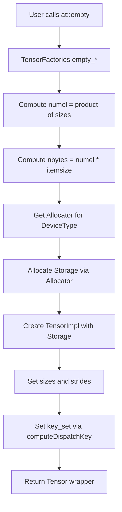

### 13.2 核心代码

```cpp
// 来自ATen/EmptyTensor.cpp
Tensor empty_cpu(
    IntArrayRef size,
    std::optional<ScalarType> dtype_opt,
    std::optional<Layout> layout_opt,
    std::optional<Device> device_opt,
    std::optional<bool> pin_memory_opt,
    std::optional<MemoryFormat> memory_format_opt) {

  // 1. 解析TensorOptions
  TensorOptions options = TensorOptions()
      .dtype(dtype_opt)
      .device(device_opt)
      .layout(layout_opt)
      .pinned_memory(pin_memory_opt);

  // 2. 计算元素数量
  int64_t numel = compute_numel(size);

  // 3. 计算需要的存储大小
  int64_t size_bytes = numel * elementSize(options.dtype());

  // 4. 分配Storage
  Storage storage = Storage::use_byte_size_t(
      size_bytes,
      GetAllocator(options.device().type()),
      /*resizable=*/false);

  // 5. 创建TensorImpl
  auto tensor_impl = c10::make_intrusive<TensorImpl>(
      std::move(storage),
      options.dtype().toScalarType(),
      options.device());

  // 6. 设置sizes和strides
  tensor_impl->set_sizes_and_strides(size, compute_strides(size, memory_format));

  // 7. 计算DispatchKeySet
  tensor_impl->refresh_contiguous();
  tensor_impl->set_version_counter(c10::VariableVersion());

  return Tensor(std::move(tensor_impl));
}
```

---

## 14. View创建机制

### 14.1 as_strided操作

```cpp
// 来自ATen/native/TensorShape.cpp
Tensor as_strided(
    const Tensor& self,
    IntArrayRef size,
    IntArrayRef stride,
    std::optional<int64_t> storage_offset) {

  // 创建新的TensorImpl，共享相同Storage
  auto result = at::detail::make_tensor<TensorImpl>(
      self.storage(),           // 共享Storage
      self.key_set(),           // 复制DispatchKeySet
      self.dtype());            // 复制dtype

  // 设置新的sizes/strides/offset
  result.set_sizes_and_strides(
      size,
      stride,
      storage_offset.value_or(self.storage_offset()));

  return result;
}
```

### 14.2 Slice操作

```cpp
Tensor slice(
    const Tensor& self,
    int64_t dim,
    std::optional<int64_t> start,
    std::optional<int64_t> end,
    int64_t step) {

  // 计算新的sizes和strides
  auto new_sizes = self.sizes().vec();
  auto new_strides = self.strides().vec();

  int64_t start_val = start.value_or(0);
  int64_t end_val = end.value_or(new_sizes[dim]);

  new_sizes[dim] = (end_val - start_val + step - 1) / step;
  if (step != 1) {
    new_strides[dim] *= step;
  }

  // 计算新的storage_offset
  int64_t storage_offset = self.storage_offset() + start_val * self.stride(dim);

  return self.as_strided(new_sizes, new_strides, storage_offset);
}
```

### 14.3 View创建流程图

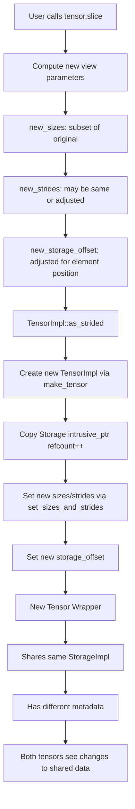

---

## 15. Copy-on-Write机制

### 15.1 COW接口

```cpp
// 来自c10/core/impl/COW.h
namespace c10::impl::cow {

// 创建COW克隆 - 共享存储直到写入
C10_API c10::intrusive_ptr<StorageImpl> lazy_clone_storage(StorageImpl& storage);

// 检查DataPtr是否为COW
C10_API bool is_cow_data_ptr(const c10::DataPtr& data_ptr);

// 强制物化（复制）COW存储
C10_API void materialize_cow_storage(StorageImpl& storage);

}
```

### 15.2 物化触发

```cpp
// 来自StorageImpl.h
void maybe_materialize_cow() {
  if (is_cow()) {
    impl::cow::materialize_cow_storage(*this);
  }
}
```

**触发条件**：
- 任何对`mutable_data()`或`mutable_data_ptr()`的调用
- 当存储被修改时

### 15.3 COW机制流程图

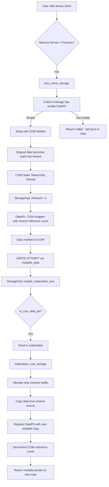

---

## 16. 内存管理生命周期

### 16.1 分配流程

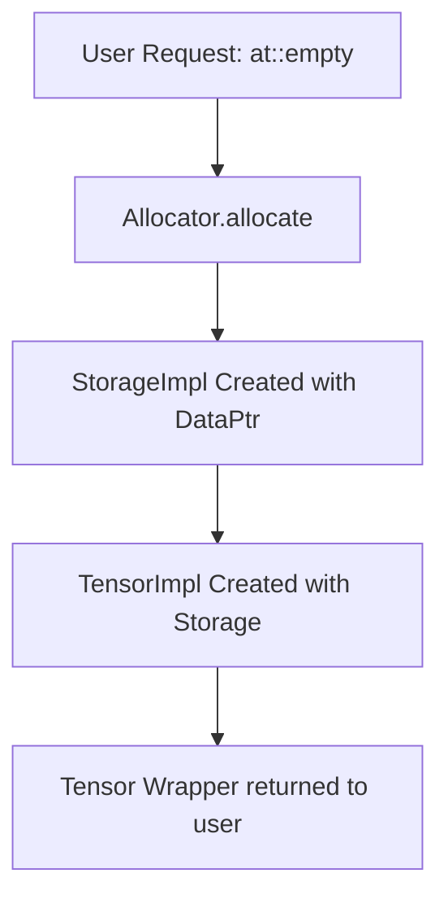

### 16.2 释放流程

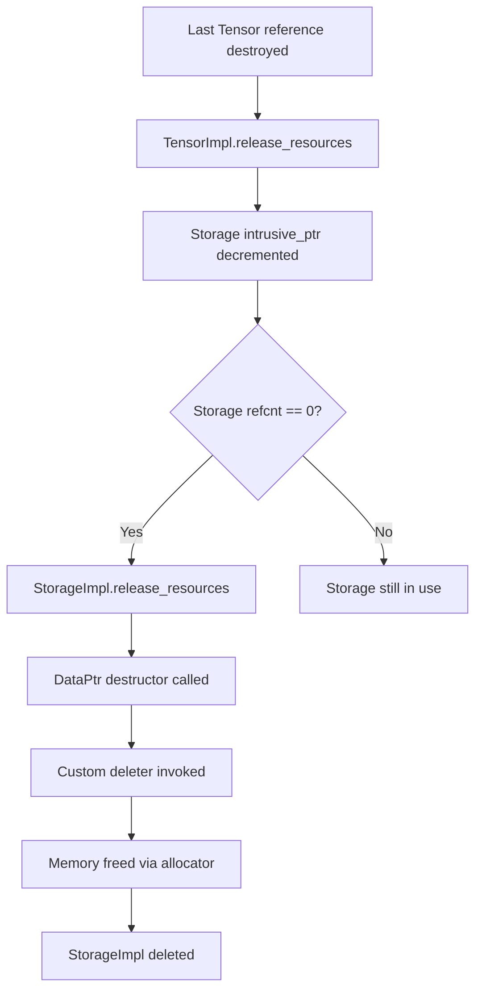

### 16.3 AutogradMeta与版本计数器

```cpp
// 来自c10/core/AutogradMetaInterface.h
struct AutogradMetaInterface {
  Tensor grad_;                     // 梯度张量
  bool requires_grad_ = false;      // 是否需要梯度
  bool is_view_ = false;            // 是否是视图
  Edge grad_fn_;                    // 梯度函数边
  Edge grad_accumulator_;           // 梯度累加器
};

// 版本计数器
struct VariableVersion {
  struct VersionCounter : intrusive_ptr_target {
    std::atomic<uint32_t> version_;
  };
  c10::intrusive_ptr<VersionCounter> version_counter_;

  void bump() { ++version_counter_->version_; }  // 原地操作调用
  uint32_t current_version() const { return version_counter_->version_; }
};
```

**用途**：检测保存用于反向传播的张量是否被修改，实现正确的梯度计算。

### 16.4 完整内存生命周期流程图

```mermaid
flowchart TD
    subgraph Initial["Initial State"]
        A1["StorageImpl: refcount = 1"]
        A2["TensorImplA: refcount = 1"]
        A3["Storage refcount = 2"]
    end

    subgraph CreateView["CREATE VIEW"]
        B1["New TensorImplB: refcount = 1"]
        B2["StorageImpl: refcount = 3"]
        B3["No data copy!"]
    end

    subgraph CopyTensor["COPY TENSOR"]
        C1["Create new StorageImpl: refcount = 1"]
        C2["Create new TensorImplC"]
        C3["Copy data from A to C"]
        C4["TensorImplA refcount--"]
    end

    subgraph DestroyA["DESTROY TENSOR A"]
        D1["TensorImplA refcount -> 0"]
        D2["release_resources called"]
        D3["StorageImpl refcount-- 3->2"]
        D4["TensorImplA deleted"]
    end

    subgraph DestroyB["DESTROY TENSOR B"]
        E1["TensorImplB refcount -> 0"]
        E2["StorageImpl refcount-- 2->1"]
        E3["Only self-reference remains"]
    end

    subgraph DestroyC["DESTROY TENSOR C"]
        F1["TensorImplC refcount -> 0"]
        F2["StorageImpl refcount-- 1->0"]
        F3["release_resources -> DataPtr destructor"]
        F4["Memory freed via allocator deleter"]
        F5["StorageImpl deleted"]
    end

    Initial --> CreateView
    CreateView --> CopyTensor
    CopyTensor --> DestroyA
    DestroyA --> DestroyB
    DestroyB --> DestroyC
```

---

## 17. 关键设计决策

### 17.1 内存效率

1. **SizesAndStrides内联存储**：<=5维的张量避免堆分配（典型工作负载中80%的张量）
2. **Storage共享**：多个张量/视图通过intrusive_ptr共享相同底层存储
3. **TensorImpl大小**：精心设计约208字节，支持内存中数十亿张量
4. **SymInt优化**：小整数直接内联，大整数使用指针

### 17.2 性能优化

1. **连续性缓存**：预计算并缓存连续性标志，避免重复计算
2. **Dispatch Key缓存**：每个张量缓存DispatchKeySet，加速算子分发
3. **侵入式引用计数**：消除引用计数的单独堆分配
4. **Meta Tensor快速形状传播**：无需分配数据内存

### 17.3 Copy-on-Write

1. **延迟物化**：通过`clone()`创建的视图可以共享内存直到发生写入
2. **自动触发**：任何可变访问（`mutable_data()`）触发物化
3. **简单DataPtr检查**：通过布尔标志快速检查是否需要物化

### 17.4 版本计数器用于Autograd

```cpp
struct VariableVersion {
  struct VersionCounter : intrusive_ptr_target {
    std::atomic<uint32_t> version_;
  };
  c10::intrusive_ptr<VersionCounter> version_counter_;

  void bump() { ++version_counter_->version_; }  // 原地操作调用
  uint32_t current_version() const { return version_counter_->version_; }
};
```

**用途**：检测保存用于反向传播的张量是否被修改，实现正确的梯度计算。

### 17.5 灵活的分发机制

1. **BackendComponent位索引**：支持最多16个后端
2. **功能位组合**：支持多种张量类型（稠密、稀疏、量化）
3. **自定义设备支持**：PrivateUse1/2/3预留槽位
4. **Mode拦截**：TorchDispatchMode/TorchFunctionMode支持自定义行为

---

## 18. 总结

PyTorch的张量基础设施展示了精密的工程设计：

1. **关注点分离**：Tensor（用户API）→ TensorImpl（元数据）→ Storage（数据）→ Allocator（内存）

2. **高效内存布局**：位域、联合体和侵入式指针最小化每张量开销

3. **灵活分发**：DispatchKeySet支持多后端和各种功能

4. **零拷贝视图**：切片/视图操作仅修改元数据

5. **自动COW**：透明的写时复制实现高效克隆

6. **动态形状支持**：SymInt支持符号化形状计算

7. **自定义扩展**：PrivateUse设备支持第三方后端

8. **模式拦截**：TorchDispatchMode支持自定义操作拦截

9. **功能化转换**：自动将原地操作转换为函数式操作

10. **引用安全**：侵入式引用计数确保跨语言边界（Python/C++）的正确内存管理

该架构成功平衡了：
- **性能**：常见操作快速路径、缓存、内联存储
- **灵活性**：多设备、布局和张量类型支持
- **内存效率**：精心打包、共享存储、延迟物化
- **正确性**：版本计数器、引用计数、边界检查
- **扩展性**：自定义设备、模式拦截、动态形状
