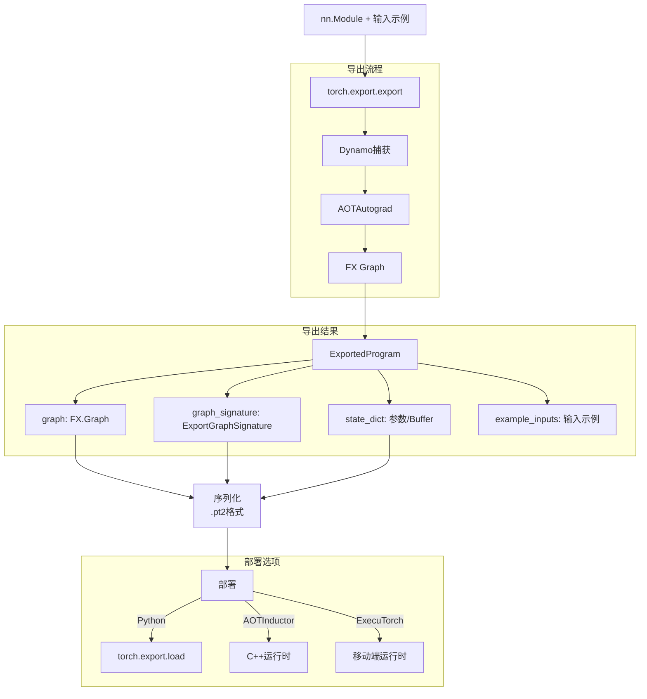
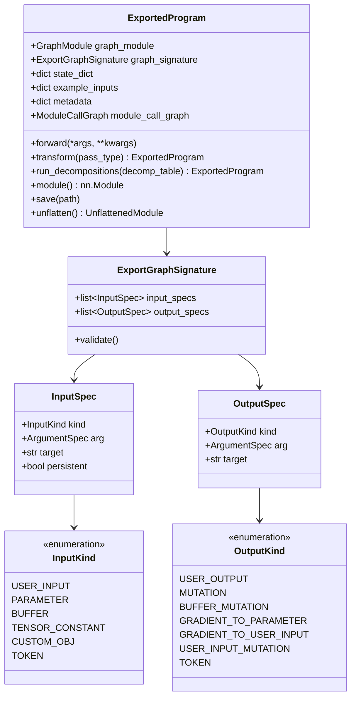
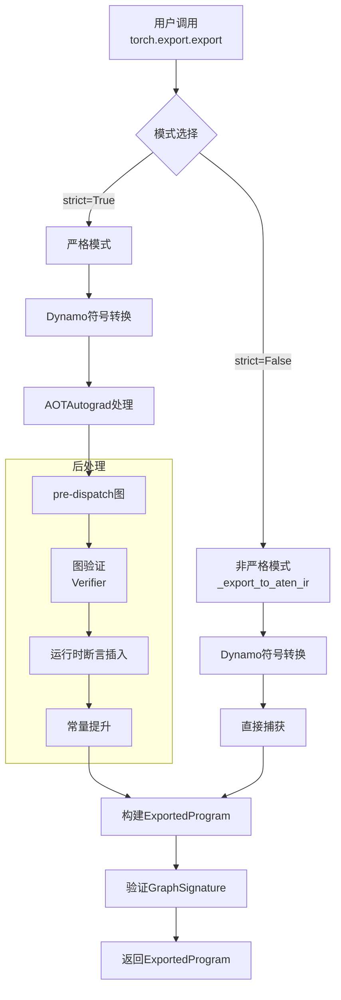
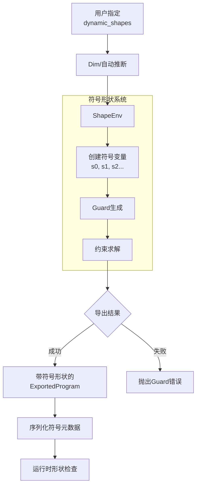
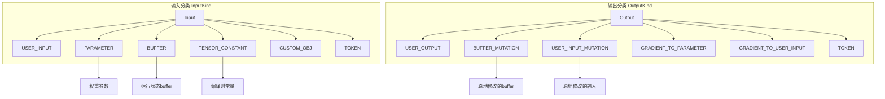
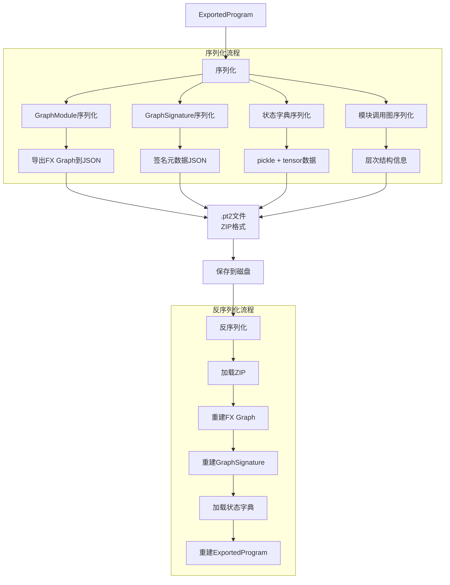
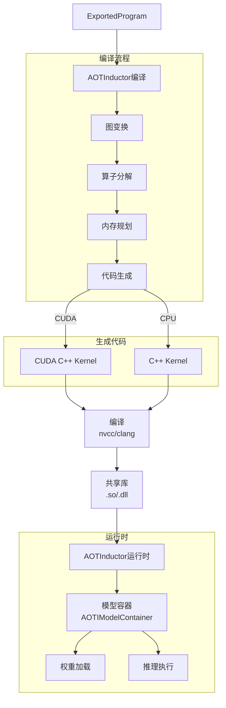
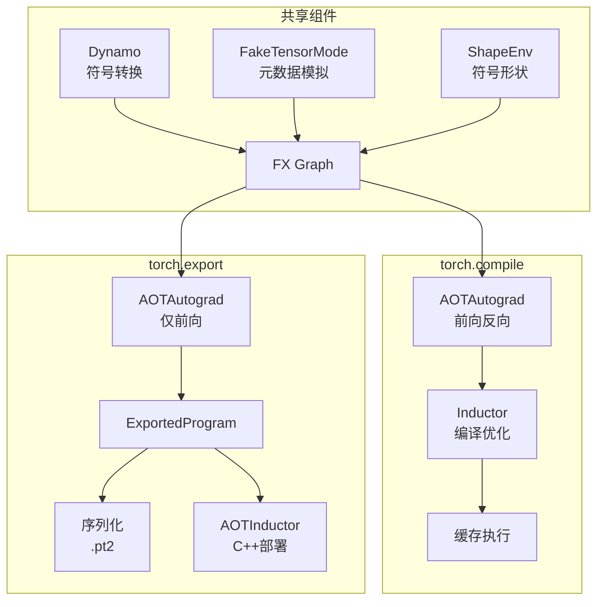

# PyTorch torch.export (PT2 Export) 深度分析

## 目录
1. [架构概览与设计目标](#1-架构概览与设计目标)
2. [ExportedProgram核心结构](#2-exportedprogram核心结构)
3. [导出流程详解](#3-导出流程详解)
4. [动态形状支持](#4-动态形状支持)
5. [GraphSignature与元数据](#5-graphsignature与元数据)
6. [序列化与反序列化](#6-序列化与反序列化)
7. [AOT编译与部署](#7-aot编译与部署)
8. [严格模式与非严格模式](#8-严格模式与非严格模式)
9. [与torch.compile的关系](#9-与torchcompile的关系)

---

## 1. 架构概览与设计目标

### 1.1 什么是torch.export

**torch.export**是PyTorch 2.0引入的模型导出系统，用于将PyTorch模型捕获为**静态计算图**并序列化，支持在Python环境外部署。与TorchScript不同，它基于torch.compile技术栈，使用FX Graph而非TorchScript IR。

### 1.2 设计目标

```
┌─────────────────────────────────────────────────────────────┐
│                    torch.export 设计目标                     │
├─────────────────────────────────────────────────────────────┤
│  1. 捕获PyTorch 2.0图: 基于torch.compile栈，支持新特性      │
│  2. 动态形状: 支持符号形状和约束求解                         │
│  3. 序列化: 标准化的.pt2格式，可跨环境部署                   │
│  4. 生产就绪: 为推理优化和后端部署设计                       │
│  5. 可扩展: 支持自定义算子和序列化                           │
│  6. 与torch.compile一致: 复用Dynamo/AOTAutograd              │
└─────────────────────────────────────────────────────────────┘
```

### 1.3 在PyTorch 2.0栈中的位置



### 1.4 核心文件位置

| 组件 | 文件路径 | 描述 |
|------|----------|------|
| ExportedProgram | `torch/export/exported_program.py` | 导出结果核心类 |
| GraphSignature | `torch/export/graph_signature.py` | 输入输出签名 |
| 动态形状 | `torch/export/dynamic_shapes.py` | Dim/动态形状API |
| 导出核心 | `torch/_export/__init__.py` | export()实现 |
| 序列化 | `torch/_export/serde/` | .pt2序列化格式 |
| 验证器 | `torch/_export/verifier.py` | 导出图验证 |
| AOT编译 | `torch/_inductor/aoti_*/` | AOTInductor编译 |

---

## 2. ExportedProgram核心结构

### 2.1 类结构概览



### 2.2 ExportedProgram定义

```python
@dataclasses.dataclass
class ExportedProgram:
    """
    导出程序的数据包装器，捕获模型的计算图。
    """

    # FX GraphModule，包含计算图和参数
    graph_module: torch.fx.GraphModule

    # 输入输出签名
    graph_signature: ExportGraphSignature

    # 状态字典（参数和buffer）
    state_dict: dict[str, Any]

    # 调用规格（用于pytree展平/恢复）
    call_spec: CallSpec

    # 用户输入示例（用于验证）
    example_inputs: tuple[tuple[Any, ...], dict[str, Any]]

    # 模块调用图（用于层次结构重建）
    module_call_graph: list[ModuleCallEntry]

    # 原始函数签名
    original_signature: inspect.Signature | None

    # 导出元数据
    dialect: str
    opset_version: dict[str, int]
    custom_objs: dict[str, Any]
    constants: dict[str, Any]

    def forward(self, *args, **kwargs):
        """执行导出图的前向传播"""
        # 展平输入
        flat_args, _ = pytree.tree_flatten((args, kwargs))

        # 通过graph_signature重新排序参数
        ordered_args = self._reorder_args(flat_args)

        # 执行图
        results = self.graph_module(*ordered_args)

        # 处理输出（包括突变）
        return self._process_outputs(results)

    def transform(self, *pass_types: type[PassType]) -> "ExportedProgram":
        """应用图变换Pass"""
        new_gm = copy.deepcopy(self.graph_module)
        for pass_type in pass_types:
            pass_type().apply(new_gm)
        return ExportedProgram(...)

    def run_decompositions(
        self,
        decomp_table: dict[torch._ops.OperatorBase, Callable]
    ) -> "ExportedProgram":
        """运行分解表，将算子分解为更基础的形式"""
        ...

    def unflatten(self) -> torch.nn.Module:
        """将展平的图反展平为层次化的nn.Module"""
        from torch.export.unflatten import unflatten
        return unflatten(self)
```

### 2.3 ExportGraphSignature

```python
@dataclass
class ExportGraphSignature:
    """
    导出图的输入输出签名。
    描述graph的输入输出如何对应到原始模型的参数、buffer和输出。
    """

    # 输入规格列表
    input_specs: list[InputSpec]

    # 输出规格列表
    output_specs: list[OutputSpec]

    def validate(self) -> None:
        """验证签名的合法性"""
        # 检查输入规格一致性
        # 检查输出规格一致性
        # 确保参数和buffer只出现一次

@dataclass
class InputSpec:
    """单个输入的规格"""

    kind: InputKind  # 输入类型
    arg: ArgumentSpec  # 参数规格
    target: str | None  # 目标名称（参数名等）
    persistent: bool | None = None  # buffer是否持久

@dataclass
class OutputSpec:
    """单个输出的规格"""

    kind: OutputKind  # 输出类型
    arg: ArgumentSpec  # 参数规格
    target: str | None = None  # 目标名称

class InputKind(Enum):
    """输入类型枚举"""
    USER_INPUT = "user_input"           # 用户输入
    PARAMETER = "parameter"             # 可训练参数
    BUFFER = "buffer"                   # 持久buffer
    TENSOR_CONSTANT = "tensor_constant" # 张量常量
    CUSTOM_OBJ = "custom_obj"           # 自定义对象
    TOKEN = "token"                     # 控制流token

class OutputKind(Enum):
    """输出类型枚举"""
    USER_OUTPUT = "user_output"                    # 用户输出
    BUFFER_MUTATION = "buffer_mutation"            # buffer突变
    GRADIENT_TO_PARAMETER = "gradient_to_parameter" # 参数梯度
    GRADIENT_TO_USER_INPUT = "gradient_to_user_input" # 输入梯度
    USER_INPUT_MUTATION = "user_input_mutation"    # 输入突变
    TOKEN = "token"                                 # 控制流token

# 参数规格类型
ArgumentSpec = Union[
    TensorArgument,      # 张量参数
    SymIntArgument,      # 符号整数参数
    SymFloatArgument,    # 符号浮点参数
    SymBoolArgument,     # 符号布尔参数
    ConstantArgument,    # 常量参数
    CustomObjArgument,   # 自定义对象参数
    TokenArgument,       # Token参数
]
```

### 2.4 模块调用图

```python
@dataclass
class ModuleCallEntry:
    """模块调用图条目"""

    fqn: str  # 完全限定名，如 "layer1.0.conv1"
    signature: ModuleCallSignature | None  # 调用签名

@dataclass
class ModuleCallSignature:
    """模块调用签名"""

    inputs: list[ArgumentSpec]   # 模块输入规格
    outputs: list[ArgumentSpec]  # 模块输出规格
    in_spec: pytree.TreeSpec     # 输入pytree规格
    out_spec: pytree.TreeSpec    # 输出pytree规格
    forward_arg_names: list[str] | None  # 前向参数名
```

---

## 3. 导出流程详解

### 3.1 导出架构流程



### 3.2 export()函数核心逻辑

```python
# torch/_export/__init__.py

def export(
    mod: torch.nn.Module,
    args: tuple[Any, ...],
    kwargs: dict[str, Any] | None = None,
    *,
    dynamic_shapes: dict[str, Any] | tuple[Any, ...] | None = None,
    strict: bool = True,
    preserve_module_call_signature: tuple[str, ...] = (),
) -> ExportedProgram:
    """
    将PyTorch模型导出为可序列化的程序。

    Args:
        mod: 要导出的nn.Module或可调用对象
        args: 示例位置参数
        kwargs: 示例关键字参数
        dynamic_shapes: 动态形状规格
        strict: 是否使用严格模式
        preserve_module_call_signature: 保留调用的模块签名

    Returns:
        ExportedProgram: 导出的程序
    """

    if strict:
        # 严格模式：使用AOTAutograd完整功能化
        from torch.export._trace import _export
        return _export(
            mod,
            args,
            kwargs,
            dynamic_shapes,
            pre_dispatch=True,
            preserve_module_call_signature=preserve_module_call_signature,
        )
    else:
        # 非严格模式：直接导出到ATen IR
        from torch.export._trace import _export_to_aten_ir
        return _export_to_aten_ir(
            mod,
            args,
            kwargs,
            dynamic_shapes,
            preserve_module_call_signature=preserve_module_call_signature,
        )
```

### 3.3 _export内部流程

```python
# torch/export/_trace.py

def _export(
    mod: torch.nn.Module,
    args: tuple[Any, ...],
    kwargs: dict[str, Any] | None,
    dynamic_shapes: dict[str, Any] | None,
    pre_dispatch: bool = True,
    preserve_module_call_signature: tuple[str, ...] = (),
) -> ExportedProgram:
    """导出核心实现"""

    # 1. 创建FakeTensorMode和ShapeEnv
    fake_mode = detect_fake_mode(args)
    if fake_mode is None:
        fake_mode = FakeTensorMode()

    # 2. 转换输入为FakeTensor
    fake_args = tree_map(
        lambda x: fake_mode.from_tensor(x) if isinstance(x, torch.Tensor) else x,
        args
    )

    # 3. 使用Dynamo捕获图
    with fake_mode:
        # Dynamo追踪
        gm, guards = torch._dynamo.export(
            mod,
            *fake_args,
            **(kwargs or {}),
            dynamic_shapes=dynamic_shapes,
        )

    # 4. AOTAutograd处理
    from torch._functorch.aot_autograd import aot_export_module

    aot_export_result = aot_export_module(
        gm,
        fake_args,
        **kwargs,
        dynamic_shapes=dynamic_shapes,
    )

    # 5. 构建GraphSignature
    graph_signature = _convert_to_export_graph_signature(
        aot_export_result.graph_signature,
        mod
    )

    # 6. 插入运行时断言
    from torch.fx.passes.runtime_assert import insert_deferred_runtime_asserts
    insert_deferred_runtime_asserts(
        aot_export_result.graph_module,
        fake_mode.shape_env
    )

    # 7. 构建ExportedProgram
    exported_program = ExportedProgram(
        graph_module=aot_export_result.graph_module,
        graph_signature=graph_signature,
        state_dict=mod.state_dict(),
        example_inputs=(args, kwargs or {}),
        module_call_graph=...,
    )

    return exported_program
```

### 3.4 图验证器

```python
# torch/_export/verifier.py

class Verifier:
    """ExportedProgram图验证器"""

    def check(self, ep: ExportedProgram) -> None:
        """验证导出程序的合法性"""

        # 1. 验证图结构
        self._verify_graph_structure(ep.graph_module.graph)

        # 2. 验证输入输出签名
        self._verify_signature(ep.graph_signature, ep.graph_module)

        # 3. 验证状态字典
        self._verify_state_dict(ep.state_dict, ep.graph_signature)

        # 4. 验证操作符
        self._verify_ops(ep.graph_module)

    def _verify_graph_structure(self, graph: torch.fx.Graph) -> None:
        """验证FX图结构"""
        # 确保所有节点类型合法
        # 确保没有未定义的变量
        # 确保控制流正确

    def _verify_signature(
        self,
        signature: ExportGraphSignature,
        gm: torch.fx.GraphModule
    ) -> None:
        """验证签名与图一致"""
        # 检查输入规格数量与图输入匹配
        # 检查输出规格数量与图输出匹配
        # 验证参数和buffer的存在性

    def _verify_ops(self, gm: torch.fx.GraphModule) -> None:
        """验证图中使用的操作符"""
        # 确保所有aten操作符有效
        # 检查自定义操作符是否已注册
```

---

## 4. 动态形状支持

### 4.1 动态形状架构



### 4.2 Dim API

```python
# torch/export/dynamic_shapes.py

class Dim:
    """
    动态维度类，用于指定张量维度的动态性。
    """

    # 自动推断
    AUTO = _DimHint.AUTO()      # 自动决定静态或动态
    DYNAMIC = _DimHint.DYNAMIC()  # 强制动态
    STATIC = _DimHint.STATIC()    # 强制静态

    def __init__(
        self,
        name: str,
        *,
        min: int | None = None,
        max: int | None = None
    ):
        """
        Args:
            name: 维度符号名
            min: 最小值约束
            max: 最大值约束
        """
        self.__name__ = name
        self.min = min if min is not None else 0
        self.max = max if max is not None else int_oo

    def __add__(self, other: int) -> "Dim":
        """支持维度线性关系，如 dim + 1"""
        if type(other) is not int:
            raise NotImplementedError(
                f"只支持整数系数，得到 {other}"
            )
        return self._derive(lambda x: x + other)

    def __mul__(self, other: int) -> "Dim":
        """支持维度倍数关系，如 2 * dim"""
        return self._derive(lambda x: x * other)

    def _derive(self, fn: Callable) -> "Dim":
        """派生新维度"""
        # 计算新的min/max约束
        new_min, new_max = self._compute_bounds(fn)
        new_dim = Dim(f"{self.__name__}_derived", min=new_min, max=new_max)
        new_dim._expr = fn(self)
        return new_dim
```

### 4.3 动态形状规格

```python
# 动态形状使用示例

# 定义模型
class Model(nn.Module):
    def forward(self, x, y):
        # x: [batch, seq_len]
        # y: [batch, seq_len, hidden]
        return torch.matmul(x.unsqueeze(-1), y).squeeze(-1)

# 示例输入
x = torch.randn(4, 10)
y = torch.randn(4, 10, 64)

# 方式1: 使用Dim指定动态维度
batch = Dim("batch", min=1, max=128)
seq_len = Dim("seq_len", min=1, max=1024)
hidden = Dim("hidden", min=1, max=512)

dynamic_shapes = {
    "x": {0: batch, 1: seq_len},      # batch和seq_len动态
    "y": {0: batch, 1: seq_len, 2: hidden},  # 保持与x一致
}

# 方式2: 使用自动推断
dynamic_shapes = {
    "x": {0: Dim.AUTO, 1: Dim.AUTO},  # 自动推断
    "y": {0: Dim.AUTO, 1: Dim.AUTO, 2: Dim.AUTO},
}

# 导出
ep = export(model, (x, y), dynamic_shapes=dynamic_shapes)

# 方式3: 维度关系
batch = Dim("batch")
# seq_len是batch的3倍加4
seq_len = 3 * batch + 4

dynamic_shapes = {
    "x": {0: batch, 1: seq_len},
    "y": {0: batch, 1: seq_len, 2: 64},  # hidden固定
}
```

### 4.4 运行时断言

```python
# torch/fx/passes/runtime_assert.py

def insert_deferred_runtime_asserts(
    gm: torch.fx.GraphModule,
    shape_env: ShapeEnv
) -> None:
    """
    将ShapeEnv中的约束转换为运行时断言节点插入图中。
    这些断言在运行时检查输入形状是否符合约束。
    """

    for symbol, constraint in shape_env.var_to_range.items():
        # 为每个约束创建assert节点
        assert_node = gm.graph.create_node(
            "call_function",
            torch._assert,
            args=(
                # 约束条件
                constraint.expr,
                # 错误消息
                f"违反约束: {symbol}"
            )
        )

    # 示例插入的节点
    # %assert = call_function[target=torch._assert](
    #     args = (%input.shape[0] >= 1, "batch必须>=1")
    # )
```

---

## 5. GraphSignature与元数据

### 5.1 输入输出分类



### 5.2 签名示例

```python
# 假设模型
class MyModel(nn.Module):
    def __init__(self):
        super().__init__()
        self.weight = nn.Parameter(torch.randn(10, 20))
        self.bias = nn.Parameter(torch.randn(10))
        self.running_mean = torch.zeros(10)  # buffer

    def forward(self, x, scale):
        # x: [batch, 20]
        # scale: scalar
        out = torch.matmul(x, self.weight.t()) + self.bias
        self.running_mean += out.mean(0).detach()  # 修改buffer
        return out * scale

model = MyModel()
x = torch.randn(4, 20)
scale = 2.0

ep = export(model, (x, scale))

# 生成的GraphSignature
"""
input_specs = [
    # 用户输入1: x
    InputSpec(kind=InputKind.USER_INPUT, arg=TensorArgument("arg0_1")),
    # 用户输入2: scale
    InputSpec(kind=InputKind.USER_INPUT, arg=ConstantArgument(2.0)),
    # 参数
    InputSpec(kind=InputKind.PARAMETER, arg=TensorArgument("arg2_1"), target="weight"),
    InputSpec(kind=InputKind.PARAMETER, arg=TensorArgument("arg3_1"), target="bias"),
    # buffer
    InputSpec(kind=InputKind.BUFFER, arg=TensorArgument("arg4_1"), target="running_mean", persistent=True),
]

output_specs = [
    # 主要输出
    OutputSpec(kind=OutputKind.USER_OUTPUT, arg=TensorArgument("mul_1")),
    # buffer突变
    OutputSpec(kind=OutputKind.BUFFER_MUTATION, arg=TensorArgument("add_1"), target="running_mean"),
]
"""
```

### 5.3 调用规格

```python
@dataclass
class CallSpec:
    """调用规格，用于输入输出展平/恢复"""

    # 输入pytree规格（序列化格式）
    in_spec: str

    # 输出pytree规格
    out_spec: str

    # 前向参数名
    forward_arg_names: list[str] | None

# 示例
# in_spec = "((*,*),*)"  # 两个位置参数，第一个是元组
# out_spec = "(*)"        # 单个输出
```

---

## 6. 序列化与反序列化

### 6.1 序列化架构



### 6.2 序列化格式

```python
# torch/_export/serde/serialize.py

class Serializer:
    """ExportedProgram序列化器"""

    def serialize(self, exported_program: ExportedProgram) -> SerializedArtifact:
        """序列化导出程序"""

        # 1. 序列化图
        serialized_graph = self._serialize_graph(
            exported_program.graph_module.graph
        )

        # 2. 序列化签名
        serialized_signature = self._serialize_signature(
            exported_program.graph_signature
        )

        # 3. 序列化调用图
        serialized_module_call_graph = self._serialize_module_call_graph(
            exported_program.module_call_graph
        )

        # 4. 序列化状态字典
        serialized_state_dict = self._serialize_state_dict(
            exported_program.state_dict
        )

        return SerializedArtifact(
            graph_module=serialized_graph,
            signature=serialized_signature,
            module_call_graph=serialized_module_call_graph,
            state_dict=serialized_state_dict,
        )

    def _serialize_graph(self, graph: torch.fx.Graph) -> Graph:
        """序列化FX图"""
        nodes = []
        for node in graph.nodes:
            serialized_node = Node(
                target=self._serialize_target(node.target),
                args=self._serialize_args(node.args),
                kwargs=self._serialize_kwargs(node.kwargs),
                outputs=self._serialize_outputs(node),
                metadata=self._serialize_metadata(node.meta),
            )
            nodes.append(serialized_node)

        return Graph(nodes=nodes)

    def _serialize_target(self, target: Any) -> Target:
        """序列化操作符目标"""
        if isinstance(target, torch._ops.OpOverload):
            return Target(
                op=target.name(),
                overload=target.overload,
            )
        elif isinstance(target, str):
            return Target(method=target)
        ...

class Deserializer:
    """ExportedProgram反序列化器"""

    def deserialize(
        self,
        serialized_artifact: SerializedArtifact
    ) -> ExportedProgram:
        """反序列化导出程序"""

        # 1. 反序列化图
        graph_module = self._deserialize_graph_module(
            serialized_artifact.graph_module
        )

        # 2. 反序列化签名
        graph_signature = self._deserialize_signature(
            serialized_artifact.signature
        )

        # 3. 构建ExportedProgram
        return ExportedProgram(
            graph_module=graph_module,
            graph_signature=graph_signature,
            state_dict=serialized_artifact.state_dict,
            ...
        )
```

### 6.3 使用API

```python
# 保存导出程序
ep = export(model, (x,))

# 方法1: 使用ExportedProgram.save()
ep.save("model.pt2")

# 方法2: 使用torch.export.save()
torch.export.save(ep, "model.pt2")

# 加载导出程序
# 方法1: 使用torch.export.load()
loaded_ep = torch.export.load("model.pt2")

# 使用加载的程序
output = loaded_ep(x)

# 检查结构
print(loaded_ep.graph)
print(loaded_ep.graph_signature)
```

---

## 7. AOT编译与部署

### 7.1 AOTInductor架构



### 7.2 AOT编译API

```python
# torch/_inductor/__init__.py

def aot_compile(
    gm: torch.fx.GraphModule,
    example_inputs: list[torch.Tensor],
    options: dict[str, Any] | None = None,
) -> str:
    """
    AOT编译GraphModule为共享库。

    Args:
        gm: FX GraphModule
        example_inputs: 示例输入
        options: 编译选项

    Returns:
        生成的共享库路径
    """

    # 1. 运行图变换
    gm = apply_graph_passes(gm)

    # 2. 运行分解
    gm = apply_decompositions(gm)

    # 3. 生成代码
    from torch._inductor.codegen import codegen
    code = codegen(gm, example_inputs, options)

    # 4. 编译生成共享库
    from torch._inductor.compile import compile_code
    so_path = compile_code(code, options)

    return so_path

def aoti_load_package(path: str) -> Callable:
    """加载AOT编译的包"""
    from torch._C._aoti import AOTIModelContainerRunner

    runner = AOTIModelContainerRunner(path)

    def run(*args, **kwargs):
        flat_args = tree_flatten((args, kwargs))[0]
        flat_outputs = runner.run(flat_args)
        return tree_unflatten(flat_outputs, runner.output_spec)

    return run
```

### 7.3 C++运行时API

```cpp
// AOTInductor C++ API

class AOTIModelContainerRunner {
public:
    // 构造函数
    AOTIModelContainerRunner(const std::string& model_path);

    // 推理执行
    std::vector<at::Tensor> run(
        const std::vector<at::Tensor>& inputs
    );

    // 获取调用规格
    std::pair<std::string, std::string> get_call_spec() const;

private:
    std::unique_ptr<AOTIModelContainer> container_;
};

// 使用示例
int main() {
    // 加载模型
    auto runner = torch::inductor::AOTIModelContainerRunner("model.so");

    // 准备输入
    std::vector<at::Tensor> inputs = {
        torch::randn({1, 3, 224, 224})
    };

    // 执行推理
    auto outputs = runner.run(inputs);

    return 0;
}
```

---

## 8. 严格模式与非严格模式

### 8.1 模式对比

| 特性 | 严格模式 (strict=True) | 非严格模式 (strict=False) |
|------|----------------------|-------------------------|
| 捕获方式 | Dynamo + AOTAutograd | Dynamo直接捕获 |
| 功能化 | 是（完整） | 部分 |
| 突变处理 | 输出突变buffer | 可能丢失突变 |
| 动态形状 | 完整支持 | 部分支持 |
| 使用场景 | 生产部署 | 快速原型 |
| 可靠性 | 高 | 中 |

### 8.2 严格模式流程

```python
# 严格模式内部实现

def _export(
    mod: torch.nn.Module,
    args: tuple[Any, ...],
    kwargs: dict[str, Any],
    dynamic_shapes: dict[str, Any],
    pre_dispatch: bool = True,
    ...
) -> ExportedProgram:
    """严格模式导出"""

    # 1. Dynamo追踪
    with fake_mode:
        gm, guards = torch._dynamo.export(
            mod, *args, **kwargs,
            dynamic_shapes=dynamic_shapes
        )

    # 2. AOTAutograd功能化
    from torch._functorch.aot_autograd import aot_export_module

    # pre_dispatch=True: 保留aten操作
    # pre_dispatch=False: 分解到prim操作
    aot_result = aot_export_module(
        gm, args,
        pre_dispatch=pre_dispatch,
        dynamic_shapes=dynamic_shapes
    )

    # 3. 构建ExportedProgram
    return ExportedProgram(
        graph_module=aot_result.graph_module,
        graph_signature=aot_result.signature,
        ...
    )
```

### 8.3 非严格模式流程

```python
# 非严格模式内部实现

def _export_to_aten_ir(
    mod: torch.nn.Module,
    args: tuple[Any, ...],
    kwargs: dict[str, Any],
    dynamic_shapes: dict[str, Any],
    ...
) -> ExportedProgram:
    """非严格模式导出，直接到ATen IR"""

    # 1. Dynamo追踪
    with fake_mode:
        gm, guards = torch._dynamo.export(
            mod, *args, **kwargs,
            dynamic_shapes=dynamic_shapes
        )

    # 2. 简化处理，跳过完整功能化
    # 直接构建签名
    graph_signature = _create_signature(gm, mod)

    # 3. 构建ExportedProgram
    return ExportedProgram(
        graph_module=gm,
        graph_signature=graph_signature,
        ...
    )
```

---

## 9. 与torch.compile的关系

### 9.1 技术栈共享



### 9.2 关键差异

| 方面 | torch.compile | torch.export |
|------|--------------|--------------|
| 目标 | 动态图优化 | 静态图序列化 |
| 输出 | 编译后的可执行代码 | ExportedProgram对象 |
| 持久化 | 运行时缓存 | 保存到文件 |
| 动态性 | 支持Guard重编译 | 运行时形状检查 |
| 部署 | Python环境 | 任意环境 |
| 反向传播 | 支持 | 可选（仅前向） |

### 9.3 联合使用

```python
# 结合torch.compile和torch.export

# 1. 导出模型
ep = torch.export.export(model, (x,))

# 2. 对导出后的图进行编译
# 导出的图可以被torch.compile进一步优化
compiled = torch.compile(ep.module())

# 3. 或者使用AOTInductor部署
# 这是推荐的生产部署方式
from torch._inductor import aoti_compile_and_package
package_path = aoti_compile_and_package(ep, args)

# 4. 加载部署
runner = aoti_load_package(package_path)
output = runner(x)
```

---

## 10. 总结

### 10.1 torch.export核心价值

1. **标准化导出**: 统一的ExportedProgram格式
2. **动态形状**: 支持符号形状和约束
3. **生产就绪**: 为推理优化设计
4. **跨平台**: 支持Python和C++部署
5. **与PT2集成**: 复用torch.compile技术栈

### 10.2 关键设计决策

| 决策 | 理由 |
|------|------|
| FX Graph作为IR | 与torch.compile一致，支持Python级变换 |
| GraphSignature | 明确输入输出语义，支持序列化 |
| Dim系统 | 用户友好的动态形状API |
| .pt2格式 | 标准化的序列化格式 |
| AOTInductor | 高性能C++部署方案 |

### 10.3 使用建议

```python
# 1. 基本导出
ep = torch.export.export(model, (x, y))

# 2. 带动态形状
ep = torch.export.export(
    model,
    (x, y),
    dynamic_shapes={
        "x": {0: Dim("batch", min=1, max=128)},
        "y": {0: Dim("batch")},
    }
)

# 3. 查看导出的图
print(ep.graph)

# 4. 运行分解
ep = ep.run_decompositions()

# 5. 保存
torch.export.save(ep, "model.pt2")

# 6. 加载使用
ep = torch.export.load("model.pt2")
output = ep(x, y)

# 7. AOT部署
from torch._inductor import aoti_compile_and_package
package = aoti_compile_and_package(ep, (x, y))
runner = aoti_load_package(package)
output = runner(x, y)
```
