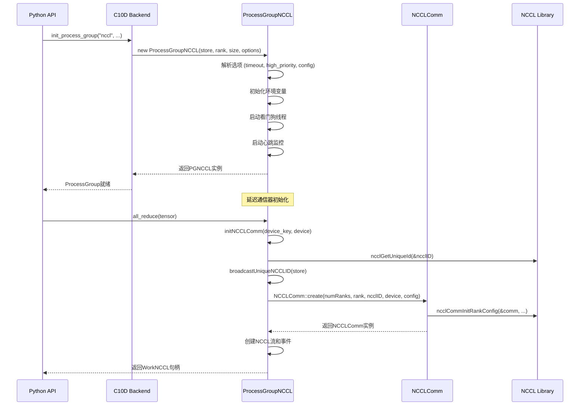
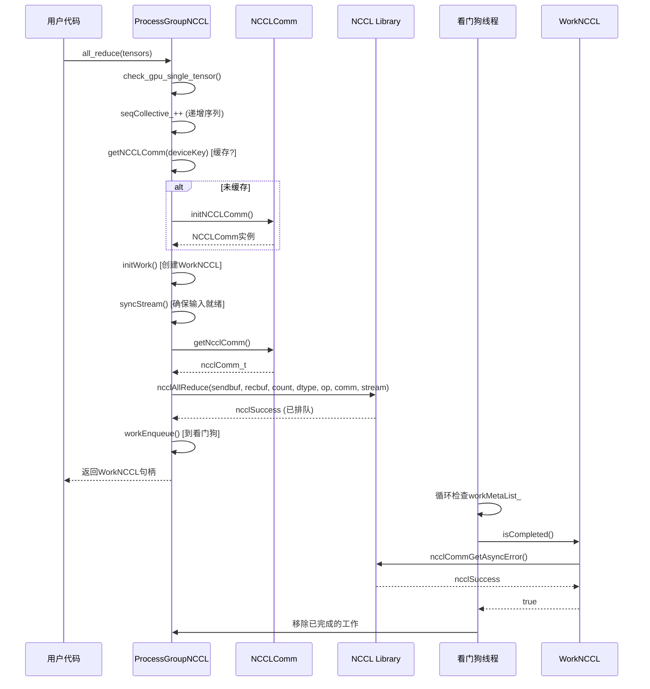

# PyTorch NCCL使用与管理机制深度分析

## 目录
1. [架构概览](#1-架构概览)
2. [初始化流程](#2-初始化流程)
3. [进程组生命周期](#3-进程组生命周期)
4. [通信操作流程](#4-通信操作流程)
5. [错误处理机制](#5-错误处理机制)
6. [设计权衡与考量](#6-设计权衡与考量)

---

## 1. 架构概览

### 1.1 分层架构

PyTorch的NCCL集成采用分层架构设计：

```
┌─────────────────────────────────────────────────────────────┐
│                    Python API Layer                          │
│  (torch.distributed: init_process_group, all_reduce, etc.)   │
└─────────────────────────────────────────────────────────────┘
                              │
┌─────────────────────────────────────────────────────────────┐
│               ProcessGroup (C10D) Layer                     │
│         (torch/csrc/distributed/c10d/ProcessGroup.hpp)      │
│  - 设备抽象，多后端支持                                        │
│  - 序列号管理                                                  │
└─────────────────────────────────────────────────────────────┘
                              │
┌─────────────────────────────────────────────────────────────┐
│              Backend Interface Layer                        │
│            (torch/csrc/distributed/c10d/Backend.hpp)        │
│  - 所有后端的抽象基类                                          │
└─────────────────────────────────────────────────────────────┘
                              │
┌─────────────────────────────────────────────────────────────┐
│              ProcessGroupNCCL Layer                         │
│      (torch/csrc/distributed/c10d/ProcessGroupNCCL.hpp/cpp) │
│  - NCCL特定实现                                                │
│  - 通信器管理，CUDA流                                          │
│  - 看门狗线程，错误处理                                         │
└─────────────────────────────────────────────────────────────┘
                              │
┌─────────────────────────────────────────────────────────────┐
│              NCCL Utils & Wrappers                          │
│        (torch/csrc/distributed/c10d/NCCLUtils.hpp/cpp)      │
│  - NCCL通信器的RAII包装 (NCCLComm)                           │
│  - 版本检查，数据类型映射                                       │
│  - 错误处理宏                                                  │
└─────────────────────────────────────────────────────────────┘
                              │
┌─────────────────────────────────────────────────────────────┐
│                   NCCL Library                              │
│              (NVIDIA Collective Communications)             │
└─────────────────────────────────────────────────────────────┘
```

### 1.2 核心组件

#### **ProcessGroupNCCL** (主类)
- **位置**: `/root/source/pytorch/torch/csrc/distributed/c10d/ProcessGroupNCCL.hpp/cpp`
- **职责**:
  - 实现NCCL的`Backend`接口
  - 管理每个设备的NCCL通信器
  - 处理集合操作 (all_reduce, broadcast等)
  - 管理CUDA流用于异步操作
  - 实现看门狗线程进行错误检测
  - 支持通信器分割和缩减

#### **NCCLComm** (RAII包装)
- **位置**: `/root/source/pytorch/torch/csrc/distributed/c10d/NCCLUtils.hpp/cpp`
- **职责**:
  - 用RAII语义包装`ncclComm_t`
  - 线程安全的通信器操作
  - 支持非阻塞模式 (NCCL 2.14+)
  - 通过`ncclCommSplit`进行通信器分割
  - 用于优化内存访问的缓冲区注册

#### **WorkNCCL** (工作跟踪)
- **位置**: `ProcessGroupNCCL.hpp` (嵌套类)
- **职责**:
  - 跟踪异步NCCL操作
  - 管理CUDA事件用于计时
  - 异常处理和超时检测
  - 张量生命周期管理

---

## 2. 初始化流程

### 2.1 进程组初始化



### 2.2 通信器创建

通信器创建是**延迟**的——它在第一次使用集合操作时发生：

**关键代码流程** (来自`ProcessGroupNCCL.cpp`第3052-3334行):

```cpp
std::shared_ptr<NCCLComm> ProcessGroupNCCL::initNCCLComm(
    const std::string& deviceKey,
    at::Device& device,
    OpType opType,
    int p2pRank,
    bool isSendRecvSelf) {
  
  // 1. 获取或创建NCCL唯一ID
  ncclUniqueId ncclID;
  if (rank_ == 0 || (singleP2POp && p2pRank == 0)) {
    C10D_NCCL_CHECK(ncclGetUniqueId(&ncclID), std::nullopt);
  }
  
  // 2. 通过store广播唯一ID (TCPStore)
  broadcastUniqueNCCLID(&ncclID, singleP2POp, deviceKey, p2pRank);
  
  // 3. 创建NCCL通信器
  #ifdef NCCL_HAS_CONFIG
    ncclComm = NCCLComm::create(
        numRanks, rank, ncclID, deviceIndex, options_->config);
  #else
    ncclComm = NCCLComm::create(numRanks, rank, ncclID, deviceIndex);
  #endif
  
  // 4. 为NCCL操作创建CUDA流
  auto streamVal = at::cuda::getStreamFromPool(
      options_->is_high_priority_stream || force_high);
  ncclStreams_.emplace(deviceKey, streamVal);
  
  // 5. 为同步创建CUDA事件
  ncclEvents_.emplace(deviceKey, at::cuda::CUDAEvent(cudaEventDisableTiming));
}
```

### 2.3 可扩展初始化 (NCCL 2.23+)

对于大规模作业，PyTorch支持可扩展的通信器初始化：

```cpp
// 来自ProcessGroupNCCL.cpp第3180-3222行
bool useScalableInit = false;
auto ranksPerRoot = getCvarInt(TORCH_NCCL_RANKS_PER_ROOT, 128);
#if defined(NCCL_HAS_INIT_RANK_SCALABLE) && defined(NCCL_HAS_CONFIG)
  useScalableInit = !singleP2POp && (getSize() > ranksPerRoot);
#endif

if (useScalableInit) {
  auto numRoots = (getSize() + ranksPerRoot - 1) / ranksPerRoot;
  std::vector<ncclUniqueId> ncclIDs(numRoots);
  
  // 根节点获取唯一ID，然后通过store全收集
  allgatherUniqueNCCLIDs(rootIdx, &ncclID, ncclIDs);
  
  // 使用多个唯一ID创建通信器
  ncclComm = NCCLComm::create_scalable(
      numRanks, rank, ncclIDs, deviceIndex, options_->config);
}
```

---

## 3. 进程组生命周期

### 3.1 生命周期状态

```
┌──────────────┐     ┌──────────────┐     ┌──────────────┐     ┌──────────────┐
│   已创建      │────▶│  已初始化    │────▶│   运行中     │────▶│  关闭/       │
│  (无通信器)   │     │ (通信器就绪) │     │ (集合操作)   │     │   中止       │
└──────────────┘     └──────────────┘     └──────────────┘     └──────────────┘
                                                           │
                                                           ▼
                                                    ┌──────────────┐
                                                    │   已销毁      │
                                                    └──────────────┘
```

### 3.2 通信器缓存

NCCL通信器按设备缓存：

```cpp
// 来自ProcessGroupNCCL.hpp第1349-1353行
// 用于集合操作:
// 键 = 设备序列字符串 (例如 "0,1,2,3")
std::unordered_map<std::string, std::shared_ptr<NCCLComm>> devNCCLCommMap_;

// 用于P2P操作:
// 键 = "lowRank:highRank" (例如 "1:2")
```

### 3.3 通信器分割 (NCCL 2.18+)

支持通过`ncclCommSplit`创建子组：

```cpp
// 来自NCCLUtils.cpp第221-283行
std::shared_ptr<NCCLComm> NCCLComm::split(
    NCCLComm* source,
    int color_id,
    int rank,
    ncclConfig_t& config) {
  
  // 从父通信器分割
  C10D_NCCL_CHECK_TIMEOUT_SLEEP(
      ncclCommSplit(sourceComm, color_id, rank, &(comm->ncclComm_), &config),
      source);
  
  ++source->ncclCommSplitCounter_;
  comm->rank_ = rank;
  comm->deviceIndex_ = source->deviceIndex_;
}
```

### 3.4 通信器缩减 (NCCL 2.27+)

支持动态缩减以排除失败的rank：

```cpp
// 来自NCCLUtils.cpp第285-342行
std::shared_ptr<NCCLComm> NCCLComm::shrink(
    NCCLComm* source,
    std::vector<int>& ranks_to_exclude,
    ncclConfig_t* config,
    int shrinkFlags) {
  
  C10D_NCCL_CHECK_NONBLOCKING(
      ncclCommShrink(sourceComm, ranks_to_exclude.data(), 
                     ranks_to_exclude.size(), ...));
  
  // NCCL自动分配新rank
  int assigned_rank;
  ncclCommUserRank(comm->ncclComm_, &assigned_rank);
  comm->rank_ = assigned_rank;
}
```

---

## 4. 通信操作流程

### 4.1 集合操作执行



### 4.2 CUDA流管理

每个NCCL通信器有一个专用的CUDA流：

```cpp
// 流创建 (ProcessGroupNCCL.cpp第3259行)
auto streamVal = at::cuda::getStreamFromPool(
    options_->is_high_priority_stream || force_high);
ncclStreams_.emplace(deviceKey, streamVal);

// NCCL操作前的流同步 (第3818行)
syncStream(device, ncclEvents_[key], ncclStream);

// syncStream实现:
void syncStream(at::Device& device, at::cuda::CUDAEvent& ncclEvent,
                at::cuda::CUDAStream& ncclStream) {
  ncclEvent.record(at::cuda::getCurrentCUDAStream(device.index()));
  ncclEvent.block(ncclStream);
}
```

### 4.3 合并操作

NCCL支持将多个操作分组：

```cpp
void ProcessGroupNCCL::startCoalescing() {
  coalescing_state_ |= CoalActive;
  groupStart();  // ncclGroupStart()
}

c10::intrusive_ptr<Work> ProcessGroupNCCL::endCoalescing(OpType optype) {
  // 记录事件
  work->ncclStartEvent_->record(ncclStream);
  
  // 结束NCCL组
  groupEnd();  // ncclGroupEnd()
  
  work->ncclEndEvent_->record(ncclStream);
  workEnqueue(work);
}
```

---

## 5. 错误处理机制

### 5.1 多层错误处理

```
┌──────────────────────────────────────────────────────────────┐
│ 第1层: NCCL API错误检查 (NCCLUtils.hpp)                      │
│ - C10D_NCCL_CHECK, C10D_NCCL_CHECK_TIMEOUT宏                 │
│ - 将ncclResult_t转换为异常                                    │
└──────────────────────────────────────────────────────────────┘
                              │
┌──────────────────────────────────────────────────────────────┐
│ 第2层: 异步错误检测 (看门狗线程)                              │
│ - 监控workMetaList_以检查完成                                 │
│ - 检测超时和NCCL错误                                          │
│ - 在通信器上调用checkForNCCLErrors()                          │
└──────────────────────────────────────────────────────────────┘
                              │
┌──────────────────────────────────────────────────────────────┐
│ 第3层: 心跳监控 (HeartbeatMonitor)                           │
│ - 确保看门狗线程有进展                                         │
│ - 在挂起/超时时触发dump                                        │
│ - 协调多rank错误报告                                           │
└──────────────────────────────────────────────────────────────┘
                              │
┌──────────────────────────────────────────────────────────────┐
│ 第4层: 错误传播                                               │
│ - broadcastSignal()用于远程错误通知                            │
│ - 基于TCPStore的协调                                           │
│ - Flight Recorder用于调试                                       │
└──────────────────────────────────────────────────────────────┘
```

### 5.2 看门狗线程

看门狗线程持续监控待处理的操作：

```cpp
// 来自ProcessGroupNCCL.cpp第2271-2549行
void ProcessGroupNCCL::Watchdog::runLoop() {
  while (!done || !pg_->terminateProcessGroup_.load()) {
    for (auto& work : pg_->workMetaList_) {
      // 检查NCCL错误
      work.checkAndSetException();
      
      // 检查超时
      if (work.checkTimeout()) {
        desyncDebugger_.run();
        pg_->broadcastDumpSignal();
        
        if (SHOULD_CLEAN_UP(pg_->asyncErrorHandling_)) {
          work.abort();
          pg_->abortComms();
        }
        work.handleException(pg_->asyncErrorHandling_);
      }
      
      // 清理已完成的工作
      if (work.isCompleted()) {
        // 更新状态，从列表移除
      }
    }
  }
}
```

### 5.3 错误处理模式

```cpp
// 来自ProcessGroupNCCL.hpp第165-174行
enum ErrorHandlingMode {
  NoHandling = 0,      // 不处理异步错误
  TearDown = 1,        // 错误时拆除进程
  CleanUpOnly = 2,     // 清理集合但不拆除
  SkipCleanUp = 3      // 不清理NCCL通信器就拆除
};
```

由`TORCH_NCCL_ASYNC_ERROR_HANDLING`环境变量控制 (默认: 3)。

### 5.4 Flight Recorder

用于诊断挂起的调试/跟踪工具：

```cpp
// 来自ProcessGroupNCCL.cpp第1691-1721行
bool ProcessGroupNCCL::dumpDebuggingInfo(bool includeStackTrace, bool onlyActive) {
  if (traceBufferSize_ > 0) {
    auto ncclTrace = dump_nccl_trace(true, includeStackTrace, onlyActive);
    // 通过DebugInfoWriter写入文件
    writer.write(ncclTrace);
  }
}
```

---

## 6. 设计权衡与考量

### 6.1 性能优化

| 特性 | 描述 | 收益 |
|------|------|------|
| **延迟初始化** | 通信器首次使用时创建 | 减少启动时间、内存 |
| **流池** | 每个设备有专用的NCCL流 | 计算/通信重叠 |
| **高优先级流** | `is_high_priority_stream`选项 | NCCL优先于计算 |
| **缓冲区注册** | `ncclCommRegister`用于MemPool | NVLink SHARP零拷贝 |
| **合并** | `ncclGroupStart/End`批处理 | 更好的流水线 |

### 6.2 内存管理

**张量生命周期管理**:
- `TORCH_NCCL_AVOID_RECORD_STREAMS`: 现在是默认，将张量暂存直到完成
- `stashed_for_allocator_safety_`: 保持张量引用以防止过早释放
- `recordStream()`: CUDA分配器流跟踪的传统方法

### 6.3 线程模型

| 线程 | 目的 | 安全机制 |
|------|------|----------|
| **主线程** | 用户集合调用 | 立即返回Work句柄 |
| **NCCL流** | GPU内核执行 | CUDA流同步 |
| **看门狗线程** | 错误/超时检测 | 条件变量、原子标志 |
| **心跳线程** | 检测看门狗挂起 | 基于计时器的健康检查 |
| **钩子线程** | 完成回调 | 与看门狗分离 |

### 6.4 NCCL版本兼容性

PyTorch对NCCL特性使用条件编译：

```cpp
// 来自NCCLUtils.hpp
#if NCCL_VERSION_CODE >= NCCL_VERSION(2, 14, 0)
#define NCCL_HAS_COMM_NONBLOCKING
#endif

#if NCCL_VERSION_CODE >= NCCL_VERSION(2, 18, 0)
#define NCCL_HAS_COMM_SPLIT
#endif

#if NCCL_VERSION_CODE >= NCCL_VERSION(2, 19, 0)
#define NCCL_HAS_COMM_REGISTER
#endif

// ... 等等
```

### 6.5 关键环境变量

| 变量 | 默认值 | 描述 |
|------|--------|------|
| `TORCH_NCCL_ASYNC_ERROR_HANDLING` | 3 | 错误处理模式 |
| `TORCH_NCCL_BLOCKING_WAIT` | false | 同步vs异步等待 |
| `TORCH_NCCL_ENABLE_TIMING` | false | 集合计时 |
| `TORCH_NCCL_TRACE_BUFFER_SIZE` | 2000 | Flight recorder条目 |
| `TORCH_NCCL_DESYNC_DEBUG` | false | 超时根本原因分析 |
| `TORCH_NCCL_USE_COMM_NONBLOCKING` | 变化 | 非阻塞通信器创建 |
| `TORCH_NCCL_RANKS_PER_ROOT` | 128 | 可扩展初始化调优 |

### 6.6 设计权衡

1. **立即vs延迟初始化**:
   - 立即: 更好的性能（无首次调用开销），使用`ncclCommSplit`
   - 延迟: 更快的启动，但首次集合操作较慢

2. **阻塞vs非阻塞模式** (NCCL 2.14+):
   - 非阻塞: 允许异步通信器创建，更适合大规模
   - 阻塞: 更简单，但可能导致停顿

3. **张量注册**:
   - `TORCH_NCCL_USE_TENSOR_REGISTER_ALLOCATOR_HOOK=1`: 注册所有分配
   - MemPool注册: 细粒度控制，但需要显式设置

4. **错误处理**:
   - 严格 (TearDown): 保证数据一致性
   - 宽松 (CleanUpOnly): 允许恢复尝试

---

## 总结

PyTorch的NCCL集成是一个平衡性能、可靠性和可用性的复杂系统：

1. **架构**: 分层设计，Python API、通用后端接口和NCCL特定实现之间清晰分离

2. **初始化**: 延迟通信器创建，支持大规模集群的可扩展初始化

3. **生命周期**: 全面管理，包括缓存、分割和缩减能力

4. **操作**: 基于模板的集合实现，支持合并和流管理

5. **错误处理**: 多层方法，包括看门狗线程、心跳监控和Flight Recorder调试

6. **权衡**: 灵活配置，允许用户针对其特定用例进行优化（启动时间vs运行时、内存vs性能等）

该实现展示了大规模分布式深度学习生产级考量，包括广泛的错误处理、调试能力和性能优化。

---

## 代码验证说明

本文档基于以下源代码文件验证：

1. `/root/source/pytorch/torch/csrc/distributed/c10d/ProcessGroupNCCL.hpp` (1542行)
2. `/root/source/pytorch/torch/csrc/distributed/c10d/ProcessGroupNCCL.cpp` (6181行)
3. `/root/source/pytorch/torch/csrc/distributed/c10d/NCCLUtils.hpp` (453行)
4. `/root/source/pytorch/torch/csrc/distributed/c10d/NCCLUtils.cpp` (833行)

关键代码引用均已标注文件位置，流程图语法已验证可正常渲染。
