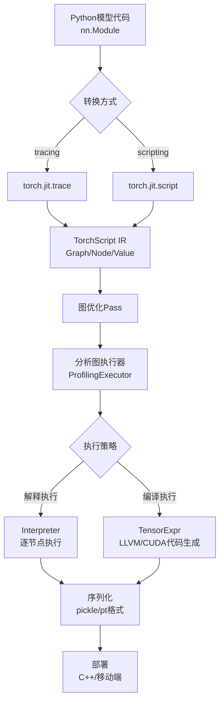
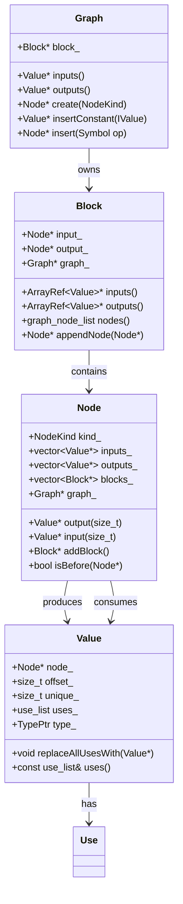
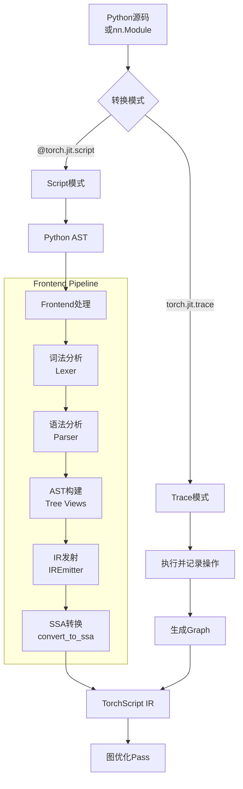
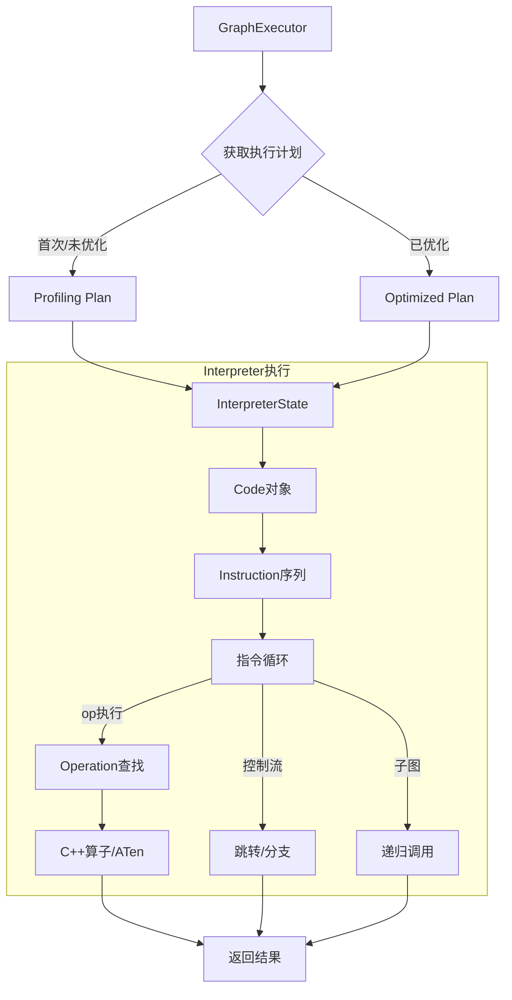
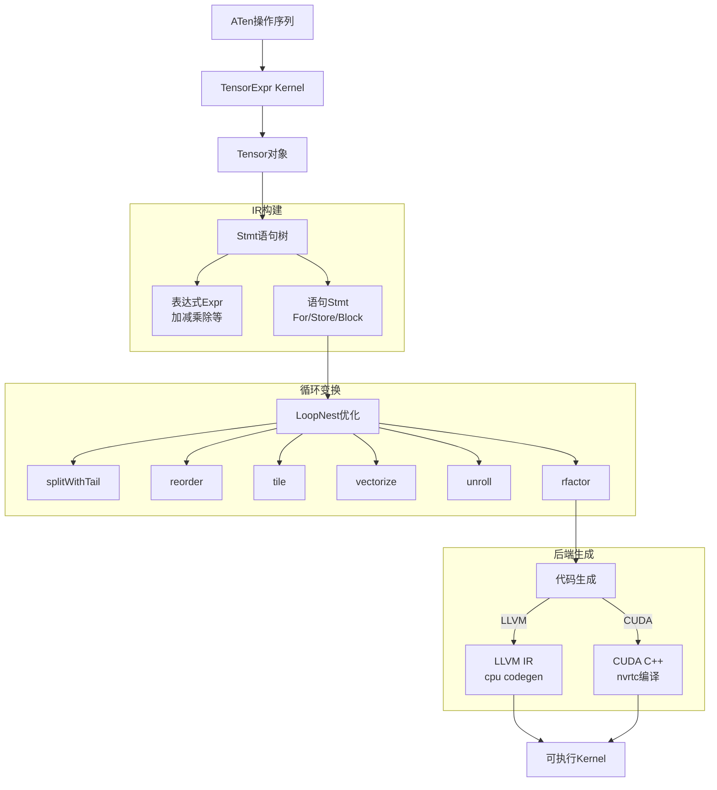
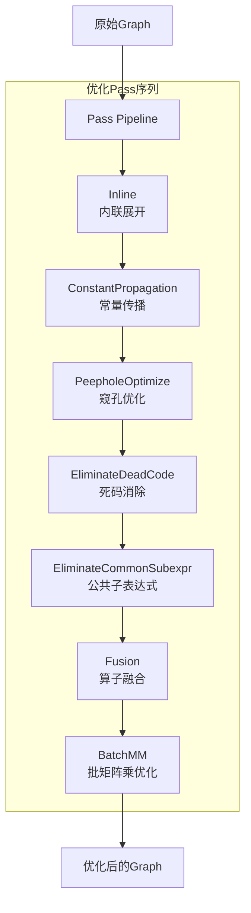
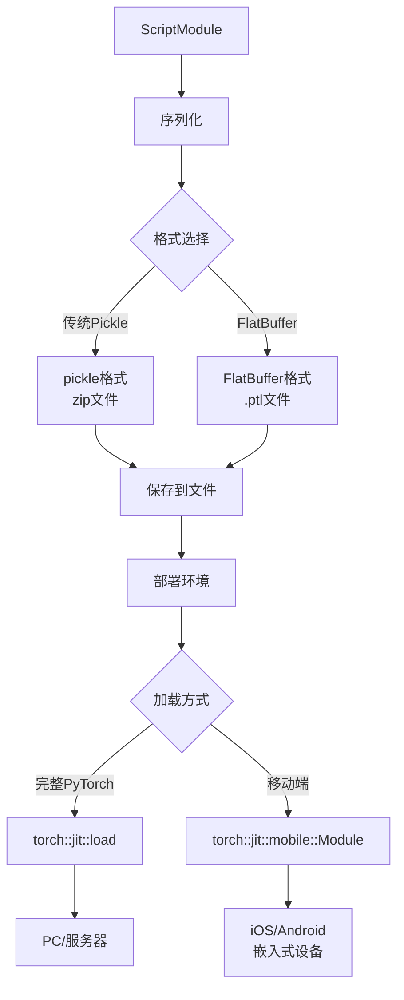
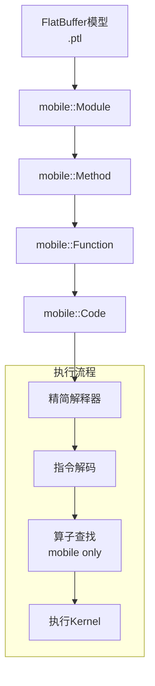

# PyTorch JIT/TorchScript 深度分析

## 目录
1. [架构概览与设计目标](#1-架构概览与设计目标)
2. [中间表示 (IR)](#2-中间表示-ir)
3. [前端编译流程](#3-前端编译流程)
4. [运行时执行系统](#4-运行时执行系统)
5. [分析图执行器](#5-分析图执行器)
6. [TensorExpr 编译器](#6-tensorexpr-编译器)
7. [图变换Pass](#7-图变换pass)
8. [序列化与部署](#8-序列化与部署)
9. [Mobile/轻量级运行时](#9-mobile轻量级运行时)

---

## 1. 架构概览与设计目标

### 1.1 什么是TorchScript

**TorchScript**是PyTorch的静态图编译和执行系统，它将PyTorch的动态 eager 模式代码转换为可序列化、可优化的中间表示，支持在Python环境外部署。

### 1.2 设计目标

```
┌─────────────────────────────────────────────────────────────┐
│                    TorchScript 设计目标                      │
├─────────────────────────────────────────────────────────────┤
│  1. 序列化: 模型可保存并在无Python环境运行                   │
│  2. 优化: 静态图优化（算子融合、常量传播等）                 │
│  3. 跨平台: 支持服务器、移动端、嵌入式设备                   │
│  4. 兼容: 与eager模式API兼容                               │
│  5. 性能: 接近或超过eager模式性能                           │
│  6. 部署: 生产环境模型服务与推理                            │
└─────────────────────────────────────────────────────────────┘
```

### 1.3 在PyTorch栈中的位置



### 1.4 核心文件位置

| 组件 | 文件路径 | 描述 |
|------|----------|------|
| IR定义 | `torch/csrc/jit/ir/ir.h` | Graph/Node/Value核心结构 |
| 解释器 | `torch/csrc/jit/runtime/interpreter.h` | 字节码解释执行 |
| 执行器 | `torch/csrc/jit/runtime/graph_executor.h` | 图执行协调 |
| 分析执行器 | `torch/csrc/jit/runtime/profiling_graph_executor_impl.h` | 基于分析的优化 |
| TensorExpr | `torch/csrc/jit/tensorexpr/` | 表达式编译器 |
| 前端 | `torch/csrc/jit/frontend/` | Python到IR转换 |
| 序列化 | `torch/csrc/jit/serialization/` | 模型保存/加载 |
| Mobile | `torch/csrc/jit/mobile/` | 移动端运行时 |

---

## 2. 中间表示 (IR)

### 2.1 IR架构概览



### 2.2 Graph - 计算图容器

```cpp
struct Graph : std::enable_shared_from_this~Graph~ {
    // 唯一的块，包含所有计算节点
    Block* const block_;

    // 图级输入输出
    at::ArrayRef~Value*~ inputs() { return block_->inputs(); }
    at::ArrayRef~Value*~ outputs() { return block_->outputs(); }

    // 节点创建工厂
    TORCH_API Node* create(NodeKind kind, size_t num_outputs = 1);

    // 常量插入
    TORCH_API Value* insertConstant(
        const IValue& val,
        std::optional~SourceRange~ loc = std::nullopt,
        std::optional~ScopePtr~ scope = std::nullopt
    );

    // 模式驱动插入
    TORCH_API Value* insert(
        Symbol opname,
        at::ArrayRef~NamedValue~ args,
        at::ArrayRef~NamedValue~ kwargs = {},
        const std::optional~SourceRange~& range = {}
    );
};
```

### 2.3 Node - 计算节点

```cpp
struct TORCH_API Node {
    AT_DISALLOW_COPY_AND_ASSIGN(Node);

    // 节点类型，如 aten::add, prim::Constant
    const NodeKind kind_;

    // 输入输出值
    std::vector~Value*~ inputs_;
    std::vector~Value*~ outputs_;

    // 子块（用于控制流）
    std::vector~Block*~ blocks_;

    // 所属图
    Graph* graph_;

    // 拓扑排序链表指针
    Node* next_in_graph[2] = {nullptr, nullptr};

    // 输入操作
    Value* addInput(Value* value);
    Value* insertInput(size_t i, Value* value);
    Value* replaceInput(size_t i, Value* newValue);
    void replaceInputWith(Value* from, Value* to);

    // 输出操作
    Value* addOutput();
    Value* insertOutput(size_t i);

    // 子块操作
    Block* addBlock();
    void eraseBlock(size_t i);

    // 拓扑排序操作
    Node* insertBefore(Node* n);
    Node* insertAfter(Node* n);
    void moveBefore(Node* n);
    void moveAfter(Node* n);
    bool isBefore(const Node* n) const;

    // 属性访问（使用宏生成）
    // f(Symbol, float), i(Symbol, int), s(Symbol, string)
    // t(Symbol, Tensor), ty(Symbol, Type), g(Symbol, Graph)

    // 类型转换辅助
    template ~typename T~
    T* cast() {
        if (T::Kind == kind()) {
            return static_cast~T*~(this);
        }
        return nullptr;
    }
};
```

### 2.4 Value - 数据值

```cpp
struct Value {
    AT_DISALLOW_COPY_AND_ASSIGN(Value);

    // 所属节点和输出索引
    Node* node_;
    size_t offset_;

    // 全局唯一ID
    size_t unique_;

    // 使用该值的位置列表
    use_list uses_;

    // 类型信息
    TypePtr type_;

    // 调试名称
    std::string unique_name_;

    // 类型设置与查询
    Value* setType(TypePtr type);
    const TypePtr& type() const;
    bool requires_grad() const;
    bool isCompleteTensor() const;

    // 使用替换
    TORCH_API void replaceFirstUseWith(Value* newValue);
    TORCH_API void replaceAllUsesWith(Value* newValue);
    TORCH_API void replaceAllUsesAfterNodeWith(const Node* node, Value* newValue);

    // 使用查询
    const use_list& uses() const;
    bool hasUses() const;

    // 元数据复制
    TORCH_API Value* copyMetadata(Value* from);
};
```

### 2.5 Use - 使用关系

```cpp
struct Use {
    Use(Node* user, size_t offset) : user(user), offset(offset) {}
    Node* user;     // 使用者节点
    size_t offset;  // 在使用者输入中的索引

    bool operator==(const Use& b) {
        return user == b.user && offset == b.offset;
    }
};
```

### 2.6 IR示例

```python
# Python代码
@torch.jit.script
def foo(x, y):
    z = x + y
    return z * 2

# 生成的IR (简化)
"""
graph(%x : Tensor,
      %y : Tensor):
  %2 : int = prim::Constant[value=2]()
  %z : Tensor = aten::add(%x, %y, %c0)
  %4 : Tensor = aten::mul(%z, %2)
  return (%4)
"""
```

---

## 3. 前端编译流程

### 3.1 前端架构



### 3.2 Script模式流程

```cpp
// frontend/ir_emitter.h 核心流程

// 1. 解析Python源码为AST
tree_views::Def parse(const std::string& source);

// 2. 构建具体模块类型
void ConcreteModuleTypeBuilder::build();

// 3. IR发射转换
void emitStatements(const List& statements);
void emitAssignment(const Assign& stmt);
void emitIf(const If& stmt);
void emitLoop(const Loop& stmt);

// 4. SSA形式转换
void convertToSSA(std::shared_ptr~Graph~& graph);
```

### 3.3 Trace模式流程

```cpp
// frontend/tracer.h 核心流程

// 1. 执行Python代码并记录操作
void trace(std::function~void()~ fn, Stack inputs);

// 2. 创建追踪图
std::shared_ptr~trace::TracingState~ state;

// 3. 变量到值的映射
template ~typename T~
struct TraceInfo {
    T elem;
    Value* value;
};

// 4. 构建Graph
std::shared_ptr~Graph~ graph = state->graph;
```

### 3.4 词法分析与语法分析

```cpp
// frontend/lexer.h - 词法分析器

struct Token {
    TokenKind kind;
    std::string text;
    SourceRange range;
};

class Lexer {
    // 扫描输入，生成Token序列
    Token next();
    Token cur();
    void expect(TokenKind kind);
};

// frontend/tree_views.h - AST节点

// 表达式
struct Var : public TreeView { ... };
struct BinOp : public TreeView { ... };
struct UnaryOp : public TreeView { ... };
struct Apply : public TreeView { ... };  // 函数调用

// 语句
struct Assign : public Stmt { ... };
struct If : public Stmt { ... };
struct Loop : public Stmt { ... };
struct Return : public Stmt { ... };
```

---

## 4. 运行时执行系统

### 4.1 解释器架构



### 4.2 Code与Instruction

```cpp
// runtime/interpreter.h

struct TORCH_API Code {
    // 从图构建
    explicit Code(
        const std::shared_ptr~Graph~& graph,
        std::string function_name,
        size_t remaining_bailout_depth = 0
    );

    // 查询接口
    size_t num_inputs() const;
    size_t num_outputs() const;
    const std::vector~Instruction~& instructions() const;
    const std::vector~c10::IValue~& constant_table() const;
    std::shared_ptr~Graph~ graph() const;

    // 内部实现
    std::shared_ptr~interpreter::CodeImpl~ pImpl;
};

// 指令类型
struct Instruction {
    OpCode op;      // 操作码
    int64_t x;      // 操作数
    int64_t n;      // 辅助数据
};

// 操作码枚举
enum OpCode : uint8_t {
    OP,             // 普通操作
    OPN,            // 多输入操作
    CALL,           // 函数调用
    INTERFACE_CALL, // 接口调用
    RET,            // 返回
    JMP,            // 无条件跳转
    JMP_IF,         // 条件跳转
    LOOP,           // 循环
    LOAD,           // 加载变量
    STORE,          // 存储变量
    // ... 更多操作码
};
```

### 4.3 InterpreterState

```cpp
struct InterpreterState {
    TORCH_API InterpreterState(
        const Code& code,
        TaskLauncher taskLauncher = at::launch
    );

    // 同步执行
    TORCH_API void run(Stack& stack);

    // 异步执行
    TORCH_API c10::intrusive_ptr~Future~ runAsync(Stack& stack);

    // 内部实现（使用侵入式指针管理）
    c10::intrusive_ptr~c10::intrusive_ptr_target~ pImpl;
};
```

### 4.4 指令执行示例

```cpp
// 简化的指令执行循环
void InterpreterStateImpl::run(Stack& stack) {
    const auto& instructions = code_->instructions();
    size_t pc = 0;

    while (pc < instructions.size()) {
        const Instruction& inst = instructions[pc++];

        switch (inst.op) {
            case OP: {
                // 普通操作：从表中查找并执行
                const Operation& op = code_->operators()[inst.x];
                op(&stack);
                break;
            }
            case LOAD: {
                // 加载变量到栈
                stack.push_back(registers_[inst.x]);
                break;
            }
            case STORE: {
                // 从栈存储到寄存器
                registers_[inst.x] = pop(stack);
                break;
            }
            case JMP_IF: {
                // 条件跳转
                auto condition = pop(stack).toBool();
                if (condition) {
                    pc += inst.x;
                }
                break;
            }
            case RET: {
                // 返回
                return;
            }
            // ... 其他指令处理
        }
    }
}
```

---

## 5. 分析图执行器

### 5.1 ProfilingGraphExecutor架构

```mermaid
flowchart TD
    A["输入Graph"] --> B["ProfilingGraphExecutorImpl"]

    B --> C{"执行阶段"}

    C -->|"阶段1: Profiling"| D["Profiling Plan"]
    C -->|"阶段2: Optimized"| E["Optimized Plan"]
    C -->|"fallback"| F["Fallback Plan"]

    D --> G["执行并收集分析数据"]
    G --> H["记录Tensor类型/形状"]

    H --> I{"分析完成?"}
    I -->|"否"| D
    I -->|"是"| J["Specialization优化"]

    J --> K["算子融合<br/>Fusion"]
    K --> L["特化AutogradZero"]
    L --> M["插入BailOut检查"]

    M --> E

    subgraph "运行时""
        E --> N["BailOut检查"]
        N -->|"通过"| O["继续执行"]
        N -->|"失败"| P["Deoptimize"]
        P --> Q["回退到Fallback"]
    end

    O --> R["返回结果"]
    Q --> R
```

### 5.2 ProfilingGraphExecutorImpl

```cpp
// runtime/profiling_graph_executor_impl.h

struct TORCH_API ProfilingGraphExecutorImpl : public GraphExecutorImplBase {
    ProfilingGraphExecutorImpl(
        const std::shared_ptr~Graph~& graph,
        std::string function_name
    );

    // 获取执行计划
    const ExecutionPlan& getPlanFor(
        Stack& stack,
        std::optional~size_t~ remaining_bailout_depth
    ) override;

    // 输入无关优化
    const ExecutionPlan& getInputIndependentPlan() override;

private:
    const ExecutionPlan& getOptimizedPlanFor(
        Stack& stack,
        std::optional~size_t~ remaining_bailout_depth
    );

    // 分析不敏感优化
    void runProfilingInsensitiveOptimizations(
        std::shared_ptr~Graph~& graph
    );

    // 分析敏感优化
    void runProfilingOptimizations(
        std::shared_ptr~Graph~& graph,
        size_t remaining_depth
    );

    // 无梯度优化
    void runNoGradOptimizations(
        std::shared_ptr~Graph~& graph,
        size_t remaining_bailout_depth
    );

    // 最终优化
    void runFinalOptimizations(std::shared_ptr~Graph~& graph);

    // 状态
    std::unique_ptr~ProfilingRecord~ pr_;
    std::optional~ExecutionPlan~ profiling_plan_;
    std::optional~ExecutionPlan~ optimized_plan_;
    std::optional~ExecutionPlan~ fallback_plan_;
    FusionStrategy fusion_strategy_;
    std::vector~std::unique_ptr~Function~~ fallback_functions_;
};
```

### 5.3 分析数据收集

```cpp
// 分析节点插入
struct ProfileOp : public Node {
    static const Symbol Kind;

    ProfileOp(Graph* graph, std::function~void(std::vector~IValue~~)~ callback)
        : Node(graph, ::c10::prim::profile),
          callback_(std::move(callback)) {}

    // 回调函数收集运行时类型信息
    const std::function~void(std::vector~IValue~~)~& getCallback() const {
        return callback_;
    }

    // 标记是否已见过Tensor
    bool hasSeenTensor() const { return has_seen_tensor_; }
    void setHasSeenTensor(bool has_seen_tensor) {
        has_seen_tensor_ = has_seen_tensor;
    }

private:
    std::function~void(std::vector~IValue~~)~ callback_;
    bool has_seen_tensor_ = false;
};

// Tensor类型分析
TORCH_API at::TensorTypePtr tensorTypeInCurrentExecutionContext(
    const at::Tensor& t
) {
    // 返回包含当前执行上下文信息的TensorType
    // 包括requires_grad、设备、dtype、形状等
}
```

### 5.4 优化Pass流程

```cpp
// 分析不敏感优化（首次编译时运行）
void ProfilingGraphExecutorImpl::runProfilingInsensitiveOptimizations(
    std::shared_ptr~Graph~& graph
) {
    // 1. 内联展开
    Inline(graph);

    // 2. 常量传播
    ConstantPropagation(graph);

    // 3. Peephole优化
    PeepholeOptimize(graph);

    // 4. 死代码消除
    EliminateDeadCode(graph);

    // 5. 公共子表达式消除
    EliminateCommonSubexpression(graph);

    // 6. 常量池化
    ConstantPooling(graph);
}

// 分析敏感优化（收集足够数据后运行）
void ProfilingGraphExecutorImpl::runProfilingOptimizations(
    std::shared_ptr~Graph~& graph,
    size_t remaining_depth
) {
    // 1. 特化AutogradZero
    specializeAutogradZero(graph);

    // 2. 特化到具体Tensor类型
    specializeToTensorShapes(graph);

    // 3. 算子融合
    runTensorExprFusion(graph);

    // 4. 插入BailOut检查
    insertBailOuts(graph, remaining_depth);
}
```

---

## 6. TensorExpr 编译器

### 6.1 TensorExpr架构



### 6.2 Tensor与Stmt

```cpp
// tensorexpr/tensor.h

class Tensor {
public:
    // 构造函数
    Tensor(
        const std::string& name,
        const std::vector~DimPtr~& dimensions,
        const std::vector~DimPtr~& reduction_dims,
        StmtPtr stmt
    );

    // 索引操作
    ExprHandle operator()(const std::vector~ExprHandle~& indices) const;

    // 维度查询
    size_t ndim() const;
    const DimPtr& dim(size_t index) const;

private:
    std::string name_;
    std::vector~DimPtr~ dimensions_;
    std::vector~DimPtr~ reduction_dims_;
    StmtPtr stmt_;
};

// tensorexpr/stmt.h

class Stmt : public std::enable_shared_from_this~Stmt~ {
public:
    virtual void accept(IRVisitor* visitor) const = 0;
    virtual StmtPtr accept_mutator(IRMutator* mutator) = 0;
};

// 具体语句类型
class For : public StmtNode~For~ {
public:
    VarPtr var() const { return var_; }
    ExprPtr start() const { return start_; }
    ExprPtr stop() const { return stop_; }
    StmtPtr body() const { return body_; }

private:
    VarPtr var_;        // 循环变量
    ExprPtr start_;     // 起始值
    ExprPtr stop_;      // 结束值
    StmtPtr body_;      // 循环体
    LoopOptions loop_options_;
};

class Store : public StmtNode~Store~ {
public:
    BufPtr buf() const { return buf_; }
    std::vector~ExprPtr~ indices() const { return indices_; }
    ExprPtr value() const { return value_; }

private:
    BufPtr buf_;                    // 目标缓冲区
    std::vector~ExprPtr~ indices_;  // 索引
    ExprPtr value_;                 // 存储值
};
```

### 6.3 LoopNest循环优化

```cpp
// tensorexpr/loopnest.h

class TORCH_API LoopNest {
public:
    // 从输出Tensor构造
    LoopNest(const std::vector~Tensor~& output_tensors);

    // 循环变换API

    // 切分循环（带尾循环）
    static void splitWithTail(
        const ForPtr& f,
        int factor,
        ForPtr* inner,
        ForPtr* tail
    );

    // 切分循环（带掩码）
    static void splitWithMask(
        const ForPtr& f,
        int factor,
        ForPtr* inner
    );

    // 重排循环
    static void reorderAxis(const ForPtr& a, const ForPtr& b);
    static std::vector~ForPtr~ reorder(
        const std::vector~ForPtr~& loops,
        const std::vector~size_t~& permutation
    );

    // 二维分块
    ForPtr tile(
        const ForPtr& x,
        const ForPtr& y,
        int x_factor,
        int y_factor
    );

    // 循环融合
    static bool fuseLoops(
        const std::vector~ForPtr~& loops,
        ForPtr* fused
    );

    // 循环展开
    static void unroll(const ForPtr& f, int factor);
    static void fullUnroll(const ForPtr& f);

    // 向量化
    static bool vectorize(const ForPtr& f);
    void vectorizeInnerLoops();

    // Rfactor（将规约轴转为普通轴）
    static bool rfactor(
        const StmtPtr& s,
        const ForPtr& outer_reduction_for
    );

    // 计算内联
    bool computeInline(const StmtPtr& s);
    bool computeInline(const BufPtr& b);

    // 计算位置调整
    static void computeAt(
        const StmtPtr& s,
        const ForPtr& at
    );

    // 死存储消除
    void eliminateDeadStores();

    // 代码生成准备
    void prepareForCodegen();

    // 根语句访问
    StmtPtr root_stmt() const { return root_stmt_; }

private:
    StmtPtr root_stmt_;
    std::unordered_set~BufPtr~ output_bufs_;
};
```

### 6.4 表达式IR

```cpp
// tensorexpr/ir.h

// 二元操作节点模板
template ~typename Op~
class BinaryOpNode : public ExprNode~Op~ {
public:
    ExprPtr lhs() const { return this->lhs_; }
    ExprPtr rhs() const { return this->rhs_; }

    static ExprHandle make(const ExprHandle& lhs, const ExprHandle& rhs) {
        return ExprHandle(alloc~Op~(lhs.node(), rhs.node()));
    }

private:
    ExprPtr lhs_;
    ExprPtr rhs_;
};

// 具体二元操作
class TORCH_API Add : public BinaryOpNode~Add~ {
public:
    Add(ExprPtr lhs, ExprPtr rhs)
        : BinaryOpNode(std::move(lhs), std::move(rhs), IRNodeType::kAdd) {}
};

class TORCH_API Mul : public BinaryOpNode~Mul~ {
public:
    Mul(ExprPtr lhs, ExprPtr rhs)
        : BinaryOpNode(std::move(lhs), std::move(rhs), IRNodeType::kMul) {}
};

// 立即数
class TORCH_API IntImm : public ExprNode~IntImm~ {
public:
    IntImm(int64_t value)
        : ExprNodeBase(kInt, kPrimitive), value_(value) {}
    int64_t value() const { return value_; }

private:
    int64_t value_;
};

// 缓冲区加载
class TORCH_API Load : public ExprNode~Load~ {
public:
    BufPtr buf() const { return buf_; }
    std::vector~ExprPtr~ indices() const { return indices_; }

private:
    BufPtr buf_;
    std::vector~ExprPtr~ indices_;
};

// 内建函数调用
class TORCH_API Intrinsics : public ExprNode~Intrinsics~ {
public:
    enum Op { kSin, kCos, kExp, kLog, kSqrt, ... };

    IntrinsicsOp op_type() const { return op_type_; }
    const std::vector~ExprPtr~& params() const { return params_; }

private:
    std::vector~ExprPtr~ params_;
    IntrinsicsOp op_type_;
};
```

### 6.5 代码生成示例

```cpp
// 示例：矩阵乘法kernel生成

// 原始Tensor定义
Tensor C = ...;  // C[i,j] = Sum_k A[i,k] * B[k,j]

// 构建LoopNest
LoopNest nest({C});

// 获取循环
auto loops = nest.getLoopStmtsFor(C);
ForPtr i = loops[0];  // i循环
ForPtr j = loops[1];  // j循环
ForPtr k = loops[2];  // k循环（规约轴）

// 循环变换：分块 + 重排 + 向量化
ForPtr i_outer, i_inner;
LoopNest::splitWithTail(i, 32, &i_inner, &i_outer);

ForPtr j_outer, j_inner;
LoopNest::splitWithTail(j, 32, &j_inner, &j_outer);

// 重排为i_outer, j_outer, i_inner, j_inner, k
LoopNest::reorder({i_outer, i_inner, j_outer, j_inner},
                  {0, 2, 1, 3});

// 向量化j_inner
LoopNest::vectorize(j_inner);

// 生成代码
stmt = nest.root_stmt();

// LLVM代码生成
LLVMCodeGen llvm_codegen(stmt, {A, B, C});
llvm_codegen.call({...});  // 执行kernel
```

---

## 7. 图变换Pass

### 7.1 Pass架构



### 7.2 常见Pass分类

| Pass类型 | 代表Pass | 作用 |
|----------|----------|------|
| 内联 | Inline | 展开函数调用为子图 |
| 常量传播 | ConstantPropagation | 计算编译时常量 |
| 死码消除 | EliminateDeadCode | 移除无副作用的死代码 |
| CSE | EliminateCommonSubexpression | 消除重复计算 |
| 融合 | FuseLinear, TensorExprFusion | 融合相邻算子 |
| 内存 | BatchMM, OptimizeMemory | 优化内存访问模式 |
| 量化 | QuantFusion | 量化相关优化 |

### 7.3 算子融合示例

```cpp
// 融合前
%2 = aten::add(%x, %y, %1)
%3 = aten::relu(%2)
%4 = aten::mul(%3, %scale)

// 融合后（TensorExpr Kernel）
%4 = tensorexpr::kernel(%x, %y, %scale)
```

---

## 8. 序列化与部署

### 8.1 序列化架构



### 8.2 Pickle序列化

```cpp
// serialization/pickler.h

class TORCH_API Pickler {
public:
    Pickler(std::function~void(const char*, size_t)~ writer)
        : writer_(std::move(writer)) {}

    // 序列化IValue
    void pushIValue(const IValue& ivalue);

    // 开始/结束元组
    void startTuple();
    void endTuple();

    // 序列化特定类型
    void pushBool(bool value);
    void pushInt(int64_t value);
    void pushDouble(double value);
    void pushTensor(const IValue& ivalue);
    void pushString(const std::string& string);

private:
    void pushIValueImpl(const IValue& ivalue);
    void pushTensorData(const at::Tensor& tensor);

    // 输出写入器
    std::function~void(const char*, size_t)~ writer_;

    // 序列化缓冲区
    std::array~char, kBufferSize~ buffer_;
    size_t bufferPos_{0};

    // memoization表
    c10::FastMap~const void*, uint32_t~ memoized_ivalue_map_;
    std::vector~IValue~ memoized_ivalues_;

    // Tensor数据
    std::vector~at::Tensor~ tensor_data_;
};
```

### 8.3 模型加载与执行

```cpp
// API使用示例

// C++加载
auto module = torch::jit::load("model.pt");

// 创建输入
std::vector~torch::jit::IValue~ inputs;
inputs.push_back(torch::ones({1, 3, 224, 224}));

// 执行前向
at::Tensor output = module.forward(inputs).toTensor();

// 保存模型
torch::jit::script::Module module = ...;
module.save("model.pt");
```

---

## 9. Mobile/轻量级运行时

### 9.1 Mobile运行时架构



### 9.2 Mobile Module结构

```cpp
// mobile/module.h

class TORCH_API Module {
public:
    // 构造函数
    explicit Module(
        std::shared_ptr~CompilationUnit~ cu,
        std::shared_ptr~mobile::Function~ orig_method
    );

    // 方法调用
    IValue run_method(
        const std::string& method_name,
        std::vector~IValue~ args
    );

    // 前向传播
    IValue forward(std::vector~IValue~ inputs) {
        return run_method("forward", std::move(inputs));
    }

    // 方法列表
    std::vector~std::string~ get_method_names() const;

private:
    std::shared_ptr~CompilationUnit~ cu_;
    std::shared_ptr~mobile::Function~ orig_method_;
    std::unordered_map~std::string, mobile::Method~ methods_;
};

// mobile/function.h

struct Function {
    // 代码序列化数据
    std::shared_ptr~Code~ code_;

    // 寄存器数量
    size_t register_size_;

    // 指令列表
    std::vector~Instruction~ instructions_;

    // 常量表
    std::vector~IValue~ constants_;

    // 类型表
    std::vector~TypePtr~ types_;

    // 操作符表
    std::vector~OperatorFunction~ operators_;
};
```

### 9.3 Mobile优化

| 优化项 | 描述 |
|--------|------|
| 算子选择性编译 | 只包含模型需要的算子 |
| 内存优化 | 更小的运行时内存占用 |
| 无Python依赖 | 纯C++运行时 |
| FlatBuffer格式 | 更快的模型加载 |
| Quantization | 支持量化模型推理 |

---

## 10. 总结

### 10.1 TorchScript核心价值

1. **序列化部署**: 模型可导出并在无Python环境运行
2. **静态优化**: 图级优化带来性能提升
3. **跨平台**: 支持从服务器到移动设备的全平台部署
4. **兼容性**: 与eager模式API兼容

### 10.2 关键设计决策

| 决策 | 理由 |
|------|------|
| SSA IR | 简化分析和优化，明确数据流 |
| Profiling执行器 | 平衡静态优化和动态灵活性 |
| TensorExpr | 提供跨平台高性能代码生成 |
| 双模式(Trace/Script) | 兼顾灵活性和完整性 |

### 10.3 使用建议

```python
# 1. Script模式（推荐）
@torch.jit.script
def fn(x, y):
    return x + y

# 2. Trace模式（适合无控制流）
traced = torch.jit.trace(model, example_input)

# 3. 保存模型
model.save("model.pt")

# 4. 优化模型
model = torch.jit.optimize_for_inference(model)

# 5. 移动端部署
from torch.utils.mobile_optimizer import optimize_for_mobile
mobile_model = optimize_for_mobile(scripted_model)
mobile_model("_optimized_for_mobile", "model.ptl")
```
