# DeepEP main vs epv2-release — 全面对比分析文档

> 基于 main 分支 (V1) 与 epv2-release 分支 (V2) 完整代码阅读，从通信机制、架构设计、内核实现等维度进行全面对比。
> 分析日期: 2026-04-24

---

## 目录

- [第一部分：main 分支 (DeepEP V1) 全面介绍](#part1)
- [第二部分：epv2-release 分支 (DeepEP V2) 全面介绍](#part2)
- [第三部分：二者详细对比](#part3)
- [第四部分：关键流程 Mermaid 流程图](#part4)
- [第五部分：功能对比总表](#part5)
- [第六部分：总结与迁移建议](#part6)

---

## <a id="part1"></a>第一部分：main 分支 (DeepEP V1) 全面介绍

### 1.1 项目概述

DeepEP V1 是为 Mixture-of-Experts (MoE) 专家并行 (Expert Parallelism, EP) 设计的高性能通信库。提供优化的 all-to-all GPU 通信原语（称为 "dispatch" 和 "combine"），支持跨 NVLink（节点内）和 RDMA（节点间）链路的高吞吐和低延迟两种模式。

- **版本号**: 1.2.1
- **设计目标**: DeepSeek-V3/R1 规模的生产工作负载
- **典型配置**: 4096 tokens/batch, 7168 hidden, top-4 groups, top-8 experts, FP8 dispatch + BF16 combine

### 1.2 架构总览

V1 采用经典**两层架构**：Python API 层 → C++/CUDA 扩展模块。

```
deep_ep/                       Python API 层
├── __init__.py                 模块入口，导出 Buffer, EventOverlap, Config, topk_idx_t
├── buffer.py                   Buffer 类 (核心)
└── utils.py                    EventOverlap 类, check_nvlink_connections

csrc/                          C++/CUDA 扩展模块 → deep_ep_cpp.so
├── deep_ep.cpp                  pybind11 绑定，将所有 C++ buffer 方法暴露到 Python
├── deep_ep.hpp                  C++ Buffer 类声明 + SharedMemoryAllocator
├── config.hpp                   Config 结构体 + LowLatencyLayout
├── event.hpp                    EventHandle 包装器
└── kernels/
    ├── configs.cuh              全局常量 (NUM_MAX_NVL_PEERS=8 等)
    ├── api.cuh                  内核函数声明
    ├── exception.cuh            断言宏
    ├── utils.cuh                工具函数
    ├── launch.cuh               Launch 辅助
    ├── buffer.cuh               缓冲区辅助
    ├── ibgda_device.cuh         IBGDA 设备端头文件 (NVSHMEM SLA)
    ├── runtime.cu               运行时调度与 GPU 配置
    ├── layout.cu                布局计算内核 (get_dispatch_layout)
    ├── intranode.cu             NVLink-only 高吞吐内核
    ├── internode.cu             RDMA+NVLink 高吞吐内核
    └── internode_ll.cu         低延迟纯 RDMA 内核
```

#### 关键设计决策

- **NVSHMEM 为唯一后端**: 节点间和低延迟模式强依赖 NVSHMEM
- **预编译 (AOT)**: 所有 CUDA 内核在 `setup.py build` 时通过 NVCC 编译
- **双缓冲区**: NVLink 缓冲区和 RDMA 缓冲区分开分配
- **队列式管理**: 通信缓冲使用队列以减少显存占用
- **CPU-GPU 同步**: dispatch 中隐式 CPU busy-wait 等待 GPU 计数信号
- **UB-PTX 优化**: 使用 `ld.global.nc.L1::no_allocate.L2::256B` 读取 volatile 数据以提升性能

### 1.3 构建系统

```bash
# 标准构建
NVSHMEM_DIR=/path/to/nvshmem python setup.py build

# 安装
NVSHMEM_DIR=/path/to/nvshmem python setup.py install

# Wheel 构建 + 安装
bash install.sh
```

**编译期控制宏**:

| 宏 | 作用 | 默认值 |
|---|---|---|
| `DISABLE_NVSHMEM` | NVSHMEM 不可用时自动设置，禁用节点间和低延迟特性 | 自动检测 |
| `DISABLE_SM90_FEATURES` | 启用时禁用 FP8、TMA、新 launch 方式 (A100/SM80 目标) | 0 |
| `DISABLE_AGGRESSIVE_PTX_INSTRS` | 启用时禁用 UB-PTX 优化 (安全模式) | 1 |
| `TOPK_IDX_BITS` | topk_idx 的位宽 | 32 |

源文件选择 (根据宏):
- 基础源: `deep_ep.cpp`, `runtime.cu`, `layout.cu`, `intranode.cu`
- NVSHMEM 可用时追加: `internode.cu`, `internode_ll.cu`
- 编译标志: `-O3`, `-rdc=true`, `--ptxas-options=--register-usage-level=10`

### 1.4 公共 API 面

```python
from deep_ep import Buffer, EventOverlap, Config, topk_idx_t
```

| 符号 | 类型 | 说明 |
|---|---|---|
| `Buffer` | class | 核心通信缓冲区，管理所有 EP 通信状态。每个进程组一个实例 |
| `EventOverlap` | class | CUDA Event 包装器，支持 Python `with` 语法实现通信-计算重叠 |
| `Config` | class | 性能调优配置 (控制 chunk 大小和 SM 数量) |
| `topk_idx_t` | type | 编译期确定的专家索引整数类型 (int32 或 int64) |

### 1.5 Buffer 类深度解析

#### 1.5.1 构造参数

```python
Buffer(
    group: dist.ProcessGroup,      # 通信组
    num_nvl_bytes: int = 0,        # NVLink 缓冲区大小 (字节)
    num_rdma_bytes: int = 0,       # RDMA 缓冲区大小 (字节)
    low_latency_mode: bool = False, # 是否启用低延迟模式
    num_qps_per_rank: int = 24,    # RDMA Queue Pair 数量
    allow_nvlink_for_low_latency_mode: bool = True,
    allow_mnnvl: bool = False,     # 是否允许多节点 NVLink
    use_fabric: bool = False,      # 是否使用 Fabric 内存 API
    explicitly_destroy: bool = False,
    enable_shrink: bool = False,   # 是否启用弹性缩容
    comm: Optional[mpi4py.MPI.Comm] = None  # MPI 通信器 (备选)
)
```

#### 1.5.2 初始化流程（多阶段同步协议）

Buffer 构造执行一个严格的**五阶段同步协议**以确保所有 rank 就绪：

```
阶段 1: 创建 C++ deep_ep_cpp.Buffer 运行时对象
  └── 分配本地 GPU 内存和 IPC 句柄

阶段 2: All-gather 设备 ID
  └── 验证所有 rank 的 GPU 拓扑

阶段 3: All-gather IPC 句柄
  └── 用于跨进程 NVLink peer 内存访问

阶段 4: [仅 NVSHMEM 启用时] 设置 NVSHMEM 环境变量 + All-gather unique ID
  ├── NVSHMEM_DISABLE_P2P         (控制 NVLink P2P)
  ├── NVSHMEM_IB_ENABLE_IBGDA=1   (启用 InfiniBand GPU Direct Async)
  ├── NVSHMEM_IBGDA_NUM_RC_PER_PE (每 rank QP 数)
  ├── NVSHMEM_QP_DEPTH            (QP 深度，默认 1024)
  ├── NVSHMEM_MAX_TEAMS=7         (减少 GPU 显存使用)
  ├── NVSHMEM_DISABLE_NVLS=1      (禁用 NVLink SHArP)
  └── NVSHMEM_CUMEM_GRANULARITY   (512 MiB，NVSHMEM 最低要求)

阶段 5: 调用 runtime.sync(device_ids, ipc_handles, root_unique_id)
  └── 打开远程 IPC 句柄，初始化 NVSHMEM，分配 RDMA 缓冲区
```

#### 1.5.3 三种通信模式

**模式一: Intranode (节点内，NVLink-only 高吞吐)**
- 条件: 所有 rank 通过 NVLink 可见
- 内核: `intranode_dispatch` / `intranode_combine`
- 机制: NVLink P2P 直接拷贝，NVSHMEM 不参与
- SM 使用: 20-24 SMs，分为 10-12 个 channel (每 channel = 1 个 warp)

**模式二: Internode (节点间，RDMA+NVLink 高吞吐)**
- 条件: 同节点 NVLink 可见，同 GPU 索引跨节点 RDMA 可见
- 内核: `internode_dispatch` / `internode_combine`
- 机制: 非对称域带宽转发 (NVLink 域 → RDMA 域)
- 5 种 warp 角色: RDMASender, RDMASenderCoordinator, RDMAAndNVLForwarder, ForwarderCoordinator, NVLReceivers

**模式三: Low-Latency (低延迟，纯 RDMA)**
- 条件: 所有 rank 通过 IBGDA 纯 RDMA 可见
- 内核: `low_latency_dispatch` / `low_latency_combine`
- 机制: 双缓冲 ping-pong 设计 (仅 2 个缓冲区槽位)
- Hook 式通信-计算重叠 (不占用 GPU SM)

### 1.6 Config 结构体

```cpp
Config(
    num_sms,                            // 使用的 SM 数量 (必须偶数)
    num_max_nvl_chunked_send_tokens,    // NVLink 分块发送 token 上限
    num_max_nvl_chunked_recv_tokens,    // NVLink 分块接收 token 上限
    num_max_rdma_chunked_send_tokens,   // RDMA 分块发送 token 上限
    num_max_rdma_chunked_recv_tokens    // RDMA 分块接收 token 上限
)
```

**内置约束**:
- `nvl_send < nvl_recv` (发送端小于接收端)
- `rdma_send < rdma_recv` 且 `rdma_send <= rdma_recv / 2` (确保发送端在 RDMA 环缓冲中始终有空间)

**预设配置表**: `Buffer.get_dispatch_config(num_ranks)` 和 `Buffer.get_combine_config(num_ranks)` 返回针对 2-160 EP 规模手工调优的 Config。推荐在用户集群上运行 auto-tuning 获取最优配置。

### 1.7 Handle 协议

Dispatch 和 Combine 通过**不透明的 handle 元组**配对：

```
Forward Pass:
  dispatch → (recv_x, handle, event_overlap)    ← 计算布局 + 返回 handle
  combine(handle) → (combined_x, event_overlap)  ← 消费 handle

Backward Pass:
  combine_backward → dispatch(handle)            ← 缓存模式: 复用 handle 中的布局
  dispatch_backward → combine(handle)            ← 缓存模式: 复用 handle 中的布局
```

**两种调用模式**:
1. **非缓存模式** (首次调用): 传入 `topk_idx`, `topk_weights` → 计算完整布局 → 返回 handle
2. **缓存模式** (后续调用): 传入 `handle` → 跳过布局计算和 CPU 同步 → 直接执行数据搬移

**Intranode handle 结构** (6 元组):
```
(rank_prefix_matrix, channel_prefix_matrix,
 recv_channel_prefix_matrix, recv_src_idx,
 is_token_in_rank, send_head)
```

**Internode handle 结构** (10 元组):
```
(is_token_in_rank,
 rdma_channel_prefix_matrix, gbl_channel_prefix_matrix,
 recv_rdma_channel_prefix_matrix, recv_rdma_rank_prefix_sum,
 recv_gbl_channel_prefix_matrix, recv_gbl_rank_prefix_sum,
 recv_src_meta, send_rdma_head, send_nvl_head)
```

### 1.8 低延迟模式详解

专为**推理解码**阶段设计，以延迟为第一优先级：

- **双缓冲 (Ping-Pong)**: 仅 2 个对称的 odd/even 缓冲区槽位。**无法同时持有超过 2 个低延迟内核的结果**
- **Hook 重叠**: `return_recv_hook=True` 时，内核仅发出 RDMA 请求但不等待数据到达，返回 hook 可调用对象供后续完成
- **QP 要求**: QP 数量必须等于本地专家数量 (`num_experts // group_size`)
- **QP 深度**: 必须满足 `QP_DEPTH >= (num_max_dispatch_tokens_per_rank + 1) * 2`
- **FP8 支持**: dispatch 可选 FP8 类型转换 (`use_fp8`)，combine 可选 LogFMT 格式 (`use_logfmt`)
- **零拷贝 Combine**: `zero_copy=True` 跳过从用户 tensor 到 RDMA buffer 的拷贝
- **缩容 (Shrink)**: `enable_shrink=True` 支持运行时屏蔽故障 rank

**低延迟缓冲布局 (LowLatencyLayout)**:
```
┌──────────────────┬──────────────────┬──────────────────────┐
│   Signaling[0]   │   Signaling[1]   │   Send Buffer[2]     │
│ (dispatch count) │ (combine flag)  │   (odd + even)       │
├──────────────────┴──────────────────┴──────────────────────┤
│                    Recv Buffer[2]                          │
│       (dispatch data + combine data, odd + even)          │
└───────────────────────────────────────────────────────────┘
```

### 1.9 FP8 数据格式

- Dispatch 支持 FP8 (`float8_e4m3fn`)，Combine 始终 BF16
- 每 128 通道分组，使用 absmax 缩放因子
- 缩放因子类型 `float32`，形状 `[num_tokens, hidden // 128]`
- 缩放因子采用**列主序 (column-major)** 以兼容 TMA
- UE8M0 打包格式支持 (`use_ue8m0=True` 配合 `round_scale=True`)

### 1.10 EventOverlap 重叠机制

```python
# 获取通信完成事件
event_overlap = dispatch_result.event

# 在通信进行期间做计算
with event_overlap:
    do_independent_compute()

# 退出 with 块时自动等待通信完成 (current_stream_wait)
```

核心实现:
- `EventHandle` (C++): 构造时在指定流上 record CUDA event
- `current_stream_wait()`: 让当前流等待通信流上的事件
- `extra_tensors`: 额外张量引用，模拟 `record_stream` 以避免 CUDA Graph 兼容性问题

---

## <a id="part2"></a>第二部分：epv2-release 分支 (DeepEP V2) 全面介绍

### 2.1 项目概述

DeepEP V2 是 DeepEP 的**完全重构版本**，将 V1 的 NVSHMEM 后端替换为 **NCCL Gin (GPU Initiated Networking)** 后端，引入**运行时 JIT 编译**系统，并将所有功能统一到**弹性 Buffer (ElasticBuffer)** API 中。

- **版本号**: 2.0.0 (来自 `deep_ep/__init__.py: __version__ = '2.0.0'`)
- **核心变化**: NVSHMEM → NCCL Gin，AOT 预编译 → JIT 运行时编译，分离 Buffer → 统一 ElasticBuffer
- **新增能力**: Elastic 弹性容错、Hybrid 混合通信模式、Engram 远程内存访问、PP Send/Recv、AGRS 批量 All-Gather
- **支持规模**: 最大 EP 1024，支持 2048 专家总数 (vs V1 的 EP 160)

### 2.2 架构总览

V2 采用**双 Buffer 并存 + 三层模块化**架构：

```
deep_ep/                                    Python API 层
├── __init__.py                              模块入口
├── buffers/
│   ├── __init__.py
│   ├── elastic.py                           ElasticBuffer (V2 核心)
│   └── legacy.py                            Buffer (V1 兼容)
└── utils/
    ├── __init__.py
    ├── comm.py                              NCCLCommHandle (NCCL 通信器封装)
    ├── envs.py                              环境检测 (NVLink/RDMA 带宽)
    ├── event.py                             EventOverlap
    ├── gate.py                              门控分布生成 (测试辅助)
    ├── math.py                              ceil_div, FP8 转换工具
    ├── refs.py                              参考实现 (测试验证)
    ├── semantic.py                          weak_lru, value_or
    └── testing.py                           bench, bench_kineto

deep_ep/include/deep_ep/                     内联 CUDA 头文件 (JIT 编译时使用)
├── common/
│   ├── compiled.cuh                         架构配置 (topk_idx_t, SF 打包, SM90 检测)
│   ├── exception.cuh                        断言宏 (EP_HOST_ASSERT, EP_DEVICE_ASSERT)
│   ├── math.cuh                             算术 (ceil_div, align, pack2/unpack2)
│   ├── ptx.cuh                              PTX 内联汇编 (TMA, MBarrier, LD/ST, 原子, warp)
│   ├── layout.cuh                           内存布局 (WorkspaceLayout, TokenLayout, BufferLayout)
│   ├── handle.cuh                           NCCLGin (核心通信抽象)
│   └── comm.cuh                             通信原语 (barrier, QP 模式)
└── impls/
    ├── dispatch.cuh                         直接模式 Dispatch 内核
    ├── dispatch_deterministic_prologue.cuh   确定性 Dispatch 序言
    ├── dispatch_copy_epilogue.cuh            Dispatch 拷贝尾声
    ├── combine.cuh                          直接模式 Combine 内核
    ├── combine_utils.cuh                    Combine 规约工具
    ├── combine_reduce_epilogue.cuh           Combine 规约尾声
    ├── hybrid_dispatch.cuh                  混合模式 Dispatch 内核
    ├── hybrid_combine.cuh                   混合模式 Combine 内核
    ├── barrier.cuh                          GPU Barrier 内核
    ├── engram_fetch.cuh                     Engram 获取内核
    └── pp_send_recv.cuh                     PP Send/Recv 内核

csrc/                                       C++/CUDA 扩展模块 → _C.so
├── python_api.cpp                            pybind11 统一入口
├── utils/
│   ├── shared_memory.hpp                    IPC/Fabric 内存分配器
│   ├── lazy_driver.hpp                      延迟 CUDA Driver API 加载 (dlopen+dlsym)
│   ├── lazy_init.hpp                        LazyInit<T> 单例模式
│   ├── system.hpp                           系统工具 (env, 外部命令, 文件操作)
│   ├── hash.hpp                             FNV-1a 哈希 (JIT 缓存键)
│   ├── format.hpp                           fmt 格式化库引入
│   └── event.hpp                            CUDA EventHandle 包装
├── jit/                                      JIT 编译系统
│   ├── api.hpp                              JIT 入口 (init, register_apis)
│   ├── compiler.hpp                         NVCC 编译器 (外部进程调用)
│   ├── kernel_runtime.hpp                   设备属性缓存 (SM 数, SMEM, Clock)
│   ├── launch_runtime.hpp                   CRTP 启动框架 (generate → compile → launch)
│   ├── include_parser.hpp                   头文件依赖解析与哈希
│   ├── handle.hpp                           Kernel 句柄 + 启动配置 (Driver/Runtime 双 API)
│   └── cache.hpp                            磁盘缓存 + 内存缓存
├── kernels/
│   ├── backend/                             通信后端实现
│   │   ├── api.cuh                          后端 API 声明
│   │   ├── nccl.cu                          NCCL Gin 后端 (对称内存, GIN 窗口)
│   │   ├── nvshmem.cu                       NVSHMEM 后端 (仅 Legacy)
│   │   └── cuda_driver.cu                   CUDA Driver 批量操作
│   ├── elastic/                             Elastic 内核启动器 (JIT)
│   │   ├── api.hpp                          聚合头
│   │   ├── barrier.hpp                      Barrier 启动器
│   │   ├── dispatch.hpp                     Dispatch 启动器 (直接+混合)
│   │   ├── combine.hpp                      Combine 启动器 (直接+混合)
│   │   ├── engram.hpp                       Engram 启动器
│   │   └── pp_send_recv.hpp                 PP Send/Recv 启动器
│   └── legacy/                              Legacy 预编译内核 (兼容 V1)
│       ├── api.cuh / compiled.cuh
│       ├── intranode.cu / internode.cu / internode_ll.cu
│       ├── layout.cu / launch.cuh / buffer.cuh / utils.cuh
│       └── ibgda_device.cuh
├── elastic/                                 Elastic C++ Buffer 实现
│   ├── buffer.hpp                           ElasticBuffer 类
│   └── utils.hpp                            工具函数
├── legacy/                                  Legacy C++ Buffer 实现
│   ├── buffer.hpp                           Buffer 类 (V1 API)
│   └── config.hpp                           Config + LowLatencyLayout
└── indexing/main.cu                         JIT 头文件索引 (编译器索引辅助)
```

#### 关键设计决策

- **NCCL Gin 为主要后端**: 复用现有 NCCL 通信器，无需额外 NVSHMEM 依赖
- **JIT 运行时编译**: 内核根据实际参数 (hidden, num_experts, num_tokens) 即时编译，消除 auto-tuning
- **单一缓冲分配**: 一个 NCCL 对称内存窗口包含所有通信数据
- **分析式参数计算**: SM 数、QP 数、channel 配置由分析公式给出，无需手工预设
- **GPU 端到端同步**: 通过 PDL (Programmatic Dependent Launch) 和 GPU barrier 消除 CPU 同步路径
- **双后端并存**: Legacy (NVSHMEM) 和 Elastic (NCCL Gin) 可独立使用，互不干扰

### 2.3 JIT 编译系统

V2 最核心的技术创新。所有 Elastic 内核在**运行时首次调用时**编译，此后从磁盘缓存加载。

#### 2.3.1 完整编译流程

```
Python: import deep_ep
  ├── 从 envs.py 加载持久化环境变量 (构建时由 CustomBuildPy 写入)
  ├── check_nccl_so() 验证 NCCL 运行时一致性
  └── C++ jit::init(library_root, cuda_home, nccl_root)
      ├── LazyInit<Compiler>       → NVCCCompiler 单例
      ├── LazyInit<DeviceRuntime>  → 缓存 cudaDeviceProp
      └── LazyInit<IncludeParser>  → 递归头文件解析器

Python: buffer.dispatch(x, topk_idx, ...)
  └── C++ launch_dispatch(args...)
      ├── 1. 确定全部模板参数
      │      hidden, num_experts, num_sms, num_qps, num_warps, ...
      ├── 2. DispatchRuntime::generate(args) 生成 CUDA 源码字符串
      │      "#include <deep_ep/impls/dispatch.cuh>\n"
      │      "template __global__ void dispatch_impl<...>(...);"
      ├── 3. IncludeParser::get_hash_value(code)
      │      递归解析 #include <deep_ep/...> → 计算所有依赖的 FNV-1a 双哈希
      ├── 4. Compiler::build(name, code)
      │      cache_key = hash(name + signature + flags + code + include_hashes)
      │      ┌─ 磁盘缓存命中? → KernelRuntime(cache_dir/kernel.cubin)
      │      └─ 未命中:
      │         ├── 在临时目录 (<cache_dir>/tmp.<uuid>/) 中创建 kernel.cu
      │         ├── 调用外部 NVCC 编译 → kernel.cubin
      │         ├── 可选导出: PTX, SASS, ASM
      │         └── 原子 rename 到最终缓存目录 (分布式文件系统安全)
      ├── 5. load_kernel(cubin_path) → cuModuleLoad/cuModuleGetFunction
      └── 6. cuLaunchKernelEx(...) 启动内核
```

#### 2.3.2 JIT 环境变量

| 变量 | 默认值 | 说明 |
|---|---|---|
| `EP_JIT_CACHE_DIR` | `~/.deep_ep` | 编译产物缓存目录 |
| `EP_JIT_NVCC_COMPILER` | 自动检测 | NVCC 路径 |
| `EP_JIT_CPP_STANDARD` | 17 | C++ 标准版本 |
| `EP_JIT_PRINT_COMPILER_COMMAND` | 0 | 打印完整 NVCC 编译命令 |
| `EP_JIT_PTXAS_VERBOSE` | 0 | PTXAS 详细输出 |
| `EP_JIT_PTXAS_CHECK` | 0 | 断言无 local memory 使用 |
| `EP_JIT_DUMP_PTX` | 0 | 导出 PTX 中间表示 |
| `EP_JIT_DUMP_SASS` | 0 | 导出 SASS 汇编 |
| `EP_JIT_DUMP_ASM` | 0 | 导出 ASM 汇编 |
| `EP_JIT_USE_RUNTIME_API` | 0 | 使用 CUDA Runtime API (替代 Driver API，需 CUDA ≥ 12.8) |

#### 2.3.3 缓存策略

- **双层缓存**: 磁盘 cubin (持久) + 内存 KernelRuntimeCache (进程内)
- **缓存键**: `FNV-1a(name + signature + compile_flags + source_code + include_hashes)` → 32-char hex digest
- **依赖感知**: IncludeParser 递归计算所有 `#include <deep_ep/...>` 头文件的哈希，任何头文件变更触发重编译
- **原子写入**: 编译到临时目录 → `rename()` 到最终路径，避免分布式文件系统竞态

### 2.4 ElasticBuffer — 统一 V2 接口

#### 2.4.1 设计理念

ElasticBuffer 将 V1 的三种模式和两套缓冲区统一为**单个连续 GPU 缓冲区** + **单一 API**：

```
┌────────────┬──────────────┬──────────────┬──────────────────┐
│  Workspace │  Recv Buffer │  Send Buffer │  PP/Engram/AGRS  │
│ (metadata) │ (token data) │ (token data) │   (optional)     │
└────────────┴──────────────┴──────────────┴──────────────────┘
                  ← 单一 NCCL 对称内存窗口 →
```

#### 2.4.2 Workspace 布局

固定偏移量的元数据区域：

```
WorkspaceLayout:
├── barrier_counter[2]           Barrier 信号计数器
├── notify_reduction[ranks+experts]  Notify 全 grid 归约工作区
├── scaleup_rank_count[ranks]     Scaleup rank 接收计数
├── scaleup_expert_count[experts] Scaleup expert 接收计数
├── scaleout_rank_count[*]       Scaleout rank 接收计数 (混合模式)
├── scaleout_expert_count[*]     Scaleout expert 接收计数 (混合模式)
├── channel_tails[*]             Channel 尾部指针
├── pp_signals[*]                PP 信号
└── agrs_signals[*]              AGRS 信号
```

#### 2.4.3 Token 布局

每个 token 在缓冲区中的数据结构：

```
TokenLayout:
┌─────────────┬─────────────┬──────────────┬──────────────┬──────────────┐
│   hidden    │  SF packs   │  topk_idx    │  topk_weights│ src_token_id │
│ (nv_bfloat16│ (sf_pack_t) │ (topk_idx_t) │   (float)    │   (int)      │
│  [hidden])  │ [scales]    │  [num_topk]  │  [num_topk]  │              │
└─────────────┴─────────────┴──────────────┴──────────────┴──────────────┘
```

#### 2.4.4 分析式 SM/QP 计算

`get_theoretical_num_sms()` 基于以下参数计算最优配置：
- MoE 配置 (num_tokens, hidden, num_topk, num_experts)
- 硬件带宽 (NVLink bandwidth, RDMA bandwidth)
- Token 大小 (dispatch 和 combine 各需要多少字节/token)
- 返回值: `(num_sms, num_channels_per_sm)` — 无需 auto-tuning

QP 模式由 `get_qp_mode()` 决定：当 QP 数 ≥ channel 数时，每个 channel 独占一个 QP；否则多个 channel 共享 QP。

#### 2.4.5 直接模式 vs 混合模式

**Direct 模式** (`num_scaleout_ranks == 1`):
- 所有 rank 在同一 NVLink 域内
- 使用 `dispatch_impl` / `combine_impl` 内核
- Token 数据通过 NVLink LSA 对称指针直接搬移
- 内核中仅需 scaleup barrier

**Hybrid 模式** (`num_scaleout_ranks > 1`):
- Rank 划分为 scaleout rails (RDMA/IB 互联) 和 scaleup groups (NVLink 互联)
- 使用 `hybrid_dispatch_impl` / `hybrid_combine_impl` 内核
- 三种 warp 角色并行工作:
  - **Notify warps**: 统计 per-rank/per-expert 计数，通知目标
  - **Scaleout warps**: RDMA 发送 token 数据到远程 scaleout rank
  - **Forward warps**: RDMA 接收来自远程 scaleout rank 的数据 → 写入本地 scaleup buffer
- GPU barrier 并行执行 scaleup (NVLink) 和 scaleout (RDMA) 两部分同步

### 2.5 NCCL Gin 后端

V2 使用 NCCL 的对称内存 + GIN (GPU Initiated Networking) 替代 NVSHMEM：

**NCCLSymmetricMemoryContext 结构**:
```
├── ncclComm_t               → NCCL 通信器
├── ncclDevComm_t            → 设备端通信器 (含 GIN context, QP 配置)
├── ncclWindow_t             → 对称内存窗口
├── LSA device pointers[]    → NVLink 对称指针 (每个 peer)
├── 物理 NVLink 域大小       → dev_comm.lsaSize
├── 逻辑域计算:
│   ├── num_scaleout_ranks   → hybrid: RDMA 域 rank 数
│   ├── num_scaleup_ranks    → hybrid: NVLink 域 rank 数
│   └── flat: 全部为 scaleup
└── QP 分配:
    ├── num_contexts         → GIN context 数
    ├── exclusive_context    → 独占模式
    ├── queue_depth          → 每 context 队列深度
    ├── num_signals          → 信号数
    └── traffic_class        → InfiniBand SL (Virtual Lane)
```

**NCCLGin 核心抽象** (`handle.cuh`):

```cpp
// 核心方法
get_sym_ptr(local_ptr, remote_rank)  → 转换本地指针为远程 rank 视角
put<team>(dst, src, bytes, rank)     → 单边 RDMA 写入
put_value<team>(dst, value, rank)    → 远程原子写入 (信号)
get<team>(dst, src, bytes, rank)     → 单边 RDMA 读取
red_add_rel<team>(dst, value, rank)  → 远程原子累加 + 释放语义
signal<team>(signal_ptr, rank)       → 发送信号
flush_async<team>()                  → 刷新未完成请求

// 自动路由逻辑
is_nvlink_accessible<team>(rank)
  → 使用 LSA team (低延迟 NVLink) 或 World team (RDMA)

// 原子归约路由
red_add_rel → NVLink atomicAdd (同节点) 或 GIN 信号归约 (跨节点)
```

**三种 NCCL Team 类型**:

| Team | 用途 | 通信方式 | 场景 |
|---|---|---|---|
| `ncclTeamTagWorld` | 全局通信 | 自动选择 (NVLink 或 RDMA) | 点对点 |
| `ncclTeamTagLsa` | NVLink 域 | LSU 对称指针直接访问 | 节点内 |
| `ncclTeamTagRail` | RDMA 域 | GIN put/get/red_add_rel | 跨节点 |

### 2.6 Dispatch 内核详解

#### 2.6.1 直接模式 Dispatch (dispatch_impl)

内核由两种 warp 角色组成：

**Notify Warps** (kNumNotifyWarps 个 warp，必须是 4 的倍数):
1. 原子累加共享内存计数 (per-rank + per-expert)
2. 全 grid 归约 (red_add on workspace)
3. SM 0 等待所有 SM 到达，编码计数
4. 通过 put_value 通知目标 rank 的接收计数 (scaleup + expert)
5. 等待远程 rank 的计数到达 (ld_volatile + timeout)
6. 清零远程计数供下次使用

**Dispatch Warps** (kNumDispatchWarps 个 warp，每个 = 一个 channel):
1. 读取接收计数
2. TMA load 源 token 数据 (hidden + scales + topk)
3. TMA store 到目标 buffer
4. 写入 metadata (topk_idx, topk_weights, src_token_idx) 供 combine 反向路由

**Dispatch Copy Epilogue** (独立后续内核):
- 从通信 buffer 复制到输出 tensor
- 重排 token 顺序
- 可选: 解包 scale factors (SF)
- 写入 src token metadata (用于 combine 反向路由)
- 可选: 构建链表 (hybrid 模式)

#### 2.6.2 混合模式 Dispatch (hybrid_dispatch_impl)

在单一内核中处理 scaleout 和 scaleup 两阶段：

**Notify Warps** (同直接模式，额外区分 scaleout 和 scaleup 计数)

**Scaleout Send Warps**: RDMA put 发送 token 数据到远程 scaleout rank

**Forward Warps**: RDMA 接收来自远程 scaleout rank 的数据 → TMA 写入本地 scaleup buffer

### 2.7 Combine 内核详解

支持三种模式:
1. **不扩展 + 不规约** (no expand + no reduce): 每个 token 对应单个 slot，直接 TMA store
2. **扩展 + 本地规约** (expand + local reduce): warp 内 dedup 多个 top-k slot → BF16 半加 (`__hadd2`) 快速路径
3. **扩展 + 全发送** (expand + send all): 每个 top-k slot 独立拷贝

**Combine Reduce**:
- BF16 半加快速路径: 使用 `__hadd2` (packed half-precision add)
- float32 累积通用路径: 超过 2 个源时升精度累加
- SM100 优化: 使用融合指令 `add.rn.f32.bf16`

**混合模式 Combine (hybrid_combine_impl)**:
- **Scaleup Warps**: 从 scaleup buffer 读 token，可选 reduce，写入 scaleout send buffer
- **Forward Warps**: 接收远程 scaleout rank 数据 + 本地规约

### 2.8 新增功能

#### 2.8.1 Engram (远程 Embedding 获取)

0-SM 使用场景：每个 rank 写入本地 embedding 表，远程 rank 通过 GIN RDMA get 获取条目。

```
engram_write(storage)
  └── 拷贝本地 embedding 表到对称内存窗口

engram_fetch(indices, num_qps)
  └── 启动 EngramFetchRuntime 内核: 每 QP 一个 block, 1024 线程
  └── 发出 GIN RDMA get 请求
  └── 返回 hook (可调用对象)
      └── hook() 启动 EngramFetchWaitRuntime 内核: 等待所有 GIN 请求完成
      └── 返回 fetched_tensor
```

#### 2.8.2 PP Send/Recv (流水线并行)

点对点 RDMA 通信原语，用于流水线并行中的 stage 间通信：

```python
buffer.pp_set_config(num_max_bytes, max_inflight)
buffer.pp_send(tensor, dst_rank)   # 使用 TMA copy engine，0-SM
buffer.pp_recv(tensor, src_rank)   # 环形缓冲 + 多 inflight slot
```

#### 2.8.3 AGRS (All-Gather Reduce-Scatter)

基于 NVL symmetric memory 的批量 All-Gather:

```python
buffer.create_agrs_session()
tensor = buffer.agrs_get_inplace_tensor()  # 获取本地槽位视图
buffer.all_gather(tensors)                 # 批量 gather (cuStreamBatchMemOp)
buffer.destroy_agrs_session()
```

#### 2.8.4 确定性 Dispatch (Deterministic)

可选 prologue 内核预计算 buffer slot 索引：
- 使用 warp 级 prefix sum 分配每个 token 的目标 slot
- 避免非确定性的 atomic-based slot 分配
- 多次运行结果完全一致

### 2.9 Legacy 兼容层

V2 保留完整 V1 API (`deep_ep.buffers.legacy.Buffer`)：
- C++ 实现: `csrc/legacy/buffer.hpp` + `csrc/kernels/legacy/`
- 预编译 NVSHMEM 内核: `intranode.cu`, `internode.cu`, `internode_ll.cu`
- Python 接口: `Buffer`, `Config`, `EventOverlap` — 与 V1 高度兼容
- 低延迟模式、hook 重叠、shrink mode 全部保留

### 2.10 构建系统 (V2)

**setup.py (主要)**:
- 编译 `python_api.cpp` + Legacy 预编译内核
- JIT 内核**不**在构建时编译 (运行时编译)
- `CustomBuildPy` 在构建时捕获环境变量写入 `envs.py`

**build.sh** (wheel 构建):
```bash
python setup.py bdist_wheel
pip install dist/*.whl
```

**develop.sh** (开发模式):
```bash
python setup.py build
ln -s build/lib.../deep_ep/_C...so deep_ep/_C.so
```

**CMakeLists.txt**: IDE 调试索引使用，非生产构建路径。

---

## <a id="part3"></a>第三部分：二者详细对比

### 3.1 架构对比

| 维度 | main (V1) | epv2-release (V2) |
|---|---|---|
| **总体架构** | 两层: Python → C++ Buffer → 预编译内核 | 三层模块化: Python → JIT启动器+后端 → 头文件模板 |
| **代码组织** | 简单扁平 (2 个 Python 文件 + 6 个 .cu 文件) | 高度模块化 (buffers/, utils/, jit/, kernels/backend/, kernels/elastic/, kernels/legacy/, include/) |
| **文件数量** | 39 | 106 |
| **C++ 命名空间** | `deep_ep` | `deep_ep::legacy`, `deep_ep::elastic`, `deep_ep::jit` |
| **编译模型** | AOT 预编译 | Legacy: AOT + Elastic: JIT |
| **内核位置** | `.cu` 文件 (编译到 .so) | `.cuh` 头文件 (JIT 编译到 .cubin) |
| **内核数量** | 3 个模式 × n 个变体 (预编译) | 无限 (JIT 按需生成任意参数组合) |

### 3.2 通信后端对比

| 维度 | V1 | V2 Legacy | V2 Elastic |
|---|---|---|---|
| **节点内后端** | CUDA IPC + NVLink P2P | CUDA IPC + NVLink P2P | NCCL Symmetric Memory LSA |
| **节点间后端** | NVSHMEM IBGDA | NVSHMEM IBGDA | NCCL Gin |
| **内存分配** | `cudaMalloc` + IPC | `cudaMalloc` + IPC | `ncclMemAlloc` |
| **指针转换** | IPC handle 交换 → `cudaIpcOpenMemHandle` | 同 V1 | `get_sym_ptr()` LSA 地址计算 |
| **QP 管理** | NVSHMEM env vars | 同 V1 | NCCL DevComm GIN context 配置 |
| **域检测** | 硬编码 `NUM_MAX_NVL_PEERS=8` | 同 V1 | 运行时 `get_physical_domain_size()` / `get_logical_domain_size()` |
| **Rail 拓扑** | 无 | 无 | Rail-optimized forwarding (Layered) |

### 3.3 通信机制对比

#### 3.3.1 数据搬运方式

| 方式 | V1 | V2 |
|---|---|---|
| **基本读写** | `int4`/`int8` 向量化 LD/ST | `longlong4` (256-bit) + TMA |
| **跨 NVLink 写** | `st_na_global` (non-coherent, UB-PTX) | TMA store + GIN put (标准) |
| **批量拷贝** | 手动 warp 协作循环 | TMA `cp.async.bulk` + mbarrier 同步 |
| **Ring buffer** | channel_head/tail 协议 | channel linked list + tail 批量更新 |
| **预取** | 无 | TMA prefetch (与 RDMA 重叠) |

#### 3.3.2 同步机制对比

| 时机 | V1 | V2 |
|---|---|---|
| **节点内 GPU 同步** | `barrier_block`: atomicAdd/Sub + volatile load 轮询 | `nvlink_barrier`: mbarrier + phase 位翻转 |
| **跨节点 GPU 同步** | `nvshmem_barrier_all` (全部 rank) | `gin_barrier`: QP flush + signal |
| **CPU-GPU 同步** | CPU busy-wait `moe_recv_counter` (必须) | 可选 (`do_cpu_sync` 模板参数)，可完全 GPU 端到端 |
| **Kernel 间同步** | CPU Event 管理 (`EventOverlap`) | PDL (Programmatic Dependent Launch) |
| **Stream 控制** | GPU event + `stream_wait` | GPU event + `record_stream` + PDL |

#### 3.3.3 Warp 角色分工对比

**V1 Internode Dispatch** (5 种 warp 角色):
```
SM 分配:
├── Metadata SMs (SM 0): 计数矩阵写入
├── Sender SMs (偶数 SM): RDMA put 发送
├── Receiver SMs (奇数 SM): 从本地 buffer 读取
├── RDMASender (7 warps): RDMA 发送窗口
├── RDMASenderCoordinator (1 warp): 管理发送窗口
├── RDMAAndNVLForwarder (8 warps): RDMA 读 → NVLink 写
├── ForwarderCoordinator: 聚合 tail 索引
└── NVLReceivers: NVLink buffer → recv_x
```

**V2 Dispatch** (2-3 种 warp 角色):
```
弹性分配:
├── Notify Warps (4 warps): 统计 + 通知 (所有模式)
├── Dispatch Warps (可变): TMA 拷贝 (直接模式)
├── Scaleout Warps (可变): RDMA 发送 (混合模式)
└── Forward Warps (可变): RDMA 接收 + NVLink 转发 (混合模式)
```

### 3.4 性能设计对比

| 维度 | V1 | V2 |
|---|---|---|
| **SM 计算** | 手工预设 `Buffer.num_sms = 20` | 分析式 `get_theoretical_num_sms()` |
| **Config 调优** | 需要 Auto-tuning (枚举搜索) | 无需 (分析式计算) |
| **SM 使用 (V3-like training)** | ~24 SMs (手工预设) | 分析式计算 (取决于带宽模型) |
| **最大 EP 规模** | 160 | 1024 |
| **Register pressure** | 手动优化 | 编译器优化 (JIT 精确参数) |
| **共享内存使用** | 固定分配 | JIT 时根据参数优化 |
| **QP 数量** | 固定 24 | 自适应 17~129 |

### 3.5 新增能力对比

| 能力 | V1 | V2 |
|---|---|---|
| **JIT 编译** | ✗ | ✓ |
| **NCCL Gin 后端** | ✗ | ✓ |
| **混合模式 (Hybrid)** | 部分 (internode kernel) | ✓ (完整 scaleup/scaleout 分离) |
| **确定性 Dispatch** | ✗ | ✓ (Deterministic Prologue) |
| **扩展模式 (Expand)** | ✗ | ✓ (每个 topk 独立槽位) |
| **Engram 远程内存** | ✗ | ✓ (0-SM RDMA get) |
| **PP Send/Recv** | ✗ | ✓ (流水线并行通信) |
| **AGRS 批量 All-Gather** | ✗ | ✓ (NVL batched memcpy) |
| **GPU Barrier** | 半内置 (kernel 内 barrier_block) | ✓ (独立 JIT kernel) |
| **弹性容错** | 部分 (shrink mode) | ✓ (内建) |
| **PDL Kernel 衔接** | ✗ | ✓ (GPU 端无 CPU 介入) |
| **SM100 优化** | ✗ | ✓ (`add.rn.f32.bf16`) |
| **NVFP4 数据类型** | ✗ | ✗ (在 hybrid-ep 分支) |
| **ROCm/AMD 支持** | ✗ | ✗ (在 mori-ep 分支) |

### 3.6 API 对比

#### 构造参数

**V1**:
```python
Buffer(group, num_nvl_bytes, num_rdma_bytes,
       low_latency_mode=False, num_qps_per_rank=24,
       allow_nvlink_for_low_latency_mode=True,
       allow_mnnvl=False, use_fabric=False,
       explicitly_destroy=False, enable_shrink=False, comm=None)
```

**V2 Elastic**:
```python
ElasticBuffer(group, num_bytes=None,
              num_max_tokens_per_rank=0, hidden=0, num_topk=0,
              use_fp8_dispatch=False,
              deterministic=False, allow_hybrid_mode=True,
              allow_multiple_reduction=True,
              prefer_overlap_with_compute=True,
              sl_idx=3, num_allocated_qps=0,
              num_cpu_timeout_secs=300, num_gpu_timeout_secs=100,
              explicitly_destroy=False)
```

**关键差异**: V1 需要手动计算 `num_nvl_bytes`/`num_rdma_bytes`，V2 可从 MoE 参数自动计算 `num_bytes`。

#### Dispatch 签名

**V1**:
```python
dispatch(self, x, topk_idx=None, topk_weights=None,
         num_tokens_per_rank=None, num_tokens_per_rdma_rank=None,
         is_token_in_rank=None, num_tokens_per_expert=None,
         previous_event=None, async_finish=False,
         allocate_on_comm_stream=False,
         handle=None, num_worst_tokens=0)
```

**V2 Elastic**:
```python
dispatch(self, x, topk_idx=None, topk_weights=None,
         cumulative_local_expert_recv_stats=None,
         num_experts=None, num_max_tokens_per_rank=None,
         expert_alignment=None,
         num_sms=0, num_qps=0,
         previous_event=None,
         previous_event_before_epilogue=None,
         async_with_compute_stream=False,
         allocate_on_comm_stream=False,
         handle=None, do_handle_copy=True,
         do_cpu_sync=None, do_expand=False,
         use_tma_aligned_col_major_sf=False)
```

**关键差异**: V2 新增 `do_expand` (扩展模式), `use_tma_aligned_col_major_sf` (TMA 对齐), `do_cpu_sync` (可选的 CPU 同步), `expert_alignment` (token 对齐)。

### 3.7 文件映射 (V1 → V2)

| V1 路径 | V2 路径 | 说明 |
|---|---|---|
| `deep_ep/buffer.py` | `deep_ep/buffers/legacy.py` + `elastic.py` | 拆分/新增 |
| `deep_ep/utils.py` | `deep_ep/utils/*.py` | 拆分为子模块 |
| `deep_ep/__init__.py` | `deep_ep/__init__.py` | 重写 |
| `csrc/deep_ep.cpp` | `csrc/python_api.cpp` | 新统一入口 |
| `csrc/deep_ep.hpp` | `csrc/legacy/buffer.hpp` + `elastic/buffer.hpp` | 拆分 |
| `csrc/config.hpp` | `csrc/legacy/config.hpp` | 移至 legacy |
| `csrc/kernels/intranode.cu` | `csrc/kernels/legacy/intranode.cu` | 移至 legacy |
| `csrc/kernels/internode.cu` | `csrc/kernels/legacy/internode.cu` | 移至 legacy |
| `csrc/kernels/internode_ll.cu` | `csrc/kernels/legacy/internode_ll.cu` | 移至 legacy |
| `csrc/kernels/layout.cu` | `csrc/kernels/legacy/layout.cu` | 移至 legacy |
| `csrc/kernels/runtime.cu` | 移除 | 逻辑集成到各模块 |
| `csrc/kernels/configs.cuh` | 移除 | 常量分散到各模块 |
| — | `csrc/jit/` | **全新**: JIT 编译系统 |
| — | `csrc/kernels/backend/` | **全新**: 后端抽象层 |
| — | `csrc/kernels/elastic/` | **全新**: Elastic 启动器 |
| — | `deep_ep/include/` | **全新**: JIT 内核头文件 |
| — | `csrc/indexing/main.cu` | **全新**: 编译索引 |

---

## <a id="part4"></a>第四部分：关键流程 Mermaid 流程图

### 4.1 V1 架构总览

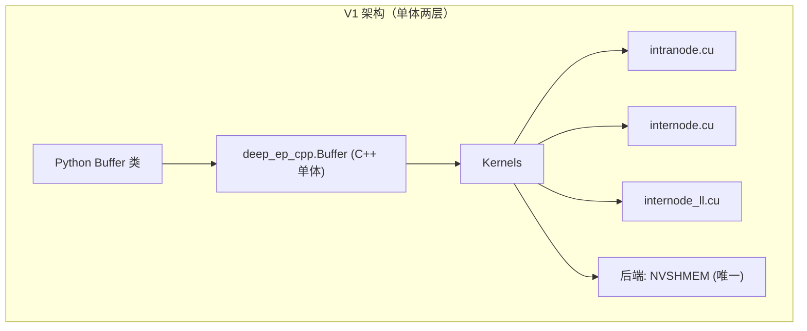

### 4.2 V2 架构总览

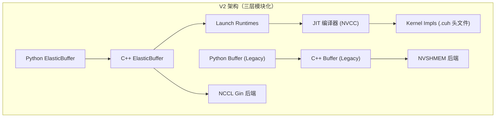

### 4.3 V1 高吞吐 Intranode Dispatch → Combine 流程

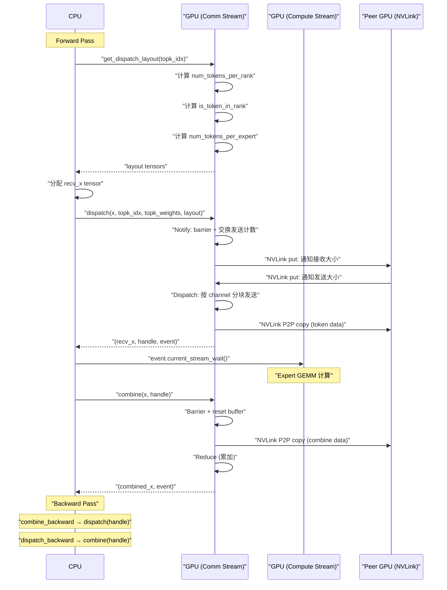

### 4.4 V1 低延迟 Hook 重叠流程

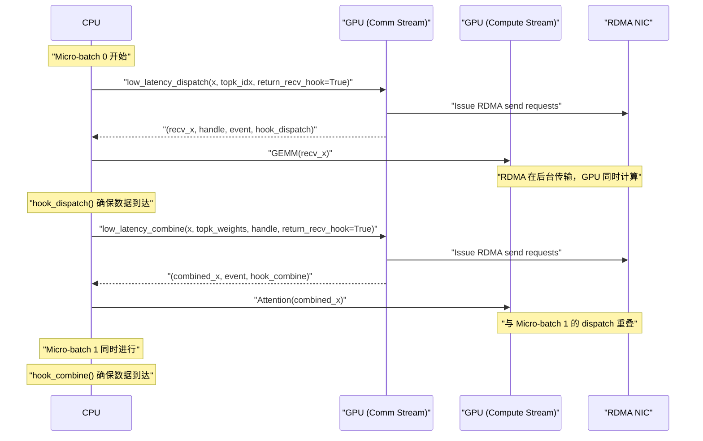

### 4.5 V2 JIT 编译与内核启动流程

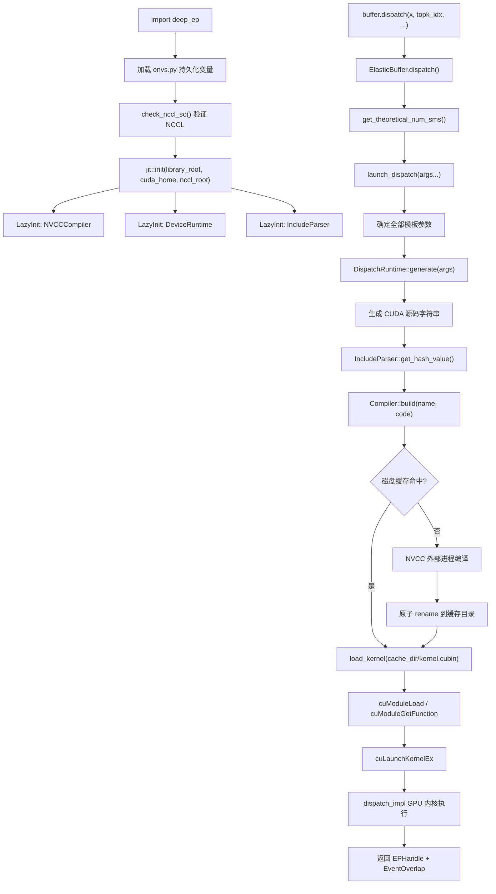

### 4.6 V2 Dispatch 内核执行流程

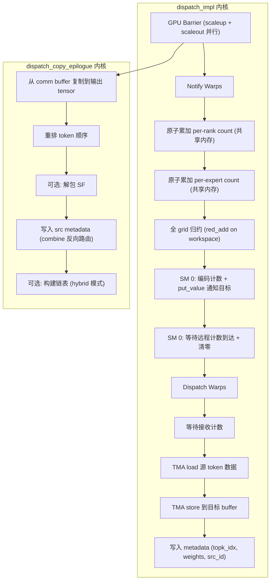

### 4.7 V2 Hybrid Dispatch 多节点数据流

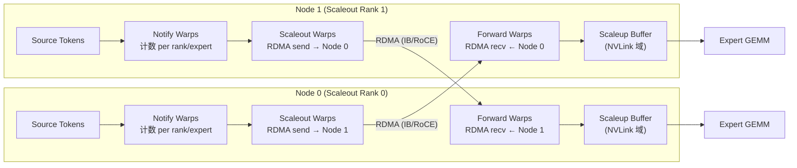

### 4.8 V2 Combine 执行流程

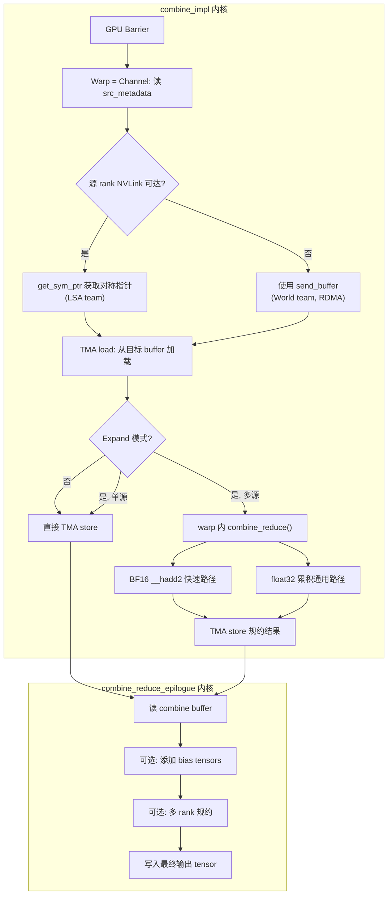

### 4.9 V2 Elastic Buffer 初始化调用链

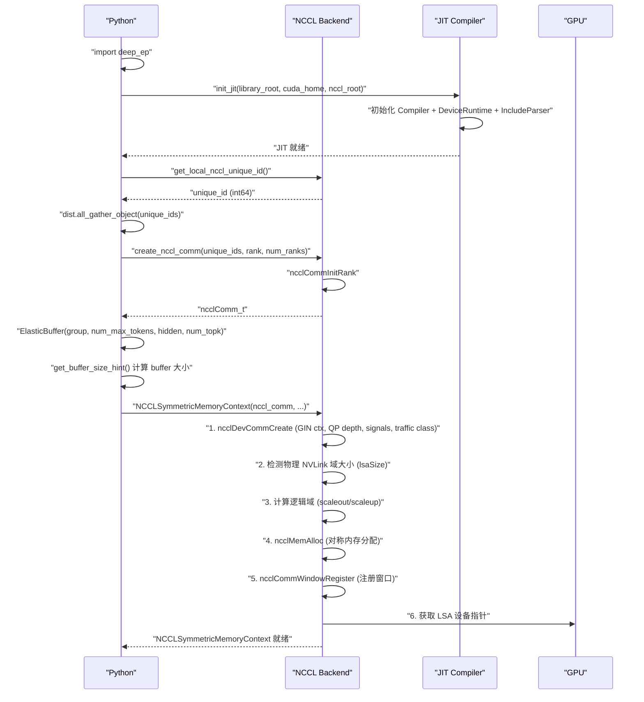

### 4.10 V2 Engram 远程内存获取流程

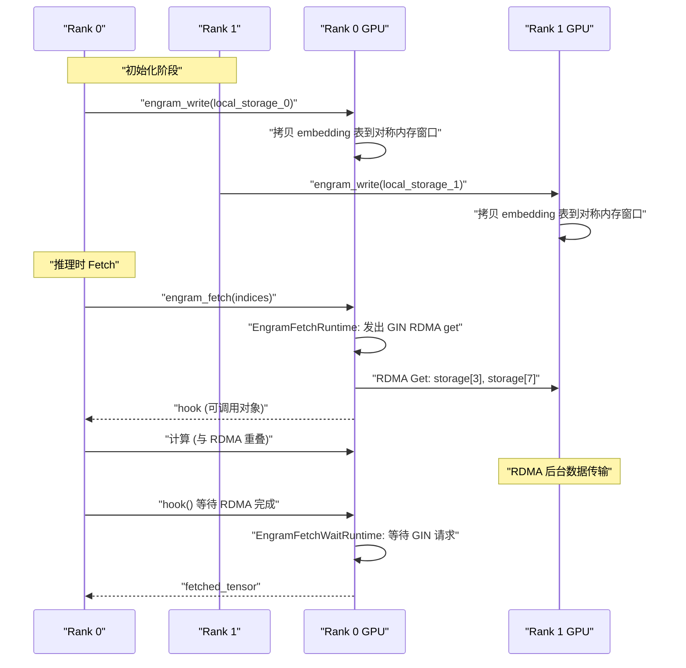

### 4.11 V1 vs V2 同步流程对比

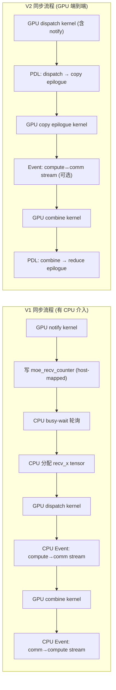

---

## <a id="part5"></a>第五部分：功能对比总表

| 功能特性 | V1 | V2 Legacy | V2 Elastic |
|---|---|---|---|
| **节点内 Dispatch/Combine** | ✓ (NVLink IPC) | ✓ (NVLink IPC) | ✓ (NCCL LSA + TMA) |
| **节点间 Dispatch/Combine** | ✓ (NVSHMEM IBGDA) | ✓ (NVSHMEM IBGDA) | ✓ (NCCL Gin) |
| **低延迟模式** | ✓ (IBGDA) | ✓ (IBGDA) | ✓ (统一到 Direct/Hybrid) |
| **FP8 Dispatch** | ✓ (per-token scale) | ✓ (per-token scale) | ✓ (+ UE8M0 packing) |
| **BF16 Combine** | ✓ | ✓ | ✓ |
| **LogFMT Combine** | ✓ (低延迟) | ✓ (低延迟) | ✗ (待移植) |
| **通信-计算重叠** | ✓ (EventOverlap) | ✓ (EventOverlap) | ✓ (+ PDL) |
| **Hook 重叠 (0-SM)** | ✓ (低延迟) | ✓ (低延迟) | ✓ (Engram, PP) |
| **CUDA Graph 兼容** | 部分 (intranode + `num_worst_tokens`) | 同 V1 | ✓ (无 CPU sync 路径) |
| **确定性 Dispatch** | ✗ | ✗ | ✓ (Deterministic Prologue) |
| **扩展 (Expand) 模式** | ✗ | ✗ | ✓ |
| **弹性容错** | 部分 (shrink mode) | 部分 (shrink mode) | ✓ (内建) |
| **JIT 编译** | ✗ | ✗ | ✓ |
| **分析式 SM 计算** | ✗ | ✗ | ✓ (无需 auto-tune) |
| **GPU Barrier** | 内置 kernel 中 | 内置 kernel 中 | ✓ (独立 JIT 内核) |
| **Engram (远程 Embedding)** | ✗ | ✗ | ✓ |
| **PP Send/Recv** | ✗ | ✗ | ✓ |
| **AGRS (批量 All-Gather)** | ✗ | ✗ | ✓ |
| **TMA 数据搬移** | ✗ (仅 LD/ST) | ✗ (仅 LD/ST) | ✓ (SM90+) |
| **SM100 优化** | ✗ | ✗ | ✓ (`add.rn.f32.bf16`) |
| **最大 EP 规模** | 160 | 160 | 1024 |
| **SM 使用 (V3 training)** | ~24 SMs | ~24 SMs | 分析式计算 (≈4-10，取决于带宽) |
| **NCCL 依赖** | ✗ | ✗ | ✓ (≥ 2.30.4) |
| **NVSHMEM 依赖** | ✓ (internode/LL) | ✓ (internode/LL) | ✗ (仅 Legacy) |

---

## <a id="part6"></a>第六部分：总结与迁移建议

### V1 (main) 核心特点

1. **成熟稳定**: 经过 DeepSeek-V3/R1 大规模生产验证，性能数据确凿
2. **简单直接**: 两层架构，代码量小 (39 个文件)，适合快速理解和修改
3. **NVSHMEM 强依赖**: 节点间和低延迟模式深度绑定 NVSHMEM
4. **需要 Auto-tuning**: 性能调优需要手动/自动搜索最优 Config (chunk 大小)
5. **预编译限制**: 内核变体在安装时确定，缺乏运行时灵活性 (hidden size 等需硬编码)

### V2 (epv2-release) 核心特点

1. **架构先进**: JIT 编译 + NCCL Gin + 分析式参数计算，消除 auto-tuning 和手工预设
2. **统一接口**: ElasticBuffer 统一了高吞吐和低延迟模式，单一缓冲区设计减少显存碎片
3. **模块化清晰**: backend → elastic → Python 的分层设计，便于扩展新后端/新原语
4. **扩展性强**: 支持 EP 1024 + 2048 专家总数，内置 Engram、PP、AGRS 等实验性原语
5. **SM 效率高**: V3-like 训练场景通过分析式带宽模型自动计算最优 SM 数，释放更多 SM 给 GEMM 计算
6. **向后兼容**: 完整保留 V1 Legacy API，已有代码可无缝运行
7. **双后端并存**: Legacy (NVSHMEM) 和 Elastic (NCCL Gin) 独立可用，渐进迁移

### 迁移建议

| 场景 | 建议 |
|---|---|
| **新项目** | 优先使用 V2 Elastic API |
| **已有 V1 代码** | 先使用 V2 Legacy API 验证，逐步切换到 Elastic |
| **仅节点内** | V1 和 V2 均可，V2 SM 效率更高 |
| **多节点训练** | V2 Hybrid 模式提供更好的 scaleout 效率 |
| **推理解码** | V2 Elastic 统一接口更简洁，V1 低延迟 Hook 也可继续使用 |
| **需要 NCCL ≥ 2.30.4 不可用** | 只能使用 V1 或 V2 Legacy |
| **需要 CUDA < 12.3** | 只能使用 V1 |
| **首次 JIT 延迟** | 可通过预热调用或预设缓存 (分发 `.cubin` 文件) 缓解 |

### V2 新增依赖

- NCCL ≥ 2.30.4
- CUDA ≥ 12.3 (SM90 特性)
- `fmt` (header-only, 通过 git submodule)
- PyTorch ≥ 2.10+ (推测)
- NVSHMEM (仅 V2 Legacy 需要)
