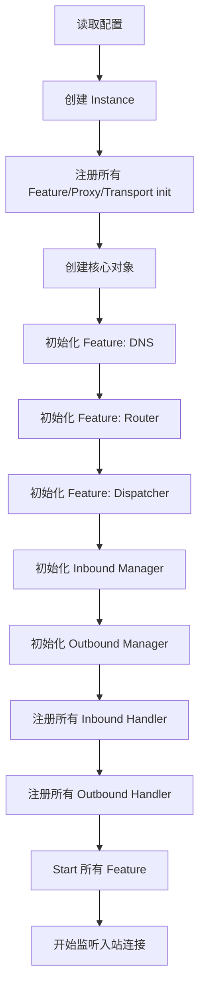
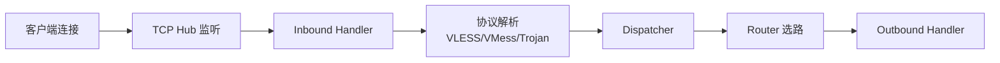
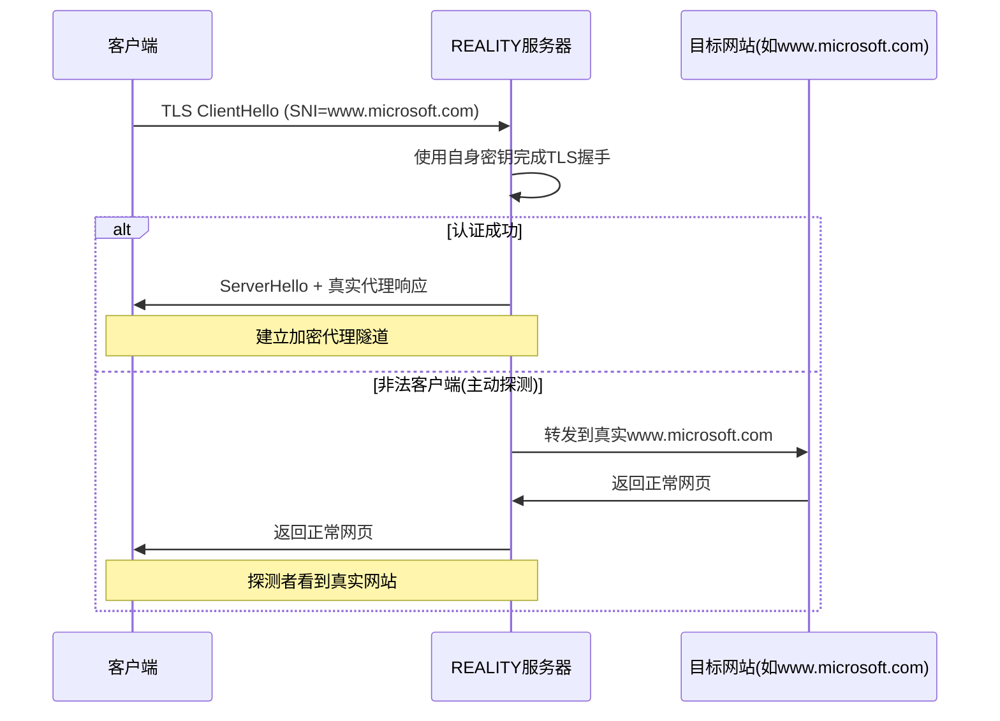
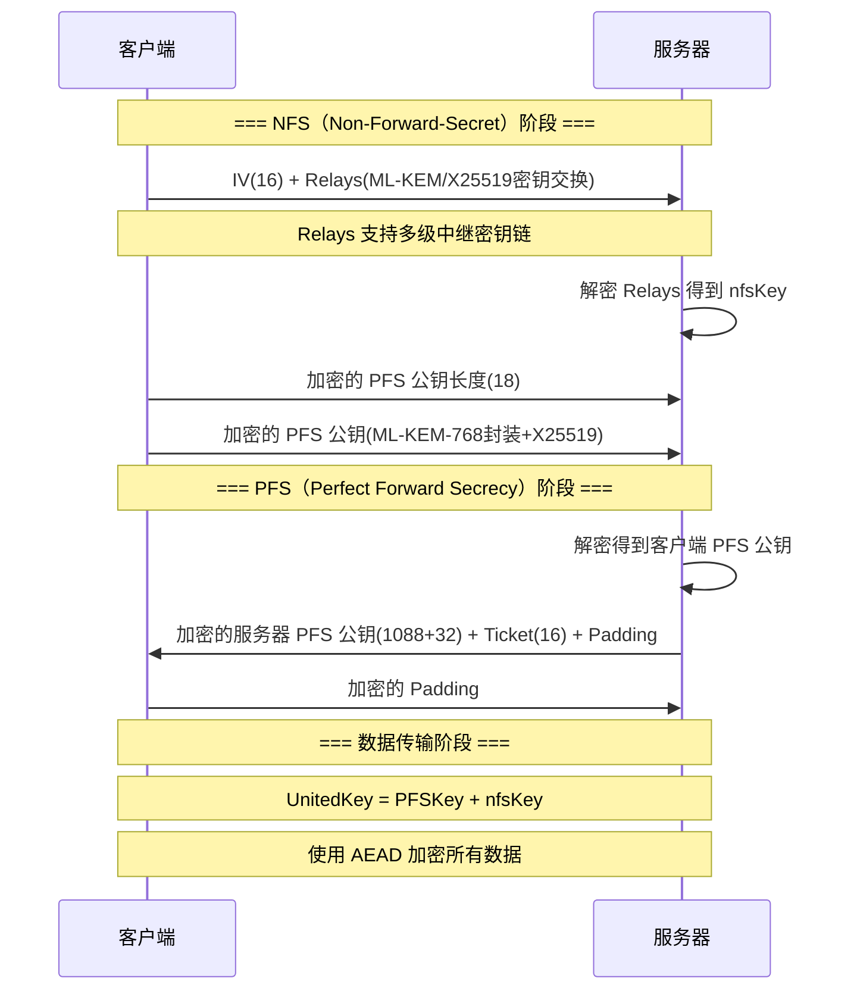
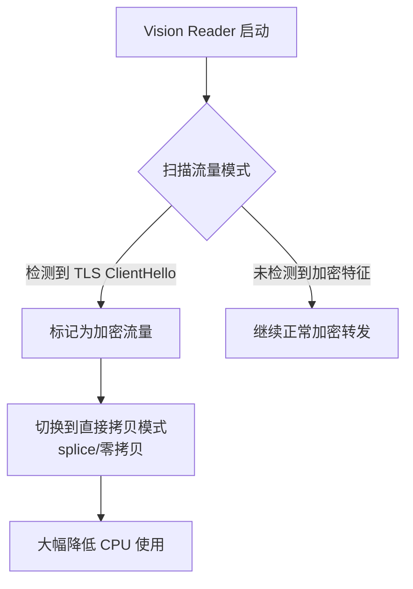
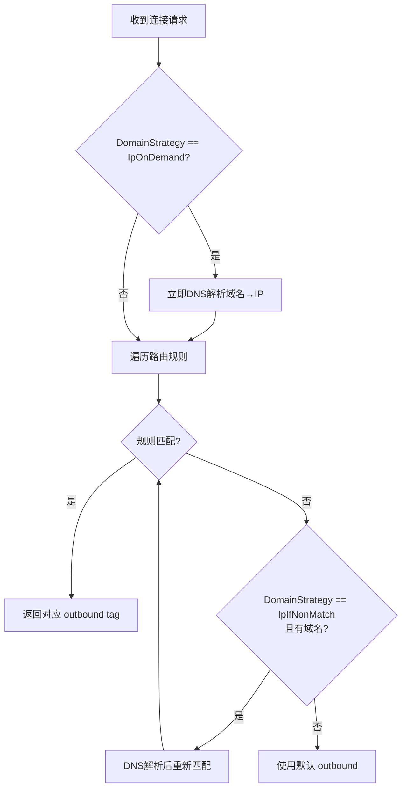
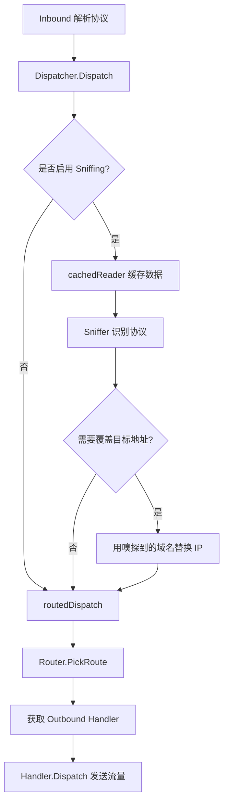
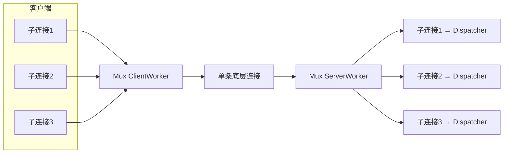
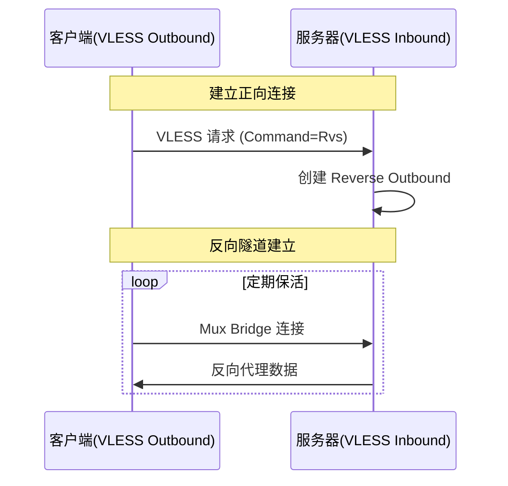
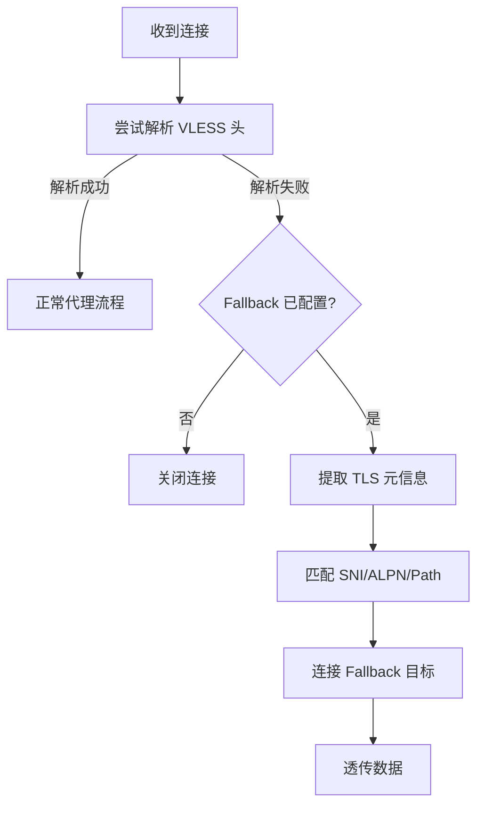

# Xray-Core 深度技术文档

> 基于 Xray-Core 源码分析，涵盖核心架构、协议实现、传输层、路由分发、加解密机制及其设计权衡。

---

## 目录

1. [项目概述与设计初衷](#1-项目概述与设计初衷)
2. [整体架构](#2-整体架构)
3. [核心启动流程](#3-核心启动流程)
4. [Feature 系统与依赖注入](#4-feature-系统与依赖注入)
5. [入站代理管理 (Inbound Proxy Manager)](#5-入站代理管理)
6. [出站代理管理 (Outbound Proxy Manager)](#6-出站代理管理)
7. [协议实现](#7-协议实现)
   - 7.1 [VLESS](#71-vless)
   - 7.2 [VMess](#72-vmess)
   - 7.3 [Trojan](#73-trojan)
   - 7.4 [Shadowsocks](#74-shadowsocks)
   - 7.5 [其他协议](#75-其他协议)
8. [传输层](#8-传输层)
   - 8.1 [传输层抽象](#81-传输层抽象)
   - 8.2 [TLS / uTLS](#82-tls--utls)
   - 8.3 [REALITY](#83-reality)
   - 8.4 [其他传输协议](#84-其他传输协议)
9. [VLESS Encryption（ML-KEM-768 后量子加密层）](#9-vless-encryptionml-kem-768-后量子加密层)
10. [XTLS Vision 流控](#10-xtls-vision-流控)
11. [路由系统](#11-路由系统)
12. [Dispatcher 与流量嗅探](#12-dispatcher-与流量嗅探)
13. [多路复用 (Mux)](#13-多路复用-mux)
14. [DNS 系统](#14-dns-系统)
15. [反向代理](#15-反向代理)
16. [缓冲与 Pipe 系统](#16-缓冲与-pipe-系统)
17. [Policy 与统计系统](#17-policy-与统计系统)
18. [流量整编与 Fallback 机制](#18-流量整编与-fallback-机制)
19. [设计权衡与评价](#19-设计权衡与评价)
20. [总结](#20-总结)

---

## 1. 项目概述与设计初衷

Xray-Core 是从 V2Ray 项目 fork 而来的网络代理平台，其核心设计目标是：

- **抗审查（Anti-censorship）**：在高度审查的网络环境中提供稳定、隐蔽的代理通道
- **协议无关的转发平台**：不绑定任何单一代理协议，而是提供一个可插拔的代理框架
- **性能优先**：通过零拷贝（splice）、流式处理等手段降低转发延迟和 CPU 开销
- **灵活的路由控制**：支持基于域名、IP、协议类型等多维度路由规则

Xray 相对于 V2Ray 的主要演进方向：
1. 引入 VLESS 协议（比 VMess 更轻量）
2. 引入 XTLS Vision 流控（减少不必要的双重加密）
3. 引入 REALITY 传输层（替代 XTLS Direct，无需域名和证书）
4. 引入后量子密钥交换（ML-KEM-768 / X25519 混合 KEM）

---

## 2. 整体架构

Xray-Core 采用**分层架构**，从上到下为：

```
┌─────────────────────────────────────────────────┐
│                  配置层 (Config)                │
├─────────────────────────────────────────────────┤
│            Feature 系统 (Features)              │
│  ┌──────┐ ┌──────┐ ┌────────┐ ┌─────┐ ┌──────┐  │
│  │ DNS  │ │Router│ │Dispatch│ │Stats│ │Policy│  │
│  └──────┘ └──────┘ └────────┘ └─────┘ └──────┘  │
├─────────────────────────────────────────────────┤
│            代理协议层 (Proxy)                   │
│  ┌─────┐ ┌─────┐ ┌───────┐ ┌─────┐ ┌─────────┐  │
│  │VLESS│ │VMess│ │Trojan │ │ SS  │ │Freedom  │  │
│  └─────┘ └─────┘ └───────┘ └─────┘ └─────────┘  │
├─────────────────────────────────────────────────┤
│            传输层 (Transport)                   │
│  ┌───┐ ┌─────┐ ┌──────┐ ┌───┐ ┌───────────────┐ │
│  │TCP│ │ WS  │ │gRPC  │ │KCP│ │HTTP/2(SplitHTTP)│ 
│  └───┘ └─────┘ └──────┘ └───┘ └───────────────┘ │
├─────────────────────────────────────────────────┤
│         安全层 (TLS/REALITY/Encryption)         │
│  ┌──────────┐ ┌───────┐ ┌─────────────────────┐ │
│  │TLS/uTLS  │ │REALITY│ │ML-KEM Encryption    │ │
│  └──────────┘ └───────┘ └─────────────────────┘ │
└─────────────────────────────────────────────────┘
```

### 核心目录结构

| 目录 | 职责 |
|------|------|
| `core/` | 核心启动、实例管理、配置解析 |
| `features/` | Feature 接口定义（Router、DNS、Dispatcher 等） |
| `app/` | Feature 实现（router、dns、dispatcher、proxyman 等） |
| `proxy/` | 代理协议实现（vless、vmess、trojan 等） |
| `transport/` | 传输层实现（internet 子目录含各种传输协议） |
| `common/` | 公共库（buf、mux、protocol、session 等） |

---

## 3. 核心启动流程

启动入口在 `core/xray.go`，核心实例通过 `New()` 函数创建：



关键代码路径：
1. `core.New(config)` → 创建 `Instance`
2. `Instance.init()` → 通过 `common.RegisterConfig` 已注册的工厂函数创建各个 Feature
3. 每个 Feature 通过 `core.RequireFeatures()` 声明依赖，确保初始化顺序
4. `Instance.Start()` → 启动所有 Feature 和 Inbound Handler

```go
// core/xray.go - 简化的启动逻辑
func New(config *Config) (*Instance, error) {
    inst := &Instance{}
    // 遍历所有已注册的配置类型，创建对应的 Feature
    for _, appConfig := range config.App {
        // 通过 common.CreateObject 创建
    }
    // 创建 inbound/outbound handler
    for _, inboundConfig := range config.Inbound {
        // 创建 InboundHandler
    }
    return inst, nil
}
```

---

## 4. Feature 系统与依赖注入

Xray 使用一套**基于接口的依赖注入系统**：

- `features/` 目录定义了所有 Feature 接口（如 `routing.Router`、`dns.Client`、`routing.Dispatcher`）
- `common.RegisterConfig()` 将 protobuf 配置类型注册到全局工厂表
- `core.RequireFeatures()` 在运行时从 `Instance` 中提取已注册的 Feature 实现

```go
// 典型模式：构造函数中声明依赖
func New(ctx context.Context, config *Config) (*Router, error) {
    r := new(Router)
    core.RequireFeatures(ctx, func(d dns.Client, ohm outbound.Manager, dispatcher routing.Dispatcher) error {
        return r.Init(ctx, config, d, ohm, dispatcher)
    })
    return r, nil
}
```

**设计意图**：避免硬编码依赖关系，各 Feature 通过接口交互，便于替换实现（如用自定义 Router 替代默认 Router）。

---

## 5. 入站代理管理

入站管理由 `app/proxyman/inbound/` 负责：

1. 监听本地端口（TCP/UDP/Unix Socket）
2. 接受新连接后，将连接交给对应协议的 Inbound Handler
3. Inbound Handler 解析协议头部，提取目标地址
4. 调用 Dispatcher 进行路由分发



TCP 监听通过 `transport/internet/tcp_hub.go` 实现，使用注册表模式支持不同传输协议的监听器：

```go
var transportListenerCache = make(map[string]ListenFunc)

func ListenTCP(ctx context.Context, address net.Address, port net.Port, 
    settings *MemoryStreamConfig, handler ConnHandler) (Listener, error) {
    protocol := settings.ProtocolName
    listenFunc := transportListenerCache[protocol]
    // ...
}
```

---

## 6. 出站代理管理

出站管理由 `app/proxyman/outbound/` 负责：

- `Manager` 维护所有 Outbound Handler 的注册表
- 第一个注册的 Handler 自动成为默认 Handler
- 支持通过 tag 查找特定 Handler
- `Select()` 方法支持前缀匹配（用于 Balancer）

```go
type Manager struct {
    defaultHandler   outbound.Handler
    taggedHandler    map[string]outbound.Handler
    untaggedHandlers []outbound.Handler
}
```

内置出站协议：
- **Freedom**：直连出站，直接连接目标
- **Blackhole**：丢弃所有流量
- **Loopback**：将流量回送到入站
- **DNS**：DNS 出站
- 各种代理协议的 outbound（VLESS、VMess 等）

---

## 7. 协议实现

### 7.1 VLESS

VLESS 是 Xray 的核心协议，设计理念是**极简**——去掉 VMess 中不必要的加密层（当外层已有 TLS 时），仅保留认证和寻址功能。

#### 协议格式

**请求头（Client → Server）**：

```
+------ +---------------------+----------+---------+----------+
| 1 字节 |      16 字节        |  变长    | 1 字节  |   变长   |
| Version|      UUID           | Addons   | Command | Address  |
+-------+---------------------+----------+---------+----------+
```

- **Version**: 固定为 `0`
- **UUID**: 用户标识，16 字节
- **Addons**: 包含 Flow（流控方式）等扩展字段
- **Command**: `TCP=1`, `UDP=2`, `Mux=3`, `Rvs=4`（反向代理）
- **Address**: 目标地址（IPv4/IPv6/域名 + 端口）

**响应头（Server → Client）**：

```
+-------+----------+
| 1 字节 |  变长    |
| Version| Addons   |
+-------+----------+
```

响应头极简——只有版本号和 Addons。

#### 认证机制

使用 UUID 作为用户 ID，通过 `MemoryValidator` 进行验证：

```go
func (v *MemoryValidator) Get(id [16]byte) *protocol.MemoryUser {
    // 直接在内存 map 中查找 UUID
}
```

**关键设计**：VLESS 本身不做加密，安全性完全依赖外层传输（TLS/REALITY/Encryption）。这是有意的——避免"加密套加密"的性能浪费。

#### Fallback 机制

VLESS Inbound 支持 Fallback——当协议头解析失败时（可能是探测流量或非代理流量），将连接转发到预设的后端：

```
name → alpn → path → Fallback 目标
```

三级匹配：
1. **name**: TLS SNI 中的 ServerName
2. **alpn**: ALPN 协商结果
3. **path**: HTTP 请求路径

这使得 VLESS 端口可以同时服务代理和普通 HTTPS 网站，有效对抗主动探测。

### 7.2 VMess

VMess 是 V2Ray 的原创协议，比 VLESS 复杂得多：

#### 加密体系

VMess 使用 **AEAD（Authenticated Encryption with Associated Data）** 保护头部：

```go
// vmess/aead/encrypt.go
func SealVMessAEADHeader(key [16]byte, data []byte) []byte {
    // 使用 AES-128-GCM 或 ChaCha20-Poly1305
    // 基于用户 ID 的 CmdKey 派生加密密钥
}
```

头部加密流程：
1. 生成随机 requestBodyKey（16字节）和 requestBodyIV（16字节）
2. 通过 SHA-256 派生 responseBodyKey/IV
3. 使用 AEAD 加密封装整个请求头
4. 请求体使用对应的安全层加密（AES-128-GCM / ChaCha20-Poly1305 / None / AES-128-CFB / Zero）

#### 与 VLESS 的对比

| 特性 | VMess | VLESS |
|------|-------|-------|
| 头部加密 | AEAD（必要） | 无（依赖外层 TLS） |
| UUID 传输 | 加密 | 明文（在 TLS 隧道内） |
| 性能 | 较低（双重加密） | 较高 |
| 抗重放 | 内置（AEAD nonce） | 依赖外层 |
| 灵活性 | 较低 | 高（Flow、Encryption 扩展） |

### 7.3 Trojan

Trojan 协议极为简单：

```
+------------------+---------+--------+--------+
| SHA224(password) | CRLF    | Command| Address|
+------------------+---------+--------+--------+
```

- 使用密码的 SHA-224 哈希作为认证
- 完全依赖外层 TLS 安全性
- 与 VLESS 类似的设计哲学

### 7.4 Shadowsocks

支持传统 Shadowsocks 和 Shadowsocks 2022（`shadowsocks_2022/`），后者使用了更现代的密码学。

### 7.5 其他协议

- **Socks**：SOCKS4/4a/5 协议
- **HTTP**：HTTP 代理
- **Dokodemo-door**：任意门，透明代理入口
- **TUN**：网络层隧道
- **WireGuard**：WireGuard VPN 协议
- **Hysteria**：基于 QUIC 的高速协议

---

## 8. 传输层

### 8.1 传输层抽象

Xray 的传输层采用**可插拔设计**：

```go
// 注册传输监听器和拨号器
transportListenerCache[protocol] = ListenFunc
transportDialerCache[protocol] = DialFunc
```

支持的传输协议（`transport/internet/` 下的子目录）：

| 传输协议 | 描述 |
|----------|------|
| `tcp` | 原始 TCP |
| `websocket` | WebSocket 隧道 |
| `grpc` | gRPC 流 |
| `kcp` | UDP 上的可靠传输 |
| `httpupgrade` | HTTP Upgrade 隧道 |
| `splithttp` | HTTP/2 分片流 |
| `hysteria` | 基于 QUIC |
| `browser_dialer` | 通过浏览器拨号 |

### 8.2 TLS / uTLS

`transport/internet/tls/` 提供标准 TLS 和 uTLS 支持：

- **标准 TLS**：使用 Go 标准库 `crypto/tls`
- **uTLS**：使用 `refraction-networking/utls`，模拟浏览器的 TLS 指纹（ClientHello）

```go
// tls.go
type Conn struct {
    *tls.Conn  // 包装标准 TLS 连接
}
type UConn struct {
    *utls.UConn // 包装 uTLS 连接
}
```

uTLS 的目的是使代理流量的 TLS 指纹与真实浏览器一致，对抗基于指纹的审查。

### 8.3 REALITY

REALITY 是 Xray 的标志性创新，位于 `transport/internet/reality/`：

#### 设计目标

无需拥有域名和 TLS 证书，即可创建看起来像正常 HTTPS 网站的代理服务器。

#### 工作原理



#### 认证机制

客户端验证服务器的方式：
1. **HMAC-SHA512 验证**：使用预共享的 AuthKey 对服务器证书公钥进行 HMAC，若匹配证书中的签名字段，则认证通过
2. **ML-DSA-65 签名**（可选）：使用后量子数字签名验证 ServerHello 和 ClientHello 的完整性

```go
// reality.go - VerifyPeerCertificate
func (c *UConn) VerifyPeerCertificate(rawCerts [][]byte, ...) error {
    certs := /* 反射获取 peerCertificates */
    pub := certs[0].PublicKey.(ed25519.PublicKey)
    h := hmac.New(sha512.New, c.AuthKey)
    h.Write(pub)
    if bytes.Equal(h.Sum(nil), certs[0].Signature) {
        // 可选: ML-DSA-65 验证
        if len(c.Config.Mldsa65Verify) > 0 {
            // 验证 Hello 消息的签名
        }
        c.Verified = true
        return nil
    }
    // 回退到标准证书验证
}
```

**关键设计**：REALITY 服务器不需要拥有合法证书。它使用自签名的 Ed25519 证书，通过 HMAC 将预共享密钥"嵌入"证书签名字段。合法客户端可以验证，而探测者只能看到证书链无效。

### 8.4 其他传输协议

- **WebSocket**：将代理流量封装在 WebSocket 帧中，可通过 CDN
- **gRPC**：利用 HTTP/2 流承载代理数据，同样支持 CDN
- **SplitHTTP**：将数据分片通过 HTTP/2 发送，更灵活的流量模式
- **KCP**：基于 UDP 的可靠传输，低延迟但容易暴露

---

## 9. VLESS Encryption（ML-KEM-768 后量子加密层）

这是 Xray 最新的创新之一，位于 `proxy/vless/encryption/`，为 VLESS 协议添加了一个独立于外层 TLS 的加密层。

### 设计动机

即使外层使用了 TLS，在某些场景下（如使用 REALITY 或 TLS 被 MitM 的情况），额外的加密层可以：
1. 提供后量子安全性（ML-KEM-768）
2. 即使 TLS 被破解，流量仍然安全
3. 提供端到端加密（不信任中间节点）

### 密钥交换流程



### Relays 链式密钥交换

支持多级密钥中继（Relay），允许流量经过多个节点，每个节点只能解密属于自己的密钥交换部分：

```
客户端 → [Relay1: X25519] → [Relay2: ML-KEM-768] → 最终服务器
```

每一级使用前一级派生的密钥加密后一级的验证信息（hash32），确保链式关系的完整性。

### 0-RTT 恢复

服务器在首次握手后签发 Ticket（含过期时间），客户端可在有效期内发送 0-RTT 数据：

```go
// server.go - 0-RTT 处理
if length == 32 {
    ticket := nfsAEAD.Open(nil, nil, encryptedTicket, nil)
    session := i.Sessions[ticket]
    // 防重放检查
    if _, loaded := session.NfsKeys.LoadOrStore(nfsKey, true); loaded {
        return nil, errors.New("replay detected")
    }
    // 使用缓存的 PFS 密钥
    c.UnitedKey = append(session.PfsKey, nfsKey...)
}
```

### AEAD 与密钥轮换

使用 AES-128-GCM 或 ChaCha20-Poly1305（根据硬件 AES 支持自动选择）：

```go
func NewAEAD(ctx, key []byte, useAES bool) *AEAD {
    k := make([]byte, 32)
    blake3.DeriveKey(k, string(ctx), key) // BLAKE3 密钥派生
    // 选择算法
    if useAES {
        cipher.NewGCM(aes.NewCipher(k))
    } else {
        chacha20poly1305.New(k)
    }
}
```

每条记录使用递增的 Nonce，当 Nonce 达到最大值时自动轮换密钥。

### XorConn（流量混淆）

`XorConn` 使用 AES-CTR 对传输数据进行 XOR 混淆，**不是加密**，目的是消除 AEAD 记录头的固定模式（`17 03 03` 开头），使流量看起来更像随机数据：

```go
// xor.go
type XorConn struct {
    net.Conn
    CTR     cipher.Stream  // 出站 XOR 流
    PeerCTR cipher.Stream  // 入站 XOR 流
}

func (c *XorConn) Write(b []byte) (int, error) {
    // 跳过已知的 TLS 记录头，XOR 数据部分
    // 使得 0x17 0x03 0x03 头部被混淆
}
```

### Padding（流量填充）

支持可配置的流量填充参数，通过随机长度的填充数据消除流量模式：

```
padding参数格式: "概率-最小长度-最大长度.概率-间隔最小-间隔最大..."
```

填充数据以分片方式发送，配合随机间隔，创造多变的流量模式。

---

## 10. XTLS Vision 流控

XTLS Vision（`xtls-rprx-vision`）是 Xray 的标志性优化，核心思想：**当内层流量本身已经是加密的（如 HTTPS），外层不需要再加密一遍**。

### 工作原理



### 实现细节

Vision 通过 `unsafe.Pointer` 直接访问 Go TLS 内部结构体：

```go
// 获取底层 TLS 连接的 input/rawInput 缓冲区
var t reflect.Type
var p uintptr
if tlsConn, ok := iConn.(*tls.Conn); ok {
    t = reflect.TypeOf(tlsConn.Conn).Elem()
    p = uintptr(unsafe.Pointer(tlsConn.Conn))
}
i, _ := t.FieldByName("input")
r, _ := t.FieldByName("rawInput")
input = (*bytes.Reader)(unsafe.Pointer(p + i.Offset))
rawInput = (*bytes.Buffer)(unsafe.Pointer(p + r.Offset))
```

**为什么需要 unsafe？** 因为需要在 TLS 解密之前读取原始字节流，以判断内层流量是否已经是 TLS 加密的。Go 标准库没有暴露这些内部字段。

### Splice 零拷贝

当 Vision 确认内层流量已加密时，直接在内核层面进行 TCP splice：

```go
func CopyRawConnIfExist(ctx context.Context, src net.Conn, dst net.Conn, ...) error {
    // 使用 syscall splice 实现零拷贝
    // 从入站连接直接拷贝到出站连接，无需经过用户态加解密
}
```

### 限制

- 仅支持 TLS 1.3 外层（因为需要特定的内部结构）
- 仅支持 TCP 流量（不含 UDP）
- 使用 `unsafe.Pointer` 访问私有字段，Go 版本升级可能导致兼容性问题

---

## 11. 路由系统

路由系统位于 `app/router/`，是 Xray 流量分发的核心决策模块。

### 路由匹配流程



### 规则类型

路由规则支持多种匹配条件（`condition.go`）：

- **DomainMatcher**：域名匹配（精确、子域名、正则、子串），使用最小完美哈希（MPH）加速
- **IPMatcher**：CIDR IP 匹配
- **PortMatcher**：端口范围匹配
- **NetworkMatcher**：网络类型（TCP/UDP）
- **UserMatcher**：用户邮箱匹配
- **InboundTagMatcher**：入站标签匹配
- **ProtocolMatcher**：协议类型匹配
- **AttributeMatcher**：属性匹配

### Balancer

支持负载均衡，通过 `BalancingRule` 定义，可选用不同的选择策略（如随机、最小连接数、observatory 等）。

### 动态规则管理

支持运行时增删路由规则（通过 API）：

```go
func (r *Router) AddRule(config *serial.TypedMessage, shouldAppend bool) error
func (r *Router) RemoveRule(tag string) error
```

---

## 12. Dispatcher 与流量嗅探

Dispatcher（`app/dispatcher/`）是连接 Inbound 和 Outbound 的桥梁。

### 核心流程



### 流量嗅探（Sniffing）

Sniffer 可以从连接的初始数据中识别协议和域名：

| 嗅探器 | 协议 | 网络 |
|--------|------|------|
| HTTP Sniffer | HTTP | TCP |
| TLS Sniffer | TLS ClientHello | TCP |
| BitTorrent Sniffer | BitTorrent | TCP |
| QUIC Sniffer | QUIC | UDP |
| FakeDNS Sniffer | FakeDNS | TCP/UDP |

**工作流程**：
1. 使用 `cachedReader` 缓存前几字节
2. 依次尝试各嗅探器
3. 成功识别后，可**将目标 IP 替换为真实域名**（用于基于域名的路由规则）
4. `MetadataOnly` 模式仅使用连接元数据（如 FakeDNS 映射），不读取数据

```go
func sniffer(ctx context.Context, cReader *cachedReader, ...) (SniffResult, error) {
    // 最多尝试 2 次读取，每次最多 200ms
    cacheDeadline := 200 * time.Millisecond
    totalAttempt := 0
    for {
        err := cReader.Cache(payload, cacheDeadline)
        result, err := sniffer.Sniff(ctx, payload.Bytes(), network)
        // ...
    }
}
```

### FakeDNS 集成

当使用 FakeDNS 时，DNS 查询返回虚假 IP，Sniffer 可以将虚假 IP 映射回真实域名：

```go
if fkr0.IsIPInIPPool(ob.Target.Address) {
    isFakeIP = true
    // 使用真实域名替代虚假 IP 进行路由
}
```

---

## 13. 多路复用 (Mux)

Mux（`common/mux/`）允许在单条连接上承载多个子连接。

### 架构



### 帧协议

Mux 使用自定义帧协议：
- **Session ID**：标识子连接
- **Status**：打开/关闭/数据
- **数据帧**：承载实际数据

### XUDP 集成

当 VLESS 使用 Vision 流控且需要 UDP 时，将 UDP 封装为 XUDP（`common/xudp/`）通过 Mux 传输：

```go
// vless outbound - UDP over XUDP over Mux
if request.Command == protocol.RequestCommandUDP && (requestAddons.Flow == vless.XRV || h.cone) {
    request.Command = protocol.RequestCommandMux
    request.Address = net.DomainAddress("v1.mux.cool")
    request.Port = net.Port(666)
}
```

---

## 14. DNS 系统

DNS 模块（`app/dns/`）是一个内置的 DNS 中继服务器。

### 功能特性

- **多 DNS 服务器**：支持配置多个上游 DNS，按域名分派
- **域名匹配**：使用 MPH（最小完美哈希）加速域名规则匹配
- **静态 Hosts**：本地域名-IP 映射
- **查询策略**：`UseIP`、`UseIPv4`、`UseIPv6`
- **缓存**：可选的 DNS 结果缓存
- **并行查询**：可同时向多个 DNS 服务器查询

### FakeDNS

FakeDNS 模块分配虚假 IP 地址，通过 Sniffer 在 Dispatcher 中映射回真实域名。这使得所有连接都经过域名路由，即使客户端直接使用 IP 连接。

---

## 15. 反向代理

VLESS 支持反向代理功能，允许服务器端主动连接客户端。

### 工作流程



客户端的 `Reverse.monitor()` 定期创建 Mux 桥接连接，服务器通过这些桥接向客户端发送反向流量。

---

## 16. 缓冲与 Pipe 系统

### Pipe

`transport/pipe/` 实现了带背压的内存管道，连接 Inbound 和 Outbound：

```go
func New(opts ...Option) (*Reader, *Writer) {
    p := &pipe{
        readSignal:  signal.NewNotifier(),
        writeSignal: signal.NewNotifier(),
        done:        done.New(),
    }
    return &Reader{pipe: p}, &Writer{pipe: p}
}
```

- 支持大小限制（背压）
- 支持溢出丢弃
- 使用 `sync.Cond` 风格的通知机制

### Buffer

`common/buf/` 提供高效的缓冲区管理：
- 固定大小缓冲区（默认 4KB/8KB）
- `MultiBuffer` 支持批量操作
- 池化分配减少 GC 压力

---

## 17. Policy 与统计系统

### Policy

Policy（`features/policy/`）定义了连接级别的行为限制：
- **超时**：握手超时、连接空闲超时、上下行超时
- **缓冲**：每连接缓冲大小
- **统计**：是否启用流量统计

### 统计系统

支持以下统计指标：
- 用户级上行/下行流量计数器
- 用户在线 IP 数

```go
if p.Stats.UserUplink {
    name := "user>>>" + user.Email + ">>>traffic>>>uplink"
    counter, _ := stats.GetOrRegisterCounter(d.stats, name)
    inboundLink.Writer = &SizeStatWriter{Counter: counter, Writer: inboundLink.Writer}
}
```

---

## 18. 流量整编与 Fallback 机制

### Fallback 工作流程



### PROXY Protocol 支持

Fallback 支持发送 PROXY Protocol（v1/v2）头，将客户端真实 IP 传递给后端：

```go
switch fb.Xver {
case 1:
    // PROXY TCP4/TC6 realIP localIP realPort localPort\r\n
case 2:
    // 二进制 PROXY Protocol v2
}
```

---

## 19. 设计权衡与评价

### 优秀的方面

1. **模块化架构**：Feature 系统实现了真正的松耦合，每个组件都可以独立替换
2. **VLESS + REALITY**：革命性的组合，无需域名和证书即可部署安全代理，大幅降低部署门槛
3. **XTLS Vision**：精准地解决了"加密套加密"的性能浪费问题，在保持安全性的同时显著提升性能
4. **后量子安全**：ML-KEM-768 + X25519 混合 KEM 提供前瞻性安全保障
5. **Fallback 机制**：有效对抗主动探测，使代理端口看起来像正常 HTTPS 服务
6. **流量嗅探**：从连接数据中提取真实域名，使基于域名的路由更准确

### 设计上的妥协

1. **unsafe.Pointer 的使用**：Vision 通过反射和 unsafe 访问 TLS 内部字段，这是对 Go ABI 的依赖，增加了维护成本和版本升级风险
   - 权衡：性能收益巨大（splice 零拷贝），值得这个代价
   - 评价：注释中已经标注了 `// xtls only supports TLS and REALITY directly for now`，说明作者清楚这个限制

2. **VLESS 明文 UUID**：UUID 在 TLS 隧道内明文传输
   - 权衡：TLS 已经提供了加密，不需要重复加密
   - 风险：如果 TLS 被 MitM，UUID 会暴露
   - 缓解：ML-KEM Encryption 层提供了额外的加密保护

3. **配置复杂度**：由于支持大量协议、传输、路由组合，配置文件非常复杂
   - 权衡：灵活性的必然代价
   - 评价：社区工具（如 X-UI）帮助缓解了这个问题

4. **0-RTT 重放风险**：Encryption 层的 0-RTT 恢复存在理论上的重放攻击风险
   - 缓解：使用 `NfsKeys` map 进行防重放检查
   - 评价：缓解措施合理，但 0-RTT 的安全模型本质上弱于 1-RTT

5. **XorConn 不是加密**：XorConn 仅做 XOR 混淆，不提供加密
   - 设计意图：消除 AEAD 记录头的固定模式，不是安全层
   - 评价：在 Encryption 层已经提供 AEAD 加密的前提下，XorConn 的定位合理

6. **代码耦合**：部分协议实现（如 VLESS Inbound）中的 `Process()` 方法非常长（~300行），包含了 Fallback、Vision、Encryption、Mux 等多个关注点
   - 评价：虽然功能正确，但可读性和可维护性受到影响

### 架构评价

Xray-Core 的架构在以下方面表现优秀：
- **关注点分离**：传输层、协议层、路由层之间有清晰的接口边界
- **可扩展性**：新增协议或传输只需实现对应接口并注册
- **性能**：从 Buffer 池化到 Vision 零拷贝，处处体现性能意识

不足之处：
- **错误处理不一致**：有些地方使用 `errors.New().Base().AtInfo()` 链式风格，有些直接返回 Go 标准错误
- **测试覆盖率**：部分核心路径缺少单元测试
- **文档不足**：代码注释较少，很多设计意图需要从代码中推断

---

## 20. 总结

Xray-Core 是一个设计精良的网络代理平台，其核心创新——VLESS + REALITY + XTLS Vision + ML-KEM Encryption 的组合——代表了当前抗审查代理技术的最前沿。项目在安全性和性能之间取得了良好的平衡，通过分层设计实现了高度的灵活性。

主要技术亮点：
1. **REALITY**：无需域名/证书的 TLS 伪装，从根本上改变了代理部署模式
2. **XTLS Vision**：识别并跳过冗余加密，实现接近原生的转发性能
3. **ML-KEM-768 Encryption**：为代理协议引入后量子安全的额外加密层
4. **流量嗅探 + FakeDNS**：使得基于域名的路由在所有场景下都能工作
5. **链式中继密钥交换**：支持多级代理拓扑中的端到端安全

这些创新使 Xray-Core 在网络审查对抗领域保持了技术领先地位。

---

*文档生成时间：2026-04-06*
*分析模型：GLM-5.1*
*基于 Xray-Core 源码（/root/workspace/Xray-core）*
